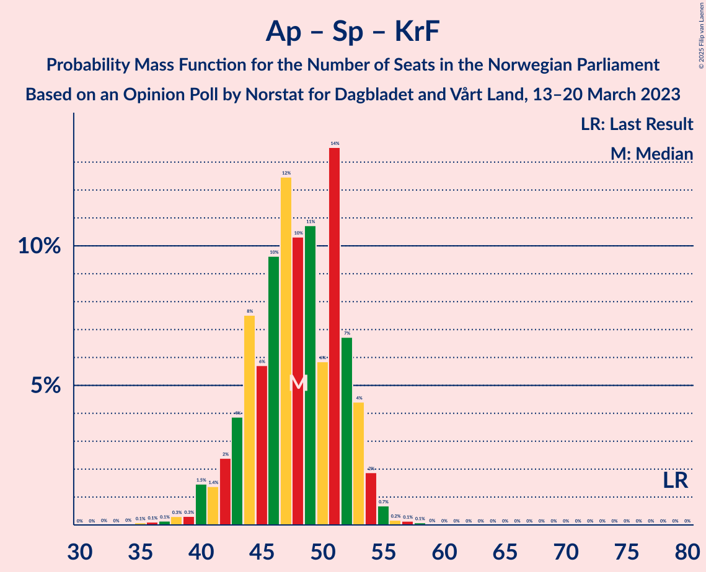

# Opinion Poll by Norstat for Dagbladet and Vårt Land, 13–20 March 2023

<a href="#voting-intentions">Voting Intentions</a> | <a href="#seats">Seats</a> | <a href="#coalitions">Coalitions</a> | <a href="#technical-information">Technical Information</a>

## Voting Intentions

### Confidence Intervals

| Party | Last Result | Poll Result | 80% Confidence Interval | 90% Confidence Interval | 95% Confidence Interval | 99% Confidence Interval |
|:-----:|:-----------:|:-----------:|:-----------------------:|:-----------------------:|:-----------------------:|:-----------------------:|
| Høyre | 20.4% | 34.6% | 32.7–36.6% |32.2–37.2% |31.7–37.6% |30.8–38.6% |
| Arbeiderpartiet | 26.2% | 17.0% | 15.5–18.6% |15.1–19.1% |14.8–19.5% |14.1–20.3% |
| Fremskrittspartiet | 11.6% | 11.4% | 10.2–12.8% |9.9–13.2% |9.6–13.6% |9.0–14.3% |
| Sosialistisk Venstreparti | 7.6% | 10.2% | 9.1–11.6% |8.7–11.9% |8.5–12.3% |8.0–12.9% |
| Rødt | 4.7% | 6.3% | 5.4–7.4% |5.1–7.7% |4.9–8.0% |4.5–8.5% |
| Senterpartiet | 13.5% | 5.5% | 4.6–6.5% |4.4–6.8% |4.2–7.1% |3.8–7.6% |
| Venstre | 4.6% | 5.0% | 4.2–6.0% |3.9–6.2% |3.8–6.5% |3.4–7.0% |
| Kristelig Folkeparti | 3.8% | 4.0% | 3.3–5.0% |3.2–5.2% |3.0–5.5% |2.7–5.9% |
| Miljøpartiet De Grønne | 3.9% | 2.9% | 2.3–3.7% |2.2–4.0% |2.0–4.2% |1.8–4.6% |

*Note:* The poll result column reflects the actual value used in the calculations. Published results may vary slightly, and in addition be rounded to fewer digits.

## Seats

### Confidence Intervals

| Party | Last Result | Median | 80% Confidence Interval | 90% Confidence Interval | 95% Confidence Interval | 99% Confidence Interval |
|:-----:|:-----------:|:------:|:-----------------------:|:-----------------------:|:-----------------------:|:-----------------------:|
| <a href="#høyre">Høyre</a> | 36 | 62 | 58–66 |56–67 |55–68 |53–70 |
| <a href="#arbeiderpartiet">Arbeiderpartiet</a> | 48 | 33 | 31–35 |30–36 |29–37 |26–39 |
| <a href="#fremskrittspartiet">Fremskrittspartiet</a> | 21 | 19 | 17–23 |17–23 |17–24 |16–27 |
| <a href="#sosialistisk-venstreparti">Sosialistisk Venstreparti</a> | 13 | 17 | 15–20 |14–21 |14–21 |13–23 |
| <a href="#rødt">Rødt</a> | 8 | 11 | 9–12 |8–13 |8–14 |7–15 |
| <a href="#senterpartiet">Senterpartiet</a> | 28 | 10 | 8–12 |7–12 |7–12 |0–14 |
| <a href="#venstre">Venstre</a> | 8 | 8 | 7–10 |3–11 |2–11 |2–12 |
| <a href="#kristelig-folkeparti">Kristelig Folkeparti</a> | 3 | 7 | 2–8 |2–9 |2–9 |1–10 |
| <a href="#miljøpartiet-de-grønne">Miljøpartiet De Grønne</a> | 3 | 1 | 1–2 |1–3 |1–7 |0–8 |

### Høyre

*For a full overview of the results for this party, see the [Høyre](party-høyre.html) page.*

| Number of Seats | Probability | Accumulated | Special Marks |
|:---------------:|:-----------:|:-----------:|:-------------:|
| 36 | 0% | 100% | Last Result |
| 37 | 0% | 100% |  |
| 38 | 0% | 100% |  |
| 39 | 0% | 100% |  |
| 40 | 0% | 100% |  |
| 41 | 0% | 100% |  |
| 42 | 0% | 100% |  |
| 43 | 0% | 100% |  |
| 44 | 0% | 100% |  |
| 45 | 0% | 100% |  |
| 46 | 0% | 100% |  |
| 47 | 0% | 100% |  |
| 48 | 0% | 100% |  |
| 49 | 0% | 100% |  |
| 50 | 0% | 100% |  |
| 51 | 0% | 100% |  |
| 52 | 0.1% | 99.9% |  |
| 53 | 0.5% | 99.8% |  |
| 54 | 1.0% | 99.3% |  |
| 55 | 2% | 98% |  |
| 56 | 3% | 97% |  |
| 57 | 3% | 93% |  |
| 58 | 4% | 90% |  |
| 59 | 10% | 87% |  |
| 60 | 12% | 77% |  |
| 61 | 12% | 65% |  |
| 62 | 19% | 53% | Median |
| 63 | 8% | 34% |  |
| 64 | 7% | 26% |  |
| 65 | 8% | 19% |  |
| 66 | 4% | 11% |  |
| 67 | 2% | 7% |  |
| 68 | 3% | 5% |  |
| 69 | 0.8% | 2% |  |
| 70 | 0.6% | 1.0% |  |
| 71 | 0.2% | 0.4% |  |
| 72 | 0.1% | 0.1% |  |
| 73 | 0.1% | 0.1% |  |
| 74 | 0% | 0% |  |

### Arbeiderpartiet

*For a full overview of the results for this party, see the [Arbeiderpartiet](party-arbeiderpartiet.html) page.*

| Number of Seats | Probability | Accumulated | Special Marks |
|:---------------:|:-----------:|:-----------:|:-------------:|
| 24 | 0.1% | 100% |  |
| 25 | 0.2% | 99.9% |  |
| 26 | 0.3% | 99.7% |  |
| 27 | 1.0% | 99.4% |  |
| 28 | 0.7% | 98% |  |
| 29 | 1.2% | 98% |  |
| 30 | 4% | 97% |  |
| 31 | 7% | 92% |  |
| 32 | 11% | 85% |  |
| 33 | 47% | 74% | Median |
| 34 | 15% | 27% |  |
| 35 | 5% | 12% |  |
| 36 | 3% | 7% |  |
| 37 | 2% | 3% |  |
| 38 | 0.9% | 2% |  |
| 39 | 0.4% | 0.7% |  |
| 40 | 0.1% | 0.3% |  |
| 41 | 0.1% | 0.2% |  |
| 42 | 0.1% | 0.1% |  |
| 43 | 0% | 0% |  |
| 44 | 0% | 0% |  |
| 45 | 0% | 0% |  |
| 46 | 0% | 0% |  |
| 47 | 0% | 0% |  |
| 48 | 0% | 0% | Last Result |

### Fremskrittspartiet

*For a full overview of the results for this party, see the [Fremskrittspartiet](party-fremskrittspartiet.html) page.*

| Number of Seats | Probability | Accumulated | Special Marks |
|:---------------:|:-----------:|:-----------:|:-------------:|
| 14 | 0.1% | 100% |  |
| 15 | 0.4% | 99.9% |  |
| 16 | 0.7% | 99.5% |  |
| 17 | 12% | 98.9% |  |
| 18 | 20% | 87% |  |
| 19 | 22% | 67% | Median |
| 20 | 13% | 45% |  |
| 21 | 11% | 32% | Last Result |
| 22 | 10% | 21% |  |
| 23 | 7% | 11% |  |
| 24 | 3% | 5% |  |
| 25 | 0.8% | 2% |  |
| 26 | 0.4% | 1.0% |  |
| 27 | 0.2% | 0.6% |  |
| 28 | 0.3% | 0.4% |  |
| 29 | 0.1% | 0.1% |  |
| 30 | 0% | 0% |  |

### Sosialistisk Venstreparti

*For a full overview of the results for this party, see the [Sosialistisk Venstreparti](party-sosialistiskvenstreparti.html) page.*

| Number of Seats | Probability | Accumulated | Special Marks |
|:---------------:|:-----------:|:-----------:|:-------------:|
| 12 | 0.2% | 100% |  |
| 13 | 1.5% | 99.7% | Last Result |
| 14 | 4% | 98% |  |
| 15 | 11% | 94% |  |
| 16 | 11% | 82% |  |
| 17 | 24% | 72% | Median |
| 18 | 16% | 48% |  |
| 19 | 16% | 32% |  |
| 20 | 9% | 15% |  |
| 21 | 4% | 6% |  |
| 22 | 2% | 2% |  |
| 23 | 0.5% | 0.6% |  |
| 24 | 0.1% | 0.2% |  |
| 25 | 0% | 0% |  |

### Rødt

*For a full overview of the results for this party, see the [Rødt](party-rødt.html) page.*

| Number of Seats | Probability | Accumulated | Special Marks |
|:---------------:|:-----------:|:-----------:|:-------------:|
| 6 | 0.1% | 100% |  |
| 7 | 0.9% | 99.9% |  |
| 8 | 5% | 99.0% | Last Result |
| 9 | 15% | 94% |  |
| 10 | 19% | 79% |  |
| 11 | 30% | 60% | Median |
| 12 | 21% | 30% |  |
| 13 | 6% | 9% |  |
| 14 | 2% | 3% |  |
| 15 | 0.4% | 0.6% |  |
| 16 | 0.1% | 0.1% |  |
| 17 | 0% | 0% |  |

### Senterpartiet

*For a full overview of the results for this party, see the [Senterpartiet](party-senterpartiet.html) page.*

| Number of Seats | Probability | Accumulated | Special Marks |
|:---------------:|:-----------:|:-----------:|:-------------:|
| 0 | 0.9% | 100% |  |
| 1 | 0.3% | 99.1% |  |
| 2 | 0.1% | 98.7% |  |
| 3 | 0% | 98.6% |  |
| 4 | 0% | 98.6% |  |
| 5 | 0% | 98.6% |  |
| 6 | 0.5% | 98.6% |  |
| 7 | 6% | 98% |  |
| 8 | 23% | 92% |  |
| 9 | 19% | 69% |  |
| 10 | 24% | 50% | Median |
| 11 | 15% | 26% |  |
| 12 | 8% | 11% |  |
| 13 | 1.3% | 2% |  |
| 14 | 1.0% | 1.2% |  |
| 15 | 0.1% | 0.2% |  |
| 16 | 0% | 0% |  |
| 17 | 0% | 0% |  |
| 18 | 0% | 0% |  |
| 19 | 0% | 0% |  |
| 20 | 0% | 0% |  |
| 21 | 0% | 0% |  |
| 22 | 0% | 0% |  |
| 23 | 0% | 0% |  |
| 24 | 0% | 0% |  |
| 25 | 0% | 0% |  |
| 26 | 0% | 0% |  |
| 27 | 0% | 0% |  |
| 28 | 0% | 0% | Last Result |

### Venstre

*For a full overview of the results for this party, see the [Venstre](party-venstre.html) page.*

| Number of Seats | Probability | Accumulated | Special Marks |
|:---------------:|:-----------:|:-----------:|:-------------:|
| 2 | 3% | 100% |  |
| 3 | 4% | 97% |  |
| 4 | 0% | 93% |  |
| 5 | 0% | 93% |  |
| 6 | 0.5% | 93% |  |
| 7 | 12% | 92% |  |
| 8 | 34% | 80% | Last Result, Median |
| 9 | 27% | 46% |  |
| 10 | 14% | 20% |  |
| 11 | 5% | 6% |  |
| 12 | 1.0% | 1.3% |  |
| 13 | 0.2% | 0.3% |  |
| 14 | 0% | 0% |  |

### Kristelig Folkeparti

*For a full overview of the results for this party, see the [Kristelig Folkeparti](party-kristeligfolkeparti.html) page.*

| Number of Seats | Probability | Accumulated | Special Marks |
|:---------------:|:-----------:|:-----------:|:-------------:|
| 1 | 2% | 100% |  |
| 2 | 19% | 98% |  |
| 3 | 22% | 79% | Last Result |
| 4 | 0% | 58% |  |
| 5 | 0% | 58% |  |
| 6 | 3% | 58% |  |
| 7 | 21% | 54% | Median |
| 8 | 24% | 33% |  |
| 9 | 8% | 9% |  |
| 10 | 2% | 2% |  |
| 11 | 0.2% | 0.2% |  |
| 12 | 0% | 0% |  |

### Miljøpartiet De Grønne

*For a full overview of the results for this party, see the [Miljøpartiet De Grønne](party-miljøpartietdegrønne.html) page.*

| Number of Seats | Probability | Accumulated | Special Marks |
|:---------------:|:-----------:|:-----------:|:-------------:|
| 0 | 0.6% | 100% |  |
| 1 | 58% | 99.4% | Median |
| 2 | 36% | 42% |  |
| 3 | 0.9% | 5% | Last Result |
| 4 | 0% | 4% |  |
| 5 | 0% | 4% |  |
| 6 | 0.5% | 4% |  |
| 7 | 3% | 4% |  |
| 8 | 0.5% | 0.5% |  |
| 9 | 0.1% | 0.1% |  |
| 10 | 0% | 0% |  |

## Coalitions

### Confidence Intervals

| Coalition | Last Result | Median | Majority? | 80% Confidence Interval | 90% Confidence Interval | 95% Confidence Interval | 99% Confidence Interval |
|:---------:|:-----------:|:------:|:---------:|:-----------------------:|:-----------------------:|:-----------------------:|:-----------------------:|
| Høyre – Fremskrittspartiet – Senterpartiet – Venstre – Kristelig Folkeparti | 96 | 105 | 100% | 101–109 | 99–110 | 98–111 | 96–112 |
| Høyre – Fremskrittspartiet – Venstre – Kristelig Folkeparti – Miljøpartiet De Grønne | 71 | 96 | 100% | 93–101 | 92–102 | 91–103 | 88–106 |
| Høyre – Fremskrittspartiet – Venstre – Kristelig Folkeparti | 68 | 95 | 99.8% | 91–99 | 90–101 | 89–102 | 86–104 |
| Høyre – Fremskrittspartiet – Venstre | 65 | 90 | 93% | 85–94 | 84–96 | 83–97 | 81–99 |
| Høyre – Fremskrittspartiet | 57 | 81 | 17% | 77–86 | 76–87 | 75–88 | 73–91 |
| Høyre – Venstre – Kristelig Folkeparti | 47 | 76 | 0.8% | 70–80 | 70–81 | 68–83 | 66–85 |
| Arbeiderpartiet – Sosialistisk Venstreparti – Rødt – Senterpartiet – Miljøpartiet De Grønne | 100 | 72 | 0% | 68–77 | 66–78 | 65–78 | 63–81 |
| Arbeiderpartiet – Sosialistisk Venstreparti – Rødt – Senterpartiet | 97 | 70 | 0% | 66–75 | 65–76 | 64–77 | 61–79 |
| Arbeiderpartiet – Sosialistisk Venstreparti – Senterpartiet – Kristelig Folkeparti – Miljøpartiet De Grønne | 95 | 67 | 0% | 62–71 | 61–72 | 60–73 | 58–75 |
| Arbeiderpartiet – Sosialistisk Venstreparti – Rødt – Miljøpartiet De Grønne | 72 | 63 | 0% | 59–67 | 58–68 | 57–69 | 55–71 |
| Arbeiderpartiet – Sosialistisk Venstreparti – Senterpartiet – Miljøpartiet De Grønne | 92 | 62 | 0% | 57–65 | 57–66 | 55–67 | 53–69 |
| Arbeiderpartiet – Sosialistisk Venstreparti – Senterpartiet | 89 | 60 | 0% | 56–63 | 55–64 | 54–65 | 51–67 |
| Arbeiderpartiet – Sosialistisk Venstreparti | 61 | 51 | 0% | 47–53 | 46–54 | 46–55 | 43–57 |
| Arbeiderpartiet – Senterpartiet – Kristelig Folkeparti – Miljøpartiet De Grønne | 82 | 50 | 0% | 45–54 | 44–55 | 42–55 | 40–58 |
| Arbeiderpartiet – Senterpartiet – Kristelig Folkeparti | 79 | 48 | 0% | 43–52 | 42–53 | 41–54 | 38–55 |
| Arbeiderpartiet – Senterpartiet | 76 | 43 | 0% | 40–45 | 38–46 | 37–46 | 33–48 |
| Senterpartiet – Venstre – Kristelig Folkeparti | 39 | 23 | 0% | 19–27 | 17–28 | 16–29 | 13–31 |

### Høyre – Fremskrittspartiet – Senterpartiet – Venstre – Kristelig Folkeparti

| Number of Seats | Probability | Accumulated | Special Marks |
|:---------------:|:-----------:|:-----------:|:-------------:|
| 92 | 0% | 100% |  |
| 93 | 0.1% | 99.9% |  |
| 94 | 0.1% | 99.8% |  |
| 95 | 0.2% | 99.7% |  |
| 96 | 0.4% | 99.5% | Last Result |
| 97 | 0.7% | 99.1% |  |
| 98 | 2% | 98% |  |
| 99 | 2% | 96% |  |
| 100 | 3% | 94% |  |
| 101 | 8% | 90% |  |
| 102 | 7% | 82% |  |
| 103 | 12% | 75% |  |
| 104 | 11% | 63% |  |
| 105 | 17% | 52% |  |
| 106 | 10% | 35% | Median |
| 107 | 10% | 26% |  |
| 108 | 5% | 16% |  |
| 109 | 5% | 11% |  |
| 110 | 2% | 5% |  |
| 111 | 2% | 3% |  |
| 112 | 0.7% | 1.1% |  |
| 113 | 0.2% | 0.5% |  |
| 114 | 0.1% | 0.2% |  |
| 115 | 0.1% | 0.1% |  |
| 116 | 0% | 0% |  |

### Høyre – Fremskrittspartiet – Venstre – Kristelig Folkeparti – Miljøpartiet De Grønne

| Number of Seats | Probability | Accumulated | Special Marks |
|:---------------:|:-----------:|:-----------:|:-------------:|
| 71 | 0% | 100% | Last Result |
| 72 | 0% | 100% |  |
| 73 | 0% | 100% |  |
| 74 | 0% | 100% |  |
| 75 | 0% | 100% |  |
| 76 | 0% | 100% |  |
| 77 | 0% | 100% |  |
| 78 | 0% | 100% |  |
| 79 | 0% | 100% |  |
| 80 | 0% | 100% |  |
| 81 | 0% | 100% |  |
| 82 | 0% | 100% |  |
| 83 | 0% | 100% |  |
| 84 | 0% | 100% |  |
| 85 | 0.1% | 100% | Majority |
| 86 | 0.1% | 99.9% |  |
| 87 | 0.2% | 99.8% |  |
| 88 | 0.4% | 99.6% |  |
| 89 | 0.4% | 99.2% |  |
| 90 | 1.1% | 98.8% |  |
| 91 | 2% | 98% |  |
| 92 | 4% | 95% |  |
| 93 | 7% | 91% |  |
| 94 | 9% | 84% |  |
| 95 | 11% | 74% |  |
| 96 | 14% | 63% |  |
| 97 | 7% | 49% | Median |
| 98 | 16% | 42% |  |
| 99 | 8% | 26% |  |
| 100 | 6% | 18% |  |
| 101 | 4% | 12% |  |
| 102 | 3% | 8% |  |
| 103 | 2% | 5% |  |
| 104 | 1.0% | 2% |  |
| 105 | 0.7% | 1.5% |  |
| 106 | 0.5% | 0.8% |  |
| 107 | 0.2% | 0.3% |  |
| 108 | 0.1% | 0.1% |  |
| 109 | 0% | 0.1% |  |
| 110 | 0% | 0% |  |

### Høyre – Fremskrittspartiet – Venstre – Kristelig Folkeparti

| Number of Seats | Probability | Accumulated | Special Marks |
|:---------------:|:-----------:|:-----------:|:-------------:|
| 68 | 0% | 100% | Last Result |
| 69 | 0% | 100% |  |
| 70 | 0% | 100% |  |
| 71 | 0% | 100% |  |
| 72 | 0% | 100% |  |
| 73 | 0% | 100% |  |
| 74 | 0% | 100% |  |
| 75 | 0% | 100% |  |
| 76 | 0% | 100% |  |
| 77 | 0% | 100% |  |
| 78 | 0% | 100% |  |
| 79 | 0% | 100% |  |
| 80 | 0% | 100% |  |
| 81 | 0% | 100% |  |
| 82 | 0% | 100% |  |
| 83 | 0% | 100% |  |
| 84 | 0.2% | 99.9% |  |
| 85 | 0.1% | 99.8% | Majority |
| 86 | 0.4% | 99.6% |  |
| 87 | 0.6% | 99.2% |  |
| 88 | 0.7% | 98.7% |  |
| 89 | 2% | 98% |  |
| 90 | 3% | 96% |  |
| 91 | 8% | 93% |  |
| 92 | 9% | 85% |  |
| 93 | 9% | 76% |  |
| 94 | 10% | 67% |  |
| 95 | 12% | 57% |  |
| 96 | 7% | 44% | Median |
| 97 | 17% | 37% |  |
| 98 | 7% | 21% |  |
| 99 | 6% | 14% |  |
| 100 | 3% | 8% |  |
| 101 | 2% | 6% |  |
| 102 | 2% | 3% |  |
| 103 | 0.8% | 2% |  |
| 104 | 0.5% | 1.0% |  |
| 105 | 0.3% | 0.5% |  |
| 106 | 0.1% | 0.1% |  |
| 107 | 0% | 0.1% |  |
| 108 | 0% | 0% |  |

### Høyre – Fremskrittspartiet – Venstre

| Number of Seats | Probability | Accumulated | Special Marks |
|:---------------:|:-----------:|:-----------:|:-------------:|
| 65 | 0% | 100% | Last Result |
| 66 | 0% | 100% |  |
| 67 | 0% | 100% |  |
| 68 | 0% | 100% |  |
| 69 | 0% | 100% |  |
| 70 | 0% | 100% |  |
| 71 | 0% | 100% |  |
| 72 | 0% | 100% |  |
| 73 | 0% | 100% |  |
| 74 | 0% | 100% |  |
| 75 | 0% | 100% |  |
| 76 | 0% | 100% |  |
| 77 | 0% | 100% |  |
| 78 | 0% | 100% |  |
| 79 | 0.1% | 100% |  |
| 80 | 0.2% | 99.9% |  |
| 81 | 0.7% | 99.7% |  |
| 82 | 0.6% | 99.0% |  |
| 83 | 2% | 98% |  |
| 84 | 3% | 96% |  |
| 85 | 4% | 93% | Majority |
| 86 | 8% | 90% |  |
| 87 | 9% | 82% |  |
| 88 | 8% | 73% |  |
| 89 | 13% | 64% | Median |
| 90 | 16% | 51% |  |
| 91 | 9% | 35% |  |
| 92 | 8% | 26% |  |
| 93 | 5% | 18% |  |
| 94 | 4% | 13% |  |
| 95 | 3% | 8% |  |
| 96 | 3% | 5% |  |
| 97 | 1.1% | 3% |  |
| 98 | 0.6% | 1.5% |  |
| 99 | 0.5% | 0.8% |  |
| 100 | 0.1% | 0.3% |  |
| 101 | 0.1% | 0.2% |  |
| 102 | 0% | 0.1% |  |
| 103 | 0% | 0% |  |

### Høyre – Fremskrittspartiet

| Number of Seats | Probability | Accumulated | Special Marks |
|:---------------:|:-----------:|:-----------:|:-------------:|
| 57 | 0% | 100% | Last Result |
| 58 | 0% | 100% |  |
| 59 | 0% | 100% |  |
| 60 | 0% | 100% |  |
| 61 | 0% | 100% |  |
| 62 | 0% | 100% |  |
| 63 | 0% | 100% |  |
| 64 | 0% | 100% |  |
| 65 | 0% | 100% |  |
| 66 | 0% | 100% |  |
| 67 | 0% | 100% |  |
| 68 | 0% | 100% |  |
| 69 | 0% | 100% |  |
| 70 | 0% | 100% |  |
| 71 | 0.1% | 100% |  |
| 72 | 0.1% | 99.9% |  |
| 73 | 0.4% | 99.8% |  |
| 74 | 0.7% | 99.4% |  |
| 75 | 3% | 98.7% |  |
| 76 | 2% | 96% |  |
| 77 | 6% | 94% |  |
| 78 | 7% | 88% |  |
| 79 | 10% | 81% |  |
| 80 | 9% | 71% |  |
| 81 | 21% | 62% | Median |
| 82 | 9% | 41% |  |
| 83 | 7% | 33% |  |
| 84 | 8% | 26% |  |
| 85 | 6% | 17% | Majority |
| 86 | 5% | 11% |  |
| 87 | 2% | 6% |  |
| 88 | 2% | 5% |  |
| 89 | 1.2% | 2% |  |
| 90 | 0.4% | 1.3% |  |
| 91 | 0.7% | 0.8% |  |
| 92 | 0.1% | 0.1% |  |
| 93 | 0% | 0.1% |  |
| 94 | 0% | 0% |  |

### Høyre – Venstre – Kristelig Folkeparti

| Number of Seats | Probability | Accumulated | Special Marks |
|:---------------:|:-----------:|:-----------:|:-------------:|
| 47 | 0% | 100% | Last Result |
| 48 | 0% | 100% |  |
| 49 | 0% | 100% |  |
| 50 | 0% | 100% |  |
| 51 | 0% | 100% |  |
| 52 | 0% | 100% |  |
| 53 | 0% | 100% |  |
| 54 | 0% | 100% |  |
| 55 | 0% | 100% |  |
| 56 | 0% | 100% |  |
| 57 | 0% | 100% |  |
| 58 | 0% | 100% |  |
| 59 | 0% | 100% |  |
| 60 | 0% | 100% |  |
| 61 | 0% | 100% |  |
| 62 | 0% | 100% |  |
| 63 | 0.1% | 100% |  |
| 64 | 0.1% | 99.9% |  |
| 65 | 0.1% | 99.8% |  |
| 66 | 0.6% | 99.7% |  |
| 67 | 0.9% | 99.1% |  |
| 68 | 1.2% | 98% |  |
| 69 | 2% | 97% |  |
| 70 | 6% | 95% |  |
| 71 | 9% | 90% |  |
| 72 | 6% | 81% |  |
| 73 | 7% | 75% |  |
| 74 | 7% | 68% |  |
| 75 | 8% | 60% |  |
| 76 | 11% | 53% |  |
| 77 | 11% | 42% | Median |
| 78 | 14% | 31% |  |
| 79 | 5% | 17% |  |
| 80 | 4% | 12% |  |
| 81 | 4% | 8% |  |
| 82 | 1.2% | 4% |  |
| 83 | 1.4% | 3% |  |
| 84 | 0.4% | 1.2% |  |
| 85 | 0.5% | 0.8% | Majority |
| 86 | 0.1% | 0.3% |  |
| 87 | 0.1% | 0.2% |  |
| 88 | 0% | 0.1% |  |
| 89 | 0% | 0% |  |

### Arbeiderpartiet – Sosialistisk Venstreparti – Rødt – Senterpartiet – Miljøpartiet De Grønne

| Number of Seats | Probability | Accumulated | Special Marks |
|:---------------:|:-----------:|:-----------:|:-------------:|
| 60 | 0% | 100% |  |
| 61 | 0.1% | 99.9% |  |
| 62 | 0.1% | 99.8% |  |
| 63 | 0.6% | 99.7% |  |
| 64 | 0.8% | 99.1% |  |
| 65 | 0.9% | 98% |  |
| 66 | 2% | 97% |  |
| 67 | 3% | 95% |  |
| 68 | 4% | 92% |  |
| 69 | 7% | 87% |  |
| 70 | 8% | 80% |  |
| 71 | 17% | 72% |  |
| 72 | 8% | 55% | Median |
| 73 | 12% | 47% |  |
| 74 | 9% | 36% |  |
| 75 | 8% | 27% |  |
| 76 | 7% | 19% |  |
| 77 | 7% | 12% |  |
| 78 | 3% | 5% |  |
| 79 | 1.1% | 2% |  |
| 80 | 0.6% | 1.2% |  |
| 81 | 0.4% | 0.7% |  |
| 82 | 0.2% | 0.3% |  |
| 83 | 0.1% | 0.1% |  |
| 84 | 0% | 0% |  |
| 85 | 0% | 0% | Majority |
| 86 | 0% | 0% |  |
| 87 | 0% | 0% |  |
| 88 | 0% | 0% |  |
| 89 | 0% | 0% |  |
| 90 | 0% | 0% |  |
| 91 | 0% | 0% |  |
| 92 | 0% | 0% |  |
| 93 | 0% | 0% |  |
| 94 | 0% | 0% |  |
| 95 | 0% | 0% |  |
| 96 | 0% | 0% |  |
| 97 | 0% | 0% |  |
| 98 | 0% | 0% |  |
| 99 | 0% | 0% |  |
| 100 | 0% | 0% | Last Result |

### Arbeiderpartiet – Sosialistisk Venstreparti – Rødt – Senterpartiet

| Number of Seats | Probability | Accumulated | Special Marks |
|:---------------:|:-----------:|:-----------:|:-------------:|
| 58 | 0% | 100% |  |
| 59 | 0.1% | 99.9% |  |
| 60 | 0.1% | 99.8% |  |
| 61 | 0.3% | 99.7% |  |
| 62 | 0.8% | 99.5% |  |
| 63 | 0.9% | 98.7% |  |
| 64 | 1.4% | 98% |  |
| 65 | 4% | 96% |  |
| 66 | 5% | 93% |  |
| 67 | 4% | 88% |  |
| 68 | 8% | 83% |  |
| 69 | 9% | 75% |  |
| 70 | 17% | 66% |  |
| 71 | 7% | 49% | Median |
| 72 | 13% | 43% |  |
| 73 | 10% | 30% |  |
| 74 | 8% | 20% |  |
| 75 | 5% | 12% |  |
| 76 | 4% | 6% |  |
| 77 | 2% | 3% |  |
| 78 | 0.6% | 1.2% |  |
| 79 | 0.4% | 0.6% |  |
| 80 | 0.2% | 0.3% |  |
| 81 | 0.1% | 0.1% |  |
| 82 | 0% | 0% |  |
| 83 | 0% | 0% |  |
| 84 | 0% | 0% |  |
| 85 | 0% | 0% | Majority |
| 86 | 0% | 0% |  |
| 87 | 0% | 0% |  |
| 88 | 0% | 0% |  |
| 89 | 0% | 0% |  |
| 90 | 0% | 0% |  |
| 91 | 0% | 0% |  |
| 92 | 0% | 0% |  |
| 93 | 0% | 0% |  |
| 94 | 0% | 0% |  |
| 95 | 0% | 0% |  |
| 96 | 0% | 0% |  |
| 97 | 0% | 0% | Last Result |

### Arbeiderpartiet – Sosialistisk Venstreparti – Senterpartiet – Kristelig Folkeparti – Miljøpartiet De Grønne

| Number of Seats | Probability | Accumulated | Special Marks |
|:---------------:|:-----------:|:-----------:|:-------------:|
| 54 | 0.1% | 100% |  |
| 55 | 0% | 99.9% |  |
| 56 | 0.1% | 99.9% |  |
| 57 | 0.2% | 99.8% |  |
| 58 | 0.4% | 99.6% |  |
| 59 | 0.8% | 99.2% |  |
| 60 | 3% | 98% |  |
| 61 | 3% | 96% |  |
| 62 | 4% | 92% |  |
| 63 | 5% | 89% |  |
| 64 | 7% | 84% |  |
| 65 | 8% | 77% |  |
| 66 | 9% | 69% |  |
| 67 | 11% | 60% |  |
| 68 | 14% | 48% | Median |
| 69 | 11% | 35% |  |
| 70 | 9% | 24% |  |
| 71 | 6% | 14% |  |
| 72 | 4% | 8% |  |
| 73 | 2% | 4% |  |
| 74 | 1.2% | 2% |  |
| 75 | 0.7% | 1.1% |  |
| 76 | 0.2% | 0.4% |  |
| 77 | 0.1% | 0.2% |  |
| 78 | 0% | 0.1% |  |
| 79 | 0% | 0% |  |
| 80 | 0% | 0% |  |
| 81 | 0% | 0% |  |
| 82 | 0% | 0% |  |
| 83 | 0% | 0% |  |
| 84 | 0% | 0% |  |
| 85 | 0% | 0% | Majority |
| 86 | 0% | 0% |  |
| 87 | 0% | 0% |  |
| 88 | 0% | 0% |  |
| 89 | 0% | 0% |  |
| 90 | 0% | 0% |  |
| 91 | 0% | 0% |  |
| 92 | 0% | 0% |  |
| 93 | 0% | 0% |  |
| 94 | 0% | 0% |  |
| 95 | 0% | 0% | Last Result |

### Arbeiderpartiet – Sosialistisk Venstreparti – Rødt – Miljøpartiet De Grønne

| Number of Seats | Probability | Accumulated | Special Marks |
|:---------------:|:-----------:|:-----------:|:-------------:|
| 52 | 0% | 100% |  |
| 53 | 0.1% | 99.9% |  |
| 54 | 0.2% | 99.9% |  |
| 55 | 0.3% | 99.7% |  |
| 56 | 1.0% | 99.4% |  |
| 57 | 3% | 98% |  |
| 58 | 3% | 96% |  |
| 59 | 6% | 93% |  |
| 60 | 8% | 87% |  |
| 61 | 11% | 79% |  |
| 62 | 11% | 68% | Median |
| 63 | 17% | 57% |  |
| 64 | 11% | 39% |  |
| 65 | 12% | 28% |  |
| 66 | 6% | 17% |  |
| 67 | 5% | 11% |  |
| 68 | 2% | 5% |  |
| 69 | 1.3% | 3% |  |
| 70 | 1.0% | 2% |  |
| 71 | 0.4% | 0.8% |  |
| 72 | 0.2% | 0.4% | Last Result |
| 73 | 0.1% | 0.2% |  |
| 74 | 0.1% | 0.1% |  |
| 75 | 0% | 0% |  |

### Arbeiderpartiet – Sosialistisk Venstreparti – Senterpartiet – Miljøpartiet De Grønne

| Number of Seats | Probability | Accumulated | Special Marks |
|:---------------:|:-----------:|:-----------:|:-------------:|
| 50 | 0% | 100% |  |
| 51 | 0.2% | 99.9% |  |
| 52 | 0.2% | 99.8% |  |
| 53 | 0.5% | 99.6% |  |
| 54 | 0.6% | 99.1% |  |
| 55 | 1.3% | 98% |  |
| 56 | 1.5% | 97% |  |
| 57 | 6% | 96% |  |
| 58 | 6% | 89% |  |
| 59 | 8% | 84% |  |
| 60 | 10% | 75% |  |
| 61 | 13% | 65% | Median |
| 62 | 17% | 52% |  |
| 63 | 7% | 35% |  |
| 64 | 10% | 28% |  |
| 65 | 9% | 18% |  |
| 66 | 5% | 9% |  |
| 67 | 2% | 4% |  |
| 68 | 0.6% | 1.5% |  |
| 69 | 0.5% | 0.9% |  |
| 70 | 0.2% | 0.4% |  |
| 71 | 0.2% | 0.3% |  |
| 72 | 0% | 0.1% |  |
| 73 | 0% | 0% |  |
| 74 | 0% | 0% |  |
| 75 | 0% | 0% |  |
| 76 | 0% | 0% |  |
| 77 | 0% | 0% |  |
| 78 | 0% | 0% |  |
| 79 | 0% | 0% |  |
| 80 | 0% | 0% |  |
| 81 | 0% | 0% |  |
| 82 | 0% | 0% |  |
| 83 | 0% | 0% |  |
| 84 | 0% | 0% |  |
| 85 | 0% | 0% | Majority |
| 86 | 0% | 0% |  |
| 87 | 0% | 0% |  |
| 88 | 0% | 0% |  |
| 89 | 0% | 0% |  |
| 90 | 0% | 0% |  |
| 91 | 0% | 0% |  |
| 92 | 0% | 0% | Last Result |

### Arbeiderpartiet – Sosialistisk Venstreparti – Senterpartiet

| Number of Seats | Probability | Accumulated | Special Marks |
|:---------------:|:-----------:|:-----------:|:-------------:|
| 48 | 0% | 100% |  |
| 49 | 0.1% | 99.9% |  |
| 50 | 0.2% | 99.9% |  |
| 51 | 0.2% | 99.6% |  |
| 52 | 0.5% | 99.4% |  |
| 53 | 1.0% | 98.8% |  |
| 54 | 1.4% | 98% |  |
| 55 | 4% | 96% |  |
| 56 | 5% | 92% |  |
| 57 | 8% | 87% |  |
| 58 | 8% | 79% |  |
| 59 | 11% | 70% |  |
| 60 | 15% | 59% | Median |
| 61 | 16% | 44% |  |
| 62 | 8% | 28% |  |
| 63 | 11% | 20% |  |
| 64 | 6% | 9% |  |
| 65 | 2% | 4% |  |
| 66 | 0.6% | 1.4% |  |
| 67 | 0.4% | 0.8% |  |
| 68 | 0.3% | 0.5% |  |
| 69 | 0.1% | 0.2% |  |
| 70 | 0.1% | 0.1% |  |
| 71 | 0% | 0% |  |
| 72 | 0% | 0% |  |
| 73 | 0% | 0% |  |
| 74 | 0% | 0% |  |
| 75 | 0% | 0% |  |
| 76 | 0% | 0% |  |
| 77 | 0% | 0% |  |
| 78 | 0% | 0% |  |
| 79 | 0% | 0% |  |
| 80 | 0% | 0% |  |
| 81 | 0% | 0% |  |
| 82 | 0% | 0% |  |
| 83 | 0% | 0% |  |
| 84 | 0% | 0% |  |
| 85 | 0% | 0% | Majority |
| 86 | 0% | 0% |  |
| 87 | 0% | 0% |  |
| 88 | 0% | 0% |  |
| 89 | 0% | 0% | Last Result |

### Arbeiderpartiet – Sosialistisk Venstreparti

| Number of Seats | Probability | Accumulated | Special Marks |
|:---------------:|:-----------:|:-----------:|:-------------:|
| 41 | 0% | 100% |  |
| 42 | 0.1% | 99.9% |  |
| 43 | 0.3% | 99.8% |  |
| 44 | 0.5% | 99.5% |  |
| 45 | 1.4% | 99.0% |  |
| 46 | 3% | 98% |  |
| 47 | 6% | 95% |  |
| 48 | 9% | 89% |  |
| 49 | 11% | 80% |  |
| 50 | 15% | 69% | Median |
| 51 | 22% | 54% |  |
| 52 | 15% | 32% |  |
| 53 | 9% | 16% |  |
| 54 | 3% | 7% |  |
| 55 | 1.5% | 3% |  |
| 56 | 1.0% | 2% |  |
| 57 | 0.6% | 1.0% |  |
| 58 | 0.2% | 0.5% |  |
| 59 | 0.1% | 0.2% |  |
| 60 | 0.1% | 0.1% |  |
| 61 | 0% | 0% | Last Result |

### Arbeiderpartiet – Senterpartiet – Kristelig Folkeparti – Miljøpartiet De Grønne

| Number of Seats | Probability | Accumulated | Special Marks |
|:---------------:|:-----------:|:-----------:|:-------------:|
| 36 | 0% | 100% |  |
| 37 | 0.1% | 99.9% |  |
| 38 | 0.1% | 99.8% |  |
| 39 | 0.1% | 99.7% |  |
| 40 | 0.4% | 99.6% |  |
| 41 | 0.8% | 99.2% |  |
| 42 | 1.3% | 98% |  |
| 43 | 2% | 97% |  |
| 44 | 3% | 95% |  |
| 45 | 7% | 92% |  |
| 46 | 4% | 86% |  |
| 47 | 9% | 82% |  |
| 48 | 10% | 73% |  |
| 49 | 12% | 64% |  |
| 50 | 12% | 52% |  |
| 51 | 7% | 40% | Median |
| 52 | 14% | 32% |  |
| 53 | 6% | 19% |  |
| 54 | 7% | 13% |  |
| 55 | 3% | 5% |  |
| 56 | 1.1% | 2% |  |
| 57 | 0.5% | 1.2% |  |
| 58 | 0.3% | 0.7% |  |
| 59 | 0.2% | 0.4% |  |
| 60 | 0.1% | 0.2% |  |
| 61 | 0.1% | 0.1% |  |
| 62 | 0% | 0% |  |
| 63 | 0% | 0% |  |
| 64 | 0% | 0% |  |
| 65 | 0% | 0% |  |
| 66 | 0% | 0% |  |
| 67 | 0% | 0% |  |
| 68 | 0% | 0% |  |
| 69 | 0% | 0% |  |
| 70 | 0% | 0% |  |
| 71 | 0% | 0% |  |
| 72 | 0% | 0% |  |
| 73 | 0% | 0% |  |
| 74 | 0% | 0% |  |
| 75 | 0% | 0% |  |
| 76 | 0% | 0% |  |
| 77 | 0% | 0% |  |
| 78 | 0% | 0% |  |
| 79 | 0% | 0% |  |
| 80 | 0% | 0% |  |
| 81 | 0% | 0% |  |
| 82 | 0% | 0% | Last Result |

### Arbeiderpartiet – Senterpartiet – Kristelig Folkeparti

| Number of Seats | Probability | Accumulated | Special Marks |
|:---------------:|:-----------:|:-----------:|:-------------:|
| 34 | 0% | 100% |  |
| 35 | 0.1% | 99.9% |  |
| 36 | 0.1% | 99.9% |  |
| 37 | 0.1% | 99.8% |  |
| 38 | 0.3% | 99.6% |  |
| 39 | 0.3% | 99.3% |  |
| 40 | 1.5% | 99.0% |  |
| 41 | 1.4% | 98% |  |
| 42 | 2% | 96% |  |
| 43 | 4% | 94% |  |
| 44 | 8% | 90% |  |
| 45 | 6% | 82% |  |
| 46 | 10% | 77% |  |
| 47 | 12% | 67% |  |
| 48 | 10% | 55% |  |
| 49 | 11% | 44% |  |
| 50 | 6% | 34% | Median |
| 51 | 14% | 28% |  |
| 52 | 7% | 14% |  |
| 53 | 4% | 7% |  |
| 54 | 2% | 3% |  |
| 55 | 0.7% | 1.1% |  |
| 56 | 0.2% | 0.4% |  |
| 57 | 0.1% | 0.2% |  |
| 58 | 0.1% | 0.1% |  |
| 59 | 0% | 0% |  |
| 60 | 0% | 0% |  |
| 61 | 0% | 0% |  |
| 62 | 0% | 0% |  |
| 63 | 0% | 0% |  |
| 64 | 0% | 0% |  |
| 65 | 0% | 0% |  |
| 66 | 0% | 0% |  |
| 67 | 0% | 0% |  |
| 68 | 0% | 0% |  |
| 69 | 0% | 0% |  |
| 70 | 0% | 0% |  |
| 71 | 0% | 0% |  |
| 72 | 0% | 0% |  |
| 73 | 0% | 0% |  |
| 74 | 0% | 0% |  |
| 75 | 0% | 0% |  |
| 76 | 0% | 0% |  |
| 77 | 0% | 0% |  |
| 78 | 0% | 0% |  |
| 79 | 0% | 0% | Last Result |

### Arbeiderpartiet – Senterpartiet

| Number of Seats | Probability | Accumulated | Special Marks |
|:---------------:|:-----------:|:-----------:|:-------------:|
| 31 | 0.1% | 100% |  |
| 32 | 0.1% | 99.8% |  |
| 33 | 0.4% | 99.8% |  |
| 34 | 0.3% | 99.3% |  |
| 35 | 0.6% | 99.1% |  |
| 36 | 1.0% | 98.5% |  |
| 37 | 1.0% | 98% |  |
| 38 | 3% | 97% |  |
| 39 | 4% | 94% |  |
| 40 | 8% | 90% |  |
| 41 | 11% | 82% |  |
| 42 | 20% | 71% |  |
| 43 | 19% | 51% | Median |
| 44 | 16% | 32% |  |
| 45 | 7% | 16% |  |
| 46 | 6% | 8% |  |
| 47 | 2% | 2% |  |
| 48 | 0.4% | 0.9% |  |
| 49 | 0.2% | 0.5% |  |
| 50 | 0.1% | 0.2% |  |
| 51 | 0.1% | 0.1% |  |
| 52 | 0% | 0% |  |
| 53 | 0% | 0% |  |
| 54 | 0% | 0% |  |
| 55 | 0% | 0% |  |
| 56 | 0% | 0% |  |
| 57 | 0% | 0% |  |
| 58 | 0% | 0% |  |
| 59 | 0% | 0% |  |
| 60 | 0% | 0% |  |
| 61 | 0% | 0% |  |
| 62 | 0% | 0% |  |
| 63 | 0% | 0% |  |
| 64 | 0% | 0% |  |
| 65 | 0% | 0% |  |
| 66 | 0% | 0% |  |
| 67 | 0% | 0% |  |
| 68 | 0% | 0% |  |
| 69 | 0% | 0% |  |
| 70 | 0% | 0% |  |
| 71 | 0% | 0% |  |
| 72 | 0% | 0% |  |
| 73 | 0% | 0% |  |
| 74 | 0% | 0% |  |
| 75 | 0% | 0% |  |
| 76 | 0% | 0% | Last Result |

### Senterpartiet – Venstre – Kristelig Folkeparti

| Number of Seats | Probability | Accumulated | Special Marks |
|:---------------:|:-----------:|:-----------:|:-------------:|
| 11 | 0.2% | 100% |  |
| 12 | 0.2% | 99.7% |  |
| 13 | 0.3% | 99.5% |  |
| 14 | 0.4% | 99.2% |  |
| 15 | 0.6% | 98.9% |  |
| 16 | 2% | 98% |  |
| 17 | 2% | 96% |  |
| 18 | 2% | 94% |  |
| 19 | 6% | 92% |  |
| 20 | 5% | 86% |  |
| 21 | 9% | 81% |  |
| 22 | 12% | 71% |  |
| 23 | 9% | 59% |  |
| 24 | 13% | 49% |  |
| 25 | 10% | 36% | Median |
| 26 | 13% | 26% |  |
| 27 | 5% | 13% |  |
| 28 | 5% | 8% |  |
| 29 | 2% | 3% |  |
| 30 | 1.2% | 2% |  |
| 31 | 0.4% | 0.6% |  |
| 32 | 0.1% | 0.1% |  |
| 33 | 0% | 0.1% |  |
| 34 | 0% | 0% |  |
| 35 | 0% | 0% |  |
| 36 | 0% | 0% |  |
| 37 | 0% | 0% |  |
| 38 | 0% | 0% |  |
| 39 | 0% | 0% | Last Result |

## Technical Information

### Opinion Poll

+ **Polling firm:** Norstat
+ **Commissioner(s):** Dagbladet and Vårt Land
+ **Fieldwork period:** 13–20 March 2023

### Calculations

+ **Sample size:** 988
+ **Simulations done:** 1,048,576
+ **Error estimate:** 2.26%

