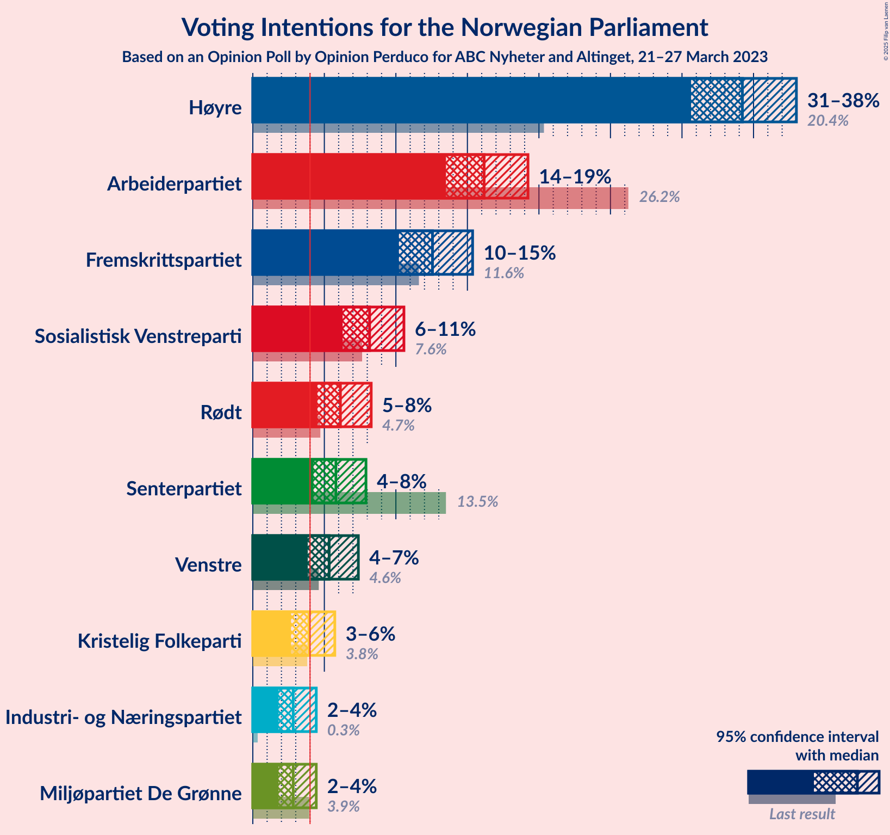
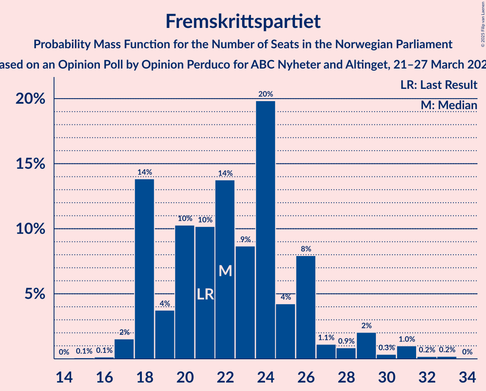
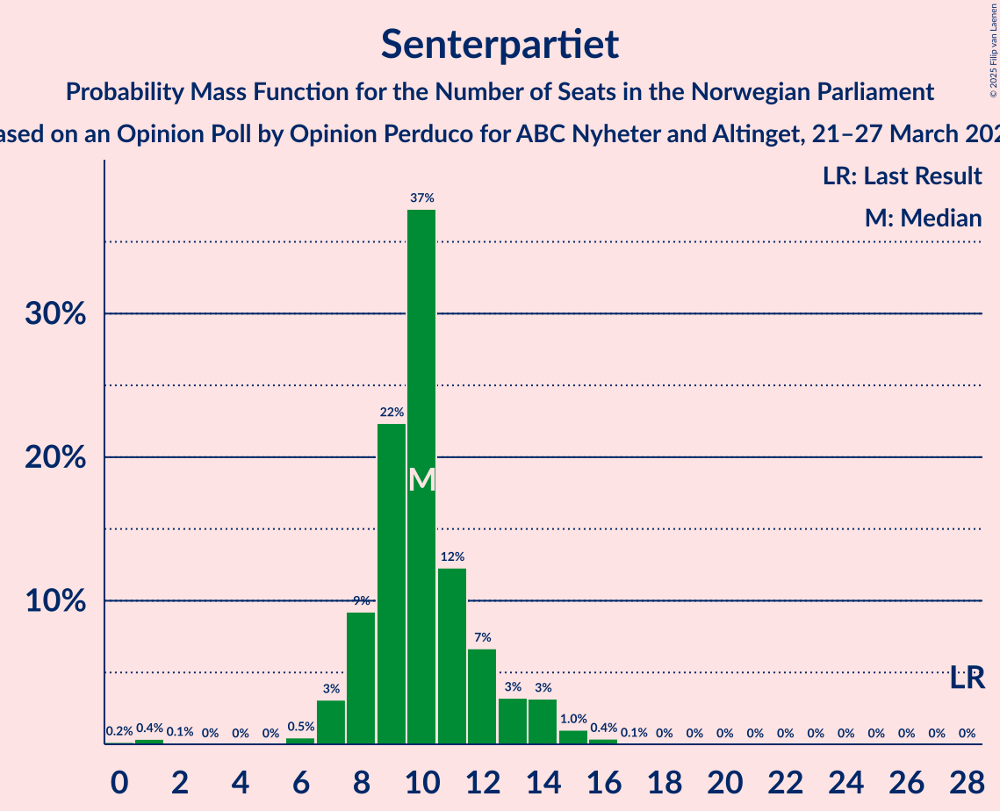
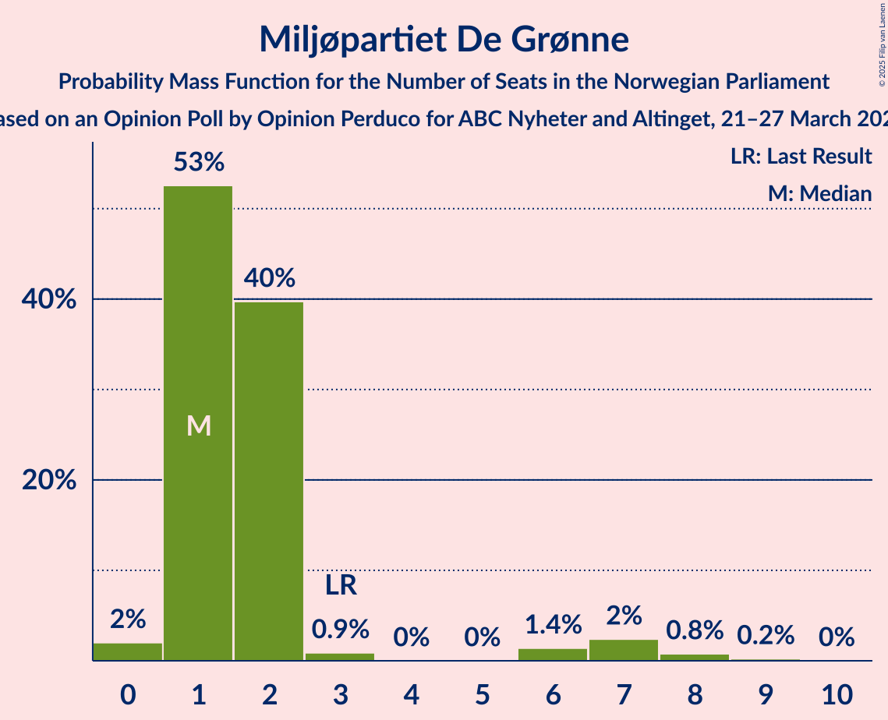
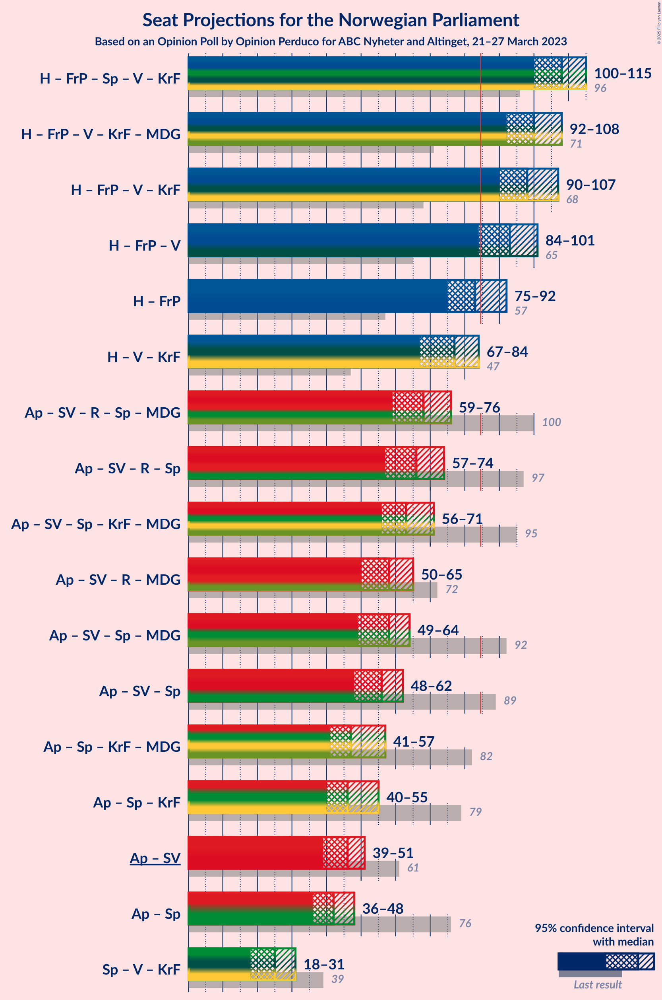
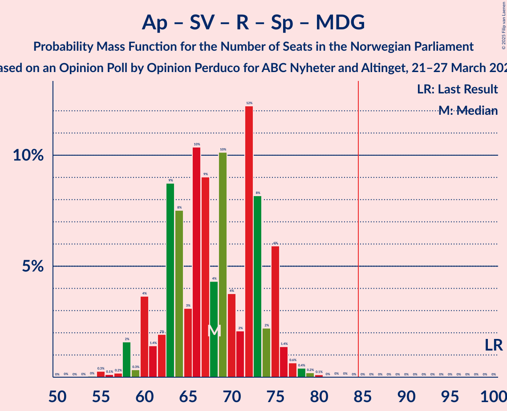

# Opinion Poll by Opinion Perduco for ABC Nyheter and Altinget, 21–27 March 2023

<a href="#voting-intentions">Voting Intentions</a> | <a href="#seats">Seats</a> | <a href="#coalitions">Coalitions</a> | <a href="#technical-information">Technical Information</a>

## Voting Intentions

### Confidence Intervals

| Party | Last Result | Poll Result | 80% Confidence Interval | 90% Confidence Interval | 95% Confidence Interval | 99% Confidence Interval |
|:-----:|:-----------:|:-----------:|:-----------------------:|:-----------------------:|:-----------------------:|:-----------------------:|
| Høyre | 20.4% | 34.2% | 31.9–36.7% |31.2–37.4% |30.6–38.0% |29.5–39.2% |
| Arbeiderpartiet | 26.2% | 16.2% | 14.4–18.2% |13.9–18.7% |13.5–19.2% |12.7–20.2% |
| Fremskrittspartiet | 11.6% | 12.6% | 11.0–14.4% |10.6–14.9% |10.2–15.4% |9.5–16.3% |
| Sosialistisk Venstreparti | 7.6% | 8.2% | 6.9–9.7% |6.6–10.2% |6.3–10.6% |5.7–11.4% |
| Rødt | 4.7% | 6.1% | 5.1–7.5% |4.8–7.9% |4.5–8.3% |4.0–9.0% |
| Senterpartiet | 13.5% | 5.8% | 4.8–7.2% |4.5–7.6% |4.2–7.9% |3.8–8.6% |
| Venstre | 4.6% | 5.3% | 4.3–6.7% |4.1–7.0% |3.8–7.4% |3.4–8.1% |
| Kristelig Folkeparti | 3.8% | 3.9% | 3.1–5.1% |2.9–5.4% |2.7–5.7% |2.3–6.4% |
| Industri- og Næringspartiet | 0.3% | 2.8% | 2.1–3.9% |2.0–4.2% |1.8–4.4% |1.5–5.0% |
| Miljøpartiet De Grønne | 3.9% | 2.8% | 2.1–3.9% |2.0–4.2% |1.8–4.4% |1.5–5.0% |

*Note:* The poll result column reflects the actual value used in the calculations. Published results may vary slightly, and in addition be rounded to fewer digits.

## Seats

### Confidence Intervals

| Party | Last Result | Median | 80% Confidence Interval | 90% Confidence Interval | 95% Confidence Interval | 99% Confidence Interval |
|:-----:|:-----------:|:------:|:-----------------------:|:-----------------------:|:-----------------------:|:-----------------------:|
| <a href="#høyre">Høyre</a> | 36 | 62 | 57–66 |55–68 |54–69 |52–71 |
| <a href="#arbeiderpartiet">Arbeiderpartiet</a> | 48 | 32 | 28–34 |27–35 |26–36 |24–39 |
| <a href="#fremskrittspartiet">Fremskrittspartiet</a> | 21 | 22 | 18–26 |18–27 |18–29 |17–31 |
| <a href="#sosialistisk-venstreparti">Sosialistisk Venstreparti</a> | 13 | 14 | 11–17 |11–17 |10–18 |9–20 |
| <a href="#rødt">Rødt</a> | 8 | 11 | 9–13 |8–14 |8–14 |6–15 |
| <a href="#senterpartiet">Senterpartiet</a> | 28 | 10 | 8–12 |8–13 |7–14 |1–15 |
| <a href="#venstre">Venstre</a> | 8 | 9 | 7–12 |7–12 |3–13 |2–13 |
| <a href="#kristelig-folkeparti">Kristelig Folkeparti</a> | 3 | 6 | 2–8 |2–8 |2–9 |1–10 |
| <a href="#industri--og-næringspartiet">Industri- og Næringspartiet</a> | 0 | 2 | 0–3 |0–3 |0–6 |0–8 |
| <a href="#miljøpartiet-de-grønne">Miljøpartiet De Grønne</a> | 3 | 1 | 1–2 |1–3 |1–7 |0–8 |

### Høyre

*For a full overview of the results for this party, see the [Høyre](party-høyre.html) page.*

| Number of Seats | Probability | Accumulated | Special Marks |
|:---------------:|:-----------:|:-----------:|:-------------:|
| 36 | 0% | 100% | Last Result |
| 37 | 0% | 100% |  |
| 38 | 0% | 100% |  |
| 39 | 0% | 100% |  |
| 40 | 0% | 100% |  |
| 41 | 0% | 100% |  |
| 42 | 0% | 100% |  |
| 43 | 0% | 100% |  |
| 44 | 0% | 100% |  |
| 45 | 0% | 100% |  |
| 46 | 0% | 100% |  |
| 47 | 0% | 100% |  |
| 48 | 0% | 100% |  |
| 49 | 0.1% | 100% |  |
| 50 | 0.1% | 99.9% |  |
| 51 | 0.1% | 99.9% |  |
| 52 | 0.7% | 99.7% |  |
| 53 | 0.4% | 99.0% |  |
| 54 | 1.5% | 98.6% |  |
| 55 | 3% | 97% |  |
| 56 | 3% | 94% |  |
| 57 | 2% | 92% |  |
| 58 | 7% | 89% |  |
| 59 | 12% | 82% |  |
| 60 | 7% | 70% |  |
| 61 | 9% | 63% |  |
| 62 | 16% | 54% | Median |
| 63 | 3% | 39% |  |
| 64 | 12% | 35% |  |
| 65 | 10% | 24% |  |
| 66 | 5% | 14% |  |
| 67 | 2% | 8% |  |
| 68 | 3% | 6% |  |
| 69 | 2% | 4% |  |
| 70 | 0.7% | 1.4% |  |
| 71 | 0.4% | 0.8% |  |
| 72 | 0.3% | 0.4% |  |
| 73 | 0.1% | 0.1% |  |
| 74 | 0% | 0% |  |

### Arbeiderpartiet

*For a full overview of the results for this party, see the [Arbeiderpartiet](party-arbeiderpartiet.html) page.*

| Number of Seats | Probability | Accumulated | Special Marks |
|:---------------:|:-----------:|:-----------:|:-------------:|
| 22 | 0.1% | 100% |  |
| 23 | 0.2% | 99.8% |  |
| 24 | 0.4% | 99.7% |  |
| 25 | 1.0% | 99.3% |  |
| 26 | 0.9% | 98% |  |
| 27 | 5% | 97% |  |
| 28 | 3% | 92% |  |
| 29 | 9% | 90% |  |
| 30 | 13% | 81% |  |
| 31 | 16% | 68% |  |
| 32 | 11% | 51% | Median |
| 33 | 25% | 40% |  |
| 34 | 8% | 15% |  |
| 35 | 3% | 7% |  |
| 36 | 2% | 4% |  |
| 37 | 1.1% | 2% |  |
| 38 | 0.5% | 1.3% |  |
| 39 | 0.6% | 0.8% |  |
| 40 | 0.1% | 0.3% |  |
| 41 | 0.1% | 0.2% |  |
| 42 | 0.1% | 0.2% |  |
| 43 | 0% | 0% |  |
| 44 | 0% | 0% |  |
| 45 | 0% | 0% |  |
| 46 | 0% | 0% |  |
| 47 | 0% | 0% |  |
| 48 | 0% | 0% | Last Result |

### Fremskrittspartiet

*For a full overview of the results for this party, see the [Fremskrittspartiet](party-fremskrittspartiet.html) page.*

| Number of Seats | Probability | Accumulated | Special Marks |
|:---------------:|:-----------:|:-----------:|:-------------:|
| 15 | 0.1% | 100% |  |
| 16 | 0.1% | 99.9% |  |
| 17 | 2% | 99.8% |  |
| 18 | 14% | 98% |  |
| 19 | 4% | 84% |  |
| 20 | 10% | 81% |  |
| 21 | 10% | 70% | Last Result |
| 22 | 14% | 60% | Median |
| 23 | 9% | 46% |  |
| 24 | 20% | 38% |  |
| 25 | 4% | 18% |  |
| 26 | 8% | 14% |  |
| 27 | 1.1% | 6% |  |
| 28 | 0.9% | 5% |  |
| 29 | 2% | 4% |  |
| 30 | 0.3% | 2% |  |
| 31 | 1.0% | 1.4% |  |
| 32 | 0.2% | 0.4% |  |
| 33 | 0.2% | 0.2% |  |
| 34 | 0% | 0% |  |

### Sosialistisk Venstreparti

*For a full overview of the results for this party, see the [Sosialistisk Venstreparti](party-sosialistiskvenstreparti.html) page.*

| Number of Seats | Probability | Accumulated | Special Marks |
|:---------------:|:-----------:|:-----------:|:-------------:|
| 8 | 0.1% | 100% |  |
| 9 | 0.5% | 99.9% |  |
| 10 | 3% | 99.4% |  |
| 11 | 16% | 97% |  |
| 12 | 10% | 81% |  |
| 13 | 10% | 71% | Last Result |
| 14 | 14% | 61% | Median |
| 15 | 11% | 48% |  |
| 16 | 25% | 36% |  |
| 17 | 8% | 12% |  |
| 18 | 2% | 4% |  |
| 19 | 0.6% | 2% |  |
| 20 | 0.8% | 1.1% |  |
| 21 | 0.2% | 0.2% |  |
| 22 | 0% | 0% |  |

### Rødt

*For a full overview of the results for this party, see the [Rødt](party-rødt.html) page.*

| Number of Seats | Probability | Accumulated | Special Marks |
|:---------------:|:-----------:|:-----------:|:-------------:|
| 1 | 0.4% | 100% |  |
| 2 | 0% | 99.6% |  |
| 3 | 0% | 99.6% |  |
| 4 | 0% | 99.6% |  |
| 5 | 0% | 99.6% |  |
| 6 | 0.2% | 99.6% |  |
| 7 | 1.2% | 99.4% |  |
| 8 | 6% | 98% | Last Result |
| 9 | 12% | 92% |  |
| 10 | 26% | 80% |  |
| 11 | 23% | 54% | Median |
| 12 | 14% | 30% |  |
| 13 | 11% | 17% |  |
| 14 | 4% | 6% |  |
| 15 | 1.3% | 2% |  |
| 16 | 0.3% | 0.4% |  |
| 17 | 0% | 0.1% |  |
| 18 | 0% | 0% |  |

### Senterpartiet

*For a full overview of the results for this party, see the [Senterpartiet](party-senterpartiet.html) page.*

| Number of Seats | Probability | Accumulated | Special Marks |
|:---------------:|:-----------:|:-----------:|:-------------:|
| 0 | 0.2% | 100% |  |
| 1 | 0.4% | 99.8% |  |
| 2 | 0.1% | 99.5% |  |
| 3 | 0% | 99.4% |  |
| 4 | 0% | 99.3% |  |
| 5 | 0% | 99.3% |  |
| 6 | 0.5% | 99.3% |  |
| 7 | 3% | 98.9% |  |
| 8 | 9% | 96% |  |
| 9 | 22% | 87% |  |
| 10 | 37% | 64% | Median |
| 11 | 12% | 27% |  |
| 12 | 7% | 15% |  |
| 13 | 3% | 8% |  |
| 14 | 3% | 5% |  |
| 15 | 1.0% | 1.5% |  |
| 16 | 0.4% | 0.5% |  |
| 17 | 0.1% | 0.1% |  |
| 18 | 0% | 0% |  |
| 19 | 0% | 0% |  |
| 20 | 0% | 0% |  |
| 21 | 0% | 0% |  |
| 22 | 0% | 0% |  |
| 23 | 0% | 0% |  |
| 24 | 0% | 0% |  |
| 25 | 0% | 0% |  |
| 26 | 0% | 0% |  |
| 27 | 0% | 0% |  |
| 28 | 0% | 0% | Last Result |

### Venstre

*For a full overview of the results for this party, see the [Venstre](party-venstre.html) page.*

| Number of Seats | Probability | Accumulated | Special Marks |
|:---------------:|:-----------:|:-----------:|:-------------:|
| 2 | 1.2% | 100% |  |
| 3 | 2% | 98.8% |  |
| 4 | 0% | 97% |  |
| 5 | 0% | 97% |  |
| 6 | 0.2% | 97% |  |
| 7 | 12% | 97% |  |
| 8 | 16% | 85% | Last Result |
| 9 | 26% | 69% | Median |
| 10 | 24% | 43% |  |
| 11 | 9% | 20% |  |
| 12 | 8% | 11% |  |
| 13 | 2% | 3% |  |
| 14 | 0.2% | 0.4% |  |
| 15 | 0.2% | 0.2% |  |
| 16 | 0% | 0% |  |

### Kristelig Folkeparti

*For a full overview of the results for this party, see the [Kristelig Folkeparti](party-kristeligfolkeparti.html) page.*

| Number of Seats | Probability | Accumulated | Special Marks |
|:---------------:|:-----------:|:-----------:|:-------------:|
| 0 | 0.4% | 100% |  |
| 1 | 2% | 99.6% |  |
| 2 | 23% | 98% |  |
| 3 | 21% | 74% | Last Result |
| 4 | 0% | 53% |  |
| 5 | 0% | 53% |  |
| 6 | 9% | 53% | Median |
| 7 | 24% | 44% |  |
| 8 | 15% | 20% |  |
| 9 | 4% | 5% |  |
| 10 | 0.8% | 1.1% |  |
| 11 | 0.2% | 0.3% |  |
| 12 | 0.1% | 0.1% |  |
| 13 | 0% | 0% |  |

### Industri- og Næringspartiet

*For a full overview of the results for this party, see the [Industri- og Næringspartiet](party-industri-ognæringspartiet.html) page.*

| Number of Seats | Probability | Accumulated | Special Marks |
|:---------------:|:-----------:|:-----------:|:-------------:|
| 0 | 21% | 100% | Last Result |
| 1 | 18% | 79% |  |
| 2 | 35% | 61% | Median |
| 3 | 22% | 25% |  |
| 4 | 0% | 3% |  |
| 5 | 0% | 3% |  |
| 6 | 0.7% | 3% |  |
| 7 | 2% | 2% |  |
| 8 | 0.4% | 0.6% |  |
| 9 | 0.2% | 0.2% |  |
| 10 | 0% | 0% |  |

### Miljøpartiet De Grønne

*For a full overview of the results for this party, see the [Miljøpartiet De Grønne](party-miljøpartietdegrønne.html) page.*

| Number of Seats | Probability | Accumulated | Special Marks |
|:---------------:|:-----------:|:-----------:|:-------------:|
| 0 | 2% | 100% |  |
| 1 | 53% | 98% | Median |
| 2 | 40% | 45% |  |
| 3 | 0.9% | 6% | Last Result |
| 4 | 0% | 5% |  |
| 5 | 0% | 5% |  |
| 6 | 1.4% | 5% |  |
| 7 | 2% | 3% |  |
| 8 | 0.8% | 1.0% |  |
| 9 | 0.2% | 0.2% |  |
| 10 | 0% | 0% |  |

## Coalitions

### Confidence Intervals

| Coalition | Last Result | Median | Majority? | 80% Confidence Interval | 90% Confidence Interval | 95% Confidence Interval | 99% Confidence Interval |
|:---------:|:-----------:|:------:|:---------:|:-----------------------:|:-----------------------:|:-----------------------:|:-----------------------:|
| Høyre – Fremskrittspartiet – Senterpartiet – Venstre – Kristelig Folkeparti | 96 | 108 | 100% | 103–114 | 100–114 | 100–115 | 98–119 |
| Høyre – Fremskrittspartiet – Venstre – Kristelig Folkeparti – Miljøpartiet De Grønne | 71 | 100 | 100% | 94–106 | 92–106 | 92–108 | 90–111 |
| Høyre – Fremskrittspartiet – Venstre – Kristelig Folkeparti | 68 | 98 | 99.9% | 93–104 | 90–105 | 90–107 | 88–109 |
| Høyre – Fremskrittspartiet – Venstre | 65 | 93 | 97% | 88–99 | 86–100 | 84–101 | 82–104 |
| Høyre – Fremskrittspartiet | 57 | 83 | 37% | 79–89 | 77–92 | 75–92 | 74–95 |
| Høyre – Venstre – Kristelig Folkeparti | 47 | 77 | 2% | 70–81 | 69–83 | 67–84 | 65–87 |
| Arbeiderpartiet – Sosialistisk Venstreparti – Rødt – Senterpartiet – Miljøpartiet De Grønne | 100 | 68 | 0% | 63–74 | 60–75 | 59–76 | 57–78 |
| Arbeiderpartiet – Sosialistisk Venstreparti – Rødt – Senterpartiet | 97 | 66 | 0% | 61–72 | 59–73 | 57–74 | 54–76 |
| Arbeiderpartiet – Sosialistisk Venstreparti – Senterpartiet – Kristelig Folkeparti – Miljøpartiet De Grønne | 95 | 63 | 0% | 57–67 | 56–70 | 56–71 | 53–73 |
| Arbeiderpartiet – Sosialistisk Venstreparti – Rødt – Miljøpartiet De Grønne | 72 | 58 | 0% | 53–63 | 52–65 | 50–65 | 48–68 |
| Arbeiderpartiet – Sosialistisk Venstreparti – Senterpartiet – Miljøpartiet De Grønne | 92 | 58 | 0% | 52–62 | 51–63 | 49–64 | 47–67 |
| Arbeiderpartiet – Sosialistisk Venstreparti – Senterpartiet | 89 | 56 | 0% | 51–60 | 50–62 | 48–62 | 46–65 |
| Arbeiderpartiet – Senterpartiet – Kristelig Folkeparti – Miljøpartiet De Grønne | 82 | 47 | 0% | 44–53 | 43–56 | 41–57 | 38–59 |
| Arbeiderpartiet – Senterpartiet – Kristelig Folkeparti | 79 | 46 | 0% | 42–51 | 42–54 | 40–55 | 37–57 |
| Arbeiderpartiet – Sosialistisk Venstreparti | 61 | 46 | 0% | 42–49 | 40–50 | 39–51 | 37–54 |
| Arbeiderpartiet – Senterpartiet | 76 | 42 | 0% | 38–45 | 37–47 | 36–48 | 33–49 |
| Senterpartiet – Venstre – Kristelig Folkeparti | 39 | 25 | 0% | 21–27 | 20–30 | 18–31 | 15–33 |

### Høyre – Fremskrittspartiet – Senterpartiet – Venstre – Kristelig Folkeparti

| Number of Seats | Probability | Accumulated | Special Marks |
|:---------------:|:-----------:|:-----------:|:-------------:|
| 94 | 0% | 100% |  |
| 95 | 0% | 99.9% |  |
| 96 | 0.2% | 99.9% | Last Result |
| 97 | 0.2% | 99.7% |  |
| 98 | 0.5% | 99.6% |  |
| 99 | 0.3% | 99.1% |  |
| 100 | 4% | 98.7% |  |
| 101 | 1.4% | 95% |  |
| 102 | 0.9% | 93% |  |
| 103 | 3% | 92% |  |
| 104 | 7% | 89% |  |
| 105 | 11% | 83% |  |
| 106 | 7% | 71% |  |
| 107 | 7% | 65% |  |
| 108 | 11% | 57% |  |
| 109 | 14% | 46% | Median |
| 110 | 3% | 32% |  |
| 111 | 3% | 29% |  |
| 112 | 8% | 26% |  |
| 113 | 8% | 18% |  |
| 114 | 5% | 10% |  |
| 115 | 2% | 5% |  |
| 116 | 1.3% | 2% |  |
| 117 | 0.4% | 1.1% |  |
| 118 | 0.2% | 0.8% |  |
| 119 | 0.2% | 0.6% |  |
| 120 | 0.1% | 0.4% |  |
| 121 | 0% | 0.3% |  |
| 122 | 0.3% | 0.3% |  |
| 123 | 0% | 0% |  |

### Høyre – Fremskrittspartiet – Venstre – Kristelig Folkeparti – Miljøpartiet De Grønne

| Number of Seats | Probability | Accumulated | Special Marks |
|:---------------:|:-----------:|:-----------:|:-------------:|
| 71 | 0% | 100% | Last Result |
| 72 | 0% | 100% |  |
| 73 | 0% | 100% |  |
| 74 | 0% | 100% |  |
| 75 | 0% | 100% |  |
| 76 | 0% | 100% |  |
| 77 | 0% | 100% |  |
| 78 | 0% | 100% |  |
| 79 | 0% | 100% |  |
| 80 | 0% | 100% |  |
| 81 | 0% | 100% |  |
| 82 | 0% | 100% |  |
| 83 | 0% | 100% |  |
| 84 | 0% | 100% |  |
| 85 | 0% | 100% | Majority |
| 86 | 0% | 100% |  |
| 87 | 0.1% | 99.9% |  |
| 88 | 0.1% | 99.9% |  |
| 89 | 0.1% | 99.8% |  |
| 90 | 0.8% | 99.7% |  |
| 91 | 0.6% | 98.9% |  |
| 92 | 4% | 98% |  |
| 93 | 1.5% | 95% |  |
| 94 | 5% | 93% |  |
| 95 | 8% | 88% |  |
| 96 | 6% | 81% |  |
| 97 | 7% | 74% |  |
| 98 | 4% | 67% |  |
| 99 | 4% | 63% |  |
| 100 | 14% | 59% | Median |
| 101 | 11% | 45% |  |
| 102 | 6% | 34% |  |
| 103 | 8% | 28% |  |
| 104 | 6% | 20% |  |
| 105 | 2% | 14% |  |
| 106 | 8% | 13% |  |
| 107 | 0.8% | 4% |  |
| 108 | 2% | 4% |  |
| 109 | 0.7% | 2% |  |
| 110 | 0.3% | 1.0% |  |
| 111 | 0.2% | 0.6% |  |
| 112 | 0.1% | 0.5% |  |
| 113 | 0.3% | 0.3% |  |
| 114 | 0% | 0.1% |  |
| 115 | 0% | 0% |  |

### Høyre – Fremskrittspartiet – Venstre – Kristelig Folkeparti

| Number of Seats | Probability | Accumulated | Special Marks |
|:---------------:|:-----------:|:-----------:|:-------------:|
| 68 | 0% | 100% | Last Result |
| 69 | 0% | 100% |  |
| 70 | 0% | 100% |  |
| 71 | 0% | 100% |  |
| 72 | 0% | 100% |  |
| 73 | 0% | 100% |  |
| 74 | 0% | 100% |  |
| 75 | 0% | 100% |  |
| 76 | 0% | 100% |  |
| 77 | 0% | 100% |  |
| 78 | 0% | 100% |  |
| 79 | 0% | 100% |  |
| 80 | 0% | 100% |  |
| 81 | 0% | 100% |  |
| 82 | 0% | 100% |  |
| 83 | 0% | 100% |  |
| 84 | 0% | 100% |  |
| 85 | 0% | 99.9% | Majority |
| 86 | 0.1% | 99.9% |  |
| 87 | 0.2% | 99.7% |  |
| 88 | 0.4% | 99.6% |  |
| 89 | 1.1% | 99.1% |  |
| 90 | 3% | 98% |  |
| 91 | 1.3% | 95% |  |
| 92 | 3% | 93% |  |
| 93 | 6% | 90% |  |
| 94 | 11% | 84% |  |
| 95 | 4% | 74% |  |
| 96 | 8% | 70% |  |
| 97 | 3% | 62% |  |
| 98 | 15% | 59% |  |
| 99 | 3% | 45% | Median |
| 100 | 9% | 42% |  |
| 101 | 7% | 32% |  |
| 102 | 7% | 25% |  |
| 103 | 6% | 19% |  |
| 104 | 4% | 13% |  |
| 105 | 5% | 8% |  |
| 106 | 0.6% | 3% |  |
| 107 | 2% | 3% |  |
| 108 | 0.3% | 1.0% |  |
| 109 | 0.2% | 0.7% |  |
| 110 | 0.1% | 0.4% |  |
| 111 | 0% | 0.3% |  |
| 112 | 0.2% | 0.3% |  |
| 113 | 0% | 0% |  |

### Høyre – Fremskrittspartiet – Venstre

| Number of Seats | Probability | Accumulated | Special Marks |
|:---------------:|:-----------:|:-----------:|:-------------:|
| 65 | 0% | 100% | Last Result |
| 66 | 0% | 100% |  |
| 67 | 0% | 100% |  |
| 68 | 0% | 100% |  |
| 69 | 0% | 100% |  |
| 70 | 0% | 100% |  |
| 71 | 0% | 100% |  |
| 72 | 0% | 100% |  |
| 73 | 0% | 100% |  |
| 74 | 0% | 100% |  |
| 75 | 0% | 100% |  |
| 76 | 0% | 100% |  |
| 77 | 0% | 100% |  |
| 78 | 0% | 100% |  |
| 79 | 0% | 100% |  |
| 80 | 0.1% | 99.9% |  |
| 81 | 0.1% | 99.8% |  |
| 82 | 0.6% | 99.7% |  |
| 83 | 0.9% | 99.1% |  |
| 84 | 0.8% | 98% |  |
| 85 | 2% | 97% | Majority |
| 86 | 1.2% | 96% |  |
| 87 | 3% | 95% |  |
| 88 | 5% | 92% |  |
| 89 | 2% | 87% |  |
| 90 | 7% | 84% |  |
| 91 | 10% | 77% |  |
| 92 | 12% | 67% |  |
| 93 | 16% | 55% | Median |
| 94 | 3% | 39% |  |
| 95 | 10% | 36% |  |
| 96 | 4% | 26% |  |
| 97 | 6% | 22% |  |
| 98 | 2% | 16% |  |
| 99 | 4% | 14% |  |
| 100 | 7% | 9% |  |
| 101 | 0.7% | 3% |  |
| 102 | 0.3% | 2% |  |
| 103 | 0.8% | 2% |  |
| 104 | 0.5% | 0.9% |  |
| 105 | 0.2% | 0.3% |  |
| 106 | 0.1% | 0.2% |  |
| 107 | 0% | 0.1% |  |
| 108 | 0% | 0.1% |  |
| 109 | 0% | 0% |  |

### Høyre – Fremskrittspartiet

| Number of Seats | Probability | Accumulated | Special Marks |
|:---------------:|:-----------:|:-----------:|:-------------:|
| 57 | 0% | 100% | Last Result |
| 58 | 0% | 100% |  |
| 59 | 0% | 100% |  |
| 60 | 0% | 100% |  |
| 61 | 0% | 100% |  |
| 62 | 0% | 100% |  |
| 63 | 0% | 100% |  |
| 64 | 0% | 100% |  |
| 65 | 0% | 100% |  |
| 66 | 0% | 100% |  |
| 67 | 0% | 100% |  |
| 68 | 0% | 100% |  |
| 69 | 0% | 100% |  |
| 70 | 0% | 100% |  |
| 71 | 0.1% | 100% |  |
| 72 | 0.1% | 99.9% |  |
| 73 | 0.1% | 99.8% |  |
| 74 | 0.8% | 99.6% |  |
| 75 | 2% | 98.8% |  |
| 76 | 0.6% | 97% |  |
| 77 | 2% | 96% |  |
| 78 | 2% | 95% |  |
| 79 | 5% | 92% |  |
| 80 | 6% | 87% |  |
| 81 | 4% | 81% |  |
| 82 | 8% | 78% |  |
| 83 | 22% | 70% |  |
| 84 | 11% | 48% | Median |
| 85 | 8% | 37% | Majority |
| 86 | 3% | 30% |  |
| 87 | 5% | 27% |  |
| 88 | 9% | 22% |  |
| 89 | 5% | 14% |  |
| 90 | 2% | 9% |  |
| 91 | 1.5% | 7% |  |
| 92 | 3% | 5% |  |
| 93 | 1.0% | 2% |  |
| 94 | 0.3% | 1.0% |  |
| 95 | 0.5% | 0.7% |  |
| 96 | 0% | 0.2% |  |
| 97 | 0.1% | 0.2% |  |
| 98 | 0.1% | 0.1% |  |
| 99 | 0% | 0% |  |

### Høyre – Venstre – Kristelig Folkeparti

| Number of Seats | Probability | Accumulated | Special Marks |
|:---------------:|:-----------:|:-----------:|:-------------:|
| 47 | 0% | 100% | Last Result |
| 48 | 0% | 100% |  |
| 49 | 0% | 100% |  |
| 50 | 0% | 100% |  |
| 51 | 0% | 100% |  |
| 52 | 0% | 100% |  |
| 53 | 0% | 100% |  |
| 54 | 0% | 100% |  |
| 55 | 0% | 100% |  |
| 56 | 0% | 100% |  |
| 57 | 0% | 100% |  |
| 58 | 0% | 100% |  |
| 59 | 0% | 100% |  |
| 60 | 0.1% | 100% |  |
| 61 | 0% | 99.9% |  |
| 62 | 0.1% | 99.9% |  |
| 63 | 0.1% | 99.9% |  |
| 64 | 0.2% | 99.8% |  |
| 65 | 0.6% | 99.6% |  |
| 66 | 0.7% | 99.1% |  |
| 67 | 2% | 98% |  |
| 68 | 0.8% | 96% |  |
| 69 | 3% | 95% |  |
| 70 | 9% | 93% |  |
| 71 | 11% | 84% |  |
| 72 | 2% | 73% |  |
| 73 | 2% | 70% |  |
| 74 | 4% | 68% |  |
| 75 | 8% | 64% |  |
| 76 | 3% | 56% |  |
| 77 | 3% | 52% | Median |
| 78 | 15% | 49% |  |
| 79 | 11% | 35% |  |
| 80 | 14% | 24% |  |
| 81 | 0.7% | 10% |  |
| 82 | 2% | 9% |  |
| 83 | 4% | 7% |  |
| 84 | 1.0% | 3% |  |
| 85 | 2% | 2% | Majority |
| 86 | 0.1% | 0.6% |  |
| 87 | 0.3% | 0.6% |  |
| 88 | 0.2% | 0.3% |  |
| 89 | 0% | 0.1% |  |
| 90 | 0% | 0% |  |

### Arbeiderpartiet – Sosialistisk Venstreparti – Rødt – Senterpartiet – Miljøpartiet De Grønne

| Number of Seats | Probability | Accumulated | Special Marks |
|:---------------:|:-----------:|:-----------:|:-------------:|
| 54 | 0% | 100% |  |
| 55 | 0.3% | 99.9% |  |
| 56 | 0.1% | 99.7% |  |
| 57 | 0.2% | 99.5% |  |
| 58 | 2% | 99.3% |  |
| 59 | 0.3% | 98% |  |
| 60 | 4% | 97% |  |
| 61 | 1.4% | 94% |  |
| 62 | 2% | 92% |  |
| 63 | 9% | 90% |  |
| 64 | 8% | 82% |  |
| 65 | 3% | 74% |  |
| 66 | 10% | 71% |  |
| 67 | 9% | 61% |  |
| 68 | 4% | 52% | Median |
| 69 | 10% | 47% |  |
| 70 | 4% | 37% |  |
| 71 | 2% | 33% |  |
| 72 | 12% | 31% |  |
| 73 | 8% | 19% |  |
| 74 | 2% | 11% |  |
| 75 | 6% | 9% |  |
| 76 | 1.4% | 3% |  |
| 77 | 0.6% | 1.5% |  |
| 78 | 0.4% | 0.8% |  |
| 79 | 0.2% | 0.4% |  |
| 80 | 0.1% | 0.2% |  |
| 81 | 0% | 0.1% |  |
| 82 | 0% | 0.1% |  |
| 83 | 0% | 0% |  |
| 84 | 0% | 0% |  |
| 85 | 0% | 0% | Majority |
| 86 | 0% | 0% |  |
| 87 | 0% | 0% |  |
| 88 | 0% | 0% |  |
| 89 | 0% | 0% |  |
| 90 | 0% | 0% |  |
| 91 | 0% | 0% |  |
| 92 | 0% | 0% |  |
| 93 | 0% | 0% |  |
| 94 | 0% | 0% |  |
| 95 | 0% | 0% |  |
| 96 | 0% | 0% |  |
| 97 | 0% | 0% |  |
| 98 | 0% | 0% |  |
| 99 | 0% | 0% |  |
| 100 | 0% | 0% | Last Result |

### Arbeiderpartiet – Sosialistisk Venstreparti – Rødt – Senterpartiet

| Number of Seats | Probability | Accumulated | Special Marks |
|:---------------:|:-----------:|:-----------:|:-------------:|
| 53 | 0.1% | 100% |  |
| 54 | 0.4% | 99.9% |  |
| 55 | 0.1% | 99.5% |  |
| 56 | 0.6% | 99.3% |  |
| 57 | 2% | 98.8% |  |
| 58 | 0.4% | 97% |  |
| 59 | 4% | 97% |  |
| 60 | 2% | 92% |  |
| 61 | 5% | 91% |  |
| 62 | 5% | 86% |  |
| 63 | 9% | 80% |  |
| 64 | 3% | 71% |  |
| 65 | 17% | 69% |  |
| 66 | 3% | 52% |  |
| 67 | 12% | 49% | Median |
| 68 | 4% | 37% |  |
| 69 | 2% | 33% |  |
| 70 | 7% | 31% |  |
| 71 | 8% | 24% |  |
| 72 | 7% | 16% |  |
| 73 | 6% | 9% |  |
| 74 | 1.0% | 3% |  |
| 75 | 1.0% | 2% |  |
| 76 | 0.4% | 0.8% |  |
| 77 | 0.2% | 0.3% |  |
| 78 | 0.1% | 0.2% |  |
| 79 | 0% | 0% |  |
| 80 | 0% | 0% |  |
| 81 | 0% | 0% |  |
| 82 | 0% | 0% |  |
| 83 | 0% | 0% |  |
| 84 | 0% | 0% |  |
| 85 | 0% | 0% | Majority |
| 86 | 0% | 0% |  |
| 87 | 0% | 0% |  |
| 88 | 0% | 0% |  |
| 89 | 0% | 0% |  |
| 90 | 0% | 0% |  |
| 91 | 0% | 0% |  |
| 92 | 0% | 0% |  |
| 93 | 0% | 0% |  |
| 94 | 0% | 0% |  |
| 95 | 0% | 0% |  |
| 96 | 0% | 0% |  |
| 97 | 0% | 0% | Last Result |

### Arbeiderpartiet – Sosialistisk Venstreparti – Senterpartiet – Kristelig Folkeparti – Miljøpartiet De Grønne

| Number of Seats | Probability | Accumulated | Special Marks |
|:---------------:|:-----------:|:-----------:|:-------------:|
| 48 | 0.1% | 100% |  |
| 49 | 0.1% | 99.9% |  |
| 50 | 0% | 99.8% |  |
| 51 | 0.1% | 99.8% |  |
| 52 | 0.1% | 99.7% |  |
| 53 | 0.9% | 99.6% |  |
| 54 | 0.4% | 98.7% |  |
| 55 | 0.6% | 98% |  |
| 56 | 7% | 98% |  |
| 57 | 4% | 91% |  |
| 58 | 2% | 87% |  |
| 59 | 5% | 84% |  |
| 60 | 12% | 79% |  |
| 61 | 10% | 68% |  |
| 62 | 4% | 58% |  |
| 63 | 25% | 53% | Median |
| 64 | 4% | 28% |  |
| 65 | 4% | 24% |  |
| 66 | 9% | 20% |  |
| 67 | 2% | 11% |  |
| 68 | 1.4% | 9% |  |
| 69 | 2% | 8% |  |
| 70 | 2% | 6% |  |
| 71 | 2% | 4% |  |
| 72 | 1.2% | 2% |  |
| 73 | 0.3% | 0.7% |  |
| 74 | 0.2% | 0.4% |  |
| 75 | 0.1% | 0.2% |  |
| 76 | 0% | 0.1% |  |
| 77 | 0% | 0% |  |
| 78 | 0% | 0% |  |
| 79 | 0% | 0% |  |
| 80 | 0% | 0% |  |
| 81 | 0% | 0% |  |
| 82 | 0% | 0% |  |
| 83 | 0% | 0% |  |
| 84 | 0% | 0% |  |
| 85 | 0% | 0% | Majority |
| 86 | 0% | 0% |  |
| 87 | 0% | 0% |  |
| 88 | 0% | 0% |  |
| 89 | 0% | 0% |  |
| 90 | 0% | 0% |  |
| 91 | 0% | 0% |  |
| 92 | 0% | 0% |  |
| 93 | 0% | 0% |  |
| 94 | 0% | 0% |  |
| 95 | 0% | 0% | Last Result |

### Arbeiderpartiet – Sosialistisk Venstreparti – Rødt – Miljøpartiet De Grønne

| Number of Seats | Probability | Accumulated | Special Marks |
|:---------------:|:-----------:|:-----------:|:-------------:|
| 45 | 0.2% | 100% |  |
| 46 | 0.1% | 99.7% |  |
| 47 | 0.1% | 99.6% |  |
| 48 | 0.2% | 99.5% |  |
| 49 | 0.3% | 99.3% |  |
| 50 | 2% | 99.0% |  |
| 51 | 0.6% | 97% |  |
| 52 | 4% | 96% |  |
| 53 | 10% | 92% |  |
| 54 | 7% | 82% |  |
| 55 | 2% | 75% |  |
| 56 | 5% | 74% |  |
| 57 | 16% | 69% |  |
| 58 | 8% | 53% | Median |
| 59 | 9% | 45% |  |
| 60 | 5% | 36% |  |
| 61 | 7% | 31% |  |
| 62 | 8% | 25% |  |
| 63 | 10% | 17% |  |
| 64 | 0.8% | 7% |  |
| 65 | 5% | 6% |  |
| 66 | 0.6% | 1.4% |  |
| 67 | 0.2% | 0.9% |  |
| 68 | 0.5% | 0.7% |  |
| 69 | 0.1% | 0.2% |  |
| 70 | 0% | 0.1% |  |
| 71 | 0% | 0.1% |  |
| 72 | 0% | 0.1% | Last Result |
| 73 | 0% | 0% |  |

### Arbeiderpartiet – Sosialistisk Venstreparti – Senterpartiet – Miljøpartiet De Grønne

| Number of Seats | Probability | Accumulated | Special Marks |
|:---------------:|:-----------:|:-----------:|:-------------:|
| 45 | 0.1% | 100% |  |
| 46 | 0.1% | 99.9% |  |
| 47 | 0.4% | 99.8% |  |
| 48 | 0.3% | 99.4% |  |
| 49 | 2% | 99.1% |  |
| 50 | 0.3% | 97% |  |
| 51 | 5% | 97% |  |
| 52 | 2% | 92% |  |
| 53 | 12% | 90% |  |
| 54 | 6% | 78% |  |
| 55 | 6% | 73% |  |
| 56 | 12% | 67% |  |
| 57 | 5% | 55% | Median |
| 58 | 11% | 50% |  |
| 59 | 5% | 39% |  |
| 60 | 12% | 35% |  |
| 61 | 9% | 23% |  |
| 62 | 5% | 14% |  |
| 63 | 5% | 9% |  |
| 64 | 2% | 4% |  |
| 65 | 1.2% | 2% |  |
| 66 | 0.4% | 1.2% |  |
| 67 | 0.4% | 0.7% |  |
| 68 | 0.1% | 0.3% |  |
| 69 | 0.1% | 0.1% |  |
| 70 | 0% | 0.1% |  |
| 71 | 0% | 0% |  |
| 72 | 0% | 0% |  |
| 73 | 0% | 0% |  |
| 74 | 0% | 0% |  |
| 75 | 0% | 0% |  |
| 76 | 0% | 0% |  |
| 77 | 0% | 0% |  |
| 78 | 0% | 0% |  |
| 79 | 0% | 0% |  |
| 80 | 0% | 0% |  |
| 81 | 0% | 0% |  |
| 82 | 0% | 0% |  |
| 83 | 0% | 0% |  |
| 84 | 0% | 0% |  |
| 85 | 0% | 0% | Majority |
| 86 | 0% | 0% |  |
| 87 | 0% | 0% |  |
| 88 | 0% | 0% |  |
| 89 | 0% | 0% |  |
| 90 | 0% | 0% |  |
| 91 | 0% | 0% |  |
| 92 | 0% | 0% | Last Result |

### Arbeiderpartiet – Sosialistisk Venstreparti – Senterpartiet

| Number of Seats | Probability | Accumulated | Special Marks |
|:---------------:|:-----------:|:-----------:|:-------------:|
| 43 | 0% | 100% |  |
| 44 | 0.1% | 99.9% |  |
| 45 | 0.1% | 99.8% |  |
| 46 | 0.5% | 99.7% |  |
| 47 | 0.7% | 99.2% |  |
| 48 | 2% | 98.5% |  |
| 49 | 0.6% | 97% |  |
| 50 | 5% | 96% |  |
| 51 | 3% | 91% |  |
| 52 | 15% | 88% |  |
| 53 | 7% | 73% |  |
| 54 | 3% | 66% |  |
| 55 | 12% | 63% |  |
| 56 | 11% | 51% | Median |
| 57 | 7% | 40% |  |
| 58 | 3% | 34% |  |
| 59 | 17% | 30% |  |
| 60 | 5% | 13% |  |
| 61 | 3% | 9% |  |
| 62 | 3% | 5% |  |
| 63 | 1.4% | 2% |  |
| 64 | 0.2% | 1.0% |  |
| 65 | 0.5% | 0.8% |  |
| 66 | 0.2% | 0.3% |  |
| 67 | 0% | 0.1% |  |
| 68 | 0% | 0% |  |
| 69 | 0% | 0% |  |
| 70 | 0% | 0% |  |
| 71 | 0% | 0% |  |
| 72 | 0% | 0% |  |
| 73 | 0% | 0% |  |
| 74 | 0% | 0% |  |
| 75 | 0% | 0% |  |
| 76 | 0% | 0% |  |
| 77 | 0% | 0% |  |
| 78 | 0% | 0% |  |
| 79 | 0% | 0% |  |
| 80 | 0% | 0% |  |
| 81 | 0% | 0% |  |
| 82 | 0% | 0% |  |
| 83 | 0% | 0% |  |
| 84 | 0% | 0% |  |
| 85 | 0% | 0% | Majority |
| 86 | 0% | 0% |  |
| 87 | 0% | 0% |  |
| 88 | 0% | 0% |  |
| 89 | 0% | 0% | Last Result |

### Arbeiderpartiet – Senterpartiet – Kristelig Folkeparti – Miljøpartiet De Grønne

| Number of Seats | Probability | Accumulated | Special Marks |
|:---------------:|:-----------:|:-----------:|:-------------:|
| 34 | 0.1% | 100% |  |
| 35 | 0% | 99.8% |  |
| 36 | 0% | 99.8% |  |
| 37 | 0.2% | 99.8% |  |
| 38 | 0.1% | 99.6% |  |
| 39 | 0.5% | 99.5% |  |
| 40 | 0.3% | 99.0% |  |
| 41 | 1.3% | 98.7% |  |
| 42 | 1.2% | 97% |  |
| 43 | 6% | 96% |  |
| 44 | 3% | 90% |  |
| 45 | 8% | 87% |  |
| 46 | 14% | 79% |  |
| 47 | 19% | 65% |  |
| 48 | 3% | 46% |  |
| 49 | 12% | 42% | Median |
| 50 | 8% | 31% |  |
| 51 | 2% | 23% |  |
| 52 | 8% | 20% |  |
| 53 | 3% | 12% |  |
| 54 | 2% | 10% |  |
| 55 | 3% | 8% |  |
| 56 | 2% | 5% |  |
| 57 | 0.8% | 3% |  |
| 58 | 1.5% | 2% |  |
| 59 | 0.5% | 0.8% |  |
| 60 | 0.2% | 0.3% |  |
| 61 | 0% | 0.1% |  |
| 62 | 0% | 0.1% |  |
| 63 | 0% | 0% |  |
| 64 | 0% | 0% |  |
| 65 | 0% | 0% |  |
| 66 | 0% | 0% |  |
| 67 | 0% | 0% |  |
| 68 | 0% | 0% |  |
| 69 | 0% | 0% |  |
| 70 | 0% | 0% |  |
| 71 | 0% | 0% |  |
| 72 | 0% | 0% |  |
| 73 | 0% | 0% |  |
| 74 | 0% | 0% |  |
| 75 | 0% | 0% |  |
| 76 | 0% | 0% |  |
| 77 | 0% | 0% |  |
| 78 | 0% | 0% |  |
| 79 | 0% | 0% |  |
| 80 | 0% | 0% |  |
| 81 | 0% | 0% |  |
| 82 | 0% | 0% | Last Result |

### Arbeiderpartiet – Senterpartiet – Kristelig Folkeparti

| Number of Seats | Probability | Accumulated | Special Marks |
|:---------------:|:-----------:|:-----------:|:-------------:|
| 32 | 0.1% | 100% |  |
| 33 | 0% | 99.9% |  |
| 34 | 0% | 99.8% |  |
| 35 | 0.1% | 99.8% |  |
| 36 | 0.2% | 99.7% |  |
| 37 | 0.2% | 99.5% |  |
| 38 | 0.5% | 99.3% |  |
| 39 | 0.3% | 98.8% |  |
| 40 | 1.4% | 98% |  |
| 41 | 1.3% | 97% |  |
| 42 | 6% | 96% |  |
| 43 | 7% | 90% |  |
| 44 | 16% | 83% |  |
| 45 | 7% | 67% |  |
| 46 | 19% | 60% |  |
| 47 | 6% | 41% |  |
| 48 | 12% | 36% | Median |
| 49 | 4% | 23% |  |
| 50 | 8% | 19% |  |
| 51 | 2% | 11% |  |
| 52 | 2% | 9% |  |
| 53 | 1.4% | 8% |  |
| 54 | 3% | 6% |  |
| 55 | 1.3% | 3% |  |
| 56 | 1.4% | 2% |  |
| 57 | 0.1% | 0.6% |  |
| 58 | 0.4% | 0.4% |  |
| 59 | 0% | 0% |  |
| 60 | 0% | 0% |  |
| 61 | 0% | 0% |  |
| 62 | 0% | 0% |  |
| 63 | 0% | 0% |  |
| 64 | 0% | 0% |  |
| 65 | 0% | 0% |  |
| 66 | 0% | 0% |  |
| 67 | 0% | 0% |  |
| 68 | 0% | 0% |  |
| 69 | 0% | 0% |  |
| 70 | 0% | 0% |  |
| 71 | 0% | 0% |  |
| 72 | 0% | 0% |  |
| 73 | 0% | 0% |  |
| 74 | 0% | 0% |  |
| 75 | 0% | 0% |  |
| 76 | 0% | 0% |  |
| 77 | 0% | 0% |  |
| 78 | 0% | 0% |  |
| 79 | 0% | 0% | Last Result |

### Arbeiderpartiet – Sosialistisk Venstreparti

| Number of Seats | Probability | Accumulated | Special Marks |
|:---------------:|:-----------:|:-----------:|:-------------:|
| 35 | 0.1% | 100% |  |
| 36 | 0.4% | 99.9% |  |
| 37 | 0.1% | 99.5% |  |
| 38 | 0.7% | 99.4% |  |
| 39 | 1.3% | 98.7% |  |
| 40 | 3% | 97% |  |
| 41 | 1.0% | 94% |  |
| 42 | 18% | 93% |  |
| 43 | 5% | 76% |  |
| 44 | 8% | 71% |  |
| 45 | 7% | 63% |  |
| 46 | 17% | 57% | Median |
| 47 | 6% | 40% |  |
| 48 | 13% | 33% |  |
| 49 | 13% | 20% |  |
| 50 | 3% | 8% |  |
| 51 | 2% | 5% |  |
| 52 | 1.0% | 2% |  |
| 53 | 0.4% | 1.5% |  |
| 54 | 0.7% | 1.0% |  |
| 55 | 0.1% | 0.3% |  |
| 56 | 0.1% | 0.2% |  |
| 57 | 0% | 0.1% |  |
| 58 | 0% | 0% |  |
| 59 | 0% | 0% |  |
| 60 | 0% | 0% |  |
| 61 | 0% | 0% | Last Result |

### Arbeiderpartiet – Senterpartiet

| Number of Seats | Probability | Accumulated | Special Marks |
|:---------------:|:-----------:|:-----------:|:-------------:|
| 30 | 0.1% | 100% |  |
| 31 | 0.1% | 99.9% |  |
| 32 | 0.2% | 99.8% |  |
| 33 | 0.2% | 99.5% |  |
| 34 | 0.4% | 99.3% |  |
| 35 | 1.2% | 98.9% |  |
| 36 | 0.7% | 98% |  |
| 37 | 7% | 97% |  |
| 38 | 5% | 90% |  |
| 39 | 14% | 85% |  |
| 40 | 4% | 71% |  |
| 41 | 14% | 67% |  |
| 42 | 18% | 53% | Median |
| 43 | 16% | 35% |  |
| 44 | 5% | 19% |  |
| 45 | 5% | 14% |  |
| 46 | 4% | 9% |  |
| 47 | 2% | 5% |  |
| 48 | 2% | 3% |  |
| 49 | 0.7% | 1.0% |  |
| 50 | 0.1% | 0.3% |  |
| 51 | 0.2% | 0.2% |  |
| 52 | 0% | 0% |  |
| 53 | 0% | 0% |  |
| 54 | 0% | 0% |  |
| 55 | 0% | 0% |  |
| 56 | 0% | 0% |  |
| 57 | 0% | 0% |  |
| 58 | 0% | 0% |  |
| 59 | 0% | 0% |  |
| 60 | 0% | 0% |  |
| 61 | 0% | 0% |  |
| 62 | 0% | 0% |  |
| 63 | 0% | 0% |  |
| 64 | 0% | 0% |  |
| 65 | 0% | 0% |  |
| 66 | 0% | 0% |  |
| 67 | 0% | 0% |  |
| 68 | 0% | 0% |  |
| 69 | 0% | 0% |  |
| 70 | 0% | 0% |  |
| 71 | 0% | 0% |  |
| 72 | 0% | 0% |  |
| 73 | 0% | 0% |  |
| 74 | 0% | 0% |  |
| 75 | 0% | 0% |  |
| 76 | 0% | 0% | Last Result |

### Senterpartiet – Venstre – Kristelig Folkeparti

| Number of Seats | Probability | Accumulated | Special Marks |
|:---------------:|:-----------:|:-----------:|:-------------:|
| 11 | 0.1% | 100% |  |
| 12 | 0% | 99.9% |  |
| 13 | 0.1% | 99.9% |  |
| 14 | 0.2% | 99.8% |  |
| 15 | 0.5% | 99.5% |  |
| 16 | 0.6% | 99.0% |  |
| 17 | 0.5% | 98% |  |
| 18 | 0.7% | 98% |  |
| 19 | 2% | 97% |  |
| 20 | 2% | 96% |  |
| 21 | 14% | 93% |  |
| 22 | 8% | 80% |  |
| 23 | 12% | 72% |  |
| 24 | 4% | 60% |  |
| 25 | 33% | 56% | Median |
| 26 | 5% | 23% |  |
| 27 | 9% | 18% |  |
| 28 | 2% | 9% |  |
| 29 | 0.9% | 7% |  |
| 30 | 3% | 6% |  |
| 31 | 0.8% | 3% |  |
| 32 | 0.7% | 2% |  |
| 33 | 1.0% | 1.2% |  |
| 34 | 0.1% | 0.2% |  |
| 35 | 0% | 0.1% |  |
| 36 | 0% | 0% |  |
| 37 | 0% | 0% |  |
| 38 | 0% | 0% |  |
| 39 | 0% | 0% | Last Result |

## Technical Information

### Opinion Poll

+ **Polling firm:** Opinion Perduco
+ **Commissioner(s):** ABC Nyheter and Altinget
+ **Fieldwork period:** 21–27 March 2023

### Calculations

+ **Sample size:** 637
+ **Simulations done:** 1,048,576
+ **Error estimate:** 1.36%

