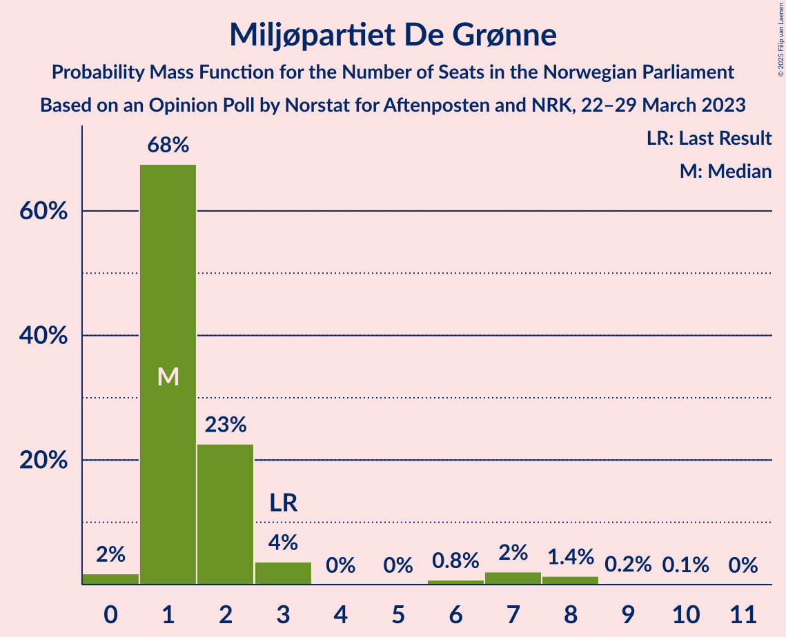

# Opinion Poll by Norstat for Aftenposten and NRK, 22–29 March 2023

<a href="#voting-intentions">Voting Intentions</a> | <a href="#seats">Seats</a> | <a href="#coalitions">Coalitions</a> | <a href="#technical-information">Technical Information</a>

## Voting Intentions

### Confidence Intervals

| Party | Last Result | Poll Result | 80% Confidence Interval | 90% Confidence Interval | 95% Confidence Interval | 99% Confidence Interval |
|:-----:|:-----------:|:-----------:|:-----------------------:|:-----------------------:|:-----------------------:|:-----------------------:|
| Høyre | 20.4% | 33.8% | 31.6–36.2% |31.0–36.8% |30.5–37.4% |29.4–38.5% |
| Arbeiderpartiet | 26.2% | 17.1% | 15.4–19.1% |15.0–19.6% |14.5–20.1% |13.8–21.0% |
| Fremskrittspartiet | 11.6% | 10.6% | 9.2–12.2% |8.9–12.7% |8.5–13.1% |7.9–13.9% |
| Sosialistisk Venstreparti | 7.6% | 9.6% | 8.3–11.2% |8.0–11.6% |7.7–12.0% |7.1–12.8% |
| Senterpartiet | 13.5% | 5.7% | 4.7–7.0% |4.5–7.3% |4.2–7.7% |3.8–8.3% |
| Rødt | 4.7% | 5.6% | 4.6–6.8% |4.3–7.2% |4.1–7.5% |3.7–8.2% |
| Venstre | 4.6% | 4.9% | 4.0–6.1% |3.7–6.4% |3.5–6.7% |3.1–7.3% |
| Kristelig Folkeparti | 3.8% | 3.8% | 3.0–4.8% |2.8–5.2% |2.6–5.4% |2.3–6.0% |
| Industri- og Næringspartiet | 0.3% | 2.8% | 2.1–3.7% |2.0–4.0% |1.8–4.3% |1.5–4.8% |
| Miljøpartiet De Grønne | 3.9% | 2.8% | 2.1–3.7% |2.0–4.0% |1.8–4.3% |1.5–4.8% |

*Note:* The poll result column reflects the actual value used in the calculations. Published results may vary slightly, and in addition be rounded to fewer digits.

## Seats

### Confidence Intervals

| Party | Last Result | Median | 80% Confidence Interval | 90% Confidence Interval | 95% Confidence Interval | 99% Confidence Interval |
|:-----:|:-----------:|:------:|:-----------------------:|:-----------------------:|:-----------------------:|:-----------------------:|
| <a href="#høyre">Høyre</a> | 36 | 62 | 57–68 |56–69 |55–69 |52–71 |
| <a href="#arbeiderpartiet">Arbeiderpartiet</a> | 48 | 33 | 31–36 |30–38 |29–39 |26–42 |
| <a href="#fremskrittspartiet">Fremskrittspartiet</a> | 21 | 18 | 16–22 |15–23 |15–23 |14–25 |
| <a href="#sosialistisk-venstreparti">Sosialistisk Venstreparti</a> | 13 | 17 | 14–20 |13–21 |12–21 |11–23 |
| <a href="#senterpartiet">Senterpartiet</a> | 28 | 10 | 8–13 |7–14 |7–14 |2–16 |
| <a href="#rødt">Rødt</a> | 8 | 10 | 7–12 |7–13 |1–13 |1–14 |
| <a href="#venstre">Venstre</a> | 8 | 8 | 3–11 |2–11 |2–12 |2–13 |
| <a href="#kristelig-folkeparti">Kristelig Folkeparti</a> | 3 | 3 | 2–8 |2–9 |1–9 |0–10 |
| <a href="#industri--og-næringspartiet">Industri- og Næringspartiet</a> | 0 | 2 | 0–3 |0–3 |0–7 |0–8 |
| <a href="#miljøpartiet-de-grønne">Miljøpartiet De Grønne</a> | 3 | 1 | 1–2 |1–3 |1–7 |0–8 |

### Høyre

*For a full overview of the results for this party, see the [Høyre](party-høyre.html) page.*

| Number of Seats | Probability | Accumulated | Special Marks |
|:---------------:|:-----------:|:-----------:|:-------------:|
| 36 | 0% | 100% | Last Result |
| 37 | 0% | 100% |  |
| 38 | 0% | 100% |  |
| 39 | 0% | 100% |  |
| 40 | 0% | 100% |  |
| 41 | 0% | 100% |  |
| 42 | 0% | 100% |  |
| 43 | 0% | 100% |  |
| 44 | 0% | 100% |  |
| 45 | 0% | 100% |  |
| 46 | 0% | 100% |  |
| 47 | 0% | 100% |  |
| 48 | 0% | 100% |  |
| 49 | 0% | 100% |  |
| 50 | 0.1% | 100% |  |
| 51 | 0.3% | 99.9% |  |
| 52 | 0.4% | 99.6% |  |
| 53 | 0.5% | 99.2% |  |
| 54 | 1.0% | 98.6% |  |
| 55 | 3% | 98% |  |
| 56 | 4% | 95% |  |
| 57 | 8% | 92% |  |
| 58 | 8% | 83% |  |
| 59 | 5% | 75% |  |
| 60 | 5% | 70% |  |
| 61 | 14% | 66% |  |
| 62 | 11% | 51% | Median |
| 63 | 9% | 41% |  |
| 64 | 9% | 31% |  |
| 65 | 3% | 22% |  |
| 66 | 3% | 19% |  |
| 67 | 6% | 16% |  |
| 68 | 3% | 10% |  |
| 69 | 5% | 7% |  |
| 70 | 1.3% | 2% |  |
| 71 | 0.4% | 0.7% |  |
| 72 | 0.1% | 0.3% |  |
| 73 | 0.1% | 0.2% |  |
| 74 | 0.1% | 0.1% |  |
| 75 | 0% | 0% |  |

### Arbeiderpartiet

*For a full overview of the results for this party, see the [Arbeiderpartiet](party-arbeiderpartiet.html) page.*

| Number of Seats | Probability | Accumulated | Special Marks |
|:---------------:|:-----------:|:-----------:|:-------------:|
| 24 | 0.1% | 100% |  |
| 25 | 0.1% | 99.9% |  |
| 26 | 0.5% | 99.8% |  |
| 27 | 0.6% | 99.4% |  |
| 28 | 0.4% | 98.8% |  |
| 29 | 2% | 98% |  |
| 30 | 3% | 97% |  |
| 31 | 4% | 94% |  |
| 32 | 9% | 90% |  |
| 33 | 45% | 80% | Median |
| 34 | 13% | 36% |  |
| 35 | 6% | 23% |  |
| 36 | 8% | 17% |  |
| 37 | 1.3% | 9% |  |
| 38 | 4% | 8% |  |
| 39 | 2% | 4% |  |
| 40 | 0.3% | 2% |  |
| 41 | 0.8% | 1.4% |  |
| 42 | 0.4% | 0.6% |  |
| 43 | 0.1% | 0.2% |  |
| 44 | 0% | 0.1% |  |
| 45 | 0.1% | 0.1% |  |
| 46 | 0% | 0% |  |
| 47 | 0% | 0% |  |
| 48 | 0% | 0% | Last Result |

### Fremskrittspartiet

*For a full overview of the results for this party, see the [Fremskrittspartiet](party-fremskrittspartiet.html) page.*

| Number of Seats | Probability | Accumulated | Special Marks |
|:---------------:|:-----------:|:-----------:|:-------------:|
| 11 | 0% | 100% |  |
| 12 | 0.1% | 99.9% |  |
| 13 | 0.3% | 99.9% |  |
| 14 | 1.1% | 99.5% |  |
| 15 | 5% | 98% |  |
| 16 | 6% | 94% |  |
| 17 | 18% | 88% |  |
| 18 | 25% | 70% | Median |
| 19 | 13% | 45% |  |
| 20 | 11% | 32% |  |
| 21 | 9% | 21% | Last Result |
| 22 | 4% | 12% |  |
| 23 | 6% | 8% |  |
| 24 | 0.9% | 2% |  |
| 25 | 0.7% | 1.0% |  |
| 26 | 0.1% | 0.3% |  |
| 27 | 0.1% | 0.2% |  |
| 28 | 0% | 0.1% |  |
| 29 | 0% | 0.1% |  |
| 30 | 0% | 0% |  |

### Sosialistisk Venstreparti

*For a full overview of the results for this party, see the [Sosialistisk Venstreparti](party-sosialistiskvenstreparti.html) page.*

| Number of Seats | Probability | Accumulated | Special Marks |
|:---------------:|:-----------:|:-----------:|:-------------:|
| 10 | 0.1% | 100% |  |
| 11 | 1.4% | 99.8% |  |
| 12 | 3% | 98% |  |
| 13 | 2% | 96% | Last Result |
| 14 | 6% | 93% |  |
| 15 | 14% | 87% |  |
| 16 | 12% | 74% |  |
| 17 | 19% | 62% | Median |
| 18 | 15% | 43% |  |
| 19 | 7% | 28% |  |
| 20 | 15% | 21% |  |
| 21 | 5% | 7% |  |
| 22 | 1.1% | 2% |  |
| 23 | 0.6% | 0.9% |  |
| 24 | 0.2% | 0.2% |  |
| 25 | 0% | 0.1% |  |
| 26 | 0% | 0% |  |

### Senterpartiet

*For a full overview of the results for this party, see the [Senterpartiet](party-senterpartiet.html) page.*

| Number of Seats | Probability | Accumulated | Special Marks |
|:---------------:|:-----------:|:-----------:|:-------------:|
| 0 | 0.3% | 100% |  |
| 1 | 0.2% | 99.7% |  |
| 2 | 0.7% | 99.5% |  |
| 3 | 0% | 98.8% |  |
| 4 | 0% | 98.8% |  |
| 5 | 0% | 98.8% |  |
| 6 | 0.5% | 98.8% |  |
| 7 | 4% | 98% |  |
| 8 | 17% | 95% |  |
| 9 | 26% | 78% |  |
| 10 | 11% | 52% | Median |
| 11 | 16% | 41% |  |
| 12 | 8% | 24% |  |
| 13 | 10% | 16% |  |
| 14 | 6% | 7% |  |
| 15 | 0.5% | 1.0% |  |
| 16 | 0.5% | 0.5% |  |
| 17 | 0% | 0% |  |
| 18 | 0% | 0% |  |
| 19 | 0% | 0% |  |
| 20 | 0% | 0% |  |
| 21 | 0% | 0% |  |
| 22 | 0% | 0% |  |
| 23 | 0% | 0% |  |
| 24 | 0% | 0% |  |
| 25 | 0% | 0% |  |
| 26 | 0% | 0% |  |
| 27 | 0% | 0% |  |
| 28 | 0% | 0% | Last Result |

### Rødt

*For a full overview of the results for this party, see the [Rødt](party-rødt.html) page.*

| Number of Seats | Probability | Accumulated | Special Marks |
|:---------------:|:-----------:|:-----------:|:-------------:|
| 1 | 3% | 100% |  |
| 2 | 0% | 97% |  |
| 3 | 0% | 97% |  |
| 4 | 0% | 97% |  |
| 5 | 0.1% | 97% |  |
| 6 | 0.9% | 97% |  |
| 7 | 7% | 96% |  |
| 8 | 10% | 89% | Last Result |
| 9 | 21% | 79% |  |
| 10 | 19% | 58% | Median |
| 11 | 16% | 40% |  |
| 12 | 18% | 24% |  |
| 13 | 5% | 6% |  |
| 14 | 1.1% | 1.4% |  |
| 15 | 0.2% | 0.3% |  |
| 16 | 0.1% | 0.1% |  |
| 17 | 0% | 0% |  |

### Venstre

*For a full overview of the results for this party, see the [Venstre](party-venstre.html) page.*

| Number of Seats | Probability | Accumulated | Special Marks |
|:---------------:|:-----------:|:-----------:|:-------------:|
| 2 | 6% | 100% |  |
| 3 | 4% | 94% |  |
| 4 | 0% | 89% |  |
| 5 | 0% | 89% |  |
| 6 | 0.8% | 89% |  |
| 7 | 16% | 88% |  |
| 8 | 26% | 72% | Last Result, Median |
| 9 | 27% | 46% |  |
| 10 | 8% | 18% |  |
| 11 | 8% | 11% |  |
| 12 | 2% | 3% |  |
| 13 | 0.7% | 0.7% |  |
| 14 | 0.1% | 0.1% |  |
| 15 | 0% | 0% |  |

### Kristelig Folkeparti

*For a full overview of the results for this party, see the [Kristelig Folkeparti](party-kristeligfolkeparti.html) page.*

| Number of Seats | Probability | Accumulated | Special Marks |
|:---------------:|:-----------:|:-----------:|:-------------:|
| 0 | 0.9% | 100% |  |
| 1 | 4% | 99.1% |  |
| 2 | 37% | 95% |  |
| 3 | 27% | 59% | Last Result, Median |
| 4 | 0% | 32% |  |
| 5 | 0.1% | 32% |  |
| 6 | 3% | 32% |  |
| 7 | 10% | 29% |  |
| 8 | 10% | 18% |  |
| 9 | 6% | 8% |  |
| 10 | 2% | 2% |  |
| 11 | 0.2% | 0.2% |  |
| 12 | 0% | 0% |  |

### Industri- og Næringspartiet

*For a full overview of the results for this party, see the [Industri- og Næringspartiet](party-industri-ognæringspartiet.html) page.*

| Number of Seats | Probability | Accumulated | Special Marks |
|:---------------:|:-----------:|:-----------:|:-------------:|
| 0 | 28% | 100% | Last Result |
| 1 | 12% | 72% |  |
| 2 | 43% | 60% | Median |
| 3 | 14% | 17% |  |
| 4 | 0% | 3% |  |
| 5 | 0% | 3% |  |
| 6 | 0.2% | 3% |  |
| 7 | 2% | 3% |  |
| 8 | 0.9% | 1.0% |  |
| 9 | 0.2% | 0.2% |  |
| 10 | 0% | 0% |  |

### Miljøpartiet De Grønne

*For a full overview of the results for this party, see the [Miljøpartiet De Grønne](party-miljøpartietdegrønne.html) page.*

| Number of Seats | Probability | Accumulated | Special Marks |
|:---------------:|:-----------:|:-----------:|:-------------:|
| 0 | 2% | 100% |  |
| 1 | 68% | 98% | Median |
| 2 | 23% | 31% |  |
| 3 | 4% | 8% | Last Result |
| 4 | 0% | 4% |  |
| 5 | 0% | 4% |  |
| 6 | 0.8% | 4% |  |
| 7 | 2% | 4% |  |
| 8 | 1.4% | 2% |  |
| 9 | 0.2% | 0.3% |  |
| 10 | 0.1% | 0.1% |  |
| 11 | 0% | 0% |  |

## Coalitions

### Confidence Intervals

| Coalition | Last Result | Median | Majority? | 80% Confidence Interval | 90% Confidence Interval | 95% Confidence Interval | 99% Confidence Interval |
|:---------:|:-----------:|:------:|:---------:|:-----------------------:|:-----------------------:|:-----------------------:|:-----------------------:|
| Høyre – Fremskrittspartiet – Senterpartiet – Venstre – Kristelig Folkeparti | 96 | 103 | 100% | 98–108 | 96–110 | 95–111 | 92–114 |
| Høyre – Fremskrittspartiet – Venstre – Kristelig Folkeparti – Miljøpartiet De Grønne | 71 | 94 | 99.3% | 89–100 | 87–102 | 87–103 | 84–106 |
| Høyre – Fremskrittspartiet – Venstre – Kristelig Folkeparti | 68 | 92 | 98% | 87–98 | 86–101 | 85–102 | 82–105 |
| Høyre – Fremskrittspartiet – Venstre | 65 | 88 | 80% | 83–94 | 82–95 | 81–97 | 78–99 |
| Høyre – Fremskrittspartiet | 57 | 80 | 19% | 75–86 | 74–87 | 73–88 | 70–91 |
| Høyre – Venstre – Kristelig Folkeparti | 47 | 73 | 2% | 67–80 | 67–82 | 66–84 | 63–86 |
| Arbeiderpartiet – Sosialistisk Venstreparti – Senterpartiet – Rødt – Miljøpartiet De Grønne | 100 | 73 | 0.1% | 66–77 | 64–79 | 62–80 | 61–82 |
| Arbeiderpartiet – Sosialistisk Venstreparti – Senterpartiet – Rødt | 97 | 72 | 0% | 64–75 | 62–76 | 61–79 | 59–80 |
| Arbeiderpartiet – Sosialistisk Venstreparti – Senterpartiet – Kristelig Folkeparti – Miljøpartiet De Grønne | 95 | 66 | 0% | 61–72 | 59–74 | 59–75 | 56–77 |
| Arbeiderpartiet – Sosialistisk Venstreparti – Rødt – Miljøpartiet De Grønne | 72 | 62 | 0% | 56–66 | 56–68 | 54–70 | 52–71 |
| Arbeiderpartiet – Sosialistisk Venstreparti – Senterpartiet – Miljøpartiet De Grønne | 92 | 63 | 0% | 57–67 | 56–68 | 53–69 | 52–72 |
| Arbeiderpartiet – Sosialistisk Venstreparti – Senterpartiet | 89 | 62 | 0% | 56–65 | 54–66 | 52–68 | 51–70 |
| Arbeiderpartiet – Senterpartiet – Kristelig Folkeparti – Miljøpartiet De Grønne | 82 | 49 | 0% | 45–55 | 44–56 | 43–58 | 39–60 |
| Arbeiderpartiet – Sosialistisk Venstreparti | 61 | 51 | 0% | 47–54 | 45–56 | 44–57 | 43–59 |
| Arbeiderpartiet – Senterpartiet – Kristelig Folkeparti | 79 | 47 | 0% | 43–53 | 43–54 | 42–56 | 38–58 |
| Arbeiderpartiet – Senterpartiet | 76 | 44 | 0% | 40–47 | 39–48 | 38–49 | 35–52 |
| Senterpartiet – Venstre – Kristelig Folkeparti | 39 | 22 | 0% | 17–27 | 17–29 | 15–30 | 13–32 |

### Høyre – Fremskrittspartiet – Senterpartiet – Venstre – Kristelig Folkeparti

| Number of Seats | Probability | Accumulated | Special Marks |
|:---------------:|:-----------:|:-----------:|:-------------:|
| 88 | 0% | 100% |  |
| 89 | 0.1% | 99.9% |  |
| 90 | 0.1% | 99.9% |  |
| 91 | 0.1% | 99.8% |  |
| 92 | 0.1% | 99.6% |  |
| 93 | 0.5% | 99.5% |  |
| 94 | 0.3% | 98.9% |  |
| 95 | 1.5% | 98.6% |  |
| 96 | 3% | 97% | Last Result |
| 97 | 3% | 94% |  |
| 98 | 3% | 91% |  |
| 99 | 9% | 88% |  |
| 100 | 15% | 80% |  |
| 101 | 5% | 65% | Median |
| 102 | 9% | 60% |  |
| 103 | 13% | 51% |  |
| 104 | 9% | 38% |  |
| 105 | 6% | 29% |  |
| 106 | 7% | 23% |  |
| 107 | 6% | 17% |  |
| 108 | 3% | 11% |  |
| 109 | 2% | 7% |  |
| 110 | 2% | 5% |  |
| 111 | 0.6% | 3% |  |
| 112 | 1.0% | 2% |  |
| 113 | 0.6% | 1.2% |  |
| 114 | 0.2% | 0.6% |  |
| 115 | 0.1% | 0.3% |  |
| 116 | 0.1% | 0.2% |  |
| 117 | 0% | 0.1% |  |
| 118 | 0% | 0.1% |  |
| 119 | 0% | 0% |  |

### Høyre – Fremskrittspartiet – Venstre – Kristelig Folkeparti – Miljøpartiet De Grønne

| Number of Seats | Probability | Accumulated | Special Marks |
|:---------------:|:-----------:|:-----------:|:-------------:|
| 71 | 0% | 100% | Last Result |
| 72 | 0% | 100% |  |
| 73 | 0% | 100% |  |
| 74 | 0% | 100% |  |
| 75 | 0% | 100% |  |
| 76 | 0% | 100% |  |
| 77 | 0% | 100% |  |
| 78 | 0% | 100% |  |
| 79 | 0% | 100% |  |
| 80 | 0.1% | 100% |  |
| 81 | 0.1% | 99.9% |  |
| 82 | 0% | 99.8% |  |
| 83 | 0.2% | 99.8% |  |
| 84 | 0.3% | 99.6% |  |
| 85 | 0.5% | 99.3% | Majority |
| 86 | 0.8% | 98.8% |  |
| 87 | 5% | 98% |  |
| 88 | 3% | 93% |  |
| 89 | 4% | 90% |  |
| 90 | 5% | 87% |  |
| 91 | 4% | 82% |  |
| 92 | 19% | 77% | Median |
| 93 | 7% | 58% |  |
| 94 | 6% | 51% |  |
| 95 | 9% | 45% |  |
| 96 | 8% | 36% |  |
| 97 | 7% | 27% |  |
| 98 | 7% | 20% |  |
| 99 | 3% | 14% |  |
| 100 | 3% | 11% |  |
| 101 | 2% | 8% |  |
| 102 | 3% | 6% |  |
| 103 | 1.3% | 4% |  |
| 104 | 1.2% | 2% |  |
| 105 | 0.4% | 1.2% |  |
| 106 | 0.6% | 0.9% |  |
| 107 | 0.1% | 0.3% |  |
| 108 | 0.1% | 0.1% |  |
| 109 | 0% | 0.1% |  |
| 110 | 0% | 0.1% |  |
| 111 | 0% | 0% |  |

### Høyre – Fremskrittspartiet – Venstre – Kristelig Folkeparti

| Number of Seats | Probability | Accumulated | Special Marks |
|:---------------:|:-----------:|:-----------:|:-------------:|
| 68 | 0% | 100% | Last Result |
| 69 | 0% | 100% |  |
| 70 | 0% | 100% |  |
| 71 | 0% | 100% |  |
| 72 | 0% | 100% |  |
| 73 | 0% | 100% |  |
| 74 | 0% | 100% |  |
| 75 | 0% | 100% |  |
| 76 | 0% | 100% |  |
| 77 | 0% | 100% |  |
| 78 | 0% | 100% |  |
| 79 | 0.1% | 100% |  |
| 80 | 0.1% | 99.9% |  |
| 81 | 0.1% | 99.8% |  |
| 82 | 0.4% | 99.7% |  |
| 83 | 0.4% | 99.3% |  |
| 84 | 0.6% | 98.9% |  |
| 85 | 2% | 98% | Majority |
| 86 | 5% | 97% |  |
| 87 | 4% | 92% |  |
| 88 | 5% | 88% |  |
| 89 | 6% | 83% |  |
| 90 | 6% | 77% |  |
| 91 | 16% | 72% | Median |
| 92 | 12% | 56% |  |
| 93 | 3% | 44% |  |
| 94 | 10% | 41% |  |
| 95 | 8% | 31% |  |
| 96 | 6% | 23% |  |
| 97 | 6% | 17% |  |
| 98 | 3% | 11% |  |
| 99 | 0.9% | 8% |  |
| 100 | 2% | 7% |  |
| 101 | 3% | 5% |  |
| 102 | 1.1% | 3% |  |
| 103 | 0.8% | 2% |  |
| 104 | 0.4% | 1.0% |  |
| 105 | 0.4% | 0.6% |  |
| 106 | 0.1% | 0.2% |  |
| 107 | 0% | 0.1% |  |
| 108 | 0% | 0% |  |

### Høyre – Fremskrittspartiet – Venstre

| Number of Seats | Probability | Accumulated | Special Marks |
|:---------------:|:-----------:|:-----------:|:-------------:|
| 65 | 0% | 100% | Last Result |
| 66 | 0% | 100% |  |
| 67 | 0% | 100% |  |
| 68 | 0% | 100% |  |
| 69 | 0% | 100% |  |
| 70 | 0% | 100% |  |
| 71 | 0% | 100% |  |
| 72 | 0% | 100% |  |
| 73 | 0% | 100% |  |
| 74 | 0% | 100% |  |
| 75 | 0% | 100% |  |
| 76 | 0.1% | 99.9% |  |
| 77 | 0.2% | 99.8% |  |
| 78 | 0.3% | 99.6% |  |
| 79 | 0.8% | 99.4% |  |
| 80 | 0.8% | 98.6% |  |
| 81 | 1.1% | 98% |  |
| 82 | 2% | 97% |  |
| 83 | 6% | 95% |  |
| 84 | 9% | 88% |  |
| 85 | 4% | 80% | Majority |
| 86 | 5% | 76% |  |
| 87 | 8% | 71% |  |
| 88 | 15% | 62% | Median |
| 89 | 8% | 47% |  |
| 90 | 10% | 39% |  |
| 91 | 2% | 29% |  |
| 92 | 11% | 28% |  |
| 93 | 5% | 16% |  |
| 94 | 6% | 11% |  |
| 95 | 2% | 5% |  |
| 96 | 1.2% | 4% |  |
| 97 | 0.5% | 3% |  |
| 98 | 1.1% | 2% |  |
| 99 | 0.5% | 0.9% |  |
| 100 | 0.1% | 0.3% |  |
| 101 | 0.1% | 0.2% |  |
| 102 | 0.1% | 0.2% |  |
| 103 | 0% | 0.1% |  |
| 104 | 0.1% | 0.1% |  |
| 105 | 0% | 0% |  |

### Høyre – Fremskrittspartiet

| Number of Seats | Probability | Accumulated | Special Marks |
|:---------------:|:-----------:|:-----------:|:-------------:|
| 57 | 0% | 100% | Last Result |
| 58 | 0% | 100% |  |
| 59 | 0% | 100% |  |
| 60 | 0% | 100% |  |
| 61 | 0% | 100% |  |
| 62 | 0% | 100% |  |
| 63 | 0% | 100% |  |
| 64 | 0% | 100% |  |
| 65 | 0% | 100% |  |
| 66 | 0% | 100% |  |
| 67 | 0% | 100% |  |
| 68 | 0.1% | 100% |  |
| 69 | 0.1% | 99.9% |  |
| 70 | 0.4% | 99.8% |  |
| 71 | 0.2% | 99.4% |  |
| 72 | 1.1% | 99.2% |  |
| 73 | 1.2% | 98% |  |
| 74 | 2% | 97% |  |
| 75 | 5% | 95% |  |
| 76 | 9% | 89% |  |
| 77 | 6% | 80% |  |
| 78 | 5% | 74% |  |
| 79 | 17% | 69% |  |
| 80 | 6% | 52% | Median |
| 81 | 6% | 47% |  |
| 82 | 7% | 41% |  |
| 83 | 9% | 34% |  |
| 84 | 6% | 25% |  |
| 85 | 7% | 19% | Majority |
| 86 | 4% | 11% |  |
| 87 | 3% | 8% |  |
| 88 | 2% | 4% |  |
| 89 | 0.5% | 2% |  |
| 90 | 1.0% | 2% |  |
| 91 | 0.5% | 0.8% |  |
| 92 | 0.2% | 0.3% |  |
| 93 | 0% | 0.2% |  |
| 94 | 0.1% | 0.1% |  |
| 95 | 0% | 0% |  |

### Høyre – Venstre – Kristelig Folkeparti

| Number of Seats | Probability | Accumulated | Special Marks |
|:---------------:|:-----------:|:-----------:|:-------------:|
| 47 | 0% | 100% | Last Result |
| 48 | 0% | 100% |  |
| 49 | 0% | 100% |  |
| 50 | 0% | 100% |  |
| 51 | 0% | 100% |  |
| 52 | 0% | 100% |  |
| 53 | 0% | 100% |  |
| 54 | 0% | 100% |  |
| 55 | 0% | 100% |  |
| 56 | 0% | 100% |  |
| 57 | 0% | 100% |  |
| 58 | 0% | 100% |  |
| 59 | 0% | 100% |  |
| 60 | 0.2% | 100% |  |
| 61 | 0.1% | 99.8% |  |
| 62 | 0.1% | 99.7% |  |
| 63 | 0.3% | 99.6% |  |
| 64 | 0.3% | 99.3% |  |
| 65 | 0.6% | 99.0% |  |
| 66 | 2% | 98% |  |
| 67 | 7% | 97% |  |
| 68 | 2% | 90% |  |
| 69 | 2% | 87% |  |
| 70 | 6% | 85% |  |
| 71 | 6% | 79% |  |
| 72 | 8% | 73% |  |
| 73 | 20% | 65% | Median |
| 74 | 11% | 45% |  |
| 75 | 4% | 34% |  |
| 76 | 4% | 30% |  |
| 77 | 3% | 26% |  |
| 78 | 6% | 23% |  |
| 79 | 4% | 17% |  |
| 80 | 5% | 13% |  |
| 81 | 4% | 9% |  |
| 82 | 1.4% | 5% |  |
| 83 | 0.8% | 4% |  |
| 84 | 1.2% | 3% |  |
| 85 | 0.8% | 2% | Majority |
| 86 | 0.5% | 0.9% |  |
| 87 | 0.4% | 0.4% |  |
| 88 | 0% | 0% |  |

### Arbeiderpartiet – Sosialistisk Venstreparti – Senterpartiet – Rødt – Miljøpartiet De Grønne

| Number of Seats | Probability | Accumulated | Special Marks |
|:---------------:|:-----------:|:-----------:|:-------------:|
| 57 | 0% | 100% |  |
| 58 | 0% | 99.9% |  |
| 59 | 0.2% | 99.9% |  |
| 60 | 0.1% | 99.7% |  |
| 61 | 0.4% | 99.6% |  |
| 62 | 2% | 99.3% |  |
| 63 | 1.1% | 97% |  |
| 64 | 5% | 96% |  |
| 65 | 1.5% | 92% |  |
| 66 | 3% | 90% |  |
| 67 | 3% | 87% |  |
| 68 | 3% | 83% |  |
| 69 | 4% | 81% |  |
| 70 | 6% | 77% |  |
| 71 | 12% | 71% | Median |
| 72 | 4% | 59% |  |
| 73 | 10% | 55% |  |
| 74 | 11% | 45% |  |
| 75 | 15% | 34% |  |
| 76 | 9% | 20% |  |
| 77 | 4% | 10% |  |
| 78 | 1.1% | 7% |  |
| 79 | 2% | 6% |  |
| 80 | 1.1% | 3% |  |
| 81 | 1.2% | 2% |  |
| 82 | 0.8% | 1.1% |  |
| 83 | 0.2% | 0.3% |  |
| 84 | 0.1% | 0.2% |  |
| 85 | 0% | 0.1% | Majority |
| 86 | 0.1% | 0.1% |  |
| 87 | 0% | 0% |  |
| 88 | 0% | 0% |  |
| 89 | 0% | 0% |  |
| 90 | 0% | 0% |  |
| 91 | 0% | 0% |  |
| 92 | 0% | 0% |  |
| 93 | 0% | 0% |  |
| 94 | 0% | 0% |  |
| 95 | 0% | 0% |  |
| 96 | 0% | 0% |  |
| 97 | 0% | 0% |  |
| 98 | 0% | 0% |  |
| 99 | 0% | 0% |  |
| 100 | 0% | 0% | Last Result |

### Arbeiderpartiet – Sosialistisk Venstreparti – Senterpartiet – Rødt

| Number of Seats | Probability | Accumulated | Special Marks |
|:---------------:|:-----------:|:-----------:|:-------------:|
| 55 | 0% | 100% |  |
| 56 | 0% | 99.9% |  |
| 57 | 0.1% | 99.9% |  |
| 58 | 0.3% | 99.8% |  |
| 59 | 0.1% | 99.5% |  |
| 60 | 0.6% | 99.4% |  |
| 61 | 2% | 98.8% |  |
| 62 | 2% | 97% |  |
| 63 | 4% | 95% |  |
| 64 | 3% | 91% |  |
| 65 | 3% | 88% |  |
| 66 | 5% | 85% |  |
| 67 | 3% | 80% |  |
| 68 | 5% | 77% |  |
| 69 | 8% | 72% |  |
| 70 | 9% | 64% | Median |
| 71 | 5% | 56% |  |
| 72 | 10% | 51% |  |
| 73 | 9% | 41% |  |
| 74 | 17% | 32% |  |
| 75 | 8% | 15% |  |
| 76 | 2% | 7% |  |
| 77 | 1.2% | 5% |  |
| 78 | 1.2% | 4% |  |
| 79 | 2% | 3% |  |
| 80 | 0.3% | 0.5% |  |
| 81 | 0.1% | 0.3% |  |
| 82 | 0.2% | 0.2% |  |
| 83 | 0% | 0.1% |  |
| 84 | 0% | 0% |  |
| 85 | 0% | 0% | Majority |
| 86 | 0% | 0% |  |
| 87 | 0% | 0% |  |
| 88 | 0% | 0% |  |
| 89 | 0% | 0% |  |
| 90 | 0% | 0% |  |
| 91 | 0% | 0% |  |
| 92 | 0% | 0% |  |
| 93 | 0% | 0% |  |
| 94 | 0% | 0% |  |
| 95 | 0% | 0% |  |
| 96 | 0% | 0% |  |
| 97 | 0% | 0% | Last Result |

### Arbeiderpartiet – Sosialistisk Venstreparti – Senterpartiet – Kristelig Folkeparti – Miljøpartiet De Grønne

| Number of Seats | Probability | Accumulated | Special Marks |
|:---------------:|:-----------:|:-----------:|:-------------:|
| 53 | 0.1% | 100% |  |
| 54 | 0% | 99.9% |  |
| 55 | 0.1% | 99.9% |  |
| 56 | 0.3% | 99.8% |  |
| 57 | 0.3% | 99.4% |  |
| 58 | 1.0% | 99.1% |  |
| 59 | 5% | 98% |  |
| 60 | 2% | 93% |  |
| 61 | 4% | 91% |  |
| 62 | 1.3% | 87% |  |
| 63 | 4% | 85% |  |
| 64 | 10% | 82% | Median |
| 65 | 7% | 72% |  |
| 66 | 24% | 65% |  |
| 67 | 8% | 40% |  |
| 68 | 5% | 33% |  |
| 69 | 5% | 28% |  |
| 70 | 6% | 23% |  |
| 71 | 6% | 17% |  |
| 72 | 4% | 11% |  |
| 73 | 1.1% | 7% |  |
| 74 | 3% | 6% |  |
| 75 | 2% | 3% |  |
| 76 | 0.6% | 1.4% |  |
| 77 | 0.5% | 0.8% |  |
| 78 | 0.1% | 0.3% |  |
| 79 | 0.1% | 0.2% |  |
| 80 | 0% | 0.1% |  |
| 81 | 0% | 0.1% |  |
| 82 | 0% | 0% |  |
| 83 | 0% | 0% |  |
| 84 | 0% | 0% |  |
| 85 | 0% | 0% | Majority |
| 86 | 0% | 0% |  |
| 87 | 0% | 0% |  |
| 88 | 0% | 0% |  |
| 89 | 0% | 0% |  |
| 90 | 0% | 0% |  |
| 91 | 0% | 0% |  |
| 92 | 0% | 0% |  |
| 93 | 0% | 0% |  |
| 94 | 0% | 0% |  |
| 95 | 0% | 0% | Last Result |

### Arbeiderpartiet – Sosialistisk Venstreparti – Rødt – Miljøpartiet De Grønne

| Number of Seats | Probability | Accumulated | Special Marks |
|:---------------:|:-----------:|:-----------:|:-------------:|
| 48 | 0% | 100% |  |
| 49 | 0% | 99.9% |  |
| 50 | 0.1% | 99.9% |  |
| 51 | 0.3% | 99.8% |  |
| 52 | 0.4% | 99.5% |  |
| 53 | 0.5% | 99.1% |  |
| 54 | 2% | 98.6% |  |
| 55 | 1.0% | 96% |  |
| 56 | 6% | 95% |  |
| 57 | 2% | 89% |  |
| 58 | 5% | 87% |  |
| 59 | 5% | 83% |  |
| 60 | 13% | 77% |  |
| 61 | 6% | 64% | Median |
| 62 | 13% | 58% |  |
| 63 | 6% | 45% |  |
| 64 | 9% | 39% |  |
| 65 | 7% | 31% |  |
| 66 | 15% | 24% |  |
| 67 | 4% | 9% |  |
| 68 | 2% | 5% |  |
| 69 | 0.6% | 4% |  |
| 70 | 2% | 3% |  |
| 71 | 0.8% | 1.3% |  |
| 72 | 0.2% | 0.5% | Last Result |
| 73 | 0.1% | 0.2% |  |
| 74 | 0.1% | 0.1% |  |
| 75 | 0% | 0.1% |  |
| 76 | 0% | 0% |  |

### Arbeiderpartiet – Sosialistisk Venstreparti – Senterpartiet – Miljøpartiet De Grønne

| Number of Seats | Probability | Accumulated | Special Marks |
|:---------------:|:-----------:|:-----------:|:-------------:|
| 50 | 0.1% | 100% |  |
| 51 | 0.1% | 99.9% |  |
| 52 | 0.4% | 99.8% |  |
| 53 | 2% | 99.4% |  |
| 54 | 0.8% | 97% |  |
| 55 | 2% | 97% |  |
| 56 | 2% | 95% |  |
| 57 | 4% | 93% |  |
| 58 | 4% | 88% |  |
| 59 | 4% | 84% |  |
| 60 | 7% | 80% |  |
| 61 | 5% | 73% | Median |
| 62 | 9% | 68% |  |
| 63 | 21% | 59% |  |
| 64 | 16% | 37% |  |
| 65 | 5% | 21% |  |
| 66 | 5% | 16% |  |
| 67 | 4% | 11% |  |
| 68 | 2% | 7% |  |
| 69 | 2% | 5% |  |
| 70 | 0.5% | 2% |  |
| 71 | 1.2% | 2% |  |
| 72 | 0.2% | 0.7% |  |
| 73 | 0.3% | 0.5% |  |
| 74 | 0.1% | 0.2% |  |
| 75 | 0% | 0.1% |  |
| 76 | 0% | 0% |  |
| 77 | 0% | 0% |  |
| 78 | 0% | 0% |  |
| 79 | 0% | 0% |  |
| 80 | 0% | 0% |  |
| 81 | 0% | 0% |  |
| 82 | 0% | 0% |  |
| 83 | 0% | 0% |  |
| 84 | 0% | 0% |  |
| 85 | 0% | 0% | Majority |
| 86 | 0% | 0% |  |
| 87 | 0% | 0% |  |
| 88 | 0% | 0% |  |
| 89 | 0% | 0% |  |
| 90 | 0% | 0% |  |
| 91 | 0% | 0% |  |
| 92 | 0% | 0% | Last Result |

### Arbeiderpartiet – Sosialistisk Venstreparti – Senterpartiet

| Number of Seats | Probability | Accumulated | Special Marks |
|:---------------:|:-----------:|:-----------:|:-------------:|
| 48 | 0.1% | 100% |  |
| 49 | 0.1% | 99.9% |  |
| 50 | 0.1% | 99.8% |  |
| 51 | 0.7% | 99.7% |  |
| 52 | 2% | 99.0% |  |
| 53 | 1.3% | 97% |  |
| 54 | 1.4% | 95% |  |
| 55 | 3% | 94% |  |
| 56 | 6% | 91% |  |
| 57 | 5% | 86% |  |
| 58 | 6% | 81% |  |
| 59 | 7% | 75% |  |
| 60 | 7% | 69% | Median |
| 61 | 10% | 62% |  |
| 62 | 20% | 52% |  |
| 63 | 14% | 32% |  |
| 64 | 6% | 18% |  |
| 65 | 6% | 12% |  |
| 66 | 2% | 6% |  |
| 67 | 2% | 5% |  |
| 68 | 2% | 3% |  |
| 69 | 0.3% | 1.0% |  |
| 70 | 0.3% | 0.7% |  |
| 71 | 0.1% | 0.4% |  |
| 72 | 0.2% | 0.3% |  |
| 73 | 0% | 0.1% |  |
| 74 | 0% | 0% |  |
| 75 | 0% | 0% |  |
| 76 | 0% | 0% |  |
| 77 | 0% | 0% |  |
| 78 | 0% | 0% |  |
| 79 | 0% | 0% |  |
| 80 | 0% | 0% |  |
| 81 | 0% | 0% |  |
| 82 | 0% | 0% |  |
| 83 | 0% | 0% |  |
| 84 | 0% | 0% |  |
| 85 | 0% | 0% | Majority |
| 86 | 0% | 0% |  |
| 87 | 0% | 0% |  |
| 88 | 0% | 0% |  |
| 89 | 0% | 0% | Last Result |

### Arbeiderpartiet – Senterpartiet – Kristelig Folkeparti – Miljøpartiet De Grønne

| Number of Seats | Probability | Accumulated | Special Marks |
|:---------------:|:-----------:|:-----------:|:-------------:|
| 36 | 0.1% | 100% |  |
| 37 | 0.1% | 99.9% |  |
| 38 | 0.1% | 99.8% |  |
| 39 | 0.3% | 99.8% |  |
| 40 | 0.1% | 99.5% |  |
| 41 | 0.2% | 99.3% |  |
| 42 | 0.8% | 99.1% |  |
| 43 | 0.9% | 98% |  |
| 44 | 6% | 97% |  |
| 45 | 3% | 91% |  |
| 46 | 18% | 89% |  |
| 47 | 10% | 71% | Median |
| 48 | 4% | 61% |  |
| 49 | 14% | 56% |  |
| 50 | 11% | 43% |  |
| 51 | 7% | 32% |  |
| 52 | 5% | 25% |  |
| 53 | 4% | 20% |  |
| 54 | 4% | 16% |  |
| 55 | 6% | 13% |  |
| 56 | 2% | 7% |  |
| 57 | 2% | 5% |  |
| 58 | 1.1% | 3% |  |
| 59 | 0.6% | 1.4% |  |
| 60 | 0.4% | 0.9% |  |
| 61 | 0.2% | 0.5% |  |
| 62 | 0.2% | 0.3% |  |
| 63 | 0.1% | 0.1% |  |
| 64 | 0% | 0.1% |  |
| 65 | 0% | 0% |  |
| 66 | 0% | 0% |  |
| 67 | 0% | 0% |  |
| 68 | 0% | 0% |  |
| 69 | 0% | 0% |  |
| 70 | 0% | 0% |  |
| 71 | 0% | 0% |  |
| 72 | 0% | 0% |  |
| 73 | 0% | 0% |  |
| 74 | 0% | 0% |  |
| 75 | 0% | 0% |  |
| 76 | 0% | 0% |  |
| 77 | 0% | 0% |  |
| 78 | 0% | 0% |  |
| 79 | 0% | 0% |  |
| 80 | 0% | 0% |  |
| 81 | 0% | 0% |  |
| 82 | 0% | 0% | Last Result |

### Arbeiderpartiet – Sosialistisk Venstreparti

| Number of Seats | Probability | Accumulated | Special Marks |
|:---------------:|:-----------:|:-----------:|:-------------:|
| 40 | 0.1% | 100% |  |
| 41 | 0.1% | 99.9% |  |
| 42 | 0.2% | 99.8% |  |
| 43 | 0.4% | 99.7% |  |
| 44 | 3% | 99.3% |  |
| 45 | 2% | 96% |  |
| 46 | 1.4% | 94% |  |
| 47 | 5% | 93% |  |
| 48 | 9% | 87% |  |
| 49 | 9% | 78% |  |
| 50 | 17% | 69% | Median |
| 51 | 14% | 52% |  |
| 52 | 7% | 38% |  |
| 53 | 18% | 31% |  |
| 54 | 3% | 13% |  |
| 55 | 3% | 10% |  |
| 56 | 4% | 7% |  |
| 57 | 1.2% | 3% |  |
| 58 | 0.8% | 1.5% |  |
| 59 | 0.4% | 0.7% |  |
| 60 | 0.1% | 0.4% |  |
| 61 | 0.2% | 0.3% | Last Result |
| 62 | 0% | 0.1% |  |
| 63 | 0% | 0% |  |

### Arbeiderpartiet – Senterpartiet – Kristelig Folkeparti

| Number of Seats | Probability | Accumulated | Special Marks |
|:---------------:|:-----------:|:-----------:|:-------------:|
| 35 | 0.1% | 100% |  |
| 36 | 0.1% | 99.8% |  |
| 37 | 0.1% | 99.7% |  |
| 38 | 0.3% | 99.6% |  |
| 39 | 0.2% | 99.3% |  |
| 40 | 0.5% | 99.2% |  |
| 41 | 1.0% | 98.7% |  |
| 42 | 1.4% | 98% |  |
| 43 | 8% | 96% |  |
| 44 | 3% | 88% |  |
| 45 | 18% | 86% |  |
| 46 | 11% | 67% | Median |
| 47 | 9% | 56% |  |
| 48 | 11% | 48% |  |
| 49 | 10% | 37% |  |
| 50 | 6% | 27% |  |
| 51 | 4% | 21% |  |
| 52 | 4% | 17% |  |
| 53 | 4% | 13% |  |
| 54 | 5% | 9% |  |
| 55 | 2% | 5% |  |
| 56 | 1.3% | 3% |  |
| 57 | 1.2% | 2% |  |
| 58 | 0.2% | 0.6% |  |
| 59 | 0.3% | 0.4% |  |
| 60 | 0.1% | 0.1% |  |
| 61 | 0% | 0.1% |  |
| 62 | 0% | 0% |  |
| 63 | 0% | 0% |  |
| 64 | 0% | 0% |  |
| 65 | 0% | 0% |  |
| 66 | 0% | 0% |  |
| 67 | 0% | 0% |  |
| 68 | 0% | 0% |  |
| 69 | 0% | 0% |  |
| 70 | 0% | 0% |  |
| 71 | 0% | 0% |  |
| 72 | 0% | 0% |  |
| 73 | 0% | 0% |  |
| 74 | 0% | 0% |  |
| 75 | 0% | 0% |  |
| 76 | 0% | 0% |  |
| 77 | 0% | 0% |  |
| 78 | 0% | 0% |  |
| 79 | 0% | 0% | Last Result |

### Arbeiderpartiet – Senterpartiet

| Number of Seats | Probability | Accumulated | Special Marks |
|:---------------:|:-----------:|:-----------:|:-------------:|
| 32 | 0.1% | 100% |  |
| 33 | 0.2% | 99.9% |  |
| 34 | 0.2% | 99.7% |  |
| 35 | 0.6% | 99.5% |  |
| 36 | 0.7% | 98.9% |  |
| 37 | 0.6% | 98% |  |
| 38 | 1.5% | 98% |  |
| 39 | 2% | 96% |  |
| 40 | 5% | 94% |  |
| 41 | 11% | 90% |  |
| 42 | 19% | 79% |  |
| 43 | 9% | 60% | Median |
| 44 | 12% | 50% |  |
| 45 | 11% | 38% |  |
| 46 | 8% | 27% |  |
| 47 | 11% | 19% |  |
| 48 | 4% | 8% |  |
| 49 | 2% | 4% |  |
| 50 | 1.0% | 2% |  |
| 51 | 0.8% | 1.3% |  |
| 52 | 0.2% | 0.5% |  |
| 53 | 0.1% | 0.3% |  |
| 54 | 0.2% | 0.2% |  |
| 55 | 0% | 0.1% |  |
| 56 | 0% | 0% |  |
| 57 | 0% | 0% |  |
| 58 | 0% | 0% |  |
| 59 | 0% | 0% |  |
| 60 | 0% | 0% |  |
| 61 | 0% | 0% |  |
| 62 | 0% | 0% |  |
| 63 | 0% | 0% |  |
| 64 | 0% | 0% |  |
| 65 | 0% | 0% |  |
| 66 | 0% | 0% |  |
| 67 | 0% | 0% |  |
| 68 | 0% | 0% |  |
| 69 | 0% | 0% |  |
| 70 | 0% | 0% |  |
| 71 | 0% | 0% |  |
| 72 | 0% | 0% |  |
| 73 | 0% | 0% |  |
| 74 | 0% | 0% |  |
| 75 | 0% | 0% |  |
| 76 | 0% | 0% | Last Result |

### Senterpartiet – Venstre – Kristelig Folkeparti

| Number of Seats | Probability | Accumulated | Special Marks |
|:---------------:|:-----------:|:-----------:|:-------------:|
| 9 | 0% | 100% |  |
| 10 | 0% | 99.9% |  |
| 11 | 0.1% | 99.9% |  |
| 12 | 0.3% | 99.9% |  |
| 13 | 0.5% | 99.5% |  |
| 14 | 0.8% | 99.1% |  |
| 15 | 2% | 98% |  |
| 16 | 0.8% | 97% |  |
| 17 | 6% | 96% |  |
| 18 | 5% | 90% |  |
| 19 | 6% | 85% |  |
| 20 | 4% | 79% |  |
| 21 | 22% | 74% | Median |
| 22 | 10% | 52% |  |
| 23 | 11% | 42% |  |
| 24 | 10% | 32% |  |
| 25 | 3% | 21% |  |
| 26 | 5% | 18% |  |
| 27 | 5% | 12% |  |
| 28 | 3% | 8% |  |
| 29 | 2% | 5% |  |
| 30 | 1.2% | 3% |  |
| 31 | 0.4% | 1.4% |  |
| 32 | 0.6% | 1.0% |  |
| 33 | 0.2% | 0.4% |  |
| 34 | 0.1% | 0.2% |  |
| 35 | 0% | 0.1% |  |
| 36 | 0% | 0% |  |
| 37 | 0% | 0% |  |
| 38 | 0% | 0% |  |
| 39 | 0% | 0% | Last Result |

## Technical Information

### Opinion Poll

+ **Polling firm:** Norstat
+ **Commissioner(s):** Aftenposten and NRK
+ **Fieldwork period:** 22–29 March 2023

### Calculations

+ **Sample size:** 718
+ **Simulations done:** 1,048,576
+ **Error estimate:** 2.83%

