# Opinion Poll by Kantar TNS for TV2, 27–31 March 2023

<a href="#voting-intentions">Voting Intentions</a> | <a href="#seats">Seats</a> | <a href="#coalitions">Coalitions</a> | <a href="#technical-information">Technical Information</a>

## Voting Intentions

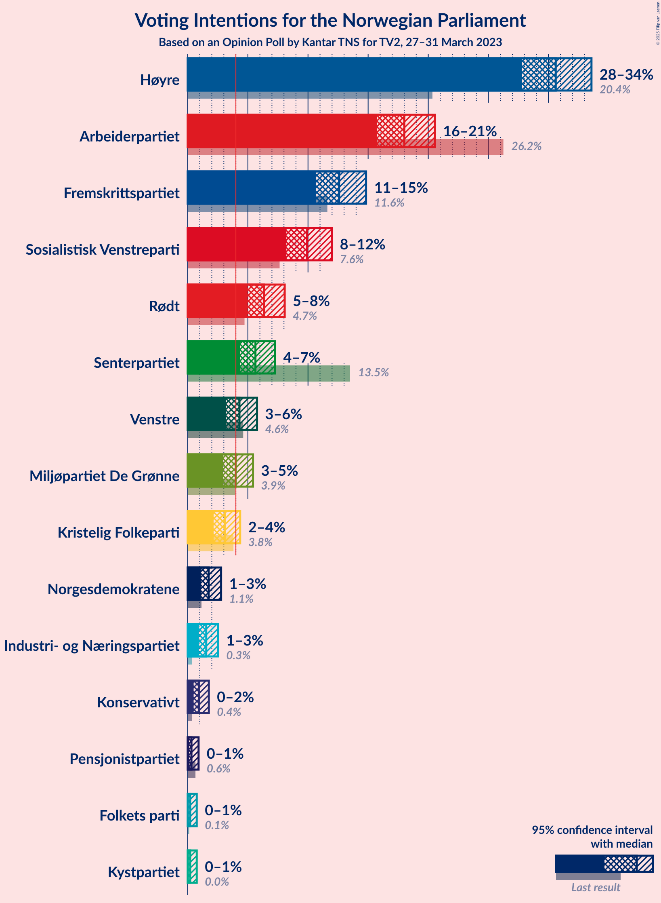

### Confidence Intervals

| Party | Last Result | Poll Result | 80% Confidence Interval | 90% Confidence Interval | 95% Confidence Interval | 99% Confidence Interval |
|:-----:|:-----------:|:-----------:|:-----------------------:|:-----------------------:|:-----------------------:|:-----------------------:|
| Høyre | 20.4% | 30.6% | 28.8–32.5% |28.2–33.1% |27.8–33.6% |26.9–34.5% |
| Arbeiderpartiet | 26.2% | 18.0% | 16.5–19.7% |16.1–20.1% |15.7–20.6% |15.0–21.4% |
| Fremskrittspartiet | 11.6% | 12.6% | 11.3–14.1% |11.0–14.5% |10.7–14.8% |10.1–15.5% |
| Sosialistisk Venstreparti | 7.6% | 9.9% | 8.8–11.3% |8.5–11.6% |8.2–12.0% |7.7–12.6% |
| Rødt | 4.7% | 6.3% | 5.4–7.5% |5.2–7.8% |5.0–8.1% |4.6–8.6% |
| Senterpartiet | 13.5% | 5.6% | 4.8–6.7% |4.5–7.0% |4.3–7.3% |4.0–7.8% |
| Venstre | 4.6% | 4.3% | 3.6–5.3% |3.4–5.5% |3.2–5.8% |2.9–6.3% |
| Miljøpartiet De Grønne | 3.9% | 4.0% | 3.3–4.9% |3.1–5.2% |2.9–5.4% |2.6–5.9% |
| Kristelig Folkeparti | 3.8% | 3.1% | 2.5–3.9% |2.3–4.1% |2.1–4.4% |1.9–4.8% |
| Norgesdemokratene | 1.1% | 1.7% | 1.3–2.4% |1.2–2.6% |1.1–2.8% |0.9–3.1% |
| Industri- og Næringspartiet | 0.3% | 1.5% | 1.1–2.2% |1.0–2.4% |0.9–2.5% |0.8–2.9% |
| Konservativt | 0.4% | 0.9% | 0.6–1.5% |0.5–1.6% |0.5–1.8% |0.4–2.0% |
| Pensjonistpartiet | 0.6% | 0.3% | 0.2–0.7% |0.1–0.8% |0.1–0.9% |0.1–1.1% |
| Folkets parti | 0.1% | 0.2% | 0.1–0.5% |0.1–0.7% |0.1–0.7% |0.0–0.9% |
| Kystpartiet | 0.0% | 0.2% | 0.1–0.5% |0.1–0.7% |0.1–0.7% |0.0–0.9% |

*Note:* The poll result column reflects the actual value used in the calculations. Published results may vary slightly, and in addition be rounded to fewer digits.

## Seats

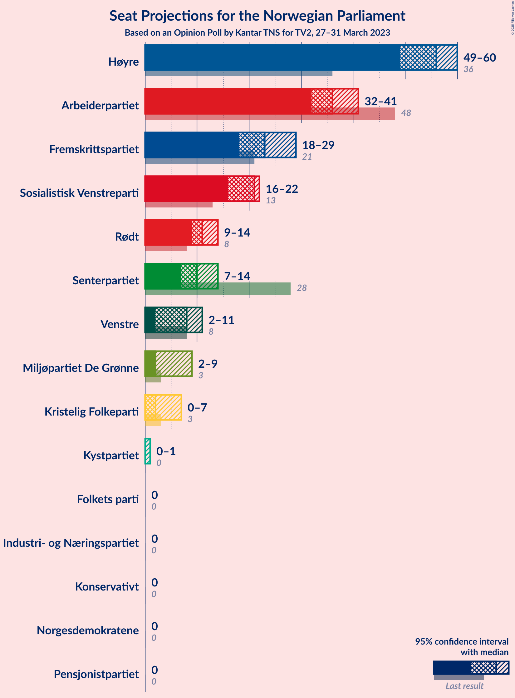

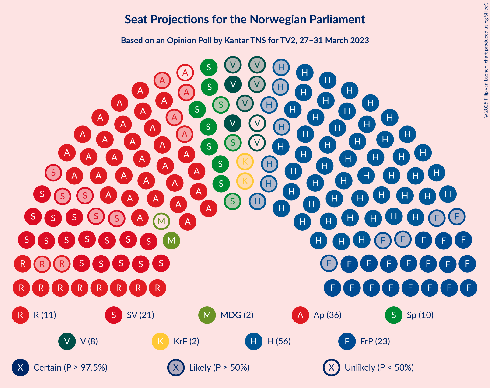

### Confidence Intervals

| Party | Last Result | Median | 80% Confidence Interval | 90% Confidence Interval | 95% Confidence Interval | 99% Confidence Interval |
|:-----:|:-----------:|:------:|:-----------------------:|:-----------------------:|:-----------------------:|:-----------------------:|
| <a href="#høyre">Høyre</a> | 36 | 56 | 52–57 |51–58 |49–60 |49–63 |
| <a href="#arbeiderpartiet">Arbeiderpartiet</a> | 48 | 36 | 33–39 |33–40 |32–41 |28–42 |
| <a href="#fremskrittspartiet">Fremskrittspartiet</a> | 21 | 23 | 20–29 |18–29 |18–29 |17–29 |
| <a href="#sosialistisk-venstreparti">Sosialistisk Venstreparti</a> | 13 | 21 | 17–22 |16–22 |16–22 |14–22 |
| <a href="#rødt">Rødt</a> | 8 | 11 | 9–14 |9–14 |9–14 |8–14 |
| <a href="#senterpartiet">Senterpartiet</a> | 28 | 10 | 9–13 |8–13 |7–14 |2–15 |
| <a href="#venstre">Venstre</a> | 8 | 8 | 2–8 |2–10 |2–11 |2–11 |
| <a href="#miljøpartiet-de-grønne">Miljøpartiet De Grønne</a> | 3 | 2 | 2–9 |2–9 |2–9 |1–11 |
| <a href="#kristelig-folkeparti">Kristelig Folkeparti</a> | 3 | 2 | 1–3 |1–7 |0–7 |0–8 |
| <a href="#norgesdemokratene">Norgesdemokratene</a> | 0 | 0 | 0 |0 |0 |0 |
| <a href="#industri--og-næringspartiet">Industri- og Næringspartiet</a> | 0 | 0 | 0 |0 |0 |0–2 |
| <a href="#konservativt">Konservativt</a> | 0 | 0 | 0 |0 |0 |0 |
| <a href="#pensjonistpartiet">Pensjonistpartiet</a> | 0 | 0 | 0 |0 |0 |0 |
| <a href="#folkets-parti">Folkets parti</a> | 0 | 0 | 0 |0 |0 |0 |
| <a href="#kystpartiet">Kystpartiet</a> | 0 | 0 | 0 |0–1 |0–1 |0–1 |

### Høyre

*For a full overview of the results for this party, see the [Høyre](party-høyre.html) page.*

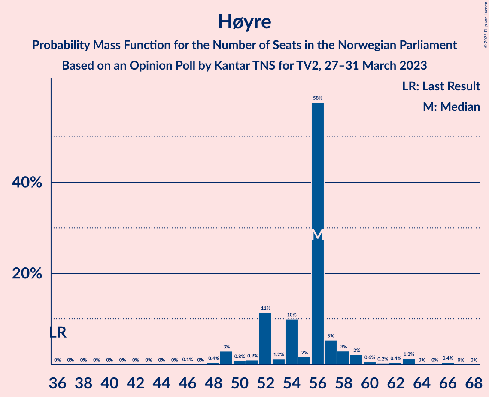

| Number of Seats | Probability | Accumulated | Special Marks |
|:---------------:|:-----------:|:-----------:|:-------------:|
| 36 | 0% | 100% | Last Result |
| 37 | 0% | 100% |  |
| 38 | 0% | 100% |  |
| 39 | 0% | 100% |  |
| 40 | 0% | 100% |  |
| 41 | 0% | 100% |  |
| 42 | 0% | 100% |  |
| 43 | 0% | 100% |  |
| 44 | 0% | 100% |  |
| 45 | 0% | 100% |  |
| 46 | 0.1% | 100% |  |
| 47 | 0% | 99.9% |  |
| 48 | 0.4% | 99.9% |  |
| 49 | 3% | 99.5% |  |
| 50 | 0.8% | 97% |  |
| 51 | 0.9% | 96% |  |
| 52 | 11% | 95% |  |
| 53 | 1.2% | 84% |  |
| 54 | 10% | 82% |  |
| 55 | 2% | 72% |  |
| 56 | 58% | 71% | Median |
| 57 | 5% | 13% |  |
| 58 | 3% | 8% |  |
| 59 | 2% | 5% |  |
| 60 | 0.6% | 3% |  |
| 61 | 0.2% | 2% |  |
| 62 | 0.4% | 2% |  |
| 63 | 1.3% | 2% |  |
| 64 | 0% | 0.5% |  |
| 65 | 0% | 0.5% |  |
| 66 | 0.4% | 0.5% |  |
| 67 | 0% | 0% |  |

### Arbeiderpartiet

*For a full overview of the results for this party, see the [Arbeiderpartiet](party-arbeiderpartiet.html) page.*

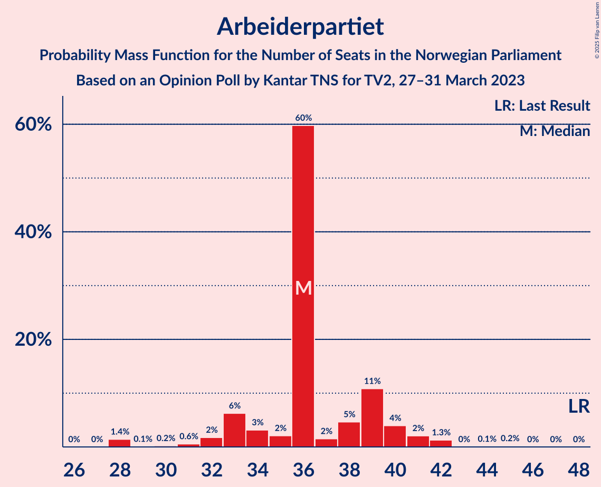

| Number of Seats | Probability | Accumulated | Special Marks |
|:---------------:|:-----------:|:-----------:|:-------------:|
| 28 | 1.4% | 100% |  |
| 29 | 0.1% | 98.5% |  |
| 30 | 0.2% | 98% |  |
| 31 | 0.6% | 98% |  |
| 32 | 2% | 98% |  |
| 33 | 6% | 96% |  |
| 34 | 3% | 90% |  |
| 35 | 2% | 87% |  |
| 36 | 60% | 84% | Median |
| 37 | 2% | 25% |  |
| 38 | 5% | 23% |  |
| 39 | 11% | 18% |  |
| 40 | 4% | 8% |  |
| 41 | 2% | 4% |  |
| 42 | 1.3% | 2% |  |
| 43 | 0% | 0.3% |  |
| 44 | 0.1% | 0.3% |  |
| 45 | 0.2% | 0.2% |  |
| 46 | 0% | 0% |  |
| 47 | 0% | 0% |  |
| 48 | 0% | 0% | Last Result |

### Fremskrittspartiet

*For a full overview of the results for this party, see the [Fremskrittspartiet](party-fremskrittspartiet.html) page.*

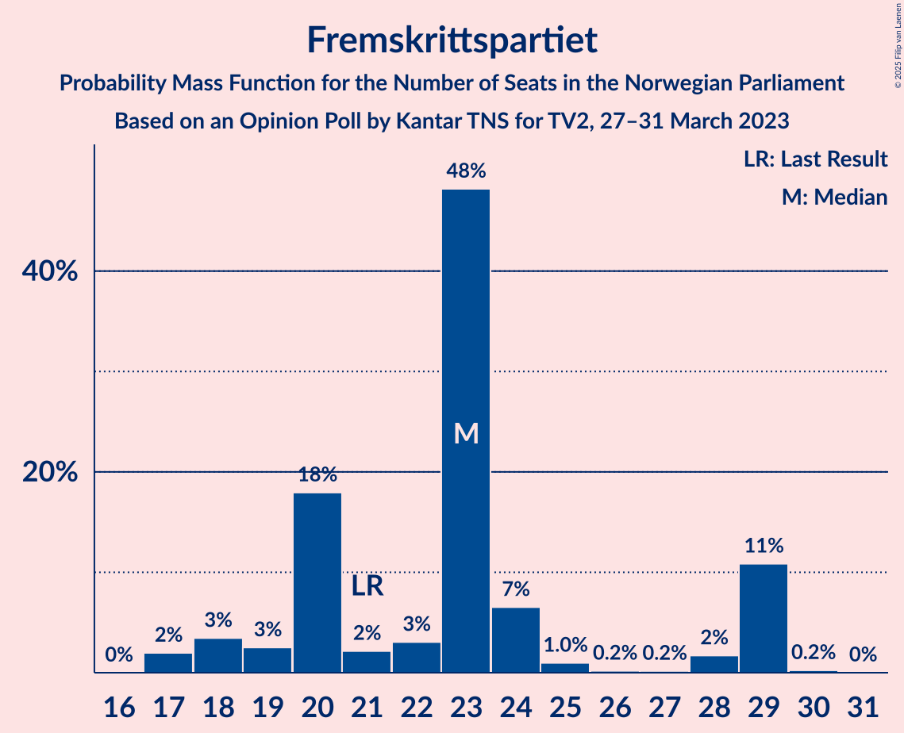

| Number of Seats | Probability | Accumulated | Special Marks |
|:---------------:|:-----------:|:-----------:|:-------------:|
| 17 | 2% | 100% |  |
| 18 | 3% | 98% |  |
| 19 | 3% | 95% |  |
| 20 | 18% | 92% |  |
| 21 | 2% | 74% | Last Result |
| 22 | 3% | 72% |  |
| 23 | 48% | 69% | Median |
| 24 | 7% | 21% |  |
| 25 | 1.0% | 14% |  |
| 26 | 0.2% | 13% |  |
| 27 | 0.2% | 13% |  |
| 28 | 2% | 13% |  |
| 29 | 11% | 11% |  |
| 30 | 0.2% | 0.3% |  |
| 31 | 0% | 0% |  |

### Sosialistisk Venstreparti

*For a full overview of the results for this party, see the [Sosialistisk Venstreparti](party-sosialistiskvenstreparti.html) page.*

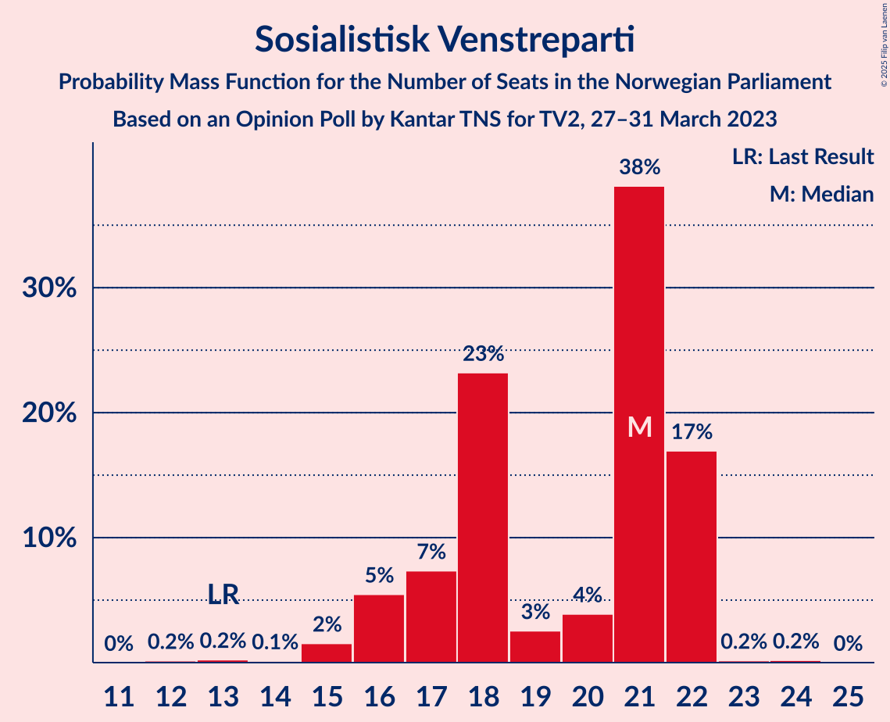

| Number of Seats | Probability | Accumulated | Special Marks |
|:---------------:|:-----------:|:-----------:|:-------------:|
| 12 | 0.2% | 100% |  |
| 13 | 0.2% | 99.8% | Last Result |
| 14 | 0.1% | 99.6% |  |
| 15 | 2% | 99.5% |  |
| 16 | 5% | 98% |  |
| 17 | 7% | 92% |  |
| 18 | 23% | 85% |  |
| 19 | 3% | 62% |  |
| 20 | 4% | 59% |  |
| 21 | 38% | 55% | Median |
| 22 | 17% | 17% |  |
| 23 | 0.2% | 0.4% |  |
| 24 | 0.2% | 0.2% |  |
| 25 | 0% | 0% |  |

### Rødt

*For a full overview of the results for this party, see the [Rødt](party-rødt.html) page.*

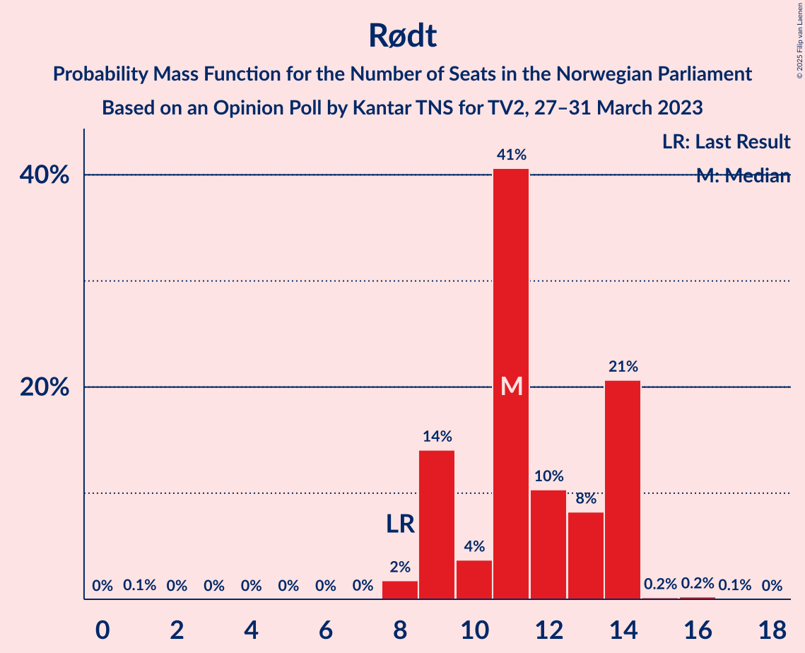

| Number of Seats | Probability | Accumulated | Special Marks |
|:---------------:|:-----------:|:-----------:|:-------------:|
| 1 | 0.1% | 100% |  |
| 2 | 0% | 99.9% |  |
| 3 | 0% | 99.9% |  |
| 4 | 0% | 99.9% |  |
| 5 | 0% | 99.9% |  |
| 6 | 0% | 99.9% |  |
| 7 | 0% | 99.9% |  |
| 8 | 2% | 99.9% | Last Result |
| 9 | 14% | 98% |  |
| 10 | 4% | 84% |  |
| 11 | 41% | 80% | Median |
| 12 | 10% | 40% |  |
| 13 | 8% | 29% |  |
| 14 | 21% | 21% |  |
| 15 | 0.2% | 0.5% |  |
| 16 | 0.2% | 0.3% |  |
| 17 | 0.1% | 0.1% |  |
| 18 | 0% | 0% |  |

### Senterpartiet

*For a full overview of the results for this party, see the [Senterpartiet](party-senterpartiet.html) page.*

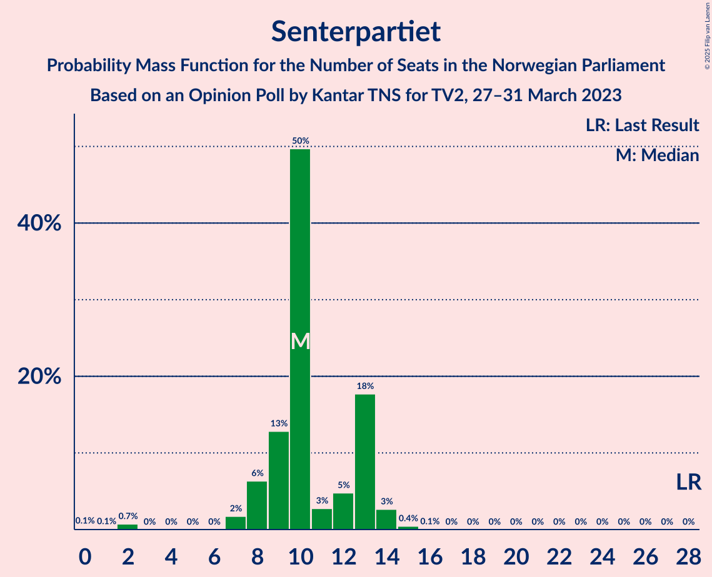

| Number of Seats | Probability | Accumulated | Special Marks |
|:---------------:|:-----------:|:-----------:|:-------------:|
| 0 | 0.1% | 100% |  |
| 1 | 0.1% | 99.9% |  |
| 2 | 0.7% | 99.8% |  |
| 3 | 0% | 99.1% |  |
| 4 | 0% | 99.1% |  |
| 5 | 0% | 99.1% |  |
| 6 | 0% | 99.1% |  |
| 7 | 2% | 99.0% |  |
| 8 | 6% | 97% |  |
| 9 | 13% | 91% |  |
| 10 | 50% | 78% | Median |
| 11 | 3% | 28% |  |
| 12 | 5% | 26% |  |
| 13 | 18% | 21% |  |
| 14 | 3% | 3% |  |
| 15 | 0.4% | 0.5% |  |
| 16 | 0.1% | 0.1% |  |
| 17 | 0% | 0% |  |
| 18 | 0% | 0% |  |
| 19 | 0% | 0% |  |
| 20 | 0% | 0% |  |
| 21 | 0% | 0% |  |
| 22 | 0% | 0% |  |
| 23 | 0% | 0% |  |
| 24 | 0% | 0% |  |
| 25 | 0% | 0% |  |
| 26 | 0% | 0% |  |
| 27 | 0% | 0% |  |
| 28 | 0% | 0% | Last Result |

### Venstre

*For a full overview of the results for this party, see the [Venstre](party-venstre.html) page.*

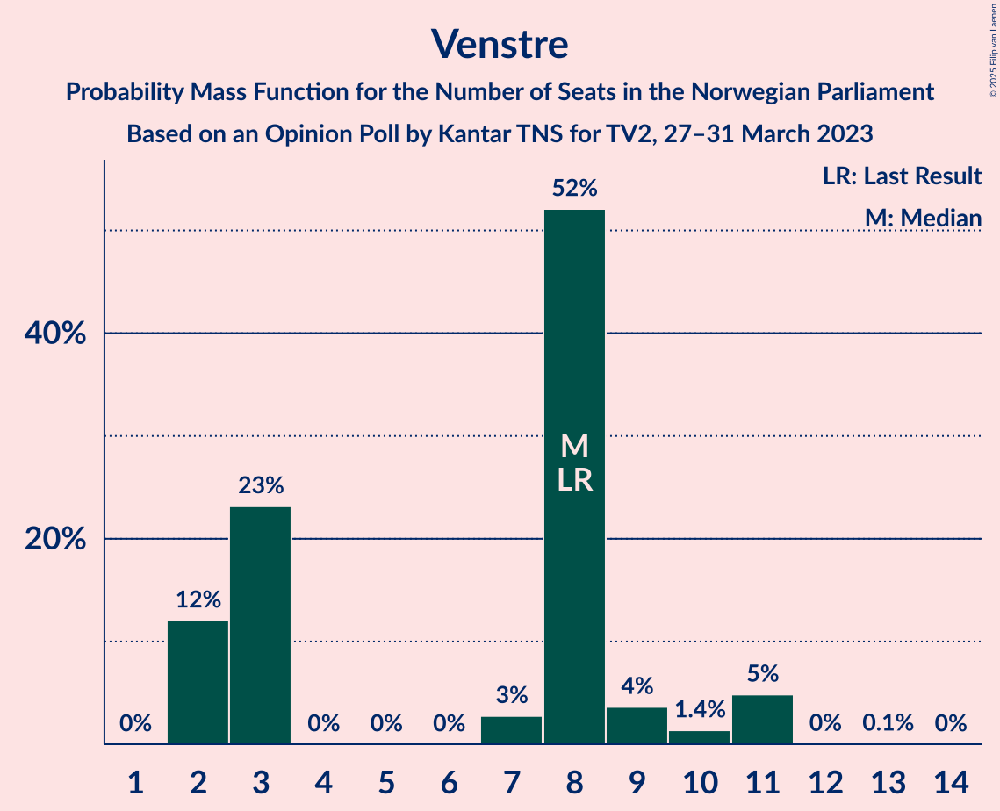

| Number of Seats | Probability | Accumulated | Special Marks |
|:---------------:|:-----------:|:-----------:|:-------------:|
| 2 | 12% | 100% |  |
| 3 | 23% | 88% |  |
| 4 | 0% | 65% |  |
| 5 | 0% | 65% |  |
| 6 | 0% | 65% |  |
| 7 | 3% | 65% |  |
| 8 | 52% | 62% | Last Result, Median |
| 9 | 4% | 10% |  |
| 10 | 1.4% | 6% |  |
| 11 | 5% | 5% |  |
| 12 | 0% | 0.1% |  |
| 13 | 0.1% | 0.1% |  |
| 14 | 0% | 0% |  |

### Miljøpartiet De Grønne

*For a full overview of the results for this party, see the [Miljøpartiet De Grønne](party-miljøpartietdegrønne.html) page.*

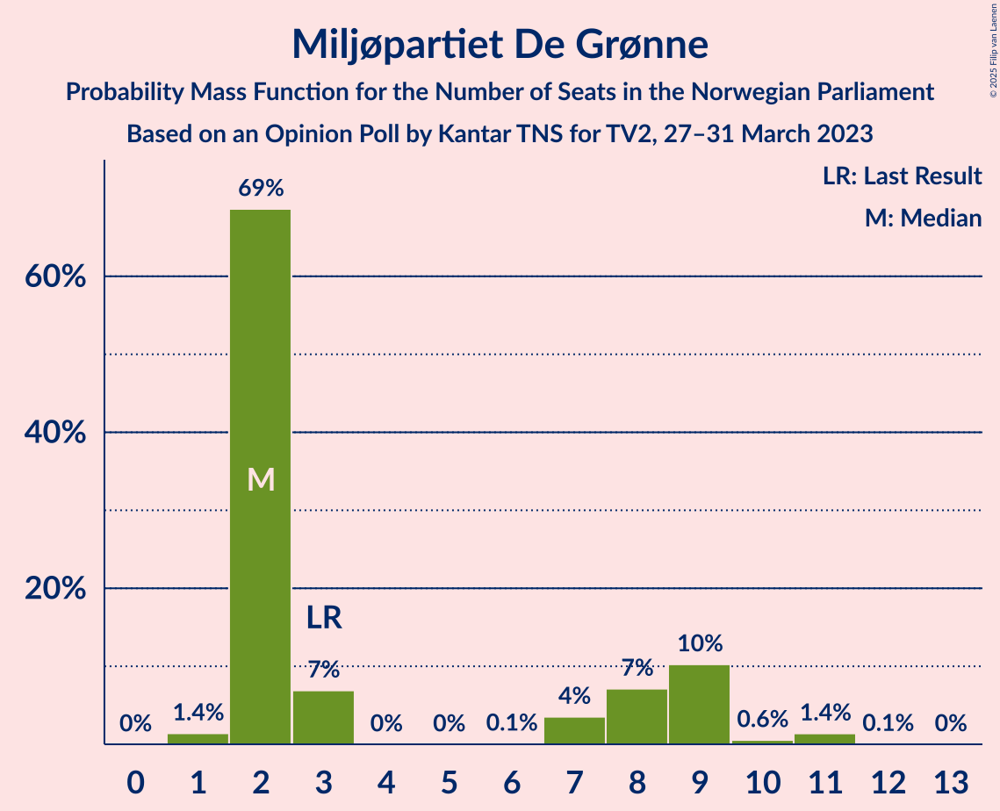

| Number of Seats | Probability | Accumulated | Special Marks |
|:---------------:|:-----------:|:-----------:|:-------------:|
| 1 | 1.4% | 100% |  |
| 2 | 69% | 98.6% | Median |
| 3 | 7% | 30% | Last Result |
| 4 | 0% | 23% |  |
| 5 | 0% | 23% |  |
| 6 | 0.1% | 23% |  |
| 7 | 4% | 23% |  |
| 8 | 7% | 19% |  |
| 9 | 10% | 12% |  |
| 10 | 0.6% | 2% |  |
| 11 | 1.4% | 1.5% |  |
| 12 | 0.1% | 0.1% |  |
| 13 | 0% | 0% |  |

### Kristelig Folkeparti

*For a full overview of the results for this party, see the [Kristelig Folkeparti](party-kristeligfolkeparti.html) page.*

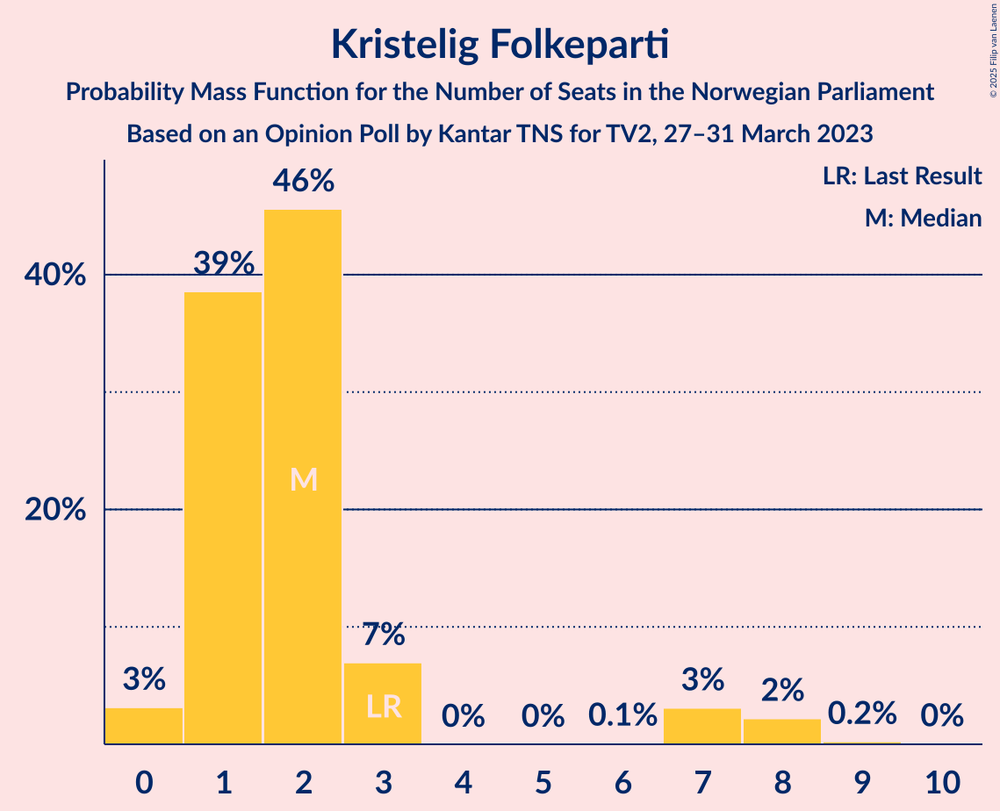

| Number of Seats | Probability | Accumulated | Special Marks |
|:---------------:|:-----------:|:-----------:|:-------------:|
| 0 | 3% | 100% |  |
| 1 | 39% | 97% |  |
| 2 | 46% | 58% | Median |
| 3 | 7% | 13% | Last Result |
| 4 | 0% | 6% |  |
| 5 | 0% | 6% |  |
| 6 | 0.1% | 6% |  |
| 7 | 3% | 6% |  |
| 8 | 2% | 2% |  |
| 9 | 0.2% | 0.3% |  |
| 10 | 0% | 0% |  |

### Norgesdemokratene

*For a full overview of the results for this party, see the [Norgesdemokratene](party-norgesdemokratene.html) page.*

| Number of Seats | Probability | Accumulated | Special Marks |
|:---------------:|:-----------:|:-----------:|:-------------:|
| 0 | 100% | 100% | Last Result, Median |

### Industri- og Næringspartiet

*For a full overview of the results for this party, see the [Industri- og Næringspartiet](party-industri-ognæringspartiet.html) page.*

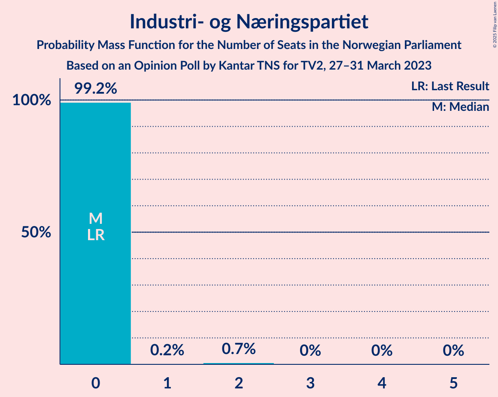

| Number of Seats | Probability | Accumulated | Special Marks |
|:---------------:|:-----------:|:-----------:|:-------------:|
| 0 | 99.2% | 100% | Last Result, Median |
| 1 | 0.2% | 0.8% |  |
| 2 | 0.7% | 0.7% |  |
| 3 | 0% | 0% |  |

### Konservativt

*For a full overview of the results for this party, see the [Konservativt](party-konservativt.html) page.*

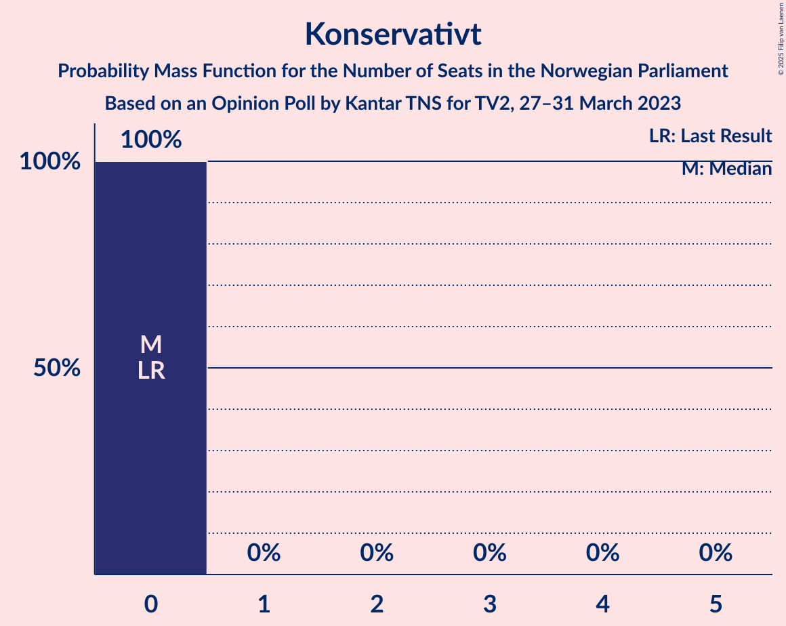

| Number of Seats | Probability | Accumulated | Special Marks |
|:---------------:|:-----------:|:-----------:|:-------------:|
| 0 | 100% | 100% | Last Result, Median |

### Pensjonistpartiet

*For a full overview of the results for this party, see the [Pensjonistpartiet](party-pensjonistpartiet.html) page.*

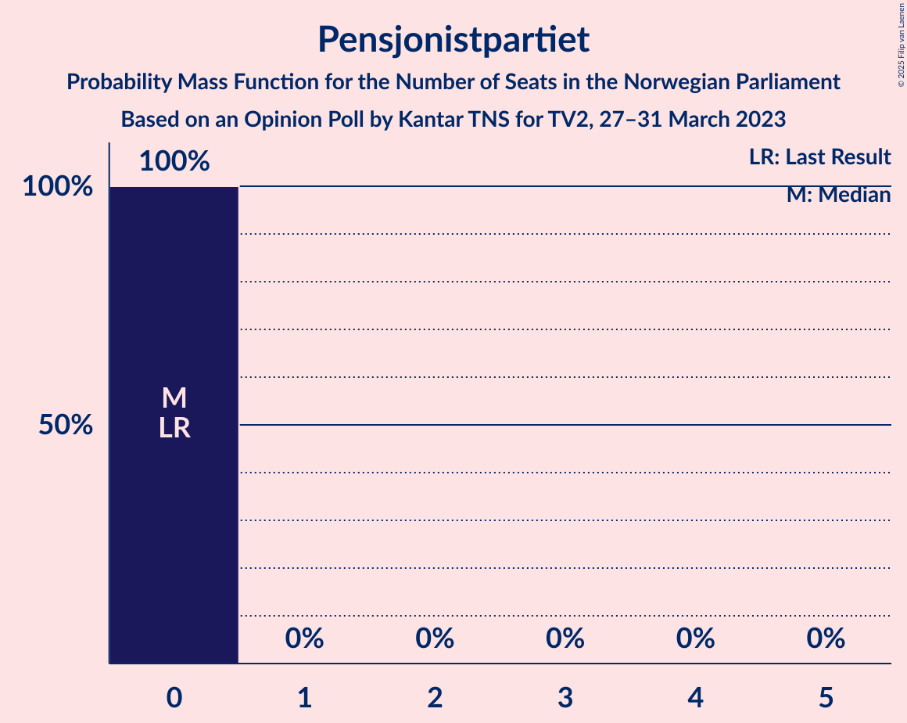

| Number of Seats | Probability | Accumulated | Special Marks |
|:---------------:|:-----------:|:-----------:|:-------------:|
| 0 | 100% | 100% | Last Result, Median |

### Folkets parti

*For a full overview of the results for this party, see the [Folkets parti](party-folketsparti.html) page.*

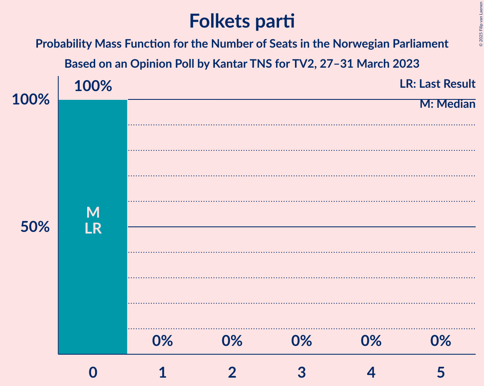

| Number of Seats | Probability | Accumulated | Special Marks |
|:---------------:|:-----------:|:-----------:|:-------------:|
| 0 | 100% | 100% | Last Result, Median |

### Kystpartiet

*For a full overview of the results for this party, see the [Kystpartiet](party-kystpartiet.html) page.*

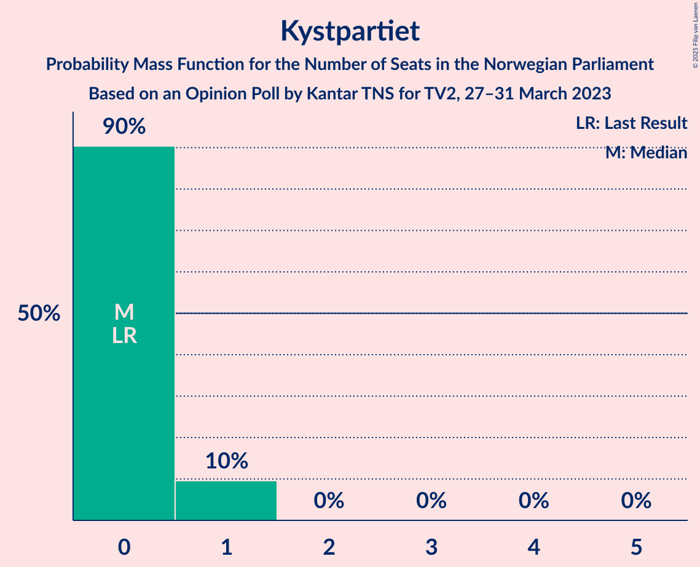

| Number of Seats | Probability | Accumulated | Special Marks |
|:---------------:|:-----------:|:-----------:|:-------------:|
| 0 | 90% | 100% | Last Result, Median |
| 1 | 10% | 10% |  |
| 2 | 0% | 0% |  |

## Coalitions

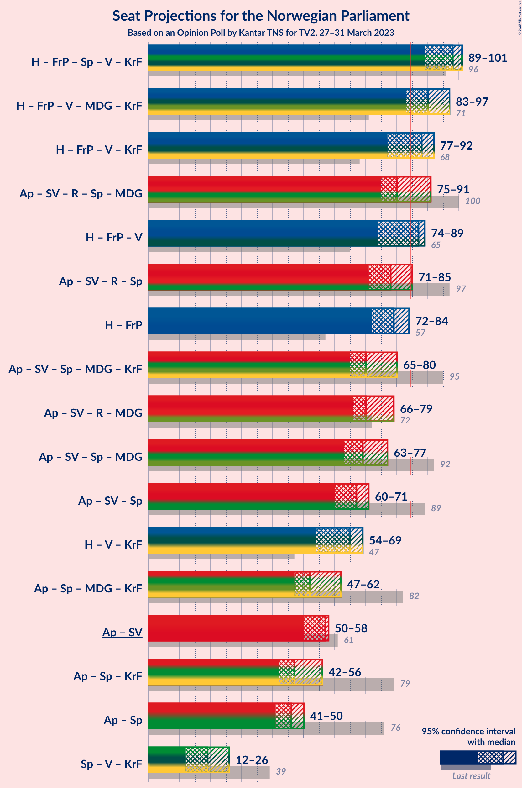

### Confidence Intervals

| Coalition | Last Result | Median | Majority? | 80% Confidence Interval | 90% Confidence Interval | 95% Confidence Interval | 99% Confidence Interval |
|:---------:|:-----------:|:------:|:---------:|:-----------------------:|:-----------------------:|:-----------------------:|:-----------------------:|
| Høyre – Fremskrittspartiet – Senterpartiet – Venstre – Kristelig Folkeparti | 96 | 98 | 100% | 94–100 | 92–101 | 89–101 | 87–107 |
| Høyre – Fremskrittspartiet – Venstre – Miljøpartiet De Grønne – Kristelig Folkeparti | 71 | 90 | 84% | 83–94 | 83–96 | 83–97 | 83–101 |
| Høyre – Fremskrittspartiet – Venstre – Kristelig Folkeparti | 68 | 88 | 73% | 81–91 | 81–91 | 77–92 | 77–94 |
| Arbeiderpartiet – Sosialistisk Venstreparti – Rødt – Senterpartiet – Miljøpartiet De Grønne | 100 | 80 | 23% | 77–87 | 76–87 | 75–91 | 74–91 |
| Høyre – Fremskrittspartiet – Venstre | 65 | 87 | 60% | 79–89 | 78–89 | 74–89 | 74–92 |
| Arbeiderpartiet – Sosialistisk Venstreparti – Rødt – Senterpartiet | 97 | 78 | 16% | 74–85 | 72–85 | 71–85 | 66–85 |
| Høyre – Fremskrittspartiet | 57 | 79 | 2% | 74–81 | 72–83 | 72–84 | 68–86 |
| Arbeiderpartiet – Sosialistisk Venstreparti – Senterpartiet – Miljøpartiet De Grønne – Kristelig Folkeparti | 95 | 70 | 0% | 70–76 | 65–78 | 65–80 | 65–82 |
| Arbeiderpartiet – Sosialistisk Venstreparti – Rødt – Miljøpartiet De Grønne | 72 | 70 | 0% | 68–74 | 66–76 | 66–79 | 61–81 |
| Arbeiderpartiet – Sosialistisk Venstreparti – Senterpartiet – Miljøpartiet De Grønne | 92 | 69 | 0% | 68–74 | 63–75 | 63–77 | 63–77 |
| Arbeiderpartiet – Sosialistisk Venstreparti – Senterpartiet | 89 | 67 | 0% | 61–71 | 61–71 | 60–71 | 54–71 |
| Høyre – Venstre – Kristelig Folkeparti | 47 | 65 | 0% | 60–67 | 58–67 | 54–69 | 54–71 |
| Arbeiderpartiet – Senterpartiet – Miljøpartiet De Grønne – Kristelig Folkeparti | 82 | 52 | 0% | 49–59 | 47–61 | 47–62 | 46–64 |
| Arbeiderpartiet – Sosialistisk Venstreparti | 61 | 57 | 0% | 51–58 | 51–58 | 50–58 | 46–58 |
| Arbeiderpartiet – Senterpartiet – Kristelig Folkeparti | 79 | 47 | 0% | 45–53 | 45–54 | 42–56 | 38–57 |
| Arbeiderpartiet – Senterpartiet | 76 | 46 | 0% | 43–50 | 42–50 | 41–50 | 36–52 |
| Senterpartiet – Venstre – Kristelig Folkeparti | 39 | 19 | 0% | 15–23 | 12–24 | 12–26 | 6–29 |

### Høyre – Fremskrittspartiet – Senterpartiet – Venstre – Kristelig Folkeparti

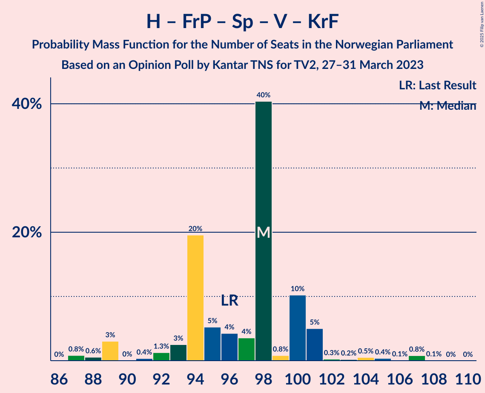

| Number of Seats | Probability | Accumulated | Special Marks |
|:---------------:|:-----------:|:-----------:|:-------------:|
| 87 | 0.8% | 100% |  |
| 88 | 0.6% | 99.2% |  |
| 89 | 3% | 98.6% |  |
| 90 | 0% | 96% |  |
| 91 | 0.4% | 96% |  |
| 92 | 1.3% | 95% |  |
| 93 | 3% | 94% |  |
| 94 | 20% | 91% |  |
| 95 | 5% | 72% |  |
| 96 | 4% | 67% | Last Result |
| 97 | 4% | 62% |  |
| 98 | 40% | 59% |  |
| 99 | 0.8% | 18% | Median |
| 100 | 10% | 18% |  |
| 101 | 5% | 7% |  |
| 102 | 0.3% | 2% |  |
| 103 | 0.2% | 2% |  |
| 104 | 0.5% | 2% |  |
| 105 | 0.4% | 1.3% |  |
| 106 | 0.1% | 0.9% |  |
| 107 | 0.8% | 0.9% |  |
| 108 | 0.1% | 0.1% |  |
| 109 | 0% | 0% |  |

### Høyre – Fremskrittspartiet – Venstre – Miljøpartiet De Grønne – Kristelig Folkeparti

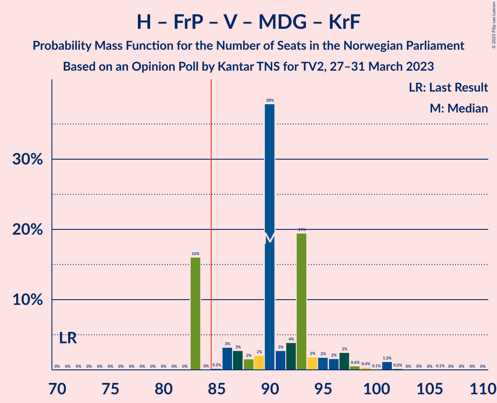

| Number of Seats | Probability | Accumulated | Special Marks |
|:---------------:|:-----------:|:-----------:|:-------------:|
| 71 | 0% | 100% | Last Result |
| 72 | 0% | 100% |  |
| 73 | 0% | 100% |  |
| 74 | 0% | 100% |  |
| 75 | 0% | 100% |  |
| 76 | 0% | 100% |  |
| 77 | 0% | 100% |  |
| 78 | 0% | 100% |  |
| 79 | 0% | 100% |  |
| 80 | 0% | 100% |  |
| 81 | 0% | 100% |  |
| 82 | 0% | 100% |  |
| 83 | 16% | 100% |  |
| 84 | 0% | 84% |  |
| 85 | 0.2% | 84% | Majority |
| 86 | 3% | 84% |  |
| 87 | 3% | 80% |  |
| 88 | 2% | 78% |  |
| 89 | 2% | 76% |  |
| 90 | 38% | 74% |  |
| 91 | 3% | 36% | Median |
| 92 | 4% | 33% |  |
| 93 | 19% | 30% |  |
| 94 | 2% | 10% |  |
| 95 | 2% | 8% |  |
| 96 | 2% | 7% |  |
| 97 | 2% | 5% |  |
| 98 | 0.6% | 2% |  |
| 99 | 0.4% | 2% |  |
| 100 | 0.1% | 2% |  |
| 101 | 1.2% | 1.5% |  |
| 102 | 0.2% | 0.3% |  |
| 103 | 0% | 0.1% |  |
| 104 | 0% | 0.1% |  |
| 105 | 0% | 0.1% |  |
| 106 | 0.1% | 0.1% |  |
| 107 | 0% | 0% |  |

### Høyre – Fremskrittspartiet – Venstre – Kristelig Folkeparti

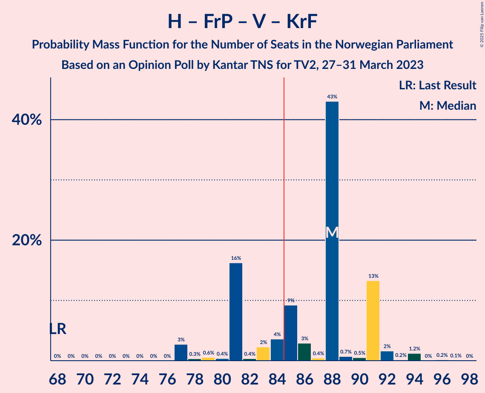

| Number of Seats | Probability | Accumulated | Special Marks |
|:---------------:|:-----------:|:-----------:|:-------------:|
| 68 | 0% | 100% | Last Result |
| 69 | 0% | 100% |  |
| 70 | 0% | 100% |  |
| 71 | 0% | 100% |  |
| 72 | 0% | 100% |  |
| 73 | 0% | 100% |  |
| 74 | 0% | 100% |  |
| 75 | 0% | 100% |  |
| 76 | 0% | 100% |  |
| 77 | 3% | 100% |  |
| 78 | 0.3% | 97% |  |
| 79 | 0.6% | 97% |  |
| 80 | 0.4% | 96% |  |
| 81 | 16% | 96% |  |
| 82 | 0.4% | 80% |  |
| 83 | 2% | 79% |  |
| 84 | 4% | 77% |  |
| 85 | 9% | 73% | Majority |
| 86 | 3% | 64% |  |
| 87 | 0.4% | 61% |  |
| 88 | 43% | 61% |  |
| 89 | 0.7% | 18% | Median |
| 90 | 0.5% | 17% |  |
| 91 | 13% | 17% |  |
| 92 | 2% | 3% |  |
| 93 | 0.2% | 2% |  |
| 94 | 1.2% | 2% |  |
| 95 | 0% | 0.3% |  |
| 96 | 0.2% | 0.3% |  |
| 97 | 0.1% | 0.1% |  |
| 98 | 0% | 0% |  |

### Arbeiderpartiet – Sosialistisk Venstreparti – Rødt – Senterpartiet – Miljøpartiet De Grønne

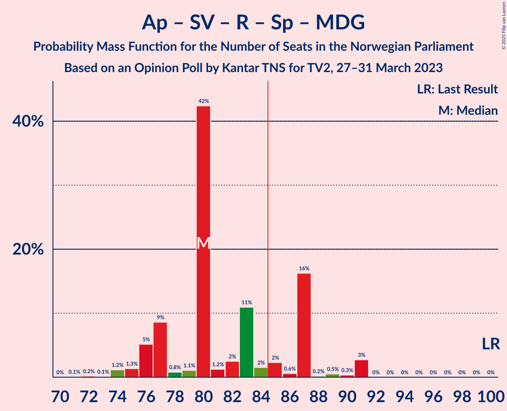

| Number of Seats | Probability | Accumulated | Special Marks |
|:---------------:|:-----------:|:-----------:|:-------------:|
| 71 | 0.1% | 100% |  |
| 72 | 0.2% | 99.9% |  |
| 73 | 0.1% | 99.7% |  |
| 74 | 1.2% | 99.6% |  |
| 75 | 1.3% | 98% |  |
| 76 | 5% | 97% |  |
| 77 | 9% | 92% |  |
| 78 | 0.8% | 83% |  |
| 79 | 1.1% | 83% |  |
| 80 | 42% | 81% | Median |
| 81 | 1.2% | 39% |  |
| 82 | 2% | 38% |  |
| 83 | 11% | 35% |  |
| 84 | 2% | 24% |  |
| 85 | 2% | 23% | Majority |
| 86 | 0.6% | 21% |  |
| 87 | 16% | 20% |  |
| 88 | 0.2% | 4% |  |
| 89 | 0.5% | 4% |  |
| 90 | 0.3% | 3% |  |
| 91 | 3% | 3% |  |
| 92 | 0% | 0% |  |
| 93 | 0% | 0% |  |
| 94 | 0% | 0% |  |
| 95 | 0% | 0% |  |
| 96 | 0% | 0% |  |
| 97 | 0% | 0% |  |
| 98 | 0% | 0% |  |
| 99 | 0% | 0% |  |
| 100 | 0% | 0% | Last Result |

### Høyre – Fremskrittspartiet – Venstre

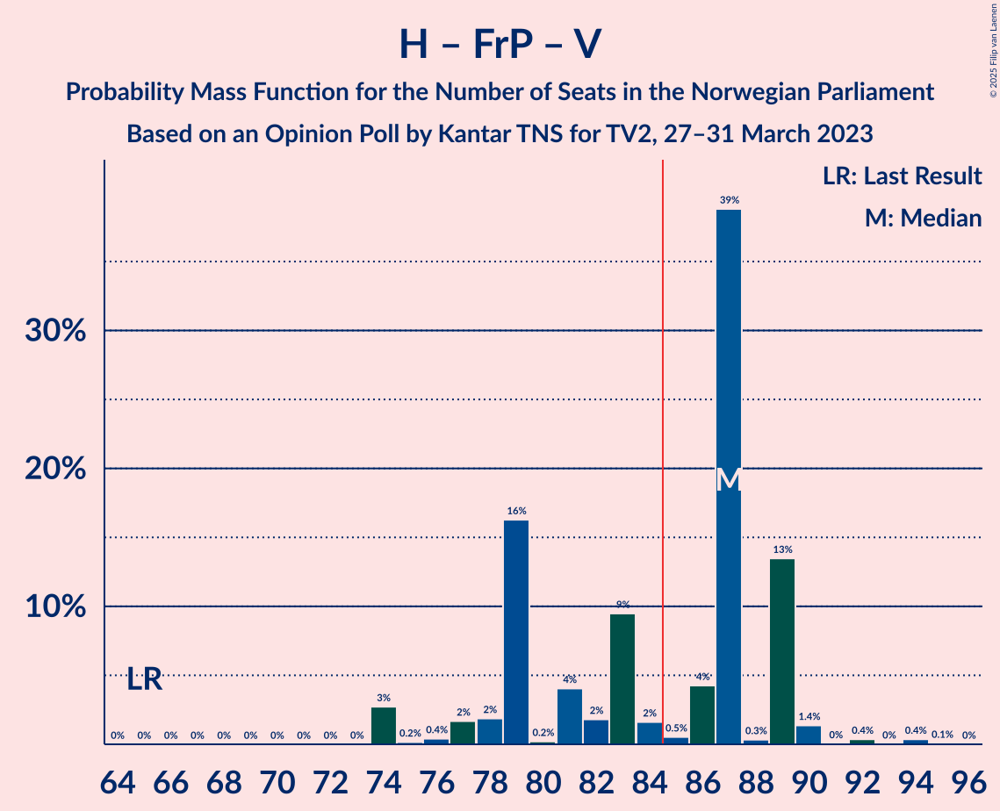

| Number of Seats | Probability | Accumulated | Special Marks |
|:---------------:|:-----------:|:-----------:|:-------------:|
| 65 | 0% | 100% | Last Result |
| 66 | 0% | 100% |  |
| 67 | 0% | 100% |  |
| 68 | 0% | 100% |  |
| 69 | 0% | 100% |  |
| 70 | 0% | 100% |  |
| 71 | 0% | 100% |  |
| 72 | 0% | 100% |  |
| 73 | 0% | 100% |  |
| 74 | 3% | 100% |  |
| 75 | 0.2% | 97% |  |
| 76 | 0.4% | 97% |  |
| 77 | 2% | 97% |  |
| 78 | 2% | 95% |  |
| 79 | 16% | 93% |  |
| 80 | 0.2% | 77% |  |
| 81 | 4% | 77% |  |
| 82 | 2% | 73% |  |
| 83 | 9% | 71% |  |
| 84 | 2% | 61% |  |
| 85 | 0.5% | 60% | Majority |
| 86 | 4% | 59% |  |
| 87 | 39% | 55% | Median |
| 88 | 0.3% | 16% |  |
| 89 | 13% | 16% |  |
| 90 | 1.4% | 2% |  |
| 91 | 0% | 0.9% |  |
| 92 | 0.4% | 0.9% |  |
| 93 | 0% | 0.5% |  |
| 94 | 0.4% | 0.5% |  |
| 95 | 0.1% | 0.1% |  |
| 96 | 0% | 0% |  |

### Arbeiderpartiet – Sosialistisk Venstreparti – Rødt – Senterpartiet

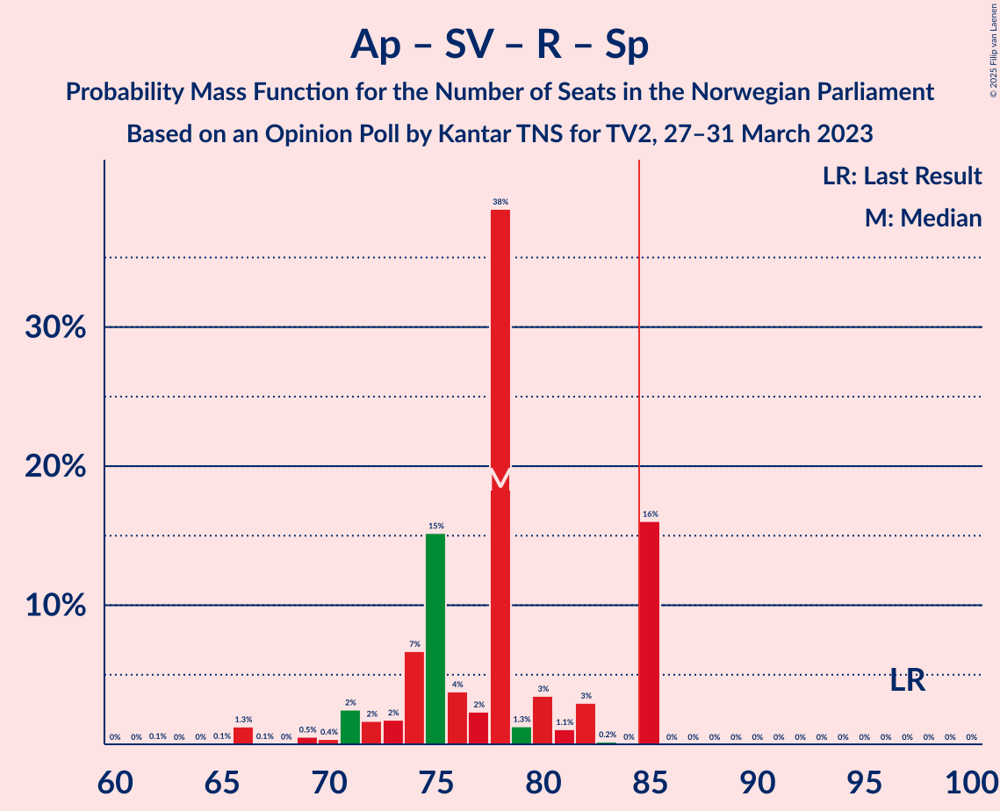

| Number of Seats | Probability | Accumulated | Special Marks |
|:---------------:|:-----------:|:-----------:|:-------------:|
| 62 | 0.1% | 100% |  |
| 63 | 0% | 99.9% |  |
| 64 | 0% | 99.9% |  |
| 65 | 0.1% | 99.9% |  |
| 66 | 1.3% | 99.8% |  |
| 67 | 0.1% | 98.5% |  |
| 68 | 0% | 98% |  |
| 69 | 0.5% | 98% |  |
| 70 | 0.4% | 98% |  |
| 71 | 2% | 98% |  |
| 72 | 2% | 95% |  |
| 73 | 2% | 93% |  |
| 74 | 7% | 92% |  |
| 75 | 15% | 85% |  |
| 76 | 4% | 70% |  |
| 77 | 2% | 66% |  |
| 78 | 38% | 64% | Median |
| 79 | 1.3% | 25% |  |
| 80 | 3% | 24% |  |
| 81 | 1.1% | 20% |  |
| 82 | 3% | 19% |  |
| 83 | 0.2% | 16% |  |
| 84 | 0% | 16% |  |
| 85 | 16% | 16% | Majority |
| 86 | 0% | 0% |  |
| 87 | 0% | 0% |  |
| 88 | 0% | 0% |  |
| 89 | 0% | 0% |  |
| 90 | 0% | 0% |  |
| 91 | 0% | 0% |  |
| 92 | 0% | 0% |  |
| 93 | 0% | 0% |  |
| 94 | 0% | 0% |  |
| 95 | 0% | 0% |  |
| 96 | 0% | 0% |  |
| 97 | 0% | 0% | Last Result |

### Høyre – Fremskrittspartiet

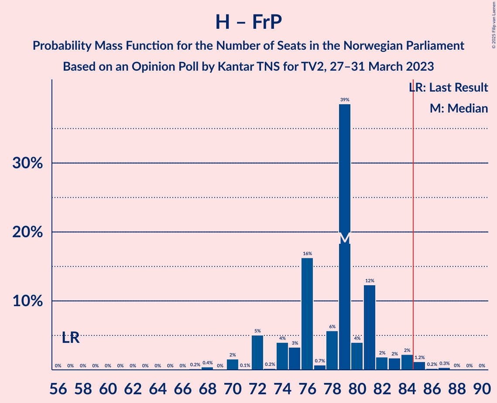

| Number of Seats | Probability | Accumulated | Special Marks |
|:---------------:|:-----------:|:-----------:|:-------------:|
| 57 | 0% | 100% | Last Result |
| 58 | 0% | 100% |  |
| 59 | 0% | 100% |  |
| 60 | 0% | 100% |  |
| 61 | 0% | 100% |  |
| 62 | 0% | 100% |  |
| 63 | 0% | 100% |  |
| 64 | 0% | 100% |  |
| 65 | 0% | 100% |  |
| 66 | 0% | 100% |  |
| 67 | 0.2% | 100% |  |
| 68 | 0.4% | 99.8% |  |
| 69 | 0% | 99.4% |  |
| 70 | 2% | 99.4% |  |
| 71 | 0.1% | 98% |  |
| 72 | 5% | 98% |  |
| 73 | 0.2% | 93% |  |
| 74 | 4% | 93% |  |
| 75 | 3% | 89% |  |
| 76 | 16% | 85% |  |
| 77 | 0.7% | 69% |  |
| 78 | 6% | 68% |  |
| 79 | 39% | 63% | Median |
| 80 | 4% | 24% |  |
| 81 | 12% | 20% |  |
| 82 | 2% | 8% |  |
| 83 | 2% | 6% |  |
| 84 | 2% | 4% |  |
| 85 | 1.2% | 2% | Majority |
| 86 | 0.2% | 0.6% |  |
| 87 | 0.3% | 0.4% |  |
| 88 | 0% | 0.1% |  |
| 89 | 0% | 0% |  |

### Arbeiderpartiet – Sosialistisk Venstreparti – Senterpartiet – Miljøpartiet De Grønne – Kristelig Folkeparti

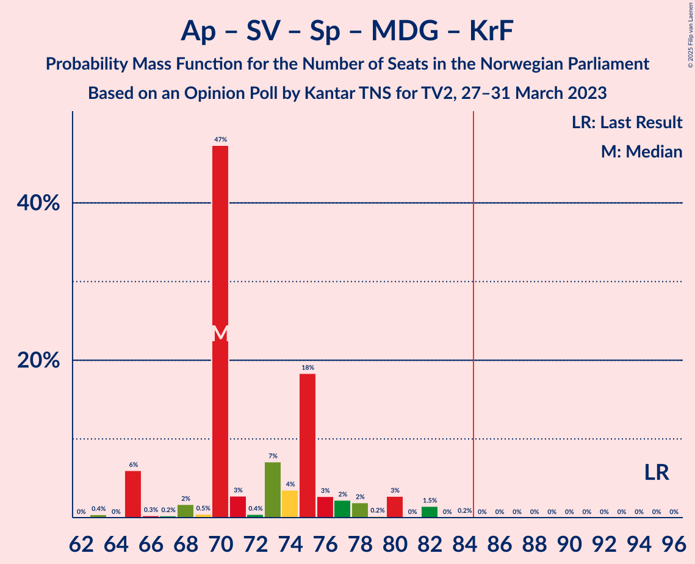

| Number of Seats | Probability | Accumulated | Special Marks |
|:---------------:|:-----------:|:-----------:|:-------------:|
| 62 | 0% | 100% |  |
| 63 | 0.4% | 99.9% |  |
| 64 | 0% | 99.5% |  |
| 65 | 6% | 99.5% |  |
| 66 | 0.3% | 94% |  |
| 67 | 0.2% | 93% |  |
| 68 | 2% | 93% |  |
| 69 | 0.5% | 91% |  |
| 70 | 47% | 91% |  |
| 71 | 3% | 44% | Median |
| 72 | 0.4% | 41% |  |
| 73 | 7% | 40% |  |
| 74 | 4% | 33% |  |
| 75 | 18% | 30% |  |
| 76 | 3% | 11% |  |
| 77 | 2% | 9% |  |
| 78 | 2% | 6% |  |
| 79 | 0.2% | 5% |  |
| 80 | 3% | 4% |  |
| 81 | 0% | 2% |  |
| 82 | 1.5% | 2% |  |
| 83 | 0% | 0.2% |  |
| 84 | 0.2% | 0.2% |  |
| 85 | 0% | 0% | Majority |
| 86 | 0% | 0% |  |
| 87 | 0% | 0% |  |
| 88 | 0% | 0% |  |
| 89 | 0% | 0% |  |
| 90 | 0% | 0% |  |
| 91 | 0% | 0% |  |
| 92 | 0% | 0% |  |
| 93 | 0% | 0% |  |
| 94 | 0% | 0% |  |
| 95 | 0% | 0% | Last Result |

### Arbeiderpartiet – Sosialistisk Venstreparti – Rødt – Miljøpartiet De Grønne

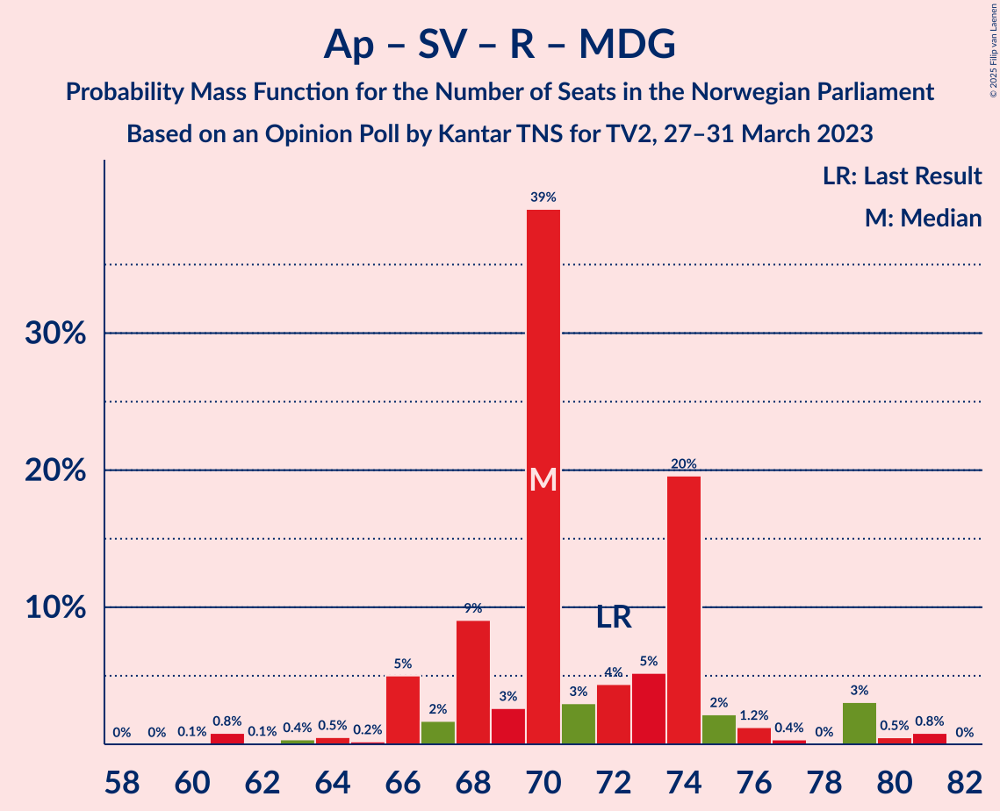

| Number of Seats | Probability | Accumulated | Special Marks |
|:---------------:|:-----------:|:-----------:|:-------------:|
| 60 | 0.1% | 100% |  |
| 61 | 0.8% | 99.9% |  |
| 62 | 0.1% | 99.1% |  |
| 63 | 0.4% | 99.0% |  |
| 64 | 0.5% | 98.7% |  |
| 65 | 0.2% | 98% |  |
| 66 | 5% | 98% |  |
| 67 | 2% | 93% |  |
| 68 | 9% | 91% |  |
| 69 | 3% | 82% |  |
| 70 | 39% | 79% | Median |
| 71 | 3% | 40% |  |
| 72 | 4% | 37% | Last Result |
| 73 | 5% | 33% |  |
| 74 | 20% | 28% |  |
| 75 | 2% | 8% |  |
| 76 | 1.2% | 6% |  |
| 77 | 0.4% | 5% |  |
| 78 | 0% | 4% |  |
| 79 | 3% | 4% |  |
| 80 | 0.5% | 1.3% |  |
| 81 | 0.8% | 0.8% |  |
| 82 | 0% | 0% |  |

### Arbeiderpartiet – Sosialistisk Venstreparti – Senterpartiet – Miljøpartiet De Grønne

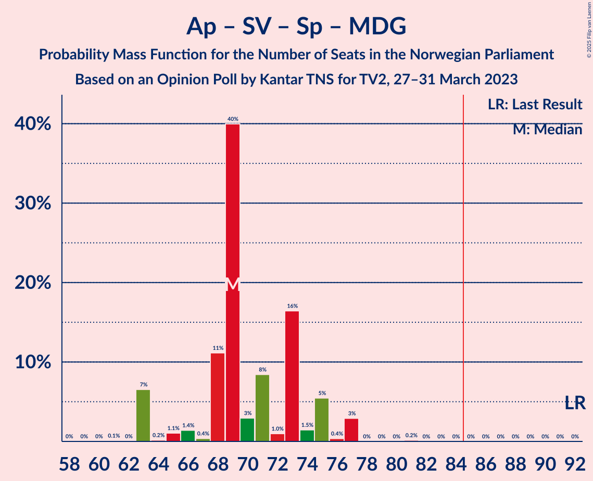

| Number of Seats | Probability | Accumulated | Special Marks |
|:---------------:|:-----------:|:-----------:|:-------------:|
| 59 | 0% | 100% |  |
| 60 | 0% | 99.9% |  |
| 61 | 0.1% | 99.9% |  |
| 62 | 0% | 99.8% |  |
| 63 | 7% | 99.8% |  |
| 64 | 0.2% | 93% |  |
| 65 | 1.1% | 93% |  |
| 66 | 1.4% | 92% |  |
| 67 | 0.4% | 91% |  |
| 68 | 11% | 90% |  |
| 69 | 40% | 79% | Median |
| 70 | 3% | 39% |  |
| 71 | 8% | 36% |  |
| 72 | 1.0% | 28% |  |
| 73 | 16% | 27% |  |
| 74 | 1.5% | 10% |  |
| 75 | 5% | 9% |  |
| 76 | 0.4% | 3% |  |
| 77 | 3% | 3% |  |
| 78 | 0% | 0.2% |  |
| 79 | 0% | 0.2% |  |
| 80 | 0% | 0.2% |  |
| 81 | 0.2% | 0.2% |  |
| 82 | 0% | 0% |  |
| 83 | 0% | 0% |  |
| 84 | 0% | 0% |  |
| 85 | 0% | 0% | Majority |
| 86 | 0% | 0% |  |
| 87 | 0% | 0% |  |
| 88 | 0% | 0% |  |
| 89 | 0% | 0% |  |
| 90 | 0% | 0% |  |
| 91 | 0% | 0% |  |
| 92 | 0% | 0% | Last Result |

### Arbeiderpartiet – Sosialistisk Venstreparti – Senterpartiet

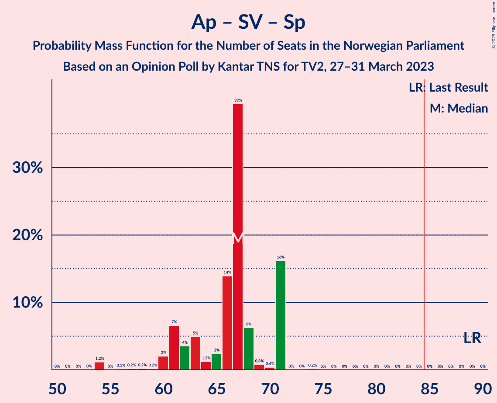

| Number of Seats | Probability | Accumulated | Special Marks |
|:---------------:|:-----------:|:-----------:|:-------------:|
| 53 | 0% | 100% |  |
| 54 | 1.2% | 99.9% |  |
| 55 | 0% | 98.8% |  |
| 56 | 0.1% | 98.8% |  |
| 57 | 0.2% | 98.6% |  |
| 58 | 0.2% | 98% |  |
| 59 | 0.2% | 98% |  |
| 60 | 2% | 98% |  |
| 61 | 7% | 96% |  |
| 62 | 4% | 89% |  |
| 63 | 5% | 86% |  |
| 64 | 1.2% | 81% |  |
| 65 | 2% | 80% |  |
| 66 | 14% | 77% |  |
| 67 | 39% | 63% | Median |
| 68 | 6% | 24% |  |
| 69 | 0.8% | 18% |  |
| 70 | 0.4% | 17% |  |
| 71 | 16% | 16% |  |
| 72 | 0% | 0.2% |  |
| 73 | 0% | 0.2% |  |
| 74 | 0.2% | 0.2% |  |
| 75 | 0% | 0% |  |
| 76 | 0% | 0% |  |
| 77 | 0% | 0% |  |
| 78 | 0% | 0% |  |
| 79 | 0% | 0% |  |
| 80 | 0% | 0% |  |
| 81 | 0% | 0% |  |
| 82 | 0% | 0% |  |
| 83 | 0% | 0% |  |
| 84 | 0% | 0% |  |
| 85 | 0% | 0% | Majority |
| 86 | 0% | 0% |  |
| 87 | 0% | 0% |  |
| 88 | 0% | 0% |  |
| 89 | 0% | 0% | Last Result |

### Høyre – Venstre – Kristelig Folkeparti

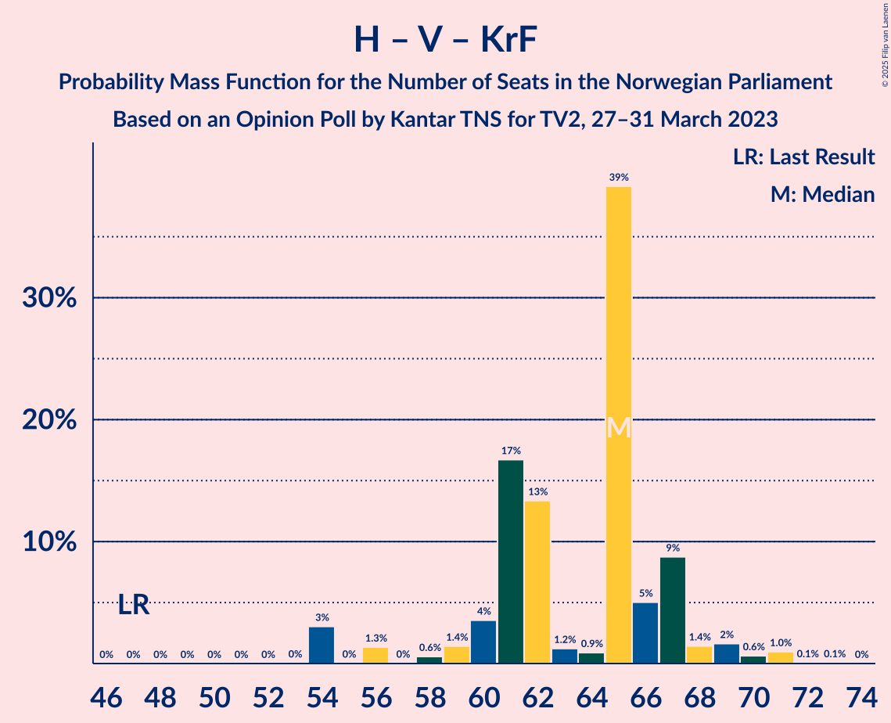

| Number of Seats | Probability | Accumulated | Special Marks |
|:---------------:|:-----------:|:-----------:|:-------------:|
| 47 | 0% | 100% | Last Result |
| 48 | 0% | 100% |  |
| 49 | 0% | 100% |  |
| 50 | 0% | 100% |  |
| 51 | 0% | 100% |  |
| 52 | 0% | 100% |  |
| 53 | 0% | 100% |  |
| 54 | 3% | 100% |  |
| 55 | 0% | 97% |  |
| 56 | 1.3% | 97% |  |
| 57 | 0% | 96% |  |
| 58 | 0.6% | 96% |  |
| 59 | 1.4% | 95% |  |
| 60 | 4% | 94% |  |
| 61 | 17% | 90% |  |
| 62 | 13% | 73% |  |
| 63 | 1.2% | 60% |  |
| 64 | 0.9% | 59% |  |
| 65 | 39% | 58% |  |
| 66 | 5% | 19% | Median |
| 67 | 9% | 14% |  |
| 68 | 1.4% | 5% |  |
| 69 | 2% | 3% |  |
| 70 | 0.6% | 2% |  |
| 71 | 1.0% | 1.1% |  |
| 72 | 0.1% | 0.2% |  |
| 73 | 0.1% | 0.1% |  |
| 74 | 0% | 0% |  |

### Arbeiderpartiet – Senterpartiet – Miljøpartiet De Grønne – Kristelig Folkeparti

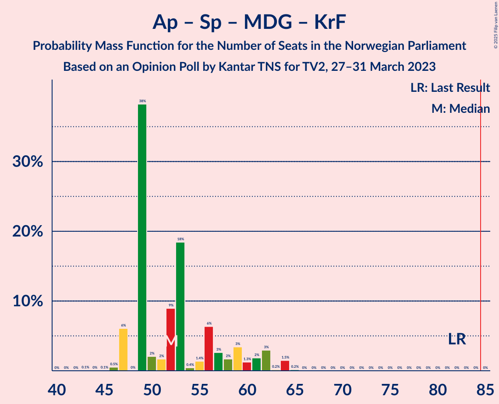

| Number of Seats | Probability | Accumulated | Special Marks |
|:---------------:|:-----------:|:-----------:|:-------------:|
| 43 | 0.1% | 100% |  |
| 44 | 0% | 99.9% |  |
| 45 | 0.1% | 99.9% |  |
| 46 | 0.5% | 99.8% |  |
| 47 | 6% | 99.3% |  |
| 48 | 0% | 93% |  |
| 49 | 38% | 93% |  |
| 50 | 2% | 55% | Median |
| 51 | 2% | 53% |  |
| 52 | 9% | 51% |  |
| 53 | 18% | 42% |  |
| 54 | 0.4% | 24% |  |
| 55 | 1.4% | 23% |  |
| 56 | 6% | 22% |  |
| 57 | 3% | 16% |  |
| 58 | 2% | 13% |  |
| 59 | 3% | 11% |  |
| 60 | 1.3% | 8% |  |
| 61 | 2% | 7% |  |
| 62 | 3% | 5% |  |
| 63 | 0.2% | 2% |  |
| 64 | 1.5% | 2% |  |
| 65 | 0.2% | 0.2% |  |
| 66 | 0% | 0% |  |
| 67 | 0% | 0% |  |
| 68 | 0% | 0% |  |
| 69 | 0% | 0% |  |
| 70 | 0% | 0% |  |
| 71 | 0% | 0% |  |
| 72 | 0% | 0% |  |
| 73 | 0% | 0% |  |
| 74 | 0% | 0% |  |
| 75 | 0% | 0% |  |
| 76 | 0% | 0% |  |
| 77 | 0% | 0% |  |
| 78 | 0% | 0% |  |
| 79 | 0% | 0% |  |
| 80 | 0% | 0% |  |
| 81 | 0% | 0% |  |
| 82 | 0% | 0% | Last Result |

### Arbeiderpartiet – Sosialistisk Venstreparti

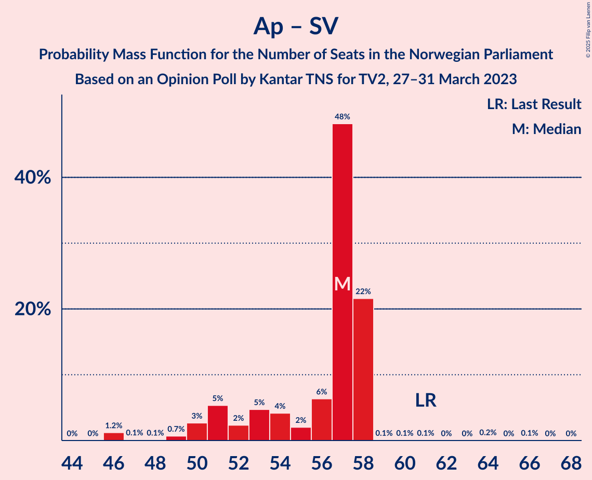

| Number of Seats | Probability | Accumulated | Special Marks |
|:---------------:|:-----------:|:-----------:|:-------------:|
| 46 | 1.2% | 100% |  |
| 47 | 0.1% | 98.8% |  |
| 48 | 0.1% | 98.6% |  |
| 49 | 0.7% | 98.5% |  |
| 50 | 3% | 98% |  |
| 51 | 5% | 95% |  |
| 52 | 2% | 90% |  |
| 53 | 5% | 87% |  |
| 54 | 4% | 83% |  |
| 55 | 2% | 79% |  |
| 56 | 6% | 77% |  |
| 57 | 48% | 70% | Median |
| 58 | 22% | 22% |  |
| 59 | 0.1% | 0.4% |  |
| 60 | 0.1% | 0.4% |  |
| 61 | 0.1% | 0.3% | Last Result |
| 62 | 0% | 0.3% |  |
| 63 | 0% | 0.2% |  |
| 64 | 0.2% | 0.2% |  |
| 65 | 0% | 0.1% |  |
| 66 | 0.1% | 0.1% |  |
| 67 | 0% | 0% |  |

### Arbeiderpartiet – Senterpartiet – Kristelig Folkeparti

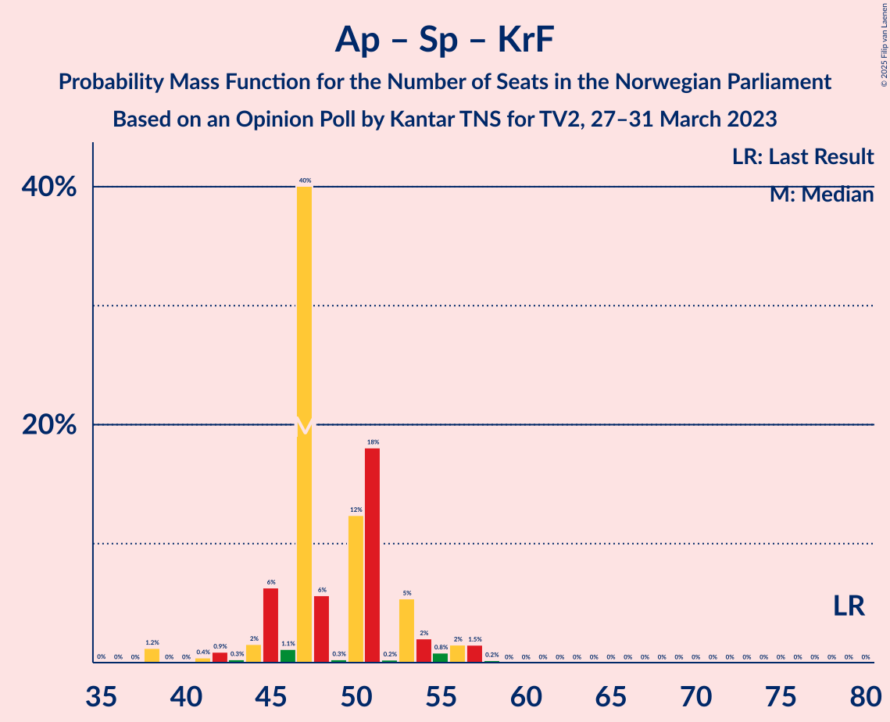

| Number of Seats | Probability | Accumulated | Special Marks |
|:---------------:|:-----------:|:-----------:|:-------------:|
| 36 | 0% | 100% |  |
| 37 | 0% | 99.9% |  |
| 38 | 1.2% | 99.9% |  |
| 39 | 0% | 98.7% |  |
| 40 | 0% | 98.7% |  |
| 41 | 0.4% | 98.7% |  |
| 42 | 0.9% | 98% |  |
| 43 | 0.3% | 97% |  |
| 44 | 2% | 97% |  |
| 45 | 6% | 96% |  |
| 46 | 1.1% | 89% |  |
| 47 | 40% | 88% |  |
| 48 | 6% | 48% | Median |
| 49 | 0.3% | 42% |  |
| 50 | 12% | 42% |  |
| 51 | 18% | 30% |  |
| 52 | 0.2% | 12% |  |
| 53 | 5% | 11% |  |
| 54 | 2% | 6% |  |
| 55 | 0.8% | 4% |  |
| 56 | 2% | 3% |  |
| 57 | 1.5% | 2% |  |
| 58 | 0.2% | 0.2% |  |
| 59 | 0% | 0% |  |
| 60 | 0% | 0% |  |
| 61 | 0% | 0% |  |
| 62 | 0% | 0% |  |
| 63 | 0% | 0% |  |
| 64 | 0% | 0% |  |
| 65 | 0% | 0% |  |
| 66 | 0% | 0% |  |
| 67 | 0% | 0% |  |
| 68 | 0% | 0% |  |
| 69 | 0% | 0% |  |
| 70 | 0% | 0% |  |
| 71 | 0% | 0% |  |
| 72 | 0% | 0% |  |
| 73 | 0% | 0% |  |
| 74 | 0% | 0% |  |
| 75 | 0% | 0% |  |
| 76 | 0% | 0% |  |
| 77 | 0% | 0% |  |
| 78 | 0% | 0% |  |
| 79 | 0% | 0% | Last Result |

### Arbeiderpartiet – Senterpartiet

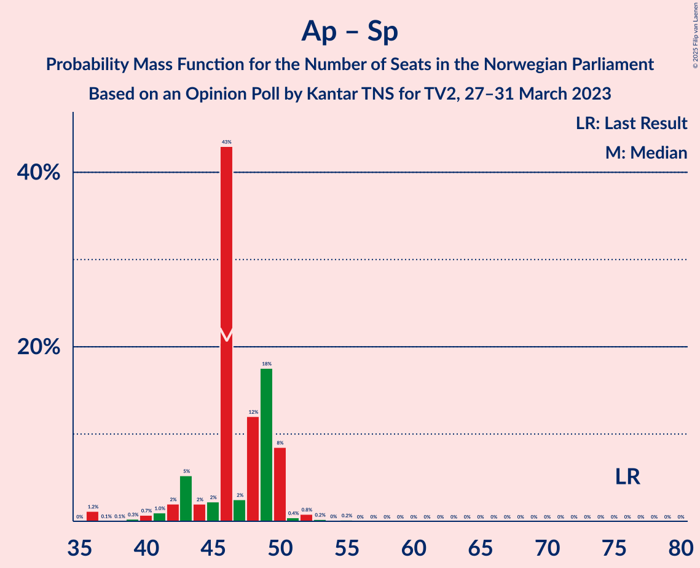

| Number of Seats | Probability | Accumulated | Special Marks |
|:---------------:|:-----------:|:-----------:|:-------------:|
| 35 | 0% | 100% |  |
| 36 | 1.2% | 99.9% |  |
| 37 | 0.1% | 98.8% |  |
| 38 | 0.1% | 98.7% |  |
| 39 | 0.3% | 98.6% |  |
| 40 | 0.7% | 98% |  |
| 41 | 1.0% | 98% |  |
| 42 | 2% | 97% |  |
| 43 | 5% | 95% |  |
| 44 | 2% | 89% |  |
| 45 | 2% | 87% |  |
| 46 | 43% | 85% | Median |
| 47 | 2% | 42% |  |
| 48 | 12% | 40% |  |
| 49 | 18% | 28% |  |
| 50 | 8% | 10% |  |
| 51 | 0.4% | 2% |  |
| 52 | 0.8% | 1.3% |  |
| 53 | 0.2% | 0.4% |  |
| 54 | 0% | 0.2% |  |
| 55 | 0.2% | 0.2% |  |
| 56 | 0% | 0% |  |
| 57 | 0% | 0% |  |
| 58 | 0% | 0% |  |
| 59 | 0% | 0% |  |
| 60 | 0% | 0% |  |
| 61 | 0% | 0% |  |
| 62 | 0% | 0% |  |
| 63 | 0% | 0% |  |
| 64 | 0% | 0% |  |
| 65 | 0% | 0% |  |
| 66 | 0% | 0% |  |
| 67 | 0% | 0% |  |
| 68 | 0% | 0% |  |
| 69 | 0% | 0% |  |
| 70 | 0% | 0% |  |
| 71 | 0% | 0% |  |
| 72 | 0% | 0% |  |
| 73 | 0% | 0% |  |
| 74 | 0% | 0% |  |
| 75 | 0% | 0% |  |
| 76 | 0% | 0% | Last Result |

### Senterpartiet – Venstre – Kristelig Folkeparti

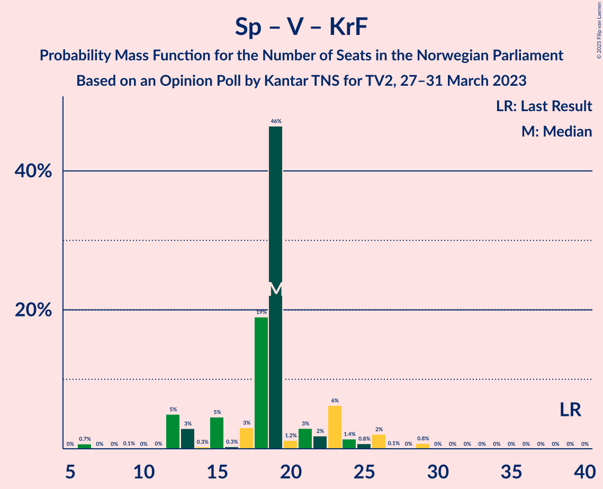

| Number of Seats | Probability | Accumulated | Special Marks |
|:---------------:|:-----------:|:-----------:|:-------------:|
| 6 | 0.7% | 100% |  |
| 7 | 0% | 99.2% |  |
| 8 | 0% | 99.2% |  |
| 9 | 0.1% | 99.2% |  |
| 10 | 0% | 99.2% |  |
| 11 | 0% | 99.2% |  |
| 12 | 5% | 99.1% |  |
| 13 | 3% | 94% |  |
| 14 | 0.3% | 91% |  |
| 15 | 5% | 91% |  |
| 16 | 0.3% | 86% |  |
| 17 | 3% | 86% |  |
| 18 | 19% | 83% |  |
| 19 | 46% | 64% |  |
| 20 | 1.2% | 17% | Median |
| 21 | 3% | 16% |  |
| 22 | 2% | 13% |  |
| 23 | 6% | 11% |  |
| 24 | 1.4% | 5% |  |
| 25 | 0.8% | 4% |  |
| 26 | 2% | 3% |  |
| 27 | 0.1% | 0.9% |  |
| 28 | 0% | 0.8% |  |
| 29 | 0.8% | 0.8% |  |
| 30 | 0% | 0% |  |
| 31 | 0% | 0% |  |
| 32 | 0% | 0% |  |
| 33 | 0% | 0% |  |
| 34 | 0% | 0% |  |
| 35 | 0% | 0% |  |
| 36 | 0% | 0% |  |
| 37 | 0% | 0% |  |
| 38 | 0% | 0% |  |
| 39 | 0% | 0% | Last Result |

## Technical Information

### Opinion Poll

+ **Polling firm:** Kantar TNS
+ **Commissioner(s):** TV2
+ **Fieldwork period:** 27–31 March 2023

### Calculations

+ **Sample size:** 977
+ **Simulations done:** 1,048,576
+ **Error estimate:** 2.29%

