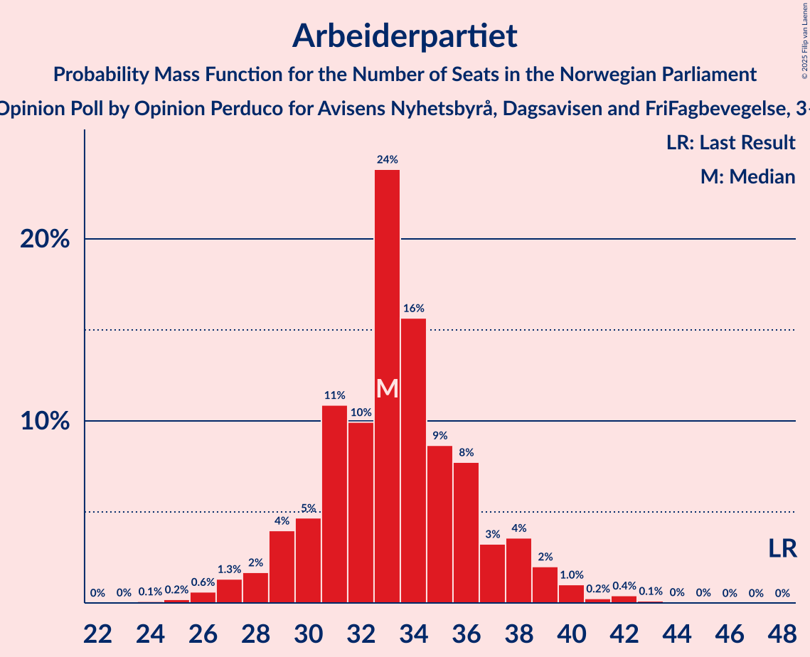

# Opinion Poll by Opinion Perduco for Avisens Nyhetsbyrå, Dagsavisen and FriFagbevegelse, 3–4 April 2023

<a href="#voting-intentions">Voting Intentions</a> | <a href="#seats">Seats</a> | <a href="#coalitions">Coalitions</a> | <a href="#technical-information">Technical Information</a>

## Voting Intentions

### Confidence Intervals

| Party | Last Result | Poll Result | 80% Confidence Interval | 90% Confidence Interval | 95% Confidence Interval | 99% Confidence Interval |
|:-----:|:-----------:|:-----------:|:-----------------------:|:-----------------------:|:-----------------------:|:-----------------------:|
| Høyre | 20.4% | 32.2% | 30.0–34.6% |29.3–35.2% |28.8–35.8% |27.8–37.0% |
| Arbeiderpartiet | 26.2% | 16.9% | 15.2–18.9% |14.7–19.4% |14.3–19.9% |13.5–20.9% |
| Fremskrittspartiet | 11.6% | 14.9% | 13.2–16.7% |12.8–17.3% |12.4–17.7% |11.6–18.7% |
| Sosialistisk Venstreparti | 7.6% | 6.8% | 5.7–8.2% |5.4–8.6% |5.1–8.9% |4.6–9.6% |
| Rødt | 4.7% | 6.6% | 5.5–8.0% |5.2–8.4% |5.0–8.7% |4.5–9.5% |
| Senterpartiet | 13.5% | 5.7% | 4.7–7.1% |4.5–7.4% |4.2–7.8% |3.8–8.4% |
| Venstre | 4.6% | 4.6% | 3.7–5.8% |3.4–6.1% |3.2–6.4% |2.9–7.0% |
| Kristelig Folkeparti | 3.8% | 4.0% | 3.2–5.1% |2.9–5.4% |2.7–5.7% |2.4–6.3% |
| Miljøpartiet De Grønne | 3.9% | 3.5% | 2.8–4.6% |2.6–4.9% |2.4–5.2% |2.1–5.8% |

*Note:* The poll result column reflects the actual value used in the calculations. Published results may vary slightly, and in addition be rounded to fewer digits.

## Seats

### Confidence Intervals

| Party | Last Result | Median | 80% Confidence Interval | 90% Confidence Interval | 95% Confidence Interval | 99% Confidence Interval |
|:-----:|:-----------:|:------:|:-----------------------:|:-----------------------:|:-----------------------:|:-----------------------:|
| <a href="#høyre">Høyre</a> | 36 | 56 | 53–63 |52–64 |51–65 |49–68 |
| <a href="#arbeiderpartiet">Arbeiderpartiet</a> | 48 | 33 | 30–37 |29–38 |28–39 |26–42 |
| <a href="#fremskrittspartiet">Fremskrittspartiet</a> | 21 | 28 | 22–33 |21–34 |20–35 |18–36 |
| <a href="#sosialistisk-venstreparti">Sosialistisk Venstreparti</a> | 13 | 10 | 8–13 |7–14 |7–14 |6–16 |
| <a href="#rødt">Rødt</a> | 8 | 10 | 8–12 |7–13 |7–14 |6–15 |
| <a href="#senterpartiet">Senterpartiet</a> | 28 | 9 | 6–13 |6–14 |6–14 |1–15 |
| <a href="#venstre">Venstre</a> | 8 | 7 | 2–8 |2–9 |2–10 |2–11 |
| <a href="#kristelig-folkeparti">Kristelig Folkeparti</a> | 3 | 6 | 2–7 |2–8 |2–9 |1–9 |
| <a href="#miljøpartiet-de-grønne">Miljøpartiet De Grønne</a> | 3 | 2 | 1–7 |1–7 |1–8 |1–9 |

### Høyre

*For a full overview of the results for this party, see the [Høyre](party-høyre.html) page.*

| Number of Seats | Probability | Accumulated | Special Marks |
|:---------------:|:-----------:|:-----------:|:-------------:|
| 36 | 0% | 100% | Last Result |
| 37 | 0% | 100% |  |
| 38 | 0% | 100% |  |
| 39 | 0% | 100% |  |
| 40 | 0% | 100% |  |
| 41 | 0% | 100% |  |
| 42 | 0% | 100% |  |
| 43 | 0% | 100% |  |
| 44 | 0% | 100% |  |
| 45 | 0% | 100% |  |
| 46 | 0% | 100% |  |
| 47 | 0.1% | 100% |  |
| 48 | 0.3% | 99.9% |  |
| 49 | 0.8% | 99.6% |  |
| 50 | 1.1% | 98.7% |  |
| 51 | 2% | 98% |  |
| 52 | 5% | 95% |  |
| 53 | 8% | 90% |  |
| 54 | 15% | 82% |  |
| 55 | 13% | 67% |  |
| 56 | 9% | 54% | Median |
| 57 | 6% | 45% |  |
| 58 | 9% | 40% |  |
| 59 | 7% | 30% |  |
| 60 | 5% | 24% |  |
| 61 | 4% | 19% |  |
| 62 | 4% | 15% |  |
| 63 | 4% | 11% |  |
| 64 | 3% | 6% |  |
| 65 | 1.2% | 3% |  |
| 66 | 1.1% | 2% |  |
| 67 | 0.4% | 1.1% |  |
| 68 | 0.3% | 0.7% |  |
| 69 | 0.2% | 0.4% |  |
| 70 | 0.1% | 0.2% |  |
| 71 | 0.1% | 0.1% |  |
| 72 | 0% | 0% |  |

### Arbeiderpartiet

*For a full overview of the results for this party, see the [Arbeiderpartiet](party-arbeiderpartiet.html) page.*

| Number of Seats | Probability | Accumulated | Special Marks |
|:---------------:|:-----------:|:-----------:|:-------------:|
| 23 | 0% | 100% |  |
| 24 | 0.1% | 99.9% |  |
| 25 | 0.2% | 99.9% |  |
| 26 | 0.6% | 99.7% |  |
| 27 | 1.3% | 99.0% |  |
| 28 | 2% | 98% |  |
| 29 | 4% | 96% |  |
| 30 | 5% | 92% |  |
| 31 | 11% | 87% |  |
| 32 | 10% | 77% |  |
| 33 | 24% | 67% | Median |
| 34 | 16% | 43% |  |
| 35 | 9% | 27% |  |
| 36 | 8% | 18% |  |
| 37 | 3% | 11% |  |
| 38 | 4% | 7% |  |
| 39 | 2% | 4% |  |
| 40 | 1.0% | 2% |  |
| 41 | 0.2% | 0.9% |  |
| 42 | 0.4% | 0.6% |  |
| 43 | 0.1% | 0.2% |  |
| 44 | 0% | 0.1% |  |
| 45 | 0% | 0% |  |
| 46 | 0% | 0% |  |
| 47 | 0% | 0% |  |
| 48 | 0% | 0% | Last Result |

### Fremskrittspartiet

*For a full overview of the results for this party, see the [Fremskrittspartiet](party-fremskrittspartiet.html) page.*

| Number of Seats | Probability | Accumulated | Special Marks |
|:---------------:|:-----------:|:-----------:|:-------------:|
| 18 | 0.6% | 100% |  |
| 19 | 0.9% | 99.4% |  |
| 20 | 2% | 98.5% |  |
| 21 | 4% | 97% | Last Result |
| 22 | 3% | 93% |  |
| 23 | 4% | 89% |  |
| 24 | 7% | 86% |  |
| 25 | 11% | 79% |  |
| 26 | 2% | 68% |  |
| 27 | 8% | 65% |  |
| 28 | 12% | 58% | Median |
| 29 | 15% | 45% |  |
| 30 | 6% | 30% |  |
| 31 | 7% | 24% |  |
| 32 | 5% | 17% |  |
| 33 | 6% | 12% |  |
| 34 | 2% | 6% |  |
| 35 | 2% | 5% |  |
| 36 | 2% | 2% |  |
| 37 | 0.1% | 0.3% |  |
| 38 | 0.1% | 0.2% |  |
| 39 | 0% | 0% |  |

### Sosialistisk Venstreparti

*For a full overview of the results for this party, see the [Sosialistisk Venstreparti](party-sosialistiskvenstreparti.html) page.*

| Number of Seats | Probability | Accumulated | Special Marks |
|:---------------:|:-----------:|:-----------:|:-------------:|
| 5 | 0% | 100% |  |
| 6 | 0.6% | 99.9% |  |
| 7 | 8% | 99.3% |  |
| 8 | 9% | 92% |  |
| 9 | 16% | 82% |  |
| 10 | 22% | 67% | Median |
| 11 | 20% | 45% |  |
| 12 | 14% | 25% |  |
| 13 | 6% | 12% | Last Result |
| 14 | 4% | 6% |  |
| 15 | 0.9% | 2% |  |
| 16 | 0.5% | 0.6% |  |
| 17 | 0.1% | 0.1% |  |
| 18 | 0% | 0% |  |

### Rødt

*For a full overview of the results for this party, see the [Rødt](party-rødt.html) page.*

| Number of Seats | Probability | Accumulated | Special Marks |
|:---------------:|:-----------:|:-----------:|:-------------:|
| 1 | 0.1% | 100% |  |
| 2 | 0% | 99.9% |  |
| 3 | 0% | 99.9% |  |
| 4 | 0% | 99.9% |  |
| 5 | 0.1% | 99.9% |  |
| 6 | 0.9% | 99.9% |  |
| 7 | 5% | 99.0% |  |
| 8 | 11% | 94% | Last Result |
| 9 | 26% | 83% |  |
| 10 | 27% | 57% | Median |
| 11 | 10% | 30% |  |
| 12 | 11% | 20% |  |
| 13 | 4% | 9% |  |
| 14 | 3% | 4% |  |
| 15 | 0.6% | 0.9% |  |
| 16 | 0.2% | 0.3% |  |
| 17 | 0.1% | 0.1% |  |
| 18 | 0% | 0% |  |

### Senterpartiet

*For a full overview of the results for this party, see the [Senterpartiet](party-senterpartiet.html) page.*

| Number of Seats | Probability | Accumulated | Special Marks |
|:---------------:|:-----------:|:-----------:|:-------------:|
| 0 | 0.1% | 100% |  |
| 1 | 1.1% | 99.9% |  |
| 2 | 0% | 98.9% |  |
| 3 | 0% | 98.8% |  |
| 4 | 0% | 98.8% |  |
| 5 | 0.5% | 98.8% |  |
| 6 | 9% | 98% |  |
| 7 | 13% | 90% |  |
| 8 | 18% | 76% |  |
| 9 | 16% | 59% | Median |
| 10 | 8% | 42% |  |
| 11 | 9% | 34% |  |
| 12 | 9% | 25% |  |
| 13 | 10% | 17% |  |
| 14 | 5% | 6% |  |
| 15 | 1.2% | 1.3% |  |
| 16 | 0.1% | 0.1% |  |
| 17 | 0% | 0% |  |
| 18 | 0% | 0% |  |
| 19 | 0% | 0% |  |
| 20 | 0% | 0% |  |
| 21 | 0% | 0% |  |
| 22 | 0% | 0% |  |
| 23 | 0% | 0% |  |
| 24 | 0% | 0% |  |
| 25 | 0% | 0% |  |
| 26 | 0% | 0% |  |
| 27 | 0% | 0% |  |
| 28 | 0% | 0% | Last Result |

### Venstre

*For a full overview of the results for this party, see the [Venstre](party-venstre.html) page.*

| Number of Seats | Probability | Accumulated | Special Marks |
|:---------------:|:-----------:|:-----------:|:-------------:|
| 2 | 13% | 100% |  |
| 3 | 16% | 87% |  |
| 4 | 0% | 72% |  |
| 5 | 1.3% | 72% |  |
| 6 | 16% | 70% |  |
| 7 | 33% | 54% | Median |
| 8 | 13% | 22% | Last Result |
| 9 | 6% | 9% |  |
| 10 | 2% | 3% |  |
| 11 | 0.5% | 0.7% |  |
| 12 | 0.1% | 0.2% |  |
| 13 | 0% | 0% |  |

### Kristelig Folkeparti

*For a full overview of the results for this party, see the [Kristelig Folkeparti](party-kristeligfolkeparti.html) page.*

| Number of Seats | Probability | Accumulated | Special Marks |
|:---------------:|:-----------:|:-----------:|:-------------:|
| 0 | 0.2% | 100% |  |
| 1 | 1.4% | 99.8% |  |
| 2 | 16% | 98% |  |
| 3 | 30% | 82% | Last Result |
| 4 | 0% | 52% |  |
| 5 | 1.1% | 52% |  |
| 6 | 26% | 51% | Median |
| 7 | 17% | 25% |  |
| 8 | 5% | 8% |  |
| 9 | 3% | 3% |  |
| 10 | 0.3% | 0.3% |  |
| 11 | 0% | 0.1% |  |
| 12 | 0% | 0% |  |

### Miljøpartiet De Grønne

*For a full overview of the results for this party, see the [Miljøpartiet De Grønne](party-miljøpartietdegrønne.html) page.*

| Number of Seats | Probability | Accumulated | Special Marks |
|:---------------:|:-----------:|:-----------:|:-------------:|
| 1 | 15% | 100% |  |
| 2 | 36% | 85% | Median |
| 3 | 22% | 49% | Last Result |
| 4 | 0% | 27% |  |
| 5 | 2% | 27% |  |
| 6 | 14% | 24% |  |
| 7 | 7% | 10% |  |
| 8 | 3% | 4% |  |
| 9 | 0.5% | 0.5% |  |
| 10 | 0.1% | 0.1% |  |
| 11 | 0% | 0% |  |

## Coalitions

### Confidence Intervals

| Coalition | Last Result | Median | Majority? | 80% Confidence Interval | 90% Confidence Interval | 95% Confidence Interval | 99% Confidence Interval |
|:---------:|:-----------:|:------:|:---------:|:-----------------------:|:-----------------------:|:-----------------------:|:-----------------------:|
| Høyre – Fremskrittspartiet – Senterpartiet – Venstre – Kristelig Folkeparti | 96 | 105 | 100% | 99–110 | 98–112 | 97–113 | 94–116 |
| Høyre – Fremskrittspartiet – Venstre – Kristelig Folkeparti – Miljøpartiet De Grønne | 71 | 98 | 99.9% | 93–106 | 91–107 | 90–108 | 87–111 |
| Høyre – Fremskrittspartiet – Venstre – Kristelig Folkeparti | 68 | 95 | 99.4% | 89–102 | 88–104 | 87–105 | 84–108 |
| Høyre – Fremskrittspartiet – Venstre | 65 | 90 | 92% | 85–98 | 83–99 | 83–100 | 80–104 |
| Høyre – Fremskrittspartiet | 57 | 84 | 44% | 79–91 | 78–92 | 77–94 | 74–97 |
| Høyre – Venstre – Kristelig Folkeparti | 47 | 67 | 0% | 63–74 | 60–76 | 59–77 | 58–80 |
| Arbeiderpartiet – Sosialistisk Venstreparti – Rødt – Senterpartiet – Miljøpartiet De Grønne | 100 | 67 | 0% | 59–72 | 58–74 | 56–75 | 54–78 |
| Arbeiderpartiet – Sosialistisk Venstreparti – Rødt – Senterpartiet | 97 | 63 | 0% | 56–69 | 54–70 | 53–71 | 51–74 |
| Arbeiderpartiet – Sosialistisk Venstreparti – Senterpartiet – Kristelig Folkeparti – Miljøpartiet De Grønne | 95 | 61 | 0% | 55–67 | 54–67 | 52–69 | 49–72 |
| Arbeiderpartiet – Sosialistisk Venstreparti – Rødt – Miljøpartiet De Grønne | 72 | 57 | 0% | 52–62 | 50–63 | 49–64 | 47–68 |
| Arbeiderpartiet – Sosialistisk Venstreparti – Senterpartiet – Miljøpartiet De Grønne | 92 | 57 | 0% | 50–62 | 49–63 | 48–64 | 45–67 |
| Arbeiderpartiet – Sosialistisk Venstreparti – Senterpartiet | 89 | 53 | 0% | 47–57 | 46–59 | 45–60 | 42–62 |
| Arbeiderpartiet – Senterpartiet – Kristelig Folkeparti – Miljøpartiet De Grønne | 82 | 50 | 0% | 45–57 | 44–58 | 42–59 | 40–61 |
| Arbeiderpartiet – Senterpartiet – Kristelig Folkeparti | 79 | 48 | 0% | 42–52 | 41–54 | 39–55 | 37–57 |
| Arbeiderpartiet – Sosialistisk Venstreparti | 61 | 44 | 0% | 39–48 | 38–49 | 37–50 | 35–53 |
| Arbeiderpartiet – Senterpartiet | 76 | 43 | 0% | 38–47 | 37–49 | 35–49 | 33–51 |
| Senterpartiet – Venstre – Kristelig Folkeparti | 39 | 20 | 0% | 15–25 | 13–26 | 13–27 | 11–29 |

### Høyre – Fremskrittspartiet – Senterpartiet – Venstre – Kristelig Folkeparti

| Number of Seats | Probability | Accumulated | Special Marks |
|:---------------:|:-----------:|:-----------:|:-------------:|
| 91 | 0% | 100% |  |
| 92 | 0.1% | 99.9% |  |
| 93 | 0.1% | 99.8% |  |
| 94 | 0.3% | 99.7% |  |
| 95 | 0.3% | 99.4% |  |
| 96 | 1.1% | 99.1% | Last Result |
| 97 | 1.1% | 98% |  |
| 98 | 2% | 97% |  |
| 99 | 5% | 95% |  |
| 100 | 6% | 90% |  |
| 101 | 10% | 84% |  |
| 102 | 10% | 73% |  |
| 103 | 7% | 64% |  |
| 104 | 6% | 57% |  |
| 105 | 10% | 52% |  |
| 106 | 8% | 42% | Median |
| 107 | 6% | 33% |  |
| 108 | 8% | 27% |  |
| 109 | 6% | 19% |  |
| 110 | 6% | 13% |  |
| 111 | 2% | 8% |  |
| 112 | 2% | 5% |  |
| 113 | 2% | 4% |  |
| 114 | 0.8% | 2% |  |
| 115 | 0.2% | 0.8% |  |
| 116 | 0.4% | 0.6% |  |
| 117 | 0.1% | 0.2% |  |
| 118 | 0.1% | 0.1% |  |
| 119 | 0% | 0% |  |

### Høyre – Fremskrittspartiet – Venstre – Kristelig Folkeparti – Miljøpartiet De Grønne

| Number of Seats | Probability | Accumulated | Special Marks |
|:---------------:|:-----------:|:-----------:|:-------------:|
| 71 | 0% | 100% | Last Result |
| 72 | 0% | 100% |  |
| 73 | 0% | 100% |  |
| 74 | 0% | 100% |  |
| 75 | 0% | 100% |  |
| 76 | 0% | 100% |  |
| 77 | 0% | 100% |  |
| 78 | 0% | 100% |  |
| 79 | 0% | 100% |  |
| 80 | 0% | 100% |  |
| 81 | 0% | 100% |  |
| 82 | 0% | 100% |  |
| 83 | 0% | 100% |  |
| 84 | 0% | 100% |  |
| 85 | 0.1% | 99.9% | Majority |
| 86 | 0.1% | 99.8% |  |
| 87 | 0.3% | 99.7% |  |
| 88 | 0.2% | 99.4% |  |
| 89 | 0.4% | 99.2% |  |
| 90 | 3% | 98.8% |  |
| 91 | 1.4% | 95% |  |
| 92 | 3% | 94% |  |
| 93 | 3% | 91% |  |
| 94 | 3% | 88% |  |
| 95 | 12% | 84% |  |
| 96 | 11% | 72% |  |
| 97 | 8% | 61% |  |
| 98 | 11% | 53% |  |
| 99 | 7% | 43% | Median |
| 100 | 6% | 36% |  |
| 101 | 6% | 30% |  |
| 102 | 3% | 24% |  |
| 103 | 4% | 21% |  |
| 104 | 3% | 17% |  |
| 105 | 2% | 13% |  |
| 106 | 6% | 12% |  |
| 107 | 2% | 6% |  |
| 108 | 2% | 4% |  |
| 109 | 1.0% | 2% |  |
| 110 | 0.7% | 1.3% |  |
| 111 | 0.3% | 0.7% |  |
| 112 | 0.1% | 0.4% |  |
| 113 | 0.2% | 0.2% |  |
| 114 | 0% | 0.1% |  |
| 115 | 0% | 0% |  |

### Høyre – Fremskrittspartiet – Venstre – Kristelig Folkeparti

| Number of Seats | Probability | Accumulated | Special Marks |
|:---------------:|:-----------:|:-----------:|:-------------:|
| 68 | 0% | 100% | Last Result |
| 69 | 0% | 100% |  |
| 70 | 0% | 100% |  |
| 71 | 0% | 100% |  |
| 72 | 0% | 100% |  |
| 73 | 0% | 100% |  |
| 74 | 0% | 100% |  |
| 75 | 0% | 100% |  |
| 76 | 0% | 100% |  |
| 77 | 0% | 100% |  |
| 78 | 0% | 100% |  |
| 79 | 0% | 100% |  |
| 80 | 0.1% | 100% |  |
| 81 | 0.1% | 99.9% |  |
| 82 | 0.1% | 99.8% |  |
| 83 | 0.1% | 99.7% |  |
| 84 | 0.2% | 99.6% |  |
| 85 | 0.4% | 99.4% | Majority |
| 86 | 0.4% | 99.0% |  |
| 87 | 3% | 98.6% |  |
| 88 | 3% | 95% |  |
| 89 | 3% | 93% |  |
| 90 | 2% | 90% |  |
| 91 | 7% | 87% |  |
| 92 | 9% | 80% |  |
| 93 | 15% | 71% |  |
| 94 | 6% | 57% |  |
| 95 | 7% | 51% |  |
| 96 | 12% | 44% |  |
| 97 | 4% | 32% | Median |
| 98 | 5% | 28% |  |
| 99 | 3% | 22% |  |
| 100 | 3% | 19% |  |
| 101 | 3% | 16% |  |
| 102 | 4% | 14% |  |
| 103 | 1.4% | 9% |  |
| 104 | 5% | 8% |  |
| 105 | 0.8% | 3% |  |
| 106 | 1.2% | 2% |  |
| 107 | 0.3% | 0.9% |  |
| 108 | 0.3% | 0.6% |  |
| 109 | 0.1% | 0.3% |  |
| 110 | 0.1% | 0.2% |  |
| 111 | 0% | 0.1% |  |
| 112 | 0% | 0% |  |

### Høyre – Fremskrittspartiet – Venstre

| Number of Seats | Probability | Accumulated | Special Marks |
|:---------------:|:-----------:|:-----------:|:-------------:|
| 65 | 0% | 100% | Last Result |
| 66 | 0% | 100% |  |
| 67 | 0% | 100% |  |
| 68 | 0% | 100% |  |
| 69 | 0% | 100% |  |
| 70 | 0% | 100% |  |
| 71 | 0% | 100% |  |
| 72 | 0% | 100% |  |
| 73 | 0% | 100% |  |
| 74 | 0% | 100% |  |
| 75 | 0% | 100% |  |
| 76 | 0% | 100% |  |
| 77 | 0.1% | 99.9% |  |
| 78 | 0.1% | 99.9% |  |
| 79 | 0.3% | 99.8% |  |
| 80 | 0.3% | 99.5% |  |
| 81 | 0.6% | 99.2% |  |
| 82 | 0.9% | 98.6% |  |
| 83 | 3% | 98% |  |
| 84 | 3% | 95% |  |
| 85 | 6% | 92% | Majority |
| 86 | 7% | 85% |  |
| 87 | 6% | 78% |  |
| 88 | 7% | 73% |  |
| 89 | 9% | 66% |  |
| 90 | 13% | 58% |  |
| 91 | 9% | 44% | Median |
| 92 | 7% | 35% |  |
| 93 | 3% | 29% |  |
| 94 | 5% | 25% |  |
| 95 | 4% | 20% |  |
| 96 | 3% | 16% |  |
| 97 | 3% | 13% |  |
| 98 | 5% | 11% |  |
| 99 | 2% | 5% |  |
| 100 | 1.1% | 3% |  |
| 101 | 0.7% | 2% |  |
| 102 | 0.5% | 1.2% |  |
| 103 | 0.2% | 0.7% |  |
| 104 | 0.2% | 0.5% |  |
| 105 | 0.3% | 0.3% |  |
| 106 | 0% | 0% |  |

### Høyre – Fremskrittspartiet

| Number of Seats | Probability | Accumulated | Special Marks |
|:---------------:|:-----------:|:-----------:|:-------------:|
| 57 | 0% | 100% | Last Result |
| 58 | 0% | 100% |  |
| 59 | 0% | 100% |  |
| 60 | 0% | 100% |  |
| 61 | 0% | 100% |  |
| 62 | 0% | 100% |  |
| 63 | 0% | 100% |  |
| 64 | 0% | 100% |  |
| 65 | 0% | 100% |  |
| 66 | 0% | 100% |  |
| 67 | 0% | 100% |  |
| 68 | 0% | 100% |  |
| 69 | 0% | 100% |  |
| 70 | 0% | 100% |  |
| 71 | 0% | 100% |  |
| 72 | 0.1% | 99.9% |  |
| 73 | 0.2% | 99.9% |  |
| 74 | 0.4% | 99.7% |  |
| 75 | 0.7% | 99.3% |  |
| 76 | 0.7% | 98.6% |  |
| 77 | 2% | 98% |  |
| 78 | 2% | 96% |  |
| 79 | 4% | 94% |  |
| 80 | 5% | 90% |  |
| 81 | 8% | 85% |  |
| 82 | 7% | 76% |  |
| 83 | 14% | 70% |  |
| 84 | 11% | 55% | Median |
| 85 | 7% | 44% | Majority |
| 86 | 8% | 37% |  |
| 87 | 6% | 29% |  |
| 88 | 2% | 22% |  |
| 89 | 4% | 21% |  |
| 90 | 4% | 16% |  |
| 91 | 6% | 12% |  |
| 92 | 3% | 6% |  |
| 93 | 0.6% | 3% |  |
| 94 | 1.1% | 3% |  |
| 95 | 0.6% | 2% |  |
| 96 | 0.5% | 1.0% |  |
| 97 | 0.2% | 0.5% |  |
| 98 | 0.1% | 0.3% |  |
| 99 | 0.2% | 0.2% |  |
| 100 | 0% | 0% |  |

### Høyre – Venstre – Kristelig Folkeparti

| Number of Seats | Probability | Accumulated | Special Marks |
|:---------------:|:-----------:|:-----------:|:-------------:|
| 47 | 0% | 100% | Last Result |
| 48 | 0% | 100% |  |
| 49 | 0% | 100% |  |
| 50 | 0% | 100% |  |
| 51 | 0% | 100% |  |
| 52 | 0% | 100% |  |
| 53 | 0% | 100% |  |
| 54 | 0.1% | 100% |  |
| 55 | 0% | 99.9% |  |
| 56 | 0.1% | 99.9% |  |
| 57 | 0.2% | 99.8% |  |
| 58 | 0.5% | 99.5% |  |
| 59 | 3% | 99.1% |  |
| 60 | 2% | 96% |  |
| 61 | 2% | 94% |  |
| 62 | 2% | 92% |  |
| 63 | 7% | 90% |  |
| 64 | 11% | 83% |  |
| 65 | 7% | 72% |  |
| 66 | 10% | 65% |  |
| 67 | 12% | 55% |  |
| 68 | 8% | 43% |  |
| 69 | 6% | 35% | Median |
| 70 | 4% | 29% |  |
| 71 | 7% | 25% |  |
| 72 | 3% | 17% |  |
| 73 | 4% | 15% |  |
| 74 | 3% | 11% |  |
| 75 | 2% | 8% |  |
| 76 | 2% | 6% |  |
| 77 | 3% | 4% |  |
| 78 | 0.8% | 2% |  |
| 79 | 0.2% | 0.8% |  |
| 80 | 0.2% | 0.6% |  |
| 81 | 0.1% | 0.3% |  |
| 82 | 0.1% | 0.2% |  |
| 83 | 0% | 0.1% |  |
| 84 | 0% | 0.1% |  |
| 85 | 0% | 0% | Majority |

### Arbeiderpartiet – Sosialistisk Venstreparti – Rødt – Senterpartiet – Miljøpartiet De Grønne

| Number of Seats | Probability | Accumulated | Special Marks |
|:---------------:|:-----------:|:-----------:|:-------------:|
| 51 | 0% | 100% |  |
| 52 | 0.1% | 99.9% |  |
| 53 | 0.2% | 99.8% |  |
| 54 | 0.3% | 99.6% |  |
| 55 | 0.5% | 99.3% |  |
| 56 | 2% | 98.8% |  |
| 57 | 1.3% | 97% |  |
| 58 | 4% | 96% |  |
| 59 | 2% | 92% |  |
| 60 | 4% | 90% |  |
| 61 | 3% | 86% |  |
| 62 | 3% | 82% |  |
| 63 | 4% | 79% |  |
| 64 | 9% | 75% | Median |
| 65 | 5% | 67% |  |
| 66 | 12% | 62% |  |
| 67 | 8% | 50% |  |
| 68 | 13% | 42% |  |
| 69 | 5% | 29% |  |
| 70 | 5% | 24% |  |
| 71 | 4% | 19% |  |
| 72 | 7% | 15% |  |
| 73 | 2% | 8% |  |
| 74 | 3% | 6% |  |
| 75 | 0.7% | 3% |  |
| 76 | 1.1% | 2% |  |
| 77 | 0.4% | 1.2% |  |
| 78 | 0.3% | 0.8% |  |
| 79 | 0.2% | 0.5% |  |
| 80 | 0.2% | 0.3% |  |
| 81 | 0% | 0.1% |  |
| 82 | 0% | 0.1% |  |
| 83 | 0% | 0.1% |  |
| 84 | 0% | 0% |  |
| 85 | 0% | 0% | Majority |
| 86 | 0% | 0% |  |
| 87 | 0% | 0% |  |
| 88 | 0% | 0% |  |
| 89 | 0% | 0% |  |
| 90 | 0% | 0% |  |
| 91 | 0% | 0% |  |
| 92 | 0% | 0% |  |
| 93 | 0% | 0% |  |
| 94 | 0% | 0% |  |
| 95 | 0% | 0% |  |
| 96 | 0% | 0% |  |
| 97 | 0% | 0% |  |
| 98 | 0% | 0% |  |
| 99 | 0% | 0% |  |
| 100 | 0% | 0% | Last Result |

### Arbeiderpartiet – Sosialistisk Venstreparti – Rødt – Senterpartiet

| Number of Seats | Probability | Accumulated | Special Marks |
|:---------------:|:-----------:|:-----------:|:-------------:|
| 48 | 0% | 100% |  |
| 49 | 0.1% | 99.9% |  |
| 50 | 0.1% | 99.8% |  |
| 51 | 0.3% | 99.7% |  |
| 52 | 0.7% | 99.4% |  |
| 53 | 2% | 98.7% |  |
| 54 | 2% | 97% |  |
| 55 | 1.5% | 95% |  |
| 56 | 6% | 93% |  |
| 57 | 1.2% | 88% |  |
| 58 | 3% | 86% |  |
| 59 | 4% | 83% |  |
| 60 | 4% | 78% |  |
| 61 | 8% | 75% |  |
| 62 | 8% | 67% | Median |
| 63 | 10% | 60% |  |
| 64 | 9% | 50% |  |
| 65 | 16% | 41% |  |
| 66 | 6% | 25% |  |
| 67 | 3% | 19% |  |
| 68 | 4% | 16% |  |
| 69 | 5% | 12% |  |
| 70 | 2% | 7% |  |
| 71 | 3% | 5% |  |
| 72 | 1.0% | 2% |  |
| 73 | 0.5% | 1.0% |  |
| 74 | 0.2% | 0.5% |  |
| 75 | 0.1% | 0.3% |  |
| 76 | 0.1% | 0.2% |  |
| 77 | 0% | 0.1% |  |
| 78 | 0% | 0% |  |
| 79 | 0% | 0% |  |
| 80 | 0% | 0% |  |
| 81 | 0% | 0% |  |
| 82 | 0% | 0% |  |
| 83 | 0% | 0% |  |
| 84 | 0% | 0% |  |
| 85 | 0% | 0% | Majority |
| 86 | 0% | 0% |  |
| 87 | 0% | 0% |  |
| 88 | 0% | 0% |  |
| 89 | 0% | 0% |  |
| 90 | 0% | 0% |  |
| 91 | 0% | 0% |  |
| 92 | 0% | 0% |  |
| 93 | 0% | 0% |  |
| 94 | 0% | 0% |  |
| 95 | 0% | 0% |  |
| 96 | 0% | 0% |  |
| 97 | 0% | 0% | Last Result |

### Arbeiderpartiet – Sosialistisk Venstreparti – Senterpartiet – Kristelig Folkeparti – Miljøpartiet De Grønne

| Number of Seats | Probability | Accumulated | Special Marks |
|:---------------:|:-----------:|:-----------:|:-------------:|
| 46 | 0% | 100% |  |
| 47 | 0.1% | 99.9% |  |
| 48 | 0.2% | 99.8% |  |
| 49 | 0.3% | 99.7% |  |
| 50 | 0.3% | 99.3% |  |
| 51 | 1.0% | 99.0% |  |
| 52 | 1.2% | 98% |  |
| 53 | 1.4% | 97% |  |
| 54 | 4% | 95% |  |
| 55 | 5% | 92% |  |
| 56 | 4% | 86% |  |
| 57 | 6% | 83% |  |
| 58 | 6% | 76% |  |
| 59 | 4% | 70% |  |
| 60 | 8% | 66% | Median |
| 61 | 10% | 58% |  |
| 62 | 9% | 48% |  |
| 63 | 9% | 39% |  |
| 64 | 6% | 30% |  |
| 65 | 8% | 24% |  |
| 66 | 5% | 16% |  |
| 67 | 6% | 11% |  |
| 68 | 1.3% | 5% |  |
| 69 | 1.5% | 3% |  |
| 70 | 0.6% | 2% |  |
| 71 | 0.5% | 1.3% |  |
| 72 | 0.5% | 0.8% |  |
| 73 | 0.1% | 0.3% |  |
| 74 | 0.1% | 0.2% |  |
| 75 | 0% | 0.1% |  |
| 76 | 0% | 0.1% |  |
| 77 | 0.1% | 0.1% |  |
| 78 | 0% | 0% |  |
| 79 | 0% | 0% |  |
| 80 | 0% | 0% |  |
| 81 | 0% | 0% |  |
| 82 | 0% | 0% |  |
| 83 | 0% | 0% |  |
| 84 | 0% | 0% |  |
| 85 | 0% | 0% | Majority |
| 86 | 0% | 0% |  |
| 87 | 0% | 0% |  |
| 88 | 0% | 0% |  |
| 89 | 0% | 0% |  |
| 90 | 0% | 0% |  |
| 91 | 0% | 0% |  |
| 92 | 0% | 0% |  |
| 93 | 0% | 0% |  |
| 94 | 0% | 0% |  |
| 95 | 0% | 0% | Last Result |

### Arbeiderpartiet – Sosialistisk Venstreparti – Rødt – Miljøpartiet De Grønne

| Number of Seats | Probability | Accumulated | Special Marks |
|:---------------:|:-----------:|:-----------:|:-------------:|
| 44 | 0% | 100% |  |
| 45 | 0.1% | 99.9% |  |
| 46 | 0.2% | 99.8% |  |
| 47 | 0.2% | 99.6% |  |
| 48 | 2% | 99.3% |  |
| 49 | 2% | 98% |  |
| 50 | 2% | 96% |  |
| 51 | 3% | 94% |  |
| 52 | 7% | 91% |  |
| 53 | 6% | 84% |  |
| 54 | 8% | 78% |  |
| 55 | 10% | 70% | Median |
| 56 | 5% | 59% |  |
| 57 | 9% | 54% |  |
| 58 | 8% | 45% |  |
| 59 | 14% | 38% |  |
| 60 | 5% | 24% |  |
| 61 | 6% | 19% |  |
| 62 | 6% | 13% |  |
| 63 | 3% | 7% |  |
| 64 | 2% | 4% |  |
| 65 | 1.0% | 2% |  |
| 66 | 0.5% | 2% |  |
| 67 | 0.5% | 1.0% |  |
| 68 | 0.2% | 0.5% |  |
| 69 | 0.1% | 0.3% |  |
| 70 | 0.1% | 0.2% |  |
| 71 | 0% | 0.1% |  |
| 72 | 0.1% | 0.1% | Last Result |
| 73 | 0% | 0% |  |

### Arbeiderpartiet – Sosialistisk Venstreparti – Senterpartiet – Miljøpartiet De Grønne

| Number of Seats | Probability | Accumulated | Special Marks |
|:---------------:|:-----------:|:-----------:|:-------------:|
| 42 | 0% | 100% |  |
| 43 | 0.1% | 99.9% |  |
| 44 | 0.2% | 99.9% |  |
| 45 | 0.3% | 99.7% |  |
| 46 | 0.5% | 99.4% |  |
| 47 | 1.3% | 98.9% |  |
| 48 | 1.1% | 98% |  |
| 49 | 6% | 97% |  |
| 50 | 3% | 91% |  |
| 51 | 4% | 87% |  |
| 52 | 3% | 84% |  |
| 53 | 3% | 80% |  |
| 54 | 8% | 77% | Median |
| 55 | 8% | 69% |  |
| 56 | 9% | 61% |  |
| 57 | 9% | 52% |  |
| 58 | 12% | 43% |  |
| 59 | 8% | 32% |  |
| 60 | 8% | 24% |  |
| 61 | 5% | 15% |  |
| 62 | 5% | 11% |  |
| 63 | 2% | 5% |  |
| 64 | 1.3% | 3% |  |
| 65 | 0.5% | 2% |  |
| 66 | 0.5% | 1.1% |  |
| 67 | 0.3% | 0.6% |  |
| 68 | 0.1% | 0.3% |  |
| 69 | 0.1% | 0.2% |  |
| 70 | 0.1% | 0.1% |  |
| 71 | 0% | 0% |  |
| 72 | 0% | 0% |  |
| 73 | 0% | 0% |  |
| 74 | 0% | 0% |  |
| 75 | 0% | 0% |  |
| 76 | 0% | 0% |  |
| 77 | 0% | 0% |  |
| 78 | 0% | 0% |  |
| 79 | 0% | 0% |  |
| 80 | 0% | 0% |  |
| 81 | 0% | 0% |  |
| 82 | 0% | 0% |  |
| 83 | 0% | 0% |  |
| 84 | 0% | 0% |  |
| 85 | 0% | 0% | Majority |
| 86 | 0% | 0% |  |
| 87 | 0% | 0% |  |
| 88 | 0% | 0% |  |
| 89 | 0% | 0% |  |
| 90 | 0% | 0% |  |
| 91 | 0% | 0% |  |
| 92 | 0% | 0% | Last Result |

### Arbeiderpartiet – Sosialistisk Venstreparti – Senterpartiet

| Number of Seats | Probability | Accumulated | Special Marks |
|:---------------:|:-----------:|:-----------:|:-------------:|
| 39 | 0% | 100% |  |
| 40 | 0.1% | 99.9% |  |
| 41 | 0.1% | 99.9% |  |
| 42 | 0.3% | 99.7% |  |
| 43 | 0.4% | 99.4% |  |
| 44 | 0.8% | 99.0% |  |
| 45 | 3% | 98% |  |
| 46 | 3% | 95% |  |
| 47 | 6% | 92% |  |
| 48 | 3% | 86% |  |
| 49 | 3% | 83% |  |
| 50 | 4% | 81% |  |
| 51 | 5% | 77% |  |
| 52 | 7% | 72% | Median |
| 53 | 16% | 65% |  |
| 54 | 12% | 49% |  |
| 55 | 11% | 37% |  |
| 56 | 9% | 26% |  |
| 57 | 7% | 17% |  |
| 58 | 2% | 10% |  |
| 59 | 4% | 7% |  |
| 60 | 2% | 4% |  |
| 61 | 0.6% | 1.4% |  |
| 62 | 0.4% | 0.8% |  |
| 63 | 0.2% | 0.4% |  |
| 64 | 0.1% | 0.1% |  |
| 65 | 0% | 0.1% |  |
| 66 | 0% | 0% |  |
| 67 | 0% | 0% |  |
| 68 | 0% | 0% |  |
| 69 | 0% | 0% |  |
| 70 | 0% | 0% |  |
| 71 | 0% | 0% |  |
| 72 | 0% | 0% |  |
| 73 | 0% | 0% |  |
| 74 | 0% | 0% |  |
| 75 | 0% | 0% |  |
| 76 | 0% | 0% |  |
| 77 | 0% | 0% |  |
| 78 | 0% | 0% |  |
| 79 | 0% | 0% |  |
| 80 | 0% | 0% |  |
| 81 | 0% | 0% |  |
| 82 | 0% | 0% |  |
| 83 | 0% | 0% |  |
| 84 | 0% | 0% |  |
| 85 | 0% | 0% | Majority |
| 86 | 0% | 0% |  |
| 87 | 0% | 0% |  |
| 88 | 0% | 0% |  |
| 89 | 0% | 0% | Last Result |

### Arbeiderpartiet – Senterpartiet – Kristelig Folkeparti – Miljøpartiet De Grønne

| Number of Seats | Probability | Accumulated | Special Marks |
|:---------------:|:-----------:|:-----------:|:-------------:|
| 37 | 0.1% | 100% |  |
| 38 | 0.1% | 99.9% |  |
| 39 | 0.2% | 99.8% |  |
| 40 | 0.5% | 99.5% |  |
| 41 | 0.8% | 99.1% |  |
| 42 | 1.1% | 98% |  |
| 43 | 2% | 97% |  |
| 44 | 2% | 95% |  |
| 45 | 4% | 94% |  |
| 46 | 4% | 90% |  |
| 47 | 8% | 86% |  |
| 48 | 9% | 78% |  |
| 49 | 6% | 69% |  |
| 50 | 15% | 63% | Median |
| 51 | 7% | 48% |  |
| 52 | 8% | 41% |  |
| 53 | 8% | 33% |  |
| 54 | 5% | 25% |  |
| 55 | 7% | 20% |  |
| 56 | 2% | 13% |  |
| 57 | 5% | 11% |  |
| 58 | 2% | 6% |  |
| 59 | 2% | 3% |  |
| 60 | 0.7% | 2% |  |
| 61 | 0.6% | 0.9% |  |
| 62 | 0.1% | 0.4% |  |
| 63 | 0.1% | 0.2% |  |
| 64 | 0.1% | 0.1% |  |
| 65 | 0% | 0.1% |  |
| 66 | 0% | 0% |  |
| 67 | 0% | 0% |  |
| 68 | 0% | 0% |  |
| 69 | 0% | 0% |  |
| 70 | 0% | 0% |  |
| 71 | 0% | 0% |  |
| 72 | 0% | 0% |  |
| 73 | 0% | 0% |  |
| 74 | 0% | 0% |  |
| 75 | 0% | 0% |  |
| 76 | 0% | 0% |  |
| 77 | 0% | 0% |  |
| 78 | 0% | 0% |  |
| 79 | 0% | 0% |  |
| 80 | 0% | 0% |  |
| 81 | 0% | 0% |  |
| 82 | 0% | 0% | Last Result |

### Arbeiderpartiet – Senterpartiet – Kristelig Folkeparti

| Number of Seats | Probability | Accumulated | Special Marks |
|:---------------:|:-----------:|:-----------:|:-------------:|
| 34 | 0% | 100% |  |
| 35 | 0.2% | 99.9% |  |
| 36 | 0.1% | 99.8% |  |
| 37 | 0.6% | 99.7% |  |
| 38 | 0.6% | 99.1% |  |
| 39 | 1.2% | 98% |  |
| 40 | 1.4% | 97% |  |
| 41 | 4% | 96% |  |
| 42 | 3% | 92% |  |
| 43 | 3% | 89% |  |
| 44 | 7% | 85% |  |
| 45 | 6% | 78% |  |
| 46 | 13% | 72% |  |
| 47 | 7% | 59% |  |
| 48 | 17% | 53% | Median |
| 49 | 5% | 36% |  |
| 50 | 8% | 31% |  |
| 51 | 7% | 23% |  |
| 52 | 6% | 15% |  |
| 53 | 4% | 10% |  |
| 54 | 3% | 6% |  |
| 55 | 2% | 3% |  |
| 56 | 0.4% | 1.1% |  |
| 57 | 0.3% | 0.6% |  |
| 58 | 0.2% | 0.3% |  |
| 59 | 0% | 0.1% |  |
| 60 | 0% | 0.1% |  |
| 61 | 0% | 0.1% |  |
| 62 | 0% | 0% |  |
| 63 | 0% | 0% |  |
| 64 | 0% | 0% |  |
| 65 | 0% | 0% |  |
| 66 | 0% | 0% |  |
| 67 | 0% | 0% |  |
| 68 | 0% | 0% |  |
| 69 | 0% | 0% |  |
| 70 | 0% | 0% |  |
| 71 | 0% | 0% |  |
| 72 | 0% | 0% |  |
| 73 | 0% | 0% |  |
| 74 | 0% | 0% |  |
| 75 | 0% | 0% |  |
| 76 | 0% | 0% |  |
| 77 | 0% | 0% |  |
| 78 | 0% | 0% |  |
| 79 | 0% | 0% | Last Result |

### Arbeiderpartiet – Sosialistisk Venstreparti

| Number of Seats | Probability | Accumulated | Special Marks |
|:---------------:|:-----------:|:-----------:|:-------------:|
| 33 | 0.1% | 100% |  |
| 34 | 0.2% | 99.9% |  |
| 35 | 0.3% | 99.7% |  |
| 36 | 0.7% | 99.4% |  |
| 37 | 2% | 98.6% |  |
| 38 | 4% | 96% |  |
| 39 | 4% | 93% |  |
| 40 | 5% | 89% |  |
| 41 | 12% | 84% |  |
| 42 | 7% | 72% |  |
| 43 | 12% | 65% | Median |
| 44 | 15% | 52% |  |
| 45 | 8% | 37% |  |
| 46 | 9% | 29% |  |
| 47 | 10% | 20% |  |
| 48 | 2% | 10% |  |
| 49 | 5% | 8% |  |
| 50 | 0.8% | 3% |  |
| 51 | 1.1% | 2% |  |
| 52 | 0.4% | 1.0% |  |
| 53 | 0.4% | 0.5% |  |
| 54 | 0.1% | 0.1% |  |
| 55 | 0% | 0.1% |  |
| 56 | 0% | 0% |  |
| 57 | 0% | 0% |  |
| 58 | 0% | 0% |  |
| 59 | 0% | 0% |  |
| 60 | 0% | 0% |  |
| 61 | 0% | 0% | Last Result |

### Arbeiderpartiet – Senterpartiet

| Number of Seats | Probability | Accumulated | Special Marks |
|:---------------:|:-----------:|:-----------:|:-------------:|
| 30 | 0.1% | 100% |  |
| 31 | 0.1% | 99.9% |  |
| 32 | 0.1% | 99.9% |  |
| 33 | 0.3% | 99.7% |  |
| 34 | 0.7% | 99.4% |  |
| 35 | 1.2% | 98.7% |  |
| 36 | 2% | 97% |  |
| 37 | 2% | 96% |  |
| 38 | 6% | 94% |  |
| 39 | 5% | 88% |  |
| 40 | 8% | 83% |  |
| 41 | 5% | 75% |  |
| 42 | 15% | 70% | Median |
| 43 | 11% | 55% |  |
| 44 | 11% | 44% |  |
| 45 | 18% | 33% |  |
| 46 | 4% | 14% |  |
| 47 | 3% | 10% |  |
| 48 | 2% | 7% |  |
| 49 | 3% | 5% |  |
| 50 | 2% | 2% |  |
| 51 | 0.3% | 0.5% |  |
| 52 | 0.1% | 0.2% |  |
| 53 | 0% | 0.1% |  |
| 54 | 0% | 0.1% |  |
| 55 | 0% | 0% |  |
| 56 | 0% | 0% |  |
| 57 | 0% | 0% |  |
| 58 | 0% | 0% |  |
| 59 | 0% | 0% |  |
| 60 | 0% | 0% |  |
| 61 | 0% | 0% |  |
| 62 | 0% | 0% |  |
| 63 | 0% | 0% |  |
| 64 | 0% | 0% |  |
| 65 | 0% | 0% |  |
| 66 | 0% | 0% |  |
| 67 | 0% | 0% |  |
| 68 | 0% | 0% |  |
| 69 | 0% | 0% |  |
| 70 | 0% | 0% |  |
| 71 | 0% | 0% |  |
| 72 | 0% | 0% |  |
| 73 | 0% | 0% |  |
| 74 | 0% | 0% |  |
| 75 | 0% | 0% |  |
| 76 | 0% | 0% | Last Result |

### Senterpartiet – Venstre – Kristelig Folkeparti

| Number of Seats | Probability | Accumulated | Special Marks |
|:---------------:|:-----------:|:-----------:|:-------------:|
| 6 | 0% | 100% |  |
| 7 | 0% | 99.9% |  |
| 8 | 0% | 99.9% |  |
| 9 | 0% | 99.9% |  |
| 10 | 0.2% | 99.9% |  |
| 11 | 0.6% | 99.7% |  |
| 12 | 1.1% | 99.1% |  |
| 13 | 4% | 98% |  |
| 14 | 1.4% | 94% |  |
| 15 | 5% | 92% |  |
| 16 | 4% | 87% |  |
| 17 | 8% | 84% |  |
| 18 | 10% | 76% |  |
| 19 | 12% | 65% |  |
| 20 | 8% | 53% |  |
| 21 | 8% | 46% |  |
| 22 | 13% | 38% | Median |
| 23 | 8% | 25% |  |
| 24 | 4% | 17% |  |
| 25 | 5% | 13% |  |
| 26 | 4% | 9% |  |
| 27 | 2% | 5% |  |
| 28 | 1.5% | 2% |  |
| 29 | 0.5% | 1.0% |  |
| 30 | 0.2% | 0.4% |  |
| 31 | 0.1% | 0.2% |  |
| 32 | 0% | 0.1% |  |
| 33 | 0% | 0% |  |
| 34 | 0% | 0% |  |
| 35 | 0% | 0% |  |
| 36 | 0% | 0% |  |
| 37 | 0% | 0% |  |
| 38 | 0% | 0% |  |
| 39 | 0% | 0% | Last Result |

## Technical Information

### Opinion Poll

+ **Polling firm:** Opinion Perduco
+ **Commissioner(s):** Avisens Nyhetsbyrå, Dagsavisen and FriFagbevegelse
+ **Fieldwork period:** 3–4 April 2023

### Calculations

+ **Sample size:** 680
+ **Simulations done:** 1,048,576
+ **Error estimate:** 1.13%

