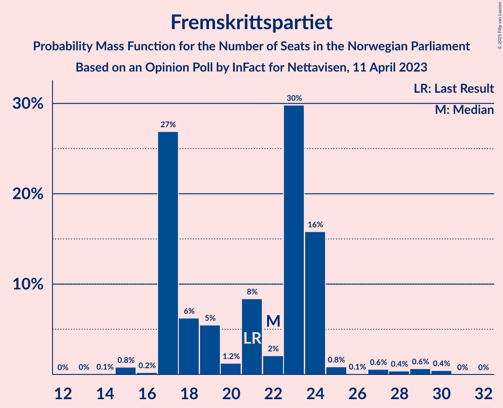

# Opinion Poll by InFact for Nettavisen, 11 April 2023

<a href="#voting-intentions">Voting Intentions</a> | <a href="#seats">Seats</a> | <a href="#coalitions">Coalitions</a> | <a href="#technical-information">Technical Information</a>

## Voting Intentions

### Confidence Intervals

| Party | Last Result | Poll Result | 80% Confidence Interval | 90% Confidence Interval | 95% Confidence Interval | 99% Confidence Interval |
|:-----:|:-----------:|:-----------:|:-----------------------:|:-----------------------:|:-----------------------:|:-----------------------:|
| Høyre | 20.4% | 32.2% | 30.3–34.1% |29.8–34.7% |29.4–35.2% |28.5–36.1% |
| Arbeiderpartiet | 26.2% | 17.6% | 16.1–19.2% |15.7–19.7% |15.4–20.1% |14.7–20.9% |
| Fremskrittspartiet | 11.6% | 11.1% | 9.9–12.5% |9.6–12.9% |9.3–13.2% |8.7–13.9% |
| Sosialistisk Venstreparti | 7.6% | 8.0% | 7.0–9.2% |6.7–9.6% |6.5–9.9% |6.0–10.5% |
| Rødt | 4.7% | 6.2% | 5.3–7.3% |5.1–7.6% |4.9–7.9% |4.5–8.4% |
| Senterpartiet | 13.5% | 5.7% | 4.9–6.8% |4.6–7.1% |4.4–7.3% |4.1–7.9% |
| Venstre | 4.6% | 5.5% | 4.7–6.5% |4.4–6.8% |4.3–7.1% |3.9–7.6% |
| Kristelig Folkeparti | 3.8% | 4.6% | 3.9–5.6% |3.6–5.9% |3.5–6.1% |3.1–6.6% |
| Miljøpartiet De Grønne | 3.9% | 3.2% | 2.6–4.0% |2.4–4.3% |2.3–4.5% |2.0–4.9% |
| Industri- og Næringspartiet | 0.3% | 2.1% | 1.6–2.8% |1.5–3.0% |1.4–3.2% |1.2–3.6% |
| Norgesdemokratene | 1.1% | 1.1% | 0.8–1.7% |0.7–1.8% |0.6–2.0% |0.5–2.3% |
| Liberalistene | 0.2% | 0.5% | 0.3–0.9% |0.3–1.1% |0.2–1.2% |0.2–1.4% |
| Folkets parti | 0.1% | 0.4% | 0.2–0.8% |0.2–0.9% |0.2–1.0% |0.1–1.3% |
| Konservativt | 0.4% | 0.4% | 0.2–0.8% |0.2–0.9% |0.2–1.0% |0.1–1.3% |
| Helsepartiet | 0.2% | 0.4% | 0.2–0.8% |0.2–0.9% |0.2–1.0% |0.1–1.3% |
| Pensjonistpartiet | 0.6% | 0.3% | 0.2–0.7% |0.1–0.8% |0.1–0.9% |0.1–1.1% |

*Note:* The poll result column reflects the actual value used in the calculations. Published results may vary slightly, and in addition be rounded to fewer digits.

## Seats

### Confidence Intervals

| Party | Last Result | Median | 80% Confidence Interval | 90% Confidence Interval | 95% Confidence Interval | 99% Confidence Interval |
|:-----:|:-----------:|:------:|:-----------------------:|:-----------------------:|:-----------------------:|:-----------------------:|
| <a href="#høyre">Høyre</a> | 36 | 60 | 50–64 |50–64 |49–64 |49–67 |
| <a href="#arbeiderpartiet">Arbeiderpartiet</a> | 48 | 35 | 33–37 |33–38 |33–39 |32–47 |
| <a href="#fremskrittspartiet">Fremskrittspartiet</a> | 21 | 22 | 17–24 |17–24 |17–25 |15–29 |
| <a href="#sosialistisk-venstreparti">Sosialistisk Venstreparti</a> | 13 | 14 | 11–16 |11–17 |10–17 |10–20 |
| <a href="#rødt">Rødt</a> | 8 | 10 | 9–13 |7–13 |7–14 |1–14 |
| <a href="#senterpartiet">Senterpartiet</a> | 28 | 10 | 8–11 |7–13 |7–14 |2–16 |
| <a href="#venstre">Venstre</a> | 8 | 10 | 3–12 |3–12 |3–12 |3–12 |
| <a href="#kristelig-folkeparti">Kristelig Folkeparti</a> | 3 | 9 | 7–10 |6–10 |2–10 |2–12 |
| <a href="#miljøpartiet-de-grønne">Miljøpartiet De Grønne</a> | 3 | 1 | 1–7 |1–8 |1–9 |1–9 |
| <a href="#industri--og-næringspartiet">Industri- og Næringspartiet</a> | 0 | 0 | 0–2 |0–2 |0–2 |0–7 |
| <a href="#norgesdemokratene">Norgesdemokratene</a> | 0 | 0 | 0 |0 |0 |0 |
| <a href="#liberalistene">Liberalistene</a> | 0 | 0 | 0 |0 |0 |0 |
| <a href="#folkets-parti">Folkets parti</a> | 0 | 0 | 0 |0 |0 |0 |
| <a href="#konservativt">Konservativt</a> | 0 | 0 | 0 |0 |0 |0 |
| <a href="#helsepartiet">Helsepartiet</a> | 0 | 0 | 0 |0 |0 |0 |
| <a href="#pensjonistpartiet">Pensjonistpartiet</a> | 0 | 0 | 0 |0 |0 |0 |

### Høyre

*For a full overview of the results for this party, see the [Høyre](party-høyre.html) page.*

| Number of Seats | Probability | Accumulated | Special Marks |
|:---------------:|:-----------:|:-----------:|:-------------:|
| 36 | 0% | 100% | Last Result |
| 37 | 0% | 100% |  |
| 38 | 0% | 100% |  |
| 39 | 0% | 100% |  |
| 40 | 0% | 100% |  |
| 41 | 0% | 100% |  |
| 42 | 0% | 100% |  |
| 43 | 0% | 100% |  |
| 44 | 0% | 100% |  |
| 45 | 0% | 100% |  |
| 46 | 0% | 100% |  |
| 47 | 0% | 100% |  |
| 48 | 0.1% | 100% |  |
| 49 | 4% | 99.8% |  |
| 50 | 16% | 96% |  |
| 51 | 0.3% | 81% |  |
| 52 | 0.7% | 80% |  |
| 53 | 9% | 80% |  |
| 54 | 3% | 70% |  |
| 55 | 0.8% | 68% |  |
| 56 | 2% | 67% |  |
| 57 | 3% | 64% |  |
| 58 | 4% | 61% |  |
| 59 | 2% | 57% |  |
| 60 | 27% | 55% | Median |
| 61 | 7% | 28% |  |
| 62 | 1.1% | 21% |  |
| 63 | 0.3% | 20% |  |
| 64 | 18% | 20% |  |
| 65 | 0.8% | 2% |  |
| 66 | 0.1% | 0.9% |  |
| 67 | 0.5% | 0.7% |  |
| 68 | 0.1% | 0.2% |  |
| 69 | 0% | 0.1% |  |
| 70 | 0% | 0% |  |

### Arbeiderpartiet

*For a full overview of the results for this party, see the [Arbeiderpartiet](party-arbeiderpartiet.html) page.*

| Number of Seats | Probability | Accumulated | Special Marks |
|:---------------:|:-----------:|:-----------:|:-------------:|
| 28 | 0.1% | 100% |  |
| 29 | 0.1% | 99.9% |  |
| 30 | 0.1% | 99.8% |  |
| 31 | 0% | 99.7% |  |
| 32 | 1.1% | 99.7% |  |
| 33 | 12% | 98.6% |  |
| 34 | 26% | 86% |  |
| 35 | 11% | 61% | Median |
| 36 | 24% | 50% |  |
| 37 | 18% | 26% |  |
| 38 | 5% | 8% |  |
| 39 | 1.0% | 3% |  |
| 40 | 0.4% | 2% |  |
| 41 | 0.6% | 2% |  |
| 42 | 0.1% | 1.3% |  |
| 43 | 0.2% | 1.2% |  |
| 44 | 0% | 1.0% |  |
| 45 | 0.2% | 1.0% |  |
| 46 | 0% | 0.7% |  |
| 47 | 0.7% | 0.7% |  |
| 48 | 0% | 0% | Last Result |

### Fremskrittspartiet

*For a full overview of the results for this party, see the [Fremskrittspartiet](party-fremskrittspartiet.html) page.*

| Number of Seats | Probability | Accumulated | Special Marks |
|:---------------:|:-----------:|:-----------:|:-------------:|
| 14 | 0.1% | 100% |  |
| 15 | 0.8% | 99.9% |  |
| 16 | 0.2% | 99.1% |  |
| 17 | 27% | 98.9% |  |
| 18 | 6% | 72% |  |
| 19 | 5% | 66% |  |
| 20 | 1.2% | 60% |  |
| 21 | 8% | 59% | Last Result |
| 22 | 2% | 51% | Median |
| 23 | 30% | 49% |  |
| 24 | 16% | 19% |  |
| 25 | 0.8% | 3% |  |
| 26 | 0.1% | 2% |  |
| 27 | 0.6% | 2% |  |
| 28 | 0.4% | 1.5% |  |
| 29 | 0.6% | 1.1% |  |
| 30 | 0.4% | 0.4% |  |
| 31 | 0% | 0% |  |

### Sosialistisk Venstreparti

*For a full overview of the results for this party, see the [Sosialistisk Venstreparti](party-sosialistiskvenstreparti.html) page.*

| Number of Seats | Probability | Accumulated | Special Marks |
|:---------------:|:-----------:|:-----------:|:-------------:|
| 9 | 0.3% | 100% |  |
| 10 | 3% | 99.7% |  |
| 11 | 11% | 97% |  |
| 12 | 3% | 86% |  |
| 13 | 5% | 83% | Last Result |
| 14 | 66% | 78% | Median |
| 15 | 2% | 13% |  |
| 16 | 4% | 10% |  |
| 17 | 4% | 6% |  |
| 18 | 0.3% | 2% |  |
| 19 | 1.2% | 2% |  |
| 20 | 0.8% | 0.8% |  |
| 21 | 0.1% | 0.1% |  |
| 22 | 0% | 0% |  |

### Rødt

*For a full overview of the results for this party, see the [Rødt](party-rødt.html) page.*

| Number of Seats | Probability | Accumulated | Special Marks |
|:---------------:|:-----------:|:-----------:|:-------------:|
| 1 | 1.2% | 100% |  |
| 2 | 0% | 98.8% |  |
| 3 | 0% | 98.8% |  |
| 4 | 0% | 98.8% |  |
| 5 | 0% | 98.8% |  |
| 6 | 0% | 98.8% |  |
| 7 | 5% | 98.8% |  |
| 8 | 0.6% | 94% | Last Result |
| 9 | 21% | 94% |  |
| 10 | 32% | 73% | Median |
| 11 | 9% | 41% |  |
| 12 | 19% | 32% |  |
| 13 | 8% | 12% |  |
| 14 | 4% | 5% |  |
| 15 | 0.2% | 0.3% |  |
| 16 | 0% | 0.2% |  |
| 17 | 0.2% | 0.2% |  |
| 18 | 0% | 0% |  |

### Senterpartiet

*For a full overview of the results for this party, see the [Senterpartiet](party-senterpartiet.html) page.*

| Number of Seats | Probability | Accumulated | Special Marks |
|:---------------:|:-----------:|:-----------:|:-------------:|
| 1 | 0.3% | 100% |  |
| 2 | 0.2% | 99.7% |  |
| 3 | 0.8% | 99.5% |  |
| 4 | 0% | 98.7% |  |
| 5 | 0% | 98.7% |  |
| 6 | 0% | 98.7% |  |
| 7 | 4% | 98.7% |  |
| 8 | 20% | 94% |  |
| 9 | 21% | 75% |  |
| 10 | 18% | 54% | Median |
| 11 | 28% | 36% |  |
| 12 | 2% | 8% |  |
| 13 | 3% | 6% |  |
| 14 | 1.0% | 3% |  |
| 15 | 0.1% | 2% |  |
| 16 | 2% | 2% |  |
| 17 | 0% | 0% |  |
| 18 | 0% | 0% |  |
| 19 | 0% | 0% |  |
| 20 | 0% | 0% |  |
| 21 | 0% | 0% |  |
| 22 | 0% | 0% |  |
| 23 | 0% | 0% |  |
| 24 | 0% | 0% |  |
| 25 | 0% | 0% |  |
| 26 | 0% | 0% |  |
| 27 | 0% | 0% |  |
| 28 | 0% | 0% | Last Result |

### Venstre

*For a full overview of the results for this party, see the [Venstre](party-venstre.html) page.*

| Number of Seats | Probability | Accumulated | Special Marks |
|:---------------:|:-----------:|:-----------:|:-------------:|
| 2 | 0.1% | 100% |  |
| 3 | 22% | 99.9% |  |
| 4 | 0% | 78% |  |
| 5 | 0% | 78% |  |
| 6 | 0.1% | 78% |  |
| 7 | 2% | 78% |  |
| 8 | 13% | 77% | Last Result |
| 9 | 7% | 63% |  |
| 10 | 6% | 56% | Median |
| 11 | 35% | 50% |  |
| 12 | 14% | 15% |  |
| 13 | 0.4% | 0.5% |  |
| 14 | 0.1% | 0.1% |  |
| 15 | 0% | 0% |  |

### Kristelig Folkeparti

*For a full overview of the results for this party, see the [Kristelig Folkeparti](party-kristeligfolkeparti.html) page.*

| Number of Seats | Probability | Accumulated | Special Marks |
|:---------------:|:-----------:|:-----------:|:-------------:|
| 2 | 3% | 100% |  |
| 3 | 2% | 97% | Last Result |
| 4 | 0% | 95% |  |
| 5 | 0% | 95% |  |
| 6 | 0.5% | 95% |  |
| 7 | 34% | 95% |  |
| 8 | 6% | 60% |  |
| 9 | 25% | 55% | Median |
| 10 | 27% | 30% |  |
| 11 | 1.5% | 2% |  |
| 12 | 0.9% | 1.0% |  |
| 13 | 0% | 0% |  |

### Miljøpartiet De Grønne

*For a full overview of the results for this party, see the [Miljøpartiet De Grønne](party-miljøpartietdegrønne.html) page.*

| Number of Seats | Probability | Accumulated | Special Marks |
|:---------------:|:-----------:|:-----------:|:-------------:|
| 1 | 60% | 100% | Median |
| 2 | 17% | 40% |  |
| 3 | 4% | 23% | Last Result |
| 4 | 0% | 19% |  |
| 5 | 0% | 19% |  |
| 6 | 0.5% | 19% |  |
| 7 | 13% | 18% |  |
| 8 | 0.3% | 5% |  |
| 9 | 5% | 5% |  |
| 10 | 0.1% | 0.1% |  |
| 11 | 0% | 0% |  |

### Industri- og Næringspartiet

*For a full overview of the results for this party, see the [Industri- og Næringspartiet](party-industri-ognæringspartiet.html) page.*

| Number of Seats | Probability | Accumulated | Special Marks |
|:---------------:|:-----------:|:-----------:|:-------------:|
| 0 | 70% | 100% | Last Result, Median |
| 1 | 2% | 30% |  |
| 2 | 26% | 28% |  |
| 3 | 2% | 2% |  |
| 4 | 0% | 0.6% |  |
| 5 | 0% | 0.6% |  |
| 6 | 0% | 0.6% |  |
| 7 | 0.5% | 0.5% |  |
| 8 | 0% | 0% |  |

### Norgesdemokratene

*For a full overview of the results for this party, see the [Norgesdemokratene](party-norgesdemokratene.html) page.*

| Number of Seats | Probability | Accumulated | Special Marks |
|:---------------:|:-----------:|:-----------:|:-------------:|
| 0 | 100% | 100% | Last Result, Median |

### Liberalistene

*For a full overview of the results for this party, see the [Liberalistene](party-liberalistene.html) page.*

| Number of Seats | Probability | Accumulated | Special Marks |
|:---------------:|:-----------:|:-----------:|:-------------:|
| 0 | 100% | 100% | Last Result, Median |

### Folkets parti

*For a full overview of the results for this party, see the [Folkets parti](party-folketsparti.html) page.*

| Number of Seats | Probability | Accumulated | Special Marks |
|:---------------:|:-----------:|:-----------:|:-------------:|
| 0 | 100% | 100% | Last Result, Median |

### Konservativt

*For a full overview of the results for this party, see the [Konservativt](party-konservativt.html) page.*

| Number of Seats | Probability | Accumulated | Special Marks |
|:---------------:|:-----------:|:-----------:|:-------------:|
| 0 | 100% | 100% | Last Result, Median |

### Helsepartiet

*For a full overview of the results for this party, see the [Helsepartiet](party-helsepartiet.html) page.*

| Number of Seats | Probability | Accumulated | Special Marks |
|:---------------:|:-----------:|:-----------:|:-------------:|
| 0 | 100% | 100% | Last Result, Median |

### Pensjonistpartiet

*For a full overview of the results for this party, see the [Pensjonistpartiet](party-pensjonistpartiet.html) page.*

| Number of Seats | Probability | Accumulated | Special Marks |
|:---------------:|:-----------:|:-----------:|:-------------:|
| 0 | 100% | 100% | Last Result, Median |

## Coalitions

### Confidence Intervals

| Coalition | Last Result | Median | Majority? | 80% Confidence Interval | 90% Confidence Interval | 95% Confidence Interval | 99% Confidence Interval |
|:---------:|:-----------:|:------:|:---------:|:-----------------------:|:-----------------------:|:-----------------------:|:-----------------------:|
| Høyre – Fremskrittspartiet – Senterpartiet – Venstre – Kristelig Folkeparti | 96 | 106 | 100% | 102–110 | 97–110 | 97–110 | 96–114 |
| Høyre – Fremskrittspartiet – Venstre – Kristelig Folkeparti – Miljøpartiet De Grønne | 71 | 97 | 99.9% | 93–102 | 91–105 | 91–105 | 88–109 |
| Høyre – Fremskrittspartiet – Venstre – Kristelig Folkeparti | 68 | 96 | 99.7% | 92–101 | 89–101 | 89–101 | 85–106 |
| Høyre – Fremskrittspartiet – Venstre | 65 | 86 | 88% | 84–92 | 82–92 | 80–94 | 77–96 |
| Høyre – Fremskrittspartiet | 57 | 80 | 3% | 74–83 | 71–83 | 70–85 | 70–87 |
| Høyre – Venstre – Kristelig Folkeparti | 47 | 73 | 0.1% | 68–84 | 68–84 | 68–84 | 62–84 |
| Arbeiderpartiet – Sosialistisk Venstreparti – Rødt – Senterpartiet – Miljøpartiet De Grønne | 100 | 72 | 0.1% | 67–76 | 67–79 | 66–79 | 62–82 |
| Arbeiderpartiet – Sosialistisk Venstreparti – Rødt – Senterpartiet | 97 | 71 | 0% | 64–73 | 63–77 | 63–77 | 59–80 |
| Arbeiderpartiet – Sosialistisk Venstreparti – Senterpartiet – Kristelig Folkeparti – Miljøpartiet De Grønne | 95 | 69 | 0% | 67–72 | 65–74 | 64–76 | 56–78 |
| Arbeiderpartiet – Sosialistisk Venstreparti – Rødt – Miljøpartiet De Grønne | 72 | 62 | 0% | 58–65 | 58–71 | 58–71 | 54–72 |
| Arbeiderpartiet – Sosialistisk Venstreparti – Senterpartiet – Miljøpartiet De Grønne | 92 | 62 | 0% | 58–65 | 58–66 | 57–67 | 54–70 |
| Arbeiderpartiet – Sosialistisk Venstreparti – Senterpartiet | 89 | 59 | 0% | 54–62 | 54–63 | 54–64 | 51–67 |
| Arbeiderpartiet – Senterpartiet – Kristelig Folkeparti – Miljøpartiet De Grønne | 82 | 55 | 0% | 53–58 | 52–60 | 50–62 | 46–63 |
| Arbeiderpartiet – Senterpartiet – Kristelig Folkeparti | 79 | 53 | 0% | 50–57 | 49–57 | 47–59 | 44–62 |
| Arbeiderpartiet – Sosialistisk Venstreparti | 61 | 49 | 0% | 46–51 | 46–55 | 45–55 | 43–57 |
| Arbeiderpartiet – Senterpartiet | 76 | 46 | 0% | 42–47 | 42–48 | 41–50 | 37–54 |
| Senterpartiet – Venstre – Kristelig Folkeparti | 39 | 27 | 0% | 24–29 | 23–30 | 22–33 | 18–35 |

### Høyre – Fremskrittspartiet – Senterpartiet – Venstre – Kristelig Folkeparti

| Number of Seats | Probability | Accumulated | Special Marks |
|:---------------:|:-----------:|:-----------:|:-------------:|
| 93 | 0.1% | 100% |  |
| 94 | 0.1% | 99.9% |  |
| 95 | 0.1% | 99.9% |  |
| 96 | 0.3% | 99.7% | Last Result |
| 97 | 5% | 99.4% |  |
| 98 | 0.5% | 95% |  |
| 99 | 0.9% | 94% |  |
| 100 | 2% | 93% |  |
| 101 | 1.3% | 91% |  |
| 102 | 16% | 90% |  |
| 103 | 10% | 74% |  |
| 104 | 7% | 64% |  |
| 105 | 3% | 56% |  |
| 106 | 7% | 53% |  |
| 107 | 22% | 46% |  |
| 108 | 4% | 24% |  |
| 109 | 1.1% | 20% |  |
| 110 | 17% | 19% |  |
| 111 | 0.6% | 2% | Median |
| 112 | 0.1% | 1.3% |  |
| 113 | 0% | 1.2% |  |
| 114 | 0.7% | 1.2% |  |
| 115 | 0% | 0.4% |  |
| 116 | 0.4% | 0.4% |  |
| 117 | 0% | 0% |  |

### Høyre – Fremskrittspartiet – Venstre – Kristelig Folkeparti – Miljøpartiet De Grønne

| Number of Seats | Probability | Accumulated | Special Marks |
|:---------------:|:-----------:|:-----------:|:-------------:|
| 71 | 0% | 100% | Last Result |
| 72 | 0% | 100% |  |
| 73 | 0% | 100% |  |
| 74 | 0% | 100% |  |
| 75 | 0% | 100% |  |
| 76 | 0% | 100% |  |
| 77 | 0% | 100% |  |
| 78 | 0% | 100% |  |
| 79 | 0% | 100% |  |
| 80 | 0% | 100% |  |
| 81 | 0% | 100% |  |
| 82 | 0% | 100% |  |
| 83 | 0% | 100% |  |
| 84 | 0.1% | 100% |  |
| 85 | 0% | 99.9% | Majority |
| 86 | 0.2% | 99.9% |  |
| 87 | 0% | 99.6% |  |
| 88 | 0.9% | 99.6% |  |
| 89 | 0.1% | 98.7% |  |
| 90 | 0.1% | 98.6% |  |
| 91 | 4% | 98% |  |
| 92 | 0.7% | 95% |  |
| 93 | 19% | 94% |  |
| 94 | 1.2% | 75% |  |
| 95 | 1.3% | 74% |  |
| 96 | 0.7% | 72% |  |
| 97 | 27% | 72% |  |
| 98 | 3% | 44% |  |
| 99 | 1.4% | 42% |  |
| 100 | 2% | 40% |  |
| 101 | 5% | 38% |  |
| 102 | 25% | 34% | Median |
| 103 | 0.9% | 8% |  |
| 104 | 1.4% | 7% |  |
| 105 | 4% | 6% |  |
| 106 | 0.1% | 1.3% |  |
| 107 | 0.1% | 1.3% |  |
| 108 | 0% | 1.1% |  |
| 109 | 0.6% | 1.1% |  |
| 110 | 0.5% | 0.5% |  |
| 111 | 0% | 0% |  |

### Høyre – Fremskrittspartiet – Venstre – Kristelig Folkeparti

| Number of Seats | Probability | Accumulated | Special Marks |
|:---------------:|:-----------:|:-----------:|:-------------:|
| 68 | 0% | 100% | Last Result |
| 69 | 0% | 100% |  |
| 70 | 0% | 100% |  |
| 71 | 0% | 100% |  |
| 72 | 0% | 100% |  |
| 73 | 0% | 100% |  |
| 74 | 0% | 100% |  |
| 75 | 0% | 100% |  |
| 76 | 0% | 100% |  |
| 77 | 0% | 100% |  |
| 78 | 0% | 100% |  |
| 79 | 0% | 100% |  |
| 80 | 0% | 100% |  |
| 81 | 0% | 100% |  |
| 82 | 0% | 100% |  |
| 83 | 0.2% | 100% |  |
| 84 | 0.1% | 99.8% |  |
| 85 | 0.3% | 99.7% | Majority |
| 86 | 0.9% | 99.5% |  |
| 87 | 0.2% | 98.6% |  |
| 88 | 0.2% | 98% |  |
| 89 | 4% | 98% |  |
| 90 | 3% | 94% |  |
| 91 | 0.9% | 91% |  |
| 92 | 19% | 90% |  |
| 93 | 0.7% | 71% |  |
| 94 | 2% | 71% |  |
| 95 | 15% | 69% |  |
| 96 | 26% | 54% |  |
| 97 | 3% | 28% |  |
| 98 | 2% | 25% |  |
| 99 | 3% | 23% |  |
| 100 | 0.4% | 19% |  |
| 101 | 16% | 19% | Median |
| 102 | 1.1% | 2% |  |
| 103 | 0.5% | 1.3% |  |
| 104 | 0% | 0.8% |  |
| 105 | 0.1% | 0.7% |  |
| 106 | 0.7% | 0.7% |  |
| 107 | 0% | 0% |  |

### Høyre – Fremskrittspartiet – Venstre

| Number of Seats | Probability | Accumulated | Special Marks |
|:---------------:|:-----------:|:-----------:|:-------------:|
| 65 | 0% | 100% | Last Result |
| 66 | 0% | 100% |  |
| 67 | 0% | 100% |  |
| 68 | 0% | 100% |  |
| 69 | 0% | 100% |  |
| 70 | 0% | 100% |  |
| 71 | 0% | 100% |  |
| 72 | 0% | 100% |  |
| 73 | 0% | 100% |  |
| 74 | 0% | 100% |  |
| 75 | 0% | 100% |  |
| 76 | 0.1% | 100% |  |
| 77 | 1.1% | 99.9% |  |
| 78 | 0.3% | 98.8% |  |
| 79 | 0.1% | 98.6% |  |
| 80 | 2% | 98% |  |
| 81 | 0.8% | 97% |  |
| 82 | 4% | 96% |  |
| 83 | 2% | 92% |  |
| 84 | 2% | 90% |  |
| 85 | 17% | 88% | Majority |
| 86 | 27% | 71% |  |
| 87 | 2% | 45% |  |
| 88 | 10% | 43% |  |
| 89 | 8% | 33% |  |
| 90 | 4% | 25% |  |
| 91 | 2% | 21% |  |
| 92 | 16% | 20% | Median |
| 93 | 0.9% | 4% |  |
| 94 | 0.4% | 3% |  |
| 95 | 0.9% | 2% |  |
| 96 | 1.1% | 2% |  |
| 97 | 0.1% | 0.5% |  |
| 98 | 0% | 0.4% |  |
| 99 | 0.3% | 0.4% |  |
| 100 | 0.1% | 0.1% |  |
| 101 | 0% | 0% |  |

### Høyre – Fremskrittspartiet

| Number of Seats | Probability | Accumulated | Special Marks |
|:---------------:|:-----------:|:-----------:|:-------------:|
| 57 | 0% | 100% | Last Result |
| 58 | 0% | 100% |  |
| 59 | 0% | 100% |  |
| 60 | 0% | 100% |  |
| 61 | 0% | 100% |  |
| 62 | 0% | 100% |  |
| 63 | 0% | 100% |  |
| 64 | 0% | 100% |  |
| 65 | 0% | 100% |  |
| 66 | 0% | 100% |  |
| 67 | 0% | 100% |  |
| 68 | 0.3% | 100% |  |
| 69 | 0.1% | 99.7% |  |
| 70 | 4% | 99.5% |  |
| 71 | 2% | 96% |  |
| 72 | 0.3% | 94% |  |
| 73 | 1.2% | 93% |  |
| 74 | 17% | 92% |  |
| 75 | 3% | 75% |  |
| 76 | 10% | 72% |  |
| 77 | 0.9% | 61% |  |
| 78 | 7% | 60% |  |
| 79 | 2% | 53% |  |
| 80 | 3% | 51% |  |
| 81 | 21% | 48% |  |
| 82 | 1.0% | 26% | Median |
| 83 | 22% | 25% |  |
| 84 | 0.7% | 3% |  |
| 85 | 1.3% | 3% | Majority |
| 86 | 0.3% | 1.4% |  |
| 87 | 0.7% | 1.1% |  |
| 88 | 0% | 0.4% |  |
| 89 | 0.2% | 0.3% |  |
| 90 | 0% | 0.1% |  |
| 91 | 0.1% | 0.1% |  |
| 92 | 0% | 0% |  |

### Høyre – Venstre – Kristelig Folkeparti

| Number of Seats | Probability | Accumulated | Special Marks |
|:---------------:|:-----------:|:-----------:|:-------------:|
| 47 | 0% | 100% | Last Result |
| 48 | 0% | 100% |  |
| 49 | 0% | 100% |  |
| 50 | 0% | 100% |  |
| 51 | 0% | 100% |  |
| 52 | 0% | 100% |  |
| 53 | 0% | 100% |  |
| 54 | 0% | 100% |  |
| 55 | 0% | 100% |  |
| 56 | 0% | 100% |  |
| 57 | 0% | 100% |  |
| 58 | 0% | 100% |  |
| 59 | 0% | 100% |  |
| 60 | 0% | 100% |  |
| 61 | 0% | 100% |  |
| 62 | 0.9% | 100% |  |
| 63 | 0.1% | 99.1% |  |
| 64 | 0% | 99.0% |  |
| 65 | 0.1% | 99.0% |  |
| 66 | 0% | 98.8% |  |
| 67 | 0.2% | 98.8% |  |
| 68 | 19% | 98.6% |  |
| 69 | 0.2% | 80% |  |
| 70 | 0.7% | 80% |  |
| 71 | 2% | 79% |  |
| 72 | 9% | 78% |  |
| 73 | 25% | 68% |  |
| 74 | 2% | 44% |  |
| 75 | 6% | 42% |  |
| 76 | 1.5% | 35% |  |
| 77 | 4% | 34% |  |
| 78 | 8% | 29% |  |
| 79 | 1.3% | 21% | Median |
| 80 | 2% | 20% |  |
| 81 | 0.2% | 18% |  |
| 82 | 0.2% | 18% |  |
| 83 | 0.9% | 17% |  |
| 84 | 16% | 16% |  |
| 85 | 0% | 0.1% | Majority |
| 86 | 0% | 0.1% |  |
| 87 | 0% | 0% |  |

### Arbeiderpartiet – Sosialistisk Venstreparti – Rødt – Senterpartiet – Miljøpartiet De Grønne

| Number of Seats | Probability | Accumulated | Special Marks |
|:---------------:|:-----------:|:-----------:|:-------------:|
| 62 | 0.7% | 100% |  |
| 63 | 0.1% | 99.3% |  |
| 64 | 0.4% | 99.2% |  |
| 65 | 0.5% | 98.9% |  |
| 66 | 1.2% | 98% |  |
| 67 | 16% | 97% |  |
| 68 | 0.7% | 81% |  |
| 69 | 4% | 80% |  |
| 70 | 2% | 76% | Median |
| 71 | 12% | 74% |  |
| 72 | 26% | 62% |  |
| 73 | 6% | 36% |  |
| 74 | 17% | 30% |  |
| 75 | 2% | 13% |  |
| 76 | 2% | 11% |  |
| 77 | 0.9% | 9% |  |
| 78 | 3% | 8% |  |
| 79 | 4% | 5% |  |
| 80 | 0.1% | 2% |  |
| 81 | 0.2% | 1.4% |  |
| 82 | 0.9% | 1.3% |  |
| 83 | 0.3% | 0.4% |  |
| 84 | 0% | 0.1% |  |
| 85 | 0.1% | 0.1% | Majority |
| 86 | 0% | 0% |  |
| 87 | 0% | 0% |  |
| 88 | 0% | 0% |  |
| 89 | 0% | 0% |  |
| 90 | 0% | 0% |  |
| 91 | 0% | 0% |  |
| 92 | 0% | 0% |  |
| 93 | 0% | 0% |  |
| 94 | 0% | 0% |  |
| 95 | 0% | 0% |  |
| 96 | 0% | 0% |  |
| 97 | 0% | 0% |  |
| 98 | 0% | 0% |  |
| 99 | 0% | 0% |  |
| 100 | 0% | 0% | Last Result |

### Arbeiderpartiet – Sosialistisk Venstreparti – Rødt – Senterpartiet

| Number of Seats | Probability | Accumulated | Special Marks |
|:---------------:|:-----------:|:-----------:|:-------------:|
| 58 | 0.4% | 100% |  |
| 59 | 0.7% | 99.5% |  |
| 60 | 0% | 98.9% |  |
| 61 | 0.1% | 98.8% |  |
| 62 | 0.1% | 98.7% |  |
| 63 | 5% | 98.6% |  |
| 64 | 10% | 94% |  |
| 65 | 0.9% | 84% |  |
| 66 | 17% | 83% |  |
| 67 | 5% | 66% |  |
| 68 | 2% | 61% |  |
| 69 | 2% | 59% | Median |
| 70 | 3% | 57% |  |
| 71 | 27% | 54% |  |
| 72 | 2% | 27% |  |
| 73 | 16% | 26% |  |
| 74 | 1.4% | 10% |  |
| 75 | 3% | 8% |  |
| 76 | 0.2% | 5% |  |
| 77 | 4% | 5% |  |
| 78 | 0.1% | 1.4% |  |
| 79 | 0.1% | 1.3% |  |
| 80 | 0.9% | 1.2% |  |
| 81 | 0% | 0.4% |  |
| 82 | 0.2% | 0.4% |  |
| 83 | 0% | 0.1% |  |
| 84 | 0.1% | 0.1% |  |
| 85 | 0% | 0% | Majority |
| 86 | 0% | 0% |  |
| 87 | 0% | 0% |  |
| 88 | 0% | 0% |  |
| 89 | 0% | 0% |  |
| 90 | 0% | 0% |  |
| 91 | 0% | 0% |  |
| 92 | 0% | 0% |  |
| 93 | 0% | 0% |  |
| 94 | 0% | 0% |  |
| 95 | 0% | 0% |  |
| 96 | 0% | 0% |  |
| 97 | 0% | 0% | Last Result |

### Arbeiderpartiet – Sosialistisk Venstreparti – Senterpartiet – Kristelig Folkeparti – Miljøpartiet De Grønne

| Number of Seats | Probability | Accumulated | Special Marks |
|:---------------:|:-----------:|:-----------:|:-------------:|
| 56 | 0.6% | 100% |  |
| 57 | 0% | 99.4% |  |
| 58 | 0% | 99.3% |  |
| 59 | 0.1% | 99.3% |  |
| 60 | 0% | 99.2% |  |
| 61 | 0.1% | 99.2% |  |
| 62 | 0.6% | 99.1% |  |
| 63 | 0.5% | 98.5% |  |
| 64 | 2% | 98% |  |
| 65 | 2% | 96% |  |
| 66 | 3% | 94% |  |
| 67 | 17% | 92% |  |
| 68 | 9% | 74% |  |
| 69 | 20% | 65% | Median |
| 70 | 3% | 45% |  |
| 71 | 4% | 42% |  |
| 72 | 31% | 38% |  |
| 73 | 1.2% | 7% |  |
| 74 | 1.3% | 6% |  |
| 75 | 0.1% | 4% |  |
| 76 | 2% | 4% |  |
| 77 | 0.7% | 2% |  |
| 78 | 0.9% | 1.3% |  |
| 79 | 0% | 0.3% |  |
| 80 | 0.1% | 0.3% |  |
| 81 | 0.2% | 0.2% |  |
| 82 | 0% | 0% |  |
| 83 | 0% | 0% |  |
| 84 | 0% | 0% |  |
| 85 | 0% | 0% | Majority |
| 86 | 0% | 0% |  |
| 87 | 0% | 0% |  |
| 88 | 0% | 0% |  |
| 89 | 0% | 0% |  |
| 90 | 0% | 0% |  |
| 91 | 0% | 0% |  |
| 92 | 0% | 0% |  |
| 93 | 0% | 0% |  |
| 94 | 0% | 0% |  |
| 95 | 0% | 0% | Last Result |

### Arbeiderpartiet – Sosialistisk Venstreparti – Rødt – Miljøpartiet De Grønne

| Number of Seats | Probability | Accumulated | Special Marks |
|:---------------:|:-----------:|:-----------:|:-------------:|
| 52 | 0.4% | 100% |  |
| 53 | 0% | 99.6% |  |
| 54 | 0.7% | 99.5% |  |
| 55 | 0.1% | 98.8% |  |
| 56 | 0.5% | 98.7% |  |
| 57 | 0.6% | 98% |  |
| 58 | 17% | 98% |  |
| 59 | 2% | 80% |  |
| 60 | 4% | 79% | Median |
| 61 | 22% | 75% |  |
| 62 | 9% | 53% |  |
| 63 | 12% | 44% |  |
| 64 | 21% | 32% |  |
| 65 | 1.0% | 11% |  |
| 66 | 0.7% | 10% |  |
| 67 | 1.4% | 9% |  |
| 68 | 1.3% | 8% |  |
| 69 | 0.9% | 6% |  |
| 70 | 0.5% | 6% |  |
| 71 | 5% | 5% |  |
| 72 | 0.4% | 0.5% | Last Result |
| 73 | 0.2% | 0.2% |  |
| 74 | 0% | 0% |  |

### Arbeiderpartiet – Sosialistisk Venstreparti – Senterpartiet – Miljøpartiet De Grønne

| Number of Seats | Probability | Accumulated | Special Marks |
|:---------------:|:-----------:|:-----------:|:-------------:|
| 51 | 0.1% | 100% |  |
| 52 | 0.1% | 99.9% |  |
| 53 | 0.3% | 99.8% |  |
| 54 | 0.4% | 99.6% |  |
| 55 | 0.7% | 99.2% |  |
| 56 | 0.2% | 98.5% |  |
| 57 | 1.1% | 98% |  |
| 58 | 18% | 97% |  |
| 59 | 2% | 79% |  |
| 60 | 9% | 77% | Median |
| 61 | 11% | 68% |  |
| 62 | 36% | 56% |  |
| 63 | 3% | 20% |  |
| 64 | 3% | 18% |  |
| 65 | 10% | 15% |  |
| 66 | 3% | 5% |  |
| 67 | 0.3% | 3% |  |
| 68 | 0.7% | 2% |  |
| 69 | 1.1% | 2% |  |
| 70 | 0.1% | 0.6% |  |
| 71 | 0% | 0.4% |  |
| 72 | 0.1% | 0.4% |  |
| 73 | 0.2% | 0.3% |  |
| 74 | 0.1% | 0.1% |  |
| 75 | 0% | 0% |  |
| 76 | 0% | 0% |  |
| 77 | 0% | 0% |  |
| 78 | 0% | 0% |  |
| 79 | 0% | 0% |  |
| 80 | 0% | 0% |  |
| 81 | 0% | 0% |  |
| 82 | 0% | 0% |  |
| 83 | 0% | 0% |  |
| 84 | 0% | 0% |  |
| 85 | 0% | 0% | Majority |
| 86 | 0% | 0% |  |
| 87 | 0% | 0% |  |
| 88 | 0% | 0% |  |
| 89 | 0% | 0% |  |
| 90 | 0% | 0% |  |
| 91 | 0% | 0% |  |
| 92 | 0% | 0% | Last Result |

### Arbeiderpartiet – Sosialistisk Venstreparti – Senterpartiet

| Number of Seats | Probability | Accumulated | Special Marks |
|:---------------:|:-----------:|:-----------:|:-------------:|
| 49 | 0.1% | 100% |  |
| 50 | 0% | 99.9% |  |
| 51 | 1.0% | 99.9% |  |
| 52 | 0.5% | 98.9% |  |
| 53 | 0.5% | 98% |  |
| 54 | 10% | 98% |  |
| 55 | 0.3% | 88% |  |
| 56 | 8% | 88% |  |
| 57 | 18% | 80% |  |
| 58 | 7% | 61% |  |
| 59 | 5% | 54% | Median |
| 60 | 1.3% | 49% |  |
| 61 | 38% | 48% |  |
| 62 | 0.5% | 10% |  |
| 63 | 7% | 10% |  |
| 64 | 1.4% | 3% |  |
| 65 | 0.2% | 2% |  |
| 66 | 0.2% | 1.5% |  |
| 67 | 0.8% | 1.3% |  |
| 68 | 0.1% | 0.5% |  |
| 69 | 0% | 0.4% |  |
| 70 | 0% | 0.3% |  |
| 71 | 0.1% | 0.3% |  |
| 72 | 0.2% | 0.2% |  |
| 73 | 0% | 0% |  |
| 74 | 0% | 0% |  |
| 75 | 0% | 0% |  |
| 76 | 0% | 0% |  |
| 77 | 0% | 0% |  |
| 78 | 0% | 0% |  |
| 79 | 0% | 0% |  |
| 80 | 0% | 0% |  |
| 81 | 0% | 0% |  |
| 82 | 0% | 0% |  |
| 83 | 0% | 0% |  |
| 84 | 0% | 0% |  |
| 85 | 0% | 0% | Majority |
| 86 | 0% | 0% |  |
| 87 | 0% | 0% |  |
| 88 | 0% | 0% |  |
| 89 | 0% | 0% | Last Result |

### Arbeiderpartiet – Senterpartiet – Kristelig Folkeparti – Miljøpartiet De Grønne

| Number of Seats | Probability | Accumulated | Special Marks |
|:---------------:|:-----------:|:-----------:|:-------------:|
| 42 | 0.3% | 100% |  |
| 43 | 0% | 99.7% |  |
| 44 | 0.1% | 99.7% |  |
| 45 | 0.1% | 99.7% |  |
| 46 | 0.6% | 99.6% |  |
| 47 | 0.1% | 99.0% |  |
| 48 | 0.7% | 98.9% |  |
| 49 | 0.3% | 98% |  |
| 50 | 1.2% | 98% |  |
| 51 | 0.9% | 97% |  |
| 52 | 1.4% | 96% |  |
| 53 | 18% | 94% |  |
| 54 | 2% | 76% |  |
| 55 | 27% | 74% | Median |
| 56 | 0.8% | 47% |  |
| 57 | 12% | 46% |  |
| 58 | 26% | 35% |  |
| 59 | 1.4% | 9% |  |
| 60 | 2% | 7% |  |
| 61 | 0.6% | 5% |  |
| 62 | 3% | 4% |  |
| 63 | 1.3% | 2% |  |
| 64 | 0.1% | 0.5% |  |
| 65 | 0.2% | 0.4% |  |
| 66 | 0.1% | 0.2% |  |
| 67 | 0% | 0% |  |
| 68 | 0% | 0% |  |
| 69 | 0% | 0% |  |
| 70 | 0% | 0% |  |
| 71 | 0% | 0% |  |
| 72 | 0% | 0% |  |
| 73 | 0% | 0% |  |
| 74 | 0% | 0% |  |
| 75 | 0% | 0% |  |
| 76 | 0% | 0% |  |
| 77 | 0% | 0% |  |
| 78 | 0% | 0% |  |
| 79 | 0% | 0% |  |
| 80 | 0% | 0% |  |
| 81 | 0% | 0% |  |
| 82 | 0% | 0% | Last Result |

### Arbeiderpartiet – Senterpartiet – Kristelig Folkeparti

| Number of Seats | Probability | Accumulated | Special Marks |
|:---------------:|:-----------:|:-----------:|:-------------:|
| 40 | 0.3% | 100% |  |
| 41 | 0% | 99.7% |  |
| 42 | 0% | 99.7% |  |
| 43 | 0.1% | 99.7% |  |
| 44 | 0.5% | 99.6% |  |
| 45 | 0.4% | 99.2% |  |
| 46 | 0.7% | 98.8% |  |
| 47 | 1.1% | 98% |  |
| 48 | 1.0% | 97% |  |
| 49 | 5% | 96% |  |
| 50 | 12% | 91% |  |
| 51 | 0.5% | 79% |  |
| 52 | 17% | 79% |  |
| 53 | 12% | 61% |  |
| 54 | 19% | 49% | Median |
| 55 | 3% | 30% |  |
| 56 | 3% | 27% |  |
| 57 | 21% | 25% |  |
| 58 | 0.2% | 4% |  |
| 59 | 2% | 3% |  |
| 60 | 0% | 1.2% |  |
| 61 | 0.1% | 1.1% |  |
| 62 | 0.8% | 1.1% |  |
| 63 | 0% | 0.2% |  |
| 64 | 0.2% | 0.2% |  |
| 65 | 0% | 0% |  |
| 66 | 0% | 0% |  |
| 67 | 0% | 0% |  |
| 68 | 0% | 0% |  |
| 69 | 0% | 0% |  |
| 70 | 0% | 0% |  |
| 71 | 0% | 0% |  |
| 72 | 0% | 0% |  |
| 73 | 0% | 0% |  |
| 74 | 0% | 0% |  |
| 75 | 0% | 0% |  |
| 76 | 0% | 0% |  |
| 77 | 0% | 0% |  |
| 78 | 0% | 0% |  |
| 79 | 0% | 0% | Last Result |

### Arbeiderpartiet – Sosialistisk Venstreparti

| Number of Seats | Probability | Accumulated | Special Marks |
|:---------------:|:-----------:|:-----------:|:-------------:|
| 41 | 0.1% | 100% |  |
| 42 | 0% | 99.9% |  |
| 43 | 0.4% | 99.9% |  |
| 44 | 1.0% | 99.4% |  |
| 45 | 1.4% | 98% |  |
| 46 | 11% | 97% |  |
| 47 | 10% | 86% |  |
| 48 | 22% | 77% |  |
| 49 | 5% | 54% | Median |
| 50 | 24% | 50% |  |
| 51 | 16% | 26% |  |
| 52 | 2% | 9% |  |
| 53 | 1.2% | 7% |  |
| 54 | 0.1% | 6% |  |
| 55 | 4% | 6% |  |
| 56 | 0.9% | 2% |  |
| 57 | 0.8% | 1.2% |  |
| 58 | 0% | 0.4% |  |
| 59 | 0.1% | 0.4% |  |
| 60 | 0% | 0.3% |  |
| 61 | 0.2% | 0.2% | Last Result |
| 62 | 0% | 0% |  |

### Arbeiderpartiet – Senterpartiet

| Number of Seats | Probability | Accumulated | Special Marks |
|:---------------:|:-----------:|:-----------:|:-------------:|
| 35 | 0.2% | 100% |  |
| 36 | 0% | 99.7% |  |
| 37 | 0.3% | 99.7% |  |
| 38 | 0% | 99.4% |  |
| 39 | 0% | 99.4% |  |
| 40 | 0.8% | 99.4% |  |
| 41 | 1.3% | 98.5% |  |
| 42 | 8% | 97% |  |
| 43 | 27% | 90% |  |
| 44 | 8% | 62% |  |
| 45 | 3% | 55% | Median |
| 46 | 8% | 52% |  |
| 47 | 38% | 44% |  |
| 48 | 1.1% | 6% |  |
| 49 | 2% | 5% |  |
| 50 | 1.4% | 3% |  |
| 51 | 0.4% | 2% |  |
| 52 | 0% | 1.1% |  |
| 53 | 0% | 1.1% |  |
| 54 | 0.7% | 1.1% |  |
| 55 | 0.1% | 0.4% |  |
| 56 | 0.2% | 0.2% |  |
| 57 | 0% | 0% |  |
| 58 | 0% | 0% |  |
| 59 | 0% | 0% |  |
| 60 | 0% | 0% |  |
| 61 | 0% | 0% |  |
| 62 | 0% | 0% |  |
| 63 | 0% | 0% |  |
| 64 | 0% | 0% |  |
| 65 | 0% | 0% |  |
| 66 | 0% | 0% |  |
| 67 | 0% | 0% |  |
| 68 | 0% | 0% |  |
| 69 | 0% | 0% |  |
| 70 | 0% | 0% |  |
| 71 | 0% | 0% |  |
| 72 | 0% | 0% |  |
| 73 | 0% | 0% |  |
| 74 | 0% | 0% |  |
| 75 | 0% | 0% |  |
| 76 | 0% | 0% | Last Result |

### Senterpartiet – Venstre – Kristelig Folkeparti

| Number of Seats | Probability | Accumulated | Special Marks |
|:---------------:|:-----------:|:-----------:|:-------------:|
| 14 | 0.3% | 100% |  |
| 15 | 0.1% | 99.7% |  |
| 16 | 0% | 99.6% |  |
| 17 | 0% | 99.6% |  |
| 18 | 0.3% | 99.6% |  |
| 19 | 0% | 99.3% |  |
| 20 | 0.8% | 99.2% |  |
| 21 | 0.6% | 98% |  |
| 22 | 1.2% | 98% |  |
| 23 | 6% | 97% |  |
| 24 | 22% | 90% |  |
| 25 | 2% | 68% |  |
| 26 | 3% | 66% |  |
| 27 | 15% | 63% |  |
| 28 | 22% | 48% |  |
| 29 | 20% | 26% | Median |
| 30 | 1.5% | 6% |  |
| 31 | 0.9% | 4% |  |
| 32 | 0.7% | 4% |  |
| 33 | 0.8% | 3% |  |
| 34 | 0% | 2% |  |
| 35 | 2% | 2% |  |
| 36 | 0% | 0% |  |
| 37 | 0% | 0% |  |
| 38 | 0% | 0% |  |
| 39 | 0% | 0% | Last Result |

## Technical Information

### Opinion Poll

+ **Polling firm:** InFact
+ **Commissioner(s):** Nettavisen
+ **Fieldwork period:** 11 April 2023

### Calculations

+ **Sample size:** 1000
+ **Simulations done:** 1,048,576
+ **Error estimate:** 2.83%

