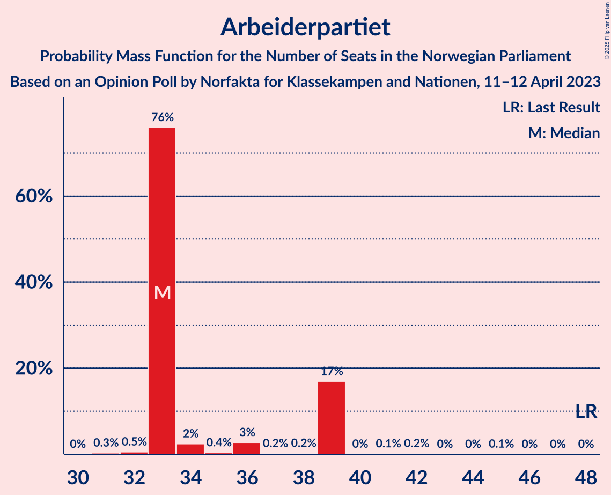
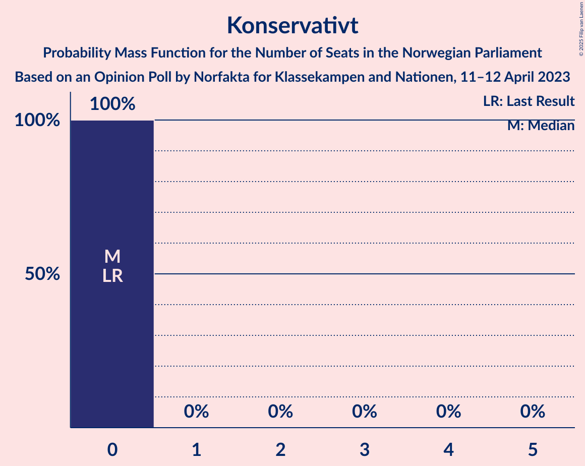
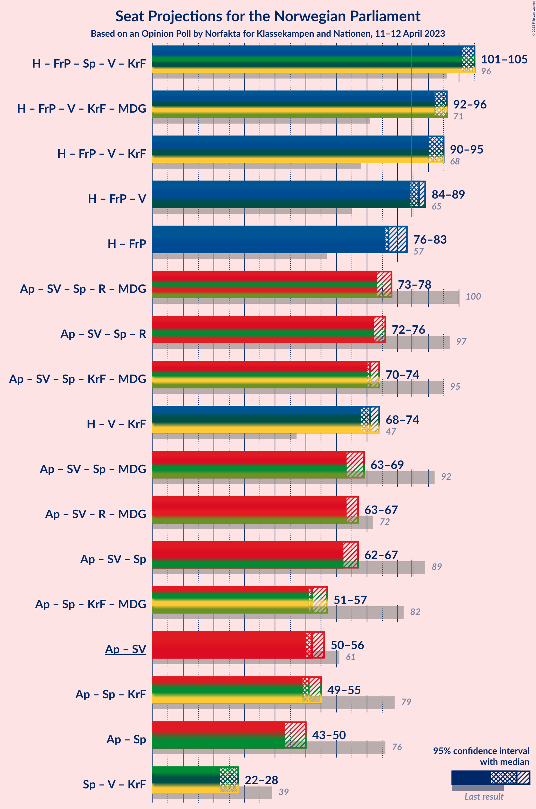
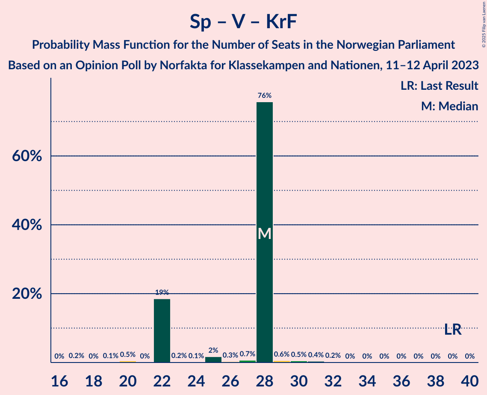

# Opinion Poll by Norfakta for Klassekampen and Nationen, 11–12 April 2023

<a href="#voting-intentions">Voting Intentions</a> | <a href="#seats">Seats</a> | <a href="#coalitions">Coalitions</a> | <a href="#technical-information">Technical Information</a>

## Voting Intentions

### Confidence Intervals

| Party | Last Result | Poll Result | 80% Confidence Interval | 90% Confidence Interval | 95% Confidence Interval | 99% Confidence Interval |
|:-----:|:-----------:|:-----------:|:-----------------------:|:-----------------------:|:-----------------------:|:-----------------------:|
| Høyre | 20.4% | 30.8% | 29.0–32.8% |28.5–33.3% |28.0–33.8% |27.2–34.7% |
| Arbeiderpartiet | 26.2% | 18.6% | 17.1–20.2% |16.6–20.7% |16.3–21.1% |15.6–21.9% |
| Fremskrittspartiet | 11.6% | 12.3% | 11.0–13.7% |10.7–14.1% |10.4–14.5% |9.8–15.2% |
| Sosialistisk Venstreparti | 7.6% | 10.0% | 8.9–11.3% |8.5–11.7% |8.3–12.0% |7.8–12.7% |
| Senterpartiet | 13.5% | 6.3% | 5.4–7.4% |5.2–7.7% |4.9–8.0% |4.5–8.5% |
| Rødt | 4.7% | 5.3% | 4.5–6.3% |4.3–6.6% |4.1–6.9% |3.7–7.4% |
| Venstre | 4.6% | 4.9% | 4.1–5.9% |3.9–6.2% |3.7–6.4% |3.4–6.9% |
| Kristelig Folkeparti | 3.8% | 4.0% | 3.3–4.9% |3.1–5.2% |2.9–5.4% |2.6–5.9% |
| Miljøpartiet De Grønne | 3.9% | 3.4% | 2.8–4.3% |2.6–4.5% |2.4–4.7% |2.2–5.2% |
| Norgesdemokratene | 1.1% | 0.9% | 0.6–1.4% |0.5–1.6% |0.5–1.7% |0.4–2.0% |
| Pensjonistpartiet | 0.6% | 0.9% | 0.6–1.4% |0.5–1.6% |0.5–1.7% |0.4–2.0% |
| Industri- og Næringspartiet | 0.3% | 0.9% | 0.6–1.4% |0.5–1.6% |0.5–1.7% |0.4–2.0% |
| Folkets parti | 0.1% | 0.4% | 0.2–0.8% |0.2–0.9% |0.2–1.0% |0.1–1.3% |
| Liberalistene | 0.2% | 0.2% | 0.1–0.5% |0.1–0.6% |0.1–0.7% |0.0–0.9% |
| Konservativt | 0.4% | 0.1% | 0.0–0.4% |0.0–0.5% |0.0–0.6% |0.0–0.7% |

*Note:* The poll result column reflects the actual value used in the calculations. Published results may vary slightly, and in addition be rounded to fewer digits.

## Seats

### Confidence Intervals

| Party | Last Result | Median | 80% Confidence Interval | 90% Confidence Interval | 95% Confidence Interval | 99% Confidence Interval |
|:-----:|:-----------:|:------:|:-----------------------:|:-----------------------:|:-----------------------:|:-----------------------:|
| <a href="#høyre">Høyre</a> | 36 | 53 | 53–57 |53–57 |53–63 |51–63 |
| <a href="#arbeiderpartiet">Arbeiderpartiet</a> | 48 | 33 | 33–39 |33–39 |33–39 |32–39 |
| <a href="#fremskrittspartiet">Fremskrittspartiet</a> | 21 | 24 | 22–24 |22–24 |20–24 |19–28 |
| <a href="#sosialistisk-venstreparti">Sosialistisk Venstreparti</a> | 13 | 19 | 17–19 |17–19 |16–19 |15–21 |
| <a href="#senterpartiet">Senterpartiet</a> | 28 | 10 | 10–11 |10–11 |10–12 |9–14 |
| <a href="#rødt">Rødt</a> | 8 | 10 | 9–10 |9–10 |8–11 |8–12 |
| <a href="#venstre">Venstre</a> | 8 | 10 | 8–10 |8–10 |3–10 |3–11 |
| <a href="#kristelig-folkeparti">Kristelig Folkeparti</a> | 3 | 8 | 3–8 |3–8 |3–8 |2–9 |
| <a href="#miljøpartiet-de-grønne">Miljøpartiet De Grønne</a> | 3 | 1 | 1–2 |1–2 |1–2 |1–8 |
| <a href="#norgesdemokratene">Norgesdemokratene</a> | 0 | 0 | 0 |0 |0 |0 |
| <a href="#pensjonistpartiet">Pensjonistpartiet</a> | 0 | 0 | 0 |0 |0 |0 |
| <a href="#industri--og-næringspartiet">Industri- og Næringspartiet</a> | 0 | 0 | 0 |0 |0 |0 |
| <a href="#folkets-parti">Folkets parti</a> | 0 | 0 | 0 |0 |0 |0 |
| <a href="#liberalistene">Liberalistene</a> | 0 | 0 | 0 |0 |0 |0 |
| <a href="#konservativt">Konservativt</a> | 0 | 0 | 0 |0 |0 |0 |

### Høyre

*For a full overview of the results for this party, see the [Høyre](party-høyre.html) page.*

| Number of Seats | Probability | Accumulated | Special Marks |
|:---------------:|:-----------:|:-----------:|:-------------:|
| 36 | 0% | 100% | Last Result |
| 37 | 0% | 100% |  |
| 38 | 0% | 100% |  |
| 39 | 0% | 100% |  |
| 40 | 0% | 100% |  |
| 41 | 0% | 100% |  |
| 42 | 0% | 100% |  |
| 43 | 0% | 100% |  |
| 44 | 0% | 100% |  |
| 45 | 0% | 100% |  |
| 46 | 0% | 100% |  |
| 47 | 0% | 100% |  |
| 48 | 0% | 100% |  |
| 49 | 0.2% | 99.9% |  |
| 50 | 0.1% | 99.8% |  |
| 51 | 0.6% | 99.7% |  |
| 52 | 0.4% | 99.1% |  |
| 53 | 76% | 98.8% | Median |
| 54 | 0.8% | 23% |  |
| 55 | 0.6% | 22% |  |
| 56 | 0.7% | 22% |  |
| 57 | 16% | 21% |  |
| 58 | 2% | 5% |  |
| 59 | 0.1% | 3% |  |
| 60 | 0.2% | 3% |  |
| 61 | 0.1% | 3% |  |
| 62 | 0.1% | 3% |  |
| 63 | 2% | 3% |  |
| 64 | 0% | 0% |  |

### Arbeiderpartiet

*For a full overview of the results for this party, see the [Arbeiderpartiet](party-arbeiderpartiet.html) page.*

| Number of Seats | Probability | Accumulated | Special Marks |
|:---------------:|:-----------:|:-----------:|:-------------:|
| 31 | 0.3% | 100% |  |
| 32 | 0.5% | 99.7% |  |
| 33 | 76% | 99.1% | Median |
| 34 | 2% | 23% |  |
| 35 | 0.4% | 21% |  |
| 36 | 3% | 20% |  |
| 37 | 0.2% | 18% |  |
| 38 | 0.2% | 18% |  |
| 39 | 17% | 17% |  |
| 40 | 0% | 0.4% |  |
| 41 | 0.1% | 0.3% |  |
| 42 | 0.2% | 0.2% |  |
| 43 | 0% | 0.1% |  |
| 44 | 0% | 0.1% |  |
| 45 | 0.1% | 0.1% |  |
| 46 | 0% | 0% |  |
| 47 | 0% | 0% |  |
| 48 | 0% | 0% | Last Result |

### Fremskrittspartiet

*For a full overview of the results for this party, see the [Fremskrittspartiet](party-fremskrittspartiet.html) page.*

| Number of Seats | Probability | Accumulated | Special Marks |
|:---------------:|:-----------:|:-----------:|:-------------:|
| 17 | 0.1% | 100% |  |
| 18 | 0.3% | 99.9% |  |
| 19 | 1.3% | 99.6% |  |
| 20 | 3% | 98% |  |
| 21 | 0.4% | 96% | Last Result |
| 22 | 18% | 95% |  |
| 23 | 0.2% | 77% |  |
| 24 | 76% | 77% | Median |
| 25 | 0.2% | 1.0% |  |
| 26 | 0.1% | 0.8% |  |
| 27 | 0.2% | 0.7% |  |
| 28 | 0.5% | 0.5% |  |
| 29 | 0% | 0% |  |

### Sosialistisk Venstreparti

*For a full overview of the results for this party, see the [Sosialistisk Venstreparti](party-sosialistiskvenstreparti.html) page.*

| Number of Seats | Probability | Accumulated | Special Marks |
|:---------------:|:-----------:|:-----------:|:-------------:|
| 12 | 0.1% | 100% |  |
| 13 | 0.2% | 99.9% | Last Result |
| 14 | 0.1% | 99.7% |  |
| 15 | 1.1% | 99.6% |  |
| 16 | 2% | 98.5% |  |
| 17 | 17% | 96% |  |
| 18 | 3% | 80% |  |
| 19 | 76% | 77% | Median |
| 20 | 0.2% | 0.8% |  |
| 21 | 0.3% | 0.6% |  |
| 22 | 0.1% | 0.2% |  |
| 23 | 0% | 0.1% |  |
| 24 | 0.1% | 0.1% |  |
| 25 | 0% | 0% |  |

### Senterpartiet

*For a full overview of the results for this party, see the [Senterpartiet](party-senterpartiet.html) page.*

| Number of Seats | Probability | Accumulated | Special Marks |
|:---------------:|:-----------:|:-----------:|:-------------:|
| 7 | 0.1% | 100% |  |
| 8 | 0.2% | 99.9% |  |
| 9 | 0.8% | 99.7% |  |
| 10 | 76% | 98.9% | Median |
| 11 | 20% | 23% |  |
| 12 | 0.4% | 3% |  |
| 13 | 2% | 2% |  |
| 14 | 0.6% | 0.7% |  |
| 15 | 0% | 0.1% |  |
| 16 | 0% | 0.1% |  |
| 17 | 0% | 0% |  |
| 18 | 0% | 0% |  |
| 19 | 0% | 0% |  |
| 20 | 0% | 0% |  |
| 21 | 0% | 0% |  |
| 22 | 0% | 0% |  |
| 23 | 0% | 0% |  |
| 24 | 0% | 0% |  |
| 25 | 0% | 0% |  |
| 26 | 0% | 0% |  |
| 27 | 0% | 0% |  |
| 28 | 0% | 0% | Last Result |

### Rødt

*For a full overview of the results for this party, see the [Rødt](party-rødt.html) page.*

| Number of Seats | Probability | Accumulated | Special Marks |
|:---------------:|:-----------:|:-----------:|:-------------:|
| 1 | 0.2% | 100% |  |
| 2 | 0% | 99.8% |  |
| 3 | 0% | 99.8% |  |
| 4 | 0% | 99.8% |  |
| 5 | 0% | 99.8% |  |
| 6 | 0% | 99.8% |  |
| 7 | 0.1% | 99.8% |  |
| 8 | 3% | 99.8% | Last Result |
| 9 | 17% | 97% |  |
| 10 | 76% | 79% | Median |
| 11 | 2% | 3% |  |
| 12 | 0.7% | 1.0% |  |
| 13 | 0% | 0.3% |  |
| 14 | 0% | 0.3% |  |
| 15 | 0.3% | 0.3% |  |
| 16 | 0% | 0% |  |

### Venstre

*For a full overview of the results for this party, see the [Venstre](party-venstre.html) page.*

| Number of Seats | Probability | Accumulated | Special Marks |
|:---------------:|:-----------:|:-----------:|:-------------:|
| 2 | 0.3% | 100% |  |
| 3 | 3% | 99.7% |  |
| 4 | 0% | 97% |  |
| 5 | 0% | 97% |  |
| 6 | 0% | 97% |  |
| 7 | 0.2% | 97% |  |
| 8 | 17% | 97% | Last Result |
| 9 | 1.0% | 80% |  |
| 10 | 77% | 79% | Median |
| 11 | 2% | 2% |  |
| 12 | 0% | 0.1% |  |
| 13 | 0.1% | 0.1% |  |
| 14 | 0% | 0% |  |

### Kristelig Folkeparti

*For a full overview of the results for this party, see the [Kristelig Folkeparti](party-kristeligfolkeparti.html) page.*

| Number of Seats | Probability | Accumulated | Special Marks |
|:---------------:|:-----------:|:-----------:|:-------------:|
| 2 | 0.7% | 100% |  |
| 3 | 18% | 99.3% | Last Result |
| 4 | 0% | 81% |  |
| 5 | 0% | 81% |  |
| 6 | 0% | 81% |  |
| 7 | 0.2% | 81% |  |
| 8 | 80% | 81% | Median |
| 9 | 0.3% | 0.6% |  |
| 10 | 0.3% | 0.3% |  |
| 11 | 0% | 0.1% |  |
| 12 | 0% | 0% |  |

### Miljøpartiet De Grønne

*For a full overview of the results for this party, see the [Miljøpartiet De Grønne](party-miljøpartietdegrønne.html) page.*

| Number of Seats | Probability | Accumulated | Special Marks |
|:---------------:|:-----------:|:-----------:|:-------------:|
| 1 | 80% | 100% | Median |
| 2 | 19% | 20% |  |
| 3 | 0.2% | 1.1% | Last Result |
| 4 | 0% | 0.8% |  |
| 5 | 0% | 0.8% |  |
| 6 | 0% | 0.8% |  |
| 7 | 0.3% | 0.8% |  |
| 8 | 0.3% | 0.5% |  |
| 9 | 0.2% | 0.2% |  |
| 10 | 0% | 0.1% |  |
| 11 | 0% | 0% |  |

### Norgesdemokratene

*For a full overview of the results for this party, see the [Norgesdemokratene](party-norgesdemokratene.html) page.*

| Number of Seats | Probability | Accumulated | Special Marks |
|:---------------:|:-----------:|:-----------:|:-------------:|
| 0 | 100% | 100% | Last Result, Median |

### Pensjonistpartiet

*For a full overview of the results for this party, see the [Pensjonistpartiet](party-pensjonistpartiet.html) page.*

| Number of Seats | Probability | Accumulated | Special Marks |
|:---------------:|:-----------:|:-----------:|:-------------:|
| 0 | 100% | 100% | Last Result, Median |

### Industri- og Næringspartiet

*For a full overview of the results for this party, see the [Industri- og Næringspartiet](party-industri-ognæringspartiet.html) page.*

| Number of Seats | Probability | Accumulated | Special Marks |
|:---------------:|:-----------:|:-----------:|:-------------:|
| 0 | 100% | 100% | Last Result, Median |

### Folkets parti

*For a full overview of the results for this party, see the [Folkets parti](party-folketsparti.html) page.*

| Number of Seats | Probability | Accumulated | Special Marks |
|:---------------:|:-----------:|:-----------:|:-------------:|
| 0 | 100% | 100% | Last Result, Median |

### Liberalistene

*For a full overview of the results for this party, see the [Liberalistene](party-liberalistene.html) page.*

| Number of Seats | Probability | Accumulated | Special Marks |
|:---------------:|:-----------:|:-----------:|:-------------:|
| 0 | 100% | 100% | Last Result, Median |

### Konservativt

*For a full overview of the results for this party, see the [Konservativt](party-konservativt.html) page.*

| Number of Seats | Probability | Accumulated | Special Marks |
|:---------------:|:-----------:|:-----------:|:-------------:|
| 0 | 100% | 100% | Last Result, Median |

## Coalitions

### Confidence Intervals

| Coalition | Last Result | Median | Majority? | 80% Confidence Interval | 90% Confidence Interval | 95% Confidence Interval | 99% Confidence Interval |
|:---------:|:-----------:|:------:|:---------:|:-----------------------:|:-----------------------:|:-----------------------:|:-----------------------:|
| Høyre – Fremskrittspartiet – Senterpartiet – Venstre – Kristelig Folkeparti | 96 | 105 | 100% | 101–105 | 101–105 | 101–105 | 96–108 |
| Høyre – Fremskrittspartiet – Venstre – Kristelig Folkeparti – Miljøpartiet De Grønne | 71 | 96 | 100% | 92–96 | 92–96 | 92–96 | 89–101 |
| Høyre – Fremskrittspartiet – Venstre – Kristelig Folkeparti | 68 | 95 | 99.8% | 90–95 | 90–95 | 90–95 | 86–97 |
| Høyre – Fremskrittspartiet – Venstre | 65 | 87 | 97% | 87 | 86–87 | 84–89 | 80–93 |
| Høyre – Fremskrittspartiet | 57 | 77 | 0.2% | 77–79 | 77–80 | 76–83 | 72–83 |
| Arbeiderpartiet – Sosialistisk Venstreparti – Senterpartiet – Rødt – Miljøpartiet De Grønne | 100 | 73 | 0.1% | 73–78 | 73–78 | 73–78 | 71–82 |
| Arbeiderpartiet – Sosialistisk Venstreparti – Senterpartiet – Rødt | 97 | 72 | 0% | 72–76 | 72–76 | 72–76 | 67–79 |
| Arbeiderpartiet – Sosialistisk Venstreparti – Senterpartiet – Kristelig Folkeparti – Miljøpartiet De Grønne | 95 | 71 | 0% | 71–72 | 71–73 | 70–74 | 66–78 |
| Høyre – Venstre – Kristelig Folkeparti | 47 | 71 | 0% | 68–71 | 68–72 | 68–74 | 63–74 |
| Arbeiderpartiet – Sosialistisk Venstreparti – Senterpartiet – Miljøpartiet De Grønne | 92 | 63 | 0% | 63–69 | 63–69 | 63–69 | 63–71 |
| Arbeiderpartiet – Sosialistisk Venstreparti – Rødt – Miljøpartiet De Grønne | 72 | 63 | 0% | 63–67 | 63–67 | 63–67 | 60–72 |
| Arbeiderpartiet – Sosialistisk Venstreparti – Senterpartiet | 89 | 62 | 0% | 62–67 | 62–67 | 62–67 | 59–68 |
| Arbeiderpartiet – Senterpartiet – Kristelig Folkeparti – Miljøpartiet De Grønne | 82 | 52 | 0% | 52–55 | 52–56 | 51–57 | 50–61 |
| Arbeiderpartiet – Sosialistisk Venstreparti | 61 | 52 | 0% | 52–56 | 52–56 | 50–56 | 48–56 |
| Arbeiderpartiet – Senterpartiet – Kristelig Folkeparti | 79 | 51 | 0% | 51–53 | 51–53 | 49–55 | 47–60 |
| Arbeiderpartiet – Senterpartiet | 76 | 43 | 0% | 43–50 | 43–50 | 43–50 | 41–52 |
| Senterpartiet – Venstre – Kristelig Folkeparti | 39 | 28 | 0% | 22–28 | 22–28 | 22–28 | 20–31 |

### Høyre – Fremskrittspartiet – Senterpartiet – Venstre – Kristelig Folkeparti

| Number of Seats | Probability | Accumulated | Special Marks |
|:---------------:|:-----------:|:-----------:|:-------------:|
| 94 | 0.1% | 100% |  |
| 95 | 0.2% | 99.8% |  |
| 96 | 0.1% | 99.6% | Last Result |
| 97 | 0.2% | 99.5% |  |
| 98 | 0% | 99.2% |  |
| 99 | 0.1% | 99.2% |  |
| 100 | 0.1% | 99.1% |  |
| 101 | 16% | 99.0% |  |
| 102 | 0.6% | 83% |  |
| 103 | 0.2% | 82% |  |
| 104 | 1.0% | 82% |  |
| 105 | 80% | 81% | Median |
| 106 | 0.1% | 0.8% |  |
| 107 | 0.1% | 0.8% |  |
| 108 | 0.2% | 0.7% |  |
| 109 | 0% | 0.5% |  |
| 110 | 0.4% | 0.5% |  |
| 111 | 0% | 0.1% |  |
| 112 | 0% | 0% |  |

### Høyre – Fremskrittspartiet – Venstre – Kristelig Folkeparti – Miljøpartiet De Grønne

| Number of Seats | Probability | Accumulated | Special Marks |
|:---------------:|:-----------:|:-----------:|:-------------:|
| 71 | 0% | 100% | Last Result |
| 72 | 0% | 100% |  |
| 73 | 0% | 100% |  |
| 74 | 0% | 100% |  |
| 75 | 0% | 100% |  |
| 76 | 0% | 100% |  |
| 77 | 0% | 100% |  |
| 78 | 0% | 100% |  |
| 79 | 0% | 100% |  |
| 80 | 0% | 100% |  |
| 81 | 0% | 100% |  |
| 82 | 0% | 100% |  |
| 83 | 0% | 100% |  |
| 84 | 0% | 100% |  |
| 85 | 0% | 100% | Majority |
| 86 | 0.1% | 100% |  |
| 87 | 0% | 99.8% |  |
| 88 | 0.1% | 99.8% |  |
| 89 | 0.3% | 99.7% |  |
| 90 | 0.3% | 99.3% |  |
| 91 | 0.2% | 99.0% |  |
| 92 | 17% | 98.8% |  |
| 93 | 0.2% | 82% |  |
| 94 | 0.6% | 82% |  |
| 95 | 3% | 81% |  |
| 96 | 77% | 78% | Median |
| 97 | 0.2% | 0.9% |  |
| 98 | 0.1% | 0.7% |  |
| 99 | 0.1% | 0.6% |  |
| 100 | 0.1% | 0.6% |  |
| 101 | 0% | 0.5% |  |
| 102 | 0% | 0.5% |  |
| 103 | 0.4% | 0.4% |  |
| 104 | 0% | 0% |  |

### Høyre – Fremskrittspartiet – Venstre – Kristelig Folkeparti

| Number of Seats | Probability | Accumulated | Special Marks |
|:---------------:|:-----------:|:-----------:|:-------------:|
| 68 | 0% | 100% | Last Result |
| 69 | 0% | 100% |  |
| 70 | 0% | 100% |  |
| 71 | 0% | 100% |  |
| 72 | 0% | 100% |  |
| 73 | 0% | 100% |  |
| 74 | 0% | 100% |  |
| 75 | 0% | 100% |  |
| 76 | 0% | 100% |  |
| 77 | 0% | 100% |  |
| 78 | 0% | 100% |  |
| 79 | 0% | 100% |  |
| 80 | 0% | 100% |  |
| 81 | 0% | 100% |  |
| 82 | 0% | 100% |  |
| 83 | 0% | 99.9% |  |
| 84 | 0.1% | 99.9% |  |
| 85 | 0% | 99.8% | Majority |
| 86 | 0.3% | 99.7% |  |
| 87 | 0.1% | 99.5% |  |
| 88 | 0.9% | 99.3% |  |
| 89 | 0.1% | 98% |  |
| 90 | 16% | 98% |  |
| 91 | 1.2% | 82% |  |
| 92 | 0.3% | 81% |  |
| 93 | 0.2% | 81% |  |
| 94 | 4% | 80% |  |
| 95 | 76% | 76% | Median |
| 96 | 0% | 0.6% |  |
| 97 | 0.1% | 0.6% |  |
| 98 | 0.1% | 0.5% |  |
| 99 | 0% | 0.4% |  |
| 100 | 0% | 0.4% |  |
| 101 | 0.4% | 0.4% |  |
| 102 | 0% | 0% |  |

### Høyre – Fremskrittspartiet – Venstre

| Number of Seats | Probability | Accumulated | Special Marks |
|:---------------:|:-----------:|:-----------:|:-------------:|
| 65 | 0% | 100% | Last Result |
| 66 | 0% | 100% |  |
| 67 | 0% | 100% |  |
| 68 | 0% | 100% |  |
| 69 | 0% | 100% |  |
| 70 | 0% | 100% |  |
| 71 | 0% | 100% |  |
| 72 | 0% | 100% |  |
| 73 | 0% | 100% |  |
| 74 | 0% | 100% |  |
| 75 | 0.1% | 100% |  |
| 76 | 0% | 99.9% |  |
| 77 | 0% | 99.8% |  |
| 78 | 0.3% | 99.8% |  |
| 79 | 0% | 99.6% |  |
| 80 | 0.4% | 99.5% |  |
| 81 | 0.1% | 99.1% |  |
| 82 | 0% | 99.0% |  |
| 83 | 1.2% | 99.0% |  |
| 84 | 0.4% | 98% |  |
| 85 | 0.1% | 97% | Majority |
| 86 | 3% | 97% |  |
| 87 | 92% | 95% | Median |
| 88 | 0.2% | 3% |  |
| 89 | 0.2% | 3% |  |
| 90 | 0.1% | 2% |  |
| 91 | 2% | 2% |  |
| 92 | 0.1% | 0.7% |  |
| 93 | 0.4% | 0.5% |  |
| 94 | 0.1% | 0.1% |  |
| 95 | 0% | 0.1% |  |
| 96 | 0% | 0% |  |

### Høyre – Fremskrittspartiet

| Number of Seats | Probability | Accumulated | Special Marks |
|:---------------:|:-----------:|:-----------:|:-------------:|
| 57 | 0% | 100% | Last Result |
| 58 | 0% | 100% |  |
| 59 | 0% | 100% |  |
| 60 | 0% | 100% |  |
| 61 | 0% | 100% |  |
| 62 | 0% | 100% |  |
| 63 | 0% | 100% |  |
| 64 | 0% | 100% |  |
| 65 | 0% | 100% |  |
| 66 | 0% | 100% |  |
| 67 | 0.1% | 100% |  |
| 68 | 0% | 99.9% |  |
| 69 | 0% | 99.9% |  |
| 70 | 0% | 99.9% |  |
| 71 | 0.3% | 99.9% |  |
| 72 | 0.3% | 99.6% |  |
| 73 | 0.6% | 99.3% |  |
| 74 | 0.2% | 98.7% |  |
| 75 | 0.9% | 98.5% |  |
| 76 | 0.2% | 98% |  |
| 77 | 76% | 97% | Median |
| 78 | 0.2% | 22% |  |
| 79 | 16% | 21% |  |
| 80 | 2% | 5% |  |
| 81 | 0.1% | 3% |  |
| 82 | 0.4% | 3% |  |
| 83 | 3% | 3% |  |
| 84 | 0% | 0.3% |  |
| 85 | 0.1% | 0.2% | Majority |
| 86 | 0.1% | 0.1% |  |
| 87 | 0% | 0% |  |

### Arbeiderpartiet – Sosialistisk Venstreparti – Senterpartiet – Rødt – Miljøpartiet De Grønne

| Number of Seats | Probability | Accumulated | Special Marks |
|:---------------:|:-----------:|:-----------:|:-------------:|
| 67 | 0.4% | 100% |  |
| 68 | 0% | 99.6% |  |
| 69 | 0% | 99.6% |  |
| 70 | 0.1% | 99.6% |  |
| 71 | 0.1% | 99.5% |  |
| 72 | 0% | 99.4% |  |
| 73 | 76% | 99.4% | Median |
| 74 | 4% | 24% |  |
| 75 | 0.2% | 20% |  |
| 76 | 0.3% | 19% |  |
| 77 | 1.1% | 19% |  |
| 78 | 16% | 18% |  |
| 79 | 0.1% | 2% |  |
| 80 | 0.9% | 2% |  |
| 81 | 0.2% | 0.7% |  |
| 82 | 0.3% | 0.5% |  |
| 83 | 0% | 0.3% |  |
| 84 | 0.1% | 0.2% |  |
| 85 | 0% | 0.1% | Majority |
| 86 | 0% | 0.1% |  |
| 87 | 0% | 0% |  |
| 88 | 0% | 0% |  |
| 89 | 0% | 0% |  |
| 90 | 0% | 0% |  |
| 91 | 0% | 0% |  |
| 92 | 0% | 0% |  |
| 93 | 0% | 0% |  |
| 94 | 0% | 0% |  |
| 95 | 0% | 0% |  |
| 96 | 0% | 0% |  |
| 97 | 0% | 0% |  |
| 98 | 0% | 0% |  |
| 99 | 0% | 0% |  |
| 100 | 0% | 0% | Last Result |

### Arbeiderpartiet – Sosialistisk Venstreparti – Senterpartiet – Rødt

| Number of Seats | Probability | Accumulated | Special Marks |
|:---------------:|:-----------:|:-----------:|:-------------:|
| 65 | 0.4% | 100% |  |
| 66 | 0% | 99.6% |  |
| 67 | 0% | 99.5% |  |
| 68 | 0.1% | 99.5% |  |
| 69 | 0.1% | 99.4% |  |
| 70 | 0.1% | 99.4% |  |
| 71 | 0.2% | 99.3% |  |
| 72 | 77% | 99.1% | Median |
| 73 | 3% | 22% |  |
| 74 | 0.5% | 19% |  |
| 75 | 0.2% | 18% |  |
| 76 | 17% | 18% |  |
| 77 | 0.2% | 1.2% |  |
| 78 | 0.3% | 1.0% |  |
| 79 | 0.4% | 0.7% |  |
| 80 | 0.1% | 0.3% |  |
| 81 | 0% | 0.2% |  |
| 82 | 0.1% | 0.2% |  |
| 83 | 0% | 0% |  |
| 84 | 0% | 0% |  |
| 85 | 0% | 0% | Majority |
| 86 | 0% | 0% |  |
| 87 | 0% | 0% |  |
| 88 | 0% | 0% |  |
| 89 | 0% | 0% |  |
| 90 | 0% | 0% |  |
| 91 | 0% | 0% |  |
| 92 | 0% | 0% |  |
| 93 | 0% | 0% |  |
| 94 | 0% | 0% |  |
| 95 | 0% | 0% |  |
| 96 | 0% | 0% |  |
| 97 | 0% | 0% | Last Result |

### Arbeiderpartiet – Sosialistisk Venstreparti – Senterpartiet – Kristelig Folkeparti – Miljøpartiet De Grønne

| Number of Seats | Probability | Accumulated | Special Marks |
|:---------------:|:-----------:|:-----------:|:-------------:|
| 65 | 0.1% | 100% |  |
| 66 | 2% | 99.9% |  |
| 67 | 0% | 98% |  |
| 68 | 0.2% | 98% |  |
| 69 | 0.1% | 98% |  |
| 70 | 0.3% | 98% |  |
| 71 | 76% | 97% | Median |
| 72 | 16% | 21% |  |
| 73 | 0.5% | 5% |  |
| 74 | 3% | 5% |  |
| 75 | 0.1% | 2% |  |
| 76 | 0.6% | 2% |  |
| 77 | 0.4% | 1.1% |  |
| 78 | 0.4% | 0.7% |  |
| 79 | 0.1% | 0.3% |  |
| 80 | 0% | 0.2% |  |
| 81 | 0% | 0.2% |  |
| 82 | 0.1% | 0.2% |  |
| 83 | 0.1% | 0.1% |  |
| 84 | 0% | 0% |  |
| 85 | 0% | 0% | Majority |
| 86 | 0% | 0% |  |
| 87 | 0% | 0% |  |
| 88 | 0% | 0% |  |
| 89 | 0% | 0% |  |
| 90 | 0% | 0% |  |
| 91 | 0% | 0% |  |
| 92 | 0% | 0% |  |
| 93 | 0% | 0% |  |
| 94 | 0% | 0% |  |
| 95 | 0% | 0% | Last Result |

### Høyre – Venstre – Kristelig Folkeparti

| Number of Seats | Probability | Accumulated | Special Marks |
|:---------------:|:-----------:|:-----------:|:-------------:|
| 47 | 0% | 100% | Last Result |
| 48 | 0% | 100% |  |
| 49 | 0% | 100% |  |
| 50 | 0% | 100% |  |
| 51 | 0% | 100% |  |
| 52 | 0% | 100% |  |
| 53 | 0% | 100% |  |
| 54 | 0% | 100% |  |
| 55 | 0% | 100% |  |
| 56 | 0% | 100% |  |
| 57 | 0% | 100% |  |
| 58 | 0% | 100% |  |
| 59 | 0.1% | 100% |  |
| 60 | 0% | 99.9% |  |
| 61 | 0% | 99.9% |  |
| 62 | 0.1% | 99.9% |  |
| 63 | 0.4% | 99.8% |  |
| 64 | 0.1% | 99.4% |  |
| 65 | 0.1% | 99.3% |  |
| 66 | 0.2% | 99.3% |  |
| 67 | 0.5% | 99.1% |  |
| 68 | 17% | 98.6% |  |
| 69 | 0.2% | 82% |  |
| 70 | 0.4% | 82% |  |
| 71 | 76% | 82% | Median |
| 72 | 3% | 6% |  |
| 73 | 0.5% | 3% |  |
| 74 | 2% | 3% |  |
| 75 | 0% | 0.2% |  |
| 76 | 0% | 0.2% |  |
| 77 | 0% | 0.1% |  |
| 78 | 0% | 0.1% |  |
| 79 | 0% | 0% |  |

### Arbeiderpartiet – Sosialistisk Venstreparti – Senterpartiet – Miljøpartiet De Grønne

| Number of Seats | Probability | Accumulated | Special Marks |
|:---------------:|:-----------:|:-----------:|:-------------:|
| 58 | 0.4% | 100% |  |
| 59 | 0% | 99.6% |  |
| 60 | 0% | 99.6% |  |
| 61 | 0% | 99.6% |  |
| 62 | 0% | 99.5% |  |
| 63 | 77% | 99.5% | Median |
| 64 | 0.1% | 22% |  |
| 65 | 0.5% | 22% |  |
| 66 | 3% | 22% |  |
| 67 | 0.3% | 19% |  |
| 68 | 0.9% | 19% |  |
| 69 | 17% | 18% |  |
| 70 | 0.3% | 0.9% |  |
| 71 | 0.2% | 0.6% |  |
| 72 | 0.1% | 0.4% |  |
| 73 | 0% | 0.3% |  |
| 74 | 0.1% | 0.3% |  |
| 75 | 0% | 0.1% |  |
| 76 | 0% | 0.1% |  |
| 77 | 0% | 0.1% |  |
| 78 | 0% | 0% |  |
| 79 | 0% | 0% |  |
| 80 | 0% | 0% |  |
| 81 | 0% | 0% |  |
| 82 | 0% | 0% |  |
| 83 | 0% | 0% |  |
| 84 | 0% | 0% |  |
| 85 | 0% | 0% | Majority |
| 86 | 0% | 0% |  |
| 87 | 0% | 0% |  |
| 88 | 0% | 0% |  |
| 89 | 0% | 0% |  |
| 90 | 0% | 0% |  |
| 91 | 0% | 0% |  |
| 92 | 0% | 0% | Last Result |

### Arbeiderpartiet – Sosialistisk Venstreparti – Rødt – Miljøpartiet De Grønne

| Number of Seats | Probability | Accumulated | Special Marks |
|:---------------:|:-----------:|:-----------:|:-------------:|
| 57 | 0% | 100% |  |
| 58 | 0.4% | 99.9% |  |
| 59 | 0% | 99.5% |  |
| 60 | 0.2% | 99.5% |  |
| 61 | 0.1% | 99.3% |  |
| 62 | 0.1% | 99.2% |  |
| 63 | 80% | 99.2% | Median |
| 64 | 1.0% | 19% |  |
| 65 | 0.2% | 18% |  |
| 66 | 0.6% | 18% |  |
| 67 | 16% | 17% |  |
| 68 | 0.1% | 1.0% |  |
| 69 | 0.1% | 0.9% |  |
| 70 | 0% | 0.8% |  |
| 71 | 0.2% | 0.8% |  |
| 72 | 0.2% | 0.5% | Last Result |
| 73 | 0.2% | 0.4% |  |
| 74 | 0.1% | 0.2% |  |
| 75 | 0% | 0% |  |

### Arbeiderpartiet – Sosialistisk Venstreparti – Senterpartiet

| Number of Seats | Probability | Accumulated | Special Marks |
|:---------------:|:-----------:|:-----------:|:-------------:|
| 56 | 0.4% | 100% |  |
| 57 | 0% | 99.6% |  |
| 58 | 0% | 99.6% |  |
| 59 | 0.1% | 99.5% |  |
| 60 | 0% | 99.5% |  |
| 61 | 2% | 99.4% |  |
| 62 | 76% | 98% | Median |
| 63 | 0.6% | 22% |  |
| 64 | 0.3% | 21% |  |
| 65 | 2% | 21% |  |
| 66 | 0.2% | 18% |  |
| 67 | 17% | 18% |  |
| 68 | 0.7% | 1.0% |  |
| 69 | 0.1% | 0.3% |  |
| 70 | 0% | 0.2% |  |
| 71 | 0% | 0.2% |  |
| 72 | 0.1% | 0.2% |  |
| 73 | 0% | 0% |  |
| 74 | 0% | 0% |  |
| 75 | 0% | 0% |  |
| 76 | 0% | 0% |  |
| 77 | 0% | 0% |  |
| 78 | 0% | 0% |  |
| 79 | 0% | 0% |  |
| 80 | 0% | 0% |  |
| 81 | 0% | 0% |  |
| 82 | 0% | 0% |  |
| 83 | 0% | 0% |  |
| 84 | 0% | 0% |  |
| 85 | 0% | 0% | Majority |
| 86 | 0% | 0% |  |
| 87 | 0% | 0% |  |
| 88 | 0% | 0% |  |
| 89 | 0% | 0% | Last Result |

### Arbeiderpartiet – Senterpartiet – Kristelig Folkeparti – Miljøpartiet De Grønne

| Number of Seats | Probability | Accumulated | Special Marks |
|:---------------:|:-----------:|:-----------:|:-------------:|
| 47 | 0% | 100% |  |
| 48 | 0.1% | 99.9% |  |
| 49 | 0.1% | 99.8% |  |
| 50 | 2% | 99.7% |  |
| 51 | 0.5% | 98% |  |
| 52 | 76% | 97% | Median |
| 53 | 0.1% | 21% |  |
| 54 | 0.1% | 21% |  |
| 55 | 16% | 21% |  |
| 56 | 2% | 5% |  |
| 57 | 0.5% | 3% |  |
| 58 | 0.1% | 2% |  |
| 59 | 0.2% | 2% |  |
| 60 | 0.6% | 2% |  |
| 61 | 0.9% | 1.2% |  |
| 62 | 0.1% | 0.3% |  |
| 63 | 0% | 0.1% |  |
| 64 | 0% | 0.1% |  |
| 65 | 0% | 0.1% |  |
| 66 | 0% | 0.1% |  |
| 67 | 0% | 0.1% |  |
| 68 | 0% | 0.1% |  |
| 69 | 0% | 0% |  |
| 70 | 0% | 0% |  |
| 71 | 0% | 0% |  |
| 72 | 0% | 0% |  |
| 73 | 0% | 0% |  |
| 74 | 0% | 0% |  |
| 75 | 0% | 0% |  |
| 76 | 0% | 0% |  |
| 77 | 0% | 0% |  |
| 78 | 0% | 0% |  |
| 79 | 0% | 0% |  |
| 80 | 0% | 0% |  |
| 81 | 0% | 0% |  |
| 82 | 0% | 0% | Last Result |

### Arbeiderpartiet – Sosialistisk Venstreparti

| Number of Seats | Probability | Accumulated | Special Marks |
|:---------------:|:-----------:|:-----------:|:-------------:|
| 47 | 0.4% | 100% |  |
| 48 | 0.2% | 99.6% |  |
| 49 | 0% | 99.4% |  |
| 50 | 2% | 99.3% |  |
| 51 | 0.3% | 97% |  |
| 52 | 76% | 97% | Median |
| 53 | 0.4% | 21% |  |
| 54 | 3% | 20% |  |
| 55 | 0.6% | 17% |  |
| 56 | 16% | 17% |  |
| 57 | 0.1% | 0.4% |  |
| 58 | 0.1% | 0.3% |  |
| 59 | 0.1% | 0.2% |  |
| 60 | 0% | 0.2% |  |
| 61 | 0.1% | 0.1% | Last Result |
| 62 | 0% | 0% |  |

### Arbeiderpartiet – Senterpartiet – Kristelig Folkeparti

| Number of Seats | Probability | Accumulated | Special Marks |
|:---------------:|:-----------:|:-----------:|:-------------:|
| 42 | 0.2% | 100% |  |
| 43 | 0% | 99.8% |  |
| 44 | 0% | 99.8% |  |
| 45 | 0% | 99.8% |  |
| 46 | 0% | 99.7% |  |
| 47 | 0.3% | 99.7% |  |
| 48 | 2% | 99.4% |  |
| 49 | 0.5% | 98% |  |
| 50 | 0.1% | 97% |  |
| 51 | 76% | 97% | Median |
| 52 | 0.2% | 21% |  |
| 53 | 16% | 21% |  |
| 54 | 0.1% | 5% |  |
| 55 | 3% | 5% |  |
| 56 | 0.1% | 2% |  |
| 57 | 0.1% | 2% |  |
| 58 | 0.1% | 1.4% |  |
| 59 | 0.4% | 1.4% |  |
| 60 | 0.9% | 1.0% |  |
| 61 | 0% | 0.1% |  |
| 62 | 0% | 0.1% |  |
| 63 | 0% | 0.1% |  |
| 64 | 0% | 0.1% |  |
| 65 | 0% | 0% |  |
| 66 | 0% | 0% |  |
| 67 | 0% | 0% |  |
| 68 | 0% | 0% |  |
| 69 | 0% | 0% |  |
| 70 | 0% | 0% |  |
| 71 | 0% | 0% |  |
| 72 | 0% | 0% |  |
| 73 | 0% | 0% |  |
| 74 | 0% | 0% |  |
| 75 | 0% | 0% |  |
| 76 | 0% | 0% |  |
| 77 | 0% | 0% |  |
| 78 | 0% | 0% |  |
| 79 | 0% | 0% | Last Result |

### Arbeiderpartiet – Senterpartiet

| Number of Seats | Probability | Accumulated | Special Marks |
|:---------------:|:-----------:|:-----------:|:-------------:|
| 40 | 0.2% | 100% |  |
| 41 | 0.4% | 99.7% |  |
| 42 | 0% | 99.4% |  |
| 43 | 76% | 99.3% | Median |
| 44 | 0.3% | 24% |  |
| 45 | 2% | 23% |  |
| 46 | 0.1% | 21% |  |
| 47 | 3% | 21% |  |
| 48 | 0.3% | 18% |  |
| 49 | 0.4% | 18% |  |
| 50 | 16% | 18% |  |
| 51 | 0.1% | 1.2% |  |
| 52 | 0.9% | 1.0% |  |
| 53 | 0% | 0.1% |  |
| 54 | 0% | 0.1% |  |
| 55 | 0% | 0.1% |  |
| 56 | 0% | 0.1% |  |
| 57 | 0% | 0.1% |  |
| 58 | 0% | 0% |  |
| 59 | 0% | 0% |  |
| 60 | 0% | 0% |  |
| 61 | 0% | 0% |  |
| 62 | 0% | 0% |  |
| 63 | 0% | 0% |  |
| 64 | 0% | 0% |  |
| 65 | 0% | 0% |  |
| 66 | 0% | 0% |  |
| 67 | 0% | 0% |  |
| 68 | 0% | 0% |  |
| 69 | 0% | 0% |  |
| 70 | 0% | 0% |  |
| 71 | 0% | 0% |  |
| 72 | 0% | 0% |  |
| 73 | 0% | 0% |  |
| 74 | 0% | 0% |  |
| 75 | 0% | 0% |  |
| 76 | 0% | 0% | Last Result |

### Senterpartiet – Venstre – Kristelig Folkeparti

| Number of Seats | Probability | Accumulated | Special Marks |
|:---------------:|:-----------:|:-----------:|:-------------:|
| 17 | 0.2% | 100% |  |
| 18 | 0% | 99.8% |  |
| 19 | 0.1% | 99.8% |  |
| 20 | 0.5% | 99.6% |  |
| 21 | 0% | 99.1% |  |
| 22 | 19% | 99.1% |  |
| 23 | 0.2% | 81% |  |
| 24 | 0.1% | 80% |  |
| 25 | 2% | 80% |  |
| 26 | 0.3% | 78% |  |
| 27 | 0.7% | 78% |  |
| 28 | 76% | 77% | Median |
| 29 | 0.6% | 2% |  |
| 30 | 0.5% | 1.2% |  |
| 31 | 0.4% | 0.7% |  |
| 32 | 0.2% | 0.2% |  |
| 33 | 0% | 0% |  |
| 34 | 0% | 0% |  |
| 35 | 0% | 0% |  |
| 36 | 0% | 0% |  |
| 37 | 0% | 0% |  |
| 38 | 0% | 0% |  |
| 39 | 0% | 0% | Last Result |

## Technical Information

### Opinion Poll

+ **Polling firm:** Norfakta
+ **Commissioner(s):** Klassekampen and Nationen
+ **Fieldwork period:** 11–12 April 2023

### Calculations

+ **Sample size:** 1002
+ **Simulations done:** 1,048,576
+ **Error estimate:** 2.19%

