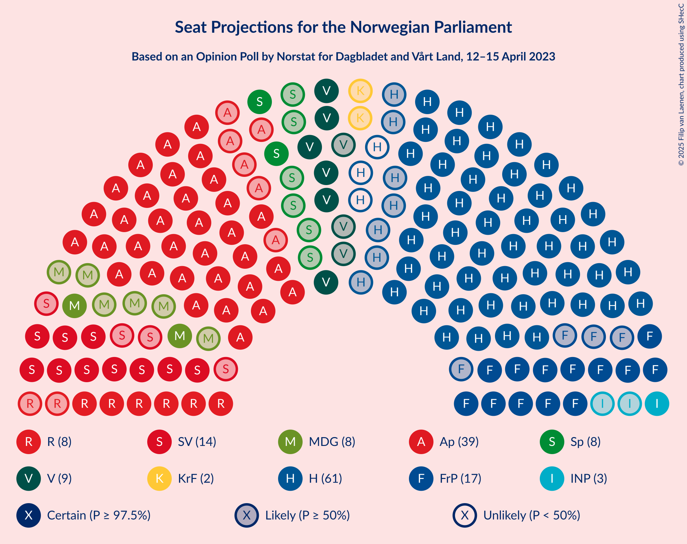
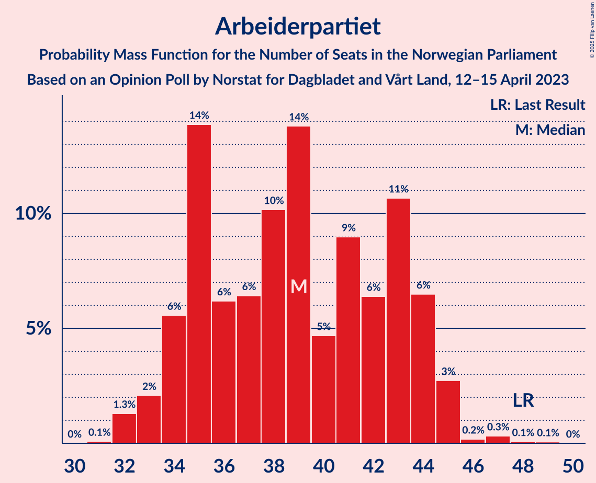
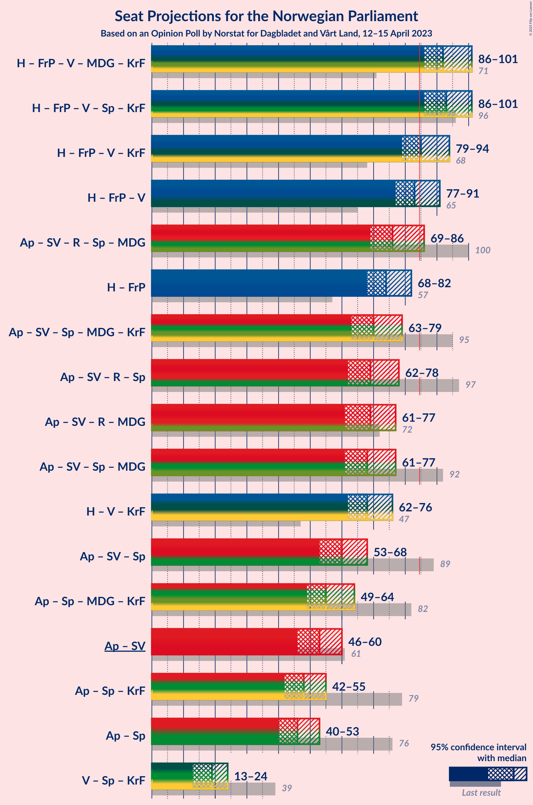
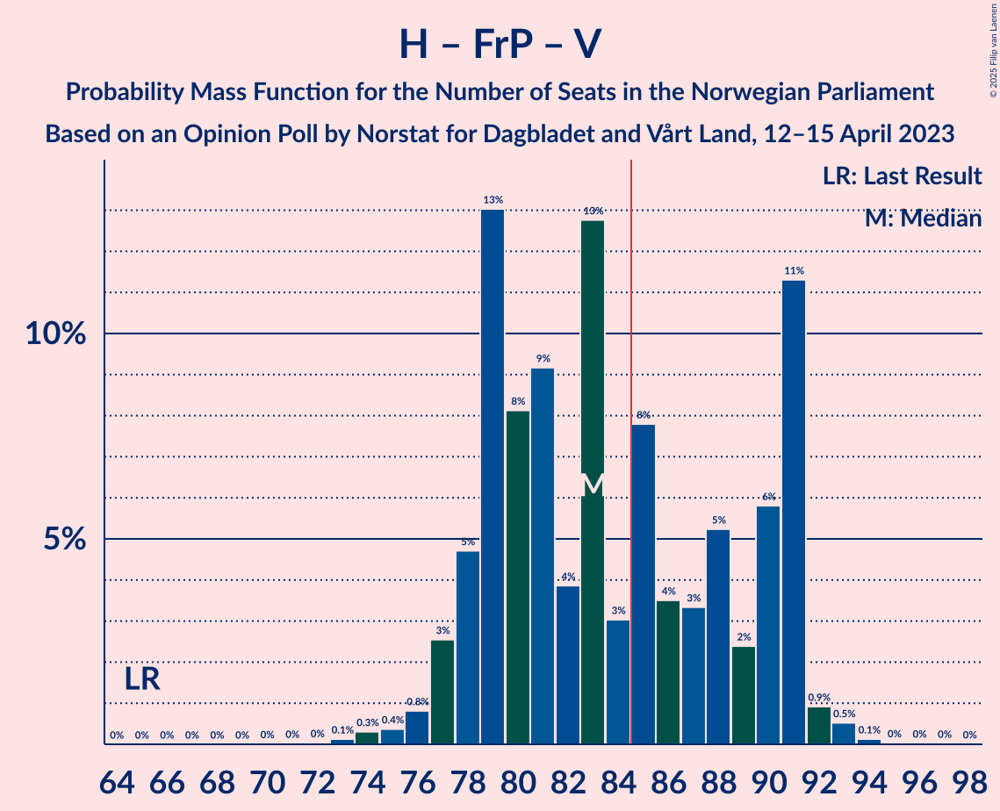
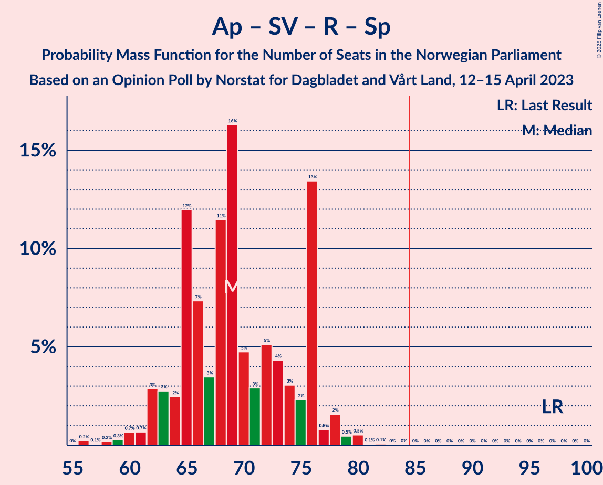

# Opinion Poll by Norstat for Dagbladet and Vårt Land, 12–15 April 2023

<a href="#voting-intentions">Voting Intentions</a> | <a href="#seats">Seats</a> | <a href="#coalitions">Coalitions</a> | <a href="#technical-information">Technical Information</a>

## Voting Intentions

### Confidence Intervals

| Party | Last Result | Poll Result | 80% Confidence Interval | 90% Confidence Interval | 95% Confidence Interval | 99% Confidence Interval |
|:-----:|:-----------:|:-----------:|:-----------------------:|:-----------------------:|:-----------------------:|:-----------------------:|
| Høyre | 20.4% | 31.6% | 29.7–33.5% |29.2–34.1% |28.8–34.6% |27.9–35.5% |
| Arbeiderpartiet | 26.2% | 19.3% | 17.7–21.0% |17.3–21.4% |16.9–21.9% |16.2–22.7% |
| Fremskrittspartiet | 11.6% | 9.8% | 8.7–11.1% |8.4–11.5% |8.1–11.8% |7.6–12.5% |
| Sosialistisk Venstreparti | 7.6% | 8.8% | 7.7–10.0% |7.4–10.4% |7.2–10.7% |6.7–11.3% |
| Venstre | 4.6% | 5.3% | 4.5–6.4% |4.3–6.7% |4.1–6.9% |3.7–7.5% |
| Rødt | 4.7% | 5.3% | 4.5–6.4% |4.3–6.7% |4.1–6.9% |3.7–7.5% |
| Senterpartiet | 13.5% | 5.0% | 4.3–6.1% |4.0–6.3% |3.8–6.6% |3.5–7.1% |
| Miljøpartiet De Grønne | 3.9% | 4.8% | 4.1–5.8% |3.9–6.1% |3.7–6.4% |3.3–6.9% |
| Industri- og Næringspartiet | 0.3% | 3.6% | 3.0–4.5% |2.8–4.8% |2.6–5.0% |2.3–5.5% |
| Kristelig Folkeparti | 3.8% | 2.8% | 2.3–3.6% |2.1–3.9% |2.0–4.1% |1.7–4.5% |

*Note:* The poll result column reflects the actual value used in the calculations. Published results may vary slightly, and in addition be rounded to fewer digits.

## Seats

### Confidence Intervals

| Party | Last Result | Median | 80% Confidence Interval | 90% Confidence Interval | 95% Confidence Interval | 99% Confidence Interval |
|:-----:|:-----------:|:------:|:-----------------------:|:-----------------------:|:-----------------------:|:-----------------------:|
| <a href="#høyre">Høyre</a> | 36 | 58 | 52–65 |52–65 |51–65 |50–66 |
| <a href="#arbeiderpartiet">Arbeiderpartiet</a> | 48 | 39 | 35–43 |34–44 |33–45 |32–46 |
| <a href="#fremskrittspartiet">Fremskrittspartiet</a> | 21 | 17 | 15–18 |14–19 |13–20 |11–22 |
| <a href="#sosialistisk-venstreparti">Sosialistisk Venstreparti</a> | 13 | 14 | 12–16 |11–17 |10–18 |10–19 |
| <a href="#venstre">Venstre</a> | 8 | 9 | 7–11 |7–11 |6–11 |2–13 |
| <a href="#rødt">Rødt</a> | 8 | 8 | 7–10 |6–11 |6–12 |1–13 |
| <a href="#senterpartiet">Senterpartiet</a> | 28 | 8 | 7–10 |6–11 |2–12 |1–13 |
| <a href="#miljøpartiet-de-grønne">Miljøpartiet De Grønne</a> | 3 | 8 | 6–9 |3–10 |2–10 |2–12 |
| <a href="#industri--og-næringspartiet">Industri- og Næringspartiet</a> | 0 | 3 | 2–7 |2–8 |1–8 |0–9 |
| <a href="#kristelig-folkeparti">Kristelig Folkeparti</a> | 3 | 2 | 1–2 |0–3 |0–6 |0–7 |

### Høyre

*For a full overview of the results for this party, see the [Høyre](party-høyre.html) page.*

| Number of Seats | Probability | Accumulated | Special Marks |
|:---------------:|:-----------:|:-----------:|:-------------:|
| 36 | 0% | 100% | Last Result |
| 37 | 0% | 100% |  |
| 38 | 0% | 100% |  |
| 39 | 0% | 100% |  |
| 40 | 0% | 100% |  |
| 41 | 0% | 100% |  |
| 42 | 0% | 100% |  |
| 43 | 0% | 100% |  |
| 44 | 0% | 100% |  |
| 45 | 0% | 100% |  |
| 46 | 0% | 100% |  |
| 47 | 0% | 100% |  |
| 48 | 0% | 100% |  |
| 49 | 0.2% | 99.9% |  |
| 50 | 0.9% | 99.8% |  |
| 51 | 2% | 98.9% |  |
| 52 | 8% | 97% |  |
| 53 | 9% | 89% |  |
| 54 | 6% | 80% |  |
| 55 | 5% | 73% |  |
| 56 | 8% | 68% |  |
| 57 | 8% | 60% |  |
| 58 | 5% | 52% | Median |
| 59 | 12% | 47% |  |
| 60 | 7% | 36% |  |
| 61 | 5% | 29% |  |
| 62 | 3% | 23% |  |
| 63 | 2% | 21% |  |
| 64 | 7% | 18% |  |
| 65 | 10% | 12% |  |
| 66 | 1.2% | 1.4% |  |
| 67 | 0.1% | 0.3% |  |
| 68 | 0.1% | 0.1% |  |
| 69 | 0% | 0.1% |  |
| 70 | 0% | 0% |  |

### Arbeiderpartiet

*For a full overview of the results for this party, see the [Arbeiderpartiet](party-arbeiderpartiet.html) page.*

| Number of Seats | Probability | Accumulated | Special Marks |
|:---------------:|:-----------:|:-----------:|:-------------:|
| 31 | 0.1% | 100% |  |
| 32 | 1.3% | 99.9% |  |
| 33 | 2% | 98.6% |  |
| 34 | 6% | 97% |  |
| 35 | 14% | 91% |  |
| 36 | 6% | 77% |  |
| 37 | 6% | 71% |  |
| 38 | 10% | 65% |  |
| 39 | 14% | 54% | Median |
| 40 | 5% | 41% |  |
| 41 | 9% | 36% |  |
| 42 | 6% | 27% |  |
| 43 | 11% | 21% |  |
| 44 | 6% | 10% |  |
| 45 | 3% | 3% |  |
| 46 | 0.2% | 0.6% |  |
| 47 | 0.3% | 0.5% |  |
| 48 | 0.1% | 0.1% | Last Result |
| 49 | 0.1% | 0.1% |  |
| 50 | 0% | 0% |  |

### Fremskrittspartiet

*For a full overview of the results for this party, see the [Fremskrittspartiet](party-fremskrittspartiet.html) page.*

| Number of Seats | Probability | Accumulated | Special Marks |
|:---------------:|:-----------:|:-----------:|:-------------:|
| 10 | 0.1% | 100% |  |
| 11 | 0.4% | 99.9% |  |
| 12 | 0.4% | 99.5% |  |
| 13 | 2% | 99.1% |  |
| 14 | 4% | 97% |  |
| 15 | 12% | 93% |  |
| 16 | 14% | 82% |  |
| 17 | 33% | 68% | Median |
| 18 | 26% | 35% |  |
| 19 | 4% | 8% |  |
| 20 | 2% | 4% |  |
| 21 | 1.2% | 2% | Last Result |
| 22 | 0.4% | 0.6% |  |
| 23 | 0.1% | 0.3% |  |
| 24 | 0.1% | 0.1% |  |
| 25 | 0% | 0.1% |  |
| 26 | 0% | 0% |  |

### Sosialistisk Venstreparti

*For a full overview of the results for this party, see the [Sosialistisk Venstreparti](party-sosialistiskvenstreparti.html) page.*

| Number of Seats | Probability | Accumulated | Special Marks |
|:---------------:|:-----------:|:-----------:|:-------------:|
| 9 | 0.2% | 100% |  |
| 10 | 2% | 99.8% |  |
| 11 | 6% | 97% |  |
| 12 | 13% | 92% |  |
| 13 | 8% | 79% | Last Result |
| 14 | 40% | 71% | Median |
| 15 | 14% | 31% |  |
| 16 | 7% | 17% |  |
| 17 | 6% | 9% |  |
| 18 | 2% | 3% |  |
| 19 | 1.0% | 1.4% |  |
| 20 | 0.3% | 0.4% |  |
| 21 | 0.1% | 0.1% |  |
| 22 | 0% | 0% |  |

### Venstre

*For a full overview of the results for this party, see the [Venstre](party-venstre.html) page.*

| Number of Seats | Probability | Accumulated | Special Marks |
|:---------------:|:-----------:|:-----------:|:-------------:|
| 2 | 0.7% | 100% |  |
| 3 | 0.8% | 99.3% |  |
| 4 | 0% | 98% |  |
| 5 | 0% | 98% |  |
| 6 | 3% | 98% |  |
| 7 | 9% | 95% |  |
| 8 | 25% | 87% | Last Result |
| 9 | 28% | 61% | Median |
| 10 | 22% | 34% |  |
| 11 | 9% | 11% |  |
| 12 | 2% | 2% |  |
| 13 | 0.6% | 0.7% |  |
| 14 | 0% | 0% |  |

### Rødt

*For a full overview of the results for this party, see the [Rødt](party-rødt.html) page.*

| Number of Seats | Probability | Accumulated | Special Marks |
|:---------------:|:-----------:|:-----------:|:-------------:|
| 1 | 2% | 100% |  |
| 2 | 0% | 98% |  |
| 3 | 0% | 98% |  |
| 4 | 0% | 98% |  |
| 5 | 0% | 98% |  |
| 6 | 4% | 98% |  |
| 7 | 11% | 94% |  |
| 8 | 35% | 83% | Last Result, Median |
| 9 | 28% | 48% |  |
| 10 | 14% | 20% |  |
| 11 | 4% | 6% |  |
| 12 | 2% | 3% |  |
| 13 | 0.5% | 0.6% |  |
| 14 | 0.1% | 0.1% |  |
| 15 | 0% | 0% |  |

### Senterpartiet

*For a full overview of the results for this party, see the [Senterpartiet](party-senterpartiet.html) page.*

| Number of Seats | Probability | Accumulated | Special Marks |
|:---------------:|:-----------:|:-----------:|:-------------:|
| 0 | 0.4% | 100% |  |
| 1 | 0.4% | 99.6% |  |
| 2 | 3% | 99.2% |  |
| 3 | 0.9% | 97% |  |
| 4 | 0.1% | 96% |  |
| 5 | 0.5% | 96% |  |
| 6 | 5% | 95% |  |
| 7 | 25% | 90% |  |
| 8 | 32% | 65% | Median |
| 9 | 12% | 34% |  |
| 10 | 13% | 21% |  |
| 11 | 5% | 8% |  |
| 12 | 3% | 4% |  |
| 13 | 0.8% | 1.0% |  |
| 14 | 0.1% | 0.1% |  |
| 15 | 0% | 0% |  |
| 16 | 0% | 0% |  |
| 17 | 0% | 0% |  |
| 18 | 0% | 0% |  |
| 19 | 0% | 0% |  |
| 20 | 0% | 0% |  |
| 21 | 0% | 0% |  |
| 22 | 0% | 0% |  |
| 23 | 0% | 0% |  |
| 24 | 0% | 0% |  |
| 25 | 0% | 0% |  |
| 26 | 0% | 0% |  |
| 27 | 0% | 0% |  |
| 28 | 0% | 0% | Last Result |

### Miljøpartiet De Grønne

*For a full overview of the results for this party, see the [Miljøpartiet De Grønne](party-miljøpartietdegrønne.html) page.*

| Number of Seats | Probability | Accumulated | Special Marks |
|:---------------:|:-----------:|:-----------:|:-------------:|
| 1 | 0.1% | 100% |  |
| 2 | 4% | 99.9% |  |
| 3 | 4% | 96% | Last Result |
| 4 | 0% | 92% |  |
| 5 | 0.1% | 92% |  |
| 6 | 4% | 92% |  |
| 7 | 26% | 88% |  |
| 8 | 38% | 61% | Median |
| 9 | 15% | 24% |  |
| 10 | 7% | 9% |  |
| 11 | 1.3% | 2% |  |
| 12 | 0.5% | 0.5% |  |
| 13 | 0% | 0% |  |

### Industri- og Næringspartiet

*For a full overview of the results for this party, see the [Industri- og Næringspartiet](party-industri-ognæringspartiet.html) page.*

| Number of Seats | Probability | Accumulated | Special Marks |
|:---------------:|:-----------:|:-----------:|:-------------:|
| 0 | 0.9% | 100% | Last Result |
| 1 | 2% | 99.1% |  |
| 2 | 15% | 97% |  |
| 3 | 49% | 82% | Median |
| 4 | 0% | 33% |  |
| 5 | 0.1% | 33% |  |
| 6 | 7% | 33% |  |
| 7 | 20% | 26% |  |
| 8 | 5% | 6% |  |
| 9 | 0.9% | 1.1% |  |
| 10 | 0.1% | 0.2% |  |
| 11 | 0% | 0% |  |

### Kristelig Folkeparti

*For a full overview of the results for this party, see the [Kristelig Folkeparti](party-kristeligfolkeparti.html) page.*

| Number of Seats | Probability | Accumulated | Special Marks |
|:---------------:|:-----------:|:-----------:|:-------------:|
| 0 | 9% | 100% |  |
| 1 | 21% | 91% |  |
| 2 | 64% | 71% | Median |
| 3 | 3% | 7% | Last Result |
| 4 | 0% | 4% |  |
| 5 | 0% | 4% |  |
| 6 | 1.3% | 4% |  |
| 7 | 2% | 2% |  |
| 8 | 0.2% | 0.2% |  |
| 9 | 0% | 0% |  |

## Coalitions

### Confidence Intervals

| Coalition | Last Result | Median | Majority? | 80% Confidence Interval | 90% Confidence Interval | 95% Confidence Interval | 99% Confidence Interval |
|:---------:|:-----------:|:------:|:---------:|:-----------------------:|:-----------------------:|:-----------------------:|:-----------------------:|
| Høyre – Fremskrittspartiet – Venstre – Miljøpartiet De Grønne – Kristelig Folkeparti | 71 | 92 | 99.0% | 88–100 | 87–100 | 86–101 | 84–104 |
| Høyre – Fremskrittspartiet – Venstre – Senterpartiet – Kristelig Folkeparti | 96 | 93 | 99.4% | 88–100 | 87–100 | 86–101 | 84–104 |
| Høyre – Fremskrittspartiet – Venstre – Kristelig Folkeparti | 68 | 85 | 57% | 81–92 | 80–92 | 79–94 | 76–95 |
| Høyre – Fremskrittspartiet – Venstre | 65 | 83 | 41% | 79–91 | 78–91 | 77–91 | 74–93 |
| Arbeiderpartiet – Sosialistisk Venstreparti – Rødt – Senterpartiet – Miljøpartiet De Grønne | 100 | 76 | 4% | 71–84 | 71–84 | 69–86 | 64–87 |
| Høyre – Fremskrittspartiet | 57 | 74 | 0.2% | 70–81 | 69–82 | 68–82 | 67–83 |
| Arbeiderpartiet – Sosialistisk Venstreparti – Senterpartiet – Miljøpartiet De Grønne – Kristelig Folkeparti | 95 | 70 | 0% | 65–77 | 64–77 | 63–79 | 58–81 |
| Arbeiderpartiet – Sosialistisk Venstreparti – Rødt – Senterpartiet | 97 | 69 | 0% | 64–76 | 63–76 | 62–78 | 59–80 |
| Arbeiderpartiet – Sosialistisk Venstreparti – Rødt – Miljøpartiet De Grønne | 72 | 69 | 0% | 64–74 | 62–76 | 61–77 | 58–80 |
| Arbeiderpartiet – Sosialistisk Venstreparti – Senterpartiet – Miljøpartiet De Grønne | 92 | 68 | 0% | 64–75 | 62–75 | 61–77 | 57–79 |
| Høyre – Venstre – Kristelig Folkeparti | 47 | 68 | 0% | 63–76 | 63–76 | 62–76 | 59–77 |
| Arbeiderpartiet – Sosialistisk Venstreparti – Senterpartiet | 89 | 60 | 0% | 57–67 | 55–67 | 53–68 | 51–70 |
| Arbeiderpartiet – Senterpartiet – Miljøpartiet De Grønne – Kristelig Folkeparti | 82 | 55 | 0% | 52–63 | 50–63 | 49–64 | 46–66 |
| Arbeiderpartiet – Sosialistisk Venstreparti | 61 | 53 | 0% | 49–58 | 48–59 | 46–60 | 45–62 |
| Arbeiderpartiet – Senterpartiet – Kristelig Folkeparti | 79 | 48 | 0% | 44–55 | 43–55 | 42–55 | 39–56 |
| Arbeiderpartiet – Senterpartiet | 76 | 46 | 0% | 43–53 | 41–53 | 40–53 | 37–54 |
| Venstre – Senterpartiet – Kristelig Folkeparti | 39 | 19 | 0% | 15–22 | 14–23 | 13–24 | 11–25 |

### Høyre – Fremskrittspartiet – Venstre – Miljøpartiet De Grønne – Kristelig Folkeparti

| Number of Seats | Probability | Accumulated | Special Marks |
|:---------------:|:-----------:|:-----------:|:-------------:|
| 71 | 0% | 100% | Last Result |
| 72 | 0% | 100% |  |
| 73 | 0% | 100% |  |
| 74 | 0% | 100% |  |
| 75 | 0% | 100% |  |
| 76 | 0% | 100% |  |
| 77 | 0% | 100% |  |
| 78 | 0% | 100% |  |
| 79 | 0% | 100% |  |
| 80 | 0% | 100% |  |
| 81 | 0% | 100% |  |
| 82 | 0.1% | 99.9% |  |
| 83 | 0.3% | 99.8% |  |
| 84 | 0.5% | 99.5% |  |
| 85 | 1.2% | 99.0% | Majority |
| 86 | 2% | 98% |  |
| 87 | 2% | 96% |  |
| 88 | 5% | 94% |  |
| 89 | 12% | 89% |  |
| 90 | 12% | 77% |  |
| 91 | 5% | 65% |  |
| 92 | 12% | 59% |  |
| 93 | 11% | 48% |  |
| 94 | 3% | 37% | Median |
| 95 | 4% | 34% |  |
| 96 | 5% | 31% |  |
| 97 | 2% | 26% |  |
| 98 | 3% | 24% |  |
| 99 | 7% | 21% |  |
| 100 | 11% | 14% |  |
| 101 | 1.3% | 3% |  |
| 102 | 0.6% | 2% |  |
| 103 | 0.7% | 2% |  |
| 104 | 0.7% | 0.8% |  |
| 105 | 0.1% | 0.1% |  |
| 106 | 0% | 0% |  |

### Høyre – Fremskrittspartiet – Venstre – Senterpartiet – Kristelig Folkeparti

| Number of Seats | Probability | Accumulated | Special Marks |
|:---------------:|:-----------:|:-----------:|:-------------:|
| 81 | 0.1% | 100% |  |
| 82 | 0.1% | 99.8% |  |
| 83 | 0.1% | 99.7% |  |
| 84 | 0.2% | 99.6% |  |
| 85 | 0.9% | 99.4% | Majority |
| 86 | 1.5% | 98.5% |  |
| 87 | 2% | 97% |  |
| 88 | 6% | 95% |  |
| 89 | 4% | 89% |  |
| 90 | 5% | 85% |  |
| 91 | 16% | 80% |  |
| 92 | 14% | 64% |  |
| 93 | 6% | 50% |  |
| 94 | 9% | 44% | Median |
| 95 | 2% | 35% |  |
| 96 | 3% | 33% | Last Result |
| 97 | 5% | 30% |  |
| 98 | 3% | 25% |  |
| 99 | 9% | 23% |  |
| 100 | 11% | 14% |  |
| 101 | 1.4% | 3% |  |
| 102 | 0.5% | 1.3% |  |
| 103 | 0.2% | 0.8% |  |
| 104 | 0.4% | 0.6% |  |
| 105 | 0.1% | 0.1% |  |
| 106 | 0% | 0% |  |

### Høyre – Fremskrittspartiet – Venstre – Kristelig Folkeparti

| Number of Seats | Probability | Accumulated | Special Marks |
|:---------------:|:-----------:|:-----------:|:-------------:|
| 68 | 0% | 100% | Last Result |
| 69 | 0% | 100% |  |
| 70 | 0% | 100% |  |
| 71 | 0% | 100% |  |
| 72 | 0% | 100% |  |
| 73 | 0% | 100% |  |
| 74 | 0% | 100% |  |
| 75 | 0.1% | 99.9% |  |
| 76 | 0.5% | 99.8% |  |
| 77 | 0.3% | 99.3% |  |
| 78 | 0.6% | 99.0% |  |
| 79 | 3% | 98% |  |
| 80 | 5% | 95% |  |
| 81 | 12% | 90% |  |
| 82 | 8% | 78% |  |
| 83 | 9% | 70% |  |
| 84 | 4% | 61% |  |
| 85 | 14% | 57% | Majority |
| 86 | 5% | 42% | Median |
| 87 | 4% | 37% |  |
| 88 | 3% | 33% |  |
| 89 | 4% | 30% |  |
| 90 | 5% | 26% |  |
| 91 | 6% | 22% |  |
| 92 | 11% | 15% |  |
| 93 | 0.8% | 4% |  |
| 94 | 2% | 3% |  |
| 95 | 0.2% | 0.5% |  |
| 96 | 0.2% | 0.3% |  |
| 97 | 0.1% | 0.2% |  |
| 98 | 0% | 0% |  |

### Høyre – Fremskrittspartiet – Venstre

| Number of Seats | Probability | Accumulated | Special Marks |
|:---------------:|:-----------:|:-----------:|:-------------:|
| 65 | 0% | 100% | Last Result |
| 66 | 0% | 100% |  |
| 67 | 0% | 100% |  |
| 68 | 0% | 100% |  |
| 69 | 0% | 100% |  |
| 70 | 0% | 100% |  |
| 71 | 0% | 100% |  |
| 72 | 0% | 100% |  |
| 73 | 0.1% | 99.9% |  |
| 74 | 0.3% | 99.8% |  |
| 75 | 0.4% | 99.5% |  |
| 76 | 0.8% | 99.1% |  |
| 77 | 3% | 98% |  |
| 78 | 5% | 96% |  |
| 79 | 13% | 91% |  |
| 80 | 8% | 78% |  |
| 81 | 9% | 70% |  |
| 82 | 4% | 61% |  |
| 83 | 13% | 57% |  |
| 84 | 3% | 44% | Median |
| 85 | 8% | 41% | Majority |
| 86 | 4% | 33% |  |
| 87 | 3% | 30% |  |
| 88 | 5% | 26% |  |
| 89 | 2% | 21% |  |
| 90 | 6% | 19% |  |
| 91 | 11% | 13% |  |
| 92 | 0.9% | 2% |  |
| 93 | 0.5% | 0.7% |  |
| 94 | 0.1% | 0.2% |  |
| 95 | 0% | 0.1% |  |
| 96 | 0% | 0.1% |  |
| 97 | 0% | 0% |  |

### Arbeiderpartiet – Sosialistisk Venstreparti – Rødt – Senterpartiet – Miljøpartiet De Grønne

| Number of Seats | Probability | Accumulated | Special Marks |
|:---------------:|:-----------:|:-----------:|:-------------:|
| 62 | 0.2% | 100% |  |
| 63 | 0.1% | 99.8% |  |
| 64 | 0.5% | 99.7% |  |
| 65 | 0.1% | 99.2% |  |
| 66 | 0.3% | 99.1% |  |
| 67 | 0.4% | 98.8% |  |
| 68 | 0.6% | 98% |  |
| 69 | 0.8% | 98% |  |
| 70 | 2% | 97% |  |
| 71 | 7% | 95% |  |
| 72 | 4% | 88% |  |
| 73 | 11% | 84% |  |
| 74 | 7% | 73% |  |
| 75 | 4% | 66% |  |
| 76 | 14% | 62% |  |
| 77 | 7% | 48% | Median |
| 78 | 7% | 41% |  |
| 79 | 4% | 34% |  |
| 80 | 4% | 30% |  |
| 81 | 4% | 26% |  |
| 82 | 3% | 22% |  |
| 83 | 6% | 19% |  |
| 84 | 8% | 12% |  |
| 85 | 1.0% | 4% | Majority |
| 86 | 2% | 3% |  |
| 87 | 0.7% | 1.2% |  |
| 88 | 0.1% | 0.5% |  |
| 89 | 0.3% | 0.4% |  |
| 90 | 0% | 0.1% |  |
| 91 | 0% | 0% |  |
| 92 | 0% | 0% |  |
| 93 | 0% | 0% |  |
| 94 | 0% | 0% |  |
| 95 | 0% | 0% |  |
| 96 | 0% | 0% |  |
| 97 | 0% | 0% |  |
| 98 | 0% | 0% |  |
| 99 | 0% | 0% |  |
| 100 | 0% | 0% | Last Result |

### Høyre – Fremskrittspartiet

| Number of Seats | Probability | Accumulated | Special Marks |
|:---------------:|:-----------:|:-----------:|:-------------:|
| 57 | 0% | 100% | Last Result |
| 58 | 0% | 100% |  |
| 59 | 0% | 100% |  |
| 60 | 0% | 100% |  |
| 61 | 0% | 100% |  |
| 62 | 0% | 100% |  |
| 63 | 0% | 100% |  |
| 64 | 0.1% | 100% |  |
| 65 | 0.1% | 99.9% |  |
| 66 | 0.1% | 99.8% |  |
| 67 | 0.5% | 99.7% |  |
| 68 | 2% | 99.2% |  |
| 69 | 3% | 97% |  |
| 70 | 16% | 94% |  |
| 71 | 7% | 78% |  |
| 72 | 5% | 71% |  |
| 73 | 6% | 66% |  |
| 74 | 17% | 60% |  |
| 75 | 4% | 44% | Median |
| 76 | 3% | 39% |  |
| 77 | 5% | 36% |  |
| 78 | 7% | 31% |  |
| 79 | 3% | 24% |  |
| 80 | 1.3% | 21% |  |
| 81 | 12% | 20% |  |
| 82 | 7% | 8% |  |
| 83 | 1.4% | 2% |  |
| 84 | 0.2% | 0.4% |  |
| 85 | 0.1% | 0.2% | Majority |
| 86 | 0% | 0.1% |  |
| 87 | 0% | 0.1% |  |
| 88 | 0% | 0% |  |

### Arbeiderpartiet – Sosialistisk Venstreparti – Senterpartiet – Miljøpartiet De Grønne – Kristelig Folkeparti

| Number of Seats | Probability | Accumulated | Special Marks |
|:---------------:|:-----------:|:-----------:|:-------------:|
| 57 | 0.3% | 100% |  |
| 58 | 0.5% | 99.7% |  |
| 59 | 0.1% | 99.2% |  |
| 60 | 0.3% | 99.1% |  |
| 61 | 0.4% | 98.8% |  |
| 62 | 0.6% | 98% |  |
| 63 | 1.4% | 98% |  |
| 64 | 3% | 96% |  |
| 65 | 3% | 93% |  |
| 66 | 15% | 90% |  |
| 67 | 6% | 75% |  |
| 68 | 3% | 69% |  |
| 69 | 14% | 66% |  |
| 70 | 5% | 52% |  |
| 71 | 9% | 46% | Median |
| 72 | 6% | 37% |  |
| 73 | 5% | 31% |  |
| 74 | 3% | 27% |  |
| 75 | 7% | 23% |  |
| 76 | 4% | 16% |  |
| 77 | 8% | 12% |  |
| 78 | 0.5% | 4% |  |
| 79 | 1.4% | 3% |  |
| 80 | 1.2% | 2% |  |
| 81 | 0.5% | 0.7% |  |
| 82 | 0.2% | 0.2% |  |
| 83 | 0% | 0.1% |  |
| 84 | 0% | 0% |  |
| 85 | 0% | 0% | Majority |
| 86 | 0% | 0% |  |
| 87 | 0% | 0% |  |
| 88 | 0% | 0% |  |
| 89 | 0% | 0% |  |
| 90 | 0% | 0% |  |
| 91 | 0% | 0% |  |
| 92 | 0% | 0% |  |
| 93 | 0% | 0% |  |
| 94 | 0% | 0% |  |
| 95 | 0% | 0% | Last Result |

### Arbeiderpartiet – Sosialistisk Venstreparti – Rødt – Senterpartiet

| Number of Seats | Probability | Accumulated | Special Marks |
|:---------------:|:-----------:|:-----------:|:-------------:|
| 56 | 0.2% | 100% |  |
| 57 | 0.1% | 99.8% |  |
| 58 | 0.2% | 99.7% |  |
| 59 | 0.3% | 99.5% |  |
| 60 | 0.7% | 99.3% |  |
| 61 | 0.7% | 98.6% |  |
| 62 | 3% | 98% |  |
| 63 | 3% | 95% |  |
| 64 | 2% | 92% |  |
| 65 | 12% | 90% |  |
| 66 | 7% | 78% |  |
| 67 | 3% | 71% |  |
| 68 | 11% | 67% |  |
| 69 | 16% | 56% | Median |
| 70 | 5% | 39% |  |
| 71 | 3% | 35% |  |
| 72 | 5% | 32% |  |
| 73 | 4% | 27% |  |
| 74 | 3% | 22% |  |
| 75 | 2% | 19% |  |
| 76 | 13% | 17% |  |
| 77 | 0.8% | 3% |  |
| 78 | 2% | 3% |  |
| 79 | 0.5% | 1.1% |  |
| 80 | 0.5% | 0.6% |  |
| 81 | 0.1% | 0.1% |  |
| 82 | 0.1% | 0.1% |  |
| 83 | 0% | 0% |  |
| 84 | 0% | 0% |  |
| 85 | 0% | 0% | Majority |
| 86 | 0% | 0% |  |
| 87 | 0% | 0% |  |
| 88 | 0% | 0% |  |
| 89 | 0% | 0% |  |
| 90 | 0% | 0% |  |
| 91 | 0% | 0% |  |
| 92 | 0% | 0% |  |
| 93 | 0% | 0% |  |
| 94 | 0% | 0% |  |
| 95 | 0% | 0% |  |
| 96 | 0% | 0% |  |
| 97 | 0% | 0% | Last Result |

### Arbeiderpartiet – Sosialistisk Venstreparti – Rødt – Miljøpartiet De Grønne

| Number of Seats | Probability | Accumulated | Special Marks |
|:---------------:|:-----------:|:-----------:|:-------------:|
| 55 | 0% | 100% |  |
| 56 | 0% | 99.9% |  |
| 57 | 0.1% | 99.9% |  |
| 58 | 0.5% | 99.8% |  |
| 59 | 0.4% | 99.3% |  |
| 60 | 0.9% | 98.8% |  |
| 61 | 1.5% | 98% |  |
| 62 | 4% | 96% |  |
| 63 | 2% | 93% |  |
| 64 | 4% | 91% |  |
| 65 | 14% | 87% |  |
| 66 | 6% | 73% |  |
| 67 | 4% | 67% |  |
| 68 | 5% | 63% |  |
| 69 | 16% | 58% | Median |
| 70 | 8% | 43% |  |
| 71 | 8% | 34% |  |
| 72 | 4% | 27% | Last Result |
| 73 | 3% | 22% |  |
| 74 | 10% | 19% |  |
| 75 | 4% | 10% |  |
| 76 | 1.3% | 5% |  |
| 77 | 2% | 4% |  |
| 78 | 0.3% | 2% |  |
| 79 | 0.8% | 1.4% |  |
| 80 | 0.4% | 0.6% |  |
| 81 | 0.1% | 0.2% |  |
| 82 | 0% | 0.2% |  |
| 83 | 0% | 0.1% |  |
| 84 | 0.1% | 0.1% |  |
| 85 | 0% | 0% | Majority |

### Arbeiderpartiet – Sosialistisk Venstreparti – Senterpartiet – Miljøpartiet De Grønne

| Number of Seats | Probability | Accumulated | Special Marks |
|:---------------:|:-----------:|:-----------:|:-------------:|
| 54 | 0.2% | 100% |  |
| 55 | 0% | 99.8% |  |
| 56 | 0.1% | 99.8% |  |
| 57 | 0.5% | 99.7% |  |
| 58 | 0.1% | 99.1% |  |
| 59 | 0.3% | 99.0% |  |
| 60 | 0.7% | 98.7% |  |
| 61 | 1.4% | 98% |  |
| 62 | 3% | 97% |  |
| 63 | 3% | 93% |  |
| 64 | 6% | 91% |  |
| 65 | 12% | 85% |  |
| 66 | 8% | 73% |  |
| 67 | 13% | 65% |  |
| 68 | 4% | 52% |  |
| 69 | 10% | 48% | Median |
| 70 | 8% | 39% |  |
| 71 | 4% | 30% |  |
| 72 | 3% | 26% |  |
| 73 | 6% | 23% |  |
| 74 | 4% | 17% |  |
| 75 | 9% | 13% |  |
| 76 | 0.4% | 4% |  |
| 77 | 1.4% | 3% |  |
| 78 | 1.2% | 2% |  |
| 79 | 0.5% | 0.7% |  |
| 80 | 0.2% | 0.2% |  |
| 81 | 0% | 0.1% |  |
| 82 | 0% | 0% |  |
| 83 | 0% | 0% |  |
| 84 | 0% | 0% |  |
| 85 | 0% | 0% | Majority |
| 86 | 0% | 0% |  |
| 87 | 0% | 0% |  |
| 88 | 0% | 0% |  |
| 89 | 0% | 0% |  |
| 90 | 0% | 0% |  |
| 91 | 0% | 0% |  |
| 92 | 0% | 0% | Last Result |

### Høyre – Venstre – Kristelig Folkeparti

| Number of Seats | Probability | Accumulated | Special Marks |
|:---------------:|:-----------:|:-----------:|:-------------:|
| 47 | 0% | 100% | Last Result |
| 48 | 0% | 100% |  |
| 49 | 0% | 100% |  |
| 50 | 0% | 100% |  |
| 51 | 0% | 100% |  |
| 52 | 0% | 100% |  |
| 53 | 0% | 100% |  |
| 54 | 0% | 100% |  |
| 55 | 0% | 100% |  |
| 56 | 0% | 100% |  |
| 57 | 0% | 100% |  |
| 58 | 0.1% | 99.9% |  |
| 59 | 0.5% | 99.8% |  |
| 60 | 0.4% | 99.3% |  |
| 61 | 0.9% | 98.9% |  |
| 62 | 3% | 98% |  |
| 63 | 11% | 95% |  |
| 64 | 6% | 84% |  |
| 65 | 6% | 78% |  |
| 66 | 8% | 73% |  |
| 67 | 7% | 65% |  |
| 68 | 10% | 58% |  |
| 69 | 2% | 49% | Median |
| 70 | 15% | 46% |  |
| 71 | 4% | 32% |  |
| 72 | 3% | 28% |  |
| 73 | 8% | 24% |  |
| 74 | 3% | 17% |  |
| 75 | 2% | 14% |  |
| 76 | 10% | 12% |  |
| 77 | 2% | 2% |  |
| 78 | 0.3% | 0.5% |  |
| 79 | 0.1% | 0.2% |  |
| 80 | 0.1% | 0.1% |  |
| 81 | 0% | 0% |  |

### Arbeiderpartiet – Sosialistisk Venstreparti – Senterpartiet

| Number of Seats | Probability | Accumulated | Special Marks |
|:---------------:|:-----------:|:-----------:|:-------------:|
| 48 | 0.2% | 100% |  |
| 49 | 0.1% | 99.8% |  |
| 50 | 0.1% | 99.7% |  |
| 51 | 0.3% | 99.6% |  |
| 52 | 1.1% | 99.4% |  |
| 53 | 2% | 98% |  |
| 54 | 0.9% | 97% |  |
| 55 | 2% | 96% |  |
| 56 | 2% | 93% |  |
| 57 | 12% | 91% |  |
| 58 | 9% | 79% |  |
| 59 | 4% | 70% |  |
| 60 | 18% | 66% |  |
| 61 | 10% | 48% | Median |
| 62 | 6% | 38% |  |
| 63 | 5% | 32% |  |
| 64 | 3% | 27% |  |
| 65 | 4% | 24% |  |
| 66 | 5% | 20% |  |
| 67 | 11% | 15% |  |
| 68 | 1.2% | 3% |  |
| 69 | 2% | 2% |  |
| 70 | 0.2% | 0.6% |  |
| 71 | 0.3% | 0.3% |  |
| 72 | 0% | 0.1% |  |
| 73 | 0% | 0% |  |
| 74 | 0% | 0% |  |
| 75 | 0% | 0% |  |
| 76 | 0% | 0% |  |
| 77 | 0% | 0% |  |
| 78 | 0% | 0% |  |
| 79 | 0% | 0% |  |
| 80 | 0% | 0% |  |
| 81 | 0% | 0% |  |
| 82 | 0% | 0% |  |
| 83 | 0% | 0% |  |
| 84 | 0% | 0% |  |
| 85 | 0% | 0% | Majority |
| 86 | 0% | 0% |  |
| 87 | 0% | 0% |  |
| 88 | 0% | 0% |  |
| 89 | 0% | 0% | Last Result |

### Arbeiderpartiet – Senterpartiet – Miljøpartiet De Grønne – Kristelig Folkeparti

| Number of Seats | Probability | Accumulated | Special Marks |
|:---------------:|:-----------:|:-----------:|:-------------:|
| 43 | 0% | 100% |  |
| 44 | 0.1% | 99.9% |  |
| 45 | 0.3% | 99.8% |  |
| 46 | 1.1% | 99.5% |  |
| 47 | 0.3% | 98% |  |
| 48 | 0.6% | 98% |  |
| 49 | 0.9% | 98% |  |
| 50 | 3% | 97% |  |
| 51 | 2% | 94% |  |
| 52 | 16% | 92% |  |
| 53 | 5% | 76% |  |
| 54 | 6% | 71% |  |
| 55 | 16% | 66% |  |
| 56 | 3% | 50% |  |
| 57 | 8% | 46% | Median |
| 58 | 3% | 39% |  |
| 59 | 11% | 36% |  |
| 60 | 4% | 25% |  |
| 61 | 7% | 21% |  |
| 62 | 4% | 14% |  |
| 63 | 7% | 10% |  |
| 64 | 2% | 3% |  |
| 65 | 0.3% | 1.0% |  |
| 66 | 0.6% | 0.7% |  |
| 67 | 0% | 0.1% |  |
| 68 | 0% | 0% |  |
| 69 | 0% | 0% |  |
| 70 | 0% | 0% |  |
| 71 | 0% | 0% |  |
| 72 | 0% | 0% |  |
| 73 | 0% | 0% |  |
| 74 | 0% | 0% |  |
| 75 | 0% | 0% |  |
| 76 | 0% | 0% |  |
| 77 | 0% | 0% |  |
| 78 | 0% | 0% |  |
| 79 | 0% | 0% |  |
| 80 | 0% | 0% |  |
| 81 | 0% | 0% |  |
| 82 | 0% | 0% | Last Result |

### Arbeiderpartiet – Sosialistisk Venstreparti

| Number of Seats | Probability | Accumulated | Special Marks |
|:---------------:|:-----------:|:-----------:|:-------------:|
| 44 | 0.2% | 100% |  |
| 45 | 1.1% | 99.8% |  |
| 46 | 1.3% | 98.7% |  |
| 47 | 2% | 97% |  |
| 48 | 3% | 96% |  |
| 49 | 13% | 93% |  |
| 50 | 8% | 80% |  |
| 51 | 6% | 72% |  |
| 52 | 11% | 66% |  |
| 53 | 18% | 55% | Median |
| 54 | 6% | 37% |  |
| 55 | 4% | 31% |  |
| 56 | 7% | 27% |  |
| 57 | 10% | 20% |  |
| 58 | 5% | 10% |  |
| 59 | 2% | 5% |  |
| 60 | 1.3% | 3% |  |
| 61 | 1.1% | 2% | Last Result |
| 62 | 0.5% | 0.7% |  |
| 63 | 0.1% | 0.2% |  |
| 64 | 0% | 0.1% |  |
| 65 | 0% | 0% |  |

### Arbeiderpartiet – Senterpartiet – Kristelig Folkeparti

| Number of Seats | Probability | Accumulated | Special Marks |
|:---------------:|:-----------:|:-----------:|:-------------:|
| 36 | 0.1% | 100% |  |
| 37 | 0.2% | 99.9% |  |
| 38 | 0.1% | 99.6% |  |
| 39 | 0.1% | 99.6% |  |
| 40 | 1.1% | 99.5% |  |
| 41 | 0.7% | 98% |  |
| 42 | 2% | 98% |  |
| 43 | 2% | 96% |  |
| 44 | 12% | 94% |  |
| 45 | 6% | 81% |  |
| 46 | 3% | 75% |  |
| 47 | 10% | 72% |  |
| 48 | 16% | 62% |  |
| 49 | 6% | 47% | Median |
| 50 | 6% | 40% |  |
| 51 | 7% | 35% |  |
| 52 | 5% | 27% |  |
| 53 | 6% | 23% |  |
| 54 | 5% | 17% |  |
| 55 | 10% | 12% |  |
| 56 | 1.4% | 2% |  |
| 57 | 0.3% | 0.5% |  |
| 58 | 0.2% | 0.2% |  |
| 59 | 0% | 0.1% |  |
| 60 | 0% | 0% |  |
| 61 | 0% | 0% |  |
| 62 | 0% | 0% |  |
| 63 | 0% | 0% |  |
| 64 | 0% | 0% |  |
| 65 | 0% | 0% |  |
| 66 | 0% | 0% |  |
| 67 | 0% | 0% |  |
| 68 | 0% | 0% |  |
| 69 | 0% | 0% |  |
| 70 | 0% | 0% |  |
| 71 | 0% | 0% |  |
| 72 | 0% | 0% |  |
| 73 | 0% | 0% |  |
| 74 | 0% | 0% |  |
| 75 | 0% | 0% |  |
| 76 | 0% | 0% |  |
| 77 | 0% | 0% |  |
| 78 | 0% | 0% |  |
| 79 | 0% | 0% | Last Result |

### Arbeiderpartiet – Senterpartiet

| Number of Seats | Probability | Accumulated | Special Marks |
|:---------------:|:-----------:|:-----------:|:-------------:|
| 34 | 0.1% | 100% |  |
| 35 | 0.1% | 99.9% |  |
| 36 | 0.2% | 99.8% |  |
| 37 | 0.9% | 99.6% |  |
| 38 | 0.1% | 98.7% |  |
| 39 | 0.7% | 98.7% |  |
| 40 | 2% | 98% |  |
| 41 | 2% | 96% |  |
| 42 | 2% | 94% |  |
| 43 | 15% | 92% |  |
| 44 | 6% | 78% |  |
| 45 | 6% | 72% |  |
| 46 | 19% | 66% |  |
| 47 | 7% | 47% | Median |
| 48 | 6% | 40% |  |
| 49 | 5% | 33% |  |
| 50 | 5% | 28% |  |
| 51 | 6% | 23% |  |
| 52 | 5% | 17% |  |
| 53 | 10% | 12% |  |
| 54 | 1.4% | 2% |  |
| 55 | 0.2% | 0.3% |  |
| 56 | 0.1% | 0.1% |  |
| 57 | 0% | 0% |  |
| 58 | 0% | 0% |  |
| 59 | 0% | 0% |  |
| 60 | 0% | 0% |  |
| 61 | 0% | 0% |  |
| 62 | 0% | 0% |  |
| 63 | 0% | 0% |  |
| 64 | 0% | 0% |  |
| 65 | 0% | 0% |  |
| 66 | 0% | 0% |  |
| 67 | 0% | 0% |  |
| 68 | 0% | 0% |  |
| 69 | 0% | 0% |  |
| 70 | 0% | 0% |  |
| 71 | 0% | 0% |  |
| 72 | 0% | 0% |  |
| 73 | 0% | 0% |  |
| 74 | 0% | 0% |  |
| 75 | 0% | 0% |  |
| 76 | 0% | 0% | Last Result |

### Venstre – Senterpartiet – Kristelig Folkeparti

| Number of Seats | Probability | Accumulated | Special Marks |
|:---------------:|:-----------:|:-----------:|:-------------:|
| 8 | 0% | 100% |  |
| 9 | 0.1% | 99.9% |  |
| 10 | 0.2% | 99.8% |  |
| 11 | 0.7% | 99.7% |  |
| 12 | 0.6% | 99.0% |  |
| 13 | 1.2% | 98% |  |
| 14 | 3% | 97% |  |
| 15 | 5% | 94% |  |
| 16 | 5% | 89% |  |
| 17 | 15% | 84% |  |
| 18 | 16% | 69% |  |
| 19 | 15% | 53% | Median |
| 20 | 9% | 38% |  |
| 21 | 16% | 28% |  |
| 22 | 5% | 13% |  |
| 23 | 5% | 8% |  |
| 24 | 2% | 3% |  |
| 25 | 0.7% | 1.2% |  |
| 26 | 0.3% | 0.5% |  |
| 27 | 0.1% | 0.2% |  |
| 28 | 0% | 0.1% |  |
| 29 | 0% | 0.1% |  |
| 30 | 0% | 0% |  |
| 31 | 0% | 0% |  |
| 32 | 0% | 0% |  |
| 33 | 0% | 0% |  |
| 34 | 0% | 0% |  |
| 35 | 0% | 0% |  |
| 36 | 0% | 0% |  |
| 37 | 0% | 0% |  |
| 38 | 0% | 0% |  |
| 39 | 0% | 0% | Last Result |

## Technical Information

### Opinion Poll

+ **Polling firm:** Norstat
+ **Commissioner(s):** Dagbladet and Vårt Land
+ **Fieldwork period:** 12–15 April 2023

### Calculations

+ **Sample size:** 991
+ **Simulations done:** 1,048,576
+ **Error estimate:** 1.68%

