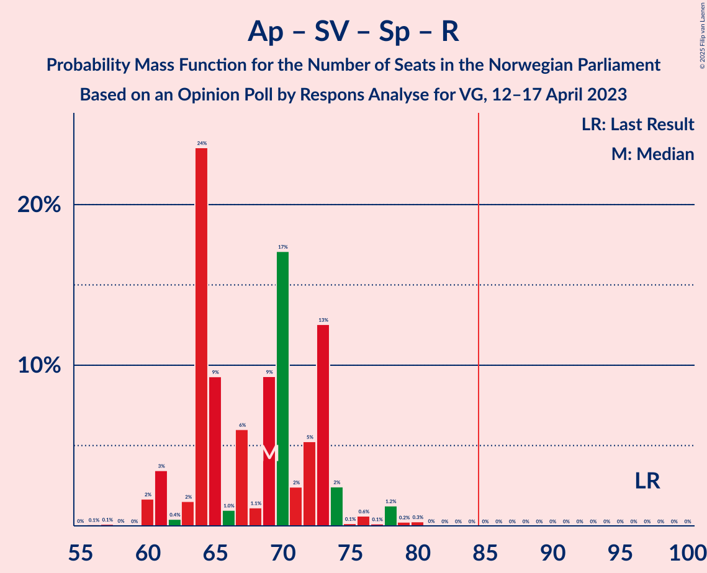

# Opinion Poll by Respons Analyse for VG, 12–17 April 2023

<a href="#voting-intentions">Voting Intentions</a> | <a href="#seats">Seats</a> | <a href="#coalitions">Coalitions</a> | <a href="#technical-information">Technical Information</a>

## Voting Intentions

### Confidence Intervals

| Party | Last Result | Poll Result | 80% Confidence Interval | 90% Confidence Interval | 95% Confidence Interval | 99% Confidence Interval |
|:-----:|:-----------:|:-----------:|:-----------------------:|:-----------------------:|:-----------------------:|:-----------------------:|
| Høyre | 20.4% | 31.8% | 29.9–33.7% |29.4–34.3% |29.0–34.8% |28.1–35.7% |
| Arbeiderpartiet | 26.2% | 18.6% | 17.1–20.3% |16.7–20.7% |16.3–21.1% |15.6–21.9% |
| Fremskrittspartiet | 11.6% | 12.8% | 11.5–14.3% |11.2–14.7% |10.9–15.0% |10.3–15.7% |
| Sosialistisk Venstreparti | 7.6% | 8.0% | 7.0–9.2% |6.7–9.6% |6.5–9.9% |6.0–10.5% |
| Senterpartiet | 13.5% | 5.6% | 4.8–6.6% |4.5–7.0% |4.3–7.2% |4.0–7.7% |
| Rødt | 4.7% | 5.2% | 4.4–6.2% |4.2–6.5% |4.0–6.8% |3.6–7.3% |
| Venstre | 4.6% | 4.6% | 3.9–5.6% |3.6–5.9% |3.5–6.1% |3.1–6.6% |
| Miljøpartiet De Grønne | 3.9% | 4.2% | 3.5–5.1% |3.3–5.4% |3.1–5.6% |2.8–6.1% |
| Kristelig Folkeparti | 3.8% | 3.9% | 3.2–4.8% |3.0–5.1% |2.9–5.3% |2.6–5.8% |
| Industri- og Næringspartiet | 0.3% | 2.5% | 2.0–3.3% |1.8–3.5% |1.7–3.7% |1.5–4.1% |
| Pensjonistpartiet | 0.6% | 0.8% | 0.5–1.3% |0.5–1.4% |0.4–1.6% |0.3–1.9% |
| Liberalistene | 0.2% | 0.6% | 0.4–1.1% |0.3–1.2% |0.3–1.3% |0.2–1.6% |
| Folkets parti | 0.1% | 0.3% | 0.2–0.7% |0.1–0.8% |0.1–0.9% |0.1–1.1% |

*Note:* The poll result column reflects the actual value used in the calculations. Published results may vary slightly, and in addition be rounded to fewer digits.

## Seats

### Confidence Intervals

| Party | Last Result | Median | 80% Confidence Interval | 90% Confidence Interval | 95% Confidence Interval | 99% Confidence Interval |
|:-----:|:-----------:|:------:|:-----------------------:|:-----------------------:|:-----------------------:|:-----------------------:|
| <a href="#høyre">Høyre</a> | 36 | 58 | 48–64 |48–64 |48–64 |48–66 |
| <a href="#arbeiderpartiet">Arbeiderpartiet</a> | 48 | 35 | 33–38 |33–41 |32–42 |31–44 |
| <a href="#fremskrittspartiet">Fremskrittspartiet</a> | 21 | 23 | 18–27 |18–28 |18–28 |18–31 |
| <a href="#sosialistisk-venstreparti">Sosialistisk Venstreparti</a> | 13 | 14 | 11–16 |10–16 |9–17 |9–18 |
| <a href="#senterpartiet">Senterpartiet</a> | 28 | 10 | 8–12 |7–13 |6–13 |2–14 |
| <a href="#rødt">Rødt</a> | 8 | 10 | 7–11 |7–12 |6–13 |1–13 |
| <a href="#venstre">Venstre</a> | 8 | 8 | 6–11 |3–11 |2–11 |2–12 |
| <a href="#miljøpartiet-de-grønne">Miljøpartiet De Grønne</a> | 3 | 7 | 2–10 |2–10 |2–10 |1–10 |
| <a href="#kristelig-folkeparti">Kristelig Folkeparti</a> | 3 | 7 | 2–8 |2–8 |2–9 |1–10 |
| <a href="#industri--og-næringspartiet">Industri- og Næringspartiet</a> | 0 | 2 | 0–3 |0–3 |0–3 |0–7 |
| <a href="#pensjonistpartiet">Pensjonistpartiet</a> | 0 | 0 | 0 |0 |0 |0 |
| <a href="#liberalistene">Liberalistene</a> | 0 | 0 | 0 |0 |0 |0 |
| <a href="#folkets-parti">Folkets parti</a> | 0 | 0 | 0 |0 |0 |0 |

### Høyre

*For a full overview of the results for this party, see the [Høyre](party-høyre.html) page.*

| Number of Seats | Probability | Accumulated | Special Marks |
|:---------------:|:-----------:|:-----------:|:-------------:|
| 36 | 0% | 100% | Last Result |
| 37 | 0% | 100% |  |
| 38 | 0% | 100% |  |
| 39 | 0% | 100% |  |
| 40 | 0% | 100% |  |
| 41 | 0% | 100% |  |
| 42 | 0% | 100% |  |
| 43 | 0% | 100% |  |
| 44 | 0% | 100% |  |
| 45 | 0% | 100% |  |
| 46 | 0% | 100% |  |
| 47 | 0% | 100% |  |
| 48 | 15% | 100% |  |
| 49 | 0.2% | 85% |  |
| 50 | 0.4% | 85% |  |
| 51 | 2% | 85% |  |
| 52 | 0.4% | 83% |  |
| 53 | 2% | 82% |  |
| 54 | 7% | 81% |  |
| 55 | 17% | 73% |  |
| 56 | 2% | 57% |  |
| 57 | 4% | 55% |  |
| 58 | 5% | 51% | Median |
| 59 | 3% | 46% |  |
| 60 | 9% | 43% |  |
| 61 | 5% | 34% |  |
| 62 | 2% | 29% |  |
| 63 | 3% | 27% |  |
| 64 | 23% | 24% |  |
| 65 | 0.9% | 2% |  |
| 66 | 0.5% | 0.7% |  |
| 67 | 0% | 0.2% |  |
| 68 | 0.1% | 0.1% |  |
| 69 | 0% | 0.1% |  |
| 70 | 0% | 0% |  |

### Arbeiderpartiet

*For a full overview of the results for this party, see the [Arbeiderpartiet](party-arbeiderpartiet.html) page.*

| Number of Seats | Probability | Accumulated | Special Marks |
|:---------------:|:-----------:|:-----------:|:-------------:|
| 29 | 0.3% | 100% |  |
| 30 | 0.1% | 99.7% |  |
| 31 | 0.2% | 99.6% |  |
| 32 | 3% | 99.4% |  |
| 33 | 24% | 97% |  |
| 34 | 18% | 73% |  |
| 35 | 11% | 55% | Median |
| 36 | 20% | 45% |  |
| 37 | 9% | 24% |  |
| 38 | 6% | 15% |  |
| 39 | 3% | 10% |  |
| 40 | 0.7% | 7% |  |
| 41 | 3% | 6% |  |
| 42 | 0.9% | 3% |  |
| 43 | 0.5% | 2% |  |
| 44 | 1.2% | 2% |  |
| 45 | 0.2% | 0.3% |  |
| 46 | 0.1% | 0.1% |  |
| 47 | 0% | 0% |  |
| 48 | 0% | 0% | Last Result |

### Fremskrittspartiet

*For a full overview of the results for this party, see the [Fremskrittspartiet](party-fremskrittspartiet.html) page.*

| Number of Seats | Probability | Accumulated | Special Marks |
|:---------------:|:-----------:|:-----------:|:-------------:|
| 17 | 0.3% | 100% |  |
| 18 | 22% | 99.7% |  |
| 19 | 6% | 78% |  |
| 20 | 5% | 72% |  |
| 21 | 4% | 67% | Last Result |
| 22 | 9% | 63% |  |
| 23 | 33% | 55% | Median |
| 24 | 3% | 22% |  |
| 25 | 5% | 18% |  |
| 26 | 2% | 14% |  |
| 27 | 2% | 12% |  |
| 28 | 8% | 10% |  |
| 29 | 1.3% | 2% |  |
| 30 | 0.5% | 1.1% |  |
| 31 | 0.4% | 0.6% |  |
| 32 | 0% | 0.2% |  |
| 33 | 0.1% | 0.1% |  |
| 34 | 0% | 0% |  |

### Sosialistisk Venstreparti

*For a full overview of the results for this party, see the [Sosialistisk Venstreparti](party-sosialistiskvenstreparti.html) page.*

| Number of Seats | Probability | Accumulated | Special Marks |
|:---------------:|:-----------:|:-----------:|:-------------:|
| 9 | 3% | 100% |  |
| 10 | 3% | 97% |  |
| 11 | 23% | 94% |  |
| 12 | 7% | 72% |  |
| 13 | 13% | 64% | Last Result |
| 14 | 19% | 51% | Median |
| 15 | 13% | 32% |  |
| 16 | 16% | 19% |  |
| 17 | 2% | 3% |  |
| 18 | 0.5% | 0.7% |  |
| 19 | 0.2% | 0.2% |  |
| 20 | 0.1% | 0.1% |  |
| 21 | 0% | 0% |  |

### Senterpartiet

*For a full overview of the results for this party, see the [Senterpartiet](party-senterpartiet.html) page.*

| Number of Seats | Probability | Accumulated | Special Marks |
|:---------------:|:-----------:|:-----------:|:-------------:|
| 0 | 0.1% | 100% |  |
| 1 | 0.1% | 99.9% |  |
| 2 | 2% | 99.8% |  |
| 3 | 0% | 98% |  |
| 4 | 0% | 98% |  |
| 5 | 0% | 98% |  |
| 6 | 1.3% | 98% |  |
| 7 | 2% | 97% |  |
| 8 | 15% | 95% |  |
| 9 | 15% | 80% |  |
| 10 | 42% | 65% | Median |
| 11 | 2% | 23% |  |
| 12 | 14% | 20% |  |
| 13 | 6% | 7% |  |
| 14 | 0.8% | 1.0% |  |
| 15 | 0.2% | 0.2% |  |
| 16 | 0% | 0% |  |
| 17 | 0% | 0% |  |
| 18 | 0% | 0% |  |
| 19 | 0% | 0% |  |
| 20 | 0% | 0% |  |
| 21 | 0% | 0% |  |
| 22 | 0% | 0% |  |
| 23 | 0% | 0% |  |
| 24 | 0% | 0% |  |
| 25 | 0% | 0% |  |
| 26 | 0% | 0% |  |
| 27 | 0% | 0% |  |
| 28 | 0% | 0% | Last Result |

### Rødt

*For a full overview of the results for this party, see the [Rødt](party-rødt.html) page.*

| Number of Seats | Probability | Accumulated | Special Marks |
|:---------------:|:-----------:|:-----------:|:-------------:|
| 1 | 1.0% | 100% |  |
| 2 | 0% | 99.0% |  |
| 3 | 0% | 99.0% |  |
| 4 | 0% | 99.0% |  |
| 5 | 0% | 99.0% |  |
| 6 | 2% | 99.0% |  |
| 7 | 9% | 97% |  |
| 8 | 15% | 88% | Last Result |
| 9 | 9% | 73% |  |
| 10 | 44% | 63% | Median |
| 11 | 13% | 19% |  |
| 12 | 4% | 6% |  |
| 13 | 3% | 3% |  |
| 14 | 0% | 0% |  |

### Venstre

*For a full overview of the results for this party, see the [Venstre](party-venstre.html) page.*

| Number of Seats | Probability | Accumulated | Special Marks |
|:---------------:|:-----------:|:-----------:|:-------------:|
| 2 | 4% | 100% |  |
| 3 | 4% | 96% |  |
| 4 | 0% | 92% |  |
| 5 | 0% | 92% |  |
| 6 | 20% | 92% |  |
| 7 | 7% | 72% |  |
| 8 | 36% | 65% | Last Result, Median |
| 9 | 13% | 28% |  |
| 10 | 1.3% | 15% |  |
| 11 | 13% | 14% |  |
| 12 | 0.8% | 0.8% |  |
| 13 | 0% | 0% |  |

### Miljøpartiet De Grønne

*For a full overview of the results for this party, see the [Miljøpartiet De Grønne](party-miljøpartietdegrønne.html) page.*

| Number of Seats | Probability | Accumulated | Special Marks |
|:---------------:|:-----------:|:-----------:|:-------------:|
| 1 | 1.1% | 100% |  |
| 2 | 20% | 98.9% |  |
| 3 | 12% | 79% | Last Result |
| 4 | 0% | 67% |  |
| 5 | 0% | 67% |  |
| 6 | 1.3% | 67% |  |
| 7 | 37% | 66% | Median |
| 8 | 11% | 29% |  |
| 9 | 2% | 18% |  |
| 10 | 16% | 16% |  |
| 11 | 0.2% | 0.2% |  |
| 12 | 0% | 0% |  |

### Kristelig Folkeparti

*For a full overview of the results for this party, see the [Kristelig Folkeparti](party-kristeligfolkeparti.html) page.*

| Number of Seats | Probability | Accumulated | Special Marks |
|:---------------:|:-----------:|:-----------:|:-------------:|
| 1 | 2% | 100% |  |
| 2 | 27% | 98% |  |
| 3 | 12% | 71% | Last Result |
| 4 | 0% | 59% |  |
| 5 | 0% | 59% |  |
| 6 | 0.4% | 59% |  |
| 7 | 37% | 58% | Median |
| 8 | 18% | 21% |  |
| 9 | 3% | 3% |  |
| 10 | 0.6% | 0.6% |  |
| 11 | 0% | 0% |  |

### Industri- og Næringspartiet

*For a full overview of the results for this party, see the [Industri- og Næringspartiet](party-industri-ognæringspartiet.html) page.*

| Number of Seats | Probability | Accumulated | Special Marks |
|:---------------:|:-----------:|:-----------:|:-------------:|
| 0 | 23% | 100% | Last Result |
| 1 | 24% | 77% |  |
| 2 | 43% | 54% | Median |
| 3 | 10% | 11% |  |
| 4 | 0% | 1.2% |  |
| 5 | 0% | 1.2% |  |
| 6 | 0% | 1.2% |  |
| 7 | 1.1% | 1.2% |  |
| 8 | 0.1% | 0.1% |  |
| 9 | 0% | 0% |  |

### Pensjonistpartiet

*For a full overview of the results for this party, see the [Pensjonistpartiet](party-pensjonistpartiet.html) page.*

| Number of Seats | Probability | Accumulated | Special Marks |
|:---------------:|:-----------:|:-----------:|:-------------:|
| 0 | 100% | 100% | Last Result, Median |

### Liberalistene

*For a full overview of the results for this party, see the [Liberalistene](party-liberalistene.html) page.*

| Number of Seats | Probability | Accumulated | Special Marks |
|:---------------:|:-----------:|:-----------:|:-------------:|
| 0 | 100% | 100% | Last Result, Median |

### Folkets parti

*For a full overview of the results for this party, see the [Folkets parti](party-folketsparti.html) page.*

| Number of Seats | Probability | Accumulated | Special Marks |
|:---------------:|:-----------:|:-----------:|:-------------:|
| 0 | 100% | 100% | Last Result, Median |

## Coalitions

### Confidence Intervals

| Coalition | Last Result | Median | Majority? | 80% Confidence Interval | 90% Confidence Interval | 95% Confidence Interval | 99% Confidence Interval |
|:---------:|:-----------:|:------:|:---------:|:-----------------------:|:-----------------------:|:-----------------------:|:-----------------------:|
| Høyre – Fremskrittspartiet – Senterpartiet – Venstre – Kristelig Folkeparti | 96 | 103 | 100% | 97–106 | 97–108 | 95–108 | 89–114 |
| Høyre – Fremskrittspartiet – Venstre – Miljøpartiet De Grønne – Kristelig Folkeparti | 71 | 99 | 100% | 93–103 | 93–106 | 89–107 | 87–108 |
| Høyre – Fremskrittspartiet – Venstre – Kristelig Folkeparti | 68 | 93 | 98% | 87–97 | 87–100 | 85–100 | 80–104 |
| Høyre – Fremskrittspartiet – Venstre | 65 | 88 | 77% | 79–93 | 79–94 | 79–95 | 77–95 |
| Høyre – Fremskrittspartiet | 57 | 81 | 11% | 71–85 | 71–86 | 71–86 | 70–90 |
| Arbeiderpartiet – Sosialistisk Venstreparti – Senterpartiet – Rødt – Miljøpartiet De Grønne | 100 | 74 | 0.6% | 68–80 | 68–80 | 66–81 | 64–86 |
| Arbeiderpartiet – Sosialistisk Venstreparti – Senterpartiet – Miljøpartiet De Grønne – Kristelig Folkeparti | 95 | 68 | 0% | 66–78 | 64–78 | 64–78 | 62–79 |
| Høyre – Venstre – Kristelig Folkeparti | 47 | 70 | 0% | 64–77 | 64–77 | 61–78 | 58–78 |
| Arbeiderpartiet – Sosialistisk Venstreparti – Senterpartiet – Rødt | 97 | 69 | 0% | 64–73 | 61–74 | 61–76 | 60–79 |
| Arbeiderpartiet – Sosialistisk Venstreparti – Rødt – Miljøpartiet De Grønne | 72 | 63 | 0% | 60–70 | 60–70 | 58–72 | 54–74 |
| Arbeiderpartiet – Sosialistisk Venstreparti – Senterpartiet – Miljøpartiet De Grønne | 92 | 64 | 0% | 61–70 | 60–71 | 57–72 | 55–75 |
| Arbeiderpartiet – Sosialistisk Venstreparti – Senterpartiet | 89 | 59 | 0% | 54–62 | 54–64 | 53–66 | 51–69 |
| Arbeiderpartiet – Senterpartiet – Miljøpartiet De Grønne – Kristelig Folkeparti | 82 | 57 | 0% | 50–64 | 50–64 | 49–64 | 49–67 |
| Arbeiderpartiet – Senterpartiet – Kristelig Folkeparti | 79 | 50 | 0% | 47–54 | 46–55 | 45–57 | 43–60 |
| Arbeiderpartiet – Sosialistisk Venstreparti | 61 | 50 | 0% | 44–52 | 44–54 | 44–56 | 43–57 |
| Arbeiderpartiet – Senterpartiet | 76 | 45 | 0% | 43–48 | 41–51 | 40–52 | 39–54 |
| Senterpartiet – Venstre – Kristelig Folkeparti | 39 | 23 | 0% | 19–26 | 18–26 | 17–26 | 14–30 |

### Høyre – Fremskrittspartiet – Senterpartiet – Venstre – Kristelig Folkeparti

| Number of Seats | Probability | Accumulated | Special Marks |
|:---------------:|:-----------:|:-----------:|:-------------:|
| 89 | 0.9% | 100% |  |
| 90 | 0% | 99.1% |  |
| 91 | 0.2% | 99.0% |  |
| 92 | 0.1% | 98.8% |  |
| 93 | 0.3% | 98.7% |  |
| 94 | 0.6% | 98% |  |
| 95 | 0.9% | 98% |  |
| 96 | 0.3% | 97% | Last Result |
| 97 | 15% | 97% |  |
| 98 | 4% | 81% |  |
| 99 | 1.2% | 78% |  |
| 100 | 2% | 76% |  |
| 101 | 7% | 74% |  |
| 102 | 8% | 67% |  |
| 103 | 16% | 59% |  |
| 104 | 5% | 42% |  |
| 105 | 26% | 37% |  |
| 106 | 5% | 11% | Median |
| 107 | 0.1% | 5% |  |
| 108 | 3% | 5% |  |
| 109 | 0.3% | 2% |  |
| 110 | 0.5% | 2% |  |
| 111 | 0.1% | 1.4% |  |
| 112 | 0.2% | 1.4% |  |
| 113 | 0% | 1.1% |  |
| 114 | 1.0% | 1.1% |  |
| 115 | 0.1% | 0.1% |  |
| 116 | 0% | 0% |  |

### Høyre – Fremskrittspartiet – Venstre – Miljøpartiet De Grønne – Kristelig Folkeparti

| Number of Seats | Probability | Accumulated | Special Marks |
|:---------------:|:-----------:|:-----------:|:-------------:|
| 71 | 0% | 100% | Last Result |
| 72 | 0% | 100% |  |
| 73 | 0% | 100% |  |
| 74 | 0% | 100% |  |
| 75 | 0% | 100% |  |
| 76 | 0% | 100% |  |
| 77 | 0% | 100% |  |
| 78 | 0% | 100% |  |
| 79 | 0% | 100% |  |
| 80 | 0% | 100% |  |
| 81 | 0% | 100% |  |
| 82 | 0% | 100% |  |
| 83 | 0% | 100% |  |
| 84 | 0% | 100% |  |
| 85 | 0% | 100% | Majority |
| 86 | 0% | 100% |  |
| 87 | 1.1% | 100% |  |
| 88 | 1.2% | 98.8% |  |
| 89 | 0.2% | 98% |  |
| 90 | 0.5% | 97% |  |
| 91 | 0.3% | 97% |  |
| 92 | 0.8% | 97% |  |
| 93 | 12% | 96% |  |
| 94 | 2% | 84% |  |
| 95 | 3% | 82% |  |
| 96 | 7% | 79% |  |
| 97 | 16% | 72% |  |
| 98 | 3% | 56% |  |
| 99 | 7% | 54% |  |
| 100 | 11% | 46% |  |
| 101 | 2% | 35% |  |
| 102 | 23% | 34% |  |
| 103 | 4% | 11% | Median |
| 104 | 0.7% | 6% |  |
| 105 | 0.3% | 6% |  |
| 106 | 1.5% | 5% |  |
| 107 | 3% | 4% |  |
| 108 | 0.4% | 0.6% |  |
| 109 | 0.1% | 0.2% |  |
| 110 | 0.1% | 0.1% |  |
| 111 | 0% | 0.1% |  |
| 112 | 0% | 0% |  |

### Høyre – Fremskrittspartiet – Venstre – Kristelig Folkeparti

| Number of Seats | Probability | Accumulated | Special Marks |
|:---------------:|:-----------:|:-----------:|:-------------:|
| 68 | 0% | 100% | Last Result |
| 69 | 0% | 100% |  |
| 70 | 0% | 100% |  |
| 71 | 0% | 100% |  |
| 72 | 0% | 100% |  |
| 73 | 0% | 100% |  |
| 74 | 0% | 100% |  |
| 75 | 0% | 100% |  |
| 76 | 0% | 100% |  |
| 77 | 0% | 100% |  |
| 78 | 0% | 100% |  |
| 79 | 0% | 100% |  |
| 80 | 0.9% | 100% |  |
| 81 | 0.2% | 99.0% |  |
| 82 | 0.4% | 98.9% |  |
| 83 | 0.4% | 98% |  |
| 84 | 0.3% | 98% |  |
| 85 | 1.5% | 98% | Majority |
| 86 | 0.5% | 96% |  |
| 87 | 16% | 96% |  |
| 88 | 6% | 80% |  |
| 89 | 0.5% | 74% |  |
| 90 | 2% | 73% |  |
| 91 | 13% | 72% |  |
| 92 | 5% | 58% |  |
| 93 | 8% | 54% |  |
| 94 | 1.2% | 46% |  |
| 95 | 22% | 45% |  |
| 96 | 6% | 22% | Median |
| 97 | 9% | 16% |  |
| 98 | 0.3% | 7% |  |
| 99 | 0.4% | 7% |  |
| 100 | 5% | 6% |  |
| 101 | 0.3% | 2% |  |
| 102 | 0.2% | 1.4% |  |
| 103 | 0.1% | 1.2% |  |
| 104 | 1.1% | 1.1% |  |
| 105 | 0% | 0% |  |

### Høyre – Fremskrittspartiet – Venstre

| Number of Seats | Probability | Accumulated | Special Marks |
|:---------------:|:-----------:|:-----------:|:-------------:|
| 65 | 0% | 100% | Last Result |
| 66 | 0% | 100% |  |
| 67 | 0% | 100% |  |
| 68 | 0% | 100% |  |
| 69 | 0% | 100% |  |
| 70 | 0% | 100% |  |
| 71 | 0% | 100% |  |
| 72 | 0% | 100% |  |
| 73 | 0% | 100% |  |
| 74 | 0% | 100% |  |
| 75 | 0% | 100% |  |
| 76 | 0% | 100% |  |
| 77 | 0.9% | 99.9% |  |
| 78 | 0.3% | 99.0% |  |
| 79 | 15% | 98.7% |  |
| 80 | 0.7% | 83% |  |
| 81 | 0.6% | 83% |  |
| 82 | 1.1% | 82% |  |
| 83 | 2% | 81% |  |
| 84 | 2% | 79% |  |
| 85 | 5% | 77% | Majority |
| 86 | 2% | 72% |  |
| 87 | 2% | 70% |  |
| 88 | 23% | 68% |  |
| 89 | 18% | 45% | Median |
| 90 | 7% | 27% |  |
| 91 | 9% | 21% |  |
| 92 | 1.1% | 12% |  |
| 93 | 6% | 11% |  |
| 94 | 0.5% | 6% |  |
| 95 | 5% | 5% |  |
| 96 | 0% | 0.4% |  |
| 97 | 0.1% | 0.3% |  |
| 98 | 0% | 0.3% |  |
| 99 | 0.2% | 0.2% |  |
| 100 | 0% | 0.1% |  |
| 101 | 0.1% | 0.1% |  |
| 102 | 0% | 0% |  |

### Høyre – Fremskrittspartiet

| Number of Seats | Probability | Accumulated | Special Marks |
|:---------------:|:-----------:|:-----------:|:-------------:|
| 57 | 0% | 100% | Last Result |
| 58 | 0% | 100% |  |
| 59 | 0% | 100% |  |
| 60 | 0% | 100% |  |
| 61 | 0% | 100% |  |
| 62 | 0% | 100% |  |
| 63 | 0% | 100% |  |
| 64 | 0% | 100% |  |
| 65 | 0% | 100% |  |
| 66 | 0% | 100% |  |
| 67 | 0% | 100% |  |
| 68 | 0% | 100% |  |
| 69 | 0% | 100% |  |
| 70 | 1.1% | 99.9% |  |
| 71 | 15% | 98.8% |  |
| 72 | 0.3% | 84% |  |
| 73 | 0.5% | 84% |  |
| 74 | 0.5% | 83% |  |
| 75 | 1.2% | 83% |  |
| 76 | 0.5% | 82% |  |
| 77 | 6% | 81% |  |
| 78 | 12% | 75% |  |
| 79 | 3% | 63% |  |
| 80 | 8% | 60% |  |
| 81 | 3% | 52% | Median |
| 82 | 27% | 50% |  |
| 83 | 7% | 23% |  |
| 84 | 4% | 16% |  |
| 85 | 5% | 11% | Majority |
| 86 | 4% | 6% |  |
| 87 | 0.2% | 2% |  |
| 88 | 1.3% | 2% |  |
| 89 | 0.1% | 0.8% |  |
| 90 | 0.3% | 0.6% |  |
| 91 | 0.2% | 0.3% |  |
| 92 | 0.1% | 0.1% |  |
| 93 | 0% | 0.1% |  |
| 94 | 0.1% | 0.1% |  |
| 95 | 0% | 0% |  |

### Arbeiderpartiet – Sosialistisk Venstreparti – Senterpartiet – Rødt – Miljøpartiet De Grønne

| Number of Seats | Probability | Accumulated | Special Marks |
|:---------------:|:-----------:|:-----------:|:-------------:|
| 62 | 0.1% | 100% |  |
| 63 | 0.1% | 99.9% |  |
| 64 | 1.2% | 99.8% |  |
| 65 | 1.1% | 98.6% |  |
| 66 | 1.4% | 98% |  |
| 67 | 0.4% | 96% |  |
| 68 | 8% | 96% |  |
| 69 | 1.2% | 88% |  |
| 70 | 0.4% | 87% |  |
| 71 | 28% | 87% |  |
| 72 | 4% | 59% |  |
| 73 | 2% | 54% |  |
| 74 | 8% | 52% |  |
| 75 | 13% | 45% |  |
| 76 | 3% | 32% | Median |
| 77 | 2% | 28% |  |
| 78 | 3% | 27% |  |
| 79 | 0.4% | 24% |  |
| 80 | 19% | 23% |  |
| 81 | 3% | 4% |  |
| 82 | 0.7% | 2% |  |
| 83 | 0.3% | 1.0% |  |
| 84 | 0% | 0.7% |  |
| 85 | 0.1% | 0.6% | Majority |
| 86 | 0.4% | 0.6% |  |
| 87 | 0.2% | 0.2% |  |
| 88 | 0% | 0% |  |
| 89 | 0% | 0% |  |
| 90 | 0% | 0% |  |
| 91 | 0% | 0% |  |
| 92 | 0% | 0% |  |
| 93 | 0% | 0% |  |
| 94 | 0% | 0% |  |
| 95 | 0% | 0% |  |
| 96 | 0% | 0% |  |
| 97 | 0% | 0% |  |
| 98 | 0% | 0% |  |
| 99 | 0% | 0% |  |
| 100 | 0% | 0% | Last Result |

### Arbeiderpartiet – Sosialistisk Venstreparti – Senterpartiet – Miljøpartiet De Grønne – Kristelig Folkeparti

| Number of Seats | Probability | Accumulated | Special Marks |
|:---------------:|:-----------:|:-----------:|:-------------:|
| 57 | 0.1% | 100% |  |
| 58 | 0% | 99.9% |  |
| 59 | 0% | 99.9% |  |
| 60 | 0% | 99.8% |  |
| 61 | 0% | 99.8% |  |
| 62 | 1.2% | 99.8% |  |
| 63 | 0.4% | 98.6% |  |
| 64 | 6% | 98% |  |
| 65 | 2% | 93% |  |
| 66 | 13% | 90% |  |
| 67 | 3% | 77% |  |
| 68 | 32% | 74% |  |
| 69 | 7% | 42% |  |
| 70 | 6% | 35% |  |
| 71 | 4% | 30% |  |
| 72 | 2% | 26% |  |
| 73 | 0.5% | 24% | Median |
| 74 | 2% | 24% |  |
| 75 | 3% | 22% |  |
| 76 | 2% | 19% |  |
| 77 | 1.0% | 17% |  |
| 78 | 15% | 16% |  |
| 79 | 0.6% | 0.9% |  |
| 80 | 0% | 0.3% |  |
| 81 | 0.1% | 0.3% |  |
| 82 | 0.1% | 0.2% |  |
| 83 | 0% | 0% |  |
| 84 | 0% | 0% |  |
| 85 | 0% | 0% | Majority |
| 86 | 0% | 0% |  |
| 87 | 0% | 0% |  |
| 88 | 0% | 0% |  |
| 89 | 0% | 0% |  |
| 90 | 0% | 0% |  |
| 91 | 0% | 0% |  |
| 92 | 0% | 0% |  |
| 93 | 0% | 0% |  |
| 94 | 0% | 0% |  |
| 95 | 0% | 0% | Last Result |

### Høyre – Venstre – Kristelig Folkeparti

| Number of Seats | Probability | Accumulated | Special Marks |
|:---------------:|:-----------:|:-----------:|:-------------:|
| 47 | 0% | 100% | Last Result |
| 48 | 0% | 100% |  |
| 49 | 0% | 100% |  |
| 50 | 0% | 100% |  |
| 51 | 0% | 100% |  |
| 52 | 0% | 100% |  |
| 53 | 0% | 100% |  |
| 54 | 0% | 100% |  |
| 55 | 0% | 100% |  |
| 56 | 0% | 100% |  |
| 57 | 0% | 100% |  |
| 58 | 0.9% | 100% |  |
| 59 | 0.2% | 99.1% |  |
| 60 | 0.5% | 98.9% |  |
| 61 | 1.1% | 98% |  |
| 62 | 1.3% | 97% |  |
| 63 | 1.1% | 96% |  |
| 64 | 16% | 95% |  |
| 65 | 0.8% | 79% |  |
| 66 | 3% | 78% |  |
| 67 | 4% | 75% |  |
| 68 | 12% | 71% |  |
| 69 | 8% | 58% |  |
| 70 | 7% | 50% |  |
| 71 | 2% | 44% |  |
| 72 | 7% | 42% |  |
| 73 | 0.6% | 35% | Median |
| 74 | 5% | 34% |  |
| 75 | 2% | 29% |  |
| 76 | 2% | 27% |  |
| 77 | 22% | 25% |  |
| 78 | 3% | 3% |  |
| 79 | 0% | 0.4% |  |
| 80 | 0.3% | 0.4% |  |
| 81 | 0% | 0.1% |  |
| 82 | 0% | 0% |  |

### Arbeiderpartiet – Sosialistisk Venstreparti – Senterpartiet – Rødt

| Number of Seats | Probability | Accumulated | Special Marks |
|:---------------:|:-----------:|:-----------:|:-------------:|
| 56 | 0.1% | 100% |  |
| 57 | 0.1% | 99.9% |  |
| 58 | 0% | 99.8% |  |
| 59 | 0% | 99.7% |  |
| 60 | 2% | 99.7% |  |
| 61 | 3% | 98% |  |
| 62 | 0.4% | 95% |  |
| 63 | 2% | 94% |  |
| 64 | 24% | 93% |  |
| 65 | 9% | 69% |  |
| 66 | 1.0% | 60% |  |
| 67 | 6% | 59% |  |
| 68 | 1.1% | 53% |  |
| 69 | 9% | 52% | Median |
| 70 | 17% | 42% |  |
| 71 | 2% | 25% |  |
| 72 | 5% | 23% |  |
| 73 | 13% | 18% |  |
| 74 | 2% | 5% |  |
| 75 | 0.1% | 3% |  |
| 76 | 0.6% | 3% |  |
| 77 | 0.1% | 2% |  |
| 78 | 1.2% | 2% |  |
| 79 | 0.2% | 0.5% |  |
| 80 | 0.3% | 0.3% |  |
| 81 | 0% | 0% |  |
| 82 | 0% | 0% |  |
| 83 | 0% | 0% |  |
| 84 | 0% | 0% |  |
| 85 | 0% | 0% | Majority |
| 86 | 0% | 0% |  |
| 87 | 0% | 0% |  |
| 88 | 0% | 0% |  |
| 89 | 0% | 0% |  |
| 90 | 0% | 0% |  |
| 91 | 0% | 0% |  |
| 92 | 0% | 0% |  |
| 93 | 0% | 0% |  |
| 94 | 0% | 0% |  |
| 95 | 0% | 0% |  |
| 96 | 0% | 0% |  |
| 97 | 0% | 0% | Last Result |

### Arbeiderpartiet – Sosialistisk Venstreparti – Rødt – Miljøpartiet De Grønne

| Number of Seats | Probability | Accumulated | Special Marks |
|:---------------:|:-----------:|:-----------:|:-------------:|
| 51 | 0.1% | 100% |  |
| 52 | 0% | 99.9% |  |
| 53 | 0% | 99.9% |  |
| 54 | 1.2% | 99.9% |  |
| 55 | 0% | 98.7% |  |
| 56 | 0.1% | 98.7% |  |
| 57 | 0.1% | 98.5% |  |
| 58 | 1.0% | 98% |  |
| 59 | 2% | 97% |  |
| 60 | 8% | 96% |  |
| 61 | 20% | 87% |  |
| 62 | 4% | 67% |  |
| 63 | 17% | 63% |  |
| 64 | 7% | 46% |  |
| 65 | 10% | 40% |  |
| 66 | 2% | 30% | Median |
| 67 | 5% | 29% |  |
| 68 | 2% | 24% |  |
| 69 | 1.3% | 22% |  |
| 70 | 17% | 20% |  |
| 71 | 0.7% | 3% |  |
| 72 | 1.0% | 3% | Last Result |
| 73 | 1.0% | 2% |  |
| 74 | 0.3% | 0.6% |  |
| 75 | 0% | 0.3% |  |
| 76 | 0% | 0.2% |  |
| 77 | 0.2% | 0.2% |  |
| 78 | 0% | 0% |  |

### Arbeiderpartiet – Sosialistisk Venstreparti – Senterpartiet – Miljøpartiet De Grønne

| Number of Seats | Probability | Accumulated | Special Marks |
|:---------------:|:-----------:|:-----------:|:-------------:|
| 54 | 0.2% | 100% |  |
| 55 | 1.0% | 99.8% |  |
| 56 | 0.1% | 98.8% |  |
| 57 | 2% | 98.7% |  |
| 58 | 0.2% | 96% |  |
| 59 | 1.0% | 96% |  |
| 60 | 0.8% | 95% |  |
| 61 | 26% | 94% |  |
| 62 | 10% | 68% |  |
| 63 | 4% | 58% |  |
| 64 | 15% | 55% |  |
| 65 | 2% | 40% |  |
| 66 | 6% | 38% | Median |
| 67 | 3% | 32% |  |
| 68 | 4% | 28% |  |
| 69 | 3% | 25% |  |
| 70 | 15% | 21% |  |
| 71 | 1.3% | 6% |  |
| 72 | 3% | 5% |  |
| 73 | 1.2% | 2% |  |
| 74 | 0.4% | 1.0% |  |
| 75 | 0.2% | 0.7% |  |
| 76 | 0.1% | 0.4% |  |
| 77 | 0.3% | 0.4% |  |
| 78 | 0% | 0% |  |
| 79 | 0% | 0% |  |
| 80 | 0% | 0% |  |
| 81 | 0% | 0% |  |
| 82 | 0% | 0% |  |
| 83 | 0% | 0% |  |
| 84 | 0% | 0% |  |
| 85 | 0% | 0% | Majority |
| 86 | 0% | 0% |  |
| 87 | 0% | 0% |  |
| 88 | 0% | 0% |  |
| 89 | 0% | 0% |  |
| 90 | 0% | 0% |  |
| 91 | 0% | 0% |  |
| 92 | 0% | 0% | Last Result |

### Arbeiderpartiet – Sosialistisk Venstreparti – Senterpartiet

| Number of Seats | Probability | Accumulated | Special Marks |
|:---------------:|:-----------:|:-----------:|:-------------:|
| 48 | 0% | 100% |  |
| 49 | 0.1% | 99.9% |  |
| 50 | 0.1% | 99.9% |  |
| 51 | 1.5% | 99.8% |  |
| 52 | 0.3% | 98% |  |
| 53 | 2% | 98% |  |
| 54 | 21% | 96% |  |
| 55 | 6% | 76% |  |
| 56 | 2% | 69% |  |
| 57 | 3% | 67% |  |
| 58 | 6% | 64% |  |
| 59 | 9% | 58% | Median |
| 60 | 22% | 48% |  |
| 61 | 6% | 27% |  |
| 62 | 12% | 21% |  |
| 63 | 1.2% | 9% |  |
| 64 | 3% | 8% |  |
| 65 | 0.7% | 5% |  |
| 66 | 3% | 4% |  |
| 67 | 0.6% | 1.2% |  |
| 68 | 0.1% | 0.6% |  |
| 69 | 0.4% | 0.5% |  |
| 70 | 0% | 0.1% |  |
| 71 | 0% | 0.1% |  |
| 72 | 0.1% | 0.1% |  |
| 73 | 0% | 0% |  |
| 74 | 0% | 0% |  |
| 75 | 0% | 0% |  |
| 76 | 0% | 0% |  |
| 77 | 0% | 0% |  |
| 78 | 0% | 0% |  |
| 79 | 0% | 0% |  |
| 80 | 0% | 0% |  |
| 81 | 0% | 0% |  |
| 82 | 0% | 0% |  |
| 83 | 0% | 0% |  |
| 84 | 0% | 0% |  |
| 85 | 0% | 0% | Majority |
| 86 | 0% | 0% |  |
| 87 | 0% | 0% |  |
| 88 | 0% | 0% |  |
| 89 | 0% | 0% | Last Result |

### Arbeiderpartiet – Senterpartiet – Miljøpartiet De Grønne – Kristelig Folkeparti

| Number of Seats | Probability | Accumulated | Special Marks |
|:---------------:|:-----------:|:-----------:|:-------------:|
| 45 | 0.1% | 100% |  |
| 46 | 0% | 99.8% |  |
| 47 | 0% | 99.8% |  |
| 48 | 0.1% | 99.8% |  |
| 49 | 4% | 99.7% |  |
| 50 | 13% | 96% |  |
| 51 | 2% | 83% |  |
| 52 | 2% | 80% |  |
| 53 | 6% | 79% |  |
| 54 | 5% | 73% |  |
| 55 | 11% | 68% |  |
| 56 | 4% | 57% |  |
| 57 | 21% | 53% |  |
| 58 | 5% | 32% |  |
| 59 | 0.6% | 27% | Median |
| 60 | 5% | 27% |  |
| 61 | 0.7% | 22% |  |
| 62 | 3% | 21% |  |
| 63 | 2% | 18% |  |
| 64 | 15% | 16% |  |
| 65 | 0.3% | 0.9% |  |
| 66 | 0.1% | 0.6% |  |
| 67 | 0.3% | 0.5% |  |
| 68 | 0% | 0.2% |  |
| 69 | 0% | 0.2% |  |
| 70 | 0.1% | 0.1% |  |
| 71 | 0% | 0% |  |
| 72 | 0% | 0% |  |
| 73 | 0% | 0% |  |
| 74 | 0% | 0% |  |
| 75 | 0% | 0% |  |
| 76 | 0% | 0% |  |
| 77 | 0% | 0% |  |
| 78 | 0% | 0% |  |
| 79 | 0% | 0% |  |
| 80 | 0% | 0% |  |
| 81 | 0% | 0% |  |
| 82 | 0% | 0% | Last Result |

### Arbeiderpartiet – Senterpartiet – Kristelig Folkeparti

| Number of Seats | Probability | Accumulated | Special Marks |
|:---------------:|:-----------:|:-----------:|:-------------:|
| 41 | 0.1% | 100% |  |
| 42 | 0.3% | 99.9% |  |
| 43 | 1.4% | 99.6% |  |
| 44 | 0.3% | 98% |  |
| 45 | 0.5% | 98% |  |
| 46 | 5% | 97% |  |
| 47 | 8% | 92% |  |
| 48 | 17% | 84% |  |
| 49 | 4% | 67% |  |
| 50 | 24% | 63% |  |
| 51 | 0.8% | 38% |  |
| 52 | 9% | 38% | Median |
| 53 | 5% | 29% |  |
| 54 | 18% | 24% |  |
| 55 | 1.4% | 6% |  |
| 56 | 2% | 4% |  |
| 57 | 0.6% | 3% |  |
| 58 | 0.5% | 2% |  |
| 59 | 1.0% | 2% |  |
| 60 | 0.3% | 0.6% |  |
| 61 | 0.1% | 0.2% |  |
| 62 | 0% | 0.1% |  |
| 63 | 0.1% | 0.1% |  |
| 64 | 0% | 0% |  |
| 65 | 0% | 0% |  |
| 66 | 0% | 0% |  |
| 67 | 0% | 0% |  |
| 68 | 0% | 0% |  |
| 69 | 0% | 0% |  |
| 70 | 0% | 0% |  |
| 71 | 0% | 0% |  |
| 72 | 0% | 0% |  |
| 73 | 0% | 0% |  |
| 74 | 0% | 0% |  |
| 75 | 0% | 0% |  |
| 76 | 0% | 0% |  |
| 77 | 0% | 0% |  |
| 78 | 0% | 0% |  |
| 79 | 0% | 0% | Last Result |

### Arbeiderpartiet – Sosialistisk Venstreparti

| Number of Seats | Probability | Accumulated | Special Marks |
|:---------------:|:-----------:|:-----------:|:-------------:|
| 42 | 0% | 100% |  |
| 43 | 0.5% | 99.9% |  |
| 44 | 21% | 99.4% |  |
| 45 | 0.5% | 78% |  |
| 46 | 3% | 78% |  |
| 47 | 10% | 75% |  |
| 48 | 2% | 65% |  |
| 49 | 6% | 62% | Median |
| 50 | 39% | 57% |  |
| 51 | 5% | 18% |  |
| 52 | 4% | 13% |  |
| 53 | 2% | 9% |  |
| 54 | 3% | 7% |  |
| 55 | 0.5% | 4% |  |
| 56 | 1.1% | 3% |  |
| 57 | 2% | 2% |  |
| 58 | 0.1% | 0.2% |  |
| 59 | 0% | 0.1% |  |
| 60 | 0.1% | 0.1% |  |
| 61 | 0% | 0% | Last Result |

### Arbeiderpartiet – Senterpartiet

| Number of Seats | Probability | Accumulated | Special Marks |
|:---------------:|:-----------:|:-----------:|:-------------:|
| 36 | 0.1% | 100% |  |
| 37 | 0% | 99.9% |  |
| 38 | 0.3% | 99.9% |  |
| 39 | 0.3% | 99.6% |  |
| 40 | 3% | 99.2% |  |
| 41 | 4% | 97% |  |
| 42 | 2% | 93% |  |
| 43 | 22% | 91% |  |
| 44 | 7% | 69% |  |
| 45 | 13% | 62% | Median |
| 46 | 32% | 49% |  |
| 47 | 4% | 17% |  |
| 48 | 5% | 13% |  |
| 49 | 0.6% | 9% |  |
| 50 | 2% | 8% |  |
| 51 | 3% | 6% |  |
| 52 | 1.1% | 3% |  |
| 53 | 1.3% | 2% |  |
| 54 | 0.2% | 0.6% |  |
| 55 | 0.3% | 0.3% |  |
| 56 | 0% | 0.1% |  |
| 57 | 0% | 0% |  |
| 58 | 0% | 0% |  |
| 59 | 0% | 0% |  |
| 60 | 0% | 0% |  |
| 61 | 0% | 0% |  |
| 62 | 0% | 0% |  |
| 63 | 0% | 0% |  |
| 64 | 0% | 0% |  |
| 65 | 0% | 0% |  |
| 66 | 0% | 0% |  |
| 67 | 0% | 0% |  |
| 68 | 0% | 0% |  |
| 69 | 0% | 0% |  |
| 70 | 0% | 0% |  |
| 71 | 0% | 0% |  |
| 72 | 0% | 0% |  |
| 73 | 0% | 0% |  |
| 74 | 0% | 0% |  |
| 75 | 0% | 0% |  |
| 76 | 0% | 0% | Last Result |

### Senterpartiet – Venstre – Kristelig Folkeparti

| Number of Seats | Probability | Accumulated | Special Marks |
|:---------------:|:-----------:|:-----------:|:-------------:|
| 7 | 0% | 100% |  |
| 8 | 0% | 99.9% |  |
| 9 | 0% | 99.9% |  |
| 10 | 0% | 99.9% |  |
| 11 | 0% | 99.9% |  |
| 12 | 0% | 99.9% |  |
| 13 | 0.1% | 99.9% |  |
| 14 | 0.9% | 99.8% |  |
| 15 | 0.3% | 98.9% |  |
| 16 | 0.9% | 98.6% |  |
| 17 | 2% | 98% |  |
| 18 | 5% | 96% |  |
| 19 | 9% | 91% |  |
| 20 | 6% | 82% |  |
| 21 | 4% | 76% |  |
| 22 | 3% | 72% |  |
| 23 | 30% | 69% |  |
| 24 | 8% | 38% |  |
| 25 | 11% | 30% | Median |
| 26 | 17% | 19% |  |
| 27 | 0.6% | 2% |  |
| 28 | 0.6% | 2% |  |
| 29 | 0.4% | 0.9% |  |
| 30 | 0.4% | 0.6% |  |
| 31 | 0.1% | 0.2% |  |
| 32 | 0.1% | 0.1% |  |
| 33 | 0% | 0% |  |
| 34 | 0% | 0% |  |
| 35 | 0% | 0% |  |
| 36 | 0% | 0% |  |
| 37 | 0% | 0% |  |
| 38 | 0% | 0% |  |
| 39 | 0% | 0% | Last Result |

## Technical Information

### Opinion Poll

+ **Polling firm:** Respons Analyse
+ **Commissioner(s):** VG
+ **Fieldwork period:** 12–17 April 2023

### Calculations

+ **Sample size:** 1000
+ **Simulations done:** 1,048,576
+ **Error estimate:** 5.91%

