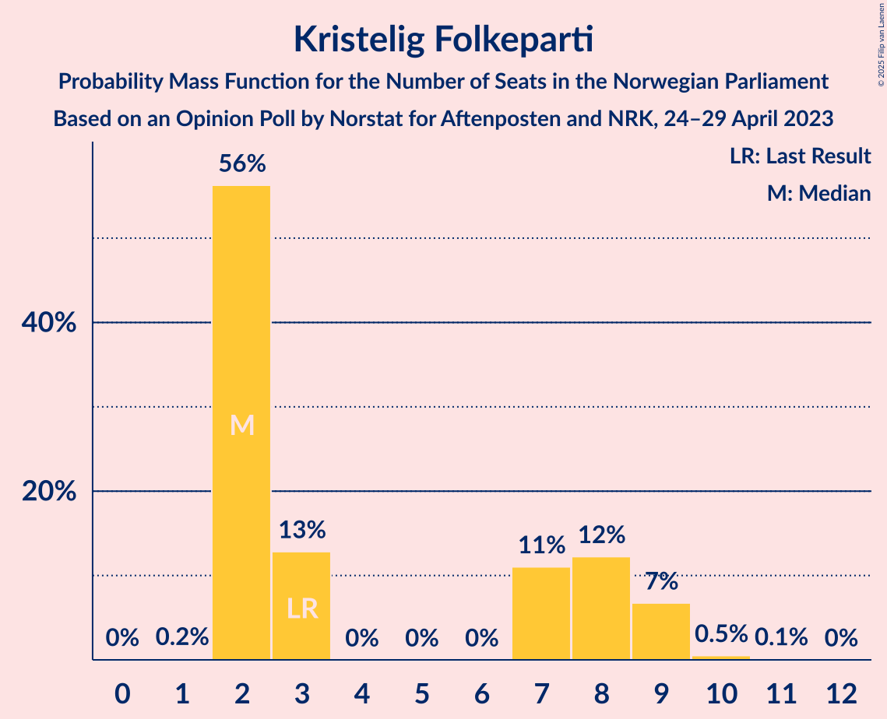
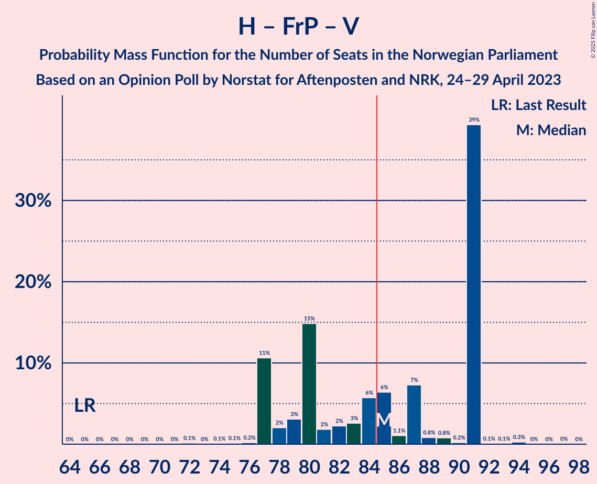

# Opinion Poll by Norstat for Aftenposten and NRK, 24–29 April 2023

<a href="#voting-intentions">Voting Intentions</a> | <a href="#seats">Seats</a> | <a href="#coalitions">Coalitions</a> | <a href="#technical-information">Technical Information</a>

## Voting Intentions

### Confidence Intervals

| Party | Last Result | Poll Result | 80% Confidence Interval | 90% Confidence Interval | 95% Confidence Interval | 99% Confidence Interval |
|:-----:|:-----------:|:-----------:|:-----------------------:|:-----------------------:|:-----------------------:|:-----------------------:|
| Høyre | 20.4% | 32.6% | 30.7–34.6% |30.2–35.1% |29.7–35.6% |28.9–36.6% |
| Arbeiderpartiet | 26.2% | 20.1% | 18.5–21.8% |18.1–22.3% |17.7–22.7% |17.0–23.6% |
| Fremskrittspartiet | 11.6% | 10.6% | 9.4–11.9% |9.1–12.3% |8.8–12.7% |8.2–13.3% |
| Sosialistisk Venstreparti | 7.6% | 8.5% | 7.5–9.8% |7.2–10.1% |6.9–10.4% |6.4–11.1% |
| Senterpartiet | 13.5% | 6.8% | 5.8–7.9% |5.6–8.2% |5.3–8.5% |4.9–9.1% |
| Rødt | 4.7% | 5.4% | 4.6–6.5% |4.4–6.8% |4.2–7.1% |3.8–7.6% |
| Kristelig Folkeparti | 3.8% | 3.8% | 3.1–4.7% |2.9–5.0% |2.8–5.2% |2.5–5.7% |
| Venstre | 4.6% | 3.7% | 3.0–4.6% |2.8–4.8% |2.7–5.1% |2.4–5.5% |
| Miljøpartiet De Grønne | 3.9% | 3.3% | 2.7–4.1% |2.5–4.4% |2.3–4.6% |2.1–5.0% |
| Industri- og Næringspartiet | 0.3% | 1.9% | 1.5–2.7% |1.4–2.9% |1.2–3.0% |1.1–3.4% |
| Pensjonistpartiet | 0.6% | 1.1% | 0.8–1.7% |0.7–1.9% |0.6–2.0% |0.5–2.3% |
| Norgesdemokratene | 1.1% | 0.8% | 0.5–1.3% |0.5–1.5% |0.4–1.6% |0.3–1.9% |
| Konservativt | 0.4% | 0.6% | 0.4–1.1% |0.3–1.2% |0.3–1.3% |0.2–1.6% |

*Note:* The poll result column reflects the actual value used in the calculations. Published results may vary slightly, and in addition be rounded to fewer digits.

## Seats

### Confidence Intervals

| Party | Last Result | Median | 80% Confidence Interval | 90% Confidence Interval | 95% Confidence Interval | 99% Confidence Interval |
|:-----:|:-----------:|:------:|:-----------------------:|:-----------------------:|:-----------------------:|:-----------------------:|
| <a href="#høyre">Høyre</a> | 36 | 62 | 56–63 |56–65 |55–65 |53–68 |
| <a href="#arbeiderpartiet">Arbeiderpartiet</a> | 48 | 40 | 36–42 |34–44 |33–45 |33–45 |
| <a href="#fremskrittspartiet">Fremskrittspartiet</a> | 21 | 20 | 18–22 |17–22 |17–22 |14–23 |
| <a href="#sosialistisk-venstreparti">Sosialistisk Venstreparti</a> | 13 | 14 | 14–18 |14–19 |13–19 |12–20 |
| <a href="#senterpartiet">Senterpartiet</a> | 28 | 12 | 11–14 |11–15 |10–15 |9–18 |
| <a href="#rødt">Rødt</a> | 8 | 8 | 8–11 |8–11 |8–12 |1–13 |
| <a href="#kristelig-folkeparti">Kristelig Folkeparti</a> | 3 | 2 | 2–8 |2–9 |2–9 |2–10 |
| <a href="#venstre">Venstre</a> | 8 | 7 | 2–8 |2–8 |2–8 |2–10 |
| <a href="#miljøpartiet-de-grønne">Miljøpartiet De Grønne</a> | 3 | 2 | 1–8 |1–9 |1–9 |1–9 |
| <a href="#industri--og-næringspartiet">Industri- og Næringspartiet</a> | 0 | 0 | 0–1 |0–2 |0–2 |0–2 |
| <a href="#pensjonistpartiet">Pensjonistpartiet</a> | 0 | 0 | 0 |0 |0 |0 |
| <a href="#norgesdemokratene">Norgesdemokratene</a> | 0 | 0 | 0 |0 |0 |0 |
| <a href="#konservativt">Konservativt</a> | 0 | 0 | 0 |0 |0 |0 |

### Høyre

*For a full overview of the results for this party, see the [Høyre](party-høyre.html) page.*

| Number of Seats | Probability | Accumulated | Special Marks |
|:---------------:|:-----------:|:-----------:|:-------------:|
| 36 | 0% | 100% | Last Result |
| 37 | 0% | 100% |  |
| 38 | 0% | 100% |  |
| 39 | 0% | 100% |  |
| 40 | 0% | 100% |  |
| 41 | 0% | 100% |  |
| 42 | 0% | 100% |  |
| 43 | 0% | 100% |  |
| 44 | 0% | 100% |  |
| 45 | 0% | 100% |  |
| 46 | 0% | 100% |  |
| 47 | 0% | 100% |  |
| 48 | 0% | 100% |  |
| 49 | 0% | 100% |  |
| 50 | 0% | 100% |  |
| 51 | 0.2% | 100% |  |
| 52 | 0.2% | 99.8% |  |
| 53 | 0.5% | 99.5% |  |
| 54 | 0.6% | 99.0% |  |
| 55 | 1.3% | 98% |  |
| 56 | 23% | 97% |  |
| 57 | 2% | 74% |  |
| 58 | 0.7% | 71% |  |
| 59 | 7% | 71% |  |
| 60 | 7% | 64% |  |
| 61 | 5% | 56% |  |
| 62 | 6% | 52% | Median |
| 63 | 39% | 46% |  |
| 64 | 0.9% | 7% |  |
| 65 | 4% | 6% |  |
| 66 | 1.0% | 2% |  |
| 67 | 0.1% | 0.6% |  |
| 68 | 0.1% | 0.5% |  |
| 69 | 0.4% | 0.5% |  |
| 70 | 0% | 0.1% |  |
| 71 | 0% | 0.1% |  |
| 72 | 0% | 0% |  |

### Arbeiderpartiet

*For a full overview of the results for this party, see the [Arbeiderpartiet](party-arbeiderpartiet.html) page.*

| Number of Seats | Probability | Accumulated | Special Marks |
|:---------------:|:-----------:|:-----------:|:-------------:|
| 30 | 0.1% | 100% |  |
| 31 | 0% | 99.9% |  |
| 32 | 0.1% | 99.9% |  |
| 33 | 5% | 99.8% |  |
| 34 | 0.2% | 95% |  |
| 35 | 3% | 95% |  |
| 36 | 5% | 92% |  |
| 37 | 3% | 87% |  |
| 38 | 13% | 85% |  |
| 39 | 1.1% | 72% |  |
| 40 | 50% | 71% | Median |
| 41 | 10% | 21% |  |
| 42 | 3% | 11% |  |
| 43 | 1.3% | 8% |  |
| 44 | 2% | 7% |  |
| 45 | 5% | 5% |  |
| 46 | 0.2% | 0.3% |  |
| 47 | 0.1% | 0.1% |  |
| 48 | 0% | 0% | Last Result |

### Fremskrittspartiet

*For a full overview of the results for this party, see the [Fremskrittspartiet](party-fremskrittspartiet.html) page.*

| Number of Seats | Probability | Accumulated | Special Marks |
|:---------------:|:-----------:|:-----------:|:-------------:|
| 14 | 0.6% | 100% |  |
| 15 | 0.2% | 99.4% |  |
| 16 | 1.2% | 99.2% |  |
| 17 | 6% | 98% |  |
| 18 | 9% | 92% |  |
| 19 | 21% | 83% |  |
| 20 | 46% | 62% | Median |
| 21 | 3% | 16% | Last Result |
| 22 | 11% | 12% |  |
| 23 | 0.7% | 1.2% |  |
| 24 | 0.3% | 0.5% |  |
| 25 | 0.1% | 0.2% |  |
| 26 | 0.1% | 0.1% |  |
| 27 | 0% | 0% |  |

### Sosialistisk Venstreparti

*For a full overview of the results for this party, see the [Sosialistisk Venstreparti](party-sosialistiskvenstreparti.html) page.*

| Number of Seats | Probability | Accumulated | Special Marks |
|:---------------:|:-----------:|:-----------:|:-------------:|
| 11 | 0.3% | 100% |  |
| 12 | 2% | 99.7% |  |
| 13 | 2% | 98% | Last Result |
| 14 | 68% | 97% | Median |
| 15 | 9% | 29% |  |
| 16 | 5% | 19% |  |
| 17 | 1.5% | 14% |  |
| 18 | 5% | 13% |  |
| 19 | 7% | 8% |  |
| 20 | 0.8% | 0.9% |  |
| 21 | 0% | 0.1% |  |
| 22 | 0.1% | 0.1% |  |
| 23 | 0% | 0% |  |

### Senterpartiet

*For a full overview of the results for this party, see the [Senterpartiet](party-senterpartiet.html) page.*

| Number of Seats | Probability | Accumulated | Special Marks |
|:---------------:|:-----------:|:-----------:|:-------------:|
| 8 | 0.2% | 100% |  |
| 9 | 0.6% | 99.8% |  |
| 10 | 2% | 99.2% |  |
| 11 | 46% | 97% |  |
| 12 | 11% | 51% | Median |
| 13 | 23% | 40% |  |
| 14 | 12% | 17% |  |
| 15 | 4% | 5% |  |
| 16 | 0.7% | 2% |  |
| 17 | 0.3% | 0.8% |  |
| 18 | 0.5% | 0.5% |  |
| 19 | 0% | 0% |  |
| 20 | 0% | 0% |  |
| 21 | 0% | 0% |  |
| 22 | 0% | 0% |  |
| 23 | 0% | 0% |  |
| 24 | 0% | 0% |  |
| 25 | 0% | 0% |  |
| 26 | 0% | 0% |  |
| 27 | 0% | 0% |  |
| 28 | 0% | 0% | Last Result |

### Rødt

*For a full overview of the results for this party, see the [Rødt](party-rødt.html) page.*

| Number of Seats | Probability | Accumulated | Special Marks |
|:---------------:|:-----------:|:-----------:|:-------------:|
| 1 | 2% | 100% |  |
| 2 | 0% | 98% |  |
| 3 | 0% | 98% |  |
| 4 | 0% | 98% |  |
| 5 | 0% | 98% |  |
| 6 | 0% | 98% |  |
| 7 | 0.4% | 98% |  |
| 8 | 53% | 98% | Last Result, Median |
| 9 | 13% | 44% |  |
| 10 | 21% | 31% |  |
| 11 | 7% | 11% |  |
| 12 | 0.7% | 3% |  |
| 13 | 2% | 2% |  |
| 14 | 0.1% | 0.2% |  |
| 15 | 0.1% | 0.1% |  |
| 16 | 0% | 0% |  |

### Kristelig Folkeparti

*For a full overview of the results for this party, see the [Kristelig Folkeparti](party-kristeligfolkeparti.html) page.*

| Number of Seats | Probability | Accumulated | Special Marks |
|:---------------:|:-----------:|:-----------:|:-------------:|
| 1 | 0.2% | 100% |  |
| 2 | 56% | 99.8% | Median |
| 3 | 13% | 44% | Last Result |
| 4 | 0% | 31% |  |
| 5 | 0% | 31% |  |
| 6 | 0% | 31% |  |
| 7 | 11% | 31% |  |
| 8 | 12% | 20% |  |
| 9 | 7% | 7% |  |
| 10 | 0.5% | 0.7% |  |
| 11 | 0.1% | 0.1% |  |
| 12 | 0% | 0% |  |

### Venstre

*For a full overview of the results for this party, see the [Venstre](party-venstre.html) page.*

| Number of Seats | Probability | Accumulated | Special Marks |
|:---------------:|:-----------:|:-----------:|:-------------:|
| 1 | 0.3% | 100% |  |
| 2 | 39% | 99.7% |  |
| 3 | 6% | 61% |  |
| 4 | 0% | 55% |  |
| 5 | 0% | 55% |  |
| 6 | 0% | 55% |  |
| 7 | 6% | 55% | Median |
| 8 | 48% | 49% | Last Result |
| 9 | 0.5% | 1.3% |  |
| 10 | 0.7% | 0.8% |  |
| 11 | 0% | 0% |  |

### Miljøpartiet De Grønne

*For a full overview of the results for this party, see the [Miljøpartiet De Grønne](party-miljøpartietdegrønne.html) page.*

| Number of Seats | Probability | Accumulated | Special Marks |
|:---------------:|:-----------:|:-----------:|:-------------:|
| 1 | 13% | 100% |  |
| 2 | 62% | 87% | Median |
| 3 | 1.3% | 25% | Last Result |
| 4 | 0% | 24% |  |
| 5 | 0% | 24% |  |
| 6 | 0% | 24% |  |
| 7 | 9% | 24% |  |
| 8 | 9% | 14% |  |
| 9 | 5% | 5% |  |
| 10 | 0% | 0% |  |

### Industri- og Næringspartiet

*For a full overview of the results for this party, see the [Industri- og Næringspartiet](party-industri-ognæringspartiet.html) page.*

| Number of Seats | Probability | Accumulated | Special Marks |
|:---------------:|:-----------:|:-----------:|:-------------:|
| 0 | 85% | 100% | Last Result, Median |
| 1 | 9% | 15% |  |
| 2 | 6% | 6% |  |
| 3 | 0.1% | 0.1% |  |
| 4 | 0% | 0% |  |

### Pensjonistpartiet

*For a full overview of the results for this party, see the [Pensjonistpartiet](party-pensjonistpartiet.html) page.*

| Number of Seats | Probability | Accumulated | Special Marks |
|:---------------:|:-----------:|:-----------:|:-------------:|
| 0 | 99.8% | 100% | Last Result, Median |
| 1 | 0.2% | 0.2% |  |
| 2 | 0% | 0% |  |

### Norgesdemokratene

*For a full overview of the results for this party, see the [Norgesdemokratene](party-norgesdemokratene.html) page.*

| Number of Seats | Probability | Accumulated | Special Marks |
|:---------------:|:-----------:|:-----------:|:-------------:|
| 0 | 100% | 100% | Last Result, Median |

### Konservativt

*For a full overview of the results for this party, see the [Konservativt](party-konservativt.html) page.*

| Number of Seats | Probability | Accumulated | Special Marks |
|:---------------:|:-----------:|:-----------:|:-------------:|
| 0 | 100% | 100% | Last Result, Median |

## Coalitions

### Confidence Intervals

| Coalition | Last Result | Median | Majority? | 80% Confidence Interval | 90% Confidence Interval | 95% Confidence Interval | 99% Confidence Interval |
|:---------:|:-----------:|:------:|:---------:|:-----------------------:|:-----------------------:|:-----------------------:|:-----------------------:|
| Høyre – Fremskrittspartiet – Senterpartiet – Kristelig Folkeparti – Venstre | 96 | 103 | 100% | 96–104 | 95–106 | 93–106 | 91–108 |
| Høyre – Fremskrittspartiet – Kristelig Folkeparti – Venstre – Miljøpartiet De Grønne | 71 | 94 | 99.6% | 89–95 | 88–96 | 87–96 | 85–99 |
| Høyre – Fremskrittspartiet – Kristelig Folkeparti – Venstre | 68 | 89 | 89% | 84–93 | 82–93 | 82–93 | 81–95 |
| Høyre – Fremskrittspartiet – Venstre | 65 | 85 | 56% | 77–91 | 77–91 | 77–91 | 76–91 |
| Arbeiderpartiet – Sosialistisk Venstreparti – Senterpartiet – Rødt – Miljøpartiet De Grønne | 100 | 78 | 7% | 75–83 | 75–86 | 75–86 | 71–87 |
| Høyre – Fremskrittspartiet | 57 | 82 | 2% | 75–83 | 75–84 | 74–84 | 70–87 |
| Arbeiderpartiet – Sosialistisk Venstreparti – Senterpartiet – Kristelig Folkeparti – Miljøpartiet De Grønne | 95 | 72 | 2% | 69–83 | 69–83 | 69–83 | 66–85 |
| Arbeiderpartiet – Sosialistisk Venstreparti – Senterpartiet – Rødt | 97 | 74 | 0.2% | 73–78 | 72–80 | 72–80 | 68–82 |
| Arbeiderpartiet – Sosialistisk Venstreparti – Senterpartiet – Miljøpartiet De Grønne | 92 | 69 | 0% | 67–75 | 67–75 | 66–77 | 63–77 |
| Høyre – Kristelig Folkeparti – Venstre | 47 | 71 | 0% | 65–73 | 63–73 | 63–73 | 60–76 |
| Arbeiderpartiet – Sosialistisk Venstreparti – Rødt – Miljøpartiet De Grønne | 72 | 65 | 0% | 64–72 | 62–73 | 62–73 | 59–77 |
| Arbeiderpartiet – Sosialistisk Venstreparti – Senterpartiet | 89 | 65 | 0% | 65–69 | 62–71 | 62–72 | 60–75 |
| Arbeiderpartiet – Senterpartiet – Kristelig Folkeparti – Miljøpartiet De Grønne | 82 | 56 | 0% | 55–68 | 54–69 | 54–69 | 50–69 |
| Arbeiderpartiet – Senterpartiet – Kristelig Folkeparti | 79 | 53 | 0% | 53–62 | 51–63 | 51–65 | 49–66 |
| Arbeiderpartiet – Sosialistisk Venstreparti | 61 | 54 | 0% | 52–57 | 50–59 | 50–60 | 47–64 |
| Arbeiderpartiet – Senterpartiet | 76 | 51 | 0% | 48–54 | 46–56 | 46–57 | 45–58 |
| Senterpartiet – Kristelig Folkeparti – Venstre | 39 | 21 | 0% | 17–25 | 16–26 | 16–27 | 14–28 |

### Høyre – Fremskrittspartiet – Senterpartiet – Kristelig Folkeparti – Venstre

| Number of Seats | Probability | Accumulated | Special Marks |
|:---------------:|:-----------:|:-----------:|:-------------:|
| 90 | 0% | 100% |  |
| 91 | 0.8% | 99.9% |  |
| 92 | 0.1% | 99.1% |  |
| 93 | 3% | 99.0% |  |
| 94 | 0.1% | 96% |  |
| 95 | 6% | 96% |  |
| 96 | 2% | 90% | Last Result |
| 97 | 1.2% | 89% |  |
| 98 | 13% | 87% |  |
| 99 | 0.8% | 74% |  |
| 100 | 5% | 74% |  |
| 101 | 13% | 69% |  |
| 102 | 6% | 56% |  |
| 103 | 1.0% | 50% | Median |
| 104 | 43% | 49% |  |
| 105 | 0.9% | 7% |  |
| 106 | 4% | 6% |  |
| 107 | 0.6% | 2% |  |
| 108 | 0.6% | 1.1% |  |
| 109 | 0.1% | 0.5% |  |
| 110 | 0.2% | 0.4% |  |
| 111 | 0.2% | 0.3% |  |
| 112 | 0% | 0.1% |  |
| 113 | 0% | 0.1% |  |
| 114 | 0.1% | 0.1% |  |
| 115 | 0% | 0% |  |

### Høyre – Fremskrittspartiet – Kristelig Folkeparti – Venstre – Miljøpartiet De Grønne

| Number of Seats | Probability | Accumulated | Special Marks |
|:---------------:|:-----------:|:-----------:|:-------------:|
| 71 | 0% | 100% | Last Result |
| 72 | 0% | 100% |  |
| 73 | 0% | 100% |  |
| 74 | 0% | 100% |  |
| 75 | 0% | 100% |  |
| 76 | 0% | 100% |  |
| 77 | 0% | 100% |  |
| 78 | 0% | 100% |  |
| 79 | 0% | 100% |  |
| 80 | 0% | 100% |  |
| 81 | 0% | 100% |  |
| 82 | 0.1% | 99.9% |  |
| 83 | 0.1% | 99.8% |  |
| 84 | 0.1% | 99.7% |  |
| 85 | 1.0% | 99.6% | Majority |
| 86 | 1.0% | 98.6% |  |
| 87 | 0.9% | 98% |  |
| 88 | 5% | 97% |  |
| 89 | 10% | 92% |  |
| 90 | 12% | 82% |  |
| 91 | 7% | 70% |  |
| 92 | 12% | 63% |  |
| 93 | 2% | 52% | Median |
| 94 | 1.5% | 50% |  |
| 95 | 43% | 49% |  |
| 96 | 5% | 6% |  |
| 97 | 0.1% | 1.0% |  |
| 98 | 0.3% | 0.9% |  |
| 99 | 0.2% | 0.6% |  |
| 100 | 0.3% | 0.5% |  |
| 101 | 0.1% | 0.1% |  |
| 102 | 0% | 0.1% |  |
| 103 | 0% | 0.1% |  |
| 104 | 0% | 0% |  |

### Høyre – Fremskrittspartiet – Kristelig Folkeparti – Venstre

| Number of Seats | Probability | Accumulated | Special Marks |
|:---------------:|:-----------:|:-----------:|:-------------:|
| 68 | 0% | 100% | Last Result |
| 69 | 0% | 100% |  |
| 70 | 0% | 100% |  |
| 71 | 0% | 100% |  |
| 72 | 0% | 100% |  |
| 73 | 0% | 100% |  |
| 74 | 0% | 100% |  |
| 75 | 0% | 100% |  |
| 76 | 0% | 100% |  |
| 77 | 0% | 100% |  |
| 78 | 0.1% | 100% |  |
| 79 | 0% | 99.9% |  |
| 80 | 0.2% | 99.9% |  |
| 81 | 0.8% | 99.6% |  |
| 82 | 8% | 98.8% |  |
| 83 | 0.3% | 91% |  |
| 84 | 1.2% | 90% |  |
| 85 | 11% | 89% | Majority |
| 86 | 5% | 78% |  |
| 87 | 11% | 74% |  |
| 88 | 6% | 63% |  |
| 89 | 8% | 57% |  |
| 90 | 3% | 50% |  |
| 91 | 1.0% | 47% | Median |
| 92 | 0.7% | 46% |  |
| 93 | 44% | 45% |  |
| 94 | 0.5% | 2% |  |
| 95 | 0.6% | 1.1% |  |
| 96 | 0.1% | 0.5% |  |
| 97 | 0.2% | 0.3% |  |
| 98 | 0% | 0.2% |  |
| 99 | 0.1% | 0.1% |  |
| 100 | 0% | 0.1% |  |
| 101 | 0% | 0% |  |

### Høyre – Fremskrittspartiet – Venstre

| Number of Seats | Probability | Accumulated | Special Marks |
|:---------------:|:-----------:|:-----------:|:-------------:|
| 65 | 0% | 100% | Last Result |
| 66 | 0% | 100% |  |
| 67 | 0% | 100% |  |
| 68 | 0% | 100% |  |
| 69 | 0% | 100% |  |
| 70 | 0% | 100% |  |
| 71 | 0% | 100% |  |
| 72 | 0.1% | 100% |  |
| 73 | 0% | 99.8% |  |
| 74 | 0.1% | 99.8% |  |
| 75 | 0.1% | 99.8% |  |
| 76 | 0.2% | 99.6% |  |
| 77 | 11% | 99.4% |  |
| 78 | 2% | 89% |  |
| 79 | 3% | 87% |  |
| 80 | 15% | 84% |  |
| 81 | 2% | 69% |  |
| 82 | 2% | 67% |  |
| 83 | 3% | 65% |  |
| 84 | 6% | 62% |  |
| 85 | 6% | 56% | Majority |
| 86 | 1.1% | 50% |  |
| 87 | 7% | 49% |  |
| 88 | 0.8% | 42% |  |
| 89 | 0.8% | 41% | Median |
| 90 | 0.2% | 40% |  |
| 91 | 39% | 40% |  |
| 92 | 0.1% | 0.5% |  |
| 93 | 0.1% | 0.4% |  |
| 94 | 0.3% | 0.3% |  |
| 95 | 0% | 0.1% |  |
| 96 | 0% | 0.1% |  |
| 97 | 0% | 0% |  |

### Arbeiderpartiet – Sosialistisk Venstreparti – Senterpartiet – Rødt – Miljøpartiet De Grønne

| Number of Seats | Probability | Accumulated | Special Marks |
|:---------------:|:-----------:|:-----------:|:-------------:|
| 68 | 0% | 100% |  |
| 69 | 0.1% | 99.9% |  |
| 70 | 0.2% | 99.9% |  |
| 71 | 0.2% | 99.7% |  |
| 72 | 0% | 99.5% |  |
| 73 | 0.6% | 99.4% |  |
| 74 | 0.5% | 98.8% |  |
| 75 | 44% | 98% |  |
| 76 | 0.9% | 55% | Median |
| 77 | 1.2% | 54% |  |
| 78 | 3% | 53% |  |
| 79 | 7% | 50% |  |
| 80 | 15% | 43% |  |
| 81 | 2% | 27% |  |
| 82 | 5% | 25% |  |
| 83 | 10% | 20% |  |
| 84 | 3% | 10% |  |
| 85 | 0.3% | 7% | Majority |
| 86 | 6% | 7% |  |
| 87 | 0.8% | 1.0% |  |
| 88 | 0.1% | 0.2% |  |
| 89 | 0% | 0.1% |  |
| 90 | 0.1% | 0.1% |  |
| 91 | 0% | 0% |  |
| 92 | 0% | 0% |  |
| 93 | 0% | 0% |  |
| 94 | 0% | 0% |  |
| 95 | 0% | 0% |  |
| 96 | 0% | 0% |  |
| 97 | 0% | 0% |  |
| 98 | 0% | 0% |  |
| 99 | 0% | 0% |  |
| 100 | 0% | 0% | Last Result |

### Høyre – Fremskrittspartiet

| Number of Seats | Probability | Accumulated | Special Marks |
|:---------------:|:-----------:|:-----------:|:-------------:|
| 57 | 0% | 100% | Last Result |
| 58 | 0% | 100% |  |
| 59 | 0% | 100% |  |
| 60 | 0% | 100% |  |
| 61 | 0% | 100% |  |
| 62 | 0% | 100% |  |
| 63 | 0% | 100% |  |
| 64 | 0% | 100% |  |
| 65 | 0% | 100% |  |
| 66 | 0% | 100% |  |
| 67 | 0% | 100% |  |
| 68 | 0.1% | 100% |  |
| 69 | 0.1% | 99.9% |  |
| 70 | 0.8% | 99.9% |  |
| 71 | 0.1% | 99.0% |  |
| 72 | 0.2% | 98.9% |  |
| 73 | 0.3% | 98.7% |  |
| 74 | 2% | 98% |  |
| 75 | 11% | 96% |  |
| 76 | 2% | 85% |  |
| 77 | 5% | 82% |  |
| 78 | 20% | 78% |  |
| 79 | 4% | 58% |  |
| 80 | 1.3% | 54% |  |
| 81 | 2% | 53% |  |
| 82 | 5% | 51% | Median |
| 83 | 40% | 46% |  |
| 84 | 4% | 6% |  |
| 85 | 1.2% | 2% | Majority |
| 86 | 0.2% | 0.7% |  |
| 87 | 0.3% | 0.6% |  |
| 88 | 0.1% | 0.3% |  |
| 89 | 0% | 0.2% |  |
| 90 | 0% | 0.2% |  |
| 91 | 0.1% | 0.2% |  |
| 92 | 0% | 0.1% |  |
| 93 | 0% | 0% |  |

### Arbeiderpartiet – Sosialistisk Venstreparti – Senterpartiet – Kristelig Folkeparti – Miljøpartiet De Grønne

| Number of Seats | Probability | Accumulated | Special Marks |
|:---------------:|:-----------:|:-----------:|:-------------:|
| 62 | 0.1% | 100% |  |
| 63 | 0% | 99.9% |  |
| 64 | 0% | 99.9% |  |
| 65 | 0.2% | 99.8% |  |
| 66 | 0.2% | 99.7% |  |
| 67 | 0.1% | 99.4% |  |
| 68 | 1.0% | 99.3% |  |
| 69 | 39% | 98% |  |
| 70 | 2% | 59% | Median |
| 71 | 4% | 57% |  |
| 72 | 5% | 53% |  |
| 73 | 5% | 49% |  |
| 74 | 2% | 44% |  |
| 75 | 3% | 42% |  |
| 76 | 6% | 39% |  |
| 77 | 16% | 34% |  |
| 78 | 3% | 18% |  |
| 79 | 0.6% | 15% |  |
| 80 | 1.0% | 14% |  |
| 81 | 0.7% | 13% |  |
| 82 | 2% | 13% |  |
| 83 | 9% | 11% |  |
| 84 | 0.1% | 2% |  |
| 85 | 2% | 2% | Majority |
| 86 | 0.1% | 0.2% |  |
| 87 | 0.1% | 0.1% |  |
| 88 | 0% | 0% |  |
| 89 | 0% | 0% |  |
| 90 | 0% | 0% |  |
| 91 | 0% | 0% |  |
| 92 | 0% | 0% |  |
| 93 | 0% | 0% |  |
| 94 | 0% | 0% |  |
| 95 | 0% | 0% | Last Result |

### Arbeiderpartiet – Sosialistisk Venstreparti – Senterpartiet – Rødt

| Number of Seats | Probability | Accumulated | Special Marks |
|:---------------:|:-----------:|:-----------:|:-------------:|
| 64 | 0% | 100% |  |
| 65 | 0% | 99.9% |  |
| 66 | 0% | 99.9% |  |
| 67 | 0.1% | 99.9% |  |
| 68 | 0.4% | 99.8% |  |
| 69 | 0.2% | 99.4% |  |
| 70 | 0.1% | 99.2% |  |
| 71 | 0.1% | 99.1% |  |
| 72 | 5% | 99.0% |  |
| 73 | 43% | 94% |  |
| 74 | 2% | 51% | Median |
| 75 | 2% | 49% |  |
| 76 | 14% | 48% |  |
| 77 | 7% | 34% |  |
| 78 | 18% | 27% |  |
| 79 | 1.5% | 9% |  |
| 80 | 5% | 7% |  |
| 81 | 1.4% | 2% |  |
| 82 | 0.2% | 0.7% |  |
| 83 | 0.1% | 0.5% |  |
| 84 | 0.1% | 0.4% |  |
| 85 | 0.1% | 0.2% | Majority |
| 86 | 0.1% | 0.1% |  |
| 87 | 0% | 0% |  |
| 88 | 0% | 0% |  |
| 89 | 0% | 0% |  |
| 90 | 0% | 0% |  |
| 91 | 0% | 0% |  |
| 92 | 0% | 0% |  |
| 93 | 0% | 0% |  |
| 94 | 0% | 0% |  |
| 95 | 0% | 0% |  |
| 96 | 0% | 0% |  |
| 97 | 0% | 0% | Last Result |

### Arbeiderpartiet – Sosialistisk Venstreparti – Senterpartiet – Miljøpartiet De Grønne

| Number of Seats | Probability | Accumulated | Special Marks |
|:---------------:|:-----------:|:-----------:|:-------------:|
| 60 | 0.1% | 100% |  |
| 61 | 0% | 99.8% |  |
| 62 | 0.2% | 99.8% |  |
| 63 | 0.6% | 99.6% |  |
| 64 | 0.4% | 99.0% |  |
| 65 | 0.7% | 98.6% |  |
| 66 | 1.2% | 98% |  |
| 67 | 45% | 97% |  |
| 68 | 1.3% | 52% | Median |
| 69 | 4% | 51% |  |
| 70 | 18% | 47% |  |
| 71 | 1.0% | 29% |  |
| 72 | 2% | 28% |  |
| 73 | 5% | 25% |  |
| 74 | 0.6% | 20% |  |
| 75 | 16% | 19% |  |
| 76 | 0.2% | 3% |  |
| 77 | 2% | 3% |  |
| 78 | 0.2% | 0.3% |  |
| 79 | 0.1% | 0.2% |  |
| 80 | 0% | 0% |  |
| 81 | 0% | 0% |  |
| 82 | 0% | 0% |  |
| 83 | 0% | 0% |  |
| 84 | 0% | 0% |  |
| 85 | 0% | 0% | Majority |
| 86 | 0% | 0% |  |
| 87 | 0% | 0% |  |
| 88 | 0% | 0% |  |
| 89 | 0% | 0% |  |
| 90 | 0% | 0% |  |
| 91 | 0% | 0% |  |
| 92 | 0% | 0% | Last Result |

### Høyre – Kristelig Folkeparti – Venstre

| Number of Seats | Probability | Accumulated | Special Marks |
|:---------------:|:-----------:|:-----------:|:-------------:|
| 47 | 0% | 100% | Last Result |
| 48 | 0% | 100% |  |
| 49 | 0% | 100% |  |
| 50 | 0% | 100% |  |
| 51 | 0% | 100% |  |
| 52 | 0% | 100% |  |
| 53 | 0% | 100% |  |
| 54 | 0% | 100% |  |
| 55 | 0% | 100% |  |
| 56 | 0% | 100% |  |
| 57 | 0% | 100% |  |
| 58 | 0% | 100% |  |
| 59 | 0% | 100% |  |
| 60 | 0.7% | 99.9% |  |
| 61 | 0.3% | 99.2% |  |
| 62 | 0.4% | 98.9% |  |
| 63 | 6% | 98.5% |  |
| 64 | 0.9% | 93% |  |
| 65 | 13% | 92% |  |
| 66 | 10% | 79% |  |
| 67 | 5% | 69% |  |
| 68 | 2% | 65% |  |
| 69 | 2% | 63% |  |
| 70 | 9% | 61% |  |
| 71 | 4% | 52% | Median |
| 72 | 3% | 48% |  |
| 73 | 43% | 46% |  |
| 74 | 0.8% | 2% |  |
| 75 | 0.3% | 2% |  |
| 76 | 1.0% | 1.3% |  |
| 77 | 0.1% | 0.3% |  |
| 78 | 0% | 0.2% |  |
| 79 | 0.1% | 0.1% |  |
| 80 | 0.1% | 0.1% |  |
| 81 | 0% | 0% |  |

### Arbeiderpartiet – Sosialistisk Venstreparti – Rødt – Miljøpartiet De Grønne

| Number of Seats | Probability | Accumulated | Special Marks |
|:---------------:|:-----------:|:-----------:|:-------------:|
| 54 | 0.1% | 100% |  |
| 55 | 0% | 99.9% |  |
| 56 | 0% | 99.9% |  |
| 57 | 0.1% | 99.9% |  |
| 58 | 0.2% | 99.7% |  |
| 59 | 0.2% | 99.5% |  |
| 60 | 0.6% | 99.3% |  |
| 61 | 0.5% | 98.7% |  |
| 62 | 4% | 98% |  |
| 63 | 1.0% | 94% |  |
| 64 | 42% | 93% | Median |
| 65 | 2% | 51% |  |
| 66 | 15% | 49% |  |
| 67 | 3% | 34% |  |
| 68 | 5% | 31% |  |
| 69 | 1.5% | 26% |  |
| 70 | 14% | 24% |  |
| 71 | 0.5% | 11% |  |
| 72 | 0.7% | 10% | Last Result |
| 73 | 8% | 10% |  |
| 74 | 0.2% | 1.2% |  |
| 75 | 0.1% | 1.0% |  |
| 76 | 0% | 0.9% |  |
| 77 | 0.8% | 0.9% |  |
| 78 | 0% | 0.1% |  |
| 79 | 0% | 0% |  |

### Arbeiderpartiet – Sosialistisk Venstreparti – Senterpartiet

| Number of Seats | Probability | Accumulated | Special Marks |
|:---------------:|:-----------:|:-----------:|:-------------:|
| 58 | 0.2% | 100% |  |
| 59 | 0.1% | 99.8% |  |
| 60 | 0.2% | 99.7% |  |
| 61 | 0.4% | 99.5% |  |
| 62 | 5% | 99.1% |  |
| 63 | 0.7% | 94% |  |
| 64 | 1.3% | 94% |  |
| 65 | 46% | 92% |  |
| 66 | 7% | 46% | Median |
| 67 | 4% | 40% |  |
| 68 | 22% | 36% |  |
| 69 | 5% | 14% |  |
| 70 | 0.5% | 9% |  |
| 71 | 6% | 9% |  |
| 72 | 0.9% | 3% |  |
| 73 | 0.1% | 2% |  |
| 74 | 0.1% | 2% |  |
| 75 | 2% | 2% |  |
| 76 | 0% | 0% |  |
| 77 | 0% | 0% |  |
| 78 | 0% | 0% |  |
| 79 | 0% | 0% |  |
| 80 | 0% | 0% |  |
| 81 | 0% | 0% |  |
| 82 | 0% | 0% |  |
| 83 | 0% | 0% |  |
| 84 | 0% | 0% |  |
| 85 | 0% | 0% | Majority |
| 86 | 0% | 0% |  |
| 87 | 0% | 0% |  |
| 88 | 0% | 0% |  |
| 89 | 0% | 0% | Last Result |

### Arbeiderpartiet – Senterpartiet – Kristelig Folkeparti – Miljøpartiet De Grønne

| Number of Seats | Probability | Accumulated | Special Marks |
|:---------------:|:-----------:|:-----------:|:-------------:|
| 48 | 0.1% | 100% |  |
| 49 | 0.2% | 99.9% |  |
| 50 | 0.7% | 99.7% |  |
| 51 | 0.1% | 99.0% |  |
| 52 | 0.4% | 98.8% |  |
| 53 | 0.2% | 98% |  |
| 54 | 6% | 98% |  |
| 55 | 39% | 92% |  |
| 56 | 5% | 53% | Median |
| 57 | 5% | 48% |  |
| 58 | 2% | 43% |  |
| 59 | 5% | 42% |  |
| 60 | 0.6% | 36% |  |
| 61 | 1.2% | 36% |  |
| 62 | 7% | 34% |  |
| 63 | 10% | 28% |  |
| 64 | 4% | 17% |  |
| 65 | 0.2% | 14% |  |
| 66 | 2% | 14% |  |
| 67 | 0.6% | 12% |  |
| 68 | 2% | 11% |  |
| 69 | 9% | 9% |  |
| 70 | 0% | 0.2% |  |
| 71 | 0.1% | 0.2% |  |
| 72 | 0% | 0.1% |  |
| 73 | 0% | 0.1% |  |
| 74 | 0.1% | 0.1% |  |
| 75 | 0% | 0% |  |
| 76 | 0% | 0% |  |
| 77 | 0% | 0% |  |
| 78 | 0% | 0% |  |
| 79 | 0% | 0% |  |
| 80 | 0% | 0% |  |
| 81 | 0% | 0% |  |
| 82 | 0% | 0% | Last Result |

### Arbeiderpartiet – Senterpartiet – Kristelig Folkeparti

| Number of Seats | Probability | Accumulated | Special Marks |
|:---------------:|:-----------:|:-----------:|:-------------:|
| 46 | 0.2% | 100% |  |
| 47 | 0.1% | 99.8% |  |
| 48 | 0.1% | 99.7% |  |
| 49 | 0.8% | 99.5% |  |
| 50 | 0.2% | 98.8% |  |
| 51 | 5% | 98.6% |  |
| 52 | 2% | 93% |  |
| 53 | 50% | 92% |  |
| 54 | 0.5% | 42% | Median |
| 55 | 10% | 42% |  |
| 56 | 4% | 32% |  |
| 57 | 1.2% | 28% |  |
| 58 | 1.0% | 27% |  |
| 59 | 0.5% | 26% |  |
| 60 | 0.7% | 25% |  |
| 61 | 10% | 24% |  |
| 62 | 9% | 14% |  |
| 63 | 0.4% | 5% |  |
| 64 | 2% | 5% |  |
| 65 | 0.6% | 3% |  |
| 66 | 2% | 2% |  |
| 67 | 0% | 0.1% |  |
| 68 | 0% | 0% |  |
| 69 | 0% | 0% |  |
| 70 | 0% | 0% |  |
| 71 | 0% | 0% |  |
| 72 | 0% | 0% |  |
| 73 | 0% | 0% |  |
| 74 | 0% | 0% |  |
| 75 | 0% | 0% |  |
| 76 | 0% | 0% |  |
| 77 | 0% | 0% |  |
| 78 | 0% | 0% |  |
| 79 | 0% | 0% | Last Result |

### Arbeiderpartiet – Sosialistisk Venstreparti

| Number of Seats | Probability | Accumulated | Special Marks |
|:---------------:|:-----------:|:-----------:|:-------------:|
| 46 | 0.1% | 100% |  |
| 47 | 0.4% | 99.8% |  |
| 48 | 0.1% | 99.5% |  |
| 49 | 1.1% | 99.3% |  |
| 50 | 5% | 98% |  |
| 51 | 2% | 93% |  |
| 52 | 5% | 91% |  |
| 53 | 10% | 86% |  |
| 54 | 49% | 77% | Median |
| 55 | 9% | 27% |  |
| 56 | 8% | 18% |  |
| 57 | 1.2% | 10% |  |
| 58 | 0.7% | 9% |  |
| 59 | 5% | 8% |  |
| 60 | 0.8% | 3% |  |
| 61 | 0.4% | 2% | Last Result |
| 62 | 0.2% | 2% |  |
| 63 | 0.1% | 2% |  |
| 64 | 2% | 2% |  |
| 65 | 0% | 0% |  |

### Arbeiderpartiet – Senterpartiet

| Number of Seats | Probability | Accumulated | Special Marks |
|:---------------:|:-----------:|:-----------:|:-------------:|
| 44 | 0.3% | 100% |  |
| 45 | 0.3% | 99.7% |  |
| 46 | 5% | 99.4% |  |
| 47 | 1.1% | 95% |  |
| 48 | 4% | 94% |  |
| 49 | 3% | 90% |  |
| 50 | 1.0% | 86% |  |
| 51 | 49% | 85% |  |
| 52 | 2% | 36% | Median |
| 53 | 8% | 34% |  |
| 54 | 19% | 26% |  |
| 55 | 0.4% | 7% |  |
| 56 | 3% | 6% |  |
| 57 | 3% | 4% |  |
| 58 | 0.7% | 0.9% |  |
| 59 | 0% | 0.2% |  |
| 60 | 0.1% | 0.1% |  |
| 61 | 0% | 0.1% |  |
| 62 | 0% | 0% |  |
| 63 | 0% | 0% |  |
| 64 | 0% | 0% |  |
| 65 | 0% | 0% |  |
| 66 | 0% | 0% |  |
| 67 | 0% | 0% |  |
| 68 | 0% | 0% |  |
| 69 | 0% | 0% |  |
| 70 | 0% | 0% |  |
| 71 | 0% | 0% |  |
| 72 | 0% | 0% |  |
| 73 | 0% | 0% |  |
| 74 | 0% | 0% |  |
| 75 | 0% | 0% |  |
| 76 | 0% | 0% | Last Result |

### Senterpartiet – Kristelig Folkeparti – Venstre

| Number of Seats | Probability | Accumulated | Special Marks |
|:---------------:|:-----------:|:-----------:|:-------------:|
| 14 | 0.7% | 100% |  |
| 15 | 1.0% | 99.3% |  |
| 16 | 4% | 98% |  |
| 17 | 7% | 94% |  |
| 18 | 4% | 87% |  |
| 19 | 0.2% | 83% |  |
| 20 | 1.5% | 83% |  |
| 21 | 40% | 81% | Median |
| 22 | 5% | 41% |  |
| 23 | 21% | 36% |  |
| 24 | 4% | 15% |  |
| 25 | 5% | 10% |  |
| 26 | 1.0% | 5% |  |
| 27 | 3% | 4% |  |
| 28 | 2% | 2% |  |
| 29 | 0.1% | 0.3% |  |
| 30 | 0.1% | 0.2% |  |
| 31 | 0% | 0.1% |  |
| 32 | 0% | 0.1% |  |
| 33 | 0% | 0% |  |
| 34 | 0% | 0% |  |
| 35 | 0% | 0% |  |
| 36 | 0% | 0% |  |
| 37 | 0% | 0% |  |
| 38 | 0% | 0% |  |
| 39 | 0% | 0% | Last Result |

## Technical Information

### Opinion Poll

+ **Polling firm:** Norstat
+ **Commissioner(s):** Aftenposten and NRK
+ **Fieldwork period:** 24–29 April 2023

### Calculations

+ **Sample size:** 975
+ **Simulations done:** 1,048,576
+ **Error estimate:** 2.83%

