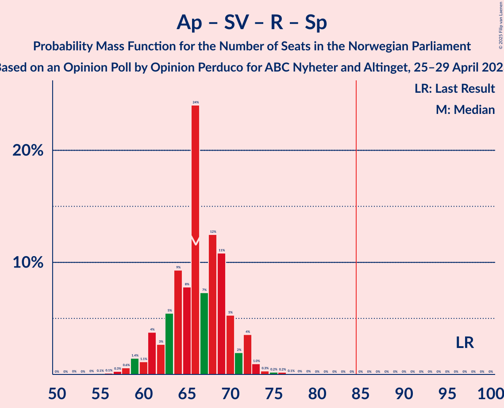
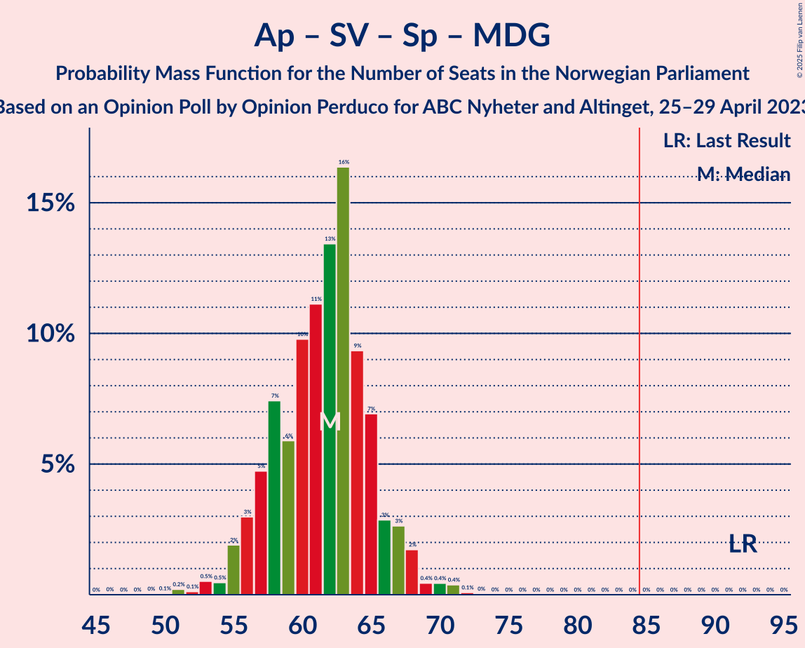
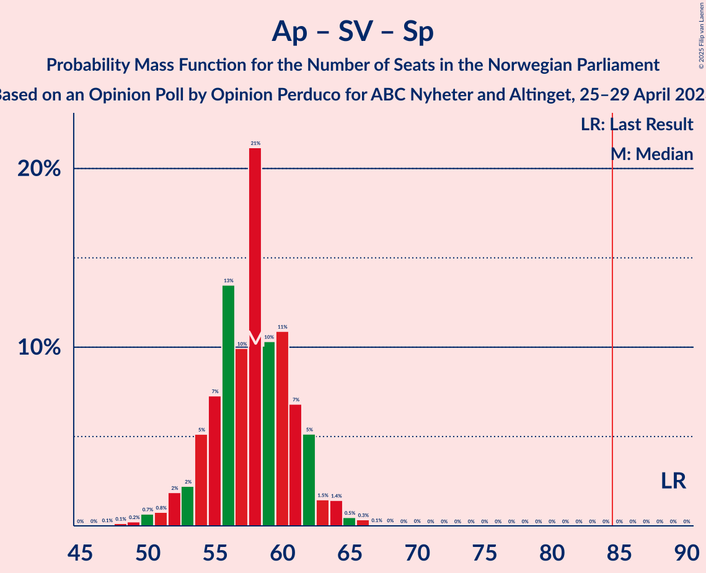

# Opinion Poll by Opinion Perduco for ABC Nyheter and Altinget, 25–29 April 2023

<a href="#voting-intentions">Voting Intentions</a> | <a href="#seats">Seats</a> | <a href="#coalitions">Coalitions</a> | <a href="#technical-information">Technical Information</a>

## Voting Intentions

### Confidence Intervals

| Party | Last Result | Poll Result | 80% Confidence Interval | 90% Confidence Interval | 95% Confidence Interval | 99% Confidence Interval |
|:-----:|:-----------:|:-----------:|:-----------------------:|:-----------------------:|:-----------------------:|:-----------------------:|
| Høyre | 20.4% | 29.8% | 28.0–31.7% |27.5–32.3% |27.0–32.7% |26.2–33.6% |
| Arbeiderpartiet | 26.2% | 17.7% | 16.2–19.3% |15.8–19.8% |15.5–20.2% |14.8–21.0% |
| Fremskrittspartiet | 11.6% | 12.5% | 11.2–13.9% |10.9–14.3% |10.6–14.7% |10.0–15.4% |
| Sosialistisk Venstreparti | 7.6% | 8.9% | 7.8–10.2% |7.5–10.5% |7.3–10.8% |6.8–11.5% |
| Rødt | 4.7% | 5.9% | 5.0–7.0% |4.8–7.3% |4.6–7.5% |4.2–8.1% |
| Senterpartiet | 13.5% | 5.5% | 4.7–6.5% |4.4–6.8% |4.3–7.1% |3.9–7.6% |
| Venstre | 4.6% | 4.7% | 3.9–5.7% |3.7–6.0% |3.6–6.2% |3.2–6.7% |
| Kristelig Folkeparti | 3.8% | 4.4% | 3.7–5.3% |3.5–5.6% |3.3–5.9% |3.0–6.4% |
| Miljøpartiet De Grønne | 3.9% | 3.8% | 3.1–4.7% |2.9–5.0% |2.8–5.2% |2.5–5.6% |

*Note:* The poll result column reflects the actual value used in the calculations. Published results may vary slightly, and in addition be rounded to fewer digits.

## Seats

### Confidence Intervals

| Party | Last Result | Median | 80% Confidence Interval | 90% Confidence Interval | 95% Confidence Interval | 99% Confidence Interval |
|:-----:|:-----------:|:------:|:-----------------------:|:-----------------------:|:-----------------------:|:-----------------------:|
| <a href="#høyre">Høyre</a> | 36 | 53 | 50–59 |49–60 |49–61 |48–64 |
| <a href="#arbeiderpartiet">Arbeiderpartiet</a> | 48 | 35 | 33–38 |33–39 |32–41 |30–42 |
| <a href="#fremskrittspartiet">Fremskrittspartiet</a> | 21 | 23 | 18–26 |18–27 |18–28 |17–31 |
| <a href="#sosialistisk-venstreparti">Sosialistisk Venstreparti</a> | 13 | 14 | 11–16 |10–16 |10–17 |9–19 |
| <a href="#rødt">Rødt</a> | 8 | 8 | 7–10 |7–10 |6–11 |5–12 |
| <a href="#senterpartiet">Senterpartiet</a> | 28 | 8 | 6–12 |6–13 |6–13 |5–14 |
| <a href="#venstre">Venstre</a> | 8 | 7 | 3–8 |3–8 |2–9 |2–10 |
| <a href="#kristelig-folkeparti">Kristelig Folkeparti</a> | 3 | 6 | 3–7 |3–8 |2–8 |2–9 |
| <a href="#miljøpartiet-de-grønne">Miljøpartiet De Grønne</a> | 3 | 3 | 2–6 |1–7 |1–7 |1–8 |

### Høyre

*For a full overview of the results for this party, see the [Høyre](party-høyre.html) page.*

| Number of Seats | Probability | Accumulated | Special Marks |
|:---------------:|:-----------:|:-----------:|:-------------:|
| 36 | 0% | 100% | Last Result |
| 37 | 0% | 100% |  |
| 38 | 0% | 100% |  |
| 39 | 0% | 100% |  |
| 40 | 0% | 100% |  |
| 41 | 0% | 100% |  |
| 42 | 0% | 100% |  |
| 43 | 0% | 100% |  |
| 44 | 0% | 100% |  |
| 45 | 0% | 100% |  |
| 46 | 0.1% | 100% |  |
| 47 | 0.3% | 99.9% |  |
| 48 | 2% | 99.6% |  |
| 49 | 5% | 98% |  |
| 50 | 9% | 93% |  |
| 51 | 12% | 84% |  |
| 52 | 17% | 72% |  |
| 53 | 15% | 55% | Median |
| 54 | 9% | 40% |  |
| 55 | 8% | 32% |  |
| 56 | 7% | 24% |  |
| 57 | 3% | 17% |  |
| 58 | 4% | 14% |  |
| 59 | 3% | 10% |  |
| 60 | 3% | 7% |  |
| 61 | 2% | 4% |  |
| 62 | 0.6% | 2% |  |
| 63 | 0.5% | 2% |  |
| 64 | 1.0% | 1.1% |  |
| 65 | 0.1% | 0.2% |  |
| 66 | 0% | 0.1% |  |
| 67 | 0% | 0% |  |

### Arbeiderpartiet

*For a full overview of the results for this party, see the [Arbeiderpartiet](party-arbeiderpartiet.html) page.*

| Number of Seats | Probability | Accumulated | Special Marks |
|:---------------:|:-----------:|:-----------:|:-------------:|
| 28 | 0.1% | 100% |  |
| 29 | 0.1% | 99.9% |  |
| 30 | 0.4% | 99.8% |  |
| 31 | 0.8% | 99.4% |  |
| 32 | 2% | 98.6% |  |
| 33 | 9% | 97% |  |
| 34 | 33% | 88% |  |
| 35 | 11% | 55% | Median |
| 36 | 14% | 44% |  |
| 37 | 16% | 30% |  |
| 38 | 7% | 14% |  |
| 39 | 3% | 7% |  |
| 40 | 1.3% | 4% |  |
| 41 | 1.2% | 3% |  |
| 42 | 1.0% | 1.5% |  |
| 43 | 0.2% | 0.5% |  |
| 44 | 0.1% | 0.2% |  |
| 45 | 0.1% | 0.1% |  |
| 46 | 0% | 0.1% |  |
| 47 | 0% | 0% |  |
| 48 | 0% | 0% | Last Result |

### Fremskrittspartiet

*For a full overview of the results for this party, see the [Fremskrittspartiet](party-fremskrittspartiet.html) page.*

| Number of Seats | Probability | Accumulated | Special Marks |
|:---------------:|:-----------:|:-----------:|:-------------:|
| 17 | 0.8% | 100% |  |
| 18 | 12% | 99.2% |  |
| 19 | 8% | 87% |  |
| 20 | 2% | 79% |  |
| 21 | 11% | 77% | Last Result |
| 22 | 12% | 66% |  |
| 23 | 13% | 54% | Median |
| 24 | 12% | 41% |  |
| 25 | 19% | 29% |  |
| 26 | 3% | 10% |  |
| 27 | 3% | 7% |  |
| 28 | 3% | 5% |  |
| 29 | 0.8% | 2% |  |
| 30 | 0.6% | 1.1% |  |
| 31 | 0.3% | 0.5% |  |
| 32 | 0.1% | 0.2% |  |
| 33 | 0.1% | 0.1% |  |
| 34 | 0% | 0% |  |

### Sosialistisk Venstreparti

*For a full overview of the results for this party, see the [Sosialistisk Venstreparti](party-sosialistiskvenstreparti.html) page.*

| Number of Seats | Probability | Accumulated | Special Marks |
|:---------------:|:-----------:|:-----------:|:-------------:|
| 8 | 0.2% | 100% |  |
| 9 | 0.7% | 99.8% |  |
| 10 | 6% | 99.1% |  |
| 11 | 8% | 93% |  |
| 12 | 14% | 86% |  |
| 13 | 10% | 72% | Last Result |
| 14 | 28% | 61% | Median |
| 15 | 23% | 33% |  |
| 16 | 6% | 10% |  |
| 17 | 2% | 4% |  |
| 18 | 0.9% | 1.4% |  |
| 19 | 0.4% | 0.5% |  |
| 20 | 0.1% | 0.1% |  |
| 21 | 0% | 0% |  |

### Rødt

*For a full overview of the results for this party, see the [Rødt](party-rødt.html) page.*

| Number of Seats | Probability | Accumulated | Special Marks |
|:---------------:|:-----------:|:-----------:|:-------------:|
| 1 | 0.2% | 100% |  |
| 2 | 0% | 99.8% |  |
| 3 | 0% | 99.8% |  |
| 4 | 0% | 99.8% |  |
| 5 | 0.4% | 99.8% |  |
| 6 | 4% | 99.4% |  |
| 7 | 13% | 95% |  |
| 8 | 33% | 82% | Last Result, Median |
| 9 | 27% | 49% |  |
| 10 | 17% | 22% |  |
| 11 | 4% | 5% |  |
| 12 | 0.9% | 1.0% |  |
| 13 | 0.1% | 0.1% |  |
| 14 | 0% | 0% |  |

### Senterpartiet

*For a full overview of the results for this party, see the [Senterpartiet](party-senterpartiet.html) page.*

| Number of Seats | Probability | Accumulated | Special Marks |
|:---------------:|:-----------:|:-----------:|:-------------:|
| 0 | 0.1% | 100% |  |
| 1 | 0.3% | 99.9% |  |
| 2 | 0.1% | 99.6% |  |
| 3 | 0% | 99.5% |  |
| 4 | 0% | 99.5% |  |
| 5 | 2% | 99.5% |  |
| 6 | 16% | 98% |  |
| 7 | 18% | 81% |  |
| 8 | 17% | 63% | Median |
| 9 | 12% | 46% |  |
| 10 | 6% | 35% |  |
| 11 | 12% | 29% |  |
| 12 | 9% | 16% |  |
| 13 | 7% | 7% |  |
| 14 | 0.6% | 0.8% |  |
| 15 | 0.2% | 0.2% |  |
| 16 | 0% | 0.1% |  |
| 17 | 0% | 0% |  |
| 18 | 0% | 0% |  |
| 19 | 0% | 0% |  |
| 20 | 0% | 0% |  |
| 21 | 0% | 0% |  |
| 22 | 0% | 0% |  |
| 23 | 0% | 0% |  |
| 24 | 0% | 0% |  |
| 25 | 0% | 0% |  |
| 26 | 0% | 0% |  |
| 27 | 0% | 0% |  |
| 28 | 0% | 0% | Last Result |

### Venstre

*For a full overview of the results for this party, see the [Venstre](party-venstre.html) page.*

| Number of Seats | Probability | Accumulated | Special Marks |
|:---------------:|:-----------:|:-----------:|:-------------:|
| 2 | 3% | 100% |  |
| 3 | 10% | 97% |  |
| 4 | 0% | 87% |  |
| 5 | 3% | 87% |  |
| 6 | 28% | 84% |  |
| 7 | 36% | 56% | Median |
| 8 | 16% | 19% | Last Result |
| 9 | 3% | 4% |  |
| 10 | 0.6% | 0.7% |  |
| 11 | 0.1% | 0.1% |  |
| 12 | 0% | 0% |  |

### Kristelig Folkeparti

*For a full overview of the results for this party, see the [Kristelig Folkeparti](party-kristeligfolkeparti.html) page.*

| Number of Seats | Probability | Accumulated | Special Marks |
|:---------------:|:-----------:|:-----------:|:-------------:|
| 2 | 4% | 100% |  |
| 3 | 19% | 96% | Last Result |
| 4 | 0% | 76% |  |
| 5 | 2% | 76% |  |
| 6 | 40% | 74% | Median |
| 7 | 25% | 34% |  |
| 8 | 8% | 10% |  |
| 9 | 1.4% | 2% |  |
| 10 | 0.3% | 0.3% |  |
| 11 | 0% | 0% |  |

### Miljøpartiet De Grønne

*For a full overview of the results for this party, see the [Miljøpartiet De Grønne](party-miljøpartietdegrønne.html) page.*

| Number of Seats | Probability | Accumulated | Special Marks |
|:---------------:|:-----------:|:-----------:|:-------------:|
| 1 | 5% | 100% |  |
| 2 | 35% | 95% |  |
| 3 | 20% | 60% | Last Result, Median |
| 4 | 0% | 40% |  |
| 5 | 9% | 40% |  |
| 6 | 21% | 31% |  |
| 7 | 9% | 10% |  |
| 8 | 0.9% | 1.0% |  |
| 9 | 0.1% | 0.1% |  |
| 10 | 0% | 0% |  |

## Coalitions

### Confidence Intervals

| Coalition | Last Result | Median | Majority? | 80% Confidence Interval | 90% Confidence Interval | 95% Confidence Interval | 99% Confidence Interval |
|:---------:|:-----------:|:------:|:---------:|:-----------------------:|:-----------------------:|:-----------------------:|:-----------------------:|
| Høyre – Fremskrittspartiet – Senterpartiet – Venstre – Kristelig Folkeparti | 96 | 97 | 100% | 93–101 | 92–103 | 89–104 | 88–105 |
| Høyre – Fremskrittspartiet – Venstre – Kristelig Folkeparti – Miljøpartiet De Grønne | 71 | 92 | 98% | 87–96 | 86–98 | 85–99 | 82–102 |
| Høyre – Fremskrittspartiet – Venstre – Kristelig Folkeparti | 68 | 89 | 87% | 84–92 | 82–95 | 80–96 | 79–98 |
| Høyre – Fremskrittspartiet – Venstre | 65 | 83 | 26% | 78–87 | 77–89 | 76–90 | 73–92 |
| Høyre – Fremskrittspartiet | 57 | 76 | 1.1% | 72–80 | 71–82 | 71–83 | 69–86 |
| Arbeiderpartiet – Sosialistisk Venstreparti – Rødt – Senterpartiet – Miljøpartiet De Grønne | 100 | 70 | 0% | 66–74 | 63–75 | 63–77 | 60–80 |
| Arbeiderpartiet – Sosialistisk Venstreparti – Senterpartiet – Kristelig Folkeparti – Miljøpartiet De Grønne | 95 | 68 | 0% | 63–71 | 62–72 | 61–74 | 57–76 |
| Høyre – Venstre – Kristelig Folkeparti | 47 | 65 | 0% | 61–71 | 59–73 | 59–74 | 56–78 |
| Arbeiderpartiet – Sosialistisk Venstreparti – Rødt – Senterpartiet | 97 | 66 | 0% | 62–70 | 61–72 | 59–72 | 57–75 |
| Arbeiderpartiet – Sosialistisk Venstreparti – Senterpartiet – Miljøpartiet De Grønne | 92 | 62 | 0% | 57–65 | 56–67 | 55–68 | 53–71 |
| Arbeiderpartiet – Sosialistisk Venstreparti – Rødt – Miljøpartiet De Grønne | 72 | 61 | 0% | 57–65 | 56–66 | 55–67 | 53–71 |
| Arbeiderpartiet – Sosialistisk Venstreparti – Senterpartiet | 89 | 58 | 0% | 54–61 | 53–62 | 52–63 | 50–65 |
| Arbeiderpartiet – Senterpartiet – Kristelig Folkeparti – Miljøpartiet De Grønne | 82 | 54 | 0% | 49–58 | 48–59 | 47–60 | 45–63 |
| Arbeiderpartiet – Senterpartiet – Kristelig Folkeparti | 79 | 50 | 0% | 46–54 | 45–55 | 44–57 | 42–58 |
| Arbeiderpartiet – Sosialistisk Venstreparti | 61 | 49 | 0% | 46–52 | 45–53 | 44–54 | 42–57 |
| Arbeiderpartiet – Senterpartiet | 76 | 44 | 0% | 41–47 | 40–49 | 39–50 | 37–51 |
| Senterpartiet – Venstre – Kristelig Folkeparti | 39 | 21 | 0% | 17–25 | 16–26 | 15–27 | 13–28 |

### Høyre – Fremskrittspartiet – Senterpartiet – Venstre – Kristelig Folkeparti

| Number of Seats | Probability | Accumulated | Special Marks |
|:---------------:|:-----------:|:-----------:|:-------------:|
| 85 | 0% | 100% | Majority |
| 86 | 0.1% | 99.9% |  |
| 87 | 0.1% | 99.8% |  |
| 88 | 2% | 99.7% |  |
| 89 | 0.6% | 98% |  |
| 90 | 0.4% | 97% |  |
| 91 | 2% | 97% |  |
| 92 | 2% | 95% |  |
| 93 | 5% | 93% |  |
| 94 | 12% | 88% |  |
| 95 | 14% | 76% |  |
| 96 | 10% | 61% | Last Result |
| 97 | 7% | 51% | Median |
| 98 | 8% | 44% |  |
| 99 | 15% | 36% |  |
| 100 | 4% | 21% |  |
| 101 | 9% | 17% |  |
| 102 | 2% | 8% |  |
| 103 | 3% | 5% |  |
| 104 | 2% | 3% |  |
| 105 | 0.4% | 0.8% |  |
| 106 | 0.1% | 0.4% |  |
| 107 | 0.2% | 0.3% |  |
| 108 | 0% | 0.1% |  |
| 109 | 0% | 0.1% |  |
| 110 | 0% | 0% |  |

### Høyre – Fremskrittspartiet – Venstre – Kristelig Folkeparti – Miljøpartiet De Grønne

| Number of Seats | Probability | Accumulated | Special Marks |
|:---------------:|:-----------:|:-----------:|:-------------:|
| 71 | 0% | 100% | Last Result |
| 72 | 0% | 100% |  |
| 73 | 0% | 100% |  |
| 74 | 0% | 100% |  |
| 75 | 0% | 100% |  |
| 76 | 0% | 100% |  |
| 77 | 0% | 100% |  |
| 78 | 0% | 100% |  |
| 79 | 0% | 100% |  |
| 80 | 0% | 100% |  |
| 81 | 0.1% | 99.9% |  |
| 82 | 1.3% | 99.8% |  |
| 83 | 0.3% | 98.6% |  |
| 84 | 0.6% | 98% |  |
| 85 | 1.5% | 98% | Majority |
| 86 | 2% | 96% |  |
| 87 | 4% | 94% |  |
| 88 | 7% | 89% |  |
| 89 | 7% | 83% |  |
| 90 | 10% | 76% |  |
| 91 | 10% | 66% |  |
| 92 | 10% | 56% | Median |
| 93 | 14% | 46% |  |
| 94 | 10% | 32% |  |
| 95 | 9% | 22% |  |
| 96 | 4% | 14% |  |
| 97 | 3% | 9% |  |
| 98 | 2% | 6% |  |
| 99 | 3% | 4% |  |
| 100 | 0.8% | 2% |  |
| 101 | 0.4% | 1.0% |  |
| 102 | 0.3% | 0.5% |  |
| 103 | 0.1% | 0.3% |  |
| 104 | 0% | 0.1% |  |
| 105 | 0% | 0.1% |  |
| 106 | 0% | 0% |  |

### Høyre – Fremskrittspartiet – Venstre – Kristelig Folkeparti

| Number of Seats | Probability | Accumulated | Special Marks |
|:---------------:|:-----------:|:-----------:|:-------------:|
| 68 | 0% | 100% | Last Result |
| 69 | 0% | 100% |  |
| 70 | 0% | 100% |  |
| 71 | 0% | 100% |  |
| 72 | 0% | 100% |  |
| 73 | 0% | 100% |  |
| 74 | 0% | 100% |  |
| 75 | 0% | 100% |  |
| 76 | 0% | 100% |  |
| 77 | 0.2% | 99.9% |  |
| 78 | 0.2% | 99.8% |  |
| 79 | 2% | 99.6% |  |
| 80 | 0.5% | 98% |  |
| 81 | 1.2% | 97% |  |
| 82 | 2% | 96% |  |
| 83 | 4% | 95% |  |
| 84 | 4% | 91% |  |
| 85 | 11% | 87% | Majority |
| 86 | 6% | 75% |  |
| 87 | 13% | 69% |  |
| 88 | 7% | 57% |  |
| 89 | 19% | 50% | Median |
| 90 | 5% | 32% |  |
| 91 | 12% | 26% |  |
| 92 | 4% | 14% |  |
| 93 | 3% | 10% |  |
| 94 | 1.3% | 7% |  |
| 95 | 2% | 6% |  |
| 96 | 2% | 4% |  |
| 97 | 1.2% | 2% |  |
| 98 | 0.2% | 0.6% |  |
| 99 | 0.1% | 0.4% |  |
| 100 | 0.2% | 0.3% |  |
| 101 | 0% | 0.1% |  |
| 102 | 0% | 0.1% |  |
| 103 | 0% | 0.1% |  |
| 104 | 0% | 0% |  |

### Høyre – Fremskrittspartiet – Venstre

| Number of Seats | Probability | Accumulated | Special Marks |
|:---------------:|:-----------:|:-----------:|:-------------:|
| 65 | 0% | 100% | Last Result |
| 66 | 0% | 100% |  |
| 67 | 0% | 100% |  |
| 68 | 0% | 100% |  |
| 69 | 0% | 100% |  |
| 70 | 0.1% | 100% |  |
| 71 | 0% | 99.9% |  |
| 72 | 0.1% | 99.9% |  |
| 73 | 0.4% | 99.8% |  |
| 74 | 0.3% | 99.4% |  |
| 75 | 0.6% | 99.2% |  |
| 76 | 3% | 98.5% |  |
| 77 | 2% | 96% |  |
| 78 | 6% | 94% |  |
| 79 | 7% | 88% |  |
| 80 | 9% | 81% |  |
| 81 | 9% | 72% |  |
| 82 | 11% | 63% |  |
| 83 | 19% | 51% | Median |
| 84 | 6% | 32% |  |
| 85 | 9% | 26% | Majority |
| 86 | 5% | 17% |  |
| 87 | 3% | 11% |  |
| 88 | 3% | 9% |  |
| 89 | 2% | 6% |  |
| 90 | 3% | 4% |  |
| 91 | 0.4% | 1.1% |  |
| 92 | 0.3% | 0.8% |  |
| 93 | 0.1% | 0.5% |  |
| 94 | 0.2% | 0.4% |  |
| 95 | 0% | 0.1% |  |
| 96 | 0% | 0.1% |  |
| 97 | 0% | 0% |  |

### Høyre – Fremskrittspartiet

| Number of Seats | Probability | Accumulated | Special Marks |
|:---------------:|:-----------:|:-----------:|:-------------:|
| 57 | 0% | 100% | Last Result |
| 58 | 0% | 100% |  |
| 59 | 0% | 100% |  |
| 60 | 0% | 100% |  |
| 61 | 0% | 100% |  |
| 62 | 0% | 100% |  |
| 63 | 0% | 100% |  |
| 64 | 0% | 100% |  |
| 65 | 0% | 100% |  |
| 66 | 0% | 100% |  |
| 67 | 0.1% | 100% |  |
| 68 | 0.3% | 99.9% |  |
| 69 | 0.8% | 99.7% |  |
| 70 | 1.3% | 98.9% |  |
| 71 | 3% | 98% |  |
| 72 | 5% | 94% |  |
| 73 | 13% | 89% |  |
| 74 | 9% | 77% |  |
| 75 | 12% | 68% |  |
| 76 | 12% | 56% | Median |
| 77 | 13% | 44% |  |
| 78 | 13% | 31% |  |
| 79 | 6% | 19% |  |
| 80 | 4% | 13% |  |
| 81 | 3% | 9% |  |
| 82 | 2% | 7% |  |
| 83 | 3% | 5% |  |
| 84 | 1.1% | 2% |  |
| 85 | 0.3% | 1.1% | Majority |
| 86 | 0.3% | 0.8% |  |
| 87 | 0.3% | 0.5% |  |
| 88 | 0.1% | 0.2% |  |
| 89 | 0% | 0.1% |  |
| 90 | 0% | 0.1% |  |
| 91 | 0% | 0% |  |

### Arbeiderpartiet – Sosialistisk Venstreparti – Rødt – Senterpartiet – Miljøpartiet De Grønne

| Number of Seats | Probability | Accumulated | Special Marks |
|:---------------:|:-----------:|:-----------:|:-------------:|
| 57 | 0% | 100% |  |
| 58 | 0% | 99.9% |  |
| 59 | 0.2% | 99.9% |  |
| 60 | 0.3% | 99.7% |  |
| 61 | 0.3% | 99.5% |  |
| 62 | 1.4% | 99.2% |  |
| 63 | 3% | 98% |  |
| 64 | 1.3% | 95% |  |
| 65 | 1.4% | 94% |  |
| 66 | 4% | 92% |  |
| 67 | 5% | 88% |  |
| 68 | 9% | 83% | Median |
| 69 | 13% | 74% |  |
| 70 | 13% | 61% |  |
| 71 | 18% | 48% |  |
| 72 | 12% | 29% |  |
| 73 | 6% | 18% |  |
| 74 | 4% | 12% |  |
| 75 | 4% | 8% |  |
| 76 | 2% | 5% |  |
| 77 | 0.7% | 3% |  |
| 78 | 0.7% | 2% |  |
| 79 | 0.4% | 1.1% |  |
| 80 | 0.6% | 0.7% |  |
| 81 | 0.1% | 0.1% |  |
| 82 | 0% | 0% |  |
| 83 | 0% | 0% |  |
| 84 | 0% | 0% |  |
| 85 | 0% | 0% | Majority |
| 86 | 0% | 0% |  |
| 87 | 0% | 0% |  |
| 88 | 0% | 0% |  |
| 89 | 0% | 0% |  |
| 90 | 0% | 0% |  |
| 91 | 0% | 0% |  |
| 92 | 0% | 0% |  |
| 93 | 0% | 0% |  |
| 94 | 0% | 0% |  |
| 95 | 0% | 0% |  |
| 96 | 0% | 0% |  |
| 97 | 0% | 0% |  |
| 98 | 0% | 0% |  |
| 99 | 0% | 0% |  |
| 100 | 0% | 0% | Last Result |

### Arbeiderpartiet – Sosialistisk Venstreparti – Senterpartiet – Kristelig Folkeparti – Miljøpartiet De Grønne

| Number of Seats | Probability | Accumulated | Special Marks |
|:---------------:|:-----------:|:-----------:|:-------------:|
| 55 | 0.1% | 100% |  |
| 56 | 0.1% | 99.9% |  |
| 57 | 0.4% | 99.7% |  |
| 58 | 0.2% | 99.4% |  |
| 59 | 0.6% | 99.2% |  |
| 60 | 0.6% | 98.6% |  |
| 61 | 2% | 98% |  |
| 62 | 4% | 96% |  |
| 63 | 5% | 92% |  |
| 64 | 11% | 87% |  |
| 65 | 6% | 76% |  |
| 66 | 5% | 70% | Median |
| 67 | 14% | 65% |  |
| 68 | 14% | 51% |  |
| 69 | 15% | 38% |  |
| 70 | 9% | 23% |  |
| 71 | 7% | 14% |  |
| 72 | 2% | 7% |  |
| 73 | 2% | 5% |  |
| 74 | 1.3% | 3% |  |
| 75 | 0.4% | 1.3% |  |
| 76 | 0.6% | 0.9% |  |
| 77 | 0.1% | 0.3% |  |
| 78 | 0.1% | 0.2% |  |
| 79 | 0.1% | 0.1% |  |
| 80 | 0% | 0% |  |
| 81 | 0% | 0% |  |
| 82 | 0% | 0% |  |
| 83 | 0% | 0% |  |
| 84 | 0% | 0% |  |
| 85 | 0% | 0% | Majority |
| 86 | 0% | 0% |  |
| 87 | 0% | 0% |  |
| 88 | 0% | 0% |  |
| 89 | 0% | 0% |  |
| 90 | 0% | 0% |  |
| 91 | 0% | 0% |  |
| 92 | 0% | 0% |  |
| 93 | 0% | 0% |  |
| 94 | 0% | 0% |  |
| 95 | 0% | 0% | Last Result |

### Høyre – Venstre – Kristelig Folkeparti

| Number of Seats | Probability | Accumulated | Special Marks |
|:---------------:|:-----------:|:-----------:|:-------------:|
| 47 | 0% | 100% | Last Result |
| 48 | 0% | 100% |  |
| 49 | 0% | 100% |  |
| 50 | 0% | 100% |  |
| 51 | 0% | 100% |  |
| 52 | 0% | 100% |  |
| 53 | 0% | 100% |  |
| 54 | 0.1% | 100% |  |
| 55 | 0.3% | 99.9% |  |
| 56 | 1.1% | 99.7% |  |
| 57 | 0.4% | 98.5% |  |
| 58 | 0.4% | 98% |  |
| 59 | 3% | 98% |  |
| 60 | 3% | 94% |  |
| 61 | 7% | 91% |  |
| 62 | 4% | 85% |  |
| 63 | 8% | 81% |  |
| 64 | 16% | 73% |  |
| 65 | 9% | 57% |  |
| 66 | 12% | 47% | Median |
| 67 | 7% | 35% |  |
| 68 | 10% | 29% |  |
| 69 | 2% | 19% |  |
| 70 | 4% | 17% |  |
| 71 | 2% | 12% |  |
| 72 | 3% | 10% |  |
| 73 | 4% | 7% |  |
| 74 | 2% | 3% |  |
| 75 | 0.4% | 2% |  |
| 76 | 0.2% | 1.2% |  |
| 77 | 0.1% | 1.0% |  |
| 78 | 0.8% | 0.9% |  |
| 79 | 0% | 0% |  |

### Arbeiderpartiet – Sosialistisk Venstreparti – Rødt – Senterpartiet

| Number of Seats | Probability | Accumulated | Special Marks |
|:---------------:|:-----------:|:-----------:|:-------------:|
| 54 | 0% | 100% |  |
| 55 | 0.1% | 99.9% |  |
| 56 | 0.1% | 99.8% |  |
| 57 | 0.3% | 99.7% |  |
| 58 | 0.6% | 99.4% |  |
| 59 | 1.4% | 98.9% |  |
| 60 | 1.1% | 97% |  |
| 61 | 4% | 96% |  |
| 62 | 3% | 93% |  |
| 63 | 5% | 90% |  |
| 64 | 9% | 84% |  |
| 65 | 8% | 75% | Median |
| 66 | 24% | 67% |  |
| 67 | 7% | 43% |  |
| 68 | 12% | 36% |  |
| 69 | 11% | 23% |  |
| 70 | 5% | 13% |  |
| 71 | 2% | 7% |  |
| 72 | 4% | 5% |  |
| 73 | 1.0% | 2% |  |
| 74 | 0.3% | 0.8% |  |
| 75 | 0.2% | 0.5% |  |
| 76 | 0.2% | 0.3% |  |
| 77 | 0.1% | 0.1% |  |
| 78 | 0% | 0.1% |  |
| 79 | 0% | 0% |  |
| 80 | 0% | 0% |  |
| 81 | 0% | 0% |  |
| 82 | 0% | 0% |  |
| 83 | 0% | 0% |  |
| 84 | 0% | 0% |  |
| 85 | 0% | 0% | Majority |
| 86 | 0% | 0% |  |
| 87 | 0% | 0% |  |
| 88 | 0% | 0% |  |
| 89 | 0% | 0% |  |
| 90 | 0% | 0% |  |
| 91 | 0% | 0% |  |
| 92 | 0% | 0% |  |
| 93 | 0% | 0% |  |
| 94 | 0% | 0% |  |
| 95 | 0% | 0% |  |
| 96 | 0% | 0% |  |
| 97 | 0% | 0% | Last Result |

### Arbeiderpartiet – Sosialistisk Venstreparti – Senterpartiet – Miljøpartiet De Grønne

| Number of Seats | Probability | Accumulated | Special Marks |
|:---------------:|:-----------:|:-----------:|:-------------:|
| 49 | 0% | 100% |  |
| 50 | 0.1% | 99.9% |  |
| 51 | 0.2% | 99.9% |  |
| 52 | 0.1% | 99.7% |  |
| 53 | 0.5% | 99.6% |  |
| 54 | 0.5% | 99.0% |  |
| 55 | 2% | 98.6% |  |
| 56 | 3% | 97% |  |
| 57 | 5% | 94% |  |
| 58 | 7% | 89% |  |
| 59 | 6% | 82% |  |
| 60 | 10% | 76% | Median |
| 61 | 11% | 66% |  |
| 62 | 13% | 55% |  |
| 63 | 16% | 41% |  |
| 64 | 9% | 25% |  |
| 65 | 7% | 16% |  |
| 66 | 3% | 9% |  |
| 67 | 3% | 6% |  |
| 68 | 2% | 3% |  |
| 69 | 0.4% | 1.4% |  |
| 70 | 0.4% | 1.0% |  |
| 71 | 0.4% | 0.5% |  |
| 72 | 0.1% | 0.1% |  |
| 73 | 0% | 0.1% |  |
| 74 | 0% | 0% |  |
| 75 | 0% | 0% |  |
| 76 | 0% | 0% |  |
| 77 | 0% | 0% |  |
| 78 | 0% | 0% |  |
| 79 | 0% | 0% |  |
| 80 | 0% | 0% |  |
| 81 | 0% | 0% |  |
| 82 | 0% | 0% |  |
| 83 | 0% | 0% |  |
| 84 | 0% | 0% |  |
| 85 | 0% | 0% | Majority |
| 86 | 0% | 0% |  |
| 87 | 0% | 0% |  |
| 88 | 0% | 0% |  |
| 89 | 0% | 0% |  |
| 90 | 0% | 0% |  |
| 91 | 0% | 0% |  |
| 92 | 0% | 0% | Last Result |

### Arbeiderpartiet – Sosialistisk Venstreparti – Rødt – Miljøpartiet De Grønne

| Number of Seats | Probability | Accumulated | Special Marks |
|:---------------:|:-----------:|:-----------:|:-------------:|
| 51 | 0.1% | 100% |  |
| 52 | 0.2% | 99.9% |  |
| 53 | 0.3% | 99.7% |  |
| 54 | 0.9% | 99.4% |  |
| 55 | 3% | 98.6% |  |
| 56 | 3% | 96% |  |
| 57 | 4% | 93% |  |
| 58 | 9% | 89% |  |
| 59 | 7% | 81% |  |
| 60 | 17% | 74% | Median |
| 61 | 9% | 57% |  |
| 62 | 5% | 48% |  |
| 63 | 21% | 43% |  |
| 64 | 5% | 22% |  |
| 65 | 11% | 17% |  |
| 66 | 3% | 6% |  |
| 67 | 2% | 4% |  |
| 68 | 0.8% | 2% |  |
| 69 | 0.3% | 1.3% |  |
| 70 | 0.3% | 1.0% |  |
| 71 | 0.5% | 0.7% |  |
| 72 | 0.1% | 0.2% | Last Result |
| 73 | 0.1% | 0.1% |  |
| 74 | 0% | 0% |  |

### Arbeiderpartiet – Sosialistisk Venstreparti – Senterpartiet

| Number of Seats | Probability | Accumulated | Special Marks |
|:---------------:|:-----------:|:-----------:|:-------------:|
| 47 | 0.1% | 100% |  |
| 48 | 0.1% | 99.9% |  |
| 49 | 0.2% | 99.8% |  |
| 50 | 0.7% | 99.5% |  |
| 51 | 0.8% | 98.9% |  |
| 52 | 2% | 98% |  |
| 53 | 2% | 96% |  |
| 54 | 5% | 94% |  |
| 55 | 7% | 89% |  |
| 56 | 13% | 82% |  |
| 57 | 10% | 68% | Median |
| 58 | 21% | 58% |  |
| 59 | 10% | 37% |  |
| 60 | 11% | 27% |  |
| 61 | 7% | 16% |  |
| 62 | 5% | 9% |  |
| 63 | 1.5% | 4% |  |
| 64 | 1.4% | 2% |  |
| 65 | 0.5% | 1.0% |  |
| 66 | 0.3% | 0.5% |  |
| 67 | 0.1% | 0.1% |  |
| 68 | 0% | 0.1% |  |
| 69 | 0% | 0% |  |
| 70 | 0% | 0% |  |
| 71 | 0% | 0% |  |
| 72 | 0% | 0% |  |
| 73 | 0% | 0% |  |
| 74 | 0% | 0% |  |
| 75 | 0% | 0% |  |
| 76 | 0% | 0% |  |
| 77 | 0% | 0% |  |
| 78 | 0% | 0% |  |
| 79 | 0% | 0% |  |
| 80 | 0% | 0% |  |
| 81 | 0% | 0% |  |
| 82 | 0% | 0% |  |
| 83 | 0% | 0% |  |
| 84 | 0% | 0% |  |
| 85 | 0% | 0% | Majority |
| 86 | 0% | 0% |  |
| 87 | 0% | 0% |  |
| 88 | 0% | 0% |  |
| 89 | 0% | 0% | Last Result |

### Arbeiderpartiet – Senterpartiet – Kristelig Folkeparti – Miljøpartiet De Grønne

| Number of Seats | Probability | Accumulated | Special Marks |
|:---------------:|:-----------:|:-----------:|:-------------:|
| 42 | 0.1% | 100% |  |
| 43 | 0% | 99.9% |  |
| 44 | 0.2% | 99.8% |  |
| 45 | 0.4% | 99.6% |  |
| 46 | 0.8% | 99.2% |  |
| 47 | 2% | 98% |  |
| 48 | 3% | 97% |  |
| 49 | 5% | 94% |  |
| 50 | 6% | 89% |  |
| 51 | 5% | 82% |  |
| 52 | 17% | 77% | Median |
| 53 | 4% | 60% |  |
| 54 | 17% | 56% |  |
| 55 | 10% | 39% |  |
| 56 | 10% | 29% |  |
| 57 | 8% | 18% |  |
| 58 | 2% | 10% |  |
| 59 | 5% | 8% |  |
| 60 | 2% | 4% |  |
| 61 | 0.8% | 2% |  |
| 62 | 0.3% | 1.0% |  |
| 63 | 0.5% | 0.7% |  |
| 64 | 0.1% | 0.2% |  |
| 65 | 0.1% | 0.1% |  |
| 66 | 0% | 0% |  |
| 67 | 0% | 0% |  |
| 68 | 0% | 0% |  |
| 69 | 0% | 0% |  |
| 70 | 0% | 0% |  |
| 71 | 0% | 0% |  |
| 72 | 0% | 0% |  |
| 73 | 0% | 0% |  |
| 74 | 0% | 0% |  |
| 75 | 0% | 0% |  |
| 76 | 0% | 0% |  |
| 77 | 0% | 0% |  |
| 78 | 0% | 0% |  |
| 79 | 0% | 0% |  |
| 80 | 0% | 0% |  |
| 81 | 0% | 0% |  |
| 82 | 0% | 0% | Last Result |

### Arbeiderpartiet – Senterpartiet – Kristelig Folkeparti

| Number of Seats | Probability | Accumulated | Special Marks |
|:---------------:|:-----------:|:-----------:|:-------------:|
| 38 | 0% | 100% |  |
| 39 | 0.1% | 99.9% |  |
| 40 | 0.1% | 99.9% |  |
| 41 | 0.2% | 99.8% |  |
| 42 | 0.8% | 99.6% |  |
| 43 | 1.0% | 98.8% |  |
| 44 | 2% | 98% |  |
| 45 | 5% | 96% |  |
| 46 | 5% | 91% |  |
| 47 | 7% | 86% |  |
| 48 | 9% | 79% |  |
| 49 | 15% | 70% | Median |
| 50 | 17% | 55% |  |
| 51 | 6% | 38% |  |
| 52 | 14% | 32% |  |
| 53 | 6% | 18% |  |
| 54 | 7% | 13% |  |
| 55 | 2% | 6% |  |
| 56 | 0.9% | 4% |  |
| 57 | 2% | 3% |  |
| 58 | 0.4% | 0.7% |  |
| 59 | 0.1% | 0.3% |  |
| 60 | 0.1% | 0.1% |  |
| 61 | 0.1% | 0.1% |  |
| 62 | 0% | 0% |  |
| 63 | 0% | 0% |  |
| 64 | 0% | 0% |  |
| 65 | 0% | 0% |  |
| 66 | 0% | 0% |  |
| 67 | 0% | 0% |  |
| 68 | 0% | 0% |  |
| 69 | 0% | 0% |  |
| 70 | 0% | 0% |  |
| 71 | 0% | 0% |  |
| 72 | 0% | 0% |  |
| 73 | 0% | 0% |  |
| 74 | 0% | 0% |  |
| 75 | 0% | 0% |  |
| 76 | 0% | 0% |  |
| 77 | 0% | 0% |  |
| 78 | 0% | 0% |  |
| 79 | 0% | 0% | Last Result |

### Arbeiderpartiet – Sosialistisk Venstreparti

| Number of Seats | Probability | Accumulated | Special Marks |
|:---------------:|:-----------:|:-----------:|:-------------:|
| 40 | 0% | 100% |  |
| 41 | 0.1% | 99.9% |  |
| 42 | 0.3% | 99.8% |  |
| 43 | 0.9% | 99.5% |  |
| 44 | 3% | 98.6% |  |
| 45 | 4% | 96% |  |
| 46 | 7% | 92% |  |
| 47 | 7% | 85% |  |
| 48 | 25% | 77% |  |
| 49 | 15% | 52% | Median |
| 50 | 9% | 37% |  |
| 51 | 8% | 29% |  |
| 52 | 12% | 20% |  |
| 53 | 4% | 8% |  |
| 54 | 2% | 5% |  |
| 55 | 0.9% | 2% |  |
| 56 | 0.6% | 2% |  |
| 57 | 0.7% | 0.9% |  |
| 58 | 0.2% | 0.3% |  |
| 59 | 0.1% | 0.1% |  |
| 60 | 0% | 0% |  |
| 61 | 0% | 0% | Last Result |

### Arbeiderpartiet – Senterpartiet

| Number of Seats | Probability | Accumulated | Special Marks |
|:---------------:|:-----------:|:-----------:|:-------------:|
| 34 | 0.1% | 100% |  |
| 35 | 0.1% | 99.9% |  |
| 36 | 0.2% | 99.8% |  |
| 37 | 0.2% | 99.6% |  |
| 38 | 0.8% | 99.4% |  |
| 39 | 1.4% | 98.6% |  |
| 40 | 6% | 97% |  |
| 41 | 8% | 92% |  |
| 42 | 7% | 84% |  |
| 43 | 18% | 77% | Median |
| 44 | 15% | 59% |  |
| 45 | 14% | 45% |  |
| 46 | 12% | 30% |  |
| 47 | 10% | 18% |  |
| 48 | 2% | 8% |  |
| 49 | 3% | 5% |  |
| 50 | 1.1% | 3% |  |
| 51 | 1.2% | 2% |  |
| 52 | 0.2% | 0.5% |  |
| 53 | 0.1% | 0.3% |  |
| 54 | 0.1% | 0.2% |  |
| 55 | 0.1% | 0.1% |  |
| 56 | 0% | 0% |  |
| 57 | 0% | 0% |  |
| 58 | 0% | 0% |  |
| 59 | 0% | 0% |  |
| 60 | 0% | 0% |  |
| 61 | 0% | 0% |  |
| 62 | 0% | 0% |  |
| 63 | 0% | 0% |  |
| 64 | 0% | 0% |  |
| 65 | 0% | 0% |  |
| 66 | 0% | 0% |  |
| 67 | 0% | 0% |  |
| 68 | 0% | 0% |  |
| 69 | 0% | 0% |  |
| 70 | 0% | 0% |  |
| 71 | 0% | 0% |  |
| 72 | 0% | 0% |  |
| 73 | 0% | 0% |  |
| 74 | 0% | 0% |  |
| 75 | 0% | 0% |  |
| 76 | 0% | 0% | Last Result |

### Senterpartiet – Venstre – Kristelig Folkeparti

| Number of Seats | Probability | Accumulated | Special Marks |
|:---------------:|:-----------:|:-----------:|:-------------:|
| 10 | 0% | 100% |  |
| 11 | 0.1% | 99.9% |  |
| 12 | 0.2% | 99.9% |  |
| 13 | 0.3% | 99.7% |  |
| 14 | 0.8% | 99.4% |  |
| 15 | 3% | 98.6% |  |
| 16 | 4% | 95% |  |
| 17 | 6% | 92% |  |
| 18 | 12% | 86% |  |
| 19 | 10% | 73% |  |
| 20 | 7% | 63% |  |
| 21 | 17% | 56% | Median |
| 22 | 7% | 38% |  |
| 23 | 9% | 31% |  |
| 24 | 8% | 22% |  |
| 25 | 8% | 14% |  |
| 26 | 2% | 6% |  |
| 27 | 2% | 4% |  |
| 28 | 1.1% | 1.4% |  |
| 29 | 0.1% | 0.3% |  |
| 30 | 0.1% | 0.2% |  |
| 31 | 0% | 0% |  |
| 32 | 0% | 0% |  |
| 33 | 0% | 0% |  |
| 34 | 0% | 0% |  |
| 35 | 0% | 0% |  |
| 36 | 0% | 0% |  |
| 37 | 0% | 0% |  |
| 38 | 0% | 0% |  |
| 39 | 0% | 0% | Last Result |

## Technical Information

### Opinion Poll

+ **Polling firm:** Opinion Perduco
+ **Commissioner(s):** ABC Nyheter and Altinget
+ **Fieldwork period:** 25–29 April 2023

### Calculations

+ **Sample size:** 1000
+ **Simulations done:** 1,048,576
+ **Error estimate:** 2.19%

