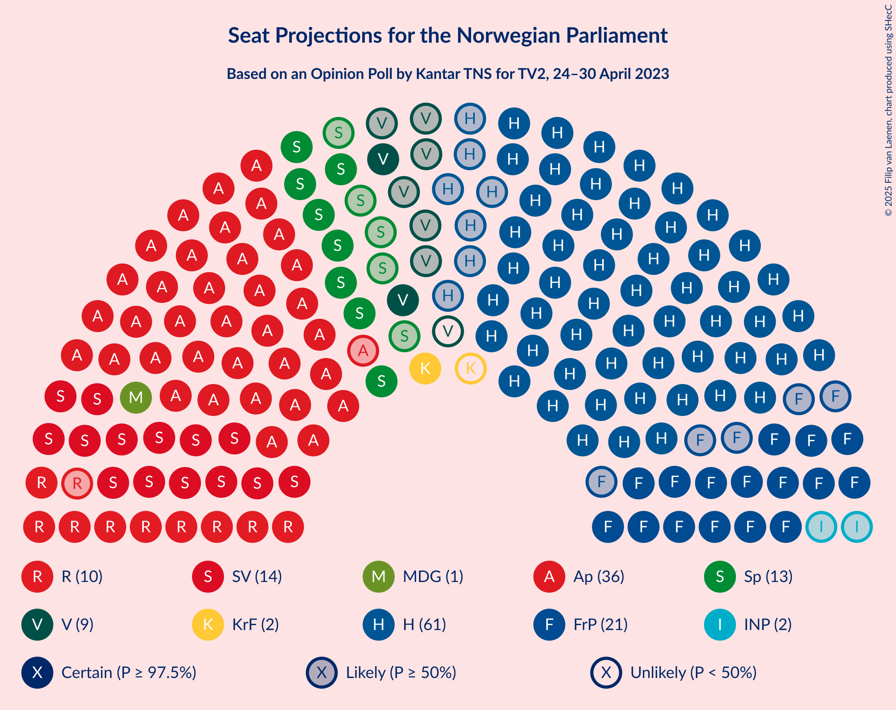

# Opinion Poll by Kantar TNS for TV2, 24–30 April 2023

<a href="#voting-intentions">Voting Intentions</a> | <a href="#seats">Seats</a> | <a href="#coalitions">Coalitions</a> | <a href="#technical-information">Technical Information</a>

## Voting Intentions

### Confidence Intervals

| Party | Last Result | Poll Result | 80% Confidence Interval | 90% Confidence Interval | 95% Confidence Interval | 99% Confidence Interval |
|:-----:|:-----------:|:-----------:|:-----------------------:|:-----------------------:|:-----------------------:|:-----------------------:|
| Høyre | 20.4% | 31.2% | 29.7–32.7% |29.3–33.2% |28.9–33.5% |28.2–34.3% |
| Arbeiderpartiet | 26.2% | 19.8% | 18.5–21.1% |18.2–21.5% |17.9–21.9% |17.3–22.5% |
| Fremskrittspartiet | 11.6% | 10.6% | 9.7–11.7% |9.4–12.0% |9.2–12.3% |8.7–12.8% |
| Sosialistisk Venstreparti | 7.6% | 8.5% | 7.6–9.4% |7.4–9.7% |7.2–10.0% |6.8–10.5% |
| Senterpartiet | 13.5% | 6.3% | 5.5–7.1% |5.3–7.4% |5.2–7.6% |4.8–8.0% |
| Rødt | 4.7% | 5.7% | 5.0–6.5% |4.8–6.8% |4.6–7.0% |4.3–7.4% |
| Venstre | 4.6% | 4.7% | 4.1–5.5% |3.9–5.7% |3.8–5.9% |3.5–6.3% |
| Kristelig Folkeparti | 3.8% | 4.1% | 3.5–4.8% |3.3–5.0% |3.2–5.2% |2.9–5.5% |
| Miljøpartiet De Grønne | 3.9% | 3.6% | 3.1–4.3% |2.9–4.5% |2.8–4.7% |2.6–5.0% |
| Industri- og Næringspartiet | 0.3% | 2.4% | 2.0–3.0% |1.8–3.1% |1.7–3.3% |1.6–3.6% |
| Norgesdemokratene | 1.1% | 1.0% | 0.7–1.4% |0.6–1.5% |0.6–1.6% |0.5–1.8% |
| Konservativt | 0.4% | 0.5% | 0.4–0.9% |0.3–0.9% |0.3–1.0% |0.2–1.2% |
| Pensjonistpartiet | 0.6% | 0.5% | 0.4–0.9% |0.3–0.9% |0.3–1.0% |0.2–1.2% |
| Liberalistene | 0.2% | 0.4% | 0.2–0.7% |0.2–0.8% |0.2–0.9% |0.1–1.0% |
| Folkets parti | 0.1% | 0.2% | 0.1–0.4% |0.1–0.5% |0.1–0.6% |0.0–0.7% |
| Helsepartiet | 0.2% | 0.1% | 0.1–0.4% |0.0–0.4% |0.0–0.5% |0.0–0.6% |

*Note:* The poll result column reflects the actual value used in the calculations. Published results may vary slightly, and in addition be rounded to fewer digits.

## Seats

### Confidence Intervals

| Party | Last Result | Median | 80% Confidence Interval | 90% Confidence Interval | 95% Confidence Interval | 99% Confidence Interval |
|:-----:|:-----------:|:------:|:-----------------------:|:-----------------------:|:-----------------------:|:-----------------------:|
| <a href="#høyre">Høyre</a> | 36 | 61 | 55–61 |54–61 |53–61 |50–62 |
| <a href="#arbeiderpartiet">Arbeiderpartiet</a> | 48 | 36 | 35–43 |35–43 |35–43 |34–44 |
| <a href="#fremskrittspartiet">Fremskrittspartiet</a> | 21 | 21 | 16–21 |16–21 |16–21 |16–24 |
| <a href="#sosialistisk-venstreparti">Sosialistisk Venstreparti</a> | 13 | 14 | 14–17 |14–17 |14–17 |12–18 |
| <a href="#senterpartiet">Senterpartiet</a> | 28 | 13 | 8–13 |8–13 |8–14 |8–14 |
| <a href="#rødt">Rødt</a> | 8 | 10 | 9–12 |9–12 |9–12 |8–12 |
| <a href="#venstre">Venstre</a> | 8 | 9 | 8–9 |7–10 |2–11 |2–11 |
| <a href="#kristelig-folkeparti">Kristelig Folkeparti</a> | 3 | 2 | 2–7 |2–7 |2–9 |2–10 |
| <a href="#miljøpartiet-de-grønne">Miljøpartiet De Grønne</a> | 3 | 1 | 1–3 |1–3 |1–7 |1–8 |
| <a href="#industri--og-næringspartiet">Industri- og Næringspartiet</a> | 0 | 2 | 0–2 |0–2 |0–2 |0–2 |
| <a href="#norgesdemokratene">Norgesdemokratene</a> | 0 | 0 | 0 |0 |0 |0 |
| <a href="#konservativt">Konservativt</a> | 0 | 0 | 0 |0 |0 |0 |
| <a href="#pensjonistpartiet">Pensjonistpartiet</a> | 0 | 0 | 0 |0 |0 |0 |
| <a href="#liberalistene">Liberalistene</a> | 0 | 0 | 0 |0 |0 |0 |
| <a href="#folkets-parti">Folkets parti</a> | 0 | 0 | 0 |0 |0 |0 |
| <a href="#helsepartiet">Helsepartiet</a> | 0 | 0 | 0 |0 |0 |0 |

### Høyre

*For a full overview of the results for this party, see the [Høyre](party-høyre.html) page.*

| Number of Seats | Probability | Accumulated | Special Marks |
|:---------------:|:-----------:|:-----------:|:-------------:|
| 36 | 0% | 100% | Last Result |
| 37 | 0% | 100% |  |
| 38 | 0% | 100% |  |
| 39 | 0% | 100% |  |
| 40 | 0% | 100% |  |
| 41 | 0% | 100% |  |
| 42 | 0% | 100% |  |
| 43 | 0% | 100% |  |
| 44 | 0% | 100% |  |
| 45 | 0% | 100% |  |
| 46 | 0% | 100% |  |
| 47 | 0% | 100% |  |
| 48 | 0% | 100% |  |
| 49 | 0.4% | 100% |  |
| 50 | 0.3% | 99.5% |  |
| 51 | 0.4% | 99.2% |  |
| 52 | 1.0% | 98.8% |  |
| 53 | 2% | 98% |  |
| 54 | 1.1% | 96% |  |
| 55 | 5% | 95% |  |
| 56 | 13% | 90% |  |
| 57 | 25% | 77% |  |
| 58 | 0.7% | 52% |  |
| 59 | 0.1% | 51% |  |
| 60 | 0.4% | 51% |  |
| 61 | 50% | 51% | Median |
| 62 | 0.4% | 0.9% |  |
| 63 | 0.4% | 0.5% |  |
| 64 | 0% | 0.1% |  |
| 65 | 0% | 0.1% |  |
| 66 | 0% | 0% |  |

### Arbeiderpartiet

*For a full overview of the results for this party, see the [Arbeiderpartiet](party-arbeiderpartiet.html) page.*

| Number of Seats | Probability | Accumulated | Special Marks |
|:---------------:|:-----------:|:-----------:|:-------------:|
| 33 | 0.1% | 100% |  |
| 34 | 2% | 99.9% |  |
| 35 | 47% | 98% |  |
| 36 | 0.9% | 51% | Median |
| 37 | 0.2% | 50% |  |
| 38 | 1.1% | 50% |  |
| 39 | 5% | 49% |  |
| 40 | 0.1% | 44% |  |
| 41 | 24% | 44% |  |
| 42 | 0.3% | 19% |  |
| 43 | 16% | 19% |  |
| 44 | 2% | 2% |  |
| 45 | 0.1% | 0.5% |  |
| 46 | 0.3% | 0.4% |  |
| 47 | 0.1% | 0.1% |  |
| 48 | 0% | 0% | Last Result |

### Fremskrittspartiet

*For a full overview of the results for this party, see the [Fremskrittspartiet](party-fremskrittspartiet.html) page.*

| Number of Seats | Probability | Accumulated | Special Marks |
|:---------------:|:-----------:|:-----------:|:-------------:|
| 14 | 0.4% | 100% |  |
| 15 | 0% | 99.6% |  |
| 16 | 21% | 99.6% |  |
| 17 | 2% | 79% |  |
| 18 | 2% | 77% |  |
| 19 | 22% | 74% |  |
| 20 | 0.5% | 52% |  |
| 21 | 51% | 52% | Last Result, Median |
| 22 | 0.5% | 1.4% |  |
| 23 | 0% | 0.9% |  |
| 24 | 0.8% | 0.8% |  |
| 25 | 0% | 0% |  |

### Sosialistisk Venstreparti

*For a full overview of the results for this party, see the [Sosialistisk Venstreparti](party-sosialistiskvenstreparti.html) page.*

| Number of Seats | Probability | Accumulated | Special Marks |
|:---------------:|:-----------:|:-----------:|:-------------:|
| 11 | 0% | 100% |  |
| 12 | 0.8% | 99.9% |  |
| 13 | 0.6% | 99.1% | Last Result |
| 14 | 68% | 98% | Median |
| 15 | 8% | 30% |  |
| 16 | 6% | 23% |  |
| 17 | 16% | 16% |  |
| 18 | 0.5% | 0.5% |  |
| 19 | 0.1% | 0.1% |  |
| 20 | 0% | 0% |  |

### Senterpartiet

*For a full overview of the results for this party, see the [Senterpartiet](party-senterpartiet.html) page.*

| Number of Seats | Probability | Accumulated | Special Marks |
|:---------------:|:-----------:|:-----------:|:-------------:|
| 8 | 12% | 100% |  |
| 9 | 6% | 88% |  |
| 10 | 1.0% | 82% |  |
| 11 | 23% | 81% |  |
| 12 | 6% | 59% |  |
| 13 | 49% | 53% | Median |
| 14 | 4% | 4% |  |
| 15 | 0% | 0.1% |  |
| 16 | 0% | 0% |  |
| 17 | 0% | 0% |  |
| 18 | 0% | 0% |  |
| 19 | 0% | 0% |  |
| 20 | 0% | 0% |  |
| 21 | 0% | 0% |  |
| 22 | 0% | 0% |  |
| 23 | 0% | 0% |  |
| 24 | 0% | 0% |  |
| 25 | 0% | 0% |  |
| 26 | 0% | 0% |  |
| 27 | 0% | 0% |  |
| 28 | 0% | 0% | Last Result |

### Rødt

*For a full overview of the results for this party, see the [Rødt](party-rødt.html) page.*

| Number of Seats | Probability | Accumulated | Special Marks |
|:---------------:|:-----------:|:-----------:|:-------------:|
| 7 | 0.1% | 100% |  |
| 8 | 0.6% | 99.9% | Last Result |
| 9 | 24% | 99.4% |  |
| 10 | 55% | 75% | Median |
| 11 | 7% | 20% |  |
| 12 | 13% | 13% |  |
| 13 | 0.1% | 0.1% |  |
| 14 | 0% | 0% |  |

### Venstre

*For a full overview of the results for this party, see the [Venstre](party-venstre.html) page.*

| Number of Seats | Probability | Accumulated | Special Marks |
|:---------------:|:-----------:|:-----------:|:-------------:|
| 2 | 4% | 100% |  |
| 3 | 0.9% | 96% |  |
| 4 | 0% | 95% |  |
| 5 | 0% | 95% |  |
| 6 | 0% | 95% |  |
| 7 | 1.3% | 95% |  |
| 8 | 40% | 94% | Last Result |
| 9 | 48% | 54% | Median |
| 10 | 1.5% | 6% |  |
| 11 | 5% | 5% |  |
| 12 | 0.1% | 0.2% |  |
| 13 | 0.1% | 0.1% |  |
| 14 | 0% | 0% |  |

### Kristelig Folkeparti

*For a full overview of the results for this party, see the [Kristelig Folkeparti](party-kristeligfolkeparti.html) page.*

| Number of Seats | Probability | Accumulated | Special Marks |
|:---------------:|:-----------:|:-----------:|:-------------:|
| 2 | 60% | 100% | Median |
| 3 | 14% | 40% | Last Result |
| 4 | 0% | 26% |  |
| 5 | 0% | 26% |  |
| 6 | 0% | 26% |  |
| 7 | 21% | 26% |  |
| 8 | 1.2% | 5% |  |
| 9 | 1.4% | 3% |  |
| 10 | 2% | 2% |  |
| 11 | 0% | 0% |  |

### Miljøpartiet De Grønne

*For a full overview of the results for this party, see the [Miljøpartiet De Grønne](party-miljøpartietdegrønne.html) page.*

| Number of Seats | Probability | Accumulated | Special Marks |
|:---------------:|:-----------:|:-----------:|:-------------:|
| 1 | 51% | 100% | Median |
| 2 | 18% | 49% |  |
| 3 | 26% | 31% | Last Result |
| 4 | 0% | 5% |  |
| 5 | 0% | 5% |  |
| 6 | 0% | 5% |  |
| 7 | 3% | 5% |  |
| 8 | 2% | 2% |  |
| 9 | 0.4% | 0.4% |  |
| 10 | 0% | 0% |  |

### Industri- og Næringspartiet

*For a full overview of the results for this party, see the [Industri- og Næringspartiet](party-industri-ognæringspartiet.html) page.*

| Number of Seats | Probability | Accumulated | Special Marks |
|:---------------:|:-----------:|:-----------:|:-------------:|
| 0 | 28% | 100% | Last Result |
| 1 | 0.2% | 72% |  |
| 2 | 72% | 72% | Median |
| 3 | 0.4% | 0.4% |  |
| 4 | 0% | 0% |  |

### Norgesdemokratene

*For a full overview of the results for this party, see the [Norgesdemokratene](party-norgesdemokratene.html) page.*

| Number of Seats | Probability | Accumulated | Special Marks |
|:---------------:|:-----------:|:-----------:|:-------------:|
| 0 | 100% | 100% | Last Result, Median |

### Konservativt

*For a full overview of the results for this party, see the [Konservativt](party-konservativt.html) page.*

| Number of Seats | Probability | Accumulated | Special Marks |
|:---------------:|:-----------:|:-----------:|:-------------:|
| 0 | 100% | 100% | Last Result, Median |

### Pensjonistpartiet

*For a full overview of the results for this party, see the [Pensjonistpartiet](party-pensjonistpartiet.html) page.*

| Number of Seats | Probability | Accumulated | Special Marks |
|:---------------:|:-----------:|:-----------:|:-------------:|
| 0 | 100% | 100% | Last Result, Median |

### Liberalistene

*For a full overview of the results for this party, see the [Liberalistene](party-liberalistene.html) page.*

| Number of Seats | Probability | Accumulated | Special Marks |
|:---------------:|:-----------:|:-----------:|:-------------:|
| 0 | 100% | 100% | Last Result, Median |

### Folkets parti

*For a full overview of the results for this party, see the [Folkets parti](party-folketsparti.html) page.*

| Number of Seats | Probability | Accumulated | Special Marks |
|:---------------:|:-----------:|:-----------:|:-------------:|
| 0 | 100% | 100% | Last Result, Median |

### Helsepartiet

*For a full overview of the results for this party, see the [Helsepartiet](party-helsepartiet.html) page.*

| Number of Seats | Probability | Accumulated | Special Marks |
|:---------------:|:-----------:|:-----------:|:-------------:|
| 0 | 100% | 100% | Last Result, Median |

## Coalitions

### Confidence Intervals

| Coalition | Last Result | Median | Majority? | 80% Confidence Interval | 90% Confidence Interval | 95% Confidence Interval | 99% Confidence Interval |
|:---------:|:-----------:|:------:|:---------:|:-----------------------:|:-----------------------:|:-----------------------:|:-----------------------:|
| Høyre – Fremskrittspartiet – Senterpartiet – Venstre – Kristelig Folkeparti | 96 | 103 | 100% | 94–106 | 94–106 | 94–106 | 92–106 |
| Høyre – Fremskrittspartiet – Venstre – Kristelig Folkeparti – Miljøpartiet De Grønne | 71 | 93 | 99.9% | 88–94 | 87–94 | 86–97 | 86–101 |
| Høyre – Fremskrittspartiet – Venstre – Kristelig Folkeparti | 68 | 90 | 94% | 86–93 | 84–93 | 84–93 | 81–95 |
| Høyre – Fremskrittspartiet – Venstre | 65 | 87 | 53% | 81–91 | 80–91 | 79–91 | 74–91 |
| Arbeiderpartiet – Sosialistisk Venstreparti – Senterpartiet – Rødt – Miljøpartiet De Grønne | 100 | 77 | 2% | 73–82 | 73–84 | 73–84 | 73–87 |
| Arbeiderpartiet – Sosialistisk Venstreparti – Senterpartiet – Rødt | 97 | 74 | 0% | 72–80 | 72–81 | 71–82 | 67–82 |
| Høyre – Fremskrittspartiet | 57 | 80 | 0% | 73–82 | 73–82 | 71–82 | 69–82 |
| Arbeiderpartiet – Sosialistisk Venstreparti – Senterpartiet – Kristelig Folkeparti – Miljøpartiet De Grønne | 95 | 68 | 0% | 65–76 | 65–76 | 65–79 | 65–83 |
| Arbeiderpartiet – Sosialistisk Venstreparti – Senterpartiet – Miljøpartiet De Grønne | 92 | 66 | 0% | 63–72 | 63–74 | 63–74 | 63–78 |
| Arbeiderpartiet – Sosialistisk Venstreparti – Rødt – Miljøpartiet De Grønne | 72 | 65 | 0% | 60–74 | 60–74 | 60–74 | 60–76 |
| Høyre – Venstre – Kristelig Folkeparti | 47 | 72 | 0% | 66–72 | 65–72 | 65–72 | 62–77 |
| Arbeiderpartiet – Sosialistisk Venstreparti – Senterpartiet | 89 | 63 | 0% | 62–69 | 62–71 | 62–72 | 56–72 |
| Arbeiderpartiet – Senterpartiet – Kristelig Folkeparti – Miljøpartiet De Grønne | 82 | 53 | 0% | 51–62 | 51–62 | 51–64 | 51–67 |
| Arbeiderpartiet – Sosialistisk Venstreparti | 61 | 52 | 0% | 49–60 | 49–60 | 49–60 | 47–60 |
| Arbeiderpartiet – Senterpartiet – Kristelig Folkeparti | 79 | 50 | 0% | 50–59 | 50–59 | 50–59 | 49–61 |
| Arbeiderpartiet – Senterpartiet | 76 | 48 | 0% | 48–55 | 48–55 | 47–55 | 44–55 |
| Senterpartiet – Venstre – Kristelig Folkeparti | 39 | 24 | 0% | 19–26 | 19–26 | 18–29 | 17–31 |

### Høyre – Fremskrittspartiet – Senterpartiet – Venstre – Kristelig Folkeparti

| Number of Seats | Probability | Accumulated | Special Marks |
|:---------------:|:-----------:|:-----------:|:-------------:|
| 88 | 0.4% | 100% |  |
| 89 | 0% | 99.6% |  |
| 90 | 0% | 99.6% |  |
| 91 | 0% | 99.6% |  |
| 92 | 1.1% | 99.5% |  |
| 93 | 0.4% | 98% |  |
| 94 | 12% | 98% |  |
| 95 | 0.1% | 86% |  |
| 96 | 0.2% | 86% | Last Result |
| 97 | 0.7% | 86% |  |
| 98 | 13% | 85% |  |
| 99 | 21% | 72% |  |
| 100 | 0% | 51% |  |
| 101 | 0.1% | 51% |  |
| 102 | 0.7% | 51% |  |
| 103 | 4% | 50% |  |
| 104 | 0.4% | 47% |  |
| 105 | 0% | 46% |  |
| 106 | 46% | 46% | Median |
| 107 | 0.1% | 0.2% |  |
| 108 | 0.1% | 0.1% |  |
| 109 | 0% | 0.1% |  |
| 110 | 0% | 0% |  |

### Høyre – Fremskrittspartiet – Venstre – Kristelig Folkeparti – Miljøpartiet De Grønne

| Number of Seats | Probability | Accumulated | Special Marks |
|:---------------:|:-----------:|:-----------:|:-------------:|
| 71 | 0% | 100% | Last Result |
| 72 | 0% | 100% |  |
| 73 | 0% | 100% |  |
| 74 | 0% | 100% |  |
| 75 | 0% | 100% |  |
| 76 | 0% | 100% |  |
| 77 | 0% | 100% |  |
| 78 | 0% | 100% |  |
| 79 | 0% | 100% |  |
| 80 | 0% | 100% |  |
| 81 | 0% | 100% |  |
| 82 | 0% | 100% |  |
| 83 | 0% | 100% |  |
| 84 | 0.1% | 100% |  |
| 85 | 0% | 99.9% | Majority |
| 86 | 4% | 99.9% |  |
| 87 | 5% | 96% |  |
| 88 | 12% | 91% |  |
| 89 | 1.1% | 79% |  |
| 90 | 0.7% | 78% |  |
| 91 | 21% | 77% |  |
| 92 | 6% | 56% |  |
| 93 | 0.5% | 50% |  |
| 94 | 47% | 49% | Median |
| 95 | 0% | 3% |  |
| 96 | 0.2% | 3% |  |
| 97 | 2% | 3% |  |
| 98 | 0% | 0.7% |  |
| 99 | 0.1% | 0.7% |  |
| 100 | 0% | 0.6% |  |
| 101 | 0.5% | 0.6% |  |
| 102 | 0% | 0% |  |

### Høyre – Fremskrittspartiet – Venstre – Kristelig Folkeparti

| Number of Seats | Probability | Accumulated | Special Marks |
|:---------------:|:-----------:|:-----------:|:-------------:|
| 68 | 0% | 100% | Last Result |
| 69 | 0% | 100% |  |
| 70 | 0% | 100% |  |
| 71 | 0% | 100% |  |
| 72 | 0% | 100% |  |
| 73 | 0% | 100% |  |
| 74 | 0% | 100% |  |
| 75 | 0% | 100% |  |
| 76 | 0% | 100% |  |
| 77 | 0.4% | 100% |  |
| 78 | 0% | 99.6% |  |
| 79 | 0% | 99.6% |  |
| 80 | 0% | 99.5% |  |
| 81 | 1.0% | 99.5% |  |
| 82 | 0.4% | 98.6% |  |
| 83 | 0.1% | 98% |  |
| 84 | 4% | 98% |  |
| 85 | 0.3% | 94% | Majority |
| 86 | 17% | 94% |  |
| 87 | 0.5% | 77% |  |
| 88 | 21% | 76% |  |
| 89 | 5% | 56% |  |
| 90 | 3% | 50% |  |
| 91 | 0.4% | 48% |  |
| 92 | 0.1% | 47% |  |
| 93 | 46% | 47% | Median |
| 94 | 0.5% | 1.1% |  |
| 95 | 0.4% | 0.5% |  |
| 96 | 0.1% | 0.1% |  |
| 97 | 0% | 0.1% |  |
| 98 | 0% | 0% |  |

### Høyre – Fremskrittspartiet – Venstre

| Number of Seats | Probability | Accumulated | Special Marks |
|:---------------:|:-----------:|:-----------:|:-------------:|
| 65 | 0% | 100% | Last Result |
| 66 | 0% | 100% |  |
| 67 | 0% | 100% |  |
| 68 | 0% | 100% |  |
| 69 | 0% | 100% |  |
| 70 | 0% | 100% |  |
| 71 | 0% | 100% |  |
| 72 | 0% | 100% |  |
| 73 | 0% | 100% |  |
| 74 | 0.6% | 99.9% |  |
| 75 | 0% | 99.3% |  |
| 76 | 0.2% | 99.3% |  |
| 77 | 0.3% | 99.2% |  |
| 78 | 0.2% | 98.8% |  |
| 79 | 1.3% | 98.7% |  |
| 80 | 3% | 97% |  |
| 81 | 21% | 95% |  |
| 82 | 4% | 74% |  |
| 83 | 13% | 70% |  |
| 84 | 5% | 58% |  |
| 85 | 0.6% | 53% | Majority |
| 86 | 0.2% | 52% |  |
| 87 | 6% | 52% |  |
| 88 | 0.1% | 46% |  |
| 89 | 0.1% | 46% |  |
| 90 | 0.1% | 46% |  |
| 91 | 46% | 46% | Median |
| 92 | 0% | 0% |  |

### Arbeiderpartiet – Sosialistisk Venstreparti – Senterpartiet – Rødt – Miljøpartiet De Grønne

| Number of Seats | Probability | Accumulated | Special Marks |
|:---------------:|:-----------:|:-----------:|:-------------:|
| 70 | 0.3% | 100% |  |
| 71 | 0% | 99.7% |  |
| 72 | 0.2% | 99.7% |  |
| 73 | 46% | 99.5% |  |
| 74 | 0.5% | 53% | Median |
| 75 | 0.1% | 53% |  |
| 76 | 0.1% | 53% |  |
| 77 | 5% | 53% |  |
| 78 | 23% | 48% |  |
| 79 | 0.7% | 24% |  |
| 80 | 0% | 24% |  |
| 81 | 0.7% | 24% |  |
| 82 | 17% | 23% |  |
| 83 | 0% | 6% |  |
| 84 | 4% | 6% |  |
| 85 | 0.1% | 2% | Majority |
| 86 | 0.4% | 2% |  |
| 87 | 1.0% | 1.4% |  |
| 88 | 0% | 0.5% |  |
| 89 | 0% | 0.4% |  |
| 90 | 0% | 0.4% |  |
| 91 | 0.4% | 0.4% |  |
| 92 | 0% | 0% |  |
| 93 | 0% | 0% |  |
| 94 | 0% | 0% |  |
| 95 | 0% | 0% |  |
| 96 | 0% | 0% |  |
| 97 | 0% | 0% |  |
| 98 | 0% | 0% |  |
| 99 | 0% | 0% |  |
| 100 | 0% | 0% | Last Result |

### Arbeiderpartiet – Sosialistisk Venstreparti – Senterpartiet – Rødt

| Number of Seats | Probability | Accumulated | Special Marks |
|:---------------:|:-----------:|:-----------:|:-------------:|
| 65 | 0% | 100% |  |
| 66 | 0% | 99.9% |  |
| 67 | 0.5% | 99.9% |  |
| 68 | 0.3% | 99.4% |  |
| 69 | 0.1% | 99.2% |  |
| 70 | 0% | 99.1% |  |
| 71 | 2% | 99.0% |  |
| 72 | 46% | 97% |  |
| 73 | 0% | 51% | Median |
| 74 | 5% | 51% |  |
| 75 | 21% | 46% |  |
| 76 | 2% | 25% |  |
| 77 | 0.3% | 23% |  |
| 78 | 0.7% | 23% |  |
| 79 | 1.4% | 22% |  |
| 80 | 12% | 21% |  |
| 81 | 4% | 9% |  |
| 82 | 4% | 4% |  |
| 83 | 0% | 0.1% |  |
| 84 | 0.1% | 0.1% |  |
| 85 | 0% | 0% | Majority |
| 86 | 0% | 0% |  |
| 87 | 0% | 0% |  |
| 88 | 0% | 0% |  |
| 89 | 0% | 0% |  |
| 90 | 0% | 0% |  |
| 91 | 0% | 0% |  |
| 92 | 0% | 0% |  |
| 93 | 0% | 0% |  |
| 94 | 0% | 0% |  |
| 95 | 0% | 0% |  |
| 96 | 0% | 0% |  |
| 97 | 0% | 0% | Last Result |

### Høyre – Fremskrittspartiet

| Number of Seats | Probability | Accumulated | Special Marks |
|:---------------:|:-----------:|:-----------:|:-------------:|
| 57 | 0% | 100% | Last Result |
| 58 | 0% | 100% |  |
| 59 | 0% | 100% |  |
| 60 | 0% | 100% |  |
| 61 | 0% | 100% |  |
| 62 | 0% | 100% |  |
| 63 | 0% | 100% |  |
| 64 | 0% | 100% |  |
| 65 | 0% | 100% |  |
| 66 | 0% | 100% |  |
| 67 | 0% | 100% |  |
| 68 | 0% | 99.9% |  |
| 69 | 1.4% | 99.9% |  |
| 70 | 0.3% | 98.5% |  |
| 71 | 0.9% | 98% |  |
| 72 | 2% | 97% |  |
| 73 | 22% | 96% |  |
| 74 | 0% | 74% |  |
| 75 | 12% | 74% |  |
| 76 | 10% | 62% |  |
| 77 | 0% | 52% |  |
| 78 | 1.2% | 52% |  |
| 79 | 0% | 50% |  |
| 80 | 4% | 50% |  |
| 81 | 0.5% | 47% |  |
| 82 | 46% | 46% | Median |
| 83 | 0% | 0.1% |  |
| 84 | 0% | 0.1% |  |
| 85 | 0% | 0% | Majority |

### Arbeiderpartiet – Sosialistisk Venstreparti – Senterpartiet – Kristelig Folkeparti – Miljøpartiet De Grønne

| Number of Seats | Probability | Accumulated | Special Marks |
|:---------------:|:-----------:|:-----------:|:-------------:|
| 65 | 46% | 100% |  |
| 66 | 0.3% | 54% | Median |
| 67 | 0% | 54% |  |
| 68 | 5% | 54% |  |
| 69 | 0.1% | 49% |  |
| 70 | 0.9% | 49% |  |
| 71 | 0.2% | 48% |  |
| 72 | 0.6% | 48% |  |
| 73 | 12% | 47% |  |
| 74 | 4% | 35% |  |
| 75 | 1.0% | 31% |  |
| 76 | 25% | 30% |  |
| 77 | 0.6% | 5% |  |
| 78 | 0.2% | 4% |  |
| 79 | 2% | 4% |  |
| 80 | 1.2% | 2% |  |
| 81 | 0.3% | 1.1% |  |
| 82 | 0.1% | 0.8% |  |
| 83 | 0.6% | 0.7% |  |
| 84 | 0% | 0% |  |
| 85 | 0% | 0% | Majority |
| 86 | 0% | 0% |  |
| 87 | 0% | 0% |  |
| 88 | 0% | 0% |  |
| 89 | 0% | 0% |  |
| 90 | 0% | 0% |  |
| 91 | 0% | 0% |  |
| 92 | 0% | 0% |  |
| 93 | 0% | 0% |  |
| 94 | 0% | 0% |  |
| 95 | 0% | 0% | Last Result |

### Arbeiderpartiet – Sosialistisk Venstreparti – Senterpartiet – Miljøpartiet De Grønne

| Number of Seats | Probability | Accumulated | Special Marks |
|:---------------:|:-----------:|:-----------:|:-------------:|
| 58 | 0.3% | 100% |  |
| 59 | 0% | 99.7% |  |
| 60 | 0% | 99.7% |  |
| 61 | 0.2% | 99.7% |  |
| 62 | 0% | 99.5% |  |
| 63 | 47% | 99.5% |  |
| 64 | 0% | 53% | Median |
| 65 | 0.1% | 53% |  |
| 66 | 5% | 53% |  |
| 67 | 1.2% | 48% |  |
| 68 | 0.7% | 47% |  |
| 69 | 23% | 46% |  |
| 70 | 12% | 23% |  |
| 71 | 0% | 11% |  |
| 72 | 5% | 11% |  |
| 73 | 0.7% | 6% |  |
| 74 | 4% | 5% |  |
| 75 | 0% | 2% |  |
| 76 | 0.1% | 2% |  |
| 77 | 0.3% | 2% |  |
| 78 | 1.0% | 1.4% |  |
| 79 | 0% | 0.4% |  |
| 80 | 0.4% | 0.4% |  |
| 81 | 0% | 0% |  |
| 82 | 0% | 0% |  |
| 83 | 0% | 0% |  |
| 84 | 0% | 0% |  |
| 85 | 0% | 0% | Majority |
| 86 | 0% | 0% |  |
| 87 | 0% | 0% |  |
| 88 | 0% | 0% |  |
| 89 | 0% | 0% |  |
| 90 | 0% | 0% |  |
| 91 | 0% | 0% |  |
| 92 | 0% | 0% | Last Result |

### Arbeiderpartiet – Sosialistisk Venstreparti – Rødt – Miljøpartiet De Grønne

| Number of Seats | Probability | Accumulated | Special Marks |
|:---------------:|:-----------:|:-----------:|:-------------:|
| 59 | 0% | 100% |  |
| 60 | 46% | 99.9% |  |
| 61 | 0.3% | 54% | Median |
| 62 | 0.2% | 54% |  |
| 63 | 0.1% | 53% |  |
| 64 | 0.1% | 53% |  |
| 65 | 4% | 53% |  |
| 66 | 0.6% | 50% |  |
| 67 | 21% | 49% |  |
| 68 | 5% | 28% |  |
| 69 | 0.3% | 24% |  |
| 70 | 9% | 23% |  |
| 71 | 0.3% | 15% |  |
| 72 | 0.1% | 14% | Last Result |
| 73 | 0.2% | 14% |  |
| 74 | 12% | 14% |  |
| 75 | 0.4% | 2% |  |
| 76 | 1.0% | 1.5% |  |
| 77 | 0% | 0.4% |  |
| 78 | 0% | 0.4% |  |
| 79 | 0% | 0.4% |  |
| 80 | 0.4% | 0.4% |  |
| 81 | 0% | 0% |  |

### Høyre – Venstre – Kristelig Folkeparti

| Number of Seats | Probability | Accumulated | Special Marks |
|:---------------:|:-----------:|:-----------:|:-------------:|
| 47 | 0% | 100% | Last Result |
| 48 | 0% | 100% |  |
| 49 | 0% | 100% |  |
| 50 | 0% | 100% |  |
| 51 | 0% | 100% |  |
| 52 | 0% | 100% |  |
| 53 | 0% | 100% |  |
| 54 | 0% | 100% |  |
| 55 | 0.4% | 100% |  |
| 56 | 0% | 99.6% |  |
| 57 | 0% | 99.6% |  |
| 58 | 0% | 99.6% |  |
| 59 | 0% | 99.6% |  |
| 60 | 0% | 99.6% |  |
| 61 | 0% | 99.6% |  |
| 62 | 0% | 99.5% |  |
| 63 | 0.1% | 99.5% |  |
| 64 | 1.4% | 99.4% |  |
| 65 | 8% | 98% |  |
| 66 | 0.9% | 90% |  |
| 67 | 13% | 89% |  |
| 68 | 0.5% | 76% |  |
| 69 | 0.1% | 76% |  |
| 70 | 5% | 76% |  |
| 71 | 2% | 71% |  |
| 72 | 68% | 69% | Median |
| 73 | 0.1% | 2% |  |
| 74 | 0.1% | 1.5% |  |
| 75 | 0% | 1.4% |  |
| 76 | 0.5% | 1.4% |  |
| 77 | 0.8% | 0.9% |  |
| 78 | 0.1% | 0.1% |  |
| 79 | 0% | 0% |  |

### Arbeiderpartiet – Sosialistisk Venstreparti – Senterpartiet

| Number of Seats | Probability | Accumulated | Special Marks |
|:---------------:|:-----------:|:-----------:|:-------------:|
| 56 | 0.8% | 100% |  |
| 57 | 0% | 99.2% |  |
| 58 | 0.1% | 99.2% |  |
| 59 | 0.1% | 99.1% |  |
| 60 | 0.1% | 99.1% |  |
| 61 | 0% | 98.9% |  |
| 62 | 48% | 98.9% |  |
| 63 | 5% | 51% | Median |
| 64 | 0.5% | 46% |  |
| 65 | 2% | 46% |  |
| 66 | 21% | 44% |  |
| 67 | 0.2% | 23% |  |
| 68 | 12% | 22% |  |
| 69 | 0.4% | 10% |  |
| 70 | 1.0% | 10% |  |
| 71 | 5% | 9% |  |
| 72 | 4% | 4% |  |
| 73 | 0% | 0.1% |  |
| 74 | 0.1% | 0.1% |  |
| 75 | 0% | 0% |  |
| 76 | 0% | 0% |  |
| 77 | 0% | 0% |  |
| 78 | 0% | 0% |  |
| 79 | 0% | 0% |  |
| 80 | 0% | 0% |  |
| 81 | 0% | 0% |  |
| 82 | 0% | 0% |  |
| 83 | 0% | 0% |  |
| 84 | 0% | 0% |  |
| 85 | 0% | 0% | Majority |
| 86 | 0% | 0% |  |
| 87 | 0% | 0% |  |
| 88 | 0% | 0% |  |
| 89 | 0% | 0% | Last Result |

### Arbeiderpartiet – Senterpartiet – Kristelig Folkeparti – Miljøpartiet De Grønne

| Number of Seats | Probability | Accumulated | Special Marks |
|:---------------:|:-----------:|:-----------:|:-------------:|
| 49 | 0.1% | 100% |  |
| 50 | 0% | 99.9% |  |
| 51 | 46% | 99.9% |  |
| 52 | 0% | 54% | Median |
| 53 | 5% | 54% |  |
| 54 | 0.8% | 49% |  |
| 55 | 0.2% | 48% |  |
| 56 | 12% | 48% |  |
| 57 | 0.5% | 36% |  |
| 58 | 4% | 35% |  |
| 59 | 4% | 31% |  |
| 60 | 1.0% | 27% |  |
| 61 | 0.4% | 26% |  |
| 62 | 21% | 26% |  |
| 63 | 0.7% | 5% |  |
| 64 | 2% | 4% |  |
| 65 | 1.0% | 2% |  |
| 66 | 0.3% | 1.4% |  |
| 67 | 0.8% | 1.1% |  |
| 68 | 0.3% | 0.3% |  |
| 69 | 0% | 0% |  |
| 70 | 0% | 0% |  |
| 71 | 0% | 0% |  |
| 72 | 0% | 0% |  |
| 73 | 0% | 0% |  |
| 74 | 0% | 0% |  |
| 75 | 0% | 0% |  |
| 76 | 0% | 0% |  |
| 77 | 0% | 0% |  |
| 78 | 0% | 0% |  |
| 79 | 0% | 0% |  |
| 80 | 0% | 0% |  |
| 81 | 0% | 0% |  |
| 82 | 0% | 0% | Last Result |

### Arbeiderpartiet – Sosialistisk Venstreparti

| Number of Seats | Probability | Accumulated | Special Marks |
|:---------------:|:-----------:|:-----------:|:-------------:|
| 47 | 0.8% | 100% |  |
| 48 | 0.1% | 99.2% |  |
| 49 | 48% | 99.0% |  |
| 50 | 0.1% | 51% | Median |
| 51 | 0.1% | 51% |  |
| 52 | 2% | 51% |  |
| 53 | 0.5% | 49% |  |
| 54 | 5% | 49% |  |
| 55 | 21% | 44% |  |
| 56 | 0.6% | 23% |  |
| 57 | 0.1% | 22% |  |
| 58 | 4% | 22% |  |
| 59 | 6% | 18% |  |
| 60 | 12% | 13% |  |
| 61 | 0% | 0.2% | Last Result |
| 62 | 0.1% | 0.2% |  |
| 63 | 0% | 0.1% |  |
| 64 | 0.1% | 0.1% |  |
| 65 | 0% | 0% |  |

### Arbeiderpartiet – Senterpartiet – Kristelig Folkeparti

| Number of Seats | Probability | Accumulated | Special Marks |
|:---------------:|:-----------:|:-----------:|:-------------:|
| 48 | 0.1% | 100% |  |
| 49 | 0.4% | 99.9% |  |
| 50 | 51% | 99.5% |  |
| 51 | 0.3% | 49% | Median |
| 52 | 0.9% | 49% |  |
| 53 | 0.5% | 48% |  |
| 54 | 12% | 47% |  |
| 55 | 0.2% | 35% |  |
| 56 | 0% | 34% |  |
| 57 | 11% | 34% |  |
| 58 | 1.1% | 24% |  |
| 59 | 21% | 23% |  |
| 60 | 0.8% | 2% |  |
| 61 | 0.3% | 0.7% |  |
| 62 | 0% | 0.4% |  |
| 63 | 0% | 0.4% |  |
| 64 | 0.1% | 0.4% |  |
| 65 | 0% | 0.3% |  |
| 66 | 0.3% | 0.3% |  |
| 67 | 0% | 0% |  |
| 68 | 0% | 0% |  |
| 69 | 0% | 0% |  |
| 70 | 0% | 0% |  |
| 71 | 0% | 0% |  |
| 72 | 0% | 0% |  |
| 73 | 0% | 0% |  |
| 74 | 0% | 0% |  |
| 75 | 0% | 0% |  |
| 76 | 0% | 0% |  |
| 77 | 0% | 0% |  |
| 78 | 0% | 0% |  |
| 79 | 0% | 0% | Last Result |

### Arbeiderpartiet – Senterpartiet

| Number of Seats | Probability | Accumulated | Special Marks |
|:---------------:|:-----------:|:-----------:|:-------------:|
| 43 | 0.3% | 100% |  |
| 44 | 0.5% | 99.7% |  |
| 45 | 0.2% | 99.2% |  |
| 46 | 0.6% | 99.0% |  |
| 47 | 2% | 98% |  |
| 48 | 51% | 97% |  |
| 49 | 1.2% | 46% | Median |
| 50 | 0.7% | 45% |  |
| 51 | 13% | 44% |  |
| 52 | 21% | 32% |  |
| 53 | 0.1% | 11% |  |
| 54 | 0.4% | 10% |  |
| 55 | 10% | 10% |  |
| 56 | 0.1% | 0.5% |  |
| 57 | 0.1% | 0.4% |  |
| 58 | 0.3% | 0.3% |  |
| 59 | 0% | 0% |  |
| 60 | 0% | 0% |  |
| 61 | 0% | 0% |  |
| 62 | 0% | 0% |  |
| 63 | 0% | 0% |  |
| 64 | 0% | 0% |  |
| 65 | 0% | 0% |  |
| 66 | 0% | 0% |  |
| 67 | 0% | 0% |  |
| 68 | 0% | 0% |  |
| 69 | 0% | 0% |  |
| 70 | 0% | 0% |  |
| 71 | 0% | 0% |  |
| 72 | 0% | 0% |  |
| 73 | 0% | 0% |  |
| 74 | 0% | 0% |  |
| 75 | 0% | 0% |  |
| 76 | 0% | 0% | Last Result |

### Senterpartiet – Venstre – Kristelig Folkeparti

| Number of Seats | Probability | Accumulated | Special Marks |
|:---------------:|:-----------:|:-----------:|:-------------:|
| 17 | 0.8% | 100% |  |
| 18 | 4% | 99.2% |  |
| 19 | 12% | 96% |  |
| 20 | 0.1% | 84% |  |
| 21 | 0.3% | 83% |  |
| 22 | 9% | 83% |  |
| 23 | 1.4% | 74% |  |
| 24 | 46% | 72% | Median |
| 25 | 0.9% | 26% |  |
| 26 | 21% | 25% |  |
| 27 | 1.2% | 4% |  |
| 28 | 0.4% | 3% |  |
| 29 | 0.7% | 3% |  |
| 30 | 0.1% | 2% |  |
| 31 | 2% | 2% |  |
| 32 | 0% | 0.1% |  |
| 33 | 0% | 0.1% |  |
| 34 | 0% | 0.1% |  |
| 35 | 0.1% | 0.1% |  |
| 36 | 0% | 0% |  |
| 37 | 0% | 0% |  |
| 38 | 0% | 0% |  |
| 39 | 0% | 0% | Last Result |

## Technical Information

### Opinion Poll

+ **Polling firm:** Kantar TNS
+ **Commissioner(s):** TV2
+ **Fieldwork period:** 24–30 April 2023

### Calculations

+ **Sample size:** 1546
+ **Simulations done:** 1,048,576
+ **Error estimate:** 2.77%

