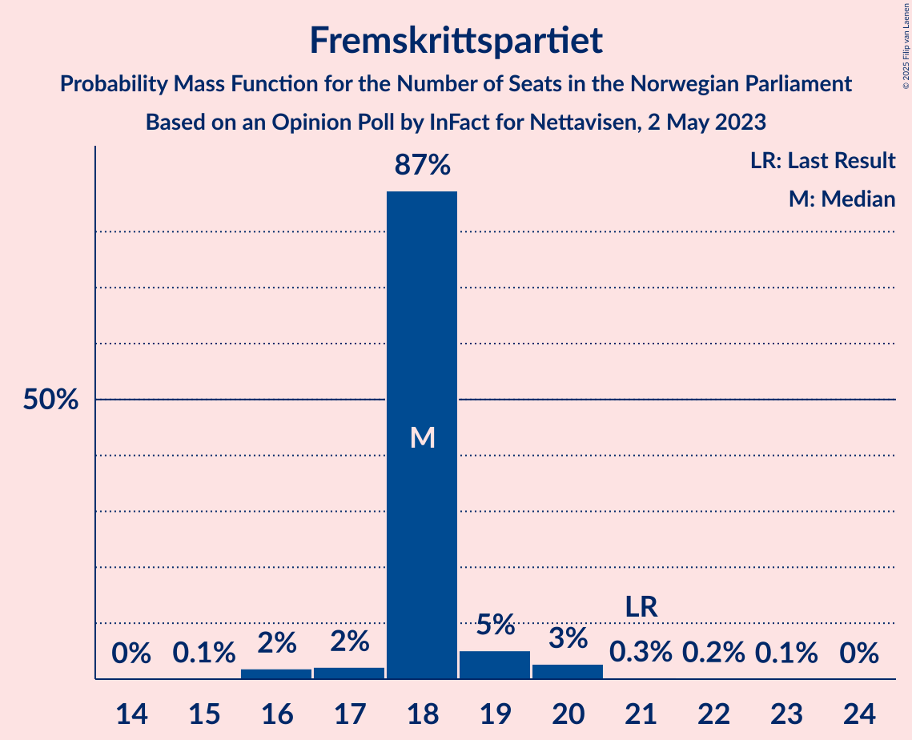
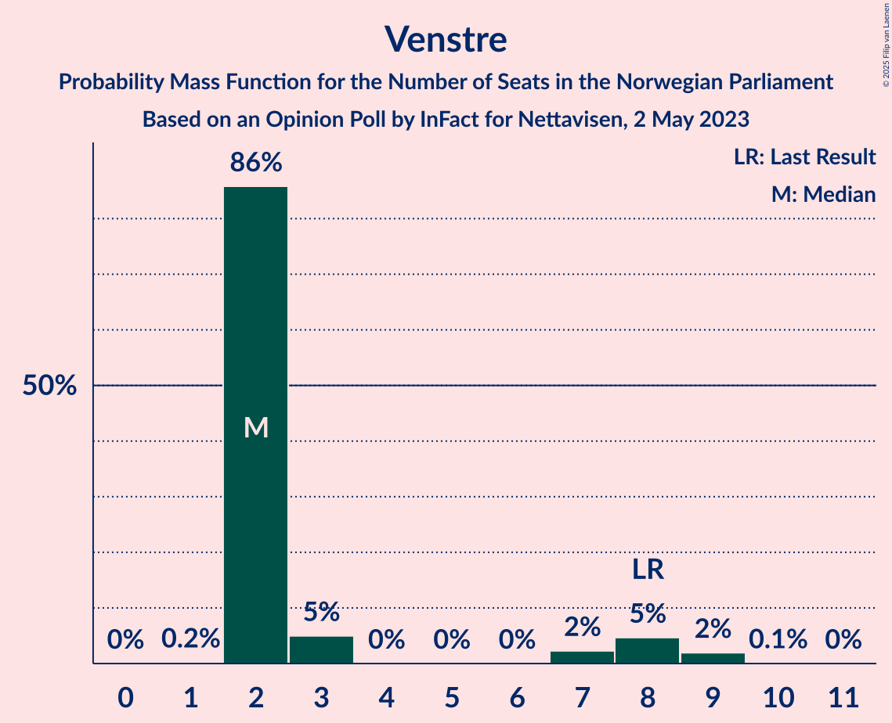
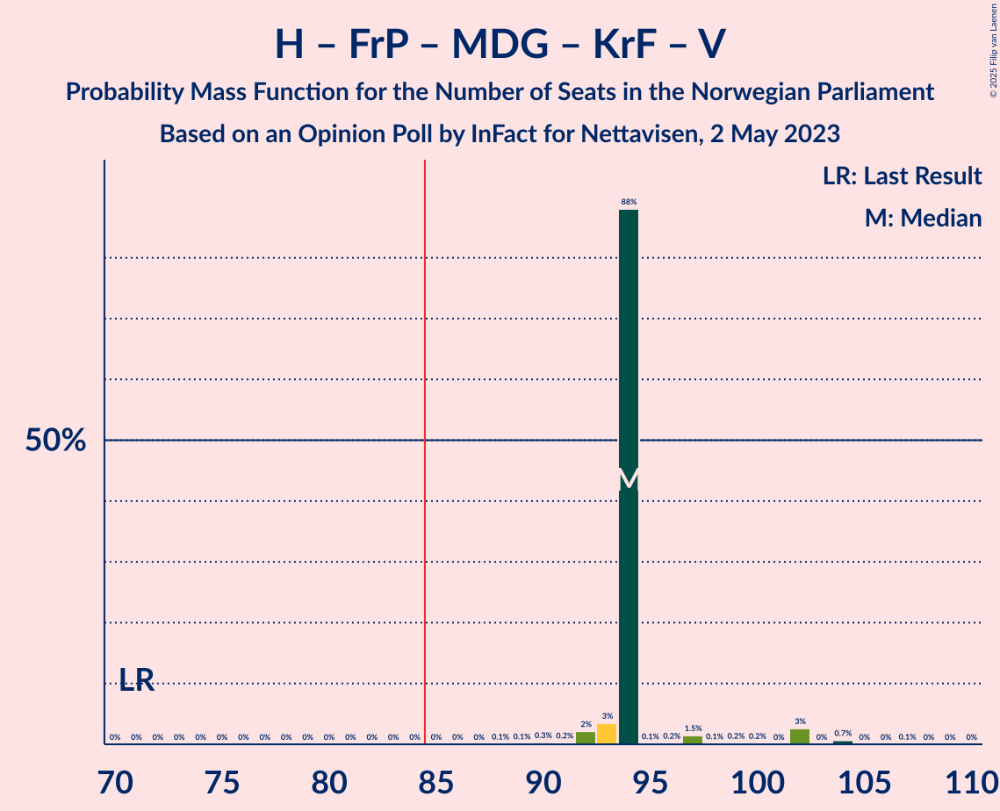

# Opinion Poll by InFact for Nettavisen, 2 May 2023

<a href="#voting-intentions">Voting Intentions</a> | <a href="#seats">Seats</a> | <a href="#coalitions">Coalitions</a> | <a href="#technical-information">Technical Information</a>

## Voting Intentions

### Confidence Intervals

| Party | Last Result | Poll Result | 80% Confidence Interval | 90% Confidence Interval | 95% Confidence Interval | 99% Confidence Interval |
|:-----:|:-----------:|:-----------:|:-----------------------:|:-----------------------:|:-----------------------:|:-----------------------:|
| Høyre | 20.4% | 32.0% | 30.2–34.0% |29.7–34.5% |29.2–35.0% |28.3–35.9% |
| Arbeiderpartiet | 26.2% | 18.8% | 17.3–20.5% |16.9–20.9% |16.5–21.4% |15.8–22.2% |
| Fremskrittspartiet | 11.6% | 10.8% | 9.7–12.2% |9.3–12.6% |9.1–12.9% |8.5–13.6% |
| Sosialistisk Venstreparti | 7.6% | 9.1% | 8.0–10.3% |7.7–10.7% |7.4–11.0% |7.0–11.6% |
| Senterpartiet | 13.5% | 6.5% | 5.6–7.6% |5.3–7.9% |5.1–8.2% |4.7–8.7% |
| Rødt | 4.7% | 5.1% | 4.3–6.1% |4.1–6.4% |3.9–6.6% |3.5–7.1% |
| Miljøpartiet De Grønne | 3.9% | 4.9% | 4.1–5.9% |3.9–6.1% |3.7–6.4% |3.4–6.9% |
| Kristelig Folkeparti | 3.8% | 4.2% | 3.5–5.1% |3.3–5.4% |3.1–5.6% |2.8–6.1% |
| Venstre | 4.6% | 3.7% | 3.0–4.6% |2.8–4.8% |2.7–5.0% |2.4–5.5% |
| Industri- og Næringspartiet | 0.3% | 1.8% | 1.4–2.5% |1.2–2.7% |1.1–2.8% |1.0–3.2% |
| Konservativt | 0.4% | 0.9% | 0.6–1.4% |0.5–1.6% |0.5–1.7% |0.4–2.0% |
| Norgesdemokratene | 1.1% | 0.8% | 0.5–1.3% |0.5–1.4% |0.4–1.6% |0.3–1.8% |
| Folkets parti | 0.1% | 0.3% | 0.2–0.7% |0.1–0.8% |0.1–0.9% |0.1–1.1% |
| Liberalistene | 0.2% | 0.2% | 0.1–0.5% |0.1–0.6% |0.1–0.7% |0.0–0.9% |
| Helsepartiet | 0.2% | 0.2% | 0.1–0.5% |0.1–0.6% |0.1–0.7% |0.0–0.9% |

*Note:* The poll result column reflects the actual value used in the calculations. Published results may vary slightly, and in addition be rounded to fewer digits.

## Seats

### Confidence Intervals

| Party | Last Result | Median | 80% Confidence Interval | 90% Confidence Interval | 95% Confidence Interval | 99% Confidence Interval |
|:-----:|:-----------:|:------:|:-----------------------:|:-----------------------:|:-----------------------:|:-----------------------:|
| <a href="#høyre">Høyre</a> | 36 | 58 | 58 |56–61 |56–62 |53–67 |
| <a href="#arbeiderpartiet">Arbeiderpartiet</a> | 48 | 39 | 38–39 |36–39 |33–39 |32–40 |
| <a href="#fremskrittspartiet">Fremskrittspartiet</a> | 21 | 18 | 18 |18–19 |17–20 |16–21 |
| <a href="#sosialistisk-venstreparti">Sosialistisk Venstreparti</a> | 13 | 18 | 17–18 |13–18 |12–18 |12–18 |
| <a href="#senterpartiet">Senterpartiet</a> | 28 | 9 | 9–11 |9–14 |9–14 |8–15 |
| <a href="#rødt">Rødt</a> | 8 | 8 | 8 |8–10 |8–10 |1–11 |
| <a href="#miljøpartiet-de-grønne">Miljøpartiet De Grønne</a> | 3 | 7 | 7–8 |7–9 |3–9 |2–10 |
| <a href="#kristelig-folkeparti">Kristelig Folkeparti</a> | 3 | 9 | 7–9 |3–9 |2–10 |2–11 |
| <a href="#venstre">Venstre</a> | 8 | 2 | 2–3 |2–8 |2–8 |2–9 |
| <a href="#industri--og-næringspartiet">Industri- og Næringspartiet</a> | 0 | 0 | 0 |0 |0 |0–2 |
| <a href="#konservativt">Konservativt</a> | 0 | 0 | 0 |0 |0 |0 |
| <a href="#norgesdemokratene">Norgesdemokratene</a> | 0 | 0 | 0 |0 |0 |0 |
| <a href="#folkets-parti">Folkets parti</a> | 0 | 0 | 0 |0 |0 |0 |
| <a href="#liberalistene">Liberalistene</a> | 0 | 0 | 0 |0 |0 |0 |
| <a href="#helsepartiet">Helsepartiet</a> | 0 | 0 | 0 |0 |0 |0 |

### Høyre

*For a full overview of the results for this party, see the [Høyre](party-høyre.html) page.*

| Number of Seats | Probability | Accumulated | Special Marks |
|:---------------:|:-----------:|:-----------:|:-------------:|
| 36 | 0% | 100% | Last Result |
| 37 | 0% | 100% |  |
| 38 | 0% | 100% |  |
| 39 | 0% | 100% |  |
| 40 | 0% | 100% |  |
| 41 | 0% | 100% |  |
| 42 | 0% | 100% |  |
| 43 | 0% | 100% |  |
| 44 | 0% | 100% |  |
| 45 | 0% | 100% |  |
| 46 | 0% | 100% |  |
| 47 | 0% | 100% |  |
| 48 | 0% | 100% |  |
| 49 | 0% | 100% |  |
| 50 | 0.1% | 100% |  |
| 51 | 0.2% | 99.8% |  |
| 52 | 0% | 99.6% |  |
| 53 | 2% | 99.6% |  |
| 54 | 0.2% | 98% |  |
| 55 | 0.1% | 98% |  |
| 56 | 3% | 98% |  |
| 57 | 2% | 94% |  |
| 58 | 86% | 93% | Median |
| 59 | 0.2% | 6% |  |
| 60 | 0.2% | 6% |  |
| 61 | 2% | 6% |  |
| 62 | 2% | 4% |  |
| 63 | 0.1% | 1.4% |  |
| 64 | 0.1% | 1.3% |  |
| 65 | 0% | 1.2% |  |
| 66 | 0.3% | 1.2% |  |
| 67 | 1.0% | 1.0% |  |
| 68 | 0% | 0% |  |

### Arbeiderpartiet

*For a full overview of the results for this party, see the [Arbeiderpartiet](party-arbeiderpartiet.html) page.*

| Number of Seats | Probability | Accumulated | Special Marks |
|:---------------:|:-----------:|:-----------:|:-------------:|
| 31 | 0.1% | 100% |  |
| 32 | 2% | 99.9% |  |
| 33 | 0.9% | 98% |  |
| 34 | 1.2% | 97% |  |
| 35 | 0.4% | 96% |  |
| 36 | 3% | 95% |  |
| 37 | 2% | 92% |  |
| 38 | 1.5% | 90% |  |
| 39 | 86% | 89% | Median |
| 40 | 2% | 2% |  |
| 41 | 0.1% | 0.3% |  |
| 42 | 0.1% | 0.3% |  |
| 43 | 0% | 0.1% |  |
| 44 | 0% | 0.1% |  |
| 45 | 0% | 0.1% |  |
| 46 | 0.1% | 0.1% |  |
| 47 | 0% | 0% |  |
| 48 | 0% | 0% | Last Result |

### Fremskrittspartiet

*For a full overview of the results for this party, see the [Fremskrittspartiet](party-fremskrittspartiet.html) page.*

| Number of Seats | Probability | Accumulated | Special Marks |
|:---------------:|:-----------:|:-----------:|:-------------:|
| 15 | 0.1% | 100% |  |
| 16 | 2% | 99.9% |  |
| 17 | 2% | 98% |  |
| 18 | 87% | 96% | Median |
| 19 | 5% | 8% |  |
| 20 | 3% | 3% |  |
| 21 | 0.3% | 0.6% | Last Result |
| 22 | 0.2% | 0.3% |  |
| 23 | 0.1% | 0.1% |  |
| 24 | 0% | 0% |  |

### Sosialistisk Venstreparti

*For a full overview of the results for this party, see the [Sosialistisk Venstreparti](party-sosialistiskvenstreparti.html) page.*

| Number of Seats | Probability | Accumulated | Special Marks |
|:---------------:|:-----------:|:-----------:|:-------------:|
| 12 | 4% | 100% |  |
| 13 | 1.4% | 96% | Last Result |
| 14 | 0.5% | 94% |  |
| 15 | 1.0% | 94% |  |
| 16 | 2% | 93% |  |
| 17 | 4% | 91% |  |
| 18 | 86% | 87% | Median |
| 19 | 0.2% | 0.4% |  |
| 20 | 0.1% | 0.2% |  |
| 21 | 0% | 0.1% |  |
| 22 | 0% | 0.1% |  |
| 23 | 0.1% | 0.1% |  |
| 24 | 0% | 0% |  |

### Senterpartiet

*For a full overview of the results for this party, see the [Senterpartiet](party-senterpartiet.html) page.*

| Number of Seats | Probability | Accumulated | Special Marks |
|:---------------:|:-----------:|:-----------:|:-------------:|
| 8 | 0.7% | 100% |  |
| 9 | 86% | 99.3% | Median |
| 10 | 0.3% | 13% |  |
| 11 | 4% | 13% |  |
| 12 | 2% | 9% |  |
| 13 | 0.3% | 7% |  |
| 14 | 6% | 6% |  |
| 15 | 0.2% | 0.6% |  |
| 16 | 0.1% | 0.4% |  |
| 17 | 0.2% | 0.3% |  |
| 18 | 0% | 0% |  |
| 19 | 0% | 0% |  |
| 20 | 0% | 0% |  |
| 21 | 0% | 0% |  |
| 22 | 0% | 0% |  |
| 23 | 0% | 0% |  |
| 24 | 0% | 0% |  |
| 25 | 0% | 0% |  |
| 26 | 0% | 0% |  |
| 27 | 0% | 0% |  |
| 28 | 0% | 0% | Last Result |

### Rødt

*For a full overview of the results for this party, see the [Rødt](party-rødt.html) page.*

| Number of Seats | Probability | Accumulated | Special Marks |
|:---------------:|:-----------:|:-----------:|:-------------:|
| 1 | 0.5% | 100% |  |
| 2 | 0% | 99.5% |  |
| 3 | 0% | 99.5% |  |
| 4 | 0% | 99.5% |  |
| 5 | 0% | 99.5% |  |
| 6 | 0% | 99.5% |  |
| 7 | 0.7% | 99.5% |  |
| 8 | 90% | 98.8% | Last Result, Median |
| 9 | 3% | 9% |  |
| 10 | 5% | 6% |  |
| 11 | 0.5% | 0.7% |  |
| 12 | 0.1% | 0.2% |  |
| 13 | 0% | 0% |  |

### Miljøpartiet De Grønne

*For a full overview of the results for this party, see the [Miljøpartiet De Grønne](party-miljøpartietdegrønne.html) page.*

| Number of Seats | Probability | Accumulated | Special Marks |
|:---------------:|:-----------:|:-----------:|:-------------:|
| 2 | 2% | 100% |  |
| 3 | 0.6% | 98% | Last Result |
| 4 | 0% | 97% |  |
| 5 | 0% | 97% |  |
| 6 | 0% | 97% |  |
| 7 | 85% | 97% | Median |
| 8 | 4% | 13% |  |
| 9 | 6% | 8% |  |
| 10 | 2% | 2% |  |
| 11 | 0.2% | 0.4% |  |
| 12 | 0.1% | 0.2% |  |
| 13 | 0% | 0% |  |

### Kristelig Folkeparti

*For a full overview of the results for this party, see the [Kristelig Folkeparti](party-kristeligfolkeparti.html) page.*

| Number of Seats | Probability | Accumulated | Special Marks |
|:---------------:|:-----------:|:-----------:|:-------------:|
| 2 | 5% | 100% |  |
| 3 | 4% | 95% | Last Result |
| 4 | 0% | 91% |  |
| 5 | 0% | 91% |  |
| 6 | 0% | 91% |  |
| 7 | 2% | 91% |  |
| 8 | 0.6% | 89% |  |
| 9 | 85% | 88% | Median |
| 10 | 1.5% | 3% |  |
| 11 | 1.5% | 2% |  |
| 12 | 0.1% | 0.1% |  |
| 13 | 0% | 0% |  |

### Venstre

*For a full overview of the results for this party, see the [Venstre](party-venstre.html) page.*

| Number of Seats | Probability | Accumulated | Special Marks |
|:---------------:|:-----------:|:-----------:|:-------------:|
| 1 | 0.2% | 100% |  |
| 2 | 86% | 99.8% | Median |
| 3 | 5% | 14% |  |
| 4 | 0% | 9% |  |
| 5 | 0% | 9% |  |
| 6 | 0% | 9% |  |
| 7 | 2% | 9% |  |
| 8 | 5% | 7% | Last Result |
| 9 | 2% | 2% |  |
| 10 | 0.1% | 0.1% |  |
| 11 | 0% | 0% |  |

### Industri- og Næringspartiet

*For a full overview of the results for this party, see the [Industri- og Næringspartiet](party-industri-ognæringspartiet.html) page.*

| Number of Seats | Probability | Accumulated | Special Marks |
|:---------------:|:-----------:|:-----------:|:-------------:|
| 0 | 99.2% | 100% | Last Result, Median |
| 1 | 0% | 0.8% |  |
| 2 | 0.6% | 0.7% |  |
| 3 | 0.2% | 0.2% |  |
| 4 | 0% | 0% |  |

### Konservativt

*For a full overview of the results for this party, see the [Konservativt](party-konservativt.html) page.*

| Number of Seats | Probability | Accumulated | Special Marks |
|:---------------:|:-----------:|:-----------:|:-------------:|
| 0 | 100% | 100% | Last Result, Median |

### Norgesdemokratene

*For a full overview of the results for this party, see the [Norgesdemokratene](party-norgesdemokratene.html) page.*

| Number of Seats | Probability | Accumulated | Special Marks |
|:---------------:|:-----------:|:-----------:|:-------------:|
| 0 | 100% | 100% | Last Result, Median |

### Folkets parti

*For a full overview of the results for this party, see the [Folkets parti](party-folketsparti.html) page.*

| Number of Seats | Probability | Accumulated | Special Marks |
|:---------------:|:-----------:|:-----------:|:-------------:|
| 0 | 100% | 100% | Last Result, Median |

### Liberalistene

*For a full overview of the results for this party, see the [Liberalistene](party-liberalistene.html) page.*

| Number of Seats | Probability | Accumulated | Special Marks |
|:---------------:|:-----------:|:-----------:|:-------------:|
| 0 | 100% | 100% | Last Result, Median |

### Helsepartiet

*For a full overview of the results for this party, see the [Helsepartiet](party-helsepartiet.html) page.*

| Number of Seats | Probability | Accumulated | Special Marks |
|:---------------:|:-----------:|:-----------:|:-------------:|
| 0 | 100% | 100% | Last Result, Median |

## Coalitions

### Confidence Intervals

| Coalition | Last Result | Median | Majority? | 80% Confidence Interval | 90% Confidence Interval | 95% Confidence Interval | 99% Confidence Interval |
|:---------:|:-----------:|:------:|:---------:|:-----------------------:|:-----------------------:|:-----------------------:|:-----------------------:|
| Høyre – Fremskrittspartiet – Senterpartiet – Kristelig Folkeparti – Venstre | 96 | 96 | 100% | 96–98 | 96–101 | 96–108 | 95–108 |
| Høyre – Fremskrittspartiet – Miljøpartiet De Grønne – Kristelig Folkeparti – Venstre | 71 | 94 | 100% | 94 | 93–97 | 92–102 | 90–104 |
| Høyre – Fremskrittspartiet – Kristelig Folkeparti – Venstre | 68 | 87 | 96% | 87 | 85–90 | 84–94 | 82–95 |
| Høyre – Fremskrittspartiet – Venstre | 65 | 78 | 6% | 78–81 | 78–87 | 78–87 | 72–93 |
| Arbeiderpartiet – Sosialistisk Venstreparti – Senterpartiet – Rødt – Miljøpartiet De Grønne | 100 | 81 | 2% | 81 | 78–83 | 74–84 | 72–86 |
| Arbeiderpartiet – Sosialistisk Venstreparti – Senterpartiet – Miljøpartiet De Grønne – Kristelig Folkeparti | 95 | 82 | 2% | 78–82 | 73–82 | 71–82 | 68–88 |
| Høyre – Fremskrittspartiet | 57 | 76 | 0.9% | 76 | 75–78 | 75–80 | 69–85 |
| Arbeiderpartiet – Sosialistisk Venstreparti – Senterpartiet – Rødt | 97 | 74 | 0% | 74 | 71–75 | 66–76 | 64–77 |
| Høyre – Kristelig Folkeparti – Venstre | 47 | 69 | 0% | 69 | 66–73 | 64–76 | 63–77 |
| Arbeiderpartiet – Sosialistisk Venstreparti – Senterpartiet – Miljøpartiet De Grønne | 92 | 73 | 0% | 73 | 68–73 | 66–75 | 65–77 |
| Arbeiderpartiet – Sosialistisk Venstreparti – Rødt – Miljøpartiet De Grønne | 72 | 72 | 0% | 70–72 | 67–72 | 60–72 | 59–73 |
| Arbeiderpartiet – Senterpartiet – Miljøpartiet De Grønne – Kristelig Folkeparti | 82 | 64 | 0% | 64 | 58–66 | 53–68 | 53–72 |
| Arbeiderpartiet – Sosialistisk Venstreparti – Senterpartiet | 89 | 66 | 0% | 66 | 63–66 | 58–66 | 57–69 |
| Arbeiderpartiet – Senterpartiet – Kristelig Folkeparti | 79 | 57 | 0% | 56–57 | 51–57 | 49–60 | 44–62 |
| Arbeiderpartiet – Sosialistisk Venstreparti | 61 | 57 | 0% | 53–57 | 51–57 | 47–57 | 44–57 |
| Arbeiderpartiet – Senterpartiet | 76 | 48 | 0% | 48 | 47–50 | 46–53 | 42–54 |
| Senterpartiet – Kristelig Folkeparti – Venstre | 39 | 20 | 0% | 20–21 | 20–25 | 20–28 | 16–28 |

### Høyre – Fremskrittspartiet – Senterpartiet – Kristelig Folkeparti – Venstre

| Number of Seats | Probability | Accumulated | Special Marks |
|:---------------:|:-----------:|:-----------:|:-------------:|
| 91 | 0.1% | 100% |  |
| 92 | 0.2% | 99.8% |  |
| 93 | 0% | 99.6% |  |
| 94 | 0.1% | 99.6% |  |
| 95 | 0% | 99.5% |  |
| 96 | 88% | 99.5% | Last Result, Median |
| 97 | 2% | 12% |  |
| 98 | 2% | 10% |  |
| 99 | 2% | 8% |  |
| 100 | 0.2% | 6% |  |
| 101 | 1.5% | 6% |  |
| 102 | 0.2% | 4% |  |
| 103 | 1.2% | 4% |  |
| 104 | 0.1% | 3% |  |
| 105 | 0.1% | 3% |  |
| 106 | 0% | 3% |  |
| 107 | 0.2% | 3% |  |
| 108 | 2% | 3% |  |
| 109 | 0% | 0.4% |  |
| 110 | 0.1% | 0.4% |  |
| 111 | 0.3% | 0.3% |  |
| 112 | 0% | 0% |  |

### Høyre – Fremskrittspartiet – Miljøpartiet De Grønne – Kristelig Folkeparti – Venstre

| Number of Seats | Probability | Accumulated | Special Marks |
|:---------------:|:-----------:|:-----------:|:-------------:|
| 71 | 0% | 100% | Last Result |
| 72 | 0% | 100% |  |
| 73 | 0% | 100% |  |
| 74 | 0% | 100% |  |
| 75 | 0% | 100% |  |
| 76 | 0% | 100% |  |
| 77 | 0% | 100% |  |
| 78 | 0% | 100% |  |
| 79 | 0% | 100% |  |
| 80 | 0% | 100% |  |
| 81 | 0% | 100% |  |
| 82 | 0% | 100% |  |
| 83 | 0% | 100% |  |
| 84 | 0% | 100% |  |
| 85 | 0% | 100% | Majority |
| 86 | 0% | 100% |  |
| 87 | 0% | 100% |  |
| 88 | 0.1% | 100% |  |
| 89 | 0.1% | 99.9% |  |
| 90 | 0.3% | 99.8% |  |
| 91 | 0.2% | 99.5% |  |
| 92 | 2% | 99.2% |  |
| 93 | 3% | 97% |  |
| 94 | 88% | 94% | Median |
| 95 | 0.1% | 6% |  |
| 96 | 0.2% | 5% |  |
| 97 | 1.5% | 5% |  |
| 98 | 0.1% | 4% |  |
| 99 | 0.2% | 4% |  |
| 100 | 0.2% | 4% |  |
| 101 | 0% | 3% |  |
| 102 | 3% | 3% |  |
| 103 | 0% | 0.7% |  |
| 104 | 0.7% | 0.7% |  |
| 105 | 0% | 0.1% |  |
| 106 | 0% | 0.1% |  |
| 107 | 0.1% | 0.1% |  |
| 108 | 0% | 0% |  |

### Høyre – Fremskrittspartiet – Kristelig Folkeparti – Venstre

| Number of Seats | Probability | Accumulated | Special Marks |
|:---------------:|:-----------:|:-----------:|:-------------:|
| 68 | 0% | 100% | Last Result |
| 69 | 0% | 100% |  |
| 70 | 0% | 100% |  |
| 71 | 0% | 100% |  |
| 72 | 0% | 100% |  |
| 73 | 0% | 100% |  |
| 74 | 0% | 100% |  |
| 75 | 0% | 100% |  |
| 76 | 0% | 100% |  |
| 77 | 0% | 100% |  |
| 78 | 0% | 100% |  |
| 79 | 0.2% | 100% |  |
| 80 | 0.2% | 99.8% |  |
| 81 | 0.1% | 99.6% |  |
| 82 | 0.3% | 99.6% |  |
| 83 | 1.5% | 99.3% |  |
| 84 | 2% | 98% |  |
| 85 | 3% | 96% | Majority |
| 86 | 0.3% | 92% |  |
| 87 | 84% | 92% | Median |
| 88 | 0.1% | 8% |  |
| 89 | 2% | 8% |  |
| 90 | 2% | 6% |  |
| 91 | 0.3% | 4% |  |
| 92 | 0.3% | 4% |  |
| 93 | 0.1% | 4% |  |
| 94 | 2% | 3% |  |
| 95 | 0.7% | 1.1% |  |
| 96 | 0.1% | 0.4% |  |
| 97 | 0% | 0.3% |  |
| 98 | 0% | 0.3% |  |
| 99 | 0% | 0.3% |  |
| 100 | 0.3% | 0.3% |  |
| 101 | 0% | 0% |  |

### Høyre – Fremskrittspartiet – Venstre

| Number of Seats | Probability | Accumulated | Special Marks |
|:---------------:|:-----------:|:-----------:|:-------------:|
| 65 | 0% | 100% | Last Result |
| 66 | 0% | 100% |  |
| 67 | 0% | 100% |  |
| 68 | 0% | 100% |  |
| 69 | 0% | 100% |  |
| 70 | 0.1% | 100% |  |
| 71 | 0% | 99.9% |  |
| 72 | 1.4% | 99.9% |  |
| 73 | 0% | 98% |  |
| 74 | 0.1% | 98% |  |
| 75 | 0.1% | 98% |  |
| 76 | 0.2% | 98% |  |
| 77 | 0.2% | 98% |  |
| 78 | 85% | 98% | Median |
| 79 | 1.4% | 13% |  |
| 80 | 0.2% | 12% |  |
| 81 | 2% | 12% |  |
| 82 | 0.1% | 10% |  |
| 83 | 3% | 9% |  |
| 84 | 0.3% | 6% |  |
| 85 | 0.3% | 6% | Majority |
| 86 | 0.1% | 5% |  |
| 87 | 4% | 5% |  |
| 88 | 0.1% | 1.3% |  |
| 89 | 0.3% | 1.3% |  |
| 90 | 0% | 1.0% |  |
| 91 | 0.3% | 1.0% |  |
| 92 | 0% | 0.7% |  |
| 93 | 0.6% | 0.6% |  |
| 94 | 0% | 0% |  |

### Arbeiderpartiet – Sosialistisk Venstreparti – Senterpartiet – Rødt – Miljøpartiet De Grønne

| Number of Seats | Probability | Accumulated | Special Marks |
|:---------------:|:-----------:|:-----------:|:-------------:|
| 68 | 0.3% | 100% |  |
| 69 | 0% | 99.7% |  |
| 70 | 0.1% | 99.7% |  |
| 71 | 0% | 99.6% |  |
| 72 | 0.2% | 99.6% |  |
| 73 | 0.7% | 99.4% |  |
| 74 | 2% | 98.7% |  |
| 75 | 0.4% | 97% |  |
| 76 | 0.4% | 96% |  |
| 77 | 0.1% | 96% |  |
| 78 | 2% | 96% |  |
| 79 | 2% | 94% |  |
| 80 | 0.1% | 92% |  |
| 81 | 84% | 92% | Median |
| 82 | 0.3% | 8% |  |
| 83 | 3% | 8% |  |
| 84 | 2% | 4% |  |
| 85 | 2% | 2% | Majority |
| 86 | 0.3% | 0.6% |  |
| 87 | 0% | 0.3% |  |
| 88 | 0% | 0.2% |  |
| 89 | 0.2% | 0.2% |  |
| 90 | 0% | 0% |  |
| 91 | 0% | 0% |  |
| 92 | 0% | 0% |  |
| 93 | 0% | 0% |  |
| 94 | 0% | 0% |  |
| 95 | 0% | 0% |  |
| 96 | 0% | 0% |  |
| 97 | 0% | 0% |  |
| 98 | 0% | 0% |  |
| 99 | 0% | 0% |  |
| 100 | 0% | 0% | Last Result |

### Arbeiderpartiet – Sosialistisk Venstreparti – Senterpartiet – Miljøpartiet De Grønne – Kristelig Folkeparti

| Number of Seats | Probability | Accumulated | Special Marks |
|:---------------:|:-----------:|:-----------:|:-------------:|
| 67 | 0.3% | 100% |  |
| 68 | 0.6% | 99.7% |  |
| 69 | 0.3% | 99.1% |  |
| 70 | 0% | 98.8% |  |
| 71 | 2% | 98.8% |  |
| 72 | 0.1% | 97% |  |
| 73 | 2% | 97% |  |
| 74 | 0.1% | 95% |  |
| 75 | 3% | 95% |  |
| 76 | 0.4% | 91% |  |
| 77 | 0.2% | 91% |  |
| 78 | 2% | 91% |  |
| 79 | 0.3% | 88% |  |
| 80 | 0.3% | 88% |  |
| 81 | 1.5% | 88% |  |
| 82 | 84% | 86% | Median |
| 83 | 0.1% | 2% |  |
| 84 | 0.1% | 2% |  |
| 85 | 0.1% | 2% | Majority |
| 86 | 0% | 2% |  |
| 87 | 0% | 2% |  |
| 88 | 1.4% | 2% |  |
| 89 | 0% | 0.2% |  |
| 90 | 0.1% | 0.2% |  |
| 91 | 0% | 0.1% |  |
| 92 | 0.1% | 0.1% |  |
| 93 | 0% | 0% |  |
| 94 | 0% | 0% |  |
| 95 | 0% | 0% | Last Result |

### Høyre – Fremskrittspartiet

| Number of Seats | Probability | Accumulated | Special Marks |
|:---------------:|:-----------:|:-----------:|:-------------:|
| 57 | 0% | 100% | Last Result |
| 58 | 0% | 100% |  |
| 59 | 0% | 100% |  |
| 60 | 0% | 100% |  |
| 61 | 0% | 100% |  |
| 62 | 0% | 100% |  |
| 63 | 0% | 100% |  |
| 64 | 0% | 100% |  |
| 65 | 0% | 100% |  |
| 66 | 0% | 100% |  |
| 67 | 0% | 100% |  |
| 68 | 0.1% | 100% |  |
| 69 | 1.5% | 99.9% |  |
| 70 | 0.2% | 98% |  |
| 71 | 0% | 98% |  |
| 72 | 0.1% | 98% |  |
| 73 | 0.2% | 98% |  |
| 74 | 0.2% | 98% |  |
| 75 | 3% | 98% |  |
| 76 | 86% | 94% | Median |
| 77 | 0.2% | 8% |  |
| 78 | 4% | 8% |  |
| 79 | 0.1% | 4% |  |
| 80 | 2% | 4% |  |
| 81 | 0.2% | 2% |  |
| 82 | 0.1% | 2% |  |
| 83 | 0.5% | 1.5% |  |
| 84 | 0.1% | 1.0% |  |
| 85 | 0.7% | 0.9% | Majority |
| 86 | 0% | 0.3% |  |
| 87 | 0.3% | 0.3% |  |
| 88 | 0% | 0% |  |

### Arbeiderpartiet – Sosialistisk Venstreparti – Senterpartiet – Rødt

| Number of Seats | Probability | Accumulated | Special Marks |
|:---------------:|:-----------:|:-----------:|:-------------:|
| 61 | 0.1% | 100% |  |
| 62 | 0% | 99.9% |  |
| 63 | 0% | 99.9% |  |
| 64 | 0.8% | 99.9% |  |
| 65 | 0% | 99.1% |  |
| 66 | 2% | 99.1% |  |
| 67 | 0.1% | 97% |  |
| 68 | 0.2% | 97% |  |
| 69 | 0.1% | 96% |  |
| 70 | 0.1% | 96% |  |
| 71 | 1.5% | 96% |  |
| 72 | 0.4% | 95% |  |
| 73 | 0.1% | 94% |  |
| 74 | 88% | 94% | Median |
| 75 | 4% | 6% |  |
| 76 | 2% | 3% |  |
| 77 | 0.2% | 0.6% |  |
| 78 | 0.2% | 0.4% |  |
| 79 | 0.1% | 0.2% |  |
| 80 | 0.1% | 0.1% |  |
| 81 | 0% | 0% |  |
| 82 | 0% | 0% |  |
| 83 | 0% | 0% |  |
| 84 | 0% | 0% |  |
| 85 | 0% | 0% | Majority |
| 86 | 0% | 0% |  |
| 87 | 0% | 0% |  |
| 88 | 0% | 0% |  |
| 89 | 0% | 0% |  |
| 90 | 0% | 0% |  |
| 91 | 0% | 0% |  |
| 92 | 0% | 0% |  |
| 93 | 0% | 0% |  |
| 94 | 0% | 0% |  |
| 95 | 0% | 0% |  |
| 96 | 0% | 0% |  |
| 97 | 0% | 0% | Last Result |

### Høyre – Kristelig Folkeparti – Venstre

| Number of Seats | Probability | Accumulated | Special Marks |
|:---------------:|:-----------:|:-----------:|:-------------:|
| 47 | 0% | 100% | Last Result |
| 48 | 0% | 100% |  |
| 49 | 0% | 100% |  |
| 50 | 0% | 100% |  |
| 51 | 0% | 100% |  |
| 52 | 0% | 100% |  |
| 53 | 0% | 100% |  |
| 54 | 0% | 100% |  |
| 55 | 0% | 100% |  |
| 56 | 0% | 100% |  |
| 57 | 0% | 100% |  |
| 58 | 0% | 100% |  |
| 59 | 0.1% | 100% |  |
| 60 | 0% | 99.9% |  |
| 61 | 0.2% | 99.9% |  |
| 62 | 0.1% | 99.8% |  |
| 63 | 0.3% | 99.7% |  |
| 64 | 2% | 99.4% |  |
| 65 | 0.1% | 97% |  |
| 66 | 3% | 97% |  |
| 67 | 2% | 94% |  |
| 68 | 0.1% | 92% |  |
| 69 | 85% | 92% | Median |
| 70 | 2% | 8% |  |
| 71 | 0.1% | 6% |  |
| 72 | 0.3% | 6% |  |
| 73 | 2% | 6% |  |
| 74 | 0.4% | 4% |  |
| 75 | 0% | 3% |  |
| 76 | 2% | 3% |  |
| 77 | 0.7% | 1.0% |  |
| 78 | 0% | 0.3% |  |
| 79 | 0% | 0.3% |  |
| 80 | 0% | 0.3% |  |
| 81 | 0% | 0.3% |  |
| 82 | 0% | 0.3% |  |
| 83 | 0% | 0.3% |  |
| 84 | 0.3% | 0.3% |  |
| 85 | 0% | 0% | Majority |

### Arbeiderpartiet – Sosialistisk Venstreparti – Senterpartiet – Miljøpartiet De Grønne

| Number of Seats | Probability | Accumulated | Special Marks |
|:---------------:|:-----------:|:-----------:|:-------------:|
| 60 | 0.3% | 100% |  |
| 61 | 0% | 99.7% |  |
| 62 | 0% | 99.7% |  |
| 63 | 0% | 99.7% |  |
| 64 | 0% | 99.7% |  |
| 65 | 0.4% | 99.7% |  |
| 66 | 3% | 99.3% |  |
| 67 | 0.1% | 96% |  |
| 68 | 2% | 96% |  |
| 69 | 0.1% | 94% |  |
| 70 | 0.1% | 94% |  |
| 71 | 2% | 94% |  |
| 72 | 0.2% | 92% |  |
| 73 | 88% | 92% | Median |
| 74 | 0.2% | 4% |  |
| 75 | 2% | 4% |  |
| 76 | 0.2% | 2% |  |
| 77 | 2% | 2% |  |
| 78 | 0.1% | 0.3% |  |
| 79 | 0% | 0.3% |  |
| 80 | 0.1% | 0.3% |  |
| 81 | 0.1% | 0.1% |  |
| 82 | 0% | 0% |  |
| 83 | 0% | 0% |  |
| 84 | 0% | 0% |  |
| 85 | 0% | 0% | Majority |
| 86 | 0% | 0% |  |
| 87 | 0% | 0% |  |
| 88 | 0% | 0% |  |
| 89 | 0% | 0% |  |
| 90 | 0% | 0% |  |
| 91 | 0% | 0% |  |
| 92 | 0% | 0% | Last Result |

### Arbeiderpartiet – Sosialistisk Venstreparti – Rødt – Miljøpartiet De Grønne

| Number of Seats | Probability | Accumulated | Special Marks |
|:---------------:|:-----------:|:-----------:|:-------------:|
| 56 | 0.1% | 100% |  |
| 57 | 0.3% | 99.9% |  |
| 58 | 0% | 99.6% |  |
| 59 | 0.2% | 99.6% |  |
| 60 | 2% | 99.4% |  |
| 61 | 0.1% | 97% |  |
| 62 | 0% | 97% |  |
| 63 | 0.3% | 97% |  |
| 64 | 0.2% | 97% |  |
| 65 | 0.9% | 97% |  |
| 66 | 0.2% | 96% |  |
| 67 | 1.5% | 96% |  |
| 68 | 0.2% | 94% |  |
| 69 | 2% | 94% |  |
| 70 | 2% | 92% |  |
| 71 | 2% | 90% |  |
| 72 | 88% | 88% | Last Result, Median |
| 73 | 0.2% | 0.5% |  |
| 74 | 0.1% | 0.3% |  |
| 75 | 0% | 0.2% |  |
| 76 | 0.1% | 0.2% |  |
| 77 | 0.1% | 0.2% |  |
| 78 | 0% | 0% |  |

### Arbeiderpartiet – Senterpartiet – Miljøpartiet De Grønne – Kristelig Folkeparti

| Number of Seats | Probability | Accumulated | Special Marks |
|:---------------:|:-----------:|:-----------:|:-------------:|
| 50 | 0.3% | 100% |  |
| 51 | 0% | 99.7% |  |
| 52 | 0% | 99.7% |  |
| 53 | 2% | 99.7% |  |
| 54 | 0% | 97% |  |
| 55 | 0.4% | 97% |  |
| 56 | 0.1% | 97% |  |
| 57 | 0.1% | 97% |  |
| 58 | 3% | 97% |  |
| 59 | 0.2% | 93% |  |
| 60 | 0.1% | 93% |  |
| 61 | 2% | 93% |  |
| 62 | 0.3% | 91% |  |
| 63 | 0.1% | 90% |  |
| 64 | 85% | 90% | Median |
| 65 | 0.3% | 6% |  |
| 66 | 2% | 5% |  |
| 67 | 0% | 3% |  |
| 68 | 1.4% | 3% |  |
| 69 | 0.2% | 2% |  |
| 70 | 0% | 2% |  |
| 71 | 0% | 2% |  |
| 72 | 1.5% | 2% |  |
| 73 | 0% | 0.2% |  |
| 74 | 0.2% | 0.2% |  |
| 75 | 0% | 0% |  |
| 76 | 0% | 0% |  |
| 77 | 0% | 0% |  |
| 78 | 0% | 0% |  |
| 79 | 0% | 0% |  |
| 80 | 0% | 0% |  |
| 81 | 0% | 0% |  |
| 82 | 0% | 0% | Last Result |

### Arbeiderpartiet – Sosialistisk Venstreparti – Senterpartiet

| Number of Seats | Probability | Accumulated | Special Marks |
|:---------------:|:-----------:|:-----------:|:-------------:|
| 57 | 0.6% | 100% |  |
| 58 | 2% | 99.3% |  |
| 59 | 0.2% | 97% |  |
| 60 | 0.1% | 97% |  |
| 61 | 0.1% | 97% |  |
| 62 | 0.4% | 96% |  |
| 63 | 2% | 96% |  |
| 64 | 3% | 94% |  |
| 65 | 0.4% | 91% |  |
| 66 | 88% | 91% | Median |
| 67 | 2% | 2% |  |
| 68 | 0.1% | 0.7% |  |
| 69 | 0.3% | 0.6% |  |
| 70 | 0.1% | 0.3% |  |
| 71 | 0.1% | 0.2% |  |
| 72 | 0.1% | 0.1% |  |
| 73 | 0% | 0% |  |
| 74 | 0% | 0% |  |
| 75 | 0% | 0% |  |
| 76 | 0% | 0% |  |
| 77 | 0% | 0% |  |
| 78 | 0% | 0% |  |
| 79 | 0% | 0% |  |
| 80 | 0% | 0% |  |
| 81 | 0% | 0% |  |
| 82 | 0% | 0% |  |
| 83 | 0% | 0% |  |
| 84 | 0% | 0% |  |
| 85 | 0% | 0% | Majority |
| 86 | 0% | 0% |  |
| 87 | 0% | 0% |  |
| 88 | 0% | 0% |  |
| 89 | 0% | 0% | Last Result |

### Arbeiderpartiet – Senterpartiet – Kristelig Folkeparti

| Number of Seats | Probability | Accumulated | Special Marks |
|:---------------:|:-----------:|:-----------:|:-------------:|
| 44 | 0.6% | 100% |  |
| 45 | 0% | 99.3% |  |
| 46 | 0% | 99.3% |  |
| 47 | 0.4% | 99.3% |  |
| 48 | 0.1% | 98.9% |  |
| 49 | 3% | 98.8% |  |
| 50 | 0.1% | 96% |  |
| 51 | 2% | 96% |  |
| 52 | 0% | 94% |  |
| 53 | 3% | 93% |  |
| 54 | 0.1% | 91% |  |
| 55 | 0.4% | 91% |  |
| 56 | 0.5% | 90% |  |
| 57 | 86% | 90% | Median |
| 58 | 0.2% | 3% |  |
| 59 | 0.1% | 3% |  |
| 60 | 1.3% | 3% |  |
| 61 | 0.1% | 2% |  |
| 62 | 2% | 2% |  |
| 63 | 0% | 0.1% |  |
| 64 | 0% | 0.1% |  |
| 65 | 0% | 0.1% |  |
| 66 | 0.1% | 0.1% |  |
| 67 | 0% | 0% |  |
| 68 | 0% | 0% |  |
| 69 | 0% | 0% |  |
| 70 | 0% | 0% |  |
| 71 | 0% | 0% |  |
| 72 | 0% | 0% |  |
| 73 | 0% | 0% |  |
| 74 | 0% | 0% |  |
| 75 | 0% | 0% |  |
| 76 | 0% | 0% |  |
| 77 | 0% | 0% |  |
| 78 | 0% | 0% |  |
| 79 | 0% | 0% | Last Result |

### Arbeiderpartiet – Sosialistisk Venstreparti

| Number of Seats | Probability | Accumulated | Special Marks |
|:---------------:|:-----------:|:-----------:|:-------------:|
| 44 | 2% | 100% |  |
| 45 | 0% | 98% |  |
| 46 | 0% | 98% |  |
| 47 | 0.5% | 98% |  |
| 48 | 0.1% | 97% |  |
| 49 | 0.8% | 97% |  |
| 50 | 0.6% | 96% |  |
| 51 | 2% | 96% |  |
| 52 | 3% | 94% |  |
| 53 | 5% | 92% |  |
| 54 | 0.2% | 87% |  |
| 55 | 0.1% | 87% |  |
| 56 | 0.1% | 87% |  |
| 57 | 86% | 86% | Median |
| 58 | 0% | 0.2% |  |
| 59 | 0.1% | 0.2% |  |
| 60 | 0.1% | 0.2% |  |
| 61 | 0.1% | 0.1% | Last Result |
| 62 | 0% | 0% |  |

### Arbeiderpartiet – Senterpartiet

| Number of Seats | Probability | Accumulated | Special Marks |
|:---------------:|:-----------:|:-----------:|:-------------:|
| 41 | 0.1% | 100% |  |
| 42 | 0.7% | 99.9% |  |
| 43 | 0.1% | 99.3% |  |
| 44 | 0.5% | 99.2% |  |
| 45 | 0.4% | 98.7% |  |
| 46 | 2% | 98% |  |
| 47 | 4% | 96% |  |
| 48 | 87% | 92% | Median |
| 49 | 0.3% | 6% |  |
| 50 | 1.4% | 6% |  |
| 51 | 1.5% | 4% |  |
| 52 | 0.2% | 3% |  |
| 53 | 0.3% | 3% |  |
| 54 | 2% | 2% |  |
| 55 | 0.1% | 0.1% |  |
| 56 | 0% | 0% |  |
| 57 | 0% | 0% |  |
| 58 | 0% | 0% |  |
| 59 | 0% | 0% |  |
| 60 | 0% | 0% |  |
| 61 | 0% | 0% |  |
| 62 | 0% | 0% |  |
| 63 | 0% | 0% |  |
| 64 | 0% | 0% |  |
| 65 | 0% | 0% |  |
| 66 | 0% | 0% |  |
| 67 | 0% | 0% |  |
| 68 | 0% | 0% |  |
| 69 | 0% | 0% |  |
| 70 | 0% | 0% |  |
| 71 | 0% | 0% |  |
| 72 | 0% | 0% |  |
| 73 | 0% | 0% |  |
| 74 | 0% | 0% |  |
| 75 | 0% | 0% |  |
| 76 | 0% | 0% | Last Result |

### Senterpartiet – Kristelig Folkeparti – Venstre

| Number of Seats | Probability | Accumulated | Special Marks |
|:---------------:|:-----------:|:-----------:|:-------------:|
| 14 | 0.1% | 100% |  |
| 15 | 0.1% | 99.9% |  |
| 16 | 0.4% | 99.8% |  |
| 17 | 0% | 99.4% |  |
| 18 | 0.7% | 99.4% |  |
| 19 | 0.1% | 98.6% |  |
| 20 | 86% | 98.6% | Median |
| 21 | 5% | 12% |  |
| 22 | 0.2% | 7% |  |
| 23 | 0.4% | 7% |  |
| 24 | 0.1% | 6% |  |
| 25 | 1.4% | 6% |  |
| 26 | 0.3% | 5% |  |
| 27 | 0.2% | 5% |  |
| 28 | 4% | 4% |  |
| 29 | 0% | 0.4% |  |
| 30 | 0.3% | 0.4% |  |
| 31 | 0% | 0% |  |
| 32 | 0% | 0% |  |
| 33 | 0% | 0% |  |
| 34 | 0% | 0% |  |
| 35 | 0% | 0% |  |
| 36 | 0% | 0% |  |
| 37 | 0% | 0% |  |
| 38 | 0% | 0% |  |
| 39 | 0% | 0% | Last Result |

## Technical Information

### Opinion Poll

+ **Polling firm:** InFact
+ **Commissioner(s):** Nettavisen
+ **Fieldwork period:** 2 May 2023

### Calculations

+ **Sample size:** 1005
+ **Simulations done:** 1,048,576
+ **Error estimate:** 2.21%

