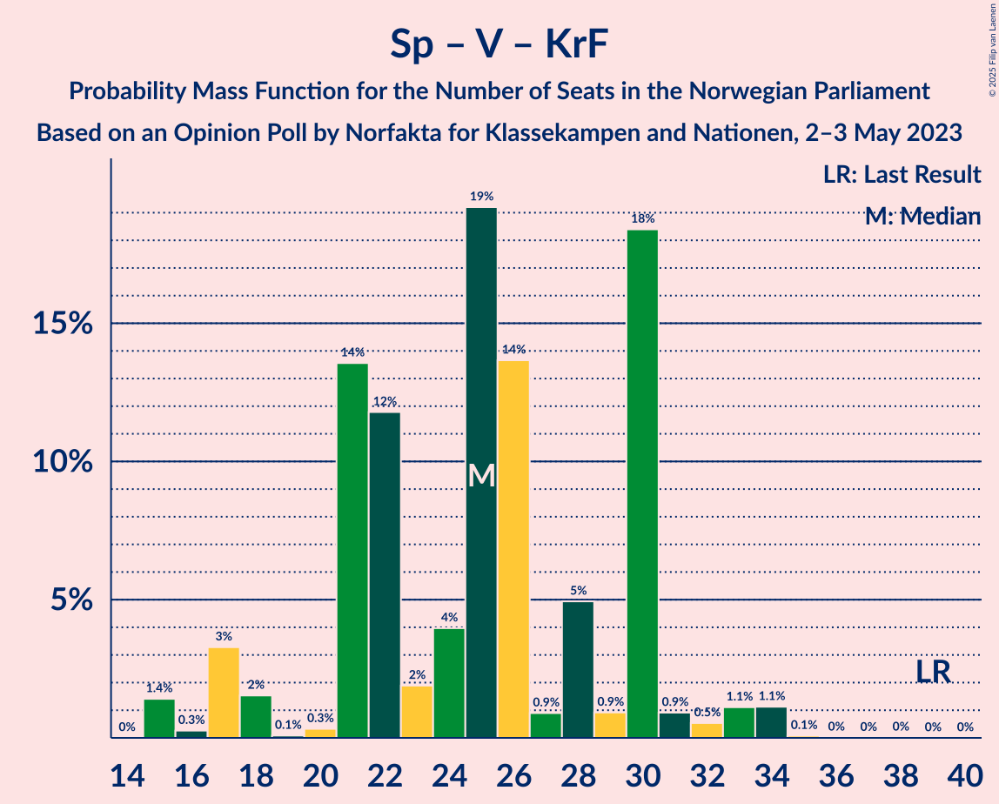

# Opinion Poll by Norfakta for Klassekampen and Nationen, 2–3 May 2023

<a href="#voting-intentions">Voting Intentions</a> | <a href="#seats">Seats</a> | <a href="#coalitions">Coalitions</a> | <a href="#technical-information">Technical Information</a>

## Voting Intentions

### Confidence Intervals

| Party | Last Result | Poll Result | 80% Confidence Interval | 90% Confidence Interval | 95% Confidence Interval | 99% Confidence Interval |
|:-----:|:-----------:|:-----------:|:-----------------------:|:-----------------------:|:-----------------------:|:-----------------------:|
| Høyre | 20.4% | 31.7% | 29.6–34.0% |29.0–34.6% |28.5–35.2% |27.5–36.2% |
| Arbeiderpartiet | 26.2% | 16.9% | 15.3–18.8% |14.8–19.3% |14.4–19.8% |13.7–20.7% |
| Fremskrittspartiet | 11.6% | 12.3% | 10.9–13.9% |10.4–14.4% |10.1–14.8% |9.5–15.7% |
| Sosialistisk Venstreparti | 7.6% | 8.4% | 7.2–9.8% |6.9–10.3% |6.6–10.6% |6.1–11.3% |
| Senterpartiet | 13.5% | 5.9% | 4.9–7.1% |4.6–7.5% |4.4–7.8% |4.0–8.4% |
| Venstre | 4.6% | 5.5% | 4.5–6.7% |4.3–7.0% |4.1–7.3% |3.6–8.0% |
| Rødt | 4.7% | 5.3% | 4.4–6.5% |4.2–6.9% |3.9–7.2% |3.5–7.8% |
| Kristelig Folkeparti | 3.8% | 4.1% | 3.3–5.2% |3.1–5.5% |2.9–5.8% |2.6–6.4% |
| Miljøpartiet De Grønne | 3.9% | 3.6% | 2.9–4.6% |2.7–4.9% |2.5–5.2% |2.2–5.7% |
| Industri- og Næringspartiet | 0.3% | 2.5% | 1.9–3.4% |1.8–3.7% |1.6–3.9% |1.4–4.4% |
| Liberalistene | 0.2% | 1.2% | 0.8–1.9% |0.7–2.1% |0.6–2.3% |0.5–2.7% |
| Norgesdemokratene | 1.1% | 0.5% | 0.3–1.1% |0.3–1.2% |0.2–1.4% |0.1–1.7% |
| Pensjonistpartiet | 0.6% | 0.4% | 0.2–0.9% |0.2–1.0% |0.1–1.2% |0.1–1.5% |
| Konservativt | 0.4% | 0.3% | 0.1–0.7% |0.1–0.8% |0.1–1.0% |0.0–1.2% |

*Note:* The poll result column reflects the actual value used in the calculations. Published results may vary slightly, and in addition be rounded to fewer digits.

## Seats

### Confidence Intervals

| Party | Last Result | Median | 80% Confidence Interval | 90% Confidence Interval | 95% Confidence Interval | 99% Confidence Interval |
|:-----:|:-----------:|:------:|:-----------------------:|:-----------------------:|:-----------------------:|:-----------------------:|
| <a href="#høyre">Høyre</a> | 36 | 59 | 54–62 |53–63 |52–67 |49–69 |
| <a href="#arbeiderpartiet">Arbeiderpartiet</a> | 48 | 34 | 32–43 |31–43 |29–43 |27–43 |
| <a href="#fremskrittspartiet">Fremskrittspartiet</a> | 21 | 21 | 17–27 |17–27 |17–27 |16–29 |
| <a href="#sosialistisk-venstreparti">Sosialistisk Venstreparti</a> | 13 | 12 | 11–16 |11–18 |11–19 |9–22 |
| <a href="#senterpartiet">Senterpartiet</a> | 28 | 11 | 8–14 |7–14 |7–14 |1–16 |
| <a href="#venstre">Venstre</a> | 8 | 9 | 8–12 |6–12 |3–14 |2–15 |
| <a href="#rødt">Rødt</a> | 8 | 9 | 8–11 |7–11 |1–13 |1–13 |
| <a href="#kristelig-folkeparti">Kristelig Folkeparti</a> | 3 | 3 | 2–9 |2–9 |2–9 |2–10 |
| <a href="#miljøpartiet-de-grønne">Miljøpartiet De Grønne</a> | 3 | 3 | 1–7 |1–8 |1–9 |1–10 |
| <a href="#industri--og-næringspartiet">Industri- og Næringspartiet</a> | 0 | 2 | 0–3 |0–6 |0–7 |0–7 |
| <a href="#liberalistene">Liberalistene</a> | 0 | 0 | 0 |0 |0 |0 |
| <a href="#norgesdemokratene">Norgesdemokratene</a> | 0 | 0 | 0 |0 |0 |0 |
| <a href="#pensjonistpartiet">Pensjonistpartiet</a> | 0 | 0 | 0 |0 |0 |0 |
| <a href="#konservativt">Konservativt</a> | 0 | 0 | 0 |0 |0 |0 |

### Høyre

*For a full overview of the results for this party, see the [Høyre](party-høyre.html) page.*

| Number of Seats | Probability | Accumulated | Special Marks |
|:---------------:|:-----------:|:-----------:|:-------------:|
| 36 | 0% | 100% | Last Result |
| 37 | 0% | 100% |  |
| 38 | 0% | 100% |  |
| 39 | 0% | 100% |  |
| 40 | 0% | 100% |  |
| 41 | 0% | 100% |  |
| 42 | 0% | 100% |  |
| 43 | 0% | 100% |  |
| 44 | 0% | 100% |  |
| 45 | 0% | 100% |  |
| 46 | 0% | 100% |  |
| 47 | 0.1% | 100% |  |
| 48 | 0.3% | 99.9% |  |
| 49 | 0.3% | 99.6% |  |
| 50 | 0.4% | 99.3% |  |
| 51 | 1.1% | 98.9% |  |
| 52 | 1.1% | 98% |  |
| 53 | 4% | 97% |  |
| 54 | 4% | 92% |  |
| 55 | 13% | 88% |  |
| 56 | 2% | 74% |  |
| 57 | 2% | 73% |  |
| 58 | 14% | 71% |  |
| 59 | 19% | 56% | Median |
| 60 | 3% | 37% |  |
| 61 | 10% | 35% |  |
| 62 | 17% | 24% |  |
| 63 | 4% | 8% |  |
| 64 | 0.1% | 4% |  |
| 65 | 0.7% | 4% |  |
| 66 | 0.2% | 3% |  |
| 67 | 2% | 3% |  |
| 68 | 0.2% | 0.8% |  |
| 69 | 0.7% | 0.7% |  |
| 70 | 0% | 0% |  |

### Arbeiderpartiet

*For a full overview of the results for this party, see the [Arbeiderpartiet](party-arbeiderpartiet.html) page.*

| Number of Seats | Probability | Accumulated | Special Marks |
|:---------------:|:-----------:|:-----------:|:-------------:|
| 22 | 0.1% | 100% |  |
| 23 | 0% | 99.9% |  |
| 24 | 0% | 99.9% |  |
| 25 | 0% | 99.8% |  |
| 26 | 0.1% | 99.8% |  |
| 27 | 2% | 99.7% |  |
| 28 | 0.5% | 98% |  |
| 29 | 0.7% | 98% |  |
| 30 | 1.5% | 97% |  |
| 31 | 4% | 95% |  |
| 32 | 9% | 91% |  |
| 33 | 11% | 82% |  |
| 34 | 26% | 71% | Median |
| 35 | 13% | 45% |  |
| 36 | 14% | 32% |  |
| 37 | 2% | 18% |  |
| 38 | 0.2% | 16% |  |
| 39 | 0.7% | 16% |  |
| 40 | 0.6% | 15% |  |
| 41 | 0.1% | 15% |  |
| 42 | 1.5% | 15% |  |
| 43 | 13% | 13% |  |
| 44 | 0.1% | 0.2% |  |
| 45 | 0.1% | 0.1% |  |
| 46 | 0.1% | 0.1% |  |
| 47 | 0% | 0% |  |
| 48 | 0% | 0% | Last Result |

### Fremskrittspartiet

*For a full overview of the results for this party, see the [Fremskrittspartiet](party-fremskrittspartiet.html) page.*

| Number of Seats | Probability | Accumulated | Special Marks |
|:---------------:|:-----------:|:-----------:|:-------------:|
| 14 | 0.1% | 100% |  |
| 15 | 0% | 99.9% |  |
| 16 | 0.7% | 99.9% |  |
| 17 | 14% | 99.2% |  |
| 18 | 4% | 85% |  |
| 19 | 19% | 81% |  |
| 20 | 9% | 62% |  |
| 21 | 9% | 53% | Last Result, Median |
| 22 | 6% | 45% |  |
| 23 | 4% | 39% |  |
| 24 | 16% | 35% |  |
| 25 | 4% | 19% |  |
| 26 | 0.3% | 15% |  |
| 27 | 13% | 15% |  |
| 28 | 0.4% | 2% |  |
| 29 | 1.3% | 2% |  |
| 30 | 0.3% | 0.4% |  |
| 31 | 0% | 0.1% |  |
| 32 | 0% | 0.1% |  |
| 33 | 0% | 0.1% |  |
| 34 | 0% | 0% |  |

### Sosialistisk Venstreparti

*For a full overview of the results for this party, see the [Sosialistisk Venstreparti](party-sosialistiskvenstreparti.html) page.*

| Number of Seats | Probability | Accumulated | Special Marks |
|:---------------:|:-----------:|:-----------:|:-------------:|
| 9 | 1.0% | 100% |  |
| 10 | 0.5% | 99.0% |  |
| 11 | 14% | 98% |  |
| 12 | 38% | 85% | Median |
| 13 | 10% | 47% | Last Result |
| 14 | 4% | 37% |  |
| 15 | 14% | 32% |  |
| 16 | 9% | 19% |  |
| 17 | 3% | 9% |  |
| 18 | 2% | 6% |  |
| 19 | 2% | 4% |  |
| 20 | 0.4% | 1.4% |  |
| 21 | 0.3% | 1.1% |  |
| 22 | 0.8% | 0.8% |  |
| 23 | 0% | 0% |  |

### Senterpartiet

*For a full overview of the results for this party, see the [Senterpartiet](party-senterpartiet.html) page.*

| Number of Seats | Probability | Accumulated | Special Marks |
|:---------------:|:-----------:|:-----------:|:-------------:|
| 0 | 0.1% | 100% |  |
| 1 | 1.4% | 99.9% |  |
| 2 | 0.3% | 98% |  |
| 3 | 0% | 98% |  |
| 4 | 0% | 98% |  |
| 5 | 0% | 98% |  |
| 6 | 0% | 98% |  |
| 7 | 5% | 98% |  |
| 8 | 8% | 93% |  |
| 9 | 16% | 85% |  |
| 10 | 3% | 69% |  |
| 11 | 21% | 66% | Median |
| 12 | 19% | 44% |  |
| 13 | 10% | 25% |  |
| 14 | 14% | 15% |  |
| 15 | 0.7% | 1.2% |  |
| 16 | 0.4% | 0.5% |  |
| 17 | 0.1% | 0.1% |  |
| 18 | 0% | 0.1% |  |
| 19 | 0% | 0% |  |
| 20 | 0% | 0% |  |
| 21 | 0% | 0% |  |
| 22 | 0% | 0% |  |
| 23 | 0% | 0% |  |
| 24 | 0% | 0% |  |
| 25 | 0% | 0% |  |
| 26 | 0% | 0% |  |
| 27 | 0% | 0% |  |
| 28 | 0% | 0% | Last Result |

### Venstre

*For a full overview of the results for this party, see the [Venstre](party-venstre.html) page.*

| Number of Seats | Probability | Accumulated | Special Marks |
|:---------------:|:-----------:|:-----------:|:-------------:|
| 2 | 0.8% | 100% |  |
| 3 | 4% | 99.2% |  |
| 4 | 0% | 95% |  |
| 5 | 0% | 95% |  |
| 6 | 0% | 95% |  |
| 7 | 2% | 95% |  |
| 8 | 27% | 93% | Last Result |
| 9 | 29% | 67% | Median |
| 10 | 4% | 38% |  |
| 11 | 21% | 34% |  |
| 12 | 10% | 13% |  |
| 13 | 0.5% | 3% |  |
| 14 | 2% | 3% |  |
| 15 | 0.5% | 0.6% |  |
| 16 | 0.1% | 0.1% |  |
| 17 | 0% | 0% |  |

### Rødt

*For a full overview of the results for this party, see the [Rødt](party-rødt.html) page.*

| Number of Seats | Probability | Accumulated | Special Marks |
|:---------------:|:-----------:|:-----------:|:-------------:|
| 1 | 4% | 100% |  |
| 2 | 0% | 96% |  |
| 3 | 0% | 96% |  |
| 4 | 0% | 96% |  |
| 5 | 0% | 96% |  |
| 6 | 0.1% | 96% |  |
| 7 | 3% | 96% |  |
| 8 | 32% | 93% | Last Result |
| 9 | 20% | 61% | Median |
| 10 | 27% | 41% |  |
| 11 | 9% | 14% |  |
| 12 | 1.4% | 5% |  |
| 13 | 4% | 4% |  |
| 14 | 0.1% | 0.1% |  |
| 15 | 0% | 0% |  |

### Kristelig Folkeparti

*For a full overview of the results for this party, see the [Kristelig Folkeparti](party-kristeligfolkeparti.html) page.*

| Number of Seats | Probability | Accumulated | Special Marks |
|:---------------:|:-----------:|:-----------:|:-------------:|
| 0 | 0.1% | 100% |  |
| 1 | 0.1% | 99.9% |  |
| 2 | 19% | 99.9% |  |
| 3 | 38% | 80% | Last Result, Median |
| 4 | 0% | 42% |  |
| 5 | 0% | 42% |  |
| 6 | 0.3% | 42% |  |
| 7 | 21% | 42% |  |
| 8 | 6% | 21% |  |
| 9 | 13% | 14% |  |
| 10 | 0.9% | 1.2% |  |
| 11 | 0.3% | 0.4% |  |
| 12 | 0.1% | 0.1% |  |
| 13 | 0% | 0% |  |

### Miljøpartiet De Grønne

*For a full overview of the results for this party, see the [Miljøpartiet De Grønne](party-miljøpartietdegrønne.html) page.*

| Number of Seats | Probability | Accumulated | Special Marks |
|:---------------:|:-----------:|:-----------:|:-------------:|
| 0 | 0.1% | 100% |  |
| 1 | 27% | 99.9% |  |
| 2 | 20% | 73% |  |
| 3 | 18% | 53% | Last Result, Median |
| 4 | 0% | 34% |  |
| 5 | 0% | 34% |  |
| 6 | 11% | 34% |  |
| 7 | 17% | 23% |  |
| 8 | 3% | 6% |  |
| 9 | 2% | 3% |  |
| 10 | 0.6% | 1.0% |  |
| 11 | 0.4% | 0.4% |  |
| 12 | 0% | 0% |  |

### Industri- og Næringspartiet

*For a full overview of the results for this party, see the [Industri- og Næringspartiet](party-industri-ognæringspartiet.html) page.*

| Number of Seats | Probability | Accumulated | Special Marks |
|:---------------:|:-----------:|:-----------:|:-------------:|
| 0 | 33% | 100% | Last Result |
| 1 | 15% | 67% |  |
| 2 | 30% | 52% | Median |
| 3 | 15% | 22% |  |
| 4 | 0% | 7% |  |
| 5 | 0% | 7% |  |
| 6 | 3% | 7% |  |
| 7 | 4% | 4% |  |
| 8 | 0.1% | 0.1% |  |
| 9 | 0% | 0% |  |

### Liberalistene

*For a full overview of the results for this party, see the [Liberalistene](party-liberalistene.html) page.*

| Number of Seats | Probability | Accumulated | Special Marks |
|:---------------:|:-----------:|:-----------:|:-------------:|
| 0 | 100% | 100% | Last Result, Median |

### Norgesdemokratene

*For a full overview of the results for this party, see the [Norgesdemokratene](party-norgesdemokratene.html) page.*

| Number of Seats | Probability | Accumulated | Special Marks |
|:---------------:|:-----------:|:-----------:|:-------------:|
| 0 | 100% | 100% | Last Result, Median |

### Pensjonistpartiet

*For a full overview of the results for this party, see the [Pensjonistpartiet](party-pensjonistpartiet.html) page.*

| Number of Seats | Probability | Accumulated | Special Marks |
|:---------------:|:-----------:|:-----------:|:-------------:|
| 0 | 100% | 100% | Last Result, Median |

### Konservativt

*For a full overview of the results for this party, see the [Konservativt](party-konservativt.html) page.*

| Number of Seats | Probability | Accumulated | Special Marks |
|:---------------:|:-----------:|:-----------:|:-------------:|
| 0 | 100% | 100% | Last Result, Median |

## Coalitions

### Confidence Intervals

| Coalition | Last Result | Median | Majority? | 80% Confidence Interval | 90% Confidence Interval | 95% Confidence Interval | 99% Confidence Interval |
|:---------:|:-----------:|:------:|:---------:|:-----------------------:|:-----------------------:|:-----------------------:|:-----------------------:|
| Høyre – Fremskrittspartiet – Senterpartiet – Venstre – Kristelig Folkeparti | 96 | 107 | 100% | 93–111 | 93–111 | 93–115 | 93–119 |
| Høyre – Fremskrittspartiet – Venstre – Kristelig Folkeparti – Miljøpartiet De Grønne | 71 | 99 | 100% | 91–105 | 91–107 | 91–109 | 87–111 |
| Høyre – Fremskrittspartiet – Venstre – Kristelig Folkeparti | 68 | 96 | 87% | 84–99 | 84–100 | 84–104 | 84–108 |
| Høyre – Fremskrittspartiet – Venstre | 65 | 90 | 80% | 81–95 | 81–96 | 80–98 | 79–102 |
| Høyre – Fremskrittspartiet | 57 | 81 | 22% | 72–86 | 72–88 | 72–90 | 70–92 |
| Høyre – Venstre – Kristelig Folkeparti | 47 | 71 | 1.0% | 67–80 | 67–80 | 66–81 | 63–88 |
| Arbeiderpartiet – Sosialistisk Venstreparti – Senterpartiet – Rødt – Miljøpartiet De Grønne | 100 | 71 | 0.1% | 67–81 | 67–81 | 62–81 | 59–81 |
| Arbeiderpartiet – Sosialistisk Venstreparti – Senterpartiet – Kristelig Folkeparti – Miljøpartiet De Grønne | 95 | 67 | 0% | 64–74 | 61–74 | 61–75 | 58–78 |
| Arbeiderpartiet – Sosialistisk Venstreparti – Senterpartiet – Rødt | 97 | 69 | 0% | 63–74 | 61–74 | 58–74 | 56–79 |
| Arbeiderpartiet – Sosialistisk Venstreparti – Rødt – Miljøpartiet De Grønne | 72 | 60 | 0% | 55–72 | 55–72 | 52–72 | 48–72 |
| Arbeiderpartiet – Sosialistisk Venstreparti – Senterpartiet – Miljøpartiet De Grønne | 92 | 63 | 0% | 59–71 | 59–71 | 56–71 | 52–72 |
| Arbeiderpartiet – Sosialistisk Venstreparti – Senterpartiet | 89 | 60 | 0% | 54–64 | 53–64 | 51–65 | 48–67 |
| Arbeiderpartiet – Senterpartiet – Kristelig Folkeparti – Miljøpartiet De Grønne | 82 | 54 | 0% | 48–62 | 47–62 | 46–62 | 45–63 |
| Arbeiderpartiet – Senterpartiet – Kristelig Folkeparti | 79 | 53 | 0% | 46–55 | 46–55 | 44–56 | 40–59 |
| Arbeiderpartiet – Sosialistisk Venstreparti | 61 | 47 | 0% | 46–55 | 45–55 | 43–55 | 36–60 |
| Arbeiderpartiet – Senterpartiet | 76 | 46 | 0% | 41–52 | 40–52 | 39–52 | 34–52 |
| Senterpartiet – Venstre – Kristelig Folkeparti | 39 | 25 | 0% | 21–30 | 18–30 | 17–32 | 15–34 |

### Høyre – Fremskrittspartiet – Senterpartiet – Venstre – Kristelig Folkeparti

| Number of Seats | Probability | Accumulated | Special Marks |
|:---------------:|:-----------:|:-----------:|:-------------:|
| 93 | 13% | 100% |  |
| 94 | 0.1% | 87% |  |
| 95 | 0.1% | 87% |  |
| 96 | 0.1% | 87% | Last Result |
| 97 | 0.1% | 87% |  |
| 98 | 2% | 87% |  |
| 99 | 1.4% | 85% |  |
| 100 | 4% | 84% |  |
| 101 | 4% | 79% |  |
| 102 | 2% | 76% |  |
| 103 | 1.0% | 73% | Median |
| 104 | 2% | 72% |  |
| 105 | 9% | 71% |  |
| 106 | 2% | 61% |  |
| 107 | 22% | 59% |  |
| 108 | 12% | 37% |  |
| 109 | 2% | 25% |  |
| 110 | 0.3% | 23% |  |
| 111 | 19% | 23% |  |
| 112 | 0.6% | 4% |  |
| 113 | 0.3% | 3% |  |
| 114 | 0.1% | 3% |  |
| 115 | 0.4% | 3% |  |
| 116 | 0.2% | 2% |  |
| 117 | 0.3% | 2% |  |
| 118 | 0% | 2% |  |
| 119 | 2% | 2% |  |
| 120 | 0% | 0% |  |

### Høyre – Fremskrittspartiet – Venstre – Kristelig Folkeparti – Miljøpartiet De Grønne

| Number of Seats | Probability | Accumulated | Special Marks |
|:---------------:|:-----------:|:-----------:|:-------------:|
| 71 | 0% | 100% | Last Result |
| 72 | 0% | 100% |  |
| 73 | 0% | 100% |  |
| 74 | 0% | 100% |  |
| 75 | 0% | 100% |  |
| 76 | 0% | 100% |  |
| 77 | 0% | 100% |  |
| 78 | 0% | 100% |  |
| 79 | 0% | 100% |  |
| 80 | 0% | 100% |  |
| 81 | 0% | 100% |  |
| 82 | 0% | 100% |  |
| 83 | 0% | 100% |  |
| 84 | 0% | 100% |  |
| 85 | 0% | 100% | Majority |
| 86 | 0% | 100% |  |
| 87 | 0.6% | 100% |  |
| 88 | 0.5% | 99.3% |  |
| 89 | 0% | 98.9% |  |
| 90 | 0.7% | 98.9% |  |
| 91 | 13% | 98% |  |
| 92 | 0.6% | 85% |  |
| 93 | 4% | 85% |  |
| 94 | 1.1% | 81% |  |
| 95 | 3% | 80% | Median |
| 96 | 19% | 77% |  |
| 97 | 3% | 58% |  |
| 98 | 2% | 55% |  |
| 99 | 16% | 52% |  |
| 100 | 19% | 37% |  |
| 101 | 0.8% | 17% |  |
| 102 | 1.1% | 17% |  |
| 103 | 3% | 16% |  |
| 104 | 1.0% | 12% |  |
| 105 | 6% | 11% |  |
| 106 | 0.2% | 6% |  |
| 107 | 2% | 5% |  |
| 108 | 0.7% | 3% |  |
| 109 | 0.9% | 3% |  |
| 110 | 0.9% | 2% |  |
| 111 | 0.6% | 0.9% |  |
| 112 | 0.2% | 0.2% |  |
| 113 | 0% | 0% |  |

### Høyre – Fremskrittspartiet – Venstre – Kristelig Folkeparti

| Number of Seats | Probability | Accumulated | Special Marks |
|:---------------:|:-----------:|:-----------:|:-------------:|
| 68 | 0% | 100% | Last Result |
| 69 | 0% | 100% |  |
| 70 | 0% | 100% |  |
| 71 | 0% | 100% |  |
| 72 | 0% | 100% |  |
| 73 | 0% | 100% |  |
| 74 | 0% | 100% |  |
| 75 | 0% | 100% |  |
| 76 | 0% | 100% |  |
| 77 | 0% | 100% |  |
| 78 | 0% | 100% |  |
| 79 | 0% | 100% |  |
| 80 | 0% | 100% |  |
| 81 | 0% | 100% |  |
| 82 | 0.1% | 100% |  |
| 83 | 0% | 99.9% |  |
| 84 | 13% | 99.9% |  |
| 85 | 0.1% | 87% | Majority |
| 86 | 0.6% | 87% |  |
| 87 | 4% | 86% |  |
| 88 | 0.7% | 82% |  |
| 89 | 0.4% | 82% |  |
| 90 | 2% | 81% |  |
| 91 | 2% | 79% |  |
| 92 | 1.2% | 77% | Median |
| 93 | 15% | 76% |  |
| 94 | 11% | 61% |  |
| 95 | 0.5% | 51% |  |
| 96 | 4% | 50% |  |
| 97 | 13% | 46% |  |
| 98 | 6% | 34% |  |
| 99 | 21% | 28% |  |
| 100 | 2% | 6% |  |
| 101 | 0.4% | 4% |  |
| 102 | 0% | 4% |  |
| 103 | 0.8% | 4% |  |
| 104 | 0.4% | 3% |  |
| 105 | 0.1% | 2% |  |
| 106 | 1.0% | 2% |  |
| 107 | 0.3% | 1.3% |  |
| 108 | 0.6% | 1.0% |  |
| 109 | 0.4% | 0.4% |  |
| 110 | 0% | 0% |  |

### Høyre – Fremskrittspartiet – Venstre

| Number of Seats | Probability | Accumulated | Special Marks |
|:---------------:|:-----------:|:-----------:|:-------------:|
| 65 | 0% | 100% | Last Result |
| 66 | 0% | 100% |  |
| 67 | 0% | 100% |  |
| 68 | 0% | 100% |  |
| 69 | 0% | 100% |  |
| 70 | 0% | 100% |  |
| 71 | 0% | 100% |  |
| 72 | 0% | 100% |  |
| 73 | 0% | 100% |  |
| 74 | 0% | 100% |  |
| 75 | 0% | 100% |  |
| 76 | 0% | 100% |  |
| 77 | 0.1% | 100% |  |
| 78 | 0.1% | 99.9% |  |
| 79 | 0.4% | 99.8% |  |
| 80 | 3% | 99.4% |  |
| 81 | 13% | 96% |  |
| 82 | 1.4% | 83% |  |
| 83 | 0.5% | 81% |  |
| 84 | 1.5% | 81% |  |
| 85 | 5% | 80% | Majority |
| 86 | 2% | 75% |  |
| 87 | 2% | 73% |  |
| 88 | 4% | 71% |  |
| 89 | 1.3% | 67% | Median |
| 90 | 18% | 66% |  |
| 91 | 8% | 48% |  |
| 92 | 17% | 40% |  |
| 93 | 0.4% | 24% |  |
| 94 | 0.4% | 23% |  |
| 95 | 15% | 23% |  |
| 96 | 4% | 8% |  |
| 97 | 1.1% | 4% |  |
| 98 | 2% | 3% |  |
| 99 | 0.7% | 1.5% |  |
| 100 | 0.2% | 0.8% |  |
| 101 | 0.1% | 0.7% |  |
| 102 | 0.3% | 0.6% |  |
| 103 | 0% | 0.3% |  |
| 104 | 0.3% | 0.3% |  |
| 105 | 0% | 0% |  |

### Høyre – Fremskrittspartiet

| Number of Seats | Probability | Accumulated | Special Marks |
|:---------------:|:-----------:|:-----------:|:-------------:|
| 57 | 0% | 100% | Last Result |
| 58 | 0% | 100% |  |
| 59 | 0% | 100% |  |
| 60 | 0% | 100% |  |
| 61 | 0% | 100% |  |
| 62 | 0% | 100% |  |
| 63 | 0% | 100% |  |
| 64 | 0% | 100% |  |
| 65 | 0% | 100% |  |
| 66 | 0% | 100% |  |
| 67 | 0% | 100% |  |
| 68 | 0% | 100% |  |
| 69 | 0.4% | 100% |  |
| 70 | 0.5% | 99.6% |  |
| 71 | 0.5% | 99.0% |  |
| 72 | 16% | 98.5% |  |
| 73 | 0.7% | 82% |  |
| 74 | 1.3% | 81% |  |
| 75 | 2% | 80% |  |
| 76 | 2% | 78% |  |
| 77 | 3% | 76% |  |
| 78 | 0.8% | 73% |  |
| 79 | 10% | 72% |  |
| 80 | 0.6% | 62% | Median |
| 81 | 17% | 62% |  |
| 82 | 20% | 45% |  |
| 83 | 2% | 25% |  |
| 84 | 0.8% | 23% |  |
| 85 | 5% | 22% | Majority |
| 86 | 11% | 17% |  |
| 87 | 0.1% | 6% |  |
| 88 | 1.2% | 6% |  |
| 89 | 0.8% | 5% |  |
| 90 | 2% | 4% |  |
| 91 | 0% | 2% |  |
| 92 | 2% | 2% |  |
| 93 | 0% | 0% |  |

### Høyre – Venstre – Kristelig Folkeparti

| Number of Seats | Probability | Accumulated | Special Marks |
|:---------------:|:-----------:|:-----------:|:-------------:|
| 47 | 0% | 100% | Last Result |
| 48 | 0% | 100% |  |
| 49 | 0% | 100% |  |
| 50 | 0% | 100% |  |
| 51 | 0% | 100% |  |
| 52 | 0% | 100% |  |
| 53 | 0% | 100% |  |
| 54 | 0% | 100% |  |
| 55 | 0% | 100% |  |
| 56 | 0% | 100% |  |
| 57 | 0% | 100% |  |
| 58 | 0% | 100% |  |
| 59 | 0.1% | 100% |  |
| 60 | 0% | 99.9% |  |
| 61 | 0.1% | 99.9% |  |
| 62 | 0.1% | 99.8% |  |
| 63 | 0.4% | 99.7% |  |
| 64 | 0.7% | 99.3% |  |
| 65 | 0.3% | 98.6% |  |
| 66 | 1.4% | 98% |  |
| 67 | 14% | 97% |  |
| 68 | 4% | 83% |  |
| 69 | 14% | 79% |  |
| 70 | 13% | 64% |  |
| 71 | 5% | 52% | Median |
| 72 | 2% | 47% |  |
| 73 | 4% | 46% |  |
| 74 | 6% | 41% |  |
| 75 | 2% | 35% |  |
| 76 | 3% | 33% |  |
| 77 | 0.8% | 30% |  |
| 78 | 8% | 29% |  |
| 79 | 2% | 21% |  |
| 80 | 16% | 19% |  |
| 81 | 1.5% | 3% |  |
| 82 | 0.7% | 2% |  |
| 83 | 0.1% | 1.3% |  |
| 84 | 0.2% | 1.2% |  |
| 85 | 0.1% | 1.0% | Majority |
| 86 | 0.3% | 0.9% |  |
| 87 | 0% | 0.6% |  |
| 88 | 0.6% | 0.6% |  |
| 89 | 0% | 0% |  |

### Arbeiderpartiet – Sosialistisk Venstreparti – Senterpartiet – Rødt – Miljøpartiet De Grønne

| Number of Seats | Probability | Accumulated | Special Marks |
|:---------------:|:-----------:|:-----------:|:-------------:|
| 59 | 0.7% | 100% |  |
| 60 | 0.6% | 99.3% |  |
| 61 | 1.0% | 98.7% |  |
| 62 | 0.3% | 98% |  |
| 63 | 0.4% | 97% |  |
| 64 | 0.1% | 97% |  |
| 65 | 1.2% | 97% |  |
| 66 | 0.7% | 96% |  |
| 67 | 16% | 95% |  |
| 68 | 7% | 79% |  |
| 69 | 6% | 71% | Median |
| 70 | 3% | 65% |  |
| 71 | 13% | 62% |  |
| 72 | 10% | 49% |  |
| 73 | 1.1% | 39% |  |
| 74 | 17% | 38% |  |
| 75 | 2% | 21% |  |
| 76 | 0.8% | 19% |  |
| 77 | 2% | 18% |  |
| 78 | 1.4% | 16% |  |
| 79 | 0.6% | 15% |  |
| 80 | 0.5% | 14% |  |
| 81 | 13% | 14% |  |
| 82 | 0.3% | 0.5% |  |
| 83 | 0.1% | 0.2% |  |
| 84 | 0% | 0.1% |  |
| 85 | 0% | 0.1% | Majority |
| 86 | 0% | 0% |  |
| 87 | 0% | 0% |  |
| 88 | 0% | 0% |  |
| 89 | 0% | 0% |  |
| 90 | 0% | 0% |  |
| 91 | 0% | 0% |  |
| 92 | 0% | 0% |  |
| 93 | 0% | 0% |  |
| 94 | 0% | 0% |  |
| 95 | 0% | 0% |  |
| 96 | 0% | 0% |  |
| 97 | 0% | 0% |  |
| 98 | 0% | 0% |  |
| 99 | 0% | 0% |  |
| 100 | 0% | 0% | Last Result |

### Arbeiderpartiet – Sosialistisk Venstreparti – Senterpartiet – Kristelig Folkeparti – Miljøpartiet De Grønne

| Number of Seats | Probability | Accumulated | Special Marks |
|:---------------:|:-----------:|:-----------:|:-------------:|
| 56 | 0.2% | 100% |  |
| 57 | 0.1% | 99.7% |  |
| 58 | 0.2% | 99.7% |  |
| 59 | 0.1% | 99.5% |  |
| 60 | 0.5% | 99.3% |  |
| 61 | 5% | 98.8% |  |
| 62 | 1.1% | 94% |  |
| 63 | 2% | 93% | Median |
| 64 | 7% | 91% |  |
| 65 | 11% | 84% |  |
| 66 | 18% | 72% |  |
| 67 | 14% | 54% |  |
| 68 | 5% | 41% |  |
| 69 | 8% | 36% |  |
| 70 | 2% | 28% |  |
| 71 | 0.7% | 26% |  |
| 72 | 2% | 25% |  |
| 73 | 4% | 23% |  |
| 74 | 16% | 18% |  |
| 75 | 1.2% | 3% |  |
| 76 | 0.5% | 2% |  |
| 77 | 0.3% | 1.2% |  |
| 78 | 0.4% | 0.9% |  |
| 79 | 0.2% | 0.5% |  |
| 80 | 0.2% | 0.3% |  |
| 81 | 0.1% | 0.1% |  |
| 82 | 0% | 0% |  |
| 83 | 0% | 0% |  |
| 84 | 0% | 0% |  |
| 85 | 0% | 0% | Majority |
| 86 | 0% | 0% |  |
| 87 | 0% | 0% |  |
| 88 | 0% | 0% |  |
| 89 | 0% | 0% |  |
| 90 | 0% | 0% |  |
| 91 | 0% | 0% |  |
| 92 | 0% | 0% |  |
| 93 | 0% | 0% |  |
| 94 | 0% | 0% |  |
| 95 | 0% | 0% | Last Result |

### Arbeiderpartiet – Sosialistisk Venstreparti – Senterpartiet – Rødt

| Number of Seats | Probability | Accumulated | Special Marks |
|:---------------:|:-----------:|:-----------:|:-------------:|
| 55 | 0% | 100% |  |
| 56 | 0.7% | 99.9% |  |
| 57 | 0.7% | 99.2% |  |
| 58 | 2% | 98.6% |  |
| 59 | 0.3% | 97% |  |
| 60 | 0.2% | 96% |  |
| 61 | 2% | 96% |  |
| 62 | 3% | 94% |  |
| 63 | 6% | 91% |  |
| 64 | 1.5% | 85% |  |
| 65 | 4% | 84% |  |
| 66 | 17% | 80% | Median |
| 67 | 4% | 64% |  |
| 68 | 4% | 60% |  |
| 69 | 13% | 55% |  |
| 70 | 8% | 43% |  |
| 71 | 16% | 35% |  |
| 72 | 1.0% | 19% |  |
| 73 | 2% | 18% |  |
| 74 | 14% | 16% |  |
| 75 | 0.4% | 2% |  |
| 76 | 0.2% | 2% |  |
| 77 | 0% | 1.4% |  |
| 78 | 0.7% | 1.4% |  |
| 79 | 0.4% | 0.7% |  |
| 80 | 0.4% | 0.4% |  |
| 81 | 0% | 0% |  |
| 82 | 0% | 0% |  |
| 83 | 0% | 0% |  |
| 84 | 0% | 0% |  |
| 85 | 0% | 0% | Majority |
| 86 | 0% | 0% |  |
| 87 | 0% | 0% |  |
| 88 | 0% | 0% |  |
| 89 | 0% | 0% |  |
| 90 | 0% | 0% |  |
| 91 | 0% | 0% |  |
| 92 | 0% | 0% |  |
| 93 | 0% | 0% |  |
| 94 | 0% | 0% |  |
| 95 | 0% | 0% |  |
| 96 | 0% | 0% |  |
| 97 | 0% | 0% | Last Result |

### Arbeiderpartiet – Sosialistisk Venstreparti – Rødt – Miljøpartiet De Grønne

| Number of Seats | Probability | Accumulated | Special Marks |
|:---------------:|:-----------:|:-----------:|:-------------:|
| 48 | 0.9% | 100% |  |
| 49 | 1.1% | 99.1% |  |
| 50 | 0% | 98% |  |
| 51 | 0% | 98% |  |
| 52 | 0.6% | 98% |  |
| 53 | 0.1% | 97% |  |
| 54 | 0.1% | 97% |  |
| 55 | 19% | 97% |  |
| 56 | 0.5% | 78% |  |
| 57 | 1.0% | 77% |  |
| 58 | 1.0% | 76% | Median |
| 59 | 3% | 75% |  |
| 60 | 26% | 73% |  |
| 61 | 20% | 47% |  |
| 62 | 2% | 27% |  |
| 63 | 3% | 25% |  |
| 64 | 2% | 22% |  |
| 65 | 1.1% | 20% |  |
| 66 | 2% | 19% |  |
| 67 | 1.5% | 17% |  |
| 68 | 0.9% | 16% |  |
| 69 | 0.3% | 15% |  |
| 70 | 1.5% | 15% |  |
| 71 | 0.1% | 13% |  |
| 72 | 13% | 13% | Last Result |
| 73 | 0% | 0.1% |  |
| 74 | 0.1% | 0.1% |  |
| 75 | 0% | 0% |  |

### Arbeiderpartiet – Sosialistisk Venstreparti – Senterpartiet – Miljøpartiet De Grønne

| Number of Seats | Probability | Accumulated | Special Marks |
|:---------------:|:-----------:|:-----------:|:-------------:|
| 49 | 0.3% | 100% |  |
| 50 | 0% | 99.7% |  |
| 51 | 0% | 99.7% |  |
| 52 | 1.0% | 99.6% |  |
| 53 | 0.9% | 98.6% |  |
| 54 | 0.1% | 98% |  |
| 55 | 0.1% | 98% |  |
| 56 | 0.6% | 98% |  |
| 57 | 0.7% | 97% |  |
| 58 | 1.0% | 96% |  |
| 59 | 23% | 95% |  |
| 60 | 7% | 73% | Median |
| 61 | 9% | 66% |  |
| 62 | 2% | 56% |  |
| 63 | 12% | 54% |  |
| 64 | 14% | 42% |  |
| 65 | 3% | 28% |  |
| 66 | 6% | 25% |  |
| 67 | 1.2% | 19% |  |
| 68 | 2% | 18% |  |
| 69 | 2% | 16% |  |
| 70 | 0.6% | 14% |  |
| 71 | 13% | 14% |  |
| 72 | 0.2% | 0.7% |  |
| 73 | 0.1% | 0.5% |  |
| 74 | 0.3% | 0.4% |  |
| 75 | 0.1% | 0.1% |  |
| 76 | 0.1% | 0.1% |  |
| 77 | 0% | 0% |  |
| 78 | 0% | 0% |  |
| 79 | 0% | 0% |  |
| 80 | 0% | 0% |  |
| 81 | 0% | 0% |  |
| 82 | 0% | 0% |  |
| 83 | 0% | 0% |  |
| 84 | 0% | 0% |  |
| 85 | 0% | 0% | Majority |
| 86 | 0% | 0% |  |
| 87 | 0% | 0% |  |
| 88 | 0% | 0% |  |
| 89 | 0% | 0% |  |
| 90 | 0% | 0% |  |
| 91 | 0% | 0% |  |
| 92 | 0% | 0% | Last Result |

### Arbeiderpartiet – Sosialistisk Venstreparti – Senterpartiet

| Number of Seats | Probability | Accumulated | Special Marks |
|:---------------:|:-----------:|:-----------:|:-------------:|
| 45 | 0.1% | 100% |  |
| 46 | 0% | 99.9% |  |
| 47 | 0.2% | 99.9% |  |
| 48 | 0.3% | 99.6% |  |
| 49 | 1.0% | 99.4% |  |
| 50 | 0.6% | 98% |  |
| 51 | 0.4% | 98% |  |
| 52 | 0.6% | 97% |  |
| 53 | 3% | 97% |  |
| 54 | 8% | 94% |  |
| 55 | 0.9% | 86% |  |
| 56 | 2% | 86% |  |
| 57 | 2% | 84% | Median |
| 58 | 23% | 82% |  |
| 59 | 6% | 59% |  |
| 60 | 6% | 52% |  |
| 61 | 25% | 46% |  |
| 62 | 2% | 20% |  |
| 63 | 0.8% | 18% |  |
| 64 | 14% | 18% |  |
| 65 | 1.3% | 3% |  |
| 66 | 0.2% | 2% |  |
| 67 | 1.2% | 2% |  |
| 68 | 0.1% | 0.5% |  |
| 69 | 0% | 0.4% |  |
| 70 | 0.1% | 0.4% |  |
| 71 | 0.3% | 0.3% |  |
| 72 | 0% | 0% |  |
| 73 | 0% | 0% |  |
| 74 | 0% | 0% |  |
| 75 | 0% | 0% |  |
| 76 | 0% | 0% |  |
| 77 | 0% | 0% |  |
| 78 | 0% | 0% |  |
| 79 | 0% | 0% |  |
| 80 | 0% | 0% |  |
| 81 | 0% | 0% |  |
| 82 | 0% | 0% |  |
| 83 | 0% | 0% |  |
| 84 | 0% | 0% |  |
| 85 | 0% | 0% | Majority |
| 86 | 0% | 0% |  |
| 87 | 0% | 0% |  |
| 88 | 0% | 0% |  |
| 89 | 0% | 0% | Last Result |

### Arbeiderpartiet – Senterpartiet – Kristelig Folkeparti – Miljøpartiet De Grønne

| Number of Seats | Probability | Accumulated | Special Marks |
|:---------------:|:-----------:|:-----------:|:-------------:|
| 41 | 0% | 100% |  |
| 42 | 0.1% | 99.9% |  |
| 43 | 0% | 99.9% |  |
| 44 | 0.3% | 99.9% |  |
| 45 | 1.4% | 99.5% |  |
| 46 | 2% | 98% |  |
| 47 | 2% | 96% |  |
| 48 | 6% | 95% |  |
| 49 | 5% | 89% |  |
| 50 | 12% | 84% |  |
| 51 | 1.3% | 72% | Median |
| 52 | 3% | 71% |  |
| 53 | 0.1% | 68% |  |
| 54 | 18% | 68% |  |
| 55 | 5% | 50% |  |
| 56 | 22% | 45% |  |
| 57 | 2% | 23% |  |
| 58 | 0.8% | 21% |  |
| 59 | 2% | 21% |  |
| 60 | 5% | 19% |  |
| 61 | 0.7% | 15% |  |
| 62 | 13% | 14% |  |
| 63 | 0.2% | 0.6% |  |
| 64 | 0.1% | 0.4% |  |
| 65 | 0.1% | 0.3% |  |
| 66 | 0.1% | 0.2% |  |
| 67 | 0% | 0.1% |  |
| 68 | 0% | 0% |  |
| 69 | 0% | 0% |  |
| 70 | 0% | 0% |  |
| 71 | 0% | 0% |  |
| 72 | 0% | 0% |  |
| 73 | 0% | 0% |  |
| 74 | 0% | 0% |  |
| 75 | 0% | 0% |  |
| 76 | 0% | 0% |  |
| 77 | 0% | 0% |  |
| 78 | 0% | 0% |  |
| 79 | 0% | 0% |  |
| 80 | 0% | 0% |  |
| 81 | 0% | 0% |  |
| 82 | 0% | 0% | Last Result |

### Arbeiderpartiet – Senterpartiet – Kristelig Folkeparti

| Number of Seats | Probability | Accumulated | Special Marks |
|:---------------:|:-----------:|:-----------:|:-------------:|
| 37 | 0.3% | 100% |  |
| 38 | 0.1% | 99.7% |  |
| 39 | 0% | 99.6% |  |
| 40 | 0.1% | 99.5% |  |
| 41 | 0% | 99.5% |  |
| 42 | 0.7% | 99.4% |  |
| 43 | 0.9% | 98.7% |  |
| 44 | 0.6% | 98% |  |
| 45 | 2% | 97% |  |
| 46 | 11% | 96% |  |
| 47 | 0.8% | 84% |  |
| 48 | 16% | 84% | Median |
| 49 | 3% | 67% |  |
| 50 | 9% | 64% |  |
| 51 | 1.5% | 54% |  |
| 52 | 2% | 53% |  |
| 53 | 30% | 51% |  |
| 54 | 5% | 21% |  |
| 55 | 13% | 16% |  |
| 56 | 0.8% | 3% |  |
| 57 | 1.0% | 2% |  |
| 58 | 0.3% | 1.2% |  |
| 59 | 0.6% | 0.8% |  |
| 60 | 0.1% | 0.2% |  |
| 61 | 0% | 0.1% |  |
| 62 | 0.1% | 0.1% |  |
| 63 | 0.1% | 0.1% |  |
| 64 | 0% | 0% |  |
| 65 | 0% | 0% |  |
| 66 | 0% | 0% |  |
| 67 | 0% | 0% |  |
| 68 | 0% | 0% |  |
| 69 | 0% | 0% |  |
| 70 | 0% | 0% |  |
| 71 | 0% | 0% |  |
| 72 | 0% | 0% |  |
| 73 | 0% | 0% |  |
| 74 | 0% | 0% |  |
| 75 | 0% | 0% |  |
| 76 | 0% | 0% |  |
| 77 | 0% | 0% |  |
| 78 | 0% | 0% |  |
| 79 | 0% | 0% | Last Result |

### Arbeiderpartiet – Sosialistisk Venstreparti

| Number of Seats | Probability | Accumulated | Special Marks |
|:---------------:|:-----------:|:-----------:|:-------------:|
| 36 | 1.0% | 100% |  |
| 37 | 0% | 99.0% |  |
| 38 | 0% | 99.0% |  |
| 39 | 0.6% | 99.0% |  |
| 40 | 0.2% | 98% |  |
| 41 | 0.3% | 98% |  |
| 42 | 0.3% | 98% |  |
| 43 | 0.8% | 98% |  |
| 44 | 0.9% | 97% |  |
| 45 | 6% | 96% |  |
| 46 | 26% | 90% | Median |
| 47 | 17% | 64% |  |
| 48 | 7% | 47% |  |
| 49 | 4% | 40% |  |
| 50 | 14% | 35% |  |
| 51 | 3% | 21% |  |
| 52 | 2% | 19% |  |
| 53 | 0.5% | 17% |  |
| 54 | 1.2% | 17% |  |
| 55 | 13% | 15% |  |
| 56 | 0.8% | 2% |  |
| 57 | 0.1% | 2% |  |
| 58 | 0.1% | 2% |  |
| 59 | 0% | 2% |  |
| 60 | 1.4% | 1.5% |  |
| 61 | 0.1% | 0.1% | Last Result |
| 62 | 0% | 0% |  |

### Arbeiderpartiet – Senterpartiet

| Number of Seats | Probability | Accumulated | Special Marks |
|:---------------:|:-----------:|:-----------:|:-------------:|
| 31 | 0.2% | 100% |  |
| 32 | 0% | 99.8% |  |
| 33 | 0.1% | 99.8% |  |
| 34 | 0.3% | 99.8% |  |
| 35 | 0% | 99.5% |  |
| 36 | 0.5% | 99.5% |  |
| 37 | 0.3% | 98.9% |  |
| 38 | 0.8% | 98.6% |  |
| 39 | 0.4% | 98% |  |
| 40 | 3% | 97% |  |
| 41 | 10% | 94% |  |
| 42 | 0.8% | 84% |  |
| 43 | 12% | 84% |  |
| 44 | 3% | 72% |  |
| 45 | 3% | 68% | Median |
| 46 | 32% | 65% |  |
| 47 | 4% | 33% |  |
| 48 | 1.3% | 29% |  |
| 49 | 1.2% | 28% |  |
| 50 | 13% | 27% |  |
| 51 | 0.5% | 14% |  |
| 52 | 13% | 13% |  |
| 53 | 0.1% | 0.5% |  |
| 54 | 0.3% | 0.4% |  |
| 55 | 0.1% | 0.1% |  |
| 56 | 0% | 0% |  |
| 57 | 0% | 0% |  |
| 58 | 0% | 0% |  |
| 59 | 0% | 0% |  |
| 60 | 0% | 0% |  |
| 61 | 0% | 0% |  |
| 62 | 0% | 0% |  |
| 63 | 0% | 0% |  |
| 64 | 0% | 0% |  |
| 65 | 0% | 0% |  |
| 66 | 0% | 0% |  |
| 67 | 0% | 0% |  |
| 68 | 0% | 0% |  |
| 69 | 0% | 0% |  |
| 70 | 0% | 0% |  |
| 71 | 0% | 0% |  |
| 72 | 0% | 0% |  |
| 73 | 0% | 0% |  |
| 74 | 0% | 0% |  |
| 75 | 0% | 0% |  |
| 76 | 0% | 0% | Last Result |

### Senterpartiet – Venstre – Kristelig Folkeparti

| Number of Seats | Probability | Accumulated | Special Marks |
|:---------------:|:-----------:|:-----------:|:-------------:|
| 15 | 1.4% | 100% |  |
| 16 | 0.3% | 98.5% |  |
| 17 | 3% | 98% |  |
| 18 | 2% | 95% |  |
| 19 | 0.1% | 93% |  |
| 20 | 0.3% | 93% |  |
| 21 | 14% | 93% |  |
| 22 | 12% | 79% |  |
| 23 | 2% | 68% | Median |
| 24 | 4% | 66% |  |
| 25 | 19% | 62% |  |
| 26 | 14% | 43% |  |
| 27 | 0.9% | 29% |  |
| 28 | 5% | 28% |  |
| 29 | 0.9% | 23% |  |
| 30 | 18% | 22% |  |
| 31 | 0.9% | 4% |  |
| 32 | 0.5% | 3% |  |
| 33 | 1.1% | 2% |  |
| 34 | 1.1% | 1.3% |  |
| 35 | 0.1% | 0.1% |  |
| 36 | 0% | 0.1% |  |
| 37 | 0% | 0% |  |
| 38 | 0% | 0% |  |
| 39 | 0% | 0% | Last Result |

## Technical Information

### Opinion Poll

+ **Polling firm:** Norfakta
+ **Commissioner(s):** Klassekampen and Nationen
+ **Fieldwork period:** 2–3 May 2023

### Calculations

+ **Sample size:** 750
+ **Simulations done:** 1,048,576
+ **Error estimate:** 3.08%

