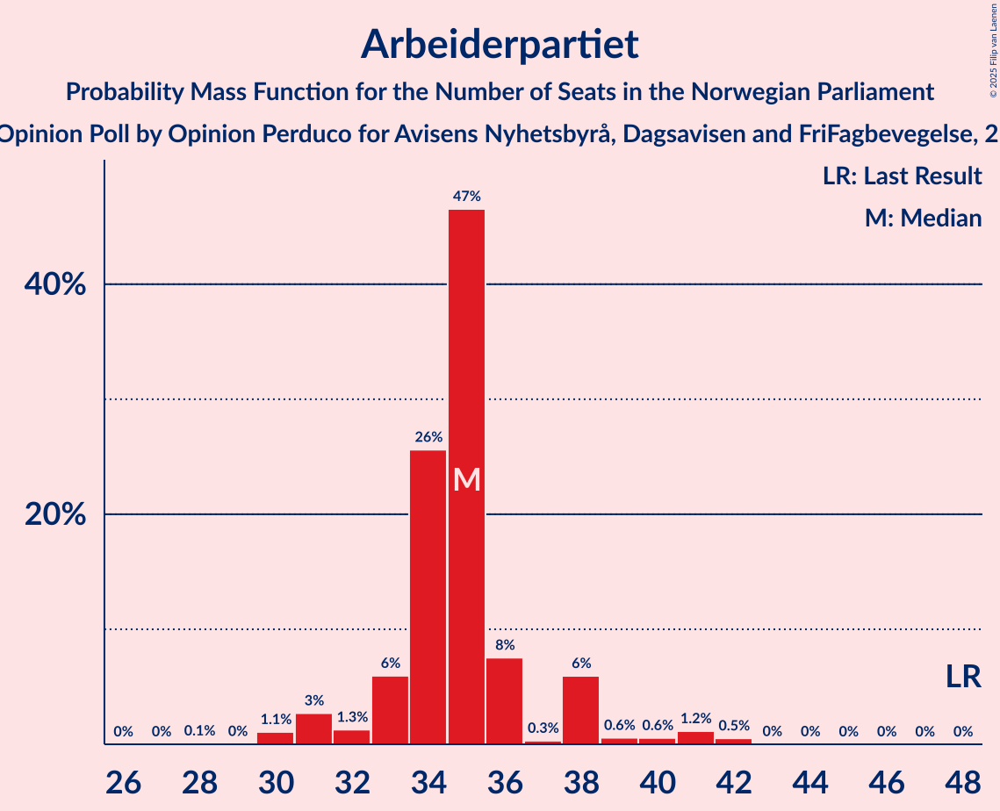

# Opinion Poll by Opinion Perduco for Avisens Nyhetsbyrå, Dagsavisen and FriFagbevegelse, 2–8 May 2023

<a href="#voting-intentions">Voting Intentions</a> | <a href="#seats">Seats</a> | <a href="#coalitions">Coalitions</a> | <a href="#technical-information">Technical Information</a>

## Voting Intentions

### Confidence Intervals

| Party | Last Result | Poll Result | 80% Confidence Interval | 90% Confidence Interval | 95% Confidence Interval | 99% Confidence Interval |
|:-----:|:-----------:|:-----------:|:-----------------------:|:-----------------------:|:-----------------------:|:-----------------------:|
| Høyre | 20.4% | 30.3% | 28.5–32.2% |28.0–32.8% |27.5–33.2% |26.7–34.2% |
| Arbeiderpartiet | 26.2% | 17.9% | 16.4–19.5% |16.0–20.0% |15.6–20.4% |15.0–21.2% |
| Fremskrittspartiet | 11.6% | 13.4% | 12.1–14.9% |11.7–15.3% |11.4–15.7% |10.8–16.4% |
| Sosialistisk Venstreparti | 7.6% | 8.1% | 7.1–9.3% |6.8–9.7% |6.6–10.0% |6.1–10.6% |
| Rødt | 4.7% | 7.0% | 6.1–8.2% |5.8–8.5% |5.6–8.8% |5.2–9.3% |
| Senterpartiet | 13.5% | 6.5% | 5.6–7.6% |5.3–7.9% |5.1–8.2% |4.7–8.8% |
| Venstre | 4.6% | 4.2% | 3.5–5.1% |3.3–5.4% |3.1–5.6% |2.8–6.1% |
| Kristelig Folkeparti | 3.8% | 4.1% | 3.4–5.0% |3.2–5.3% |3.0–5.5% |2.7–6.0% |
| Miljøpartiet De Grønne | 3.9% | 3.7% | 3.0–4.6% |2.9–4.8% |2.7–5.1% |2.4–5.5% |
| Industri- og Næringspartiet | 0.3% | 3.0% | 2.4–3.8% |2.2–4.1% |2.1–4.3% |1.9–4.7% |
| Konservativt | 0.4% | 0.7% | 0.5–1.2% |0.4–1.3% |0.3–1.4% |0.2–1.7% |
| Norgesdemokratene | 1.1% | 0.3% | 0.2–0.7% |0.1–0.8% |0.1–0.9% |0.1–1.1% |
| Pensjonistpartiet | 0.6% | 0.2% | 0.1–0.5% |0.1–0.6% |0.1–0.7% |0.0–0.9% |
| Folkets parti | 0.1% | 0.1% | 0.0–0.4% |0.0–0.5% |0.0–0.6% |0.0–0.7% |

*Note:* The poll result column reflects the actual value used in the calculations. Published results may vary slightly, and in addition be rounded to fewer digits.

## Seats

### Confidence Intervals

| Party | Last Result | Median | 80% Confidence Interval | 90% Confidence Interval | 95% Confidence Interval | 99% Confidence Interval |
|:-----:|:-----------:|:------:|:-----------------------:|:-----------------------:|:-----------------------:|:-----------------------:|
| <a href="#høyre">Høyre</a> | 36 | 53 | 50–60 |50–61 |49–61 |48–61 |
| <a href="#arbeiderpartiet">Arbeiderpartiet</a> | 48 | 35 | 33–36 |32–38 |31–39 |30–42 |
| <a href="#fremskrittspartiet">Fremskrittspartiet</a> | 21 | 21 | 21–26 |21–28 |19–28 |19–30 |
| <a href="#sosialistisk-venstreparti">Sosialistisk Venstreparti</a> | 13 | 13 | 13–16 |12–16 |11–17 |9–18 |
| <a href="#rødt">Rødt</a> | 8 | 13 | 8–15 |8–15 |8–16 |8–17 |
| <a href="#senterpartiet">Senterpartiet</a> | 28 | 12 | 11–13 |9–14 |9–15 |9–16 |
| <a href="#venstre">Venstre</a> | 8 | 8 | 2–8 |2–8 |2–9 |2–9 |
| <a href="#kristelig-folkeparti">Kristelig Folkeparti</a> | 3 | 8 | 3–8 |2–8 |2–8 |1–10 |
| <a href="#miljøpartiet-de-grønne">Miljøpartiet De Grønne</a> | 3 | 2 | 1–8 |1–9 |1–9 |1–10 |
| <a href="#industri--og-næringspartiet">Industri- og Næringspartiet</a> | 0 | 3 | 0–3 |0–3 |0–6 |0–8 |
| <a href="#konservativt">Konservativt</a> | 0 | 0 | 0 |0 |0 |0 |
| <a href="#norgesdemokratene">Norgesdemokratene</a> | 0 | 0 | 0 |0 |0 |0 |
| <a href="#pensjonistpartiet">Pensjonistpartiet</a> | 0 | 0 | 0 |0 |0 |0 |
| <a href="#folkets-parti">Folkets parti</a> | 0 | 0 | 0 |0 |0 |0 |

### Høyre

*For a full overview of the results for this party, see the [Høyre](party-høyre.html) page.*

| Number of Seats | Probability | Accumulated | Special Marks |
|:---------------:|:-----------:|:-----------:|:-------------:|
| 36 | 0% | 100% | Last Result |
| 37 | 0% | 100% |  |
| 38 | 0% | 100% |  |
| 39 | 0% | 100% |  |
| 40 | 0% | 100% |  |
| 41 | 0% | 100% |  |
| 42 | 0% | 100% |  |
| 43 | 0% | 100% |  |
| 44 | 0% | 100% |  |
| 45 | 0% | 100% |  |
| 46 | 0.1% | 100% |  |
| 47 | 0.1% | 99.9% |  |
| 48 | 2% | 99.8% |  |
| 49 | 3% | 98% |  |
| 50 | 9% | 95% |  |
| 51 | 5% | 86% |  |
| 52 | 13% | 81% |  |
| 53 | 48% | 68% | Median |
| 54 | 2% | 20% |  |
| 55 | 3% | 17% |  |
| 56 | 0.3% | 14% |  |
| 57 | 0.4% | 14% |  |
| 58 | 0.5% | 14% |  |
| 59 | 3% | 13% |  |
| 60 | 1.0% | 10% |  |
| 61 | 9% | 9% |  |
| 62 | 0% | 0.1% |  |
| 63 | 0% | 0.1% |  |
| 64 | 0% | 0.1% |  |
| 65 | 0% | 0% |  |

### Arbeiderpartiet

*For a full overview of the results for this party, see the [Arbeiderpartiet](party-arbeiderpartiet.html) page.*

| Number of Seats | Probability | Accumulated | Special Marks |
|:---------------:|:-----------:|:-----------:|:-------------:|
| 28 | 0.1% | 100% |  |
| 29 | 0% | 99.9% |  |
| 30 | 1.1% | 99.8% |  |
| 31 | 3% | 98.8% |  |
| 32 | 1.3% | 96% |  |
| 33 | 6% | 95% |  |
| 34 | 26% | 89% |  |
| 35 | 47% | 63% | Median |
| 36 | 8% | 17% |  |
| 37 | 0.3% | 9% |  |
| 38 | 6% | 9% |  |
| 39 | 0.6% | 3% |  |
| 40 | 0.6% | 2% |  |
| 41 | 1.2% | 2% |  |
| 42 | 0.5% | 0.6% |  |
| 43 | 0% | 0.1% |  |
| 44 | 0% | 0% |  |
| 45 | 0% | 0% |  |
| 46 | 0% | 0% |  |
| 47 | 0% | 0% |  |
| 48 | 0% | 0% | Last Result |

### Fremskrittspartiet

*For a full overview of the results for this party, see the [Fremskrittspartiet](party-fremskrittspartiet.html) page.*

| Number of Seats | Probability | Accumulated | Special Marks |
|:---------------:|:-----------:|:-----------:|:-------------:|
| 18 | 0.2% | 100% |  |
| 19 | 3% | 99.7% |  |
| 20 | 0.5% | 97% |  |
| 21 | 47% | 96% | Last Result, Median |
| 22 | 3% | 49% |  |
| 23 | 3% | 47% |  |
| 24 | 4% | 44% |  |
| 25 | 5% | 40% |  |
| 26 | 28% | 35% |  |
| 27 | 0.8% | 6% |  |
| 28 | 4% | 6% |  |
| 29 | 0.6% | 2% |  |
| 30 | 1.0% | 1.3% |  |
| 31 | 0.2% | 0.3% |  |
| 32 | 0.1% | 0.1% |  |
| 33 | 0% | 0% |  |

### Sosialistisk Venstreparti

*For a full overview of the results for this party, see the [Sosialistisk Venstreparti](party-sosialistiskvenstreparti.html) page.*

| Number of Seats | Probability | Accumulated | Special Marks |
|:---------------:|:-----------:|:-----------:|:-------------:|
| 9 | 0.5% | 100% |  |
| 10 | 2% | 99.5% |  |
| 11 | 2% | 98% |  |
| 12 | 5% | 96% |  |
| 13 | 57% | 91% | Last Result, Median |
| 14 | 14% | 34% |  |
| 15 | 5% | 19% |  |
| 16 | 12% | 14% |  |
| 17 | 1.3% | 3% |  |
| 18 | 1.3% | 1.4% |  |
| 19 | 0.1% | 0.1% |  |
| 20 | 0% | 0% |  |

### Rødt

*For a full overview of the results for this party, see the [Rødt](party-rødt.html) page.*

| Number of Seats | Probability | Accumulated | Special Marks |
|:---------------:|:-----------:|:-----------:|:-------------:|
| 8 | 11% | 100% | Last Result |
| 9 | 2% | 89% |  |
| 10 | 1.0% | 87% |  |
| 11 | 6% | 86% |  |
| 12 | 7% | 80% |  |
| 13 | 47% | 73% | Median |
| 14 | 10% | 27% |  |
| 15 | 12% | 17% |  |
| 16 | 4% | 4% |  |
| 17 | 0.5% | 0.5% |  |
| 18 | 0% | 0% |  |

### Senterpartiet

*For a full overview of the results for this party, see the [Senterpartiet](party-senterpartiet.html) page.*

| Number of Seats | Probability | Accumulated | Special Marks |
|:---------------:|:-----------:|:-----------:|:-------------:|
| 7 | 0% | 100% |  |
| 8 | 0.4% | 99.9% |  |
| 9 | 5% | 99.5% |  |
| 10 | 3% | 95% |  |
| 11 | 24% | 92% |  |
| 12 | 48% | 68% | Median |
| 13 | 11% | 20% |  |
| 14 | 5% | 10% |  |
| 15 | 4% | 5% |  |
| 16 | 1.1% | 1.2% |  |
| 17 | 0% | 0% |  |
| 18 | 0% | 0% |  |
| 19 | 0% | 0% |  |
| 20 | 0% | 0% |  |
| 21 | 0% | 0% |  |
| 22 | 0% | 0% |  |
| 23 | 0% | 0% |  |
| 24 | 0% | 0% |  |
| 25 | 0% | 0% |  |
| 26 | 0% | 0% |  |
| 27 | 0% | 0% |  |
| 28 | 0% | 0% | Last Result |

### Venstre

*For a full overview of the results for this party, see the [Venstre](party-venstre.html) page.*

| Number of Seats | Probability | Accumulated | Special Marks |
|:---------------:|:-----------:|:-----------:|:-------------:|
| 2 | 17% | 100% |  |
| 3 | 15% | 83% |  |
| 4 | 0% | 68% |  |
| 5 | 0% | 68% |  |
| 6 | 0.6% | 68% |  |
| 7 | 3% | 67% |  |
| 8 | 60% | 64% | Last Result, Median |
| 9 | 3% | 4% |  |
| 10 | 0.3% | 0.4% |  |
| 11 | 0.1% | 0.1% |  |
| 12 | 0% | 0% |  |

### Kristelig Folkeparti

*For a full overview of the results for this party, see the [Kristelig Folkeparti](party-kristeligfolkeparti.html) page.*

| Number of Seats | Probability | Accumulated | Special Marks |
|:---------------:|:-----------:|:-----------:|:-------------:|
| 0 | 0.2% | 100% |  |
| 1 | 0.4% | 99.8% |  |
| 2 | 9% | 99.4% |  |
| 3 | 16% | 90% | Last Result |
| 4 | 0% | 74% |  |
| 5 | 0% | 74% |  |
| 6 | 0.1% | 74% |  |
| 7 | 15% | 74% |  |
| 8 | 58% | 60% | Median |
| 9 | 0.7% | 2% |  |
| 10 | 0.8% | 1.0% |  |
| 11 | 0.2% | 0.2% |  |
| 12 | 0% | 0% |  |

### Miljøpartiet De Grønne

*For a full overview of the results for this party, see the [Miljøpartiet De Grønne](party-miljøpartietdegrønne.html) page.*

| Number of Seats | Probability | Accumulated | Special Marks |
|:---------------:|:-----------:|:-----------:|:-------------:|
| 1 | 15% | 100% |  |
| 2 | 55% | 85% | Median |
| 3 | 4% | 30% | Last Result |
| 4 | 0% | 26% |  |
| 5 | 0% | 26% |  |
| 6 | 0.1% | 26% |  |
| 7 | 8% | 26% |  |
| 8 | 12% | 18% |  |
| 9 | 5% | 6% |  |
| 10 | 1.2% | 1.4% |  |
| 11 | 0.1% | 0.1% |  |
| 12 | 0% | 0% |  |

### Industri- og Næringspartiet

*For a full overview of the results for this party, see the [Industri- og Næringspartiet](party-industri-ognæringspartiet.html) page.*

| Number of Seats | Probability | Accumulated | Special Marks |
|:---------------:|:-----------:|:-----------:|:-------------:|
| 0 | 17% | 100% | Last Result |
| 1 | 3% | 83% |  |
| 2 | 26% | 80% |  |
| 3 | 51% | 54% | Median |
| 4 | 0% | 3% |  |
| 5 | 0% | 3% |  |
| 6 | 0.5% | 3% |  |
| 7 | 0.9% | 2% |  |
| 8 | 1.3% | 1.3% |  |
| 9 | 0% | 0% |  |

### Konservativt

*For a full overview of the results for this party, see the [Konservativt](party-konservativt.html) page.*

| Number of Seats | Probability | Accumulated | Special Marks |
|:---------------:|:-----------:|:-----------:|:-------------:|
| 0 | 100% | 100% | Last Result, Median |

### Norgesdemokratene

*For a full overview of the results for this party, see the [Norgesdemokratene](party-norgesdemokratene.html) page.*

| Number of Seats | Probability | Accumulated | Special Marks |
|:---------------:|:-----------:|:-----------:|:-------------:|
| 0 | 100% | 100% | Last Result, Median |

### Pensjonistpartiet

*For a full overview of the results for this party, see the [Pensjonistpartiet](party-pensjonistpartiet.html) page.*

| Number of Seats | Probability | Accumulated | Special Marks |
|:---------------:|:-----------:|:-----------:|:-------------:|
| 0 | 100% | 100% | Last Result, Median |

### Folkets parti

*For a full overview of the results for this party, see the [Folkets parti](party-folketsparti.html) page.*

| Number of Seats | Probability | Accumulated | Special Marks |
|:---------------:|:-----------:|:-----------:|:-------------:|
| 0 | 100% | 100% | Last Result, Median |

## Coalitions

### Confidence Intervals

| Coalition | Last Result | Median | Majority? | 80% Confidence Interval | 90% Confidence Interval | 95% Confidence Interval | 99% Confidence Interval |
|:---------:|:-----------:|:------:|:---------:|:-----------------------:|:-----------------------:|:-----------------------:|:-----------------------:|
| Høyre – Fremskrittspartiet – Senterpartiet – Venstre – Kristelig Folkeparti | 96 | 102 | 100% | 96–104 | 95–104 | 93–107 | 91–108 |
| Høyre – Fremskrittspartiet – Venstre – Kristelig Folkeparti – Miljøpartiet De Grønne | 71 | 92 | 98.7% | 90–99 | 89–99 | 86–99 | 81–100 |
| Høyre – Fremskrittspartiet – Venstre – Kristelig Folkeparti | 68 | 90 | 91% | 85–92 | 82–92 | 80–94 | 80–97 |
| Høyre – Fremskrittspartiet – Venstre | 65 | 82 | 17% | 81–88 | 79–89 | 78–89 | 75–93 |
| Høyre – Fremskrittspartiet | 57 | 74 | 8% | 74–83 | 74–87 | 74–87 | 72–87 |
| Arbeiderpartiet – Sosialistisk Venstreparti – Rødt – Senterpartiet – Miljøpartiet De Grønne | 100 | 75 | 5% | 75–80 | 75–84 | 72–86 | 68–86 |
| Arbeiderpartiet – Sosialistisk Venstreparti – Rødt – Senterpartiet | 97 | 73 | 1.2% | 69–76 | 68–76 | 68–80 | 65–85 |
| Arbeiderpartiet – Sosialistisk Venstreparti – Senterpartiet – Kristelig Folkeparti – Miljøpartiet De Grønne | 95 | 70 | 0% | 66–76 | 65–76 | 64–76 | 61–78 |
| Arbeiderpartiet – Sosialistisk Venstreparti – Senterpartiet – Miljøpartiet De Grønne | 92 | 62 | 0% | 62–69 | 62–71 | 61–73 | 56–75 |
| Arbeiderpartiet – Sosialistisk Venstreparti – Rødt – Miljøpartiet De Grønne | 72 | 63 | 0% | 63–70 | 61–71 | 60–72 | 57–75 |
| Høyre – Venstre – Kristelig Folkeparti | 47 | 69 | 0% | 60–69 | 57–69 | 56–72 | 54–73 |
| Arbeiderpartiet – Sosialistisk Venstreparti – Senterpartiet | 89 | 60 | 0% | 59–62 | 56–64 | 56–65 | 53–70 |
| Arbeiderpartiet – Senterpartiet – Kristelig Folkeparti – Miljøpartiet De Grønne | 82 | 57 | 0% | 52–62 | 51–62 | 51–64 | 48–65 |
| Arbeiderpartiet – Senterpartiet – Kristelig Folkeparti | 79 | 55 | 0% | 48–55 | 47–55 | 45–56 | 44–60 |
| Arbeiderpartiet – Sosialistisk Venstreparti | 61 | 48 | 0% | 47–50 | 46–53 | 44–54 | 42–56 |
| Arbeiderpartiet – Senterpartiet | 76 | 47 | 0% | 45–49 | 42–52 | 42–52 | 40–52 |
| Senterpartiet – Venstre – Kristelig Folkeparti | 39 | 28 | 0% | 16–28 | 16–28 | 15–30 | 15–30 |

### Høyre – Fremskrittspartiet – Senterpartiet – Venstre – Kristelig Folkeparti

| Number of Seats | Probability | Accumulated | Special Marks |
|:---------------:|:-----------:|:-----------:|:-------------:|
| 89 | 0% | 100% |  |
| 90 | 0.2% | 99.9% |  |
| 91 | 1.1% | 99.8% |  |
| 92 | 0.6% | 98.6% |  |
| 93 | 0.6% | 98% |  |
| 94 | 2% | 97% |  |
| 95 | 4% | 96% |  |
| 96 | 4% | 92% | Last Result |
| 97 | 1.1% | 88% |  |
| 98 | 0.3% | 87% |  |
| 99 | 2% | 87% |  |
| 100 | 13% | 85% |  |
| 101 | 3% | 71% |  |
| 102 | 46% | 69% | Median |
| 103 | 7% | 23% |  |
| 104 | 11% | 15% |  |
| 105 | 0.5% | 5% |  |
| 106 | 0.8% | 4% |  |
| 107 | 2% | 4% |  |
| 108 | 1.0% | 1.4% |  |
| 109 | 0.1% | 0.4% |  |
| 110 | 0% | 0.3% |  |
| 111 | 0.3% | 0.3% |  |
| 112 | 0% | 0% |  |

### Høyre – Fremskrittspartiet – Venstre – Kristelig Folkeparti – Miljøpartiet De Grønne

| Number of Seats | Probability | Accumulated | Special Marks |
|:---------------:|:-----------:|:-----------:|:-------------:|
| 71 | 0% | 100% | Last Result |
| 72 | 0% | 100% |  |
| 73 | 0% | 100% |  |
| 74 | 0% | 100% |  |
| 75 | 0% | 100% |  |
| 76 | 0% | 100% |  |
| 77 | 0% | 100% |  |
| 78 | 0% | 100% |  |
| 79 | 0% | 100% |  |
| 80 | 0% | 100% |  |
| 81 | 1.2% | 100% |  |
| 82 | 0% | 98.8% |  |
| 83 | 0% | 98.7% |  |
| 84 | 0% | 98.7% |  |
| 85 | 0.6% | 98.7% | Majority |
| 86 | 2% | 98% |  |
| 87 | 0.2% | 96% |  |
| 88 | 0.3% | 96% |  |
| 89 | 0.9% | 96% |  |
| 90 | 15% | 95% |  |
| 91 | 2% | 80% |  |
| 92 | 47% | 78% | Median |
| 93 | 2% | 31% |  |
| 94 | 8% | 29% |  |
| 95 | 3% | 21% |  |
| 96 | 1.1% | 18% |  |
| 97 | 1.2% | 17% |  |
| 98 | 4% | 16% |  |
| 99 | 10% | 12% |  |
| 100 | 0.9% | 1.1% |  |
| 101 | 0.1% | 0.2% |  |
| 102 | 0% | 0.1% |  |
| 103 | 0% | 0.1% |  |
| 104 | 0% | 0.1% |  |
| 105 | 0% | 0.1% |  |
| 106 | 0% | 0% |  |

### Høyre – Fremskrittspartiet – Venstre – Kristelig Folkeparti

| Number of Seats | Probability | Accumulated | Special Marks |
|:---------------:|:-----------:|:-----------:|:-------------:|
| 68 | 0% | 100% | Last Result |
| 69 | 0% | 100% |  |
| 70 | 0% | 100% |  |
| 71 | 0% | 100% |  |
| 72 | 0% | 100% |  |
| 73 | 0% | 100% |  |
| 74 | 0% | 100% |  |
| 75 | 0% | 100% |  |
| 76 | 0% | 100% |  |
| 77 | 0% | 99.9% |  |
| 78 | 0.2% | 99.9% |  |
| 79 | 0% | 99.7% |  |
| 80 | 2% | 99.7% |  |
| 81 | 2% | 97% |  |
| 82 | 1.1% | 95% |  |
| 83 | 0.4% | 94% |  |
| 84 | 2% | 94% |  |
| 85 | 3% | 91% | Majority |
| 86 | 2% | 88% |  |
| 87 | 1.1% | 86% |  |
| 88 | 2% | 85% |  |
| 89 | 11% | 83% |  |
| 90 | 47% | 72% | Median |
| 91 | 14% | 25% |  |
| 92 | 8% | 11% |  |
| 93 | 0.3% | 3% |  |
| 94 | 1.0% | 3% |  |
| 95 | 0.4% | 2% |  |
| 96 | 0.2% | 1.4% |  |
| 97 | 1.1% | 1.2% |  |
| 98 | 0% | 0.1% |  |
| 99 | 0% | 0.1% |  |
| 100 | 0% | 0% |  |

### Høyre – Fremskrittspartiet – Venstre

| Number of Seats | Probability | Accumulated | Special Marks |
|:---------------:|:-----------:|:-----------:|:-------------:|
| 65 | 0% | 100% | Last Result |
| 66 | 0% | 100% |  |
| 67 | 0% | 100% |  |
| 68 | 0% | 100% |  |
| 69 | 0% | 100% |  |
| 70 | 0% | 100% |  |
| 71 | 0% | 100% |  |
| 72 | 0% | 100% |  |
| 73 | 0% | 100% |  |
| 74 | 0% | 99.9% |  |
| 75 | 0.7% | 99.9% |  |
| 76 | 0.2% | 99.2% |  |
| 77 | 1.2% | 99.0% |  |
| 78 | 2% | 98% |  |
| 79 | 3% | 96% |  |
| 80 | 1.1% | 93% |  |
| 81 | 14% | 92% |  |
| 82 | 46% | 78% | Median |
| 83 | 6% | 32% |  |
| 84 | 9% | 26% |  |
| 85 | 3% | 17% | Majority |
| 86 | 1.1% | 14% |  |
| 87 | 0.8% | 13% |  |
| 88 | 3% | 12% |  |
| 89 | 8% | 9% |  |
| 90 | 1.0% | 2% |  |
| 91 | 0.1% | 0.7% |  |
| 92 | 0.1% | 0.6% |  |
| 93 | 0.2% | 0.5% |  |
| 94 | 0.1% | 0.4% |  |
| 95 | 0.3% | 0.3% |  |
| 96 | 0% | 0% |  |

### Høyre – Fremskrittspartiet

| Number of Seats | Probability | Accumulated | Special Marks |
|:---------------:|:-----------:|:-----------:|:-------------:|
| 57 | 0% | 100% | Last Result |
| 58 | 0% | 100% |  |
| 59 | 0% | 100% |  |
| 60 | 0% | 100% |  |
| 61 | 0% | 100% |  |
| 62 | 0% | 100% |  |
| 63 | 0% | 100% |  |
| 64 | 0% | 100% |  |
| 65 | 0% | 100% |  |
| 66 | 0% | 100% |  |
| 67 | 0% | 100% |  |
| 68 | 0% | 100% |  |
| 69 | 0.2% | 100% |  |
| 70 | 0.1% | 99.8% |  |
| 71 | 0.1% | 99.7% |  |
| 72 | 0.9% | 99.7% |  |
| 73 | 1.2% | 98.7% |  |
| 74 | 49% | 98% | Median |
| 75 | 2% | 49% |  |
| 76 | 13% | 47% |  |
| 77 | 4% | 34% |  |
| 78 | 10% | 31% |  |
| 79 | 3% | 20% |  |
| 80 | 4% | 17% |  |
| 81 | 3% | 13% |  |
| 82 | 0.3% | 10% |  |
| 83 | 1.3% | 10% |  |
| 84 | 0.8% | 9% |  |
| 85 | 0.1% | 8% | Majority |
| 86 | 0.1% | 8% |  |
| 87 | 8% | 8% |  |
| 88 | 0% | 0.2% |  |
| 89 | 0% | 0.2% |  |
| 90 | 0.1% | 0.2% |  |
| 91 | 0.1% | 0.1% |  |
| 92 | 0% | 0% |  |

### Arbeiderpartiet – Sosialistisk Venstreparti – Rødt – Senterpartiet – Miljøpartiet De Grønne

| Number of Seats | Probability | Accumulated | Special Marks |
|:---------------:|:-----------:|:-----------:|:-------------:|
| 66 | 0% | 100% |  |
| 67 | 0% | 99.9% |  |
| 68 | 0.8% | 99.9% |  |
| 69 | 0.5% | 99.1% |  |
| 70 | 0.1% | 98.6% |  |
| 71 | 0.6% | 98.6% |  |
| 72 | 0.8% | 98% |  |
| 73 | 1.1% | 97% |  |
| 74 | 0.7% | 96% |  |
| 75 | 52% | 95% | Median |
| 76 | 8% | 44% |  |
| 77 | 20% | 36% |  |
| 78 | 2% | 16% |  |
| 79 | 1.0% | 14% |  |
| 80 | 4% | 13% |  |
| 81 | 0.2% | 8% |  |
| 82 | 2% | 8% |  |
| 83 | 0.7% | 6% |  |
| 84 | 0.4% | 5% |  |
| 85 | 2% | 5% | Majority |
| 86 | 3% | 3% |  |
| 87 | 0% | 0.1% |  |
| 88 | 0% | 0.1% |  |
| 89 | 0% | 0.1% |  |
| 90 | 0% | 0.1% |  |
| 91 | 0% | 0% |  |
| 92 | 0% | 0% |  |
| 93 | 0% | 0% |  |
| 94 | 0% | 0% |  |
| 95 | 0% | 0% |  |
| 96 | 0% | 0% |  |
| 97 | 0% | 0% |  |
| 98 | 0% | 0% |  |
| 99 | 0% | 0% |  |
| 100 | 0% | 0% | Last Result |

### Arbeiderpartiet – Sosialistisk Venstreparti – Rødt – Senterpartiet

| Number of Seats | Probability | Accumulated | Special Marks |
|:---------------:|:-----------:|:-----------:|:-------------:|
| 61 | 0% | 100% |  |
| 62 | 0% | 99.9% |  |
| 63 | 0% | 99.9% |  |
| 64 | 0% | 99.9% |  |
| 65 | 1.3% | 99.9% |  |
| 66 | 0.1% | 98.6% |  |
| 67 | 0.9% | 98.5% |  |
| 68 | 5% | 98% |  |
| 69 | 10% | 93% |  |
| 70 | 1.3% | 83% |  |
| 71 | 3% | 81% |  |
| 72 | 2% | 78% |  |
| 73 | 47% | 76% | Median |
| 74 | 7% | 28% |  |
| 75 | 3% | 21% |  |
| 76 | 15% | 19% |  |
| 77 | 0.8% | 4% |  |
| 78 | 0.3% | 3% |  |
| 79 | 0.1% | 3% |  |
| 80 | 2% | 3% |  |
| 81 | 0% | 1.3% |  |
| 82 | 0% | 1.3% |  |
| 83 | 0% | 1.3% |  |
| 84 | 0% | 1.3% |  |
| 85 | 1.2% | 1.2% | Majority |
| 86 | 0% | 0% |  |
| 87 | 0% | 0% |  |
| 88 | 0% | 0% |  |
| 89 | 0% | 0% |  |
| 90 | 0% | 0% |  |
| 91 | 0% | 0% |  |
| 92 | 0% | 0% |  |
| 93 | 0% | 0% |  |
| 94 | 0% | 0% |  |
| 95 | 0% | 0% |  |
| 96 | 0% | 0% |  |
| 97 | 0% | 0% | Last Result |

### Arbeiderpartiet – Sosialistisk Venstreparti – Senterpartiet – Kristelig Folkeparti – Miljøpartiet De Grønne

| Number of Seats | Probability | Accumulated | Special Marks |
|:---------------:|:-----------:|:-----------:|:-------------:|
| 57 | 0.1% | 100% |  |
| 58 | 0% | 99.9% |  |
| 59 | 0% | 99.9% |  |
| 60 | 0.1% | 99.9% |  |
| 61 | 0.3% | 99.8% |  |
| 62 | 0.1% | 99.5% |  |
| 63 | 0.9% | 99.4% |  |
| 64 | 1.2% | 98.6% |  |
| 65 | 7% | 97% |  |
| 66 | 5% | 90% |  |
| 67 | 0.5% | 85% |  |
| 68 | 0.3% | 85% |  |
| 69 | 4% | 84% |  |
| 70 | 57% | 80% | Median |
| 71 | 3% | 23% |  |
| 72 | 1.1% | 20% |  |
| 73 | 4% | 19% |  |
| 74 | 2% | 16% |  |
| 75 | 2% | 13% |  |
| 76 | 10% | 11% |  |
| 77 | 0.1% | 1.4% |  |
| 78 | 1.2% | 1.3% |  |
| 79 | 0% | 0.1% |  |
| 80 | 0.1% | 0.1% |  |
| 81 | 0% | 0% |  |
| 82 | 0% | 0% |  |
| 83 | 0% | 0% |  |
| 84 | 0% | 0% |  |
| 85 | 0% | 0% | Majority |
| 86 | 0% | 0% |  |
| 87 | 0% | 0% |  |
| 88 | 0% | 0% |  |
| 89 | 0% | 0% |  |
| 90 | 0% | 0% |  |
| 91 | 0% | 0% |  |
| 92 | 0% | 0% |  |
| 93 | 0% | 0% |  |
| 94 | 0% | 0% |  |
| 95 | 0% | 0% | Last Result |

### Arbeiderpartiet – Sosialistisk Venstreparti – Senterpartiet – Miljøpartiet De Grønne

| Number of Seats | Probability | Accumulated | Special Marks |
|:---------------:|:-----------:|:-----------:|:-------------:|
| 54 | 0.1% | 100% |  |
| 55 | 0% | 99.9% |  |
| 56 | 0.8% | 99.9% |  |
| 57 | 0.5% | 99.1% |  |
| 58 | 0.1% | 98.6% |  |
| 59 | 0.4% | 98% |  |
| 60 | 0.3% | 98% |  |
| 61 | 1.0% | 98% |  |
| 62 | 64% | 97% | Median |
| 63 | 4% | 33% |  |
| 64 | 3% | 29% |  |
| 65 | 0.8% | 26% |  |
| 66 | 7% | 25% |  |
| 67 | 2% | 19% |  |
| 68 | 0.8% | 17% |  |
| 69 | 10% | 16% |  |
| 70 | 0.2% | 6% |  |
| 71 | 1.5% | 5% |  |
| 72 | 0.1% | 4% |  |
| 73 | 2% | 4% |  |
| 74 | 0.5% | 2% |  |
| 75 | 1.2% | 1.2% |  |
| 76 | 0% | 0% |  |
| 77 | 0% | 0% |  |
| 78 | 0% | 0% |  |
| 79 | 0% | 0% |  |
| 80 | 0% | 0% |  |
| 81 | 0% | 0% |  |
| 82 | 0% | 0% |  |
| 83 | 0% | 0% |  |
| 84 | 0% | 0% |  |
| 85 | 0% | 0% | Majority |
| 86 | 0% | 0% |  |
| 87 | 0% | 0% |  |
| 88 | 0% | 0% |  |
| 89 | 0% | 0% |  |
| 90 | 0% | 0% |  |
| 91 | 0% | 0% |  |
| 92 | 0% | 0% | Last Result |

### Arbeiderpartiet – Sosialistisk Venstreparti – Rødt – Miljøpartiet De Grønne

| Number of Seats | Probability | Accumulated | Special Marks |
|:---------------:|:-----------:|:-----------:|:-------------:|
| 55 | 0.3% | 100% |  |
| 56 | 0% | 99.7% |  |
| 57 | 0.8% | 99.7% |  |
| 58 | 0.6% | 98.9% |  |
| 59 | 0.2% | 98% |  |
| 60 | 3% | 98% |  |
| 61 | 3% | 96% |  |
| 62 | 0.3% | 93% |  |
| 63 | 47% | 93% | Median |
| 64 | 11% | 46% |  |
| 65 | 6% | 35% |  |
| 66 | 14% | 29% |  |
| 67 | 2% | 14% |  |
| 68 | 0.6% | 12% |  |
| 69 | 1.4% | 12% |  |
| 70 | 3% | 10% |  |
| 71 | 4% | 7% |  |
| 72 | 1.2% | 3% | Last Result |
| 73 | 0.1% | 2% |  |
| 74 | 0% | 2% |  |
| 75 | 2% | 2% |  |
| 76 | 0% | 0.1% |  |
| 77 | 0% | 0% |  |

### Høyre – Venstre – Kristelig Folkeparti

| Number of Seats | Probability | Accumulated | Special Marks |
|:---------------:|:-----------:|:-----------:|:-------------:|
| 47 | 0% | 100% | Last Result |
| 48 | 0% | 100% |  |
| 49 | 0% | 100% |  |
| 50 | 0% | 100% |  |
| 51 | 0% | 100% |  |
| 52 | 0% | 100% |  |
| 53 | 0.2% | 100% |  |
| 54 | 1.2% | 99.8% |  |
| 55 | 0% | 98.6% |  |
| 56 | 2% | 98.6% |  |
| 57 | 2% | 96% |  |
| 58 | 0.6% | 94% |  |
| 59 | 2% | 94% |  |
| 60 | 3% | 92% |  |
| 61 | 3% | 88% |  |
| 62 | 0.5% | 85% |  |
| 63 | 13% | 85% |  |
| 64 | 0.5% | 72% |  |
| 65 | 9% | 71% |  |
| 66 | 6% | 62% |  |
| 67 | 3% | 56% |  |
| 68 | 2% | 53% |  |
| 69 | 46% | 51% | Median |
| 70 | 0.1% | 5% |  |
| 71 | 0.4% | 4% |  |
| 72 | 3% | 4% |  |
| 73 | 0.8% | 1.0% |  |
| 74 | 0.1% | 0.2% |  |
| 75 | 0% | 0.1% |  |
| 76 | 0% | 0.1% |  |
| 77 | 0% | 0% |  |

### Arbeiderpartiet – Sosialistisk Venstreparti – Senterpartiet

| Number of Seats | Probability | Accumulated | Special Marks |
|:---------------:|:-----------:|:-----------:|:-------------:|
| 51 | 0% | 100% |  |
| 52 | 0% | 99.9% |  |
| 53 | 0.8% | 99.9% |  |
| 54 | 0.1% | 99.1% |  |
| 55 | 0.7% | 99.0% |  |
| 56 | 3% | 98% |  |
| 57 | 4% | 95% |  |
| 58 | 0.4% | 91% |  |
| 59 | 4% | 91% |  |
| 60 | 53% | 86% | Median |
| 61 | 24% | 34% |  |
| 62 | 1.4% | 10% |  |
| 63 | 1.0% | 9% |  |
| 64 | 4% | 8% |  |
| 65 | 2% | 3% |  |
| 66 | 0.1% | 1.4% |  |
| 67 | 0% | 1.4% |  |
| 68 | 0% | 1.3% |  |
| 69 | 0% | 1.3% |  |
| 70 | 1.2% | 1.3% |  |
| 71 | 0% | 0.1% |  |
| 72 | 0% | 0% |  |
| 73 | 0% | 0% |  |
| 74 | 0% | 0% |  |
| 75 | 0% | 0% |  |
| 76 | 0% | 0% |  |
| 77 | 0% | 0% |  |
| 78 | 0% | 0% |  |
| 79 | 0% | 0% |  |
| 80 | 0% | 0% |  |
| 81 | 0% | 0% |  |
| 82 | 0% | 0% |  |
| 83 | 0% | 0% |  |
| 84 | 0% | 0% |  |
| 85 | 0% | 0% | Majority |
| 86 | 0% | 0% |  |
| 87 | 0% | 0% |  |
| 88 | 0% | 0% |  |
| 89 | 0% | 0% | Last Result |

### Arbeiderpartiet – Senterpartiet – Kristelig Folkeparti – Miljøpartiet De Grønne

| Number of Seats | Probability | Accumulated | Special Marks |
|:---------------:|:-----------:|:-----------:|:-------------:|
| 43 | 0% | 100% |  |
| 44 | 0.1% | 99.9% |  |
| 45 | 0% | 99.8% |  |
| 46 | 0% | 99.8% |  |
| 47 | 0.2% | 99.8% |  |
| 48 | 0.4% | 99.5% |  |
| 49 | 0.1% | 99.1% |  |
| 50 | 0.9% | 99.0% |  |
| 51 | 4% | 98% |  |
| 52 | 9% | 94% |  |
| 53 | 0.6% | 85% |  |
| 54 | 12% | 84% |  |
| 55 | 2% | 73% |  |
| 56 | 2% | 70% |  |
| 57 | 47% | 68% | Median |
| 58 | 3% | 21% |  |
| 59 | 0.6% | 18% |  |
| 60 | 0.9% | 18% |  |
| 61 | 0.3% | 17% |  |
| 62 | 12% | 16% |  |
| 63 | 2% | 5% |  |
| 64 | 1.4% | 3% |  |
| 65 | 1.2% | 1.2% |  |
| 66 | 0% | 0.1% |  |
| 67 | 0% | 0% |  |
| 68 | 0% | 0% |  |
| 69 | 0% | 0% |  |
| 70 | 0% | 0% |  |
| 71 | 0% | 0% |  |
| 72 | 0% | 0% |  |
| 73 | 0% | 0% |  |
| 74 | 0% | 0% |  |
| 75 | 0% | 0% |  |
| 76 | 0% | 0% |  |
| 77 | 0% | 0% |  |
| 78 | 0% | 0% |  |
| 79 | 0% | 0% |  |
| 80 | 0% | 0% |  |
| 81 | 0% | 0% |  |
| 82 | 0% | 0% | Last Result |

### Arbeiderpartiet – Senterpartiet – Kristelig Folkeparti

| Number of Seats | Probability | Accumulated | Special Marks |
|:---------------:|:-----------:|:-----------:|:-------------:|
| 41 | 0.1% | 100% |  |
| 42 | 0.2% | 99.9% |  |
| 43 | 0% | 99.8% |  |
| 44 | 1.2% | 99.8% |  |
| 45 | 3% | 98.6% |  |
| 46 | 0.3% | 96% |  |
| 47 | 3% | 95% |  |
| 48 | 3% | 92% |  |
| 49 | 2% | 90% |  |
| 50 | 8% | 88% |  |
| 51 | 1.2% | 80% |  |
| 52 | 3% | 79% |  |
| 53 | 11% | 76% |  |
| 54 | 12% | 65% |  |
| 55 | 48% | 53% | Median |
| 56 | 2% | 5% |  |
| 57 | 1.2% | 2% |  |
| 58 | 0.1% | 1.2% |  |
| 59 | 0.2% | 1.2% |  |
| 60 | 1.0% | 1.0% |  |
| 61 | 0% | 0.1% |  |
| 62 | 0% | 0% |  |
| 63 | 0% | 0% |  |
| 64 | 0% | 0% |  |
| 65 | 0% | 0% |  |
| 66 | 0% | 0% |  |
| 67 | 0% | 0% |  |
| 68 | 0% | 0% |  |
| 69 | 0% | 0% |  |
| 70 | 0% | 0% |  |
| 71 | 0% | 0% |  |
| 72 | 0% | 0% |  |
| 73 | 0% | 0% |  |
| 74 | 0% | 0% |  |
| 75 | 0% | 0% |  |
| 76 | 0% | 0% |  |
| 77 | 0% | 0% |  |
| 78 | 0% | 0% |  |
| 79 | 0% | 0% | Last Result |

### Arbeiderpartiet – Sosialistisk Venstreparti

| Number of Seats | Probability | Accumulated | Special Marks |
|:---------------:|:-----------:|:-----------:|:-------------:|
| 40 | 0% | 100% |  |
| 41 | 0% | 99.9% |  |
| 42 | 0.9% | 99.9% |  |
| 43 | 0.1% | 99.1% |  |
| 44 | 3% | 99.0% |  |
| 45 | 1.0% | 96% |  |
| 46 | 5% | 95% |  |
| 47 | 5% | 91% |  |
| 48 | 58% | 86% | Median |
| 49 | 8% | 28% |  |
| 50 | 13% | 20% |  |
| 51 | 0.9% | 7% |  |
| 52 | 0.1% | 6% |  |
| 53 | 2% | 6% |  |
| 54 | 3% | 4% |  |
| 55 | 0% | 1.3% |  |
| 56 | 1.2% | 1.3% |  |
| 57 | 0% | 0.1% |  |
| 58 | 0% | 0.1% |  |
| 59 | 0% | 0.1% |  |
| 60 | 0% | 0% |  |
| 61 | 0% | 0% | Last Result |

### Arbeiderpartiet – Senterpartiet

| Number of Seats | Probability | Accumulated | Special Marks |
|:---------------:|:-----------:|:-----------:|:-------------:|
| 38 | 0.1% | 100% |  |
| 39 | 0.2% | 99.9% |  |
| 40 | 0.5% | 99.7% |  |
| 41 | 0.8% | 99.1% |  |
| 42 | 5% | 98% |  |
| 43 | 0.4% | 94% |  |
| 44 | 3% | 93% |  |
| 45 | 11% | 90% |  |
| 46 | 2% | 79% |  |
| 47 | 63% | 77% | Median |
| 48 | 2% | 14% |  |
| 49 | 5% | 12% |  |
| 50 | 0.3% | 6% |  |
| 51 | 0.7% | 6% |  |
| 52 | 5% | 5% |  |
| 53 | 0.1% | 0.1% |  |
| 54 | 0% | 0% |  |
| 55 | 0% | 0% |  |
| 56 | 0% | 0% |  |
| 57 | 0% | 0% |  |
| 58 | 0% | 0% |  |
| 59 | 0% | 0% |  |
| 60 | 0% | 0% |  |
| 61 | 0% | 0% |  |
| 62 | 0% | 0% |  |
| 63 | 0% | 0% |  |
| 64 | 0% | 0% |  |
| 65 | 0% | 0% |  |
| 66 | 0% | 0% |  |
| 67 | 0% | 0% |  |
| 68 | 0% | 0% |  |
| 69 | 0% | 0% |  |
| 70 | 0% | 0% |  |
| 71 | 0% | 0% |  |
| 72 | 0% | 0% |  |
| 73 | 0% | 0% |  |
| 74 | 0% | 0% |  |
| 75 | 0% | 0% |  |
| 76 | 0% | 0% | Last Result |

### Senterpartiet – Venstre – Kristelig Folkeparti

| Number of Seats | Probability | Accumulated | Special Marks |
|:---------------:|:-----------:|:-----------:|:-------------:|
| 14 | 0.1% | 100% |  |
| 15 | 3% | 99.8% |  |
| 16 | 9% | 97% |  |
| 17 | 1.4% | 87% |  |
| 18 | 2% | 86% |  |
| 19 | 3% | 83% |  |
| 20 | 5% | 81% |  |
| 21 | 1.0% | 76% |  |
| 22 | 12% | 75% |  |
| 23 | 0.2% | 64% |  |
| 24 | 1.4% | 64% |  |
| 25 | 2% | 62% |  |
| 26 | 2% | 61% |  |
| 27 | 1.0% | 59% |  |
| 28 | 54% | 58% | Median |
| 29 | 0% | 4% |  |
| 30 | 3% | 4% |  |
| 31 | 0.1% | 0.4% |  |
| 32 | 0.2% | 0.3% |  |
| 33 | 0% | 0% |  |
| 34 | 0% | 0% |  |
| 35 | 0% | 0% |  |
| 36 | 0% | 0% |  |
| 37 | 0% | 0% |  |
| 38 | 0% | 0% |  |
| 39 | 0% | 0% | Last Result |

## Technical Information

### Opinion Poll

+ **Polling firm:** Opinion Perduco
+ **Commissioner(s):** Avisens Nyhetsbyrå, Dagsavisen and FriFagbevegelse
+ **Fieldwork period:** 2–8 May 2023

### Calculations

+ **Sample size:** 1000
+ **Simulations done:** 1,048,576
+ **Error estimate:** 2.21%

