# Opinion Poll by Respons Analyse for VG, 3–8 May 2023

<a href="#voting-intentions">Voting Intentions</a> | <a href="#seats">Seats</a> | <a href="#coalitions">Coalitions</a> | <a href="#technical-information">Technical Information</a>

## Voting Intentions

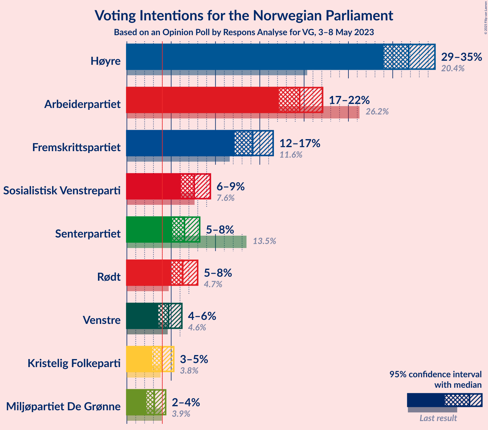

### Confidence Intervals

| Party | Last Result | Poll Result | 80% Confidence Interval | 90% Confidence Interval | 95% Confidence Interval | 99% Confidence Interval |
|:-----:|:-----------:|:-----------:|:-----------------------:|:-----------------------:|:-----------------------:|:-----------------------:|
| Høyre | 20.4% | 31.8% | 29.9–33.7% |29.4–34.3% |29.0–34.8% |28.1–35.7% |
| Arbeiderpartiet | 26.2% | 19.5% | 18.0–21.2% |17.5–21.7% |17.2–22.1% |16.4–22.9% |
| Fremskrittspartiet | 11.6% | 14.2% | 12.9–15.7% |12.5–16.1% |12.2–16.5% |11.6–17.3% |
| Sosialistisk Venstreparti | 7.6% | 7.6% | 6.6–8.8% |6.3–9.1% |6.1–9.4% |5.7–10.0% |
| Senterpartiet | 13.5% | 6.5% | 5.6–7.6% |5.3–7.9% |5.1–8.2% |4.7–8.8% |
| Rødt | 4.7% | 6.3% | 5.4–7.4% |5.2–7.7% |5.0–8.0% |4.6–8.6% |
| Venstre | 4.6% | 4.7% | 3.9–5.7% |3.7–6.0% |3.6–6.2% |3.2–6.7% |
| Kristelig Folkeparti | 3.8% | 3.9% | 3.2–4.8% |3.0–5.1% |2.9–5.3% |2.6–5.8% |
| Miljøpartiet De Grønne | 3.9% | 3.1% | 2.5–3.9% |2.3–4.2% |2.2–4.4% |1.9–4.8% |

*Note:* The poll result column reflects the actual value used in the calculations. Published results may vary slightly, and in addition be rounded to fewer digits.

## Seats

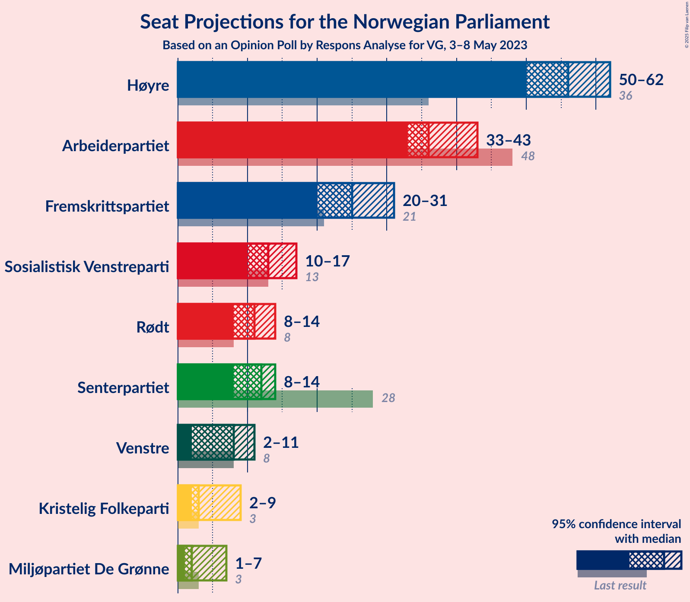

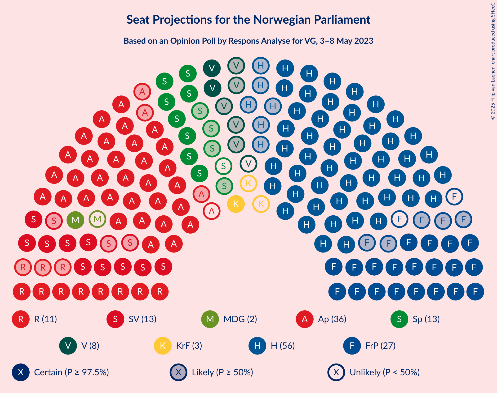

### Confidence Intervals

| Party | Last Result | Median | 80% Confidence Interval | 90% Confidence Interval | 95% Confidence Interval | 99% Confidence Interval |
|:-----:|:-----------:|:------:|:-----------------------:|:-----------------------:|:-----------------------:|:-----------------------:|
| <a href="#høyre">Høyre</a> | 36 | 56 | 52–59 |50–61 |50–62 |48–65 |
| <a href="#arbeiderpartiet">Arbeiderpartiet</a> | 48 | 36 | 34–41 |33–42 |33–43 |31–45 |
| <a href="#fremskrittspartiet">Fremskrittspartiet</a> | 21 | 25 | 22–30 |21–30 |20–31 |19–32 |
| <a href="#sosialistisk-venstreparti">Sosialistisk Venstreparti</a> | 13 | 13 | 11–15 |11–16 |10–17 |9–17 |
| <a href="#senterpartiet">Senterpartiet</a> | 28 | 12 | 9–13 |9–14 |8–14 |7–15 |
| <a href="#rødt">Rødt</a> | 8 | 11 | 9–13 |9–13 |8–14 |8–15 |
| <a href="#venstre">Venstre</a> | 8 | 8 | 3–10 |3–10 |2–11 |2–12 |
| <a href="#kristelig-folkeparti">Kristelig Folkeparti</a> | 3 | 3 | 2–8 |2–9 |2–9 |1–10 |
| <a href="#miljøpartiet-de-grønne">Miljøpartiet De Grønne</a> | 3 | 2 | 1–3 |1–7 |1–7 |1–8 |

### Høyre

*For a full overview of the results for this party, see the [Høyre](party-høyre.html) page.*

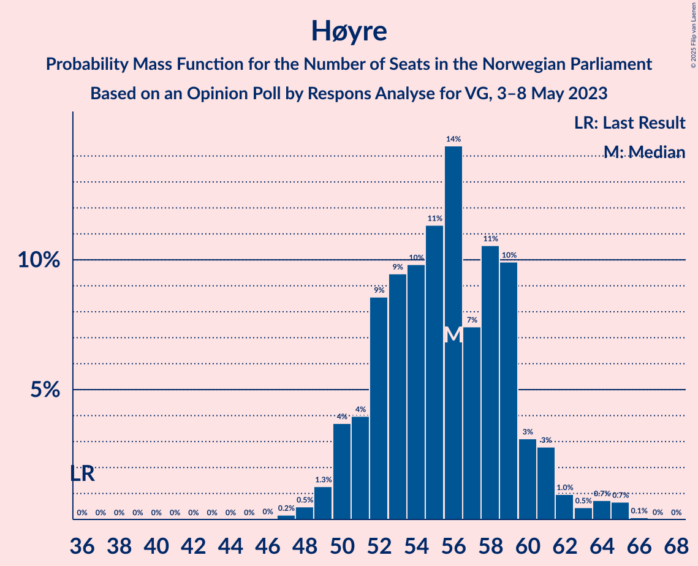

| Number of Seats | Probability | Accumulated | Special Marks |
|:---------------:|:-----------:|:-----------:|:-------------:|
| 36 | 0% | 100% | Last Result |
| 37 | 0% | 100% |  |
| 38 | 0% | 100% |  |
| 39 | 0% | 100% |  |
| 40 | 0% | 100% |  |
| 41 | 0% | 100% |  |
| 42 | 0% | 100% |  |
| 43 | 0% | 100% |  |
| 44 | 0% | 100% |  |
| 45 | 0% | 100% |  |
| 46 | 0% | 100% |  |
| 47 | 0.2% | 100% |  |
| 48 | 0.5% | 99.8% |  |
| 49 | 1.3% | 99.3% |  |
| 50 | 4% | 98% |  |
| 51 | 4% | 94% |  |
| 52 | 9% | 90% |  |
| 53 | 9% | 82% |  |
| 54 | 10% | 72% |  |
| 55 | 11% | 62% |  |
| 56 | 14% | 51% | Median |
| 57 | 7% | 37% |  |
| 58 | 11% | 29% |  |
| 59 | 10% | 19% |  |
| 60 | 3% | 9% |  |
| 61 | 3% | 6% |  |
| 62 | 1.0% | 3% |  |
| 63 | 0.5% | 2% |  |
| 64 | 0.7% | 2% |  |
| 65 | 0.7% | 0.8% |  |
| 66 | 0.1% | 0.1% |  |
| 67 | 0% | 0% |  |

### Arbeiderpartiet

*For a full overview of the results for this party, see the [Arbeiderpartiet](party-arbeiderpartiet.html) page.*

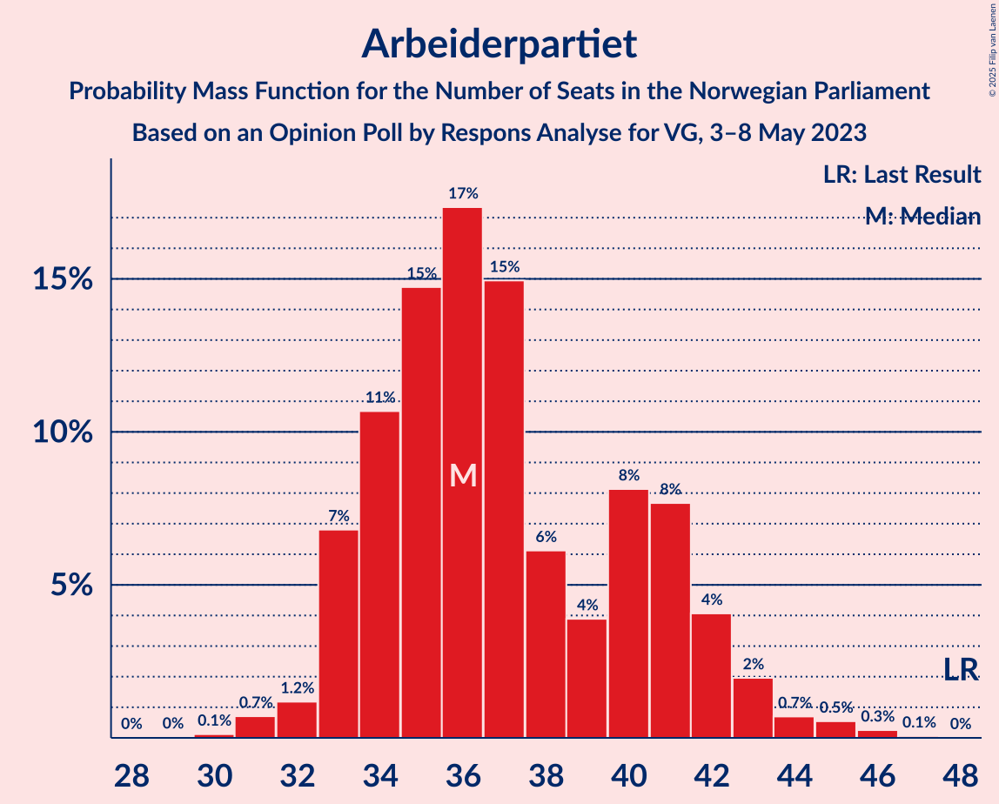

| Number of Seats | Probability | Accumulated | Special Marks |
|:---------------:|:-----------:|:-----------:|:-------------:|
| 30 | 0.1% | 100% |  |
| 31 | 0.7% | 99.8% |  |
| 32 | 1.2% | 99.1% |  |
| 33 | 7% | 98% |  |
| 34 | 11% | 91% |  |
| 35 | 15% | 80% |  |
| 36 | 17% | 66% | Median |
| 37 | 15% | 48% |  |
| 38 | 6% | 33% |  |
| 39 | 4% | 27% |  |
| 40 | 8% | 23% |  |
| 41 | 8% | 15% |  |
| 42 | 4% | 8% |  |
| 43 | 2% | 4% |  |
| 44 | 0.7% | 2% |  |
| 45 | 0.5% | 0.9% |  |
| 46 | 0.3% | 0.3% |  |
| 47 | 0.1% | 0.1% |  |
| 48 | 0% | 0% | Last Result |

### Fremskrittspartiet

*For a full overview of the results for this party, see the [Fremskrittspartiet](party-fremskrittspartiet.html) page.*

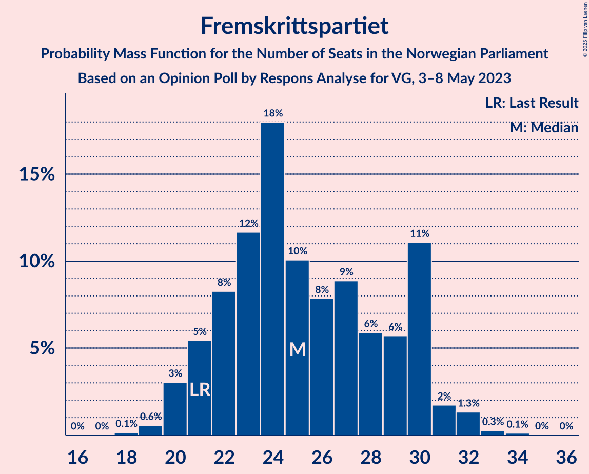

| Number of Seats | Probability | Accumulated | Special Marks |
|:---------------:|:-----------:|:-----------:|:-------------:|
| 18 | 0.1% | 100% |  |
| 19 | 0.6% | 99.9% |  |
| 20 | 3% | 99.3% |  |
| 21 | 5% | 96% | Last Result |
| 22 | 8% | 91% |  |
| 23 | 12% | 83% |  |
| 24 | 18% | 71% |  |
| 25 | 10% | 53% | Median |
| 26 | 8% | 43% |  |
| 27 | 9% | 35% |  |
| 28 | 6% | 26% |  |
| 29 | 6% | 20% |  |
| 30 | 11% | 15% |  |
| 31 | 2% | 3% |  |
| 32 | 1.3% | 2% |  |
| 33 | 0.3% | 0.4% |  |
| 34 | 0.1% | 0.1% |  |
| 35 | 0% | 0% |  |

### Sosialistisk Venstreparti

*For a full overview of the results for this party, see the [Sosialistisk Venstreparti](party-sosialistiskvenstreparti.html) page.*

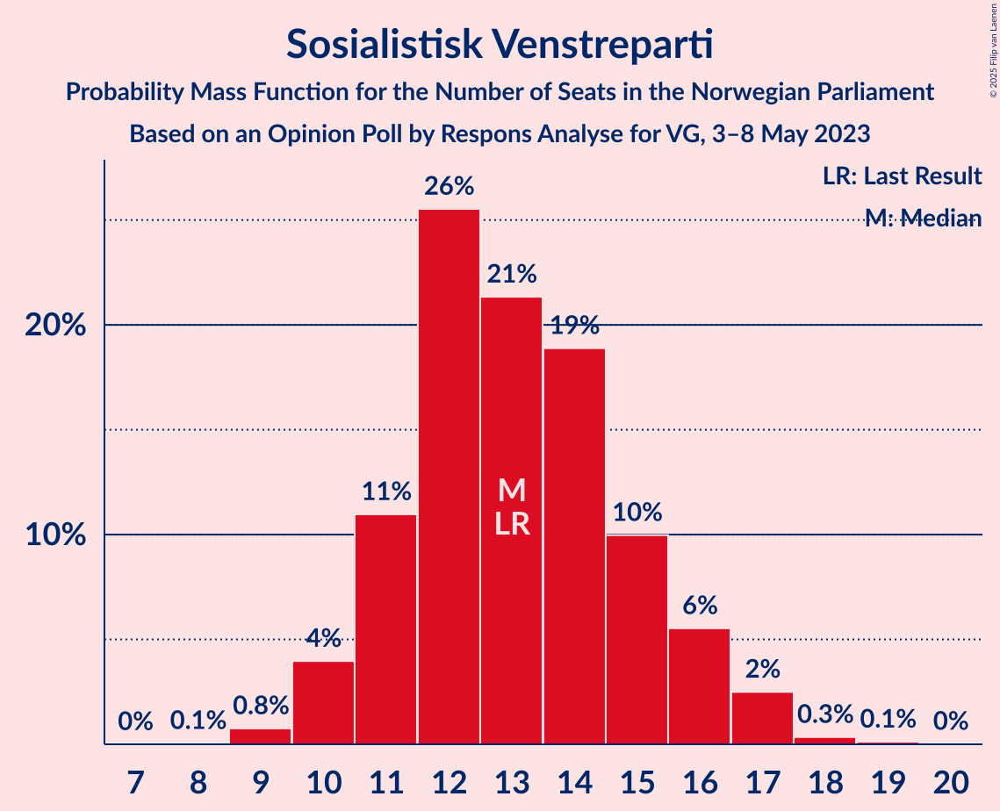

| Number of Seats | Probability | Accumulated | Special Marks |
|:---------------:|:-----------:|:-----------:|:-------------:|
| 8 | 0.1% | 100% |  |
| 9 | 0.8% | 99.9% |  |
| 10 | 4% | 99.2% |  |
| 11 | 11% | 95% |  |
| 12 | 26% | 84% |  |
| 13 | 21% | 59% | Last Result, Median |
| 14 | 19% | 37% |  |
| 15 | 10% | 18% |  |
| 16 | 6% | 9% |  |
| 17 | 2% | 3% |  |
| 18 | 0.3% | 0.5% |  |
| 19 | 0.1% | 0.1% |  |
| 20 | 0% | 0% |  |

### Senterpartiet

*For a full overview of the results for this party, see the [Senterpartiet](party-senterpartiet.html) page.*

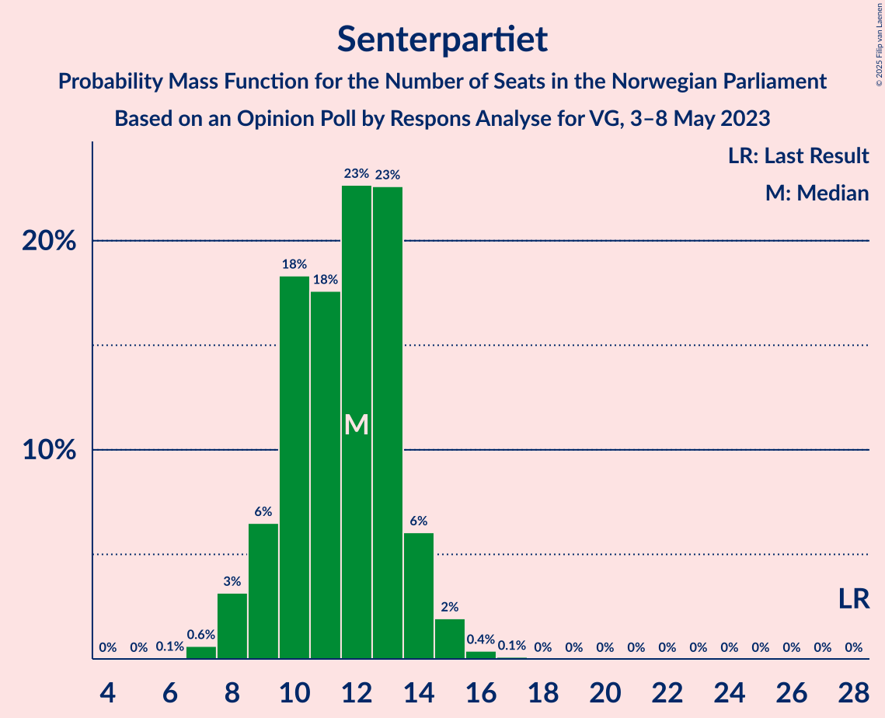

| Number of Seats | Probability | Accumulated | Special Marks |
|:---------------:|:-----------:|:-----------:|:-------------:|
| 6 | 0.1% | 100% |  |
| 7 | 0.6% | 99.9% |  |
| 8 | 3% | 99.3% |  |
| 9 | 6% | 96% |  |
| 10 | 18% | 90% |  |
| 11 | 18% | 71% |  |
| 12 | 23% | 54% | Median |
| 13 | 23% | 31% |  |
| 14 | 6% | 8% |  |
| 15 | 2% | 2% |  |
| 16 | 0.4% | 0.5% |  |
| 17 | 0.1% | 0.1% |  |
| 18 | 0% | 0% |  |
| 19 | 0% | 0% |  |
| 20 | 0% | 0% |  |
| 21 | 0% | 0% |  |
| 22 | 0% | 0% |  |
| 23 | 0% | 0% |  |
| 24 | 0% | 0% |  |
| 25 | 0% | 0% |  |
| 26 | 0% | 0% |  |
| 27 | 0% | 0% |  |
| 28 | 0% | 0% | Last Result |

### Rødt

*For a full overview of the results for this party, see the [Rødt](party-rødt.html) page.*

| Number of Seats | Probability | Accumulated | Special Marks |
|:---------------:|:-----------:|:-----------:|:-------------:|
| 6 | 0% | 100% |  |
| 7 | 0.3% | 99.9% |  |
| 8 | 2% | 99.6% | Last Result |
| 9 | 12% | 97% |  |
| 10 | 22% | 85% |  |
| 11 | 29% | 63% | Median |
| 12 | 24% | 34% |  |
| 13 | 7% | 10% |  |
| 14 | 2% | 3% |  |
| 15 | 0.6% | 0.8% |  |
| 16 | 0.2% | 0.2% |  |
| 17 | 0% | 0% |  |

### Venstre

*For a full overview of the results for this party, see the [Venstre](party-venstre.html) page.*

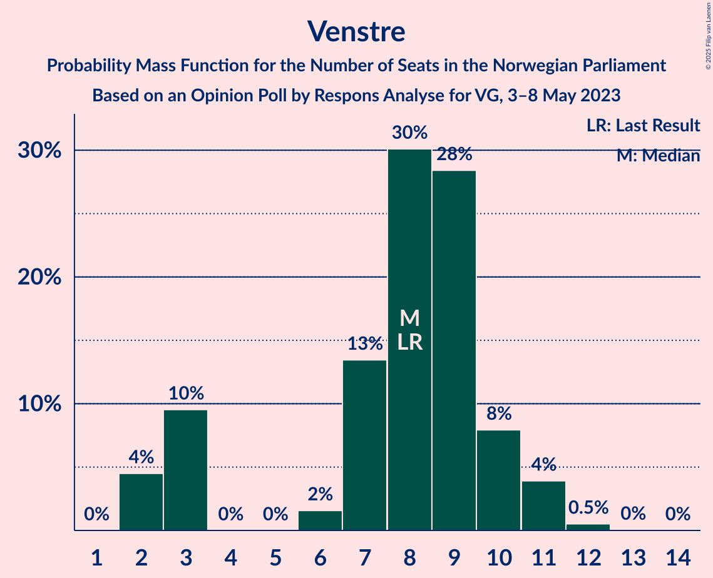

| Number of Seats | Probability | Accumulated | Special Marks |
|:---------------:|:-----------:|:-----------:|:-------------:|
| 2 | 4% | 100% |  |
| 3 | 10% | 95% |  |
| 4 | 0% | 86% |  |
| 5 | 0% | 86% |  |
| 6 | 2% | 86% |  |
| 7 | 13% | 84% |  |
| 8 | 30% | 71% | Last Result, Median |
| 9 | 28% | 41% |  |
| 10 | 8% | 12% |  |
| 11 | 4% | 4% |  |
| 12 | 0.5% | 0.6% |  |
| 13 | 0% | 0.1% |  |
| 14 | 0% | 0% |  |

### Kristelig Folkeparti

*For a full overview of the results for this party, see the [Kristelig Folkeparti](party-kristeligfolkeparti.html) page.*

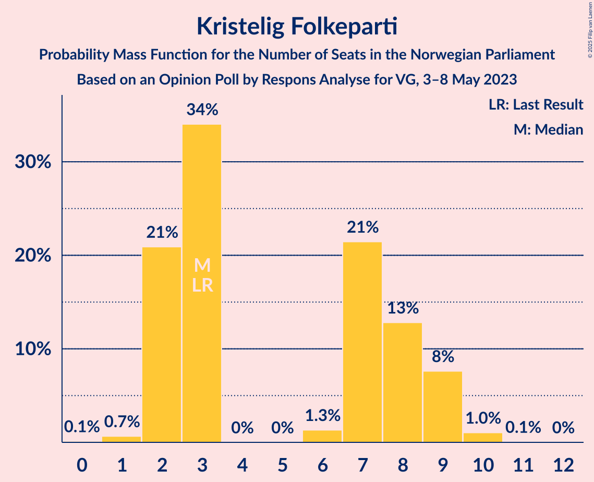

| Number of Seats | Probability | Accumulated | Special Marks |
|:---------------:|:-----------:|:-----------:|:-------------:|
| 0 | 0.1% | 100% |  |
| 1 | 0.7% | 99.9% |  |
| 2 | 21% | 99.2% |  |
| 3 | 34% | 78% | Last Result, Median |
| 4 | 0% | 44% |  |
| 5 | 0% | 44% |  |
| 6 | 1.3% | 44% |  |
| 7 | 21% | 43% |  |
| 8 | 13% | 22% |  |
| 9 | 8% | 9% |  |
| 10 | 1.0% | 1.1% |  |
| 11 | 0.1% | 0.1% |  |
| 12 | 0% | 0% |  |

### Miljøpartiet De Grønne

*For a full overview of the results for this party, see the [Miljøpartiet De Grønne](party-miljøpartietdegrønne.html) page.*

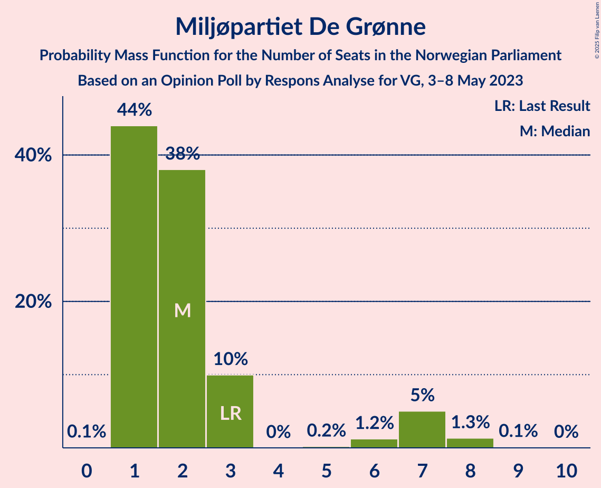

| Number of Seats | Probability | Accumulated | Special Marks |
|:---------------:|:-----------:|:-----------:|:-------------:|
| 0 | 0.1% | 100% |  |
| 1 | 44% | 99.9% |  |
| 2 | 38% | 56% | Median |
| 3 | 10% | 18% | Last Result |
| 4 | 0% | 8% |  |
| 5 | 0.2% | 8% |  |
| 6 | 1.2% | 8% |  |
| 7 | 5% | 7% |  |
| 8 | 1.3% | 2% |  |
| 9 | 0.1% | 0.2% |  |
| 10 | 0% | 0% |  |

## Coalitions

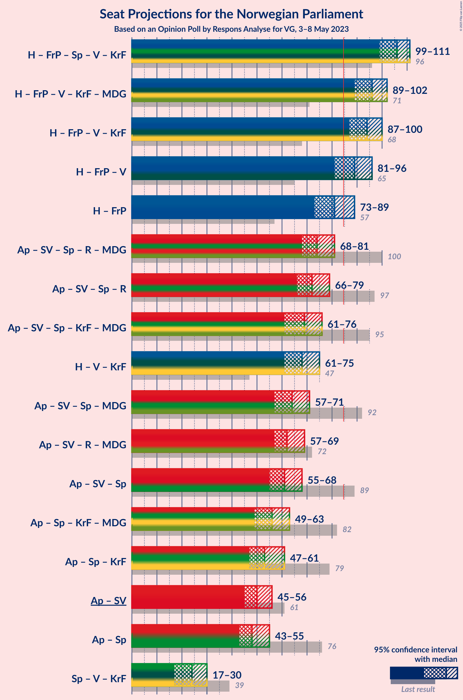

### Confidence Intervals

| Coalition | Last Result | Median | Majority? | 80% Confidence Interval | 90% Confidence Interval | 95% Confidence Interval | 99% Confidence Interval |
|:---------:|:-----------:|:------:|:---------:|:-----------------------:|:-----------------------:|:-----------------------:|:-----------------------:|
| Høyre – Fremskrittspartiet – Senterpartiet – Venstre – Kristelig Folkeparti | 96 | 106 | 100% | 100–109 | 99–110 | 99–111 | 96–113 |
| Høyre – Fremskrittspartiet – Venstre – Kristelig Folkeparti – Miljøpartiet De Grønne | 71 | 96 | 100% | 91–100 | 90–101 | 89–102 | 87–105 |
| Høyre – Fremskrittspartiet – Venstre – Kristelig Folkeparti | 68 | 94 | 99.5% | 88–98 | 87–99 | 87–100 | 84–104 |
| Høyre – Fremskrittspartiet – Venstre | 65 | 89 | 76% | 83–95 | 82–95 | 81–96 | 79–98 |
| Høyre – Fremskrittspartiet | 57 | 81 | 21% | 75–86 | 74–87 | 73–89 | 71–92 |
| Arbeiderpartiet – Sosialistisk Venstreparti – Senterpartiet – Rødt – Miljøpartiet De Grønne | 100 | 74 | 0.2% | 70–80 | 69–81 | 68–81 | 64–84 |
| Arbeiderpartiet – Sosialistisk Venstreparti – Senterpartiet – Rødt | 97 | 72 | 0% | 68–77 | 67–78 | 66–79 | 63–81 |
| Arbeiderpartiet – Sosialistisk Venstreparti – Senterpartiet – Kristelig Folkeparti – Miljøpartiet De Grønne | 95 | 69 | 0% | 62–74 | 62–75 | 61–76 | 59–78 |
| Høyre – Venstre – Kristelig Folkeparti | 47 | 68 | 0% | 64–73 | 62–74 | 61–75 | 60–77 |
| Arbeiderpartiet – Sosialistisk Venstreparti – Senterpartiet – Miljøpartiet De Grønne | 92 | 64 | 0% | 59–68 | 58–69 | 57–71 | 55–72 |
| Arbeiderpartiet – Sosialistisk Venstreparti – Rødt – Miljøpartiet De Grønne | 72 | 62 | 0% | 59–68 | 58–69 | 57–69 | 55–72 |
| Arbeiderpartiet – Sosialistisk Venstreparti – Senterpartiet | 89 | 61 | 0% | 57–66 | 56–67 | 55–68 | 53–70 |
| Arbeiderpartiet – Senterpartiet – Kristelig Folkeparti – Miljøpartiet De Grønne | 82 | 56 | 0% | 50–61 | 49–63 | 49–63 | 47–65 |
| Arbeiderpartiet – Senterpartiet – Kristelig Folkeparti | 79 | 53 | 0% | 48–59 | 47–60 | 47–61 | 45–63 |
| Arbeiderpartiet – Sosialistisk Venstreparti | 61 | 50 | 0% | 47–54 | 45–55 | 45–56 | 43–58 |
| Arbeiderpartiet – Senterpartiet | 76 | 48 | 0% | 45–53 | 44–54 | 43–55 | 42–56 |
| Senterpartiet – Venstre – Kristelig Folkeparti | 39 | 24 | 0% | 20–28 | 17–29 | 17–30 | 16–32 |

### Høyre – Fremskrittspartiet – Senterpartiet – Venstre – Kristelig Folkeparti

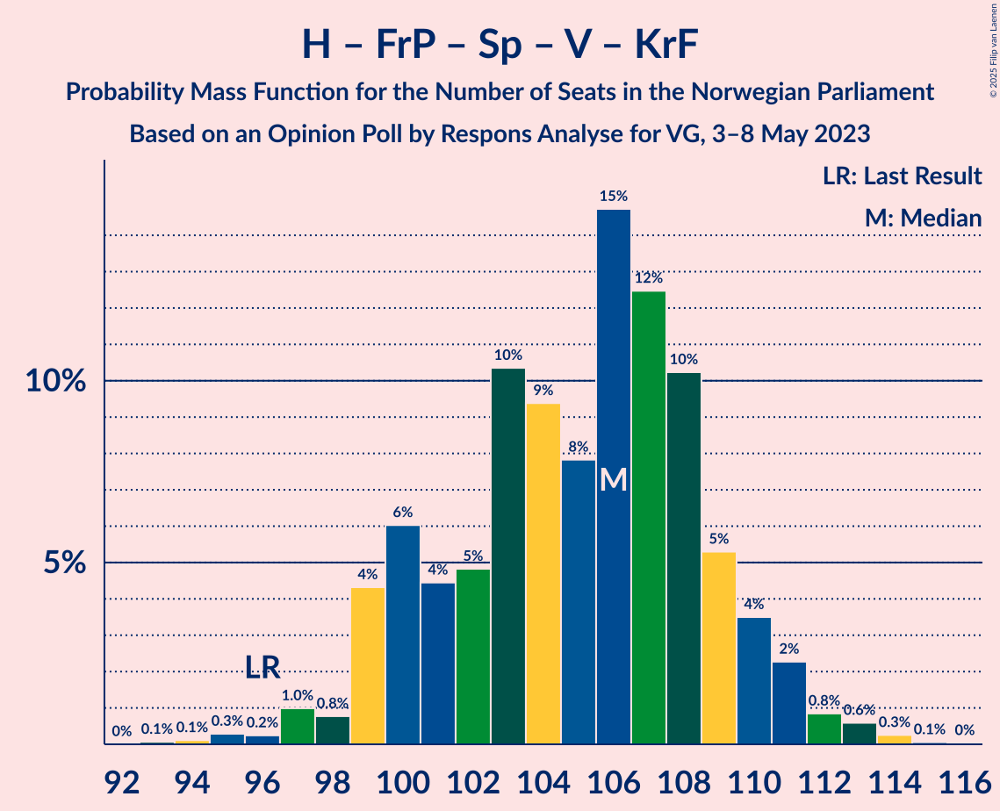

| Number of Seats | Probability | Accumulated | Special Marks |
|:---------------:|:-----------:|:-----------:|:-------------:|
| 93 | 0.1% | 100% |  |
| 94 | 0.1% | 99.9% |  |
| 95 | 0.3% | 99.8% |  |
| 96 | 0.2% | 99.5% | Last Result |
| 97 | 1.0% | 99.3% |  |
| 98 | 0.8% | 98% |  |
| 99 | 4% | 98% |  |
| 100 | 6% | 93% |  |
| 101 | 4% | 87% |  |
| 102 | 5% | 83% |  |
| 103 | 10% | 78% |  |
| 104 | 9% | 68% | Median |
| 105 | 8% | 58% |  |
| 106 | 15% | 50% |  |
| 107 | 12% | 36% |  |
| 108 | 10% | 23% |  |
| 109 | 5% | 13% |  |
| 110 | 4% | 8% |  |
| 111 | 2% | 4% |  |
| 112 | 0.8% | 2% |  |
| 113 | 0.6% | 1.0% |  |
| 114 | 0.3% | 0.4% |  |
| 115 | 0.1% | 0.1% |  |
| 116 | 0% | 0% |  |

### Høyre – Fremskrittspartiet – Venstre – Kristelig Folkeparti – Miljøpartiet De Grønne

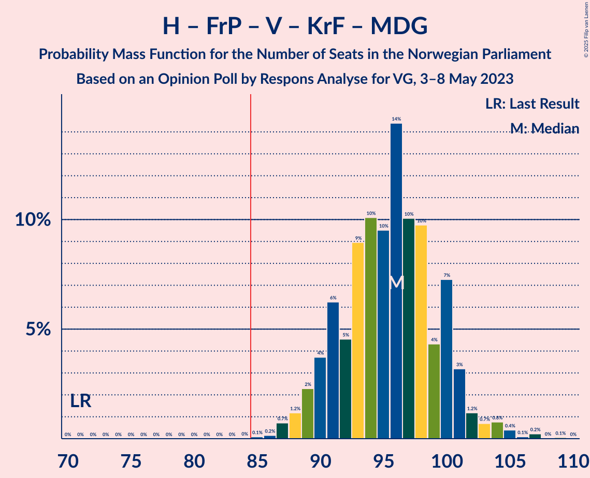

| Number of Seats | Probability | Accumulated | Special Marks |
|:---------------:|:-----------:|:-----------:|:-------------:|
| 71 | 0% | 100% | Last Result |
| 72 | 0% | 100% |  |
| 73 | 0% | 100% |  |
| 74 | 0% | 100% |  |
| 75 | 0% | 100% |  |
| 76 | 0% | 100% |  |
| 77 | 0% | 100% |  |
| 78 | 0% | 100% |  |
| 79 | 0% | 100% |  |
| 80 | 0% | 100% |  |
| 81 | 0% | 100% |  |
| 82 | 0% | 100% |  |
| 83 | 0% | 100% |  |
| 84 | 0% | 100% |  |
| 85 | 0.1% | 100% | Majority |
| 86 | 0.2% | 99.9% |  |
| 87 | 0.7% | 99.7% |  |
| 88 | 1.2% | 99.0% |  |
| 89 | 2% | 98% |  |
| 90 | 4% | 96% |  |
| 91 | 6% | 92% |  |
| 92 | 5% | 86% |  |
| 93 | 9% | 81% |  |
| 94 | 10% | 72% | Median |
| 95 | 10% | 62% |  |
| 96 | 14% | 52% |  |
| 97 | 10% | 38% |  |
| 98 | 10% | 28% |  |
| 99 | 4% | 18% |  |
| 100 | 7% | 14% |  |
| 101 | 3% | 7% |  |
| 102 | 1.2% | 3% |  |
| 103 | 0.7% | 2% |  |
| 104 | 0.8% | 2% |  |
| 105 | 0.4% | 0.8% |  |
| 106 | 0.1% | 0.4% |  |
| 107 | 0.2% | 0.3% |  |
| 108 | 0% | 0.1% |  |
| 109 | 0.1% | 0.1% |  |
| 110 | 0% | 0% |  |

### Høyre – Fremskrittspartiet – Venstre – Kristelig Folkeparti

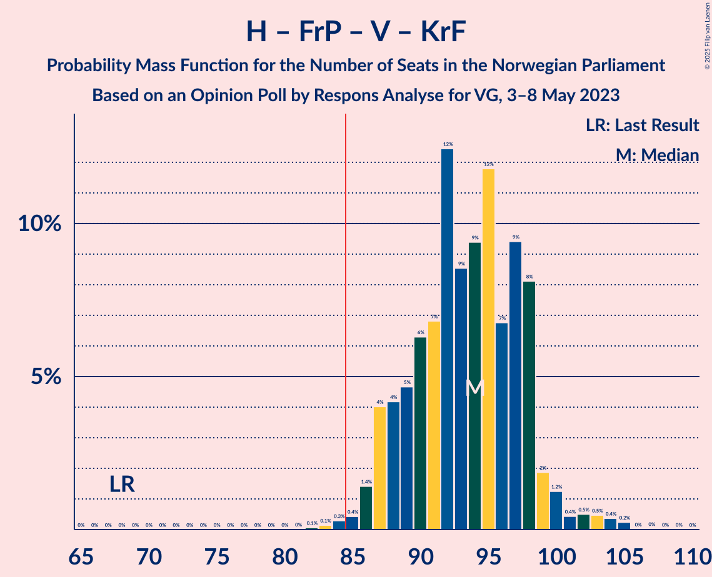

| Number of Seats | Probability | Accumulated | Special Marks |
|:---------------:|:-----------:|:-----------:|:-------------:|
| 68 | 0% | 100% | Last Result |
| 69 | 0% | 100% |  |
| 70 | 0% | 100% |  |
| 71 | 0% | 100% |  |
| 72 | 0% | 100% |  |
| 73 | 0% | 100% |  |
| 74 | 0% | 100% |  |
| 75 | 0% | 100% |  |
| 76 | 0% | 100% |  |
| 77 | 0% | 100% |  |
| 78 | 0% | 100% |  |
| 79 | 0% | 100% |  |
| 80 | 0% | 100% |  |
| 81 | 0% | 100% |  |
| 82 | 0.1% | 100% |  |
| 83 | 0.1% | 99.9% |  |
| 84 | 0.3% | 99.8% |  |
| 85 | 0.4% | 99.5% | Majority |
| 86 | 1.4% | 99.1% |  |
| 87 | 4% | 98% |  |
| 88 | 4% | 94% |  |
| 89 | 5% | 89% |  |
| 90 | 6% | 85% |  |
| 91 | 7% | 78% |  |
| 92 | 12% | 72% | Median |
| 93 | 9% | 59% |  |
| 94 | 9% | 51% |  |
| 95 | 12% | 41% |  |
| 96 | 7% | 29% |  |
| 97 | 9% | 23% |  |
| 98 | 8% | 13% |  |
| 99 | 2% | 5% |  |
| 100 | 1.2% | 3% |  |
| 101 | 0.4% | 2% |  |
| 102 | 0.5% | 2% |  |
| 103 | 0.5% | 1.1% |  |
| 104 | 0.4% | 0.7% |  |
| 105 | 0.2% | 0.3% |  |
| 106 | 0% | 0.1% |  |
| 107 | 0% | 0% |  |

### Høyre – Fremskrittspartiet – Venstre

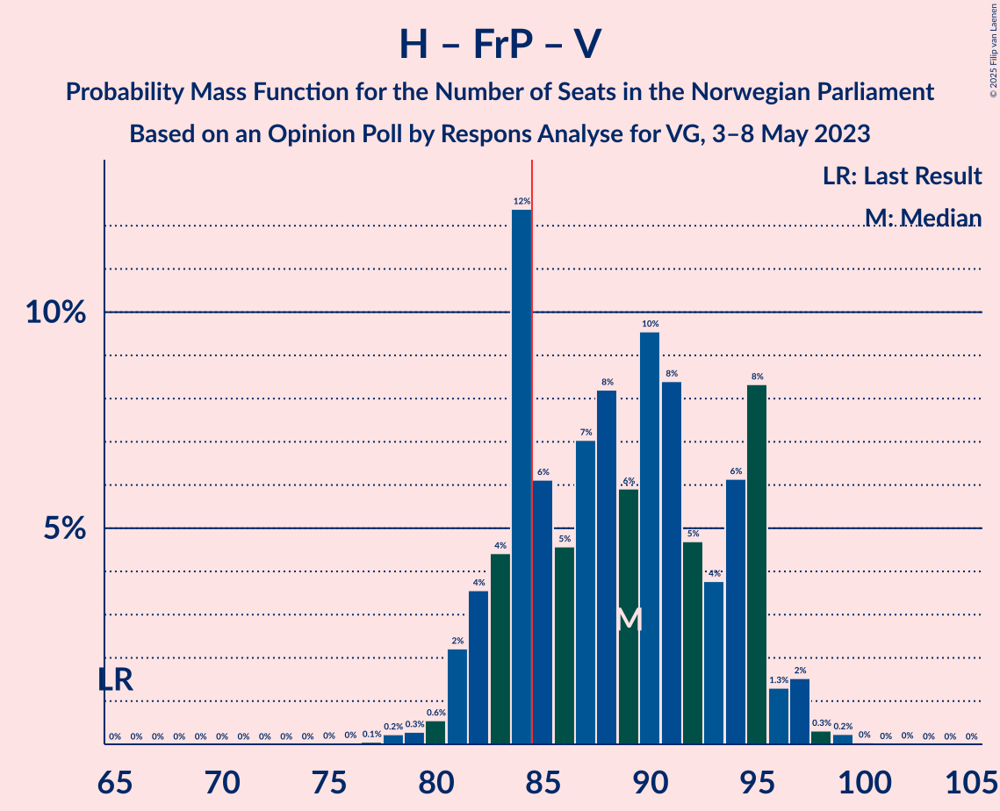

| Number of Seats | Probability | Accumulated | Special Marks |
|:---------------:|:-----------:|:-----------:|:-------------:|
| 65 | 0% | 100% | Last Result |
| 66 | 0% | 100% |  |
| 67 | 0% | 100% |  |
| 68 | 0% | 100% |  |
| 69 | 0% | 100% |  |
| 70 | 0% | 100% |  |
| 71 | 0% | 100% |  |
| 72 | 0% | 100% |  |
| 73 | 0% | 100% |  |
| 74 | 0% | 100% |  |
| 75 | 0% | 100% |  |
| 76 | 0% | 100% |  |
| 77 | 0.1% | 99.9% |  |
| 78 | 0.2% | 99.9% |  |
| 79 | 0.3% | 99.7% |  |
| 80 | 0.6% | 99.4% |  |
| 81 | 2% | 98.8% |  |
| 82 | 4% | 97% |  |
| 83 | 4% | 93% |  |
| 84 | 12% | 89% |  |
| 85 | 6% | 76% | Majority |
| 86 | 5% | 70% |  |
| 87 | 7% | 66% |  |
| 88 | 8% | 58% |  |
| 89 | 6% | 50% | Median |
| 90 | 10% | 44% |  |
| 91 | 8% | 35% |  |
| 92 | 5% | 26% |  |
| 93 | 4% | 22% |  |
| 94 | 6% | 18% |  |
| 95 | 8% | 12% |  |
| 96 | 1.3% | 3% |  |
| 97 | 2% | 2% |  |
| 98 | 0.3% | 0.6% |  |
| 99 | 0.2% | 0.3% |  |
| 100 | 0% | 0.1% |  |
| 101 | 0% | 0% |  |

### Høyre – Fremskrittspartiet

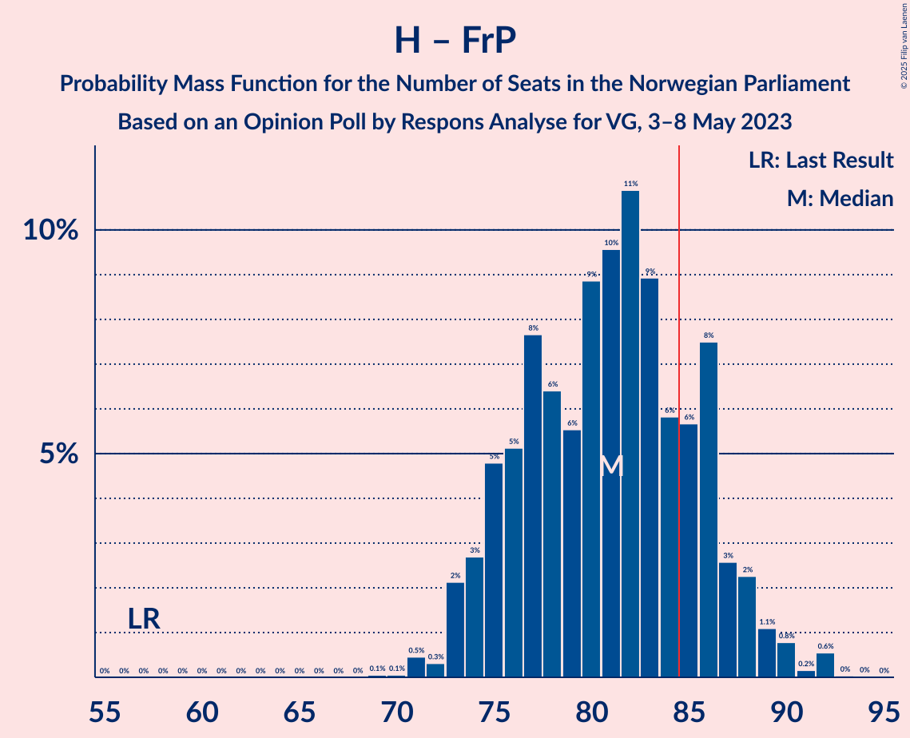

| Number of Seats | Probability | Accumulated | Special Marks |
|:---------------:|:-----------:|:-----------:|:-------------:|
| 57 | 0% | 100% | Last Result |
| 58 | 0% | 100% |  |
| 59 | 0% | 100% |  |
| 60 | 0% | 100% |  |
| 61 | 0% | 100% |  |
| 62 | 0% | 100% |  |
| 63 | 0% | 100% |  |
| 64 | 0% | 100% |  |
| 65 | 0% | 100% |  |
| 66 | 0% | 100% |  |
| 67 | 0% | 100% |  |
| 68 | 0% | 100% |  |
| 69 | 0.1% | 100% |  |
| 70 | 0.1% | 99.9% |  |
| 71 | 0.5% | 99.9% |  |
| 72 | 0.3% | 99.4% |  |
| 73 | 2% | 99.1% |  |
| 74 | 3% | 97% |  |
| 75 | 5% | 94% |  |
| 76 | 5% | 89% |  |
| 77 | 8% | 84% |  |
| 78 | 6% | 77% |  |
| 79 | 6% | 70% |  |
| 80 | 9% | 65% |  |
| 81 | 10% | 56% | Median |
| 82 | 11% | 46% |  |
| 83 | 9% | 35% |  |
| 84 | 6% | 26% |  |
| 85 | 6% | 21% | Majority |
| 86 | 8% | 15% |  |
| 87 | 3% | 7% |  |
| 88 | 2% | 5% |  |
| 89 | 1.1% | 3% |  |
| 90 | 0.8% | 2% |  |
| 91 | 0.2% | 0.8% |  |
| 92 | 0.6% | 0.6% |  |
| 93 | 0% | 0.1% |  |
| 94 | 0% | 0% |  |

### Arbeiderpartiet – Sosialistisk Venstreparti – Senterpartiet – Rødt – Miljøpartiet De Grønne

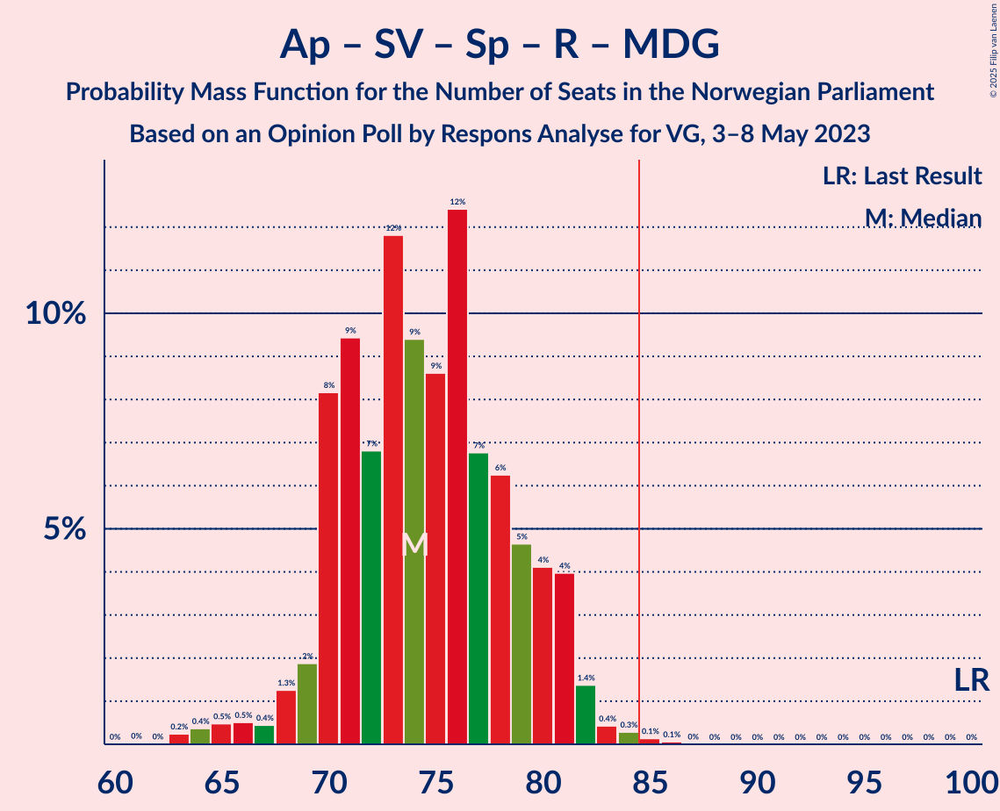

| Number of Seats | Probability | Accumulated | Special Marks |
|:---------------:|:-----------:|:-----------:|:-------------:|
| 62 | 0% | 100% |  |
| 63 | 0.2% | 99.9% |  |
| 64 | 0.4% | 99.7% |  |
| 65 | 0.5% | 99.3% |  |
| 66 | 0.5% | 98.9% |  |
| 67 | 0.4% | 98% |  |
| 68 | 1.3% | 98% |  |
| 69 | 2% | 97% |  |
| 70 | 8% | 95% |  |
| 71 | 9% | 87% |  |
| 72 | 7% | 77% |  |
| 73 | 12% | 70% |  |
| 74 | 9% | 59% | Median |
| 75 | 9% | 49% |  |
| 76 | 12% | 41% |  |
| 77 | 7% | 28% |  |
| 78 | 6% | 21% |  |
| 79 | 5% | 15% |  |
| 80 | 4% | 10% |  |
| 81 | 4% | 6% |  |
| 82 | 1.4% | 2% |  |
| 83 | 0.4% | 0.9% |  |
| 84 | 0.3% | 0.5% |  |
| 85 | 0.1% | 0.2% | Majority |
| 86 | 0.1% | 0.1% |  |
| 87 | 0% | 0% |  |
| 88 | 0% | 0% |  |
| 89 | 0% | 0% |  |
| 90 | 0% | 0% |  |
| 91 | 0% | 0% |  |
| 92 | 0% | 0% |  |
| 93 | 0% | 0% |  |
| 94 | 0% | 0% |  |
| 95 | 0% | 0% |  |
| 96 | 0% | 0% |  |
| 97 | 0% | 0% |  |
| 98 | 0% | 0% |  |
| 99 | 0% | 0% |  |
| 100 | 0% | 0% | Last Result |

### Arbeiderpartiet – Sosialistisk Venstreparti – Senterpartiet – Rødt

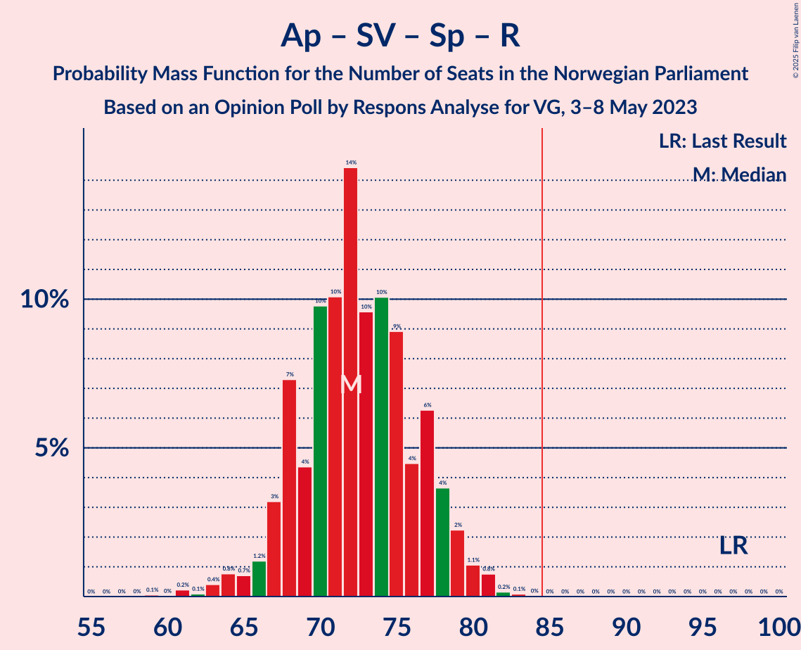

| Number of Seats | Probability | Accumulated | Special Marks |
|:---------------:|:-----------:|:-----------:|:-------------:|
| 59 | 0.1% | 100% |  |
| 60 | 0% | 99.9% |  |
| 61 | 0.2% | 99.9% |  |
| 62 | 0.1% | 99.7% |  |
| 63 | 0.4% | 99.6% |  |
| 64 | 0.8% | 99.2% |  |
| 65 | 0.7% | 98% |  |
| 66 | 1.2% | 98% |  |
| 67 | 3% | 96% |  |
| 68 | 7% | 93% |  |
| 69 | 4% | 86% |  |
| 70 | 10% | 82% |  |
| 71 | 10% | 72% |  |
| 72 | 14% | 62% | Median |
| 73 | 10% | 47% |  |
| 74 | 10% | 38% |  |
| 75 | 9% | 28% |  |
| 76 | 4% | 19% |  |
| 77 | 6% | 14% |  |
| 78 | 4% | 8% |  |
| 79 | 2% | 4% |  |
| 80 | 1.1% | 2% |  |
| 81 | 0.8% | 1.0% |  |
| 82 | 0.2% | 0.3% |  |
| 83 | 0.1% | 0.1% |  |
| 84 | 0% | 0% |  |
| 85 | 0% | 0% | Majority |
| 86 | 0% | 0% |  |
| 87 | 0% | 0% |  |
| 88 | 0% | 0% |  |
| 89 | 0% | 0% |  |
| 90 | 0% | 0% |  |
| 91 | 0% | 0% |  |
| 92 | 0% | 0% |  |
| 93 | 0% | 0% |  |
| 94 | 0% | 0% |  |
| 95 | 0% | 0% |  |
| 96 | 0% | 0% |  |
| 97 | 0% | 0% | Last Result |

### Arbeiderpartiet – Sosialistisk Venstreparti – Senterpartiet – Kristelig Folkeparti – Miljøpartiet De Grønne

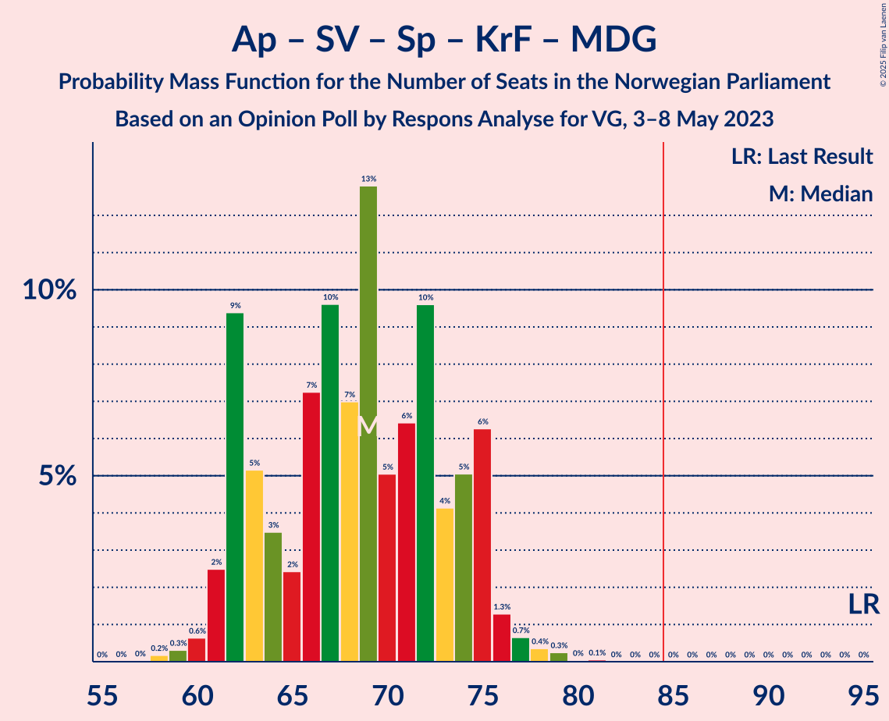

| Number of Seats | Probability | Accumulated | Special Marks |
|:---------------:|:-----------:|:-----------:|:-------------:|
| 58 | 0.2% | 100% |  |
| 59 | 0.3% | 99.8% |  |
| 60 | 0.6% | 99.5% |  |
| 61 | 2% | 98.8% |  |
| 62 | 9% | 96% |  |
| 63 | 5% | 87% |  |
| 64 | 3% | 82% |  |
| 65 | 2% | 78% |  |
| 66 | 7% | 76% | Median |
| 67 | 10% | 69% |  |
| 68 | 7% | 59% |  |
| 69 | 13% | 52% |  |
| 70 | 5% | 39% |  |
| 71 | 6% | 34% |  |
| 72 | 10% | 28% |  |
| 73 | 4% | 18% |  |
| 74 | 5% | 14% |  |
| 75 | 6% | 9% |  |
| 76 | 1.3% | 3% |  |
| 77 | 0.7% | 1.4% |  |
| 78 | 0.4% | 0.7% |  |
| 79 | 0.3% | 0.4% |  |
| 80 | 0% | 0.1% |  |
| 81 | 0.1% | 0.1% |  |
| 82 | 0% | 0% |  |
| 83 | 0% | 0% |  |
| 84 | 0% | 0% |  |
| 85 | 0% | 0% | Majority |
| 86 | 0% | 0% |  |
| 87 | 0% | 0% |  |
| 88 | 0% | 0% |  |
| 89 | 0% | 0% |  |
| 90 | 0% | 0% |  |
| 91 | 0% | 0% |  |
| 92 | 0% | 0% |  |
| 93 | 0% | 0% |  |
| 94 | 0% | 0% |  |
| 95 | 0% | 0% | Last Result |

### Høyre – Venstre – Kristelig Folkeparti

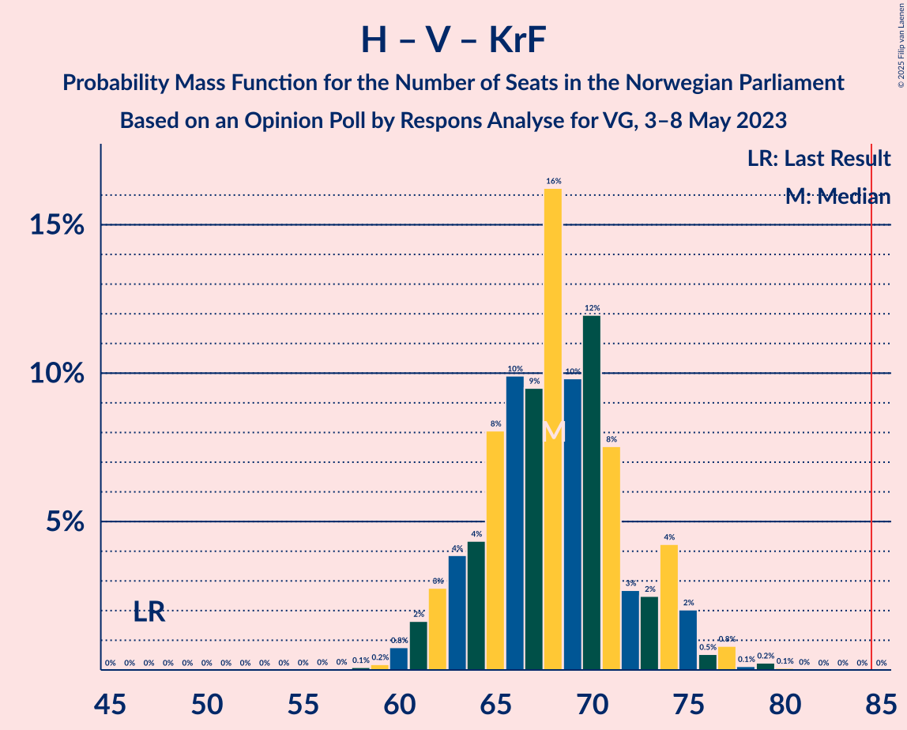

| Number of Seats | Probability | Accumulated | Special Marks |
|:---------------:|:-----------:|:-----------:|:-------------:|
| 47 | 0% | 100% | Last Result |
| 48 | 0% | 100% |  |
| 49 | 0% | 100% |  |
| 50 | 0% | 100% |  |
| 51 | 0% | 100% |  |
| 52 | 0% | 100% |  |
| 53 | 0% | 100% |  |
| 54 | 0% | 100% |  |
| 55 | 0% | 100% |  |
| 56 | 0% | 100% |  |
| 57 | 0% | 100% |  |
| 58 | 0.1% | 99.9% |  |
| 59 | 0.2% | 99.8% |  |
| 60 | 0.8% | 99.7% |  |
| 61 | 2% | 98.9% |  |
| 62 | 3% | 97% |  |
| 63 | 4% | 94% |  |
| 64 | 4% | 91% |  |
| 65 | 8% | 86% |  |
| 66 | 10% | 78% |  |
| 67 | 9% | 68% | Median |
| 68 | 16% | 59% |  |
| 69 | 10% | 43% |  |
| 70 | 12% | 33% |  |
| 71 | 8% | 21% |  |
| 72 | 3% | 13% |  |
| 73 | 2% | 11% |  |
| 74 | 4% | 8% |  |
| 75 | 2% | 4% |  |
| 76 | 0.5% | 2% |  |
| 77 | 0.8% | 1.3% |  |
| 78 | 0.1% | 0.5% |  |
| 79 | 0.2% | 0.3% |  |
| 80 | 0.1% | 0.1% |  |
| 81 | 0% | 0% |  |

### Arbeiderpartiet – Sosialistisk Venstreparti – Senterpartiet – Miljøpartiet De Grønne

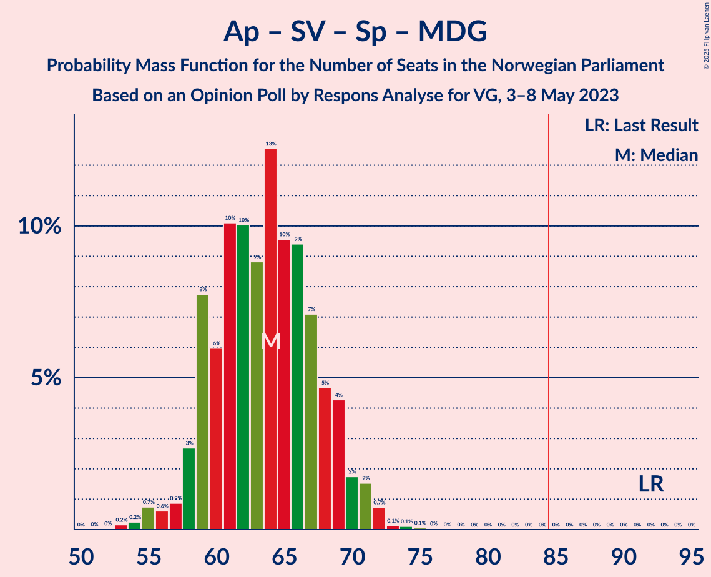

| Number of Seats | Probability | Accumulated | Special Marks |
|:---------------:|:-----------:|:-----------:|:-------------:|
| 52 | 0% | 100% |  |
| 53 | 0.2% | 99.9% |  |
| 54 | 0.2% | 99.8% |  |
| 55 | 0.7% | 99.5% |  |
| 56 | 0.6% | 98.8% |  |
| 57 | 0.9% | 98% |  |
| 58 | 3% | 97% |  |
| 59 | 8% | 95% |  |
| 60 | 6% | 87% |  |
| 61 | 10% | 81% |  |
| 62 | 10% | 71% |  |
| 63 | 9% | 61% | Median |
| 64 | 13% | 52% |  |
| 65 | 10% | 39% |  |
| 66 | 9% | 30% |  |
| 67 | 7% | 20% |  |
| 68 | 5% | 13% |  |
| 69 | 4% | 9% |  |
| 70 | 2% | 4% |  |
| 71 | 2% | 3% |  |
| 72 | 0.7% | 1.1% |  |
| 73 | 0.1% | 0.3% |  |
| 74 | 0.1% | 0.2% |  |
| 75 | 0.1% | 0.1% |  |
| 76 | 0% | 0% |  |
| 77 | 0% | 0% |  |
| 78 | 0% | 0% |  |
| 79 | 0% | 0% |  |
| 80 | 0% | 0% |  |
| 81 | 0% | 0% |  |
| 82 | 0% | 0% |  |
| 83 | 0% | 0% |  |
| 84 | 0% | 0% |  |
| 85 | 0% | 0% | Majority |
| 86 | 0% | 0% |  |
| 87 | 0% | 0% |  |
| 88 | 0% | 0% |  |
| 89 | 0% | 0% |  |
| 90 | 0% | 0% |  |
| 91 | 0% | 0% |  |
| 92 | 0% | 0% | Last Result |

### Arbeiderpartiet – Sosialistisk Venstreparti – Rødt – Miljøpartiet De Grønne

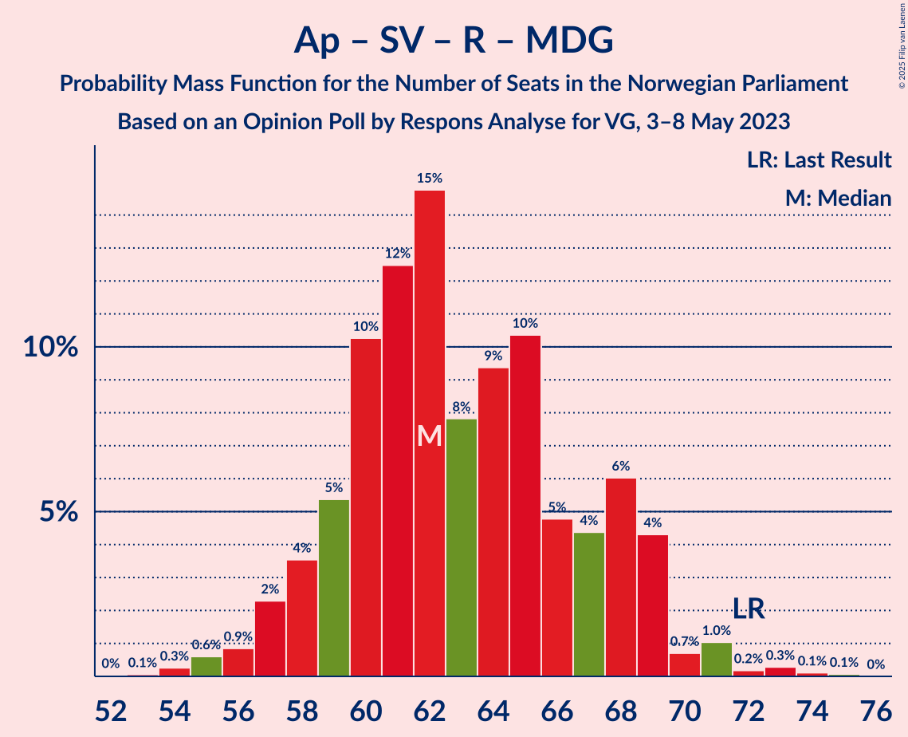

| Number of Seats | Probability | Accumulated | Special Marks |
|:---------------:|:-----------:|:-----------:|:-------------:|
| 53 | 0.1% | 100% |  |
| 54 | 0.3% | 99.9% |  |
| 55 | 0.6% | 99.6% |  |
| 56 | 0.9% | 99.0% |  |
| 57 | 2% | 98% |  |
| 58 | 4% | 96% |  |
| 59 | 5% | 92% |  |
| 60 | 10% | 87% |  |
| 61 | 12% | 77% |  |
| 62 | 15% | 64% | Median |
| 63 | 8% | 49% |  |
| 64 | 9% | 42% |  |
| 65 | 10% | 32% |  |
| 66 | 5% | 22% |  |
| 67 | 4% | 17% |  |
| 68 | 6% | 13% |  |
| 69 | 4% | 7% |  |
| 70 | 0.7% | 2% |  |
| 71 | 1.0% | 2% |  |
| 72 | 0.2% | 0.7% | Last Result |
| 73 | 0.3% | 0.5% |  |
| 74 | 0.1% | 0.2% |  |
| 75 | 0.1% | 0.1% |  |
| 76 | 0% | 0% |  |

### Arbeiderpartiet – Sosialistisk Venstreparti – Senterpartiet

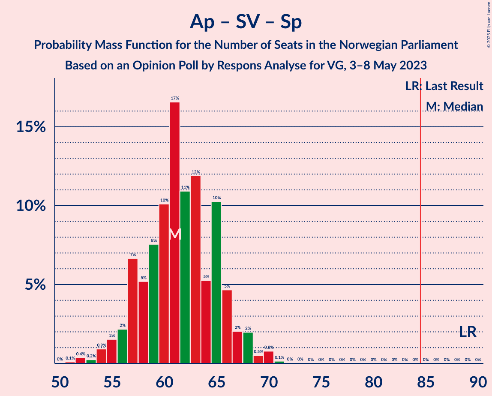

| Number of Seats | Probability | Accumulated | Special Marks |
|:---------------:|:-----------:|:-----------:|:-------------:|
| 51 | 0.1% | 100% |  |
| 52 | 0.4% | 99.9% |  |
| 53 | 0.2% | 99.5% |  |
| 54 | 0.9% | 99.3% |  |
| 55 | 2% | 98% |  |
| 56 | 2% | 97% |  |
| 57 | 7% | 95% |  |
| 58 | 5% | 88% |  |
| 59 | 8% | 83% |  |
| 60 | 10% | 75% |  |
| 61 | 17% | 65% | Median |
| 62 | 11% | 49% |  |
| 63 | 12% | 38% |  |
| 64 | 5% | 26% |  |
| 65 | 10% | 20% |  |
| 66 | 5% | 10% |  |
| 67 | 2% | 6% |  |
| 68 | 2% | 3% |  |
| 69 | 0.5% | 2% |  |
| 70 | 0.8% | 1.0% |  |
| 71 | 0.1% | 0.2% |  |
| 72 | 0% | 0.1% |  |
| 73 | 0% | 0% |  |
| 74 | 0% | 0% |  |
| 75 | 0% | 0% |  |
| 76 | 0% | 0% |  |
| 77 | 0% | 0% |  |
| 78 | 0% | 0% |  |
| 79 | 0% | 0% |  |
| 80 | 0% | 0% |  |
| 81 | 0% | 0% |  |
| 82 | 0% | 0% |  |
| 83 | 0% | 0% |  |
| 84 | 0% | 0% |  |
| 85 | 0% | 0% | Majority |
| 86 | 0% | 0% |  |
| 87 | 0% | 0% |  |
| 88 | 0% | 0% |  |
| 89 | 0% | 0% | Last Result |

### Arbeiderpartiet – Senterpartiet – Kristelig Folkeparti – Miljøpartiet De Grønne

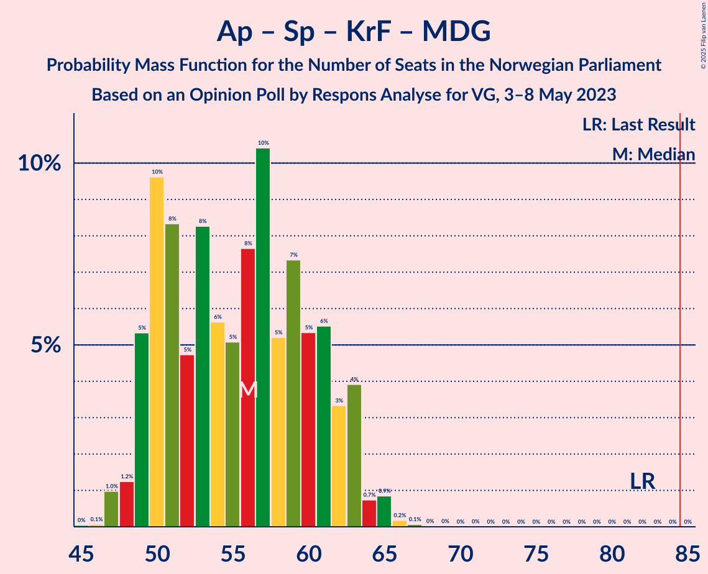

| Number of Seats | Probability | Accumulated | Special Marks |
|:---------------:|:-----------:|:-----------:|:-------------:|
| 45 | 0% | 100% |  |
| 46 | 0.1% | 99.9% |  |
| 47 | 1.0% | 99.9% |  |
| 48 | 1.2% | 98.9% |  |
| 49 | 5% | 98% |  |
| 50 | 10% | 92% |  |
| 51 | 8% | 83% |  |
| 52 | 5% | 74% |  |
| 53 | 8% | 70% | Median |
| 54 | 6% | 61% |  |
| 55 | 5% | 56% |  |
| 56 | 8% | 51% |  |
| 57 | 10% | 43% |  |
| 58 | 5% | 33% |  |
| 59 | 7% | 27% |  |
| 60 | 5% | 20% |  |
| 61 | 6% | 15% |  |
| 62 | 3% | 9% |  |
| 63 | 4% | 6% |  |
| 64 | 0.7% | 2% |  |
| 65 | 0.9% | 1.1% |  |
| 66 | 0.2% | 0.3% |  |
| 67 | 0.1% | 0.1% |  |
| 68 | 0% | 0.1% |  |
| 69 | 0% | 0% |  |
| 70 | 0% | 0% |  |
| 71 | 0% | 0% |  |
| 72 | 0% | 0% |  |
| 73 | 0% | 0% |  |
| 74 | 0% | 0% |  |
| 75 | 0% | 0% |  |
| 76 | 0% | 0% |  |
| 77 | 0% | 0% |  |
| 78 | 0% | 0% |  |
| 79 | 0% | 0% |  |
| 80 | 0% | 0% |  |
| 81 | 0% | 0% |  |
| 82 | 0% | 0% | Last Result |

### Arbeiderpartiet – Senterpartiet – Kristelig Folkeparti

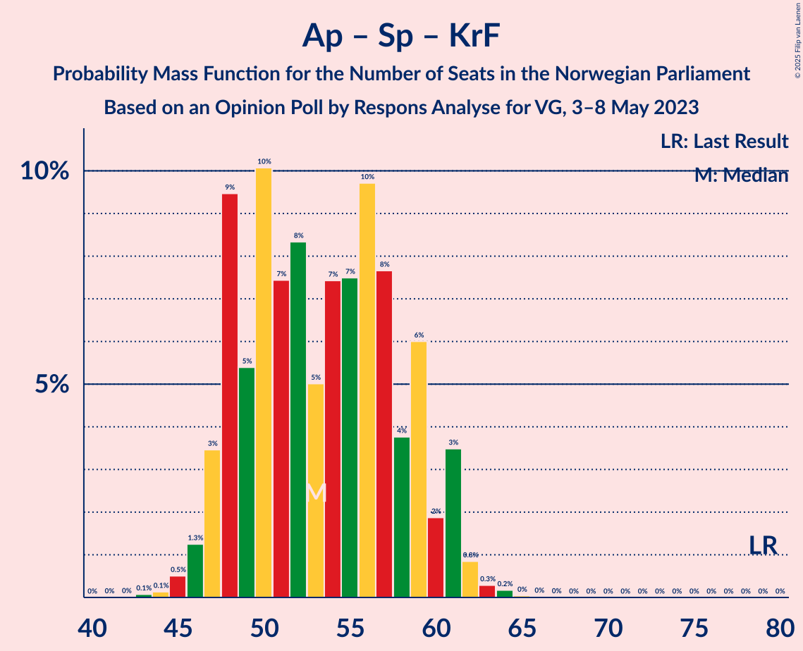

| Number of Seats | Probability | Accumulated | Special Marks |
|:---------------:|:-----------:|:-----------:|:-------------:|
| 43 | 0.1% | 100% |  |
| 44 | 0.1% | 99.9% |  |
| 45 | 0.5% | 99.8% |  |
| 46 | 1.3% | 99.3% |  |
| 47 | 3% | 98% |  |
| 48 | 9% | 95% |  |
| 49 | 5% | 85% |  |
| 50 | 10% | 80% |  |
| 51 | 7% | 70% | Median |
| 52 | 8% | 62% |  |
| 53 | 5% | 54% |  |
| 54 | 7% | 49% |  |
| 55 | 7% | 41% |  |
| 56 | 10% | 34% |  |
| 57 | 8% | 24% |  |
| 58 | 4% | 17% |  |
| 59 | 6% | 13% |  |
| 60 | 2% | 7% |  |
| 61 | 3% | 5% |  |
| 62 | 0.8% | 1.4% |  |
| 63 | 0.3% | 0.5% |  |
| 64 | 0.2% | 0.2% |  |
| 65 | 0% | 0.1% |  |
| 66 | 0% | 0% |  |
| 67 | 0% | 0% |  |
| 68 | 0% | 0% |  |
| 69 | 0% | 0% |  |
| 70 | 0% | 0% |  |
| 71 | 0% | 0% |  |
| 72 | 0% | 0% |  |
| 73 | 0% | 0% |  |
| 74 | 0% | 0% |  |
| 75 | 0% | 0% |  |
| 76 | 0% | 0% |  |
| 77 | 0% | 0% |  |
| 78 | 0% | 0% |  |
| 79 | 0% | 0% | Last Result |

### Arbeiderpartiet – Sosialistisk Venstreparti

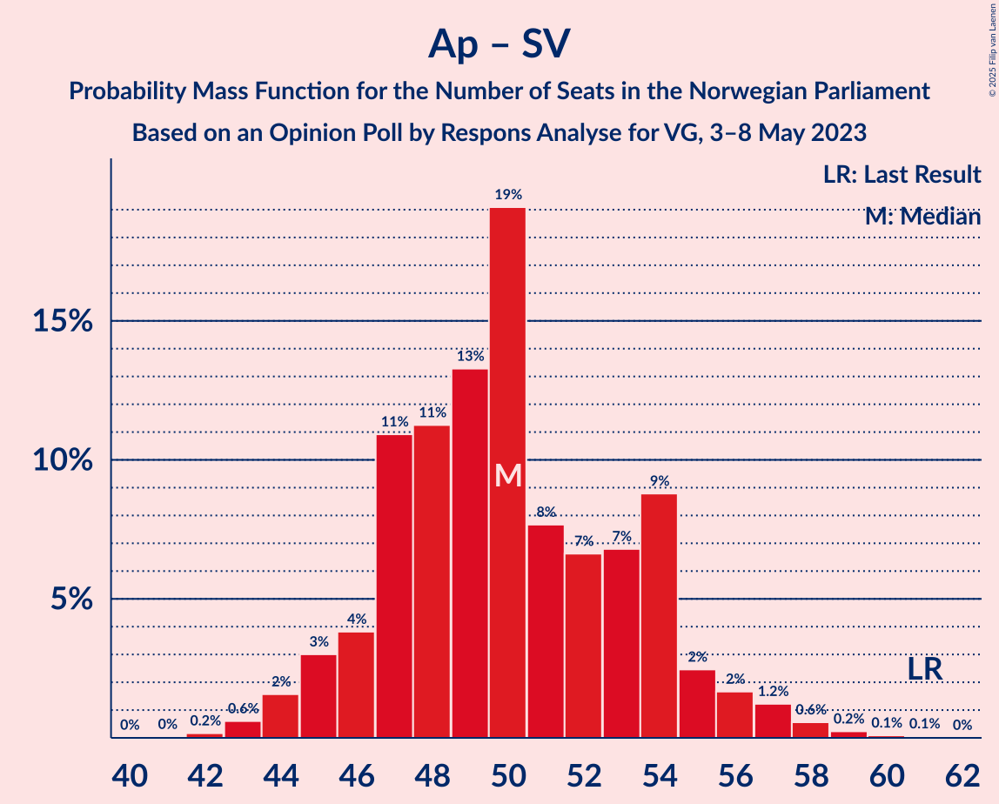

| Number of Seats | Probability | Accumulated | Special Marks |
|:---------------:|:-----------:|:-----------:|:-------------:|
| 41 | 0% | 100% |  |
| 42 | 0.2% | 99.9% |  |
| 43 | 0.6% | 99.8% |  |
| 44 | 2% | 99.2% |  |
| 45 | 3% | 98% |  |
| 46 | 4% | 95% |  |
| 47 | 11% | 91% |  |
| 48 | 11% | 80% |  |
| 49 | 13% | 69% | Median |
| 50 | 19% | 55% |  |
| 51 | 8% | 36% |  |
| 52 | 7% | 29% |  |
| 53 | 7% | 22% |  |
| 54 | 9% | 15% |  |
| 55 | 2% | 6% |  |
| 56 | 2% | 4% |  |
| 57 | 1.2% | 2% |  |
| 58 | 0.6% | 1.0% |  |
| 59 | 0.2% | 0.4% |  |
| 60 | 0.1% | 0.2% |  |
| 61 | 0.1% | 0.1% | Last Result |
| 62 | 0% | 0% |  |

### Arbeiderpartiet – Senterpartiet

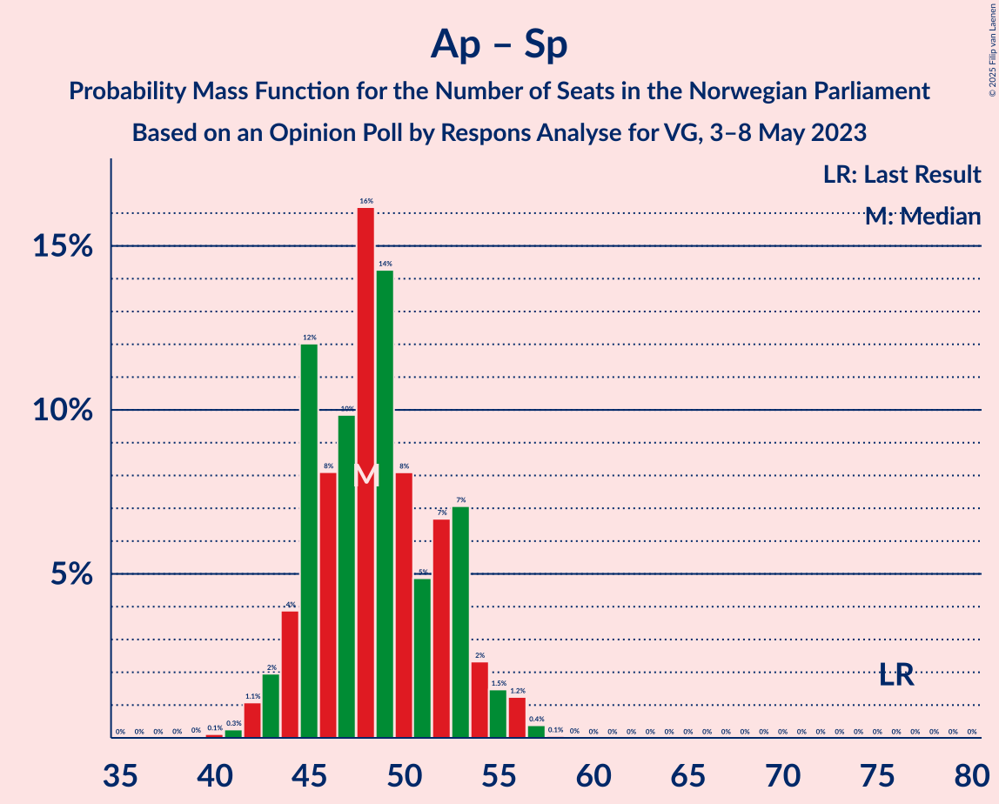

| Number of Seats | Probability | Accumulated | Special Marks |
|:---------------:|:-----------:|:-----------:|:-------------:|
| 39 | 0% | 100% |  |
| 40 | 0.1% | 99.9% |  |
| 41 | 0.3% | 99.8% |  |
| 42 | 1.1% | 99.6% |  |
| 43 | 2% | 98% |  |
| 44 | 4% | 97% |  |
| 45 | 12% | 93% |  |
| 46 | 8% | 81% |  |
| 47 | 10% | 73% |  |
| 48 | 16% | 63% | Median |
| 49 | 14% | 47% |  |
| 50 | 8% | 32% |  |
| 51 | 5% | 24% |  |
| 52 | 7% | 19% |  |
| 53 | 7% | 13% |  |
| 54 | 2% | 6% |  |
| 55 | 1.5% | 3% |  |
| 56 | 1.2% | 2% |  |
| 57 | 0.4% | 0.5% |  |
| 58 | 0.1% | 0.1% |  |
| 59 | 0% | 0% |  |
| 60 | 0% | 0% |  |
| 61 | 0% | 0% |  |
| 62 | 0% | 0% |  |
| 63 | 0% | 0% |  |
| 64 | 0% | 0% |  |
| 65 | 0% | 0% |  |
| 66 | 0% | 0% |  |
| 67 | 0% | 0% |  |
| 68 | 0% | 0% |  |
| 69 | 0% | 0% |  |
| 70 | 0% | 0% |  |
| 71 | 0% | 0% |  |
| 72 | 0% | 0% |  |
| 73 | 0% | 0% |  |
| 74 | 0% | 0% |  |
| 75 | 0% | 0% |  |
| 76 | 0% | 0% | Last Result |

### Senterpartiet – Venstre – Kristelig Folkeparti

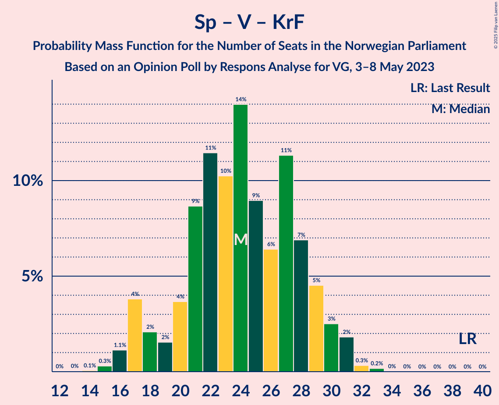

| Number of Seats | Probability | Accumulated | Special Marks |
|:---------------:|:-----------:|:-----------:|:-------------:|
| 13 | 0% | 100% |  |
| 14 | 0.1% | 99.9% |  |
| 15 | 0.3% | 99.9% |  |
| 16 | 1.1% | 99.6% |  |
| 17 | 4% | 98% |  |
| 18 | 2% | 95% |  |
| 19 | 2% | 93% |  |
| 20 | 4% | 91% |  |
| 21 | 9% | 87% |  |
| 22 | 11% | 79% |  |
| 23 | 10% | 67% | Median |
| 24 | 14% | 57% |  |
| 25 | 9% | 43% |  |
| 26 | 6% | 34% |  |
| 27 | 11% | 28% |  |
| 28 | 7% | 16% |  |
| 29 | 5% | 9% |  |
| 30 | 3% | 5% |  |
| 31 | 2% | 2% |  |
| 32 | 0.3% | 0.5% |  |
| 33 | 0.2% | 0.2% |  |
| 34 | 0% | 0% |  |
| 35 | 0% | 0% |  |
| 36 | 0% | 0% |  |
| 37 | 0% | 0% |  |
| 38 | 0% | 0% |  |
| 39 | 0% | 0% | Last Result |

## Technical Information

### Opinion Poll

+ **Polling firm:** Respons Analyse
+ **Commissioner(s):** VG
+ **Fieldwork period:** 3–8 May 2023

### Calculations

+ **Sample size:** 1000
+ **Simulations done:** 1,048,576
+ **Error estimate:** 0.84%

