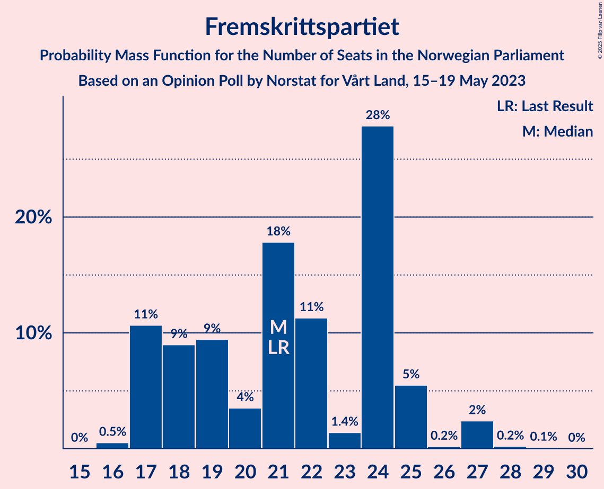

# Opinion Poll by Norstat for Vårt Land, 15–19 May 2023

<a href="#voting-intentions">Voting Intentions</a> | <a href="#seats">Seats</a> | <a href="#coalitions">Coalitions</a> | <a href="#technical-information">Technical Information</a>

## Voting Intentions

### Confidence Intervals

| Party | Last Result | Poll Result | 80% Confidence Interval | 90% Confidence Interval | 95% Confidence Interval | 99% Confidence Interval |
|:-----:|:-----------:|:-----------:|:-----------------------:|:-----------------------:|:-----------------------:|:-----------------------:|
| Høyre | 20.4% | 34.1% | 32.2–36.1% |31.7–36.6% |31.2–37.1% |30.3–38.1% |
| Arbeiderpartiet | 26.2% | 18.4% | 16.9–20.1% |16.5–20.5% |16.1–20.9% |15.4–21.7% |
| Fremskrittspartiet | 11.6% | 11.9% | 10.7–13.3% |10.3–13.7% |10.0–14.1% |9.5–14.8% |
| Sosialistisk Venstreparti | 7.6% | 9.1% | 8.0–10.4% |7.7–10.7% |7.5–11.1% |7.0–11.7% |
| Rødt | 4.7% | 5.3% | 4.5–6.3% |4.3–6.6% |4.1–6.9% |3.7–7.4% |
| Senterpartiet | 13.5% | 5.2% | 4.4–6.2% |4.2–6.5% |4.0–6.8% |3.6–7.3% |
| Venstre | 4.6% | 4.7% | 3.9–5.7% |3.7–6.0% |3.6–6.2% |3.2–6.7% |
| Miljøpartiet De Grønne | 3.9% | 3.8% | 3.1–4.7% |2.9–5.0% |2.8–5.2% |2.5–5.6% |
| Kristelig Folkeparti | 3.8% | 3.4% | 2.8–4.3% |2.6–4.5% |2.4–4.7% |2.2–5.2% |
| Industri- og Næringspartiet | 0.3% | 1.6% | 1.2–2.2% |1.1–2.4% |1.0–2.6% |0.8–2.9% |
| Norgesdemokratene | 1.1% | 1.3% | 0.9–1.9% |0.8–2.1% |0.8–2.2% |0.6–2.5% |
| Pensjonistpartiet | 0.6% | 0.5% | 0.3–0.9% |0.3–1.1% |0.2–1.2% |0.2–1.4% |

*Note:* The poll result column reflects the actual value used in the calculations. Published results may vary slightly, and in addition be rounded to fewer digits.

## Seats

### Confidence Intervals

| Party | Last Result | Median | 80% Confidence Interval | 90% Confidence Interval | 95% Confidence Interval | 99% Confidence Interval |
|:-----:|:-----------:|:------:|:-----------------------:|:-----------------------:|:-----------------------:|:-----------------------:|
| <a href="#høyre">Høyre</a> | 36 | 60 | 57–67 |57–67 |55–67 |54–70 |
| <a href="#arbeiderpartiet">Arbeiderpartiet</a> | 48 | 37 | 33–41 |33–41 |32–41 |32–41 |
| <a href="#fremskrittspartiet">Fremskrittspartiet</a> | 21 | 21 | 17–24 |17–25 |17–27 |16–27 |
| <a href="#sosialistisk-venstreparti">Sosialistisk Venstreparti</a> | 13 | 16 | 14–18 |14–19 |12–19 |12–20 |
| <a href="#rødt">Rødt</a> | 8 | 9 | 8–11 |8–11 |7–12 |1–13 |
| <a href="#senterpartiet">Senterpartiet</a> | 28 | 9 | 8–11 |7–12 |7–12 |1–13 |
| <a href="#venstre">Venstre</a> | 8 | 8 | 3–9 |2–10 |2–11 |2–12 |
| <a href="#miljøpartiet-de-grønne">Miljøpartiet De Grønne</a> | 3 | 7 | 1–8 |1–9 |1–9 |1–9 |
| <a href="#kristelig-folkeparti">Kristelig Folkeparti</a> | 3 | 3 | 1–7 |1–7 |1–7 |1–8 |
| <a href="#industri--og-næringspartiet">Industri- og Næringspartiet</a> | 0 | 0 | 0 |0 |0 |0–2 |
| <a href="#norgesdemokratene">Norgesdemokratene</a> | 0 | 0 | 0 |0 |0 |0 |
| <a href="#pensjonistpartiet">Pensjonistpartiet</a> | 0 | 0 | 0 |0 |0 |0 |

### Høyre

*For a full overview of the results for this party, see the [Høyre](party-høyre.html) page.*

| Number of Seats | Probability | Accumulated | Special Marks |
|:---------------:|:-----------:|:-----------:|:-------------:|
| 36 | 0% | 100% | Last Result |
| 37 | 0% | 100% |  |
| 38 | 0% | 100% |  |
| 39 | 0% | 100% |  |
| 40 | 0% | 100% |  |
| 41 | 0% | 100% |  |
| 42 | 0% | 100% |  |
| 43 | 0% | 100% |  |
| 44 | 0% | 100% |  |
| 45 | 0% | 100% |  |
| 46 | 0% | 100% |  |
| 47 | 0% | 100% |  |
| 48 | 0% | 100% |  |
| 49 | 0% | 100% |  |
| 50 | 0% | 100% |  |
| 51 | 0% | 100% |  |
| 52 | 0% | 100% |  |
| 53 | 0.3% | 99.9% |  |
| 54 | 2% | 99.6% |  |
| 55 | 2% | 98% |  |
| 56 | 0.4% | 96% |  |
| 57 | 27% | 95% |  |
| 58 | 5% | 69% |  |
| 59 | 10% | 64% |  |
| 60 | 7% | 54% | Median |
| 61 | 3% | 48% |  |
| 62 | 10% | 45% |  |
| 63 | 10% | 35% |  |
| 64 | 4% | 25% |  |
| 65 | 7% | 20% |  |
| 66 | 2% | 13% |  |
| 67 | 11% | 12% |  |
| 68 | 0.2% | 0.8% |  |
| 69 | 0.1% | 0.7% |  |
| 70 | 0.2% | 0.5% |  |
| 71 | 0.3% | 0.3% |  |
| 72 | 0% | 0.1% |  |
| 73 | 0% | 0% |  |

### Arbeiderpartiet

*For a full overview of the results for this party, see the [Arbeiderpartiet](party-arbeiderpartiet.html) page.*

| Number of Seats | Probability | Accumulated | Special Marks |
|:---------------:|:-----------:|:-----------:|:-------------:|
| 29 | 0.1% | 100% |  |
| 30 | 0% | 99.9% |  |
| 31 | 0.1% | 99.9% |  |
| 32 | 4% | 99.8% |  |
| 33 | 11% | 96% |  |
| 34 | 3% | 85% |  |
| 35 | 5% | 83% |  |
| 36 | 8% | 77% |  |
| 37 | 40% | 70% | Median |
| 38 | 13% | 30% |  |
| 39 | 3% | 17% |  |
| 40 | 2% | 15% |  |
| 41 | 12% | 12% |  |
| 42 | 0.1% | 0.3% |  |
| 43 | 0.2% | 0.2% |  |
| 44 | 0.1% | 0.1% |  |
| 45 | 0% | 0% |  |
| 46 | 0% | 0% |  |
| 47 | 0% | 0% |  |
| 48 | 0% | 0% | Last Result |

### Fremskrittspartiet

*For a full overview of the results for this party, see the [Fremskrittspartiet](party-fremskrittspartiet.html) page.*

| Number of Seats | Probability | Accumulated | Special Marks |
|:---------------:|:-----------:|:-----------:|:-------------:|
| 16 | 0.5% | 100% |  |
| 17 | 11% | 99.4% |  |
| 18 | 9% | 89% |  |
| 19 | 9% | 80% |  |
| 20 | 4% | 70% |  |
| 21 | 18% | 67% | Last Result, Median |
| 22 | 11% | 49% |  |
| 23 | 1.4% | 38% |  |
| 24 | 28% | 36% |  |
| 25 | 5% | 8% |  |
| 26 | 0.2% | 3% |  |
| 27 | 2% | 3% |  |
| 28 | 0.2% | 0.3% |  |
| 29 | 0.1% | 0.1% |  |
| 30 | 0% | 0% |  |

### Sosialistisk Venstreparti

*For a full overview of the results for this party, see the [Sosialistisk Venstreparti](party-sosialistiskvenstreparti.html) page.*

| Number of Seats | Probability | Accumulated | Special Marks |
|:---------------:|:-----------:|:-----------:|:-------------:|
| 11 | 0.3% | 100% |  |
| 12 | 3% | 99.7% |  |
| 13 | 1.3% | 97% | Last Result |
| 14 | 31% | 96% |  |
| 15 | 9% | 64% |  |
| 16 | 12% | 56% | Median |
| 17 | 31% | 44% |  |
| 18 | 4% | 13% |  |
| 19 | 9% | 10% |  |
| 20 | 0.3% | 0.6% |  |
| 21 | 0.2% | 0.3% |  |
| 22 | 0.1% | 0.1% |  |
| 23 | 0% | 0% |  |

### Rødt

*For a full overview of the results for this party, see the [Rødt](party-rødt.html) page.*

| Number of Seats | Probability | Accumulated | Special Marks |
|:---------------:|:-----------:|:-----------:|:-------------:|
| 1 | 0.6% | 100% |  |
| 2 | 0% | 99.4% |  |
| 3 | 0% | 99.4% |  |
| 4 | 0% | 99.4% |  |
| 5 | 0% | 99.4% |  |
| 6 | 0.1% | 99.4% |  |
| 7 | 4% | 99.4% |  |
| 8 | 16% | 96% | Last Result |
| 9 | 49% | 80% | Median |
| 10 | 16% | 31% |  |
| 11 | 12% | 15% |  |
| 12 | 2% | 3% |  |
| 13 | 0.6% | 0.7% |  |
| 14 | 0.1% | 0.1% |  |
| 15 | 0% | 0% |  |

### Senterpartiet

*For a full overview of the results for this party, see the [Senterpartiet](party-senterpartiet.html) page.*

| Number of Seats | Probability | Accumulated | Special Marks |
|:---------------:|:-----------:|:-----------:|:-------------:|
| 0 | 0.4% | 100% |  |
| 1 | 1.4% | 99.6% |  |
| 2 | 0% | 98% |  |
| 3 | 0% | 98% |  |
| 4 | 0% | 98% |  |
| 5 | 0% | 98% |  |
| 6 | 0.1% | 98% |  |
| 7 | 4% | 98% |  |
| 8 | 12% | 94% |  |
| 9 | 58% | 82% | Median |
| 10 | 8% | 23% |  |
| 11 | 10% | 15% |  |
| 12 | 4% | 5% |  |
| 13 | 0.6% | 0.8% |  |
| 14 | 0.1% | 0.1% |  |
| 15 | 0% | 0% |  |
| 16 | 0% | 0% |  |
| 17 | 0% | 0% |  |
| 18 | 0% | 0% |  |
| 19 | 0% | 0% |  |
| 20 | 0% | 0% |  |
| 21 | 0% | 0% |  |
| 22 | 0% | 0% |  |
| 23 | 0% | 0% |  |
| 24 | 0% | 0% |  |
| 25 | 0% | 0% |  |
| 26 | 0% | 0% |  |
| 27 | 0% | 0% |  |
| 28 | 0% | 0% | Last Result |

### Venstre

*For a full overview of the results for this party, see the [Venstre](party-venstre.html) page.*

| Number of Seats | Probability | Accumulated | Special Marks |
|:---------------:|:-----------:|:-----------:|:-------------:|
| 2 | 7% | 100% |  |
| 3 | 15% | 93% |  |
| 4 | 0% | 78% |  |
| 5 | 0% | 78% |  |
| 6 | 0.3% | 78% |  |
| 7 | 15% | 77% |  |
| 8 | 43% | 63% | Last Result, Median |
| 9 | 10% | 19% |  |
| 10 | 6% | 10% |  |
| 11 | 1.1% | 3% |  |
| 12 | 2% | 2% |  |
| 13 | 0.1% | 0.1% |  |
| 14 | 0% | 0% |  |

### Miljøpartiet De Grønne

*For a full overview of the results for this party, see the [Miljøpartiet De Grønne](party-miljøpartietdegrønne.html) page.*

| Number of Seats | Probability | Accumulated | Special Marks |
|:---------------:|:-----------:|:-----------:|:-------------:|
| 1 | 12% | 100% |  |
| 2 | 28% | 88% |  |
| 3 | 7% | 60% | Last Result |
| 4 | 0% | 54% |  |
| 5 | 0% | 54% |  |
| 6 | 1.0% | 54% |  |
| 7 | 40% | 53% | Median |
| 8 | 8% | 13% |  |
| 9 | 5% | 5% |  |
| 10 | 0.4% | 0.4% |  |
| 11 | 0% | 0% |  |

### Kristelig Folkeparti

*For a full overview of the results for this party, see the [Kristelig Folkeparti](party-kristeligfolkeparti.html) page.*

| Number of Seats | Probability | Accumulated | Special Marks |
|:---------------:|:-----------:|:-----------:|:-------------:|
| 0 | 0.3% | 100% |  |
| 1 | 11% | 99.7% |  |
| 2 | 27% | 88% |  |
| 3 | 48% | 61% | Last Result, Median |
| 4 | 0% | 13% |  |
| 5 | 0% | 13% |  |
| 6 | 0.9% | 13% |  |
| 7 | 10% | 12% |  |
| 8 | 2% | 2% |  |
| 9 | 0.2% | 0.2% |  |
| 10 | 0% | 0% |  |

### Industri- og Næringspartiet

*For a full overview of the results for this party, see the [Industri- og Næringspartiet](party-industri-ognæringspartiet.html) page.*

| Number of Seats | Probability | Accumulated | Special Marks |
|:---------------:|:-----------:|:-----------:|:-------------:|
| 0 | 98.7% | 100% | Last Result, Median |
| 1 | 0.1% | 1.3% |  |
| 2 | 1.2% | 1.2% |  |
| 3 | 0% | 0% |  |

### Norgesdemokratene

*For a full overview of the results for this party, see the [Norgesdemokratene](party-norgesdemokratene.html) page.*

| Number of Seats | Probability | Accumulated | Special Marks |
|:---------------:|:-----------:|:-----------:|:-------------:|
| 0 | 100% | 100% | Last Result, Median |

### Pensjonistpartiet

*For a full overview of the results for this party, see the [Pensjonistpartiet](party-pensjonistpartiet.html) page.*

| Number of Seats | Probability | Accumulated | Special Marks |
|:---------------:|:-----------:|:-----------:|:-------------:|
| 0 | 100% | 100% | Last Result, Median |

## Coalitions

### Confidence Intervals

| Coalition | Last Result | Median | Majority? | 80% Confidence Interval | 90% Confidence Interval | 95% Confidence Interval | 99% Confidence Interval |
|:---------:|:-----------:|:------:|:---------:|:-----------------------:|:-----------------------:|:-----------------------:|:-----------------------:|
| Høyre – Fremskrittspartiet – Senterpartiet – Venstre – Kristelig Folkeparti | 96 | 101 | 100% | 99–106 | 97–108 | 95–108 | 95–110 |
| Høyre – Fremskrittspartiet – Venstre – Miljøpartiet De Grønne – Kristelig Folkeparti | 71 | 98 | 100% | 92–99 | 92–101 | 92–103 | 90–109 |
| Høyre – Fremskrittspartiet – Venstre – Kristelig Folkeparti | 68 | 92 | 99.8% | 90–96 | 89–96 | 86–99 | 86–103 |
| Høyre – Fremskrittspartiet – Venstre | 65 | 89 | 86% | 84–93 | 83–94 | 83–95 | 83–100 |
| Høyre – Fremskrittspartiet | 57 | 81 | 21% | 80–86 | 79–87 | 79–88 | 76–91 |
| Arbeiderpartiet – Sosialistisk Venstreparti – Rødt – Senterpartiet – Miljøpartiet De Grønne | 100 | 76 | 0.1% | 72–78 | 72–79 | 69–82 | 65–82 |
| Høyre – Venstre – Kristelig Folkeparti | 47 | 69 | 0.1% | 68–77 | 64–78 | 64–78 | 64–82 |
| Arbeiderpartiet – Sosialistisk Venstreparti – Rødt – Senterpartiet | 97 | 70 | 0% | 69–76 | 66–76 | 65–76 | 59–78 |
| Arbeiderpartiet – Sosialistisk Venstreparti – Senterpartiet – Miljøpartiet De Grønne – Kristelig Folkeparti | 95 | 70 | 0% | 64–75 | 63–76 | 63–76 | 61–76 |
| Arbeiderpartiet – Sosialistisk Venstreparti – Rødt – Miljøpartiet De Grønne | 72 | 67 | 0% | 62–69 | 60–71 | 60–73 | 58–73 |
| Arbeiderpartiet – Sosialistisk Venstreparti – Senterpartiet – Miljøpartiet De Grønne | 92 | 67 | 0% | 62–70 | 61–70 | 61–72 | 57–72 |
| Arbeiderpartiet – Sosialistisk Venstreparti – Senterpartiet | 89 | 61 | 0% | 59–67 | 58–67 | 55–67 | 52–68 |
| Arbeiderpartiet – Senterpartiet – Miljøpartiet De Grønne – Kristelig Folkeparti | 82 | 56 | 0% | 49–59 | 47–59 | 47–60 | 45–61 |
| Arbeiderpartiet – Sosialistisk Venstreparti | 61 | 52 | 0% | 49–57 | 48–58 | 48–58 | 45–58 |
| Arbeiderpartiet – Senterpartiet – Kristelig Folkeparti | 79 | 49 | 0% | 45–54 | 44–57 | 43–57 | 40–57 |
| Arbeiderpartiet – Senterpartiet | 76 | 46 | 0% | 43–50 | 42–50 | 41–50 | 37–51 |
| Senterpartiet – Venstre – Kristelig Folkeparti | 39 | 20 | 0% | 15–22 | 14–23 | 13–23 | 13–27 |

### Høyre – Fremskrittspartiet – Senterpartiet – Venstre – Kristelig Folkeparti

| Number of Seats | Probability | Accumulated | Special Marks |
|:---------------:|:-----------:|:-----------:|:-------------:|
| 91 | 0.1% | 100% |  |
| 92 | 0% | 99.8% |  |
| 93 | 0% | 99.8% |  |
| 94 | 0.1% | 99.8% |  |
| 95 | 4% | 99.7% |  |
| 96 | 0.2% | 96% | Last Result |
| 97 | 1.2% | 96% |  |
| 98 | 0.7% | 95% |  |
| 99 | 19% | 94% |  |
| 100 | 8% | 75% |  |
| 101 | 36% | 68% | Median |
| 102 | 10% | 32% |  |
| 103 | 9% | 22% |  |
| 104 | 0.3% | 14% |  |
| 105 | 2% | 13% |  |
| 106 | 6% | 12% |  |
| 107 | 0.4% | 6% |  |
| 108 | 4% | 5% |  |
| 109 | 0.3% | 0.9% |  |
| 110 | 0.1% | 0.6% |  |
| 111 | 0.1% | 0.5% |  |
| 112 | 0.1% | 0.3% |  |
| 113 | 0.1% | 0.2% |  |
| 114 | 0% | 0.1% |  |
| 115 | 0% | 0.1% |  |
| 116 | 0% | 0% |  |

### Høyre – Fremskrittspartiet – Venstre – Miljøpartiet De Grønne – Kristelig Folkeparti

| Number of Seats | Probability | Accumulated | Special Marks |
|:---------------:|:-----------:|:-----------:|:-------------:|
| 71 | 0% | 100% | Last Result |
| 72 | 0% | 100% |  |
| 73 | 0% | 100% |  |
| 74 | 0% | 100% |  |
| 75 | 0% | 100% |  |
| 76 | 0% | 100% |  |
| 77 | 0% | 100% |  |
| 78 | 0% | 100% |  |
| 79 | 0% | 100% |  |
| 80 | 0% | 100% |  |
| 81 | 0% | 100% |  |
| 82 | 0% | 100% |  |
| 83 | 0% | 100% |  |
| 84 | 0% | 100% |  |
| 85 | 0% | 100% | Majority |
| 86 | 0% | 100% |  |
| 87 | 0.1% | 100% |  |
| 88 | 0% | 99.9% |  |
| 89 | 0.1% | 99.8% |  |
| 90 | 0.3% | 99.7% |  |
| 91 | 0.1% | 99.4% |  |
| 92 | 10% | 99.4% |  |
| 93 | 11% | 90% |  |
| 94 | 4% | 79% |  |
| 95 | 7% | 75% |  |
| 96 | 2% | 68% |  |
| 97 | 14% | 66% |  |
| 98 | 12% | 52% |  |
| 99 | 31% | 40% | Median |
| 100 | 4% | 9% |  |
| 101 | 0.4% | 5% |  |
| 102 | 2% | 5% |  |
| 103 | 0.5% | 3% |  |
| 104 | 0.3% | 2% |  |
| 105 | 0.2% | 2% |  |
| 106 | 0.2% | 2% |  |
| 107 | 0.1% | 2% |  |
| 108 | 0.3% | 2% |  |
| 109 | 1.2% | 1.3% |  |
| 110 | 0.1% | 0.2% |  |
| 111 | 0% | 0.1% |  |
| 112 | 0% | 0.1% |  |
| 113 | 0% | 0.1% |  |
| 114 | 0% | 0% |  |

### Høyre – Fremskrittspartiet – Venstre – Kristelig Folkeparti

| Number of Seats | Probability | Accumulated | Special Marks |
|:---------------:|:-----------:|:-----------:|:-------------:|
| 68 | 0% | 100% | Last Result |
| 69 | 0% | 100% |  |
| 70 | 0% | 100% |  |
| 71 | 0% | 100% |  |
| 72 | 0% | 100% |  |
| 73 | 0% | 100% |  |
| 74 | 0% | 100% |  |
| 75 | 0% | 100% |  |
| 76 | 0% | 100% |  |
| 77 | 0% | 100% |  |
| 78 | 0% | 100% |  |
| 79 | 0% | 100% |  |
| 80 | 0.1% | 100% |  |
| 81 | 0% | 99.9% |  |
| 82 | 0.1% | 99.9% |  |
| 83 | 0% | 99.9% |  |
| 84 | 0.1% | 99.9% |  |
| 85 | 0.1% | 99.8% | Majority |
| 86 | 4% | 99.6% |  |
| 87 | 0.3% | 96% |  |
| 88 | 0.5% | 96% |  |
| 89 | 0.6% | 95% |  |
| 90 | 24% | 95% |  |
| 91 | 8% | 70% |  |
| 92 | 31% | 63% | Median |
| 93 | 5% | 31% |  |
| 94 | 8% | 26% |  |
| 95 | 5% | 18% |  |
| 96 | 9% | 14% |  |
| 97 | 0.5% | 5% |  |
| 98 | 2% | 4% |  |
| 99 | 0.5% | 3% |  |
| 100 | 1.3% | 2% |  |
| 101 | 0.1% | 0.9% |  |
| 102 | 0.3% | 0.8% |  |
| 103 | 0.1% | 0.5% |  |
| 104 | 0.1% | 0.4% |  |
| 105 | 0.1% | 0.4% |  |
| 106 | 0.2% | 0.2% |  |
| 107 | 0% | 0.1% |  |
| 108 | 0% | 0.1% |  |
| 109 | 0% | 0% |  |

### Høyre – Fremskrittspartiet – Venstre

| Number of Seats | Probability | Accumulated | Special Marks |
|:---------------:|:-----------:|:-----------:|:-------------:|
| 65 | 0% | 100% | Last Result |
| 66 | 0% | 100% |  |
| 67 | 0% | 100% |  |
| 68 | 0% | 100% |  |
| 69 | 0% | 100% |  |
| 70 | 0% | 100% |  |
| 71 | 0% | 100% |  |
| 72 | 0% | 100% |  |
| 73 | 0% | 100% |  |
| 74 | 0% | 100% |  |
| 75 | 0% | 100% |  |
| 76 | 0% | 100% |  |
| 77 | 0% | 100% |  |
| 78 | 0.1% | 100% |  |
| 79 | 0% | 99.9% |  |
| 80 | 0.1% | 99.9% |  |
| 81 | 0.1% | 99.8% |  |
| 82 | 0.1% | 99.7% |  |
| 83 | 10% | 99.6% |  |
| 84 | 4% | 90% |  |
| 85 | 0.6% | 86% | Majority |
| 86 | 0.6% | 86% |  |
| 87 | 10% | 85% |  |
| 88 | 3% | 75% |  |
| 89 | 36% | 72% | Median |
| 90 | 7% | 35% |  |
| 91 | 4% | 29% |  |
| 92 | 8% | 25% |  |
| 93 | 8% | 17% |  |
| 94 | 6% | 9% |  |
| 95 | 0.4% | 3% |  |
| 96 | 0.4% | 2% |  |
| 97 | 1.4% | 2% |  |
| 98 | 0.1% | 0.7% |  |
| 99 | 0.1% | 0.6% |  |
| 100 | 0.1% | 0.5% |  |
| 101 | 0.1% | 0.4% |  |
| 102 | 0.1% | 0.3% |  |
| 103 | 0.1% | 0.2% |  |
| 104 | 0% | 0% |  |

### Høyre – Fremskrittspartiet

| Number of Seats | Probability | Accumulated | Special Marks |
|:---------------:|:-----------:|:-----------:|:-------------:|
| 57 | 0% | 100% | Last Result |
| 58 | 0% | 100% |  |
| 59 | 0% | 100% |  |
| 60 | 0% | 100% |  |
| 61 | 0% | 100% |  |
| 62 | 0% | 100% |  |
| 63 | 0% | 100% |  |
| 64 | 0% | 100% |  |
| 65 | 0% | 100% |  |
| 66 | 0% | 100% |  |
| 67 | 0% | 100% |  |
| 68 | 0% | 100% |  |
| 69 | 0% | 100% |  |
| 70 | 0% | 100% |  |
| 71 | 0% | 100% |  |
| 72 | 0% | 100% |  |
| 73 | 0% | 100% |  |
| 74 | 0.1% | 99.9% |  |
| 75 | 0.3% | 99.8% |  |
| 76 | 0.4% | 99.6% |  |
| 77 | 0.3% | 99.2% |  |
| 78 | 1.2% | 98.8% |  |
| 79 | 3% | 98% |  |
| 80 | 21% | 94% |  |
| 81 | 31% | 73% | Median |
| 82 | 7% | 43% |  |
| 83 | 8% | 35% |  |
| 84 | 6% | 27% |  |
| 85 | 7% | 21% | Majority |
| 86 | 9% | 15% |  |
| 87 | 2% | 6% |  |
| 88 | 3% | 4% |  |
| 89 | 0.2% | 1.1% |  |
| 90 | 0.3% | 0.9% |  |
| 91 | 0.3% | 0.6% |  |
| 92 | 0.1% | 0.3% |  |
| 93 | 0.1% | 0.3% |  |
| 94 | 0.1% | 0.2% |  |
| 95 | 0% | 0.1% |  |
| 96 | 0% | 0% |  |

### Arbeiderpartiet – Sosialistisk Venstreparti – Rødt – Senterpartiet – Miljøpartiet De Grønne

| Number of Seats | Probability | Accumulated | Special Marks |
|:---------------:|:-----------:|:-----------:|:-------------:|
| 60 | 0% | 100% |  |
| 61 | 0% | 99.9% |  |
| 62 | 0.2% | 99.9% |  |
| 63 | 0.1% | 99.8% |  |
| 64 | 0.1% | 99.6% |  |
| 65 | 0.1% | 99.5% |  |
| 66 | 0.2% | 99.4% |  |
| 67 | 0.1% | 99.2% |  |
| 68 | 1.3% | 99.0% |  |
| 69 | 0.5% | 98% |  |
| 70 | 2% | 97% |  |
| 71 | 0.5% | 96% |  |
| 72 | 9% | 95% |  |
| 73 | 6% | 86% |  |
| 74 | 8% | 81% |  |
| 75 | 4% | 73% |  |
| 76 | 31% | 69% |  |
| 77 | 8% | 37% |  |
| 78 | 24% | 30% | Median |
| 79 | 0.6% | 5% |  |
| 80 | 0.5% | 5% |  |
| 81 | 0.3% | 4% |  |
| 82 | 3% | 4% |  |
| 83 | 0.1% | 0.4% |  |
| 84 | 0.1% | 0.2% |  |
| 85 | 0% | 0.1% | Majority |
| 86 | 0.1% | 0.1% |  |
| 87 | 0% | 0.1% |  |
| 88 | 0% | 0% |  |
| 89 | 0% | 0% |  |
| 90 | 0% | 0% |  |
| 91 | 0% | 0% |  |
| 92 | 0% | 0% |  |
| 93 | 0% | 0% |  |
| 94 | 0% | 0% |  |
| 95 | 0% | 0% |  |
| 96 | 0% | 0% |  |
| 97 | 0% | 0% |  |
| 98 | 0% | 0% |  |
| 99 | 0% | 0% |  |
| 100 | 0% | 0% | Last Result |

### Høyre – Venstre – Kristelig Folkeparti

| Number of Seats | Probability | Accumulated | Special Marks |
|:---------------:|:-----------:|:-----------:|:-------------:|
| 47 | 0% | 100% | Last Result |
| 48 | 0% | 100% |  |
| 49 | 0% | 100% |  |
| 50 | 0% | 100% |  |
| 51 | 0% | 100% |  |
| 52 | 0% | 100% |  |
| 53 | 0% | 100% |  |
| 54 | 0% | 100% |  |
| 55 | 0% | 100% |  |
| 56 | 0% | 100% |  |
| 57 | 0% | 100% |  |
| 58 | 0% | 100% |  |
| 59 | 0% | 100% |  |
| 60 | 0.1% | 100% |  |
| 61 | 0% | 99.9% |  |
| 62 | 0% | 99.9% |  |
| 63 | 0.2% | 99.9% |  |
| 64 | 5% | 99.7% |  |
| 65 | 0.1% | 94% |  |
| 66 | 1.0% | 94% |  |
| 67 | 0.9% | 93% |  |
| 68 | 26% | 92% |  |
| 69 | 17% | 66% |  |
| 70 | 6% | 49% |  |
| 71 | 2% | 43% | Median |
| 72 | 6% | 41% |  |
| 73 | 16% | 35% |  |
| 74 | 3% | 19% |  |
| 75 | 2% | 15% |  |
| 76 | 2% | 13% |  |
| 77 | 4% | 11% |  |
| 78 | 5% | 7% |  |
| 79 | 0.2% | 2% |  |
| 80 | 0.3% | 2% |  |
| 81 | 0.4% | 1.4% |  |
| 82 | 0.7% | 1.0% |  |
| 83 | 0.1% | 0.3% |  |
| 84 | 0.1% | 0.1% |  |
| 85 | 0% | 0.1% | Majority |
| 86 | 0% | 0.1% |  |
| 87 | 0% | 0% |  |

### Arbeiderpartiet – Sosialistisk Venstreparti – Rødt – Senterpartiet

| Number of Seats | Probability | Accumulated | Special Marks |
|:---------------:|:-----------:|:-----------:|:-------------:|
| 55 | 0% | 100% |  |
| 56 | 0% | 99.9% |  |
| 57 | 0% | 99.9% |  |
| 58 | 0.1% | 99.9% |  |
| 59 | 1.2% | 99.8% |  |
| 60 | 0.3% | 98.7% |  |
| 61 | 0.1% | 98% |  |
| 62 | 0.2% | 98% |  |
| 63 | 0.2% | 98% |  |
| 64 | 0.3% | 98% |  |
| 65 | 0.6% | 98% |  |
| 66 | 3% | 97% |  |
| 67 | 0.4% | 94% |  |
| 68 | 3% | 94% |  |
| 69 | 31% | 91% |  |
| 70 | 12% | 60% |  |
| 71 | 14% | 48% | Median |
| 72 | 2% | 34% |  |
| 73 | 7% | 32% |  |
| 74 | 4% | 25% |  |
| 75 | 11% | 21% |  |
| 76 | 10% | 10% |  |
| 77 | 0% | 0.6% |  |
| 78 | 0.2% | 0.5% |  |
| 79 | 0.1% | 0.3% |  |
| 80 | 0.1% | 0.2% |  |
| 81 | 0.1% | 0.1% |  |
| 82 | 0% | 0% |  |
| 83 | 0% | 0% |  |
| 84 | 0% | 0% |  |
| 85 | 0% | 0% | Majority |
| 86 | 0% | 0% |  |
| 87 | 0% | 0% |  |
| 88 | 0% | 0% |  |
| 89 | 0% | 0% |  |
| 90 | 0% | 0% |  |
| 91 | 0% | 0% |  |
| 92 | 0% | 0% |  |
| 93 | 0% | 0% |  |
| 94 | 0% | 0% |  |
| 95 | 0% | 0% |  |
| 96 | 0% | 0% |  |
| 97 | 0% | 0% | Last Result |

### Arbeiderpartiet – Sosialistisk Venstreparti – Senterpartiet – Miljøpartiet De Grønne – Kristelig Folkeparti

| Number of Seats | Probability | Accumulated | Special Marks |
|:---------------:|:-----------:|:-----------:|:-------------:|
| 57 | 0.2% | 100% |  |
| 58 | 0% | 99.8% |  |
| 59 | 0.1% | 99.8% |  |
| 60 | 0.2% | 99.7% |  |
| 61 | 0.1% | 99.5% |  |
| 62 | 0.2% | 99.4% |  |
| 63 | 6% | 99.2% |  |
| 64 | 6% | 94% |  |
| 65 | 2% | 88% |  |
| 66 | 10% | 86% |  |
| 67 | 2% | 76% |  |
| 68 | 8% | 74% |  |
| 69 | 3% | 65% |  |
| 70 | 33% | 63% |  |
| 71 | 0.7% | 29% |  |
| 72 | 5% | 29% | Median |
| 73 | 10% | 24% |  |
| 74 | 4% | 14% |  |
| 75 | 0.3% | 10% |  |
| 76 | 9% | 10% |  |
| 77 | 0.1% | 0.5% |  |
| 78 | 0.2% | 0.3% |  |
| 79 | 0.1% | 0.2% |  |
| 80 | 0.1% | 0.1% |  |
| 81 | 0% | 0% |  |
| 82 | 0% | 0% |  |
| 83 | 0% | 0% |  |
| 84 | 0% | 0% |  |
| 85 | 0% | 0% | Majority |
| 86 | 0% | 0% |  |
| 87 | 0% | 0% |  |
| 88 | 0% | 0% |  |
| 89 | 0% | 0% |  |
| 90 | 0% | 0% |  |
| 91 | 0% | 0% |  |
| 92 | 0% | 0% |  |
| 93 | 0% | 0% |  |
| 94 | 0% | 0% |  |
| 95 | 0% | 0% | Last Result |

### Arbeiderpartiet – Sosialistisk Venstreparti – Rødt – Miljøpartiet De Grønne

| Number of Seats | Probability | Accumulated | Special Marks |
|:---------------:|:-----------:|:-----------:|:-------------:|
| 53 | 0% | 100% |  |
| 54 | 0% | 99.9% |  |
| 55 | 0.1% | 99.9% |  |
| 56 | 0.2% | 99.8% |  |
| 57 | 0.1% | 99.7% |  |
| 58 | 0.1% | 99.5% |  |
| 59 | 0.3% | 99.4% |  |
| 60 | 4% | 99.1% |  |
| 61 | 0.4% | 95% |  |
| 62 | 6% | 94% |  |
| 63 | 2% | 88% |  |
| 64 | 0.2% | 87% |  |
| 65 | 9% | 86% |  |
| 66 | 10% | 78% |  |
| 67 | 36% | 67% |  |
| 68 | 7% | 31% |  |
| 69 | 19% | 24% | Median |
| 70 | 0.6% | 6% |  |
| 71 | 1.2% | 5% |  |
| 72 | 0.2% | 4% | Last Result |
| 73 | 4% | 4% |  |
| 74 | 0.1% | 0.3% |  |
| 75 | 0% | 0.2% |  |
| 76 | 0% | 0.2% |  |
| 77 | 0.1% | 0.2% |  |
| 78 | 0% | 0% |  |

### Arbeiderpartiet – Sosialistisk Venstreparti – Senterpartiet – Miljøpartiet De Grønne

| Number of Seats | Probability | Accumulated | Special Marks |
|:---------------:|:-----------:|:-----------:|:-------------:|
| 54 | 0.2% | 100% |  |
| 55 | 0.1% | 99.8% |  |
| 56 | 0% | 99.7% |  |
| 57 | 0.5% | 99.7% |  |
| 58 | 0.1% | 99.2% |  |
| 59 | 0.4% | 99.1% |  |
| 60 | 1.2% | 98.7% |  |
| 61 | 7% | 98% |  |
| 62 | 4% | 90% |  |
| 63 | 6% | 86% |  |
| 64 | 6% | 80% |  |
| 65 | 2% | 74% |  |
| 66 | 2% | 72% |  |
| 67 | 36% | 70% |  |
| 68 | 1.0% | 34% |  |
| 69 | 19% | 33% | Median |
| 70 | 9% | 14% |  |
| 71 | 0.2% | 4% |  |
| 72 | 4% | 4% |  |
| 73 | 0.1% | 0.4% |  |
| 74 | 0.1% | 0.3% |  |
| 75 | 0.1% | 0.3% |  |
| 76 | 0.1% | 0.1% |  |
| 77 | 0% | 0.1% |  |
| 78 | 0.1% | 0.1% |  |
| 79 | 0% | 0% |  |
| 80 | 0% | 0% |  |
| 81 | 0% | 0% |  |
| 82 | 0% | 0% |  |
| 83 | 0% | 0% |  |
| 84 | 0% | 0% |  |
| 85 | 0% | 0% | Majority |
| 86 | 0% | 0% |  |
| 87 | 0% | 0% |  |
| 88 | 0% | 0% |  |
| 89 | 0% | 0% |  |
| 90 | 0% | 0% |  |
| 91 | 0% | 0% |  |
| 92 | 0% | 0% | Last Result |

### Arbeiderpartiet – Sosialistisk Venstreparti – Senterpartiet

| Number of Seats | Probability | Accumulated | Special Marks |
|:---------------:|:-----------:|:-----------:|:-------------:|
| 50 | 0% | 100% |  |
| 51 | 0% | 99.9% |  |
| 52 | 1.5% | 99.9% |  |
| 53 | 0.2% | 98% |  |
| 54 | 0.4% | 98% |  |
| 55 | 0.4% | 98% |  |
| 56 | 1.3% | 97% |  |
| 57 | 0.3% | 96% |  |
| 58 | 5% | 96% |  |
| 59 | 9% | 91% |  |
| 60 | 31% | 82% |  |
| 61 | 7% | 51% |  |
| 62 | 4% | 45% | Median |
| 63 | 15% | 41% |  |
| 64 | 4% | 25% |  |
| 65 | 0.8% | 21% |  |
| 66 | 9% | 21% |  |
| 67 | 9% | 12% |  |
| 68 | 2% | 2% |  |
| 69 | 0.1% | 0.3% |  |
| 70 | 0.1% | 0.1% |  |
| 71 | 0% | 0% |  |
| 72 | 0% | 0% |  |
| 73 | 0% | 0% |  |
| 74 | 0% | 0% |  |
| 75 | 0% | 0% |  |
| 76 | 0% | 0% |  |
| 77 | 0% | 0% |  |
| 78 | 0% | 0% |  |
| 79 | 0% | 0% |  |
| 80 | 0% | 0% |  |
| 81 | 0% | 0% |  |
| 82 | 0% | 0% |  |
| 83 | 0% | 0% |  |
| 84 | 0% | 0% |  |
| 85 | 0% | 0% | Majority |
| 86 | 0% | 0% |  |
| 87 | 0% | 0% |  |
| 88 | 0% | 0% |  |
| 89 | 0% | 0% | Last Result |

### Arbeiderpartiet – Senterpartiet – Miljøpartiet De Grønne – Kristelig Folkeparti

| Number of Seats | Probability | Accumulated | Special Marks |
|:---------------:|:-----------:|:-----------:|:-------------:|
| 39 | 0% | 100% |  |
| 40 | 0% | 99.9% |  |
| 41 | 0.2% | 99.9% |  |
| 42 | 0.1% | 99.7% |  |
| 43 | 0.1% | 99.7% |  |
| 44 | 0.1% | 99.6% |  |
| 45 | 0.1% | 99.5% |  |
| 46 | 0.5% | 99.5% |  |
| 47 | 6% | 99.0% |  |
| 48 | 2% | 93% |  |
| 49 | 14% | 92% |  |
| 50 | 4% | 77% |  |
| 51 | 6% | 73% |  |
| 52 | 4% | 66% |  |
| 53 | 5% | 63% |  |
| 54 | 3% | 58% |  |
| 55 | 2% | 55% |  |
| 56 | 35% | 53% | Median |
| 57 | 4% | 18% |  |
| 58 | 0.4% | 14% |  |
| 59 | 11% | 14% |  |
| 60 | 2% | 3% |  |
| 61 | 0.3% | 0.6% |  |
| 62 | 0.2% | 0.3% |  |
| 63 | 0% | 0.1% |  |
| 64 | 0% | 0.1% |  |
| 65 | 0.1% | 0.1% |  |
| 66 | 0% | 0% |  |
| 67 | 0% | 0% |  |
| 68 | 0% | 0% |  |
| 69 | 0% | 0% |  |
| 70 | 0% | 0% |  |
| 71 | 0% | 0% |  |
| 72 | 0% | 0% |  |
| 73 | 0% | 0% |  |
| 74 | 0% | 0% |  |
| 75 | 0% | 0% |  |
| 76 | 0% | 0% |  |
| 77 | 0% | 0% |  |
| 78 | 0% | 0% |  |
| 79 | 0% | 0% |  |
| 80 | 0% | 0% |  |
| 81 | 0% | 0% |  |
| 82 | 0% | 0% | Last Result |

### Arbeiderpartiet – Sosialistisk Venstreparti

| Number of Seats | Probability | Accumulated | Special Marks |
|:---------------:|:-----------:|:-----------:|:-------------:|
| 43 | 0% | 100% |  |
| 44 | 0.1% | 99.9% |  |
| 45 | 0.4% | 99.9% |  |
| 46 | 0.3% | 99.5% |  |
| 47 | 1.3% | 99.2% |  |
| 48 | 4% | 98% |  |
| 49 | 11% | 94% |  |
| 50 | 0.8% | 83% |  |
| 51 | 30% | 82% |  |
| 52 | 7% | 52% |  |
| 53 | 4% | 45% | Median |
| 54 | 12% | 42% |  |
| 55 | 15% | 30% |  |
| 56 | 0.8% | 16% |  |
| 57 | 5% | 15% |  |
| 58 | 10% | 10% |  |
| 59 | 0% | 0.1% |  |
| 60 | 0% | 0.1% |  |
| 61 | 0% | 0.1% | Last Result |
| 62 | 0% | 0% |  |

### Arbeiderpartiet – Senterpartiet – Kristelig Folkeparti

| Number of Seats | Probability | Accumulated | Special Marks |
|:---------------:|:-----------:|:-----------:|:-------------:|
| 36 | 0.1% | 100% |  |
| 37 | 0% | 99.9% |  |
| 38 | 0% | 99.9% |  |
| 39 | 0.2% | 99.9% |  |
| 40 | 1.2% | 99.7% |  |
| 41 | 0.1% | 98% |  |
| 42 | 0.2% | 98% |  |
| 43 | 0.7% | 98% |  |
| 44 | 4% | 97% |  |
| 45 | 8% | 94% |  |
| 46 | 4% | 86% |  |
| 47 | 5% | 82% |  |
| 48 | 18% | 77% |  |
| 49 | 40% | 59% | Median |
| 50 | 1.1% | 19% |  |
| 51 | 2% | 18% |  |
| 52 | 0.7% | 16% |  |
| 53 | 5% | 15% |  |
| 54 | 0.2% | 10% |  |
| 55 | 0.2% | 10% |  |
| 56 | 0.1% | 10% |  |
| 57 | 9% | 10% |  |
| 58 | 0% | 0.2% |  |
| 59 | 0.1% | 0.1% |  |
| 60 | 0% | 0% |  |
| 61 | 0% | 0% |  |
| 62 | 0% | 0% |  |
| 63 | 0% | 0% |  |
| 64 | 0% | 0% |  |
| 65 | 0% | 0% |  |
| 66 | 0% | 0% |  |
| 67 | 0% | 0% |  |
| 68 | 0% | 0% |  |
| 69 | 0% | 0% |  |
| 70 | 0% | 0% |  |
| 71 | 0% | 0% |  |
| 72 | 0% | 0% |  |
| 73 | 0% | 0% |  |
| 74 | 0% | 0% |  |
| 75 | 0% | 0% |  |
| 76 | 0% | 0% |  |
| 77 | 0% | 0% |  |
| 78 | 0% | 0% |  |
| 79 | 0% | 0% | Last Result |

### Arbeiderpartiet – Senterpartiet

| Number of Seats | Probability | Accumulated | Special Marks |
|:---------------:|:-----------:|:-----------:|:-------------:|
| 34 | 0.1% | 100% |  |
| 35 | 0.1% | 99.9% |  |
| 36 | 0.2% | 99.8% |  |
| 37 | 1.2% | 99.6% |  |
| 38 | 0.1% | 98% |  |
| 39 | 0.2% | 98% |  |
| 40 | 0.4% | 98% |  |
| 41 | 2% | 98% |  |
| 42 | 2% | 96% |  |
| 43 | 10% | 94% |  |
| 44 | 5% | 84% |  |
| 45 | 8% | 80% |  |
| 46 | 41% | 72% | Median |
| 47 | 13% | 30% |  |
| 48 | 2% | 17% |  |
| 49 | 0.6% | 15% |  |
| 50 | 14% | 14% |  |
| 51 | 0.1% | 0.5% |  |
| 52 | 0.2% | 0.4% |  |
| 53 | 0% | 0.1% |  |
| 54 | 0.1% | 0.1% |  |
| 55 | 0% | 0% |  |
| 56 | 0% | 0% |  |
| 57 | 0% | 0% |  |
| 58 | 0% | 0% |  |
| 59 | 0% | 0% |  |
| 60 | 0% | 0% |  |
| 61 | 0% | 0% |  |
| 62 | 0% | 0% |  |
| 63 | 0% | 0% |  |
| 64 | 0% | 0% |  |
| 65 | 0% | 0% |  |
| 66 | 0% | 0% |  |
| 67 | 0% | 0% |  |
| 68 | 0% | 0% |  |
| 69 | 0% | 0% |  |
| 70 | 0% | 0% |  |
| 71 | 0% | 0% |  |
| 72 | 0% | 0% |  |
| 73 | 0% | 0% |  |
| 74 | 0% | 0% |  |
| 75 | 0% | 0% |  |
| 76 | 0% | 0% | Last Result |

### Senterpartiet – Venstre – Kristelig Folkeparti

| Number of Seats | Probability | Accumulated | Special Marks |
|:---------------:|:-----------:|:-----------:|:-------------:|
| 5 | 0.1% | 100% |  |
| 6 | 0% | 99.9% |  |
| 7 | 0% | 99.9% |  |
| 8 | 0% | 99.9% |  |
| 9 | 0% | 99.9% |  |
| 10 | 0.1% | 99.9% |  |
| 11 | 0% | 99.8% |  |
| 12 | 0.1% | 99.7% |  |
| 13 | 4% | 99.6% |  |
| 14 | 3% | 96% |  |
| 15 | 6% | 92% |  |
| 16 | 0.4% | 87% |  |
| 17 | 0.4% | 86% |  |
| 18 | 13% | 86% |  |
| 19 | 21% | 73% |  |
| 20 | 33% | 52% | Median |
| 21 | 8% | 19% |  |
| 22 | 6% | 11% |  |
| 23 | 3% | 5% |  |
| 24 | 0.4% | 2% |  |
| 25 | 0.5% | 2% |  |
| 26 | 0.9% | 2% |  |
| 27 | 0.3% | 0.6% |  |
| 28 | 0.1% | 0.3% |  |
| 29 | 0.1% | 0.2% |  |
| 30 | 0% | 0.1% |  |
| 31 | 0% | 0% |  |
| 32 | 0% | 0% |  |
| 33 | 0% | 0% |  |
| 34 | 0% | 0% |  |
| 35 | 0% | 0% |  |
| 36 | 0% | 0% |  |
| 37 | 0% | 0% |  |
| 38 | 0% | 0% |  |
| 39 | 0% | 0% | Last Result |

## Technical Information

### Opinion Poll

+ **Polling firm:** Norstat
+ **Commissioner(s):** Vårt Land
+ **Fieldwork period:** 15–19 May 2023

### Calculations

+ **Sample size:** 1000
+ **Simulations done:** 1,048,576
+ **Error estimate:** 1.72%

