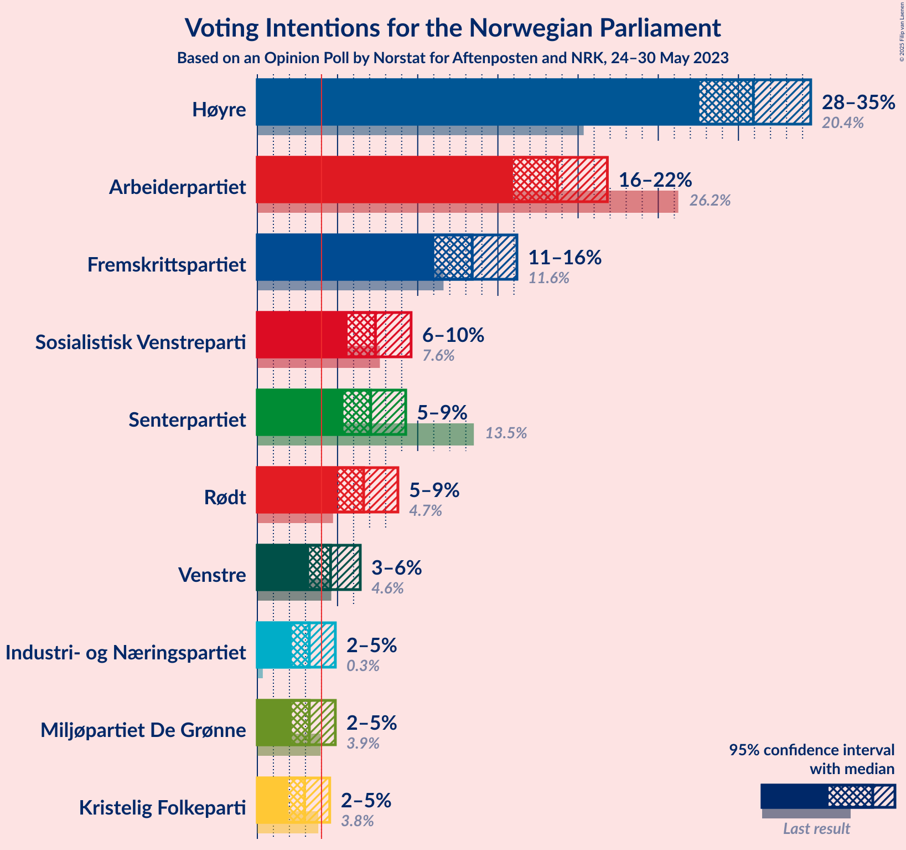
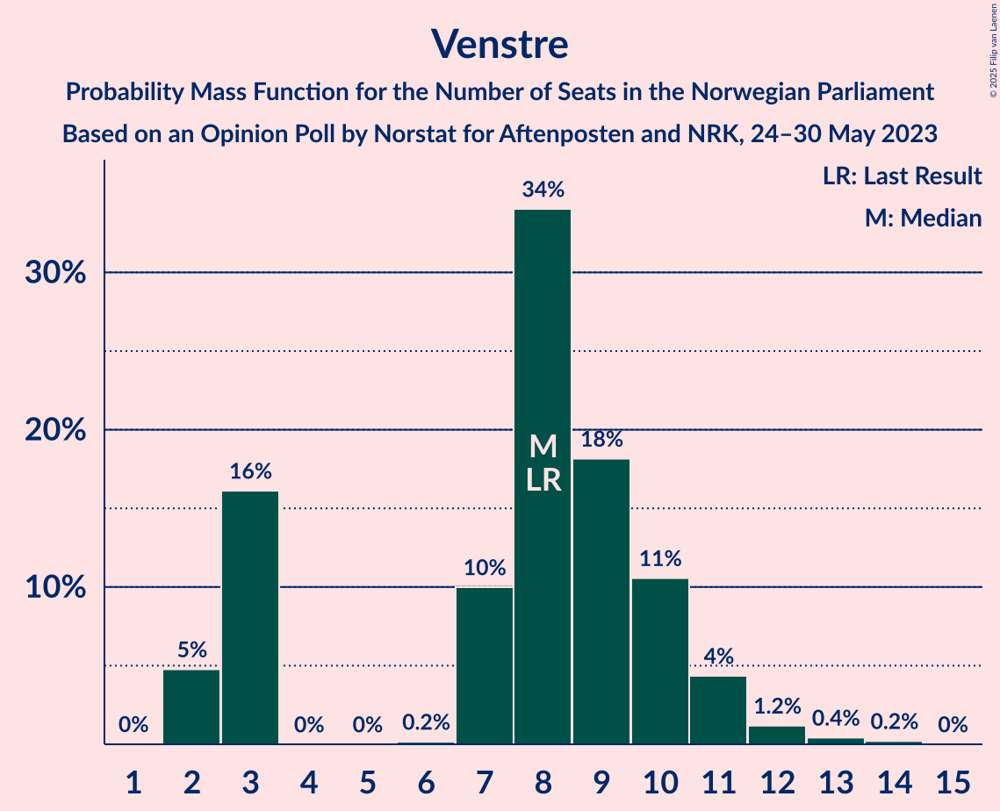

# Opinion Poll by Norstat for Aftenposten and NRK, 24–30 May 2023

<a href="#voting-intentions">Voting Intentions</a> | <a href="#seats">Seats</a> | <a href="#coalitions">Coalitions</a> | <a href="#technical-information">Technical Information</a>

## Voting Intentions

### Confidence Intervals

| Party | Last Result | Poll Result | 80% Confidence Interval | 90% Confidence Interval | 95% Confidence Interval | 99% Confidence Interval |
|:-----:|:-----------:|:-----------:|:-----------------------:|:-----------------------:|:-----------------------:|:-----------------------:|
| Høyre | 20.4% | 30.9% | 28.7–33.3% |28.1–33.9% |27.6–34.5% |26.5–35.7% |
| Arbeiderpartiet | 26.2% | 18.7% | 16.9–20.7% |16.4–21.3% |15.9–21.8% |15.1–22.8% |
| Fremskrittspartiet | 11.6% | 13.4% | 11.8–15.2% |11.4–15.7% |11.0–16.2% |10.3–17.1% |
| Sosialistisk Venstreparti | 7.6% | 7.4% | 6.2–8.8% |5.9–9.2% |5.6–9.6% |5.1–10.3% |
| Senterpartiet | 13.5% | 7.1% | 5.9–8.5% |5.6–8.9% |5.4–9.3% |4.9–10.0% |
| Rødt | 4.7% | 6.6% | 5.5–8.0% |5.2–8.4% |5.0–8.8% |4.5–9.5% |
| Venstre | 4.6% | 4.6% | 3.7–5.8% |3.4–6.1% |3.2–6.4% |2.9–7.0% |
| Industri- og Næringspartiet | 0.3% | 3.2% | 2.5–4.3% |2.3–4.6% |2.1–4.9% |1.8–5.4% |
| Miljøpartiet De Grønne | 3.9% | 3.2% | 2.5–4.3% |2.3–4.6% |2.1–4.9% |1.8–5.4% |
| Kristelig Folkeparti | 3.8% | 2.9% | 2.3–4.0% |2.1–4.3% |1.9–4.5% |1.6–5.0% |

*Note:* The poll result column reflects the actual value used in the calculations. Published results may vary slightly, and in addition be rounded to fewer digits.

## Seats

### Confidence Intervals

| Party | Last Result | Median | 80% Confidence Interval | 90% Confidence Interval | 95% Confidence Interval | 99% Confidence Interval |
|:-----:|:-----------:|:------:|:-----------------------:|:-----------------------:|:-----------------------:|:-----------------------:|
| <a href="#høyre">Høyre</a> | 36 | 55 | 50–60 |49–60 |49–63 |47–65 |
| <a href="#arbeiderpartiet">Arbeiderpartiet</a> | 48 | 35 | 33–40 |32–42 |31–43 |29–45 |
| <a href="#fremskrittspartiet">Fremskrittspartiet</a> | 21 | 24 | 21–27 |20–29 |19–30 |18–32 |
| <a href="#sosialistisk-venstreparti">Sosialistisk Venstreparti</a> | 13 | 13 | 11–16 |10–16 |10–17 |9–18 |
| <a href="#senterpartiet">Senterpartiet</a> | 28 | 13 | 11–16 |10–16 |9–17 |8–19 |
| <a href="#rødt">Rødt</a> | 8 | 12 | 10–15 |9–16 |9–16 |8–17 |
| <a href="#venstre">Venstre</a> | 8 | 8 | 3–10 |3–11 |2–11 |2–13 |
| <a href="#industri--og-næringspartiet">Industri- og Næringspartiet</a> | 0 | 3 | 1–7 |0–8 |0–8 |0–9 |
| <a href="#miljøpartiet-de-grønne">Miljøpartiet De Grønne</a> | 3 | 2 | 1–7 |1–8 |1–8 |1–9 |
| <a href="#kristelig-folkeparti">Kristelig Folkeparti</a> | 3 | 2 | 0–3 |0–7 |0–7 |0–8 |

### Høyre

*For a full overview of the results for this party, see the [Høyre](party-høyre.html) page.*

| Number of Seats | Probability | Accumulated | Special Marks |
|:---------------:|:-----------:|:-----------:|:-------------:|
| 36 | 0% | 100% | Last Result |
| 37 | 0% | 100% |  |
| 38 | 0% | 100% |  |
| 39 | 0% | 100% |  |
| 40 | 0% | 100% |  |
| 41 | 0% | 100% |  |
| 42 | 0% | 100% |  |
| 43 | 0% | 100% |  |
| 44 | 0% | 100% |  |
| 45 | 0.1% | 100% |  |
| 46 | 0.2% | 99.9% |  |
| 47 | 0.8% | 99.7% |  |
| 48 | 0.9% | 98.9% |  |
| 49 | 5% | 98% |  |
| 50 | 4% | 93% |  |
| 51 | 4% | 89% |  |
| 52 | 12% | 85% |  |
| 53 | 5% | 73% |  |
| 54 | 16% | 68% |  |
| 55 | 12% | 51% | Median |
| 56 | 12% | 39% |  |
| 57 | 5% | 27% |  |
| 58 | 8% | 22% |  |
| 59 | 4% | 14% |  |
| 60 | 5% | 10% |  |
| 61 | 1.3% | 5% |  |
| 62 | 0.9% | 3% |  |
| 63 | 1.4% | 3% |  |
| 64 | 0.5% | 1.2% |  |
| 65 | 0.4% | 0.7% |  |
| 66 | 0.2% | 0.4% |  |
| 67 | 0.1% | 0.2% |  |
| 68 | 0.1% | 0.1% |  |
| 69 | 0% | 0% |  |

### Arbeiderpartiet

*For a full overview of the results for this party, see the [Arbeiderpartiet](party-arbeiderpartiet.html) page.*

| Number of Seats | Probability | Accumulated | Special Marks |
|:---------------:|:-----------:|:-----------:|:-------------:|
| 27 | 0.1% | 100% |  |
| 28 | 0.1% | 99.9% |  |
| 29 | 0.3% | 99.7% |  |
| 30 | 1.3% | 99.5% |  |
| 31 | 1.2% | 98% |  |
| 32 | 4% | 97% |  |
| 33 | 9% | 93% |  |
| 34 | 21% | 84% |  |
| 35 | 20% | 64% | Median |
| 36 | 11% | 44% |  |
| 37 | 14% | 32% |  |
| 38 | 4% | 19% |  |
| 39 | 1.4% | 15% |  |
| 40 | 4% | 13% |  |
| 41 | 3% | 9% |  |
| 42 | 1.5% | 6% |  |
| 43 | 2% | 4% |  |
| 44 | 1.1% | 2% |  |
| 45 | 0.3% | 0.8% |  |
| 46 | 0.4% | 0.5% |  |
| 47 | 0% | 0.1% |  |
| 48 | 0% | 0% | Last Result |

### Fremskrittspartiet

*For a full overview of the results for this party, see the [Fremskrittspartiet](party-fremskrittspartiet.html) page.*

| Number of Seats | Probability | Accumulated | Special Marks |
|:---------------:|:-----------:|:-----------:|:-------------:|
| 17 | 0.2% | 100% |  |
| 18 | 1.1% | 99.8% |  |
| 19 | 2% | 98.7% |  |
| 20 | 6% | 97% |  |
| 21 | 8% | 91% | Last Result |
| 22 | 12% | 83% |  |
| 23 | 7% | 70% |  |
| 24 | 21% | 64% | Median |
| 25 | 12% | 42% |  |
| 26 | 14% | 31% |  |
| 27 | 8% | 16% |  |
| 28 | 3% | 9% |  |
| 29 | 2% | 5% |  |
| 30 | 2% | 4% |  |
| 31 | 0.6% | 2% |  |
| 32 | 0.6% | 1.0% |  |
| 33 | 0.1% | 0.4% |  |
| 34 | 0.1% | 0.3% |  |
| 35 | 0.1% | 0.1% |  |
| 36 | 0% | 0% |  |

### Sosialistisk Venstreparti

*For a full overview of the results for this party, see the [Sosialistisk Venstreparti](party-sosialistiskvenstreparti.html) page.*

| Number of Seats | Probability | Accumulated | Special Marks |
|:---------------:|:-----------:|:-----------:|:-------------:|
| 8 | 0.2% | 100% |  |
| 9 | 2% | 99.8% |  |
| 10 | 8% | 98% |  |
| 11 | 15% | 90% |  |
| 12 | 15% | 75% |  |
| 13 | 29% | 60% | Last Result, Median |
| 14 | 11% | 30% |  |
| 15 | 8% | 20% |  |
| 16 | 8% | 12% |  |
| 17 | 3% | 4% |  |
| 18 | 1.0% | 1.4% |  |
| 19 | 0.2% | 0.4% |  |
| 20 | 0.1% | 0.2% |  |
| 21 | 0% | 0% |  |

### Senterpartiet

*For a full overview of the results for this party, see the [Senterpartiet](party-senterpartiet.html) page.*

| Number of Seats | Probability | Accumulated | Special Marks |
|:---------------:|:-----------:|:-----------:|:-------------:|
| 7 | 0.1% | 100% |  |
| 8 | 0.8% | 99.8% |  |
| 9 | 3% | 99.1% |  |
| 10 | 6% | 96% |  |
| 11 | 18% | 90% |  |
| 12 | 13% | 72% |  |
| 13 | 18% | 59% | Median |
| 14 | 17% | 42% |  |
| 15 | 14% | 25% |  |
| 16 | 8% | 11% |  |
| 17 | 2% | 3% |  |
| 18 | 0.3% | 0.8% |  |
| 19 | 0.5% | 0.5% |  |
| 20 | 0% | 0.1% |  |
| 21 | 0% | 0% |  |
| 22 | 0% | 0% |  |
| 23 | 0% | 0% |  |
| 24 | 0% | 0% |  |
| 25 | 0% | 0% |  |
| 26 | 0% | 0% |  |
| 27 | 0% | 0% |  |
| 28 | 0% | 0% | Last Result |

### Rødt

*For a full overview of the results for this party, see the [Rødt](party-rødt.html) page.*

| Number of Seats | Probability | Accumulated | Special Marks |
|:---------------:|:-----------:|:-----------:|:-------------:|
| 7 | 0.2% | 100% |  |
| 8 | 1.2% | 99.8% | Last Result |
| 9 | 6% | 98.6% |  |
| 10 | 10% | 92% |  |
| 11 | 16% | 83% |  |
| 12 | 27% | 67% | Median |
| 13 | 17% | 40% |  |
| 14 | 9% | 23% |  |
| 15 | 8% | 15% |  |
| 16 | 5% | 7% |  |
| 17 | 1.3% | 2% |  |
| 18 | 0.1% | 0.2% |  |
| 19 | 0.1% | 0.1% |  |
| 20 | 0% | 0% |  |

### Venstre

*For a full overview of the results for this party, see the [Venstre](party-venstre.html) page.*

| Number of Seats | Probability | Accumulated | Special Marks |
|:---------------:|:-----------:|:-----------:|:-------------:|
| 2 | 5% | 100% |  |
| 3 | 16% | 95% |  |
| 4 | 0% | 79% |  |
| 5 | 0% | 79% |  |
| 6 | 0.2% | 79% |  |
| 7 | 10% | 79% |  |
| 8 | 34% | 69% | Last Result, Median |
| 9 | 18% | 35% |  |
| 10 | 11% | 17% |  |
| 11 | 4% | 6% |  |
| 12 | 1.2% | 2% |  |
| 13 | 0.4% | 0.6% |  |
| 14 | 0.2% | 0.2% |  |
| 15 | 0% | 0% |  |

### Industri- og Næringspartiet

*For a full overview of the results for this party, see the [Industri- og Næringspartiet](party-industri-ognæringspartiet.html) page.*

| Number of Seats | Probability | Accumulated | Special Marks |
|:---------------:|:-----------:|:-----------:|:-------------:|
| 0 | 9% | 100% | Last Result |
| 1 | 5% | 91% |  |
| 2 | 31% | 87% |  |
| 3 | 41% | 55% | Median |
| 4 | 0% | 14% |  |
| 5 | 0% | 14% |  |
| 6 | 0.4% | 14% |  |
| 7 | 7% | 14% |  |
| 8 | 5% | 7% |  |
| 9 | 1.3% | 2% |  |
| 10 | 0.3% | 0.4% |  |
| 11 | 0% | 0% |  |

### Miljøpartiet De Grønne

*For a full overview of the results for this party, see the [Miljøpartiet De Grønne](party-miljøpartietdegrønne.html) page.*

| Number of Seats | Probability | Accumulated | Special Marks |
|:---------------:|:-----------:|:-----------:|:-------------:|
| 0 | 0.2% | 100% |  |
| 1 | 35% | 99.8% |  |
| 2 | 37% | 64% | Median |
| 3 | 12% | 27% | Last Result |
| 4 | 0% | 15% |  |
| 5 | 0% | 15% |  |
| 6 | 1.1% | 15% |  |
| 7 | 6% | 14% |  |
| 8 | 7% | 8% |  |
| 9 | 0.9% | 1.2% |  |
| 10 | 0.2% | 0.3% |  |
| 11 | 0.1% | 0.1% |  |
| 12 | 0% | 0% |  |

### Kristelig Folkeparti

*For a full overview of the results for this party, see the [Kristelig Folkeparti](party-kristeligfolkeparti.html) page.*

| Number of Seats | Probability | Accumulated | Special Marks |
|:---------------:|:-----------:|:-----------:|:-------------:|
| 0 | 16% | 100% |  |
| 1 | 10% | 84% |  |
| 2 | 56% | 74% | Median |
| 3 | 11% | 18% | Last Result |
| 4 | 0% | 8% |  |
| 5 | 0% | 8% |  |
| 6 | 0.2% | 8% |  |
| 7 | 6% | 8% |  |
| 8 | 1.4% | 2% |  |
| 9 | 0.3% | 0.4% |  |
| 10 | 0.1% | 0.1% |  |
| 11 | 0% | 0% |  |

## Coalitions

### Confidence Intervals

| Coalition | Last Result | Median | Majority? | 80% Confidence Interval | 90% Confidence Interval | 95% Confidence Interval | 99% Confidence Interval |
|:---------:|:-----------:|:------:|:---------:|:-----------------------:|:-----------------------:|:-----------------------:|:-----------------------:|
| Høyre – Fremskrittspartiet – Senterpartiet – Venstre – Kristelig Folkeparti | 96 | 101 | 100% | 96–106 | 95–108 | 93–110 | 92–112 |
| Høyre – Fremskrittspartiet – Venstre – Miljøpartiet De Grønne – Kristelig Folkeparti | 71 | 91 | 94% | 86–96 | 84–98 | 84–99 | 82–101 |
| Høyre – Fremskrittspartiet – Venstre – Kristelig Folkeparti | 68 | 89 | 83% | 83–94 | 81–95 | 79–96 | 79–99 |
| Høyre – Fremskrittspartiet – Venstre | 65 | 86 | 69% | 81–92 | 79–93 | 77–95 | 77–97 |
| Høyre – Fremskrittspartiet | 57 | 79 | 10% | 74–84 | 72–86 | 69–87 | 69–91 |
| Arbeiderpartiet – Sosialistisk Venstreparti – Senterpartiet – Rødt – Miljøpartiet De Grønne | 100 | 77 | 3% | 71–82 | 70–83 | 69–86 | 66–86 |
| Arbeiderpartiet – Sosialistisk Venstreparti – Senterpartiet – Rødt | 97 | 74 | 0.1% | 69–79 | 68–81 | 66–81 | 64–83 |
| Arbeiderpartiet – Sosialistisk Venstreparti – Senterpartiet – Miljøpartiet De Grønne – Kristelig Folkeparti | 95 | 67 | 0% | 61–72 | 60–74 | 60–77 | 56–77 |
| Arbeiderpartiet – Sosialistisk Venstreparti – Senterpartiet – Miljøpartiet De Grønne | 92 | 65 | 0% | 60–69 | 59–71 | 57–74 | 55–75 |
| Høyre – Venstre – Kristelig Folkeparti | 47 | 64 | 0% | 59–69 | 59–71 | 58–72 | 56–75 |
| Arbeiderpartiet – Sosialistisk Venstreparti – Rødt – Miljøpartiet De Grønne | 72 | 64 | 0% | 59–69 | 57–70 | 57–72 | 54–74 |
| Arbeiderpartiet – Sosialistisk Venstreparti – Senterpartiet | 89 | 62 | 0% | 58–66 | 56–67 | 55–68 | 53–70 |
| Arbeiderpartiet – Senterpartiet – Miljøpartiet De Grønne – Kristelig Folkeparti | 82 | 54 | 0% | 48–58 | 48–61 | 47–64 | 44–65 |
| Arbeiderpartiet – Senterpartiet – Kristelig Folkeparti | 79 | 51 | 0% | 47–55 | 46–57 | 45–58 | 42–62 |
| Arbeiderpartiet – Senterpartiet | 76 | 48 | 0% | 45–53 | 44–55 | 43–56 | 41–59 |
| Arbeiderpartiet – Sosialistisk Venstreparti | 61 | 49 | 0% | 45–53 | 44–54 | 43–56 | 41–58 |
| Senterpartiet – Venstre – Kristelig Folkeparti | 39 | 22 | 0% | 19–27 | 18–28 | 16–29 | 14–31 |

### Høyre – Fremskrittspartiet – Senterpartiet – Venstre – Kristelig Folkeparti

| Number of Seats | Probability | Accumulated | Special Marks |
|:---------------:|:-----------:|:-----------:|:-------------:|
| 88 | 0% | 100% |  |
| 89 | 0% | 99.9% |  |
| 90 | 0.2% | 99.9% |  |
| 91 | 0.2% | 99.7% |  |
| 92 | 0.6% | 99.5% |  |
| 93 | 3% | 99.0% |  |
| 94 | 1.0% | 96% |  |
| 95 | 1.2% | 95% |  |
| 96 | 5% | 94% | Last Result |
| 97 | 8% | 89% |  |
| 98 | 7% | 81% |  |
| 99 | 4% | 74% |  |
| 100 | 10% | 70% |  |
| 101 | 16% | 60% |  |
| 102 | 3% | 44% | Median |
| 103 | 11% | 41% |  |
| 104 | 4% | 30% |  |
| 105 | 10% | 27% |  |
| 106 | 8% | 17% |  |
| 107 | 2% | 9% |  |
| 108 | 3% | 7% |  |
| 109 | 2% | 4% |  |
| 110 | 1.3% | 3% |  |
| 111 | 0.5% | 1.3% |  |
| 112 | 0.5% | 0.8% |  |
| 113 | 0.2% | 0.3% |  |
| 114 | 0.1% | 0.1% |  |
| 115 | 0% | 0% |  |

### Høyre – Fremskrittspartiet – Venstre – Miljøpartiet De Grønne – Kristelig Folkeparti

| Number of Seats | Probability | Accumulated | Special Marks |
|:---------------:|:-----------:|:-----------:|:-------------:|
| 71 | 0% | 100% | Last Result |
| 72 | 0% | 100% |  |
| 73 | 0% | 100% |  |
| 74 | 0% | 100% |  |
| 75 | 0% | 100% |  |
| 76 | 0% | 100% |  |
| 77 | 0% | 100% |  |
| 78 | 0% | 100% |  |
| 79 | 0% | 100% |  |
| 80 | 0% | 99.9% |  |
| 81 | 0.1% | 99.9% |  |
| 82 | 0.5% | 99.7% |  |
| 83 | 1.2% | 99.2% |  |
| 84 | 4% | 98% |  |
| 85 | 4% | 94% | Majority |
| 86 | 2% | 91% |  |
| 87 | 7% | 89% |  |
| 88 | 6% | 81% |  |
| 89 | 13% | 75% |  |
| 90 | 8% | 61% |  |
| 91 | 5% | 53% | Median |
| 92 | 15% | 49% |  |
| 93 | 6% | 33% |  |
| 94 | 6% | 28% |  |
| 95 | 9% | 22% |  |
| 96 | 4% | 13% |  |
| 97 | 3% | 8% |  |
| 98 | 2% | 5% |  |
| 99 | 0.7% | 3% |  |
| 100 | 1.4% | 2% |  |
| 101 | 0.4% | 0.9% |  |
| 102 | 0.3% | 0.4% |  |
| 103 | 0.1% | 0.2% |  |
| 104 | 0% | 0.1% |  |
| 105 | 0% | 0.1% |  |
| 106 | 0% | 0% |  |

### Høyre – Fremskrittspartiet – Venstre – Kristelig Folkeparti

| Number of Seats | Probability | Accumulated | Special Marks |
|:---------------:|:-----------:|:-----------:|:-------------:|
| 68 | 0% | 100% | Last Result |
| 69 | 0% | 100% |  |
| 70 | 0% | 100% |  |
| 71 | 0% | 100% |  |
| 72 | 0% | 100% |  |
| 73 | 0% | 100% |  |
| 74 | 0% | 100% |  |
| 75 | 0% | 100% |  |
| 76 | 0% | 100% |  |
| 77 | 0.1% | 99.9% |  |
| 78 | 0.1% | 99.8% |  |
| 79 | 2% | 99.7% |  |
| 80 | 1.0% | 97% |  |
| 81 | 1.5% | 96% |  |
| 82 | 4% | 95% |  |
| 83 | 3% | 91% |  |
| 84 | 5% | 88% |  |
| 85 | 9% | 83% | Majority |
| 86 | 5% | 74% |  |
| 87 | 10% | 69% |  |
| 88 | 8% | 59% |  |
| 89 | 12% | 51% | Median |
| 90 | 9% | 39% |  |
| 91 | 5% | 30% |  |
| 92 | 7% | 25% |  |
| 93 | 5% | 17% |  |
| 94 | 5% | 12% |  |
| 95 | 3% | 7% |  |
| 96 | 2% | 5% |  |
| 97 | 1.0% | 2% |  |
| 98 | 0.6% | 1.1% |  |
| 99 | 0.2% | 0.6% |  |
| 100 | 0.1% | 0.4% |  |
| 101 | 0.2% | 0.3% |  |
| 102 | 0.1% | 0.1% |  |
| 103 | 0% | 0% |  |

### Høyre – Fremskrittspartiet – Venstre

| Number of Seats | Probability | Accumulated | Special Marks |
|:---------------:|:-----------:|:-----------:|:-------------:|
| 65 | 0% | 100% | Last Result |
| 66 | 0% | 100% |  |
| 67 | 0% | 100% |  |
| 68 | 0% | 100% |  |
| 69 | 0% | 100% |  |
| 70 | 0% | 100% |  |
| 71 | 0% | 100% |  |
| 72 | 0% | 100% |  |
| 73 | 0% | 100% |  |
| 74 | 0.1% | 99.9% |  |
| 75 | 0.1% | 99.9% |  |
| 76 | 0.1% | 99.7% |  |
| 77 | 2% | 99.6% |  |
| 78 | 1.1% | 97% |  |
| 79 | 2% | 96% |  |
| 80 | 4% | 95% |  |
| 81 | 5% | 91% |  |
| 82 | 3% | 85% |  |
| 83 | 7% | 83% |  |
| 84 | 7% | 76% |  |
| 85 | 13% | 69% | Majority |
| 86 | 13% | 57% |  |
| 87 | 4% | 44% | Median |
| 88 | 9% | 39% |  |
| 89 | 7% | 30% |  |
| 90 | 7% | 23% |  |
| 91 | 1.4% | 16% |  |
| 92 | 5% | 15% |  |
| 93 | 4% | 9% |  |
| 94 | 2% | 5% |  |
| 95 | 1.1% | 3% |  |
| 96 | 1.2% | 2% |  |
| 97 | 0.2% | 0.6% |  |
| 98 | 0.2% | 0.4% |  |
| 99 | 0.2% | 0.2% |  |
| 100 | 0.1% | 0.1% |  |
| 101 | 0% | 0% |  |

### Høyre – Fremskrittspartiet

| Number of Seats | Probability | Accumulated | Special Marks |
|:---------------:|:-----------:|:-----------:|:-------------:|
| 57 | 0% | 100% | Last Result |
| 58 | 0% | 100% |  |
| 59 | 0% | 100% |  |
| 60 | 0% | 100% |  |
| 61 | 0% | 100% |  |
| 62 | 0% | 100% |  |
| 63 | 0% | 100% |  |
| 64 | 0% | 100% |  |
| 65 | 0% | 100% |  |
| 66 | 0% | 100% |  |
| 67 | 0% | 100% |  |
| 68 | 0.2% | 99.9% |  |
| 69 | 2% | 99.7% |  |
| 70 | 0.4% | 97% |  |
| 71 | 1.2% | 97% |  |
| 72 | 2% | 96% |  |
| 73 | 1.4% | 94% |  |
| 74 | 3% | 92% |  |
| 75 | 7% | 90% |  |
| 76 | 13% | 83% |  |
| 77 | 9% | 69% |  |
| 78 | 9% | 60% |  |
| 79 | 5% | 51% | Median |
| 80 | 13% | 47% |  |
| 81 | 6% | 33% |  |
| 82 | 9% | 28% |  |
| 83 | 3% | 19% |  |
| 84 | 6% | 15% |  |
| 85 | 4% | 10% | Majority |
| 86 | 3% | 6% |  |
| 87 | 1.1% | 3% |  |
| 88 | 0.6% | 2% |  |
| 89 | 0.5% | 1.4% |  |
| 90 | 0.3% | 0.9% |  |
| 91 | 0.5% | 0.6% |  |
| 92 | 0% | 0.1% |  |
| 93 | 0.1% | 0.1% |  |
| 94 | 0% | 0% |  |

### Arbeiderpartiet – Sosialistisk Venstreparti – Senterpartiet – Rødt – Miljøpartiet De Grønne

| Number of Seats | Probability | Accumulated | Special Marks |
|:---------------:|:-----------:|:-----------:|:-------------:|
| 63 | 0% | 100% |  |
| 64 | 0.2% | 99.9% |  |
| 65 | 0% | 99.7% |  |
| 66 | 0.2% | 99.7% |  |
| 67 | 0.5% | 99.5% |  |
| 68 | 1.0% | 99.0% |  |
| 69 | 1.3% | 98% |  |
| 70 | 3% | 97% |  |
| 71 | 7% | 94% |  |
| 72 | 5% | 87% |  |
| 73 | 4% | 82% |  |
| 74 | 7% | 78% |  |
| 75 | 6% | 71% | Median |
| 76 | 14% | 65% |  |
| 77 | 13% | 51% |  |
| 78 | 8% | 38% |  |
| 79 | 7% | 30% |  |
| 80 | 7% | 23% |  |
| 81 | 6% | 16% |  |
| 82 | 2% | 10% |  |
| 83 | 4% | 8% |  |
| 84 | 0.7% | 4% |  |
| 85 | 0.8% | 3% | Majority |
| 86 | 2% | 3% |  |
| 87 | 0.2% | 0.4% |  |
| 88 | 0.1% | 0.1% |  |
| 89 | 0% | 0.1% |  |
| 90 | 0% | 0% |  |
| 91 | 0% | 0% |  |
| 92 | 0% | 0% |  |
| 93 | 0% | 0% |  |
| 94 | 0% | 0% |  |
| 95 | 0% | 0% |  |
| 96 | 0% | 0% |  |
| 97 | 0% | 0% |  |
| 98 | 0% | 0% |  |
| 99 | 0% | 0% |  |
| 100 | 0% | 0% | Last Result |

### Arbeiderpartiet – Sosialistisk Venstreparti – Senterpartiet – Rødt

| Number of Seats | Probability | Accumulated | Special Marks |
|:---------------:|:-----------:|:-----------:|:-------------:|
| 61 | 0.1% | 100% |  |
| 62 | 0.2% | 99.9% |  |
| 63 | 0.1% | 99.7% |  |
| 64 | 0.3% | 99.6% |  |
| 65 | 0.4% | 99.2% |  |
| 66 | 2% | 98.8% |  |
| 67 | 1.5% | 97% |  |
| 68 | 3% | 95% |  |
| 69 | 4% | 93% |  |
| 70 | 14% | 88% |  |
| 71 | 2% | 75% |  |
| 72 | 5% | 72% |  |
| 73 | 10% | 67% | Median |
| 74 | 10% | 57% |  |
| 75 | 11% | 47% |  |
| 76 | 11% | 36% |  |
| 77 | 7% | 26% |  |
| 78 | 8% | 18% |  |
| 79 | 3% | 10% |  |
| 80 | 2% | 8% |  |
| 81 | 5% | 6% |  |
| 82 | 0.5% | 1.1% |  |
| 83 | 0.3% | 0.5% |  |
| 84 | 0.1% | 0.2% |  |
| 85 | 0.1% | 0.1% | Majority |
| 86 | 0.1% | 0.1% |  |
| 87 | 0% | 0% |  |
| 88 | 0% | 0% |  |
| 89 | 0% | 0% |  |
| 90 | 0% | 0% |  |
| 91 | 0% | 0% |  |
| 92 | 0% | 0% |  |
| 93 | 0% | 0% |  |
| 94 | 0% | 0% |  |
| 95 | 0% | 0% |  |
| 96 | 0% | 0% |  |
| 97 | 0% | 0% | Last Result |

### Arbeiderpartiet – Sosialistisk Venstreparti – Senterpartiet – Miljøpartiet De Grønne – Kristelig Folkeparti

| Number of Seats | Probability | Accumulated | Special Marks |
|:---------------:|:-----------:|:-----------:|:-------------:|
| 54 | 0% | 100% |  |
| 55 | 0.3% | 99.9% |  |
| 56 | 0.2% | 99.6% |  |
| 57 | 0.5% | 99.4% |  |
| 58 | 0.3% | 98.9% |  |
| 59 | 0.9% | 98.6% |  |
| 60 | 3% | 98% |  |
| 61 | 7% | 94% |  |
| 62 | 8% | 87% |  |
| 63 | 5% | 80% |  |
| 64 | 8% | 75% |  |
| 65 | 6% | 67% | Median |
| 66 | 9% | 61% |  |
| 67 | 12% | 52% |  |
| 68 | 15% | 40% |  |
| 69 | 4% | 24% |  |
| 70 | 6% | 20% |  |
| 71 | 3% | 13% |  |
| 72 | 3% | 10% |  |
| 73 | 1.4% | 7% |  |
| 74 | 1.3% | 5% |  |
| 75 | 0.9% | 4% |  |
| 76 | 0.6% | 3% |  |
| 77 | 2% | 3% |  |
| 78 | 0.1% | 0.3% |  |
| 79 | 0.1% | 0.2% |  |
| 80 | 0% | 0.1% |  |
| 81 | 0% | 0.1% |  |
| 82 | 0% | 0% |  |
| 83 | 0% | 0% |  |
| 84 | 0% | 0% |  |
| 85 | 0% | 0% | Majority |
| 86 | 0% | 0% |  |
| 87 | 0% | 0% |  |
| 88 | 0% | 0% |  |
| 89 | 0% | 0% |  |
| 90 | 0% | 0% |  |
| 91 | 0% | 0% |  |
| 92 | 0% | 0% |  |
| 93 | 0% | 0% |  |
| 94 | 0% | 0% |  |
| 95 | 0% | 0% | Last Result |

### Arbeiderpartiet – Sosialistisk Venstreparti – Senterpartiet – Miljøpartiet De Grønne

| Number of Seats | Probability | Accumulated | Special Marks |
|:---------------:|:-----------:|:-----------:|:-------------:|
| 53 | 0.2% | 100% |  |
| 54 | 0.1% | 99.7% |  |
| 55 | 0.5% | 99.7% |  |
| 56 | 1.1% | 99.2% |  |
| 57 | 0.8% | 98% |  |
| 58 | 0.8% | 97% |  |
| 59 | 5% | 96% |  |
| 60 | 11% | 92% |  |
| 61 | 9% | 80% |  |
| 62 | 7% | 72% |  |
| 63 | 4% | 65% | Median |
| 64 | 11% | 61% |  |
| 65 | 10% | 50% |  |
| 66 | 18% | 40% |  |
| 67 | 3% | 22% |  |
| 68 | 7% | 19% |  |
| 69 | 4% | 12% |  |
| 70 | 3% | 8% |  |
| 71 | 1.0% | 5% |  |
| 72 | 0.8% | 4% |  |
| 73 | 0.7% | 4% |  |
| 74 | 0.6% | 3% |  |
| 75 | 2% | 2% |  |
| 76 | 0.1% | 0.2% |  |
| 77 | 0.1% | 0.1% |  |
| 78 | 0% | 0% |  |
| 79 | 0% | 0% |  |
| 80 | 0% | 0% |  |
| 81 | 0% | 0% |  |
| 82 | 0% | 0% |  |
| 83 | 0% | 0% |  |
| 84 | 0% | 0% |  |
| 85 | 0% | 0% | Majority |
| 86 | 0% | 0% |  |
| 87 | 0% | 0% |  |
| 88 | 0% | 0% |  |
| 89 | 0% | 0% |  |
| 90 | 0% | 0% |  |
| 91 | 0% | 0% |  |
| 92 | 0% | 0% | Last Result |

### Høyre – Venstre – Kristelig Folkeparti

| Number of Seats | Probability | Accumulated | Special Marks |
|:---------------:|:-----------:|:-----------:|:-------------:|
| 47 | 0% | 100% | Last Result |
| 48 | 0% | 100% |  |
| 49 | 0% | 100% |  |
| 50 | 0% | 100% |  |
| 51 | 0% | 100% |  |
| 52 | 0% | 100% |  |
| 53 | 0.1% | 99.9% |  |
| 54 | 0.1% | 99.9% |  |
| 55 | 0.2% | 99.8% |  |
| 56 | 0.4% | 99.6% |  |
| 57 | 1.0% | 99.2% |  |
| 58 | 3% | 98% |  |
| 59 | 6% | 95% |  |
| 60 | 9% | 90% |  |
| 61 | 6% | 81% |  |
| 62 | 3% | 75% |  |
| 63 | 9% | 72% |  |
| 64 | 15% | 63% |  |
| 65 | 19% | 48% | Median |
| 66 | 4% | 29% |  |
| 67 | 3% | 25% |  |
| 68 | 12% | 22% |  |
| 69 | 2% | 10% |  |
| 70 | 2% | 8% |  |
| 71 | 1.5% | 6% |  |
| 72 | 2% | 4% |  |
| 73 | 0.8% | 2% |  |
| 74 | 0.6% | 1.4% |  |
| 75 | 0.5% | 0.8% |  |
| 76 | 0.2% | 0.4% |  |
| 77 | 0.1% | 0.2% |  |
| 78 | 0% | 0.1% |  |
| 79 | 0% | 0% |  |

### Arbeiderpartiet – Sosialistisk Venstreparti – Rødt – Miljøpartiet De Grønne

| Number of Seats | Probability | Accumulated | Special Marks |
|:---------------:|:-----------:|:-----------:|:-------------:|
| 52 | 0% | 100% |  |
| 53 | 0.3% | 99.9% |  |
| 54 | 0.4% | 99.6% |  |
| 55 | 0.4% | 99.2% |  |
| 56 | 1.1% | 98.9% |  |
| 57 | 3% | 98% |  |
| 58 | 3% | 94% |  |
| 59 | 6% | 91% |  |
| 60 | 9% | 85% |  |
| 61 | 9% | 76% |  |
| 62 | 9% | 67% | Median |
| 63 | 7% | 58% |  |
| 64 | 9% | 51% |  |
| 65 | 14% | 43% |  |
| 66 | 4% | 28% |  |
| 67 | 8% | 25% |  |
| 68 | 6% | 17% |  |
| 69 | 5% | 11% |  |
| 70 | 2% | 6% |  |
| 71 | 0.7% | 4% |  |
| 72 | 2% | 3% | Last Result |
| 73 | 0.4% | 1.0% |  |
| 74 | 0.4% | 0.6% |  |
| 75 | 0.1% | 0.3% |  |
| 76 | 0.1% | 0.2% |  |
| 77 | 0% | 0% |  |

### Arbeiderpartiet – Sosialistisk Venstreparti – Senterpartiet

| Number of Seats | Probability | Accumulated | Special Marks |
|:---------------:|:-----------:|:-----------:|:-------------:|
| 50 | 0% | 100% |  |
| 51 | 0.2% | 99.9% |  |
| 52 | 0.1% | 99.7% |  |
| 53 | 0.4% | 99.6% |  |
| 54 | 0.9% | 99.1% |  |
| 55 | 2% | 98% |  |
| 56 | 2% | 97% |  |
| 57 | 2% | 95% |  |
| 58 | 15% | 93% |  |
| 59 | 10% | 78% |  |
| 60 | 6% | 68% |  |
| 61 | 10% | 62% | Median |
| 62 | 9% | 52% |  |
| 63 | 9% | 43% |  |
| 64 | 14% | 34% |  |
| 65 | 7% | 21% |  |
| 66 | 4% | 13% |  |
| 67 | 5% | 9% |  |
| 68 | 2% | 4% |  |
| 69 | 0.8% | 2% |  |
| 70 | 0.8% | 1.3% |  |
| 71 | 0.1% | 0.5% |  |
| 72 | 0.2% | 0.3% |  |
| 73 | 0.1% | 0.1% |  |
| 74 | 0% | 0% |  |
| 75 | 0% | 0% |  |
| 76 | 0% | 0% |  |
| 77 | 0% | 0% |  |
| 78 | 0% | 0% |  |
| 79 | 0% | 0% |  |
| 80 | 0% | 0% |  |
| 81 | 0% | 0% |  |
| 82 | 0% | 0% |  |
| 83 | 0% | 0% |  |
| 84 | 0% | 0% |  |
| 85 | 0% | 0% | Majority |
| 86 | 0% | 0% |  |
| 87 | 0% | 0% |  |
| 88 | 0% | 0% |  |
| 89 | 0% | 0% | Last Result |

### Arbeiderpartiet – Senterpartiet – Miljøpartiet De Grønne – Kristelig Folkeparti

| Number of Seats | Probability | Accumulated | Special Marks |
|:---------------:|:-----------:|:-----------:|:-------------:|
| 42 | 0% | 100% |  |
| 43 | 0.1% | 99.9% |  |
| 44 | 0.5% | 99.9% |  |
| 45 | 0.5% | 99.4% |  |
| 46 | 0.9% | 98.9% |  |
| 47 | 1.0% | 98% |  |
| 48 | 9% | 97% |  |
| 49 | 8% | 88% |  |
| 50 | 7% | 80% |  |
| 51 | 6% | 72% |  |
| 52 | 7% | 66% | Median |
| 53 | 7% | 59% |  |
| 54 | 14% | 53% |  |
| 55 | 13% | 39% |  |
| 56 | 5% | 26% |  |
| 57 | 6% | 20% |  |
| 58 | 4% | 14% |  |
| 59 | 1.2% | 10% |  |
| 60 | 2% | 9% |  |
| 61 | 2% | 6% |  |
| 62 | 0.8% | 4% |  |
| 63 | 0.5% | 3% |  |
| 64 | 0.3% | 3% |  |
| 65 | 2% | 2% |  |
| 66 | 0.1% | 0.2% |  |
| 67 | 0% | 0.1% |  |
| 68 | 0% | 0.1% |  |
| 69 | 0% | 0% |  |
| 70 | 0% | 0% |  |
| 71 | 0% | 0% |  |
| 72 | 0% | 0% |  |
| 73 | 0% | 0% |  |
| 74 | 0% | 0% |  |
| 75 | 0% | 0% |  |
| 76 | 0% | 0% |  |
| 77 | 0% | 0% |  |
| 78 | 0% | 0% |  |
| 79 | 0% | 0% |  |
| 80 | 0% | 0% |  |
| 81 | 0% | 0% |  |
| 82 | 0% | 0% | Last Result |

### Arbeiderpartiet – Senterpartiet – Kristelig Folkeparti

| Number of Seats | Probability | Accumulated | Special Marks |
|:---------------:|:-----------:|:-----------:|:-------------:|
| 40 | 0% | 100% |  |
| 41 | 0.1% | 99.9% |  |
| 42 | 0.5% | 99.8% |  |
| 43 | 0.5% | 99.3% |  |
| 44 | 0.8% | 98.8% |  |
| 45 | 2% | 98% |  |
| 46 | 3% | 96% |  |
| 47 | 16% | 93% |  |
| 48 | 11% | 77% |  |
| 49 | 6% | 67% |  |
| 50 | 7% | 61% | Median |
| 51 | 9% | 54% |  |
| 52 | 5% | 45% |  |
| 53 | 21% | 39% |  |
| 54 | 2% | 18% |  |
| 55 | 6% | 16% |  |
| 56 | 3% | 10% |  |
| 57 | 4% | 7% |  |
| 58 | 2% | 4% |  |
| 59 | 1.0% | 2% |  |
| 60 | 0.2% | 0.9% |  |
| 61 | 0.1% | 0.8% |  |
| 62 | 0.5% | 0.6% |  |
| 63 | 0.1% | 0.1% |  |
| 64 | 0% | 0.1% |  |
| 65 | 0% | 0% |  |
| 66 | 0% | 0% |  |
| 67 | 0% | 0% |  |
| 68 | 0% | 0% |  |
| 69 | 0% | 0% |  |
| 70 | 0% | 0% |  |
| 71 | 0% | 0% |  |
| 72 | 0% | 0% |  |
| 73 | 0% | 0% |  |
| 74 | 0% | 0% |  |
| 75 | 0% | 0% |  |
| 76 | 0% | 0% |  |
| 77 | 0% | 0% |  |
| 78 | 0% | 0% |  |
| 79 | 0% | 0% | Last Result |

### Arbeiderpartiet – Senterpartiet

| Number of Seats | Probability | Accumulated | Special Marks |
|:---------------:|:-----------:|:-----------:|:-------------:|
| 39 | 0.1% | 100% |  |
| 40 | 0.3% | 99.9% |  |
| 41 | 0.3% | 99.6% |  |
| 42 | 0.9% | 99.3% |  |
| 43 | 1.3% | 98% |  |
| 44 | 4% | 97% |  |
| 45 | 11% | 93% |  |
| 46 | 6% | 82% |  |
| 47 | 13% | 76% |  |
| 48 | 15% | 63% | Median |
| 49 | 8% | 47% |  |
| 50 | 6% | 40% |  |
| 51 | 15% | 33% |  |
| 52 | 7% | 18% |  |
| 53 | 3% | 11% |  |
| 54 | 2% | 8% |  |
| 55 | 4% | 6% |  |
| 56 | 1.3% | 3% |  |
| 57 | 0.8% | 2% |  |
| 58 | 0.2% | 0.7% |  |
| 59 | 0.3% | 0.5% |  |
| 60 | 0.2% | 0.2% |  |
| 61 | 0% | 0% |  |
| 62 | 0% | 0% |  |
| 63 | 0% | 0% |  |
| 64 | 0% | 0% |  |
| 65 | 0% | 0% |  |
| 66 | 0% | 0% |  |
| 67 | 0% | 0% |  |
| 68 | 0% | 0% |  |
| 69 | 0% | 0% |  |
| 70 | 0% | 0% |  |
| 71 | 0% | 0% |  |
| 72 | 0% | 0% |  |
| 73 | 0% | 0% |  |
| 74 | 0% | 0% |  |
| 75 | 0% | 0% |  |
| 76 | 0% | 0% | Last Result |

### Arbeiderpartiet – Sosialistisk Venstreparti

| Number of Seats | Probability | Accumulated | Special Marks |
|:---------------:|:-----------:|:-----------:|:-------------:|
| 39 | 0.1% | 100% |  |
| 40 | 0.1% | 99.9% |  |
| 41 | 0.9% | 99.7% |  |
| 42 | 0.7% | 98.9% |  |
| 43 | 2% | 98% |  |
| 44 | 4% | 97% |  |
| 45 | 7% | 93% |  |
| 46 | 10% | 85% |  |
| 47 | 14% | 75% |  |
| 48 | 10% | 61% | Median |
| 49 | 11% | 51% |  |
| 50 | 15% | 40% |  |
| 51 | 7% | 25% |  |
| 52 | 6% | 18% |  |
| 53 | 4% | 12% |  |
| 54 | 3% | 8% |  |
| 55 | 1.4% | 5% |  |
| 56 | 2% | 3% |  |
| 57 | 0.3% | 1.0% |  |
| 58 | 0.6% | 0.7% |  |
| 59 | 0.1% | 0.2% |  |
| 60 | 0% | 0.1% |  |
| 61 | 0% | 0% | Last Result |

### Senterpartiet – Venstre – Kristelig Folkeparti

| Number of Seats | Probability | Accumulated | Special Marks |
|:---------------:|:-----------:|:-----------:|:-------------:|
| 12 | 0% | 100% |  |
| 13 | 0.4% | 99.9% |  |
| 14 | 0.3% | 99.6% |  |
| 15 | 0.8% | 99.3% |  |
| 16 | 2% | 98% |  |
| 17 | 1.3% | 96% |  |
| 18 | 3% | 95% |  |
| 19 | 5% | 93% |  |
| 20 | 9% | 87% |  |
| 21 | 22% | 78% |  |
| 22 | 10% | 57% |  |
| 23 | 8% | 46% | Median |
| 24 | 16% | 38% |  |
| 25 | 7% | 22% |  |
| 26 | 4% | 15% |  |
| 27 | 7% | 12% |  |
| 28 | 2% | 5% |  |
| 29 | 2% | 3% |  |
| 30 | 0.6% | 1.5% |  |
| 31 | 0.6% | 0.9% |  |
| 32 | 0.1% | 0.3% |  |
| 33 | 0.1% | 0.2% |  |
| 34 | 0% | 0.1% |  |
| 35 | 0% | 0% |  |
| 36 | 0% | 0% |  |
| 37 | 0% | 0% |  |
| 38 | 0% | 0% |  |
| 39 | 0% | 0% | Last Result |

## Technical Information

### Opinion Poll

+ **Polling firm:** Norstat
+ **Commissioner(s):** Aftenposten and NRK
+ **Fieldwork period:** 24–30 May 2023

### Calculations

+ **Sample size:** 679
+ **Simulations done:** 1,048,576
+ **Error estimate:** 2.41%

