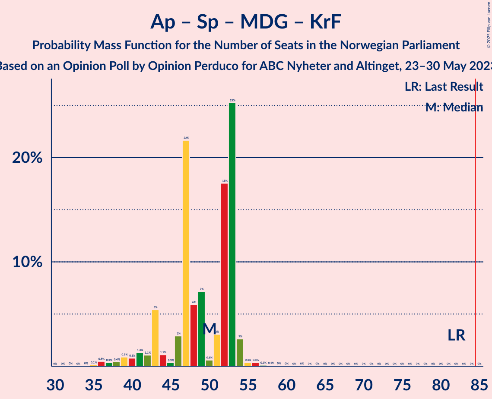

# Opinion Poll by Opinion Perduco for ABC Nyheter and Altinget, 23–30 May 2023

<a href="#voting-intentions">Voting Intentions</a> | <a href="#seats">Seats</a> | <a href="#coalitions">Coalitions</a> | <a href="#technical-information">Technical Information</a>

## Voting Intentions

### Confidence Intervals

| Party | Last Result | Poll Result | 80% Confidence Interval | 90% Confidence Interval | 95% Confidence Interval | 99% Confidence Interval |
|:-----:|:-----------:|:-----------:|:-----------------------:|:-----------------------:|:-----------------------:|:-----------------------:|
| Høyre | 20.4% | 32.1% | 29.9–34.4% |29.3–35.0% |28.7–35.6% |27.7–36.7% |
| Arbeiderpartiet | 26.2% | 16.2% | 14.6–18.1% |14.1–18.7% |13.7–19.1% |13.0–20.1% |
| Fremskrittspartiet | 11.6% | 13.2% | 11.7–14.9% |11.2–15.4% |10.9–15.9% |10.2–16.7% |
| Rødt | 4.7% | 8.5% | 7.3–10.0% |7.0–10.5% |6.7–10.8% |6.2–11.6% |
| Sosialistisk Venstreparti | 7.6% | 8.3% | 7.1–9.7% |6.7–10.2% |6.5–10.5% |5.9–11.3% |
| Senterpartiet | 13.5% | 5.2% | 4.3–6.4% |4.0–6.8% |3.8–7.1% |3.4–7.7% |
| Venstre | 4.6% | 4.5% | 3.6–5.6% |3.4–6.0% |3.2–6.3% |2.8–6.9% |
| Miljøpartiet De Grønne | 3.9% | 3.8% | 3.0–4.9% |2.8–5.2% |2.6–5.5% |2.3–6.0% |
| Kristelig Folkeparti | 3.8% | 3.1% | 2.4–4.1% |2.2–4.4% |2.0–4.6% |1.8–5.2% |
| Industri- og Næringspartiet | 0.3% | 2.2% | 1.7–3.1% |1.5–3.4% |1.4–3.6% |1.2–4.1% |
| Norgesdemokratene | 1.1% | 0.8% | 0.5–1.5% |0.5–1.7% |0.4–1.8% |0.3–2.2% |
| Konservativt | 0.4% | 0.8% | 0.5–1.5% |0.5–1.7% |0.4–1.8% |0.3–2.2% |
| Pensjonistpartiet | 0.6% | 0.6% | 0.3–1.1% |0.3–1.3% |0.2–1.4% |0.1–1.8% |
| Folkets parti | 0.1% | 0.1% | 0.1–0.5% |0.0–0.7% |0.0–0.8% |0.0–1.0% |

*Note:* The poll result column reflects the actual value used in the calculations. Published results may vary slightly, and in addition be rounded to fewer digits.

## Seats

### Confidence Intervals

| Party | Last Result | Median | 80% Confidence Interval | 90% Confidence Interval | 95% Confidence Interval | 99% Confidence Interval |
|:-----:|:-----------:|:------:|:-----------------------:|:-----------------------:|:-----------------------:|:-----------------------:|
| <a href="#høyre">Høyre</a> | 36 | 55 | 52–65 |51–65 |50–65 |49–68 |
| <a href="#arbeiderpartiet">Arbeiderpartiet</a> | 48 | 33 | 28–39 |28–39 |25–39 |25–39 |
| <a href="#fremskrittspartiet">Fremskrittspartiet</a> | 21 | 22 | 20–30 |19–30 |19–30 |19–31 |
| <a href="#rødt">Rødt</a> | 8 | 16 | 12–18 |11–19 |11–20 |11–23 |
| <a href="#sosialistisk-venstreparti">Sosialistisk Venstreparti</a> | 13 | 13 | 11–18 |11–19 |11–20 |9–20 |
| <a href="#senterpartiet">Senterpartiet</a> | 28 | 10 | 9–12 |7–12 |0–13 |0–16 |
| <a href="#venstre">Venstre</a> | 8 | 8 | 2–10 |2–10 |2–11 |2–11 |
| <a href="#miljøpartiet-de-grønne">Miljøpartiet De Grønne</a> | 3 | 2 | 2–8 |1–8 |1–9 |1–13 |
| <a href="#kristelig-folkeparti">Kristelig Folkeparti</a> | 3 | 2 | 1–3 |0–3 |0–8 |0–8 |
| <a href="#industri--og-næringspartiet">Industri- og Næringspartiet</a> | 0 | 0 | 0–3 |0–3 |0–3 |0–8 |
| <a href="#norgesdemokratene">Norgesdemokratene</a> | 0 | 0 | 0 |0 |0 |0 |
| <a href="#konservativt">Konservativt</a> | 0 | 0 | 0 |0 |0 |0 |
| <a href="#pensjonistpartiet">Pensjonistpartiet</a> | 0 | 0 | 0 |0 |0 |0 |
| <a href="#folkets-parti">Folkets parti</a> | 0 | 0 | 0 |0 |0 |0 |

### Høyre

*For a full overview of the results for this party, see the [Høyre](party-høyre.html) page.*

| Number of Seats | Probability | Accumulated | Special Marks |
|:---------------:|:-----------:|:-----------:|:-------------:|
| 36 | 0% | 100% | Last Result |
| 37 | 0% | 100% |  |
| 38 | 0% | 100% |  |
| 39 | 0% | 100% |  |
| 40 | 0% | 100% |  |
| 41 | 0% | 100% |  |
| 42 | 0% | 100% |  |
| 43 | 0% | 100% |  |
| 44 | 0% | 100% |  |
| 45 | 0% | 100% |  |
| 46 | 0% | 100% |  |
| 47 | 0.1% | 100% |  |
| 48 | 0.2% | 99.9% |  |
| 49 | 2% | 99.7% |  |
| 50 | 1.1% | 98% |  |
| 51 | 7% | 97% |  |
| 52 | 6% | 90% |  |
| 53 | 0.8% | 84% |  |
| 54 | 8% | 83% |  |
| 55 | 25% | 75% | Median |
| 56 | 4% | 50% |  |
| 57 | 3% | 46% |  |
| 58 | 7% | 43% |  |
| 59 | 10% | 36% |  |
| 60 | 5% | 26% |  |
| 61 | 1.4% | 20% |  |
| 62 | 1.3% | 19% |  |
| 63 | 0.9% | 18% |  |
| 64 | 0.6% | 17% |  |
| 65 | 14% | 16% |  |
| 66 | 1.3% | 2% |  |
| 67 | 0.2% | 0.8% |  |
| 68 | 0.3% | 0.6% |  |
| 69 | 0% | 0.3% |  |
| 70 | 0.3% | 0.3% |  |
| 71 | 0% | 0% |  |

### Arbeiderpartiet

*For a full overview of the results for this party, see the [Arbeiderpartiet](party-arbeiderpartiet.html) page.*

| Number of Seats | Probability | Accumulated | Special Marks |
|:---------------:|:-----------:|:-----------:|:-------------:|
| 22 | 0% | 100% |  |
| 23 | 0% | 99.9% |  |
| 24 | 0.1% | 99.9% |  |
| 25 | 4% | 99.8% |  |
| 26 | 0.4% | 96% |  |
| 27 | 0.1% | 95% |  |
| 28 | 8% | 95% |  |
| 29 | 2% | 87% |  |
| 30 | 3% | 85% |  |
| 31 | 9% | 82% |  |
| 32 | 11% | 73% |  |
| 33 | 26% | 62% | Median |
| 34 | 2% | 35% |  |
| 35 | 6% | 34% |  |
| 36 | 1.1% | 28% |  |
| 37 | 1.3% | 27% |  |
| 38 | 1.3% | 25% |  |
| 39 | 24% | 24% |  |
| 40 | 0% | 0.1% |  |
| 41 | 0% | 0% |  |
| 42 | 0% | 0% |  |
| 43 | 0% | 0% |  |
| 44 | 0% | 0% |  |
| 45 | 0% | 0% |  |
| 46 | 0% | 0% |  |
| 47 | 0% | 0% |  |
| 48 | 0% | 0% | Last Result |

### Fremskrittspartiet

*For a full overview of the results for this party, see the [Fremskrittspartiet](party-fremskrittspartiet.html) page.*

| Number of Seats | Probability | Accumulated | Special Marks |
|:---------------:|:-----------:|:-----------:|:-------------:|
| 17 | 0.1% | 100% |  |
| 18 | 0.3% | 99.9% |  |
| 19 | 9% | 99.6% |  |
| 20 | 0.2% | 90% |  |
| 21 | 15% | 90% | Last Result |
| 22 | 28% | 74% | Median |
| 23 | 16% | 46% |  |
| 24 | 7% | 30% |  |
| 25 | 2% | 23% |  |
| 26 | 1.1% | 21% |  |
| 27 | 0.8% | 20% |  |
| 28 | 3% | 19% |  |
| 29 | 2% | 16% |  |
| 30 | 14% | 15% |  |
| 31 | 0.7% | 0.9% |  |
| 32 | 0% | 0.2% |  |
| 33 | 0% | 0.2% |  |
| 34 | 0% | 0.2% |  |
| 35 | 0% | 0.2% |  |
| 36 | 0.1% | 0.2% |  |
| 37 | 0% | 0% |  |

### Rødt

*For a full overview of the results for this party, see the [Rødt](party-rødt.html) page.*

| Number of Seats | Probability | Accumulated | Special Marks |
|:---------------:|:-----------:|:-----------:|:-------------:|
| 8 | 0% | 100% | Last Result |
| 9 | 0.2% | 100% |  |
| 10 | 0.2% | 99.8% |  |
| 11 | 8% | 99.6% |  |
| 12 | 2% | 91% |  |
| 13 | 2% | 89% |  |
| 14 | 13% | 87% |  |
| 15 | 16% | 74% |  |
| 16 | 13% | 58% | Median |
| 17 | 27% | 45% |  |
| 18 | 11% | 17% |  |
| 19 | 3% | 6% |  |
| 20 | 0.8% | 3% |  |
| 21 | 0.9% | 2% |  |
| 22 | 0.1% | 1.4% |  |
| 23 | 0.8% | 1.3% |  |
| 24 | 0.5% | 0.5% |  |
| 25 | 0% | 0% |  |

### Sosialistisk Venstreparti

*For a full overview of the results for this party, see the [Sosialistisk Venstreparti](party-sosialistiskvenstreparti.html) page.*

| Number of Seats | Probability | Accumulated | Special Marks |
|:---------------:|:-----------:|:-----------:|:-------------:|
| 9 | 1.0% | 100% |  |
| 10 | 0.5% | 99.0% |  |
| 11 | 9% | 98.5% |  |
| 12 | 2% | 90% |  |
| 13 | 44% | 88% | Last Result, Median |
| 14 | 12% | 45% |  |
| 15 | 4% | 33% |  |
| 16 | 10% | 28% |  |
| 17 | 7% | 18% |  |
| 18 | 2% | 12% |  |
| 19 | 5% | 10% |  |
| 20 | 5% | 5% |  |
| 21 | 0.3% | 0.4% |  |
| 22 | 0% | 0% |  |

### Senterpartiet

*For a full overview of the results for this party, see the [Senterpartiet](party-senterpartiet.html) page.*

| Number of Seats | Probability | Accumulated | Special Marks |
|:---------------:|:-----------:|:-----------:|:-------------:|
| 0 | 3% | 100% |  |
| 1 | 2% | 97% |  |
| 2 | 0.1% | 95% |  |
| 3 | 0% | 95% |  |
| 4 | 0% | 95% |  |
| 5 | 0% | 95% |  |
| 6 | 0% | 95% |  |
| 7 | 1.0% | 95% |  |
| 8 | 4% | 94% |  |
| 9 | 7% | 90% |  |
| 10 | 57% | 83% | Median |
| 11 | 4% | 26% |  |
| 12 | 19% | 22% |  |
| 13 | 1.1% | 3% |  |
| 14 | 0.4% | 2% |  |
| 15 | 0.1% | 2% |  |
| 16 | 1.5% | 1.5% |  |
| 17 | 0% | 0% |  |
| 18 | 0% | 0% |  |
| 19 | 0% | 0% |  |
| 20 | 0% | 0% |  |
| 21 | 0% | 0% |  |
| 22 | 0% | 0% |  |
| 23 | 0% | 0% |  |
| 24 | 0% | 0% |  |
| 25 | 0% | 0% |  |
| 26 | 0% | 0% |  |
| 27 | 0% | 0% |  |
| 28 | 0% | 0% | Last Result |

### Venstre

*For a full overview of the results for this party, see the [Venstre](party-venstre.html) page.*

| Number of Seats | Probability | Accumulated | Special Marks |
|:---------------:|:-----------:|:-----------:|:-------------:|
| 1 | 0.2% | 100% |  |
| 2 | 13% | 99.8% |  |
| 3 | 10% | 86% |  |
| 4 | 0% | 76% |  |
| 5 | 0% | 76% |  |
| 6 | 0.1% | 76% |  |
| 7 | 24% | 76% |  |
| 8 | 28% | 52% | Last Result, Median |
| 9 | 5% | 24% |  |
| 10 | 16% | 19% |  |
| 11 | 2% | 3% |  |
| 12 | 0.2% | 0.3% |  |
| 13 | 0.1% | 0.1% |  |
| 14 | 0% | 0% |  |

### Miljøpartiet De Grønne

*For a full overview of the results for this party, see the [Miljøpartiet De Grønne](party-miljøpartietdegrønne.html) page.*

| Number of Seats | Probability | Accumulated | Special Marks |
|:---------------:|:-----------:|:-----------:|:-------------:|
| 1 | 7% | 100% |  |
| 2 | 60% | 93% | Median |
| 3 | 1.0% | 32% | Last Result |
| 4 | 0% | 31% |  |
| 5 | 0% | 31% |  |
| 6 | 0.3% | 31% |  |
| 7 | 18% | 31% |  |
| 8 | 8% | 13% |  |
| 9 | 3% | 4% |  |
| 10 | 0.7% | 2% |  |
| 11 | 0.2% | 1.2% |  |
| 12 | 0% | 1.0% |  |
| 13 | 1.0% | 1.0% |  |
| 14 | 0% | 0% |  |

### Kristelig Folkeparti

*For a full overview of the results for this party, see the [Kristelig Folkeparti](party-kristeligfolkeparti.html) page.*

| Number of Seats | Probability | Accumulated | Special Marks |
|:---------------:|:-----------:|:-----------:|:-------------:|
| 0 | 7% | 100% |  |
| 1 | 5% | 93% |  |
| 2 | 66% | 88% | Median |
| 3 | 19% | 22% | Last Result |
| 4 | 0% | 4% |  |
| 5 | 0% | 4% |  |
| 6 | 0% | 4% |  |
| 7 | 0.9% | 3% |  |
| 8 | 2% | 3% |  |
| 9 | 0.4% | 0.4% |  |
| 10 | 0% | 0% |  |

### Industri- og Næringspartiet

*For a full overview of the results for this party, see the [Industri- og Næringspartiet](party-industri-ognæringspartiet.html) page.*

| Number of Seats | Probability | Accumulated | Special Marks |
|:---------------:|:-----------:|:-----------:|:-------------:|
| 0 | 55% | 100% | Last Result, Median |
| 1 | 2% | 45% |  |
| 2 | 30% | 44% |  |
| 3 | 12% | 14% |  |
| 4 | 0% | 1.5% |  |
| 5 | 0% | 1.5% |  |
| 6 | 0.1% | 1.5% |  |
| 7 | 0% | 1.4% |  |
| 8 | 1.4% | 1.4% |  |
| 9 | 0% | 0% |  |

### Norgesdemokratene

*For a full overview of the results for this party, see the [Norgesdemokratene](party-norgesdemokratene.html) page.*

| Number of Seats | Probability | Accumulated | Special Marks |
|:---------------:|:-----------:|:-----------:|:-------------:|
| 0 | 100% | 100% | Last Result, Median |

### Konservativt

*For a full overview of the results for this party, see the [Konservativt](party-konservativt.html) page.*

| Number of Seats | Probability | Accumulated | Special Marks |
|:---------------:|:-----------:|:-----------:|:-------------:|
| 0 | 100% | 100% | Last Result, Median |

### Pensjonistpartiet

*For a full overview of the results for this party, see the [Pensjonistpartiet](party-pensjonistpartiet.html) page.*

| Number of Seats | Probability | Accumulated | Special Marks |
|:---------------:|:-----------:|:-----------:|:-------------:|
| 0 | 99.9% | 100% | Last Result, Median |
| 1 | 0.1% | 0.1% |  |
| 2 | 0% | 0% |  |

### Folkets parti

*For a full overview of the results for this party, see the [Folkets parti](party-folketsparti.html) page.*

| Number of Seats | Probability | Accumulated | Special Marks |
|:---------------:|:-----------:|:-----------:|:-------------:|
| 0 | 100% | 100% | Last Result, Median |

## Coalitions

### Confidence Intervals

| Coalition | Last Result | Median | Majority? | 80% Confidence Interval | 90% Confidence Interval | 95% Confidence Interval | 99% Confidence Interval |
|:---------:|:-----------:|:------:|:---------:|:-----------------------:|:-----------------------:|:-----------------------:|:-----------------------:|
| Høyre – Fremskrittspartiet – Senterpartiet – Venstre – Kristelig Folkeparti | 96 | 100 | 100% | 94–105 | 93–105 | 91–107 | 86–111 |
| Høyre – Fremskrittspartiet – Venstre – Miljøpartiet De Grønne – Kristelig Folkeparti | 71 | 93 | 95% | 88–101 | 84–102 | 84–105 | 84–107 |
| Høyre – Fremskrittspartiet – Venstre – Kristelig Folkeparti | 68 | 90 | 90% | 84–95 | 82–98 | 82–99 | 78–102 |
| Høyre – Fremskrittspartiet – Venstre | 65 | 87 | 86% | 82–93 | 82–95 | 81–97 | 76–99 |
| Høyre – Fremskrittspartiet | 57 | 79 | 26% | 75–86 | 75–88 | 75–88 | 74–92 |
| Arbeiderpartiet – Rødt – Sosialistisk Venstreparti – Senterpartiet – Miljøpartiet De Grønne | 100 | 77 | 0.3% | 72–82 | 69–84 | 68–84 | 65–84 |
| Arbeiderpartiet – Rødt – Sosialistisk Venstreparti – Senterpartiet | 97 | 73 | 0% | 67–79 | 64–82 | 62–82 | 60–82 |
| Høyre – Venstre – Kristelig Folkeparti | 47 | 65 | 0% | 60–74 | 59–74 | 59–76 | 55–78 |
| Arbeiderpartiet – Rødt – Sosialistisk Venstreparti – Miljøpartiet De Grønne | 72 | 67 | 0% | 62–72 | 60–73 | 59–74 | 57–77 |
| Arbeiderpartiet – Sosialistisk Venstreparti – Senterpartiet – Miljøpartiet De Grønne – Kristelig Folkeparti | 95 | 64 | 0% | 60–66 | 56–68 | 55–70 | 52–73 |
| Arbeiderpartiet – Sosialistisk Venstreparti – Senterpartiet – Miljøpartiet De Grønne | 92 | 62 | 0% | 58–66 | 55–66 | 53–67 | 50–70 |
| Arbeiderpartiet – Sosialistisk Venstreparti – Senterpartiet | 89 | 58 | 0% | 52–62 | 50–64 | 47–64 | 45–64 |
| Arbeiderpartiet – Senterpartiet – Miljøpartiet De Grønne – Kristelig Folkeparti | 82 | 50 | 0% | 43–53 | 42–53 | 40–54 | 36–56 |
| Arbeiderpartiet – Sosialistisk Venstreparti | 61 | 47 | 0% | 43–52 | 41–52 | 38–53 | 37–56 |
| Arbeiderpartiet – Senterpartiet – Kristelig Folkeparti | 79 | 45 | 0% | 41–51 | 39–51 | 35–51 | 32–51 |
| Arbeiderpartiet – Senterpartiet | 76 | 43 | 0% | 38–49 | 37–49 | 33–49 | 30–49 |
| Senterpartiet – Venstre – Kristelig Folkeparti | 39 | 20 | 0% | 14–23 | 12–24 | 11–25 | 10–26 |

### Høyre – Fremskrittspartiet – Senterpartiet – Venstre – Kristelig Folkeparti

| Number of Seats | Probability | Accumulated | Special Marks |
|:---------------:|:-----------:|:-----------:|:-------------:|
| 86 | 1.3% | 100% |  |
| 87 | 0.1% | 98.7% |  |
| 88 | 0.1% | 98.6% |  |
| 89 | 0.7% | 98.5% |  |
| 90 | 0% | 98% |  |
| 91 | 0.6% | 98% |  |
| 92 | 0% | 97% |  |
| 93 | 3% | 97% |  |
| 94 | 6% | 95% |  |
| 95 | 0.7% | 89% |  |
| 96 | 2% | 88% | Last Result |
| 97 | 26% | 87% | Median |
| 98 | 1.4% | 61% |  |
| 99 | 9% | 59% |  |
| 100 | 20% | 51% |  |
| 101 | 0.9% | 31% |  |
| 102 | 0.6% | 30% |  |
| 103 | 1.1% | 29% |  |
| 104 | 5% | 28% |  |
| 105 | 18% | 22% |  |
| 106 | 0.4% | 5% |  |
| 107 | 3% | 5% |  |
| 108 | 0.2% | 2% |  |
| 109 | 0.7% | 2% |  |
| 110 | 0% | 0.8% |  |
| 111 | 0.7% | 0.8% |  |
| 112 | 0% | 0.1% |  |
| 113 | 0% | 0% |  |

### Høyre – Fremskrittspartiet – Venstre – Miljøpartiet De Grønne – Kristelig Folkeparti

| Number of Seats | Probability | Accumulated | Special Marks |
|:---------------:|:-----------:|:-----------:|:-------------:|
| 71 | 0% | 100% | Last Result |
| 72 | 0% | 100% |  |
| 73 | 0% | 100% |  |
| 74 | 0% | 100% |  |
| 75 | 0% | 100% |  |
| 76 | 0% | 100% |  |
| 77 | 0% | 100% |  |
| 78 | 0% | 100% |  |
| 79 | 0% | 100% |  |
| 80 | 0% | 100% |  |
| 81 | 0% | 100% |  |
| 82 | 0% | 100% |  |
| 83 | 0% | 100% |  |
| 84 | 5% | 100% |  |
| 85 | 0.2% | 95% | Majority |
| 86 | 4% | 94% |  |
| 87 | 0.1% | 91% |  |
| 88 | 0.5% | 90% |  |
| 89 | 30% | 90% | Median |
| 90 | 0.9% | 60% |  |
| 91 | 2% | 59% |  |
| 92 | 2% | 57% |  |
| 93 | 6% | 55% |  |
| 94 | 1.5% | 48% |  |
| 95 | 0.3% | 47% |  |
| 96 | 0.5% | 46% |  |
| 97 | 32% | 46% |  |
| 98 | 1.1% | 14% |  |
| 99 | 0.2% | 13% |  |
| 100 | 2% | 13% |  |
| 101 | 5% | 11% |  |
| 102 | 1.2% | 6% |  |
| 103 | 1.0% | 5% |  |
| 104 | 0.7% | 4% |  |
| 105 | 1.1% | 3% |  |
| 106 | 0.3% | 2% |  |
| 107 | 1.0% | 1.4% |  |
| 108 | 0.4% | 0.5% |  |
| 109 | 0% | 0.1% |  |
| 110 | 0% | 0% |  |

### Høyre – Fremskrittspartiet – Venstre – Kristelig Folkeparti

| Number of Seats | Probability | Accumulated | Special Marks |
|:---------------:|:-----------:|:-----------:|:-------------:|
| 68 | 0% | 100% | Last Result |
| 69 | 0% | 100% |  |
| 70 | 0% | 100% |  |
| 71 | 0% | 100% |  |
| 72 | 0% | 100% |  |
| 73 | 0% | 100% |  |
| 74 | 0% | 100% |  |
| 75 | 0% | 100% |  |
| 76 | 0% | 100% |  |
| 77 | 0.1% | 100% |  |
| 78 | 1.3% | 99.9% |  |
| 79 | 0% | 98.6% |  |
| 80 | 0.1% | 98.6% |  |
| 81 | 0% | 98.5% |  |
| 82 | 5% | 98% |  |
| 83 | 0.2% | 93% |  |
| 84 | 3% | 93% |  |
| 85 | 1.5% | 90% | Majority |
| 86 | 0.3% | 88% |  |
| 87 | 32% | 88% | Median |
| 88 | 1.1% | 56% |  |
| 89 | 4% | 55% |  |
| 90 | 16% | 51% |  |
| 91 | 3% | 35% |  |
| 92 | 5% | 32% |  |
| 93 | 5% | 28% |  |
| 94 | 0.7% | 23% |  |
| 95 | 15% | 22% |  |
| 96 | 0.9% | 7% |  |
| 97 | 0.1% | 6% |  |
| 98 | 3% | 6% |  |
| 99 | 1.2% | 4% |  |
| 100 | 2% | 2% |  |
| 101 | 0.2% | 0.7% |  |
| 102 | 0% | 0.5% |  |
| 103 | 0.3% | 0.5% |  |
| 104 | 0.1% | 0.2% |  |
| 105 | 0% | 0.1% |  |
| 106 | 0.1% | 0.1% |  |
| 107 | 0% | 0% |  |

### Høyre – Fremskrittspartiet – Venstre

| Number of Seats | Probability | Accumulated | Special Marks |
|:---------------:|:-----------:|:-----------:|:-------------:|
| 65 | 0% | 100% | Last Result |
| 66 | 0% | 100% |  |
| 67 | 0% | 100% |  |
| 68 | 0% | 100% |  |
| 69 | 0% | 100% |  |
| 70 | 0% | 100% |  |
| 71 | 0% | 100% |  |
| 72 | 0% | 100% |  |
| 73 | 0% | 100% |  |
| 74 | 0% | 100% |  |
| 75 | 0.1% | 100% |  |
| 76 | 1.3% | 99.9% |  |
| 77 | 0% | 98.6% |  |
| 78 | 0% | 98.6% |  |
| 79 | 0.1% | 98.6% |  |
| 80 | 0.2% | 98% |  |
| 81 | 3% | 98% |  |
| 82 | 6% | 95% |  |
| 83 | 0.5% | 89% |  |
| 84 | 3% | 88% |  |
| 85 | 31% | 86% | Median, Majority |
| 86 | 3% | 55% |  |
| 87 | 10% | 53% |  |
| 88 | 9% | 43% |  |
| 89 | 1.3% | 34% |  |
| 90 | 9% | 33% |  |
| 91 | 2% | 23% |  |
| 92 | 1.2% | 22% |  |
| 93 | 15% | 20% |  |
| 94 | 0.4% | 6% |  |
| 95 | 1.3% | 5% |  |
| 96 | 0.4% | 4% |  |
| 97 | 2% | 4% |  |
| 98 | 1.0% | 2% |  |
| 99 | 0.2% | 0.5% |  |
| 100 | 0.2% | 0.4% |  |
| 101 | 0% | 0.2% |  |
| 102 | 0% | 0.1% |  |
| 103 | 0% | 0.1% |  |
| 104 | 0% | 0.1% |  |
| 105 | 0.1% | 0.1% |  |
| 106 | 0% | 0% |  |

### Høyre – Fremskrittspartiet

| Number of Seats | Probability | Accumulated | Special Marks |
|:---------------:|:-----------:|:-----------:|:-------------:|
| 57 | 0% | 100% | Last Result |
| 58 | 0% | 100% |  |
| 59 | 0% | 100% |  |
| 60 | 0% | 100% |  |
| 61 | 0% | 100% |  |
| 62 | 0% | 100% |  |
| 63 | 0% | 100% |  |
| 64 | 0% | 100% |  |
| 65 | 0% | 100% |  |
| 66 | 0% | 100% |  |
| 67 | 0% | 100% |  |
| 68 | 0% | 100% |  |
| 69 | 0% | 100% |  |
| 70 | 0% | 100% |  |
| 71 | 0% | 100% |  |
| 72 | 0% | 99.9% |  |
| 73 | 0.2% | 99.9% |  |
| 74 | 1.4% | 99.7% |  |
| 75 | 11% | 98% |  |
| 76 | 0.5% | 87% |  |
| 77 | 27% | 87% | Median |
| 78 | 9% | 60% |  |
| 79 | 4% | 51% |  |
| 80 | 1.2% | 47% |  |
| 81 | 1.4% | 46% |  |
| 82 | 4% | 44% |  |
| 83 | 5% | 41% |  |
| 84 | 10% | 35% |  |
| 85 | 1.1% | 26% | Majority |
| 86 | 16% | 25% |  |
| 87 | 1.2% | 9% |  |
| 88 | 6% | 7% |  |
| 89 | 0.5% | 2% |  |
| 90 | 0.2% | 1.0% |  |
| 91 | 0.3% | 0.8% |  |
| 92 | 0.1% | 0.5% |  |
| 93 | 0% | 0.4% |  |
| 94 | 0.2% | 0.4% |  |
| 95 | 0% | 0.2% |  |
| 96 | 0% | 0.2% |  |
| 97 | 0.1% | 0.2% |  |
| 98 | 0% | 0% |  |

### Arbeiderpartiet – Rødt – Sosialistisk Venstreparti – Senterpartiet – Miljøpartiet De Grønne

| Number of Seats | Probability | Accumulated | Special Marks |
|:---------------:|:-----------:|:-----------:|:-------------:|
| 62 | 0.1% | 100% |  |
| 63 | 0% | 99.9% |  |
| 64 | 0.1% | 99.8% |  |
| 65 | 0.4% | 99.7% |  |
| 66 | 0.1% | 99.3% |  |
| 67 | 1.3% | 99.2% |  |
| 68 | 2% | 98% |  |
| 69 | 1.2% | 96% |  |
| 70 | 1.4% | 95% |  |
| 71 | 0.4% | 93% |  |
| 72 | 4% | 93% |  |
| 73 | 15% | 89% |  |
| 74 | 5% | 75% | Median |
| 75 | 10% | 69% |  |
| 76 | 8% | 60% |  |
| 77 | 3% | 52% |  |
| 78 | 3% | 50% |  |
| 79 | 9% | 47% |  |
| 80 | 0.2% | 38% |  |
| 81 | 27% | 38% |  |
| 82 | 4% | 11% |  |
| 83 | 0.2% | 6% |  |
| 84 | 6% | 6% |  |
| 85 | 0.1% | 0.3% | Majority |
| 86 | 0.1% | 0.2% |  |
| 87 | 0% | 0.1% |  |
| 88 | 0.1% | 0.1% |  |
| 89 | 0% | 0% |  |
| 90 | 0% | 0% |  |
| 91 | 0% | 0% |  |
| 92 | 0% | 0% |  |
| 93 | 0% | 0% |  |
| 94 | 0% | 0% |  |
| 95 | 0% | 0% |  |
| 96 | 0% | 0% |  |
| 97 | 0% | 0% |  |
| 98 | 0% | 0% |  |
| 99 | 0% | 0% |  |
| 100 | 0% | 0% | Last Result |

### Arbeiderpartiet – Rødt – Sosialistisk Venstreparti – Senterpartiet

| Number of Seats | Probability | Accumulated | Special Marks |
|:---------------:|:-----------:|:-----------:|:-------------:|
| 58 | 0% | 100% |  |
| 59 | 0.1% | 99.9% |  |
| 60 | 1.3% | 99.9% |  |
| 61 | 0.9% | 98.6% |  |
| 62 | 1.0% | 98% |  |
| 63 | 0.4% | 97% |  |
| 64 | 3% | 96% |  |
| 65 | 0.9% | 93% |  |
| 66 | 1.3% | 92% |  |
| 67 | 2% | 91% |  |
| 68 | 10% | 89% |  |
| 69 | 8% | 79% |  |
| 70 | 1.0% | 71% |  |
| 71 | 16% | 70% |  |
| 72 | 2% | 54% | Median |
| 73 | 5% | 52% |  |
| 74 | 2% | 47% |  |
| 75 | 2% | 46% |  |
| 76 | 4% | 44% |  |
| 77 | 6% | 40% |  |
| 78 | 0.5% | 34% |  |
| 79 | 24% | 33% |  |
| 80 | 3% | 9% |  |
| 81 | 0.5% | 6% |  |
| 82 | 5% | 5% |  |
| 83 | 0.1% | 0.1% |  |
| 84 | 0% | 0% |  |
| 85 | 0% | 0% | Majority |
| 86 | 0% | 0% |  |
| 87 | 0% | 0% |  |
| 88 | 0% | 0% |  |
| 89 | 0% | 0% |  |
| 90 | 0% | 0% |  |
| 91 | 0% | 0% |  |
| 92 | 0% | 0% |  |
| 93 | 0% | 0% |  |
| 94 | 0% | 0% |  |
| 95 | 0% | 0% |  |
| 96 | 0% | 0% |  |
| 97 | 0% | 0% | Last Result |

### Høyre – Venstre – Kristelig Folkeparti

| Number of Seats | Probability | Accumulated | Special Marks |
|:---------------:|:-----------:|:-----------:|:-------------:|
| 47 | 0% | 100% | Last Result |
| 48 | 0% | 100% |  |
| 49 | 0% | 100% |  |
| 50 | 0% | 100% |  |
| 51 | 0% | 100% |  |
| 52 | 0.1% | 100% |  |
| 53 | 0% | 99.9% |  |
| 54 | 0% | 99.9% |  |
| 55 | 2% | 99.9% |  |
| 56 | 0% | 98% |  |
| 57 | 0.2% | 98% |  |
| 58 | 0.2% | 98% |  |
| 59 | 5% | 98% |  |
| 60 | 8% | 92% |  |
| 61 | 5% | 84% |  |
| 62 | 6% | 80% |  |
| 63 | 7% | 73% |  |
| 64 | 1.5% | 66% |  |
| 65 | 24% | 64% | Median |
| 66 | 2% | 40% |  |
| 67 | 1.2% | 38% |  |
| 68 | 3% | 37% |  |
| 69 | 0.1% | 34% |  |
| 70 | 6% | 34% |  |
| 71 | 9% | 29% |  |
| 72 | 0.6% | 20% |  |
| 73 | 1.3% | 19% |  |
| 74 | 15% | 18% |  |
| 75 | 0.1% | 3% |  |
| 76 | 1.2% | 3% |  |
| 77 | 1.0% | 2% |  |
| 78 | 0.3% | 0.6% |  |
| 79 | 0.2% | 0.3% |  |
| 80 | 0% | 0.2% |  |
| 81 | 0% | 0.1% |  |
| 82 | 0% | 0.1% |  |
| 83 | 0% | 0.1% |  |
| 84 | 0.1% | 0.1% |  |
| 85 | 0% | 0% | Majority |

### Arbeiderpartiet – Rødt – Sosialistisk Venstreparti – Miljøpartiet De Grønne

| Number of Seats | Probability | Accumulated | Special Marks |
|:---------------:|:-----------:|:-----------:|:-------------:|
| 54 | 0% | 100% |  |
| 55 | 0% | 99.9% |  |
| 56 | 0% | 99.9% |  |
| 57 | 0.7% | 99.9% |  |
| 58 | 1.0% | 99.2% |  |
| 59 | 0.9% | 98% |  |
| 60 | 3% | 97% |  |
| 61 | 2% | 94% |  |
| 62 | 5% | 92% |  |
| 63 | 15% | 87% |  |
| 64 | 1.2% | 73% | Median |
| 65 | 9% | 71% |  |
| 66 | 8% | 63% |  |
| 67 | 8% | 54% |  |
| 68 | 3% | 46% |  |
| 69 | 4% | 44% |  |
| 70 | 3% | 40% |  |
| 71 | 26% | 37% |  |
| 72 | 5% | 12% | Last Result |
| 73 | 3% | 6% |  |
| 74 | 2% | 3% |  |
| 75 | 0.1% | 2% |  |
| 76 | 0% | 1.5% |  |
| 77 | 1.3% | 1.5% |  |
| 78 | 0.1% | 0.1% |  |
| 79 | 0% | 0% |  |

### Arbeiderpartiet – Sosialistisk Venstreparti – Senterpartiet – Miljøpartiet De Grønne – Kristelig Folkeparti

| Number of Seats | Probability | Accumulated | Special Marks |
|:---------------:|:-----------:|:-----------:|:-------------:|
| 47 | 0.1% | 100% |  |
| 48 | 0.1% | 99.9% |  |
| 49 | 0% | 99.8% |  |
| 50 | 0% | 99.8% |  |
| 51 | 0.1% | 99.8% |  |
| 52 | 0.3% | 99.7% |  |
| 53 | 0.1% | 99.4% |  |
| 54 | 1.4% | 99.3% |  |
| 55 | 0.7% | 98% |  |
| 56 | 2% | 97% |  |
| 57 | 0.8% | 95% |  |
| 58 | 1.1% | 94% |  |
| 59 | 0.6% | 93% |  |
| 60 | 14% | 92% | Median |
| 61 | 5% | 78% |  |
| 62 | 7% | 73% |  |
| 63 | 14% | 66% |  |
| 64 | 3% | 52% |  |
| 65 | 0.6% | 49% |  |
| 66 | 40% | 49% |  |
| 67 | 1.2% | 9% |  |
| 68 | 3% | 7% |  |
| 69 | 2% | 5% |  |
| 70 | 1.4% | 3% |  |
| 71 | 0.3% | 1.1% |  |
| 72 | 0.1% | 0.8% |  |
| 73 | 0.6% | 0.7% |  |
| 74 | 0.1% | 0.1% |  |
| 75 | 0% | 0.1% |  |
| 76 | 0% | 0% |  |
| 77 | 0% | 0% |  |
| 78 | 0% | 0% |  |
| 79 | 0% | 0% |  |
| 80 | 0% | 0% |  |
| 81 | 0% | 0% |  |
| 82 | 0% | 0% |  |
| 83 | 0% | 0% |  |
| 84 | 0% | 0% |  |
| 85 | 0% | 0% | Majority |
| 86 | 0% | 0% |  |
| 87 | 0% | 0% |  |
| 88 | 0% | 0% |  |
| 89 | 0% | 0% |  |
| 90 | 0% | 0% |  |
| 91 | 0% | 0% |  |
| 92 | 0% | 0% |  |
| 93 | 0% | 0% |  |
| 94 | 0% | 0% |  |
| 95 | 0% | 0% | Last Result |

### Arbeiderpartiet – Sosialistisk Venstreparti – Senterpartiet – Miljøpartiet De Grønne

| Number of Seats | Probability | Accumulated | Special Marks |
|:---------------:|:-----------:|:-----------:|:-------------:|
| 46 | 0.1% | 100% |  |
| 47 | 0% | 99.9% |  |
| 48 | 0.1% | 99.8% |  |
| 49 | 0.2% | 99.8% |  |
| 50 | 0.2% | 99.6% |  |
| 51 | 0.4% | 99.4% |  |
| 52 | 1.2% | 99.1% |  |
| 53 | 1.2% | 98% |  |
| 54 | 1.2% | 97% |  |
| 55 | 3% | 95% |  |
| 56 | 1.4% | 92% |  |
| 57 | 0.6% | 91% |  |
| 58 | 18% | 90% | Median |
| 59 | 1.4% | 73% |  |
| 60 | 12% | 71% |  |
| 61 | 8% | 59% |  |
| 62 | 3% | 51% |  |
| 63 | 3% | 48% |  |
| 64 | 32% | 45% |  |
| 65 | 0.7% | 12% |  |
| 66 | 8% | 12% |  |
| 67 | 2% | 4% |  |
| 68 | 0.2% | 1.2% |  |
| 69 | 0.3% | 1.0% |  |
| 70 | 0.7% | 0.8% |  |
| 71 | 0.1% | 0.1% |  |
| 72 | 0% | 0% |  |
| 73 | 0% | 0% |  |
| 74 | 0% | 0% |  |
| 75 | 0% | 0% |  |
| 76 | 0% | 0% |  |
| 77 | 0% | 0% |  |
| 78 | 0% | 0% |  |
| 79 | 0% | 0% |  |
| 80 | 0% | 0% |  |
| 81 | 0% | 0% |  |
| 82 | 0% | 0% |  |
| 83 | 0% | 0% |  |
| 84 | 0% | 0% |  |
| 85 | 0% | 0% | Majority |
| 86 | 0% | 0% |  |
| 87 | 0% | 0% |  |
| 88 | 0% | 0% |  |
| 89 | 0% | 0% |  |
| 90 | 0% | 0% |  |
| 91 | 0% | 0% |  |
| 92 | 0% | 0% | Last Result |

### Arbeiderpartiet – Sosialistisk Venstreparti – Senterpartiet

| Number of Seats | Probability | Accumulated | Special Marks |
|:---------------:|:-----------:|:-----------:|:-------------:|
| 44 | 0.1% | 100% |  |
| 45 | 0.9% | 99.8% |  |
| 46 | 1.3% | 98.9% |  |
| 47 | 0.6% | 98% |  |
| 48 | 0.2% | 97% |  |
| 49 | 1.1% | 97% |  |
| 50 | 4% | 96% |  |
| 51 | 1.3% | 92% |  |
| 52 | 2% | 91% |  |
| 53 | 10% | 89% |  |
| 54 | 3% | 80% |  |
| 55 | 2% | 76% |  |
| 56 | 14% | 74% | Median |
| 57 | 9% | 60% |  |
| 58 | 3% | 51% |  |
| 59 | 12% | 48% |  |
| 60 | 0.4% | 36% |  |
| 61 | 3% | 36% |  |
| 62 | 24% | 32% |  |
| 63 | 1.2% | 8% |  |
| 64 | 7% | 7% |  |
| 65 | 0.1% | 0.2% |  |
| 66 | 0.1% | 0.1% |  |
| 67 | 0% | 0% |  |
| 68 | 0% | 0% |  |
| 69 | 0% | 0% |  |
| 70 | 0% | 0% |  |
| 71 | 0% | 0% |  |
| 72 | 0% | 0% |  |
| 73 | 0% | 0% |  |
| 74 | 0% | 0% |  |
| 75 | 0% | 0% |  |
| 76 | 0% | 0% |  |
| 77 | 0% | 0% |  |
| 78 | 0% | 0% |  |
| 79 | 0% | 0% |  |
| 80 | 0% | 0% |  |
| 81 | 0% | 0% |  |
| 82 | 0% | 0% |  |
| 83 | 0% | 0% |  |
| 84 | 0% | 0% |  |
| 85 | 0% | 0% | Majority |
| 86 | 0% | 0% |  |
| 87 | 0% | 0% |  |
| 88 | 0% | 0% |  |
| 89 | 0% | 0% | Last Result |

### Arbeiderpartiet – Senterpartiet – Miljøpartiet De Grønne – Kristelig Folkeparti

| Number of Seats | Probability | Accumulated | Special Marks |
|:---------------:|:-----------:|:-----------:|:-------------:|
| 34 | 0% | 100% |  |
| 35 | 0.1% | 99.9% |  |
| 36 | 0.5% | 99.8% |  |
| 37 | 0.3% | 99.3% |  |
| 38 | 0.4% | 99.0% |  |
| 39 | 0.9% | 98.6% |  |
| 40 | 0.8% | 98% |  |
| 41 | 1.3% | 97% |  |
| 42 | 1.1% | 96% |  |
| 43 | 5% | 95% |  |
| 44 | 1.1% | 89% |  |
| 45 | 0.3% | 88% |  |
| 46 | 3% | 88% |  |
| 47 | 22% | 85% | Median |
| 48 | 6% | 63% |  |
| 49 | 7% | 57% |  |
| 50 | 0.6% | 50% |  |
| 51 | 3% | 49% |  |
| 52 | 18% | 46% |  |
| 53 | 25% | 29% |  |
| 54 | 3% | 4% |  |
| 55 | 0.4% | 1.0% |  |
| 56 | 0.4% | 0.6% |  |
| 57 | 0.1% | 0.3% |  |
| 58 | 0.1% | 0.2% |  |
| 59 | 0% | 0.1% |  |
| 60 | 0% | 0% |  |
| 61 | 0% | 0% |  |
| 62 | 0% | 0% |  |
| 63 | 0% | 0% |  |
| 64 | 0% | 0% |  |
| 65 | 0% | 0% |  |
| 66 | 0% | 0% |  |
| 67 | 0% | 0% |  |
| 68 | 0% | 0% |  |
| 69 | 0% | 0% |  |
| 70 | 0% | 0% |  |
| 71 | 0% | 0% |  |
| 72 | 0% | 0% |  |
| 73 | 0% | 0% |  |
| 74 | 0% | 0% |  |
| 75 | 0% | 0% |  |
| 76 | 0% | 0% |  |
| 77 | 0% | 0% |  |
| 78 | 0% | 0% |  |
| 79 | 0% | 0% |  |
| 80 | 0% | 0% |  |
| 81 | 0% | 0% |  |
| 82 | 0% | 0% | Last Result |

### Arbeiderpartiet – Sosialistisk Venstreparti

| Number of Seats | Probability | Accumulated | Special Marks |
|:---------------:|:-----------:|:-----------:|:-------------:|
| 36 | 0% | 100% |  |
| 37 | 0.9% | 99.9% |  |
| 38 | 3% | 99.1% |  |
| 39 | 0.1% | 96% |  |
| 40 | 0.1% | 95% |  |
| 41 | 1.0% | 95% |  |
| 42 | 0.8% | 94% |  |
| 43 | 12% | 94% |  |
| 44 | 4% | 82% |  |
| 45 | 2% | 78% |  |
| 46 | 15% | 77% | Median |
| 47 | 20% | 61% |  |
| 48 | 1.0% | 41% |  |
| 49 | 0.9% | 40% |  |
| 50 | 2% | 39% |  |
| 51 | 0.5% | 37% |  |
| 52 | 33% | 37% |  |
| 53 | 3% | 4% |  |
| 54 | 0.2% | 1.4% |  |
| 55 | 0.6% | 1.2% |  |
| 56 | 0.6% | 0.6% |  |
| 57 | 0% | 0% |  |
| 58 | 0% | 0% |  |
| 59 | 0% | 0% |  |
| 60 | 0% | 0% |  |
| 61 | 0% | 0% | Last Result |

### Arbeiderpartiet – Senterpartiet – Kristelig Folkeparti

| Number of Seats | Probability | Accumulated | Special Marks |
|:---------------:|:-----------:|:-----------:|:-------------:|
| 27 | 0.3% | 100% |  |
| 28 | 0% | 99.7% |  |
| 29 | 0% | 99.7% |  |
| 30 | 0% | 99.7% |  |
| 31 | 0% | 99.7% |  |
| 32 | 0.9% | 99.6% |  |
| 33 | 0.2% | 98.7% |  |
| 34 | 0.2% | 98.5% |  |
| 35 | 1.0% | 98% |  |
| 36 | 0.5% | 97% |  |
| 37 | 0.2% | 97% |  |
| 38 | 0.8% | 97% |  |
| 39 | 1.4% | 96% |  |
| 40 | 4% | 94% |  |
| 41 | 3% | 90% |  |
| 42 | 5% | 87% |  |
| 43 | 3% | 82% |  |
| 44 | 4% | 79% |  |
| 45 | 38% | 75% | Median |
| 46 | 4% | 37% |  |
| 47 | 7% | 33% |  |
| 48 | 0.5% | 26% |  |
| 49 | 0.3% | 25% |  |
| 50 | 0.9% | 25% |  |
| 51 | 24% | 24% |  |
| 52 | 0.1% | 0.3% |  |
| 53 | 0.1% | 0.2% |  |
| 54 | 0.1% | 0.1% |  |
| 55 | 0% | 0.1% |  |
| 56 | 0% | 0% |  |
| 57 | 0% | 0% |  |
| 58 | 0% | 0% |  |
| 59 | 0% | 0% |  |
| 60 | 0% | 0% |  |
| 61 | 0% | 0% |  |
| 62 | 0% | 0% |  |
| 63 | 0% | 0% |  |
| 64 | 0% | 0% |  |
| 65 | 0% | 0% |  |
| 66 | 0% | 0% |  |
| 67 | 0% | 0% |  |
| 68 | 0% | 0% |  |
| 69 | 0% | 0% |  |
| 70 | 0% | 0% |  |
| 71 | 0% | 0% |  |
| 72 | 0% | 0% |  |
| 73 | 0% | 0% |  |
| 74 | 0% | 0% |  |
| 75 | 0% | 0% |  |
| 76 | 0% | 0% |  |
| 77 | 0% | 0% |  |
| 78 | 0% | 0% |  |
| 79 | 0% | 0% | Last Result |

### Arbeiderpartiet – Senterpartiet

| Number of Seats | Probability | Accumulated | Special Marks |
|:---------------:|:-----------:|:-----------:|:-------------:|
| 25 | 0.3% | 100% |  |
| 26 | 0% | 99.7% |  |
| 27 | 0% | 99.7% |  |
| 28 | 0% | 99.7% |  |
| 29 | 0% | 99.7% |  |
| 30 | 1.0% | 99.6% |  |
| 31 | 0.1% | 98.6% |  |
| 32 | 0.2% | 98.6% |  |
| 33 | 1.1% | 98% |  |
| 34 | 0.7% | 97% |  |
| 35 | 0.4% | 97% |  |
| 36 | 0.1% | 96% |  |
| 37 | 5% | 96% |  |
| 38 | 4% | 91% |  |
| 39 | 2% | 87% |  |
| 40 | 5% | 85% |  |
| 41 | 6% | 81% |  |
| 42 | 10% | 75% |  |
| 43 | 29% | 65% | Median |
| 44 | 4% | 36% |  |
| 45 | 2% | 32% |  |
| 46 | 0.4% | 30% |  |
| 47 | 6% | 30% |  |
| 48 | 0.1% | 24% |  |
| 49 | 24% | 24% |  |
| 50 | 0% | 0.1% |  |
| 51 | 0% | 0% |  |
| 52 | 0% | 0% |  |
| 53 | 0% | 0% |  |
| 54 | 0% | 0% |  |
| 55 | 0% | 0% |  |
| 56 | 0% | 0% |  |
| 57 | 0% | 0% |  |
| 58 | 0% | 0% |  |
| 59 | 0% | 0% |  |
| 60 | 0% | 0% |  |
| 61 | 0% | 0% |  |
| 62 | 0% | 0% |  |
| 63 | 0% | 0% |  |
| 64 | 0% | 0% |  |
| 65 | 0% | 0% |  |
| 66 | 0% | 0% |  |
| 67 | 0% | 0% |  |
| 68 | 0% | 0% |  |
| 69 | 0% | 0% |  |
| 70 | 0% | 0% |  |
| 71 | 0% | 0% |  |
| 72 | 0% | 0% |  |
| 73 | 0% | 0% |  |
| 74 | 0% | 0% |  |
| 75 | 0% | 0% |  |
| 76 | 0% | 0% | Last Result |

### Senterpartiet – Venstre – Kristelig Folkeparti

| Number of Seats | Probability | Accumulated | Special Marks |
|:---------------:|:-----------:|:-----------:|:-------------:|
| 5 | 0.2% | 100% |  |
| 6 | 0.2% | 99.8% |  |
| 7 | 0% | 99.6% |  |
| 8 | 0% | 99.6% |  |
| 9 | 0% | 99.6% |  |
| 10 | 2% | 99.6% |  |
| 11 | 0.3% | 98% |  |
| 12 | 2% | 97% |  |
| 13 | 1.2% | 95% |  |
| 14 | 6% | 94% |  |
| 15 | 1.0% | 88% |  |
| 16 | 14% | 87% |  |
| 17 | 1.0% | 73% |  |
| 18 | 1.3% | 73% |  |
| 19 | 21% | 71% |  |
| 20 | 24% | 50% | Median |
| 21 | 1.2% | 26% |  |
| 22 | 14% | 25% |  |
| 23 | 1.5% | 11% |  |
| 24 | 6% | 9% |  |
| 25 | 2% | 4% |  |
| 26 | 1.0% | 1.4% |  |
| 27 | 0.1% | 0.4% |  |
| 28 | 0.1% | 0.3% |  |
| 29 | 0.1% | 0.2% |  |
| 30 | 0% | 0.1% |  |
| 31 | 0.1% | 0.1% |  |
| 32 | 0% | 0% |  |
| 33 | 0% | 0% |  |
| 34 | 0% | 0% |  |
| 35 | 0% | 0% |  |
| 36 | 0% | 0% |  |
| 37 | 0% | 0% |  |
| 38 | 0% | 0% |  |
| 39 | 0% | 0% | Last Result |

## Technical Information

### Opinion Poll

+ **Polling firm:** Opinion Perduco
+ **Commissioner(s):** ABC Nyheter and Altinget
+ **Fieldwork period:** 23–30 May 2023

### Calculations

+ **Sample size:** 714
+ **Simulations done:** 1,048,576
+ **Error estimate:** 4.54%

