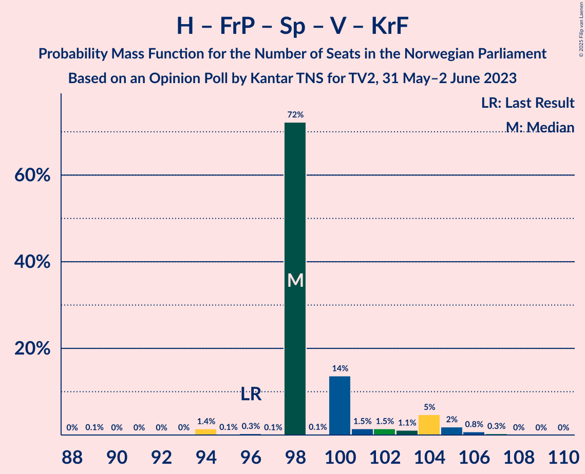
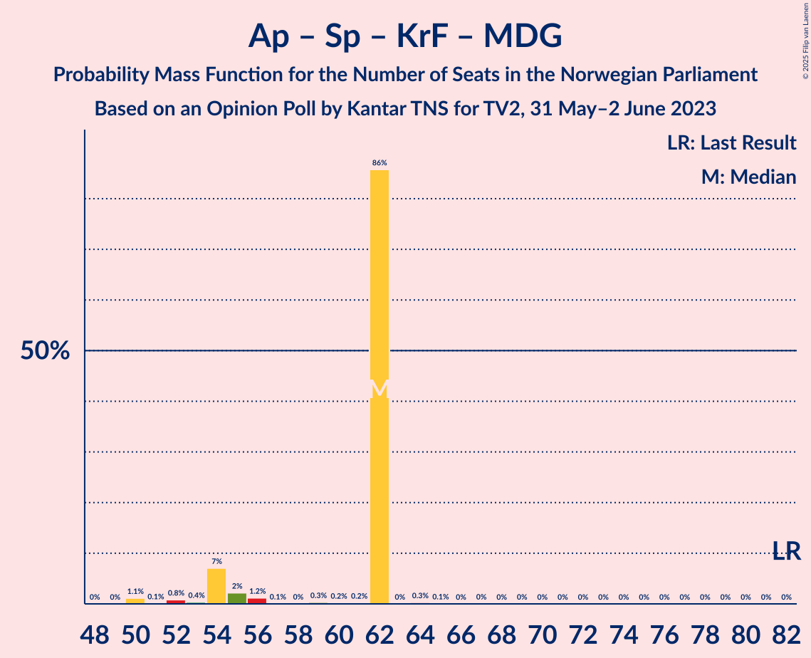

# Opinion Poll by Kantar TNS for TV2, 31 May–2 June 2023

<a href="#voting-intentions">Voting Intentions</a> | <a href="#seats">Seats</a> | <a href="#coalitions">Coalitions</a> | <a href="#technical-information">Technical Information</a>

## Voting Intentions

### Confidence Intervals

| Party | Last Result | Poll Result | 80% Confidence Interval | 90% Confidence Interval | 95% Confidence Interval | 99% Confidence Interval |
|:-----:|:-----------:|:-----------:|:-----------------------:|:-----------------------:|:-----------------------:|:-----------------------:|
| Høyre | 20.4% | 31.7% | 29.8–33.7% |29.3–34.2% |28.9–34.7% |28.0–35.6% |
| Arbeiderpartiet | 26.2% | 18.0% | 16.5–19.6% |16.1–20.1% |15.7–20.5% |15.0–21.3% |
| Fremskrittspartiet | 11.6% | 11.4% | 10.2–12.8% |9.8–13.2% |9.5–13.5% |9.0–14.2% |
| Sosialistisk Venstreparti | 7.6% | 8.2% | 7.2–9.5% |6.9–9.8% |6.7–10.1% |6.2–10.7% |
| Rødt | 4.7% | 7.2% | 6.2–8.4% |6.0–8.7% |5.8–9.0% |5.3–9.6% |
| Senterpartiet | 13.5% | 6.5% | 5.6–7.6% |5.3–7.9% |5.1–8.2% |4.7–8.8% |
| Venstre | 4.6% | 4.5% | 3.7–5.4% |3.5–5.7% |3.3–6.0% |3.0–6.4% |
| Kristelig Folkeparti | 3.8% | 4.1% | 3.4–5.0% |3.2–5.3% |3.0–5.5% |2.7–6.0% |
| Miljøpartiet De Grønne | 3.9% | 3.6% | 2.9–4.4% |2.7–4.7% |2.6–4.9% |2.3–5.4% |
| Industri- og Næringspartiet | 0.3% | 2.3% | 1.8–3.1% |1.7–3.3% |1.6–3.5% |1.3–3.9% |
| Liberalistene | 0.2% | 0.5% | 0.3–0.9% |0.3–1.1% |0.2–1.2% |0.2–1.4% |
| Pensjonistpartiet | 0.6% | 0.5% | 0.3–0.9% |0.3–1.1% |0.2–1.2% |0.2–1.4% |
| Norgesdemokratene | 1.1% | 0.4% | 0.2–0.8% |0.2–0.9% |0.2–1.0% |0.1–1.3% |
| Konservativt | 0.4% | 0.4% | 0.2–0.8% |0.2–0.9% |0.2–1.0% |0.1–1.3% |

*Note:* The poll result column reflects the actual value used in the calculations. Published results may vary slightly, and in addition be rounded to fewer digits.

## Seats

### Confidence Intervals

| Party | Last Result | Median | 80% Confidence Interval | 90% Confidence Interval | 95% Confidence Interval | 99% Confidence Interval |
|:-----:|:-----------:|:------:|:-----------------------:|:-----------------------:|:-----------------------:|:-----------------------:|
| <a href="#høyre">Høyre</a> | 36 | 62 | 55–62 |55–62 |55–62 |53–62 |
| <a href="#arbeiderpartiet">Arbeiderpartiet</a> | 48 | 39 | 35–39 |34–39 |33–39 |31–40 |
| <a href="#fremskrittspartiet">Fremskrittspartiet</a> | 21 | 18 | 18–20 |18–22 |18–23 |18–26 |
| <a href="#sosialistisk-venstreparti">Sosialistisk Venstreparti</a> | 13 | 13 | 13–16 |13–16 |13–16 |12–17 |
| <a href="#rødt">Rødt</a> | 8 | 11 | 10–12 |10–13 |10–15 |10–17 |
| <a href="#senterpartiet">Senterpartiet</a> | 28 | 8 | 8–13 |8–13 |8–13 |8–16 |
| <a href="#venstre">Venstre</a> | 8 | 2 | 2–7 |2–11 |2–11 |2–11 |
| <a href="#kristelig-folkeparti">Kristelig Folkeparti</a> | 3 | 8 | 7–8 |3–8 |2–8 |2–9 |
| <a href="#miljøpartiet-de-grønne">Miljøpartiet De Grønne</a> | 3 | 7 | 3–7 |2–7 |2–7 |1–8 |
| <a href="#industri--og-næringspartiet">Industri- og Næringspartiet</a> | 0 | 0 | 0 |0 |0–2 |0–2 |
| <a href="#liberalistene">Liberalistene</a> | 0 | 0 | 0 |0 |0 |0 |
| <a href="#pensjonistpartiet">Pensjonistpartiet</a> | 0 | 0 | 0 |0 |0 |0 |
| <a href="#norgesdemokratene">Norgesdemokratene</a> | 0 | 0 | 0 |0 |0 |0 |
| <a href="#konservativt">Konservativt</a> | 0 | 0 | 0 |0 |0 |0 |

### Høyre

*For a full overview of the results for this party, see the [Høyre](party-høyre.html) page.*

| Number of Seats | Probability | Accumulated | Special Marks |
|:---------------:|:-----------:|:-----------:|:-------------:|
| 36 | 0% | 100% | Last Result |
| 37 | 0% | 100% |  |
| 38 | 0% | 100% |  |
| 39 | 0% | 100% |  |
| 40 | 0% | 100% |  |
| 41 | 0% | 100% |  |
| 42 | 0% | 100% |  |
| 43 | 0% | 100% |  |
| 44 | 0% | 100% |  |
| 45 | 0% | 100% |  |
| 46 | 0% | 100% |  |
| 47 | 0% | 100% |  |
| 48 | 0.1% | 100% |  |
| 49 | 0.1% | 99.9% |  |
| 50 | 0% | 99.9% |  |
| 51 | 0.1% | 99.9% |  |
| 52 | 0.1% | 99.8% |  |
| 53 | 0.5% | 99.6% |  |
| 54 | 0.2% | 99.1% |  |
| 55 | 19% | 98.9% |  |
| 56 | 0.4% | 80% |  |
| 57 | 2% | 80% |  |
| 58 | 1.5% | 78% |  |
| 59 | 2% | 76% |  |
| 60 | 1.2% | 74% |  |
| 61 | 0% | 73% |  |
| 62 | 72% | 73% | Median |
| 63 | 0% | 0.4% |  |
| 64 | 0.3% | 0.4% |  |
| 65 | 0% | 0.1% |  |
| 66 | 0% | 0% |  |

### Arbeiderpartiet

*For a full overview of the results for this party, see the [Arbeiderpartiet](party-arbeiderpartiet.html) page.*

| Number of Seats | Probability | Accumulated | Special Marks |
|:---------------:|:-----------:|:-----------:|:-------------:|
| 30 | 0.1% | 100% |  |
| 31 | 1.5% | 99.9% |  |
| 32 | 0.2% | 98% |  |
| 33 | 2% | 98% |  |
| 34 | 2% | 96% |  |
| 35 | 15% | 94% |  |
| 36 | 6% | 79% |  |
| 37 | 0.1% | 73% |  |
| 38 | 0.1% | 73% |  |
| 39 | 72% | 73% | Median |
| 40 | 0.3% | 0.6% |  |
| 41 | 0% | 0.3% |  |
| 42 | 0% | 0.3% |  |
| 43 | 0.1% | 0.2% |  |
| 44 | 0.1% | 0.1% |  |
| 45 | 0% | 0% |  |
| 46 | 0% | 0% |  |
| 47 | 0% | 0% |  |
| 48 | 0% | 0% | Last Result |

### Fremskrittspartiet

*For a full overview of the results for this party, see the [Fremskrittspartiet](party-fremskrittspartiet.html) page.*

| Number of Seats | Probability | Accumulated | Special Marks |
|:---------------:|:-----------:|:-----------:|:-------------:|
| 17 | 0.3% | 100% |  |
| 18 | 89% | 99.6% | Median |
| 19 | 0.5% | 11% |  |
| 20 | 1.0% | 10% |  |
| 21 | 2% | 9% | Last Result |
| 22 | 4% | 8% |  |
| 23 | 1.0% | 3% |  |
| 24 | 0.1% | 2% |  |
| 25 | 1.2% | 2% |  |
| 26 | 1.1% | 1.2% |  |
| 27 | 0% | 0% |  |

### Sosialistisk Venstreparti

*For a full overview of the results for this party, see the [Sosialistisk Venstreparti](party-sosialistiskvenstreparti.html) page.*

| Number of Seats | Probability | Accumulated | Special Marks |
|:---------------:|:-----------:|:-----------:|:-------------:|
| 10 | 0.1% | 100% |  |
| 11 | 0.3% | 99.9% |  |
| 12 | 0.8% | 99.6% |  |
| 13 | 73% | 98.9% | Last Result, Median |
| 14 | 6% | 26% |  |
| 15 | 2% | 20% |  |
| 16 | 16% | 18% |  |
| 17 | 2% | 2% |  |
| 18 | 0.1% | 0.2% |  |
| 19 | 0% | 0.1% |  |
| 20 | 0% | 0% |  |

### Rødt

*For a full overview of the results for this party, see the [Rødt](party-rødt.html) page.*

| Number of Seats | Probability | Accumulated | Special Marks |
|:---------------:|:-----------:|:-----------:|:-------------:|
| 8 | 0% | 100% | Last Result |
| 9 | 0.1% | 100% |  |
| 10 | 14% | 99.9% |  |
| 11 | 75% | 86% | Median |
| 12 | 6% | 11% |  |
| 13 | 2% | 5% |  |
| 14 | 0.4% | 4% |  |
| 15 | 2% | 3% |  |
| 16 | 0.1% | 1.3% |  |
| 17 | 1.1% | 1.2% |  |
| 18 | 0% | 0% |  |

### Senterpartiet

*For a full overview of the results for this party, see the [Senterpartiet](party-senterpartiet.html) page.*

| Number of Seats | Probability | Accumulated | Special Marks |
|:---------------:|:-----------:|:-----------:|:-------------:|
| 8 | 72% | 100% | Median |
| 9 | 4% | 28% |  |
| 10 | 2% | 24% |  |
| 11 | 2% | 21% |  |
| 12 | 2% | 19% |  |
| 13 | 15% | 17% |  |
| 14 | 1.1% | 2% |  |
| 15 | 0.1% | 0.9% |  |
| 16 | 0.8% | 0.8% |  |
| 17 | 0% | 0% |  |
| 18 | 0% | 0% |  |
| 19 | 0% | 0% |  |
| 20 | 0% | 0% |  |
| 21 | 0% | 0% |  |
| 22 | 0% | 0% |  |
| 23 | 0% | 0% |  |
| 24 | 0% | 0% |  |
| 25 | 0% | 0% |  |
| 26 | 0% | 0% |  |
| 27 | 0% | 0% |  |
| 28 | 0% | 0% | Last Result |

### Venstre

*For a full overview of the results for this party, see the [Venstre](party-venstre.html) page.*

| Number of Seats | Probability | Accumulated | Special Marks |
|:---------------:|:-----------:|:-----------:|:-------------:|
| 2 | 76% | 100% | Median |
| 3 | 0.5% | 24% |  |
| 4 | 0% | 23% |  |
| 5 | 0% | 23% |  |
| 6 | 0% | 23% |  |
| 7 | 14% | 23% |  |
| 8 | 2% | 9% | Last Result |
| 9 | 0.4% | 7% |  |
| 10 | 0.4% | 6% |  |
| 11 | 6% | 6% |  |
| 12 | 0% | 0% |  |

### Kristelig Folkeparti

*For a full overview of the results for this party, see the [Kristelig Folkeparti](party-kristeligfolkeparti.html) page.*

| Number of Seats | Probability | Accumulated | Special Marks |
|:---------------:|:-----------:|:-----------:|:-------------:|
| 1 | 0.5% | 100% |  |
| 2 | 3% | 99.5% |  |
| 3 | 3% | 97% | Last Result |
| 4 | 0% | 94% |  |
| 5 | 0% | 94% |  |
| 6 | 0% | 94% |  |
| 7 | 18% | 94% |  |
| 8 | 75% | 76% | Median |
| 9 | 0.5% | 0.9% |  |
| 10 | 0.4% | 0.4% |  |
| 11 | 0% | 0% |  |

### Miljøpartiet De Grønne

*For a full overview of the results for this party, see the [Miljøpartiet De Grønne](party-miljøpartietdegrønne.html) page.*

| Number of Seats | Probability | Accumulated | Special Marks |
|:---------------:|:-----------:|:-----------:|:-------------:|
| 1 | 2% | 100% |  |
| 2 | 7% | 98% |  |
| 3 | 1.1% | 90% | Last Result |
| 4 | 0% | 89% |  |
| 5 | 0% | 89% |  |
| 6 | 0% | 89% |  |
| 7 | 87% | 89% | Median |
| 8 | 1.4% | 2% |  |
| 9 | 0.3% | 0.3% |  |
| 10 | 0% | 0% |  |

### Industri- og Næringspartiet

*For a full overview of the results for this party, see the [Industri- og Næringspartiet](party-industri-ognæringspartiet.html) page.*

| Number of Seats | Probability | Accumulated | Special Marks |
|:---------------:|:-----------:|:-----------:|:-------------:|
| 0 | 97% | 100% | Last Result, Median |
| 1 | 0.3% | 3% |  |
| 2 | 2% | 3% |  |
| 3 | 0.2% | 0.2% |  |
| 4 | 0% | 0% |  |

### Liberalistene

*For a full overview of the results for this party, see the [Liberalistene](party-liberalistene.html) page.*

| Number of Seats | Probability | Accumulated | Special Marks |
|:---------------:|:-----------:|:-----------:|:-------------:|
| 0 | 100% | 100% | Last Result, Median |

### Pensjonistpartiet

*For a full overview of the results for this party, see the [Pensjonistpartiet](party-pensjonistpartiet.html) page.*

| Number of Seats | Probability | Accumulated | Special Marks |
|:---------------:|:-----------:|:-----------:|:-------------:|
| 0 | 100% | 100% | Last Result, Median |

### Norgesdemokratene

*For a full overview of the results for this party, see the [Norgesdemokratene](party-norgesdemokratene.html) page.*

| Number of Seats | Probability | Accumulated | Special Marks |
|:---------------:|:-----------:|:-----------:|:-------------:|
| 0 | 100% | 100% | Last Result, Median |

### Konservativt

*For a full overview of the results for this party, see the [Konservativt](party-konservativt.html) page.*

| Number of Seats | Probability | Accumulated | Special Marks |
|:---------------:|:-----------:|:-----------:|:-------------:|
| 0 | 100% | 100% | Last Result, Median |

## Coalitions

### Confidence Intervals

| Coalition | Last Result | Median | Majority? | 80% Confidence Interval | 90% Confidence Interval | 95% Confidence Interval | 99% Confidence Interval |
|:---------:|:-----------:|:------:|:---------:|:-----------------------:|:-----------------------:|:-----------------------:|:-----------------------:|
| Høyre – Fremskrittspartiet – Senterpartiet – Venstre – Kristelig Folkeparti | 96 | 98 | 100% | 98–102 | 98–104 | 98–105 | 94–106 |
| Høyre – Fremskrittspartiet – Venstre – Kristelig Folkeparti – Miljøpartiet De Grønne | 71 | 97 | 99.8% | 94–97 | 92–97 | 91–97 | 88–98 |
| Høyre – Fremskrittspartiet – Venstre – Kristelig Folkeparti | 68 | 90 | 98% | 87–90 | 87–95 | 86–95 | 84–96 |
| Høyre – Fremskrittspartiet – Venstre | 65 | 82 | 11% | 80–86 | 80–88 | 80–88 | 77–88 |
| Høyre – Fremskrittspartiet | 57 | 80 | 1.2% | 73–80 | 73–80 | 73–84 | 71–85 |
| Arbeiderpartiet – Sosialistisk Venstreparti – Rødt – Senterpartiet – Miljøpartiet De Grønne | 100 | 78 | 0.3% | 78–81 | 73–81 | 73–81 | 72–83 |
| Arbeiderpartiet – Sosialistisk Venstreparti – Senterpartiet – Kristelig Folkeparti – Miljøpartiet De Grønne | 95 | 75 | 0% | 70–78 | 68–78 | 67–78 | 65–78 |
| Arbeiderpartiet – Sosialistisk Venstreparti – Rødt – Senterpartiet | 97 | 71 | 0% | 71–74 | 71–75 | 71–76 | 70–79 |
| Høyre – Venstre – Kristelig Folkeparti | 47 | 72 | 0% | 69–72 | 66–73 | 63–76 | 63–78 |
| Arbeiderpartiet – Sosialistisk Venstreparti – Senterpartiet – Miljøpartiet De Grønne | 92 | 67 | 0% | 66–71 | 61–71 | 61–71 | 59–71 |
| Arbeiderpartiet – Sosialistisk Venstreparti – Rødt – Miljøpartiet De Grønne | 72 | 70 | 0% | 66–70 | 64–70 | 63–70 | 62–72 |
| Arbeiderpartiet – Sosialistisk Venstreparti – Senterpartiet | 89 | 60 | 0% | 60–64 | 59–64 | 59–64 | 57–65 |
| Arbeiderpartiet – Senterpartiet – Kristelig Folkeparti – Miljøpartiet De Grønne | 82 | 62 | 0% | 55–62 | 54–62 | 54–62 | 50–62 |
| Arbeiderpartiet – Senterpartiet – Kristelig Folkeparti | 79 | 55 | 0% | 53–55 | 51–55 | 48–55 | 46–58 |
| Arbeiderpartiet – Sosialistisk Venstreparti | 61 | 52 | 0% | 50–52 | 49–52 | 47–52 | 47–54 |
| Arbeiderpartiet – Senterpartiet | 76 | 47 | 0% | 46–48 | 45–48 | 45–48 | 43–51 |
| Senterpartiet – Venstre – Kristelig Folkeparti | 39 | 18 | 0% | 18–27 | 18–27 | 17–28 | 14–30 |

### Høyre – Fremskrittspartiet – Senterpartiet – Venstre – Kristelig Folkeparti

| Number of Seats | Probability | Accumulated | Special Marks |
|:---------------:|:-----------:|:-----------:|:-------------:|
| 89 | 0.1% | 100% |  |
| 90 | 0% | 99.9% |  |
| 91 | 0% | 99.9% |  |
| 92 | 0% | 99.9% |  |
| 93 | 0% | 99.9% |  |
| 94 | 1.4% | 99.9% |  |
| 95 | 0.1% | 98% |  |
| 96 | 0.3% | 98% | Last Result |
| 97 | 0.1% | 98% |  |
| 98 | 72% | 98% | Median |
| 99 | 0.1% | 26% |  |
| 100 | 14% | 26% |  |
| 101 | 1.5% | 12% |  |
| 102 | 1.5% | 10% |  |
| 103 | 1.1% | 9% |  |
| 104 | 5% | 8% |  |
| 105 | 2% | 3% |  |
| 106 | 0.8% | 1.2% |  |
| 107 | 0.3% | 0.4% |  |
| 108 | 0% | 0.1% |  |
| 109 | 0% | 0% |  |

### Høyre – Fremskrittspartiet – Venstre – Kristelig Folkeparti – Miljøpartiet De Grønne

| Number of Seats | Probability | Accumulated | Special Marks |
|:---------------:|:-----------:|:-----------:|:-------------:|
| 71 | 0% | 100% | Last Result |
| 72 | 0% | 100% |  |
| 73 | 0% | 100% |  |
| 74 | 0% | 100% |  |
| 75 | 0% | 100% |  |
| 76 | 0% | 100% |  |
| 77 | 0% | 100% |  |
| 78 | 0% | 100% |  |
| 79 | 0% | 100% |  |
| 80 | 0% | 100% |  |
| 81 | 0% | 100% |  |
| 82 | 0% | 100% |  |
| 83 | 0% | 100% |  |
| 84 | 0.2% | 100% |  |
| 85 | 0% | 99.8% | Majority |
| 86 | 0% | 99.8% |  |
| 87 | 0.1% | 99.8% |  |
| 88 | 0.2% | 99.7% |  |
| 89 | 0.1% | 99.5% |  |
| 90 | 0.5% | 99.4% |  |
| 91 | 3% | 98.8% |  |
| 92 | 1.4% | 96% |  |
| 93 | 0.5% | 95% |  |
| 94 | 14% | 94% |  |
| 95 | 2% | 80% |  |
| 96 | 0.1% | 78% |  |
| 97 | 77% | 78% | Median |
| 98 | 1.0% | 1.2% |  |
| 99 | 0% | 0.2% |  |
| 100 | 0.1% | 0.2% |  |
| 101 | 0% | 0.1% |  |
| 102 | 0.1% | 0.1% |  |
| 103 | 0% | 0% |  |

### Høyre – Fremskrittspartiet – Venstre – Kristelig Folkeparti

| Number of Seats | Probability | Accumulated | Special Marks |
|:---------------:|:-----------:|:-----------:|:-------------:|
| 68 | 0% | 100% | Last Result |
| 69 | 0% | 100% |  |
| 70 | 0% | 100% |  |
| 71 | 0% | 100% |  |
| 72 | 0% | 100% |  |
| 73 | 0% | 100% |  |
| 74 | 0% | 100% |  |
| 75 | 0% | 100% |  |
| 76 | 0% | 100% |  |
| 77 | 0% | 100% |  |
| 78 | 0% | 100% |  |
| 79 | 0.1% | 100% |  |
| 80 | 0% | 99.9% |  |
| 81 | 0% | 99.9% |  |
| 82 | 0.3% | 99.9% |  |
| 83 | 0% | 99.6% |  |
| 84 | 1.3% | 99.6% |  |
| 85 | 0.3% | 98% | Majority |
| 86 | 0.6% | 98% |  |
| 87 | 14% | 97% |  |
| 88 | 0.6% | 84% |  |
| 89 | 3% | 83% |  |
| 90 | 72% | 80% | Median |
| 91 | 0.1% | 7% |  |
| 92 | 0.3% | 7% |  |
| 93 | 0.2% | 7% |  |
| 94 | 2% | 7% |  |
| 95 | 4% | 5% |  |
| 96 | 0.9% | 1.0% |  |
| 97 | 0% | 0.1% |  |
| 98 | 0% | 0% |  |

### Høyre – Fremskrittspartiet – Venstre

| Number of Seats | Probability | Accumulated | Special Marks |
|:---------------:|:-----------:|:-----------:|:-------------:|
| 65 | 0% | 100% | Last Result |
| 66 | 0% | 100% |  |
| 67 | 0% | 100% |  |
| 68 | 0% | 100% |  |
| 69 | 0% | 100% |  |
| 70 | 0% | 100% |  |
| 71 | 0% | 100% |  |
| 72 | 0% | 100% |  |
| 73 | 0% | 100% |  |
| 74 | 0% | 100% |  |
| 75 | 0.1% | 100% |  |
| 76 | 0.4% | 99.9% |  |
| 77 | 0.3% | 99.5% |  |
| 78 | 0.2% | 99.2% |  |
| 79 | 0.3% | 99.0% |  |
| 80 | 14% | 98.8% |  |
| 81 | 0.1% | 85% |  |
| 82 | 73% | 85% | Median |
| 83 | 0.2% | 12% |  |
| 84 | 0% | 11% |  |
| 85 | 0.3% | 11% | Majority |
| 86 | 4% | 11% |  |
| 87 | 2% | 7% |  |
| 88 | 5% | 5% |  |
| 89 | 0% | 0.2% |  |
| 90 | 0.1% | 0.2% |  |
| 91 | 0% | 0.1% |  |
| 92 | 0% | 0.1% |  |
| 93 | 0% | 0% |  |

### Høyre – Fremskrittspartiet

| Number of Seats | Probability | Accumulated | Special Marks |
|:---------------:|:-----------:|:-----------:|:-------------:|
| 57 | 0% | 100% | Last Result |
| 58 | 0% | 100% |  |
| 59 | 0% | 100% |  |
| 60 | 0% | 100% |  |
| 61 | 0% | 100% |  |
| 62 | 0% | 100% |  |
| 63 | 0% | 100% |  |
| 64 | 0% | 100% |  |
| 65 | 0% | 100% |  |
| 66 | 0% | 100% |  |
| 67 | 0% | 100% |  |
| 68 | 0% | 100% |  |
| 69 | 0% | 99.9% |  |
| 70 | 0.3% | 99.9% |  |
| 71 | 0.2% | 99.6% |  |
| 72 | 0.2% | 99.4% |  |
| 73 | 14% | 99.2% |  |
| 74 | 0.4% | 85% |  |
| 75 | 2% | 85% |  |
| 76 | 0.1% | 83% |  |
| 77 | 4% | 83% |  |
| 78 | 1.3% | 79% |  |
| 79 | 0.6% | 77% |  |
| 80 | 74% | 77% | Median |
| 81 | 0.1% | 3% |  |
| 82 | 0% | 3% |  |
| 83 | 0% | 3% |  |
| 84 | 1.5% | 3% |  |
| 85 | 1.2% | 1.2% | Majority |
| 86 | 0% | 0% |  |

### Arbeiderpartiet – Sosialistisk Venstreparti – Rødt – Senterpartiet – Miljøpartiet De Grønne

| Number of Seats | Probability | Accumulated | Special Marks |
|:---------------:|:-----------:|:-----------:|:-------------:|
| 70 | 0% | 100% |  |
| 71 | 0% | 99.9% |  |
| 72 | 1.0% | 99.9% |  |
| 73 | 4% | 99.0% |  |
| 74 | 2% | 95% |  |
| 75 | 0.3% | 93% |  |
| 76 | 0.5% | 93% |  |
| 77 | 0.1% | 92% |  |
| 78 | 73% | 92% | Median |
| 79 | 3% | 20% |  |
| 80 | 0.1% | 16% |  |
| 81 | 14% | 16% |  |
| 82 | 2% | 2% |  |
| 83 | 0.3% | 0.7% |  |
| 84 | 0.1% | 0.4% |  |
| 85 | 0% | 0.3% | Majority |
| 86 | 0.2% | 0.3% |  |
| 87 | 0% | 0.1% |  |
| 88 | 0% | 0.1% |  |
| 89 | 0.1% | 0.1% |  |
| 90 | 0% | 0% |  |
| 91 | 0% | 0% |  |
| 92 | 0% | 0% |  |
| 93 | 0% | 0% |  |
| 94 | 0% | 0% |  |
| 95 | 0% | 0% |  |
| 96 | 0% | 0% |  |
| 97 | 0% | 0% |  |
| 98 | 0% | 0% |  |
| 99 | 0% | 0% |  |
| 100 | 0% | 0% | Last Result |

### Arbeiderpartiet – Sosialistisk Venstreparti – Senterpartiet – Kristelig Folkeparti – Miljøpartiet De Grønne

| Number of Seats | Probability | Accumulated | Special Marks |
|:---------------:|:-----------:|:-----------:|:-------------:|
| 62 | 0.1% | 100% |  |
| 63 | 0% | 99.9% |  |
| 64 | 0% | 99.9% |  |
| 65 | 1.2% | 99.9% |  |
| 66 | 0.3% | 98.7% |  |
| 67 | 1.2% | 98% |  |
| 68 | 4% | 97% |  |
| 69 | 3% | 93% |  |
| 70 | 1.4% | 91% |  |
| 71 | 2% | 89% |  |
| 72 | 0.5% | 87% |  |
| 73 | 0.1% | 87% |  |
| 74 | 0.1% | 87% |  |
| 75 | 72% | 87% | Median |
| 76 | 0.5% | 15% |  |
| 77 | 0% | 14% |  |
| 78 | 14% | 14% |  |
| 79 | 0.3% | 0.3% |  |
| 80 | 0% | 0% |  |
| 81 | 0% | 0% |  |
| 82 | 0% | 0% |  |
| 83 | 0% | 0% |  |
| 84 | 0% | 0% |  |
| 85 | 0% | 0% | Majority |
| 86 | 0% | 0% |  |
| 87 | 0% | 0% |  |
| 88 | 0% | 0% |  |
| 89 | 0% | 0% |  |
| 90 | 0% | 0% |  |
| 91 | 0% | 0% |  |
| 92 | 0% | 0% |  |
| 93 | 0% | 0% |  |
| 94 | 0% | 0% |  |
| 95 | 0% | 0% | Last Result |

### Arbeiderpartiet – Sosialistisk Venstreparti – Rødt – Senterpartiet

| Number of Seats | Probability | Accumulated | Special Marks |
|:---------------:|:-----------:|:-----------:|:-------------:|
| 66 | 0.1% | 100% |  |
| 67 | 0% | 99.9% |  |
| 68 | 0.1% | 99.8% |  |
| 69 | 0% | 99.8% |  |
| 70 | 1.0% | 99.7% |  |
| 71 | 77% | 98.7% | Median |
| 72 | 0.1% | 22% |  |
| 73 | 2% | 22% |  |
| 74 | 14% | 20% |  |
| 75 | 2% | 5% |  |
| 76 | 2% | 4% |  |
| 77 | 1.4% | 2% |  |
| 78 | 0% | 0.6% |  |
| 79 | 0.1% | 0.6% |  |
| 80 | 0.2% | 0.5% |  |
| 81 | 0.1% | 0.3% |  |
| 82 | 0% | 0.2% |  |
| 83 | 0% | 0.2% |  |
| 84 | 0.1% | 0.2% |  |
| 85 | 0% | 0% | Majority |
| 86 | 0% | 0% |  |
| 87 | 0% | 0% |  |
| 88 | 0% | 0% |  |
| 89 | 0% | 0% |  |
| 90 | 0% | 0% |  |
| 91 | 0% | 0% |  |
| 92 | 0% | 0% |  |
| 93 | 0% | 0% |  |
| 94 | 0% | 0% |  |
| 95 | 0% | 0% |  |
| 96 | 0% | 0% |  |
| 97 | 0% | 0% | Last Result |

### Høyre – Venstre – Kristelig Folkeparti

| Number of Seats | Probability | Accumulated | Special Marks |
|:---------------:|:-----------:|:-----------:|:-------------:|
| 47 | 0% | 100% | Last Result |
| 48 | 0% | 100% |  |
| 49 | 0% | 100% |  |
| 50 | 0% | 100% |  |
| 51 | 0% | 100% |  |
| 52 | 0% | 100% |  |
| 53 | 0% | 100% |  |
| 54 | 0% | 100% |  |
| 55 | 0% | 100% |  |
| 56 | 0% | 100% |  |
| 57 | 0.1% | 100% |  |
| 58 | 0% | 99.9% |  |
| 59 | 0% | 99.9% |  |
| 60 | 0% | 99.9% |  |
| 61 | 0% | 99.9% |  |
| 62 | 0.1% | 99.9% |  |
| 63 | 2% | 99.8% |  |
| 64 | 1.3% | 97% |  |
| 65 | 0.1% | 96% |  |
| 66 | 1.0% | 96% |  |
| 67 | 0.1% | 95% |  |
| 68 | 1.3% | 95% |  |
| 69 | 14% | 94% |  |
| 70 | 0.1% | 80% |  |
| 71 | 0.5% | 79% |  |
| 72 | 72% | 79% | Median |
| 73 | 4% | 7% |  |
| 74 | 0.1% | 3% |  |
| 75 | 0% | 3% |  |
| 76 | 2% | 3% |  |
| 77 | 0% | 0.7% |  |
| 78 | 0.6% | 0.6% |  |
| 79 | 0% | 0% |  |

### Arbeiderpartiet – Sosialistisk Venstreparti – Senterpartiet – Miljøpartiet De Grønne

| Number of Seats | Probability | Accumulated | Special Marks |
|:---------------:|:-----------:|:-----------:|:-------------:|
| 59 | 0.7% | 100% |  |
| 60 | 0.3% | 99.2% |  |
| 61 | 4% | 98.9% |  |
| 62 | 1.3% | 95% |  |
| 63 | 2% | 94% |  |
| 64 | 0.6% | 91% |  |
| 65 | 0.2% | 91% |  |
| 66 | 2% | 91% |  |
| 67 | 73% | 89% | Median |
| 68 | 1.2% | 16% |  |
| 69 | 0.1% | 14% |  |
| 70 | 0% | 14% |  |
| 71 | 14% | 14% |  |
| 72 | 0.1% | 0.4% |  |
| 73 | 0.2% | 0.3% |  |
| 74 | 0% | 0.1% |  |
| 75 | 0.1% | 0.1% |  |
| 76 | 0% | 0% |  |
| 77 | 0% | 0% |  |
| 78 | 0% | 0% |  |
| 79 | 0% | 0% |  |
| 80 | 0% | 0% |  |
| 81 | 0% | 0% |  |
| 82 | 0% | 0% |  |
| 83 | 0% | 0% |  |
| 84 | 0% | 0% |  |
| 85 | 0% | 0% | Majority |
| 86 | 0% | 0% |  |
| 87 | 0% | 0% |  |
| 88 | 0% | 0% |  |
| 89 | 0% | 0% |  |
| 90 | 0% | 0% |  |
| 91 | 0% | 0% |  |
| 92 | 0% | 0% | Last Result |

### Arbeiderpartiet – Sosialistisk Venstreparti – Rødt – Miljøpartiet De Grønne

| Number of Seats | Probability | Accumulated | Special Marks |
|:---------------:|:-----------:|:-----------:|:-------------:|
| 59 | 0% | 100% |  |
| 60 | 0.1% | 99.9% |  |
| 61 | 0.3% | 99.9% |  |
| 62 | 1.3% | 99.5% |  |
| 63 | 2% | 98% |  |
| 64 | 4% | 96% |  |
| 65 | 1.1% | 92% |  |
| 66 | 1.4% | 91% |  |
| 67 | 1.5% | 90% |  |
| 68 | 14% | 88% |  |
| 69 | 0.1% | 74% |  |
| 70 | 72% | 74% | Median |
| 71 | 0.4% | 2% |  |
| 72 | 1.3% | 2% | Last Result |
| 73 | 0.1% | 0.3% |  |
| 74 | 0.1% | 0.2% |  |
| 75 | 0% | 0.1% |  |
| 76 | 0% | 0.1% |  |
| 77 | 0% | 0.1% |  |
| 78 | 0% | 0.1% |  |
| 79 | 0.1% | 0.1% |  |
| 80 | 0% | 0% |  |

### Arbeiderpartiet – Sosialistisk Venstreparti – Senterpartiet

| Number of Seats | Probability | Accumulated | Special Marks |
|:---------------:|:-----------:|:-----------:|:-------------:|
| 54 | 0.1% | 100% |  |
| 55 | 0% | 99.9% |  |
| 56 | 0% | 99.8% |  |
| 57 | 0.7% | 99.8% |  |
| 58 | 0.5% | 99.1% |  |
| 59 | 4% | 98.7% |  |
| 60 | 75% | 94% | Median |
| 61 | 0.2% | 19% |  |
| 62 | 2% | 19% |  |
| 63 | 1.3% | 16% |  |
| 64 | 15% | 15% |  |
| 65 | 0.2% | 0.6% |  |
| 66 | 0% | 0.3% |  |
| 67 | 0.1% | 0.3% |  |
| 68 | 0% | 0.2% |  |
| 69 | 0% | 0.2% |  |
| 70 | 0% | 0.2% |  |
| 71 | 0.1% | 0.1% |  |
| 72 | 0% | 0% |  |
| 73 | 0% | 0% |  |
| 74 | 0% | 0% |  |
| 75 | 0% | 0% |  |
| 76 | 0% | 0% |  |
| 77 | 0% | 0% |  |
| 78 | 0% | 0% |  |
| 79 | 0% | 0% |  |
| 80 | 0% | 0% |  |
| 81 | 0% | 0% |  |
| 82 | 0% | 0% |  |
| 83 | 0% | 0% |  |
| 84 | 0% | 0% |  |
| 85 | 0% | 0% | Majority |
| 86 | 0% | 0% |  |
| 87 | 0% | 0% |  |
| 88 | 0% | 0% |  |
| 89 | 0% | 0% | Last Result |

### Arbeiderpartiet – Senterpartiet – Kristelig Folkeparti – Miljøpartiet De Grønne

| Number of Seats | Probability | Accumulated | Special Marks |
|:---------------:|:-----------:|:-----------:|:-------------:|
| 49 | 0% | 100% |  |
| 50 | 1.1% | 99.9% |  |
| 51 | 0.1% | 98.8% |  |
| 52 | 0.8% | 98.7% |  |
| 53 | 0.4% | 98% |  |
| 54 | 7% | 98% |  |
| 55 | 2% | 90% |  |
| 56 | 1.2% | 88% |  |
| 57 | 0.1% | 87% |  |
| 58 | 0% | 87% |  |
| 59 | 0.3% | 87% |  |
| 60 | 0.2% | 87% |  |
| 61 | 0.2% | 86% |  |
| 62 | 86% | 86% | Median |
| 63 | 0% | 0.5% |  |
| 64 | 0.3% | 0.4% |  |
| 65 | 0.1% | 0.1% |  |
| 66 | 0% | 0.1% |  |
| 67 | 0% | 0.1% |  |
| 68 | 0% | 0% |  |
| 69 | 0% | 0% |  |
| 70 | 0% | 0% |  |
| 71 | 0% | 0% |  |
| 72 | 0% | 0% |  |
| 73 | 0% | 0% |  |
| 74 | 0% | 0% |  |
| 75 | 0% | 0% |  |
| 76 | 0% | 0% |  |
| 77 | 0% | 0% |  |
| 78 | 0% | 0% |  |
| 79 | 0% | 0% |  |
| 80 | 0% | 0% |  |
| 81 | 0% | 0% |  |
| 82 | 0% | 0% | Last Result |

### Arbeiderpartiet – Senterpartiet – Kristelig Folkeparti

| Number of Seats | Probability | Accumulated | Special Marks |
|:---------------:|:-----------:|:-----------:|:-------------:|
| 46 | 1.2% | 100% |  |
| 47 | 0% | 98.8% |  |
| 48 | 3% | 98.7% |  |
| 49 | 0.1% | 96% |  |
| 50 | 0.9% | 96% |  |
| 51 | 0.5% | 95% |  |
| 52 | 4% | 95% |  |
| 53 | 4% | 91% |  |
| 54 | 0.1% | 87% |  |
| 55 | 86% | 87% | Median |
| 56 | 0.1% | 1.0% |  |
| 57 | 0.4% | 0.9% |  |
| 58 | 0.3% | 0.5% |  |
| 59 | 0.2% | 0.2% |  |
| 60 | 0% | 0% |  |
| 61 | 0% | 0% |  |
| 62 | 0% | 0% |  |
| 63 | 0% | 0% |  |
| 64 | 0% | 0% |  |
| 65 | 0% | 0% |  |
| 66 | 0% | 0% |  |
| 67 | 0% | 0% |  |
| 68 | 0% | 0% |  |
| 69 | 0% | 0% |  |
| 70 | 0% | 0% |  |
| 71 | 0% | 0% |  |
| 72 | 0% | 0% |  |
| 73 | 0% | 0% |  |
| 74 | 0% | 0% |  |
| 75 | 0% | 0% |  |
| 76 | 0% | 0% |  |
| 77 | 0% | 0% |  |
| 78 | 0% | 0% |  |
| 79 | 0% | 0% | Last Result |

### Arbeiderpartiet – Sosialistisk Venstreparti

| Number of Seats | Probability | Accumulated | Special Marks |
|:---------------:|:-----------:|:-----------:|:-------------:|
| 44 | 0.1% | 100% |  |
| 45 | 0.1% | 99.9% |  |
| 46 | 0.1% | 99.8% |  |
| 47 | 2% | 99.7% |  |
| 48 | 2% | 97% |  |
| 49 | 2% | 96% |  |
| 50 | 6% | 94% |  |
| 51 | 16% | 88% |  |
| 52 | 72% | 73% | Median |
| 53 | 0.2% | 0.7% |  |
| 54 | 0.3% | 0.5% |  |
| 55 | 0% | 0.3% |  |
| 56 | 0% | 0.3% |  |
| 57 | 0.1% | 0.2% |  |
| 58 | 0% | 0.2% |  |
| 59 | 0.1% | 0.2% |  |
| 60 | 0% | 0% |  |
| 61 | 0% | 0% | Last Result |

### Arbeiderpartiet – Senterpartiet

| Number of Seats | Probability | Accumulated | Special Marks |
|:---------------:|:-----------:|:-----------:|:-------------:|
| 41 | 0% | 100% |  |
| 42 | 0.4% | 99.9% |  |
| 43 | 0.2% | 99.6% |  |
| 44 | 1.2% | 99.4% |  |
| 45 | 8% | 98% |  |
| 46 | 2% | 90% |  |
| 47 | 72% | 89% | Median |
| 48 | 14% | 16% |  |
| 49 | 0.9% | 2% |  |
| 50 | 1.0% | 1.5% |  |
| 51 | 0.2% | 0.5% |  |
| 52 | 0% | 0.3% |  |
| 53 | 0% | 0.3% |  |
| 54 | 0.1% | 0.2% |  |
| 55 | 0.1% | 0.1% |  |
| 56 | 0% | 0% |  |
| 57 | 0% | 0% |  |
| 58 | 0% | 0% |  |
| 59 | 0% | 0% |  |
| 60 | 0% | 0% |  |
| 61 | 0% | 0% |  |
| 62 | 0% | 0% |  |
| 63 | 0% | 0% |  |
| 64 | 0% | 0% |  |
| 65 | 0% | 0% |  |
| 66 | 0% | 0% |  |
| 67 | 0% | 0% |  |
| 68 | 0% | 0% |  |
| 69 | 0% | 0% |  |
| 70 | 0% | 0% |  |
| 71 | 0% | 0% |  |
| 72 | 0% | 0% |  |
| 73 | 0% | 0% |  |
| 74 | 0% | 0% |  |
| 75 | 0% | 0% |  |
| 76 | 0% | 0% | Last Result |

### Senterpartiet – Venstre – Kristelig Folkeparti

| Number of Seats | Probability | Accumulated | Special Marks |
|:---------------:|:-----------:|:-----------:|:-------------:|
| 14 | 1.3% | 100% |  |
| 15 | 0.1% | 98.7% |  |
| 16 | 0% | 98.6% |  |
| 17 | 2% | 98.6% |  |
| 18 | 72% | 96% | Median |
| 19 | 0.1% | 24% |  |
| 20 | 0.3% | 24% |  |
| 21 | 0.1% | 24% |  |
| 22 | 0.5% | 24% |  |
| 23 | 0.5% | 24% |  |
| 24 | 0.2% | 23% |  |
| 25 | 2% | 23% |  |
| 26 | 0.7% | 21% |  |
| 27 | 18% | 20% |  |
| 28 | 0.2% | 3% |  |
| 29 | 0.1% | 2% |  |
| 30 | 2% | 2% |  |
| 31 | 0.3% | 0.4% |  |
| 32 | 0.1% | 0.1% |  |
| 33 | 0% | 0% |  |
| 34 | 0% | 0% |  |
| 35 | 0% | 0% |  |
| 36 | 0% | 0% |  |
| 37 | 0% | 0% |  |
| 38 | 0% | 0% |  |
| 39 | 0% | 0% | Last Result |

## Technical Information

### Opinion Poll

+ **Polling firm:** Kantar TNS
+ **Commissioner(s):** TV2
+ **Fieldwork period:** 31 May–2 June 2023

### Calculations

+ **Sample size:** 984
+ **Simulations done:** 1,048,576
+ **Error estimate:** 2.07%

