# Opinion Poll by InFact for Nettavisen, 5 June 2023

<a href="#voting-intentions">Voting Intentions</a> | <a href="#seats">Seats</a> | <a href="#coalitions">Coalitions</a> | <a href="#technical-information">Technical Information</a>

## Voting Intentions

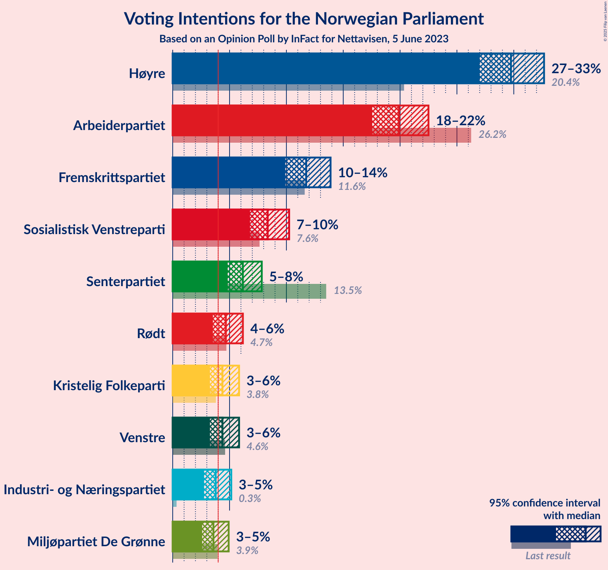

### Confidence Intervals

| Party | Last Result | Poll Result | 80% Confidence Interval | 90% Confidence Interval | 95% Confidence Interval | 99% Confidence Interval |
|:-----:|:-----------:|:-----------:|:-----------------------:|:-----------------------:|:-----------------------:|:-----------------------:|
| Høyre | 20.4% | 29.8% | 28.0–31.7% |27.4–32.2% |27.0–32.7% |26.2–33.6% |
| Arbeiderpartiet | 26.2% | 19.9% | 18.4–21.6% |17.9–22.1% |17.5–22.5% |16.8–23.3% |
| Fremskrittspartiet | 11.6% | 11.7% | 10.5–13.1% |10.2–13.5% |9.9–13.9% |9.3–14.6% |
| Sosialistisk Venstreparti | 7.6% | 8.4% | 7.3–9.6% |7.0–9.9% |6.8–10.2% |6.3–10.9% |
| Senterpartiet | 13.5% | 6.2% | 5.3–7.3% |5.0–7.6% |4.8–7.8% |4.5–8.4% |
| Rødt | 4.7% | 4.7% | 3.9–5.7% |3.7–5.9% |3.5–6.2% |3.2–6.7% |
| Kristelig Folkeparti | 3.8% | 4.4% | 3.6–5.3% |3.4–5.6% |3.3–5.8% |3.0–6.3% |
| Venstre | 4.6% | 4.4% | 3.6–5.3% |3.4–5.6% |3.3–5.8% |3.0–6.3% |
| Industri- og Næringspartiet | 0.3% | 3.8% | 3.1–4.7% |2.9–4.9% |2.8–5.2% |2.5–5.6% |
| Miljøpartiet De Grønne | 3.9% | 3.6% | 2.9–4.5% |2.7–4.7% |2.6–4.9% |2.3–5.4% |

*Note:* The poll result column reflects the actual value used in the calculations. Published results may vary slightly, and in addition be rounded to fewer digits.

## Seats

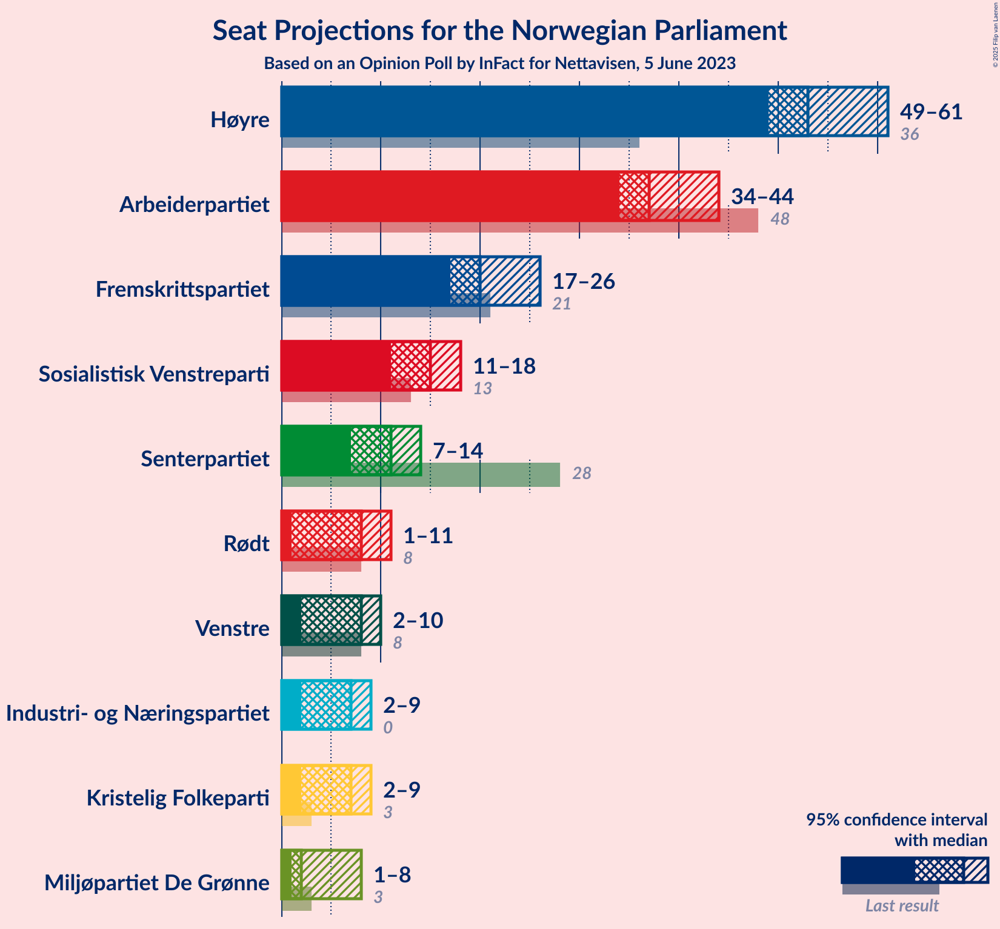

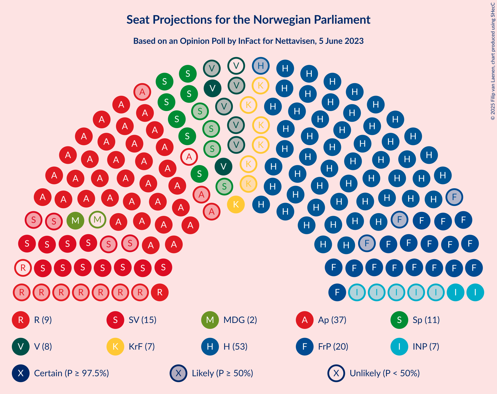

### Confidence Intervals

| Party | Last Result | Median | 80% Confidence Interval | 90% Confidence Interval | 95% Confidence Interval | 99% Confidence Interval |
|:-----:|:-----------:|:------:|:-----------------------:|:-----------------------:|:-----------------------:|:-----------------------:|
| <a href="#høyre">Høyre</a> | 36 | 53 | 50–58 |49–59 |49–61 |47–62 |
| <a href="#arbeiderpartiet">Arbeiderpartiet</a> | 48 | 37 | 35–42 |34–43 |34–44 |34–45 |
| <a href="#fremskrittspartiet">Fremskrittspartiet</a> | 21 | 20 | 18–24 |18–24 |17–26 |17–27 |
| <a href="#sosialistisk-venstreparti">Sosialistisk Venstreparti</a> | 13 | 15 | 12–17 |12–18 |11–18 |10–20 |
| <a href="#senterpartiet">Senterpartiet</a> | 28 | 11 | 9–13 |8–13 |7–14 |6–16 |
| <a href="#rødt">Rødt</a> | 8 | 8 | 1–10 |1–10 |1–11 |1–12 |
| <a href="#kristelig-folkeparti">Kristelig Folkeparti</a> | 3 | 7 | 3–8 |2–9 |2–9 |2–10 |
| <a href="#venstre">Venstre</a> | 8 | 8 | 3–9 |3–9 |2–10 |2–11 |
| <a href="#industri--og-næringspartiet">Industri- og Næringspartiet</a> | 0 | 7 | 2–8 |2–8 |2–9 |2–9 |
| <a href="#miljøpartiet-de-grønne">Miljøpartiet De Grønne</a> | 3 | 2 | 1–7 |1–8 |1–8 |1–9 |

### Høyre

*For a full overview of the results for this party, see the [Høyre](party-høyre.html) page.*

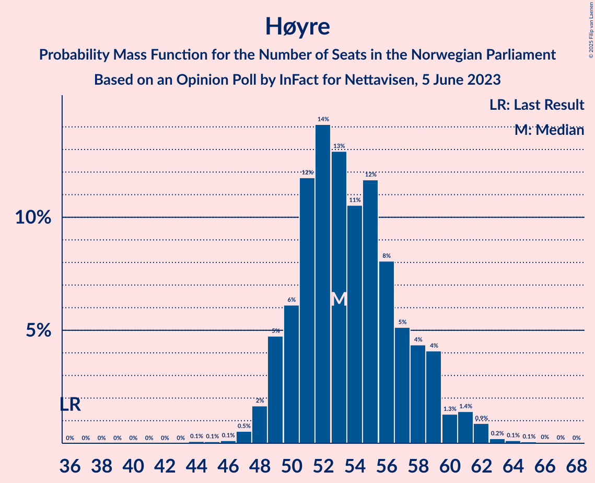

| Number of Seats | Probability | Accumulated | Special Marks |
|:---------------:|:-----------:|:-----------:|:-------------:|
| 36 | 0% | 100% | Last Result |
| 37 | 0% | 100% |  |
| 38 | 0% | 100% |  |
| 39 | 0% | 100% |  |
| 40 | 0% | 100% |  |
| 41 | 0% | 100% |  |
| 42 | 0% | 100% |  |
| 43 | 0% | 100% |  |
| 44 | 0.1% | 100% |  |
| 45 | 0.1% | 99.9% |  |
| 46 | 0.1% | 99.8% |  |
| 47 | 0.5% | 99.7% |  |
| 48 | 2% | 99.2% |  |
| 49 | 5% | 98% |  |
| 50 | 6% | 93% |  |
| 51 | 12% | 87% |  |
| 52 | 14% | 75% |  |
| 53 | 13% | 61% | Median |
| 54 | 11% | 48% |  |
| 55 | 12% | 37% |  |
| 56 | 8% | 26% |  |
| 57 | 5% | 18% |  |
| 58 | 4% | 12% |  |
| 59 | 4% | 8% |  |
| 60 | 1.3% | 4% |  |
| 61 | 1.4% | 3% |  |
| 62 | 0.9% | 1.3% |  |
| 63 | 0.2% | 0.5% |  |
| 64 | 0.1% | 0.3% |  |
| 65 | 0.1% | 0.1% |  |
| 66 | 0% | 0.1% |  |
| 67 | 0% | 0% |  |

### Arbeiderpartiet

*For a full overview of the results for this party, see the [Arbeiderpartiet](party-arbeiderpartiet.html) page.*

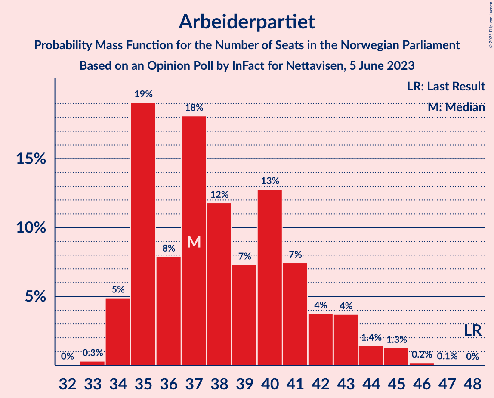

| Number of Seats | Probability | Accumulated | Special Marks |
|:---------------:|:-----------:|:-----------:|:-------------:|
| 33 | 0.3% | 100% |  |
| 34 | 5% | 99.7% |  |
| 35 | 19% | 95% |  |
| 36 | 8% | 76% |  |
| 37 | 18% | 68% | Median |
| 38 | 12% | 50% |  |
| 39 | 7% | 38% |  |
| 40 | 13% | 31% |  |
| 41 | 7% | 18% |  |
| 42 | 4% | 10% |  |
| 43 | 4% | 7% |  |
| 44 | 1.4% | 3% |  |
| 45 | 1.3% | 2% |  |
| 46 | 0.2% | 0.3% |  |
| 47 | 0.1% | 0.1% |  |
| 48 | 0% | 0% | Last Result |

### Fremskrittspartiet

*For a full overview of the results for this party, see the [Fremskrittspartiet](party-fremskrittspartiet.html) page.*

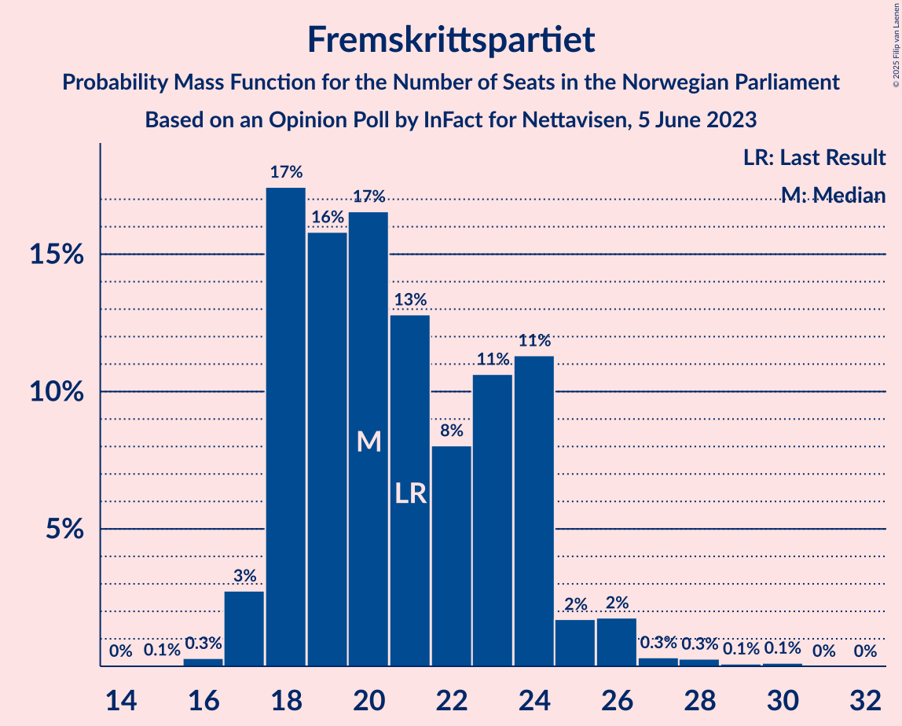

| Number of Seats | Probability | Accumulated | Special Marks |
|:---------------:|:-----------:|:-----------:|:-------------:|
| 15 | 0.1% | 100% |  |
| 16 | 0.3% | 99.9% |  |
| 17 | 3% | 99.6% |  |
| 18 | 17% | 97% |  |
| 19 | 16% | 79% |  |
| 20 | 17% | 64% | Median |
| 21 | 13% | 47% | Last Result |
| 22 | 8% | 34% |  |
| 23 | 11% | 26% |  |
| 24 | 11% | 16% |  |
| 25 | 2% | 4% |  |
| 26 | 2% | 3% |  |
| 27 | 0.3% | 0.8% |  |
| 28 | 0.3% | 0.5% |  |
| 29 | 0.1% | 0.2% |  |
| 30 | 0.1% | 0.1% |  |
| 31 | 0% | 0% |  |

### Sosialistisk Venstreparti

*For a full overview of the results for this party, see the [Sosialistisk Venstreparti](party-sosialistiskvenstreparti.html) page.*

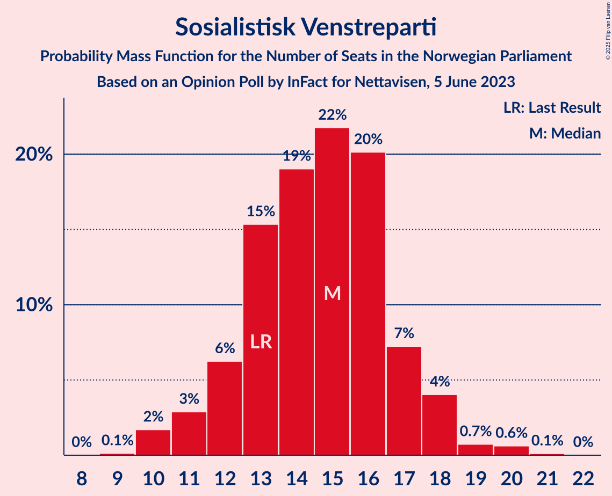

| Number of Seats | Probability | Accumulated | Special Marks |
|:---------------:|:-----------:|:-----------:|:-------------:|
| 9 | 0.1% | 100% |  |
| 10 | 2% | 99.9% |  |
| 11 | 3% | 98% |  |
| 12 | 6% | 95% |  |
| 13 | 15% | 89% | Last Result |
| 14 | 19% | 74% |  |
| 15 | 22% | 55% | Median |
| 16 | 20% | 33% |  |
| 17 | 7% | 13% |  |
| 18 | 4% | 6% |  |
| 19 | 0.7% | 1.5% |  |
| 20 | 0.6% | 0.8% |  |
| 21 | 0.1% | 0.1% |  |
| 22 | 0% | 0% |  |

### Senterpartiet

*For a full overview of the results for this party, see the [Senterpartiet](party-senterpartiet.html) page.*

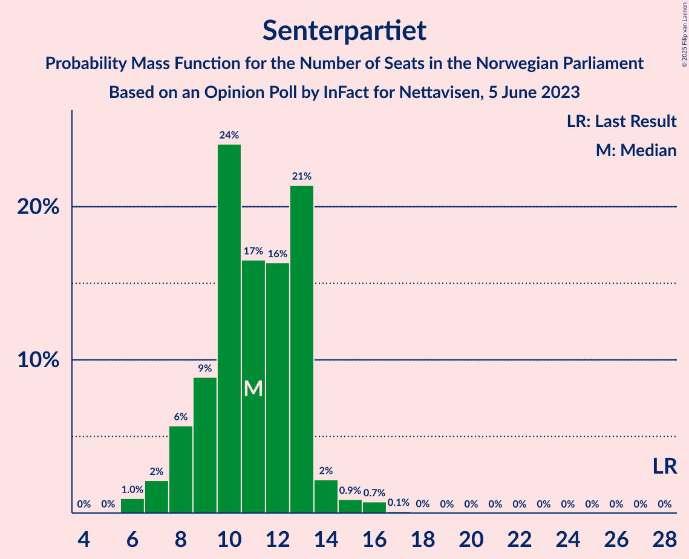

| Number of Seats | Probability | Accumulated | Special Marks |
|:---------------:|:-----------:|:-----------:|:-------------:|
| 6 | 1.0% | 100% |  |
| 7 | 2% | 99.0% |  |
| 8 | 6% | 97% |  |
| 9 | 9% | 91% |  |
| 10 | 24% | 82% |  |
| 11 | 17% | 58% | Median |
| 12 | 16% | 42% |  |
| 13 | 21% | 25% |  |
| 14 | 2% | 4% |  |
| 15 | 0.9% | 2% |  |
| 16 | 0.7% | 0.9% |  |
| 17 | 0.1% | 0.1% |  |
| 18 | 0% | 0% |  |
| 19 | 0% | 0% |  |
| 20 | 0% | 0% |  |
| 21 | 0% | 0% |  |
| 22 | 0% | 0% |  |
| 23 | 0% | 0% |  |
| 24 | 0% | 0% |  |
| 25 | 0% | 0% |  |
| 26 | 0% | 0% |  |
| 27 | 0% | 0% |  |
| 28 | 0% | 0% | Last Result |

### Rødt

*For a full overview of the results for this party, see the [Rødt](party-rødt.html) page.*

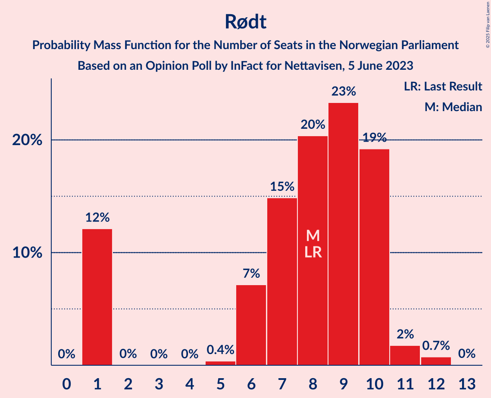

| Number of Seats | Probability | Accumulated | Special Marks |
|:---------------:|:-----------:|:-----------:|:-------------:|
| 1 | 12% | 100% |  |
| 2 | 0% | 88% |  |
| 3 | 0% | 88% |  |
| 4 | 0% | 88% |  |
| 5 | 0.4% | 88% |  |
| 6 | 7% | 87% |  |
| 7 | 15% | 80% |  |
| 8 | 20% | 65% | Last Result, Median |
| 9 | 23% | 45% |  |
| 10 | 19% | 22% |  |
| 11 | 2% | 3% |  |
| 12 | 0.7% | 0.8% |  |
| 13 | 0% | 0% |  |

### Kristelig Folkeparti

*For a full overview of the results for this party, see the [Kristelig Folkeparti](party-kristeligfolkeparti.html) page.*

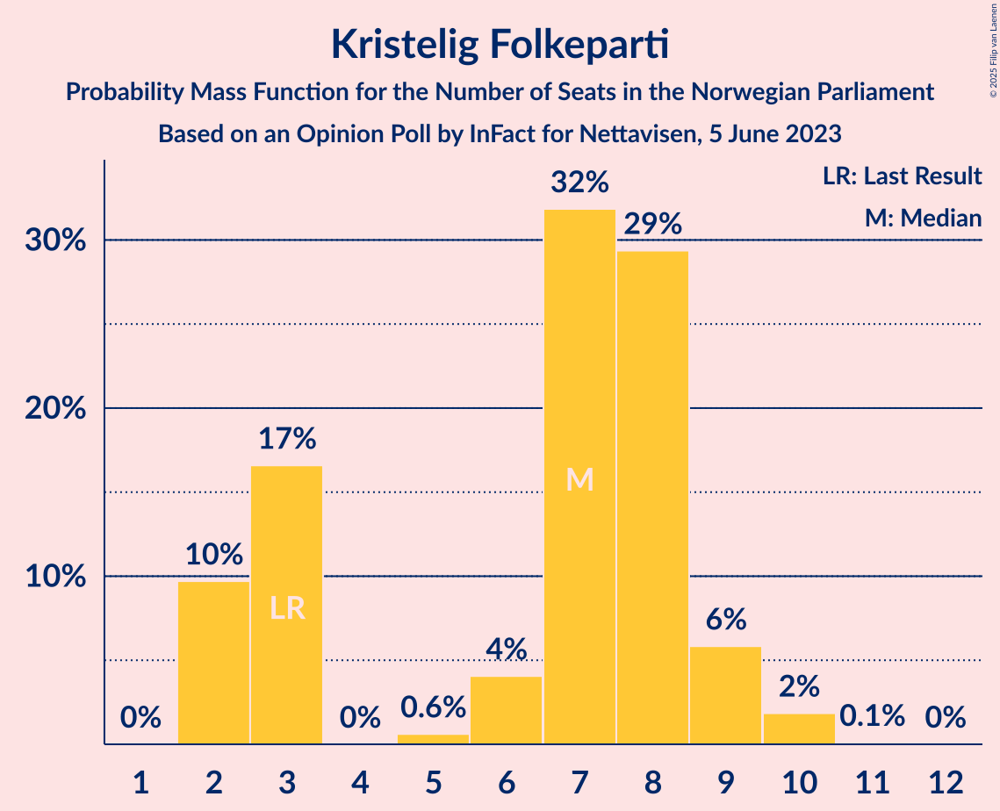

| Number of Seats | Probability | Accumulated | Special Marks |
|:---------------:|:-----------:|:-----------:|:-------------:|
| 2 | 10% | 100% |  |
| 3 | 17% | 90% | Last Result |
| 4 | 0% | 74% |  |
| 5 | 0.6% | 74% |  |
| 6 | 4% | 73% |  |
| 7 | 32% | 69% | Median |
| 8 | 29% | 37% |  |
| 9 | 6% | 8% |  |
| 10 | 2% | 2% |  |
| 11 | 0.1% | 0.1% |  |
| 12 | 0% | 0% |  |

### Venstre

*For a full overview of the results for this party, see the [Venstre](party-venstre.html) page.*

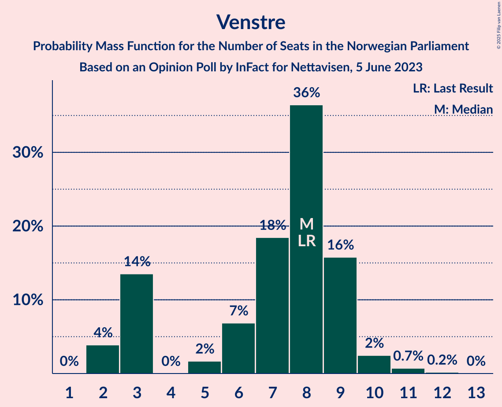

| Number of Seats | Probability | Accumulated | Special Marks |
|:---------------:|:-----------:|:-----------:|:-------------:|
| 2 | 4% | 100% |  |
| 3 | 14% | 96% |  |
| 4 | 0% | 83% |  |
| 5 | 2% | 83% |  |
| 6 | 7% | 81% |  |
| 7 | 18% | 74% |  |
| 8 | 36% | 56% | Last Result, Median |
| 9 | 16% | 19% |  |
| 10 | 2% | 3% |  |
| 11 | 0.7% | 0.9% |  |
| 12 | 0.2% | 0.2% |  |
| 13 | 0% | 0% |  |

### Industri- og Næringspartiet

*For a full overview of the results for this party, see the [Industri- og Næringspartiet](party-industri-ognæringspartiet.html) page.*

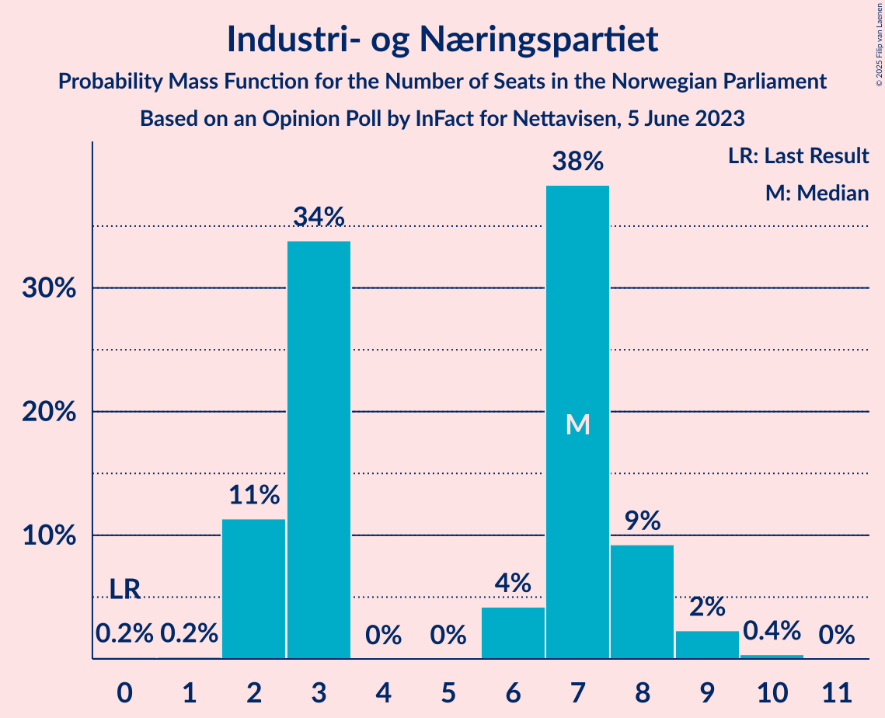

| Number of Seats | Probability | Accumulated | Special Marks |
|:---------------:|:-----------:|:-----------:|:-------------:|
| 0 | 0.2% | 100% | Last Result |
| 1 | 0.2% | 99.8% |  |
| 2 | 11% | 99.7% |  |
| 3 | 34% | 88% |  |
| 4 | 0% | 54% |  |
| 5 | 0% | 54% |  |
| 6 | 4% | 54% |  |
| 7 | 38% | 50% | Median |
| 8 | 9% | 12% |  |
| 9 | 2% | 3% |  |
| 10 | 0.4% | 0.4% |  |
| 11 | 0% | 0% |  |

### Miljøpartiet De Grønne

*For a full overview of the results for this party, see the [Miljøpartiet De Grønne](party-miljøpartietdegrønne.html) page.*

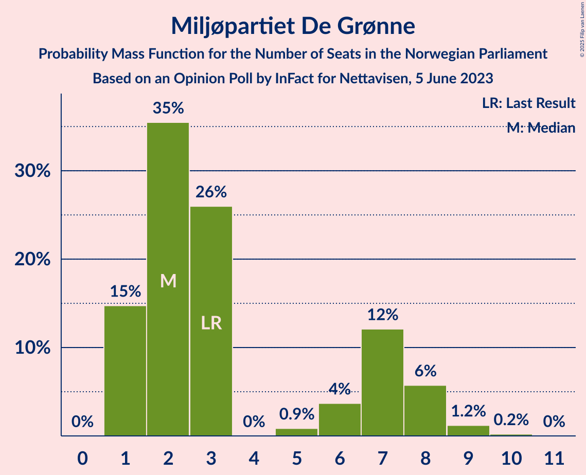

| Number of Seats | Probability | Accumulated | Special Marks |
|:---------------:|:-----------:|:-----------:|:-------------:|
| 1 | 15% | 100% |  |
| 2 | 35% | 85% | Median |
| 3 | 26% | 50% | Last Result |
| 4 | 0% | 24% |  |
| 5 | 0.9% | 24% |  |
| 6 | 4% | 23% |  |
| 7 | 12% | 19% |  |
| 8 | 6% | 7% |  |
| 9 | 1.2% | 1.4% |  |
| 10 | 0.2% | 0.2% |  |
| 11 | 0% | 0% |  |

## Coalitions

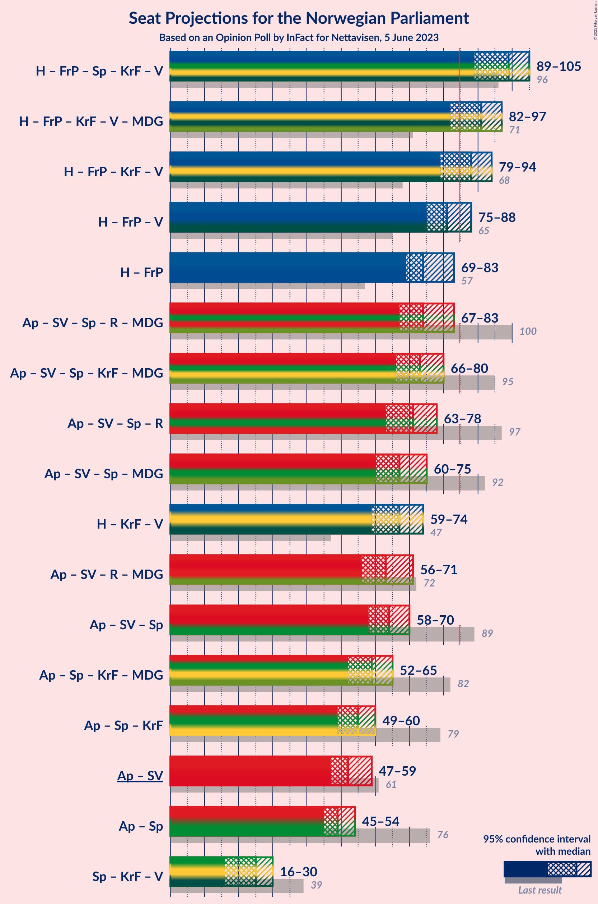

### Confidence Intervals

| Coalition | Last Result | Median | Majority? | 80% Confidence Interval | 90% Confidence Interval | 95% Confidence Interval | 99% Confidence Interval |
|:---------:|:-----------:|:------:|:---------:|:-----------------------:|:-----------------------:|:-----------------------:|:-----------------------:|
| Høyre – Fremskrittspartiet – Senterpartiet – Kristelig Folkeparti – Venstre | 96 | 99 | 99.8% | 93–103 | 92–105 | 89–105 | 86–107 |
| Høyre – Fremskrittspartiet – Kristelig Folkeparti – Venstre – Miljøpartiet De Grønne | 71 | 91 | 96% | 87–95 | 85–97 | 82–97 | 80–101 |
| Høyre – Fremskrittspartiet – Kristelig Folkeparti – Venstre | 68 | 88 | 83% | 84–92 | 81–93 | 79–94 | 76–96 |
| Høyre – Fremskrittspartiet – Venstre | 65 | 81 | 17% | 77–86 | 76–87 | 75–88 | 72–91 |
| Høyre – Fremskrittspartiet | 57 | 74 | 1.3% | 70–79 | 70–80 | 69–83 | 67–85 |
| Arbeiderpartiet – Sosialistisk Venstreparti – Senterpartiet – Rødt – Miljøpartiet De Grønne | 100 | 74 | 1.0% | 71–79 | 68–81 | 67–83 | 63–85 |
| Arbeiderpartiet – Sosialistisk Venstreparti – Senterpartiet – Kristelig Folkeparti – Miljøpartiet De Grønne | 95 | 73 | 0.2% | 69–79 | 67–80 | 66–80 | 64–84 |
| Arbeiderpartiet – Sosialistisk Venstreparti – Senterpartiet – Rødt | 97 | 71 | 0% | 66–76 | 65–77 | 63–78 | 60–81 |
| Arbeiderpartiet – Sosialistisk Venstreparti – Senterpartiet – Miljøpartiet De Grønne | 92 | 67 | 0% | 63–72 | 62–73 | 60–75 | 58–77 |
| Høyre – Kristelig Folkeparti – Venstre | 47 | 67 | 0% | 63–71 | 61–73 | 59–74 | 56–76 |
| Arbeiderpartiet – Sosialistisk Venstreparti – Rødt – Miljøpartiet De Grønne | 72 | 63 | 0% | 60–69 | 57–70 | 56–71 | 54–75 |
| Arbeiderpartiet – Sosialistisk Venstreparti – Senterpartiet | 89 | 64 | 0% | 60–68 | 58–69 | 58–70 | 56–73 |
| Arbeiderpartiet – Senterpartiet – Kristelig Folkeparti – Miljøpartiet De Grønne | 82 | 59 | 0% | 54–63 | 53–65 | 52–65 | 51–67 |
| Arbeiderpartiet – Senterpartiet – Kristelig Folkeparti | 79 | 55 | 0% | 51–59 | 50–59 | 49–60 | 47–62 |
| Arbeiderpartiet – Sosialistisk Venstreparti | 61 | 52 | 0% | 49–57 | 48–58 | 47–59 | 45–63 |
| Arbeiderpartiet – Senterpartiet | 76 | 49 | 0% | 45–52 | 45–53 | 45–54 | 43–56 |
| Senterpartiet – Kristelig Folkeparti – Venstre | 39 | 25 | 0% | 19–28 | 18–29 | 16–30 | 15–31 |

### Høyre – Fremskrittspartiet – Senterpartiet – Kristelig Folkeparti – Venstre

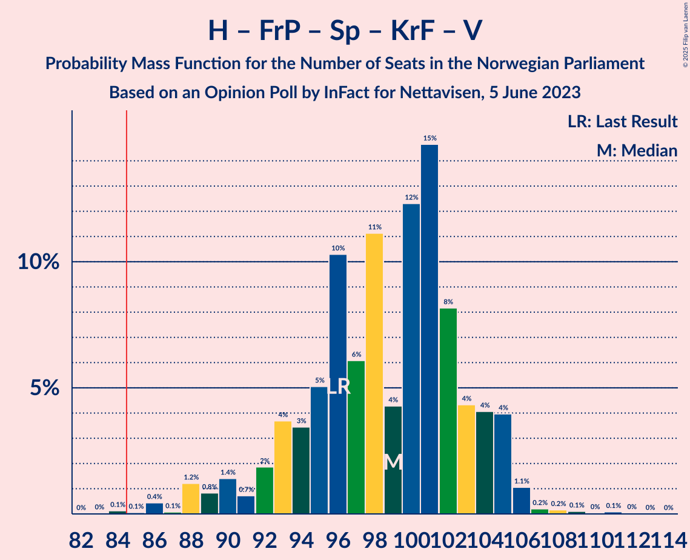

| Number of Seats | Probability | Accumulated | Special Marks |
|:---------------:|:-----------:|:-----------:|:-------------:|
| 84 | 0.1% | 100% |  |
| 85 | 0.1% | 99.8% | Majority |
| 86 | 0.4% | 99.8% |  |
| 87 | 0.1% | 99.3% |  |
| 88 | 1.2% | 99.3% |  |
| 89 | 0.8% | 98% |  |
| 90 | 1.4% | 97% |  |
| 91 | 0.7% | 96% |  |
| 92 | 2% | 95% |  |
| 93 | 4% | 93% |  |
| 94 | 3% | 90% |  |
| 95 | 5% | 86% |  |
| 96 | 10% | 81% | Last Result |
| 97 | 6% | 71% |  |
| 98 | 11% | 65% |  |
| 99 | 4% | 54% | Median |
| 100 | 12% | 49% |  |
| 101 | 15% | 37% |  |
| 102 | 8% | 22% |  |
| 103 | 4% | 14% |  |
| 104 | 4% | 10% |  |
| 105 | 4% | 6% |  |
| 106 | 1.1% | 2% |  |
| 107 | 0.2% | 0.7% |  |
| 108 | 0.2% | 0.5% |  |
| 109 | 0.1% | 0.3% |  |
| 110 | 0% | 0.2% |  |
| 111 | 0.1% | 0.1% |  |
| 112 | 0% | 0.1% |  |
| 113 | 0% | 0% |  |

### Høyre – Fremskrittspartiet – Kristelig Folkeparti – Venstre – Miljøpartiet De Grønne

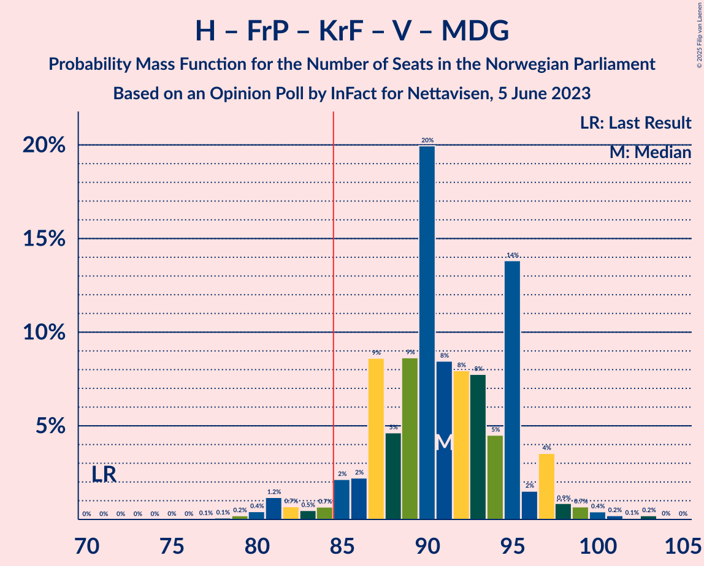

| Number of Seats | Probability | Accumulated | Special Marks |
|:---------------:|:-----------:|:-----------:|:-------------:|
| 71 | 0% | 100% | Last Result |
| 72 | 0% | 100% |  |
| 73 | 0% | 100% |  |
| 74 | 0% | 100% |  |
| 75 | 0% | 100% |  |
| 76 | 0% | 100% |  |
| 77 | 0.1% | 100% |  |
| 78 | 0.1% | 99.9% |  |
| 79 | 0.2% | 99.8% |  |
| 80 | 0.4% | 99.6% |  |
| 81 | 1.2% | 99.2% |  |
| 82 | 0.7% | 98% |  |
| 83 | 0.5% | 97% |  |
| 84 | 0.7% | 97% |  |
| 85 | 2% | 96% | Majority |
| 86 | 2% | 94% |  |
| 87 | 9% | 92% |  |
| 88 | 5% | 83% |  |
| 89 | 9% | 79% |  |
| 90 | 20% | 70% | Median |
| 91 | 8% | 50% |  |
| 92 | 8% | 42% |  |
| 93 | 8% | 34% |  |
| 94 | 5% | 26% |  |
| 95 | 14% | 21% |  |
| 96 | 2% | 8% |  |
| 97 | 4% | 6% |  |
| 98 | 0.9% | 2% |  |
| 99 | 0.7% | 2% |  |
| 100 | 0.4% | 1.0% |  |
| 101 | 0.2% | 0.5% |  |
| 102 | 0.1% | 0.3% |  |
| 103 | 0.2% | 0.3% |  |
| 104 | 0% | 0.1% |  |
| 105 | 0% | 0% |  |

### Høyre – Fremskrittspartiet – Kristelig Folkeparti – Venstre

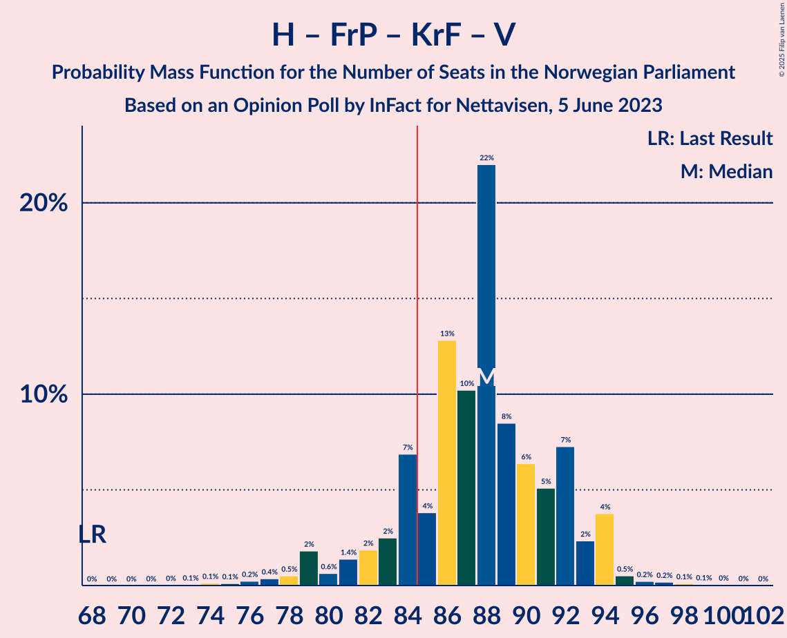

| Number of Seats | Probability | Accumulated | Special Marks |
|:---------------:|:-----------:|:-----------:|:-------------:|
| 68 | 0% | 100% | Last Result |
| 69 | 0% | 100% |  |
| 70 | 0% | 100% |  |
| 71 | 0% | 100% |  |
| 72 | 0% | 100% |  |
| 73 | 0.1% | 100% |  |
| 74 | 0.1% | 99.9% |  |
| 75 | 0.1% | 99.8% |  |
| 76 | 0.2% | 99.7% |  |
| 77 | 0.4% | 99.4% |  |
| 78 | 0.5% | 99.0% |  |
| 79 | 2% | 98.5% |  |
| 80 | 0.6% | 97% |  |
| 81 | 1.4% | 96% |  |
| 82 | 2% | 95% |  |
| 83 | 2% | 93% |  |
| 84 | 7% | 90% |  |
| 85 | 4% | 83% | Majority |
| 86 | 13% | 80% |  |
| 87 | 10% | 67% |  |
| 88 | 22% | 57% | Median |
| 89 | 8% | 35% |  |
| 90 | 6% | 26% |  |
| 91 | 5% | 20% |  |
| 92 | 7% | 15% |  |
| 93 | 2% | 7% |  |
| 94 | 4% | 5% |  |
| 95 | 0.5% | 1.2% |  |
| 96 | 0.2% | 0.7% |  |
| 97 | 0.2% | 0.4% |  |
| 98 | 0.1% | 0.3% |  |
| 99 | 0.1% | 0.1% |  |
| 100 | 0% | 0.1% |  |
| 101 | 0% | 0% |  |

### Høyre – Fremskrittspartiet – Venstre

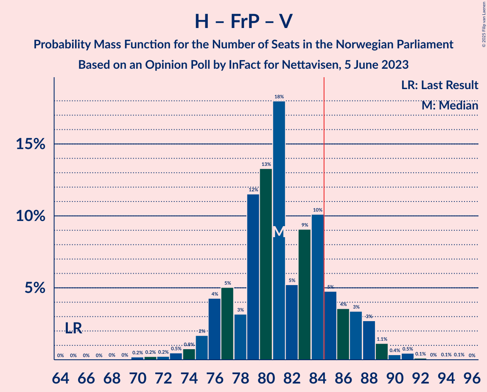

| Number of Seats | Probability | Accumulated | Special Marks |
|:---------------:|:-----------:|:-----------:|:-------------:|
| 65 | 0% | 100% | Last Result |
| 66 | 0% | 100% |  |
| 67 | 0% | 100% |  |
| 68 | 0% | 100% |  |
| 69 | 0% | 100% |  |
| 70 | 0.2% | 99.9% |  |
| 71 | 0.2% | 99.7% |  |
| 72 | 0.2% | 99.5% |  |
| 73 | 0.5% | 99.3% |  |
| 74 | 0.8% | 98.8% |  |
| 75 | 2% | 98% |  |
| 76 | 4% | 96% |  |
| 77 | 5% | 92% |  |
| 78 | 3% | 87% |  |
| 79 | 12% | 84% |  |
| 80 | 13% | 72% |  |
| 81 | 18% | 59% | Median |
| 82 | 5% | 41% |  |
| 83 | 9% | 36% |  |
| 84 | 10% | 27% |  |
| 85 | 5% | 17% | Majority |
| 86 | 4% | 12% |  |
| 87 | 3% | 8% |  |
| 88 | 3% | 5% |  |
| 89 | 1.1% | 2% |  |
| 90 | 0.4% | 1.1% |  |
| 91 | 0.5% | 0.8% |  |
| 92 | 0.1% | 0.3% |  |
| 93 | 0% | 0.2% |  |
| 94 | 0.1% | 0.2% |  |
| 95 | 0.1% | 0.1% |  |
| 96 | 0% | 0% |  |

### Høyre – Fremskrittspartiet

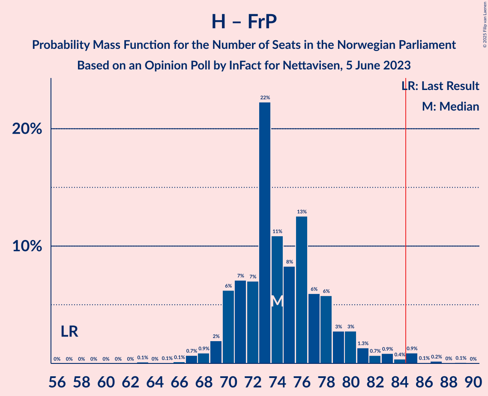

| Number of Seats | Probability | Accumulated | Special Marks |
|:---------------:|:-----------:|:-----------:|:-------------:|
| 57 | 0% | 100% | Last Result |
| 58 | 0% | 100% |  |
| 59 | 0% | 100% |  |
| 60 | 0% | 100% |  |
| 61 | 0% | 100% |  |
| 62 | 0% | 100% |  |
| 63 | 0.1% | 100% |  |
| 64 | 0% | 99.9% |  |
| 65 | 0.1% | 99.9% |  |
| 66 | 0.1% | 99.8% |  |
| 67 | 0.7% | 99.7% |  |
| 68 | 0.9% | 99.0% |  |
| 69 | 2% | 98% |  |
| 70 | 6% | 96% |  |
| 71 | 7% | 90% |  |
| 72 | 7% | 83% |  |
| 73 | 22% | 76% | Median |
| 74 | 11% | 54% |  |
| 75 | 8% | 43% |  |
| 76 | 13% | 34% |  |
| 77 | 6% | 22% |  |
| 78 | 6% | 16% |  |
| 79 | 3% | 10% |  |
| 80 | 3% | 7% |  |
| 81 | 1.3% | 5% |  |
| 82 | 0.7% | 3% |  |
| 83 | 0.9% | 3% |  |
| 84 | 0.4% | 2% |  |
| 85 | 0.9% | 1.3% | Majority |
| 86 | 0.1% | 0.4% |  |
| 87 | 0.2% | 0.3% |  |
| 88 | 0% | 0.2% |  |
| 89 | 0.1% | 0.1% |  |
| 90 | 0% | 0% |  |

### Arbeiderpartiet – Sosialistisk Venstreparti – Senterpartiet – Rødt – Miljøpartiet De Grønne

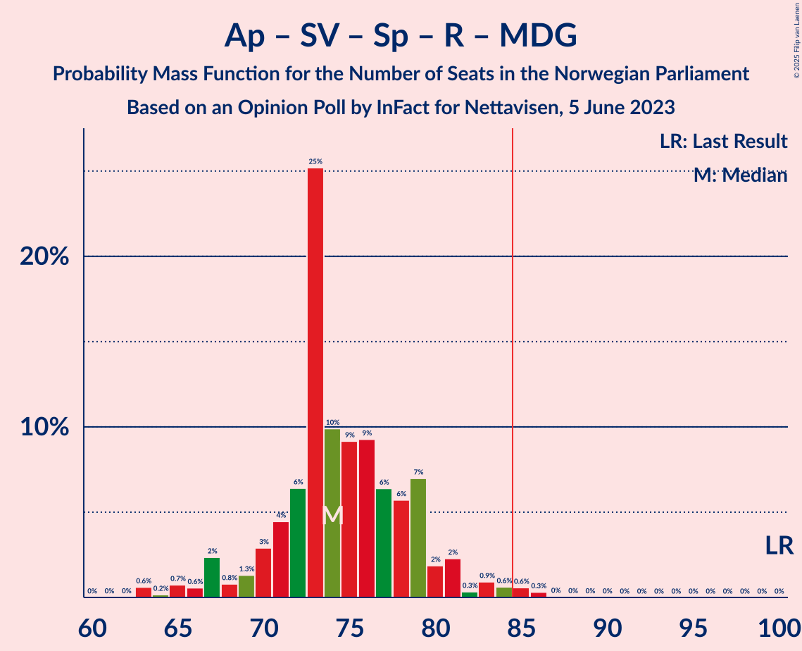

| Number of Seats | Probability | Accumulated | Special Marks |
|:---------------:|:-----------:|:-----------:|:-------------:|
| 63 | 0.6% | 100% |  |
| 64 | 0.2% | 99.3% |  |
| 65 | 0.7% | 99.2% |  |
| 66 | 0.6% | 98% |  |
| 67 | 2% | 98% |  |
| 68 | 0.8% | 96% |  |
| 69 | 1.3% | 95% |  |
| 70 | 3% | 93% |  |
| 71 | 4% | 91% |  |
| 72 | 6% | 86% |  |
| 73 | 25% | 80% | Median |
| 74 | 10% | 54% |  |
| 75 | 9% | 45% |  |
| 76 | 9% | 35% |  |
| 77 | 6% | 26% |  |
| 78 | 6% | 20% |  |
| 79 | 7% | 14% |  |
| 80 | 2% | 7% |  |
| 81 | 2% | 5% |  |
| 82 | 0.3% | 3% |  |
| 83 | 0.9% | 3% |  |
| 84 | 0.6% | 2% |  |
| 85 | 0.6% | 1.0% | Majority |
| 86 | 0.3% | 0.4% |  |
| 87 | 0% | 0.1% |  |
| 88 | 0% | 0.1% |  |
| 89 | 0% | 0% |  |
| 90 | 0% | 0% |  |
| 91 | 0% | 0% |  |
| 92 | 0% | 0% |  |
| 93 | 0% | 0% |  |
| 94 | 0% | 0% |  |
| 95 | 0% | 0% |  |
| 96 | 0% | 0% |  |
| 97 | 0% | 0% |  |
| 98 | 0% | 0% |  |
| 99 | 0% | 0% |  |
| 100 | 0% | 0% | Last Result |

### Arbeiderpartiet – Sosialistisk Venstreparti – Senterpartiet – Kristelig Folkeparti – Miljøpartiet De Grønne

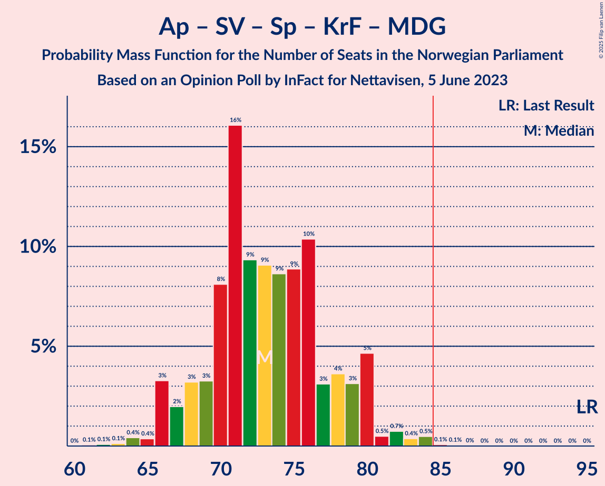

| Number of Seats | Probability | Accumulated | Special Marks |
|:---------------:|:-----------:|:-----------:|:-------------:|
| 61 | 0.1% | 100% |  |
| 62 | 0.1% | 99.9% |  |
| 63 | 0.1% | 99.8% |  |
| 64 | 0.4% | 99.7% |  |
| 65 | 0.4% | 99.3% |  |
| 66 | 3% | 98.9% |  |
| 67 | 2% | 96% |  |
| 68 | 3% | 94% |  |
| 69 | 3% | 90% |  |
| 70 | 8% | 87% |  |
| 71 | 16% | 79% |  |
| 72 | 9% | 63% | Median |
| 73 | 9% | 54% |  |
| 74 | 9% | 45% |  |
| 75 | 9% | 36% |  |
| 76 | 10% | 27% |  |
| 77 | 3% | 17% |  |
| 78 | 4% | 14% |  |
| 79 | 3% | 10% |  |
| 80 | 5% | 7% |  |
| 81 | 0.5% | 2% |  |
| 82 | 0.7% | 2% |  |
| 83 | 0.4% | 1.0% |  |
| 84 | 0.5% | 0.6% |  |
| 85 | 0.1% | 0.2% | Majority |
| 86 | 0.1% | 0.1% |  |
| 87 | 0% | 0% |  |
| 88 | 0% | 0% |  |
| 89 | 0% | 0% |  |
| 90 | 0% | 0% |  |
| 91 | 0% | 0% |  |
| 92 | 0% | 0% |  |
| 93 | 0% | 0% |  |
| 94 | 0% | 0% |  |
| 95 | 0% | 0% | Last Result |

### Arbeiderpartiet – Sosialistisk Venstreparti – Senterpartiet – Rødt

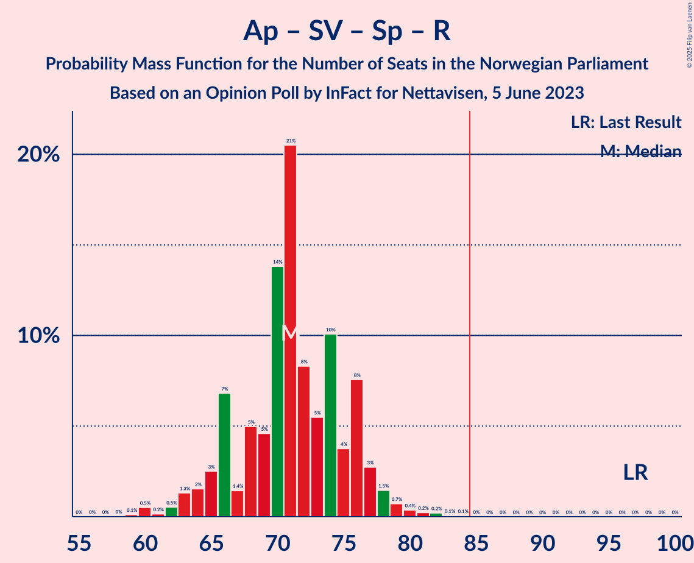

| Number of Seats | Probability | Accumulated | Special Marks |
|:---------------:|:-----------:|:-----------:|:-------------:|
| 58 | 0% | 100% |  |
| 59 | 0.1% | 99.9% |  |
| 60 | 0.5% | 99.8% |  |
| 61 | 0.2% | 99.3% |  |
| 62 | 0.5% | 99.1% |  |
| 63 | 1.3% | 98.6% |  |
| 64 | 2% | 97% |  |
| 65 | 3% | 96% |  |
| 66 | 7% | 93% |  |
| 67 | 1.4% | 86% |  |
| 68 | 5% | 85% |  |
| 69 | 5% | 80% |  |
| 70 | 14% | 75% |  |
| 71 | 21% | 62% | Median |
| 72 | 8% | 41% |  |
| 73 | 5% | 33% |  |
| 74 | 10% | 27% |  |
| 75 | 4% | 17% |  |
| 76 | 8% | 13% |  |
| 77 | 3% | 6% |  |
| 78 | 1.5% | 3% |  |
| 79 | 0.7% | 2% |  |
| 80 | 0.4% | 0.9% |  |
| 81 | 0.2% | 0.6% |  |
| 82 | 0.2% | 0.3% |  |
| 83 | 0.1% | 0.1% |  |
| 84 | 0.1% | 0.1% |  |
| 85 | 0% | 0% | Majority |
| 86 | 0% | 0% |  |
| 87 | 0% | 0% |  |
| 88 | 0% | 0% |  |
| 89 | 0% | 0% |  |
| 90 | 0% | 0% |  |
| 91 | 0% | 0% |  |
| 92 | 0% | 0% |  |
| 93 | 0% | 0% |  |
| 94 | 0% | 0% |  |
| 95 | 0% | 0% |  |
| 96 | 0% | 0% |  |
| 97 | 0% | 0% | Last Result |

### Arbeiderpartiet – Sosialistisk Venstreparti – Senterpartiet – Miljøpartiet De Grønne

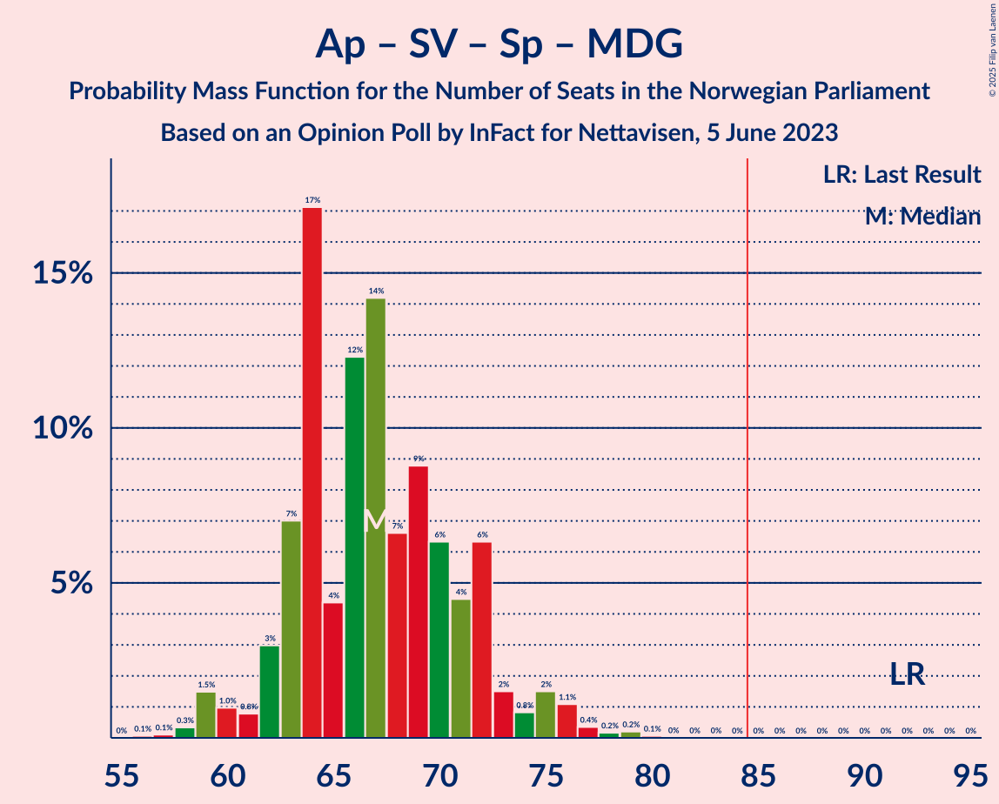

| Number of Seats | Probability | Accumulated | Special Marks |
|:---------------:|:-----------:|:-----------:|:-------------:|
| 56 | 0.1% | 100% |  |
| 57 | 0.1% | 99.9% |  |
| 58 | 0.3% | 99.8% |  |
| 59 | 1.5% | 99.5% |  |
| 60 | 1.0% | 98% |  |
| 61 | 0.8% | 97% |  |
| 62 | 3% | 96% |  |
| 63 | 7% | 93% |  |
| 64 | 17% | 86% |  |
| 65 | 4% | 69% | Median |
| 66 | 12% | 65% |  |
| 67 | 14% | 52% |  |
| 68 | 7% | 38% |  |
| 69 | 9% | 32% |  |
| 70 | 6% | 23% |  |
| 71 | 4% | 17% |  |
| 72 | 6% | 12% |  |
| 73 | 2% | 6% |  |
| 74 | 0.8% | 4% |  |
| 75 | 2% | 3% |  |
| 76 | 1.1% | 2% |  |
| 77 | 0.4% | 0.8% |  |
| 78 | 0.2% | 0.5% |  |
| 79 | 0.2% | 0.3% |  |
| 80 | 0.1% | 0.1% |  |
| 81 | 0% | 0% |  |
| 82 | 0% | 0% |  |
| 83 | 0% | 0% |  |
| 84 | 0% | 0% |  |
| 85 | 0% | 0% | Majority |
| 86 | 0% | 0% |  |
| 87 | 0% | 0% |  |
| 88 | 0% | 0% |  |
| 89 | 0% | 0% |  |
| 90 | 0% | 0% |  |
| 91 | 0% | 0% |  |
| 92 | 0% | 0% | Last Result |

### Høyre – Kristelig Folkeparti – Venstre

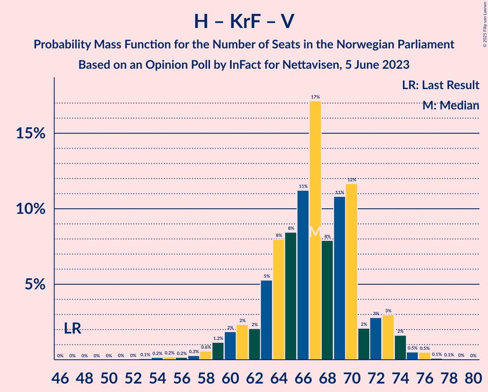

| Number of Seats | Probability | Accumulated | Special Marks |
|:---------------:|:-----------:|:-----------:|:-------------:|
| 47 | 0% | 100% | Last Result |
| 48 | 0% | 100% |  |
| 49 | 0% | 100% |  |
| 50 | 0% | 100% |  |
| 51 | 0% | 100% |  |
| 52 | 0% | 100% |  |
| 53 | 0.1% | 100% |  |
| 54 | 0.2% | 99.9% |  |
| 55 | 0.2% | 99.7% |  |
| 56 | 0.2% | 99.6% |  |
| 57 | 0.3% | 99.4% |  |
| 58 | 0.6% | 99.1% |  |
| 59 | 1.2% | 98.5% |  |
| 60 | 2% | 97% |  |
| 61 | 2% | 96% |  |
| 62 | 2% | 93% |  |
| 63 | 5% | 91% |  |
| 64 | 8% | 86% |  |
| 65 | 8% | 78% |  |
| 66 | 11% | 69% |  |
| 67 | 17% | 58% |  |
| 68 | 8% | 41% | Median |
| 69 | 11% | 33% |  |
| 70 | 12% | 22% |  |
| 71 | 2% | 11% |  |
| 72 | 3% | 9% |  |
| 73 | 3% | 6% |  |
| 74 | 2% | 3% |  |
| 75 | 0.5% | 1.2% |  |
| 76 | 0.5% | 0.7% |  |
| 77 | 0.1% | 0.2% |  |
| 78 | 0.1% | 0.1% |  |
| 79 | 0% | 0.1% |  |
| 80 | 0% | 0% |  |

### Arbeiderpartiet – Sosialistisk Venstreparti – Rødt – Miljøpartiet De Grønne

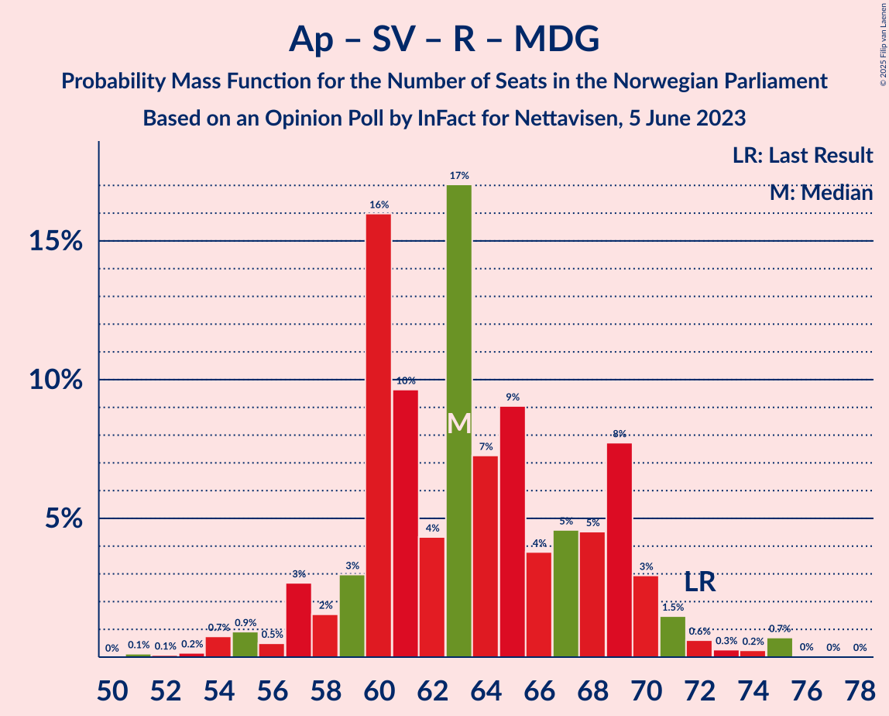

| Number of Seats | Probability | Accumulated | Special Marks |
|:---------------:|:-----------:|:-----------:|:-------------:|
| 51 | 0.1% | 100% |  |
| 52 | 0.1% | 99.9% |  |
| 53 | 0.2% | 99.8% |  |
| 54 | 0.7% | 99.6% |  |
| 55 | 0.9% | 98.9% |  |
| 56 | 0.5% | 98% |  |
| 57 | 3% | 97% |  |
| 58 | 2% | 95% |  |
| 59 | 3% | 93% |  |
| 60 | 16% | 90% |  |
| 61 | 10% | 74% |  |
| 62 | 4% | 65% | Median |
| 63 | 17% | 60% |  |
| 64 | 7% | 43% |  |
| 65 | 9% | 36% |  |
| 66 | 4% | 27% |  |
| 67 | 5% | 23% |  |
| 68 | 5% | 19% |  |
| 69 | 8% | 14% |  |
| 70 | 3% | 6% |  |
| 71 | 1.5% | 3% |  |
| 72 | 0.6% | 2% | Last Result |
| 73 | 0.3% | 1.3% |  |
| 74 | 0.2% | 1.1% |  |
| 75 | 0.7% | 0.8% |  |
| 76 | 0% | 0.1% |  |
| 77 | 0% | 0.1% |  |
| 78 | 0% | 0% |  |

### Arbeiderpartiet – Sosialistisk Venstreparti – Senterpartiet

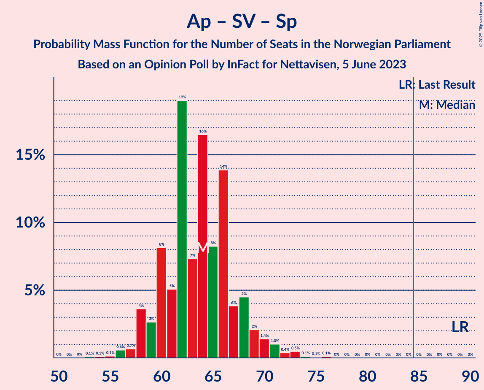

| Number of Seats | Probability | Accumulated | Special Marks |
|:---------------:|:-----------:|:-----------:|:-------------:|
| 53 | 0.1% | 100% |  |
| 54 | 0.1% | 99.9% |  |
| 55 | 0.1% | 99.8% |  |
| 56 | 0.6% | 99.6% |  |
| 57 | 0.7% | 99.1% |  |
| 58 | 4% | 98% |  |
| 59 | 3% | 95% |  |
| 60 | 8% | 92% |  |
| 61 | 5% | 84% |  |
| 62 | 19% | 79% |  |
| 63 | 7% | 60% | Median |
| 64 | 16% | 53% |  |
| 65 | 8% | 36% |  |
| 66 | 14% | 28% |  |
| 67 | 4% | 14% |  |
| 68 | 5% | 10% |  |
| 69 | 2% | 6% |  |
| 70 | 1.4% | 4% |  |
| 71 | 1.0% | 2% |  |
| 72 | 0.4% | 1.1% |  |
| 73 | 0.5% | 0.8% |  |
| 74 | 0.1% | 0.3% |  |
| 75 | 0.1% | 0.2% |  |
| 76 | 0.1% | 0.1% |  |
| 77 | 0% | 0% |  |
| 78 | 0% | 0% |  |
| 79 | 0% | 0% |  |
| 80 | 0% | 0% |  |
| 81 | 0% | 0% |  |
| 82 | 0% | 0% |  |
| 83 | 0% | 0% |  |
| 84 | 0% | 0% |  |
| 85 | 0% | 0% | Majority |
| 86 | 0% | 0% |  |
| 87 | 0% | 0% |  |
| 88 | 0% | 0% |  |
| 89 | 0% | 0% | Last Result |

### Arbeiderpartiet – Senterpartiet – Kristelig Folkeparti – Miljøpartiet De Grønne

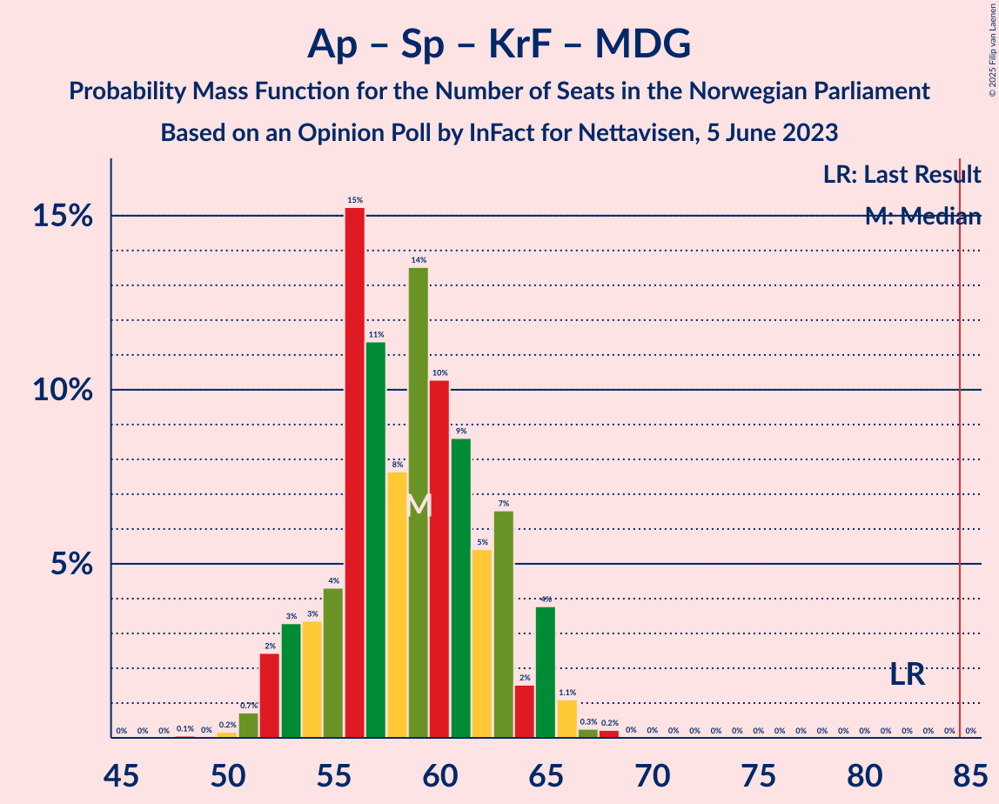

| Number of Seats | Probability | Accumulated | Special Marks |
|:---------------:|:-----------:|:-----------:|:-------------:|
| 48 | 0.1% | 100% |  |
| 49 | 0% | 99.9% |  |
| 50 | 0.2% | 99.9% |  |
| 51 | 0.7% | 99.7% |  |
| 52 | 2% | 99.0% |  |
| 53 | 3% | 97% |  |
| 54 | 3% | 93% |  |
| 55 | 4% | 90% |  |
| 56 | 15% | 86% |  |
| 57 | 11% | 70% | Median |
| 58 | 8% | 59% |  |
| 59 | 14% | 51% |  |
| 60 | 10% | 38% |  |
| 61 | 9% | 28% |  |
| 62 | 5% | 19% |  |
| 63 | 7% | 13% |  |
| 64 | 2% | 7% |  |
| 65 | 4% | 5% |  |
| 66 | 1.1% | 2% |  |
| 67 | 0.3% | 0.5% |  |
| 68 | 0.2% | 0.3% |  |
| 69 | 0% | 0.1% |  |
| 70 | 0% | 0% |  |
| 71 | 0% | 0% |  |
| 72 | 0% | 0% |  |
| 73 | 0% | 0% |  |
| 74 | 0% | 0% |  |
| 75 | 0% | 0% |  |
| 76 | 0% | 0% |  |
| 77 | 0% | 0% |  |
| 78 | 0% | 0% |  |
| 79 | 0% | 0% |  |
| 80 | 0% | 0% |  |
| 81 | 0% | 0% |  |
| 82 | 0% | 0% | Last Result |

### Arbeiderpartiet – Senterpartiet – Kristelig Folkeparti

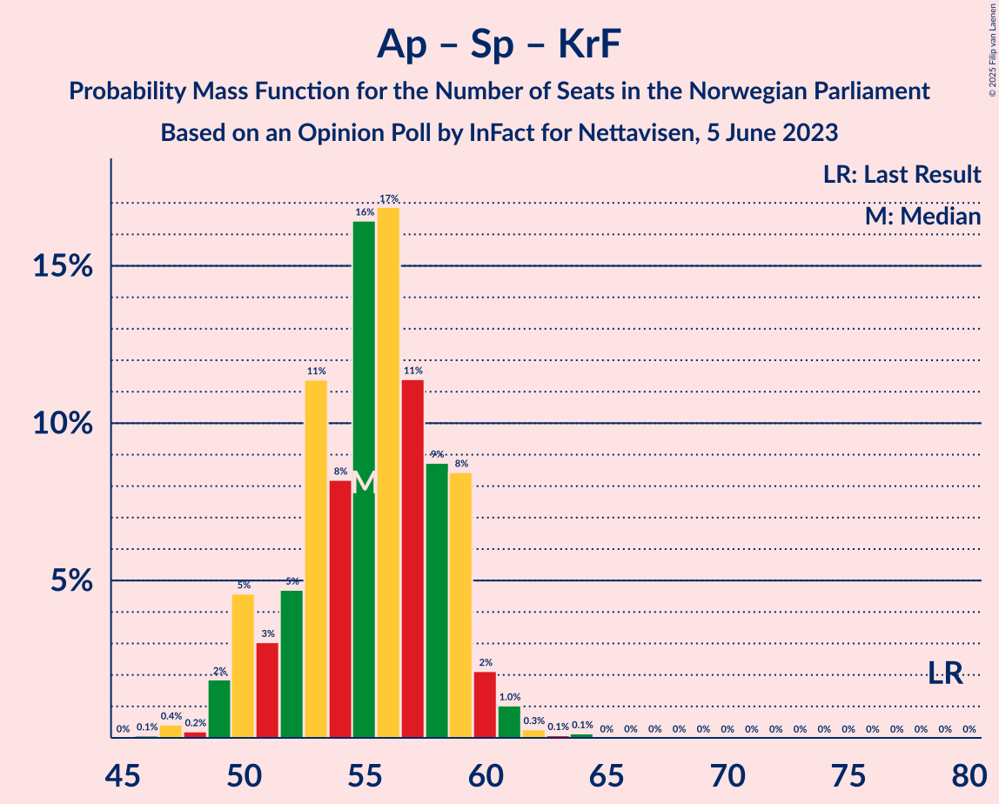

| Number of Seats | Probability | Accumulated | Special Marks |
|:---------------:|:-----------:|:-----------:|:-------------:|
| 46 | 0.1% | 100% |  |
| 47 | 0.4% | 99.9% |  |
| 48 | 0.2% | 99.5% |  |
| 49 | 2% | 99.3% |  |
| 50 | 5% | 97% |  |
| 51 | 3% | 93% |  |
| 52 | 5% | 90% |  |
| 53 | 11% | 85% |  |
| 54 | 8% | 74% |  |
| 55 | 16% | 66% | Median |
| 56 | 17% | 49% |  |
| 57 | 11% | 32% |  |
| 58 | 9% | 21% |  |
| 59 | 8% | 12% |  |
| 60 | 2% | 4% |  |
| 61 | 1.0% | 2% |  |
| 62 | 0.3% | 0.5% |  |
| 63 | 0.1% | 0.2% |  |
| 64 | 0.1% | 0.2% |  |
| 65 | 0% | 0% |  |
| 66 | 0% | 0% |  |
| 67 | 0% | 0% |  |
| 68 | 0% | 0% |  |
| 69 | 0% | 0% |  |
| 70 | 0% | 0% |  |
| 71 | 0% | 0% |  |
| 72 | 0% | 0% |  |
| 73 | 0% | 0% |  |
| 74 | 0% | 0% |  |
| 75 | 0% | 0% |  |
| 76 | 0% | 0% |  |
| 77 | 0% | 0% |  |
| 78 | 0% | 0% |  |
| 79 | 0% | 0% | Last Result |

### Arbeiderpartiet – Sosialistisk Venstreparti

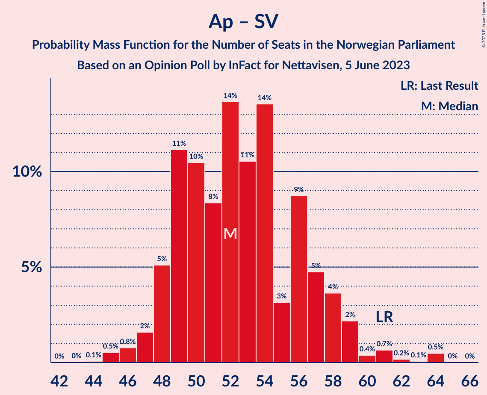

| Number of Seats | Probability | Accumulated | Special Marks |
|:---------------:|:-----------:|:-----------:|:-------------:|
| 44 | 0.1% | 100% |  |
| 45 | 0.5% | 99.9% |  |
| 46 | 0.8% | 99.4% |  |
| 47 | 2% | 98.6% |  |
| 48 | 5% | 97% |  |
| 49 | 11% | 92% |  |
| 50 | 10% | 81% |  |
| 51 | 8% | 70% |  |
| 52 | 14% | 62% | Median |
| 53 | 11% | 48% |  |
| 54 | 14% | 38% |  |
| 55 | 3% | 24% |  |
| 56 | 9% | 21% |  |
| 57 | 5% | 12% |  |
| 58 | 4% | 8% |  |
| 59 | 2% | 4% |  |
| 60 | 0.4% | 2% |  |
| 61 | 0.7% | 1.4% | Last Result |
| 62 | 0.2% | 0.7% |  |
| 63 | 0.1% | 0.6% |  |
| 64 | 0.5% | 0.5% |  |
| 65 | 0% | 0% |  |

### Arbeiderpartiet – Senterpartiet

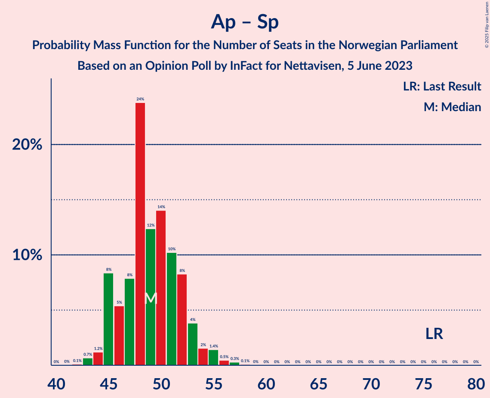

| Number of Seats | Probability | Accumulated | Special Marks |
|:---------------:|:-----------:|:-----------:|:-------------:|
| 41 | 0% | 100% |  |
| 42 | 0.1% | 99.9% |  |
| 43 | 0.7% | 99.8% |  |
| 44 | 1.2% | 99.2% |  |
| 45 | 8% | 98% |  |
| 46 | 5% | 90% |  |
| 47 | 8% | 84% |  |
| 48 | 24% | 76% | Median |
| 49 | 12% | 53% |  |
| 50 | 14% | 40% |  |
| 51 | 10% | 26% |  |
| 52 | 8% | 16% |  |
| 53 | 4% | 8% |  |
| 54 | 2% | 4% |  |
| 55 | 1.4% | 2% |  |
| 56 | 0.5% | 0.8% |  |
| 57 | 0.3% | 0.4% |  |
| 58 | 0.1% | 0.1% |  |
| 59 | 0% | 0% |  |
| 60 | 0% | 0% |  |
| 61 | 0% | 0% |  |
| 62 | 0% | 0% |  |
| 63 | 0% | 0% |  |
| 64 | 0% | 0% |  |
| 65 | 0% | 0% |  |
| 66 | 0% | 0% |  |
| 67 | 0% | 0% |  |
| 68 | 0% | 0% |  |
| 69 | 0% | 0% |  |
| 70 | 0% | 0% |  |
| 71 | 0% | 0% |  |
| 72 | 0% | 0% |  |
| 73 | 0% | 0% |  |
| 74 | 0% | 0% |  |
| 75 | 0% | 0% |  |
| 76 | 0% | 0% | Last Result |

### Senterpartiet – Kristelig Folkeparti – Venstre

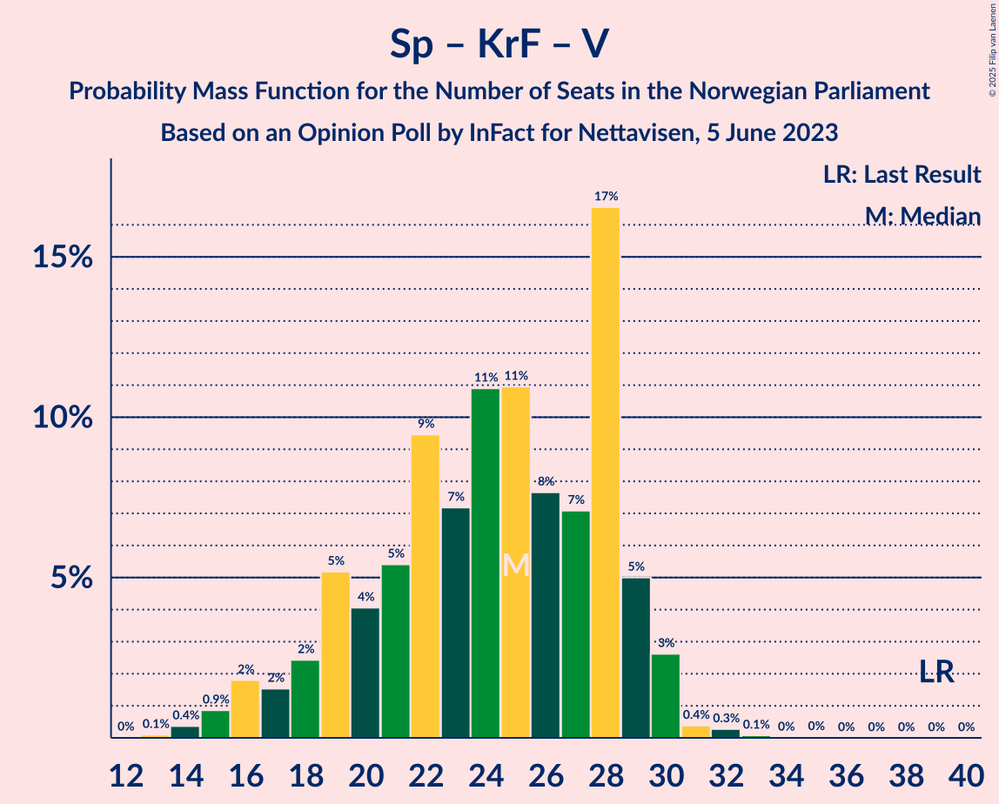

| Number of Seats | Probability | Accumulated | Special Marks |
|:---------------:|:-----------:|:-----------:|:-------------:|
| 13 | 0.1% | 100% |  |
| 14 | 0.4% | 99.9% |  |
| 15 | 0.9% | 99.5% |  |
| 16 | 2% | 98.6% |  |
| 17 | 2% | 97% |  |
| 18 | 2% | 95% |  |
| 19 | 5% | 93% |  |
| 20 | 4% | 88% |  |
| 21 | 5% | 84% |  |
| 22 | 9% | 78% |  |
| 23 | 7% | 69% |  |
| 24 | 11% | 62% |  |
| 25 | 11% | 51% |  |
| 26 | 8% | 40% | Median |
| 27 | 7% | 32% |  |
| 28 | 17% | 25% |  |
| 29 | 5% | 8% |  |
| 30 | 3% | 3% |  |
| 31 | 0.4% | 0.8% |  |
| 32 | 0.3% | 0.4% |  |
| 33 | 0.1% | 0.1% |  |
| 34 | 0% | 0.1% |  |
| 35 | 0% | 0% |  |
| 36 | 0% | 0% |  |
| 37 | 0% | 0% |  |
| 38 | 0% | 0% |  |
| 39 | 0% | 0% | Last Result |

## Technical Information

### Opinion Poll

+ **Polling firm:** InFact
+ **Commissioner(s):** Nettavisen
+ **Fieldwork period:** 5 June 2023

### Calculations

+ **Sample size:** 1005
+ **Simulations done:** 1,048,576
+ **Error estimate:** 1.46%

