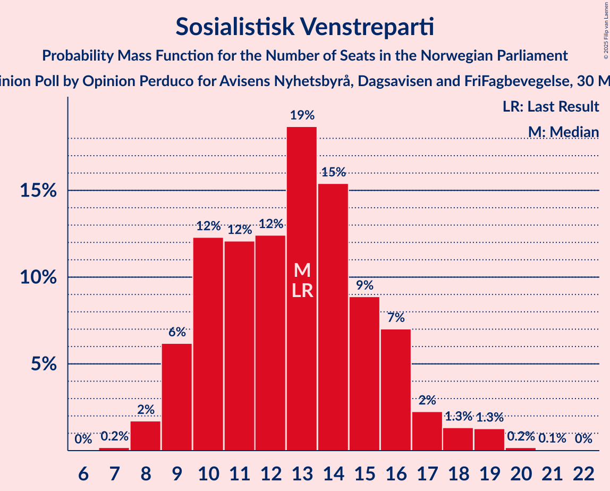

# Opinion Poll by Opinion Perduco for Avisens Nyhetsbyrå, Dagsavisen and FriFagbevegelse, 30 May–5 June 2023

<a href="#voting-intentions">Voting Intentions</a> | <a href="#seats">Seats</a> | <a href="#coalitions">Coalitions</a> | <a href="#technical-information">Technical Information</a>

## Voting Intentions

### Confidence Intervals

| Party | Last Result | Poll Result | 80% Confidence Interval | 90% Confidence Interval | 95% Confidence Interval | 99% Confidence Interval |
|:-----:|:-----------:|:-----------:|:-----------------------:|:-----------------------:|:-----------------------:|:-----------------------:|
| Høyre | 20.4% | 31.8% | 29.5–34.1% |28.9–34.8% |28.4–35.4% |27.3–36.5% |
| Arbeiderpartiet | 26.2% | 17.6% | 15.9–19.6% |15.4–20.2% |15.0–20.7% |14.2–21.7% |
| Fremskrittspartiet | 11.6% | 14.1% | 12.5–16.0% |12.1–16.5% |11.7–16.9% |11.0–17.9% |
| Sosialistisk Venstreparti | 7.6% | 8.2% | 7.0–9.7% |6.7–10.2% |6.4–10.5% |5.9–11.3% |
| Senterpartiet | 13.5% | 5.7% | 4.7–7.1% |4.5–7.4% |4.2–7.8% |3.8–8.4% |
| Rødt | 4.7% | 5.0% | 4.1–6.2% |3.8–6.6% |3.6–6.9% |3.2–7.6% |
| Kristelig Folkeparti | 3.8% | 4.6% | 3.7–5.8% |3.4–6.1% |3.2–6.4% |2.9–7.0% |
| Venstre | 4.6% | 4.6% | 3.7–5.8% |3.4–6.1% |3.2–6.4% |2.9–7.0% |
| Miljøpartiet De Grønne | 3.9% | 3.8% | 3.0–5.0% |2.8–5.3% |2.6–5.5% |2.3–6.1% |

*Note:* The poll result column reflects the actual value used in the calculations. Published results may vary slightly, and in addition be rounded to fewer digits.

## Seats

### Confidence Intervals

| Party | Last Result | Median | 80% Confidence Interval | 90% Confidence Interval | 95% Confidence Interval | 99% Confidence Interval |
|:-----:|:-----------:|:------:|:-----------------------:|:-----------------------:|:-----------------------:|:-----------------------:|
| <a href="#høyre">Høyre</a> | 36 | 55 | 52–62 |50–63 |49–64 |48–67 |
| <a href="#arbeiderpartiet">Arbeiderpartiet</a> | 48 | 34 | 31–38 |31–40 |29–41 |27–43 |
| <a href="#fremskrittspartiet">Fremskrittspartiet</a> | 21 | 25 | 21–30 |20–32 |19–33 |18–35 |
| <a href="#sosialistisk-venstreparti">Sosialistisk Venstreparti</a> | 13 | 13 | 10–16 |9–17 |9–18 |8–19 |
| <a href="#senterpartiet">Senterpartiet</a> | 28 | 9 | 7–13 |6–13 |6–14 |1–15 |
| <a href="#rødt">Rødt</a> | 8 | 8 | 5–10 |1–11 |1–11 |1–12 |
| <a href="#kristelig-folkeparti">Kristelig Folkeparti</a> | 3 | 7 | 3–9 |2–9 |2–10 |2–11 |
| <a href="#venstre">Venstre</a> | 8 | 7 | 3–9 |2–9 |2–10 |2–11 |
| <a href="#miljøpartiet-de-grønne">Miljøpartiet De Grønne</a> | 3 | 5 | 2–7 |1–8 |1–8 |1–9 |

### Høyre

*For a full overview of the results for this party, see the [Høyre](party-høyre.html) page.*

| Number of Seats | Probability | Accumulated | Special Marks |
|:---------------:|:-----------:|:-----------:|:-------------:|
| 36 | 0% | 100% | Last Result |
| 37 | 0% | 100% |  |
| 38 | 0% | 100% |  |
| 39 | 0% | 100% |  |
| 40 | 0% | 100% |  |
| 41 | 0% | 100% |  |
| 42 | 0% | 100% |  |
| 43 | 0% | 100% |  |
| 44 | 0% | 100% |  |
| 45 | 0% | 100% |  |
| 46 | 0.1% | 100% |  |
| 47 | 0.3% | 99.9% |  |
| 48 | 1.0% | 99.6% |  |
| 49 | 2% | 98.7% |  |
| 50 | 3% | 96% |  |
| 51 | 3% | 93% |  |
| 52 | 6% | 90% |  |
| 53 | 12% | 84% |  |
| 54 | 20% | 72% |  |
| 55 | 7% | 53% | Median |
| 56 | 9% | 45% |  |
| 57 | 5% | 37% |  |
| 58 | 3% | 31% |  |
| 59 | 3% | 28% |  |
| 60 | 10% | 24% |  |
| 61 | 3% | 14% |  |
| 62 | 5% | 11% |  |
| 63 | 2% | 6% |  |
| 64 | 1.0% | 3% |  |
| 65 | 1.1% | 2% |  |
| 66 | 0.4% | 1.3% |  |
| 67 | 0.4% | 0.9% |  |
| 68 | 0.2% | 0.5% |  |
| 69 | 0.2% | 0.3% |  |
| 70 | 0% | 0.1% |  |
| 71 | 0% | 0% |  |

### Arbeiderpartiet

*For a full overview of the results for this party, see the [Arbeiderpartiet](party-arbeiderpartiet.html) page.*

| Number of Seats | Probability | Accumulated | Special Marks |
|:---------------:|:-----------:|:-----------:|:-------------:|
| 24 | 0% | 100% |  |
| 25 | 0.1% | 99.9% |  |
| 26 | 0.1% | 99.9% |  |
| 27 | 0.6% | 99.7% |  |
| 28 | 0.6% | 99.2% |  |
| 29 | 1.1% | 98.6% |  |
| 30 | 2% | 97% |  |
| 31 | 6% | 95% |  |
| 32 | 10% | 89% |  |
| 33 | 16% | 80% |  |
| 34 | 28% | 64% | Median |
| 35 | 11% | 36% |  |
| 36 | 5% | 25% |  |
| 37 | 7% | 20% |  |
| 38 | 3% | 13% |  |
| 39 | 5% | 10% |  |
| 40 | 2% | 5% |  |
| 41 | 2% | 3% |  |
| 42 | 0.3% | 1.0% |  |
| 43 | 0.4% | 0.7% |  |
| 44 | 0.3% | 0.3% |  |
| 45 | 0% | 0.1% |  |
| 46 | 0% | 0.1% |  |
| 47 | 0% | 0% |  |
| 48 | 0% | 0% | Last Result |

### Fremskrittspartiet

*For a full overview of the results for this party, see the [Fremskrittspartiet](party-fremskrittspartiet.html) page.*

| Number of Seats | Probability | Accumulated | Special Marks |
|:---------------:|:-----------:|:-----------:|:-------------:|
| 17 | 0.3% | 100% |  |
| 18 | 2% | 99.7% |  |
| 19 | 2% | 98% |  |
| 20 | 3% | 97% |  |
| 21 | 5% | 94% | Last Result |
| 22 | 10% | 88% |  |
| 23 | 5% | 78% |  |
| 24 | 7% | 73% |  |
| 25 | 17% | 67% | Median |
| 26 | 8% | 50% |  |
| 27 | 6% | 42% |  |
| 28 | 6% | 36% |  |
| 29 | 6% | 30% |  |
| 30 | 15% | 24% |  |
| 31 | 2% | 9% |  |
| 32 | 2% | 7% |  |
| 33 | 2% | 5% |  |
| 34 | 1.3% | 2% |  |
| 35 | 0.8% | 1.1% |  |
| 36 | 0.2% | 0.2% |  |
| 37 | 0% | 0% |  |

### Sosialistisk Venstreparti

*For a full overview of the results for this party, see the [Sosialistisk Venstreparti](party-sosialistiskvenstreparti.html) page.*

| Number of Seats | Probability | Accumulated | Special Marks |
|:---------------:|:-----------:|:-----------:|:-------------:|
| 7 | 0.2% | 100% |  |
| 8 | 2% | 99.8% |  |
| 9 | 6% | 98% |  |
| 10 | 12% | 92% |  |
| 11 | 12% | 80% |  |
| 12 | 12% | 68% |  |
| 13 | 19% | 55% | Last Result, Median |
| 14 | 15% | 36% |  |
| 15 | 9% | 21% |  |
| 16 | 7% | 12% |  |
| 17 | 2% | 5% |  |
| 18 | 1.3% | 3% |  |
| 19 | 1.3% | 2% |  |
| 20 | 0.2% | 0.3% |  |
| 21 | 0.1% | 0.1% |  |
| 22 | 0% | 0% |  |

### Senterpartiet

*For a full overview of the results for this party, see the [Senterpartiet](party-senterpartiet.html) page.*

| Number of Seats | Probability | Accumulated | Special Marks |
|:---------------:|:-----------:|:-----------:|:-------------:|
| 0 | 0.3% | 100% |  |
| 1 | 1.0% | 99.7% |  |
| 2 | 0% | 98.7% |  |
| 3 | 0% | 98.6% |  |
| 4 | 0% | 98.6% |  |
| 5 | 0.9% | 98.6% |  |
| 6 | 7% | 98% |  |
| 7 | 19% | 91% |  |
| 8 | 20% | 72% |  |
| 9 | 11% | 52% | Median |
| 10 | 14% | 41% |  |
| 11 | 4% | 27% |  |
| 12 | 10% | 24% |  |
| 13 | 9% | 14% |  |
| 14 | 3% | 5% |  |
| 15 | 1.2% | 1.3% |  |
| 16 | 0.1% | 0.1% |  |
| 17 | 0% | 0% |  |
| 18 | 0% | 0% |  |
| 19 | 0% | 0% |  |
| 20 | 0% | 0% |  |
| 21 | 0% | 0% |  |
| 22 | 0% | 0% |  |
| 23 | 0% | 0% |  |
| 24 | 0% | 0% |  |
| 25 | 0% | 0% |  |
| 26 | 0% | 0% |  |
| 27 | 0% | 0% |  |
| 28 | 0% | 0% | Last Result |

### Rødt

*For a full overview of the results for this party, see the [Rødt](party-rødt.html) page.*

| Number of Seats | Probability | Accumulated | Special Marks |
|:---------------:|:-----------:|:-----------:|:-------------:|
| 1 | 9% | 100% |  |
| 2 | 0% | 91% |  |
| 3 | 0% | 91% |  |
| 4 | 0% | 91% |  |
| 5 | 2% | 91% |  |
| 6 | 11% | 89% |  |
| 7 | 27% | 79% |  |
| 8 | 26% | 51% | Last Result, Median |
| 9 | 13% | 25% |  |
| 10 | 6% | 12% |  |
| 11 | 4% | 5% |  |
| 12 | 0.7% | 1.1% |  |
| 13 | 0.3% | 0.4% |  |
| 14 | 0% | 0.1% |  |
| 15 | 0% | 0% |  |

### Kristelig Folkeparti

*For a full overview of the results for this party, see the [Kristelig Folkeparti](party-kristeligfolkeparti.html) page.*

| Number of Seats | Probability | Accumulated | Special Marks |
|:---------------:|:-----------:|:-----------:|:-------------:|
| 1 | 0.2% | 100% |  |
| 2 | 6% | 99.8% |  |
| 3 | 20% | 94% | Last Result |
| 4 | 0% | 74% |  |
| 5 | 1.3% | 74% |  |
| 6 | 22% | 72% |  |
| 7 | 23% | 51% | Median |
| 8 | 14% | 27% |  |
| 9 | 9% | 13% |  |
| 10 | 3% | 4% |  |
| 11 | 0.7% | 1.1% |  |
| 12 | 0.3% | 0.4% |  |
| 13 | 0.1% | 0.1% |  |
| 14 | 0% | 0% |  |

### Venstre

*For a full overview of the results for this party, see the [Venstre](party-venstre.html) page.*

| Number of Seats | Probability | Accumulated | Special Marks |
|:---------------:|:-----------:|:-----------:|:-------------:|
| 2 | 8% | 100% |  |
| 3 | 12% | 92% |  |
| 4 | 0% | 80% |  |
| 5 | 1.1% | 80% |  |
| 6 | 20% | 79% |  |
| 7 | 28% | 58% | Median |
| 8 | 18% | 30% | Last Result |
| 9 | 8% | 12% |  |
| 10 | 4% | 5% |  |
| 11 | 0.5% | 0.8% |  |
| 12 | 0.2% | 0.3% |  |
| 13 | 0% | 0% |  |

### Miljøpartiet De Grønne

*For a full overview of the results for this party, see the [Miljøpartiet De Grønne](party-miljøpartietdegrønne.html) page.*

| Number of Seats | Probability | Accumulated | Special Marks |
|:---------------:|:-----------:|:-----------:|:-------------:|
| 1 | 8% | 100% |  |
| 2 | 30% | 92% |  |
| 3 | 12% | 63% | Last Result |
| 4 | 0% | 50% |  |
| 5 | 2% | 50% | Median |
| 6 | 21% | 48% |  |
| 7 | 20% | 27% |  |
| 8 | 5% | 7% |  |
| 9 | 1.3% | 2% |  |
| 10 | 0.2% | 0.3% |  |
| 11 | 0.1% | 0.1% |  |
| 12 | 0% | 0% |  |

## Coalitions

### Confidence Intervals

| Coalition | Last Result | Median | Majority? | 80% Confidence Interval | 90% Confidence Interval | 95% Confidence Interval | 99% Confidence Interval |
|:---------:|:-----------:|:------:|:---------:|:-----------------------:|:-----------------------:|:-----------------------:|:-----------------------:|
| Høyre – Fremskrittspartiet – Senterpartiet – Kristelig Folkeparti – Venstre | 96 | 104 | 100% | 98–109 | 97–111 | 96–113 | 92–115 |
| Høyre – Fremskrittspartiet – Kristelig Folkeparti – Venstre – Miljøpartiet De Grønne | 71 | 99 | 99.7% | 92–105 | 91–107 | 89–109 | 86–111 |
| Høyre – Fremskrittspartiet – Kristelig Folkeparti – Venstre | 68 | 94 | 98% | 89–101 | 87–103 | 85–104 | 82–107 |
| Høyre – Fremskrittspartiet – Venstre | 65 | 88 | 78% | 82–94 | 81–97 | 79–98 | 76–101 |
| Høyre – Fremskrittspartiet | 57 | 82 | 28% | 77–88 | 75–90 | 73–91 | 71–95 |
| Høyre – Kristelig Folkeparti – Venstre | 47 | 68 | 0% | 63–74 | 61–76 | 60–78 | 58–82 |
| Arbeiderpartiet – Sosialistisk Venstreparti – Senterpartiet – Rødt – Miljøpartiet De Grønne | 100 | 68 | 0% | 62–74 | 59–76 | 59–77 | 55–80 |
| Arbeiderpartiet – Sosialistisk Venstreparti – Senterpartiet – Kristelig Folkeparti – Miljøpartiet De Grønne | 95 | 67 | 0% | 61–72 | 60–74 | 58–76 | 55–80 |
| Arbeiderpartiet – Sosialistisk Venstreparti – Senterpartiet – Rødt | 97 | 64 | 0% | 57–70 | 55–72 | 53–74 | 51–75 |
| Arbeiderpartiet – Sosialistisk Venstreparti – Senterpartiet – Miljøpartiet De Grønne | 92 | 61 | 0% | 55–66 | 53–68 | 52–69 | 50–73 |
| Arbeiderpartiet – Sosialistisk Venstreparti – Rødt – Miljøpartiet De Grønne | 72 | 59 | 0% | 53–64 | 52–65 | 50–67 | 46–69 |
| Arbeiderpartiet – Sosialistisk Venstreparti – Senterpartiet | 89 | 56 | 0% | 51–62 | 49–63 | 47–64 | 46–67 |
| Arbeiderpartiet – Senterpartiet – Kristelig Folkeparti – Miljøpartiet De Grønne | 82 | 54 | 0% | 49–59 | 48–62 | 47–63 | 43–66 |
| Arbeiderpartiet – Senterpartiet – Kristelig Folkeparti | 79 | 49 | 0% | 45–55 | 44–56 | 42–58 | 40–60 |
| Arbeiderpartiet – Sosialistisk Venstreparti | 61 | 47 | 0% | 43–52 | 41–53 | 40–54 | 39–56 |
| Arbeiderpartiet – Senterpartiet | 76 | 44 | 0% | 40–48 | 38–49 | 37–50 | 35–53 |
| Senterpartiet – Kristelig Folkeparti – Venstre | 39 | 21 | 0% | 17–27 | 16–29 | 15–30 | 13–31 |

### Høyre – Fremskrittspartiet – Senterpartiet – Kristelig Folkeparti – Venstre

| Number of Seats | Probability | Accumulated | Special Marks |
|:---------------:|:-----------:|:-----------:|:-------------:|
| 89 | 0% | 100% |  |
| 90 | 0% | 99.9% |  |
| 91 | 0.1% | 99.9% |  |
| 92 | 0.4% | 99.8% |  |
| 93 | 0.3% | 99.4% |  |
| 94 | 0.8% | 99.2% |  |
| 95 | 0.6% | 98% |  |
| 96 | 1.4% | 98% | Last Result |
| 97 | 3% | 96% |  |
| 98 | 6% | 93% |  |
| 99 | 9% | 87% |  |
| 100 | 6% | 78% |  |
| 101 | 5% | 72% |  |
| 102 | 9% | 67% |  |
| 103 | 6% | 58% | Median |
| 104 | 6% | 53% |  |
| 105 | 18% | 46% |  |
| 106 | 5% | 28% |  |
| 107 | 4% | 24% |  |
| 108 | 5% | 19% |  |
| 109 | 4% | 14% |  |
| 110 | 3% | 10% |  |
| 111 | 2% | 6% |  |
| 112 | 1.2% | 5% |  |
| 113 | 1.0% | 3% |  |
| 114 | 0.7% | 2% |  |
| 115 | 1.1% | 2% |  |
| 116 | 0.2% | 0.5% |  |
| 117 | 0.1% | 0.2% |  |
| 118 | 0% | 0.1% |  |
| 119 | 0% | 0.1% |  |
| 120 | 0% | 0% |  |

### Høyre – Fremskrittspartiet – Kristelig Folkeparti – Venstre – Miljøpartiet De Grønne

| Number of Seats | Probability | Accumulated | Special Marks |
|:---------------:|:-----------:|:-----------:|:-------------:|
| 71 | 0% | 100% | Last Result |
| 72 | 0% | 100% |  |
| 73 | 0% | 100% |  |
| 74 | 0% | 100% |  |
| 75 | 0% | 100% |  |
| 76 | 0% | 100% |  |
| 77 | 0% | 100% |  |
| 78 | 0% | 100% |  |
| 79 | 0% | 100% |  |
| 80 | 0% | 100% |  |
| 81 | 0% | 100% |  |
| 82 | 0% | 100% |  |
| 83 | 0% | 100% |  |
| 84 | 0.2% | 100% |  |
| 85 | 0.2% | 99.7% | Majority |
| 86 | 0.2% | 99.5% |  |
| 87 | 0.5% | 99.4% |  |
| 88 | 0.5% | 98.9% |  |
| 89 | 1.2% | 98% |  |
| 90 | 1.2% | 97% |  |
| 91 | 4% | 96% |  |
| 92 | 3% | 92% |  |
| 93 | 4% | 89% |  |
| 94 | 5% | 85% |  |
| 95 | 4% | 80% |  |
| 96 | 10% | 76% |  |
| 97 | 8% | 66% |  |
| 98 | 6% | 58% |  |
| 99 | 10% | 52% | Median |
| 100 | 5% | 42% |  |
| 101 | 7% | 37% |  |
| 102 | 5% | 30% |  |
| 103 | 4% | 25% |  |
| 104 | 9% | 21% |  |
| 105 | 4% | 12% |  |
| 106 | 2% | 8% |  |
| 107 | 1.4% | 6% |  |
| 108 | 1.3% | 5% |  |
| 109 | 2% | 3% |  |
| 110 | 0.4% | 1.2% |  |
| 111 | 0.4% | 0.8% |  |
| 112 | 0.2% | 0.4% |  |
| 113 | 0% | 0.2% |  |
| 114 | 0% | 0.1% |  |
| 115 | 0% | 0.1% |  |
| 116 | 0% | 0% |  |

### Høyre – Fremskrittspartiet – Kristelig Folkeparti – Venstre

| Number of Seats | Probability | Accumulated | Special Marks |
|:---------------:|:-----------:|:-----------:|:-------------:|
| 68 | 0% | 100% | Last Result |
| 69 | 0% | 100% |  |
| 70 | 0% | 100% |  |
| 71 | 0% | 100% |  |
| 72 | 0% | 100% |  |
| 73 | 0% | 100% |  |
| 74 | 0% | 100% |  |
| 75 | 0% | 100% |  |
| 76 | 0% | 100% |  |
| 77 | 0% | 100% |  |
| 78 | 0% | 100% |  |
| 79 | 0% | 100% |  |
| 80 | 0% | 100% |  |
| 81 | 0.1% | 99.9% |  |
| 82 | 0.5% | 99.8% |  |
| 83 | 0.6% | 99.3% |  |
| 84 | 0.4% | 98.7% |  |
| 85 | 2% | 98% | Majority |
| 86 | 1.1% | 96% |  |
| 87 | 2% | 95% |  |
| 88 | 2% | 93% |  |
| 89 | 10% | 91% |  |
| 90 | 5% | 81% |  |
| 91 | 7% | 76% |  |
| 92 | 5% | 69% |  |
| 93 | 4% | 63% |  |
| 94 | 10% | 59% | Median |
| 95 | 6% | 50% |  |
| 96 | 8% | 44% |  |
| 97 | 10% | 36% |  |
| 98 | 8% | 26% |  |
| 99 | 4% | 17% |  |
| 100 | 3% | 14% |  |
| 101 | 2% | 11% |  |
| 102 | 2% | 8% |  |
| 103 | 3% | 7% |  |
| 104 | 2% | 4% |  |
| 105 | 0.7% | 2% |  |
| 106 | 0.4% | 1.0% |  |
| 107 | 0.1% | 0.6% |  |
| 108 | 0.1% | 0.5% |  |
| 109 | 0.3% | 0.4% |  |
| 110 | 0% | 0.1% |  |
| 111 | 0% | 0% |  |

### Høyre – Fremskrittspartiet – Venstre

| Number of Seats | Probability | Accumulated | Special Marks |
|:---------------:|:-----------:|:-----------:|:-------------:|
| 65 | 0% | 100% | Last Result |
| 66 | 0% | 100% |  |
| 67 | 0% | 100% |  |
| 68 | 0% | 100% |  |
| 69 | 0% | 100% |  |
| 70 | 0% | 100% |  |
| 71 | 0% | 100% |  |
| 72 | 0% | 100% |  |
| 73 | 0% | 100% |  |
| 74 | 0% | 100% |  |
| 75 | 0.3% | 99.9% |  |
| 76 | 0.5% | 99.7% |  |
| 77 | 0.3% | 99.2% |  |
| 78 | 0.4% | 98.8% |  |
| 79 | 1.4% | 98% |  |
| 80 | 1.3% | 97% |  |
| 81 | 5% | 96% |  |
| 82 | 4% | 91% |  |
| 83 | 4% | 87% |  |
| 84 | 5% | 83% |  |
| 85 | 6% | 78% | Majority |
| 86 | 8% | 72% |  |
| 87 | 6% | 64% | Median |
| 88 | 10% | 58% |  |
| 89 | 7% | 48% |  |
| 90 | 8% | 42% |  |
| 91 | 7% | 33% |  |
| 92 | 8% | 26% |  |
| 93 | 5% | 18% |  |
| 94 | 2% | 12% |  |
| 95 | 2% | 10% |  |
| 96 | 3% | 8% |  |
| 97 | 2% | 5% |  |
| 98 | 1.3% | 3% |  |
| 99 | 0.5% | 1.4% |  |
| 100 | 0.3% | 0.9% |  |
| 101 | 0.3% | 0.6% |  |
| 102 | 0.1% | 0.3% |  |
| 103 | 0.2% | 0.3% |  |
| 104 | 0% | 0.1% |  |
| 105 | 0% | 0% |  |

### Høyre – Fremskrittspartiet

| Number of Seats | Probability | Accumulated | Special Marks |
|:---------------:|:-----------:|:-----------:|:-------------:|
| 57 | 0% | 100% | Last Result |
| 58 | 0% | 100% |  |
| 59 | 0% | 100% |  |
| 60 | 0% | 100% |  |
| 61 | 0% | 100% |  |
| 62 | 0% | 100% |  |
| 63 | 0% | 100% |  |
| 64 | 0% | 100% |  |
| 65 | 0% | 100% |  |
| 66 | 0% | 100% |  |
| 67 | 0% | 100% |  |
| 68 | 0% | 100% |  |
| 69 | 0.1% | 100% |  |
| 70 | 0.1% | 99.9% |  |
| 71 | 0.5% | 99.8% |  |
| 72 | 0.5% | 99.3% |  |
| 73 | 2% | 98.8% |  |
| 74 | 2% | 97% |  |
| 75 | 2% | 96% |  |
| 76 | 3% | 94% |  |
| 77 | 5% | 90% |  |
| 78 | 11% | 85% |  |
| 79 | 7% | 74% |  |
| 80 | 7% | 67% | Median |
| 81 | 8% | 60% |  |
| 82 | 6% | 52% |  |
| 83 | 5% | 46% |  |
| 84 | 13% | 41% |  |
| 85 | 10% | 28% | Majority |
| 86 | 4% | 18% |  |
| 87 | 3% | 15% |  |
| 88 | 3% | 11% |  |
| 89 | 2% | 8% |  |
| 90 | 2% | 6% |  |
| 91 | 2% | 4% |  |
| 92 | 0.6% | 2% |  |
| 93 | 0.5% | 1.4% |  |
| 94 | 0.4% | 0.9% |  |
| 95 | 0.2% | 0.5% |  |
| 96 | 0.1% | 0.3% |  |
| 97 | 0.2% | 0.2% |  |
| 98 | 0% | 0% |  |

### Høyre – Kristelig Folkeparti – Venstre

| Number of Seats | Probability | Accumulated | Special Marks |
|:---------------:|:-----------:|:-----------:|:-------------:|
| 47 | 0% | 100% | Last Result |
| 48 | 0% | 100% |  |
| 49 | 0% | 100% |  |
| 50 | 0% | 100% |  |
| 51 | 0% | 100% |  |
| 52 | 0% | 100% |  |
| 53 | 0% | 100% |  |
| 54 | 0% | 100% |  |
| 55 | 0.2% | 100% |  |
| 56 | 0% | 99.7% |  |
| 57 | 0.1% | 99.7% |  |
| 58 | 1.1% | 99.6% |  |
| 59 | 0.6% | 98% |  |
| 60 | 1.0% | 98% |  |
| 61 | 2% | 97% |  |
| 62 | 4% | 95% |  |
| 63 | 4% | 91% |  |
| 64 | 12% | 87% |  |
| 65 | 5% | 75% |  |
| 66 | 5% | 69% |  |
| 67 | 12% | 65% |  |
| 68 | 5% | 53% |  |
| 69 | 9% | 48% | Median |
| 70 | 6% | 40% |  |
| 71 | 6% | 33% |  |
| 72 | 4% | 28% |  |
| 73 | 10% | 23% |  |
| 74 | 4% | 13% |  |
| 75 | 4% | 9% |  |
| 76 | 2% | 5% |  |
| 77 | 0.7% | 4% |  |
| 78 | 0.9% | 3% |  |
| 79 | 0.9% | 2% |  |
| 80 | 0.4% | 1.2% |  |
| 81 | 0.2% | 0.7% |  |
| 82 | 0.2% | 0.5% |  |
| 83 | 0.3% | 0.4% |  |
| 84 | 0% | 0.1% |  |
| 85 | 0% | 0% | Majority |

### Arbeiderpartiet – Sosialistisk Venstreparti – Senterpartiet – Rødt – Miljøpartiet De Grønne

| Number of Seats | Probability | Accumulated | Special Marks |
|:---------------:|:-----------:|:-----------:|:-------------:|
| 52 | 0.1% | 100% |  |
| 53 | 0.1% | 99.8% |  |
| 54 | 0.1% | 99.7% |  |
| 55 | 0.2% | 99.6% |  |
| 56 | 0.2% | 99.4% |  |
| 57 | 0.7% | 99.2% |  |
| 58 | 0.7% | 98.6% |  |
| 59 | 3% | 98% |  |
| 60 | 1.1% | 95% |  |
| 61 | 4% | 94% |  |
| 62 | 2% | 90% |  |
| 63 | 4% | 88% |  |
| 64 | 9% | 84% |  |
| 65 | 9% | 75% |  |
| 66 | 6% | 66% |  |
| 67 | 9% | 60% |  |
| 68 | 6% | 51% |  |
| 69 | 5% | 45% | Median |
| 70 | 5% | 40% |  |
| 71 | 7% | 35% |  |
| 72 | 11% | 27% |  |
| 73 | 4% | 16% |  |
| 74 | 3% | 12% |  |
| 75 | 3% | 9% |  |
| 76 | 1.3% | 6% |  |
| 77 | 2% | 4% |  |
| 78 | 1.1% | 2% |  |
| 79 | 0.3% | 0.9% |  |
| 80 | 0.2% | 0.6% |  |
| 81 | 0.1% | 0.4% |  |
| 82 | 0.1% | 0.3% |  |
| 83 | 0.1% | 0.1% |  |
| 84 | 0.1% | 0.1% |  |
| 85 | 0% | 0% | Majority |
| 86 | 0% | 0% |  |
| 87 | 0% | 0% |  |
| 88 | 0% | 0% |  |
| 89 | 0% | 0% |  |
| 90 | 0% | 0% |  |
| 91 | 0% | 0% |  |
| 92 | 0% | 0% |  |
| 93 | 0% | 0% |  |
| 94 | 0% | 0% |  |
| 95 | 0% | 0% |  |
| 96 | 0% | 0% |  |
| 97 | 0% | 0% |  |
| 98 | 0% | 0% |  |
| 99 | 0% | 0% |  |
| 100 | 0% | 0% | Last Result |

### Arbeiderpartiet – Sosialistisk Venstreparti – Senterpartiet – Kristelig Folkeparti – Miljøpartiet De Grønne

| Number of Seats | Probability | Accumulated | Special Marks |
|:---------------:|:-----------:|:-----------:|:-------------:|
| 52 | 0.1% | 100% |  |
| 53 | 0.1% | 99.8% |  |
| 54 | 0.2% | 99.8% |  |
| 55 | 0.1% | 99.6% |  |
| 56 | 0.5% | 99.4% |  |
| 57 | 0.7% | 98.9% |  |
| 58 | 0.7% | 98% |  |
| 59 | 2% | 97% |  |
| 60 | 4% | 95% |  |
| 61 | 1.0% | 91% |  |
| 62 | 3% | 90% |  |
| 63 | 14% | 87% |  |
| 64 | 8% | 73% |  |
| 65 | 6% | 65% |  |
| 66 | 6% | 59% |  |
| 67 | 9% | 54% |  |
| 68 | 11% | 45% | Median |
| 69 | 8% | 34% |  |
| 70 | 6% | 26% |  |
| 71 | 5% | 20% |  |
| 72 | 6% | 15% |  |
| 73 | 3% | 10% |  |
| 74 | 2% | 7% |  |
| 75 | 2% | 5% |  |
| 76 | 1.0% | 3% |  |
| 77 | 0.7% | 2% |  |
| 78 | 0.4% | 1.3% |  |
| 79 | 0.3% | 1.0% |  |
| 80 | 0.3% | 0.7% |  |
| 81 | 0.2% | 0.4% |  |
| 82 | 0.1% | 0.2% |  |
| 83 | 0% | 0.1% |  |
| 84 | 0% | 0.1% |  |
| 85 | 0% | 0% | Majority |
| 86 | 0% | 0% |  |
| 87 | 0% | 0% |  |
| 88 | 0% | 0% |  |
| 89 | 0% | 0% |  |
| 90 | 0% | 0% |  |
| 91 | 0% | 0% |  |
| 92 | 0% | 0% |  |
| 93 | 0% | 0% |  |
| 94 | 0% | 0% |  |
| 95 | 0% | 0% | Last Result |

### Arbeiderpartiet – Sosialistisk Venstreparti – Senterpartiet – Rødt

| Number of Seats | Probability | Accumulated | Special Marks |
|:---------------:|:-----------:|:-----------:|:-------------:|
| 49 | 0.1% | 100% |  |
| 50 | 0.2% | 99.8% |  |
| 51 | 0.2% | 99.7% |  |
| 52 | 0.5% | 99.5% |  |
| 53 | 2% | 99.0% |  |
| 54 | 0.8% | 97% |  |
| 55 | 2% | 96% |  |
| 56 | 3% | 94% |  |
| 57 | 2% | 91% |  |
| 58 | 7% | 89% |  |
| 59 | 2% | 82% |  |
| 60 | 8% | 80% |  |
| 61 | 6% | 71% |  |
| 62 | 5% | 66% |  |
| 63 | 10% | 61% |  |
| 64 | 8% | 50% | Median |
| 65 | 10% | 43% |  |
| 66 | 4% | 32% |  |
| 67 | 6% | 28% |  |
| 68 | 5% | 22% |  |
| 69 | 4% | 17% |  |
| 70 | 6% | 13% |  |
| 71 | 2% | 7% |  |
| 72 | 2% | 5% |  |
| 73 | 1.2% | 4% |  |
| 74 | 1.5% | 3% |  |
| 75 | 0.9% | 1.3% |  |
| 76 | 0.2% | 0.4% |  |
| 77 | 0.1% | 0.2% |  |
| 78 | 0% | 0.1% |  |
| 79 | 0% | 0% |  |
| 80 | 0% | 0% |  |
| 81 | 0% | 0% |  |
| 82 | 0% | 0% |  |
| 83 | 0% | 0% |  |
| 84 | 0% | 0% |  |
| 85 | 0% | 0% | Majority |
| 86 | 0% | 0% |  |
| 87 | 0% | 0% |  |
| 88 | 0% | 0% |  |
| 89 | 0% | 0% |  |
| 90 | 0% | 0% |  |
| 91 | 0% | 0% |  |
| 92 | 0% | 0% |  |
| 93 | 0% | 0% |  |
| 94 | 0% | 0% |  |
| 95 | 0% | 0% |  |
| 96 | 0% | 0% |  |
| 97 | 0% | 0% | Last Result |

### Arbeiderpartiet – Sosialistisk Venstreparti – Senterpartiet – Miljøpartiet De Grønne

| Number of Seats | Probability | Accumulated | Special Marks |
|:---------------:|:-----------:|:-----------:|:-------------:|
| 47 | 0% | 100% |  |
| 48 | 0.1% | 99.9% |  |
| 49 | 0.2% | 99.8% |  |
| 50 | 0.4% | 99.6% |  |
| 51 | 0.5% | 99.2% |  |
| 52 | 2% | 98.7% |  |
| 53 | 2% | 97% |  |
| 54 | 3% | 95% |  |
| 55 | 2% | 92% |  |
| 56 | 3% | 89% |  |
| 57 | 15% | 86% |  |
| 58 | 4% | 71% |  |
| 59 | 6% | 67% |  |
| 60 | 10% | 62% |  |
| 61 | 9% | 51% | Median |
| 62 | 7% | 42% |  |
| 63 | 5% | 35% |  |
| 64 | 11% | 30% |  |
| 65 | 6% | 19% |  |
| 66 | 5% | 13% |  |
| 67 | 3% | 8% |  |
| 68 | 2% | 5% |  |
| 69 | 2% | 3% |  |
| 70 | 0.9% | 2% |  |
| 71 | 0.2% | 1.0% |  |
| 72 | 0.2% | 0.7% |  |
| 73 | 0.1% | 0.5% |  |
| 74 | 0.3% | 0.4% |  |
| 75 | 0.1% | 0.1% |  |
| 76 | 0% | 0.1% |  |
| 77 | 0% | 0% |  |
| 78 | 0% | 0% |  |
| 79 | 0% | 0% |  |
| 80 | 0% | 0% |  |
| 81 | 0% | 0% |  |
| 82 | 0% | 0% |  |
| 83 | 0% | 0% |  |
| 84 | 0% | 0% |  |
| 85 | 0% | 0% | Majority |
| 86 | 0% | 0% |  |
| 87 | 0% | 0% |  |
| 88 | 0% | 0% |  |
| 89 | 0% | 0% |  |
| 90 | 0% | 0% |  |
| 91 | 0% | 0% |  |
| 92 | 0% | 0% | Last Result |

### Arbeiderpartiet – Sosialistisk Venstreparti – Rødt – Miljøpartiet De Grønne

| Number of Seats | Probability | Accumulated | Special Marks |
|:---------------:|:-----------:|:-----------:|:-------------:|
| 44 | 0.2% | 100% |  |
| 45 | 0.1% | 99.8% |  |
| 46 | 0.3% | 99.8% |  |
| 47 | 0.2% | 99.5% |  |
| 48 | 0.5% | 99.2% |  |
| 49 | 0.6% | 98.8% |  |
| 50 | 0.7% | 98% |  |
| 51 | 1.1% | 97% |  |
| 52 | 4% | 96% |  |
| 53 | 5% | 93% |  |
| 54 | 3% | 88% |  |
| 55 | 5% | 85% |  |
| 56 | 6% | 79% |  |
| 57 | 15% | 73% |  |
| 58 | 5% | 58% |  |
| 59 | 9% | 53% |  |
| 60 | 9% | 44% | Median |
| 61 | 4% | 35% |  |
| 62 | 11% | 31% |  |
| 63 | 8% | 19% |  |
| 64 | 4% | 11% |  |
| 65 | 3% | 7% |  |
| 66 | 1.1% | 4% |  |
| 67 | 1.3% | 3% |  |
| 68 | 1.0% | 2% |  |
| 69 | 0.4% | 0.8% |  |
| 70 | 0.1% | 0.4% |  |
| 71 | 0.1% | 0.3% |  |
| 72 | 0.1% | 0.2% | Last Result |
| 73 | 0% | 0.1% |  |
| 74 | 0.1% | 0.1% |  |
| 75 | 0% | 0% |  |

### Arbeiderpartiet – Sosialistisk Venstreparti – Senterpartiet

| Number of Seats | Probability | Accumulated | Special Marks |
|:---------------:|:-----------:|:-----------:|:-------------:|
| 43 | 0% | 100% |  |
| 44 | 0.1% | 99.9% |  |
| 45 | 0.2% | 99.9% |  |
| 46 | 0.6% | 99.7% |  |
| 47 | 2% | 99.1% |  |
| 48 | 1.3% | 97% |  |
| 49 | 2% | 96% |  |
| 50 | 2% | 94% |  |
| 51 | 7% | 92% |  |
| 52 | 2% | 85% |  |
| 53 | 8% | 83% |  |
| 54 | 6% | 75% |  |
| 55 | 14% | 68% |  |
| 56 | 8% | 55% | Median |
| 57 | 8% | 47% |  |
| 58 | 6% | 38% |  |
| 59 | 10% | 32% |  |
| 60 | 4% | 22% |  |
| 61 | 4% | 17% |  |
| 62 | 6% | 13% |  |
| 63 | 4% | 7% |  |
| 64 | 0.6% | 3% |  |
| 65 | 0.6% | 2% |  |
| 66 | 1.0% | 2% |  |
| 67 | 0.4% | 0.7% |  |
| 68 | 0.2% | 0.3% |  |
| 69 | 0.1% | 0.1% |  |
| 70 | 0% | 0.1% |  |
| 71 | 0% | 0% |  |
| 72 | 0% | 0% |  |
| 73 | 0% | 0% |  |
| 74 | 0% | 0% |  |
| 75 | 0% | 0% |  |
| 76 | 0% | 0% |  |
| 77 | 0% | 0% |  |
| 78 | 0% | 0% |  |
| 79 | 0% | 0% |  |
| 80 | 0% | 0% |  |
| 81 | 0% | 0% |  |
| 82 | 0% | 0% |  |
| 83 | 0% | 0% |  |
| 84 | 0% | 0% |  |
| 85 | 0% | 0% | Majority |
| 86 | 0% | 0% |  |
| 87 | 0% | 0% |  |
| 88 | 0% | 0% |  |
| 89 | 0% | 0% | Last Result |

### Arbeiderpartiet – Senterpartiet – Kristelig Folkeparti – Miljøpartiet De Grønne

| Number of Seats | Probability | Accumulated | Special Marks |
|:---------------:|:-----------:|:-----------:|:-------------:|
| 39 | 0% | 100% |  |
| 40 | 0.1% | 99.9% |  |
| 41 | 0.1% | 99.9% |  |
| 42 | 0.3% | 99.8% |  |
| 43 | 0.3% | 99.5% |  |
| 44 | 0.4% | 99.2% |  |
| 45 | 0.4% | 98.8% |  |
| 46 | 0.6% | 98% |  |
| 47 | 2% | 98% |  |
| 48 | 3% | 96% |  |
| 49 | 4% | 93% |  |
| 50 | 9% | 89% |  |
| 51 | 8% | 80% |  |
| 52 | 5% | 72% |  |
| 53 | 13% | 67% |  |
| 54 | 12% | 55% |  |
| 55 | 9% | 43% | Median |
| 56 | 11% | 34% |  |
| 57 | 5% | 23% |  |
| 58 | 4% | 18% |  |
| 59 | 4% | 14% |  |
| 60 | 2% | 10% |  |
| 61 | 2% | 8% |  |
| 62 | 2% | 5% |  |
| 63 | 0.7% | 3% |  |
| 64 | 0.8% | 2% |  |
| 65 | 0.6% | 1.2% |  |
| 66 | 0.3% | 0.6% |  |
| 67 | 0.1% | 0.3% |  |
| 68 | 0.1% | 0.2% |  |
| 69 | 0% | 0% |  |
| 70 | 0% | 0% |  |
| 71 | 0% | 0% |  |
| 72 | 0% | 0% |  |
| 73 | 0% | 0% |  |
| 74 | 0% | 0% |  |
| 75 | 0% | 0% |  |
| 76 | 0% | 0% |  |
| 77 | 0% | 0% |  |
| 78 | 0% | 0% |  |
| 79 | 0% | 0% |  |
| 80 | 0% | 0% |  |
| 81 | 0% | 0% |  |
| 82 | 0% | 0% | Last Result |

### Arbeiderpartiet – Senterpartiet – Kristelig Folkeparti

| Number of Seats | Probability | Accumulated | Special Marks |
|:---------------:|:-----------:|:-----------:|:-------------:|
| 37 | 0% | 100% |  |
| 38 | 0.1% | 99.9% |  |
| 39 | 0.2% | 99.8% |  |
| 40 | 0.3% | 99.6% |  |
| 41 | 0.9% | 99.3% |  |
| 42 | 0.9% | 98% |  |
| 43 | 2% | 97% |  |
| 44 | 6% | 96% |  |
| 45 | 4% | 90% |  |
| 46 | 5% | 87% |  |
| 47 | 14% | 82% |  |
| 48 | 12% | 69% |  |
| 49 | 10% | 57% |  |
| 50 | 7% | 46% | Median |
| 51 | 9% | 39% |  |
| 52 | 5% | 31% |  |
| 53 | 6% | 25% |  |
| 54 | 8% | 19% |  |
| 55 | 4% | 11% |  |
| 56 | 3% | 8% |  |
| 57 | 2% | 5% |  |
| 58 | 1.3% | 3% |  |
| 59 | 0.6% | 1.4% |  |
| 60 | 0.4% | 0.8% |  |
| 61 | 0.2% | 0.3% |  |
| 62 | 0.1% | 0.2% |  |
| 63 | 0% | 0.1% |  |
| 64 | 0% | 0% |  |
| 65 | 0% | 0% |  |
| 66 | 0% | 0% |  |
| 67 | 0% | 0% |  |
| 68 | 0% | 0% |  |
| 69 | 0% | 0% |  |
| 70 | 0% | 0% |  |
| 71 | 0% | 0% |  |
| 72 | 0% | 0% |  |
| 73 | 0% | 0% |  |
| 74 | 0% | 0% |  |
| 75 | 0% | 0% |  |
| 76 | 0% | 0% |  |
| 77 | 0% | 0% |  |
| 78 | 0% | 0% |  |
| 79 | 0% | 0% | Last Result |

### Arbeiderpartiet – Sosialistisk Venstreparti

| Number of Seats | Probability | Accumulated | Special Marks |
|:---------------:|:-----------:|:-----------:|:-------------:|
| 36 | 0% | 100% |  |
| 37 | 0.2% | 99.9% |  |
| 38 | 0.1% | 99.8% |  |
| 39 | 1.2% | 99.7% |  |
| 40 | 2% | 98% |  |
| 41 | 3% | 96% |  |
| 42 | 2% | 94% |  |
| 43 | 4% | 92% |  |
| 44 | 11% | 88% |  |
| 45 | 10% | 77% |  |
| 46 | 7% | 67% |  |
| 47 | 16% | 60% | Median |
| 48 | 12% | 44% |  |
| 49 | 8% | 32% |  |
| 50 | 10% | 24% |  |
| 51 | 4% | 14% |  |
| 52 | 5% | 10% |  |
| 53 | 3% | 6% |  |
| 54 | 0.9% | 3% |  |
| 55 | 0.9% | 2% |  |
| 56 | 0.3% | 0.7% |  |
| 57 | 0.2% | 0.4% |  |
| 58 | 0.1% | 0.3% |  |
| 59 | 0% | 0.1% |  |
| 60 | 0.1% | 0.1% |  |
| 61 | 0% | 0% | Last Result |

### Arbeiderpartiet – Senterpartiet

| Number of Seats | Probability | Accumulated | Special Marks |
|:---------------:|:-----------:|:-----------:|:-------------:|
| 32 | 0% | 100% |  |
| 33 | 0.1% | 99.9% |  |
| 34 | 0.3% | 99.8% |  |
| 35 | 0.7% | 99.5% |  |
| 36 | 0.8% | 98.8% |  |
| 37 | 1.0% | 98% |  |
| 38 | 4% | 97% |  |
| 39 | 3% | 93% |  |
| 40 | 5% | 90% |  |
| 41 | 17% | 86% |  |
| 42 | 11% | 69% |  |
| 43 | 8% | 58% | Median |
| 44 | 12% | 50% |  |
| 45 | 8% | 38% |  |
| 46 | 9% | 30% |  |
| 47 | 9% | 20% |  |
| 48 | 4% | 12% |  |
| 49 | 3% | 7% |  |
| 50 | 2% | 4% |  |
| 51 | 1.2% | 2% |  |
| 52 | 0.5% | 1.2% |  |
| 53 | 0.4% | 0.7% |  |
| 54 | 0.1% | 0.3% |  |
| 55 | 0.1% | 0.2% |  |
| 56 | 0.1% | 0.1% |  |
| 57 | 0% | 0% |  |
| 58 | 0% | 0% |  |
| 59 | 0% | 0% |  |
| 60 | 0% | 0% |  |
| 61 | 0% | 0% |  |
| 62 | 0% | 0% |  |
| 63 | 0% | 0% |  |
| 64 | 0% | 0% |  |
| 65 | 0% | 0% |  |
| 66 | 0% | 0% |  |
| 67 | 0% | 0% |  |
| 68 | 0% | 0% |  |
| 69 | 0% | 0% |  |
| 70 | 0% | 0% |  |
| 71 | 0% | 0% |  |
| 72 | 0% | 0% |  |
| 73 | 0% | 0% |  |
| 74 | 0% | 0% |  |
| 75 | 0% | 0% |  |
| 76 | 0% | 0% | Last Result |

### Senterpartiet – Kristelig Folkeparti – Venstre

| Number of Seats | Probability | Accumulated | Special Marks |
|:---------------:|:-----------:|:-----------:|:-------------:|
| 10 | 0.1% | 100% |  |
| 11 | 0.2% | 99.9% |  |
| 12 | 0.2% | 99.7% |  |
| 13 | 0.3% | 99.5% |  |
| 14 | 2% | 99.3% |  |
| 15 | 1.5% | 98% |  |
| 16 | 4% | 96% |  |
| 17 | 5% | 92% |  |
| 18 | 8% | 88% |  |
| 19 | 6% | 79% |  |
| 20 | 11% | 73% |  |
| 21 | 18% | 62% |  |
| 22 | 6% | 44% |  |
| 23 | 9% | 38% | Median |
| 24 | 7% | 29% |  |
| 25 | 8% | 22% |  |
| 26 | 3% | 14% |  |
| 27 | 4% | 12% |  |
| 28 | 2% | 8% |  |
| 29 | 3% | 6% |  |
| 30 | 2% | 3% |  |
| 31 | 0.7% | 1.0% |  |
| 32 | 0.2% | 0.3% |  |
| 33 | 0.1% | 0.1% |  |
| 34 | 0% | 0.1% |  |
| 35 | 0% | 0% |  |
| 36 | 0% | 0% |  |
| 37 | 0% | 0% |  |
| 38 | 0% | 0% |  |
| 39 | 0% | 0% | Last Result |

## Technical Information

### Opinion Poll

+ **Polling firm:** Opinion Perduco
+ **Commissioner(s):** Avisens Nyhetsbyrå, Dagsavisen and FriFagbevegelse
+ **Fieldwork period:** 30 May–5 June 2023

### Calculations

+ **Sample size:** 680
+ **Simulations done:** 1,048,576
+ **Error estimate:** 1.43%

