# Opinion Poll by Norfakta for Klassekampen and Nationen, 6–7 June 2023

<a href="#voting-intentions">Voting Intentions</a> | <a href="#seats">Seats</a> | <a href="#coalitions">Coalitions</a> | <a href="#technical-information">Technical Information</a>

## Voting Intentions

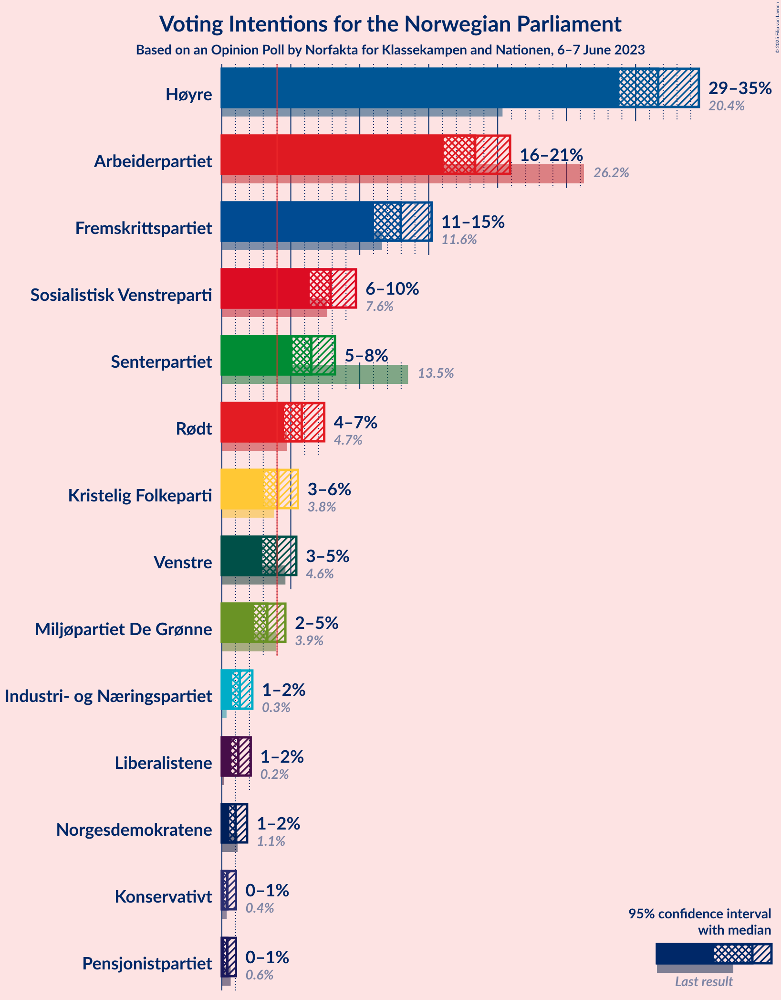

### Confidence Intervals

| Party | Last Result | Poll Result | 80% Confidence Interval | 90% Confidence Interval | 95% Confidence Interval | 99% Confidence Interval |
|:-----:|:-----------:|:-----------:|:-----------------------:|:-----------------------:|:-----------------------:|:-----------------------:|
| Høyre | 20.4% | 31.6% | 29.8–33.6% |29.3–34.1% |28.8–34.6% |28.0–35.5% |
| Arbeiderpartiet | 26.2% | 18.4% | 16.9–20.0% |16.4–20.5% |16.1–20.9% |15.4–21.7% |
| Fremskrittspartiet | 11.6% | 13.0% | 11.7–14.4% |11.3–14.8% |11.0–15.2% |10.4–15.9% |
| Sosialistisk Venstreparti | 7.6% | 7.9% | 6.9–9.1% |6.6–9.4% |6.4–9.7% |5.9–10.3% |
| Senterpartiet | 13.5% | 6.5% | 5.6–7.6% |5.3–7.9% |5.1–8.2% |4.7–8.7% |
| Rødt | 4.7% | 5.8% | 4.9–6.9% |4.7–7.1% |4.5–7.4% |4.1–8.0% |
| Kristelig Folkeparti | 3.8% | 4.1% | 3.4–5.0% |3.2–5.3% |3.0–5.5% |2.7–6.0% |
| Venstre | 4.6% | 4.0% | 3.3–4.9% |3.1–5.2% |2.9–5.4% |2.6–5.9% |
| Miljøpartiet De Grønne | 3.9% | 3.3% | 2.7–4.1% |2.5–4.4% |2.3–4.6% |2.1–5.0% |
| Industri- og Næringspartiet | 0.3% | 1.3% | 0.9–1.9% |0.8–2.1% |0.8–2.2% |0.6–2.5% |
| Liberalistene | 0.2% | 1.2% | 0.9–1.8% |0.8–1.9% |0.7–2.1% |0.5–2.4% |
| Norgesdemokratene | 1.1% | 1.0% | 0.7–1.5% |0.6–1.7% |0.5–1.8% |0.4–2.1% |
| Konservativt | 0.4% | 0.4% | 0.2–0.8% |0.2–0.9% |0.2–1.0% |0.1–1.3% |
| Pensjonistpartiet | 0.6% | 0.4% | 0.2–0.8% |0.2–0.9% |0.2–1.0% |0.1–1.3% |

*Note:* The poll result column reflects the actual value used in the calculations. Published results may vary slightly, and in addition be rounded to fewer digits.

## Seats

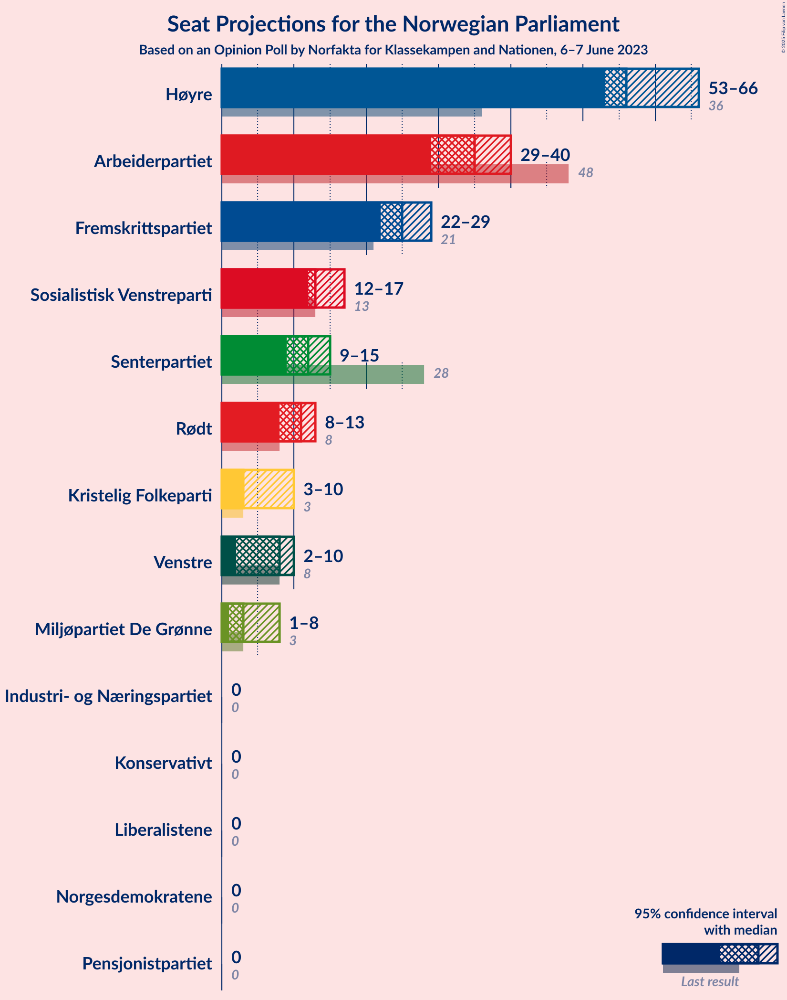

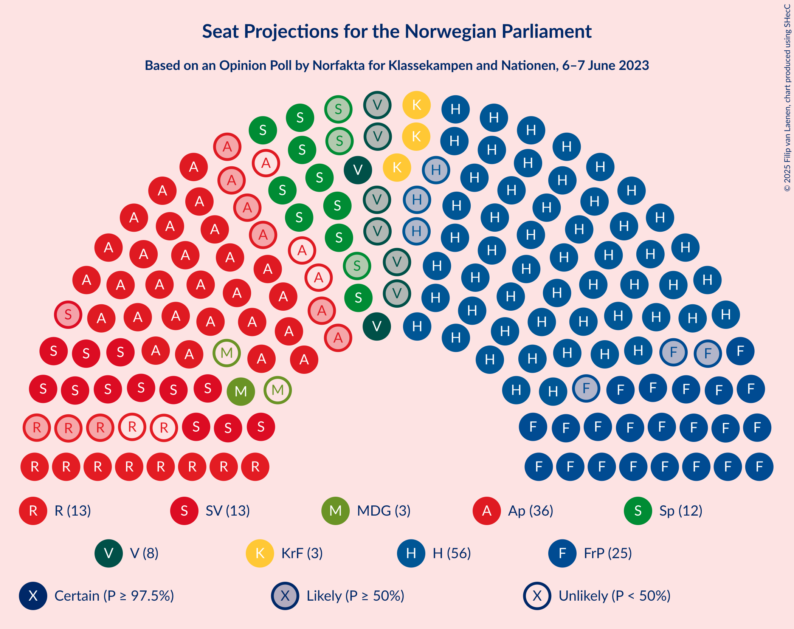

### Confidence Intervals

| Party | Last Result | Median | 80% Confidence Interval | 90% Confidence Interval | 95% Confidence Interval | 99% Confidence Interval |
|:-----:|:-----------:|:------:|:-----------------------:|:-----------------------:|:-----------------------:|:-----------------------:|
| <a href="#høyre">Høyre</a> | 36 | 56 | 53–59 |53–61 |53–66 |51–67 |
| <a href="#arbeiderpartiet">Arbeiderpartiet</a> | 48 | 35 | 29–37 |29–38 |29–40 |29–41 |
| <a href="#fremskrittspartiet">Fremskrittspartiet</a> | 21 | 25 | 23–26 |22–28 |22–29 |19–31 |
| <a href="#sosialistisk-venstreparti">Sosialistisk Venstreparti</a> | 13 | 13 | 12–15 |12–16 |12–17 |10–19 |
| <a href="#senterpartiet">Senterpartiet</a> | 28 | 12 | 10–14 |10–14 |9–15 |8–15 |
| <a href="#rødt">Rødt</a> | 8 | 11 | 9–13 |9–13 |8–13 |1–14 |
| <a href="#kristelig-folkeparti">Kristelig Folkeparti</a> | 3 | 3 | 3–10 |3–10 |3–10 |2–11 |
| <a href="#venstre">Venstre</a> | 8 | 8 | 2–10 |2–10 |2–10 |2–10 |
| <a href="#miljøpartiet-de-grønne">Miljøpartiet De Grønne</a> | 3 | 3 | 1–7 |1–7 |1–8 |1–9 |
| <a href="#industri--og-næringspartiet">Industri- og Næringspartiet</a> | 0 | 0 | 0 |0 |0 |0–2 |
| <a href="#liberalistene">Liberalistene</a> | 0 | 0 | 0 |0 |0 |0 |
| <a href="#norgesdemokratene">Norgesdemokratene</a> | 0 | 0 | 0 |0 |0 |0 |
| <a href="#konservativt">Konservativt</a> | 0 | 0 | 0 |0 |0 |0 |
| <a href="#pensjonistpartiet">Pensjonistpartiet</a> | 0 | 0 | 0 |0 |0 |0 |

### Høyre

*For a full overview of the results for this party, see the [Høyre](party-høyre.html) page.*

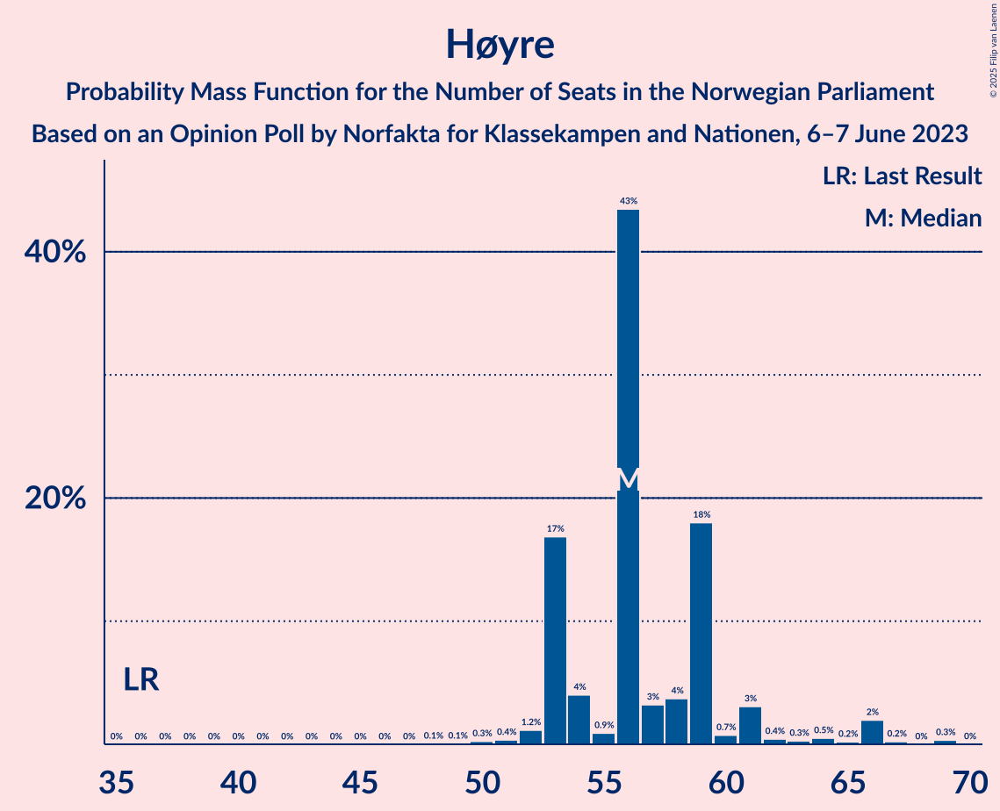

| Number of Seats | Probability | Accumulated | Special Marks |
|:---------------:|:-----------:|:-----------:|:-------------:|
| 36 | 0% | 100% | Last Result |
| 37 | 0% | 100% |  |
| 38 | 0% | 100% |  |
| 39 | 0% | 100% |  |
| 40 | 0% | 100% |  |
| 41 | 0% | 100% |  |
| 42 | 0% | 100% |  |
| 43 | 0% | 100% |  |
| 44 | 0% | 100% |  |
| 45 | 0% | 100% |  |
| 46 | 0% | 100% |  |
| 47 | 0% | 100% |  |
| 48 | 0.1% | 100% |  |
| 49 | 0.1% | 99.9% |  |
| 50 | 0.3% | 99.9% |  |
| 51 | 0.4% | 99.6% |  |
| 52 | 1.2% | 99.3% |  |
| 53 | 17% | 98% |  |
| 54 | 4% | 81% |  |
| 55 | 0.9% | 77% |  |
| 56 | 43% | 76% | Median |
| 57 | 3% | 33% |  |
| 58 | 4% | 30% |  |
| 59 | 18% | 26% |  |
| 60 | 0.7% | 8% |  |
| 61 | 3% | 7% |  |
| 62 | 0.4% | 4% |  |
| 63 | 0.3% | 4% |  |
| 64 | 0.5% | 3% |  |
| 65 | 0.2% | 3% |  |
| 66 | 2% | 3% |  |
| 67 | 0.2% | 0.6% |  |
| 68 | 0% | 0.4% |  |
| 69 | 0.3% | 0.4% |  |
| 70 | 0% | 0% |  |

### Arbeiderpartiet

*For a full overview of the results for this party, see the [Arbeiderpartiet](party-arbeiderpartiet.html) page.*

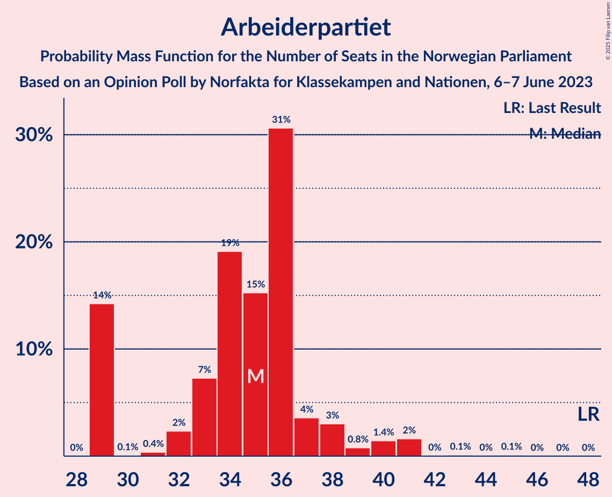

| Number of Seats | Probability | Accumulated | Special Marks |
|:---------------:|:-----------:|:-----------:|:-------------:|
| 29 | 14% | 100% |  |
| 30 | 0.1% | 86% |  |
| 31 | 0.4% | 86% |  |
| 32 | 2% | 85% |  |
| 33 | 7% | 83% |  |
| 34 | 19% | 76% |  |
| 35 | 15% | 57% | Median |
| 36 | 31% | 41% |  |
| 37 | 4% | 11% |  |
| 38 | 3% | 7% |  |
| 39 | 0.8% | 4% |  |
| 40 | 1.4% | 3% |  |
| 41 | 2% | 2% |  |
| 42 | 0% | 0.3% |  |
| 43 | 0.1% | 0.2% |  |
| 44 | 0% | 0.1% |  |
| 45 | 0.1% | 0.1% |  |
| 46 | 0% | 0% |  |
| 47 | 0% | 0% |  |
| 48 | 0% | 0% | Last Result |

### Fremskrittspartiet

*For a full overview of the results for this party, see the [Fremskrittspartiet](party-fremskrittspartiet.html) page.*

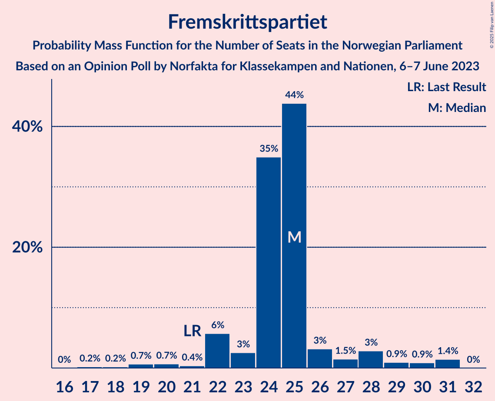

| Number of Seats | Probability | Accumulated | Special Marks |
|:---------------:|:-----------:|:-----------:|:-------------:|
| 17 | 0.2% | 100% |  |
| 18 | 0.2% | 99.8% |  |
| 19 | 0.7% | 99.6% |  |
| 20 | 0.7% | 98.9% |  |
| 21 | 0.4% | 98% | Last Result |
| 22 | 6% | 98% |  |
| 23 | 3% | 92% |  |
| 24 | 35% | 90% |  |
| 25 | 44% | 55% | Median |
| 26 | 3% | 11% |  |
| 27 | 1.5% | 8% |  |
| 28 | 3% | 6% |  |
| 29 | 0.9% | 3% |  |
| 30 | 0.9% | 2% |  |
| 31 | 1.4% | 1.5% |  |
| 32 | 0% | 0% |  |

### Sosialistisk Venstreparti

*For a full overview of the results for this party, see the [Sosialistisk Venstreparti](party-sosialistiskvenstreparti.html) page.*

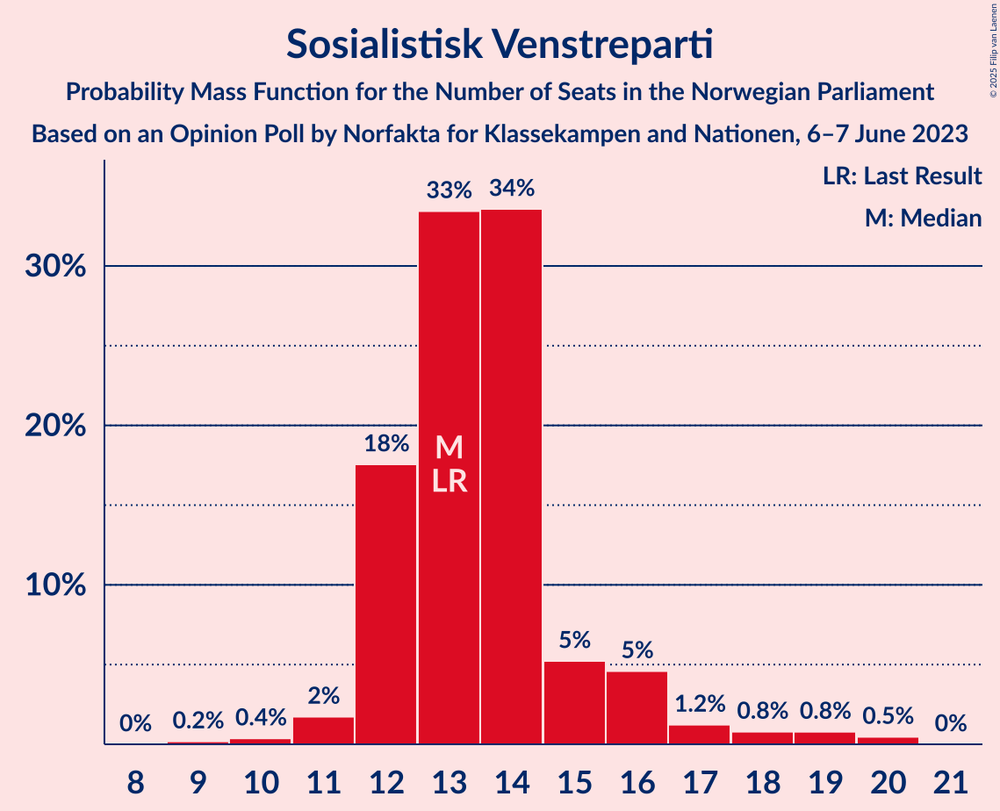

| Number of Seats | Probability | Accumulated | Special Marks |
|:---------------:|:-----------:|:-----------:|:-------------:|
| 9 | 0.2% | 100% |  |
| 10 | 0.4% | 99.8% |  |
| 11 | 2% | 99.4% |  |
| 12 | 18% | 98% |  |
| 13 | 33% | 80% | Last Result, Median |
| 14 | 34% | 47% |  |
| 15 | 5% | 13% |  |
| 16 | 5% | 8% |  |
| 17 | 1.2% | 3% |  |
| 18 | 0.8% | 2% |  |
| 19 | 0.8% | 1.3% |  |
| 20 | 0.5% | 0.5% |  |
| 21 | 0% | 0% |  |

### Senterpartiet

*For a full overview of the results for this party, see the [Senterpartiet](party-senterpartiet.html) page.*

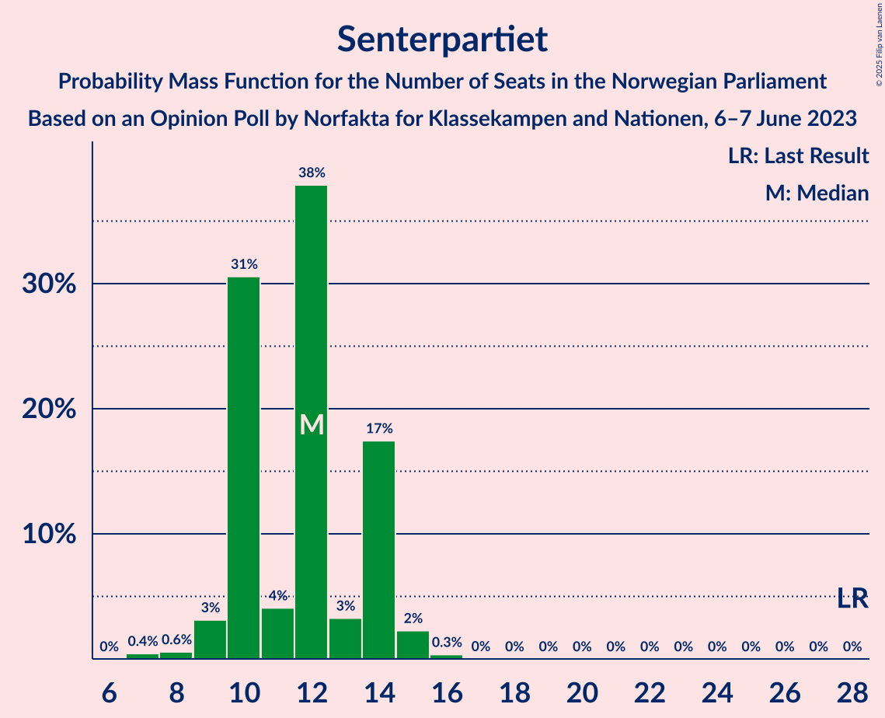

| Number of Seats | Probability | Accumulated | Special Marks |
|:---------------:|:-----------:|:-----------:|:-------------:|
| 7 | 0.4% | 100% |  |
| 8 | 0.6% | 99.6% |  |
| 9 | 3% | 99.0% |  |
| 10 | 31% | 96% |  |
| 11 | 4% | 65% |  |
| 12 | 38% | 61% | Median |
| 13 | 3% | 23% |  |
| 14 | 17% | 20% |  |
| 15 | 2% | 3% |  |
| 16 | 0.3% | 0.4% |  |
| 17 | 0% | 0% |  |
| 18 | 0% | 0% |  |
| 19 | 0% | 0% |  |
| 20 | 0% | 0% |  |
| 21 | 0% | 0% |  |
| 22 | 0% | 0% |  |
| 23 | 0% | 0% |  |
| 24 | 0% | 0% |  |
| 25 | 0% | 0% |  |
| 26 | 0% | 0% |  |
| 27 | 0% | 0% |  |
| 28 | 0% | 0% | Last Result |

### Rødt

*For a full overview of the results for this party, see the [Rødt](party-rødt.html) page.*

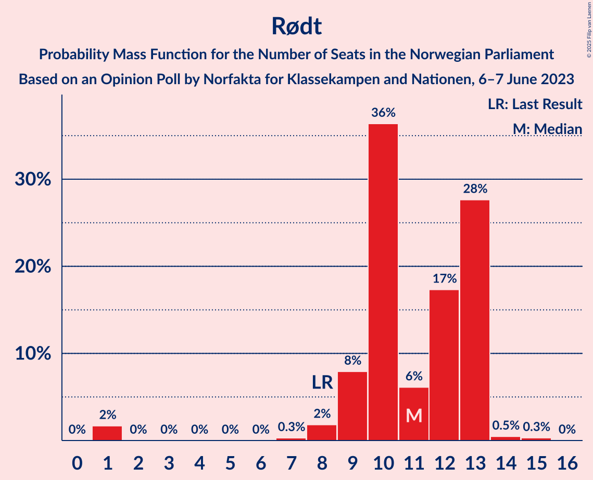

| Number of Seats | Probability | Accumulated | Special Marks |
|:---------------:|:-----------:|:-----------:|:-------------:|
| 1 | 2% | 100% |  |
| 2 | 0% | 98% |  |
| 3 | 0% | 98% |  |
| 4 | 0% | 98% |  |
| 5 | 0% | 98% |  |
| 6 | 0% | 98% |  |
| 7 | 0.3% | 98% |  |
| 8 | 2% | 98% | Last Result |
| 9 | 8% | 96% |  |
| 10 | 36% | 88% |  |
| 11 | 6% | 52% | Median |
| 12 | 17% | 46% |  |
| 13 | 28% | 28% |  |
| 14 | 0.5% | 0.8% |  |
| 15 | 0.3% | 0.3% |  |
| 16 | 0% | 0% |  |

### Kristelig Folkeparti

*For a full overview of the results for this party, see the [Kristelig Folkeparti](party-kristeligfolkeparti.html) page.*

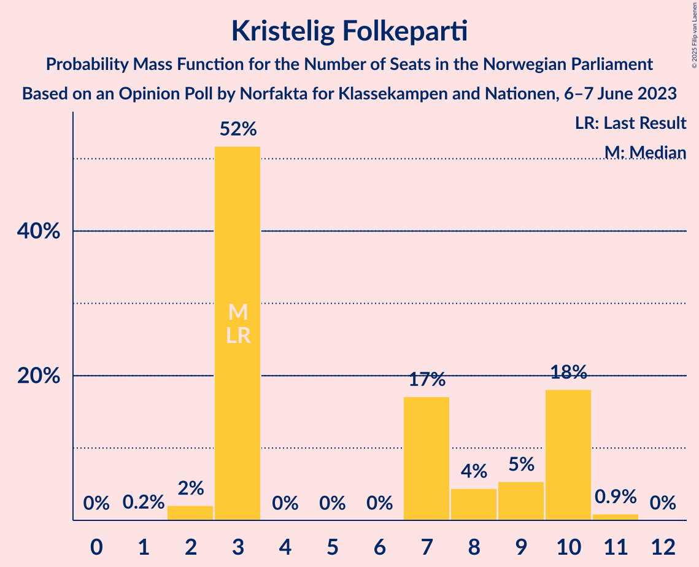

| Number of Seats | Probability | Accumulated | Special Marks |
|:---------------:|:-----------:|:-----------:|:-------------:|
| 1 | 0.2% | 100% |  |
| 2 | 2% | 99.8% |  |
| 3 | 52% | 98% | Last Result, Median |
| 4 | 0% | 46% |  |
| 5 | 0% | 46% |  |
| 6 | 0% | 46% |  |
| 7 | 17% | 46% |  |
| 8 | 4% | 29% |  |
| 9 | 5% | 24% |  |
| 10 | 18% | 19% |  |
| 11 | 0.9% | 0.9% |  |
| 12 | 0% | 0% |  |

### Venstre

*For a full overview of the results for this party, see the [Venstre](party-venstre.html) page.*

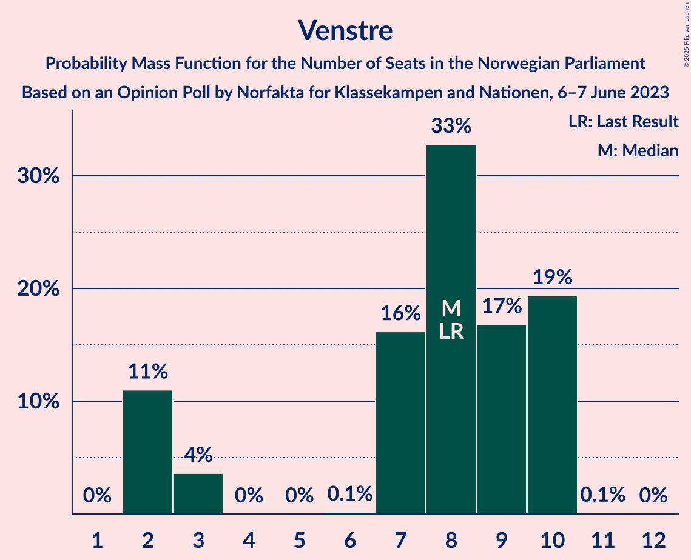

| Number of Seats | Probability | Accumulated | Special Marks |
|:---------------:|:-----------:|:-----------:|:-------------:|
| 2 | 11% | 100% |  |
| 3 | 4% | 89% |  |
| 4 | 0% | 85% |  |
| 5 | 0% | 85% |  |
| 6 | 0.1% | 85% |  |
| 7 | 16% | 85% |  |
| 8 | 33% | 69% | Last Result, Median |
| 9 | 17% | 36% |  |
| 10 | 19% | 19% |  |
| 11 | 0.1% | 0.1% |  |
| 12 | 0% | 0% |  |

### Miljøpartiet De Grønne

*For a full overview of the results for this party, see the [Miljøpartiet De Grønne](party-miljøpartietdegrønne.html) page.*

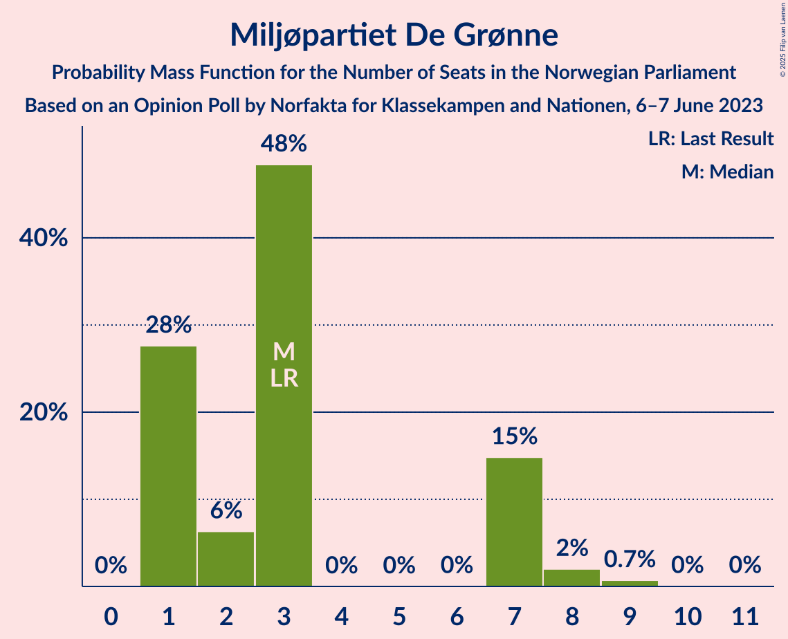

| Number of Seats | Probability | Accumulated | Special Marks |
|:---------------:|:-----------:|:-----------:|:-------------:|
| 1 | 28% | 100% |  |
| 2 | 6% | 72% |  |
| 3 | 48% | 66% | Last Result, Median |
| 4 | 0% | 18% |  |
| 5 | 0% | 18% |  |
| 6 | 0% | 18% |  |
| 7 | 15% | 18% |  |
| 8 | 2% | 3% |  |
| 9 | 0.7% | 0.8% |  |
| 10 | 0% | 0.1% |  |
| 11 | 0% | 0% |  |

### Industri- og Næringspartiet

*For a full overview of the results for this party, see the [Industri- og Næringspartiet](party-industri-ognæringspartiet.html) page.*

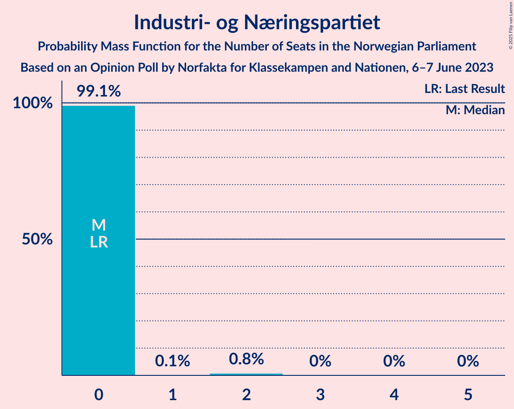

| Number of Seats | Probability | Accumulated | Special Marks |
|:---------------:|:-----------:|:-----------:|:-------------:|
| 0 | 99.1% | 100% | Last Result, Median |
| 1 | 0.1% | 0.9% |  |
| 2 | 0.8% | 0.8% |  |
| 3 | 0% | 0% |  |

### Liberalistene

*For a full overview of the results for this party, see the [Liberalistene](party-liberalistene.html) page.*

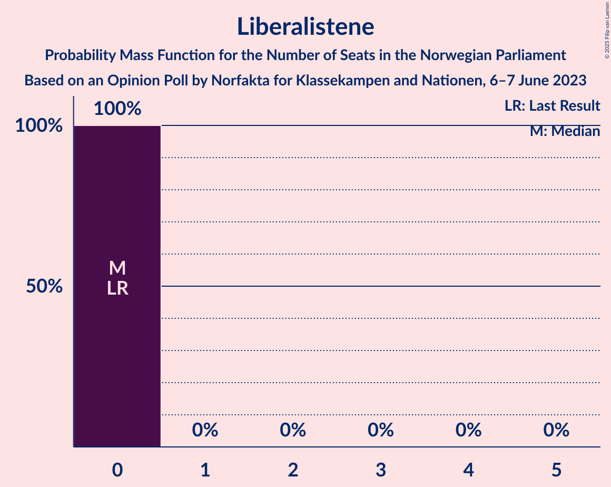

| Number of Seats | Probability | Accumulated | Special Marks |
|:---------------:|:-----------:|:-----------:|:-------------:|
| 0 | 100% | 100% | Last Result, Median |

### Norgesdemokratene

*For a full overview of the results for this party, see the [Norgesdemokratene](party-norgesdemokratene.html) page.*

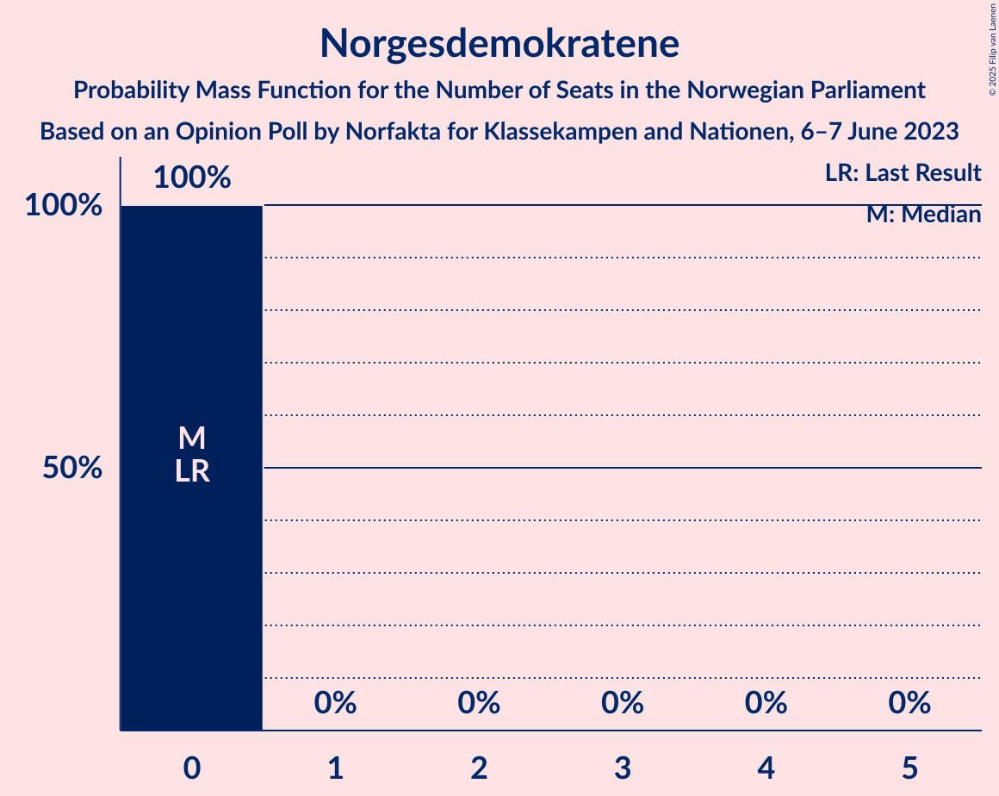

| Number of Seats | Probability | Accumulated | Special Marks |
|:---------------:|:-----------:|:-----------:|:-------------:|
| 0 | 100% | 100% | Last Result, Median |

### Konservativt

*For a full overview of the results for this party, see the [Konservativt](party-konservativt.html) page.*

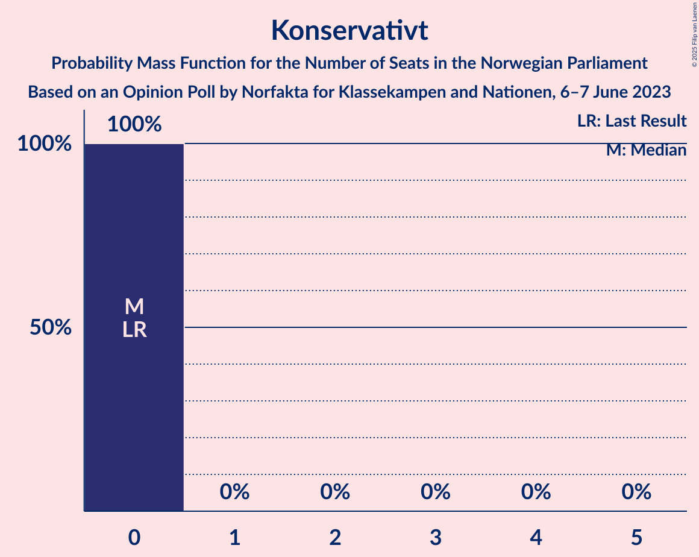

| Number of Seats | Probability | Accumulated | Special Marks |
|:---------------:|:-----------:|:-----------:|:-------------:|
| 0 | 100% | 100% | Last Result, Median |

### Pensjonistpartiet

*For a full overview of the results for this party, see the [Pensjonistpartiet](party-pensjonistpartiet.html) page.*

| Number of Seats | Probability | Accumulated | Special Marks |
|:---------------:|:-----------:|:-----------:|:-------------:|
| 0 | 100% | 100% | Last Result, Median |

## Coalitions

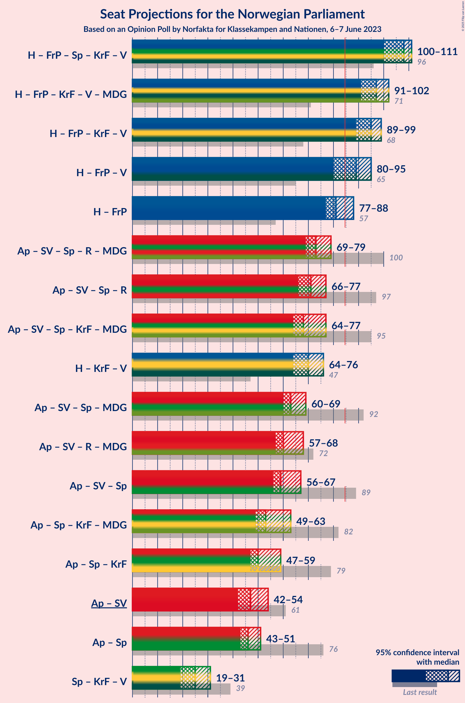

### Confidence Intervals

| Coalition | Last Result | Median | Majority? | 80% Confidence Interval | 90% Confidence Interval | 95% Confidence Interval | 99% Confidence Interval |
|:---------:|:-----------:|:------:|:---------:|:-----------------------:|:-----------------------:|:-----------------------:|:-----------------------:|
| Høyre – Fremskrittspartiet – Senterpartiet – Kristelig Folkeparti – Venstre | 96 | 108 | 100% | 102–109 | 101–111 | 100–111 | 97–112 |
| Høyre – Fremskrittspartiet – Kristelig Folkeparti – Venstre – Miljøpartiet De Grønne | 71 | 97 | 100% | 95–102 | 94–102 | 91–102 | 88–102 |
| Høyre – Fremskrittspartiet – Kristelig Folkeparti – Venstre | 68 | 95 | 99.5% | 92–96 | 91–98 | 89–99 | 85–99 |
| Høyre – Fremskrittspartiet – Venstre | 65 | 89 | 92% | 86–93 | 82–93 | 80–95 | 79–96 |
| Høyre – Fremskrittspartiet | 57 | 81 | 8% | 77–84 | 77–86 | 77–88 | 72–92 |
| Arbeiderpartiet – Sosialistisk Venstreparti – Senterpartiet – Rødt – Miljøpartiet De Grønne | 100 | 73 | 0.1% | 72–76 | 70–77 | 69–79 | 69–83 |
| Arbeiderpartiet – Sosialistisk Venstreparti – Senterpartiet – Rødt | 97 | 71 | 0% | 66–73 | 66–74 | 66–77 | 66–80 |
| Arbeiderpartiet – Sosialistisk Venstreparti – Senterpartiet – Kristelig Folkeparti – Miljøpartiet De Grønne | 95 | 68 | 0% | 65–72 | 65–76 | 64–77 | 63–79 |
| Høyre – Kristelig Folkeparti – Venstre | 47 | 70 | 0% | 67–72 | 65–74 | 64–76 | 61–77 |
| Arbeiderpartiet – Sosialistisk Venstreparti – Senterpartiet – Miljøpartiet De Grønne | 92 | 63 | 0% | 60–66 | 60–68 | 60–69 | 58–71 |
| Arbeiderpartiet – Sosialistisk Venstreparti – Rødt – Miljøpartiet De Grønne | 72 | 60 | 0% | 59–66 | 57–67 | 57–68 | 56–71 |
| Arbeiderpartiet – Sosialistisk Venstreparti – Senterpartiet | 89 | 59 | 0% | 56–63 | 56–65 | 56–67 | 56–68 |
| Arbeiderpartiet – Senterpartiet – Kristelig Folkeparti – Miljøpartiet De Grønne | 82 | 53 | 0% | 52–58 | 52–60 | 49–63 | 47–63 |
| Arbeiderpartiet – Senterpartiet – Kristelig Folkeparti | 79 | 50 | 0% | 49–57 | 49–58 | 47–59 | 46–60 |
| Arbeiderpartiet – Sosialistisk Venstreparti | 61 | 47 | 0% | 42–51 | 42–53 | 42–54 | 42–58 |
| Arbeiderpartiet – Senterpartiet | 76 | 46 | 0% | 43–49 | 43–50 | 43–51 | 43–53 |
| Senterpartiet – Kristelig Folkeparti – Venstre | 39 | 25 | 0% | 21–31 | 20–31 | 19–31 | 16–31 |

### Høyre – Fremskrittspartiet – Senterpartiet – Kristelig Folkeparti – Venstre

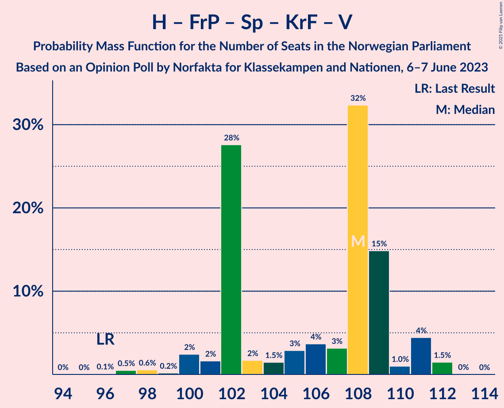

| Number of Seats | Probability | Accumulated | Special Marks |
|:---------------:|:-----------:|:-----------:|:-------------:|
| 96 | 0.1% | 100% | Last Result |
| 97 | 0.5% | 99.9% |  |
| 98 | 0.6% | 99.4% |  |
| 99 | 0.2% | 98.8% |  |
| 100 | 2% | 98.7% |  |
| 101 | 2% | 96% |  |
| 102 | 28% | 95% |  |
| 103 | 2% | 67% |  |
| 104 | 1.5% | 65% | Median |
| 105 | 3% | 64% |  |
| 106 | 4% | 61% |  |
| 107 | 3% | 57% |  |
| 108 | 32% | 54% |  |
| 109 | 15% | 22% |  |
| 110 | 1.0% | 7% |  |
| 111 | 4% | 6% |  |
| 112 | 1.5% | 2% |  |
| 113 | 0% | 0% |  |

### Høyre – Fremskrittspartiet – Kristelig Folkeparti – Venstre – Miljøpartiet De Grønne

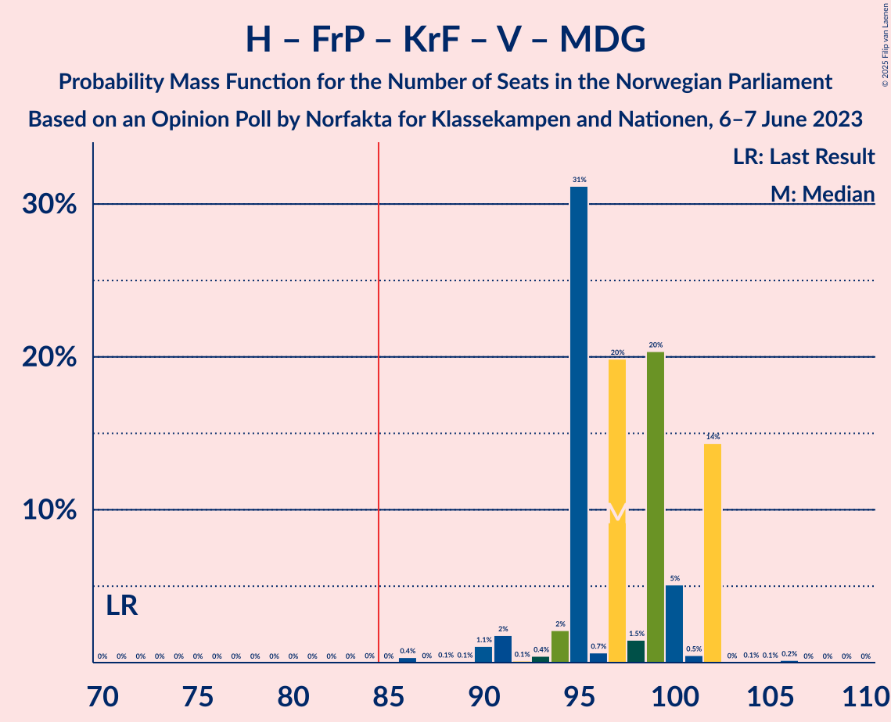

| Number of Seats | Probability | Accumulated | Special Marks |
|:---------------:|:-----------:|:-----------:|:-------------:|
| 71 | 0% | 100% | Last Result |
| 72 | 0% | 100% |  |
| 73 | 0% | 100% |  |
| 74 | 0% | 100% |  |
| 75 | 0% | 100% |  |
| 76 | 0% | 100% |  |
| 77 | 0% | 100% |  |
| 78 | 0% | 100% |  |
| 79 | 0% | 100% |  |
| 80 | 0% | 100% |  |
| 81 | 0% | 100% |  |
| 82 | 0% | 100% |  |
| 83 | 0% | 100% |  |
| 84 | 0% | 100% |  |
| 85 | 0% | 100% | Majority |
| 86 | 0.4% | 99.9% |  |
| 87 | 0% | 99.6% |  |
| 88 | 0.1% | 99.6% |  |
| 89 | 0.1% | 99.5% |  |
| 90 | 1.1% | 99.4% |  |
| 91 | 2% | 98% |  |
| 92 | 0.1% | 97% |  |
| 93 | 0.4% | 96% |  |
| 94 | 2% | 96% |  |
| 95 | 31% | 94% | Median |
| 96 | 0.7% | 63% |  |
| 97 | 20% | 62% |  |
| 98 | 1.5% | 42% |  |
| 99 | 20% | 41% |  |
| 100 | 5% | 20% |  |
| 101 | 0.5% | 15% |  |
| 102 | 14% | 15% |  |
| 103 | 0% | 0.3% |  |
| 104 | 0.1% | 0.3% |  |
| 105 | 0.1% | 0.2% |  |
| 106 | 0.2% | 0.2% |  |
| 107 | 0% | 0% |  |

### Høyre – Fremskrittspartiet – Kristelig Folkeparti – Venstre

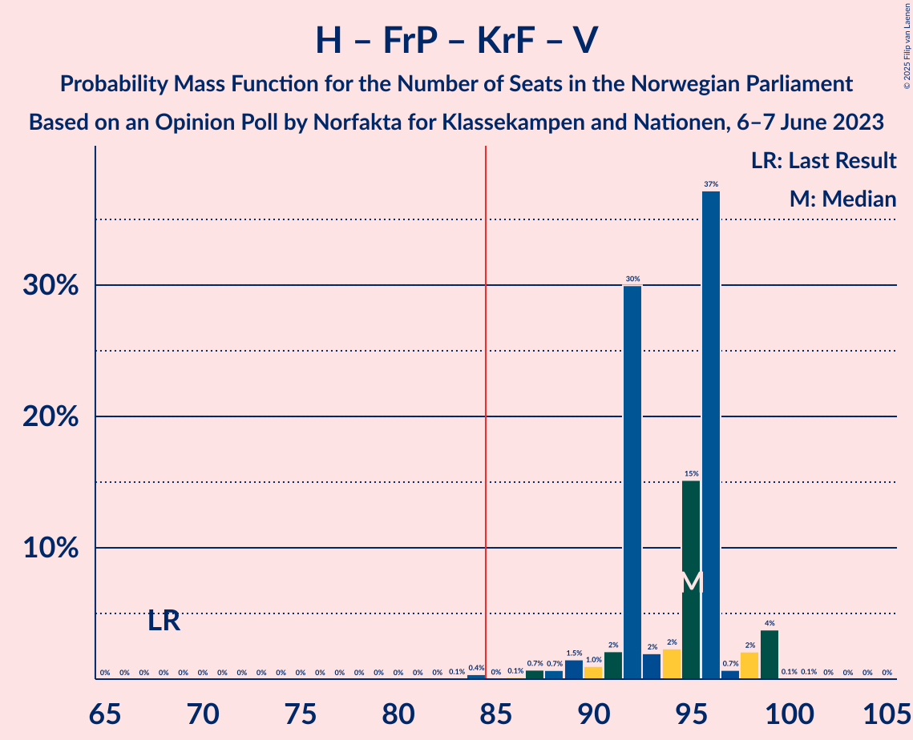

| Number of Seats | Probability | Accumulated | Special Marks |
|:---------------:|:-----------:|:-----------:|:-------------:|
| 68 | 0% | 100% | Last Result |
| 69 | 0% | 100% |  |
| 70 | 0% | 100% |  |
| 71 | 0% | 100% |  |
| 72 | 0% | 100% |  |
| 73 | 0% | 100% |  |
| 74 | 0% | 100% |  |
| 75 | 0% | 100% |  |
| 76 | 0% | 100% |  |
| 77 | 0% | 100% |  |
| 78 | 0% | 100% |  |
| 79 | 0% | 100% |  |
| 80 | 0% | 100% |  |
| 81 | 0% | 100% |  |
| 82 | 0% | 100% |  |
| 83 | 0.1% | 100% |  |
| 84 | 0.4% | 99.9% |  |
| 85 | 0% | 99.5% | Majority |
| 86 | 0.1% | 99.5% |  |
| 87 | 0.7% | 99.3% |  |
| 88 | 0.7% | 98.6% |  |
| 89 | 1.5% | 98% |  |
| 90 | 1.0% | 96% |  |
| 91 | 2% | 95% |  |
| 92 | 30% | 93% | Median |
| 93 | 2% | 63% |  |
| 94 | 2% | 61% |  |
| 95 | 15% | 59% |  |
| 96 | 37% | 44% |  |
| 97 | 0.7% | 7% |  |
| 98 | 2% | 6% |  |
| 99 | 4% | 4% |  |
| 100 | 0.1% | 0.2% |  |
| 101 | 0.1% | 0.1% |  |
| 102 | 0% | 0% |  |

### Høyre – Fremskrittspartiet – Venstre

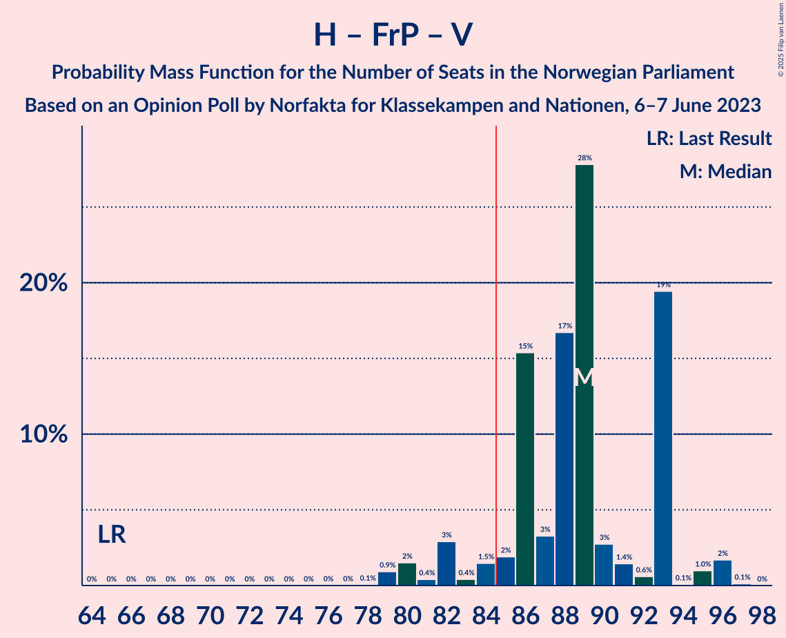

| Number of Seats | Probability | Accumulated | Special Marks |
|:---------------:|:-----------:|:-----------:|:-------------:|
| 65 | 0% | 100% | Last Result |
| 66 | 0% | 100% |  |
| 67 | 0% | 100% |  |
| 68 | 0% | 100% |  |
| 69 | 0% | 100% |  |
| 70 | 0% | 100% |  |
| 71 | 0% | 100% |  |
| 72 | 0% | 100% |  |
| 73 | 0% | 100% |  |
| 74 | 0% | 100% |  |
| 75 | 0% | 100% |  |
| 76 | 0% | 100% |  |
| 77 | 0% | 100% |  |
| 78 | 0.1% | 100% |  |
| 79 | 0.9% | 99.9% |  |
| 80 | 2% | 99.0% |  |
| 81 | 0.4% | 97% |  |
| 82 | 3% | 97% |  |
| 83 | 0.4% | 94% |  |
| 84 | 1.5% | 94% |  |
| 85 | 2% | 92% | Majority |
| 86 | 15% | 90% |  |
| 87 | 3% | 75% |  |
| 88 | 17% | 72% |  |
| 89 | 28% | 55% | Median |
| 90 | 3% | 27% |  |
| 91 | 1.4% | 24% |  |
| 92 | 0.6% | 23% |  |
| 93 | 19% | 22% |  |
| 94 | 0.1% | 3% |  |
| 95 | 1.0% | 3% |  |
| 96 | 2% | 2% |  |
| 97 | 0.1% | 0.1% |  |
| 98 | 0% | 0% |  |

### Høyre – Fremskrittspartiet

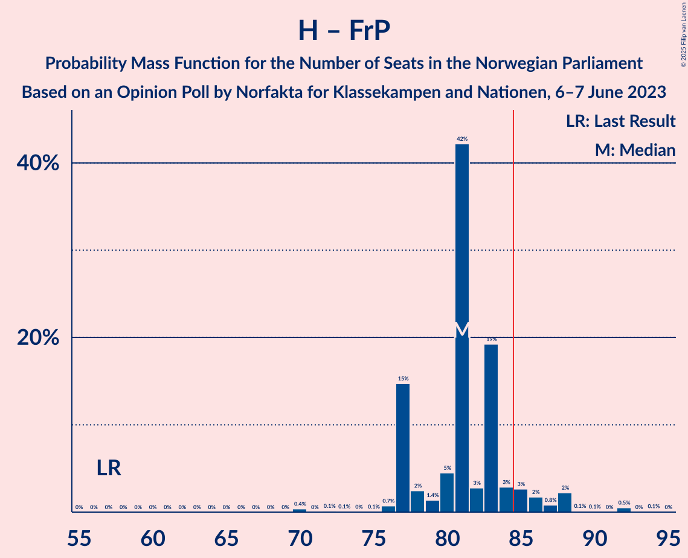

| Number of Seats | Probability | Accumulated | Special Marks |
|:---------------:|:-----------:|:-----------:|:-------------:|
| 57 | 0% | 100% | Last Result |
| 58 | 0% | 100% |  |
| 59 | 0% | 100% |  |
| 60 | 0% | 100% |  |
| 61 | 0% | 100% |  |
| 62 | 0% | 100% |  |
| 63 | 0% | 100% |  |
| 64 | 0% | 100% |  |
| 65 | 0% | 100% |  |
| 66 | 0% | 100% |  |
| 67 | 0% | 100% |  |
| 68 | 0% | 100% |  |
| 69 | 0% | 100% |  |
| 70 | 0.4% | 100% |  |
| 71 | 0% | 99.6% |  |
| 72 | 0.1% | 99.6% |  |
| 73 | 0.1% | 99.4% |  |
| 74 | 0% | 99.4% |  |
| 75 | 0.1% | 99.3% |  |
| 76 | 0.7% | 99.3% |  |
| 77 | 15% | 98.5% |  |
| 78 | 2% | 84% |  |
| 79 | 1.4% | 81% |  |
| 80 | 5% | 80% |  |
| 81 | 42% | 75% | Median |
| 82 | 3% | 33% |  |
| 83 | 19% | 30% |  |
| 84 | 3% | 11% |  |
| 85 | 3% | 8% | Majority |
| 86 | 2% | 6% |  |
| 87 | 0.8% | 4% |  |
| 88 | 2% | 3% |  |
| 89 | 0.1% | 0.9% |  |
| 90 | 0.1% | 0.7% |  |
| 91 | 0% | 0.7% |  |
| 92 | 0.5% | 0.7% |  |
| 93 | 0% | 0.1% |  |
| 94 | 0.1% | 0.1% |  |
| 95 | 0% | 0% |  |

### Arbeiderpartiet – Sosialistisk Venstreparti – Senterpartiet – Rødt – Miljøpartiet De Grønne

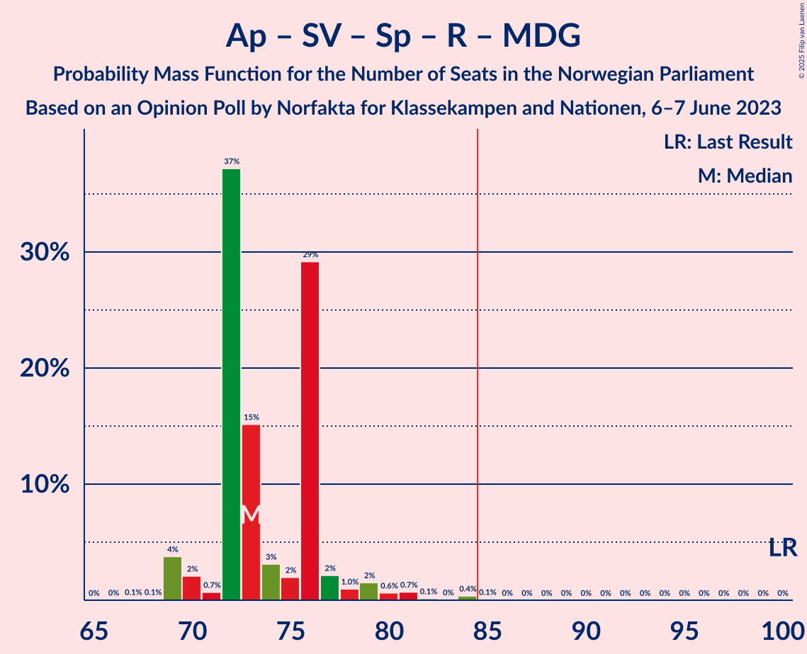

| Number of Seats | Probability | Accumulated | Special Marks |
|:---------------:|:-----------:|:-----------:|:-------------:|
| 67 | 0.1% | 100% |  |
| 68 | 0.1% | 99.9% |  |
| 69 | 4% | 99.8% |  |
| 70 | 2% | 96% |  |
| 71 | 0.7% | 94% |  |
| 72 | 37% | 93% |  |
| 73 | 15% | 56% |  |
| 74 | 3% | 41% | Median |
| 75 | 2% | 38% |  |
| 76 | 29% | 36% |  |
| 77 | 2% | 7% |  |
| 78 | 1.0% | 4% |  |
| 79 | 2% | 4% |  |
| 80 | 0.6% | 2% |  |
| 81 | 0.7% | 1.4% |  |
| 82 | 0.1% | 0.7% |  |
| 83 | 0% | 0.5% |  |
| 84 | 0.4% | 0.5% |  |
| 85 | 0.1% | 0.1% | Majority |
| 86 | 0% | 0% |  |
| 87 | 0% | 0% |  |
| 88 | 0% | 0% |  |
| 89 | 0% | 0% |  |
| 90 | 0% | 0% |  |
| 91 | 0% | 0% |  |
| 92 | 0% | 0% |  |
| 93 | 0% | 0% |  |
| 94 | 0% | 0% |  |
| 95 | 0% | 0% |  |
| 96 | 0% | 0% |  |
| 97 | 0% | 0% |  |
| 98 | 0% | 0% |  |
| 99 | 0% | 0% |  |
| 100 | 0% | 0% | Last Result |

### Arbeiderpartiet – Sosialistisk Venstreparti – Senterpartiet – Rødt

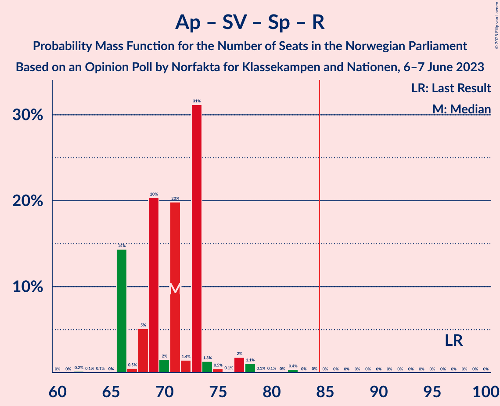

| Number of Seats | Probability | Accumulated | Special Marks |
|:---------------:|:-----------:|:-----------:|:-------------:|
| 62 | 0.2% | 100% |  |
| 63 | 0.1% | 99.8% |  |
| 64 | 0.1% | 99.8% |  |
| 65 | 0% | 99.7% |  |
| 66 | 14% | 99.7% |  |
| 67 | 0.5% | 85% |  |
| 68 | 5% | 85% |  |
| 69 | 20% | 80% |  |
| 70 | 2% | 59% |  |
| 71 | 20% | 58% | Median |
| 72 | 1.4% | 38% |  |
| 73 | 31% | 37% |  |
| 74 | 1.3% | 5% |  |
| 75 | 0.5% | 4% |  |
| 76 | 0.1% | 4% |  |
| 77 | 2% | 3% |  |
| 78 | 1.1% | 2% |  |
| 79 | 0.1% | 0.6% |  |
| 80 | 0.1% | 0.5% |  |
| 81 | 0% | 0.4% |  |
| 82 | 0.4% | 0.4% |  |
| 83 | 0% | 0.1% |  |
| 84 | 0% | 0% |  |
| 85 | 0% | 0% | Majority |
| 86 | 0% | 0% |  |
| 87 | 0% | 0% |  |
| 88 | 0% | 0% |  |
| 89 | 0% | 0% |  |
| 90 | 0% | 0% |  |
| 91 | 0% | 0% |  |
| 92 | 0% | 0% |  |
| 93 | 0% | 0% |  |
| 94 | 0% | 0% |  |
| 95 | 0% | 0% |  |
| 96 | 0% | 0% |  |
| 97 | 0% | 0% | Last Result |

### Arbeiderpartiet – Sosialistisk Venstreparti – Senterpartiet – Kristelig Folkeparti – Miljøpartiet De Grønne

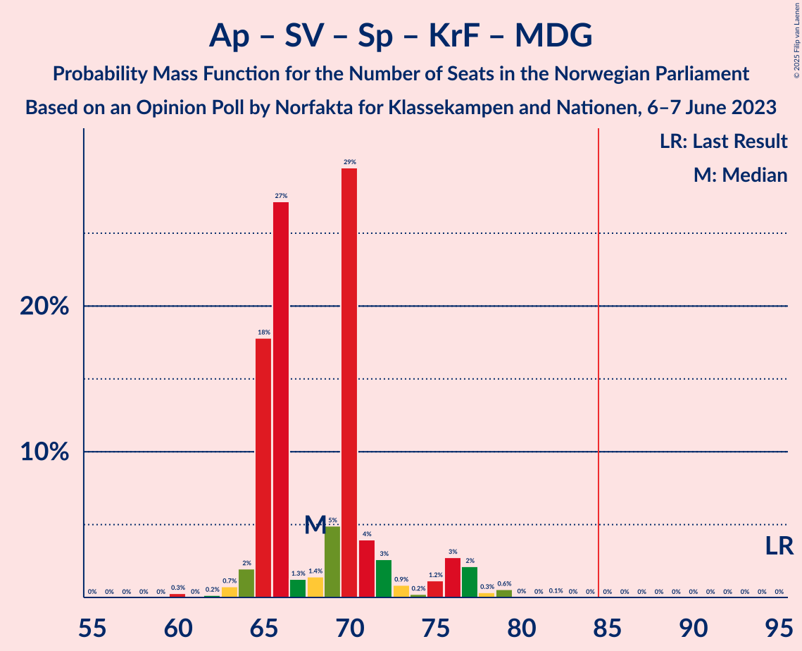

| Number of Seats | Probability | Accumulated | Special Marks |
|:---------------:|:-----------:|:-----------:|:-------------:|
| 60 | 0.3% | 100% |  |
| 61 | 0% | 99.7% |  |
| 62 | 0.2% | 99.7% |  |
| 63 | 0.7% | 99.5% |  |
| 64 | 2% | 98.8% |  |
| 65 | 18% | 97% |  |
| 66 | 27% | 79% | Median |
| 67 | 1.3% | 52% |  |
| 68 | 1.4% | 51% |  |
| 69 | 5% | 49% |  |
| 70 | 29% | 44% |  |
| 71 | 4% | 15% |  |
| 72 | 3% | 11% |  |
| 73 | 0.9% | 8% |  |
| 74 | 0.2% | 7% |  |
| 75 | 1.2% | 7% |  |
| 76 | 3% | 6% |  |
| 77 | 2% | 3% |  |
| 78 | 0.3% | 1.0% |  |
| 79 | 0.6% | 0.7% |  |
| 80 | 0% | 0.1% |  |
| 81 | 0% | 0.1% |  |
| 82 | 0.1% | 0.1% |  |
| 83 | 0% | 0% |  |
| 84 | 0% | 0% |  |
| 85 | 0% | 0% | Majority |
| 86 | 0% | 0% |  |
| 87 | 0% | 0% |  |
| 88 | 0% | 0% |  |
| 89 | 0% | 0% |  |
| 90 | 0% | 0% |  |
| 91 | 0% | 0% |  |
| 92 | 0% | 0% |  |
| 93 | 0% | 0% |  |
| 94 | 0% | 0% |  |
| 95 | 0% | 0% | Last Result |

### Høyre – Kristelig Folkeparti – Venstre

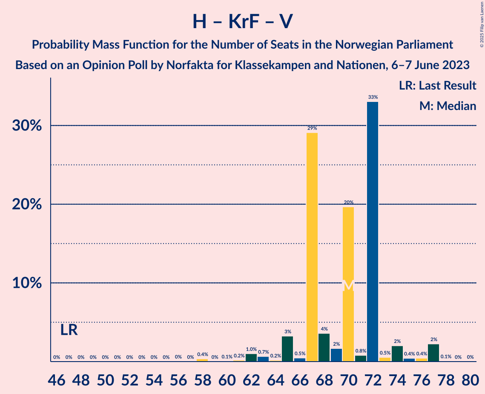

| Number of Seats | Probability | Accumulated | Special Marks |
|:---------------:|:-----------:|:-----------:|:-------------:|
| 47 | 0% | 100% | Last Result |
| 48 | 0% | 100% |  |
| 49 | 0% | 100% |  |
| 50 | 0% | 100% |  |
| 51 | 0% | 100% |  |
| 52 | 0% | 100% |  |
| 53 | 0% | 100% |  |
| 54 | 0% | 100% |  |
| 55 | 0% | 100% |  |
| 56 | 0% | 100% |  |
| 57 | 0% | 100% |  |
| 58 | 0.4% | 99.9% |  |
| 59 | 0% | 99.6% |  |
| 60 | 0.1% | 99.6% |  |
| 61 | 0.2% | 99.5% |  |
| 62 | 1.0% | 99.3% |  |
| 63 | 0.7% | 98% |  |
| 64 | 0.2% | 98% |  |
| 65 | 3% | 97% |  |
| 66 | 0.5% | 94% |  |
| 67 | 29% | 94% | Median |
| 68 | 4% | 65% |  |
| 69 | 2% | 61% |  |
| 70 | 20% | 59% |  |
| 71 | 0.8% | 40% |  |
| 72 | 33% | 39% |  |
| 73 | 0.5% | 6% |  |
| 74 | 2% | 5% |  |
| 75 | 0.4% | 3% |  |
| 76 | 0.4% | 3% |  |
| 77 | 2% | 2% |  |
| 78 | 0.1% | 0.1% |  |
| 79 | 0% | 0% |  |

### Arbeiderpartiet – Sosialistisk Venstreparti – Senterpartiet – Miljøpartiet De Grønne

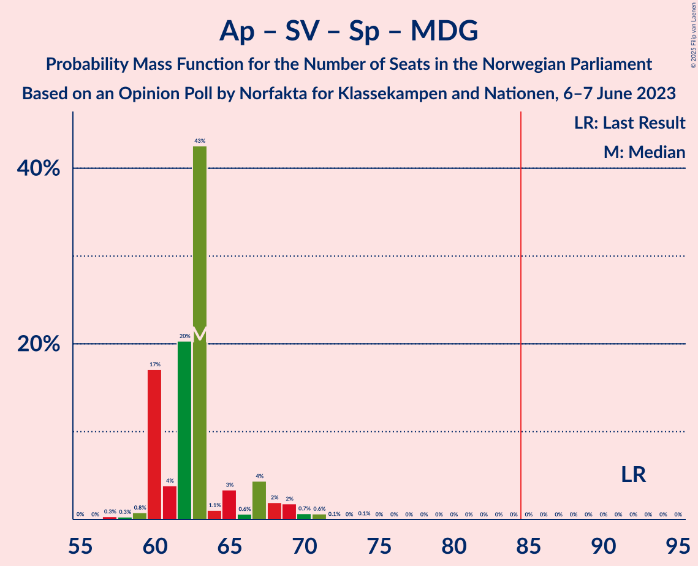

| Number of Seats | Probability | Accumulated | Special Marks |
|:---------------:|:-----------:|:-----------:|:-------------:|
| 55 | 0% | 100% |  |
| 56 | 0% | 99.9% |  |
| 57 | 0.3% | 99.9% |  |
| 58 | 0.3% | 99.6% |  |
| 59 | 0.8% | 99.3% |  |
| 60 | 17% | 98.5% |  |
| 61 | 4% | 81% |  |
| 62 | 20% | 78% |  |
| 63 | 43% | 57% | Median |
| 64 | 1.1% | 15% |  |
| 65 | 3% | 14% |  |
| 66 | 0.6% | 10% |  |
| 67 | 4% | 10% |  |
| 68 | 2% | 5% |  |
| 69 | 2% | 3% |  |
| 70 | 0.7% | 2% |  |
| 71 | 0.6% | 0.9% |  |
| 72 | 0.1% | 0.2% |  |
| 73 | 0% | 0.2% |  |
| 74 | 0.1% | 0.1% |  |
| 75 | 0% | 0% |  |
| 76 | 0% | 0% |  |
| 77 | 0% | 0% |  |
| 78 | 0% | 0% |  |
| 79 | 0% | 0% |  |
| 80 | 0% | 0% |  |
| 81 | 0% | 0% |  |
| 82 | 0% | 0% |  |
| 83 | 0% | 0% |  |
| 84 | 0% | 0% |  |
| 85 | 0% | 0% | Majority |
| 86 | 0% | 0% |  |
| 87 | 0% | 0% |  |
| 88 | 0% | 0% |  |
| 89 | 0% | 0% |  |
| 90 | 0% | 0% |  |
| 91 | 0% | 0% |  |
| 92 | 0% | 0% | Last Result |

### Arbeiderpartiet – Sosialistisk Venstreparti – Rødt – Miljøpartiet De Grønne

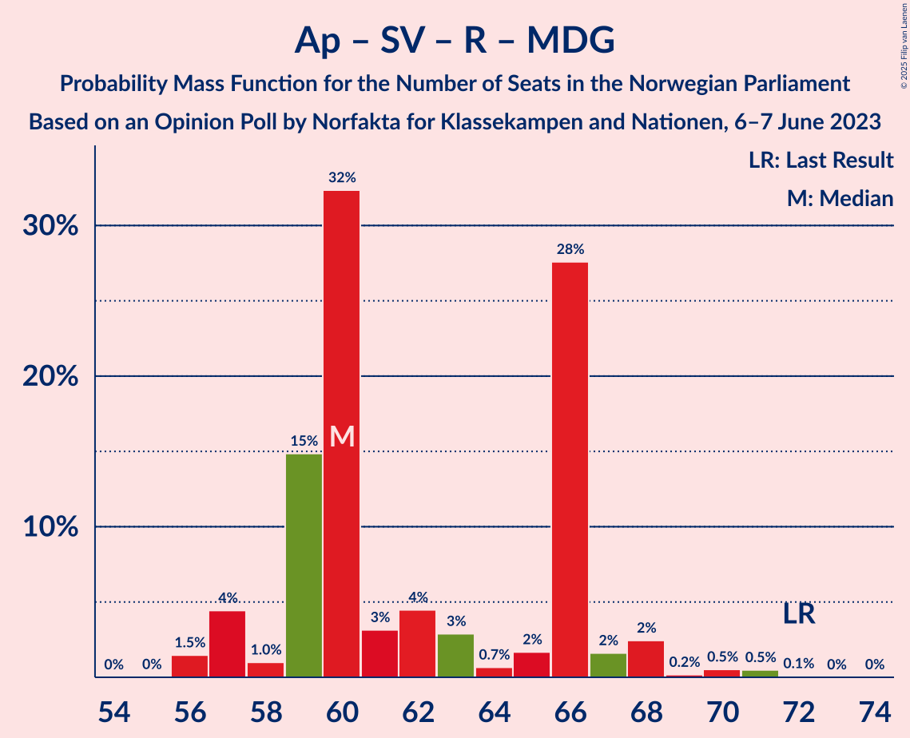

| Number of Seats | Probability | Accumulated | Special Marks |
|:---------------:|:-----------:|:-----------:|:-------------:|
| 56 | 1.5% | 100% |  |
| 57 | 4% | 98% |  |
| 58 | 1.0% | 94% |  |
| 59 | 15% | 93% |  |
| 60 | 32% | 78% |  |
| 61 | 3% | 46% |  |
| 62 | 4% | 43% | Median |
| 63 | 3% | 38% |  |
| 64 | 0.7% | 35% |  |
| 65 | 2% | 35% |  |
| 66 | 28% | 33% |  |
| 67 | 2% | 5% |  |
| 68 | 2% | 4% |  |
| 69 | 0.2% | 1.3% |  |
| 70 | 0.5% | 1.1% |  |
| 71 | 0.5% | 0.6% |  |
| 72 | 0.1% | 0.1% | Last Result |
| 73 | 0% | 0% |  |

### Arbeiderpartiet – Sosialistisk Venstreparti – Senterpartiet

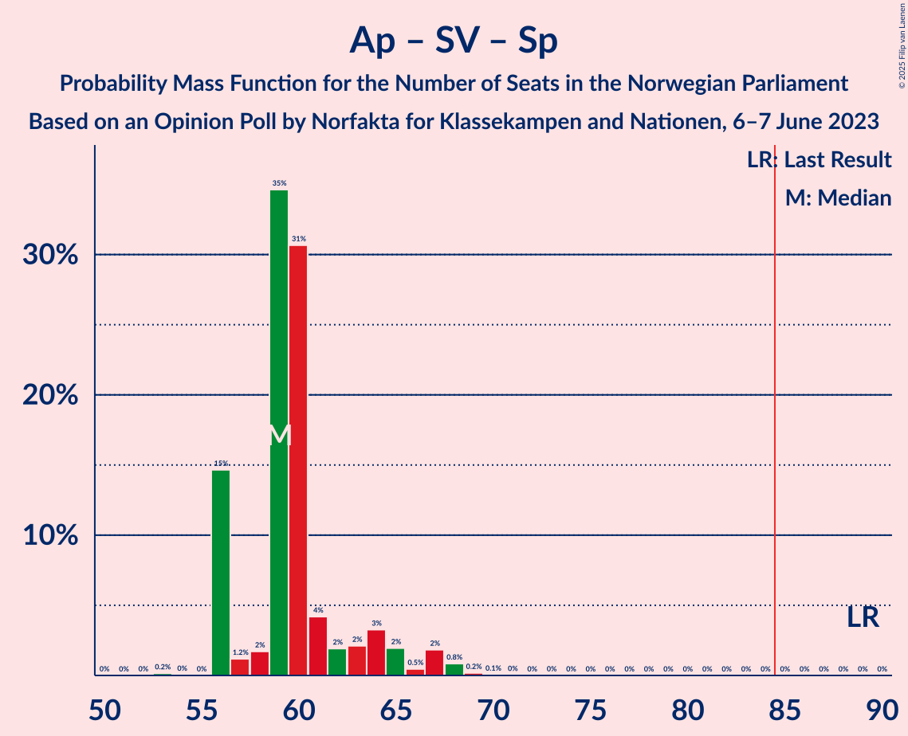

| Number of Seats | Probability | Accumulated | Special Marks |
|:---------------:|:-----------:|:-----------:|:-------------:|
| 53 | 0.2% | 100% |  |
| 54 | 0% | 99.8% |  |
| 55 | 0% | 99.8% |  |
| 56 | 15% | 99.8% |  |
| 57 | 1.2% | 85% |  |
| 58 | 2% | 84% |  |
| 59 | 35% | 82% |  |
| 60 | 31% | 48% | Median |
| 61 | 4% | 17% |  |
| 62 | 2% | 13% |  |
| 63 | 2% | 11% |  |
| 64 | 3% | 9% |  |
| 65 | 2% | 5% |  |
| 66 | 0.5% | 3% |  |
| 67 | 2% | 3% |  |
| 68 | 0.8% | 1.1% |  |
| 69 | 0.2% | 0.3% |  |
| 70 | 0.1% | 0.1% |  |
| 71 | 0% | 0.1% |  |
| 72 | 0% | 0% |  |
| 73 | 0% | 0% |  |
| 74 | 0% | 0% |  |
| 75 | 0% | 0% |  |
| 76 | 0% | 0% |  |
| 77 | 0% | 0% |  |
| 78 | 0% | 0% |  |
| 79 | 0% | 0% |  |
| 80 | 0% | 0% |  |
| 81 | 0% | 0% |  |
| 82 | 0% | 0% |  |
| 83 | 0% | 0% |  |
| 84 | 0% | 0% |  |
| 85 | 0% | 0% | Majority |
| 86 | 0% | 0% |  |
| 87 | 0% | 0% |  |
| 88 | 0% | 0% |  |
| 89 | 0% | 0% | Last Result |

### Arbeiderpartiet – Senterpartiet – Kristelig Folkeparti – Miljøpartiet De Grønne

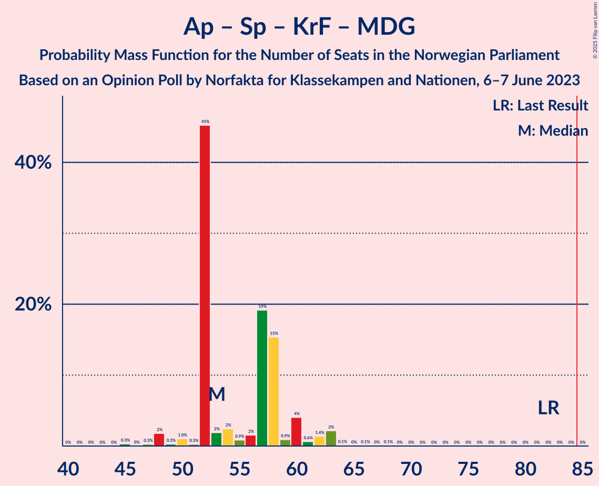

| Number of Seats | Probability | Accumulated | Special Marks |
|:---------------:|:-----------:|:-----------:|:-------------:|
| 45 | 0.3% | 100% |  |
| 46 | 0% | 99.7% |  |
| 47 | 0.3% | 99.7% |  |
| 48 | 2% | 99.4% |  |
| 49 | 0.3% | 98% |  |
| 50 | 1.0% | 97% |  |
| 51 | 0.3% | 96% |  |
| 52 | 45% | 96% |  |
| 53 | 2% | 51% | Median |
| 54 | 2% | 49% |  |
| 55 | 0.9% | 46% |  |
| 56 | 2% | 46% |  |
| 57 | 19% | 44% |  |
| 58 | 15% | 25% |  |
| 59 | 0.9% | 9% |  |
| 60 | 4% | 9% |  |
| 61 | 0.6% | 5% |  |
| 62 | 1.4% | 4% |  |
| 63 | 2% | 3% |  |
| 64 | 0.1% | 0.4% |  |
| 65 | 0% | 0.2% |  |
| 66 | 0.1% | 0.2% |  |
| 67 | 0% | 0.1% |  |
| 68 | 0.1% | 0.1% |  |
| 69 | 0% | 0% |  |
| 70 | 0% | 0% |  |
| 71 | 0% | 0% |  |
| 72 | 0% | 0% |  |
| 73 | 0% | 0% |  |
| 74 | 0% | 0% |  |
| 75 | 0% | 0% |  |
| 76 | 0% | 0% |  |
| 77 | 0% | 0% |  |
| 78 | 0% | 0% |  |
| 79 | 0% | 0% |  |
| 80 | 0% | 0% |  |
| 81 | 0% | 0% |  |
| 82 | 0% | 0% | Last Result |

### Arbeiderpartiet – Senterpartiet – Kristelig Folkeparti

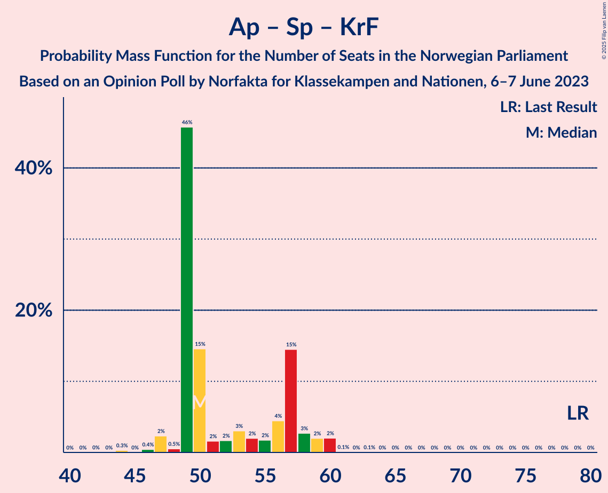

| Number of Seats | Probability | Accumulated | Special Marks |
|:---------------:|:-----------:|:-----------:|:-------------:|
| 44 | 0.3% | 100% |  |
| 45 | 0% | 99.6% |  |
| 46 | 0.4% | 99.6% |  |
| 47 | 2% | 99.2% |  |
| 48 | 0.5% | 97% |  |
| 49 | 46% | 96% |  |
| 50 | 15% | 51% | Median |
| 51 | 2% | 36% |  |
| 52 | 2% | 34% |  |
| 53 | 3% | 33% |  |
| 54 | 2% | 30% |  |
| 55 | 2% | 28% |  |
| 56 | 4% | 26% |  |
| 57 | 15% | 21% |  |
| 58 | 3% | 7% |  |
| 59 | 2% | 4% |  |
| 60 | 2% | 2% |  |
| 61 | 0.1% | 0.2% |  |
| 62 | 0% | 0.1% |  |
| 63 | 0.1% | 0.1% |  |
| 64 | 0% | 0% |  |
| 65 | 0% | 0% |  |
| 66 | 0% | 0% |  |
| 67 | 0% | 0% |  |
| 68 | 0% | 0% |  |
| 69 | 0% | 0% |  |
| 70 | 0% | 0% |  |
| 71 | 0% | 0% |  |
| 72 | 0% | 0% |  |
| 73 | 0% | 0% |  |
| 74 | 0% | 0% |  |
| 75 | 0% | 0% |  |
| 76 | 0% | 0% |  |
| 77 | 0% | 0% |  |
| 78 | 0% | 0% |  |
| 79 | 0% | 0% | Last Result |

### Arbeiderpartiet – Sosialistisk Venstreparti

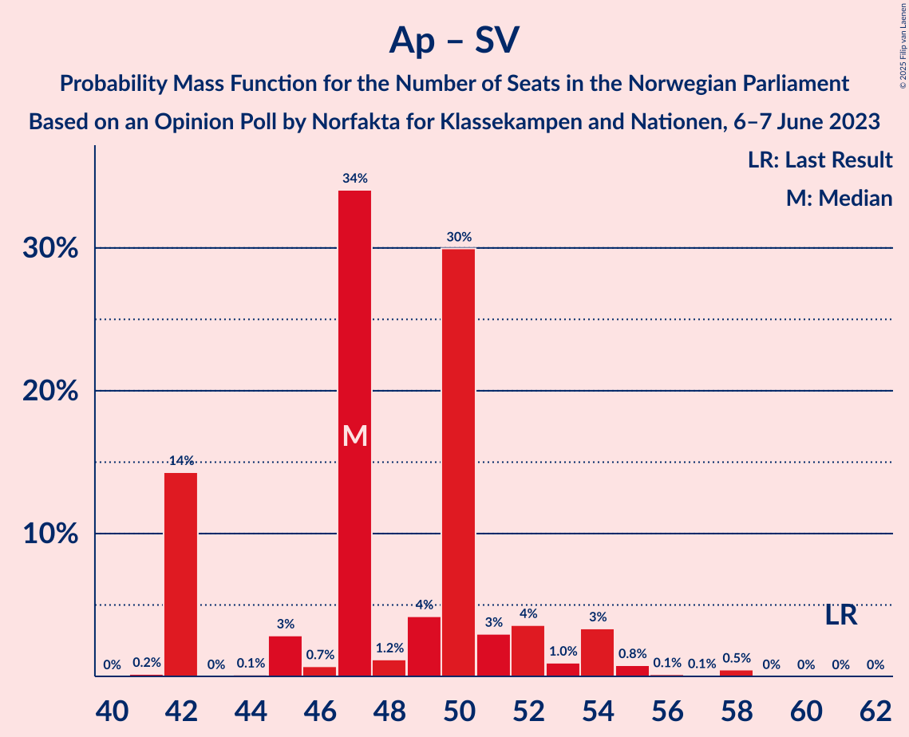

| Number of Seats | Probability | Accumulated | Special Marks |
|:---------------:|:-----------:|:-----------:|:-------------:|
| 41 | 0.2% | 100% |  |
| 42 | 14% | 99.8% |  |
| 43 | 0% | 86% |  |
| 44 | 0.1% | 86% |  |
| 45 | 3% | 85% |  |
| 46 | 0.7% | 83% |  |
| 47 | 34% | 82% |  |
| 48 | 1.2% | 48% | Median |
| 49 | 4% | 47% |  |
| 50 | 30% | 42% |  |
| 51 | 3% | 12% |  |
| 52 | 4% | 9% |  |
| 53 | 1.0% | 6% |  |
| 54 | 3% | 5% |  |
| 55 | 0.8% | 2% |  |
| 56 | 0.1% | 0.7% |  |
| 57 | 0.1% | 0.6% |  |
| 58 | 0.5% | 0.5% |  |
| 59 | 0% | 0% |  |
| 60 | 0% | 0% |  |
| 61 | 0% | 0% | Last Result |

### Arbeiderpartiet – Senterpartiet

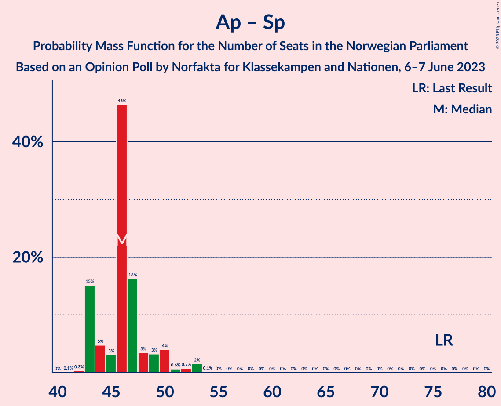

| Number of Seats | Probability | Accumulated | Special Marks |
|:---------------:|:-----------:|:-----------:|:-------------:|
| 40 | 0% | 100% |  |
| 41 | 0.1% | 99.9% |  |
| 42 | 0.3% | 99.8% |  |
| 43 | 15% | 99.5% |  |
| 44 | 5% | 84% |  |
| 45 | 3% | 80% |  |
| 46 | 46% | 77% |  |
| 47 | 16% | 30% | Median |
| 48 | 3% | 14% |  |
| 49 | 3% | 10% |  |
| 50 | 4% | 7% |  |
| 51 | 0.6% | 3% |  |
| 52 | 0.7% | 2% |  |
| 53 | 2% | 2% |  |
| 54 | 0.1% | 0.2% |  |
| 55 | 0% | 0.1% |  |
| 56 | 0% | 0.1% |  |
| 57 | 0% | 0% |  |
| 58 | 0% | 0% |  |
| 59 | 0% | 0% |  |
| 60 | 0% | 0% |  |
| 61 | 0% | 0% |  |
| 62 | 0% | 0% |  |
| 63 | 0% | 0% |  |
| 64 | 0% | 0% |  |
| 65 | 0% | 0% |  |
| 66 | 0% | 0% |  |
| 67 | 0% | 0% |  |
| 68 | 0% | 0% |  |
| 69 | 0% | 0% |  |
| 70 | 0% | 0% |  |
| 71 | 0% | 0% |  |
| 72 | 0% | 0% |  |
| 73 | 0% | 0% |  |
| 74 | 0% | 0% |  |
| 75 | 0% | 0% |  |
| 76 | 0% | 0% | Last Result |

### Senterpartiet – Kristelig Folkeparti – Venstre

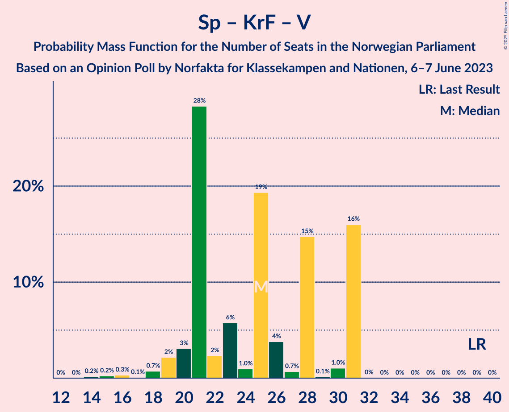

| Number of Seats | Probability | Accumulated | Special Marks |
|:---------------:|:-----------:|:-----------:|:-------------:|
| 14 | 0.2% | 100% |  |
| 15 | 0.2% | 99.8% |  |
| 16 | 0.3% | 99.6% |  |
| 17 | 0.1% | 99.3% |  |
| 18 | 0.7% | 99.2% |  |
| 19 | 2% | 98% |  |
| 20 | 3% | 96% |  |
| 21 | 28% | 93% |  |
| 22 | 2% | 65% |  |
| 23 | 6% | 63% | Median |
| 24 | 1.0% | 57% |  |
| 25 | 19% | 56% |  |
| 26 | 4% | 36% |  |
| 27 | 0.7% | 33% |  |
| 28 | 15% | 32% |  |
| 29 | 0.1% | 17% |  |
| 30 | 1.0% | 17% |  |
| 31 | 16% | 16% |  |
| 32 | 0% | 0.1% |  |
| 33 | 0% | 0% |  |
| 34 | 0% | 0% |  |
| 35 | 0% | 0% |  |
| 36 | 0% | 0% |  |
| 37 | 0% | 0% |  |
| 38 | 0% | 0% |  |
| 39 | 0% | 0% | Last Result |

## Technical Information

### Opinion Poll

+ **Polling firm:** Norfakta
+ **Commissioner(s):** Klassekampen and Nationen
+ **Fieldwork period:** 6–7 June 2023

### Calculations

+ **Sample size:** 1002
+ **Simulations done:** 1,048,576
+ **Error estimate:** 1.68%

