# Opinion Poll by Respons Analyse for VG, 7–12 June 2023

<a href="#voting-intentions">Voting Intentions</a> | <a href="#seats">Seats</a> | <a href="#coalitions">Coalitions</a> | <a href="#technical-information">Technical Information</a>

## Voting Intentions

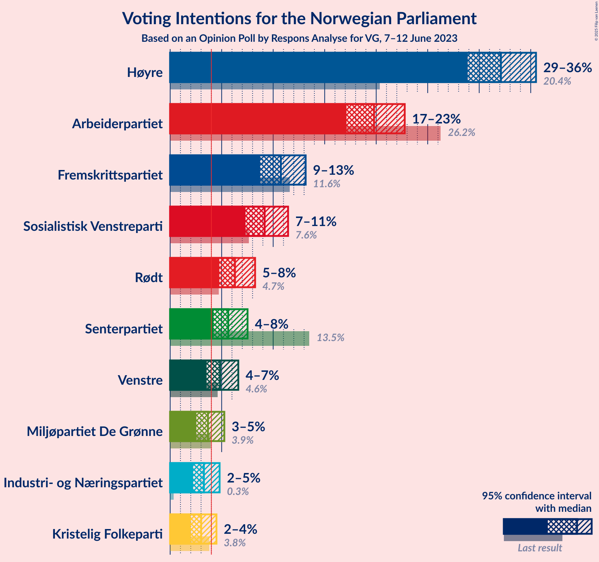

### Confidence Intervals

| Party | Last Result | Poll Result | 80% Confidence Interval | 90% Confidence Interval | 95% Confidence Interval | 99% Confidence Interval |
|:-----:|:-----------:|:-----------:|:-----------------------:|:-----------------------:|:-----------------------:|:-----------------------:|
| Høyre | 20.4% | 32.1% | 30.0–34.3% |29.4–35.0% |28.9–35.5% |27.9–36.6% |
| Arbeiderpartiet | 26.2% | 19.8% | 18.0–21.7% |17.5–22.3% |17.1–22.8% |16.3–23.7% |
| Fremskrittspartiet | 11.6% | 10.7% | 9.4–12.3% |9.1–12.8% |8.7–13.2% |8.1–13.9% |
| Sosialistisk Venstreparti | 7.6% | 9.2% | 8.0–10.7% |7.6–11.1% |7.3–11.4% |6.8–12.2% |
| Rødt | 4.7% | 6.3% | 5.3–7.6% |5.0–7.9% |4.8–8.2% |4.3–8.9% |
| Senterpartiet | 13.5% | 5.6% | 4.7–6.9% |4.4–7.2% |4.2–7.5% |3.8–8.1% |
| Venstre | 4.6% | 4.8% | 4.0–6.0% |3.7–6.3% |3.5–6.6% |3.2–7.2% |
| Miljøpartiet De Grønne | 3.9% | 3.7% | 2.9–4.7% |2.7–5.0% |2.5–5.3% |2.2–5.8% |
| Industri- og Næringspartiet | 0.3% | 3.3% | 2.6–4.3% |2.4–4.5% |2.2–4.8% |1.9–5.3% |
| Kristelig Folkeparti | 3.8% | 3.0% | 2.3–4.0% |2.2–4.3% |2.0–4.5% |1.7–5.0% |

*Note:* The poll result column reflects the actual value used in the calculations. Published results may vary slightly, and in addition be rounded to fewer digits.

## Seats

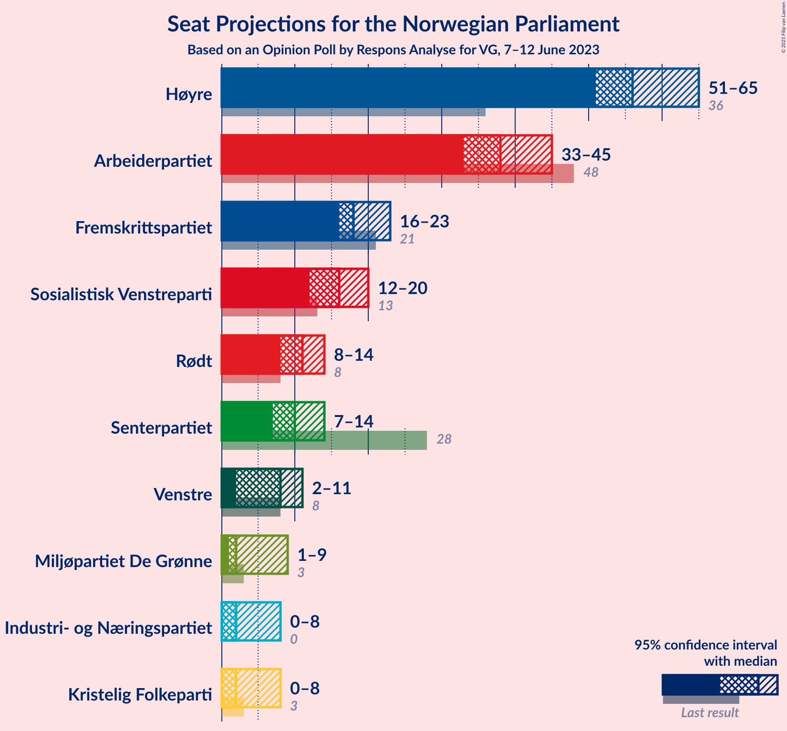

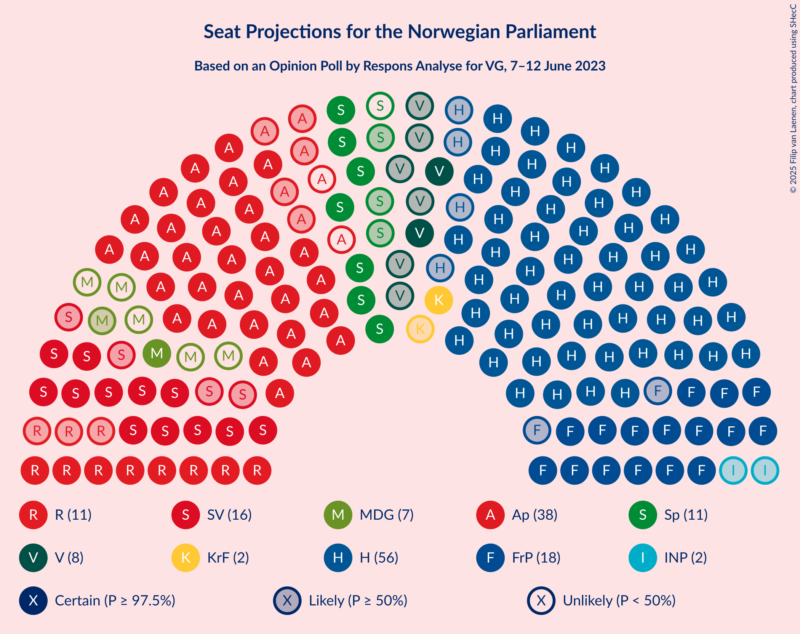

### Confidence Intervals

| Party | Last Result | Median | 80% Confidence Interval | 90% Confidence Interval | 95% Confidence Interval | 99% Confidence Interval |
|:-----:|:-----------:|:------:|:-----------------------:|:-----------------------:|:-----------------------:|:-----------------------:|
| <a href="#høyre">Høyre</a> | 36 | 56 | 52–62 |51–64 |51–65 |48–67 |
| <a href="#arbeiderpartiet">Arbeiderpartiet</a> | 48 | 38 | 34–43 |33–44 |33–45 |32–48 |
| <a href="#fremskrittspartiet">Fremskrittspartiet</a> | 21 | 18 | 17–22 |16–22 |16–23 |13–26 |
| <a href="#sosialistisk-venstreparti">Sosialistisk Venstreparti</a> | 13 | 16 | 13–19 |13–19 |12–20 |11–22 |
| <a href="#rødt">Rødt</a> | 8 | 11 | 9–13 |9–14 |8–14 |7–15 |
| <a href="#senterpartiet">Senterpartiet</a> | 28 | 10 | 8–12 |8–13 |7–14 |1–15 |
| <a href="#venstre">Venstre</a> | 8 | 8 | 3–10 |2–11 |2–11 |2–12 |
| <a href="#miljøpartiet-de-grønne">Miljøpartiet De Grønne</a> | 3 | 2 | 1–8 |1–8 |1–9 |1–10 |
| <a href="#industri--og-næringspartiet">Industri- og Næringspartiet</a> | 0 | 2 | 1–7 |0–7 |0–8 |0–9 |
| <a href="#kristelig-folkeparti">Kristelig Folkeparti</a> | 3 | 2 | 1–3 |0–7 |0–8 |0–9 |

### Høyre

*For a full overview of the results for this party, see the [Høyre](party-høyre.html) page.*

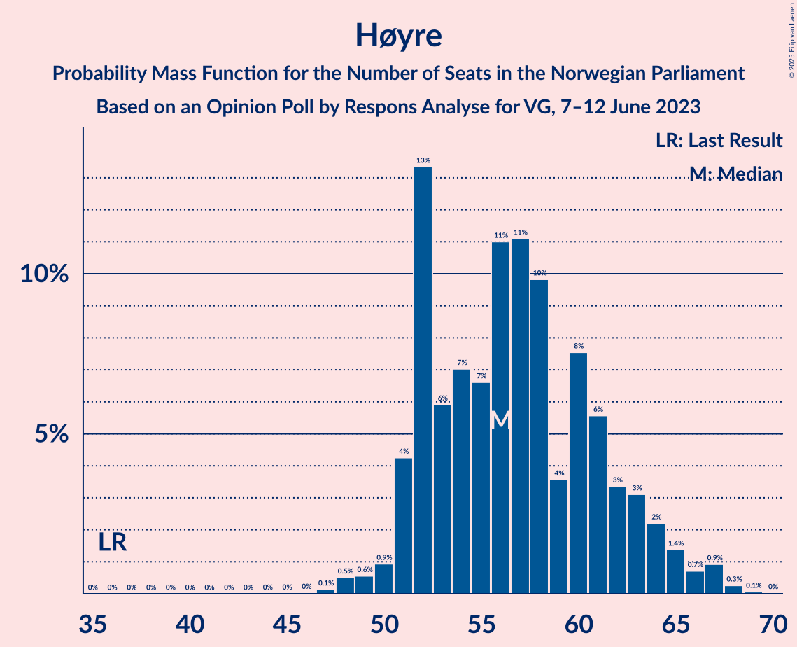

| Number of Seats | Probability | Accumulated | Special Marks |
|:---------------:|:-----------:|:-----------:|:-------------:|
| 36 | 0% | 100% | Last Result |
| 37 | 0% | 100% |  |
| 38 | 0% | 100% |  |
| 39 | 0% | 100% |  |
| 40 | 0% | 100% |  |
| 41 | 0% | 100% |  |
| 42 | 0% | 100% |  |
| 43 | 0% | 100% |  |
| 44 | 0% | 100% |  |
| 45 | 0% | 100% |  |
| 46 | 0% | 100% |  |
| 47 | 0.1% | 100% |  |
| 48 | 0.5% | 99.8% |  |
| 49 | 0.6% | 99.3% |  |
| 50 | 0.9% | 98.8% |  |
| 51 | 4% | 98% |  |
| 52 | 13% | 94% |  |
| 53 | 6% | 80% |  |
| 54 | 7% | 74% |  |
| 55 | 7% | 67% |  |
| 56 | 11% | 61% | Median |
| 57 | 11% | 50% |  |
| 58 | 10% | 39% |  |
| 59 | 4% | 29% |  |
| 60 | 8% | 25% |  |
| 61 | 6% | 18% |  |
| 62 | 3% | 12% |  |
| 63 | 3% | 9% |  |
| 64 | 2% | 6% |  |
| 65 | 1.4% | 3% |  |
| 66 | 0.7% | 2% |  |
| 67 | 0.9% | 1.3% |  |
| 68 | 0.3% | 0.4% |  |
| 69 | 0.1% | 0.1% |  |
| 70 | 0% | 0% |  |

### Arbeiderpartiet

*For a full overview of the results for this party, see the [Arbeiderpartiet](party-arbeiderpartiet.html) page.*

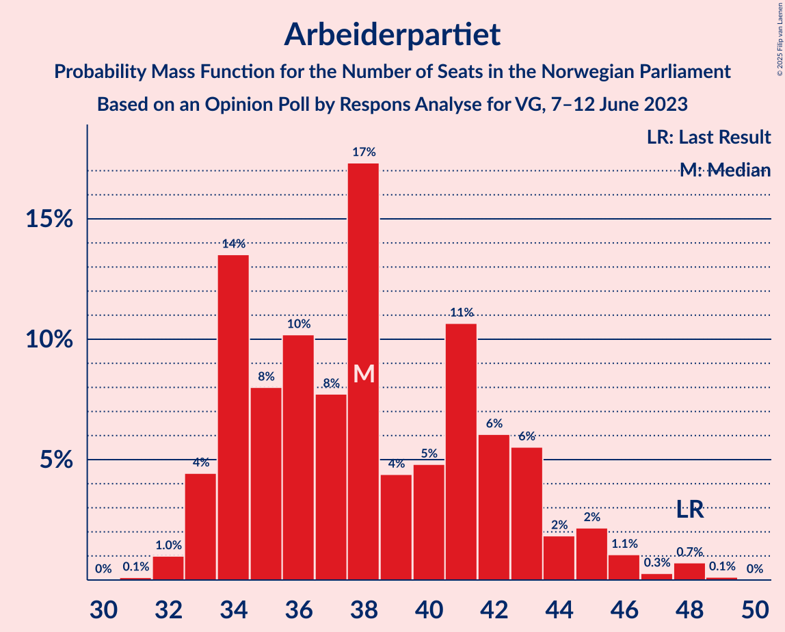

| Number of Seats | Probability | Accumulated | Special Marks |
|:---------------:|:-----------:|:-----------:|:-------------:|
| 31 | 0.1% | 100% |  |
| 32 | 1.0% | 99.9% |  |
| 33 | 4% | 98.9% |  |
| 34 | 14% | 94% |  |
| 35 | 8% | 81% |  |
| 36 | 10% | 73% |  |
| 37 | 8% | 63% |  |
| 38 | 17% | 55% | Median |
| 39 | 4% | 38% |  |
| 40 | 5% | 33% |  |
| 41 | 11% | 28% |  |
| 42 | 6% | 18% |  |
| 43 | 6% | 12% |  |
| 44 | 2% | 6% |  |
| 45 | 2% | 4% |  |
| 46 | 1.1% | 2% |  |
| 47 | 0.3% | 1.1% |  |
| 48 | 0.7% | 0.9% | Last Result |
| 49 | 0.1% | 0.1% |  |
| 50 | 0% | 0% |  |

### Fremskrittspartiet

*For a full overview of the results for this party, see the [Fremskrittspartiet](party-fremskrittspartiet.html) page.*

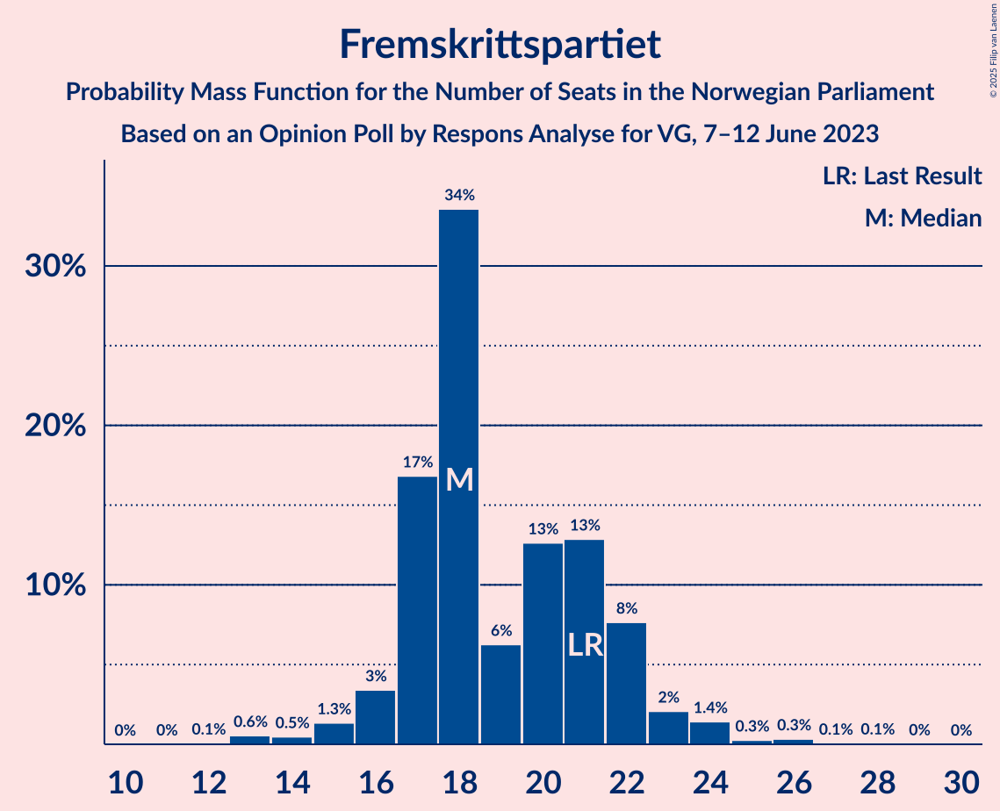

| Number of Seats | Probability | Accumulated | Special Marks |
|:---------------:|:-----------:|:-----------:|:-------------:|
| 12 | 0.1% | 100% |  |
| 13 | 0.6% | 99.9% |  |
| 14 | 0.5% | 99.4% |  |
| 15 | 1.3% | 98.9% |  |
| 16 | 3% | 98% |  |
| 17 | 17% | 94% |  |
| 18 | 34% | 77% | Median |
| 19 | 6% | 44% |  |
| 20 | 13% | 37% |  |
| 21 | 13% | 25% | Last Result |
| 22 | 8% | 12% |  |
| 23 | 2% | 4% |  |
| 24 | 1.4% | 2% |  |
| 25 | 0.3% | 0.8% |  |
| 26 | 0.3% | 0.5% |  |
| 27 | 0.1% | 0.2% |  |
| 28 | 0.1% | 0.1% |  |
| 29 | 0% | 0% |  |

### Sosialistisk Venstreparti

*For a full overview of the results for this party, see the [Sosialistisk Venstreparti](party-sosialistiskvenstreparti.html) page.*

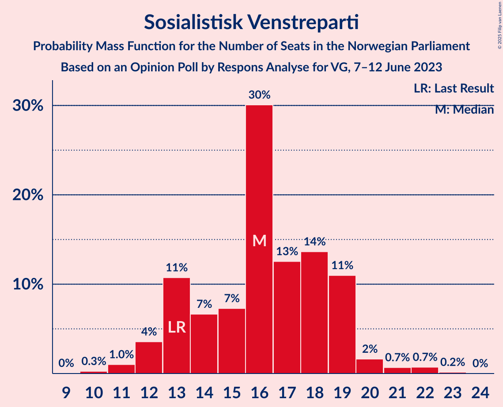

| Number of Seats | Probability | Accumulated | Special Marks |
|:---------------:|:-----------:|:-----------:|:-------------:|
| 10 | 0.3% | 100% |  |
| 11 | 1.0% | 99.7% |  |
| 12 | 4% | 98.7% |  |
| 13 | 11% | 95% | Last Result |
| 14 | 7% | 84% |  |
| 15 | 7% | 78% |  |
| 16 | 30% | 70% | Median |
| 17 | 13% | 40% |  |
| 18 | 14% | 28% |  |
| 19 | 11% | 14% |  |
| 20 | 2% | 3% |  |
| 21 | 0.7% | 2% |  |
| 22 | 0.7% | 0.9% |  |
| 23 | 0.2% | 0.2% |  |
| 24 | 0% | 0% |  |

### Rødt

*For a full overview of the results for this party, see the [Rødt](party-rødt.html) page.*

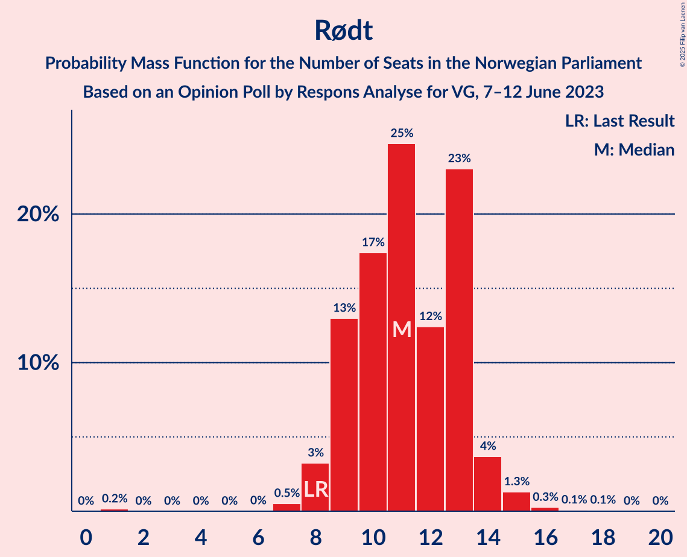

| Number of Seats | Probability | Accumulated | Special Marks |
|:---------------:|:-----------:|:-----------:|:-------------:|
| 1 | 0.2% | 100% |  |
| 2 | 0% | 99.8% |  |
| 3 | 0% | 99.8% |  |
| 4 | 0% | 99.8% |  |
| 5 | 0% | 99.8% |  |
| 6 | 0% | 99.8% |  |
| 7 | 0.5% | 99.8% |  |
| 8 | 3% | 99.3% | Last Result |
| 9 | 13% | 96% |  |
| 10 | 17% | 83% |  |
| 11 | 25% | 66% | Median |
| 12 | 12% | 41% |  |
| 13 | 23% | 28% |  |
| 14 | 4% | 5% |  |
| 15 | 1.3% | 2% |  |
| 16 | 0.3% | 0.4% |  |
| 17 | 0.1% | 0.2% |  |
| 18 | 0.1% | 0.1% |  |
| 19 | 0% | 0% |  |

### Senterpartiet

*For a full overview of the results for this party, see the [Senterpartiet](party-senterpartiet.html) page.*

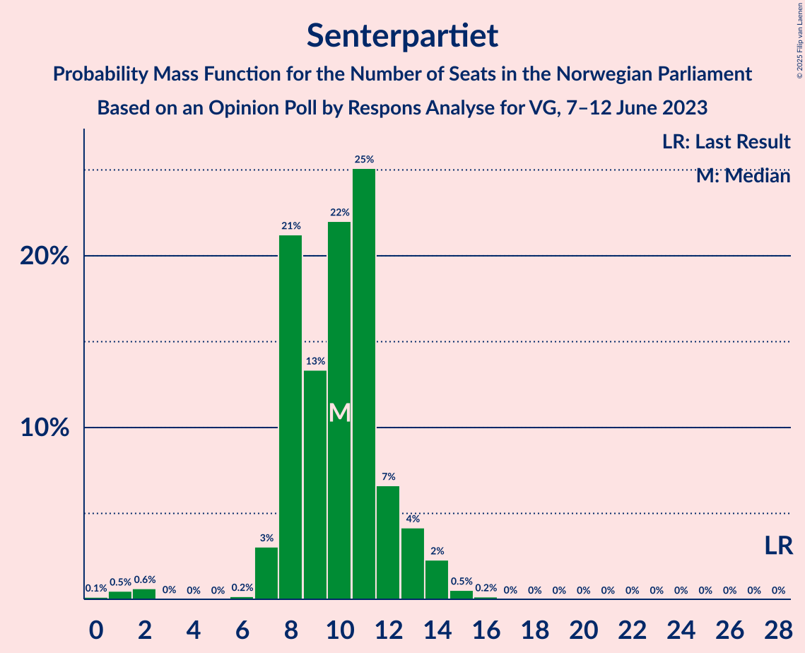

| Number of Seats | Probability | Accumulated | Special Marks |
|:---------------:|:-----------:|:-----------:|:-------------:|
| 0 | 0.1% | 100% |  |
| 1 | 0.5% | 99.9% |  |
| 2 | 0.6% | 99.4% |  |
| 3 | 0% | 98.8% |  |
| 4 | 0% | 98.7% |  |
| 5 | 0% | 98.7% |  |
| 6 | 0.2% | 98.7% |  |
| 7 | 3% | 98.5% |  |
| 8 | 21% | 95% |  |
| 9 | 13% | 74% |  |
| 10 | 22% | 61% | Median |
| 11 | 25% | 39% |  |
| 12 | 7% | 14% |  |
| 13 | 4% | 7% |  |
| 14 | 2% | 3% |  |
| 15 | 0.5% | 0.7% |  |
| 16 | 0.2% | 0.2% |  |
| 17 | 0% | 0% |  |
| 18 | 0% | 0% |  |
| 19 | 0% | 0% |  |
| 20 | 0% | 0% |  |
| 21 | 0% | 0% |  |
| 22 | 0% | 0% |  |
| 23 | 0% | 0% |  |
| 24 | 0% | 0% |  |
| 25 | 0% | 0% |  |
| 26 | 0% | 0% |  |
| 27 | 0% | 0% |  |
| 28 | 0% | 0% | Last Result |

### Venstre

*For a full overview of the results for this party, see the [Venstre](party-venstre.html) page.*

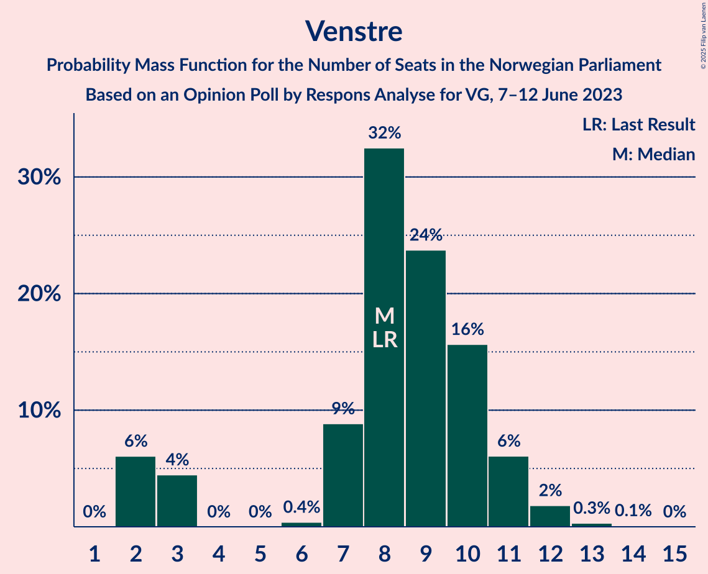

| Number of Seats | Probability | Accumulated | Special Marks |
|:---------------:|:-----------:|:-----------:|:-------------:|
| 2 | 6% | 100% |  |
| 3 | 4% | 94% |  |
| 4 | 0% | 89% |  |
| 5 | 0% | 89% |  |
| 6 | 0.4% | 89% |  |
| 7 | 9% | 89% |  |
| 8 | 32% | 80% | Last Result, Median |
| 9 | 24% | 48% |  |
| 10 | 16% | 24% |  |
| 11 | 6% | 8% |  |
| 12 | 2% | 2% |  |
| 13 | 0.3% | 0.4% |  |
| 14 | 0.1% | 0.1% |  |
| 15 | 0% | 0% |  |

### Miljøpartiet De Grønne

*For a full overview of the results for this party, see the [Miljøpartiet De Grønne](party-miljøpartietdegrønne.html) page.*

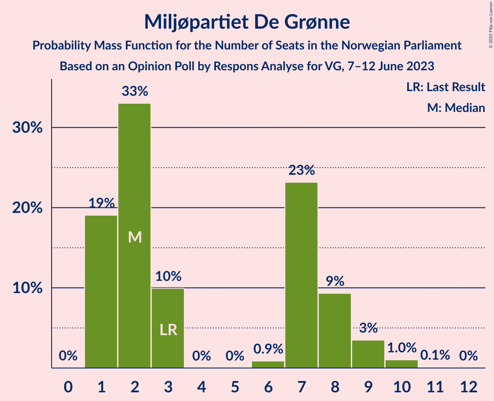

| Number of Seats | Probability | Accumulated | Special Marks |
|:---------------:|:-----------:|:-----------:|:-------------:|
| 1 | 19% | 100% |  |
| 2 | 33% | 81% | Median |
| 3 | 10% | 48% | Last Result |
| 4 | 0% | 38% |  |
| 5 | 0% | 38% |  |
| 6 | 0.9% | 38% |  |
| 7 | 23% | 37% |  |
| 8 | 9% | 14% |  |
| 9 | 3% | 5% |  |
| 10 | 1.0% | 1.1% |  |
| 11 | 0.1% | 0.1% |  |
| 12 | 0% | 0% |  |

### Industri- og Næringspartiet

*For a full overview of the results for this party, see the [Industri- og Næringspartiet](party-industri-ognæringspartiet.html) page.*

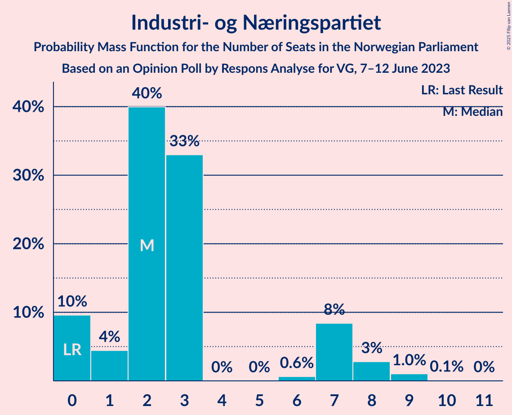

| Number of Seats | Probability | Accumulated | Special Marks |
|:---------------:|:-----------:|:-----------:|:-------------:|
| 0 | 10% | 100% | Last Result |
| 1 | 4% | 90% |  |
| 2 | 40% | 86% | Median |
| 3 | 33% | 46% |  |
| 4 | 0% | 13% |  |
| 5 | 0% | 13% |  |
| 6 | 0.6% | 13% |  |
| 7 | 8% | 12% |  |
| 8 | 3% | 4% |  |
| 9 | 1.0% | 1.2% |  |
| 10 | 0.1% | 0.1% |  |
| 11 | 0% | 0% |  |

### Kristelig Folkeparti

*For a full overview of the results for this party, see the [Kristelig Folkeparti](party-kristeligfolkeparti.html) page.*

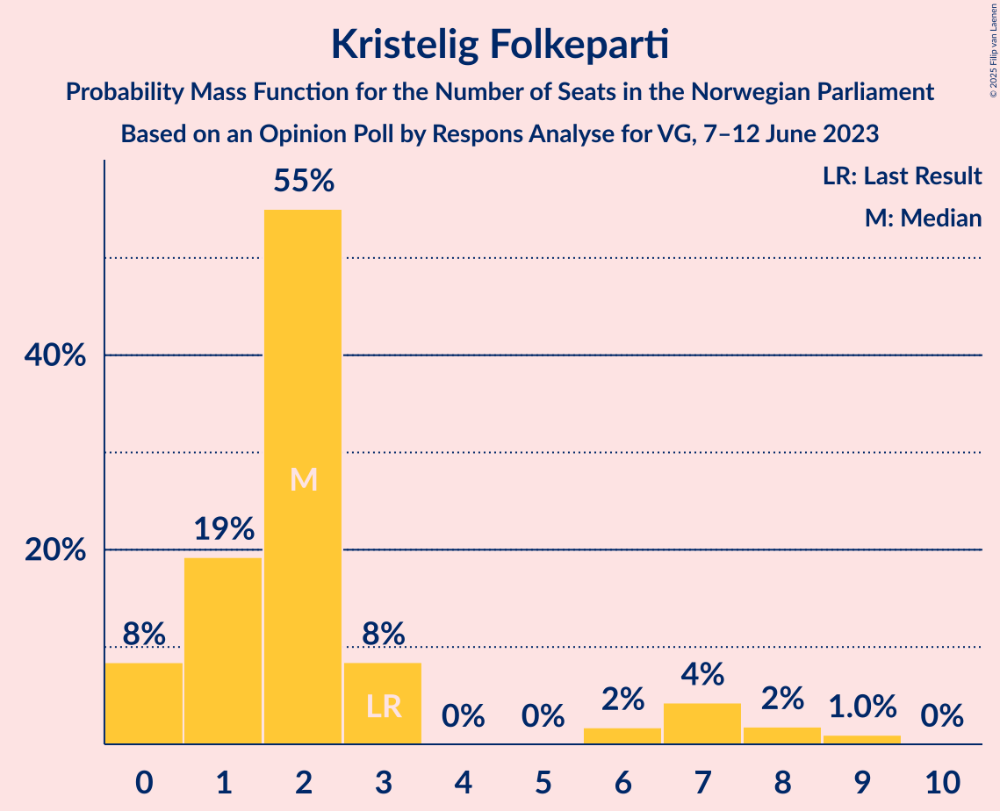

| Number of Seats | Probability | Accumulated | Special Marks |
|:---------------:|:-----------:|:-----------:|:-------------:|
| 0 | 8% | 100% |  |
| 1 | 19% | 92% |  |
| 2 | 55% | 72% | Median |
| 3 | 8% | 17% | Last Result |
| 4 | 0% | 9% |  |
| 5 | 0% | 9% |  |
| 6 | 2% | 9% |  |
| 7 | 4% | 7% |  |
| 8 | 2% | 3% |  |
| 9 | 1.0% | 1.0% |  |
| 10 | 0% | 0% |  |

## Coalitions

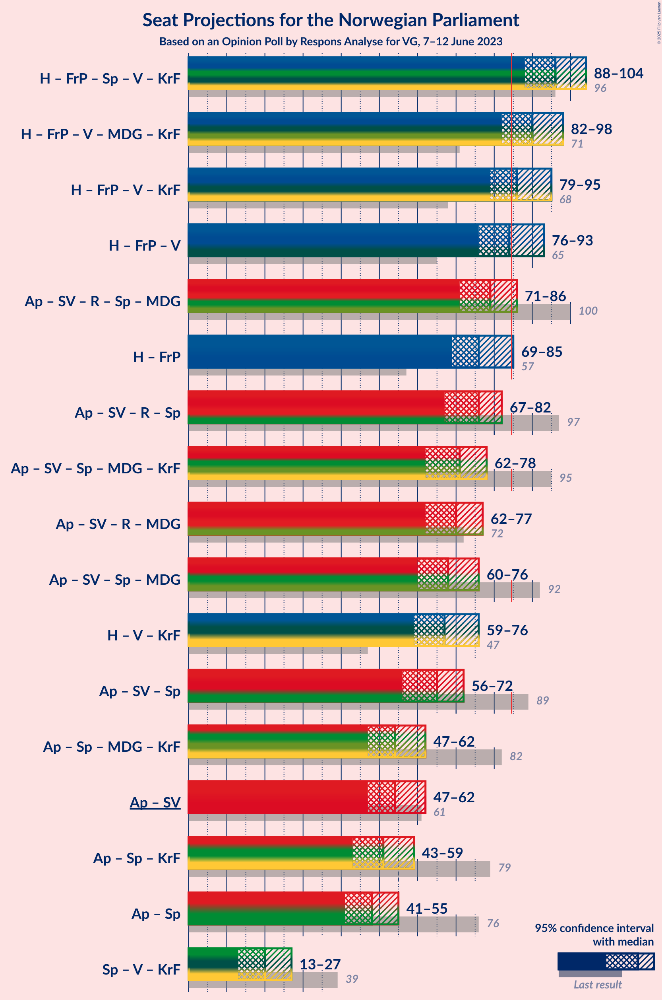

### Confidence Intervals

| Coalition | Last Result | Median | Majority? | 80% Confidence Interval | 90% Confidence Interval | 95% Confidence Interval | 99% Confidence Interval |
|:---------:|:-----------:|:------:|:---------:|:-----------------------:|:-----------------------:|:-----------------------:|:-----------------------:|
| Høyre – Fremskrittspartiet – Senterpartiet – Venstre – Kristelig Folkeparti | 96 | 96 | 99.1% | 91–101 | 89–103 | 88–104 | 84–106 |
| Høyre – Fremskrittspartiet – Venstre – Miljøpartiet De Grønne – Kristelig Folkeparti | 71 | 90 | 94% | 85–96 | 84–97 | 82–98 | 78–103 |
| Høyre – Fremskrittspartiet – Venstre – Kristelig Folkeparti | 68 | 86 | 64% | 80–91 | 80–93 | 79–95 | 75–97 |
| Høyre – Fremskrittspartiet – Venstre | 65 | 84 | 48% | 78–89 | 78–90 | 76–93 | 73–95 |
| Arbeiderpartiet – Sosialistisk Venstreparti – Rødt – Senterpartiet – Miljøpartiet De Grønne | 100 | 79 | 20% | 74–85 | 72–85 | 71–86 | 69–89 |
| Høyre – Fremskrittspartiet | 57 | 76 | 3% | 70–81 | 70–83 | 69–85 | 67–87 |
| Arbeiderpartiet – Sosialistisk Venstreparti – Rødt – Senterpartiet | 97 | 76 | 0.4% | 70–79 | 68–82 | 67–82 | 63–84 |
| Arbeiderpartiet – Sosialistisk Venstreparti – Senterpartiet – Miljøpartiet De Grønne – Kristelig Folkeparti | 95 | 71 | 0% | 65–75 | 63–77 | 62–78 | 60–80 |
| Arbeiderpartiet – Sosialistisk Venstreparti – Rødt – Miljøpartiet De Grønne | 72 | 70 | 0% | 64–74 | 63–76 | 62–77 | 59–79 |
| Arbeiderpartiet – Sosialistisk Venstreparti – Senterpartiet – Miljøpartiet De Grønne | 92 | 68 | 0% | 63–73 | 61–75 | 60–76 | 58–78 |
| Høyre – Venstre – Kristelig Folkeparti | 47 | 67 | 0% | 62–72 | 62–74 | 59–76 | 57–79 |
| Arbeiderpartiet – Sosialistisk Venstreparti – Senterpartiet | 89 | 65 | 0% | 59–69 | 58–70 | 56–72 | 54–73 |
| Arbeiderpartiet – Senterpartiet – Miljøpartiet De Grønne – Kristelig Folkeparti | 82 | 54 | 0% | 48–59 | 47–61 | 47–62 | 43–65 |
| Arbeiderpartiet – Sosialistisk Venstreparti | 61 | 54 | 0% | 50–59 | 48–61 | 47–62 | 46–64 |
| Arbeiderpartiet – Senterpartiet – Kristelig Folkeparti | 79 | 51 | 0% | 45–54 | 45–57 | 43–59 | 41–60 |
| Arbeiderpartiet – Senterpartiet | 76 | 48 | 0% | 44–52 | 43–54 | 41–55 | 40–57 |
| Senterpartiet – Venstre – Kristelig Folkeparti | 39 | 20 | 0% | 16–24 | 14–26 | 13–27 | 11–28 |

### Høyre – Fremskrittspartiet – Senterpartiet – Venstre – Kristelig Folkeparti

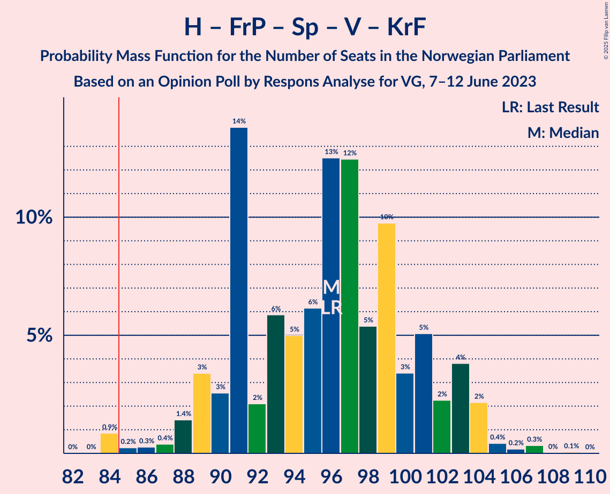

| Number of Seats | Probability | Accumulated | Special Marks |
|:---------------:|:-----------:|:-----------:|:-------------:|
| 83 | 0% | 100% |  |
| 84 | 0.9% | 99.9% |  |
| 85 | 0.2% | 99.1% | Majority |
| 86 | 0.3% | 98.8% |  |
| 87 | 0.4% | 98.6% |  |
| 88 | 1.4% | 98% |  |
| 89 | 3% | 97% |  |
| 90 | 3% | 93% |  |
| 91 | 14% | 91% |  |
| 92 | 2% | 77% |  |
| 93 | 6% | 75% |  |
| 94 | 5% | 69% | Median |
| 95 | 6% | 64% |  |
| 96 | 13% | 58% | Last Result |
| 97 | 12% | 45% |  |
| 98 | 5% | 33% |  |
| 99 | 10% | 28% |  |
| 100 | 3% | 18% |  |
| 101 | 5% | 14% |  |
| 102 | 2% | 9% |  |
| 103 | 4% | 7% |  |
| 104 | 2% | 3% |  |
| 105 | 0.4% | 1.1% |  |
| 106 | 0.2% | 0.6% |  |
| 107 | 0.3% | 0.5% |  |
| 108 | 0% | 0.1% |  |
| 109 | 0.1% | 0.1% |  |
| 110 | 0% | 0% |  |

### Høyre – Fremskrittspartiet – Venstre – Miljøpartiet De Grønne – Kristelig Folkeparti

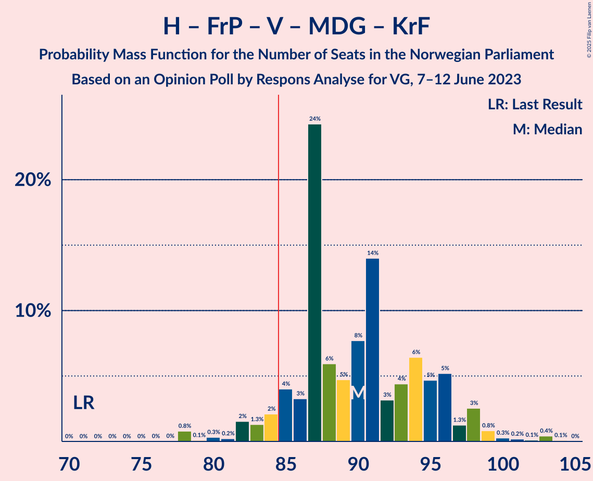

| Number of Seats | Probability | Accumulated | Special Marks |
|:---------------:|:-----------:|:-----------:|:-------------:|
| 71 | 0% | 100% | Last Result |
| 72 | 0% | 100% |  |
| 73 | 0% | 100% |  |
| 74 | 0% | 100% |  |
| 75 | 0% | 100% |  |
| 76 | 0% | 100% |  |
| 77 | 0% | 100% |  |
| 78 | 0.8% | 100% |  |
| 79 | 0.1% | 99.2% |  |
| 80 | 0.3% | 99.1% |  |
| 81 | 0.2% | 98.7% |  |
| 82 | 2% | 98.5% |  |
| 83 | 1.3% | 97% |  |
| 84 | 2% | 96% |  |
| 85 | 4% | 94% | Majority |
| 86 | 3% | 90% | Median |
| 87 | 24% | 86% |  |
| 88 | 6% | 62% |  |
| 89 | 5% | 56% |  |
| 90 | 8% | 51% |  |
| 91 | 14% | 44% |  |
| 92 | 3% | 30% |  |
| 93 | 4% | 26% |  |
| 94 | 6% | 22% |  |
| 95 | 5% | 16% |  |
| 96 | 5% | 11% |  |
| 97 | 1.3% | 6% |  |
| 98 | 3% | 4% |  |
| 99 | 0.8% | 2% |  |
| 100 | 0.3% | 1.1% |  |
| 101 | 0.2% | 0.8% |  |
| 102 | 0.1% | 0.6% |  |
| 103 | 0.4% | 0.5% |  |
| 104 | 0.1% | 0.1% |  |
| 105 | 0% | 0% |  |

### Høyre – Fremskrittspartiet – Venstre – Kristelig Folkeparti

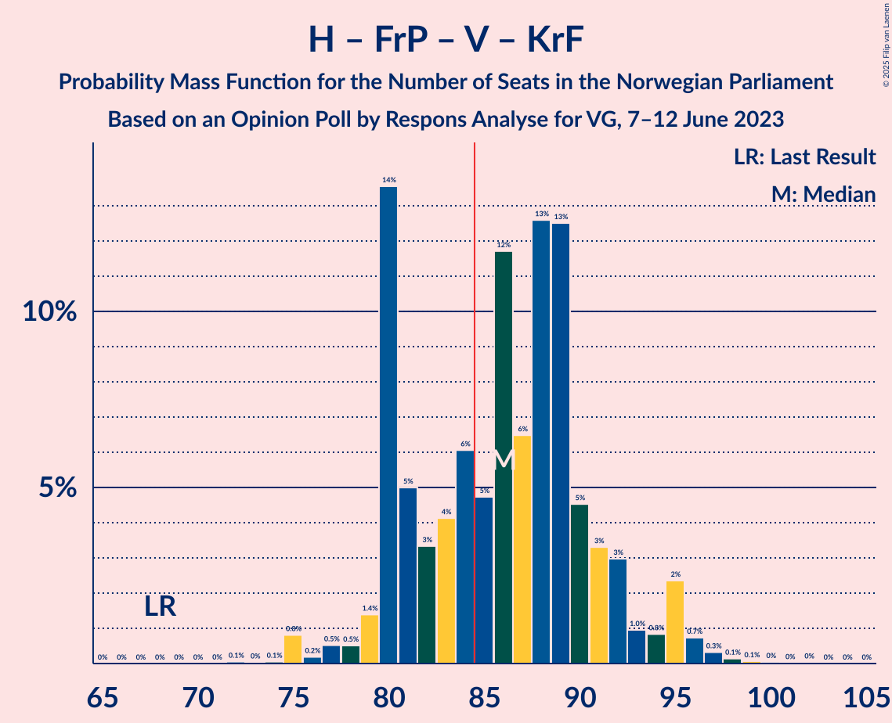

| Number of Seats | Probability | Accumulated | Special Marks |
|:---------------:|:-----------:|:-----------:|:-------------:|
| 68 | 0% | 100% | Last Result |
| 69 | 0% | 100% |  |
| 70 | 0% | 100% |  |
| 71 | 0% | 100% |  |
| 72 | 0.1% | 100% |  |
| 73 | 0% | 99.9% |  |
| 74 | 0.1% | 99.9% |  |
| 75 | 0.8% | 99.9% |  |
| 76 | 0.2% | 99.0% |  |
| 77 | 0.5% | 98.9% |  |
| 78 | 0.5% | 98% |  |
| 79 | 1.4% | 98% |  |
| 80 | 14% | 96% |  |
| 81 | 5% | 83% |  |
| 82 | 3% | 78% |  |
| 83 | 4% | 75% |  |
| 84 | 6% | 70% | Median |
| 85 | 5% | 64% | Majority |
| 86 | 12% | 60% |  |
| 87 | 6% | 48% |  |
| 88 | 13% | 41% |  |
| 89 | 13% | 29% |  |
| 90 | 5% | 16% |  |
| 91 | 3% | 12% |  |
| 92 | 3% | 8% |  |
| 93 | 1.0% | 6% |  |
| 94 | 0.8% | 5% |  |
| 95 | 2% | 4% |  |
| 96 | 0.7% | 1.4% |  |
| 97 | 0.3% | 0.6% |  |
| 98 | 0.1% | 0.3% |  |
| 99 | 0.1% | 0.2% |  |
| 100 | 0% | 0.1% |  |
| 101 | 0% | 0.1% |  |
| 102 | 0% | 0% |  |

### Høyre – Fremskrittspartiet – Venstre

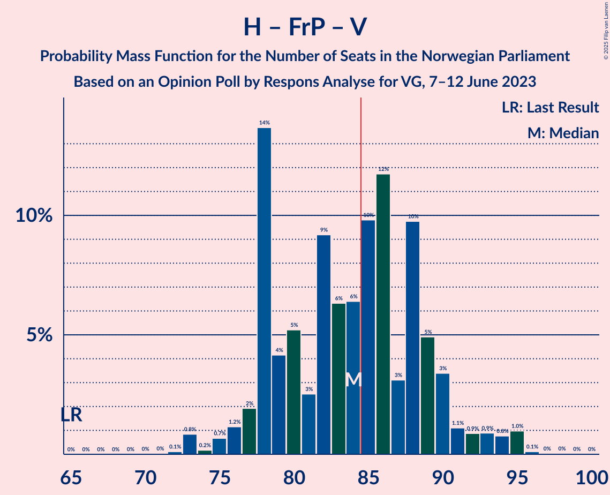

| Number of Seats | Probability | Accumulated | Special Marks |
|:---------------:|:-----------:|:-----------:|:-------------:|
| 65 | 0% | 100% | Last Result |
| 66 | 0% | 100% |  |
| 67 | 0% | 100% |  |
| 68 | 0% | 100% |  |
| 69 | 0% | 100% |  |
| 70 | 0% | 100% |  |
| 71 | 0% | 100% |  |
| 72 | 0.1% | 99.9% |  |
| 73 | 0.8% | 99.8% |  |
| 74 | 0.2% | 99.0% |  |
| 75 | 0.7% | 98.8% |  |
| 76 | 1.2% | 98% |  |
| 77 | 2% | 97% |  |
| 78 | 14% | 95% |  |
| 79 | 4% | 81% |  |
| 80 | 5% | 77% |  |
| 81 | 3% | 72% |  |
| 82 | 9% | 69% | Median |
| 83 | 6% | 60% |  |
| 84 | 6% | 54% |  |
| 85 | 10% | 48% | Majority |
| 86 | 12% | 38% |  |
| 87 | 3% | 26% |  |
| 88 | 10% | 23% |  |
| 89 | 5% | 13% |  |
| 90 | 3% | 8% |  |
| 91 | 1.1% | 5% |  |
| 92 | 0.9% | 4% |  |
| 93 | 0.9% | 3% |  |
| 94 | 0.8% | 2% |  |
| 95 | 1.0% | 1.2% |  |
| 96 | 0.1% | 0.2% |  |
| 97 | 0% | 0.1% |  |
| 98 | 0% | 0.1% |  |
| 99 | 0% | 0% |  |

### Arbeiderpartiet – Sosialistisk Venstreparti – Rødt – Senterpartiet – Miljøpartiet De Grønne

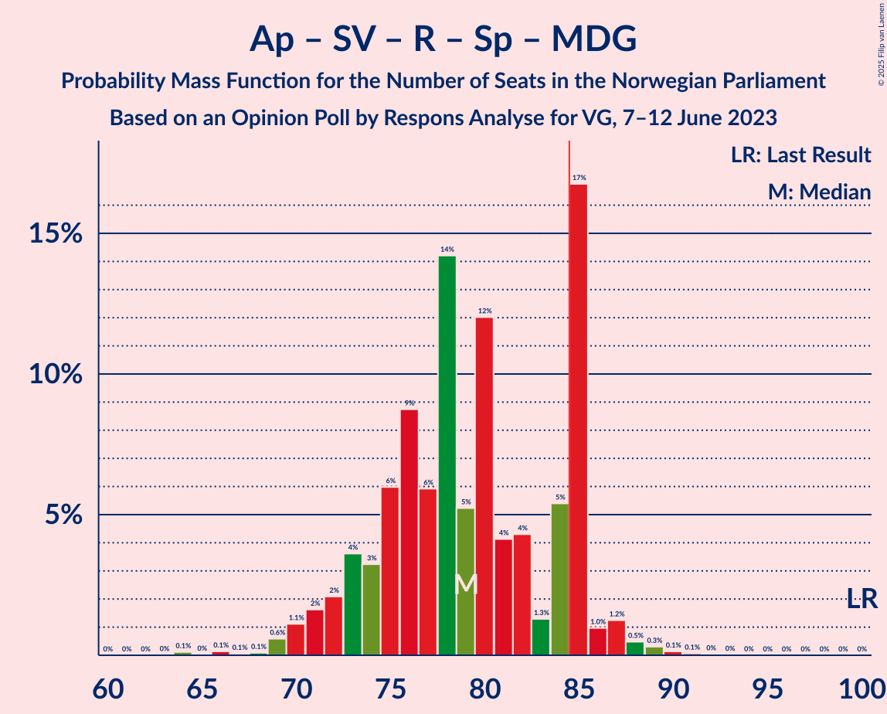

| Number of Seats | Probability | Accumulated | Special Marks |
|:---------------:|:-----------:|:-----------:|:-------------:|
| 64 | 0.1% | 100% |  |
| 65 | 0% | 99.9% |  |
| 66 | 0.1% | 99.8% |  |
| 67 | 0.1% | 99.7% |  |
| 68 | 0.1% | 99.6% |  |
| 69 | 0.6% | 99.6% |  |
| 70 | 1.1% | 99.0% |  |
| 71 | 2% | 98% |  |
| 72 | 2% | 96% |  |
| 73 | 4% | 94% |  |
| 74 | 3% | 91% |  |
| 75 | 6% | 87% |  |
| 76 | 9% | 81% |  |
| 77 | 6% | 73% | Median |
| 78 | 14% | 67% |  |
| 79 | 5% | 52% |  |
| 80 | 12% | 47% |  |
| 81 | 4% | 35% |  |
| 82 | 4% | 31% |  |
| 83 | 1.3% | 27% |  |
| 84 | 5% | 25% |  |
| 85 | 17% | 20% | Majority |
| 86 | 1.0% | 3% |  |
| 87 | 1.2% | 2% |  |
| 88 | 0.5% | 1.1% |  |
| 89 | 0.3% | 0.6% |  |
| 90 | 0.1% | 0.3% |  |
| 91 | 0.1% | 0.1% |  |
| 92 | 0% | 0.1% |  |
| 93 | 0% | 0% |  |
| 94 | 0% | 0% |  |
| 95 | 0% | 0% |  |
| 96 | 0% | 0% |  |
| 97 | 0% | 0% |  |
| 98 | 0% | 0% |  |
| 99 | 0% | 0% |  |
| 100 | 0% | 0% | Last Result |

### Høyre – Fremskrittspartiet

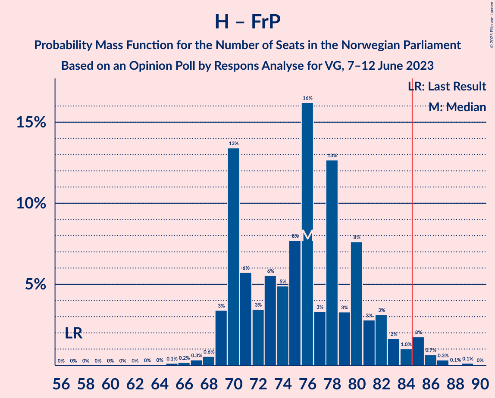

| Number of Seats | Probability | Accumulated | Special Marks |
|:---------------:|:-----------:|:-----------:|:-------------:|
| 57 | 0% | 100% | Last Result |
| 58 | 0% | 100% |  |
| 59 | 0% | 100% |  |
| 60 | 0% | 100% |  |
| 61 | 0% | 100% |  |
| 62 | 0% | 100% |  |
| 63 | 0% | 100% |  |
| 64 | 0% | 100% |  |
| 65 | 0.1% | 99.9% |  |
| 66 | 0.2% | 99.8% |  |
| 67 | 0.3% | 99.6% |  |
| 68 | 0.6% | 99.3% |  |
| 69 | 3% | 98.8% |  |
| 70 | 13% | 95% |  |
| 71 | 6% | 82% |  |
| 72 | 3% | 76% |  |
| 73 | 6% | 73% |  |
| 74 | 5% | 67% | Median |
| 75 | 8% | 62% |  |
| 76 | 16% | 55% |  |
| 77 | 3% | 38% |  |
| 78 | 13% | 35% |  |
| 79 | 3% | 22% |  |
| 80 | 8% | 19% |  |
| 81 | 3% | 12% |  |
| 82 | 3% | 9% |  |
| 83 | 2% | 6% |  |
| 84 | 1.0% | 4% |  |
| 85 | 2% | 3% | Majority |
| 86 | 0.7% | 1.2% |  |
| 87 | 0.3% | 0.5% |  |
| 88 | 0.1% | 0.2% |  |
| 89 | 0.1% | 0.2% |  |
| 90 | 0% | 0% |  |

### Arbeiderpartiet – Sosialistisk Venstreparti – Rødt – Senterpartiet

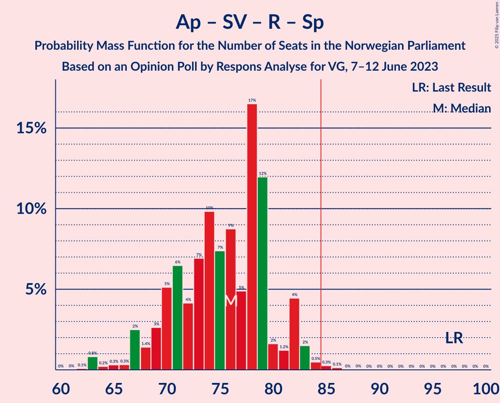

| Number of Seats | Probability | Accumulated | Special Marks |
|:---------------:|:-----------:|:-----------:|:-------------:|
| 61 | 0% | 100% |  |
| 62 | 0.1% | 99.9% |  |
| 63 | 0.8% | 99.9% |  |
| 64 | 0.2% | 99.0% |  |
| 65 | 0.3% | 98.8% |  |
| 66 | 0.3% | 98.5% |  |
| 67 | 2% | 98% |  |
| 68 | 1.4% | 96% |  |
| 69 | 3% | 94% |  |
| 70 | 5% | 92% |  |
| 71 | 6% | 87% |  |
| 72 | 4% | 80% |  |
| 73 | 7% | 76% |  |
| 74 | 10% | 69% |  |
| 75 | 7% | 59% | Median |
| 76 | 9% | 52% |  |
| 77 | 5% | 43% |  |
| 78 | 17% | 38% |  |
| 79 | 12% | 22% |  |
| 80 | 2% | 10% |  |
| 81 | 1.2% | 8% |  |
| 82 | 4% | 7% |  |
| 83 | 2% | 2% |  |
| 84 | 0.5% | 0.9% |  |
| 85 | 0.3% | 0.4% | Majority |
| 86 | 0.1% | 0.2% |  |
| 87 | 0% | 0% |  |
| 88 | 0% | 0% |  |
| 89 | 0% | 0% |  |
| 90 | 0% | 0% |  |
| 91 | 0% | 0% |  |
| 92 | 0% | 0% |  |
| 93 | 0% | 0% |  |
| 94 | 0% | 0% |  |
| 95 | 0% | 0% |  |
| 96 | 0% | 0% |  |
| 97 | 0% | 0% | Last Result |

### Arbeiderpartiet – Sosialistisk Venstreparti – Senterpartiet – Miljøpartiet De Grønne – Kristelig Folkeparti

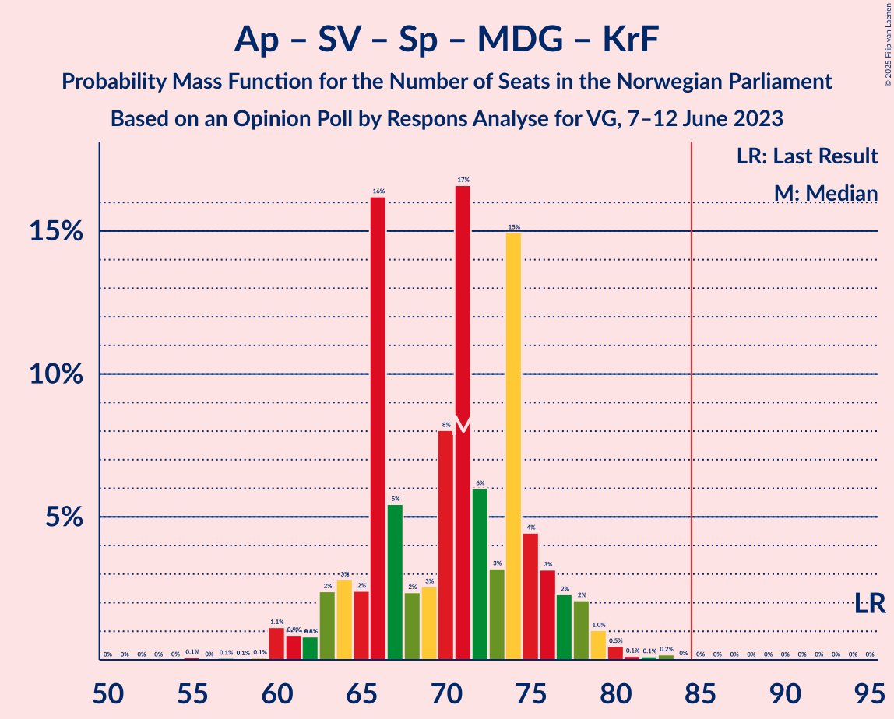

| Number of Seats | Probability | Accumulated | Special Marks |
|:---------------:|:-----------:|:-----------:|:-------------:|
| 55 | 0.1% | 100% |  |
| 56 | 0% | 99.9% |  |
| 57 | 0.1% | 99.9% |  |
| 58 | 0.1% | 99.8% |  |
| 59 | 0.1% | 99.8% |  |
| 60 | 1.1% | 99.7% |  |
| 61 | 0.9% | 98.6% |  |
| 62 | 0.8% | 98% |  |
| 63 | 2% | 97% |  |
| 64 | 3% | 94% |  |
| 65 | 2% | 92% |  |
| 66 | 16% | 89% |  |
| 67 | 5% | 73% |  |
| 68 | 2% | 68% | Median |
| 69 | 3% | 65% |  |
| 70 | 8% | 63% |  |
| 71 | 17% | 55% |  |
| 72 | 6% | 38% |  |
| 73 | 3% | 32% |  |
| 74 | 15% | 29% |  |
| 75 | 4% | 14% |  |
| 76 | 3% | 10% |  |
| 77 | 2% | 6% |  |
| 78 | 2% | 4% |  |
| 79 | 1.0% | 2% |  |
| 80 | 0.5% | 1.0% |  |
| 81 | 0.1% | 0.5% |  |
| 82 | 0.1% | 0.4% |  |
| 83 | 0.2% | 0.2% |  |
| 84 | 0% | 0.1% |  |
| 85 | 0% | 0% | Majority |
| 86 | 0% | 0% |  |
| 87 | 0% | 0% |  |
| 88 | 0% | 0% |  |
| 89 | 0% | 0% |  |
| 90 | 0% | 0% |  |
| 91 | 0% | 0% |  |
| 92 | 0% | 0% |  |
| 93 | 0% | 0% |  |
| 94 | 0% | 0% |  |
| 95 | 0% | 0% | Last Result |

### Arbeiderpartiet – Sosialistisk Venstreparti – Rødt – Miljøpartiet De Grønne

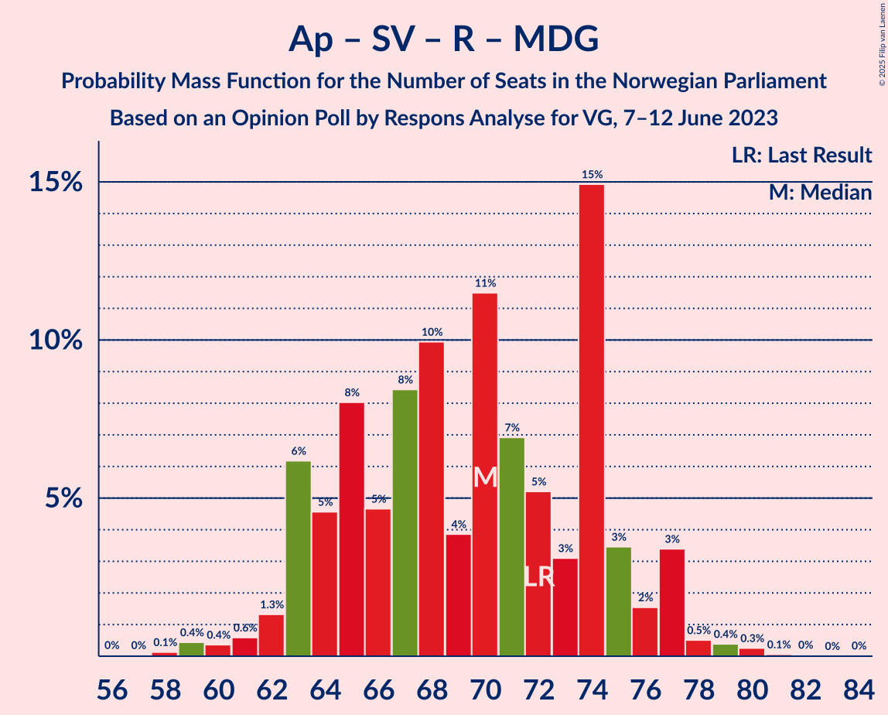

| Number of Seats | Probability | Accumulated | Special Marks |
|:---------------:|:-----------:|:-----------:|:-------------:|
| 56 | 0% | 100% |  |
| 57 | 0% | 99.9% |  |
| 58 | 0.1% | 99.9% |  |
| 59 | 0.4% | 99.8% |  |
| 60 | 0.4% | 99.3% |  |
| 61 | 0.6% | 99.0% |  |
| 62 | 1.3% | 98% |  |
| 63 | 6% | 97% |  |
| 64 | 5% | 91% |  |
| 65 | 8% | 86% |  |
| 66 | 5% | 78% |  |
| 67 | 8% | 74% | Median |
| 68 | 10% | 65% |  |
| 69 | 4% | 55% |  |
| 70 | 11% | 51% |  |
| 71 | 7% | 40% |  |
| 72 | 5% | 33% | Last Result |
| 73 | 3% | 28% |  |
| 74 | 15% | 25% |  |
| 75 | 3% | 10% |  |
| 76 | 2% | 6% |  |
| 77 | 3% | 5% |  |
| 78 | 0.5% | 1.3% |  |
| 79 | 0.4% | 0.8% |  |
| 80 | 0.3% | 0.4% |  |
| 81 | 0.1% | 0.1% |  |
| 82 | 0% | 0.1% |  |
| 83 | 0% | 0% |  |

### Arbeiderpartiet – Sosialistisk Venstreparti – Senterpartiet – Miljøpartiet De Grønne

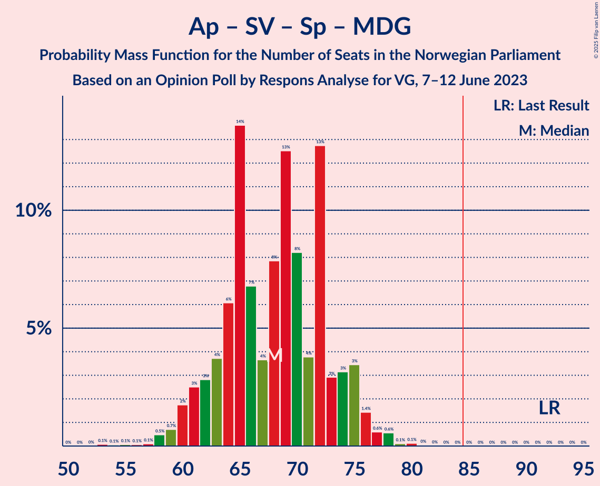

| Number of Seats | Probability | Accumulated | Special Marks |
|:---------------:|:-----------:|:-----------:|:-------------:|
| 53 | 0.1% | 100% |  |
| 54 | 0.1% | 99.9% |  |
| 55 | 0.1% | 99.9% |  |
| 56 | 0.1% | 99.8% |  |
| 57 | 0.1% | 99.7% |  |
| 58 | 0.5% | 99.6% |  |
| 59 | 0.7% | 99.2% |  |
| 60 | 2% | 98% |  |
| 61 | 3% | 97% |  |
| 62 | 3% | 94% |  |
| 63 | 4% | 91% |  |
| 64 | 6% | 88% |  |
| 65 | 14% | 82% |  |
| 66 | 7% | 68% | Median |
| 67 | 4% | 61% |  |
| 68 | 8% | 58% |  |
| 69 | 13% | 50% |  |
| 70 | 8% | 37% |  |
| 71 | 4% | 29% |  |
| 72 | 13% | 25% |  |
| 73 | 3% | 12% |  |
| 74 | 3% | 9% |  |
| 75 | 3% | 6% |  |
| 76 | 1.4% | 3% |  |
| 77 | 0.6% | 1.4% |  |
| 78 | 0.6% | 0.8% |  |
| 79 | 0.1% | 0.3% |  |
| 80 | 0.1% | 0.2% |  |
| 81 | 0% | 0.1% |  |
| 82 | 0% | 0% |  |
| 83 | 0% | 0% |  |
| 84 | 0% | 0% |  |
| 85 | 0% | 0% | Majority |
| 86 | 0% | 0% |  |
| 87 | 0% | 0% |  |
| 88 | 0% | 0% |  |
| 89 | 0% | 0% |  |
| 90 | 0% | 0% |  |
| 91 | 0% | 0% |  |
| 92 | 0% | 0% | Last Result |

### Høyre – Venstre – Kristelig Folkeparti

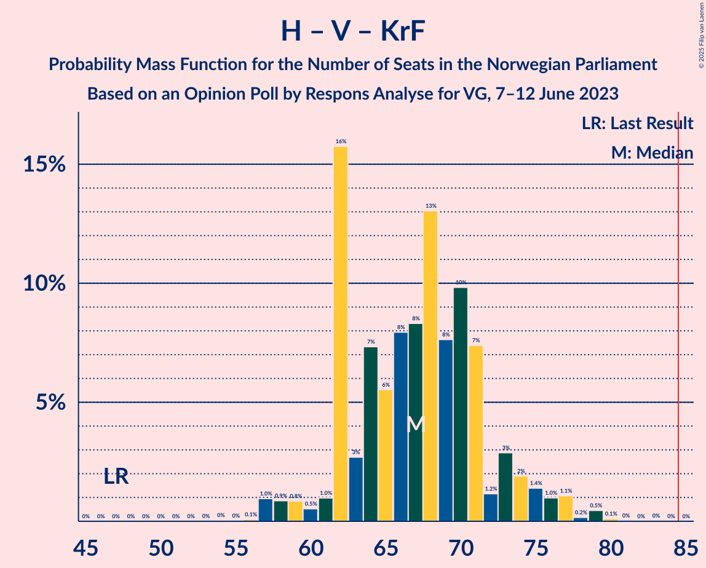

| Number of Seats | Probability | Accumulated | Special Marks |
|:---------------:|:-----------:|:-----------:|:-------------:|
| 47 | 0% | 100% | Last Result |
| 48 | 0% | 100% |  |
| 49 | 0% | 100% |  |
| 50 | 0% | 100% |  |
| 51 | 0% | 100% |  |
| 52 | 0% | 100% |  |
| 53 | 0% | 100% |  |
| 54 | 0% | 100% |  |
| 55 | 0% | 99.9% |  |
| 56 | 0.1% | 99.9% |  |
| 57 | 1.0% | 99.8% |  |
| 58 | 0.9% | 98.9% |  |
| 59 | 0.8% | 98% |  |
| 60 | 0.5% | 97% |  |
| 61 | 1.0% | 97% |  |
| 62 | 16% | 96% |  |
| 63 | 3% | 80% |  |
| 64 | 7% | 77% |  |
| 65 | 6% | 70% |  |
| 66 | 8% | 64% | Median |
| 67 | 8% | 56% |  |
| 68 | 13% | 48% |  |
| 69 | 8% | 35% |  |
| 70 | 10% | 27% |  |
| 71 | 7% | 18% |  |
| 72 | 1.2% | 10% |  |
| 73 | 3% | 9% |  |
| 74 | 2% | 6% |  |
| 75 | 1.4% | 4% |  |
| 76 | 1.0% | 3% |  |
| 77 | 1.1% | 2% |  |
| 78 | 0.2% | 0.8% |  |
| 79 | 0.5% | 0.6% |  |
| 80 | 0.1% | 0.2% |  |
| 81 | 0% | 0.1% |  |
| 82 | 0% | 0% |  |

### Arbeiderpartiet – Sosialistisk Venstreparti – Senterpartiet

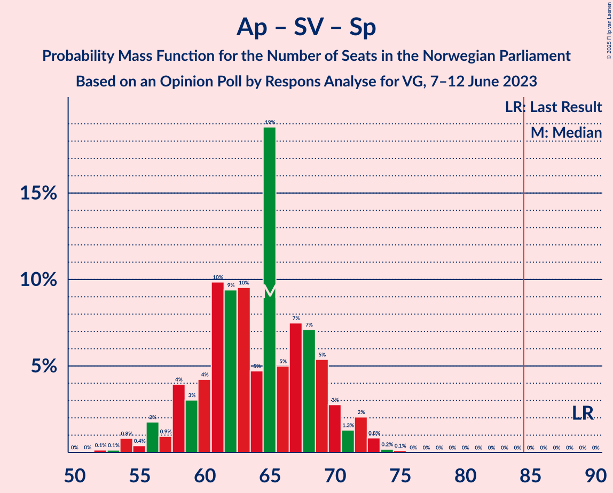

| Number of Seats | Probability | Accumulated | Special Marks |
|:---------------:|:-----------:|:-----------:|:-------------:|
| 52 | 0.1% | 100% |  |
| 53 | 0.1% | 99.8% |  |
| 54 | 0.8% | 99.7% |  |
| 55 | 0.4% | 98.9% |  |
| 56 | 2% | 98% |  |
| 57 | 0.9% | 97% |  |
| 58 | 4% | 96% |  |
| 59 | 3% | 92% |  |
| 60 | 4% | 89% |  |
| 61 | 10% | 85% |  |
| 62 | 9% | 75% |  |
| 63 | 10% | 65% |  |
| 64 | 5% | 56% | Median |
| 65 | 19% | 51% |  |
| 66 | 5% | 32% |  |
| 67 | 7% | 27% |  |
| 68 | 7% | 20% |  |
| 69 | 5% | 13% |  |
| 70 | 3% | 7% |  |
| 71 | 1.3% | 5% |  |
| 72 | 2% | 3% |  |
| 73 | 0.8% | 1.2% |  |
| 74 | 0.2% | 0.3% |  |
| 75 | 0.1% | 0.1% |  |
| 76 | 0% | 0% |  |
| 77 | 0% | 0% |  |
| 78 | 0% | 0% |  |
| 79 | 0% | 0% |  |
| 80 | 0% | 0% |  |
| 81 | 0% | 0% |  |
| 82 | 0% | 0% |  |
| 83 | 0% | 0% |  |
| 84 | 0% | 0% |  |
| 85 | 0% | 0% | Majority |
| 86 | 0% | 0% |  |
| 87 | 0% | 0% |  |
| 88 | 0% | 0% |  |
| 89 | 0% | 0% | Last Result |

### Arbeiderpartiet – Senterpartiet – Miljøpartiet De Grønne – Kristelig Folkeparti

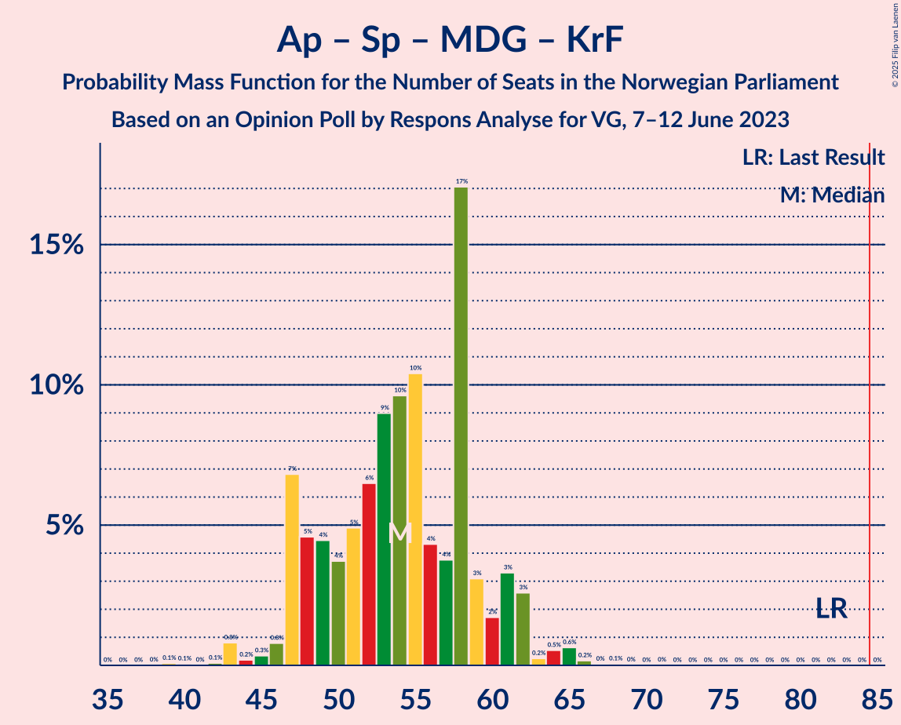

| Number of Seats | Probability | Accumulated | Special Marks |
|:---------------:|:-----------:|:-----------:|:-------------:|
| 39 | 0.1% | 100% |  |
| 40 | 0.1% | 99.9% |  |
| 41 | 0% | 99.8% |  |
| 42 | 0.1% | 99.8% |  |
| 43 | 0.8% | 99.7% |  |
| 44 | 0.2% | 98.9% |  |
| 45 | 0.3% | 98.7% |  |
| 46 | 0.8% | 98% |  |
| 47 | 7% | 98% |  |
| 48 | 5% | 91% |  |
| 49 | 4% | 86% |  |
| 50 | 4% | 82% |  |
| 51 | 5% | 78% |  |
| 52 | 6% | 73% | Median |
| 53 | 9% | 67% |  |
| 54 | 10% | 58% |  |
| 55 | 10% | 48% |  |
| 56 | 4% | 38% |  |
| 57 | 4% | 33% |  |
| 58 | 17% | 30% |  |
| 59 | 3% | 12% |  |
| 60 | 2% | 9% |  |
| 61 | 3% | 8% |  |
| 62 | 3% | 4% |  |
| 63 | 0.2% | 2% |  |
| 64 | 0.5% | 1.5% |  |
| 65 | 0.6% | 1.0% |  |
| 66 | 0.2% | 0.3% |  |
| 67 | 0% | 0.1% |  |
| 68 | 0.1% | 0.1% |  |
| 69 | 0% | 0% |  |
| 70 | 0% | 0% |  |
| 71 | 0% | 0% |  |
| 72 | 0% | 0% |  |
| 73 | 0% | 0% |  |
| 74 | 0% | 0% |  |
| 75 | 0% | 0% |  |
| 76 | 0% | 0% |  |
| 77 | 0% | 0% |  |
| 78 | 0% | 0% |  |
| 79 | 0% | 0% |  |
| 80 | 0% | 0% |  |
| 81 | 0% | 0% |  |
| 82 | 0% | 0% | Last Result |

### Arbeiderpartiet – Sosialistisk Venstreparti

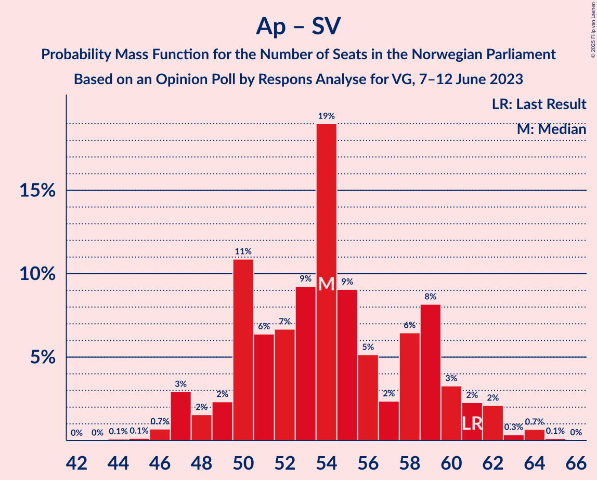

| Number of Seats | Probability | Accumulated | Special Marks |
|:---------------:|:-----------:|:-----------:|:-------------:|
| 44 | 0.1% | 100% |  |
| 45 | 0.1% | 99.9% |  |
| 46 | 0.7% | 99.8% |  |
| 47 | 3% | 99.1% |  |
| 48 | 2% | 96% |  |
| 49 | 2% | 95% |  |
| 50 | 11% | 92% |  |
| 51 | 6% | 81% |  |
| 52 | 7% | 75% |  |
| 53 | 9% | 68% |  |
| 54 | 19% | 59% | Median |
| 55 | 9% | 40% |  |
| 56 | 5% | 31% |  |
| 57 | 2% | 26% |  |
| 58 | 6% | 23% |  |
| 59 | 8% | 17% |  |
| 60 | 3% | 9% |  |
| 61 | 2% | 6% | Last Result |
| 62 | 2% | 3% |  |
| 63 | 0.3% | 1.2% |  |
| 64 | 0.7% | 0.8% |  |
| 65 | 0.1% | 0.2% |  |
| 66 | 0% | 0% |  |

### Arbeiderpartiet – Senterpartiet – Kristelig Folkeparti

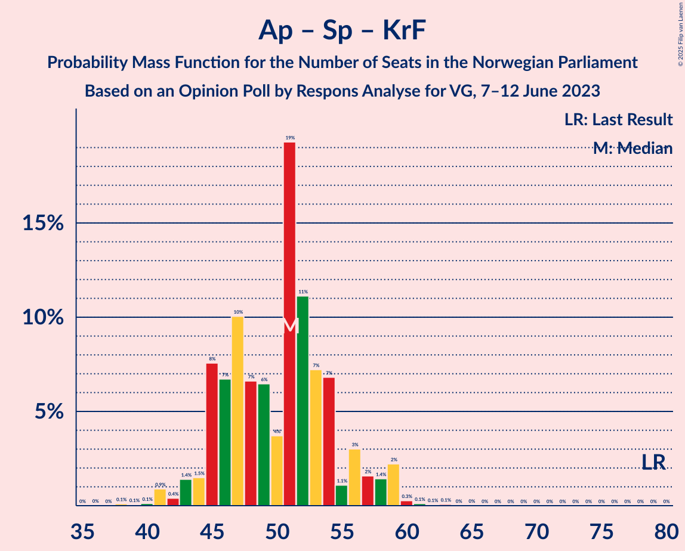

| Number of Seats | Probability | Accumulated | Special Marks |
|:---------------:|:-----------:|:-----------:|:-------------:|
| 38 | 0.1% | 100% |  |
| 39 | 0.1% | 99.9% |  |
| 40 | 0.1% | 99.8% |  |
| 41 | 0.9% | 99.7% |  |
| 42 | 0.4% | 98.8% |  |
| 43 | 1.4% | 98% |  |
| 44 | 1.5% | 97% |  |
| 45 | 8% | 95% |  |
| 46 | 7% | 88% |  |
| 47 | 10% | 81% |  |
| 48 | 7% | 71% |  |
| 49 | 6% | 65% |  |
| 50 | 4% | 58% | Median |
| 51 | 19% | 54% |  |
| 52 | 11% | 35% |  |
| 53 | 7% | 24% |  |
| 54 | 7% | 17% |  |
| 55 | 1.1% | 10% |  |
| 56 | 3% | 9% |  |
| 57 | 2% | 6% |  |
| 58 | 1.4% | 4% |  |
| 59 | 2% | 3% |  |
| 60 | 0.3% | 0.5% |  |
| 61 | 0.1% | 0.3% |  |
| 62 | 0.1% | 0.2% |  |
| 63 | 0.1% | 0.1% |  |
| 64 | 0% | 0% |  |
| 65 | 0% | 0% |  |
| 66 | 0% | 0% |  |
| 67 | 0% | 0% |  |
| 68 | 0% | 0% |  |
| 69 | 0% | 0% |  |
| 70 | 0% | 0% |  |
| 71 | 0% | 0% |  |
| 72 | 0% | 0% |  |
| 73 | 0% | 0% |  |
| 74 | 0% | 0% |  |
| 75 | 0% | 0% |  |
| 76 | 0% | 0% |  |
| 77 | 0% | 0% |  |
| 78 | 0% | 0% |  |
| 79 | 0% | 0% | Last Result |

### Arbeiderpartiet – Senterpartiet

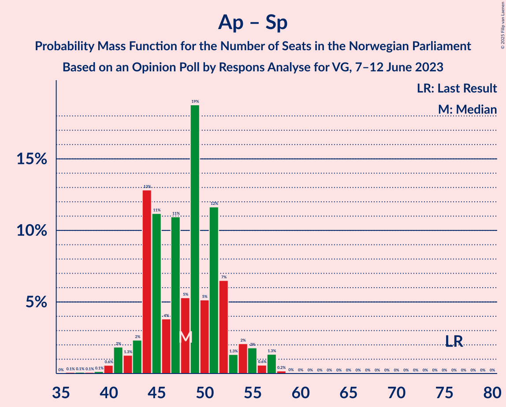

| Number of Seats | Probability | Accumulated | Special Marks |
|:---------------:|:-----------:|:-----------:|:-------------:|
| 35 | 0% | 100% |  |
| 36 | 0.1% | 99.9% |  |
| 37 | 0.1% | 99.9% |  |
| 38 | 0.1% | 99.8% |  |
| 39 | 0.1% | 99.7% |  |
| 40 | 0.6% | 99.5% |  |
| 41 | 2% | 99.0% |  |
| 42 | 1.3% | 97% |  |
| 43 | 2% | 96% |  |
| 44 | 13% | 94% |  |
| 45 | 11% | 81% |  |
| 46 | 4% | 69% |  |
| 47 | 11% | 66% |  |
| 48 | 5% | 55% | Median |
| 49 | 19% | 49% |  |
| 50 | 5% | 31% |  |
| 51 | 12% | 26% |  |
| 52 | 7% | 14% |  |
| 53 | 1.3% | 7% |  |
| 54 | 2% | 6% |  |
| 55 | 2% | 4% |  |
| 56 | 0.6% | 2% |  |
| 57 | 1.3% | 2% |  |
| 58 | 0.2% | 0.2% |  |
| 59 | 0% | 0% |  |
| 60 | 0% | 0% |  |
| 61 | 0% | 0% |  |
| 62 | 0% | 0% |  |
| 63 | 0% | 0% |  |
| 64 | 0% | 0% |  |
| 65 | 0% | 0% |  |
| 66 | 0% | 0% |  |
| 67 | 0% | 0% |  |
| 68 | 0% | 0% |  |
| 69 | 0% | 0% |  |
| 70 | 0% | 0% |  |
| 71 | 0% | 0% |  |
| 72 | 0% | 0% |  |
| 73 | 0% | 0% |  |
| 74 | 0% | 0% |  |
| 75 | 0% | 0% |  |
| 76 | 0% | 0% | Last Result |

### Senterpartiet – Venstre – Kristelig Folkeparti

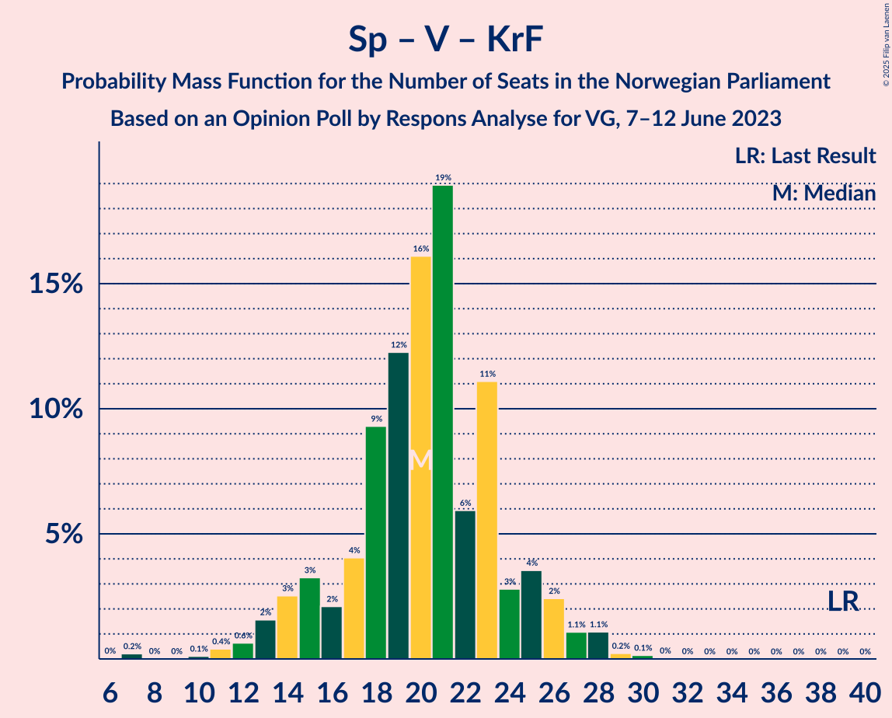

| Number of Seats | Probability | Accumulated | Special Marks |
|:---------------:|:-----------:|:-----------:|:-------------:|
| 6 | 0% | 100% |  |
| 7 | 0.2% | 99.9% |  |
| 8 | 0% | 99.7% |  |
| 9 | 0% | 99.7% |  |
| 10 | 0.1% | 99.7% |  |
| 11 | 0.4% | 99.6% |  |
| 12 | 0.6% | 99.2% |  |
| 13 | 2% | 98.5% |  |
| 14 | 3% | 97% |  |
| 15 | 3% | 94% |  |
| 16 | 2% | 91% |  |
| 17 | 4% | 89% |  |
| 18 | 9% | 85% |  |
| 19 | 12% | 76% |  |
| 20 | 16% | 63% | Median |
| 21 | 19% | 47% |  |
| 22 | 6% | 28% |  |
| 23 | 11% | 22% |  |
| 24 | 3% | 11% |  |
| 25 | 4% | 9% |  |
| 26 | 2% | 5% |  |
| 27 | 1.1% | 3% |  |
| 28 | 1.1% | 2% |  |
| 29 | 0.2% | 0.4% |  |
| 30 | 0.1% | 0.2% |  |
| 31 | 0% | 0.1% |  |
| 32 | 0% | 0% |  |
| 33 | 0% | 0% |  |
| 34 | 0% | 0% |  |
| 35 | 0% | 0% |  |
| 36 | 0% | 0% |  |
| 37 | 0% | 0% |  |
| 38 | 0% | 0% |  |
| 39 | 0% | 0% | Last Result |

## Technical Information

### Opinion Poll

+ **Polling firm:** Respons Analyse
+ **Commissioner(s):** VG
+ **Fieldwork period:** 7–12 June 2023

### Calculations

+ **Sample size:** 763
+ **Simulations done:** 1,048,576
+ **Error estimate:** 2.18%

