# Opinion Poll by Norstat for Dagbladet and Vårt Land, 12–17 June 2023

<a href="#voting-intentions">Voting Intentions</a> | <a href="#seats">Seats</a> | <a href="#coalitions">Coalitions</a> | <a href="#technical-information">Technical Information</a>

## Voting Intentions

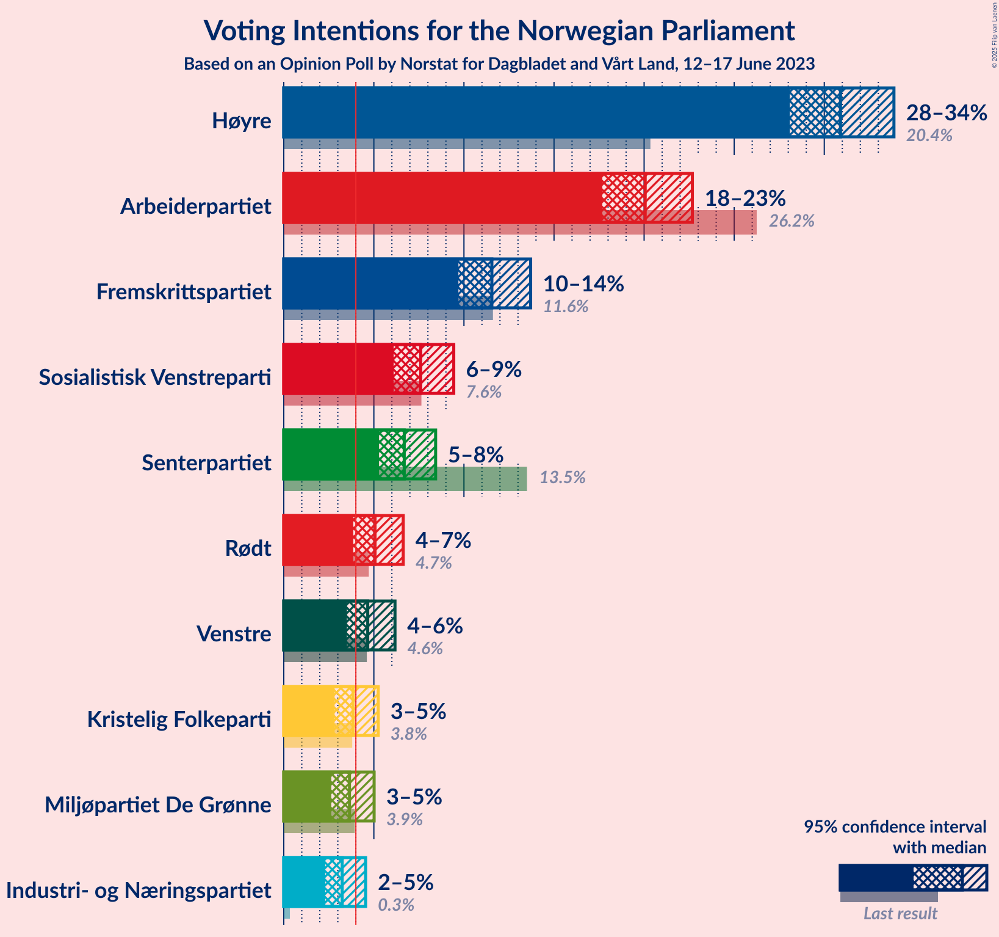

### Confidence Intervals

| Party | Last Result | Poll Result | 80% Confidence Interval | 90% Confidence Interval | 95% Confidence Interval | 99% Confidence Interval |
|:-----:|:-----------:|:-----------:|:-----------------------:|:-----------------------:|:-----------------------:|:-----------------------:|
| Høyre | 20.4% | 30.9% | 29.1–32.8% |28.5–33.4% |28.1–33.9% |27.2–34.8% |
| Arbeiderpartiet | 26.2% | 20.1% | 18.5–21.8% |18.0–22.3% |17.7–22.7% |16.9–23.5% |
| Fremskrittspartiet | 11.6% | 11.6% | 10.3–13.0% |10.0–13.4% |9.7–13.7% |9.1–14.4% |
| Sosialistisk Venstreparti | 7.6% | 7.6% | 6.6–8.8% |6.3–9.1% |6.1–9.4% |5.7–10.0% |
| Senterpartiet | 13.5% | 6.7% | 5.8–7.8% |5.5–8.1% |5.3–8.4% |4.9–9.0% |
| Rødt | 4.7% | 5.1% | 4.3–6.1% |4.1–6.4% |3.9–6.6% |3.5–7.1% |
| Venstre | 4.6% | 4.7% | 3.9–5.6% |3.7–5.9% |3.5–6.2% |3.2–6.7% |
| Kristelig Folkeparti | 3.8% | 3.9% | 3.2–4.8% |3.0–5.0% |2.8–5.2% |2.5–5.7% |
| Miljøpartiet De Grønne | 3.9% | 3.6% | 3.0–4.5% |2.8–4.8% |2.6–5.0% |2.4–5.5% |
| Industri- og Næringspartiet | 0.3% | 3.2% | 2.6–4.1% |2.5–4.3% |2.3–4.5% |2.0–5.0% |

*Note:* The poll result column reflects the actual value used in the calculations. Published results may vary slightly, and in addition be rounded to fewer digits.

## Seats

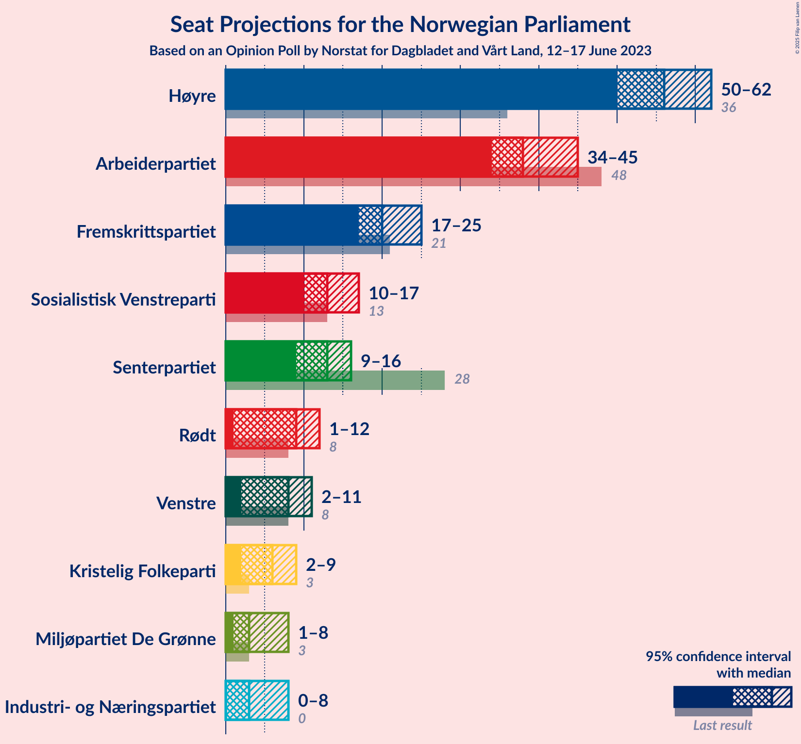

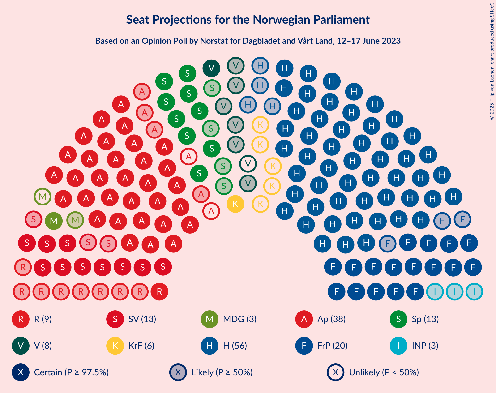

### Confidence Intervals

| Party | Last Result | Median | 80% Confidence Interval | 90% Confidence Interval | 95% Confidence Interval | 99% Confidence Interval |
|:-----:|:-----------:|:------:|:-----------------------:|:-----------------------:|:-----------------------:|:-----------------------:|
| <a href="#høyre">Høyre</a> | 36 | 56 | 51–59 |51–60 |50–62 |48–64 |
| <a href="#arbeiderpartiet">Arbeiderpartiet</a> | 48 | 38 | 35–43 |34–44 |34–45 |33–47 |
| <a href="#fremskrittspartiet">Fremskrittspartiet</a> | 21 | 20 | 18–23 |18–24 |17–25 |17–26 |
| <a href="#sosialistisk-venstreparti">Sosialistisk Venstreparti</a> | 13 | 13 | 11–15 |11–16 |10–17 |9–18 |
| <a href="#senterpartiet">Senterpartiet</a> | 28 | 13 | 10–14 |10–15 |9–16 |8–17 |
| <a href="#rødt">Rødt</a> | 8 | 9 | 7–11 |7–11 |1–12 |1–12 |
| <a href="#venstre">Venstre</a> | 8 | 8 | 3–10 |3–10 |2–11 |2–12 |
| <a href="#kristelig-folkeparti">Kristelig Folkeparti</a> | 3 | 6 | 2–8 |2–8 |2–9 |1–10 |
| <a href="#miljøpartiet-de-grønne">Miljøpartiet De Grønne</a> | 3 | 3 | 2–8 |1–8 |1–8 |1–9 |
| <a href="#industri--og-næringspartiet">Industri- og Næringspartiet</a> | 0 | 3 | 1–7 |0–7 |0–8 |0–9 |

### Høyre

*For a full overview of the results for this party, see the [Høyre](party-høyre.html) page.*

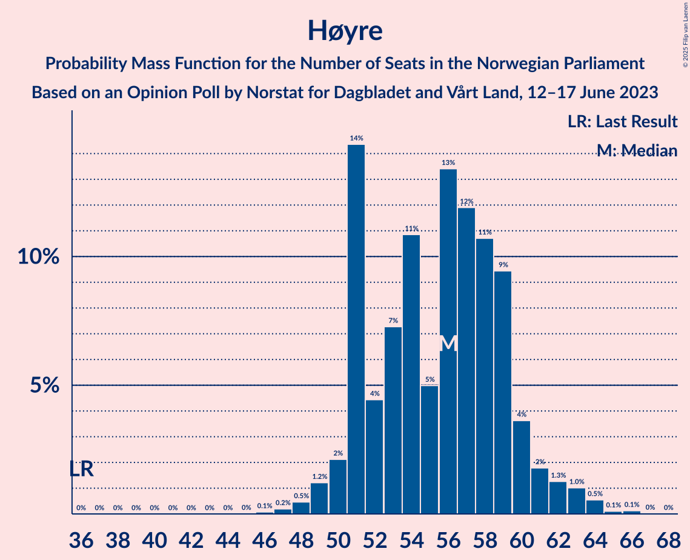

| Number of Seats | Probability | Accumulated | Special Marks |
|:---------------:|:-----------:|:-----------:|:-------------:|
| 36 | 0% | 100% | Last Result |
| 37 | 0% | 100% |  |
| 38 | 0% | 100% |  |
| 39 | 0% | 100% |  |
| 40 | 0% | 100% |  |
| 41 | 0% | 100% |  |
| 42 | 0% | 100% |  |
| 43 | 0% | 100% |  |
| 44 | 0% | 100% |  |
| 45 | 0% | 100% |  |
| 46 | 0.1% | 100% |  |
| 47 | 0.2% | 99.9% |  |
| 48 | 0.5% | 99.7% |  |
| 49 | 1.2% | 99.2% |  |
| 50 | 2% | 98% |  |
| 51 | 14% | 96% |  |
| 52 | 4% | 82% |  |
| 53 | 7% | 77% |  |
| 54 | 11% | 70% |  |
| 55 | 5% | 59% |  |
| 56 | 13% | 54% | Median |
| 57 | 12% | 41% |  |
| 58 | 11% | 29% |  |
| 59 | 9% | 18% |  |
| 60 | 4% | 9% |  |
| 61 | 2% | 5% |  |
| 62 | 1.3% | 3% |  |
| 63 | 1.0% | 2% |  |
| 64 | 0.5% | 0.8% |  |
| 65 | 0.1% | 0.3% |  |
| 66 | 0.1% | 0.2% |  |
| 67 | 0% | 0% |  |

### Arbeiderpartiet

*For a full overview of the results for this party, see the [Arbeiderpartiet](party-arbeiderpartiet.html) page.*

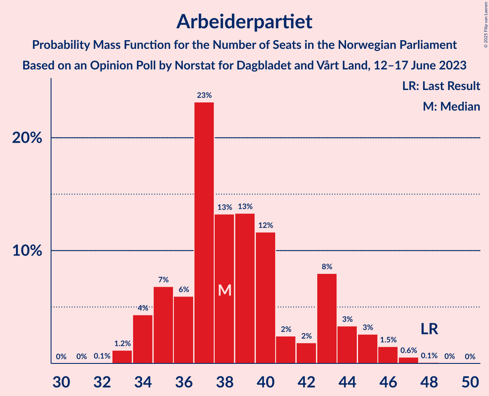

| Number of Seats | Probability | Accumulated | Special Marks |
|:---------------:|:-----------:|:-----------:|:-------------:|
| 32 | 0.1% | 100% |  |
| 33 | 1.2% | 99.9% |  |
| 34 | 4% | 98.8% |  |
| 35 | 7% | 94% |  |
| 36 | 6% | 88% |  |
| 37 | 23% | 82% |  |
| 38 | 13% | 59% | Median |
| 39 | 13% | 45% |  |
| 40 | 12% | 32% |  |
| 41 | 2% | 20% |  |
| 42 | 2% | 18% |  |
| 43 | 8% | 16% |  |
| 44 | 3% | 8% |  |
| 45 | 3% | 5% |  |
| 46 | 1.5% | 2% |  |
| 47 | 0.6% | 0.7% |  |
| 48 | 0.1% | 0.1% | Last Result |
| 49 | 0% | 0% |  |

### Fremskrittspartiet

*For a full overview of the results for this party, see the [Fremskrittspartiet](party-fremskrittspartiet.html) page.*

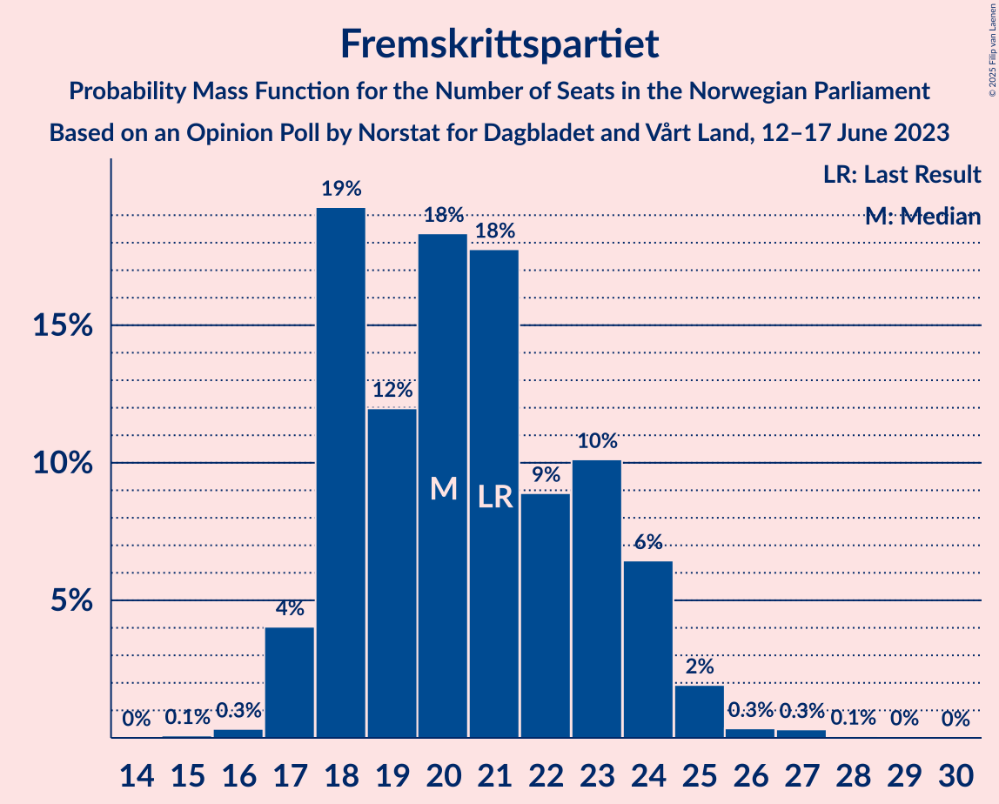

| Number of Seats | Probability | Accumulated | Special Marks |
|:---------------:|:-----------:|:-----------:|:-------------:|
| 15 | 0.1% | 100% |  |
| 16 | 0.3% | 99.9% |  |
| 17 | 4% | 99.6% |  |
| 18 | 19% | 96% |  |
| 19 | 12% | 76% |  |
| 20 | 18% | 64% | Median |
| 21 | 18% | 46% | Last Result |
| 22 | 9% | 28% |  |
| 23 | 10% | 19% |  |
| 24 | 6% | 9% |  |
| 25 | 2% | 3% |  |
| 26 | 0.3% | 0.8% |  |
| 27 | 0.3% | 0.4% |  |
| 28 | 0.1% | 0.1% |  |
| 29 | 0% | 0.1% |  |
| 30 | 0% | 0% |  |

### Sosialistisk Venstreparti

*For a full overview of the results for this party, see the [Sosialistisk Venstreparti](party-sosialistiskvenstreparti.html) page.*

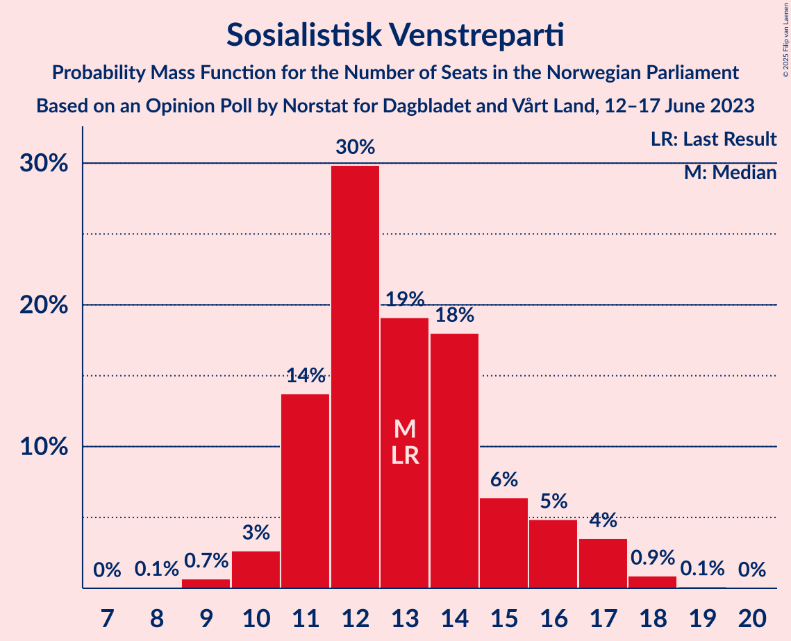

| Number of Seats | Probability | Accumulated | Special Marks |
|:---------------:|:-----------:|:-----------:|:-------------:|
| 8 | 0.1% | 100% |  |
| 9 | 0.7% | 99.9% |  |
| 10 | 3% | 99.2% |  |
| 11 | 14% | 97% |  |
| 12 | 30% | 83% |  |
| 13 | 19% | 53% | Last Result, Median |
| 14 | 18% | 34% |  |
| 15 | 6% | 16% |  |
| 16 | 5% | 9% |  |
| 17 | 4% | 5% |  |
| 18 | 0.9% | 1.0% |  |
| 19 | 0.1% | 0.2% |  |
| 20 | 0% | 0% |  |

### Senterpartiet

*For a full overview of the results for this party, see the [Senterpartiet](party-senterpartiet.html) page.*

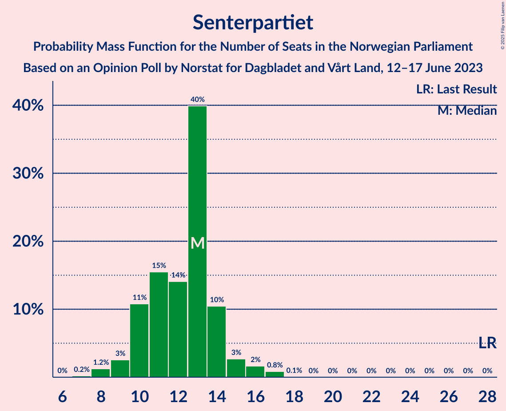

| Number of Seats | Probability | Accumulated | Special Marks |
|:---------------:|:-----------:|:-----------:|:-------------:|
| 7 | 0.2% | 100% |  |
| 8 | 1.2% | 99.8% |  |
| 9 | 3% | 98.5% |  |
| 10 | 11% | 96% |  |
| 11 | 15% | 85% |  |
| 12 | 14% | 70% |  |
| 13 | 40% | 56% | Median |
| 14 | 10% | 16% |  |
| 15 | 3% | 5% |  |
| 16 | 2% | 3% |  |
| 17 | 0.8% | 0.9% |  |
| 18 | 0.1% | 0.1% |  |
| 19 | 0% | 0% |  |
| 20 | 0% | 0% |  |
| 21 | 0% | 0% |  |
| 22 | 0% | 0% |  |
| 23 | 0% | 0% |  |
| 24 | 0% | 0% |  |
| 25 | 0% | 0% |  |
| 26 | 0% | 0% |  |
| 27 | 0% | 0% |  |
| 28 | 0% | 0% | Last Result |

### Rødt

*For a full overview of the results for this party, see the [Rødt](party-rødt.html) page.*

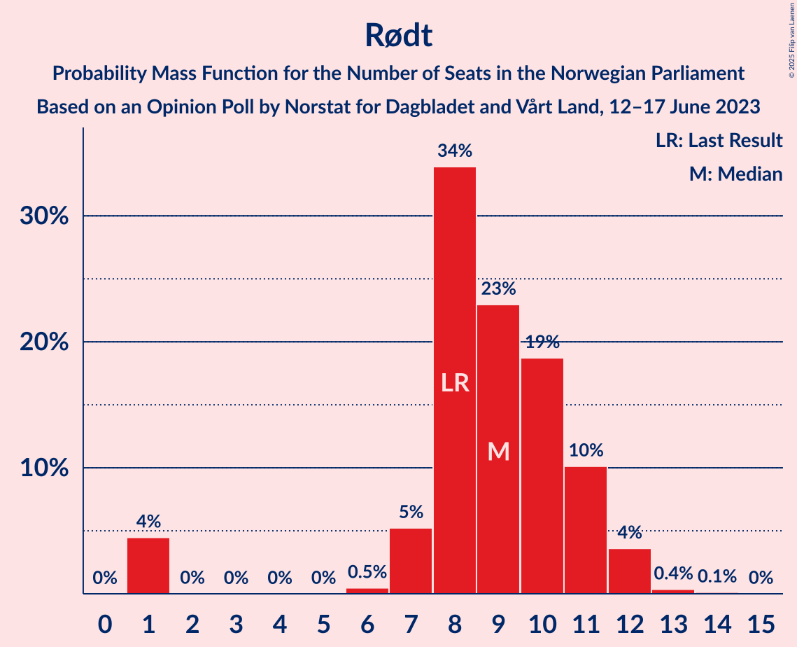

| Number of Seats | Probability | Accumulated | Special Marks |
|:---------------:|:-----------:|:-----------:|:-------------:|
| 1 | 4% | 100% |  |
| 2 | 0% | 96% |  |
| 3 | 0% | 96% |  |
| 4 | 0% | 96% |  |
| 5 | 0% | 96% |  |
| 6 | 0.5% | 96% |  |
| 7 | 5% | 95% |  |
| 8 | 34% | 90% | Last Result |
| 9 | 23% | 56% | Median |
| 10 | 19% | 33% |  |
| 11 | 10% | 14% |  |
| 12 | 4% | 4% |  |
| 13 | 0.4% | 0.5% |  |
| 14 | 0.1% | 0.1% |  |
| 15 | 0% | 0% |  |

### Venstre

*For a full overview of the results for this party, see the [Venstre](party-venstre.html) page.*

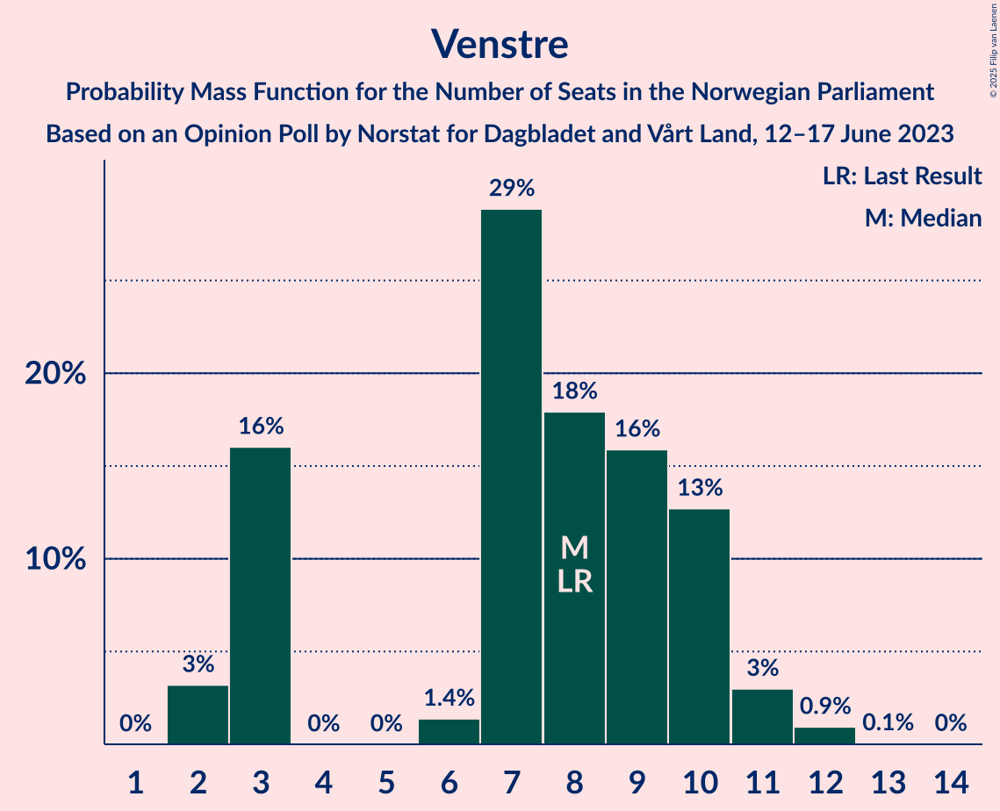

| Number of Seats | Probability | Accumulated | Special Marks |
|:---------------:|:-----------:|:-----------:|:-------------:|
| 2 | 3% | 100% |  |
| 3 | 16% | 97% |  |
| 4 | 0% | 81% |  |
| 5 | 0% | 81% |  |
| 6 | 1.4% | 81% |  |
| 7 | 29% | 79% |  |
| 8 | 18% | 51% | Last Result, Median |
| 9 | 16% | 33% |  |
| 10 | 13% | 17% |  |
| 11 | 3% | 4% |  |
| 12 | 0.9% | 1.0% |  |
| 13 | 0.1% | 0.1% |  |
| 14 | 0% | 0% |  |

### Kristelig Folkeparti

*For a full overview of the results for this party, see the [Kristelig Folkeparti](party-kristeligfolkeparti.html) page.*

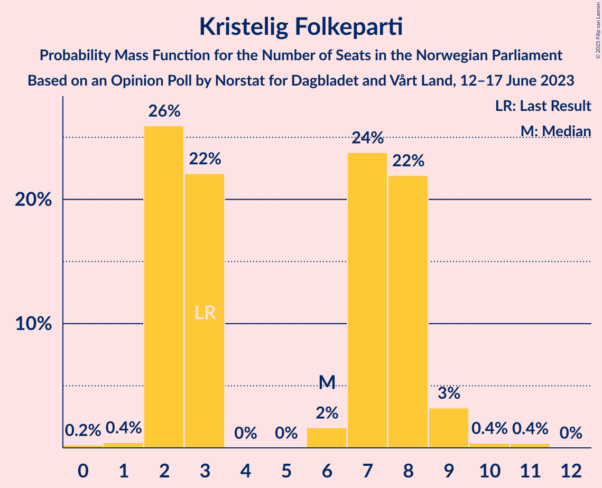

| Number of Seats | Probability | Accumulated | Special Marks |
|:---------------:|:-----------:|:-----------:|:-------------:|
| 0 | 0.2% | 100% |  |
| 1 | 0.4% | 99.8% |  |
| 2 | 26% | 99.3% |  |
| 3 | 22% | 73% | Last Result |
| 4 | 0% | 51% |  |
| 5 | 0% | 51% |  |
| 6 | 2% | 51% | Median |
| 7 | 24% | 50% |  |
| 8 | 22% | 26% |  |
| 9 | 3% | 4% |  |
| 10 | 0.4% | 0.8% |  |
| 11 | 0.4% | 0.4% |  |
| 12 | 0% | 0% |  |

### Miljøpartiet De Grønne

*For a full overview of the results for this party, see the [Miljøpartiet De Grønne](party-miljøpartietdegrønne.html) page.*

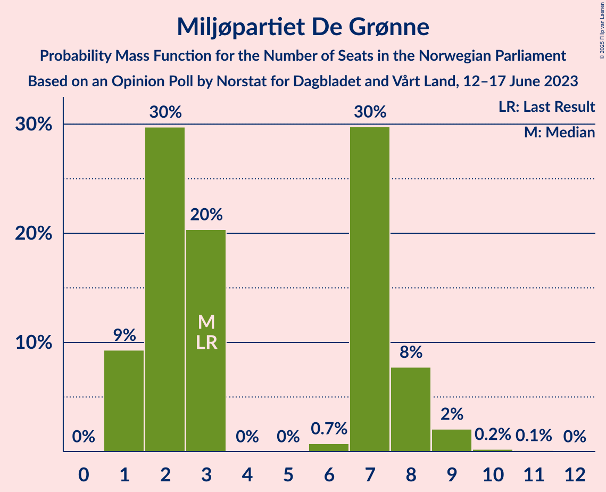

| Number of Seats | Probability | Accumulated | Special Marks |
|:---------------:|:-----------:|:-----------:|:-------------:|
| 1 | 9% | 100% |  |
| 2 | 30% | 91% |  |
| 3 | 20% | 61% | Last Result, Median |
| 4 | 0% | 41% |  |
| 5 | 0% | 41% |  |
| 6 | 0.7% | 41% |  |
| 7 | 30% | 40% |  |
| 8 | 8% | 10% |  |
| 9 | 2% | 2% |  |
| 10 | 0.2% | 0.3% |  |
| 11 | 0.1% | 0.1% |  |
| 12 | 0% | 0% |  |

### Industri- og Næringspartiet

*For a full overview of the results for this party, see the [Industri- og Næringspartiet](party-industri-ognæringspartiet.html) page.*

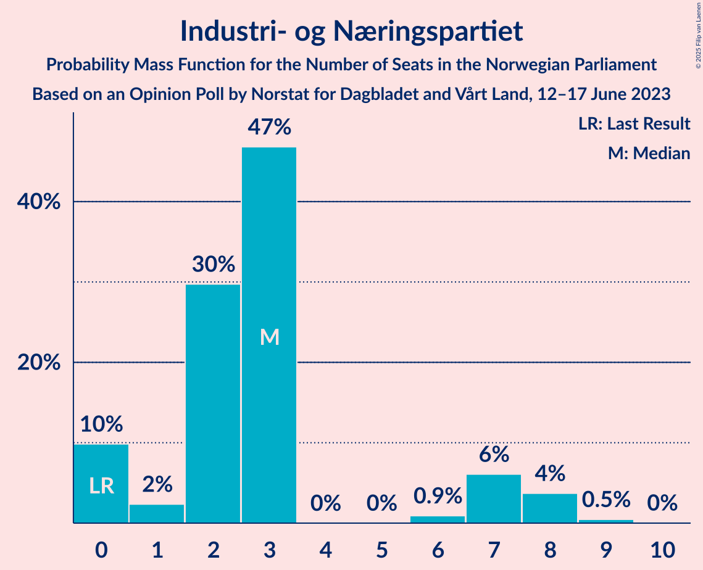

| Number of Seats | Probability | Accumulated | Special Marks |
|:---------------:|:-----------:|:-----------:|:-------------:|
| 0 | 10% | 100% | Last Result |
| 1 | 2% | 90% |  |
| 2 | 30% | 88% |  |
| 3 | 47% | 58% | Median |
| 4 | 0% | 11% |  |
| 5 | 0% | 11% |  |
| 6 | 0.9% | 11% |  |
| 7 | 6% | 10% |  |
| 8 | 4% | 4% |  |
| 9 | 0.5% | 0.5% |  |
| 10 | 0% | 0% |  |

## Coalitions

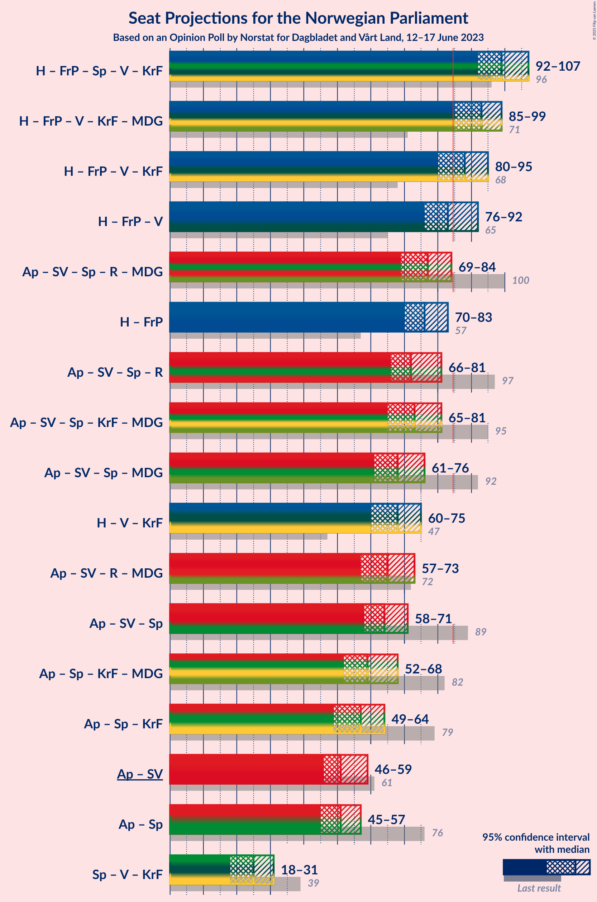

### Confidence Intervals

| Coalition | Last Result | Median | Majority? | 80% Confidence Interval | 90% Confidence Interval | 95% Confidence Interval | 99% Confidence Interval |
|:---------:|:-----------:|:------:|:---------:|:-----------------------:|:-----------------------:|:-----------------------:|:-----------------------:|
| Høyre – Fremskrittspartiet – Senterpartiet – Venstre – Kristelig Folkeparti | 96 | 99 | 100% | 96–106 | 94–106 | 92–107 | 91–113 |
| Høyre – Fremskrittspartiet – Venstre – Kristelig Folkeparti – Miljøpartiet De Grønne | 71 | 93 | 98% | 88–96 | 86–98 | 85–99 | 83–102 |
| Høyre – Fremskrittspartiet – Venstre – Kristelig Folkeparti | 68 | 88 | 87% | 84–94 | 82–94 | 80–95 | 78–100 |
| Høyre – Fremskrittspartiet – Venstre | 65 | 83 | 42% | 77–89 | 77–90 | 76–92 | 73–93 |
| Arbeiderpartiet – Sosialistisk Venstreparti – Senterpartiet – Rødt – Miljøpartiet De Grønne | 100 | 77 | 2% | 72–82 | 70–83 | 69–84 | 65–87 |
| Høyre – Fremskrittspartiet | 57 | 76 | 1.0% | 72–80 | 71–81 | 70–83 | 68–85 |
| Arbeiderpartiet – Sosialistisk Venstreparti – Senterpartiet – Rødt | 97 | 72 | 0% | 69–76 | 67–79 | 66–81 | 64–82 |
| Arbeiderpartiet – Sosialistisk Venstreparti – Senterpartiet – Kristelig Folkeparti – Miljøpartiet De Grønne | 95 | 73 | 0.4% | 68–80 | 66–81 | 65–81 | 64–83 |
| Arbeiderpartiet – Sosialistisk Venstreparti – Senterpartiet – Miljøpartiet De Grønne | 92 | 68 | 0% | 63–73 | 62–74 | 61–76 | 60–78 |
| Høyre – Venstre – Kristelig Folkeparti | 47 | 68 | 0% | 63–74 | 62–74 | 60–75 | 58–79 |
| Arbeiderpartiet – Sosialistisk Venstreparti – Rødt – Miljøpartiet De Grønne | 72 | 65 | 0% | 60–69 | 59–71 | 57–73 | 53–75 |
| Arbeiderpartiet – Sosialistisk Venstreparti – Senterpartiet | 89 | 64 | 0% | 60–68 | 59–70 | 58–71 | 57–72 |
| Arbeiderpartiet – Senterpartiet – Kristelig Folkeparti – Miljøpartiet De Grønne | 82 | 59 | 0% | 55–67 | 53–68 | 52–68 | 51–71 |
| Arbeiderpartiet – Senterpartiet – Kristelig Folkeparti | 79 | 57 | 0% | 51–61 | 51–61 | 49–64 | 47–66 |
| Arbeiderpartiet – Sosialistisk Venstreparti | 61 | 51 | 0% | 48–55 | 47–57 | 46–59 | 44–60 |
| Arbeiderpartiet – Senterpartiet | 76 | 51 | 0% | 47–55 | 46–56 | 45–57 | 44–59 |
| Senterpartiet – Venstre – Kristelig Folkeparti | 39 | 25 | 0% | 21–28 | 19–30 | 18–31 | 15–33 |

### Høyre – Fremskrittspartiet – Senterpartiet – Venstre – Kristelig Folkeparti

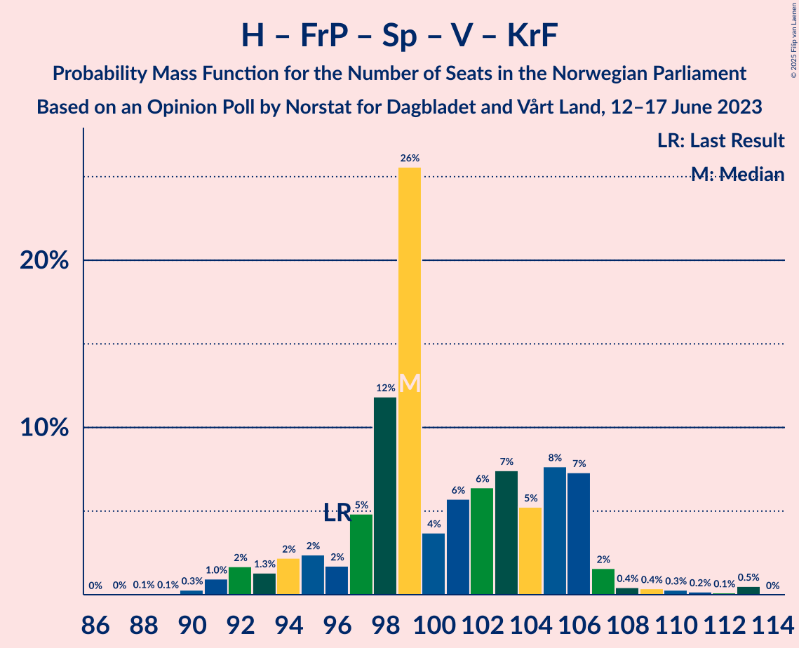

| Number of Seats | Probability | Accumulated | Special Marks |
|:---------------:|:-----------:|:-----------:|:-------------:|
| 87 | 0% | 100% |  |
| 88 | 0.1% | 99.9% |  |
| 89 | 0.1% | 99.9% |  |
| 90 | 0.3% | 99.8% |  |
| 91 | 1.0% | 99.5% |  |
| 92 | 2% | 98.6% |  |
| 93 | 1.3% | 97% |  |
| 94 | 2% | 96% |  |
| 95 | 2% | 93% |  |
| 96 | 2% | 91% | Last Result |
| 97 | 5% | 89% |  |
| 98 | 12% | 84% |  |
| 99 | 26% | 73% |  |
| 100 | 4% | 47% |  |
| 101 | 6% | 43% |  |
| 102 | 6% | 38% |  |
| 103 | 7% | 31% | Median |
| 104 | 5% | 24% |  |
| 105 | 8% | 18% |  |
| 106 | 7% | 11% |  |
| 107 | 2% | 4% |  |
| 108 | 0.4% | 2% |  |
| 109 | 0.4% | 1.5% |  |
| 110 | 0.3% | 1.1% |  |
| 111 | 0.2% | 0.8% |  |
| 112 | 0.1% | 0.7% |  |
| 113 | 0.5% | 0.5% |  |
| 114 | 0% | 0% |  |

### Høyre – Fremskrittspartiet – Venstre – Kristelig Folkeparti – Miljøpartiet De Grønne

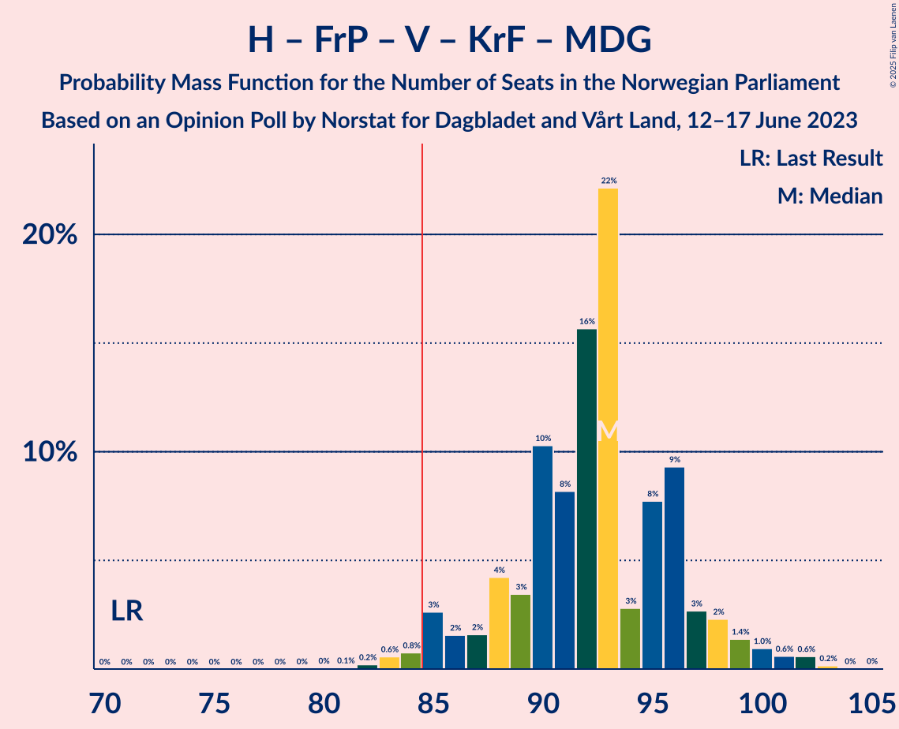

| Number of Seats | Probability | Accumulated | Special Marks |
|:---------------:|:-----------:|:-----------:|:-------------:|
| 71 | 0% | 100% | Last Result |
| 72 | 0% | 100% |  |
| 73 | 0% | 100% |  |
| 74 | 0% | 100% |  |
| 75 | 0% | 100% |  |
| 76 | 0% | 100% |  |
| 77 | 0% | 100% |  |
| 78 | 0% | 100% |  |
| 79 | 0% | 100% |  |
| 80 | 0% | 100% |  |
| 81 | 0.1% | 99.9% |  |
| 82 | 0.2% | 99.9% |  |
| 83 | 0.6% | 99.7% |  |
| 84 | 0.8% | 99.1% |  |
| 85 | 3% | 98% | Majority |
| 86 | 2% | 96% |  |
| 87 | 2% | 94% |  |
| 88 | 4% | 93% |  |
| 89 | 3% | 88% |  |
| 90 | 10% | 85% |  |
| 91 | 8% | 75% |  |
| 92 | 16% | 66% |  |
| 93 | 22% | 51% | Median |
| 94 | 3% | 29% |  |
| 95 | 8% | 26% |  |
| 96 | 9% | 18% |  |
| 97 | 3% | 9% |  |
| 98 | 2% | 6% |  |
| 99 | 1.4% | 4% |  |
| 100 | 1.0% | 2% |  |
| 101 | 0.6% | 1.4% |  |
| 102 | 0.6% | 0.8% |  |
| 103 | 0.2% | 0.2% |  |
| 104 | 0% | 0.1% |  |
| 105 | 0% | 0% |  |

### Høyre – Fremskrittspartiet – Venstre – Kristelig Folkeparti

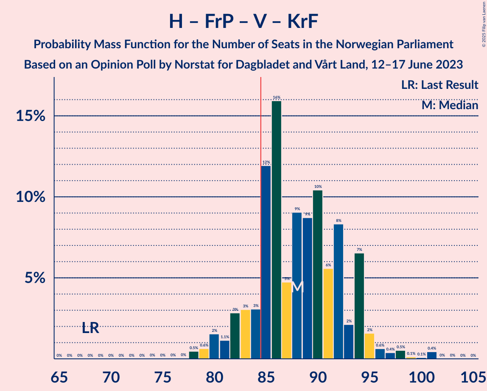

| Number of Seats | Probability | Accumulated | Special Marks |
|:---------------:|:-----------:|:-----------:|:-------------:|
| 68 | 0% | 100% | Last Result |
| 69 | 0% | 100% |  |
| 70 | 0% | 100% |  |
| 71 | 0% | 100% |  |
| 72 | 0% | 100% |  |
| 73 | 0% | 100% |  |
| 74 | 0% | 100% |  |
| 75 | 0% | 100% |  |
| 76 | 0% | 100% |  |
| 77 | 0% | 99.9% |  |
| 78 | 0.5% | 99.9% |  |
| 79 | 0.6% | 99.4% |  |
| 80 | 2% | 98.8% |  |
| 81 | 1.1% | 97% |  |
| 82 | 3% | 96% |  |
| 83 | 3% | 93% |  |
| 84 | 3% | 90% |  |
| 85 | 12% | 87% | Majority |
| 86 | 16% | 75% |  |
| 87 | 5% | 59% |  |
| 88 | 9% | 55% |  |
| 89 | 9% | 45% |  |
| 90 | 10% | 37% | Median |
| 91 | 6% | 26% |  |
| 92 | 8% | 21% |  |
| 93 | 2% | 12% |  |
| 94 | 7% | 10% |  |
| 95 | 2% | 4% |  |
| 96 | 0.6% | 2% |  |
| 97 | 0.4% | 2% |  |
| 98 | 0.5% | 1.2% |  |
| 99 | 0.1% | 0.7% |  |
| 100 | 0.1% | 0.6% |  |
| 101 | 0.4% | 0.5% |  |
| 102 | 0% | 0% |  |

### Høyre – Fremskrittspartiet – Venstre

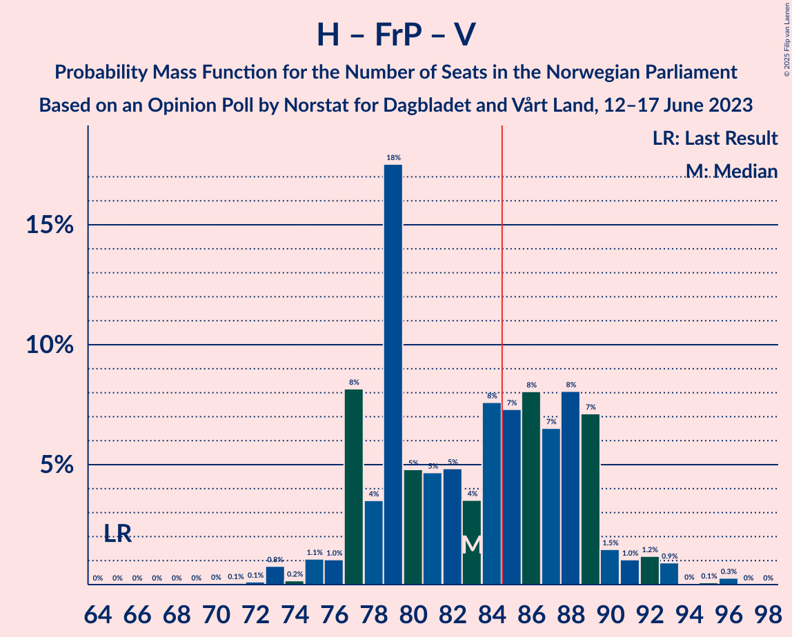

| Number of Seats | Probability | Accumulated | Special Marks |
|:---------------:|:-----------:|:-----------:|:-------------:|
| 65 | 0% | 100% | Last Result |
| 66 | 0% | 100% |  |
| 67 | 0% | 100% |  |
| 68 | 0% | 100% |  |
| 69 | 0% | 100% |  |
| 70 | 0% | 100% |  |
| 71 | 0.1% | 100% |  |
| 72 | 0.1% | 99.9% |  |
| 73 | 0.8% | 99.8% |  |
| 74 | 0.2% | 99.0% |  |
| 75 | 1.1% | 98.8% |  |
| 76 | 1.0% | 98% |  |
| 77 | 8% | 97% |  |
| 78 | 4% | 89% |  |
| 79 | 18% | 85% |  |
| 80 | 5% | 68% |  |
| 81 | 5% | 63% |  |
| 82 | 5% | 58% |  |
| 83 | 4% | 53% |  |
| 84 | 8% | 50% | Median |
| 85 | 7% | 42% | Majority |
| 86 | 8% | 35% |  |
| 87 | 7% | 27% |  |
| 88 | 8% | 20% |  |
| 89 | 7% | 12% |  |
| 90 | 1.5% | 5% |  |
| 91 | 1.0% | 4% |  |
| 92 | 1.2% | 3% |  |
| 93 | 0.9% | 1.3% |  |
| 94 | 0% | 0.4% |  |
| 95 | 0.1% | 0.4% |  |
| 96 | 0.3% | 0.3% |  |
| 97 | 0% | 0% |  |

### Arbeiderpartiet – Sosialistisk Venstreparti – Senterpartiet – Rødt – Miljøpartiet De Grønne

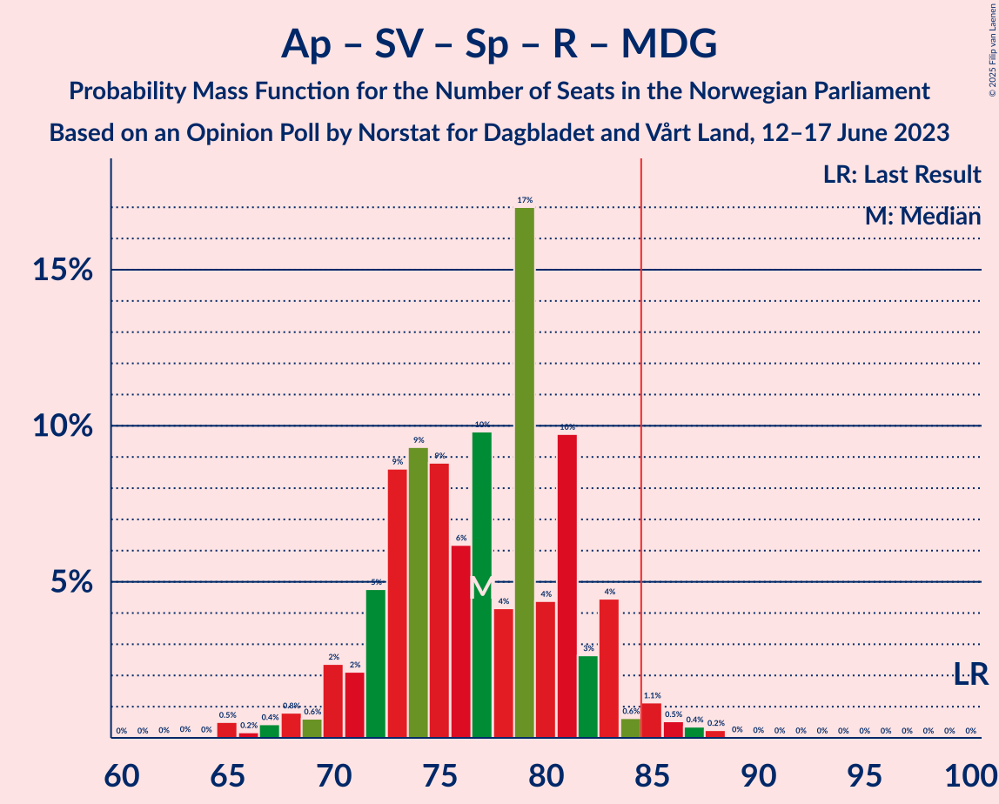

| Number of Seats | Probability | Accumulated | Special Marks |
|:---------------:|:-----------:|:-----------:|:-------------:|
| 63 | 0% | 100% |  |
| 64 | 0% | 99.9% |  |
| 65 | 0.5% | 99.9% |  |
| 66 | 0.2% | 99.4% |  |
| 67 | 0.4% | 99.2% |  |
| 68 | 0.8% | 98.8% |  |
| 69 | 0.6% | 98% |  |
| 70 | 2% | 97% |  |
| 71 | 2% | 95% |  |
| 72 | 5% | 93% |  |
| 73 | 9% | 88% |  |
| 74 | 9% | 79% |  |
| 75 | 9% | 70% |  |
| 76 | 6% | 61% | Median |
| 77 | 10% | 55% |  |
| 78 | 4% | 45% |  |
| 79 | 17% | 41% |  |
| 80 | 4% | 24% |  |
| 81 | 10% | 20% |  |
| 82 | 3% | 10% |  |
| 83 | 4% | 7% |  |
| 84 | 0.6% | 3% |  |
| 85 | 1.1% | 2% | Majority |
| 86 | 0.5% | 1.2% |  |
| 87 | 0.4% | 0.7% |  |
| 88 | 0.2% | 0.3% |  |
| 89 | 0% | 0.1% |  |
| 90 | 0% | 0% |  |
| 91 | 0% | 0% |  |
| 92 | 0% | 0% |  |
| 93 | 0% | 0% |  |
| 94 | 0% | 0% |  |
| 95 | 0% | 0% |  |
| 96 | 0% | 0% |  |
| 97 | 0% | 0% |  |
| 98 | 0% | 0% |  |
| 99 | 0% | 0% |  |
| 100 | 0% | 0% | Last Result |

### Høyre – Fremskrittspartiet

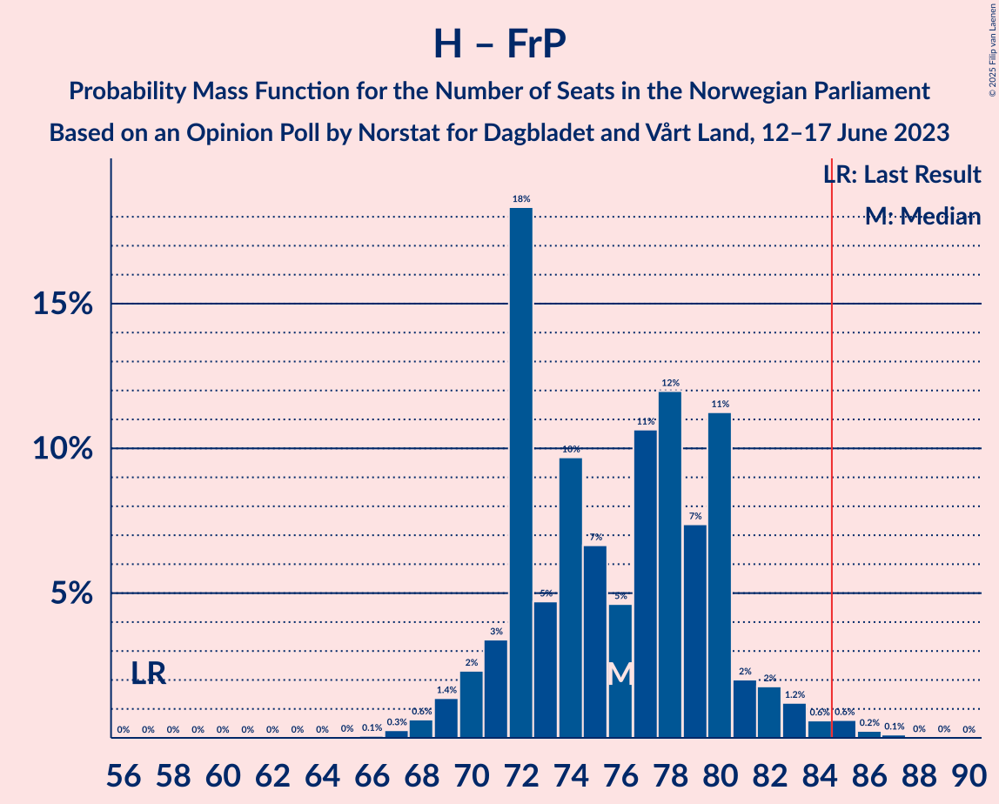

| Number of Seats | Probability | Accumulated | Special Marks |
|:---------------:|:-----------:|:-----------:|:-------------:|
| 57 | 0% | 100% | Last Result |
| 58 | 0% | 100% |  |
| 59 | 0% | 100% |  |
| 60 | 0% | 100% |  |
| 61 | 0% | 100% |  |
| 62 | 0% | 100% |  |
| 63 | 0% | 100% |  |
| 64 | 0% | 100% |  |
| 65 | 0% | 100% |  |
| 66 | 0.1% | 99.9% |  |
| 67 | 0.3% | 99.9% |  |
| 68 | 0.6% | 99.6% |  |
| 69 | 1.4% | 99.0% |  |
| 70 | 2% | 98% |  |
| 71 | 3% | 95% |  |
| 72 | 18% | 92% |  |
| 73 | 5% | 74% |  |
| 74 | 10% | 69% |  |
| 75 | 7% | 59% |  |
| 76 | 5% | 53% | Median |
| 77 | 11% | 48% |  |
| 78 | 12% | 37% |  |
| 79 | 7% | 25% |  |
| 80 | 11% | 18% |  |
| 81 | 2% | 7% |  |
| 82 | 2% | 5% |  |
| 83 | 1.2% | 3% |  |
| 84 | 0.6% | 2% |  |
| 85 | 0.6% | 1.0% | Majority |
| 86 | 0.2% | 0.4% |  |
| 87 | 0.1% | 0.2% |  |
| 88 | 0% | 0.1% |  |
| 89 | 0% | 0% |  |

### Arbeiderpartiet – Sosialistisk Venstreparti – Senterpartiet – Rødt

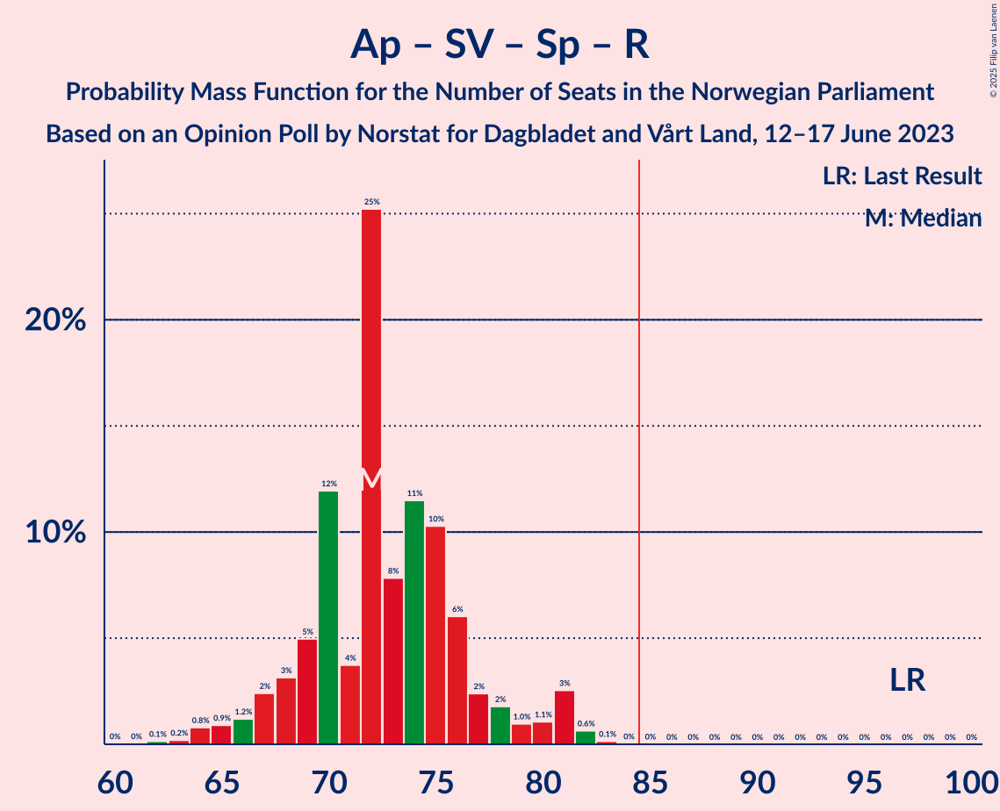

| Number of Seats | Probability | Accumulated | Special Marks |
|:---------------:|:-----------:|:-----------:|:-------------:|
| 60 | 0% | 100% |  |
| 61 | 0% | 99.9% |  |
| 62 | 0.1% | 99.9% |  |
| 63 | 0.2% | 99.8% |  |
| 64 | 0.8% | 99.6% |  |
| 65 | 0.9% | 98.8% |  |
| 66 | 1.2% | 98% |  |
| 67 | 2% | 97% |  |
| 68 | 3% | 94% |  |
| 69 | 5% | 91% |  |
| 70 | 12% | 86% |  |
| 71 | 4% | 74% |  |
| 72 | 25% | 70% |  |
| 73 | 8% | 45% | Median |
| 74 | 11% | 37% |  |
| 75 | 10% | 26% |  |
| 76 | 6% | 16% |  |
| 77 | 2% | 10% |  |
| 78 | 2% | 7% |  |
| 79 | 1.0% | 5% |  |
| 80 | 1.1% | 4% |  |
| 81 | 3% | 3% |  |
| 82 | 0.6% | 0.8% |  |
| 83 | 0.1% | 0.2% |  |
| 84 | 0% | 0.1% |  |
| 85 | 0% | 0% | Majority |
| 86 | 0% | 0% |  |
| 87 | 0% | 0% |  |
| 88 | 0% | 0% |  |
| 89 | 0% | 0% |  |
| 90 | 0% | 0% |  |
| 91 | 0% | 0% |  |
| 92 | 0% | 0% |  |
| 93 | 0% | 0% |  |
| 94 | 0% | 0% |  |
| 95 | 0% | 0% |  |
| 96 | 0% | 0% |  |
| 97 | 0% | 0% | Last Result |

### Arbeiderpartiet – Sosialistisk Venstreparti – Senterpartiet – Kristelig Folkeparti – Miljøpartiet De Grønne

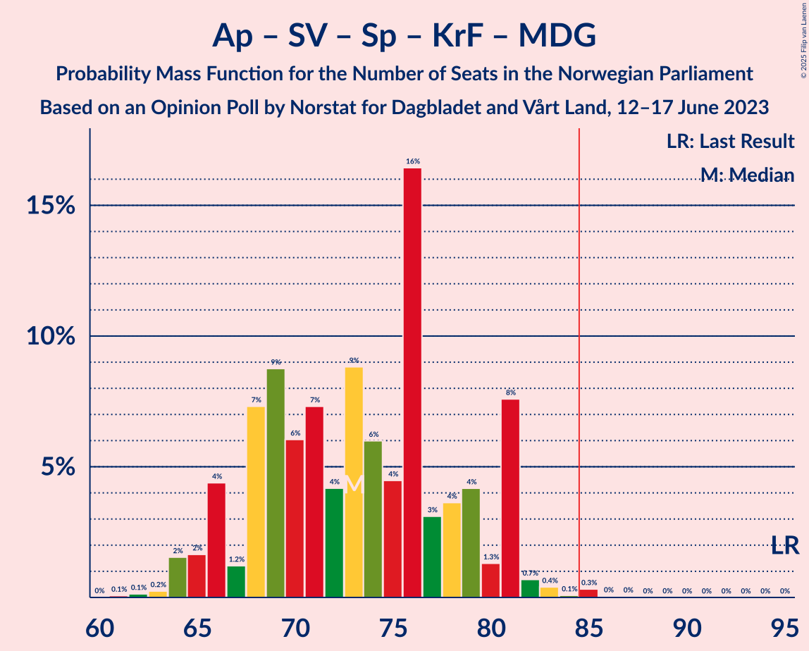

| Number of Seats | Probability | Accumulated | Special Marks |
|:---------------:|:-----------:|:-----------:|:-------------:|
| 61 | 0.1% | 100% |  |
| 62 | 0.1% | 99.9% |  |
| 63 | 0.2% | 99.8% |  |
| 64 | 2% | 99.5% |  |
| 65 | 2% | 98% |  |
| 66 | 4% | 96% |  |
| 67 | 1.2% | 92% |  |
| 68 | 7% | 91% |  |
| 69 | 9% | 83% |  |
| 70 | 6% | 75% |  |
| 71 | 7% | 69% |  |
| 72 | 4% | 61% |  |
| 73 | 9% | 57% | Median |
| 74 | 6% | 48% |  |
| 75 | 4% | 42% |  |
| 76 | 16% | 38% |  |
| 77 | 3% | 21% |  |
| 78 | 4% | 18% |  |
| 79 | 4% | 15% |  |
| 80 | 1.3% | 10% |  |
| 81 | 8% | 9% |  |
| 82 | 0.7% | 2% |  |
| 83 | 0.4% | 0.9% |  |
| 84 | 0.1% | 0.5% |  |
| 85 | 0.3% | 0.4% | Majority |
| 86 | 0% | 0.1% |  |
| 87 | 0% | 0% |  |
| 88 | 0% | 0% |  |
| 89 | 0% | 0% |  |
| 90 | 0% | 0% |  |
| 91 | 0% | 0% |  |
| 92 | 0% | 0% |  |
| 93 | 0% | 0% |  |
| 94 | 0% | 0% |  |
| 95 | 0% | 0% | Last Result |

### Arbeiderpartiet – Sosialistisk Venstreparti – Senterpartiet – Miljøpartiet De Grønne

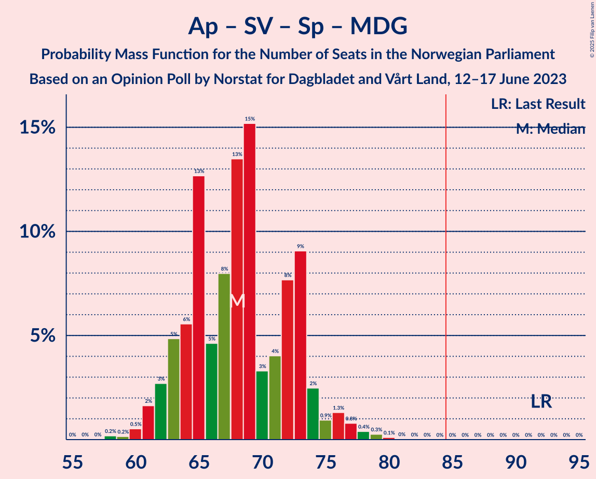

| Number of Seats | Probability | Accumulated | Special Marks |
|:---------------:|:-----------:|:-----------:|:-------------:|
| 57 | 0% | 100% |  |
| 58 | 0.2% | 99.9% |  |
| 59 | 0.2% | 99.8% |  |
| 60 | 0.5% | 99.6% |  |
| 61 | 2% | 99.1% |  |
| 62 | 3% | 97% |  |
| 63 | 5% | 95% |  |
| 64 | 6% | 90% |  |
| 65 | 13% | 84% |  |
| 66 | 5% | 72% |  |
| 67 | 8% | 67% | Median |
| 68 | 13% | 59% |  |
| 69 | 15% | 46% |  |
| 70 | 3% | 30% |  |
| 71 | 4% | 27% |  |
| 72 | 8% | 23% |  |
| 73 | 9% | 15% |  |
| 74 | 2% | 6% |  |
| 75 | 0.9% | 4% |  |
| 76 | 1.3% | 3% |  |
| 77 | 0.8% | 2% |  |
| 78 | 0.4% | 0.8% |  |
| 79 | 0.3% | 0.4% |  |
| 80 | 0.1% | 0.2% |  |
| 81 | 0% | 0.1% |  |
| 82 | 0% | 0% |  |
| 83 | 0% | 0% |  |
| 84 | 0% | 0% |  |
| 85 | 0% | 0% | Majority |
| 86 | 0% | 0% |  |
| 87 | 0% | 0% |  |
| 88 | 0% | 0% |  |
| 89 | 0% | 0% |  |
| 90 | 0% | 0% |  |
| 91 | 0% | 0% |  |
| 92 | 0% | 0% | Last Result |

### Høyre – Venstre – Kristelig Folkeparti

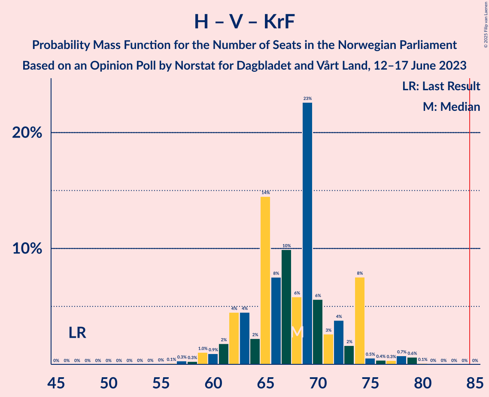

| Number of Seats | Probability | Accumulated | Special Marks |
|:---------------:|:-----------:|:-----------:|:-------------:|
| 47 | 0% | 100% | Last Result |
| 48 | 0% | 100% |  |
| 49 | 0% | 100% |  |
| 50 | 0% | 100% |  |
| 51 | 0% | 100% |  |
| 52 | 0% | 100% |  |
| 53 | 0% | 100% |  |
| 54 | 0% | 100% |  |
| 55 | 0% | 100% |  |
| 56 | 0.1% | 99.9% |  |
| 57 | 0.3% | 99.8% |  |
| 58 | 0.3% | 99.5% |  |
| 59 | 1.0% | 99.3% |  |
| 60 | 0.9% | 98% |  |
| 61 | 2% | 97% |  |
| 62 | 4% | 96% |  |
| 63 | 4% | 91% |  |
| 64 | 2% | 87% |  |
| 65 | 14% | 84% |  |
| 66 | 8% | 70% |  |
| 67 | 10% | 62% |  |
| 68 | 6% | 52% |  |
| 69 | 23% | 47% |  |
| 70 | 6% | 24% | Median |
| 71 | 3% | 18% |  |
| 72 | 4% | 16% |  |
| 73 | 2% | 12% |  |
| 74 | 8% | 10% |  |
| 75 | 0.5% | 3% |  |
| 76 | 0.4% | 2% |  |
| 77 | 0.3% | 2% |  |
| 78 | 0.7% | 1.5% |  |
| 79 | 0.6% | 0.7% |  |
| 80 | 0.1% | 0.1% |  |
| 81 | 0% | 0% |  |

### Arbeiderpartiet – Sosialistisk Venstreparti – Rødt – Miljøpartiet De Grønne

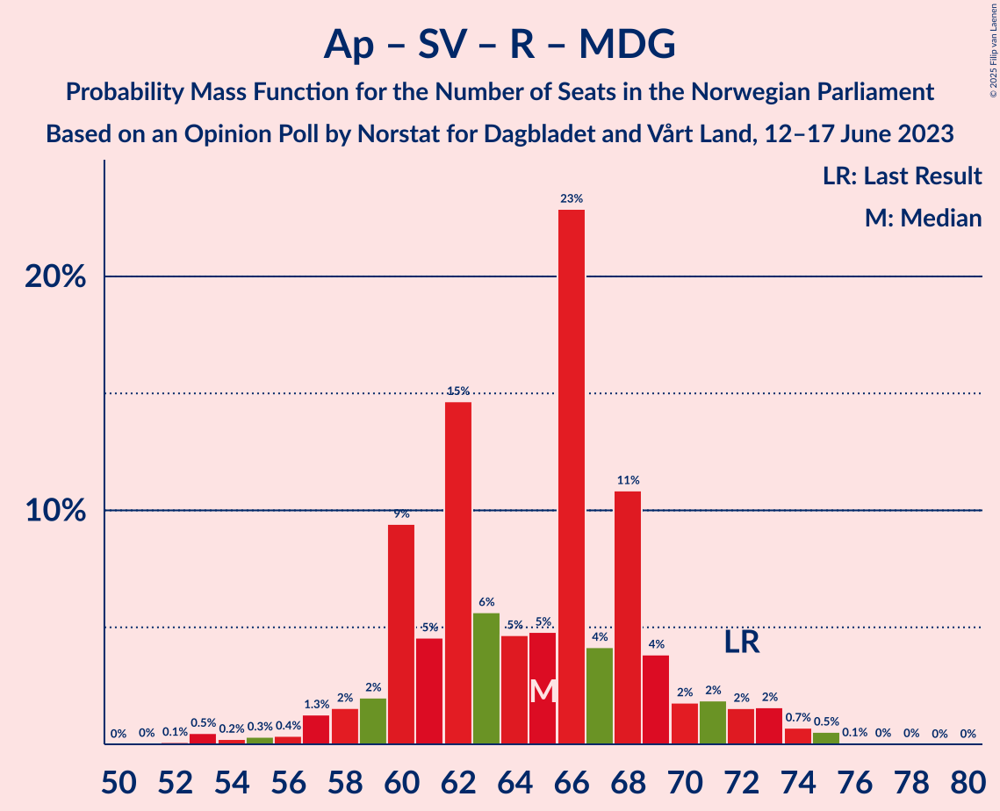

| Number of Seats | Probability | Accumulated | Special Marks |
|:---------------:|:-----------:|:-----------:|:-------------:|
| 51 | 0% | 100% |  |
| 52 | 0.1% | 99.9% |  |
| 53 | 0.5% | 99.8% |  |
| 54 | 0.2% | 99.4% |  |
| 55 | 0.3% | 99.1% |  |
| 56 | 0.4% | 98.8% |  |
| 57 | 1.3% | 98% |  |
| 58 | 2% | 97% |  |
| 59 | 2% | 96% |  |
| 60 | 9% | 94% |  |
| 61 | 5% | 84% |  |
| 62 | 15% | 80% |  |
| 63 | 6% | 65% | Median |
| 64 | 5% | 59% |  |
| 65 | 5% | 55% |  |
| 66 | 23% | 50% |  |
| 67 | 4% | 27% |  |
| 68 | 11% | 23% |  |
| 69 | 4% | 12% |  |
| 70 | 2% | 8% |  |
| 71 | 2% | 6% |  |
| 72 | 2% | 5% | Last Result |
| 73 | 2% | 3% |  |
| 74 | 0.7% | 1.4% |  |
| 75 | 0.5% | 0.7% |  |
| 76 | 0.1% | 0.2% |  |
| 77 | 0% | 0.1% |  |
| 78 | 0% | 0.1% |  |
| 79 | 0% | 0% |  |

### Arbeiderpartiet – Sosialistisk Venstreparti – Senterpartiet

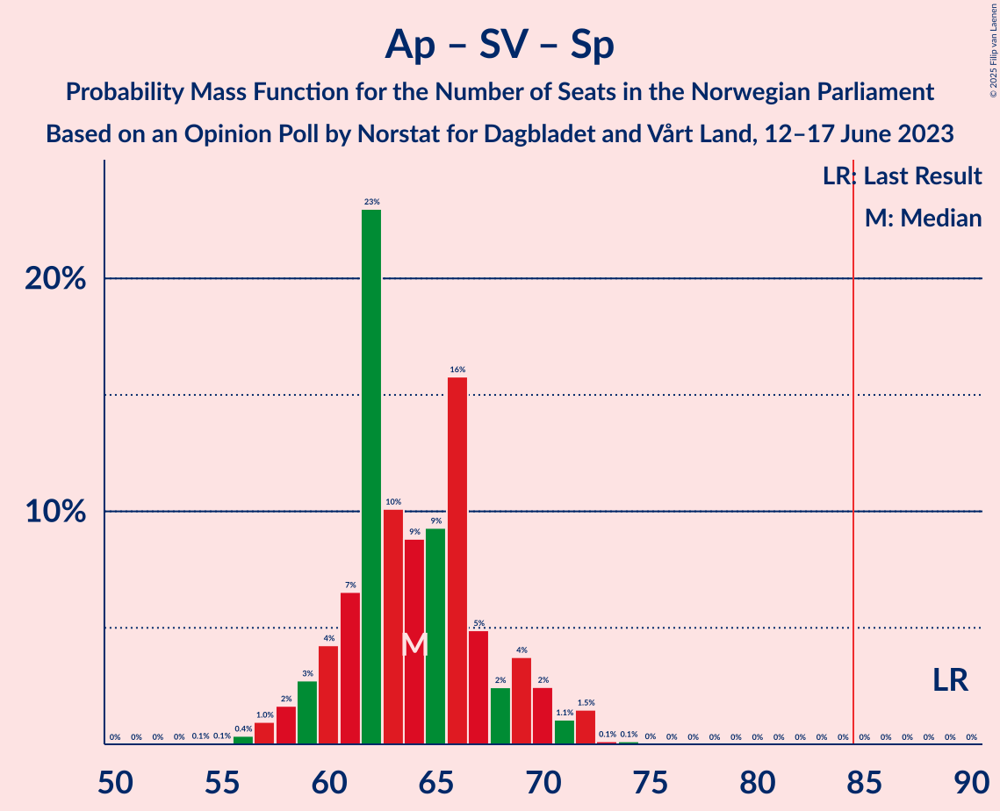

| Number of Seats | Probability | Accumulated | Special Marks |
|:---------------:|:-----------:|:-----------:|:-------------:|
| 54 | 0.1% | 100% |  |
| 55 | 0.1% | 99.9% |  |
| 56 | 0.4% | 99.9% |  |
| 57 | 1.0% | 99.5% |  |
| 58 | 2% | 98.5% |  |
| 59 | 3% | 97% |  |
| 60 | 4% | 94% |  |
| 61 | 7% | 90% |  |
| 62 | 23% | 83% |  |
| 63 | 10% | 60% |  |
| 64 | 9% | 50% | Median |
| 65 | 9% | 41% |  |
| 66 | 16% | 32% |  |
| 67 | 5% | 16% |  |
| 68 | 2% | 11% |  |
| 69 | 4% | 9% |  |
| 70 | 2% | 5% |  |
| 71 | 1.1% | 3% |  |
| 72 | 1.5% | 2% |  |
| 73 | 0.1% | 0.3% |  |
| 74 | 0.1% | 0.2% |  |
| 75 | 0% | 0.1% |  |
| 76 | 0% | 0% |  |
| 77 | 0% | 0% |  |
| 78 | 0% | 0% |  |
| 79 | 0% | 0% |  |
| 80 | 0% | 0% |  |
| 81 | 0% | 0% |  |
| 82 | 0% | 0% |  |
| 83 | 0% | 0% |  |
| 84 | 0% | 0% |  |
| 85 | 0% | 0% | Majority |
| 86 | 0% | 0% |  |
| 87 | 0% | 0% |  |
| 88 | 0% | 0% |  |
| 89 | 0% | 0% | Last Result |

### Arbeiderpartiet – Senterpartiet – Kristelig Folkeparti – Miljøpartiet De Grønne

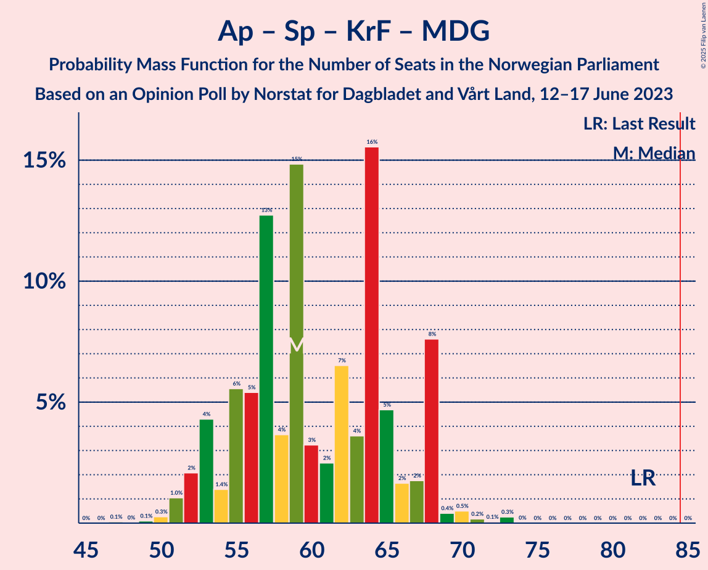

| Number of Seats | Probability | Accumulated | Special Marks |
|:---------------:|:-----------:|:-----------:|:-------------:|
| 47 | 0.1% | 100% |  |
| 48 | 0% | 99.9% |  |
| 49 | 0.1% | 99.9% |  |
| 50 | 0.3% | 99.8% |  |
| 51 | 1.0% | 99.6% |  |
| 52 | 2% | 98.5% |  |
| 53 | 4% | 96% |  |
| 54 | 1.4% | 92% |  |
| 55 | 6% | 91% |  |
| 56 | 5% | 85% |  |
| 57 | 13% | 80% |  |
| 58 | 4% | 67% |  |
| 59 | 15% | 63% |  |
| 60 | 3% | 49% | Median |
| 61 | 2% | 45% |  |
| 62 | 7% | 43% |  |
| 63 | 4% | 36% |  |
| 64 | 16% | 33% |  |
| 65 | 5% | 17% |  |
| 66 | 2% | 12% |  |
| 67 | 2% | 11% |  |
| 68 | 8% | 9% |  |
| 69 | 0.4% | 1.4% |  |
| 70 | 0.5% | 1.0% |  |
| 71 | 0.2% | 0.5% |  |
| 72 | 0.1% | 0.3% |  |
| 73 | 0.3% | 0.3% |  |
| 74 | 0% | 0% |  |
| 75 | 0% | 0% |  |
| 76 | 0% | 0% |  |
| 77 | 0% | 0% |  |
| 78 | 0% | 0% |  |
| 79 | 0% | 0% |  |
| 80 | 0% | 0% |  |
| 81 | 0% | 0% |  |
| 82 | 0% | 0% | Last Result |

### Arbeiderpartiet – Senterpartiet – Kristelig Folkeparti

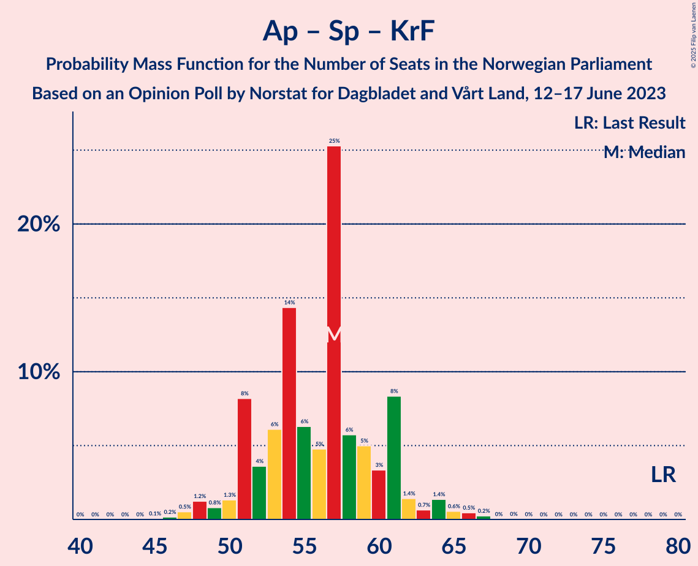

| Number of Seats | Probability | Accumulated | Special Marks |
|:---------------:|:-----------:|:-----------:|:-------------:|
| 45 | 0.1% | 100% |  |
| 46 | 0.2% | 99.9% |  |
| 47 | 0.5% | 99.8% |  |
| 48 | 1.2% | 99.2% |  |
| 49 | 0.8% | 98% |  |
| 50 | 1.3% | 97% |  |
| 51 | 8% | 96% |  |
| 52 | 4% | 88% |  |
| 53 | 6% | 84% |  |
| 54 | 14% | 78% |  |
| 55 | 6% | 64% |  |
| 56 | 5% | 57% |  |
| 57 | 25% | 53% | Median |
| 58 | 6% | 27% |  |
| 59 | 5% | 21% |  |
| 60 | 3% | 16% |  |
| 61 | 8% | 13% |  |
| 62 | 1.4% | 5% |  |
| 63 | 0.7% | 3% |  |
| 64 | 1.4% | 3% |  |
| 65 | 0.6% | 1.3% |  |
| 66 | 0.5% | 0.8% |  |
| 67 | 0.2% | 0.3% |  |
| 68 | 0% | 0.1% |  |
| 69 | 0% | 0% |  |
| 70 | 0% | 0% |  |
| 71 | 0% | 0% |  |
| 72 | 0% | 0% |  |
| 73 | 0% | 0% |  |
| 74 | 0% | 0% |  |
| 75 | 0% | 0% |  |
| 76 | 0% | 0% |  |
| 77 | 0% | 0% |  |
| 78 | 0% | 0% |  |
| 79 | 0% | 0% | Last Result |

### Arbeiderpartiet – Sosialistisk Venstreparti

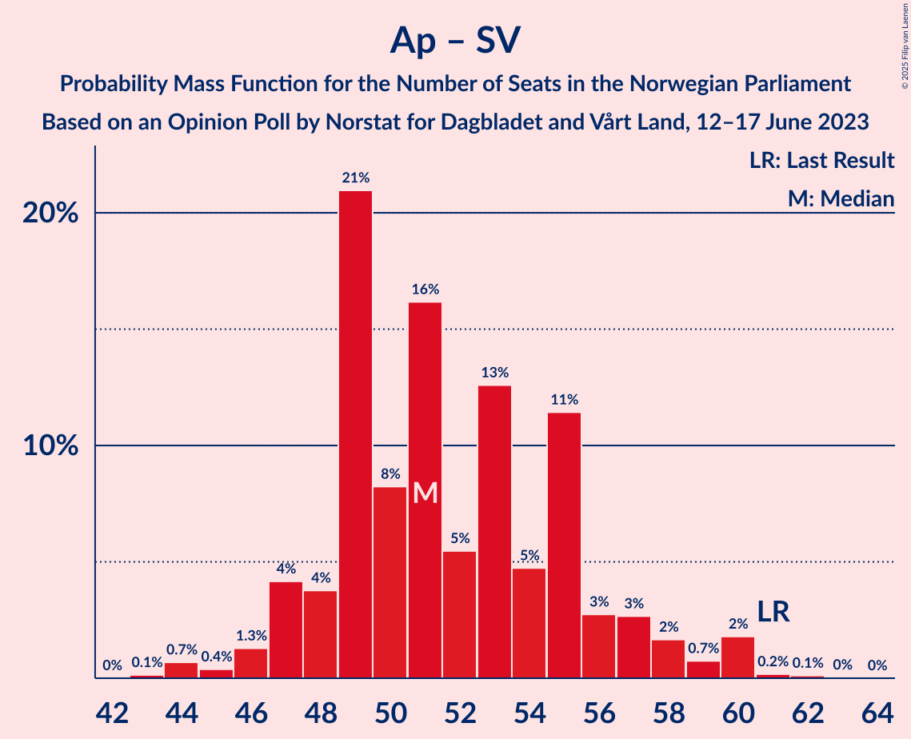

| Number of Seats | Probability | Accumulated | Special Marks |
|:---------------:|:-----------:|:-----------:|:-------------:|
| 43 | 0.1% | 100% |  |
| 44 | 0.7% | 99.8% |  |
| 45 | 0.4% | 99.2% |  |
| 46 | 1.3% | 98.8% |  |
| 47 | 4% | 97% |  |
| 48 | 4% | 93% |  |
| 49 | 21% | 90% |  |
| 50 | 8% | 69% |  |
| 51 | 16% | 60% | Median |
| 52 | 5% | 44% |  |
| 53 | 13% | 39% |  |
| 54 | 5% | 26% |  |
| 55 | 11% | 21% |  |
| 56 | 3% | 10% |  |
| 57 | 3% | 7% |  |
| 58 | 2% | 5% |  |
| 59 | 0.7% | 3% |  |
| 60 | 2% | 2% |  |
| 61 | 0.2% | 0.3% | Last Result |
| 62 | 0.1% | 0.2% |  |
| 63 | 0% | 0% |  |

### Arbeiderpartiet – Senterpartiet

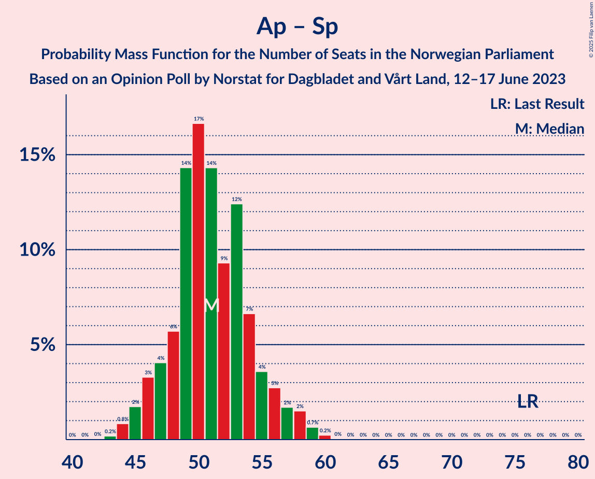

| Number of Seats | Probability | Accumulated | Special Marks |
|:---------------:|:-----------:|:-----------:|:-------------:|
| 42 | 0% | 100% |  |
| 43 | 0.2% | 99.9% |  |
| 44 | 0.8% | 99.8% |  |
| 45 | 2% | 98.9% |  |
| 46 | 3% | 97% |  |
| 47 | 4% | 94% |  |
| 48 | 6% | 90% |  |
| 49 | 14% | 84% |  |
| 50 | 17% | 70% |  |
| 51 | 14% | 53% | Median |
| 52 | 9% | 39% |  |
| 53 | 12% | 30% |  |
| 54 | 7% | 17% |  |
| 55 | 4% | 10% |  |
| 56 | 3% | 7% |  |
| 57 | 2% | 4% |  |
| 58 | 2% | 2% |  |
| 59 | 0.7% | 1.0% |  |
| 60 | 0.2% | 0.3% |  |
| 61 | 0% | 0.1% |  |
| 62 | 0% | 0% |  |
| 63 | 0% | 0% |  |
| 64 | 0% | 0% |  |
| 65 | 0% | 0% |  |
| 66 | 0% | 0% |  |
| 67 | 0% | 0% |  |
| 68 | 0% | 0% |  |
| 69 | 0% | 0% |  |
| 70 | 0% | 0% |  |
| 71 | 0% | 0% |  |
| 72 | 0% | 0% |  |
| 73 | 0% | 0% |  |
| 74 | 0% | 0% |  |
| 75 | 0% | 0% |  |
| 76 | 0% | 0% | Last Result |

### Senterpartiet – Venstre – Kristelig Folkeparti

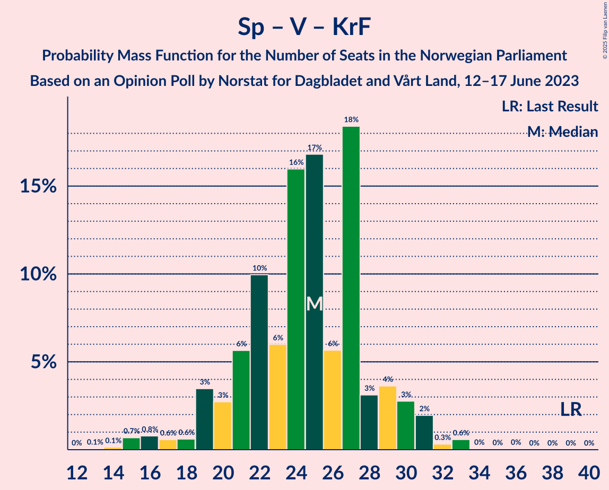

| Number of Seats | Probability | Accumulated | Special Marks |
|:---------------:|:-----------:|:-----------:|:-------------:|
| 13 | 0.1% | 100% |  |
| 14 | 0.1% | 99.9% |  |
| 15 | 0.7% | 99.8% |  |
| 16 | 0.8% | 99.1% |  |
| 17 | 0.6% | 98% |  |
| 18 | 0.6% | 98% |  |
| 19 | 3% | 97% |  |
| 20 | 3% | 94% |  |
| 21 | 6% | 91% |  |
| 22 | 10% | 85% |  |
| 23 | 6% | 75% |  |
| 24 | 16% | 69% |  |
| 25 | 17% | 53% |  |
| 26 | 6% | 37% |  |
| 27 | 18% | 31% | Median |
| 28 | 3% | 12% |  |
| 29 | 4% | 9% |  |
| 30 | 3% | 6% |  |
| 31 | 2% | 3% |  |
| 32 | 0.3% | 1.0% |  |
| 33 | 0.6% | 0.7% |  |
| 34 | 0% | 0.1% |  |
| 35 | 0% | 0.1% |  |
| 36 | 0% | 0% |  |
| 37 | 0% | 0% |  |
| 38 | 0% | 0% |  |
| 39 | 0% | 0% | Last Result |

## Technical Information

### Opinion Poll

+ **Polling firm:** Norstat
+ **Commissioner(s):** Dagbladet and Vårt Land
+ **Fieldwork period:** 12–17 June 2023

### Calculations

+ **Sample size:** 987
+ **Simulations done:** 1,048,576
+ **Error estimate:** 1.66%

