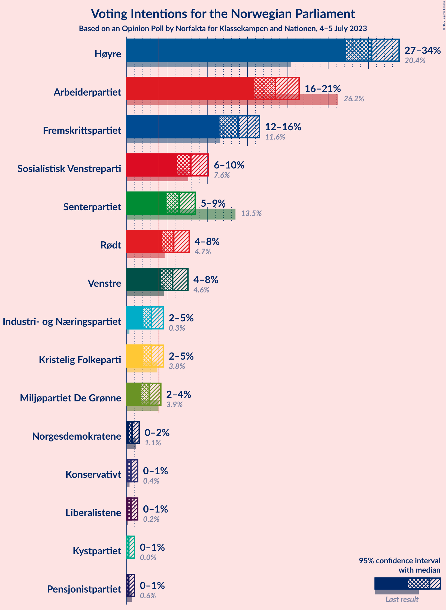
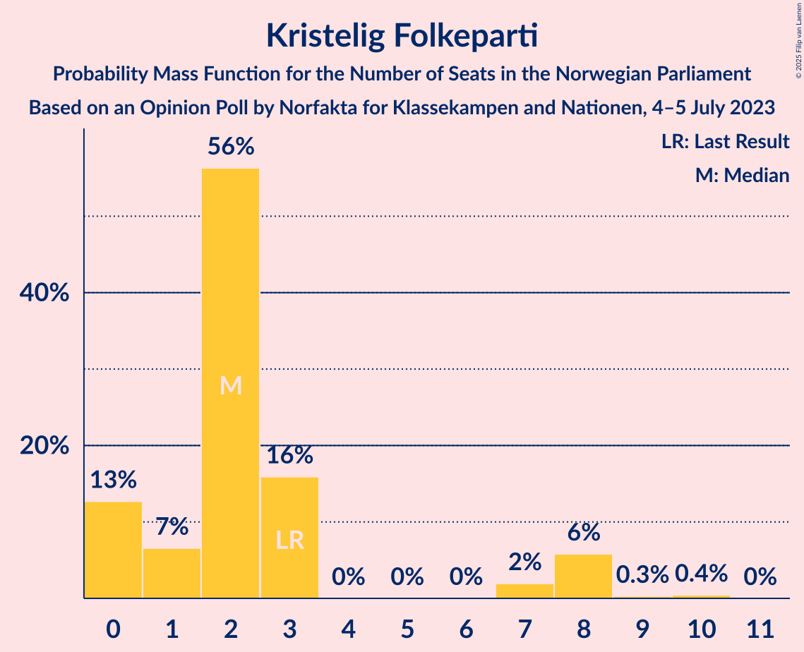

# Opinion Poll by Norfakta for Klassekampen and Nationen, 4–5 July 2023

<a href="#voting-intentions">Voting Intentions</a> | <a href="#seats">Seats</a> | <a href="#coalitions">Coalitions</a> | <a href="#technical-information">Technical Information</a>

## Voting Intentions

### Confidence Intervals

| Party | Last Result | Poll Result | 80% Confidence Interval | 90% Confidence Interval | 95% Confidence Interval | 99% Confidence Interval |
|:-----:|:-----------:|:-----------:|:-----------------------:|:-----------------------:|:-----------------------:|:-----------------------:|
| Høyre | 20.4% | 30.4% | 28.3–32.6% |27.7–33.3% |27.2–33.8% |26.2–34.9% |
| Arbeiderpartiet | 26.2% | 18.5% | 16.7–20.4% |16.3–20.9% |15.9–21.4% |15.1–22.3% |
| Fremskrittspartiet | 11.6% | 13.8% | 12.3–15.5% |11.9–16.0% |11.5–16.5% |10.8–17.3% |
| Sosialistisk Venstreparti | 7.6% | 8.0% | 6.8–9.4% |6.5–9.8% |6.2–10.1% |5.7–10.9% |
| Senterpartiet | 13.5% | 6.5% | 5.5–7.8% |5.2–8.2% |5.0–8.5% |4.5–9.2% |
| Rødt | 4.7% | 5.8% | 4.9–7.1% |4.6–7.5% |4.4–7.8% |4.0–8.4% |
| Venstre | 4.6% | 5.7% | 4.8–7.0% |4.5–7.3% |4.3–7.6% |3.8–8.2% |
| Kristelig Folkeparti | 3.8% | 3.1% | 2.4–4.0% |2.2–4.3% |2.0–4.5% |1.8–5.1% |
| Industri- og Næringspartiet | 0.3% | 3.1% | 2.4–4.0% |2.2–4.3% |2.0–4.5% |1.8–5.1% |
| Miljøpartiet De Grønne | 3.9% | 2.8% | 2.1–3.7% |2.0–4.0% |1.8–4.2% |1.6–4.7% |
| Norgesdemokratene | 1.1% | 0.7% | 0.4–1.2% |0.3–1.4% |0.3–1.6% |0.2–1.9% |
| Liberalistene | 0.2% | 0.5% | 0.3–1.1% |0.3–1.2% |0.2–1.4% |0.1–1.7% |
| Konservativt | 0.4% | 0.5% | 0.3–1.1% |0.3–1.2% |0.2–1.4% |0.1–1.7% |
| Kystpartiet | 0.0% | 0.3% | 0.1–0.7% |0.1–0.8% |0.1–1.0% |0.0–1.2% |
| Pensjonistpartiet | 0.6% | 0.3% | 0.1–0.7% |0.1–0.8% |0.1–1.0% |0.0–1.2% |

*Note:* The poll result column reflects the actual value used in the calculations. Published results may vary slightly, and in addition be rounded to fewer digits.

## Seats

### Confidence Intervals

| Party | Last Result | Median | 80% Confidence Interval | 90% Confidence Interval | 95% Confidence Interval | 99% Confidence Interval |
|:-----:|:-----------:|:------:|:-----------------------:|:-----------------------:|:-----------------------:|:-----------------------:|
| <a href="#høyre">Høyre</a> | 36 | 52 | 50–59 |50–61 |48–61 |42–69 |
| <a href="#arbeiderpartiet">Arbeiderpartiet</a> | 48 | 37 | 30–44 |30–44 |28–44 |28–46 |
| <a href="#fremskrittspartiet">Fremskrittspartiet</a> | 21 | 25 | 21–32 |20–35 |20–35 |19–36 |
| <a href="#sosialistisk-venstreparti">Sosialistisk Venstreparti</a> | 13 | 13 | 10–16 |10–18 |10–19 |9–19 |
| <a href="#senterpartiet">Senterpartiet</a> | 28 | 12 | 8–14 |8–16 |7–16 |2–17 |
| <a href="#rødt">Rødt</a> | 8 | 12 | 9–15 |8–15 |7–15 |1–15 |
| <a href="#venstre">Venstre</a> | 8 | 9 | 8–13 |3–13 |3–13 |3–14 |
| <a href="#kristelig-folkeparti">Kristelig Folkeparti</a> | 3 | 2 | 0–3 |0–8 |0–8 |0–9 |
| <a href="#industri--og-næringspartiet">Industri- og Næringspartiet</a> | 0 | 2 | 0–3 |0–8 |0–8 |0–8 |
| <a href="#miljøpartiet-de-grønne">Miljøpartiet De Grønne</a> | 3 | 1 | 1–2 |1–3 |1–8 |0–8 |
| <a href="#norgesdemokratene">Norgesdemokratene</a> | 0 | 0 | 0 |0 |0 |0 |
| <a href="#liberalistene">Liberalistene</a> | 0 | 0 | 0 |0 |0 |0 |
| <a href="#konservativt">Konservativt</a> | 0 | 0 | 0 |0 |0 |0 |
| <a href="#kystpartiet">Kystpartiet</a> | 0 | 0 | 0–1 |0–2 |0–2 |0–2 |
| <a href="#pensjonistpartiet">Pensjonistpartiet</a> | 0 | 0 | 0 |0 |0 |0 |

### Høyre

*For a full overview of the results for this party, see the [Høyre](party-høyre.html) page.*

| Number of Seats | Probability | Accumulated | Special Marks |
|:---------------:|:-----------:|:-----------:|:-------------:|
| 36 | 0% | 100% | Last Result |
| 37 | 0% | 100% |  |
| 38 | 0% | 100% |  |
| 39 | 0% | 100% |  |
| 40 | 0% | 100% |  |
| 41 | 0.5% | 100% |  |
| 42 | 0% | 99.5% |  |
| 43 | 0% | 99.5% |  |
| 44 | 0.1% | 99.4% |  |
| 45 | 0.1% | 99.4% |  |
| 46 | 0.3% | 99.3% |  |
| 47 | 0.9% | 99.0% |  |
| 48 | 2% | 98% |  |
| 49 | 0.5% | 96% |  |
| 50 | 6% | 96% |  |
| 51 | 6% | 90% |  |
| 52 | 38% | 84% | Median |
| 53 | 3% | 47% |  |
| 54 | 4% | 44% |  |
| 55 | 0.2% | 39% |  |
| 56 | 16% | 39% |  |
| 57 | 1.2% | 23% |  |
| 58 | 2% | 22% |  |
| 59 | 12% | 19% |  |
| 60 | 0.9% | 8% |  |
| 61 | 6% | 7% |  |
| 62 | 0.1% | 0.9% |  |
| 63 | 0.1% | 0.8% |  |
| 64 | 0% | 0.7% |  |
| 65 | 0% | 0.7% |  |
| 66 | 0% | 0.6% |  |
| 67 | 0% | 0.6% |  |
| 68 | 0% | 0.6% |  |
| 69 | 0.6% | 0.6% |  |
| 70 | 0% | 0% |  |

### Arbeiderpartiet

*For a full overview of the results for this party, see the [Arbeiderpartiet](party-arbeiderpartiet.html) page.*

| Number of Seats | Probability | Accumulated | Special Marks |
|:---------------:|:-----------:|:-----------:|:-------------:|
| 27 | 0.1% | 100% |  |
| 28 | 5% | 99.8% |  |
| 29 | 0.1% | 95% |  |
| 30 | 6% | 95% |  |
| 31 | 10% | 89% |  |
| 32 | 5% | 79% |  |
| 33 | 5% | 74% |  |
| 34 | 7% | 69% |  |
| 35 | 5% | 62% |  |
| 36 | 0.8% | 57% |  |
| 37 | 25% | 56% | Median |
| 38 | 0.3% | 32% |  |
| 39 | 3% | 31% |  |
| 40 | 13% | 28% |  |
| 41 | 1.0% | 15% |  |
| 42 | 0.3% | 14% |  |
| 43 | 0.1% | 14% |  |
| 44 | 12% | 14% |  |
| 45 | 0.7% | 2% |  |
| 46 | 1.3% | 1.3% |  |
| 47 | 0% | 0% |  |
| 48 | 0% | 0% | Last Result |

### Fremskrittspartiet

*For a full overview of the results for this party, see the [Fremskrittspartiet](party-fremskrittspartiet.html) page.*

| Number of Seats | Probability | Accumulated | Special Marks |
|:---------------:|:-----------:|:-----------:|:-------------:|
| 17 | 0.1% | 100% |  |
| 18 | 0.1% | 99.9% |  |
| 19 | 1.1% | 99.8% |  |
| 20 | 9% | 98.7% |  |
| 21 | 1.3% | 90% | Last Result |
| 22 | 15% | 89% |  |
| 23 | 7% | 74% |  |
| 24 | 6% | 67% |  |
| 25 | 14% | 61% | Median |
| 26 | 19% | 46% |  |
| 27 | 3% | 28% |  |
| 28 | 3% | 25% |  |
| 29 | 0.4% | 22% |  |
| 30 | 2% | 22% |  |
| 31 | 0.6% | 20% |  |
| 32 | 12% | 19% |  |
| 33 | 1.0% | 7% |  |
| 34 | 0.3% | 6% |  |
| 35 | 5% | 6% |  |
| 36 | 0.9% | 1.0% |  |
| 37 | 0% | 0% |  |

### Sosialistisk Venstreparti

*For a full overview of the results for this party, see the [Sosialistisk Venstreparti](party-sosialistiskvenstreparti.html) page.*

| Number of Seats | Probability | Accumulated | Special Marks |
|:---------------:|:-----------:|:-----------:|:-------------:|
| 9 | 1.0% | 100% |  |
| 10 | 22% | 99.0% |  |
| 11 | 2% | 77% |  |
| 12 | 14% | 75% |  |
| 13 | 27% | 61% | Last Result, Median |
| 14 | 8% | 34% |  |
| 15 | 15% | 26% |  |
| 16 | 4% | 11% |  |
| 17 | 2% | 7% |  |
| 18 | 0.8% | 5% |  |
| 19 | 4% | 4% |  |
| 20 | 0.4% | 0.5% |  |
| 21 | 0% | 0.1% |  |
| 22 | 0% | 0.1% |  |
| 23 | 0% | 0% |  |

### Senterpartiet

*For a full overview of the results for this party, see the [Senterpartiet](party-senterpartiet.html) page.*

| Number of Seats | Probability | Accumulated | Special Marks |
|:---------------:|:-----------:|:-----------:|:-------------:|
| 2 | 0.5% | 100% |  |
| 3 | 0% | 99.4% |  |
| 4 | 0% | 99.4% |  |
| 5 | 0% | 99.4% |  |
| 6 | 0.1% | 99.4% |  |
| 7 | 2% | 99.3% |  |
| 8 | 13% | 97% |  |
| 9 | 3% | 84% |  |
| 10 | 19% | 81% |  |
| 11 | 8% | 62% |  |
| 12 | 9% | 54% | Median |
| 13 | 14% | 45% |  |
| 14 | 24% | 31% |  |
| 15 | 2% | 7% |  |
| 16 | 4% | 5% |  |
| 17 | 1.3% | 1.3% |  |
| 18 | 0.1% | 0.1% |  |
| 19 | 0% | 0% |  |
| 20 | 0% | 0% |  |
| 21 | 0% | 0% |  |
| 22 | 0% | 0% |  |
| 23 | 0% | 0% |  |
| 24 | 0% | 0% |  |
| 25 | 0% | 0% |  |
| 26 | 0% | 0% |  |
| 27 | 0% | 0% |  |
| 28 | 0% | 0% | Last Result |

### Rødt

*For a full overview of the results for this party, see the [Rødt](party-rødt.html) page.*

| Number of Seats | Probability | Accumulated | Special Marks |
|:---------------:|:-----------:|:-----------:|:-------------:|
| 1 | 1.5% | 100% |  |
| 2 | 0% | 98.5% |  |
| 3 | 0% | 98.5% |  |
| 4 | 0% | 98.5% |  |
| 5 | 0% | 98.5% |  |
| 6 | 0% | 98.5% |  |
| 7 | 2% | 98.5% |  |
| 8 | 4% | 97% | Last Result |
| 9 | 11% | 93% |  |
| 10 | 5% | 81% |  |
| 11 | 20% | 76% |  |
| 12 | 22% | 56% | Median |
| 13 | 7% | 34% |  |
| 14 | 13% | 27% |  |
| 15 | 13% | 14% |  |
| 16 | 0.2% | 0.3% |  |
| 17 | 0% | 0% |  |

### Venstre

*For a full overview of the results for this party, see the [Venstre](party-venstre.html) page.*

| Number of Seats | Probability | Accumulated | Special Marks |
|:---------------:|:-----------:|:-----------:|:-------------:|
| 2 | 0.2% | 100% |  |
| 3 | 5% | 99.8% |  |
| 4 | 0% | 95% |  |
| 5 | 0% | 95% |  |
| 6 | 0% | 95% |  |
| 7 | 2% | 95% |  |
| 8 | 38% | 93% | Last Result |
| 9 | 29% | 55% | Median |
| 10 | 4% | 26% |  |
| 11 | 4% | 22% |  |
| 12 | 2% | 17% |  |
| 13 | 15% | 16% |  |
| 14 | 0.5% | 0.6% |  |
| 15 | 0.1% | 0.1% |  |
| 16 | 0% | 0% |  |

### Kristelig Folkeparti

*For a full overview of the results for this party, see the [Kristelig Folkeparti](party-kristeligfolkeparti.html) page.*

| Number of Seats | Probability | Accumulated | Special Marks |
|:---------------:|:-----------:|:-----------:|:-------------:|
| 0 | 13% | 100% |  |
| 1 | 7% | 87% |  |
| 2 | 56% | 81% | Median |
| 3 | 16% | 24% | Last Result |
| 4 | 0% | 9% |  |
| 5 | 0% | 9% |  |
| 6 | 0% | 9% |  |
| 7 | 2% | 8% |  |
| 8 | 6% | 7% |  |
| 9 | 0.3% | 0.7% |  |
| 10 | 0.4% | 0.4% |  |
| 11 | 0% | 0% |  |

### Industri- og Næringspartiet

*For a full overview of the results for this party, see the [Industri- og Næringspartiet](party-industri-ognæringspartiet.html) page.*

| Number of Seats | Probability | Accumulated | Special Marks |
|:---------------:|:-----------:|:-----------:|:-------------:|
| 0 | 28% | 100% | Last Result |
| 1 | 12% | 72% |  |
| 2 | 25% | 60% | Median |
| 3 | 27% | 35% |  |
| 4 | 0% | 8% |  |
| 5 | 0% | 8% |  |
| 6 | 0% | 8% |  |
| 7 | 2% | 8% |  |
| 8 | 5% | 6% |  |
| 9 | 0.1% | 0.3% |  |
| 10 | 0.1% | 0.1% |  |
| 11 | 0% | 0% |  |

### Miljøpartiet De Grønne

*For a full overview of the results for this party, see the [Miljøpartiet De Grønne](party-miljøpartietdegrønne.html) page.*

| Number of Seats | Probability | Accumulated | Special Marks |
|:---------------:|:-----------:|:-----------:|:-------------:|
| 0 | 0.8% | 100% |  |
| 1 | 59% | 99.2% | Median |
| 2 | 32% | 40% |  |
| 3 | 4% | 8% | Last Result |
| 4 | 0% | 4% |  |
| 5 | 0% | 4% |  |
| 6 | 0.6% | 4% |  |
| 7 | 0.6% | 3% |  |
| 8 | 2% | 3% |  |
| 9 | 0.1% | 0.2% |  |
| 10 | 0% | 0% |  |

### Norgesdemokratene

*For a full overview of the results for this party, see the [Norgesdemokratene](party-norgesdemokratene.html) page.*

| Number of Seats | Probability | Accumulated | Special Marks |
|:---------------:|:-----------:|:-----------:|:-------------:|
| 0 | 100% | 100% | Last Result, Median |

### Liberalistene

*For a full overview of the results for this party, see the [Liberalistene](party-liberalistene.html) page.*

| Number of Seats | Probability | Accumulated | Special Marks |
|:---------------:|:-----------:|:-----------:|:-------------:|
| 0 | 100% | 100% | Last Result, Median |

### Konservativt

*For a full overview of the results for this party, see the [Konservativt](party-konservativt.html) page.*

| Number of Seats | Probability | Accumulated | Special Marks |
|:---------------:|:-----------:|:-----------:|:-------------:|
| 0 | 100% | 100% | Last Result, Median |

### Kystpartiet

*For a full overview of the results for this party, see the [Kystpartiet](party-kystpartiet.html) page.*

| Number of Seats | Probability | Accumulated | Special Marks |
|:---------------:|:-----------:|:-----------:|:-------------:|
| 0 | 75% | 100% | Last Result, Median |
| 1 | 18% | 25% |  |
| 2 | 7% | 7% |  |
| 3 | 0.1% | 0.1% |  |
| 4 | 0% | 0% |  |

### Pensjonistpartiet

*For a full overview of the results for this party, see the [Pensjonistpartiet](party-pensjonistpartiet.html) page.*

| Number of Seats | Probability | Accumulated | Special Marks |
|:---------------:|:-----------:|:-----------:|:-------------:|
| 0 | 100% | 100% | Last Result, Median |

## Coalitions

### Confidence Intervals

| Coalition | Last Result | Median | Majority? | 80% Confidence Interval | 90% Confidence Interval | 95% Confidence Interval | 99% Confidence Interval |
|:---------:|:-----------:|:------:|:---------:|:-----------------------:|:-----------------------:|:-----------------------:|:-----------------------:|
| Høyre – Fremskrittspartiet – Senterpartiet – Venstre – Kristelig Folkeparti | 96 | 102 | 100% | 99–109 | 97–110 | 94–110 | 91–116 |
| Høyre – Fremskrittspartiet – Venstre – Kristelig Folkeparti – Miljøpartiet De Grønne | 71 | 94 | 98% | 89–98 | 87–100 | 85–103 | 82–111 |
| Høyre – Fremskrittspartiet – Venstre – Kristelig Folkeparti | 68 | 92 | 96% | 88–96 | 86–98 | 83–99 | 80–105 |
| Høyre – Fremskrittspartiet – Venstre | 65 | 88 | 93% | 86–93 | 83–96 | 82–96 | 78–98 |
| Høyre – Fremskrittspartiet | 57 | 79 | 12% | 74–85 | 74–85 | 73–86 | 69–92 |
| Arbeiderpartiet – Sosialistisk Venstreparti – Senterpartiet – Rødt – Miljøpartiet De Grønne | 100 | 75 | 0.7% | 69–80 | 66–80 | 64–82 | 61–85 |
| Arbeiderpartiet – Sosialistisk Venstreparti – Senterpartiet – Rødt | 97 | 73 | 0% | 67–79 | 64–79 | 62–80 | 57–82 |
| Arbeiderpartiet – Sosialistisk Venstreparti – Senterpartiet – Kristelig Folkeparti – Miljøpartiet De Grønne | 95 | 64 | 0% | 58–70 | 58–71 | 58–74 | 54–76 |
| Høyre – Venstre – Kristelig Folkeparti | 47 | 67 | 0% | 61–70 | 61–70 | 58–74 | 55–80 |
| Arbeiderpartiet – Sosialistisk Venstreparti – Senterpartiet – Miljøpartiet De Grønne | 92 | 62 | 0% | 57–68 | 57–69 | 56–71 | 52–74 |
| Arbeiderpartiet – Sosialistisk Venstreparti – Rødt – Miljøpartiet De Grønne | 72 | 63 | 0% | 56–67 | 55–67 | 54–70 | 50–72 |
| Arbeiderpartiet – Sosialistisk Venstreparti – Senterpartiet | 89 | 60 | 0% | 56–67 | 56–67 | 52–68 | 50–72 |
| Arbeiderpartiet – Senterpartiet – Kristelig Folkeparti – Miljøpartiet De Grønne | 82 | 51 | 0% | 46–57 | 44–58 | 43–59 | 43–64 |
| Arbeiderpartiet – Senterpartiet – Kristelig Folkeparti | 79 | 49 | 0% | 45–56 | 43–56 | 42–57 | 42–61 |
| Arbeiderpartiet – Sosialistisk Venstreparti | 61 | 50 | 0% | 43–54 | 42–54 | 42–56 | 40–58 |
| Arbeiderpartiet – Senterpartiet | 76 | 47 | 0% | 42–54 | 41–54 | 41–55 | 38–59 |
| Senterpartiet – Venstre – Kristelig Folkeparti | 39 | 24 | 0% | 19–26 | 19–27 | 18–29 | 14–32 |

### Høyre – Fremskrittspartiet – Senterpartiet – Venstre – Kristelig Folkeparti

| Number of Seats | Probability | Accumulated | Special Marks |
|:---------------:|:-----------:|:-----------:|:-------------:|
| 90 | 0% | 100% |  |
| 91 | 0.6% | 99.9% |  |
| 92 | 0.2% | 99.4% |  |
| 93 | 0% | 99.2% |  |
| 94 | 2% | 99.2% |  |
| 95 | 0.3% | 97% |  |
| 96 | 0.7% | 97% | Last Result |
| 97 | 1.5% | 96% |  |
| 98 | 0.2% | 95% |  |
| 99 | 13% | 95% |  |
| 100 | 14% | 82% | Median |
| 101 | 3% | 68% |  |
| 102 | 22% | 65% |  |
| 103 | 8% | 43% |  |
| 104 | 3% | 35% |  |
| 105 | 0.3% | 33% |  |
| 106 | 8% | 32% |  |
| 107 | 10% | 24% |  |
| 108 | 2% | 14% |  |
| 109 | 2% | 11% |  |
| 110 | 8% | 9% |  |
| 111 | 0.1% | 1.5% |  |
| 112 | 0.7% | 1.4% |  |
| 113 | 0.1% | 0.7% |  |
| 114 | 0% | 0.7% |  |
| 115 | 0% | 0.6% |  |
| 116 | 0.6% | 0.6% |  |
| 117 | 0.1% | 0.1% |  |
| 118 | 0% | 0% |  |

### Høyre – Fremskrittspartiet – Venstre – Kristelig Folkeparti – Miljøpartiet De Grønne

| Number of Seats | Probability | Accumulated | Special Marks |
|:---------------:|:-----------:|:-----------:|:-------------:|
| 71 | 0% | 100% | Last Result |
| 72 | 0% | 100% |  |
| 73 | 0% | 100% |  |
| 74 | 0% | 100% |  |
| 75 | 0% | 100% |  |
| 76 | 0% | 100% |  |
| 77 | 0% | 100% |  |
| 78 | 0% | 100% |  |
| 79 | 0% | 100% |  |
| 80 | 0% | 100% |  |
| 81 | 0.1% | 100% |  |
| 82 | 0.5% | 99.9% |  |
| 83 | 0.3% | 99.4% |  |
| 84 | 2% | 99.1% |  |
| 85 | 0.4% | 98% | Majority |
| 86 | 0.2% | 97% |  |
| 87 | 2% | 97% |  |
| 88 | 1.2% | 95% |  |
| 89 | 13% | 93% | Median |
| 90 | 17% | 80% |  |
| 91 | 2% | 63% |  |
| 92 | 9% | 62% |  |
| 93 | 1.5% | 53% |  |
| 94 | 21% | 52% |  |
| 95 | 11% | 31% |  |
| 96 | 2% | 19% |  |
| 97 | 4% | 17% |  |
| 98 | 6% | 13% |  |
| 99 | 1.2% | 7% |  |
| 100 | 2% | 6% |  |
| 101 | 1.0% | 4% |  |
| 102 | 0.8% | 3% |  |
| 103 | 0.1% | 3% |  |
| 104 | 1.2% | 2% |  |
| 105 | 0.1% | 1.3% |  |
| 106 | 0.4% | 1.2% |  |
| 107 | 0.3% | 0.9% |  |
| 108 | 0% | 0.6% |  |
| 109 | 0% | 0.6% |  |
| 110 | 0% | 0.5% |  |
| 111 | 0.5% | 0.5% |  |
| 112 | 0% | 0% |  |

### Høyre – Fremskrittspartiet – Venstre – Kristelig Folkeparti

| Number of Seats | Probability | Accumulated | Special Marks |
|:---------------:|:-----------:|:-----------:|:-------------:|
| 68 | 0% | 100% | Last Result |
| 69 | 0% | 100% |  |
| 70 | 0% | 100% |  |
| 71 | 0% | 100% |  |
| 72 | 0% | 100% |  |
| 73 | 0% | 100% |  |
| 74 | 0% | 100% |  |
| 75 | 0% | 100% |  |
| 76 | 0% | 100% |  |
| 77 | 0% | 100% |  |
| 78 | 0% | 100% |  |
| 79 | 0% | 100% |  |
| 80 | 0.5% | 99.9% |  |
| 81 | 0.6% | 99.4% |  |
| 82 | 0.3% | 98.8% |  |
| 83 | 2% | 98% |  |
| 84 | 0.1% | 97% |  |
| 85 | 1.4% | 96% | Majority |
| 86 | 0.8% | 95% |  |
| 87 | 2% | 94% |  |
| 88 | 13% | 92% | Median |
| 89 | 17% | 79% |  |
| 90 | 9% | 61% |  |
| 91 | 0.2% | 52% |  |
| 92 | 14% | 52% |  |
| 93 | 11% | 38% |  |
| 94 | 10% | 27% |  |
| 95 | 2% | 17% |  |
| 96 | 9% | 15% |  |
| 97 | 0.5% | 6% |  |
| 98 | 2% | 6% |  |
| 99 | 1.4% | 4% |  |
| 100 | 1.0% | 2% |  |
| 101 | 0.1% | 1.3% |  |
| 102 | 0% | 1.2% |  |
| 103 | 0.1% | 1.2% |  |
| 104 | 0% | 1.1% |  |
| 105 | 1.0% | 1.1% |  |
| 106 | 0% | 0% |  |

### Høyre – Fremskrittspartiet – Venstre

| Number of Seats | Probability | Accumulated | Special Marks |
|:---------------:|:-----------:|:-----------:|:-------------:|
| 65 | 0% | 100% | Last Result |
| 66 | 0% | 100% |  |
| 67 | 0% | 100% |  |
| 68 | 0% | 100% |  |
| 69 | 0% | 100% |  |
| 70 | 0% | 100% |  |
| 71 | 0% | 100% |  |
| 72 | 0% | 100% |  |
| 73 | 0% | 100% |  |
| 74 | 0% | 100% |  |
| 75 | 0% | 100% |  |
| 76 | 0% | 100% |  |
| 77 | 0% | 100% |  |
| 78 | 0.5% | 100% |  |
| 79 | 0.6% | 99.4% |  |
| 80 | 0.3% | 98.8% |  |
| 81 | 0.9% | 98% |  |
| 82 | 0.4% | 98% |  |
| 83 | 4% | 97% |  |
| 84 | 0.7% | 93% |  |
| 85 | 2% | 93% | Majority |
| 86 | 13% | 90% | Median |
| 87 | 17% | 77% |  |
| 88 | 13% | 60% |  |
| 89 | 13% | 47% |  |
| 90 | 1.4% | 35% |  |
| 91 | 6% | 33% |  |
| 92 | 5% | 28% |  |
| 93 | 14% | 23% |  |
| 94 | 0.4% | 9% |  |
| 95 | 0.7% | 8% |  |
| 96 | 6% | 8% |  |
| 97 | 0.1% | 2% |  |
| 98 | 2% | 2% |  |
| 99 | 0.1% | 0.5% |  |
| 100 | 0% | 0.4% |  |
| 101 | 0% | 0.4% |  |
| 102 | 0% | 0.4% |  |
| 103 | 0% | 0.4% |  |
| 104 | 0.4% | 0.4% |  |
| 105 | 0% | 0% |  |

### Høyre – Fremskrittspartiet

| Number of Seats | Probability | Accumulated | Special Marks |
|:---------------:|:-----------:|:-----------:|:-------------:|
| 57 | 0% | 100% | Last Result |
| 58 | 0% | 100% |  |
| 59 | 0% | 100% |  |
| 60 | 0% | 100% |  |
| 61 | 0% | 100% |  |
| 62 | 0% | 100% |  |
| 63 | 0% | 100% |  |
| 64 | 0% | 100% |  |
| 65 | 0% | 100% |  |
| 66 | 0% | 100% |  |
| 67 | 0% | 100% |  |
| 68 | 0% | 100% |  |
| 69 | 0.5% | 99.9% |  |
| 70 | 0.2% | 99.4% |  |
| 71 | 0.8% | 99.2% |  |
| 72 | 0.5% | 98% |  |
| 73 | 0.9% | 98% |  |
| 74 | 13% | 97% |  |
| 75 | 5% | 84% |  |
| 76 | 0.8% | 79% |  |
| 77 | 1.4% | 78% | Median |
| 78 | 17% | 77% |  |
| 79 | 10% | 59% |  |
| 80 | 0.5% | 50% |  |
| 81 | 12% | 49% |  |
| 82 | 2% | 37% |  |
| 83 | 4% | 34% |  |
| 84 | 19% | 31% |  |
| 85 | 8% | 12% | Majority |
| 86 | 0.9% | 3% |  |
| 87 | 0.3% | 2% |  |
| 88 | 0.3% | 2% |  |
| 89 | 0.9% | 2% |  |
| 90 | 0.3% | 0.9% |  |
| 91 | 0% | 0.6% |  |
| 92 | 0.2% | 0.6% |  |
| 93 | 0% | 0.4% |  |
| 94 | 0.3% | 0.4% |  |
| 95 | 0% | 0% |  |

### Arbeiderpartiet – Sosialistisk Venstreparti – Senterpartiet – Rødt – Miljøpartiet De Grønne

| Number of Seats | Probability | Accumulated | Special Marks |
|:---------------:|:-----------:|:-----------:|:-------------:|
| 60 | 0.4% | 100% |  |
| 61 | 0.2% | 99.6% |  |
| 62 | 0.3% | 99.4% |  |
| 63 | 1.2% | 99.1% |  |
| 64 | 0.8% | 98% |  |
| 65 | 0.2% | 97% |  |
| 66 | 3% | 97% |  |
| 67 | 0.4% | 93% |  |
| 68 | 2% | 93% |  |
| 69 | 2% | 91% |  |
| 70 | 11% | 89% |  |
| 71 | 4% | 79% |  |
| 72 | 8% | 74% |  |
| 73 | 7% | 66% |  |
| 74 | 0.4% | 59% |  |
| 75 | 21% | 59% | Median |
| 76 | 13% | 37% |  |
| 77 | 0.5% | 24% |  |
| 78 | 4% | 24% |  |
| 79 | 1.3% | 20% |  |
| 80 | 15% | 18% |  |
| 81 | 1.0% | 4% |  |
| 82 | 0.6% | 3% |  |
| 83 | 2% | 2% |  |
| 84 | 0% | 0.7% |  |
| 85 | 0.7% | 0.7% | Majority |
| 86 | 0% | 0.1% |  |
| 87 | 0% | 0% |  |
| 88 | 0% | 0% |  |
| 89 | 0% | 0% |  |
| 90 | 0% | 0% |  |
| 91 | 0% | 0% |  |
| 92 | 0% | 0% |  |
| 93 | 0% | 0% |  |
| 94 | 0% | 0% |  |
| 95 | 0% | 0% |  |
| 96 | 0% | 0% |  |
| 97 | 0% | 0% |  |
| 98 | 0% | 0% |  |
| 99 | 0% | 0% |  |
| 100 | 0% | 0% | Last Result |

### Arbeiderpartiet – Sosialistisk Venstreparti – Senterpartiet – Rødt

| Number of Seats | Probability | Accumulated | Special Marks |
|:---------------:|:-----------:|:-----------:|:-------------:|
| 57 | 0.6% | 100% |  |
| 58 | 0% | 99.4% |  |
| 59 | 0.5% | 99.4% |  |
| 60 | 0.1% | 98.9% |  |
| 61 | 1.0% | 98.8% |  |
| 62 | 0.8% | 98% |  |
| 63 | 0% | 97% |  |
| 64 | 2% | 97% |  |
| 65 | 3% | 95% |  |
| 66 | 0.4% | 92% |  |
| 67 | 2% | 91% |  |
| 68 | 7% | 89% |  |
| 69 | 8% | 82% |  |
| 70 | 6% | 74% |  |
| 71 | 4% | 69% |  |
| 72 | 6% | 65% |  |
| 73 | 21% | 58% |  |
| 74 | 2% | 38% | Median |
| 75 | 13% | 36% |  |
| 76 | 0.6% | 23% |  |
| 77 | 4% | 23% |  |
| 78 | 3% | 18% |  |
| 79 | 13% | 16% |  |
| 80 | 0.5% | 3% |  |
| 81 | 0.9% | 2% |  |
| 82 | 1.5% | 2% |  |
| 83 | 0% | 0.1% |  |
| 84 | 0.1% | 0.1% |  |
| 85 | 0% | 0% | Majority |
| 86 | 0% | 0% |  |
| 87 | 0% | 0% |  |
| 88 | 0% | 0% |  |
| 89 | 0% | 0% |  |
| 90 | 0% | 0% |  |
| 91 | 0% | 0% |  |
| 92 | 0% | 0% |  |
| 93 | 0% | 0% |  |
| 94 | 0% | 0% |  |
| 95 | 0% | 0% |  |
| 96 | 0% | 0% |  |
| 97 | 0% | 0% | Last Result |

### Arbeiderpartiet – Sosialistisk Venstreparti – Senterpartiet – Kristelig Folkeparti – Miljøpartiet De Grønne

| Number of Seats | Probability | Accumulated | Special Marks |
|:---------------:|:-----------:|:-----------:|:-------------:|
| 54 | 1.2% | 100% |  |
| 55 | 0% | 98.8% |  |
| 56 | 0.7% | 98.8% |  |
| 57 | 0.1% | 98% |  |
| 58 | 9% | 98% |  |
| 59 | 3% | 89% |  |
| 60 | 0.2% | 86% |  |
| 61 | 6% | 86% |  |
| 62 | 6% | 80% |  |
| 63 | 23% | 74% |  |
| 64 | 2% | 50% |  |
| 65 | 1.2% | 48% | Median |
| 66 | 3% | 47% |  |
| 67 | 14% | 44% |  |
| 68 | 6% | 30% |  |
| 69 | 5% | 24% |  |
| 70 | 14% | 20% |  |
| 71 | 0.8% | 5% |  |
| 72 | 0.8% | 5% |  |
| 73 | 0.3% | 4% |  |
| 74 | 2% | 4% |  |
| 75 | 0.4% | 1.3% |  |
| 76 | 0.8% | 0.9% |  |
| 77 | 0% | 0.2% |  |
| 78 | 0% | 0.1% |  |
| 79 | 0.1% | 0.1% |  |
| 80 | 0% | 0% |  |
| 81 | 0% | 0% |  |
| 82 | 0% | 0% |  |
| 83 | 0% | 0% |  |
| 84 | 0% | 0% |  |
| 85 | 0% | 0% | Majority |
| 86 | 0% | 0% |  |
| 87 | 0% | 0% |  |
| 88 | 0% | 0% |  |
| 89 | 0% | 0% |  |
| 90 | 0% | 0% |  |
| 91 | 0% | 0% |  |
| 92 | 0% | 0% |  |
| 93 | 0% | 0% |  |
| 94 | 0% | 0% |  |
| 95 | 0% | 0% | Last Result |

### Høyre – Venstre – Kristelig Folkeparti

| Number of Seats | Probability | Accumulated | Special Marks |
|:---------------:|:-----------:|:-----------:|:-------------:|
| 47 | 0% | 100% | Last Result |
| 48 | 0% | 100% |  |
| 49 | 0% | 100% |  |
| 50 | 0% | 100% |  |
| 51 | 0% | 100% |  |
| 52 | 0.5% | 100% |  |
| 53 | 0% | 99.5% |  |
| 54 | 0% | 99.5% |  |
| 55 | 0.1% | 99.5% |  |
| 56 | 0.1% | 99.5% |  |
| 57 | 2% | 99.4% |  |
| 58 | 1.3% | 98% |  |
| 59 | 0.1% | 96% |  |
| 60 | 0.3% | 96% |  |
| 61 | 8% | 96% |  |
| 62 | 23% | 88% |  |
| 63 | 3% | 64% | Median |
| 64 | 1.0% | 62% |  |
| 65 | 6% | 60% |  |
| 66 | 0.2% | 55% |  |
| 67 | 29% | 55% |  |
| 68 | 1.1% | 25% |  |
| 69 | 3% | 24% |  |
| 70 | 18% | 22% |  |
| 71 | 0.1% | 4% |  |
| 72 | 0.9% | 4% |  |
| 73 | 0.1% | 3% |  |
| 74 | 0.8% | 3% |  |
| 75 | 0.7% | 2% |  |
| 76 | 0.1% | 1.0% |  |
| 77 | 0.2% | 1.0% |  |
| 78 | 0.3% | 0.8% |  |
| 79 | 0% | 0.5% |  |
| 80 | 0.5% | 0.5% |  |
| 81 | 0% | 0% |  |

### Arbeiderpartiet – Sosialistisk Venstreparti – Senterpartiet – Miljøpartiet De Grønne

| Number of Seats | Probability | Accumulated | Special Marks |
|:---------------:|:-----------:|:-----------:|:-------------:|
| 52 | 1.1% | 100% |  |
| 53 | 0.4% | 98.9% |  |
| 54 | 0.6% | 98% |  |
| 55 | 0.2% | 98% |  |
| 56 | 0.6% | 98% |  |
| 57 | 8% | 97% |  |
| 58 | 5% | 89% |  |
| 59 | 6% | 84% |  |
| 60 | 2% | 78% |  |
| 61 | 26% | 76% |  |
| 62 | 8% | 50% |  |
| 63 | 0.2% | 42% | Median |
| 64 | 15% | 42% |  |
| 65 | 0.7% | 26% |  |
| 66 | 5% | 26% |  |
| 67 | 2% | 21% |  |
| 68 | 13% | 18% |  |
| 69 | 0.8% | 6% |  |
| 70 | 2% | 5% |  |
| 71 | 1.2% | 3% |  |
| 72 | 0.7% | 2% |  |
| 73 | 0.2% | 1.0% |  |
| 74 | 0.7% | 0.8% |  |
| 75 | 0.1% | 0.1% |  |
| 76 | 0% | 0% |  |
| 77 | 0% | 0% |  |
| 78 | 0% | 0% |  |
| 79 | 0% | 0% |  |
| 80 | 0% | 0% |  |
| 81 | 0% | 0% |  |
| 82 | 0% | 0% |  |
| 83 | 0% | 0% |  |
| 84 | 0% | 0% |  |
| 85 | 0% | 0% | Majority |
| 86 | 0% | 0% |  |
| 87 | 0% | 0% |  |
| 88 | 0% | 0% |  |
| 89 | 0% | 0% |  |
| 90 | 0% | 0% |  |
| 91 | 0% | 0% |  |
| 92 | 0% | 0% | Last Result |

### Arbeiderpartiet – Sosialistisk Venstreparti – Rødt – Miljøpartiet De Grønne

| Number of Seats | Probability | Accumulated | Special Marks |
|:---------------:|:-----------:|:-----------:|:-------------:|
| 49 | 0.4% | 100% |  |
| 50 | 0.2% | 99.6% |  |
| 51 | 0.1% | 99.4% |  |
| 52 | 0.1% | 99.3% |  |
| 53 | 0.9% | 99.2% |  |
| 54 | 2% | 98% |  |
| 55 | 4% | 96% |  |
| 56 | 4% | 92% |  |
| 57 | 5% | 89% |  |
| 58 | 5% | 83% |  |
| 59 | 8% | 79% |  |
| 60 | 7% | 71% |  |
| 61 | 0.5% | 64% |  |
| 62 | 1.3% | 64% |  |
| 63 | 13% | 62% | Median |
| 64 | 6% | 49% |  |
| 65 | 0.4% | 44% |  |
| 66 | 26% | 43% |  |
| 67 | 13% | 17% |  |
| 68 | 0.6% | 4% |  |
| 69 | 0.4% | 4% |  |
| 70 | 1.3% | 3% |  |
| 71 | 0.3% | 2% |  |
| 72 | 1.3% | 2% | Last Result |
| 73 | 0.1% | 0.3% |  |
| 74 | 0.2% | 0.2% |  |
| 75 | 0% | 0.1% |  |
| 76 | 0% | 0% |  |

### Arbeiderpartiet – Sosialistisk Venstreparti – Senterpartiet

| Number of Seats | Probability | Accumulated | Special Marks |
|:---------------:|:-----------:|:-----------:|:-------------:|
| 49 | 0% | 100% |  |
| 50 | 1.4% | 99.9% |  |
| 51 | 0.3% | 98.5% |  |
| 52 | 1.1% | 98% |  |
| 53 | 0.1% | 97% |  |
| 54 | 0% | 97% |  |
| 55 | 0.6% | 97% |  |
| 56 | 9% | 96% |  |
| 57 | 4% | 88% |  |
| 58 | 7% | 83% |  |
| 59 | 14% | 76% |  |
| 60 | 14% | 62% |  |
| 61 | 10% | 48% |  |
| 62 | 12% | 38% | Median |
| 63 | 2% | 26% |  |
| 64 | 2% | 25% |  |
| 65 | 5% | 23% |  |
| 66 | 2% | 18% |  |
| 67 | 12% | 16% |  |
| 68 | 1.1% | 3% |  |
| 69 | 1.3% | 2% |  |
| 70 | 0% | 0.9% |  |
| 71 | 0% | 0.8% |  |
| 72 | 0.8% | 0.8% |  |
| 73 | 0% | 0.1% |  |
| 74 | 0% | 0.1% |  |
| 75 | 0% | 0% |  |
| 76 | 0% | 0% |  |
| 77 | 0% | 0% |  |
| 78 | 0% | 0% |  |
| 79 | 0% | 0% |  |
| 80 | 0% | 0% |  |
| 81 | 0% | 0% |  |
| 82 | 0% | 0% |  |
| 83 | 0% | 0% |  |
| 84 | 0% | 0% |  |
| 85 | 0% | 0% | Majority |
| 86 | 0% | 0% |  |
| 87 | 0% | 0% |  |
| 88 | 0% | 0% |  |
| 89 | 0% | 0% | Last Result |

### Arbeiderpartiet – Senterpartiet – Kristelig Folkeparti – Miljøpartiet De Grønne

| Number of Seats | Probability | Accumulated | Special Marks |
|:---------------:|:-----------:|:-----------:|:-------------:|
| 42 | 0% | 100% |  |
| 43 | 4% | 99.9% |  |
| 44 | 3% | 96% |  |
| 45 | 3% | 93% |  |
| 46 | 5% | 91% |  |
| 47 | 2% | 85% |  |
| 48 | 7% | 83% |  |
| 49 | 10% | 77% |  |
| 50 | 13% | 67% |  |
| 51 | 4% | 54% |  |
| 52 | 2% | 50% | Median |
| 53 | 10% | 48% |  |
| 54 | 5% | 38% |  |
| 55 | 1.0% | 33% |  |
| 56 | 2% | 32% |  |
| 57 | 24% | 30% |  |
| 58 | 2% | 6% |  |
| 59 | 2% | 4% |  |
| 60 | 0.5% | 2% |  |
| 61 | 0.8% | 2% |  |
| 62 | 0.1% | 0.8% |  |
| 63 | 0.1% | 0.8% |  |
| 64 | 0.6% | 0.7% |  |
| 65 | 0% | 0.1% |  |
| 66 | 0% | 0.1% |  |
| 67 | 0% | 0.1% |  |
| 68 | 0.1% | 0.1% |  |
| 69 | 0% | 0% |  |
| 70 | 0% | 0% |  |
| 71 | 0% | 0% |  |
| 72 | 0% | 0% |  |
| 73 | 0% | 0% |  |
| 74 | 0% | 0% |  |
| 75 | 0% | 0% |  |
| 76 | 0% | 0% |  |
| 77 | 0% | 0% |  |
| 78 | 0% | 0% |  |
| 79 | 0% | 0% |  |
| 80 | 0% | 0% |  |
| 81 | 0% | 0% |  |
| 82 | 0% | 0% | Last Result |

### Arbeiderpartiet – Senterpartiet – Kristelig Folkeparti

| Number of Seats | Probability | Accumulated | Special Marks |
|:---------------:|:-----------:|:-----------:|:-------------:|
| 40 | 0% | 100% |  |
| 41 | 0.1% | 99.9% |  |
| 42 | 4% | 99.9% |  |
| 43 | 4% | 96% |  |
| 44 | 1.2% | 92% |  |
| 45 | 7% | 91% |  |
| 46 | 3% | 84% |  |
| 47 | 8% | 81% |  |
| 48 | 10% | 74% |  |
| 49 | 14% | 64% |  |
| 50 | 2% | 49% |  |
| 51 | 10% | 47% | Median |
| 52 | 6% | 37% |  |
| 53 | 0.5% | 31% |  |
| 54 | 2% | 31% |  |
| 55 | 12% | 29% |  |
| 56 | 13% | 17% |  |
| 57 | 2% | 3% |  |
| 58 | 0.5% | 1.4% |  |
| 59 | 0.1% | 0.9% |  |
| 60 | 0.1% | 0.7% |  |
| 61 | 0.6% | 0.6% |  |
| 62 | 0% | 0% |  |
| 63 | 0% | 0% |  |
| 64 | 0% | 0% |  |
| 65 | 0% | 0% |  |
| 66 | 0% | 0% |  |
| 67 | 0% | 0% |  |
| 68 | 0% | 0% |  |
| 69 | 0% | 0% |  |
| 70 | 0% | 0% |  |
| 71 | 0% | 0% |  |
| 72 | 0% | 0% |  |
| 73 | 0% | 0% |  |
| 74 | 0% | 0% |  |
| 75 | 0% | 0% |  |
| 76 | 0% | 0% |  |
| 77 | 0% | 0% |  |
| 78 | 0% | 0% |  |
| 79 | 0% | 0% | Last Result |

### Arbeiderpartiet – Sosialistisk Venstreparti

| Number of Seats | Probability | Accumulated | Special Marks |
|:---------------:|:-----------:|:-----------:|:-------------:|
| 38 | 0% | 100% |  |
| 39 | 0% | 99.9% |  |
| 40 | 0.8% | 99.9% |  |
| 41 | 0.4% | 99.1% |  |
| 42 | 5% | 98.7% |  |
| 43 | 9% | 94% |  |
| 44 | 2% | 85% |  |
| 45 | 0.2% | 83% |  |
| 46 | 3% | 83% |  |
| 47 | 12% | 80% |  |
| 48 | 10% | 67% |  |
| 49 | 2% | 57% |  |
| 50 | 15% | 55% | Median |
| 51 | 7% | 40% |  |
| 52 | 4% | 34% |  |
| 53 | 14% | 30% |  |
| 54 | 13% | 16% |  |
| 55 | 0.1% | 3% |  |
| 56 | 0.2% | 3% |  |
| 57 | 0.3% | 2% |  |
| 58 | 2% | 2% |  |
| 59 | 0% | 0.3% |  |
| 60 | 0% | 0.3% |  |
| 61 | 0% | 0.2% | Last Result |
| 62 | 0% | 0.2% |  |
| 63 | 0.1% | 0.2% |  |
| 64 | 0% | 0% |  |

### Arbeiderpartiet – Senterpartiet

| Number of Seats | Probability | Accumulated | Special Marks |
|:---------------:|:-----------:|:-----------:|:-------------:|
| 37 | 0% | 100% |  |
| 38 | 0.5% | 99.9% |  |
| 39 | 0.1% | 99.4% |  |
| 40 | 0.9% | 99.3% |  |
| 41 | 5% | 98% |  |
| 42 | 6% | 94% |  |
| 43 | 1.2% | 88% |  |
| 44 | 11% | 87% |  |
| 45 | 2% | 76% |  |
| 46 | 11% | 73% |  |
| 47 | 19% | 62% |  |
| 48 | 2% | 43% |  |
| 49 | 9% | 41% | Median |
| 50 | 1.0% | 32% |  |
| 51 | 0.2% | 31% |  |
| 52 | 14% | 31% |  |
| 53 | 0.5% | 17% |  |
| 54 | 14% | 16% |  |
| 55 | 0.6% | 3% |  |
| 56 | 0.1% | 2% |  |
| 57 | 1.3% | 2% |  |
| 58 | 0% | 0.6% |  |
| 59 | 0.6% | 0.6% |  |
| 60 | 0% | 0% |  |
| 61 | 0% | 0% |  |
| 62 | 0% | 0% |  |
| 63 | 0% | 0% |  |
| 64 | 0% | 0% |  |
| 65 | 0% | 0% |  |
| 66 | 0% | 0% |  |
| 67 | 0% | 0% |  |
| 68 | 0% | 0% |  |
| 69 | 0% | 0% |  |
| 70 | 0% | 0% |  |
| 71 | 0% | 0% |  |
| 72 | 0% | 0% |  |
| 73 | 0% | 0% |  |
| 74 | 0% | 0% |  |
| 75 | 0% | 0% |  |
| 76 | 0% | 0% | Last Result |

### Senterpartiet – Venstre – Kristelig Folkeparti

| Number of Seats | Probability | Accumulated | Special Marks |
|:---------------:|:-----------:|:-----------:|:-------------:|
| 12 | 0.4% | 100% |  |
| 13 | 0% | 99.6% |  |
| 14 | 0.1% | 99.5% |  |
| 15 | 0.1% | 99.4% |  |
| 16 | 0.2% | 99.3% |  |
| 17 | 2% | 99.1% |  |
| 18 | 0.5% | 98% |  |
| 19 | 13% | 97% |  |
| 20 | 5% | 84% |  |
| 21 | 1.4% | 79% |  |
| 22 | 12% | 77% |  |
| 23 | 15% | 65% | Median |
| 24 | 16% | 50% |  |
| 25 | 23% | 34% |  |
| 26 | 6% | 11% |  |
| 27 | 2% | 5% |  |
| 28 | 0.2% | 3% |  |
| 29 | 2% | 3% |  |
| 30 | 0.4% | 1.4% |  |
| 31 | 0.5% | 1.0% |  |
| 32 | 0.2% | 0.5% |  |
| 33 | 0.2% | 0.3% |  |
| 34 | 0.1% | 0.1% |  |
| 35 | 0% | 0% |  |
| 36 | 0% | 0% |  |
| 37 | 0% | 0% |  |
| 38 | 0% | 0% |  |
| 39 | 0% | 0% | Last Result |

## Technical Information

### Opinion Poll

+ **Polling firm:** Norfakta
+ **Commissioner(s):** Klassekampen and Nationen
+ **Fieldwork period:** 4–5 July 2023

### Calculations

+ **Sample size:** 753
+ **Simulations done:** 1,048,576
+ **Error estimate:** 3.19%

