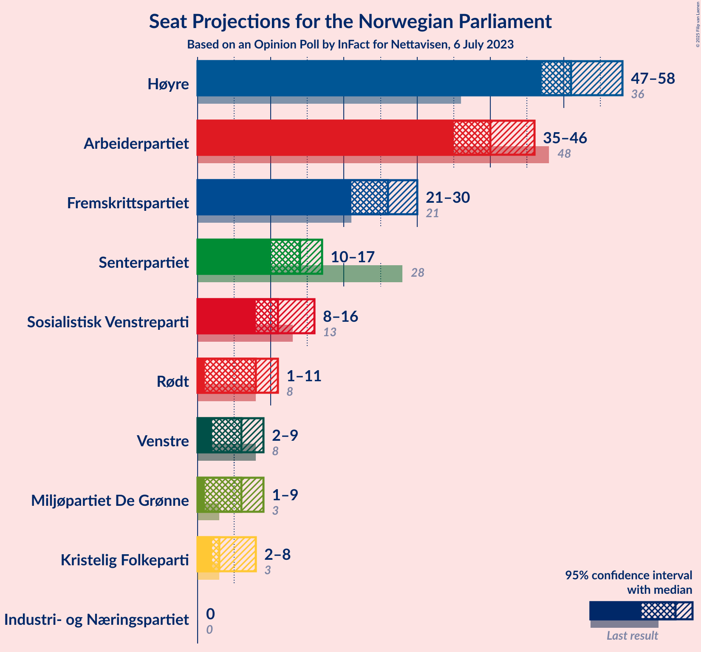
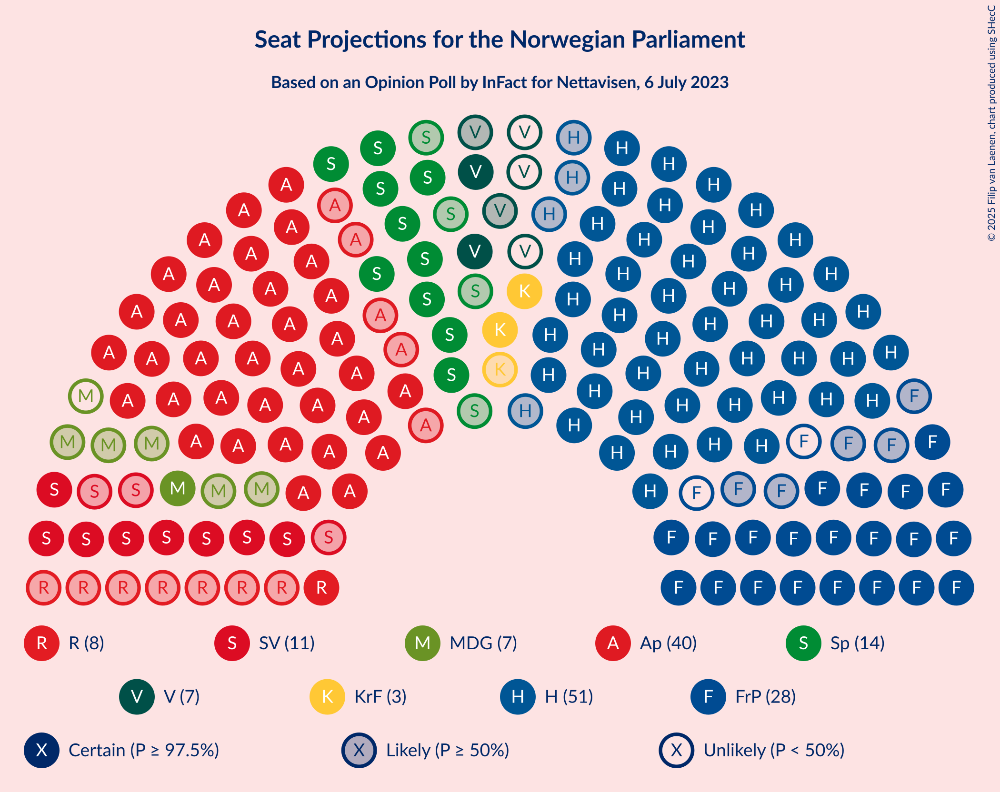
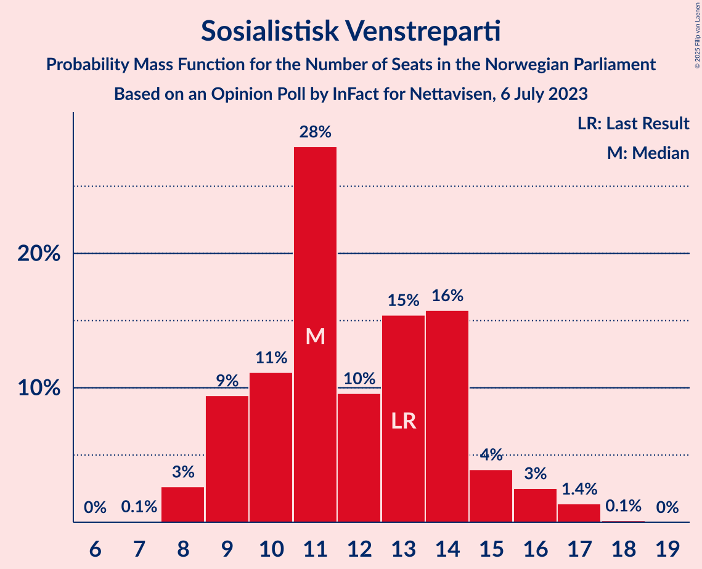
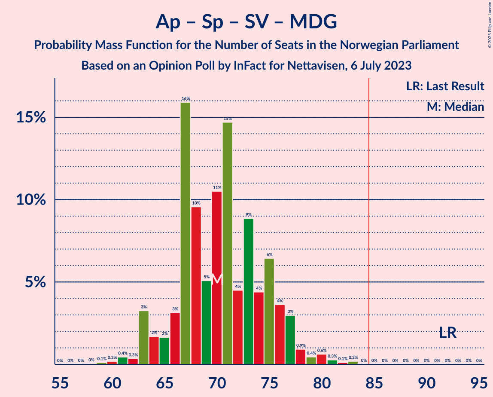
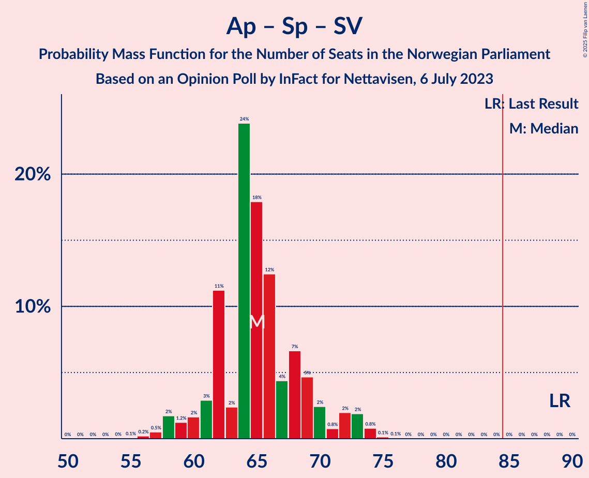

# Opinion Poll by InFact for Nettavisen, 6 July 2023

<a href="#voting-intentions">Voting Intentions</a> | <a href="#seats">Seats</a> | <a href="#coalitions">Coalitions</a> | <a href="#technical-information">Technical Information</a>

## Voting Intentions

### Confidence Intervals

| Party | Last Result | Poll Result | 80% Confidence Interval | 90% Confidence Interval | 95% Confidence Interval | 99% Confidence Interval |
|:-----:|:-----------:|:-----------:|:-----------------------:|:-----------------------:|:-----------------------:|:-----------------------:|
| Høyre | 20.4% | 29.0% | 27.2–30.9% |26.7–31.4% |26.2–31.9% |25.4–32.8% |
| Arbeiderpartiet | 26.2% | 20.8% | 19.2–22.5% |18.8–23.0% |18.4–23.4% |17.6–24.2% |
| Fremskrittspartiet | 11.6% | 14.6% | 13.2–16.1% |12.8–16.5% |12.5–16.9% |11.9–17.7% |
| Senterpartiet | 13.5% | 7.5% | 6.5–8.7% |6.2–9.0% |6.0–9.3% |5.6–9.9% |
| Sosialistisk Venstreparti | 7.6% | 6.8% | 5.9–7.9% |5.6–8.2% |5.4–8.5% |5.0–9.1% |
| Rødt | 4.7% | 4.9% | 4.1–5.9% |3.9–6.2% |3.7–6.4% |3.4–6.9% |
| Miljøpartiet De Grønne | 3.9% | 3.9% | 3.2–4.8% |3.0–5.1% |2.9–5.3% |2.6–5.8% |
| Kristelig Folkeparti | 3.8% | 3.8% | 3.1–4.7% |2.9–5.0% |2.8–5.2% |2.5–5.6% |
| Venstre | 4.6% | 3.8% | 3.1–4.7% |2.9–5.0% |2.8–5.2% |2.5–5.6% |
| Industri- og Næringspartiet | 0.3% | 1.4% | 1.0–2.0% |0.9–2.2% |0.8–2.3% |0.7–2.7% |

*Note:* The poll result column reflects the actual value used in the calculations. Published results may vary slightly, and in addition be rounded to fewer digits.

## Seats

### Confidence Intervals

| Party | Last Result | Median | 80% Confidence Interval | 90% Confidence Interval | 95% Confidence Interval | 99% Confidence Interval |
|:-----:|:-----------:|:------:|:-----------------------:|:-----------------------:|:-----------------------:|:-----------------------:|
| <a href="#høyre">Høyre</a> | 36 | 51 | 48–56 |48–56 |47–58 |45–60 |
| <a href="#arbeiderpartiet">Arbeiderpartiet</a> | 48 | 40 | 37–43 |36–45 |35–46 |33–46 |
| <a href="#fremskrittspartiet">Fremskrittspartiet</a> | 21 | 26 | 23–29 |22–29 |21–30 |20–33 |
| <a href="#senterpartiet">Senterpartiet</a> | 28 | 14 | 12–15 |11–16 |10–17 |9–17 |
| <a href="#sosialistisk-venstreparti">Sosialistisk Venstreparti</a> | 13 | 11 | 9–14 |9–15 |8–16 |8–17 |
| <a href="#rødt">Rødt</a> | 8 | 8 | 6–10 |1–11 |1–11 |1–12 |
| <a href="#miljøpartiet-de-grønne">Miljøpartiet De Grønne</a> | 3 | 6 | 2–8 |2–9 |1–9 |1–10 |
| <a href="#kristelig-folkeparti">Kristelig Folkeparti</a> | 3 | 3 | 2–8 |2–8 |2–8 |2–10 |
| <a href="#venstre">Venstre</a> | 8 | 6 | 2–8 |2–8 |2–9 |2–10 |
| <a href="#industri--og-næringspartiet">Industri- og Næringspartiet</a> | 0 | 0 | 0 |0 |0 |0–2 |

### Høyre

*For a full overview of the results for this party, see the [Høyre](party-høyre.html) page.*

| Number of Seats | Probability | Accumulated | Special Marks |
|:---------------:|:-----------:|:-----------:|:-------------:|
| 36 | 0% | 100% | Last Result |
| 37 | 0% | 100% |  |
| 38 | 0% | 100% |  |
| 39 | 0% | 100% |  |
| 40 | 0% | 100% |  |
| 41 | 0% | 100% |  |
| 42 | 0% | 100% |  |
| 43 | 0.2% | 100% |  |
| 44 | 0.1% | 99.8% |  |
| 45 | 0.6% | 99.7% |  |
| 46 | 1.2% | 99.0% |  |
| 47 | 2% | 98% |  |
| 48 | 9% | 95% |  |
| 49 | 10% | 86% |  |
| 50 | 15% | 76% |  |
| 51 | 17% | 61% | Median |
| 52 | 13% | 44% |  |
| 53 | 8% | 31% |  |
| 54 | 5% | 23% |  |
| 55 | 4% | 18% |  |
| 56 | 11% | 14% |  |
| 57 | 1.0% | 4% |  |
| 58 | 0.8% | 3% |  |
| 59 | 0.3% | 2% |  |
| 60 | 1.2% | 1.4% |  |
| 61 | 0% | 0.1% |  |
| 62 | 0% | 0.1% |  |
| 63 | 0% | 0.1% |  |
| 64 | 0% | 0% |  |

### Arbeiderpartiet

*For a full overview of the results for this party, see the [Arbeiderpartiet](party-arbeiderpartiet.html) page.*

| Number of Seats | Probability | Accumulated | Special Marks |
|:---------------:|:-----------:|:-----------:|:-------------:|
| 31 | 0.1% | 100% |  |
| 32 | 0.2% | 99.9% |  |
| 33 | 0.5% | 99.7% |  |
| 34 | 0.8% | 99.2% |  |
| 35 | 1.0% | 98% |  |
| 36 | 3% | 97% |  |
| 37 | 27% | 94% |  |
| 38 | 11% | 67% |  |
| 39 | 6% | 56% |  |
| 40 | 13% | 50% | Median |
| 41 | 14% | 37% |  |
| 42 | 6% | 22% |  |
| 43 | 7% | 17% |  |
| 44 | 3% | 10% |  |
| 45 | 3% | 6% |  |
| 46 | 3% | 3% |  |
| 47 | 0.2% | 0.3% |  |
| 48 | 0.1% | 0.1% | Last Result |
| 49 | 0% | 0% |  |

### Fremskrittspartiet

*For a full overview of the results for this party, see the [Fremskrittspartiet](party-fremskrittspartiet.html) page.*

| Number of Seats | Probability | Accumulated | Special Marks |
|:---------------:|:-----------:|:-----------:|:-------------:|
| 19 | 0.3% | 100% |  |
| 20 | 0.5% | 99.7% |  |
| 21 | 2% | 99.2% | Last Result |
| 22 | 5% | 97% |  |
| 23 | 3% | 92% |  |
| 24 | 11% | 89% |  |
| 25 | 22% | 78% |  |
| 26 | 8% | 55% | Median |
| 27 | 16% | 48% |  |
| 28 | 19% | 31% |  |
| 29 | 8% | 13% |  |
| 30 | 3% | 5% |  |
| 31 | 0.8% | 2% |  |
| 32 | 0.5% | 1.2% |  |
| 33 | 0.5% | 0.6% |  |
| 34 | 0.1% | 0.1% |  |
| 35 | 0% | 0.1% |  |
| 36 | 0% | 0% |  |

### Senterpartiet

*For a full overview of the results for this party, see the [Senterpartiet](party-senterpartiet.html) page.*

| Number of Seats | Probability | Accumulated | Special Marks |
|:---------------:|:-----------:|:-----------:|:-------------:|
| 7 | 0.1% | 100% |  |
| 8 | 0.2% | 99.9% |  |
| 9 | 2% | 99.7% |  |
| 10 | 2% | 98% |  |
| 11 | 3% | 96% |  |
| 12 | 9% | 93% |  |
| 13 | 29% | 84% |  |
| 14 | 32% | 56% | Median |
| 15 | 14% | 23% |  |
| 16 | 7% | 10% |  |
| 17 | 2% | 3% |  |
| 18 | 0.2% | 0.4% |  |
| 19 | 0.1% | 0.2% |  |
| 20 | 0% | 0% |  |
| 21 | 0% | 0% |  |
| 22 | 0% | 0% |  |
| 23 | 0% | 0% |  |
| 24 | 0% | 0% |  |
| 25 | 0% | 0% |  |
| 26 | 0% | 0% |  |
| 27 | 0% | 0% |  |
| 28 | 0% | 0% | Last Result |

### Sosialistisk Venstreparti

*For a full overview of the results for this party, see the [Sosialistisk Venstreparti](party-sosialistiskvenstreparti.html) page.*

| Number of Seats | Probability | Accumulated | Special Marks |
|:---------------:|:-----------:|:-----------:|:-------------:|
| 7 | 0.1% | 100% |  |
| 8 | 3% | 99.9% |  |
| 9 | 9% | 97% |  |
| 10 | 11% | 88% |  |
| 11 | 28% | 77% | Median |
| 12 | 10% | 49% |  |
| 13 | 15% | 39% | Last Result |
| 14 | 16% | 24% |  |
| 15 | 4% | 8% |  |
| 16 | 3% | 4% |  |
| 17 | 1.4% | 2% |  |
| 18 | 0.1% | 0.1% |  |
| 19 | 0% | 0% |  |

### Rødt

*For a full overview of the results for this party, see the [Rødt](party-rødt.html) page.*

| Number of Seats | Probability | Accumulated | Special Marks |
|:---------------:|:-----------:|:-----------:|:-------------:|
| 1 | 9% | 100% |  |
| 2 | 0% | 91% |  |
| 3 | 0% | 91% |  |
| 4 | 0% | 91% |  |
| 5 | 0.4% | 91% |  |
| 6 | 4% | 91% |  |
| 7 | 21% | 87% |  |
| 8 | 32% | 65% | Last Result, Median |
| 9 | 9% | 34% |  |
| 10 | 18% | 24% |  |
| 11 | 5% | 6% |  |
| 12 | 1.1% | 1.3% |  |
| 13 | 0.2% | 0.2% |  |
| 14 | 0% | 0% |  |

### Miljøpartiet De Grønne

*For a full overview of the results for this party, see the [Miljøpartiet De Grønne](party-miljøpartietdegrønne.html) page.*

| Number of Seats | Probability | Accumulated | Special Marks |
|:---------------:|:-----------:|:-----------:|:-------------:|
| 1 | 3% | 100% |  |
| 2 | 20% | 97% |  |
| 3 | 16% | 77% | Last Result |
| 4 | 0% | 61% |  |
| 5 | 1.3% | 61% |  |
| 6 | 18% | 60% | Median |
| 7 | 24% | 42% |  |
| 8 | 13% | 18% |  |
| 9 | 4% | 5% |  |
| 10 | 2% | 2% |  |
| 11 | 0.2% | 0.2% |  |
| 12 | 0% | 0% |  |

### Kristelig Folkeparti

*For a full overview of the results for this party, see the [Kristelig Folkeparti](party-kristeligfolkeparti.html) page.*

| Number of Seats | Probability | Accumulated | Special Marks |
|:---------------:|:-----------:|:-----------:|:-------------:|
| 0 | 0.1% | 100% |  |
| 1 | 0.2% | 99.9% |  |
| 2 | 22% | 99.7% |  |
| 3 | 51% | 78% | Last Result, Median |
| 4 | 0% | 28% |  |
| 5 | 1.0% | 28% |  |
| 6 | 6% | 26% |  |
| 7 | 10% | 20% |  |
| 8 | 8% | 11% |  |
| 9 | 2% | 2% |  |
| 10 | 0.7% | 0.9% |  |
| 11 | 0.1% | 0.1% |  |
| 12 | 0% | 0% |  |

### Venstre

*For a full overview of the results for this party, see the [Venstre](party-venstre.html) page.*

| Number of Seats | Probability | Accumulated | Special Marks |
|:---------------:|:-----------:|:-----------:|:-------------:|
| 1 | 0.3% | 100% |  |
| 2 | 14% | 99.7% |  |
| 3 | 23% | 85% |  |
| 4 | 0% | 63% |  |
| 5 | 0% | 63% |  |
| 6 | 19% | 62% | Median |
| 7 | 22% | 44% |  |
| 8 | 17% | 21% | Last Result |
| 9 | 4% | 4% |  |
| 10 | 0.7% | 0.8% |  |
| 11 | 0.1% | 0.1% |  |
| 12 | 0% | 0% |  |

### Industri- og Næringspartiet

*For a full overview of the results for this party, see the [Industri- og Næringspartiet](party-industri-ognæringspartiet.html) page.*

| Number of Seats | Probability | Accumulated | Special Marks |
|:---------------:|:-----------:|:-----------:|:-------------:|
| 0 | 99.0% | 100% | Last Result, Median |
| 1 | 0.3% | 1.0% |  |
| 2 | 0.7% | 0.8% |  |
| 3 | 0% | 0% |  |

## Coalitions

### Confidence Intervals

| Coalition | Last Result | Median | Majority? | 80% Confidence Interval | 90% Confidence Interval | 95% Confidence Interval | 99% Confidence Interval |
|:---------:|:-----------:|:------:|:---------:|:-----------------------:|:-----------------------:|:-----------------------:|:-----------------------:|
| Høyre – Fremskrittspartiet – Senterpartiet – Kristelig Folkeparti – Venstre | 96 | 101 | 100% | 96–105 | 95–108 | 93–108 | 91–110 |
| Høyre – Fremskrittspartiet – Miljøpartiet De Grønne – Kristelig Folkeparti – Venstre | 71 | 92 | 97% | 88–97 | 86–100 | 84–101 | 82–103 |
| Høyre – Fremskrittspartiet – Kristelig Folkeparti – Venstre | 68 | 87 | 69% | 82–92 | 81–93 | 80–94 | 77–96 |
| Høyre – Fremskrittspartiet – Venstre | 65 | 83 | 33% | 78–88 | 77–90 | 76–90 | 73–92 |
| Arbeiderpartiet – Senterpartiet – Sosialistisk Venstreparti – Rødt – Miljøpartiet De Grønne | 100 | 78 | 7% | 74–83 | 71–85 | 70–86 | 68–89 |
| Høyre – Fremskrittspartiet | 57 | 77 | 2% | 74–82 | 72–83 | 71–84 | 69–87 |
| Arbeiderpartiet – Senterpartiet – Sosialistisk Venstreparti – Miljøpartiet De Grønne – Kristelig Folkeparti | 95 | 74 | 0.8% | 70–79 | 69–82 | 66–84 | 65–86 |
| Arbeiderpartiet – Senterpartiet – Sosialistisk Venstreparti – Rødt | 97 | 72 | 0.1% | 68–77 | 67–80 | 65–81 | 63–82 |
| Arbeiderpartiet – Senterpartiet – Sosialistisk Venstreparti – Miljøpartiet De Grønne | 92 | 70 | 0% | 66–75 | 64–77 | 63–78 | 61–81 |
| Arbeiderpartiet – Senterpartiet – Sosialistisk Venstreparti | 89 | 65 | 0% | 62–69 | 60–71 | 58–73 | 57–74 |
| Arbeiderpartiet – Sosialistisk Venstreparti – Rødt – Miljøpartiet De Grønne | 72 | 65 | 0% | 60–69 | 59–72 | 57–73 | 54–76 |
| Arbeiderpartiet – Senterpartiet – Miljøpartiet De Grønne – Kristelig Folkeparti | 82 | 62 | 0% | 56–68 | 56–70 | 54–71 | 53–73 |
| Høyre – Kristelig Folkeparti – Venstre | 47 | 61 | 0% | 57–66 | 55–67 | 54–68 | 52–70 |
| Arbeiderpartiet – Senterpartiet – Kristelig Folkeparti | 79 | 57 | 0% | 53–62 | 52–64 | 51–66 | 49–67 |
| Arbeiderpartiet – Senterpartiet | 76 | 53 | 0% | 50–57 | 49–58 | 48–59 | 46–60 |
| Arbeiderpartiet – Sosialistisk Venstreparti | 61 | 51 | 0% | 49–55 | 48–58 | 47–59 | 44–60 |
| Senterpartiet – Kristelig Folkeparti – Venstre | 39 | 23 | 0% | 19–27 | 18–28 | 17–29 | 15–31 |

### Høyre – Fremskrittspartiet – Senterpartiet – Kristelig Folkeparti – Venstre

| Number of Seats | Probability | Accumulated | Special Marks |
|:---------------:|:-----------:|:-----------:|:-------------:|
| 88 | 0.1% | 100% |  |
| 89 | 0.2% | 99.9% |  |
| 90 | 0.1% | 99.7% |  |
| 91 | 0.3% | 99.5% |  |
| 92 | 0.6% | 99.2% |  |
| 93 | 1.5% | 98.7% |  |
| 94 | 1.4% | 97% |  |
| 95 | 4% | 96% |  |
| 96 | 11% | 92% | Last Result |
| 97 | 10% | 80% |  |
| 98 | 3% | 71% |  |
| 99 | 11% | 68% |  |
| 100 | 4% | 57% | Median |
| 101 | 6% | 53% |  |
| 102 | 15% | 47% |  |
| 103 | 6% | 32% |  |
| 104 | 3% | 26% |  |
| 105 | 13% | 23% |  |
| 106 | 2% | 9% |  |
| 107 | 2% | 8% |  |
| 108 | 4% | 6% |  |
| 109 | 0.7% | 2% |  |
| 110 | 0.7% | 1.1% |  |
| 111 | 0.1% | 0.4% |  |
| 112 | 0.1% | 0.3% |  |
| 113 | 0% | 0.1% |  |
| 114 | 0% | 0.1% |  |
| 115 | 0% | 0.1% |  |
| 116 | 0% | 0% |  |

### Høyre – Fremskrittspartiet – Miljøpartiet De Grønne – Kristelig Folkeparti – Venstre

| Number of Seats | Probability | Accumulated | Special Marks |
|:---------------:|:-----------:|:-----------:|:-------------:|
| 71 | 0% | 100% | Last Result |
| 72 | 0% | 100% |  |
| 73 | 0% | 100% |  |
| 74 | 0% | 100% |  |
| 75 | 0% | 100% |  |
| 76 | 0% | 100% |  |
| 77 | 0% | 100% |  |
| 78 | 0% | 100% |  |
| 79 | 0.1% | 100% |  |
| 80 | 0% | 99.9% |  |
| 81 | 0.2% | 99.8% |  |
| 82 | 0.2% | 99.6% |  |
| 83 | 0.8% | 99.4% |  |
| 84 | 1.3% | 98.6% |  |
| 85 | 2% | 97% | Majority |
| 86 | 2% | 95% |  |
| 87 | 2% | 93% |  |
| 88 | 3% | 91% |  |
| 89 | 9% | 87% |  |
| 90 | 10% | 78% |  |
| 91 | 8% | 68% |  |
| 92 | 13% | 60% | Median |
| 93 | 16% | 47% |  |
| 94 | 10% | 31% |  |
| 95 | 2% | 21% |  |
| 96 | 5% | 19% |  |
| 97 | 4% | 14% |  |
| 98 | 3% | 10% |  |
| 99 | 2% | 7% |  |
| 100 | 1.4% | 5% |  |
| 101 | 3% | 4% |  |
| 102 | 0.5% | 1.1% |  |
| 103 | 0.4% | 0.6% |  |
| 104 | 0.1% | 0.2% |  |
| 105 | 0.1% | 0.1% |  |
| 106 | 0% | 0% |  |

### Høyre – Fremskrittspartiet – Kristelig Folkeparti – Venstre

| Number of Seats | Probability | Accumulated | Special Marks |
|:---------------:|:-----------:|:-----------:|:-------------:|
| 68 | 0% | 100% | Last Result |
| 69 | 0% | 100% |  |
| 70 | 0% | 100% |  |
| 71 | 0% | 100% |  |
| 72 | 0% | 100% |  |
| 73 | 0% | 100% |  |
| 74 | 0.1% | 100% |  |
| 75 | 0% | 99.9% |  |
| 76 | 0.2% | 99.9% |  |
| 77 | 0.3% | 99.7% |  |
| 78 | 0.6% | 99.4% |  |
| 79 | 1.0% | 98.8% |  |
| 80 | 2% | 98% |  |
| 81 | 3% | 96% |  |
| 82 | 11% | 94% |  |
| 83 | 4% | 83% |  |
| 84 | 10% | 79% |  |
| 85 | 4% | 69% | Majority |
| 86 | 14% | 65% | Median |
| 87 | 8% | 51% |  |
| 88 | 5% | 43% |  |
| 89 | 5% | 38% |  |
| 90 | 7% | 33% |  |
| 91 | 13% | 26% |  |
| 92 | 3% | 13% |  |
| 93 | 7% | 10% |  |
| 94 | 1.2% | 3% |  |
| 95 | 0.8% | 2% |  |
| 96 | 0.9% | 1.3% |  |
| 97 | 0.2% | 0.4% |  |
| 98 | 0.1% | 0.3% |  |
| 99 | 0.1% | 0.2% |  |
| 100 | 0% | 0.1% |  |
| 101 | 0% | 0% |  |

### Høyre – Fremskrittspartiet – Venstre

| Number of Seats | Probability | Accumulated | Special Marks |
|:---------------:|:-----------:|:-----------:|:-------------:|
| 65 | 0% | 100% | Last Result |
| 66 | 0% | 100% |  |
| 67 | 0% | 100% |  |
| 68 | 0% | 100% |  |
| 69 | 0% | 100% |  |
| 70 | 0% | 100% |  |
| 71 | 0.1% | 100% |  |
| 72 | 0.3% | 99.9% |  |
| 73 | 0.4% | 99.6% |  |
| 74 | 0.5% | 99.2% |  |
| 75 | 1.1% | 98.7% |  |
| 76 | 1.4% | 98% |  |
| 77 | 2% | 96% |  |
| 78 | 5% | 94% |  |
| 79 | 13% | 89% |  |
| 80 | 6% | 76% |  |
| 81 | 8% | 71% |  |
| 82 | 6% | 62% |  |
| 83 | 9% | 56% | Median |
| 84 | 14% | 47% |  |
| 85 | 4% | 33% | Majority |
| 86 | 4% | 29% |  |
| 87 | 5% | 24% |  |
| 88 | 13% | 20% |  |
| 89 | 0.9% | 7% |  |
| 90 | 5% | 6% |  |
| 91 | 0.4% | 1.4% |  |
| 92 | 0.6% | 1.0% |  |
| 93 | 0.2% | 0.4% |  |
| 94 | 0.2% | 0.2% |  |
| 95 | 0.1% | 0.1% |  |
| 96 | 0% | 0% |  |

### Arbeiderpartiet – Senterpartiet – Sosialistisk Venstreparti – Rødt – Miljøpartiet De Grønne

| Number of Seats | Probability | Accumulated | Special Marks |
|:---------------:|:-----------:|:-----------:|:-------------:|
| 64 | 0.1% | 100% |  |
| 65 | 0.1% | 99.9% |  |
| 66 | 0.1% | 99.9% |  |
| 67 | 0.1% | 99.7% |  |
| 68 | 0.3% | 99.6% |  |
| 69 | 2% | 99.4% |  |
| 70 | 1.0% | 98% |  |
| 71 | 3% | 97% |  |
| 72 | 2% | 94% |  |
| 73 | 2% | 92% |  |
| 74 | 2% | 90% |  |
| 75 | 13% | 88% |  |
| 76 | 4% | 74% |  |
| 77 | 16% | 70% |  |
| 78 | 13% | 55% |  |
| 79 | 13% | 42% | Median |
| 80 | 5% | 29% |  |
| 81 | 7% | 24% |  |
| 82 | 6% | 17% |  |
| 83 | 3% | 11% |  |
| 84 | 2% | 8% |  |
| 85 | 3% | 7% | Majority |
| 86 | 1.3% | 4% |  |
| 87 | 0.8% | 2% |  |
| 88 | 0.5% | 2% |  |
| 89 | 0.8% | 1.2% |  |
| 90 | 0.1% | 0.4% |  |
| 91 | 0.2% | 0.3% |  |
| 92 | 0% | 0% |  |
| 93 | 0% | 0% |  |
| 94 | 0% | 0% |  |
| 95 | 0% | 0% |  |
| 96 | 0% | 0% |  |
| 97 | 0% | 0% |  |
| 98 | 0% | 0% |  |
| 99 | 0% | 0% |  |
| 100 | 0% | 0% | Last Result |

### Høyre – Fremskrittspartiet

| Number of Seats | Probability | Accumulated | Special Marks |
|:---------------:|:-----------:|:-----------:|:-------------:|
| 57 | 0% | 100% | Last Result |
| 58 | 0% | 100% |  |
| 59 | 0% | 100% |  |
| 60 | 0% | 100% |  |
| 61 | 0% | 100% |  |
| 62 | 0% | 100% |  |
| 63 | 0% | 100% |  |
| 64 | 0% | 100% |  |
| 65 | 0% | 100% |  |
| 66 | 0% | 100% |  |
| 67 | 0% | 100% |  |
| 68 | 0.1% | 100% |  |
| 69 | 0.5% | 99.9% |  |
| 70 | 0.5% | 99.4% |  |
| 71 | 2% | 98.9% |  |
| 72 | 3% | 97% |  |
| 73 | 3% | 94% |  |
| 74 | 3% | 91% |  |
| 75 | 10% | 88% |  |
| 76 | 25% | 78% |  |
| 77 | 5% | 53% | Median |
| 78 | 12% | 48% |  |
| 79 | 7% | 36% |  |
| 80 | 4% | 29% |  |
| 81 | 13% | 24% |  |
| 82 | 5% | 11% |  |
| 83 | 2% | 6% |  |
| 84 | 1.2% | 4% |  |
| 85 | 0.3% | 2% | Majority |
| 86 | 0.2% | 2% |  |
| 87 | 1.5% | 2% |  |
| 88 | 0.2% | 0.3% |  |
| 89 | 0.1% | 0.2% |  |
| 90 | 0% | 0.1% |  |
| 91 | 0% | 0.1% |  |
| 92 | 0% | 0% |  |

### Arbeiderpartiet – Senterpartiet – Sosialistisk Venstreparti – Miljøpartiet De Grønne – Kristelig Folkeparti

| Number of Seats | Probability | Accumulated | Special Marks |
|:---------------:|:-----------:|:-----------:|:-------------:|
| 62 | 0.1% | 100% |  |
| 63 | 0.1% | 99.9% |  |
| 64 | 0.2% | 99.8% |  |
| 65 | 2% | 99.5% |  |
| 66 | 0.8% | 98% |  |
| 67 | 0.9% | 97% |  |
| 68 | 0.9% | 96% |  |
| 69 | 3% | 95% |  |
| 70 | 21% | 92% |  |
| 71 | 3% | 71% |  |
| 72 | 4% | 68% |  |
| 73 | 8% | 64% |  |
| 74 | 11% | 56% | Median |
| 75 | 4% | 45% |  |
| 76 | 8% | 41% |  |
| 77 | 10% | 33% |  |
| 78 | 8% | 23% |  |
| 79 | 5% | 15% |  |
| 80 | 2% | 10% |  |
| 81 | 2% | 7% |  |
| 82 | 2% | 6% |  |
| 83 | 1.2% | 4% |  |
| 84 | 2% | 3% |  |
| 85 | 0.3% | 0.8% | Majority |
| 86 | 0.3% | 0.5% |  |
| 87 | 0% | 0.3% |  |
| 88 | 0.3% | 0.3% |  |
| 89 | 0% | 0% |  |
| 90 | 0% | 0% |  |
| 91 | 0% | 0% |  |
| 92 | 0% | 0% |  |
| 93 | 0% | 0% |  |
| 94 | 0% | 0% |  |
| 95 | 0% | 0% | Last Result |

### Arbeiderpartiet – Senterpartiet – Sosialistisk Venstreparti – Rødt

| Number of Seats | Probability | Accumulated | Special Marks |
|:---------------:|:-----------:|:-----------:|:-------------:|
| 60 | 0% | 100% |  |
| 61 | 0.1% | 99.9% |  |
| 62 | 0.1% | 99.8% |  |
| 63 | 0.5% | 99.8% |  |
| 64 | 1.5% | 99.3% |  |
| 65 | 1.1% | 98% |  |
| 66 | 2% | 97% |  |
| 67 | 4% | 95% |  |
| 68 | 2% | 91% |  |
| 69 | 11% | 89% |  |
| 70 | 2% | 78% |  |
| 71 | 6% | 76% |  |
| 72 | 20% | 70% |  |
| 73 | 3% | 50% | Median |
| 74 | 12% | 47% |  |
| 75 | 16% | 35% |  |
| 76 | 5% | 18% |  |
| 77 | 6% | 14% |  |
| 78 | 2% | 8% |  |
| 79 | 1.1% | 6% |  |
| 80 | 2% | 5% |  |
| 81 | 2% | 3% |  |
| 82 | 1.2% | 2% |  |
| 83 | 0.2% | 0.4% |  |
| 84 | 0% | 0.2% |  |
| 85 | 0% | 0.1% | Majority |
| 86 | 0.1% | 0.1% |  |
| 87 | 0% | 0% |  |
| 88 | 0% | 0% |  |
| 89 | 0% | 0% |  |
| 90 | 0% | 0% |  |
| 91 | 0% | 0% |  |
| 92 | 0% | 0% |  |
| 93 | 0% | 0% |  |
| 94 | 0% | 0% |  |
| 95 | 0% | 0% |  |
| 96 | 0% | 0% |  |
| 97 | 0% | 0% | Last Result |

### Arbeiderpartiet – Senterpartiet – Sosialistisk Venstreparti – Miljøpartiet De Grønne

| Number of Seats | Probability | Accumulated | Special Marks |
|:---------------:|:-----------:|:-----------:|:-------------:|
| 58 | 0% | 100% |  |
| 59 | 0.1% | 99.9% |  |
| 60 | 0.2% | 99.8% |  |
| 61 | 0.4% | 99.7% |  |
| 62 | 0.3% | 99.2% |  |
| 63 | 3% | 98.9% |  |
| 64 | 2% | 96% |  |
| 65 | 2% | 94% |  |
| 66 | 3% | 92% |  |
| 67 | 16% | 89% |  |
| 68 | 10% | 73% |  |
| 69 | 5% | 64% |  |
| 70 | 11% | 59% |  |
| 71 | 15% | 48% | Median |
| 72 | 4% | 33% |  |
| 73 | 9% | 29% |  |
| 74 | 4% | 20% |  |
| 75 | 6% | 16% |  |
| 76 | 4% | 9% |  |
| 77 | 3% | 6% |  |
| 78 | 0.9% | 3% |  |
| 79 | 0.4% | 2% |  |
| 80 | 0.6% | 1.2% |  |
| 81 | 0.3% | 0.6% |  |
| 82 | 0.1% | 0.3% |  |
| 83 | 0.2% | 0.2% |  |
| 84 | 0% | 0% |  |
| 85 | 0% | 0% | Majority |
| 86 | 0% | 0% |  |
| 87 | 0% | 0% |  |
| 88 | 0% | 0% |  |
| 89 | 0% | 0% |  |
| 90 | 0% | 0% |  |
| 91 | 0% | 0% |  |
| 92 | 0% | 0% | Last Result |

### Arbeiderpartiet – Senterpartiet – Sosialistisk Venstreparti

| Number of Seats | Probability | Accumulated | Special Marks |
|:---------------:|:-----------:|:-----------:|:-------------:|
| 55 | 0.1% | 100% |  |
| 56 | 0.2% | 99.9% |  |
| 57 | 0.5% | 99.7% |  |
| 58 | 2% | 99.2% |  |
| 59 | 1.2% | 97% |  |
| 60 | 2% | 96% |  |
| 61 | 3% | 95% |  |
| 62 | 11% | 92% |  |
| 63 | 2% | 80% |  |
| 64 | 24% | 78% |  |
| 65 | 18% | 54% | Median |
| 66 | 12% | 36% |  |
| 67 | 4% | 24% |  |
| 68 | 7% | 19% |  |
| 69 | 5% | 13% |  |
| 70 | 2% | 8% |  |
| 71 | 0.8% | 6% |  |
| 72 | 2% | 5% |  |
| 73 | 2% | 3% |  |
| 74 | 0.8% | 1.0% |  |
| 75 | 0.1% | 0.2% |  |
| 76 | 0.1% | 0.1% |  |
| 77 | 0% | 0% |  |
| 78 | 0% | 0% |  |
| 79 | 0% | 0% |  |
| 80 | 0% | 0% |  |
| 81 | 0% | 0% |  |
| 82 | 0% | 0% |  |
| 83 | 0% | 0% |  |
| 84 | 0% | 0% |  |
| 85 | 0% | 0% | Majority |
| 86 | 0% | 0% |  |
| 87 | 0% | 0% |  |
| 88 | 0% | 0% |  |
| 89 | 0% | 0% | Last Result |

### Arbeiderpartiet – Sosialistisk Venstreparti – Rødt – Miljøpartiet De Grønne

| Number of Seats | Probability | Accumulated | Special Marks |
|:---------------:|:-----------:|:-----------:|:-------------:|
| 49 | 0.1% | 100% |  |
| 50 | 0% | 99.9% |  |
| 51 | 0% | 99.9% |  |
| 52 | 0% | 99.9% |  |
| 53 | 0.2% | 99.9% |  |
| 54 | 0.2% | 99.6% |  |
| 55 | 0.3% | 99.4% |  |
| 56 | 0.7% | 99.1% |  |
| 57 | 1.0% | 98% |  |
| 58 | 1.2% | 97% |  |
| 59 | 2% | 96% |  |
| 60 | 8% | 94% |  |
| 61 | 3% | 87% |  |
| 62 | 10% | 84% |  |
| 63 | 16% | 74% |  |
| 64 | 6% | 58% |  |
| 65 | 20% | 53% | Median |
| 66 | 15% | 32% |  |
| 67 | 3% | 18% |  |
| 68 | 5% | 15% |  |
| 69 | 2% | 10% |  |
| 70 | 2% | 9% |  |
| 71 | 2% | 7% |  |
| 72 | 1.4% | 5% | Last Result |
| 73 | 2% | 4% |  |
| 74 | 0.6% | 1.5% |  |
| 75 | 0.3% | 0.9% |  |
| 76 | 0.4% | 0.6% |  |
| 77 | 0.2% | 0.3% |  |
| 78 | 0% | 0.1% |  |
| 79 | 0.1% | 0.1% |  |
| 80 | 0% | 0% |  |

### Arbeiderpartiet – Senterpartiet – Miljøpartiet De Grønne – Kristelig Folkeparti

| Number of Seats | Probability | Accumulated | Special Marks |
|:---------------:|:-----------:|:-----------:|:-------------:|
| 50 | 0% | 100% |  |
| 51 | 0.1% | 99.9% |  |
| 52 | 0.1% | 99.9% |  |
| 53 | 2% | 99.7% |  |
| 54 | 1.4% | 98% |  |
| 55 | 0.9% | 96% |  |
| 56 | 11% | 95% |  |
| 57 | 1.5% | 84% |  |
| 58 | 3% | 83% |  |
| 59 | 9% | 80% |  |
| 60 | 5% | 71% |  |
| 61 | 11% | 66% |  |
| 62 | 10% | 55% |  |
| 63 | 5% | 45% | Median |
| 64 | 3% | 39% |  |
| 65 | 4% | 36% |  |
| 66 | 10% | 32% |  |
| 67 | 8% | 22% |  |
| 68 | 7% | 15% |  |
| 69 | 2% | 8% |  |
| 70 | 3% | 6% |  |
| 71 | 0.7% | 3% |  |
| 72 | 0.9% | 2% |  |
| 73 | 1.0% | 1.4% |  |
| 74 | 0.3% | 0.4% |  |
| 75 | 0% | 0.1% |  |
| 76 | 0% | 0% |  |
| 77 | 0% | 0% |  |
| 78 | 0% | 0% |  |
| 79 | 0% | 0% |  |
| 80 | 0% | 0% |  |
| 81 | 0% | 0% |  |
| 82 | 0% | 0% | Last Result |

### Høyre – Kristelig Folkeparti – Venstre

| Number of Seats | Probability | Accumulated | Special Marks |
|:---------------:|:-----------:|:-----------:|:-------------:|
| 47 | 0% | 100% | Last Result |
| 48 | 0% | 100% |  |
| 49 | 0% | 100% |  |
| 50 | 0% | 100% |  |
| 51 | 0.2% | 100% |  |
| 52 | 0.9% | 99.8% |  |
| 53 | 0.8% | 98.9% |  |
| 54 | 2% | 98% |  |
| 55 | 2% | 96% |  |
| 56 | 3% | 94% |  |
| 57 | 17% | 91% |  |
| 58 | 11% | 74% |  |
| 59 | 4% | 63% |  |
| 60 | 9% | 60% | Median |
| 61 | 6% | 50% |  |
| 62 | 10% | 44% |  |
| 63 | 4% | 35% |  |
| 64 | 5% | 31% |  |
| 65 | 8% | 26% |  |
| 66 | 10% | 17% |  |
| 67 | 4% | 7% |  |
| 68 | 2% | 4% |  |
| 69 | 1.2% | 2% |  |
| 70 | 0.4% | 0.8% |  |
| 71 | 0.2% | 0.4% |  |
| 72 | 0.1% | 0.2% |  |
| 73 | 0% | 0.1% |  |
| 74 | 0% | 0% |  |

### Arbeiderpartiet – Senterpartiet – Kristelig Folkeparti

| Number of Seats | Probability | Accumulated | Special Marks |
|:---------------:|:-----------:|:-----------:|:-------------:|
| 48 | 0.1% | 100% |  |
| 49 | 0.5% | 99.9% |  |
| 50 | 0.5% | 99.4% |  |
| 51 | 2% | 98.9% |  |
| 52 | 3% | 97% |  |
| 53 | 11% | 94% |  |
| 54 | 20% | 83% |  |
| 55 | 4% | 63% |  |
| 56 | 9% | 59% |  |
| 57 | 4% | 50% | Median |
| 58 | 7% | 46% |  |
| 59 | 10% | 39% |  |
| 60 | 13% | 30% |  |
| 61 | 3% | 17% |  |
| 62 | 4% | 14% |  |
| 63 | 4% | 9% |  |
| 64 | 0.9% | 5% |  |
| 65 | 1.3% | 4% |  |
| 66 | 0.9% | 3% |  |
| 67 | 2% | 2% |  |
| 68 | 0.2% | 0.3% |  |
| 69 | 0% | 0.1% |  |
| 70 | 0% | 0% |  |
| 71 | 0% | 0% |  |
| 72 | 0% | 0% |  |
| 73 | 0% | 0% |  |
| 74 | 0% | 0% |  |
| 75 | 0% | 0% |  |
| 76 | 0% | 0% |  |
| 77 | 0% | 0% |  |
| 78 | 0% | 0% |  |
| 79 | 0% | 0% | Last Result |

### Arbeiderpartiet – Senterpartiet

| Number of Seats | Probability | Accumulated | Special Marks |
|:---------------:|:-----------:|:-----------:|:-------------:|
| 45 | 0.1% | 100% |  |
| 46 | 0.4% | 99.8% |  |
| 47 | 0.8% | 99.4% |  |
| 48 | 1.2% | 98.6% |  |
| 49 | 5% | 97% |  |
| 50 | 4% | 93% |  |
| 51 | 32% | 88% |  |
| 52 | 4% | 57% |  |
| 53 | 13% | 53% |  |
| 54 | 4% | 40% | Median |
| 55 | 7% | 36% |  |
| 56 | 12% | 28% |  |
| 57 | 9% | 16% |  |
| 58 | 2% | 7% |  |
| 59 | 2% | 5% |  |
| 60 | 2% | 2% |  |
| 61 | 0.3% | 0.4% |  |
| 62 | 0.1% | 0.2% |  |
| 63 | 0.1% | 0.1% |  |
| 64 | 0% | 0% |  |
| 65 | 0% | 0% |  |
| 66 | 0% | 0% |  |
| 67 | 0% | 0% |  |
| 68 | 0% | 0% |  |
| 69 | 0% | 0% |  |
| 70 | 0% | 0% |  |
| 71 | 0% | 0% |  |
| 72 | 0% | 0% |  |
| 73 | 0% | 0% |  |
| 74 | 0% | 0% |  |
| 75 | 0% | 0% |  |
| 76 | 0% | 0% | Last Result |

### Arbeiderpartiet – Sosialistisk Venstreparti

| Number of Seats | Probability | Accumulated | Special Marks |
|:---------------:|:-----------:|:-----------:|:-------------:|
| 41 | 0.1% | 100% |  |
| 42 | 0.2% | 99.9% |  |
| 43 | 0.2% | 99.8% |  |
| 44 | 0.7% | 99.5% |  |
| 45 | 0.7% | 98.8% |  |
| 46 | 0.7% | 98% |  |
| 47 | 1.1% | 98% |  |
| 48 | 2% | 96% |  |
| 49 | 13% | 94% |  |
| 50 | 19% | 82% |  |
| 51 | 27% | 63% | Median |
| 52 | 14% | 36% |  |
| 53 | 6% | 22% |  |
| 54 | 3% | 16% |  |
| 55 | 3% | 13% |  |
| 56 | 2% | 10% |  |
| 57 | 2% | 8% |  |
| 58 | 2% | 6% |  |
| 59 | 2% | 3% |  |
| 60 | 1.5% | 2% |  |
| 61 | 0.1% | 0.1% | Last Result |
| 62 | 0% | 0% |  |

### Senterpartiet – Kristelig Folkeparti – Venstre

| Number of Seats | Probability | Accumulated | Special Marks |
|:---------------:|:-----------:|:-----------:|:-------------:|
| 12 | 0.1% | 100% |  |
| 13 | 0% | 99.9% |  |
| 14 | 0.1% | 99.9% |  |
| 15 | 0.5% | 99.8% |  |
| 16 | 1.0% | 99.3% |  |
| 17 | 2% | 98% |  |
| 18 | 3% | 96% |  |
| 19 | 4% | 93% |  |
| 20 | 14% | 89% |  |
| 21 | 13% | 75% |  |
| 22 | 12% | 63% |  |
| 23 | 5% | 51% | Median |
| 24 | 15% | 46% |  |
| 25 | 3% | 31% |  |
| 26 | 16% | 29% |  |
| 27 | 5% | 12% |  |
| 28 | 2% | 7% |  |
| 29 | 3% | 5% |  |
| 30 | 1.0% | 2% |  |
| 31 | 0.4% | 0.8% |  |
| 32 | 0.2% | 0.4% |  |
| 33 | 0% | 0.1% |  |
| 34 | 0.1% | 0.1% |  |
| 35 | 0% | 0% |  |
| 36 | 0% | 0% |  |
| 37 | 0% | 0% |  |
| 38 | 0% | 0% |  |
| 39 | 0% | 0% | Last Result |

## Technical Information

### Opinion Poll

+ **Polling firm:** InFact
+ **Commissioner(s):** Nettavisen
+ **Fieldwork period:** 6 July 2023

### Calculations

+ **Sample size:** 1001
+ **Simulations done:** 1,048,576
+ **Error estimate:** 1.72%

