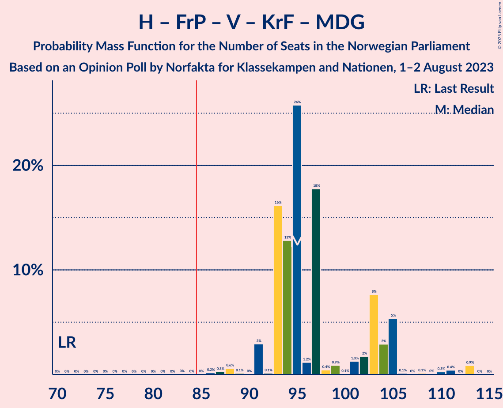

# Opinion Poll by Norfakta for Klassekampen and Nationen, 1–2 August 2023

<a href="#voting-intentions">Voting Intentions</a> | <a href="#seats">Seats</a> | <a href="#coalitions">Coalitions</a> | <a href="#technical-information">Technical Information</a>

## Voting Intentions

### Confidence Intervals

| Party | Last Result | Poll Result | 80% Confidence Interval | 90% Confidence Interval | 95% Confidence Interval | 99% Confidence Interval |
|:-----:|:-----------:|:-----------:|:-----------------------:|:-----------------------:|:-----------------------:|:-----------------------:|
| Høyre | 20.4% | 31.8% | 29.7–34.1% |29.1–34.8% |28.6–35.3% |27.6–36.4% |
| Arbeiderpartiet | 26.2% | 18.8% | 17.0–20.7% |16.5–21.3% |16.1–21.7% |15.3–22.7% |
| Fremskrittspartiet | 11.6% | 12.1% | 10.7–13.8% |10.3–14.3% |10.0–14.7% |9.3–15.5% |
| Sosialistisk Venstreparti | 7.6% | 9.0% | 7.8–10.5% |7.5–11.0% |7.2–11.3% |6.6–12.1% |
| Rødt | 4.7% | 5.5% | 4.6–6.8% |4.3–7.1% |4.1–7.4% |3.7–8.1% |
| Venstre | 4.6% | 4.9% | 4.0–6.0% |3.7–6.4% |3.5–6.7% |3.2–7.3% |
| Senterpartiet | 13.5% | 4.9% | 4.0–6.0% |3.7–6.4% |3.5–6.7% |3.2–7.3% |
| Kristelig Folkeparti | 3.8% | 4.3% | 3.5–5.4% |3.3–5.8% |3.1–6.0% |2.7–6.6% |
| Miljøpartiet De Grønne | 3.9% | 3.8% | 3.0–4.8% |2.8–5.2% |2.6–5.4% |2.3–6.0% |
| Industri- og Næringspartiet | 0.3% | 2.2% | 1.6–3.0% |1.5–3.3% |1.3–3.5% |1.1–3.9% |
| Norgesdemokratene | 1.1% | 0.9% | 0.6–1.6% |0.5–1.8% |0.5–1.9% |0.3–2.3% |
| Liberalistene | 0.2% | 0.5% | 0.3–1.1% |0.3–1.2% |0.2–1.4% |0.1–1.7% |
| Pensjonistpartiet | 0.6% | 0.5% | 0.3–1.1% |0.3–1.2% |0.2–1.4% |0.1–1.7% |
| Folkets parti | 0.1% | 0.1% | 0.1–0.5% |0.0–0.6% |0.0–0.8% |0.0–1.0% |
| Konservativt | 0.4% | 0.1% | 0.1–0.5% |0.0–0.6% |0.0–0.8% |0.0–1.0% |

*Note:* The poll result column reflects the actual value used in the calculations. Published results may vary slightly, and in addition be rounded to fewer digits.

## Seats

### Confidence Intervals

| Party | Last Result | Median | 80% Confidence Interval | 90% Confidence Interval | 95% Confidence Interval | 99% Confidence Interval |
|:-----:|:-----------:|:------:|:-----------------------:|:-----------------------:|:-----------------------:|:-----------------------:|
| <a href="#høyre">Høyre</a> | 36 | 56 | 52–66 |52–67 |50–67 |47–67 |
| <a href="#arbeiderpartiet">Arbeiderpartiet</a> | 48 | 42 | 34–43 |33–43 |31–43 |30–45 |
| <a href="#fremskrittspartiet">Fremskrittspartiet</a> | 21 | 24 | 18–30 |18–30 |18–30 |16–30 |
| <a href="#sosialistisk-venstreparti">Sosialistisk Venstreparti</a> | 13 | 13 | 12–16 |12–17 |12–19 |10–21 |
| <a href="#rødt">Rødt</a> | 8 | 9 | 8–11 |8–11 |8–12 |1–12 |
| <a href="#venstre">Venstre</a> | 8 | 8 | 2–9 |2–10 |2–10 |2–13 |
| <a href="#senterpartiet">Senterpartiet</a> | 28 | 8 | 7–10 |1–11 |0–11 |0–13 |
| <a href="#kristelig-folkeparti">Kristelig Folkeparti</a> | 3 | 8 | 7–9 |3–11 |2–12 |2–12 |
| <a href="#miljøpartiet-de-grønne">Miljøpartiet De Grønne</a> | 3 | 3 | 1–7 |1–7 |1–8 |1–11 |
| <a href="#industri--og-næringspartiet">Industri- og Næringspartiet</a> | 0 | 0 | 0–3 |0–3 |0–3 |0–3 |
| <a href="#norgesdemokratene">Norgesdemokratene</a> | 0 | 0 | 0 |0 |0 |0 |
| <a href="#liberalistene">Liberalistene</a> | 0 | 0 | 0 |0 |0 |0 |
| <a href="#pensjonistpartiet">Pensjonistpartiet</a> | 0 | 0 | 0 |0 |0 |0 |
| <a href="#folkets-parti">Folkets parti</a> | 0 | 0 | 0 |0 |0 |0 |
| <a href="#konservativt">Konservativt</a> | 0 | 0 | 0 |0 |0 |0 |

### Høyre

*For a full overview of the results for this party, see the [Høyre](party-høyre.html) page.*

| Number of Seats | Probability | Accumulated | Special Marks |
|:---------------:|:-----------:|:-----------:|:-------------:|
| 36 | 0% | 100% | Last Result |
| 37 | 0% | 100% |  |
| 38 | 0% | 100% |  |
| 39 | 0% | 100% |  |
| 40 | 0% | 100% |  |
| 41 | 0% | 100% |  |
| 42 | 0% | 100% |  |
| 43 | 0% | 100% |  |
| 44 | 0% | 100% |  |
| 45 | 0% | 100% |  |
| 46 | 0.1% | 100% |  |
| 47 | 0.8% | 99.9% |  |
| 48 | 0% | 99.1% |  |
| 49 | 0.2% | 99.1% |  |
| 50 | 1.5% | 98.9% |  |
| 51 | 0.3% | 97% |  |
| 52 | 25% | 97% |  |
| 53 | 12% | 72% |  |
| 54 | 3% | 59% |  |
| 55 | 6% | 57% |  |
| 56 | 19% | 51% | Median |
| 57 | 17% | 32% |  |
| 58 | 2% | 16% |  |
| 59 | 2% | 14% |  |
| 60 | 0.6% | 12% |  |
| 61 | 0.5% | 11% |  |
| 62 | 0.4% | 11% |  |
| 63 | 0.2% | 11% |  |
| 64 | 0.1% | 10% |  |
| 65 | 0.2% | 10% |  |
| 66 | 0.9% | 10% |  |
| 67 | 9% | 9% |  |
| 68 | 0.1% | 0.5% |  |
| 69 | 0% | 0.4% |  |
| 70 | 0.4% | 0.4% |  |
| 71 | 0% | 0% |  |

### Arbeiderpartiet

*For a full overview of the results for this party, see the [Arbeiderpartiet](party-arbeiderpartiet.html) page.*

| Number of Seats | Probability | Accumulated | Special Marks |
|:---------------:|:-----------:|:-----------:|:-------------:|
| 28 | 0.1% | 100% |  |
| 29 | 0.2% | 99.9% |  |
| 30 | 1.2% | 99.7% |  |
| 31 | 1.0% | 98% |  |
| 32 | 0.8% | 97% |  |
| 33 | 3% | 97% |  |
| 34 | 9% | 93% |  |
| 35 | 2% | 85% |  |
| 36 | 2% | 83% |  |
| 37 | 1.0% | 81% |  |
| 38 | 2% | 80% |  |
| 39 | 5% | 78% |  |
| 40 | 2% | 73% |  |
| 41 | 0.2% | 71% |  |
| 42 | 41% | 71% | Median |
| 43 | 28% | 30% |  |
| 44 | 1.1% | 2% |  |
| 45 | 0.7% | 0.7% |  |
| 46 | 0% | 0% |  |
| 47 | 0% | 0% |  |
| 48 | 0% | 0% | Last Result |

### Fremskrittspartiet

*For a full overview of the results for this party, see the [Fremskrittspartiet](party-fremskrittspartiet.html) page.*

| Number of Seats | Probability | Accumulated | Special Marks |
|:---------------:|:-----------:|:-----------:|:-------------:|
| 14 | 0.3% | 100% |  |
| 15 | 0% | 99.7% |  |
| 16 | 0.3% | 99.7% |  |
| 17 | 0.8% | 99.3% |  |
| 18 | 13% | 98.5% |  |
| 19 | 0.7% | 86% |  |
| 20 | 26% | 85% |  |
| 21 | 2% | 59% | Last Result |
| 22 | 0.5% | 57% |  |
| 23 | 4% | 57% |  |
| 24 | 17% | 53% | Median |
| 25 | 1.3% | 36% |  |
| 26 | 1.2% | 35% |  |
| 27 | 6% | 33% |  |
| 28 | 0.1% | 28% |  |
| 29 | 0.6% | 28% |  |
| 30 | 27% | 27% |  |
| 31 | 0% | 0% |  |

### Sosialistisk Venstreparti

*For a full overview of the results for this party, see the [Sosialistisk Venstreparti](party-sosialistiskvenstreparti.html) page.*

| Number of Seats | Probability | Accumulated | Special Marks |
|:---------------:|:-----------:|:-----------:|:-------------:|
| 9 | 0.3% | 100% |  |
| 10 | 0.3% | 99.7% |  |
| 11 | 1.2% | 99.5% |  |
| 12 | 31% | 98% |  |
| 13 | 33% | 67% | Last Result, Median |
| 14 | 8% | 34% |  |
| 15 | 16% | 26% |  |
| 16 | 4% | 11% |  |
| 17 | 2% | 7% |  |
| 18 | 0.9% | 5% |  |
| 19 | 3% | 4% |  |
| 20 | 0.2% | 0.8% |  |
| 21 | 0.4% | 0.6% |  |
| 22 | 0.1% | 0.2% |  |
| 23 | 0.1% | 0.1% |  |
| 24 | 0.1% | 0.1% |  |
| 25 | 0% | 0% |  |

### Rødt

*For a full overview of the results for this party, see the [Rødt](party-rødt.html) page.*

| Number of Seats | Probability | Accumulated | Special Marks |
|:---------------:|:-----------:|:-----------:|:-------------:|
| 1 | 0.9% | 100% |  |
| 2 | 0% | 99.1% |  |
| 3 | 0% | 99.1% |  |
| 4 | 0% | 99.1% |  |
| 5 | 0% | 99.1% |  |
| 6 | 0.1% | 99.1% |  |
| 7 | 0.3% | 99.0% |  |
| 8 | 27% | 98.6% | Last Result |
| 9 | 38% | 72% | Median |
| 10 | 6% | 34% |  |
| 11 | 25% | 28% |  |
| 12 | 2% | 3% |  |
| 13 | 0.2% | 0.4% |  |
| 14 | 0.2% | 0.3% |  |
| 15 | 0% | 0.1% |  |
| 16 | 0% | 0% |  |

### Venstre

*For a full overview of the results for this party, see the [Venstre](party-venstre.html) page.*

| Number of Seats | Probability | Accumulated | Special Marks |
|:---------------:|:-----------:|:-----------:|:-------------:|
| 2 | 19% | 100% |  |
| 3 | 28% | 81% |  |
| 4 | 0% | 53% |  |
| 5 | 0% | 53% |  |
| 6 | 0.2% | 53% |  |
| 7 | 3% | 53% |  |
| 8 | 39% | 50% | Last Result, Median |
| 9 | 1.1% | 11% |  |
| 10 | 8% | 10% |  |
| 11 | 0.9% | 2% |  |
| 12 | 0.1% | 1.0% |  |
| 13 | 0.9% | 0.9% |  |
| 14 | 0% | 0% |  |

### Senterpartiet

*For a full overview of the results for this party, see the [Senterpartiet](party-senterpartiet.html) page.*

| Number of Seats | Probability | Accumulated | Special Marks |
|:---------------:|:-----------:|:-----------:|:-------------:|
| 0 | 5% | 100% |  |
| 1 | 2% | 95% |  |
| 2 | 0.3% | 93% |  |
| 3 | 0% | 93% |  |
| 4 | 0% | 93% |  |
| 5 | 0% | 93% |  |
| 6 | 1.3% | 93% |  |
| 7 | 30% | 92% |  |
| 8 | 48% | 62% | Median |
| 9 | 3% | 14% |  |
| 10 | 0.8% | 11% |  |
| 11 | 8% | 10% |  |
| 12 | 0.2% | 2% |  |
| 13 | 1.3% | 1.4% |  |
| 14 | 0% | 0.1% |  |
| 15 | 0% | 0.1% |  |
| 16 | 0% | 0% |  |
| 17 | 0% | 0% |  |
| 18 | 0% | 0% |  |
| 19 | 0% | 0% |  |
| 20 | 0% | 0% |  |
| 21 | 0% | 0% |  |
| 22 | 0% | 0% |  |
| 23 | 0% | 0% |  |
| 24 | 0% | 0% |  |
| 25 | 0% | 0% |  |
| 26 | 0% | 0% |  |
| 27 | 0% | 0% |  |
| 28 | 0% | 0% | Last Result |

### Kristelig Folkeparti

*For a full overview of the results for this party, see the [Kristelig Folkeparti](party-kristeligfolkeparti.html) page.*

| Number of Seats | Probability | Accumulated | Special Marks |
|:---------------:|:-----------:|:-----------:|:-------------:|
| 1 | 0.2% | 100% |  |
| 2 | 4% | 99.8% |  |
| 3 | 3% | 96% | Last Result |
| 4 | 0% | 94% |  |
| 5 | 0% | 94% |  |
| 6 | 1.0% | 94% |  |
| 7 | 40% | 93% |  |
| 8 | 41% | 53% | Median |
| 9 | 2% | 11% |  |
| 10 | 2% | 9% |  |
| 11 | 5% | 7% |  |
| 12 | 3% | 3% |  |
| 13 | 0% | 0.1% |  |
| 14 | 0.1% | 0.1% |  |
| 15 | 0% | 0% |  |

### Miljøpartiet De Grønne

*For a full overview of the results for this party, see the [Miljøpartiet De Grønne](party-miljøpartietdegrønne.html) page.*

| Number of Seats | Probability | Accumulated | Special Marks |
|:---------------:|:-----------:|:-----------:|:-------------:|
| 1 | 10% | 100% |  |
| 2 | 34% | 90% |  |
| 3 | 20% | 56% | Last Result, Median |
| 4 | 0% | 36% |  |
| 5 | 0% | 36% |  |
| 6 | 17% | 36% |  |
| 7 | 15% | 19% |  |
| 8 | 2% | 5% |  |
| 9 | 0.7% | 2% |  |
| 10 | 0.8% | 2% |  |
| 11 | 0.3% | 0.7% |  |
| 12 | 0.4% | 0.4% |  |
| 13 | 0% | 0% |  |

### Industri- og Næringspartiet

*For a full overview of the results for this party, see the [Industri- og Næringspartiet](party-industri-ognæringspartiet.html) page.*

| Number of Seats | Probability | Accumulated | Special Marks |
|:---------------:|:-----------:|:-----------:|:-------------:|
| 0 | 79% | 100% | Last Result, Median |
| 1 | 1.0% | 21% |  |
| 2 | 3% | 20% |  |
| 3 | 17% | 17% |  |
| 4 | 0% | 0.2% |  |
| 5 | 0% | 0.2% |  |
| 6 | 0% | 0.2% |  |
| 7 | 0.2% | 0.2% |  |
| 8 | 0% | 0% |  |

### Norgesdemokratene

*For a full overview of the results for this party, see the [Norgesdemokratene](party-norgesdemokratene.html) page.*

| Number of Seats | Probability | Accumulated | Special Marks |
|:---------------:|:-----------:|:-----------:|:-------------:|
| 0 | 100% | 100% | Last Result, Median |

### Liberalistene

*For a full overview of the results for this party, see the [Liberalistene](party-liberalistene.html) page.*

| Number of Seats | Probability | Accumulated | Special Marks |
|:---------------:|:-----------:|:-----------:|:-------------:|
| 0 | 100% | 100% | Last Result, Median |

### Pensjonistpartiet

*For a full overview of the results for this party, see the [Pensjonistpartiet](party-pensjonistpartiet.html) page.*

| Number of Seats | Probability | Accumulated | Special Marks |
|:---------------:|:-----------:|:-----------:|:-------------:|
| 0 | 100% | 100% | Last Result, Median |

### Folkets parti

*For a full overview of the results for this party, see the [Folkets parti](party-folketsparti.html) page.*

| Number of Seats | Probability | Accumulated | Special Marks |
|:---------------:|:-----------:|:-----------:|:-------------:|
| 0 | 99.9% | 100% | Last Result, Median |
| 1 | 0.1% | 0.1% |  |
| 2 | 0% | 0% |  |

### Konservativt

*For a full overview of the results for this party, see the [Konservativt](party-konservativt.html) page.*

| Number of Seats | Probability | Accumulated | Special Marks |
|:---------------:|:-----------:|:-----------:|:-------------:|
| 0 | 100% | 100% | Last Result, Median |

## Coalitions

### Confidence Intervals

| Coalition | Last Result | Median | Majority? | 80% Confidence Interval | 90% Confidence Interval | 95% Confidence Interval | 99% Confidence Interval |
|:---------:|:-----------:|:------:|:---------:|:-----------------------:|:-----------------------:|:-----------------------:|:-----------------------:|
| Høyre – Fremskrittspartiet – Senterpartiet – Venstre – Kristelig Folkeparti | 96 | 101 | 100% | 94–109 | 94–113 | 94–113 | 87–113 |
| Høyre – Fremskrittspartiet – Venstre – Kristelig Folkeparti – Miljøpartiet De Grønne | 71 | 95 | 99.9% | 93–104 | 93–105 | 91–105 | 88–113 |
| Høyre – Fremskrittspartiet – Venstre – Kristelig Folkeparti | 68 | 91 | 98% | 87–102 | 87–103 | 86–103 | 80–106 |
| Høyre – Fremskrittspartiet – Venstre | 65 | 85 | 51% | 79–92 | 79–95 | 79–95 | 75–101 |
| Høyre – Fremskrittspartiet | 57 | 81 | 11% | 71–87 | 71–87 | 71–87 | 68–91 |
| Arbeiderpartiet – Sosialistisk Venstreparti – Rødt – Senterpartiet – Miljøpartiet De Grønne | 100 | 75 | 1.0% | 66–81 | 65–81 | 65–82 | 62–86 |
| Høyre – Venstre – Kristelig Folkeparti | 47 | 68 | 0.1% | 63–80 | 63–82 | 63–82 | 63–82 |
| Arbeiderpartiet – Sosialistisk Venstreparti – Senterpartiet – Kristelig Folkeparti – Miljøpartiet De Grønne | 95 | 72 | 0.4% | 66–80 | 65–80 | 63–80 | 57–83 |
| Arbeiderpartiet – Sosialistisk Venstreparti – Rødt – Senterpartiet | 97 | 72 | 0% | 64–74 | 63–74 | 63–77 | 55–78 |
| Arbeiderpartiet – Sosialistisk Venstreparti – Rødt – Miljøpartiet De Grønne | 72 | 67 | 0% | 59–74 | 55–74 | 55–74 | 55–79 |
| Arbeiderpartiet – Sosialistisk Venstreparti – Senterpartiet – Miljøpartiet De Grønne | 92 | 66 | 0% | 58–72 | 55–72 | 55–73 | 54–78 |
| Arbeiderpartiet – Sosialistisk Venstreparti – Senterpartiet | 89 | 62 | 0% | 55–65 | 53–65 | 53–68 | 47–70 |
| Arbeiderpartiet – Senterpartiet – Kristelig Folkeparti – Miljøpartiet De Grønne | 82 | 60 | 0% | 53–65 | 52–65 | 50–65 | 40–67 |
| Arbeiderpartiet – Sosialistisk Venstreparti | 61 | 54 | 0% | 47–58 | 46–58 | 46–59 | 46–63 |
| Arbeiderpartiet – Senterpartiet – Kristelig Folkeparti | 79 | 57 | 0% | 50–58 | 49–58 | 43–58 | 38–60 |
| Arbeiderpartiet – Senterpartiet | 76 | 50 | 0% | 41–50 | 39–50 | 39–50 | 32–52 |
| Senterpartiet – Venstre – Kristelig Folkeparti | 39 | 21 | 0% | 17–26 | 17–26 | 17–28 | 13–29 |

### Høyre – Fremskrittspartiet – Senterpartiet – Venstre – Kristelig Folkeparti

| Number of Seats | Probability | Accumulated | Special Marks |
|:---------------:|:-----------:|:-----------:|:-------------:|
| 85 | 0.2% | 100% | Majority |
| 86 | 0% | 99.8% |  |
| 87 | 0.6% | 99.8% |  |
| 88 | 0% | 99.2% |  |
| 89 | 0% | 99.2% |  |
| 90 | 0.3% | 99.2% |  |
| 91 | 0% | 98.9% |  |
| 92 | 0.9% | 98.9% |  |
| 93 | 0.1% | 98% |  |
| 94 | 12% | 98% |  |
| 95 | 0.2% | 86% |  |
| 96 | 0.5% | 85% | Last Result |
| 97 | 0.1% | 85% |  |
| 98 | 34% | 85% |  |
| 99 | 0.5% | 51% |  |
| 100 | 0.3% | 50% |  |
| 101 | 26% | 50% |  |
| 102 | 2% | 24% |  |
| 103 | 6% | 23% |  |
| 104 | 3% | 17% | Median |
| 105 | 2% | 14% |  |
| 106 | 0.1% | 12% |  |
| 107 | 1.3% | 12% |  |
| 108 | 0.1% | 11% |  |
| 109 | 3% | 10% |  |
| 110 | 0% | 8% |  |
| 111 | 1.2% | 8% |  |
| 112 | 0% | 6% |  |
| 113 | 6% | 6% |  |
| 114 | 0.1% | 0.1% |  |
| 115 | 0% | 0% |  |

### Høyre – Fremskrittspartiet – Venstre – Kristelig Folkeparti – Miljøpartiet De Grønne

| Number of Seats | Probability | Accumulated | Special Marks |
|:---------------:|:-----------:|:-----------:|:-------------:|
| 71 | 0% | 100% | Last Result |
| 72 | 0% | 100% |  |
| 73 | 0% | 100% |  |
| 74 | 0% | 100% |  |
| 75 | 0% | 100% |  |
| 76 | 0% | 100% |  |
| 77 | 0% | 100% |  |
| 78 | 0% | 100% |  |
| 79 | 0% | 100% |  |
| 80 | 0% | 100% |  |
| 81 | 0% | 100% |  |
| 82 | 0% | 100% |  |
| 83 | 0% | 100% |  |
| 84 | 0% | 100% |  |
| 85 | 0% | 99.9% | Majority |
| 86 | 0.2% | 99.9% |  |
| 87 | 0.3% | 99.8% |  |
| 88 | 0.6% | 99.5% |  |
| 89 | 0.1% | 98.9% |  |
| 90 | 0% | 98.8% |  |
| 91 | 3% | 98.8% |  |
| 92 | 0.1% | 96% |  |
| 93 | 16% | 96% |  |
| 94 | 13% | 80% |  |
| 95 | 26% | 67% |  |
| 96 | 1.2% | 41% |  |
| 97 | 18% | 40% |  |
| 98 | 0.4% | 22% |  |
| 99 | 0.9% | 22% | Median |
| 100 | 0.1% | 21% |  |
| 101 | 1.3% | 21% |  |
| 102 | 2% | 19% |  |
| 103 | 8% | 18% |  |
| 104 | 3% | 10% |  |
| 105 | 5% | 7% |  |
| 106 | 0.1% | 2% |  |
| 107 | 0% | 2% |  |
| 108 | 0.1% | 2% |  |
| 109 | 0% | 2% |  |
| 110 | 0.3% | 2% |  |
| 111 | 0.4% | 1.3% |  |
| 112 | 0% | 0.9% |  |
| 113 | 0.9% | 0.9% |  |
| 114 | 0% | 0% |  |

### Høyre – Fremskrittspartiet – Venstre – Kristelig Folkeparti

| Number of Seats | Probability | Accumulated | Special Marks |
|:---------------:|:-----------:|:-----------:|:-------------:|
| 68 | 0% | 100% | Last Result |
| 69 | 0% | 100% |  |
| 70 | 0% | 100% |  |
| 71 | 0% | 100% |  |
| 72 | 0% | 100% |  |
| 73 | 0% | 100% |  |
| 74 | 0% | 100% |  |
| 75 | 0% | 100% |  |
| 76 | 0% | 100% |  |
| 77 | 0% | 100% |  |
| 78 | 0.2% | 100% |  |
| 79 | 0% | 99.8% |  |
| 80 | 0.6% | 99.8% |  |
| 81 | 0% | 99.3% |  |
| 82 | 0% | 99.2% |  |
| 83 | 0.3% | 99.2% |  |
| 84 | 0.9% | 98.9% |  |
| 85 | 0.1% | 98% | Majority |
| 86 | 0.6% | 98% |  |
| 87 | 12% | 97% |  |
| 88 | 0.1% | 85% |  |
| 89 | 2% | 85% |  |
| 90 | 16% | 83% |  |
| 91 | 16% | 66% |  |
| 92 | 1.0% | 50% |  |
| 93 | 25% | 49% |  |
| 94 | 1.4% | 23% |  |
| 95 | 1.0% | 22% |  |
| 96 | 2% | 21% | Median |
| 97 | 2% | 19% |  |
| 98 | 0.3% | 17% |  |
| 99 | 0.3% | 17% |  |
| 100 | 1.3% | 17% |  |
| 101 | 3% | 15% |  |
| 102 | 6% | 13% |  |
| 103 | 5% | 7% |  |
| 104 | 0.5% | 1.4% |  |
| 105 | 0.1% | 1.0% |  |
| 106 | 0.8% | 0.9% |  |
| 107 | 0% | 0% |  |

### Høyre – Fremskrittspartiet – Venstre

| Number of Seats | Probability | Accumulated | Special Marks |
|:---------------:|:-----------:|:-----------:|:-------------:|
| 65 | 0% | 100% | Last Result |
| 66 | 0% | 100% |  |
| 67 | 0% | 100% |  |
| 68 | 0% | 100% |  |
| 69 | 0% | 100% |  |
| 70 | 0% | 100% |  |
| 71 | 0% | 100% |  |
| 72 | 0% | 100% |  |
| 73 | 0.3% | 100% |  |
| 74 | 0% | 99.7% |  |
| 75 | 0.2% | 99.7% |  |
| 76 | 0.8% | 99.5% |  |
| 77 | 0.7% | 98.7% |  |
| 78 | 0.2% | 98% |  |
| 79 | 12% | 98% |  |
| 80 | 0% | 85% |  |
| 81 | 0.2% | 85% |  |
| 82 | 0.1% | 85% |  |
| 83 | 16% | 85% |  |
| 84 | 18% | 69% |  |
| 85 | 25% | 51% | Majority |
| 86 | 0.1% | 25% |  |
| 87 | 4% | 25% |  |
| 88 | 1.0% | 21% | Median |
| 89 | 3% | 20% |  |
| 90 | 1.0% | 17% |  |
| 91 | 1.3% | 16% |  |
| 92 | 6% | 15% |  |
| 93 | 0.2% | 9% |  |
| 94 | 0.3% | 9% |  |
| 95 | 6% | 8% |  |
| 96 | 0% | 2% |  |
| 97 | 0.3% | 2% |  |
| 98 | 0.9% | 2% |  |
| 99 | 0% | 1.0% |  |
| 100 | 0% | 1.0% |  |
| 101 | 1.0% | 1.0% |  |
| 102 | 0% | 0% |  |

### Høyre – Fremskrittspartiet

| Number of Seats | Probability | Accumulated | Special Marks |
|:---------------:|:-----------:|:-----------:|:-------------:|
| 57 | 0% | 100% | Last Result |
| 58 | 0% | 100% |  |
| 59 | 0% | 100% |  |
| 60 | 0% | 100% |  |
| 61 | 0% | 100% |  |
| 62 | 0% | 100% |  |
| 63 | 0% | 100% |  |
| 64 | 0.3% | 100% |  |
| 65 | 0% | 99.7% |  |
| 66 | 0% | 99.7% |  |
| 67 | 0.1% | 99.7% |  |
| 68 | 1.0% | 99.6% |  |
| 69 | 0.2% | 98.6% |  |
| 70 | 0% | 98% |  |
| 71 | 12% | 98% |  |
| 72 | 0.1% | 86% |  |
| 73 | 0.2% | 86% |  |
| 74 | 0.8% | 86% |  |
| 75 | 0.4% | 85% |  |
| 76 | 17% | 85% |  |
| 77 | 1.3% | 68% |  |
| 78 | 1.0% | 66% |  |
| 79 | 3% | 65% |  |
| 80 | 0.8% | 63% | Median |
| 81 | 16% | 62% |  |
| 82 | 30% | 46% |  |
| 83 | 1.0% | 16% |  |
| 84 | 3% | 15% |  |
| 85 | 0.9% | 11% | Majority |
| 86 | 0.3% | 10% |  |
| 87 | 9% | 10% |  |
| 88 | 0% | 1.4% |  |
| 89 | 0.3% | 1.4% |  |
| 90 | 0% | 1.1% |  |
| 91 | 0.7% | 1.1% |  |
| 92 | 0% | 0.4% |  |
| 93 | 0.4% | 0.4% |  |
| 94 | 0% | 0% |  |

### Arbeiderpartiet – Sosialistisk Venstreparti – Rødt – Senterpartiet – Miljøpartiet De Grønne

| Number of Seats | Probability | Accumulated | Special Marks |
|:---------------:|:-----------:|:-----------:|:-------------:|
| 61 | 0.1% | 100% |  |
| 62 | 0.8% | 99.9% |  |
| 63 | 0.2% | 99.0% |  |
| 64 | 0.4% | 98.9% |  |
| 65 | 5% | 98% |  |
| 66 | 6% | 93% |  |
| 67 | 3% | 87% |  |
| 68 | 1.3% | 85% |  |
| 69 | 1.2% | 83% |  |
| 70 | 0.5% | 82% |  |
| 71 | 0.9% | 82% |  |
| 72 | 3% | 81% |  |
| 73 | 1.0% | 78% |  |
| 74 | 1.3% | 77% |  |
| 75 | 41% | 75% | Median |
| 76 | 0.3% | 34% |  |
| 77 | 16% | 34% |  |
| 78 | 0.6% | 18% |  |
| 79 | 2% | 17% |  |
| 80 | 0.1% | 15% |  |
| 81 | 12% | 15% |  |
| 82 | 0.6% | 3% |  |
| 83 | 0.2% | 2% |  |
| 84 | 0.8% | 2% |  |
| 85 | 0.3% | 1.0% | Majority |
| 86 | 0.6% | 0.6% |  |
| 87 | 0% | 0% |  |
| 88 | 0% | 0% |  |
| 89 | 0% | 0% |  |
| 90 | 0% | 0% |  |
| 91 | 0% | 0% |  |
| 92 | 0% | 0% |  |
| 93 | 0% | 0% |  |
| 94 | 0% | 0% |  |
| 95 | 0% | 0% |  |
| 96 | 0% | 0% |  |
| 97 | 0% | 0% |  |
| 98 | 0% | 0% |  |
| 99 | 0% | 0% |  |
| 100 | 0% | 0% | Last Result |

### Høyre – Venstre – Kristelig Folkeparti

| Number of Seats | Probability | Accumulated | Special Marks |
|:---------------:|:-----------:|:-----------:|:-------------:|
| 47 | 0% | 100% | Last Result |
| 48 | 0% | 100% |  |
| 49 | 0% | 100% |  |
| 50 | 0% | 100% |  |
| 51 | 0% | 100% |  |
| 52 | 0% | 100% |  |
| 53 | 0% | 100% |  |
| 54 | 0% | 100% |  |
| 55 | 0% | 100% |  |
| 56 | 0% | 100% |  |
| 57 | 0% | 100% |  |
| 58 | 0% | 100% |  |
| 59 | 0% | 100% |  |
| 60 | 0% | 100% |  |
| 61 | 0% | 99.9% |  |
| 62 | 0.3% | 99.9% |  |
| 63 | 26% | 99.6% |  |
| 64 | 0.5% | 73% |  |
| 65 | 0.5% | 73% |  |
| 66 | 20% | 72% |  |
| 67 | 2% | 53% |  |
| 68 | 0.7% | 51% |  |
| 69 | 13% | 50% |  |
| 70 | 0.8% | 37% |  |
| 71 | 17% | 37% |  |
| 72 | 0.4% | 20% | Median |
| 73 | 0.1% | 19% |  |
| 74 | 0.4% | 19% |  |
| 75 | 1.1% | 19% |  |
| 76 | 6% | 18% |  |
| 77 | 0.4% | 12% |  |
| 78 | 1.1% | 12% |  |
| 79 | 0.1% | 10% |  |
| 80 | 1.0% | 10% |  |
| 81 | 3% | 9% |  |
| 82 | 6% | 6% |  |
| 83 | 0% | 0.1% |  |
| 84 | 0% | 0.1% |  |
| 85 | 0% | 0.1% | Majority |
| 86 | 0% | 0.1% |  |
| 87 | 0.1% | 0.1% |  |
| 88 | 0% | 0% |  |

### Arbeiderpartiet – Sosialistisk Venstreparti – Senterpartiet – Kristelig Folkeparti – Miljøpartiet De Grønne

| Number of Seats | Probability | Accumulated | Special Marks |
|:---------------:|:-----------:|:-----------:|:-------------:|
| 57 | 1.0% | 100% |  |
| 58 | 0.1% | 99.0% |  |
| 59 | 0% | 99.0% |  |
| 60 | 0% | 99.0% |  |
| 61 | 0.1% | 98.9% |  |
| 62 | 1.1% | 98.8% |  |
| 63 | 0.3% | 98% |  |
| 64 | 0% | 97% |  |
| 65 | 6% | 97% |  |
| 66 | 5% | 91% |  |
| 67 | 2% | 87% |  |
| 68 | 0.4% | 84% |  |
| 69 | 3% | 84% |  |
| 70 | 4% | 81% |  |
| 71 | 0.4% | 78% |  |
| 72 | 28% | 77% |  |
| 73 | 16% | 49% |  |
| 74 | 0.4% | 33% | Median |
| 75 | 0.6% | 33% |  |
| 76 | 18% | 32% |  |
| 77 | 0% | 15% |  |
| 78 | 0.1% | 15% |  |
| 79 | 0.2% | 15% |  |
| 80 | 13% | 14% |  |
| 81 | 0.7% | 2% |  |
| 82 | 0% | 1.2% |  |
| 83 | 0.8% | 1.2% |  |
| 84 | 0% | 0.4% |  |
| 85 | 0% | 0.4% | Majority |
| 86 | 0.3% | 0.3% |  |
| 87 | 0% | 0% |  |
| 88 | 0% | 0% |  |
| 89 | 0% | 0% |  |
| 90 | 0% | 0% |  |
| 91 | 0% | 0% |  |
| 92 | 0% | 0% |  |
| 93 | 0% | 0% |  |
| 94 | 0% | 0% |  |
| 95 | 0% | 0% | Last Result |

### Arbeiderpartiet – Sosialistisk Venstreparti – Rødt – Senterpartiet

| Number of Seats | Probability | Accumulated | Special Marks |
|:---------------:|:-----------:|:-----------:|:-------------:|
| 55 | 0.9% | 100% |  |
| 56 | 0% | 99.1% |  |
| 57 | 0.4% | 99.1% |  |
| 58 | 0.3% | 98.7% |  |
| 59 | 0% | 98% |  |
| 60 | 0% | 98% |  |
| 61 | 0.2% | 98% |  |
| 62 | 0% | 98% |  |
| 63 | 6% | 98% |  |
| 64 | 3% | 92% |  |
| 65 | 7% | 89% |  |
| 66 | 2% | 82% |  |
| 67 | 1.2% | 80% |  |
| 68 | 0.3% | 79% |  |
| 69 | 0.7% | 79% |  |
| 70 | 2% | 78% |  |
| 71 | 18% | 76% |  |
| 72 | 16% | 58% | Median |
| 73 | 25% | 42% |  |
| 74 | 13% | 17% |  |
| 75 | 0.2% | 4% |  |
| 76 | 0.1% | 4% |  |
| 77 | 3% | 4% |  |
| 78 | 0.6% | 1.0% |  |
| 79 | 0.1% | 0.4% |  |
| 80 | 0% | 0.3% |  |
| 81 | 0.2% | 0.3% |  |
| 82 | 0% | 0.1% |  |
| 83 | 0% | 0% |  |
| 84 | 0% | 0% |  |
| 85 | 0% | 0% | Majority |
| 86 | 0% | 0% |  |
| 87 | 0% | 0% |  |
| 88 | 0% | 0% |  |
| 89 | 0% | 0% |  |
| 90 | 0% | 0% |  |
| 91 | 0% | 0% |  |
| 92 | 0% | 0% |  |
| 93 | 0% | 0% |  |
| 94 | 0% | 0% |  |
| 95 | 0% | 0% |  |
| 96 | 0% | 0% |  |
| 97 | 0% | 0% | Last Result |

### Arbeiderpartiet – Sosialistisk Venstreparti – Rødt – Miljøpartiet De Grønne

| Number of Seats | Probability | Accumulated | Special Marks |
|:---------------:|:-----------:|:-----------:|:-------------:|
| 52 | 0.1% | 100% |  |
| 53 | 0.1% | 99.9% |  |
| 54 | 0% | 99.8% |  |
| 55 | 6% | 99.8% |  |
| 56 | 0% | 94% |  |
| 57 | 1.2% | 94% |  |
| 58 | 0.1% | 92% |  |
| 59 | 3% | 92% |  |
| 60 | 1.2% | 89% |  |
| 61 | 1.3% | 88% |  |
| 62 | 0.3% | 87% |  |
| 63 | 3% | 87% |  |
| 64 | 2% | 84% |  |
| 65 | 5% | 82% |  |
| 66 | 2% | 77% |  |
| 67 | 42% | 75% | Median |
| 68 | 0.2% | 34% |  |
| 69 | 0.4% | 33% |  |
| 70 | 18% | 33% |  |
| 71 | 0.1% | 15% |  |
| 72 | 0.5% | 15% | Last Result |
| 73 | 0.1% | 14% |  |
| 74 | 12% | 14% |  |
| 75 | 0.1% | 2% |  |
| 76 | 1.0% | 2% |  |
| 77 | 0% | 1.0% |  |
| 78 | 0.3% | 1.0% |  |
| 79 | 0.6% | 0.6% |  |
| 80 | 0% | 0% |  |

### Arbeiderpartiet – Sosialistisk Venstreparti – Senterpartiet – Miljøpartiet De Grønne

| Number of Seats | Probability | Accumulated | Special Marks |
|:---------------:|:-----------:|:-----------:|:-------------:|
| 54 | 1.3% | 100% |  |
| 55 | 5% | 98.7% |  |
| 56 | 0.1% | 94% |  |
| 57 | 0.1% | 93% |  |
| 58 | 9% | 93% |  |
| 59 | 1.1% | 85% |  |
| 60 | 2% | 83% |  |
| 61 | 1.2% | 81% |  |
| 62 | 1.0% | 80% |  |
| 63 | 1.1% | 79% |  |
| 64 | 26% | 78% |  |
| 65 | 0.2% | 52% |  |
| 66 | 17% | 52% | Median |
| 67 | 0.8% | 35% |  |
| 68 | 0.2% | 34% |  |
| 69 | 16% | 34% |  |
| 70 | 2% | 18% |  |
| 71 | 0.5% | 15% |  |
| 72 | 12% | 15% |  |
| 73 | 0.5% | 3% |  |
| 74 | 0% | 2% |  |
| 75 | 0.9% | 2% |  |
| 76 | 0.3% | 1.3% |  |
| 77 | 0.4% | 1.0% |  |
| 78 | 0.6% | 0.6% |  |
| 79 | 0% | 0% |  |
| 80 | 0% | 0% |  |
| 81 | 0% | 0% |  |
| 82 | 0% | 0% |  |
| 83 | 0% | 0% |  |
| 84 | 0% | 0% |  |
| 85 | 0% | 0% | Majority |
| 86 | 0% | 0% |  |
| 87 | 0% | 0% |  |
| 88 | 0% | 0% |  |
| 89 | 0% | 0% |  |
| 90 | 0% | 0% |  |
| 91 | 0% | 0% |  |
| 92 | 0% | 0% | Last Result |

### Arbeiderpartiet – Sosialistisk Venstreparti – Senterpartiet

| Number of Seats | Probability | Accumulated | Special Marks |
|:---------------:|:-----------:|:-----------:|:-------------:|
| 47 | 1.2% | 100% |  |
| 48 | 0% | 98.8% |  |
| 49 | 0% | 98.7% |  |
| 50 | 0.3% | 98.7% |  |
| 51 | 0.2% | 98% |  |
| 52 | 0% | 98% |  |
| 53 | 5% | 98% |  |
| 54 | 0.1% | 93% |  |
| 55 | 4% | 93% |  |
| 56 | 0.3% | 89% |  |
| 57 | 7% | 89% |  |
| 58 | 3% | 82% |  |
| 59 | 2% | 79% |  |
| 60 | 0.9% | 77% |  |
| 61 | 1.2% | 77% |  |
| 62 | 26% | 75% |  |
| 63 | 32% | 50% | Median |
| 64 | 0.3% | 17% |  |
| 65 | 13% | 17% |  |
| 66 | 0% | 4% |  |
| 67 | 0% | 4% |  |
| 68 | 3% | 4% |  |
| 69 | 0.1% | 1.1% |  |
| 70 | 0.8% | 1.0% |  |
| 71 | 0% | 0.2% |  |
| 72 | 0.1% | 0.2% |  |
| 73 | 0.1% | 0.1% |  |
| 74 | 0% | 0% |  |
| 75 | 0% | 0% |  |
| 76 | 0% | 0% |  |
| 77 | 0% | 0% |  |
| 78 | 0% | 0% |  |
| 79 | 0% | 0% |  |
| 80 | 0% | 0% |  |
| 81 | 0% | 0% |  |
| 82 | 0% | 0% |  |
| 83 | 0% | 0% |  |
| 84 | 0% | 0% |  |
| 85 | 0% | 0% | Majority |
| 86 | 0% | 0% |  |
| 87 | 0% | 0% |  |
| 88 | 0% | 0% |  |
| 89 | 0% | 0% | Last Result |

### Arbeiderpartiet – Senterpartiet – Kristelig Folkeparti – Miljøpartiet De Grønne

| Number of Seats | Probability | Accumulated | Special Marks |
|:---------------:|:-----------:|:-----------:|:-------------:|
| 40 | 0.6% | 100% |  |
| 41 | 0% | 99.4% |  |
| 42 | 0% | 99.3% |  |
| 43 | 0.4% | 99.3% |  |
| 44 | 0% | 98.9% |  |
| 45 | 0% | 98.9% |  |
| 46 | 0.1% | 98.9% |  |
| 47 | 0.9% | 98.8% |  |
| 48 | 0.1% | 98% |  |
| 49 | 0.3% | 98% |  |
| 50 | 2% | 98% |  |
| 51 | 0.1% | 96% |  |
| 52 | 5% | 96% |  |
| 53 | 9% | 91% |  |
| 54 | 2% | 82% |  |
| 55 | 0.5% | 80% |  |
| 56 | 4% | 79% |  |
| 57 | 0.3% | 75% |  |
| 58 | 0.1% | 75% |  |
| 59 | 2% | 75% |  |
| 60 | 43% | 73% |  |
| 61 | 0.1% | 30% | Median |
| 62 | 0% | 30% |  |
| 63 | 17% | 30% |  |
| 64 | 0.1% | 13% |  |
| 65 | 12% | 13% |  |
| 66 | 0% | 1.2% |  |
| 67 | 0.8% | 1.2% |  |
| 68 | 0% | 0.4% |  |
| 69 | 0% | 0.4% |  |
| 70 | 0.3% | 0.3% |  |
| 71 | 0% | 0% |  |
| 72 | 0% | 0% |  |
| 73 | 0% | 0% |  |
| 74 | 0% | 0% |  |
| 75 | 0% | 0% |  |
| 76 | 0% | 0% |  |
| 77 | 0% | 0% |  |
| 78 | 0% | 0% |  |
| 79 | 0% | 0% |  |
| 80 | 0% | 0% |  |
| 81 | 0% | 0% |  |
| 82 | 0% | 0% | Last Result |

### Arbeiderpartiet – Sosialistisk Venstreparti

| Number of Seats | Probability | Accumulated | Special Marks |
|:---------------:|:-----------:|:-----------:|:-------------:|
| 43 | 0.1% | 100% |  |
| 44 | 0.2% | 99.9% |  |
| 45 | 0.1% | 99.7% |  |
| 46 | 7% | 99.6% |  |
| 47 | 4% | 92% |  |
| 48 | 2% | 88% |  |
| 49 | 2% | 87% |  |
| 50 | 1.5% | 85% |  |
| 51 | 2% | 83% |  |
| 52 | 1.4% | 81% |  |
| 53 | 5% | 79% |  |
| 54 | 25% | 74% |  |
| 55 | 16% | 49% | Median |
| 56 | 16% | 33% |  |
| 57 | 0.1% | 17% |  |
| 58 | 12% | 17% |  |
| 59 | 2% | 4% |  |
| 60 | 1.1% | 2% |  |
| 61 | 0.1% | 0.9% | Last Result |
| 62 | 0% | 0.7% |  |
| 63 | 0.6% | 0.7% |  |
| 64 | 0.1% | 0.1% |  |
| 65 | 0% | 0% |  |

### Arbeiderpartiet – Senterpartiet – Kristelig Folkeparti

| Number of Seats | Probability | Accumulated | Special Marks |
|:---------------:|:-----------:|:-----------:|:-------------:|
| 36 | 0.4% | 100% |  |
| 37 | 0% | 99.6% |  |
| 38 | 0.6% | 99.6% |  |
| 39 | 0% | 99.0% |  |
| 40 | 0.9% | 98.9% |  |
| 41 | 0.2% | 98% |  |
| 42 | 0% | 98% |  |
| 43 | 0.4% | 98% |  |
| 44 | 0.1% | 97% |  |
| 45 | 0.2% | 97% |  |
| 46 | 0.1% | 97% |  |
| 47 | 0.8% | 97% |  |
| 48 | 0.2% | 96% |  |
| 49 | 1.4% | 96% |  |
| 50 | 7% | 95% |  |
| 51 | 3% | 88% |  |
| 52 | 8% | 85% |  |
| 53 | 5% | 78% |  |
| 54 | 0.3% | 72% |  |
| 55 | 0.7% | 72% |  |
| 56 | 1.0% | 71% |  |
| 57 | 32% | 70% |  |
| 58 | 37% | 38% | Median |
| 59 | 0.4% | 2% |  |
| 60 | 0.8% | 1.1% |  |
| 61 | 0% | 0.3% |  |
| 62 | 0.2% | 0.3% |  |
| 63 | 0% | 0% |  |
| 64 | 0% | 0% |  |
| 65 | 0% | 0% |  |
| 66 | 0% | 0% |  |
| 67 | 0% | 0% |  |
| 68 | 0% | 0% |  |
| 69 | 0% | 0% |  |
| 70 | 0% | 0% |  |
| 71 | 0% | 0% |  |
| 72 | 0% | 0% |  |
| 73 | 0% | 0% |  |
| 74 | 0% | 0% |  |
| 75 | 0% | 0% |  |
| 76 | 0% | 0% |  |
| 77 | 0% | 0% |  |
| 78 | 0% | 0% |  |
| 79 | 0% | 0% | Last Result |

### Arbeiderpartiet – Senterpartiet

| Number of Seats | Probability | Accumulated | Special Marks |
|:---------------:|:-----------:|:-----------:|:-------------:|
| 32 | 0.8% | 100% |  |
| 33 | 0.4% | 99.1% |  |
| 34 | 0% | 98.8% |  |
| 35 | 0% | 98.7% |  |
| 36 | 0.8% | 98.7% |  |
| 37 | 0% | 98% |  |
| 38 | 0.1% | 98% |  |
| 39 | 5% | 98% |  |
| 40 | 0.7% | 93% |  |
| 41 | 4% | 92% |  |
| 42 | 2% | 88% |  |
| 43 | 0.4% | 86% |  |
| 44 | 3% | 86% |  |
| 45 | 7% | 83% |  |
| 46 | 1.5% | 76% |  |
| 47 | 0.3% | 75% |  |
| 48 | 2% | 75% |  |
| 49 | 2% | 73% |  |
| 50 | 69% | 71% | Median |
| 51 | 0.1% | 2% |  |
| 52 | 1.4% | 2% |  |
| 53 | 0% | 0.4% |  |
| 54 | 0.3% | 0.4% |  |
| 55 | 0% | 0.1% |  |
| 56 | 0% | 0% |  |
| 57 | 0% | 0% |  |
| 58 | 0% | 0% |  |
| 59 | 0% | 0% |  |
| 60 | 0% | 0% |  |
| 61 | 0% | 0% |  |
| 62 | 0% | 0% |  |
| 63 | 0% | 0% |  |
| 64 | 0% | 0% |  |
| 65 | 0% | 0% |  |
| 66 | 0% | 0% |  |
| 67 | 0% | 0% |  |
| 68 | 0% | 0% |  |
| 69 | 0% | 0% |  |
| 70 | 0% | 0% |  |
| 71 | 0% | 0% |  |
| 72 | 0% | 0% |  |
| 73 | 0% | 0% |  |
| 74 | 0% | 0% |  |
| 75 | 0% | 0% |  |
| 76 | 0% | 0% | Last Result |

### Senterpartiet – Venstre – Kristelig Folkeparti

| Number of Seats | Probability | Accumulated | Special Marks |
|:---------------:|:-----------:|:-----------:|:-------------:|
| 9 | 0% | 100% |  |
| 10 | 0% | 99.9% |  |
| 11 | 0% | 99.9% |  |
| 12 | 0.4% | 99.9% |  |
| 13 | 1.5% | 99.5% |  |
| 14 | 0.1% | 98% |  |
| 15 | 0% | 98% |  |
| 16 | 0% | 98% |  |
| 17 | 17% | 98% |  |
| 18 | 0.9% | 81% |  |
| 19 | 28% | 80% |  |
| 20 | 1.4% | 52% |  |
| 21 | 5% | 51% |  |
| 22 | 20% | 46% |  |
| 23 | 13% | 26% |  |
| 24 | 1.5% | 14% | Median |
| 25 | 2% | 12% |  |
| 26 | 7% | 11% |  |
| 27 | 0.6% | 3% |  |
| 28 | 0.2% | 3% |  |
| 29 | 2% | 2% |  |
| 30 | 0.1% | 0.3% |  |
| 31 | 0% | 0.2% |  |
| 32 | 0.2% | 0.2% |  |
| 33 | 0% | 0% |  |
| 34 | 0% | 0% |  |
| 35 | 0% | 0% |  |
| 36 | 0% | 0% |  |
| 37 | 0% | 0% |  |
| 38 | 0% | 0% |  |
| 39 | 0% | 0% | Last Result |

## Technical Information

### Opinion Poll

+ **Polling firm:** Norfakta
+ **Commissioner(s):** Klassekampen and Nationen
+ **Fieldwork period:** 1–2 August 2023

### Calculations

+ **Sample size:** 741
+ **Simulations done:** 1,048,576
+ **Error estimate:** 1.78%

