# Opinion Poll by InFact for Nettavisen, 3 August 2023

<a href="#voting-intentions">Voting Intentions</a> | <a href="#seats">Seats</a> | <a href="#coalitions">Coalitions</a> | <a href="#technical-information">Technical Information</a>

## Voting Intentions

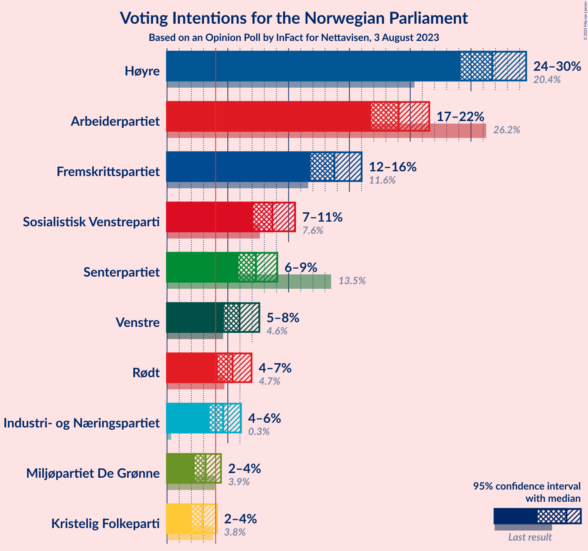

### Confidence Intervals

| Party | Last Result | Poll Result | 80% Confidence Interval | 90% Confidence Interval | 95% Confidence Interval | 99% Confidence Interval |
|:-----:|:-----------:|:-----------:|:-----------------------:|:-----------------------:|:-----------------------:|:-----------------------:|
| Høyre | 20.4% | 26.8% | 25.0–28.6% |24.6–29.1% |24.1–29.5% |23.4–30.4% |
| Arbeiderpartiet | 26.2% | 19.1% | 17.6–20.7% |17.1–21.2% |16.8–21.6% |16.1–22.4% |
| Fremskrittspartiet | 11.6% | 13.8% | 12.5–15.2% |12.1–15.6% |11.8–16.0% |11.2–16.7% |
| Sosialistisk Venstreparti | 7.6% | 8.7% | 7.6–9.9% |7.3–10.2% |7.1–10.5% |6.6–11.1% |
| Senterpartiet | 13.5% | 7.3% | 6.4–8.5% |6.1–8.8% |5.9–9.1% |5.5–9.6% |
| Venstre | 4.6% | 6.0% | 5.1–7.0% |4.9–7.3% |4.7–7.6% |4.3–8.1% |
| Rødt | 4.7% | 5.4% | 4.6–6.4% |4.4–6.7% |4.2–7.0% |3.8–7.5% |
| Industri- og Næringspartiet | 0.3% | 4.6% | 3.9–5.6% |3.7–5.8% |3.5–6.1% |3.2–6.6% |
| Miljøpartiet De Grønne | 3.9% | 3.2% | 2.6–4.0% |2.4–4.2% |2.3–4.4% |2.0–4.9% |
| Kristelig Folkeparti | 3.8% | 2.9% | 2.3–3.7% |2.2–3.9% |2.0–4.1% |1.8–4.5% |

*Note:* The poll result column reflects the actual value used in the calculations. Published results may vary slightly, and in addition be rounded to fewer digits.

## Seats

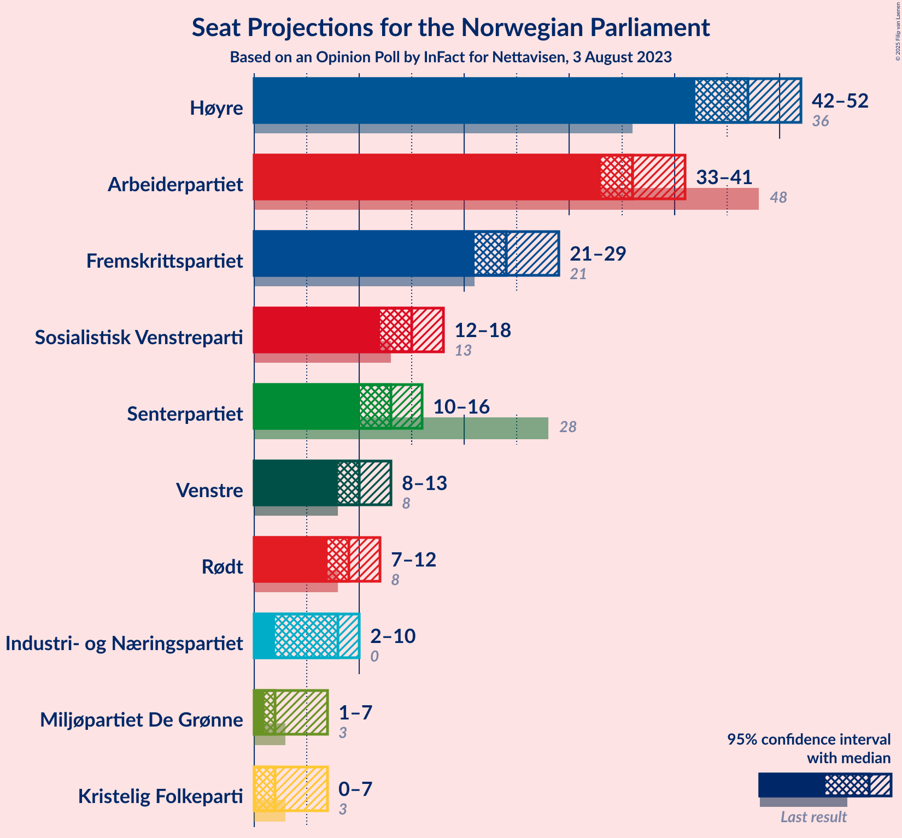

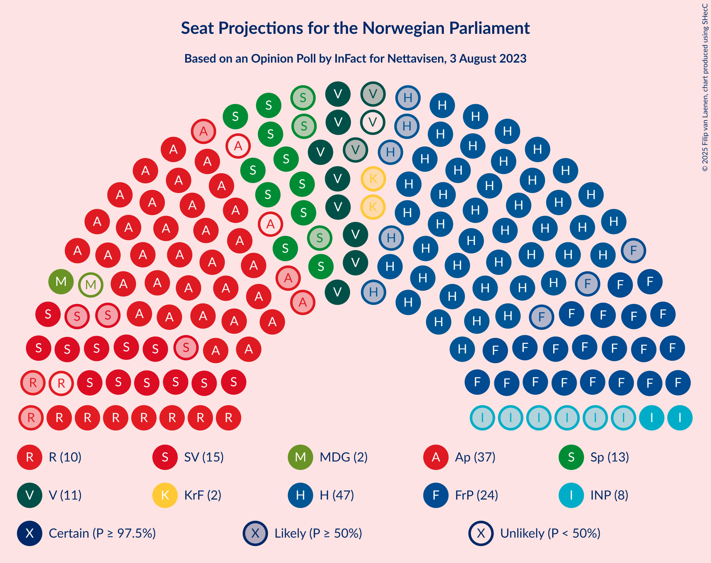

### Confidence Intervals

| Party | Last Result | Median | 80% Confidence Interval | 90% Confidence Interval | 95% Confidence Interval | 99% Confidence Interval |
|:-----:|:-----------:|:------:|:-----------------------:|:-----------------------:|:-----------------------:|:-----------------------:|
| <a href="#høyre">Høyre</a> | 36 | 47 | 44–50 |43–51 |42–52 |41–54 |
| <a href="#arbeiderpartiet">Arbeiderpartiet</a> | 48 | 36 | 34–38 |33–40 |33–41 |31–43 |
| <a href="#fremskrittspartiet">Fremskrittspartiet</a> | 21 | 24 | 22–27 |21–28 |21–29 |20–31 |
| <a href="#sosialistisk-venstreparti">Sosialistisk Venstreparti</a> | 13 | 15 | 13–17 |13–18 |12–18 |11–20 |
| <a href="#senterpartiet">Senterpartiet</a> | 28 | 13 | 11–15 |11–15 |10–16 |9–17 |
| <a href="#venstre">Venstre</a> | 8 | 10 | 9–12 |9–12 |8–13 |7–14 |
| <a href="#rødt">Rødt</a> | 8 | 9 | 8–11 |7–11 |7–12 |1–13 |
| <a href="#industri--og-næringspartiet">Industri- og Næringspartiet</a> | 0 | 8 | 3–10 |3–10 |2–10 |2–11 |
| <a href="#miljøpartiet-de-grønne">Miljøpartiet De Grønne</a> | 3 | 2 | 1–3 |1–7 |1–7 |1–8 |
| <a href="#kristelig-folkeparti">Kristelig Folkeparti</a> | 3 | 2 | 2 |0–3 |0–7 |0–8 |

### Høyre

*For a full overview of the results for this party, see the [Høyre](party-høyre.html) page.*

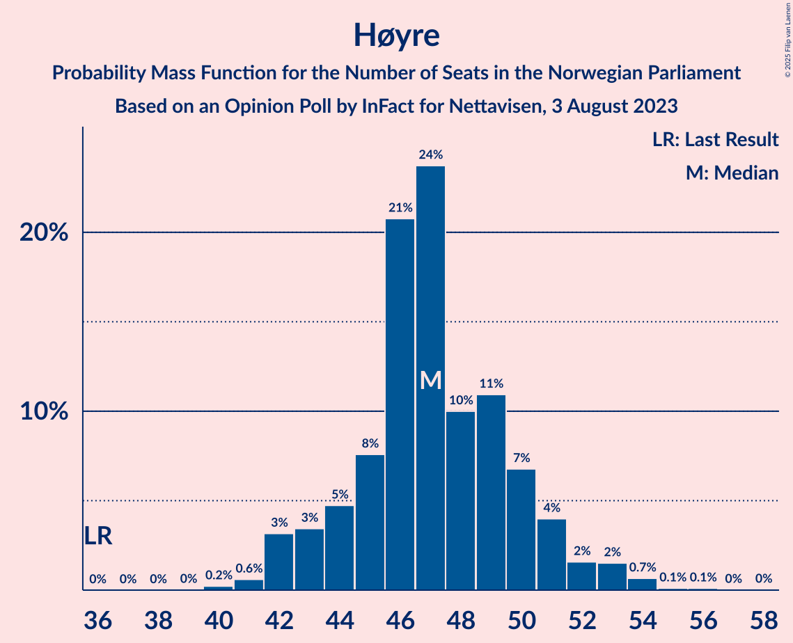

| Number of Seats | Probability | Accumulated | Special Marks |
|:---------------:|:-----------:|:-----------:|:-------------:|
| 36 | 0% | 100% | Last Result |
| 37 | 0% | 100% |  |
| 38 | 0% | 100% |  |
| 39 | 0% | 100% |  |
| 40 | 0.2% | 100% |  |
| 41 | 0.6% | 99.7% |  |
| 42 | 3% | 99.1% |  |
| 43 | 3% | 96% |  |
| 44 | 5% | 93% |  |
| 45 | 8% | 88% |  |
| 46 | 21% | 80% |  |
| 47 | 24% | 59% | Median |
| 48 | 10% | 36% |  |
| 49 | 11% | 26% |  |
| 50 | 7% | 15% |  |
| 51 | 4% | 8% |  |
| 52 | 2% | 4% |  |
| 53 | 2% | 2% |  |
| 54 | 0.7% | 0.9% |  |
| 55 | 0.1% | 0.3% |  |
| 56 | 0.1% | 0.2% |  |
| 57 | 0% | 0.1% |  |
| 58 | 0% | 0% |  |

### Arbeiderpartiet

*For a full overview of the results for this party, see the [Arbeiderpartiet](party-arbeiderpartiet.html) page.*

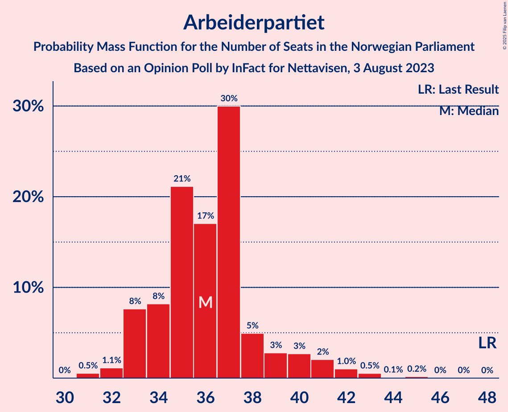

| Number of Seats | Probability | Accumulated | Special Marks |
|:---------------:|:-----------:|:-----------:|:-------------:|
| 31 | 0.5% | 100% |  |
| 32 | 1.1% | 99.4% |  |
| 33 | 8% | 98% |  |
| 34 | 8% | 91% |  |
| 35 | 21% | 82% |  |
| 36 | 17% | 61% | Median |
| 37 | 30% | 44% |  |
| 38 | 5% | 14% |  |
| 39 | 3% | 9% |  |
| 40 | 3% | 7% |  |
| 41 | 2% | 4% |  |
| 42 | 1.0% | 2% |  |
| 43 | 0.5% | 0.8% |  |
| 44 | 0.1% | 0.3% |  |
| 45 | 0.2% | 0.2% |  |
| 46 | 0% | 0% |  |
| 47 | 0% | 0% |  |
| 48 | 0% | 0% | Last Result |

### Fremskrittspartiet

*For a full overview of the results for this party, see the [Fremskrittspartiet](party-fremskrittspartiet.html) page.*

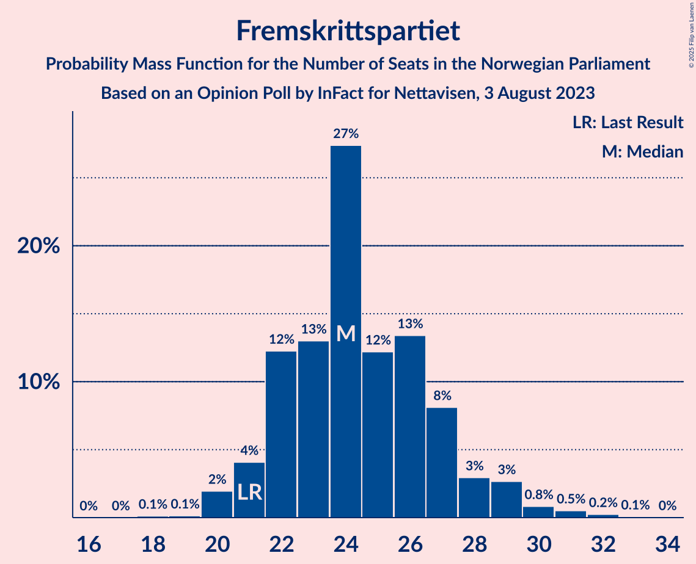

| Number of Seats | Probability | Accumulated | Special Marks |
|:---------------:|:-----------:|:-----------:|:-------------:|
| 18 | 0.1% | 100% |  |
| 19 | 0.1% | 99.9% |  |
| 20 | 2% | 99.7% |  |
| 21 | 4% | 98% | Last Result |
| 22 | 12% | 94% |  |
| 23 | 13% | 81% |  |
| 24 | 27% | 68% | Median |
| 25 | 12% | 41% |  |
| 26 | 13% | 29% |  |
| 27 | 8% | 15% |  |
| 28 | 3% | 7% |  |
| 29 | 3% | 4% |  |
| 30 | 0.8% | 2% |  |
| 31 | 0.5% | 0.9% |  |
| 32 | 0.2% | 0.4% |  |
| 33 | 0.1% | 0.1% |  |
| 34 | 0% | 0% |  |

### Sosialistisk Venstreparti

*For a full overview of the results for this party, see the [Sosialistisk Venstreparti](party-sosialistiskvenstreparti.html) page.*

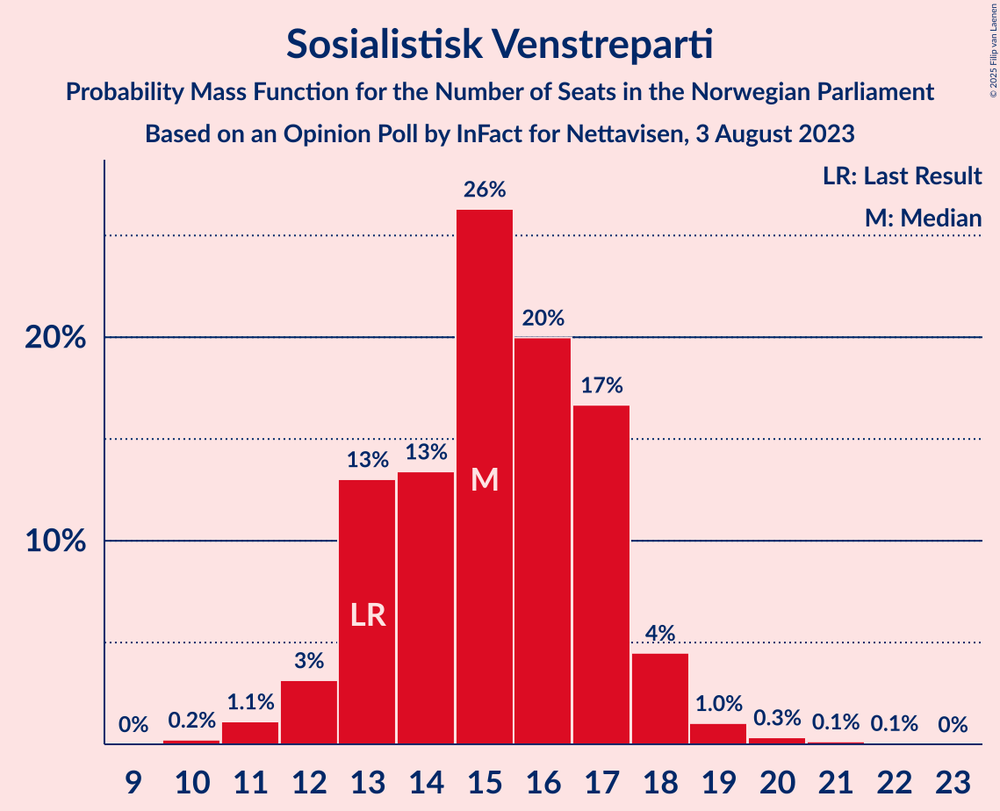

| Number of Seats | Probability | Accumulated | Special Marks |
|:---------------:|:-----------:|:-----------:|:-------------:|
| 10 | 0.2% | 100% |  |
| 11 | 1.1% | 99.8% |  |
| 12 | 3% | 98.6% |  |
| 13 | 13% | 95% | Last Result |
| 14 | 13% | 82% |  |
| 15 | 26% | 69% | Median |
| 16 | 20% | 43% |  |
| 17 | 17% | 23% |  |
| 18 | 4% | 6% |  |
| 19 | 1.0% | 2% |  |
| 20 | 0.3% | 0.5% |  |
| 21 | 0.1% | 0.2% |  |
| 22 | 0.1% | 0.1% |  |
| 23 | 0% | 0% |  |

### Senterpartiet

*For a full overview of the results for this party, see the [Senterpartiet](party-senterpartiet.html) page.*

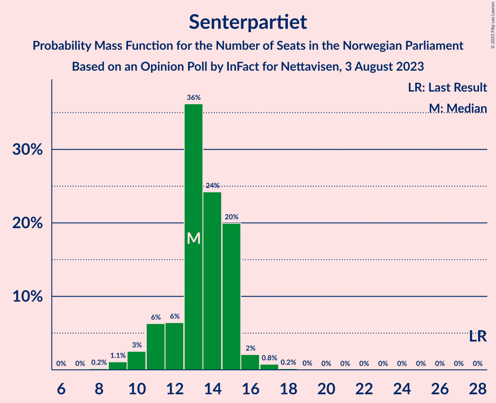

| Number of Seats | Probability | Accumulated | Special Marks |
|:---------------:|:-----------:|:-----------:|:-------------:|
| 8 | 0.2% | 100% |  |
| 9 | 1.1% | 99.8% |  |
| 10 | 3% | 98.7% |  |
| 11 | 6% | 96% |  |
| 12 | 6% | 90% |  |
| 13 | 36% | 83% | Median |
| 14 | 24% | 47% |  |
| 15 | 20% | 23% |  |
| 16 | 2% | 3% |  |
| 17 | 0.8% | 1.0% |  |
| 18 | 0.2% | 0.2% |  |
| 19 | 0% | 0.1% |  |
| 20 | 0% | 0% |  |
| 21 | 0% | 0% |  |
| 22 | 0% | 0% |  |
| 23 | 0% | 0% |  |
| 24 | 0% | 0% |  |
| 25 | 0% | 0% |  |
| 26 | 0% | 0% |  |
| 27 | 0% | 0% |  |
| 28 | 0% | 0% | Last Result |

### Venstre

*For a full overview of the results for this party, see the [Venstre](party-venstre.html) page.*

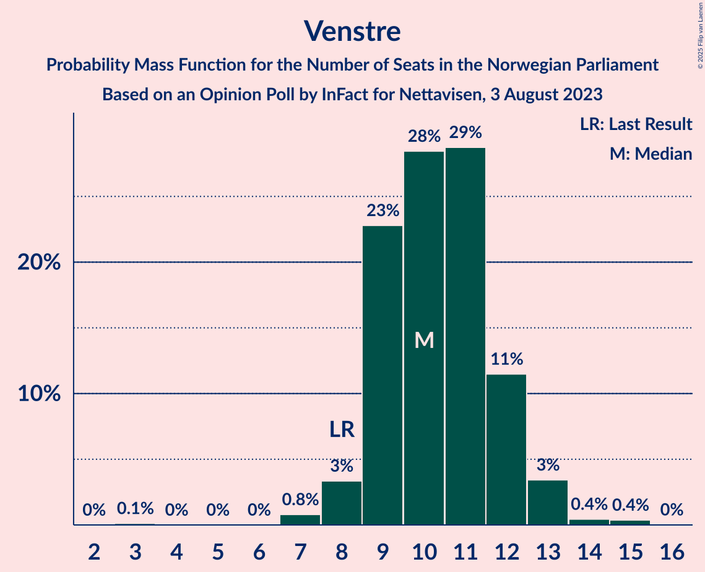

| Number of Seats | Probability | Accumulated | Special Marks |
|:---------------:|:-----------:|:-----------:|:-------------:|
| 3 | 0.1% | 100% |  |
| 4 | 0% | 99.9% |  |
| 5 | 0% | 99.9% |  |
| 6 | 0% | 99.9% |  |
| 7 | 0.8% | 99.9% |  |
| 8 | 3% | 99.1% | Last Result |
| 9 | 23% | 96% |  |
| 10 | 28% | 73% | Median |
| 11 | 29% | 44% |  |
| 12 | 11% | 16% |  |
| 13 | 3% | 4% |  |
| 14 | 0.4% | 0.8% |  |
| 15 | 0.4% | 0.4% |  |
| 16 | 0% | 0% |  |

### Rødt

*For a full overview of the results for this party, see the [Rødt](party-rødt.html) page.*

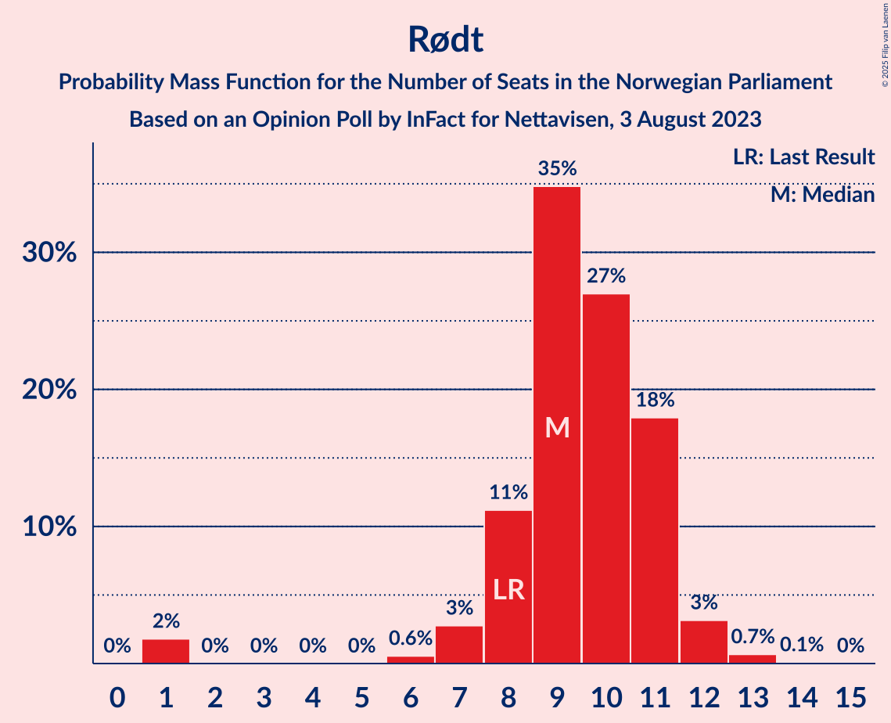

| Number of Seats | Probability | Accumulated | Special Marks |
|:---------------:|:-----------:|:-----------:|:-------------:|
| 1 | 2% | 100% |  |
| 2 | 0% | 98% |  |
| 3 | 0% | 98% |  |
| 4 | 0% | 98% |  |
| 5 | 0% | 98% |  |
| 6 | 0.6% | 98% |  |
| 7 | 3% | 98% |  |
| 8 | 11% | 95% | Last Result |
| 9 | 35% | 84% | Median |
| 10 | 27% | 49% |  |
| 11 | 18% | 22% |  |
| 12 | 3% | 4% |  |
| 13 | 0.7% | 0.8% |  |
| 14 | 0.1% | 0.1% |  |
| 15 | 0% | 0% |  |

### Industri- og Næringspartiet

*For a full overview of the results for this party, see the [Industri- og Næringspartiet](party-industri-ognæringspartiet.html) page.*

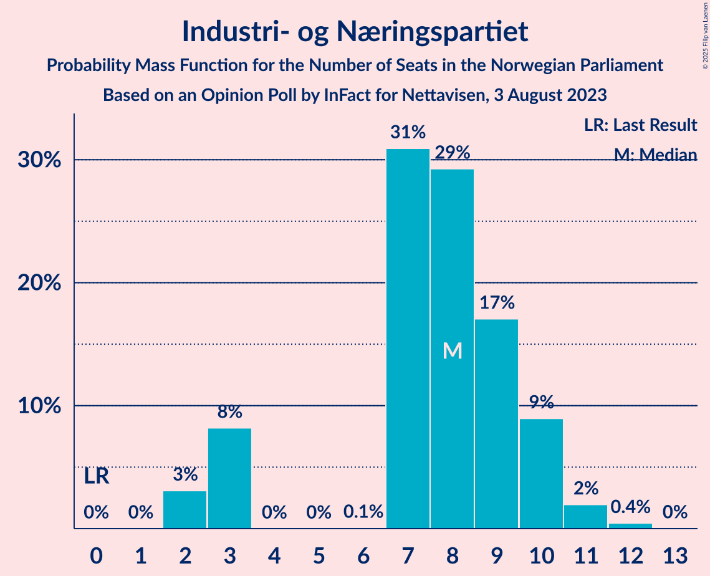

| Number of Seats | Probability | Accumulated | Special Marks |
|:---------------:|:-----------:|:-----------:|:-------------:|
| 0 | 0% | 100% | Last Result |
| 1 | 0% | 100% |  |
| 2 | 3% | 100% |  |
| 3 | 8% | 97% |  |
| 4 | 0% | 89% |  |
| 5 | 0% | 89% |  |
| 6 | 0.1% | 89% |  |
| 7 | 31% | 89% |  |
| 8 | 29% | 58% | Median |
| 9 | 17% | 28% |  |
| 10 | 9% | 11% |  |
| 11 | 2% | 2% |  |
| 12 | 0.4% | 0.5% |  |
| 13 | 0% | 0% |  |

### Miljøpartiet De Grønne

*For a full overview of the results for this party, see the [Miljøpartiet De Grønne](party-miljøpartietdegrønne.html) page.*

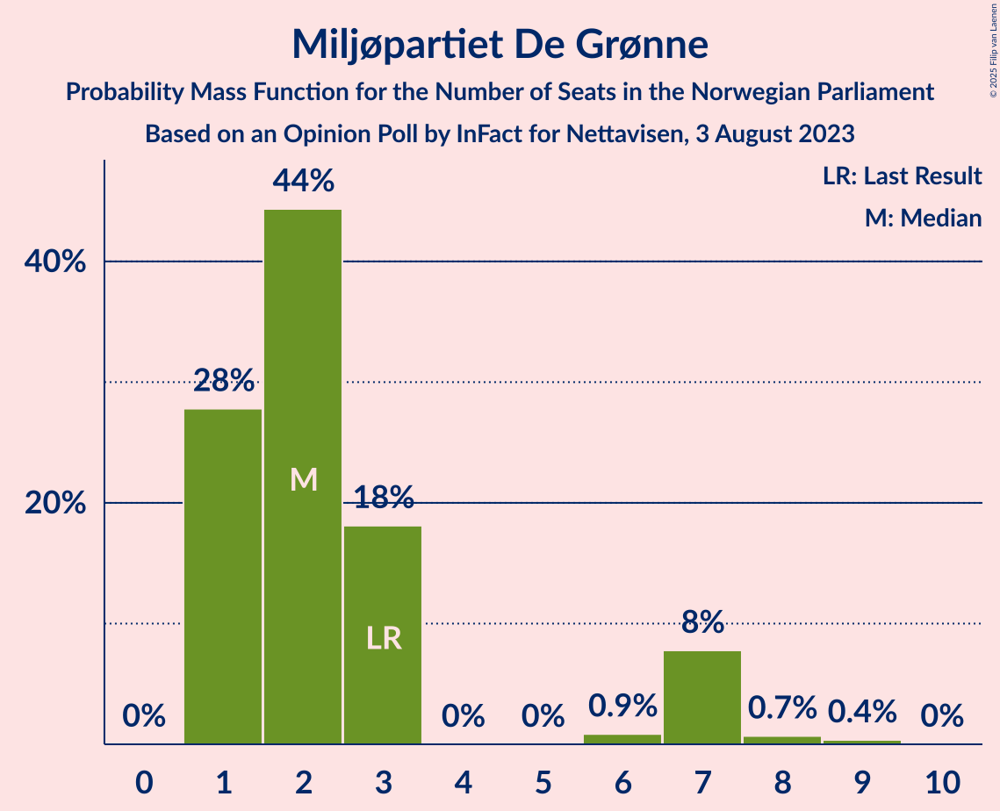

| Number of Seats | Probability | Accumulated | Special Marks |
|:---------------:|:-----------:|:-----------:|:-------------:|
| 1 | 28% | 100% |  |
| 2 | 44% | 72% | Median |
| 3 | 18% | 28% | Last Result |
| 4 | 0% | 10% |  |
| 5 | 0% | 10% |  |
| 6 | 0.9% | 10% |  |
| 7 | 8% | 9% |  |
| 8 | 0.7% | 1.1% |  |
| 9 | 0.4% | 0.4% |  |
| 10 | 0% | 0% |  |

### Kristelig Folkeparti

*For a full overview of the results for this party, see the [Kristelig Folkeparti](party-kristeligfolkeparti.html) page.*

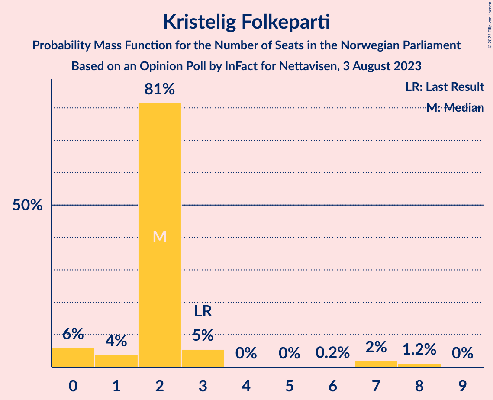

| Number of Seats | Probability | Accumulated | Special Marks |
|:---------------:|:-----------:|:-----------:|:-------------:|
| 0 | 6% | 100% |  |
| 1 | 4% | 94% |  |
| 2 | 81% | 90% | Median |
| 3 | 5% | 9% | Last Result |
| 4 | 0% | 3% |  |
| 5 | 0% | 3% |  |
| 6 | 0.2% | 3% |  |
| 7 | 2% | 3% |  |
| 8 | 1.2% | 1.2% |  |
| 9 | 0% | 0% |  |

## Coalitions

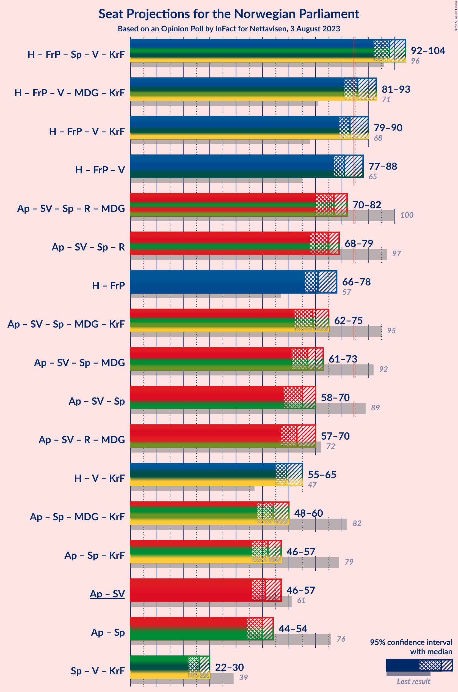

### Confidence Intervals

| Coalition | Last Result | Median | Majority? | 80% Confidence Interval | 90% Confidence Interval | 95% Confidence Interval | 99% Confidence Interval |
|:---------:|:-----------:|:------:|:---------:|:-----------------------:|:-----------------------:|:-----------------------:|:-----------------------:|
| Høyre – Fremskrittspartiet – Senterpartiet – Venstre – Kristelig Folkeparti | 96 | 98 | 100% | 94–101 | 93–103 | 92–104 | 90–107 |
| Høyre – Fremskrittspartiet – Venstre – Miljøpartiet De Grønne – Kristelig Folkeparti | 71 | 86 | 74% | 83–90 | 82–92 | 81–93 | 79–96 |
| Høyre – Fremskrittspartiet – Venstre – Kristelig Folkeparti | 68 | 83 | 36% | 81–88 | 79–90 | 79–90 | 77–94 |
| Høyre – Fremskrittspartiet – Venstre | 65 | 81 | 22% | 79–86 | 77–87 | 77–88 | 75–91 |
| Arbeiderpartiet – Sosialistisk Venstreparti – Senterpartiet – Rødt – Miljøpartiet De Grønne | 100 | 77 | 0.2% | 73–80 | 71–81 | 70–82 | 68–84 |
| Arbeiderpartiet – Sosialistisk Venstreparti – Senterpartiet – Rødt | 97 | 75 | 0% | 70–77 | 69–78 | 68–79 | 65–81 |
| Høyre – Fremskrittspartiet | 57 | 71 | 0% | 68–75 | 67–77 | 66–78 | 65–80 |
| Arbeiderpartiet – Sosialistisk Venstreparti – Senterpartiet – Miljøpartiet De Grønne – Kristelig Folkeparti | 95 | 69 | 0% | 66–73 | 64–74 | 62–75 | 61–77 |
| Arbeiderpartiet – Sosialistisk Venstreparti – Senterpartiet – Miljøpartiet De Grønne | 92 | 67 | 0% | 64–71 | 62–72 | 61–73 | 59–74 |
| Arbeiderpartiet – Sosialistisk Venstreparti – Senterpartiet | 89 | 65 | 0% | 61–67 | 60–69 | 58–70 | 57–71 |
| Arbeiderpartiet – Sosialistisk Venstreparti – Rødt – Miljøpartiet De Grønne | 72 | 63 | 0% | 60–67 | 58–68 | 57–70 | 55–71 |
| Høyre – Venstre – Kristelig Folkeparti | 47 | 59 | 0% | 56–63 | 56–64 | 55–65 | 53–68 |
| Arbeiderpartiet – Senterpartiet – Miljøpartiet De Grønne – Kristelig Folkeparti | 82 | 54 | 0% | 51–57 | 49–59 | 48–60 | 46–63 |
| Arbeiderpartiet – Senterpartiet – Kristelig Folkeparti | 79 | 52 | 0% | 48–54 | 47–56 | 46–57 | 44–59 |
| Arbeiderpartiet – Sosialistisk Venstreparti | 61 | 51 | 0% | 49–54 | 47–56 | 46–57 | 45–58 |
| Arbeiderpartiet – Senterpartiet | 76 | 50 | 0% | 47–52 | 45–53 | 44–54 | 43–56 |
| Senterpartiet – Venstre – Kristelig Folkeparti | 39 | 26 | 0% | 23–28 | 23–29 | 22–30 | 20–32 |

### Høyre – Fremskrittspartiet – Senterpartiet – Venstre – Kristelig Folkeparti

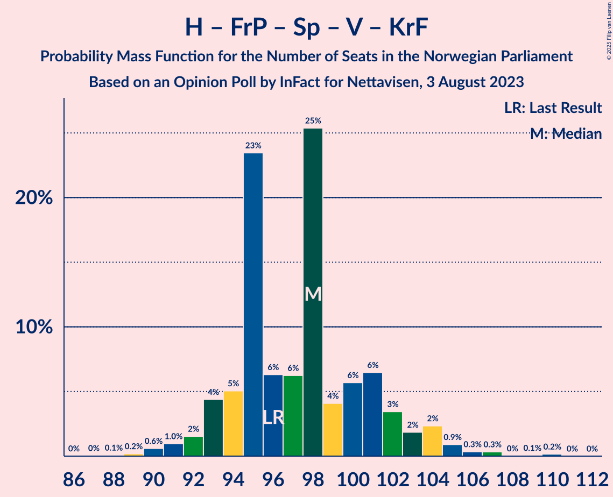

| Number of Seats | Probability | Accumulated | Special Marks |
|:---------------:|:-----------:|:-----------:|:-------------:|
| 86 | 0% | 100% |  |
| 87 | 0% | 99.9% |  |
| 88 | 0.1% | 99.9% |  |
| 89 | 0.2% | 99.8% |  |
| 90 | 0.6% | 99.6% |  |
| 91 | 1.0% | 99.0% |  |
| 92 | 2% | 98% |  |
| 93 | 4% | 97% |  |
| 94 | 5% | 92% |  |
| 95 | 23% | 87% |  |
| 96 | 6% | 64% | Last Result, Median |
| 97 | 6% | 57% |  |
| 98 | 25% | 51% |  |
| 99 | 4% | 26% |  |
| 100 | 6% | 22% |  |
| 101 | 6% | 16% |  |
| 102 | 3% | 9% |  |
| 103 | 2% | 6% |  |
| 104 | 2% | 4% |  |
| 105 | 0.9% | 2% |  |
| 106 | 0.3% | 0.9% |  |
| 107 | 0.3% | 0.6% |  |
| 108 | 0% | 0.2% |  |
| 109 | 0.1% | 0.2% |  |
| 110 | 0.2% | 0.2% |  |
| 111 | 0% | 0% |  |

### Høyre – Fremskrittspartiet – Venstre – Miljøpartiet De Grønne – Kristelig Folkeparti

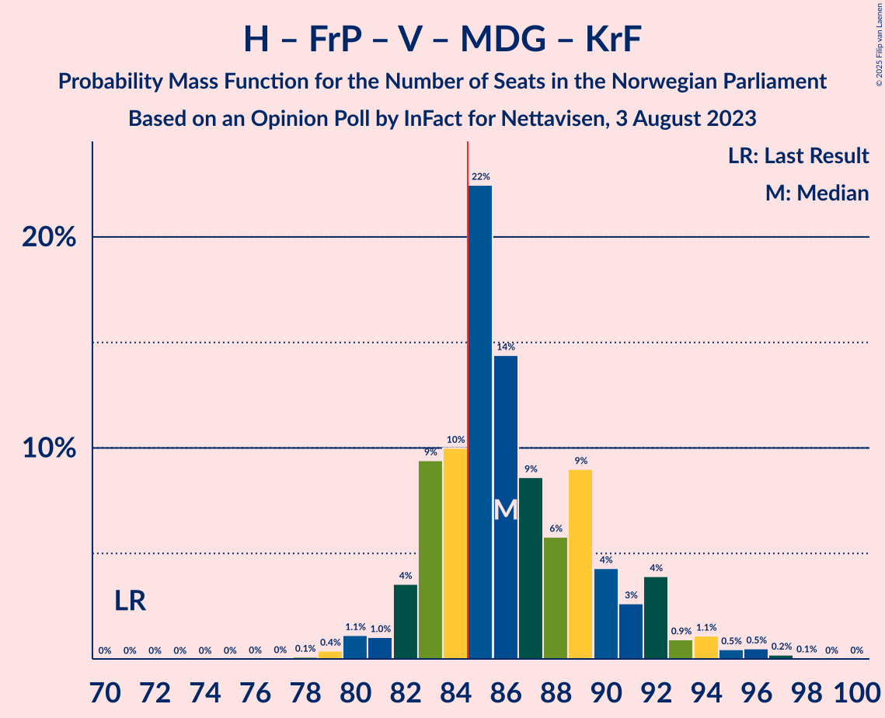

| Number of Seats | Probability | Accumulated | Special Marks |
|:---------------:|:-----------:|:-----------:|:-------------:|
| 71 | 0% | 100% | Last Result |
| 72 | 0% | 100% |  |
| 73 | 0% | 100% |  |
| 74 | 0% | 100% |  |
| 75 | 0% | 100% |  |
| 76 | 0% | 100% |  |
| 77 | 0% | 100% |  |
| 78 | 0.1% | 99.9% |  |
| 79 | 0.4% | 99.8% |  |
| 80 | 1.1% | 99.5% |  |
| 81 | 1.0% | 98% |  |
| 82 | 4% | 97% |  |
| 83 | 9% | 94% |  |
| 84 | 10% | 84% |  |
| 85 | 22% | 74% | Median, Majority |
| 86 | 14% | 52% |  |
| 87 | 9% | 37% |  |
| 88 | 6% | 29% |  |
| 89 | 9% | 23% |  |
| 90 | 4% | 14% |  |
| 91 | 3% | 10% |  |
| 92 | 4% | 7% |  |
| 93 | 0.9% | 3% |  |
| 94 | 1.1% | 2% |  |
| 95 | 0.5% | 1.2% |  |
| 96 | 0.5% | 0.8% |  |
| 97 | 0.2% | 0.3% |  |
| 98 | 0.1% | 0.1% |  |
| 99 | 0% | 0% |  |

### Høyre – Fremskrittspartiet – Venstre – Kristelig Folkeparti

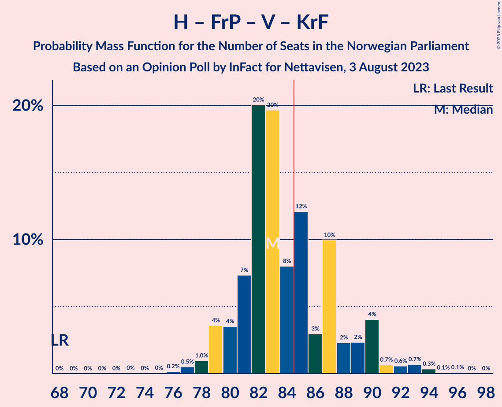

| Number of Seats | Probability | Accumulated | Special Marks |
|:---------------:|:-----------:|:-----------:|:-------------:|
| 68 | 0% | 100% | Last Result |
| 69 | 0% | 100% |  |
| 70 | 0% | 100% |  |
| 71 | 0% | 100% |  |
| 72 | 0% | 100% |  |
| 73 | 0% | 100% |  |
| 74 | 0% | 100% |  |
| 75 | 0% | 99.9% |  |
| 76 | 0.2% | 99.9% |  |
| 77 | 0.5% | 99.7% |  |
| 78 | 1.0% | 99.3% |  |
| 79 | 4% | 98% |  |
| 80 | 4% | 95% |  |
| 81 | 7% | 91% |  |
| 82 | 20% | 84% |  |
| 83 | 20% | 64% | Median |
| 84 | 8% | 44% |  |
| 85 | 12% | 36% | Majority |
| 86 | 3% | 24% |  |
| 87 | 10% | 21% |  |
| 88 | 2% | 11% |  |
| 89 | 2% | 9% |  |
| 90 | 4% | 6% |  |
| 91 | 0.7% | 2% |  |
| 92 | 0.6% | 2% |  |
| 93 | 0.7% | 1.2% |  |
| 94 | 0.3% | 0.5% |  |
| 95 | 0.1% | 0.2% |  |
| 96 | 0.1% | 0.1% |  |
| 97 | 0% | 0% |  |

### Høyre – Fremskrittspartiet – Venstre

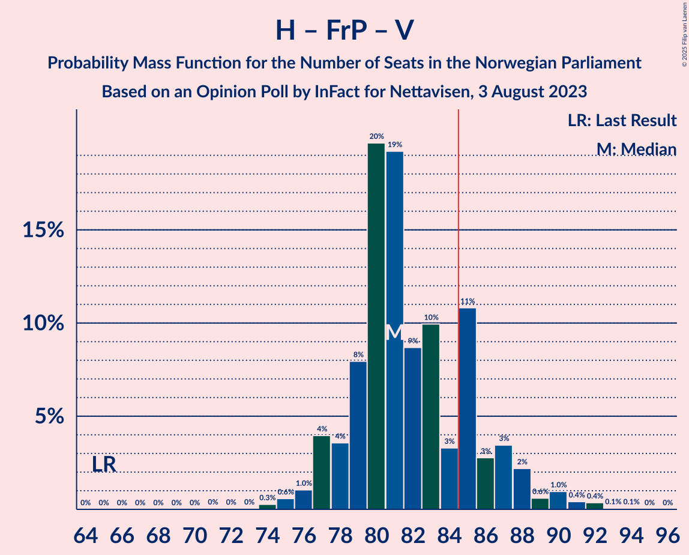

| Number of Seats | Probability | Accumulated | Special Marks |
|:---------------:|:-----------:|:-----------:|:-------------:|
| 65 | 0% | 100% | Last Result |
| 66 | 0% | 100% |  |
| 67 | 0% | 100% |  |
| 68 | 0% | 100% |  |
| 69 | 0% | 100% |  |
| 70 | 0% | 100% |  |
| 71 | 0% | 100% |  |
| 72 | 0% | 100% |  |
| 73 | 0% | 99.9% |  |
| 74 | 0.3% | 99.9% |  |
| 75 | 0.6% | 99.6% |  |
| 76 | 1.0% | 99.0% |  |
| 77 | 4% | 98% |  |
| 78 | 4% | 94% |  |
| 79 | 8% | 90% |  |
| 80 | 20% | 83% |  |
| 81 | 19% | 63% | Median |
| 82 | 9% | 44% |  |
| 83 | 10% | 35% |  |
| 84 | 3% | 25% |  |
| 85 | 11% | 22% | Majority |
| 86 | 3% | 11% |  |
| 87 | 3% | 8% |  |
| 88 | 2% | 5% |  |
| 89 | 0.6% | 2% |  |
| 90 | 1.0% | 2% |  |
| 91 | 0.4% | 0.9% |  |
| 92 | 0.4% | 0.5% |  |
| 93 | 0.1% | 0.1% |  |
| 94 | 0.1% | 0.1% |  |
| 95 | 0% | 0% |  |

### Arbeiderpartiet – Sosialistisk Venstreparti – Senterpartiet – Rødt – Miljøpartiet De Grønne

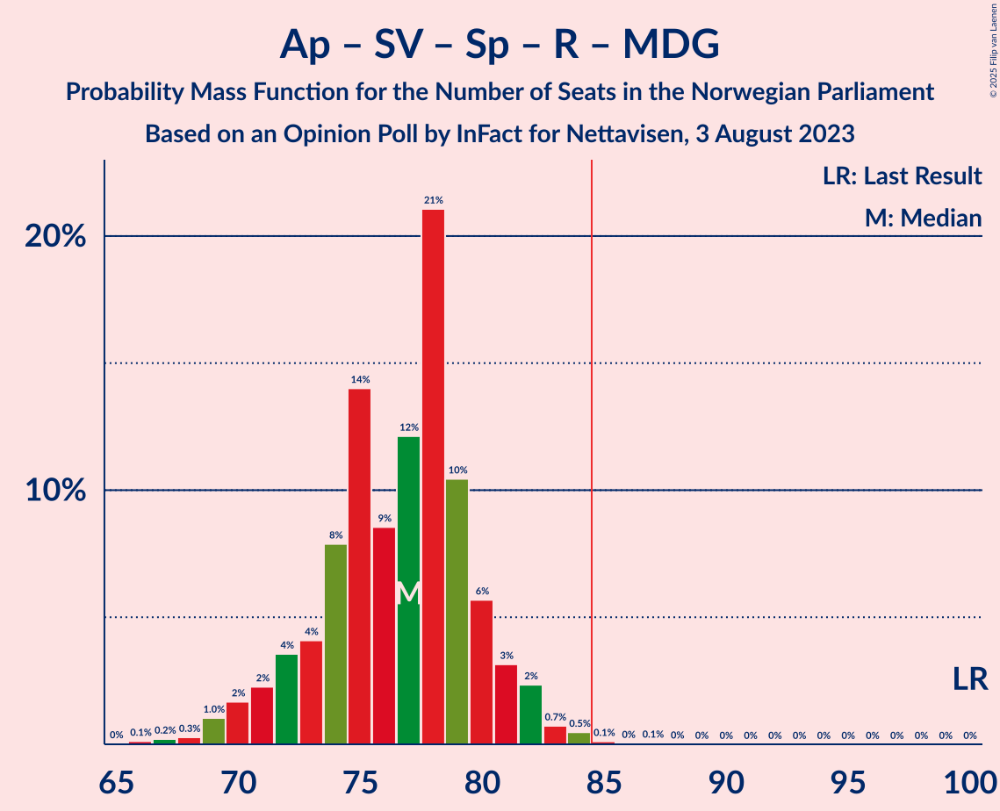

| Number of Seats | Probability | Accumulated | Special Marks |
|:---------------:|:-----------:|:-----------:|:-------------:|
| 65 | 0% | 100% |  |
| 66 | 0.1% | 99.9% |  |
| 67 | 0.2% | 99.8% |  |
| 68 | 0.3% | 99.6% |  |
| 69 | 1.0% | 99.3% |  |
| 70 | 2% | 98% |  |
| 71 | 2% | 97% |  |
| 72 | 4% | 94% |  |
| 73 | 4% | 91% |  |
| 74 | 8% | 87% |  |
| 75 | 14% | 79% | Median |
| 76 | 9% | 65% |  |
| 77 | 12% | 56% |  |
| 78 | 21% | 44% |  |
| 79 | 10% | 23% |  |
| 80 | 6% | 13% |  |
| 81 | 3% | 7% |  |
| 82 | 2% | 4% |  |
| 83 | 0.7% | 1.4% |  |
| 84 | 0.5% | 0.7% |  |
| 85 | 0.1% | 0.2% | Majority |
| 86 | 0% | 0.1% |  |
| 87 | 0.1% | 0.1% |  |
| 88 | 0% | 0% |  |
| 89 | 0% | 0% |  |
| 90 | 0% | 0% |  |
| 91 | 0% | 0% |  |
| 92 | 0% | 0% |  |
| 93 | 0% | 0% |  |
| 94 | 0% | 0% |  |
| 95 | 0% | 0% |  |
| 96 | 0% | 0% |  |
| 97 | 0% | 0% |  |
| 98 | 0% | 0% |  |
| 99 | 0% | 0% |  |
| 100 | 0% | 0% | Last Result |

### Arbeiderpartiet – Sosialistisk Venstreparti – Senterpartiet – Rødt

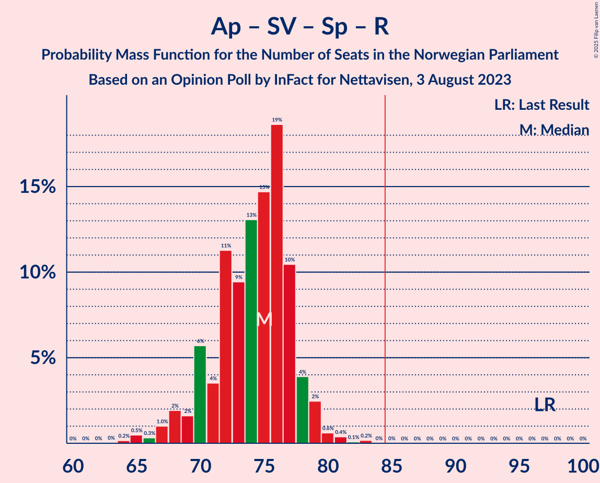

| Number of Seats | Probability | Accumulated | Special Marks |
|:---------------:|:-----------:|:-----------:|:-------------:|
| 63 | 0% | 100% |  |
| 64 | 0.2% | 99.9% |  |
| 65 | 0.5% | 99.8% |  |
| 66 | 0.3% | 99.3% |  |
| 67 | 1.0% | 99.0% |  |
| 68 | 2% | 98% |  |
| 69 | 2% | 96% |  |
| 70 | 6% | 94% |  |
| 71 | 4% | 89% |  |
| 72 | 11% | 85% |  |
| 73 | 9% | 74% | Median |
| 74 | 13% | 64% |  |
| 75 | 15% | 51% |  |
| 76 | 19% | 37% |  |
| 77 | 10% | 18% |  |
| 78 | 4% | 8% |  |
| 79 | 2% | 4% |  |
| 80 | 0.6% | 1.3% |  |
| 81 | 0.4% | 0.7% |  |
| 82 | 0.1% | 0.3% |  |
| 83 | 0.2% | 0.2% |  |
| 84 | 0% | 0% |  |
| 85 | 0% | 0% | Majority |
| 86 | 0% | 0% |  |
| 87 | 0% | 0% |  |
| 88 | 0% | 0% |  |
| 89 | 0% | 0% |  |
| 90 | 0% | 0% |  |
| 91 | 0% | 0% |  |
| 92 | 0% | 0% |  |
| 93 | 0% | 0% |  |
| 94 | 0% | 0% |  |
| 95 | 0% | 0% |  |
| 96 | 0% | 0% |  |
| 97 | 0% | 0% | Last Result |

### Høyre – Fremskrittspartiet

| Number of Seats | Probability | Accumulated | Special Marks |
|:---------------:|:-----------:|:-----------:|:-------------:|
| 57 | 0% | 100% | Last Result |
| 58 | 0% | 100% |  |
| 59 | 0% | 100% |  |
| 60 | 0% | 100% |  |
| 61 | 0% | 100% |  |
| 62 | 0% | 100% |  |
| 63 | 0.1% | 99.9% |  |
| 64 | 0.3% | 99.8% |  |
| 65 | 0.3% | 99.5% |  |
| 66 | 3% | 99.2% |  |
| 67 | 3% | 96% |  |
| 68 | 6% | 93% |  |
| 69 | 7% | 86% |  |
| 70 | 20% | 79% |  |
| 71 | 21% | 59% | Median |
| 72 | 6% | 38% |  |
| 73 | 8% | 33% |  |
| 74 | 6% | 25% |  |
| 75 | 11% | 19% |  |
| 76 | 2% | 8% |  |
| 77 | 3% | 6% |  |
| 78 | 1.1% | 3% |  |
| 79 | 1.0% | 2% |  |
| 80 | 0.7% | 1.1% |  |
| 81 | 0.2% | 0.3% |  |
| 82 | 0.1% | 0.1% |  |
| 83 | 0% | 0.1% |  |
| 84 | 0% | 0% |  |

### Arbeiderpartiet – Sosialistisk Venstreparti – Senterpartiet – Miljøpartiet De Grønne – Kristelig Folkeparti

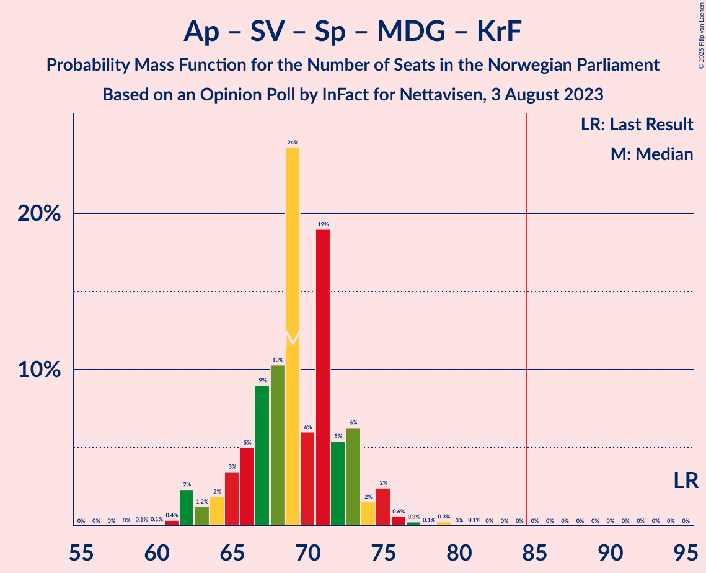

| Number of Seats | Probability | Accumulated | Special Marks |
|:---------------:|:-----------:|:-----------:|:-------------:|
| 59 | 0.1% | 100% |  |
| 60 | 0.1% | 99.9% |  |
| 61 | 0.4% | 99.8% |  |
| 62 | 2% | 99.4% |  |
| 63 | 1.2% | 97% |  |
| 64 | 2% | 96% |  |
| 65 | 3% | 94% |  |
| 66 | 5% | 90% |  |
| 67 | 9% | 85% |  |
| 68 | 10% | 76% | Median |
| 69 | 24% | 66% |  |
| 70 | 6% | 42% |  |
| 71 | 19% | 36% |  |
| 72 | 5% | 17% |  |
| 73 | 6% | 12% |  |
| 74 | 2% | 5% |  |
| 75 | 2% | 4% |  |
| 76 | 0.6% | 1.3% |  |
| 77 | 0.3% | 0.7% |  |
| 78 | 0.1% | 0.4% |  |
| 79 | 0.3% | 0.4% |  |
| 80 | 0% | 0.1% |  |
| 81 | 0.1% | 0.1% |  |
| 82 | 0% | 0% |  |
| 83 | 0% | 0% |  |
| 84 | 0% | 0% |  |
| 85 | 0% | 0% | Majority |
| 86 | 0% | 0% |  |
| 87 | 0% | 0% |  |
| 88 | 0% | 0% |  |
| 89 | 0% | 0% |  |
| 90 | 0% | 0% |  |
| 91 | 0% | 0% |  |
| 92 | 0% | 0% |  |
| 93 | 0% | 0% |  |
| 94 | 0% | 0% |  |
| 95 | 0% | 0% | Last Result |

### Arbeiderpartiet – Sosialistisk Venstreparti – Senterpartiet – Miljøpartiet De Grønne

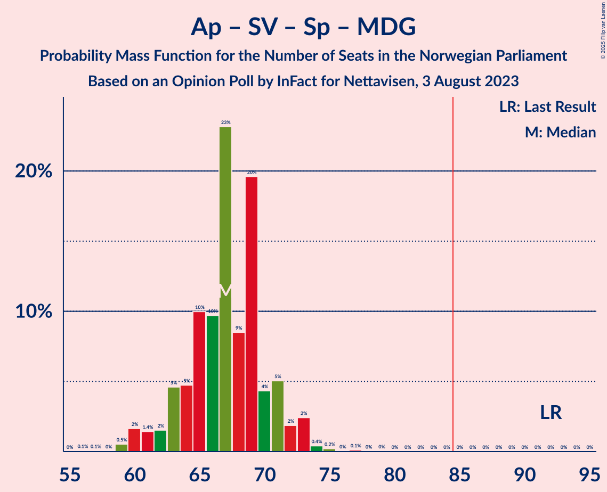

| Number of Seats | Probability | Accumulated | Special Marks |
|:---------------:|:-----------:|:-----------:|:-------------:|
| 56 | 0.1% | 100% |  |
| 57 | 0.1% | 99.9% |  |
| 58 | 0% | 99.9% |  |
| 59 | 0.5% | 99.9% |  |
| 60 | 2% | 99.3% |  |
| 61 | 1.4% | 98% |  |
| 62 | 2% | 96% |  |
| 63 | 5% | 95% |  |
| 64 | 5% | 90% |  |
| 65 | 10% | 85% |  |
| 66 | 10% | 75% | Median |
| 67 | 23% | 66% |  |
| 68 | 9% | 43% |  |
| 69 | 20% | 34% |  |
| 70 | 4% | 14% |  |
| 71 | 5% | 10% |  |
| 72 | 2% | 5% |  |
| 73 | 2% | 3% |  |
| 74 | 0.4% | 0.8% |  |
| 75 | 0.2% | 0.4% |  |
| 76 | 0% | 0.2% |  |
| 77 | 0.1% | 0.2% |  |
| 78 | 0% | 0.1% |  |
| 79 | 0% | 0% |  |
| 80 | 0% | 0% |  |
| 81 | 0% | 0% |  |
| 82 | 0% | 0% |  |
| 83 | 0% | 0% |  |
| 84 | 0% | 0% |  |
| 85 | 0% | 0% | Majority |
| 86 | 0% | 0% |  |
| 87 | 0% | 0% |  |
| 88 | 0% | 0% |  |
| 89 | 0% | 0% |  |
| 90 | 0% | 0% |  |
| 91 | 0% | 0% |  |
| 92 | 0% | 0% | Last Result |

### Arbeiderpartiet – Sosialistisk Venstreparti – Senterpartiet

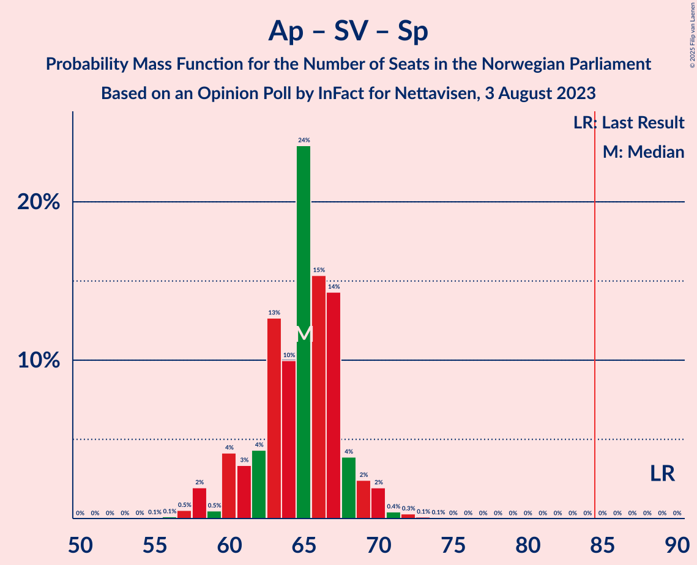

| Number of Seats | Probability | Accumulated | Special Marks |
|:---------------:|:-----------:|:-----------:|:-------------:|
| 55 | 0.1% | 100% |  |
| 56 | 0.1% | 99.9% |  |
| 57 | 0.5% | 99.8% |  |
| 58 | 2% | 99.3% |  |
| 59 | 0.5% | 97% |  |
| 60 | 4% | 97% |  |
| 61 | 3% | 93% |  |
| 62 | 4% | 89% |  |
| 63 | 13% | 85% |  |
| 64 | 10% | 72% | Median |
| 65 | 24% | 62% |  |
| 66 | 15% | 39% |  |
| 67 | 14% | 23% |  |
| 68 | 4% | 9% |  |
| 69 | 2% | 5% |  |
| 70 | 2% | 3% |  |
| 71 | 0.4% | 0.9% |  |
| 72 | 0.3% | 0.5% |  |
| 73 | 0.1% | 0.2% |  |
| 74 | 0.1% | 0.1% |  |
| 75 | 0% | 0% |  |
| 76 | 0% | 0% |  |
| 77 | 0% | 0% |  |
| 78 | 0% | 0% |  |
| 79 | 0% | 0% |  |
| 80 | 0% | 0% |  |
| 81 | 0% | 0% |  |
| 82 | 0% | 0% |  |
| 83 | 0% | 0% |  |
| 84 | 0% | 0% |  |
| 85 | 0% | 0% | Majority |
| 86 | 0% | 0% |  |
| 87 | 0% | 0% |  |
| 88 | 0% | 0% |  |
| 89 | 0% | 0% | Last Result |

### Arbeiderpartiet – Sosialistisk Venstreparti – Rødt – Miljøpartiet De Grønne

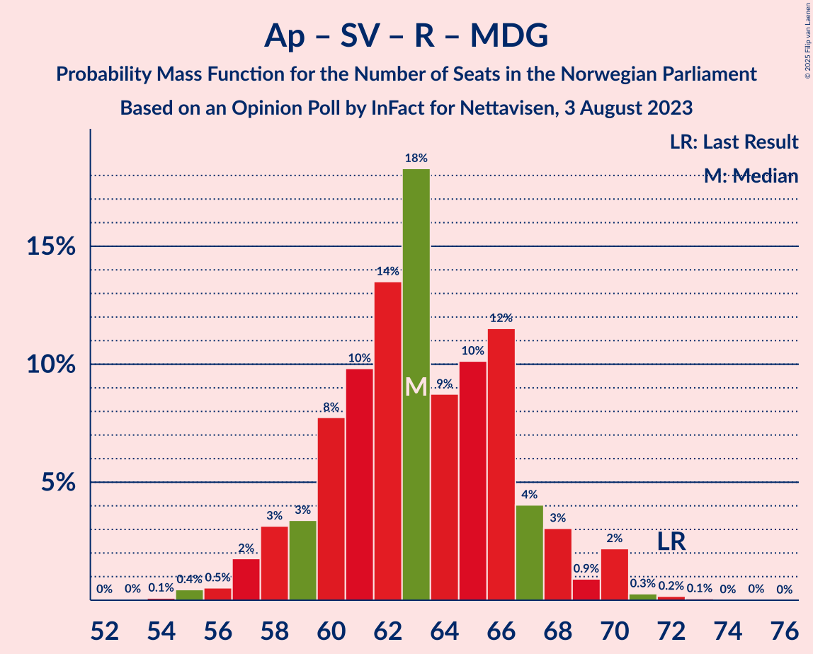

| Number of Seats | Probability | Accumulated | Special Marks |
|:---------------:|:-----------:|:-----------:|:-------------:|
| 52 | 0% | 100% |  |
| 53 | 0% | 99.9% |  |
| 54 | 0.1% | 99.9% |  |
| 55 | 0.4% | 99.8% |  |
| 56 | 0.5% | 99.3% |  |
| 57 | 2% | 98.8% |  |
| 58 | 3% | 97% |  |
| 59 | 3% | 94% |  |
| 60 | 8% | 91% |  |
| 61 | 10% | 83% |  |
| 62 | 14% | 73% | Median |
| 63 | 18% | 59% |  |
| 64 | 9% | 41% |  |
| 65 | 10% | 32% |  |
| 66 | 12% | 22% |  |
| 67 | 4% | 11% |  |
| 68 | 3% | 7% |  |
| 69 | 0.9% | 4% |  |
| 70 | 2% | 3% |  |
| 71 | 0.3% | 0.6% |  |
| 72 | 0.2% | 0.3% | Last Result |
| 73 | 0.1% | 0.1% |  |
| 74 | 0% | 0.1% |  |
| 75 | 0% | 0.1% |  |
| 76 | 0% | 0% |  |

### Høyre – Venstre – Kristelig Folkeparti

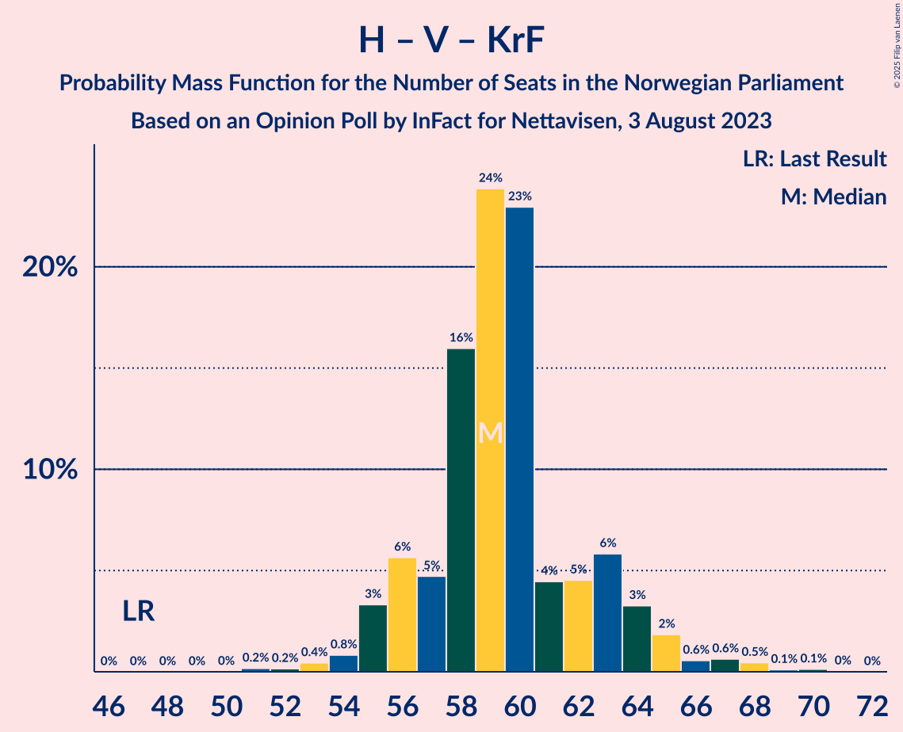

| Number of Seats | Probability | Accumulated | Special Marks |
|:---------------:|:-----------:|:-----------:|:-------------:|
| 47 | 0% | 100% | Last Result |
| 48 | 0% | 100% |  |
| 49 | 0% | 100% |  |
| 50 | 0% | 100% |  |
| 51 | 0.2% | 100% |  |
| 52 | 0.2% | 99.8% |  |
| 53 | 0.4% | 99.6% |  |
| 54 | 0.8% | 99.2% |  |
| 55 | 3% | 98% |  |
| 56 | 6% | 95% |  |
| 57 | 5% | 89% |  |
| 58 | 16% | 85% |  |
| 59 | 24% | 69% | Median |
| 60 | 23% | 45% |  |
| 61 | 4% | 22% |  |
| 62 | 5% | 17% |  |
| 63 | 6% | 13% |  |
| 64 | 3% | 7% |  |
| 65 | 2% | 4% |  |
| 66 | 0.6% | 2% |  |
| 67 | 0.6% | 1.4% |  |
| 68 | 0.5% | 0.7% |  |
| 69 | 0.1% | 0.3% |  |
| 70 | 0.1% | 0.2% |  |
| 71 | 0% | 0% |  |

### Arbeiderpartiet – Senterpartiet – Miljøpartiet De Grønne – Kristelig Folkeparti

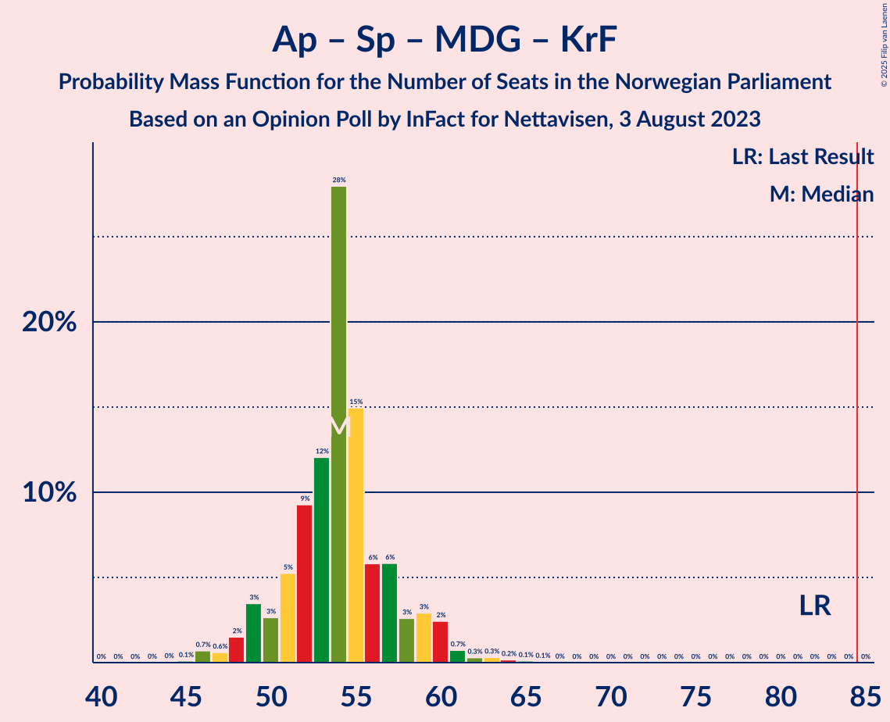

| Number of Seats | Probability | Accumulated | Special Marks |
|:---------------:|:-----------:|:-----------:|:-------------:|
| 44 | 0% | 100% |  |
| 45 | 0.1% | 99.9% |  |
| 46 | 0.7% | 99.8% |  |
| 47 | 0.6% | 99.1% |  |
| 48 | 2% | 98.5% |  |
| 49 | 3% | 97% |  |
| 50 | 3% | 94% |  |
| 51 | 5% | 91% |  |
| 52 | 9% | 86% |  |
| 53 | 12% | 76% | Median |
| 54 | 28% | 64% |  |
| 55 | 15% | 36% |  |
| 56 | 6% | 21% |  |
| 57 | 6% | 16% |  |
| 58 | 3% | 10% |  |
| 59 | 3% | 7% |  |
| 60 | 2% | 4% |  |
| 61 | 0.7% | 2% |  |
| 62 | 0.3% | 1.0% |  |
| 63 | 0.3% | 0.7% |  |
| 64 | 0.2% | 0.4% |  |
| 65 | 0.1% | 0.2% |  |
| 66 | 0.1% | 0.1% |  |
| 67 | 0% | 0% |  |
| 68 | 0% | 0% |  |
| 69 | 0% | 0% |  |
| 70 | 0% | 0% |  |
| 71 | 0% | 0% |  |
| 72 | 0% | 0% |  |
| 73 | 0% | 0% |  |
| 74 | 0% | 0% |  |
| 75 | 0% | 0% |  |
| 76 | 0% | 0% |  |
| 77 | 0% | 0% |  |
| 78 | 0% | 0% |  |
| 79 | 0% | 0% |  |
| 80 | 0% | 0% |  |
| 81 | 0% | 0% |  |
| 82 | 0% | 0% | Last Result |

### Arbeiderpartiet – Senterpartiet – Kristelig Folkeparti

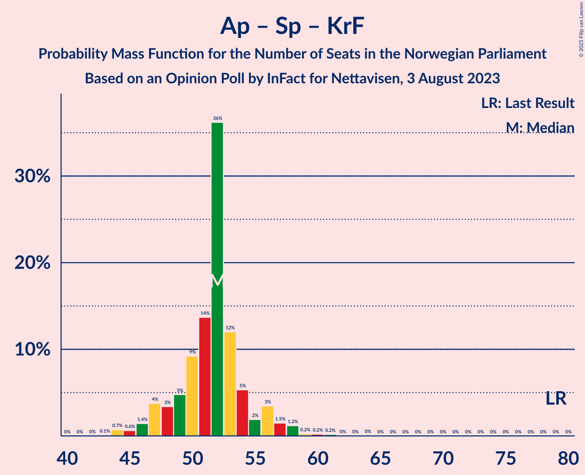

| Number of Seats | Probability | Accumulated | Special Marks |
|:---------------:|:-----------:|:-----------:|:-------------:|
| 43 | 0.1% | 100% |  |
| 44 | 0.7% | 99.9% |  |
| 45 | 0.6% | 99.2% |  |
| 46 | 1.4% | 98.5% |  |
| 47 | 4% | 97% |  |
| 48 | 3% | 93% |  |
| 49 | 5% | 90% |  |
| 50 | 9% | 85% |  |
| 51 | 14% | 76% | Median |
| 52 | 36% | 62% |  |
| 53 | 12% | 26% |  |
| 54 | 5% | 14% |  |
| 55 | 2% | 9% |  |
| 56 | 3% | 7% |  |
| 57 | 1.5% | 3% |  |
| 58 | 1.2% | 2% |  |
| 59 | 0.2% | 0.7% |  |
| 60 | 0.2% | 0.5% |  |
| 61 | 0.2% | 0.3% |  |
| 62 | 0% | 0.1% |  |
| 63 | 0% | 0.1% |  |
| 64 | 0% | 0% |  |
| 65 | 0% | 0% |  |
| 66 | 0% | 0% |  |
| 67 | 0% | 0% |  |
| 68 | 0% | 0% |  |
| 69 | 0% | 0% |  |
| 70 | 0% | 0% |  |
| 71 | 0% | 0% |  |
| 72 | 0% | 0% |  |
| 73 | 0% | 0% |  |
| 74 | 0% | 0% |  |
| 75 | 0% | 0% |  |
| 76 | 0% | 0% |  |
| 77 | 0% | 0% |  |
| 78 | 0% | 0% |  |
| 79 | 0% | 0% | Last Result |

### Arbeiderpartiet – Sosialistisk Venstreparti

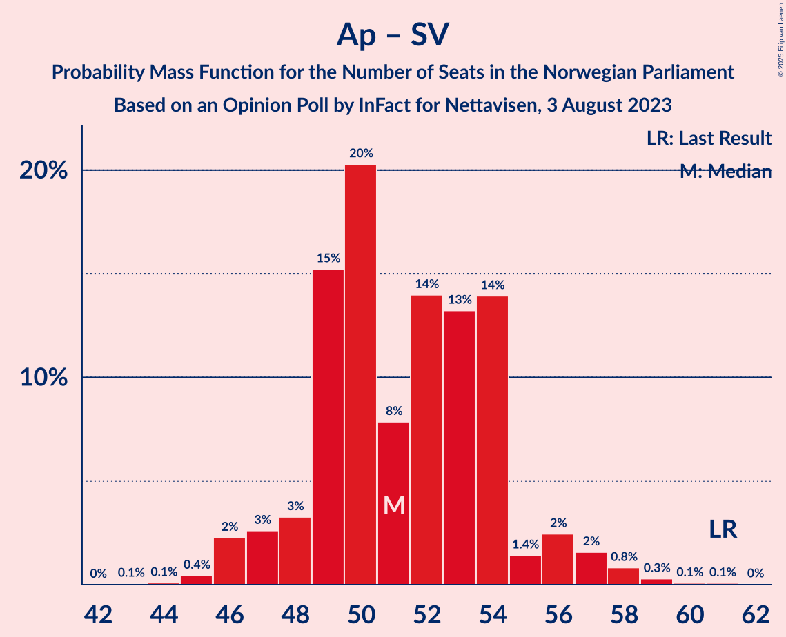

| Number of Seats | Probability | Accumulated | Special Marks |
|:---------------:|:-----------:|:-----------:|:-------------:|
| 43 | 0.1% | 100% |  |
| 44 | 0.1% | 99.9% |  |
| 45 | 0.4% | 99.8% |  |
| 46 | 2% | 99.4% |  |
| 47 | 3% | 97% |  |
| 48 | 3% | 95% |  |
| 49 | 15% | 91% |  |
| 50 | 20% | 76% |  |
| 51 | 8% | 56% | Median |
| 52 | 14% | 48% |  |
| 53 | 13% | 34% |  |
| 54 | 14% | 21% |  |
| 55 | 1.4% | 7% |  |
| 56 | 2% | 5% |  |
| 57 | 2% | 3% |  |
| 58 | 0.8% | 1.3% |  |
| 59 | 0.3% | 0.5% |  |
| 60 | 0.1% | 0.2% |  |
| 61 | 0.1% | 0.1% | Last Result |
| 62 | 0% | 0% |  |

### Arbeiderpartiet – Senterpartiet

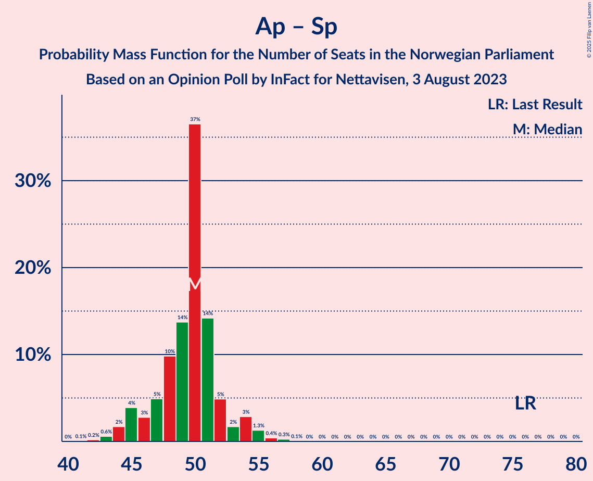

| Number of Seats | Probability | Accumulated | Special Marks |
|:---------------:|:-----------:|:-----------:|:-------------:|
| 41 | 0.1% | 100% |  |
| 42 | 0.2% | 99.9% |  |
| 43 | 0.6% | 99.7% |  |
| 44 | 2% | 99.1% |  |
| 45 | 4% | 97% |  |
| 46 | 3% | 94% |  |
| 47 | 5% | 91% |  |
| 48 | 10% | 86% |  |
| 49 | 14% | 76% | Median |
| 50 | 37% | 62% |  |
| 51 | 14% | 26% |  |
| 52 | 5% | 12% |  |
| 53 | 2% | 7% |  |
| 54 | 3% | 5% |  |
| 55 | 1.3% | 2% |  |
| 56 | 0.4% | 0.8% |  |
| 57 | 0.3% | 0.3% |  |
| 58 | 0.1% | 0.1% |  |
| 59 | 0% | 0% |  |
| 60 | 0% | 0% |  |
| 61 | 0% | 0% |  |
| 62 | 0% | 0% |  |
| 63 | 0% | 0% |  |
| 64 | 0% | 0% |  |
| 65 | 0% | 0% |  |
| 66 | 0% | 0% |  |
| 67 | 0% | 0% |  |
| 68 | 0% | 0% |  |
| 69 | 0% | 0% |  |
| 70 | 0% | 0% |  |
| 71 | 0% | 0% |  |
| 72 | 0% | 0% |  |
| 73 | 0% | 0% |  |
| 74 | 0% | 0% |  |
| 75 | 0% | 0% |  |
| 76 | 0% | 0% | Last Result |

### Senterpartiet – Venstre – Kristelig Folkeparti

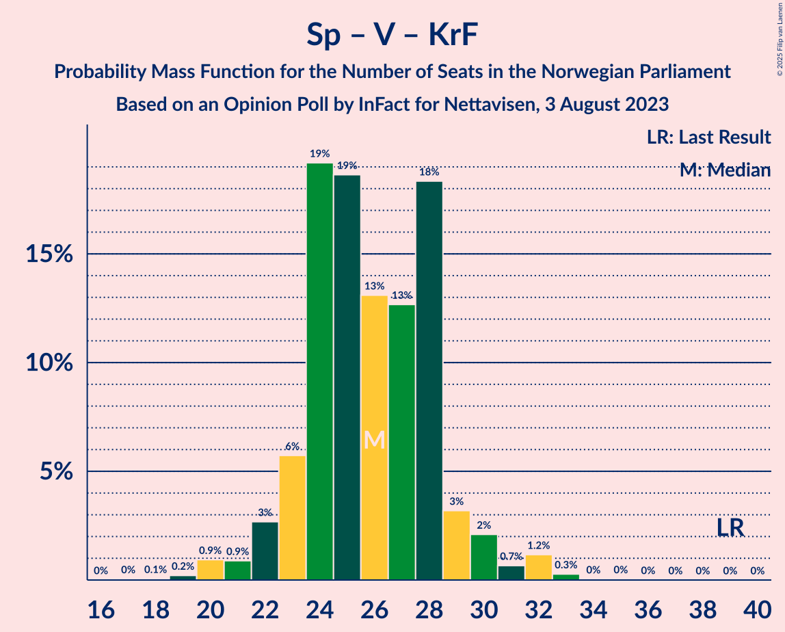

| Number of Seats | Probability | Accumulated | Special Marks |
|:---------------:|:-----------:|:-----------:|:-------------:|
| 17 | 0% | 100% |  |
| 18 | 0.1% | 99.9% |  |
| 19 | 0.2% | 99.9% |  |
| 20 | 0.9% | 99.7% |  |
| 21 | 0.9% | 98.7% |  |
| 22 | 3% | 98% |  |
| 23 | 6% | 95% |  |
| 24 | 19% | 89% |  |
| 25 | 19% | 70% | Median |
| 26 | 13% | 52% |  |
| 27 | 13% | 39% |  |
| 28 | 18% | 26% |  |
| 29 | 3% | 7% |  |
| 30 | 2% | 4% |  |
| 31 | 0.7% | 2% |  |
| 32 | 1.2% | 2% |  |
| 33 | 0.3% | 0.4% |  |
| 34 | 0% | 0.1% |  |
| 35 | 0% | 0.1% |  |
| 36 | 0% | 0% |  |
| 37 | 0% | 0% |  |
| 38 | 0% | 0% |  |
| 39 | 0% | 0% | Last Result |

## Technical Information

### Opinion Poll

+ **Polling firm:** InFact
+ **Commissioner(s):** Nettavisen
+ **Fieldwork period:** 3 August 2023

### Calculations

+ **Sample size:** 1039
+ **Simulations done:** 1,048,576
+ **Error estimate:** 1.36%

