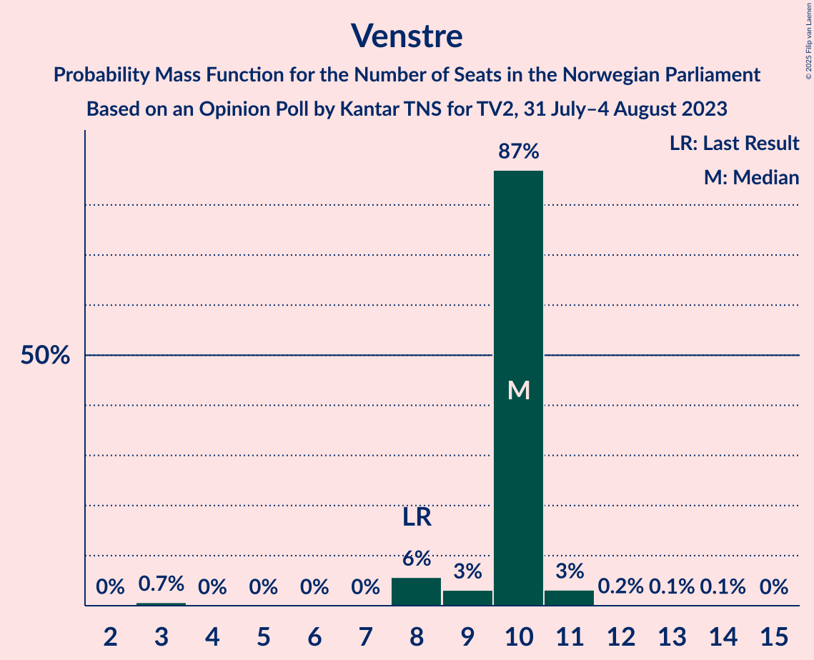

# Opinion Poll by Kantar TNS for TV2, 31 July–4 August 2023

<a href="#voting-intentions">Voting Intentions</a> | <a href="#seats">Seats</a> | <a href="#coalitions">Coalitions</a> | <a href="#technical-information">Technical Information</a>

## Voting Intentions

### Confidence Intervals

| Party | Last Result | Poll Result | 80% Confidence Interval | 90% Confidence Interval | 95% Confidence Interval | 99% Confidence Interval |
|:-----:|:-----------:|:-----------:|:-----------------------:|:-----------------------:|:-----------------------:|:-----------------------:|
| Høyre | 20.4% | 31.5% | 29.7–33.5% |29.2–34.0% |28.7–34.5% |27.8–35.5% |
| Arbeiderpartiet | 26.2% | 17.8% | 16.4–19.5% |15.9–20.0% |15.6–20.4% |14.9–21.2% |
| Fremskrittspartiet | 11.6% | 12.4% | 11.1–13.8% |10.8–14.2% |10.5–14.6% |9.9–15.3% |
| Sosialistisk Venstreparti | 7.6% | 9.0% | 7.9–10.3% |7.7–10.7% |7.4–11.0% |6.9–11.6% |
| Senterpartiet | 13.5% | 7.5% | 6.5–8.7% |6.2–9.0% |6.0–9.3% |5.6–9.9% |
| Venstre | 4.6% | 5.2% | 4.4–6.2% |4.1–6.5% |3.9–6.8% |3.6–7.3% |
| Rødt | 4.7% | 3.8% | 3.1–4.6% |2.9–4.9% |2.7–5.1% |2.4–5.6% |
| Miljøpartiet De Grønne | 3.9% | 3.2% | 2.6–4.1% |2.5–4.3% |2.3–4.6% |2.0–5.0% |
| Industri- og Næringspartiet | 0.3% | 3.0% | 2.4–3.9% |2.3–4.1% |2.1–4.3% |1.9–4.8% |
| Kristelig Folkeparti | 3.8% | 2.5% | 2.0–3.3% |1.8–3.5% |1.7–3.7% |1.5–4.1% |
| Norgesdemokratene | 1.1% | 1.7% | 1.3–2.4% |1.2–2.6% |1.1–2.7% |0.9–3.1% |
| Konservativt | 0.4% | 1.2% | 0.9–1.8% |0.8–2.0% |0.7–2.1% |0.6–2.4% |
| Liberalistene | 0.2% | 0.2% | 0.1–0.5% |0.1–0.6% |0.1–0.7% |0.0–0.9% |
| Kystpartiet | 0.0% | 0.1% | 0.0–0.4% |0.0–0.5% |0.0–0.6% |0.0–0.8% |

*Note:* The poll result column reflects the actual value used in the calculations. Published results may vary slightly, and in addition be rounded to fewer digits.

## Seats

### Confidence Intervals

| Party | Last Result | Median | 80% Confidence Interval | 90% Confidence Interval | 95% Confidence Interval | 99% Confidence Interval |
|:-----:|:-----------:|:------:|:-----------------------:|:-----------------------:|:-----------------------:|:-----------------------:|
| <a href="#høyre">Høyre</a> | 36 | 59 | 56–59 |56–59 |56–60 |53–63 |
| <a href="#arbeiderpartiet">Arbeiderpartiet</a> | 48 | 38 | 33–38 |33–40 |33–40 |32–43 |
| <a href="#fremskrittspartiet">Fremskrittspartiet</a> | 21 | 22 | 22 |21–23 |21–25 |21–26 |
| <a href="#sosialistisk-venstreparti">Sosialistisk Venstreparti</a> | 13 | 21 | 17–21 |14–21 |14–21 |14–21 |
| <a href="#senterpartiet">Senterpartiet</a> | 28 | 13 | 13–14 |13–14 |13–17 |12–19 |
| <a href="#venstre">Venstre</a> | 8 | 10 | 10 |8–10 |8–11 |3–11 |
| <a href="#rødt">Rødt</a> | 8 | 1 | 1–8 |1–8 |1–8 |1–9 |
| <a href="#miljøpartiet-de-grønne">Miljøpartiet De Grønne</a> | 3 | 1 | 1–3 |1–3 |1–3 |1–8 |
| <a href="#industri--og-næringspartiet">Industri- og Næringspartiet</a> | 0 | 2 | 2–3 |2–3 |2–3 |0–8 |
| <a href="#kristelig-folkeparti">Kristelig Folkeparti</a> | 3 | 1 | 1–2 |1–2 |1–2 |0–2 |
| <a href="#norgesdemokratene">Norgesdemokratene</a> | 0 | 0 | 0 |0 |0 |0 |
| <a href="#konservativt">Konservativt</a> | 0 | 0 | 0 |0 |0 |0 |
| <a href="#liberalistene">Liberalistene</a> | 0 | 0 | 0 |0 |0 |0 |
| <a href="#kystpartiet">Kystpartiet</a> | 0 | 0 | 0 |0 |0 |0 |

### Høyre

*For a full overview of the results for this party, see the [Høyre](party-høyre.html) page.*

| Number of Seats | Probability | Accumulated | Special Marks |
|:---------------:|:-----------:|:-----------:|:-------------:|
| 36 | 0% | 100% | Last Result |
| 37 | 0% | 100% |  |
| 38 | 0% | 100% |  |
| 39 | 0% | 100% |  |
| 40 | 0% | 100% |  |
| 41 | 0% | 100% |  |
| 42 | 0% | 100% |  |
| 43 | 0% | 100% |  |
| 44 | 0% | 100% |  |
| 45 | 0% | 100% |  |
| 46 | 0% | 100% |  |
| 47 | 0% | 100% |  |
| 48 | 0% | 100% |  |
| 49 | 0% | 100% |  |
| 50 | 0% | 100% |  |
| 51 | 0% | 100% |  |
| 52 | 0% | 99.9% |  |
| 53 | 0.8% | 99.9% |  |
| 54 | 0.1% | 99.2% |  |
| 55 | 0.1% | 99.1% |  |
| 56 | 16% | 99.0% |  |
| 57 | 2% | 83% |  |
| 58 | 6% | 81% |  |
| 59 | 71% | 75% | Median |
| 60 | 3% | 5% |  |
| 61 | 0.1% | 1.2% |  |
| 62 | 0.2% | 1.1% |  |
| 63 | 0.6% | 1.0% |  |
| 64 | 0.3% | 0.3% |  |
| 65 | 0% | 0.1% |  |
| 66 | 0% | 0.1% |  |
| 67 | 0.1% | 0.1% |  |
| 68 | 0% | 0% |  |

### Arbeiderpartiet

*For a full overview of the results for this party, see the [Arbeiderpartiet](party-arbeiderpartiet.html) page.*

| Number of Seats | Probability | Accumulated | Special Marks |
|:---------------:|:-----------:|:-----------:|:-------------:|
| 28 | 0.1% | 100% |  |
| 29 | 0% | 99.9% |  |
| 30 | 0% | 99.9% |  |
| 31 | 0% | 99.9% |  |
| 32 | 1.1% | 99.9% |  |
| 33 | 19% | 98.8% |  |
| 34 | 0.6% | 80% |  |
| 35 | 0.5% | 79% |  |
| 36 | 1.5% | 79% |  |
| 37 | 0.4% | 77% |  |
| 38 | 71% | 77% | Median |
| 39 | 0% | 6% |  |
| 40 | 6% | 6% |  |
| 41 | 0% | 0.5% |  |
| 42 | 0% | 0.5% |  |
| 43 | 0.5% | 0.5% |  |
| 44 | 0% | 0% |  |
| 45 | 0% | 0% |  |
| 46 | 0% | 0% |  |
| 47 | 0% | 0% |  |
| 48 | 0% | 0% | Last Result |

### Fremskrittspartiet

*For a full overview of the results for this party, see the [Fremskrittspartiet](party-fremskrittspartiet.html) page.*

| Number of Seats | Probability | Accumulated | Special Marks |
|:---------------:|:-----------:|:-----------:|:-------------:|
| 18 | 0.1% | 100% |  |
| 19 | 0% | 99.8% |  |
| 20 | 0.3% | 99.8% |  |
| 21 | 6% | 99.5% | Last Result |
| 22 | 87% | 94% | Median |
| 23 | 4% | 7% |  |
| 24 | 0.1% | 3% |  |
| 25 | 2% | 3% |  |
| 26 | 0.6% | 0.9% |  |
| 27 | 0.1% | 0.4% |  |
| 28 | 0.1% | 0.2% |  |
| 29 | 0% | 0.1% |  |
| 30 | 0% | 0.1% |  |
| 31 | 0% | 0% |  |

### Sosialistisk Venstreparti

*For a full overview of the results for this party, see the [Sosialistisk Venstreparti](party-sosialistiskvenstreparti.html) page.*

| Number of Seats | Probability | Accumulated | Special Marks |
|:---------------:|:-----------:|:-----------:|:-------------:|
| 11 | 0.1% | 100% |  |
| 12 | 0.1% | 99.9% |  |
| 13 | 0.1% | 99.9% | Last Result |
| 14 | 6% | 99.8% |  |
| 15 | 0.5% | 94% |  |
| 16 | 0.8% | 94% |  |
| 17 | 20% | 93% |  |
| 18 | 1.0% | 74% |  |
| 19 | 0.3% | 73% |  |
| 20 | 2% | 72% |  |
| 21 | 71% | 71% | Median |
| 22 | 0% | 0.1% |  |
| 23 | 0.1% | 0.1% |  |
| 24 | 0% | 0% |  |

### Senterpartiet

*For a full overview of the results for this party, see the [Senterpartiet](party-senterpartiet.html) page.*

| Number of Seats | Probability | Accumulated | Special Marks |
|:---------------:|:-----------:|:-----------:|:-------------:|
| 11 | 0.1% | 100% |  |
| 12 | 0.6% | 99.8% |  |
| 13 | 76% | 99.3% | Median |
| 14 | 18% | 23% |  |
| 15 | 0.8% | 5% |  |
| 16 | 0.6% | 4% |  |
| 17 | 3% | 4% |  |
| 18 | 0.1% | 0.7% |  |
| 19 | 0.5% | 0.6% |  |
| 20 | 0.1% | 0.1% |  |
| 21 | 0% | 0% |  |
| 22 | 0% | 0% |  |
| 23 | 0% | 0% |  |
| 24 | 0% | 0% |  |
| 25 | 0% | 0% |  |
| 26 | 0% | 0% |  |
| 27 | 0% | 0% |  |
| 28 | 0% | 0% | Last Result |

### Venstre

*For a full overview of the results for this party, see the [Venstre](party-venstre.html) page.*

| Number of Seats | Probability | Accumulated | Special Marks |
|:---------------:|:-----------:|:-----------:|:-------------:|
| 3 | 0.7% | 100% |  |
| 4 | 0% | 99.3% |  |
| 5 | 0% | 99.3% |  |
| 6 | 0% | 99.3% |  |
| 7 | 0% | 99.3% |  |
| 8 | 6% | 99.3% | Last Result |
| 9 | 3% | 94% |  |
| 10 | 87% | 90% | Median |
| 11 | 3% | 4% |  |
| 12 | 0.2% | 0.3% |  |
| 13 | 0.1% | 0.2% |  |
| 14 | 0.1% | 0.1% |  |
| 15 | 0% | 0% |  |

### Rødt

*For a full overview of the results for this party, see the [Rødt](party-rødt.html) page.*

| Number of Seats | Probability | Accumulated | Special Marks |
|:---------------:|:-----------:|:-----------:|:-------------:|
| 1 | 77% | 100% | Median |
| 2 | 0% | 23% |  |
| 3 | 0% | 23% |  |
| 4 | 0% | 23% |  |
| 5 | 0% | 23% |  |
| 6 | 0% | 23% |  |
| 7 | 6% | 23% |  |
| 8 | 16% | 17% | Last Result |
| 9 | 0.8% | 0.9% |  |
| 10 | 0% | 0.1% |  |
| 11 | 0% | 0% |  |

### Miljøpartiet De Grønne

*For a full overview of the results for this party, see the [Miljøpartiet De Grønne](party-miljøpartietdegrønne.html) page.*

| Number of Seats | Probability | Accumulated | Special Marks |
|:---------------:|:-----------:|:-----------:|:-------------:|
| 1 | 72% | 100% | Median |
| 2 | 6% | 28% |  |
| 3 | 21% | 22% | Last Result |
| 4 | 0% | 0.7% |  |
| 5 | 0% | 0.7% |  |
| 6 | 0% | 0.7% |  |
| 7 | 0.1% | 0.7% |  |
| 8 | 0.5% | 0.5% |  |
| 9 | 0.1% | 0.1% |  |
| 10 | 0% | 0% |  |

### Industri- og Næringspartiet

*For a full overview of the results for this party, see the [Industri- og Næringspartiet](party-industri-ognæringspartiet.html) page.*

| Number of Seats | Probability | Accumulated | Special Marks |
|:---------------:|:-----------:|:-----------:|:-------------:|
| 0 | 0.7% | 100% | Last Result |
| 1 | 1.1% | 99.3% |  |
| 2 | 79% | 98% | Median |
| 3 | 19% | 19% |  |
| 4 | 0% | 0.9% |  |
| 5 | 0% | 0.9% |  |
| 6 | 0% | 0.9% |  |
| 7 | 0.1% | 0.9% |  |
| 8 | 0.8% | 0.8% |  |
| 9 | 0% | 0% |  |

### Kristelig Folkeparti

*For a full overview of the results for this party, see the [Kristelig Folkeparti](party-kristeligfolkeparti.html) page.*

| Number of Seats | Probability | Accumulated | Special Marks |
|:---------------:|:-----------:|:-----------:|:-------------:|
| 0 | 1.3% | 100% |  |
| 1 | 74% | 98.7% | Median |
| 2 | 25% | 25% |  |
| 3 | 0.1% | 0.2% | Last Result |
| 4 | 0% | 0.2% |  |
| 5 | 0% | 0.2% |  |
| 6 | 0% | 0.2% |  |
| 7 | 0.1% | 0.1% |  |
| 8 | 0% | 0% |  |

### Norgesdemokratene

*For a full overview of the results for this party, see the [Norgesdemokratene](party-norgesdemokratene.html) page.*

| Number of Seats | Probability | Accumulated | Special Marks |
|:---------------:|:-----------:|:-----------:|:-------------:|
| 0 | 100% | 100% | Last Result, Median |

### Konservativt

*For a full overview of the results for this party, see the [Konservativt](party-konservativt.html) page.*

| Number of Seats | Probability | Accumulated | Special Marks |
|:---------------:|:-----------:|:-----------:|:-------------:|
| 0 | 100% | 100% | Last Result, Median |

### Liberalistene

*For a full overview of the results for this party, see the [Liberalistene](party-liberalistene.html) page.*

| Number of Seats | Probability | Accumulated | Special Marks |
|:---------------:|:-----------:|:-----------:|:-------------:|
| 0 | 100% | 100% | Last Result, Median |

### Kystpartiet

*For a full overview of the results for this party, see the [Kystpartiet](party-kystpartiet.html) page.*

| Number of Seats | Probability | Accumulated | Special Marks |
|:---------------:|:-----------:|:-----------:|:-------------:|
| 0 | 99.8% | 100% | Last Result, Median |
| 1 | 0.2% | 0.2% |  |
| 2 | 0% | 0% |  |

## Coalitions

### Confidence Intervals

| Coalition | Last Result | Median | Majority? | 80% Confidence Interval | 90% Confidence Interval | 95% Confidence Interval | 99% Confidence Interval |
|:---------:|:-----------:|:------:|:---------:|:-----------------------:|:-----------------------:|:-----------------------:|:-----------------------:|
| Høyre – Fremskrittspartiet – Senterpartiet – Venstre – Kristelig Folkeparti | 96 | 105 | 100% | 104–105 | 102–107 | 102–112 | 101–112 |
| Høyre – Fremskrittspartiet – Venstre – Miljøpartiet De Grønne – Kristelig Folkeparti | 71 | 93 | 100% | 93 | 92–95 | 92–97 | 91–98 |
| Høyre – Fremskrittspartiet – Venstre – Kristelig Folkeparti | 68 | 92 | 99.9% | 90–92 | 89–93 | 89–95 | 87–96 |
| Høyre – Fremskrittspartiet – Venstre | 65 | 91 | 99.8% | 88–91 | 87–91 | 87–94 | 87–95 |
| Høyre – Fremskrittspartiet | 57 | 81 | 1.2% | 78–81 | 78–82 | 78–83 | 77–85 |
| Arbeiderpartiet – Sosialistisk Venstreparti – Senterpartiet – Rødt – Miljøpartiet De Grønne | 100 | 74 | 0% | 74–75 | 73–77 | 70–77 | 69–78 |
| Arbeiderpartiet – Sosialistisk Venstreparti – Senterpartiet – Miljøpartiet De Grønne – Kristelig Folkeparti | 95 | 74 | 0% | 69–74 | 69–74 | 69–74 | 65–78 |
| Arbeiderpartiet – Sosialistisk Venstreparti – Senterpartiet – Rødt | 97 | 73 | 0% | 72–73 | 71–74 | 68–74 | 66–75 |
| Arbeiderpartiet – Sosialistisk Venstreparti – Senterpartiet – Miljøpartiet De Grønne | 92 | 73 | 0% | 67–73 | 67–73 | 67–73 | 65–76 |
| Høyre – Venstre – Kristelig Folkeparti | 47 | 70 | 0% | 68–70 | 68–70 | 68–72 | 64–73 |
| Arbeiderpartiet – Sosialistisk Venstreparti – Senterpartiet | 89 | 72 | 0% | 64–72 | 64–72 | 64–72 | 62–74 |
| Arbeiderpartiet – Sosialistisk Venstreparti – Rødt – Miljøpartiet De Grønne | 72 | 61 | 0% | 61 | 59–64 | 53–64 | 53–64 |
| Arbeiderpartiet – Sosialistisk Venstreparti | 61 | 59 | 0% | 50–59 | 50–59 | 50–59 | 49–59 |
| Arbeiderpartiet – Senterpartiet – Miljøpartiet De Grønne – Kristelig Folkeparti | 82 | 53 | 0% | 52–53 | 52–58 | 52–58 | 50–61 |
| Arbeiderpartiet – Senterpartiet – Kristelig Folkeparti | 79 | 52 | 0% | 49–52 | 49–55 | 49–55 | 47–59 |
| Arbeiderpartiet – Senterpartiet | 76 | 51 | 0% | 47–51 | 47–53 | 47–53 | 46–57 |
| Senterpartiet – Venstre – Kristelig Folkeparti | 39 | 24 | 0% | 24–26 | 23–26 | 23–29 | 19–29 |

### Høyre – Fremskrittspartiet – Senterpartiet – Venstre – Kristelig Folkeparti

| Number of Seats | Probability | Accumulated | Special Marks |
|:---------------:|:-----------:|:-----------:|:-------------:|
| 96 | 0% | 100% | Last Result |
| 97 | 0% | 100% |  |
| 98 | 0.1% | 100% |  |
| 99 | 0% | 99.9% |  |
| 100 | 0.3% | 99.8% |  |
| 101 | 0.1% | 99.5% |  |
| 102 | 5% | 99.4% |  |
| 103 | 0.1% | 94% |  |
| 104 | 16% | 94% |  |
| 105 | 71% | 78% | Median |
| 106 | 0.7% | 7% |  |
| 107 | 1.3% | 6% |  |
| 108 | 0.6% | 5% |  |
| 109 | 0.2% | 4% |  |
| 110 | 0.1% | 4% |  |
| 111 | 0.5% | 4% |  |
| 112 | 3% | 3% |  |
| 113 | 0% | 0.2% |  |
| 114 | 0% | 0.2% |  |
| 115 | 0.1% | 0.1% |  |
| 116 | 0.1% | 0.1% |  |
| 117 | 0% | 0% |  |

### Høyre – Fremskrittspartiet – Venstre – Miljøpartiet De Grønne – Kristelig Folkeparti

| Number of Seats | Probability | Accumulated | Special Marks |
|:---------------:|:-----------:|:-----------:|:-------------:|
| 71 | 0% | 100% | Last Result |
| 72 | 0% | 100% |  |
| 73 | 0% | 100% |  |
| 74 | 0% | 100% |  |
| 75 | 0% | 100% |  |
| 76 | 0% | 100% |  |
| 77 | 0% | 100% |  |
| 78 | 0% | 100% |  |
| 79 | 0% | 100% |  |
| 80 | 0% | 100% |  |
| 81 | 0% | 100% |  |
| 82 | 0% | 100% |  |
| 83 | 0% | 100% |  |
| 84 | 0% | 100% |  |
| 85 | 0.1% | 100% | Majority |
| 86 | 0% | 99.9% |  |
| 87 | 0% | 99.9% |  |
| 88 | 0% | 99.9% |  |
| 89 | 0% | 99.9% |  |
| 90 | 0.1% | 99.9% |  |
| 91 | 0.5% | 99.8% |  |
| 92 | 6% | 99.3% |  |
| 93 | 86% | 93% | Median |
| 94 | 0.7% | 7% |  |
| 95 | 1.5% | 6% |  |
| 96 | 0.3% | 4% |  |
| 97 | 3% | 4% |  |
| 98 | 0.2% | 0.7% |  |
| 99 | 0.1% | 0.4% |  |
| 100 | 0.1% | 0.3% |  |
| 101 | 0.2% | 0.3% |  |
| 102 | 0% | 0.1% |  |
| 103 | 0% | 0.1% |  |
| 104 | 0.1% | 0.1% |  |
| 105 | 0% | 0% |  |

### Høyre – Fremskrittspartiet – Venstre – Kristelig Folkeparti

| Number of Seats | Probability | Accumulated | Special Marks |
|:---------------:|:-----------:|:-----------:|:-------------:|
| 68 | 0% | 100% | Last Result |
| 69 | 0% | 100% |  |
| 70 | 0% | 100% |  |
| 71 | 0% | 100% |  |
| 72 | 0% | 100% |  |
| 73 | 0% | 100% |  |
| 74 | 0% | 100% |  |
| 75 | 0% | 100% |  |
| 76 | 0% | 100% |  |
| 77 | 0% | 100% |  |
| 78 | 0% | 100% |  |
| 79 | 0% | 100% |  |
| 80 | 0% | 100% |  |
| 81 | 0% | 100% |  |
| 82 | 0% | 100% |  |
| 83 | 0% | 100% |  |
| 84 | 0.1% | 100% |  |
| 85 | 0% | 99.9% | Majority |
| 86 | 0.1% | 99.9% |  |
| 87 | 0.3% | 99.8% |  |
| 88 | 0% | 99.5% |  |
| 89 | 6% | 99.4% |  |
| 90 | 16% | 93% |  |
| 91 | 0.7% | 77% |  |
| 92 | 71% | 77% | Median |
| 93 | 1.3% | 5% |  |
| 94 | 0.4% | 4% |  |
| 95 | 3% | 4% |  |
| 96 | 0.4% | 0.7% |  |
| 97 | 0.1% | 0.3% |  |
| 98 | 0% | 0.2% |  |
| 99 | 0% | 0.2% |  |
| 100 | 0.1% | 0.2% |  |
| 101 | 0% | 0% |  |

### Høyre – Fremskrittspartiet – Venstre

| Number of Seats | Probability | Accumulated | Special Marks |
|:---------------:|:-----------:|:-----------:|:-------------:|
| 65 | 0% | 100% | Last Result |
| 66 | 0% | 100% |  |
| 67 | 0% | 100% |  |
| 68 | 0% | 100% |  |
| 69 | 0% | 100% |  |
| 70 | 0% | 100% |  |
| 71 | 0% | 100% |  |
| 72 | 0% | 100% |  |
| 73 | 0% | 100% |  |
| 74 | 0% | 100% |  |
| 75 | 0% | 100% |  |
| 76 | 0% | 100% |  |
| 77 | 0% | 100% |  |
| 78 | 0% | 100% |  |
| 79 | 0% | 100% |  |
| 80 | 0% | 100% |  |
| 81 | 0% | 100% |  |
| 82 | 0% | 100% |  |
| 83 | 0.1% | 100% |  |
| 84 | 0.1% | 99.9% |  |
| 85 | 0.3% | 99.8% | Majority |
| 86 | 0% | 99.5% |  |
| 87 | 6% | 99.5% |  |
| 88 | 16% | 93% |  |
| 89 | 0.6% | 77% |  |
| 90 | 0.2% | 77% |  |
| 91 | 72% | 76% | Median |
| 92 | 0.9% | 5% |  |
| 93 | 0% | 4% |  |
| 94 | 3% | 4% |  |
| 95 | 0.1% | 0.5% |  |
| 96 | 0.2% | 0.5% |  |
| 97 | 0% | 0.2% |  |
| 98 | 0% | 0.2% |  |
| 99 | 0% | 0.2% |  |
| 100 | 0.1% | 0.2% |  |
| 101 | 0% | 0% |  |

### Høyre – Fremskrittspartiet

| Number of Seats | Probability | Accumulated | Special Marks |
|:---------------:|:-----------:|:-----------:|:-------------:|
| 57 | 0% | 100% | Last Result |
| 58 | 0% | 100% |  |
| 59 | 0% | 100% |  |
| 60 | 0% | 100% |  |
| 61 | 0% | 100% |  |
| 62 | 0% | 100% |  |
| 63 | 0% | 100% |  |
| 64 | 0% | 100% |  |
| 65 | 0% | 100% |  |
| 66 | 0% | 100% |  |
| 67 | 0% | 100% |  |
| 68 | 0% | 100% |  |
| 69 | 0% | 100% |  |
| 70 | 0% | 100% |  |
| 71 | 0% | 100% |  |
| 72 | 0% | 100% |  |
| 73 | 0% | 100% |  |
| 74 | 0% | 100% |  |
| 75 | 0% | 100% |  |
| 76 | 0.3% | 100% |  |
| 77 | 0.2% | 99.6% |  |
| 78 | 16% | 99.5% |  |
| 79 | 6% | 83% |  |
| 80 | 0.7% | 78% |  |
| 81 | 71% | 77% | Median |
| 82 | 2% | 6% |  |
| 83 | 3% | 4% |  |
| 84 | 0.1% | 1.3% |  |
| 85 | 0.9% | 1.2% | Majority |
| 86 | 0.1% | 0.4% |  |
| 87 | 0.1% | 0.3% |  |
| 88 | 0.1% | 0.3% |  |
| 89 | 0.1% | 0.2% |  |
| 90 | 0% | 0.1% |  |
| 91 | 0.1% | 0.1% |  |
| 92 | 0% | 0% |  |

### Arbeiderpartiet – Sosialistisk Venstreparti – Senterpartiet – Rødt – Miljøpartiet De Grønne

| Number of Seats | Probability | Accumulated | Special Marks |
|:---------------:|:-----------:|:-----------:|:-------------:|
| 65 | 0.1% | 100% |  |
| 66 | 0.2% | 99.9% |  |
| 67 | 0.1% | 99.6% |  |
| 68 | 0% | 99.6% |  |
| 69 | 0.5% | 99.5% |  |
| 70 | 3% | 99.1% |  |
| 71 | 0.1% | 96% |  |
| 72 | 0.3% | 96% |  |
| 73 | 1.3% | 96% |  |
| 74 | 71% | 94% | Median |
| 75 | 16% | 23% |  |
| 76 | 0.2% | 7% |  |
| 77 | 6% | 7% |  |
| 78 | 0.1% | 0.5% |  |
| 79 | 0.1% | 0.4% |  |
| 80 | 0.2% | 0.3% |  |
| 81 | 0% | 0.1% |  |
| 82 | 0% | 0% |  |
| 83 | 0% | 0% |  |
| 84 | 0% | 0% |  |
| 85 | 0% | 0% | Majority |
| 86 | 0% | 0% |  |
| 87 | 0% | 0% |  |
| 88 | 0% | 0% |  |
| 89 | 0% | 0% |  |
| 90 | 0% | 0% |  |
| 91 | 0% | 0% |  |
| 92 | 0% | 0% |  |
| 93 | 0% | 0% |  |
| 94 | 0% | 0% |  |
| 95 | 0% | 0% |  |
| 96 | 0% | 0% |  |
| 97 | 0% | 0% |  |
| 98 | 0% | 0% |  |
| 99 | 0% | 0% |  |
| 100 | 0% | 0% | Last Result |

### Arbeiderpartiet – Sosialistisk Venstreparti – Senterpartiet – Miljøpartiet De Grønne – Kristelig Folkeparti

| Number of Seats | Probability | Accumulated | Special Marks |
|:---------------:|:-----------:|:-----------:|:-------------:|
| 63 | 0.1% | 100% |  |
| 64 | 0.2% | 99.9% |  |
| 65 | 0.3% | 99.7% |  |
| 66 | 0.1% | 99.4% |  |
| 67 | 0% | 99.4% |  |
| 68 | 0.1% | 99.3% |  |
| 69 | 16% | 99.2% |  |
| 70 | 4% | 83% |  |
| 71 | 0.3% | 80% |  |
| 72 | 6% | 79% |  |
| 73 | 0.8% | 74% |  |
| 74 | 72% | 73% | Median |
| 75 | 0.3% | 1.1% |  |
| 76 | 0% | 0.8% |  |
| 77 | 0.1% | 0.7% |  |
| 78 | 0.6% | 0.6% |  |
| 79 | 0.1% | 0.1% |  |
| 80 | 0% | 0% |  |
| 81 | 0% | 0% |  |
| 82 | 0% | 0% |  |
| 83 | 0% | 0% |  |
| 84 | 0% | 0% |  |
| 85 | 0% | 0% | Majority |
| 86 | 0% | 0% |  |
| 87 | 0% | 0% |  |
| 88 | 0% | 0% |  |
| 89 | 0% | 0% |  |
| 90 | 0% | 0% |  |
| 91 | 0% | 0% |  |
| 92 | 0% | 0% |  |
| 93 | 0% | 0% |  |
| 94 | 0% | 0% |  |
| 95 | 0% | 0% | Last Result |

### Arbeiderpartiet – Sosialistisk Venstreparti – Senterpartiet – Rødt

| Number of Seats | Probability | Accumulated | Special Marks |
|:---------------:|:-----------:|:-----------:|:-------------:|
| 63 | 0.1% | 100% |  |
| 64 | 0.1% | 99.8% |  |
| 65 | 0.2% | 99.7% |  |
| 66 | 0.1% | 99.5% |  |
| 67 | 0.1% | 99.4% |  |
| 68 | 3% | 99.4% |  |
| 69 | 0.2% | 96% |  |
| 70 | 0.4% | 96% |  |
| 71 | 2% | 95% |  |
| 72 | 16% | 94% |  |
| 73 | 71% | 77% | Median |
| 74 | 6% | 7% |  |
| 75 | 1.0% | 1.2% |  |
| 76 | 0% | 0.1% |  |
| 77 | 0.1% | 0.1% |  |
| 78 | 0% | 0% |  |
| 79 | 0% | 0% |  |
| 80 | 0% | 0% |  |
| 81 | 0% | 0% |  |
| 82 | 0% | 0% |  |
| 83 | 0% | 0% |  |
| 84 | 0% | 0% |  |
| 85 | 0% | 0% | Majority |
| 86 | 0% | 0% |  |
| 87 | 0% | 0% |  |
| 88 | 0% | 0% |  |
| 89 | 0% | 0% |  |
| 90 | 0% | 0% |  |
| 91 | 0% | 0% |  |
| 92 | 0% | 0% |  |
| 93 | 0% | 0% |  |
| 94 | 0% | 0% |  |
| 95 | 0% | 0% |  |
| 96 | 0% | 0% |  |
| 97 | 0% | 0% | Last Result |

### Arbeiderpartiet – Sosialistisk Venstreparti – Senterpartiet – Miljøpartiet De Grønne

| Number of Seats | Probability | Accumulated | Special Marks |
|:---------------:|:-----------:|:-----------:|:-------------:|
| 62 | 0.2% | 100% |  |
| 63 | 0.1% | 99.8% |  |
| 64 | 0.2% | 99.7% |  |
| 65 | 0.3% | 99.6% |  |
| 66 | 0.1% | 99.2% |  |
| 67 | 16% | 99.1% |  |
| 68 | 1.1% | 83% |  |
| 69 | 3% | 82% |  |
| 70 | 5% | 79% |  |
| 71 | 0.5% | 74% |  |
| 72 | 1.3% | 73% |  |
| 73 | 71% | 72% | Median |
| 74 | 0% | 0.8% |  |
| 75 | 0.1% | 0.7% |  |
| 76 | 0.5% | 0.6% |  |
| 77 | 0.1% | 0.2% |  |
| 78 | 0.1% | 0.1% |  |
| 79 | 0% | 0% |  |
| 80 | 0% | 0% |  |
| 81 | 0% | 0% |  |
| 82 | 0% | 0% |  |
| 83 | 0% | 0% |  |
| 84 | 0% | 0% |  |
| 85 | 0% | 0% | Majority |
| 86 | 0% | 0% |  |
| 87 | 0% | 0% |  |
| 88 | 0% | 0% |  |
| 89 | 0% | 0% |  |
| 90 | 0% | 0% |  |
| 91 | 0% | 0% |  |
| 92 | 0% | 0% | Last Result |

### Høyre – Venstre – Kristelig Folkeparti

| Number of Seats | Probability | Accumulated | Special Marks |
|:---------------:|:-----------:|:-----------:|:-------------:|
| 47 | 0% | 100% | Last Result |
| 48 | 0% | 100% |  |
| 49 | 0% | 100% |  |
| 50 | 0% | 100% |  |
| 51 | 0% | 100% |  |
| 52 | 0% | 100% |  |
| 53 | 0% | 100% |  |
| 54 | 0% | 100% |  |
| 55 | 0% | 100% |  |
| 56 | 0% | 100% |  |
| 57 | 0% | 100% |  |
| 58 | 0% | 100% |  |
| 59 | 0% | 100% |  |
| 60 | 0% | 100% |  |
| 61 | 0.1% | 100% |  |
| 62 | 0% | 99.9% |  |
| 63 | 0.1% | 99.9% |  |
| 64 | 0.8% | 99.8% |  |
| 65 | 0% | 99.0% |  |
| 66 | 0.6% | 99.0% |  |
| 67 | 0.2% | 98% |  |
| 68 | 23% | 98% |  |
| 69 | 0.1% | 75% |  |
| 70 | 71% | 75% | Median |
| 71 | 0.7% | 4% |  |
| 72 | 3% | 4% |  |
| 73 | 0.3% | 0.7% |  |
| 74 | 0% | 0.4% |  |
| 75 | 0.2% | 0.3% |  |
| 76 | 0.1% | 0.1% |  |
| 77 | 0% | 0.1% |  |
| 78 | 0.1% | 0.1% |  |
| 79 | 0% | 0% |  |

### Arbeiderpartiet – Sosialistisk Venstreparti – Senterpartiet

| Number of Seats | Probability | Accumulated | Special Marks |
|:---------------:|:-----------:|:-----------:|:-------------:|
| 57 | 0% | 100% |  |
| 58 | 0% | 99.9% |  |
| 59 | 0% | 99.9% |  |
| 60 | 0% | 99.9% |  |
| 61 | 0.3% | 99.9% |  |
| 62 | 0.2% | 99.6% |  |
| 63 | 0.4% | 99.4% |  |
| 64 | 16% | 99.0% |  |
| 65 | 0.2% | 83% |  |
| 66 | 0.5% | 83% |  |
| 67 | 9% | 82% |  |
| 68 | 0.1% | 74% |  |
| 69 | 0.3% | 74% |  |
| 70 | 2% | 73% |  |
| 71 | 0.5% | 72% |  |
| 72 | 71% | 71% | Median |
| 73 | 0.1% | 0.6% |  |
| 74 | 0.5% | 0.5% |  |
| 75 | 0% | 0.1% |  |
| 76 | 0.1% | 0.1% |  |
| 77 | 0% | 0% |  |
| 78 | 0% | 0% |  |
| 79 | 0% | 0% |  |
| 80 | 0% | 0% |  |
| 81 | 0% | 0% |  |
| 82 | 0% | 0% |  |
| 83 | 0% | 0% |  |
| 84 | 0% | 0% |  |
| 85 | 0% | 0% | Majority |
| 86 | 0% | 0% |  |
| 87 | 0% | 0% |  |
| 88 | 0% | 0% |  |
| 89 | 0% | 0% | Last Result |

### Arbeiderpartiet – Sosialistisk Venstreparti – Rødt – Miljøpartiet De Grønne

| Number of Seats | Probability | Accumulated | Special Marks |
|:---------------:|:-----------:|:-----------:|:-------------:|
| 52 | 0.1% | 100% |  |
| 53 | 3% | 99.8% |  |
| 54 | 0.6% | 97% |  |
| 55 | 0.5% | 96% |  |
| 56 | 0.2% | 96% |  |
| 57 | 0.1% | 96% |  |
| 58 | 0.3% | 95% |  |
| 59 | 1.3% | 95% |  |
| 60 | 0.5% | 94% |  |
| 61 | 87% | 93% | Median |
| 62 | 0.1% | 7% |  |
| 63 | 0.5% | 6% |  |
| 64 | 5% | 6% |  |
| 65 | 0.1% | 0.5% |  |
| 66 | 0% | 0.3% |  |
| 67 | 0.3% | 0.3% |  |
| 68 | 0% | 0% |  |
| 69 | 0% | 0% |  |
| 70 | 0% | 0% |  |
| 71 | 0% | 0% |  |
| 72 | 0% | 0% | Last Result |

### Arbeiderpartiet – Sosialistisk Venstreparti

| Number of Seats | Probability | Accumulated | Special Marks |
|:---------------:|:-----------:|:-----------:|:-------------:|
| 44 | 0.1% | 100% |  |
| 45 | 0% | 99.9% |  |
| 46 | 0% | 99.9% |  |
| 47 | 0.1% | 99.9% |  |
| 48 | 0.1% | 99.8% |  |
| 49 | 0.3% | 99.7% |  |
| 50 | 19% | 99.4% |  |
| 51 | 0.1% | 80% |  |
| 52 | 1.1% | 80% |  |
| 53 | 0.3% | 79% |  |
| 54 | 6% | 78% |  |
| 55 | 0.2% | 73% |  |
| 56 | 2% | 73% |  |
| 57 | 0% | 71% |  |
| 58 | 0% | 71% |  |
| 59 | 71% | 71% | Median |
| 60 | 0.5% | 0.5% |  |
| 61 | 0% | 0% | Last Result |

### Arbeiderpartiet – Senterpartiet – Miljøpartiet De Grønne – Kristelig Folkeparti

| Number of Seats | Probability | Accumulated | Special Marks |
|:---------------:|:-----------:|:-----------:|:-------------:|
| 47 | 0.1% | 100% |  |
| 48 | 0.3% | 99.9% |  |
| 49 | 0.1% | 99.7% |  |
| 50 | 0.3% | 99.5% |  |
| 51 | 0.1% | 99.3% |  |
| 52 | 16% | 99.2% |  |
| 53 | 74% | 83% | Median |
| 54 | 1.3% | 9% |  |
| 55 | 0.2% | 7% |  |
| 56 | 0.1% | 7% |  |
| 57 | 0.7% | 7% |  |
| 58 | 6% | 6% |  |
| 59 | 0.1% | 0.8% |  |
| 60 | 0.1% | 0.7% |  |
| 61 | 0.6% | 0.6% |  |
| 62 | 0% | 0% |  |
| 63 | 0% | 0% |  |
| 64 | 0% | 0% |  |
| 65 | 0% | 0% |  |
| 66 | 0% | 0% |  |
| 67 | 0% | 0% |  |
| 68 | 0% | 0% |  |
| 69 | 0% | 0% |  |
| 70 | 0% | 0% |  |
| 71 | 0% | 0% |  |
| 72 | 0% | 0% |  |
| 73 | 0% | 0% |  |
| 74 | 0% | 0% |  |
| 75 | 0% | 0% |  |
| 76 | 0% | 0% |  |
| 77 | 0% | 0% |  |
| 78 | 0% | 0% |  |
| 79 | 0% | 0% |  |
| 80 | 0% | 0% |  |
| 81 | 0% | 0% |  |
| 82 | 0% | 0% | Last Result |

### Arbeiderpartiet – Senterpartiet – Kristelig Folkeparti

| Number of Seats | Probability | Accumulated | Special Marks |
|:---------------:|:-----------:|:-----------:|:-------------:|
| 43 | 0% | 100% |  |
| 44 | 0% | 99.9% |  |
| 45 | 0% | 99.9% |  |
| 46 | 0.1% | 99.9% |  |
| 47 | 0.3% | 99.8% |  |
| 48 | 0.2% | 99.5% |  |
| 49 | 16% | 99.2% |  |
| 50 | 0.8% | 83% |  |
| 51 | 3% | 82% |  |
| 52 | 72% | 79% | Median |
| 53 | 0.2% | 7% |  |
| 54 | 0.4% | 7% |  |
| 55 | 6% | 6% |  |
| 56 | 0.1% | 0.7% |  |
| 57 | 0% | 0.6% |  |
| 58 | 0% | 0.6% |  |
| 59 | 0.6% | 0.6% |  |
| 60 | 0% | 0% |  |
| 61 | 0% | 0% |  |
| 62 | 0% | 0% |  |
| 63 | 0% | 0% |  |
| 64 | 0% | 0% |  |
| 65 | 0% | 0% |  |
| 66 | 0% | 0% |  |
| 67 | 0% | 0% |  |
| 68 | 0% | 0% |  |
| 69 | 0% | 0% |  |
| 70 | 0% | 0% |  |
| 71 | 0% | 0% |  |
| 72 | 0% | 0% |  |
| 73 | 0% | 0% |  |
| 74 | 0% | 0% |  |
| 75 | 0% | 0% |  |
| 76 | 0% | 0% |  |
| 77 | 0% | 0% |  |
| 78 | 0% | 0% |  |
| 79 | 0% | 0% | Last Result |

### Arbeiderpartiet – Senterpartiet

| Number of Seats | Probability | Accumulated | Special Marks |
|:---------------:|:-----------:|:-----------:|:-------------:|
| 43 | 0% | 100% |  |
| 44 | 0% | 99.9% |  |
| 45 | 0.2% | 99.9% |  |
| 46 | 0.4% | 99.7% |  |
| 47 | 16% | 99.3% |  |
| 48 | 0.7% | 83% |  |
| 49 | 0.2% | 83% |  |
| 50 | 5% | 82% |  |
| 51 | 71% | 78% | Median |
| 52 | 0.5% | 7% |  |
| 53 | 6% | 6% |  |
| 54 | 0% | 0.7% |  |
| 55 | 0% | 0.6% |  |
| 56 | 0% | 0.6% |  |
| 57 | 0.6% | 0.6% |  |
| 58 | 0% | 0% |  |
| 59 | 0% | 0% |  |
| 60 | 0% | 0% |  |
| 61 | 0% | 0% |  |
| 62 | 0% | 0% |  |
| 63 | 0% | 0% |  |
| 64 | 0% | 0% |  |
| 65 | 0% | 0% |  |
| 66 | 0% | 0% |  |
| 67 | 0% | 0% |  |
| 68 | 0% | 0% |  |
| 69 | 0% | 0% |  |
| 70 | 0% | 0% |  |
| 71 | 0% | 0% |  |
| 72 | 0% | 0% |  |
| 73 | 0% | 0% |  |
| 74 | 0% | 0% |  |
| 75 | 0% | 0% |  |
| 76 | 0% | 0% | Last Result |

### Senterpartiet – Venstre – Kristelig Folkeparti

| Number of Seats | Probability | Accumulated | Special Marks |
|:---------------:|:-----------:|:-----------:|:-------------:|
| 18 | 0.1% | 100% |  |
| 19 | 0.5% | 99.9% |  |
| 20 | 0.1% | 99.4% |  |
| 21 | 0.2% | 99.3% |  |
| 22 | 0.2% | 99.2% |  |
| 23 | 6% | 99.0% |  |
| 24 | 71% | 93% | Median |
| 25 | 2% | 22% |  |
| 26 | 16% | 21% |  |
| 27 | 0.7% | 5% |  |
| 28 | 0.2% | 4% |  |
| 29 | 4% | 4% |  |
| 30 | 0.1% | 0.2% |  |
| 31 | 0% | 0.1% |  |
| 32 | 0% | 0% |  |
| 33 | 0% | 0% |  |
| 34 | 0% | 0% |  |
| 35 | 0% | 0% |  |
| 36 | 0% | 0% |  |
| 37 | 0% | 0% |  |
| 38 | 0% | 0% |  |
| 39 | 0% | 0% | Last Result |

## Technical Information

### Opinion Poll

+ **Polling firm:** Kantar TNS
+ **Commissioner(s):** TV2
+ **Fieldwork period:** 31 July–4 August 2023

### Calculations

+ **Sample size:** 986
+ **Simulations done:** 1,048,576
+ **Error estimate:** 2.82%

