# Opinion Poll by Opinion Perduco for ABC Nyheter and Altinget, 1–7 August 2023

<a href="#voting-intentions">Voting Intentions</a> | <a href="#seats">Seats</a> | <a href="#coalitions">Coalitions</a> | <a href="#technical-information">Technical Information</a>

## Voting Intentions

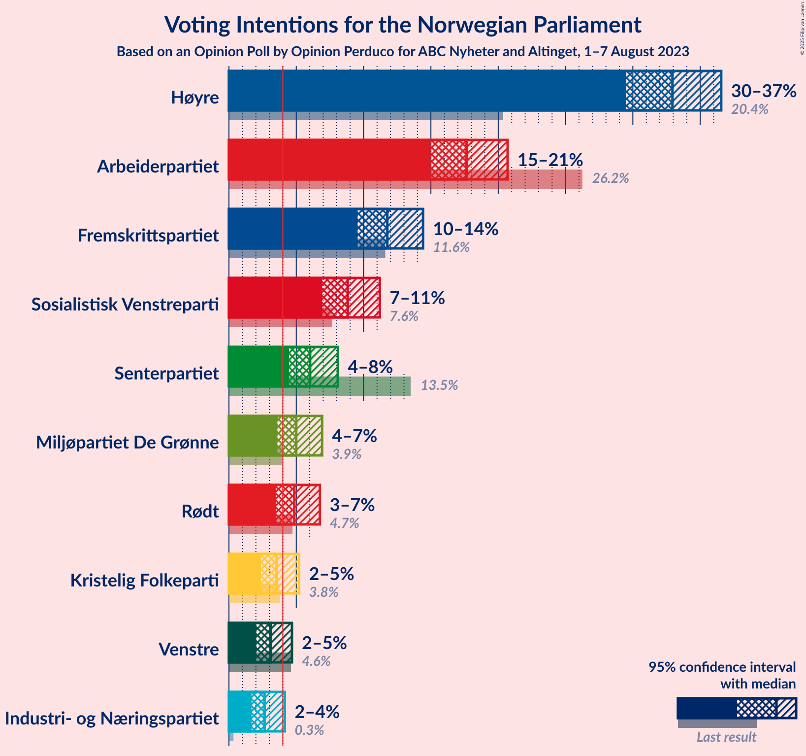

### Confidence Intervals

| Party | Last Result | Poll Result | 80% Confidence Interval | 90% Confidence Interval | 95% Confidence Interval | 99% Confidence Interval |
|:-----:|:-----------:|:-----------:|:-----------------------:|:-----------------------:|:-----------------------:|:-----------------------:|
| Høyre | 20.4% | 32.9% | 30.7–35.3% |30.1–36.0% |29.5–36.6% |28.5–37.7% |
| Arbeiderpartiet | 26.2% | 17.6% | 15.9–19.6% |15.4–20.2% |15.0–20.7% |14.2–21.7% |
| Fremskrittspartiet | 11.6% | 11.8% | 10.3–13.5% |9.9–14.0% |9.6–14.4% |8.9–15.3% |
| Sosialistisk Venstreparti | 7.6% | 8.8% | 7.6–10.4% |7.2–10.8% |6.9–11.2% |6.4–12.0% |
| Senterpartiet | 13.5% | 6.0% | 5.0–7.4% |4.7–7.7% |4.5–8.1% |4.0–8.8% |
| Miljøpartiet De Grønne | 3.9% | 5.0% | 4.1–6.2% |3.8–6.6% |3.6–6.9% |3.2–7.6% |
| Rødt | 4.7% | 4.9% | 3.9–6.1% |3.7–6.4% |3.5–6.8% |3.1–7.4% |
| Kristelig Folkeparti | 3.8% | 3.5% | 2.8–4.6% |2.6–4.9% |2.4–5.2% |2.1–5.8% |
| Venstre | 4.6% | 3.1% | 2.4–4.1% |2.2–4.4% |2.0–4.7% |1.7–5.2% |
| Industri- og Næringspartiet | 0.3% | 2.6% | 2.0–3.6% |1.8–3.9% |1.7–4.1% |1.4–4.7% |

*Note:* The poll result column reflects the actual value used in the calculations. Published results may vary slightly, and in addition be rounded to fewer digits.

## Seats

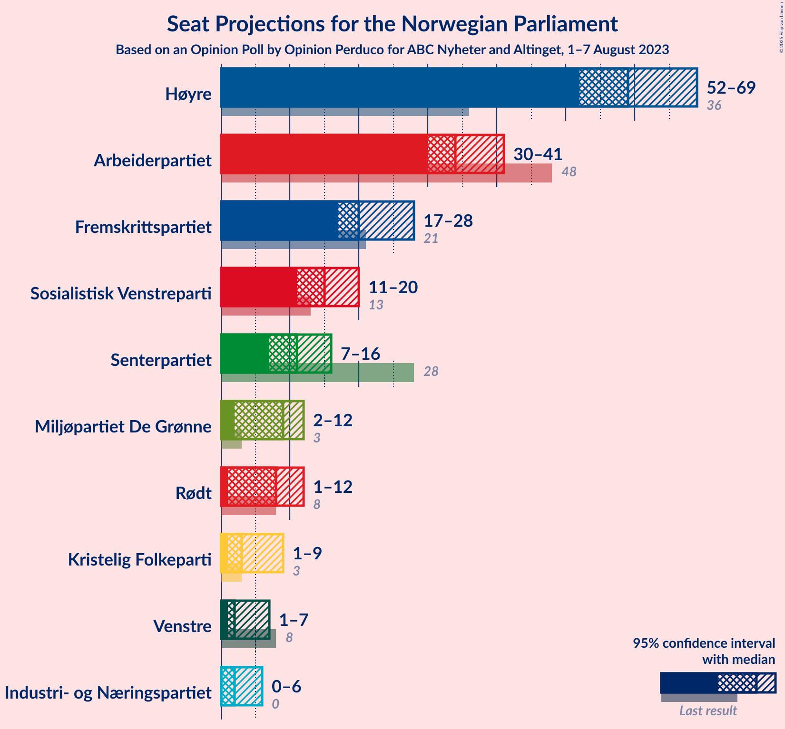

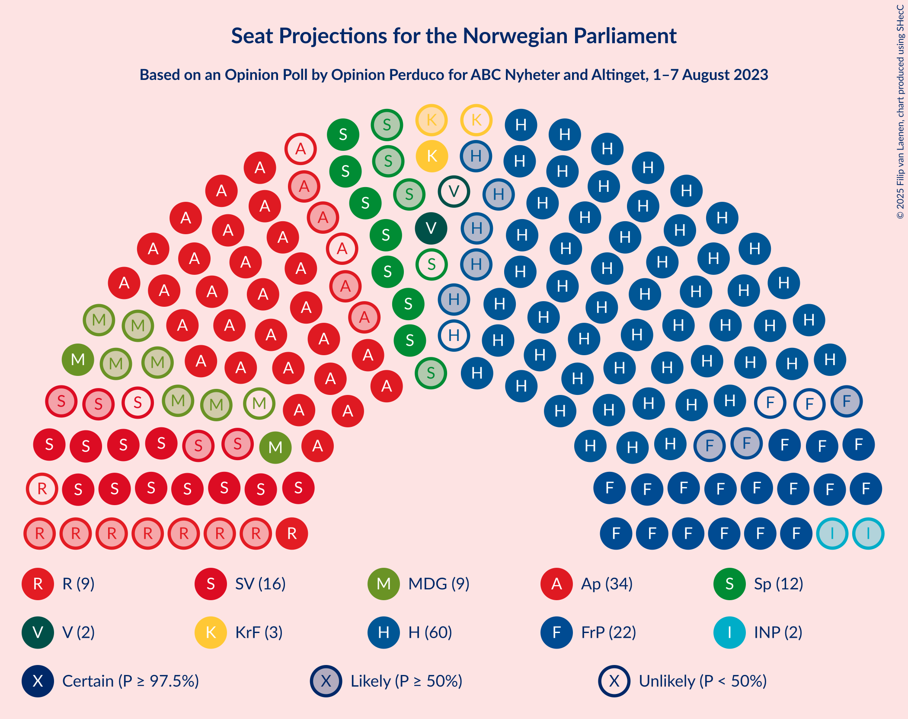

### Confidence Intervals

| Party | Last Result | Median | 80% Confidence Interval | 90% Confidence Interval | 95% Confidence Interval | 99% Confidence Interval |
|:-----:|:-----------:|:------:|:-----------------------:|:-----------------------:|:-----------------------:|:-----------------------:|
| <a href="#høyre">Høyre</a> | 36 | 59 | 54–66 |53–67 |52–69 |50–70 |
| <a href="#arbeiderpartiet">Arbeiderpartiet</a> | 48 | 34 | 32–39 |31–41 |30–41 |27–43 |
| <a href="#fremskrittspartiet">Fremskrittspartiet</a> | 21 | 20 | 18–24 |17–26 |17–28 |16–30 |
| <a href="#sosialistisk-venstreparti">Sosialistisk Venstreparti</a> | 13 | 15 | 12–19 |12–20 |11–20 |9–22 |
| <a href="#senterpartiet">Senterpartiet</a> | 28 | 11 | 8–13 |7–14 |7–16 |6–16 |
| <a href="#miljøpartiet-de-grønne">Miljøpartiet De Grønne</a> | 3 | 9 | 3–11 |2–11 |2–12 |2–13 |
| <a href="#rødt">Rødt</a> | 8 | 8 | 1–11 |1–11 |1–12 |1–13 |
| <a href="#kristelig-folkeparti">Kristelig Folkeparti</a> | 3 | 3 | 2–8 |1–8 |1–9 |0–10 |
| <a href="#venstre">Venstre</a> | 8 | 2 | 1–6 |1–7 |1–7 |1–9 |
| <a href="#industri--og-næringspartiet">Industri- og Næringspartiet</a> | 0 | 2 | 0–3 |0–3 |0–6 |0–8 |

### Høyre

*For a full overview of the results for this party, see the [Høyre](party-høyre.html) page.*

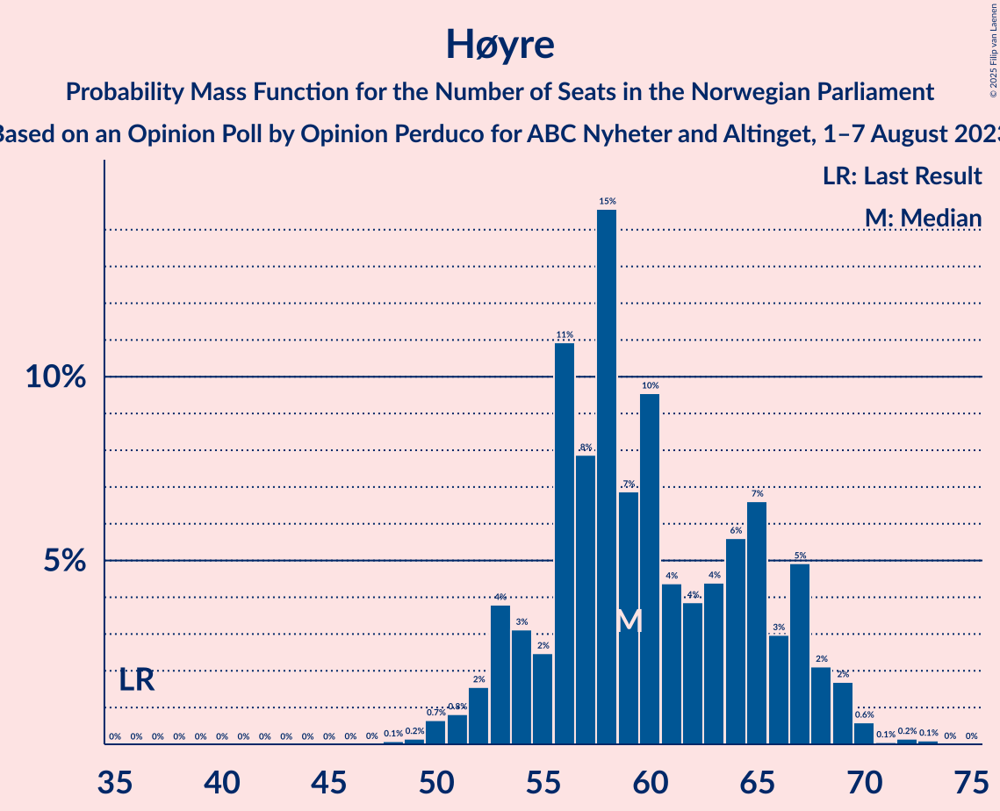

| Number of Seats | Probability | Accumulated | Special Marks |
|:---------------:|:-----------:|:-----------:|:-------------:|
| 36 | 0% | 100% | Last Result |
| 37 | 0% | 100% |  |
| 38 | 0% | 100% |  |
| 39 | 0% | 100% |  |
| 40 | 0% | 100% |  |
| 41 | 0% | 100% |  |
| 42 | 0% | 100% |  |
| 43 | 0% | 100% |  |
| 44 | 0% | 100% |  |
| 45 | 0% | 100% |  |
| 46 | 0% | 100% |  |
| 47 | 0% | 100% |  |
| 48 | 0.1% | 100% |  |
| 49 | 0.2% | 99.9% |  |
| 50 | 0.7% | 99.7% |  |
| 51 | 0.8% | 99.1% |  |
| 52 | 2% | 98% |  |
| 53 | 4% | 97% |  |
| 54 | 3% | 93% |  |
| 55 | 2% | 90% |  |
| 56 | 11% | 87% |  |
| 57 | 8% | 76% |  |
| 58 | 15% | 69% |  |
| 59 | 7% | 54% | Median |
| 60 | 10% | 47% |  |
| 61 | 4% | 38% |  |
| 62 | 4% | 33% |  |
| 63 | 4% | 29% |  |
| 64 | 6% | 25% |  |
| 65 | 7% | 19% |  |
| 66 | 3% | 13% |  |
| 67 | 5% | 10% |  |
| 68 | 2% | 5% |  |
| 69 | 2% | 3% |  |
| 70 | 0.6% | 0.9% |  |
| 71 | 0.1% | 0.3% |  |
| 72 | 0.2% | 0.3% |  |
| 73 | 0.1% | 0.1% |  |
| 74 | 0% | 0% |  |

### Arbeiderpartiet

*For a full overview of the results for this party, see the [Arbeiderpartiet](party-arbeiderpartiet.html) page.*

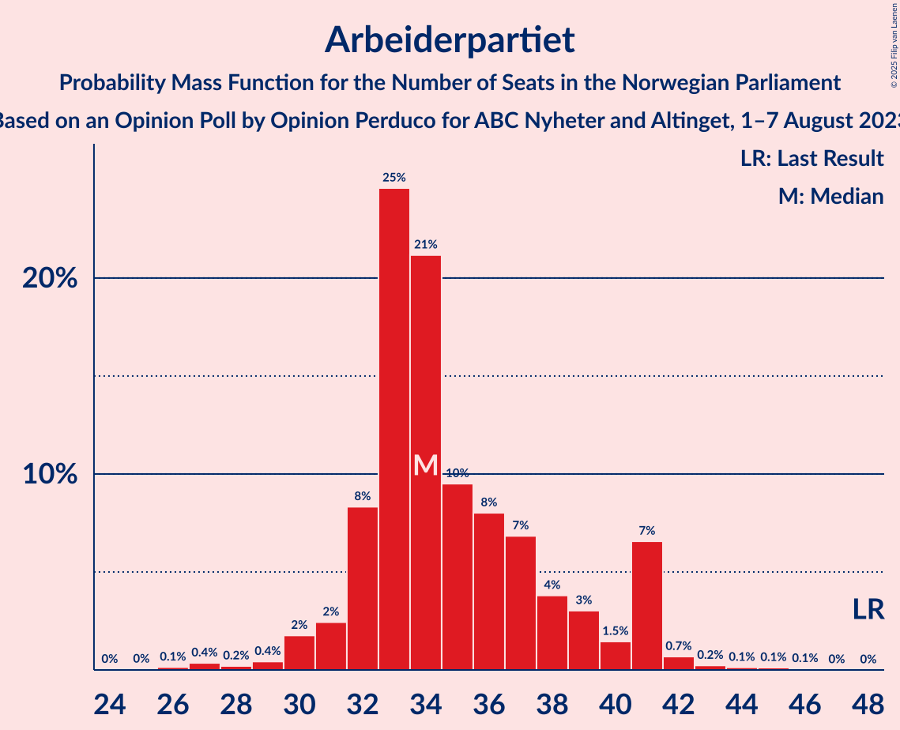

| Number of Seats | Probability | Accumulated | Special Marks |
|:---------------:|:-----------:|:-----------:|:-------------:|
| 25 | 0% | 100% |  |
| 26 | 0.1% | 99.9% |  |
| 27 | 0.4% | 99.8% |  |
| 28 | 0.2% | 99.4% |  |
| 29 | 0.4% | 99.2% |  |
| 30 | 2% | 98.8% |  |
| 31 | 2% | 97% |  |
| 32 | 8% | 95% |  |
| 33 | 25% | 86% |  |
| 34 | 21% | 62% | Median |
| 35 | 10% | 40% |  |
| 36 | 8% | 31% |  |
| 37 | 7% | 23% |  |
| 38 | 4% | 16% |  |
| 39 | 3% | 12% |  |
| 40 | 1.5% | 9% |  |
| 41 | 7% | 8% |  |
| 42 | 0.7% | 1.3% |  |
| 43 | 0.2% | 0.6% |  |
| 44 | 0.1% | 0.3% |  |
| 45 | 0.1% | 0.2% |  |
| 46 | 0.1% | 0.1% |  |
| 47 | 0% | 0% |  |
| 48 | 0% | 0% | Last Result |

### Fremskrittspartiet

*For a full overview of the results for this party, see the [Fremskrittspartiet](party-fremskrittspartiet.html) page.*

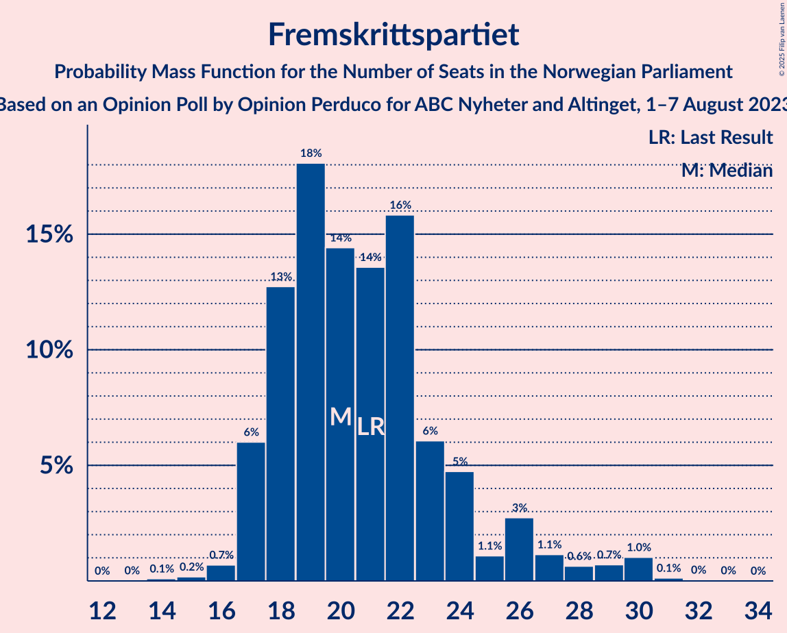

| Number of Seats | Probability | Accumulated | Special Marks |
|:---------------:|:-----------:|:-----------:|:-------------:|
| 14 | 0.1% | 100% |  |
| 15 | 0.2% | 99.9% |  |
| 16 | 0.7% | 99.7% |  |
| 17 | 6% | 99.0% |  |
| 18 | 13% | 93% |  |
| 19 | 18% | 80% |  |
| 20 | 14% | 62% | Median |
| 21 | 14% | 48% | Last Result |
| 22 | 16% | 34% |  |
| 23 | 6% | 18% |  |
| 24 | 5% | 12% |  |
| 25 | 1.1% | 8% |  |
| 26 | 3% | 6% |  |
| 27 | 1.1% | 4% |  |
| 28 | 0.6% | 3% |  |
| 29 | 0.7% | 2% |  |
| 30 | 1.0% | 1.2% |  |
| 31 | 0.1% | 0.2% |  |
| 32 | 0% | 0.1% |  |
| 33 | 0% | 0% |  |

### Sosialistisk Venstreparti

*For a full overview of the results for this party, see the [Sosialistisk Venstreparti](party-sosialistiskvenstreparti.html) page.*

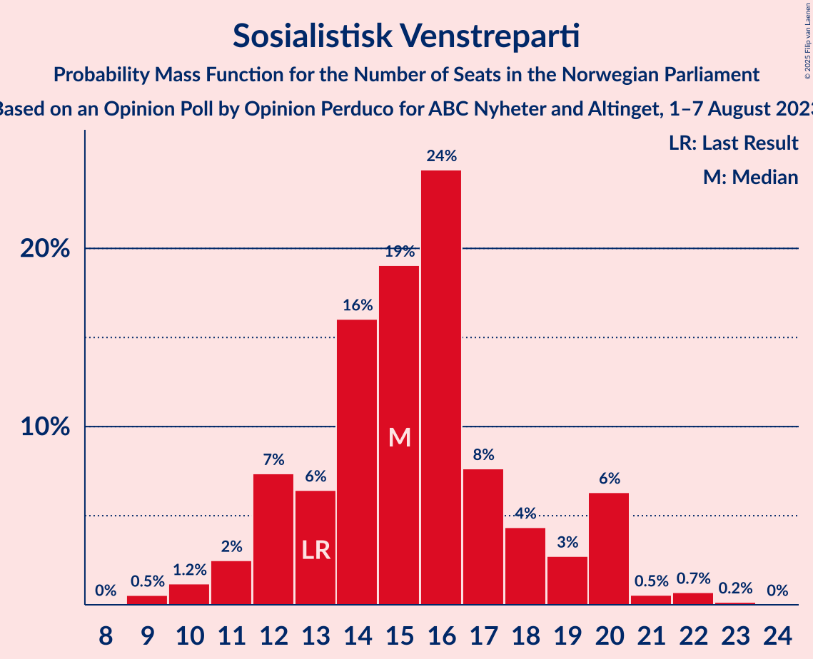

| Number of Seats | Probability | Accumulated | Special Marks |
|:---------------:|:-----------:|:-----------:|:-------------:|
| 9 | 0.5% | 100% |  |
| 10 | 1.2% | 99.4% |  |
| 11 | 2% | 98% |  |
| 12 | 7% | 96% |  |
| 13 | 6% | 88% | Last Result |
| 14 | 16% | 82% |  |
| 15 | 19% | 66% | Median |
| 16 | 24% | 47% |  |
| 17 | 8% | 22% |  |
| 18 | 4% | 15% |  |
| 19 | 3% | 10% |  |
| 20 | 6% | 8% |  |
| 21 | 0.5% | 1.4% |  |
| 22 | 0.7% | 0.9% |  |
| 23 | 0.2% | 0.2% |  |
| 24 | 0% | 0% |  |

### Senterpartiet

*For a full overview of the results for this party, see the [Senterpartiet](party-senterpartiet.html) page.*

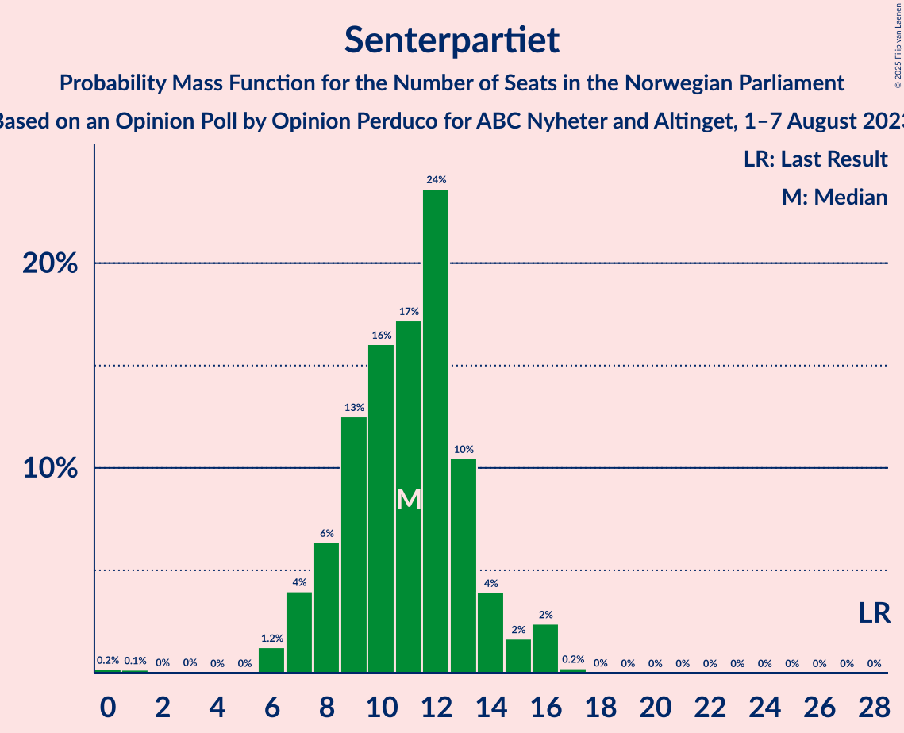

| Number of Seats | Probability | Accumulated | Special Marks |
|:---------------:|:-----------:|:-----------:|:-------------:|
| 0 | 0.2% | 100% |  |
| 1 | 0.1% | 99.8% |  |
| 2 | 0% | 99.7% |  |
| 3 | 0% | 99.7% |  |
| 4 | 0% | 99.6% |  |
| 5 | 0% | 99.6% |  |
| 6 | 1.2% | 99.6% |  |
| 7 | 4% | 98% |  |
| 8 | 6% | 94% |  |
| 9 | 13% | 88% |  |
| 10 | 16% | 76% |  |
| 11 | 17% | 59% | Median |
| 12 | 24% | 42% |  |
| 13 | 10% | 19% |  |
| 14 | 4% | 8% |  |
| 15 | 2% | 4% |  |
| 16 | 2% | 3% |  |
| 17 | 0.2% | 0.2% |  |
| 18 | 0% | 0% |  |
| 19 | 0% | 0% |  |
| 20 | 0% | 0% |  |
| 21 | 0% | 0% |  |
| 22 | 0% | 0% |  |
| 23 | 0% | 0% |  |
| 24 | 0% | 0% |  |
| 25 | 0% | 0% |  |
| 26 | 0% | 0% |  |
| 27 | 0% | 0% |  |
| 28 | 0% | 0% | Last Result |

### Miljøpartiet De Grønne

*For a full overview of the results for this party, see the [Miljøpartiet De Grønne](party-miljøpartietdegrønne.html) page.*

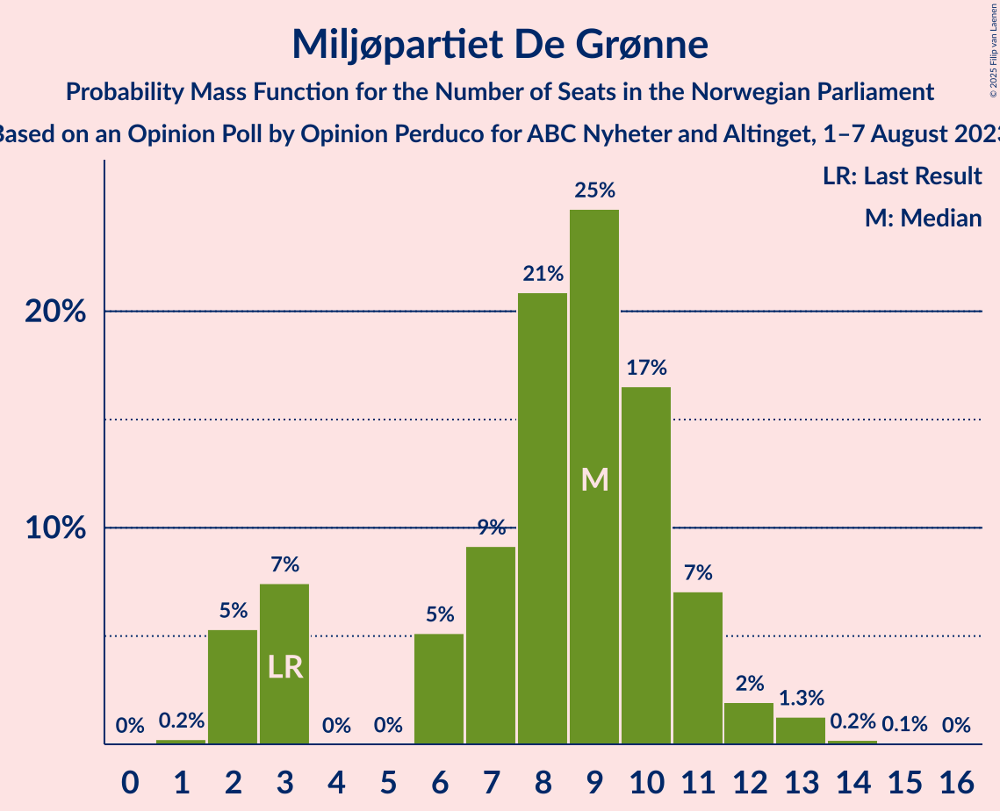

| Number of Seats | Probability | Accumulated | Special Marks |
|:---------------:|:-----------:|:-----------:|:-------------:|
| 1 | 0.2% | 100% |  |
| 2 | 5% | 99.8% |  |
| 3 | 7% | 94% | Last Result |
| 4 | 0% | 87% |  |
| 5 | 0% | 87% |  |
| 6 | 5% | 87% |  |
| 7 | 9% | 82% |  |
| 8 | 21% | 73% |  |
| 9 | 25% | 52% | Median |
| 10 | 17% | 27% |  |
| 11 | 7% | 11% |  |
| 12 | 2% | 4% |  |
| 13 | 1.3% | 2% |  |
| 14 | 0.2% | 0.3% |  |
| 15 | 0.1% | 0.1% |  |
| 16 | 0% | 0% |  |

### Rødt

*For a full overview of the results for this party, see the [Rødt](party-rødt.html) page.*

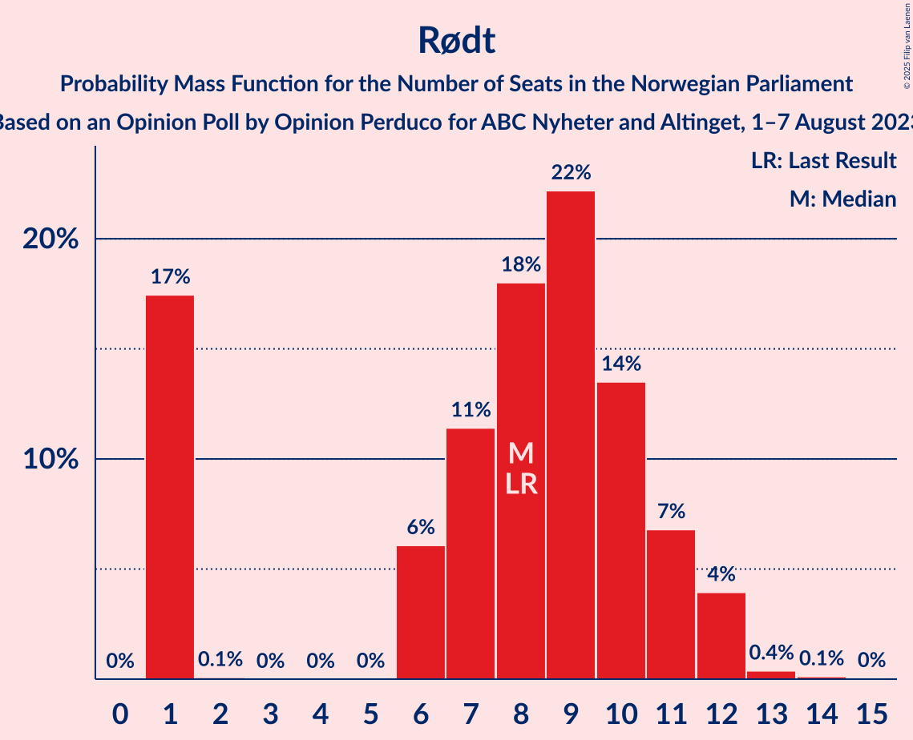

| Number of Seats | Probability | Accumulated | Special Marks |
|:---------------:|:-----------:|:-----------:|:-------------:|
| 1 | 17% | 100% |  |
| 2 | 0.1% | 83% |  |
| 3 | 0% | 82% |  |
| 4 | 0% | 82% |  |
| 5 | 0% | 82% |  |
| 6 | 6% | 82% |  |
| 7 | 11% | 76% |  |
| 8 | 18% | 65% | Last Result, Median |
| 9 | 22% | 47% |  |
| 10 | 14% | 25% |  |
| 11 | 7% | 11% |  |
| 12 | 4% | 4% |  |
| 13 | 0.4% | 0.5% |  |
| 14 | 0.1% | 0.2% |  |
| 15 | 0% | 0% |  |

### Kristelig Folkeparti

*For a full overview of the results for this party, see the [Kristelig Folkeparti](party-kristeligfolkeparti.html) page.*

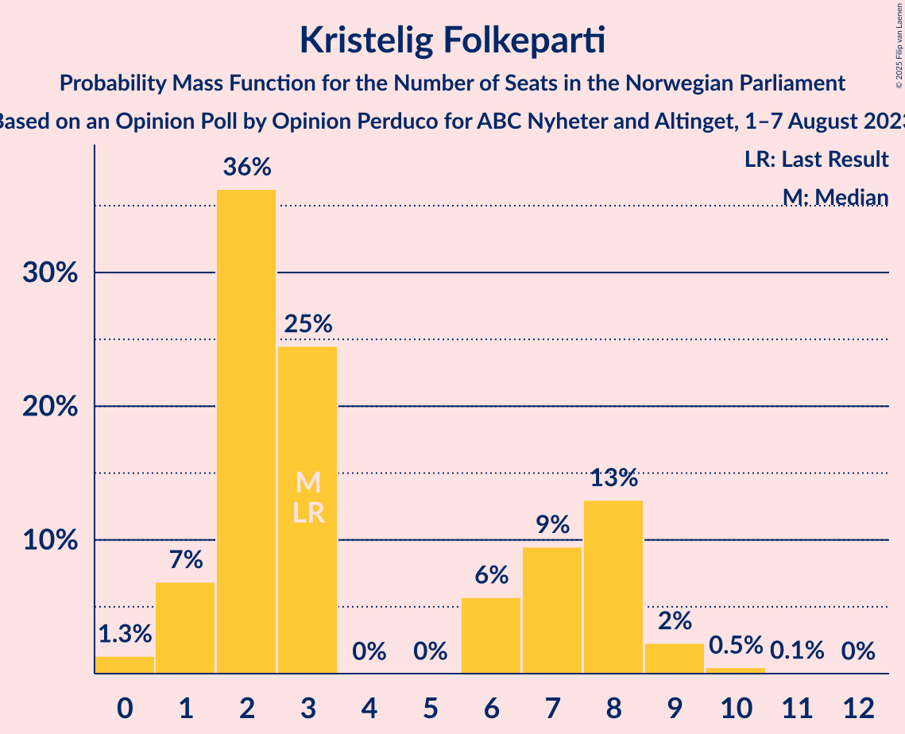

| Number of Seats | Probability | Accumulated | Special Marks |
|:---------------:|:-----------:|:-----------:|:-------------:|
| 0 | 1.3% | 100% |  |
| 1 | 7% | 98.7% |  |
| 2 | 36% | 92% |  |
| 3 | 25% | 56% | Last Result, Median |
| 4 | 0% | 31% |  |
| 5 | 0% | 31% |  |
| 6 | 6% | 31% |  |
| 7 | 9% | 25% |  |
| 8 | 13% | 16% |  |
| 9 | 2% | 3% |  |
| 10 | 0.5% | 0.6% |  |
| 11 | 0.1% | 0.1% |  |
| 12 | 0% | 0% |  |

### Venstre

*For a full overview of the results for this party, see the [Venstre](party-venstre.html) page.*

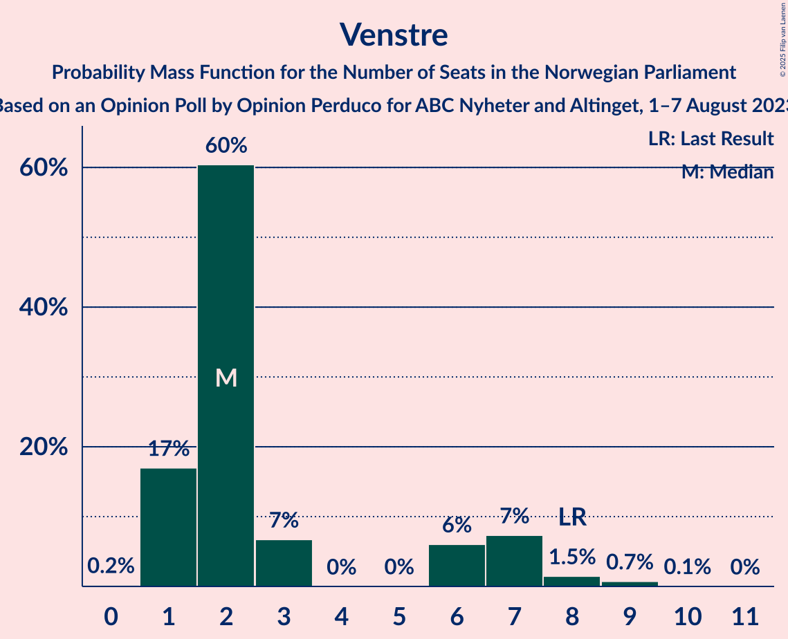

| Number of Seats | Probability | Accumulated | Special Marks |
|:---------------:|:-----------:|:-----------:|:-------------:|
| 0 | 0.2% | 100% |  |
| 1 | 17% | 99.8% |  |
| 2 | 60% | 83% | Median |
| 3 | 7% | 22% |  |
| 4 | 0% | 16% |  |
| 5 | 0% | 16% |  |
| 6 | 6% | 16% |  |
| 7 | 7% | 10% |  |
| 8 | 1.5% | 2% | Last Result |
| 9 | 0.7% | 0.8% |  |
| 10 | 0.1% | 0.1% |  |
| 11 | 0% | 0% |  |

### Industri- og Næringspartiet

*For a full overview of the results for this party, see the [Industri- og Næringspartiet](party-industri-ognæringspartiet.html) page.*

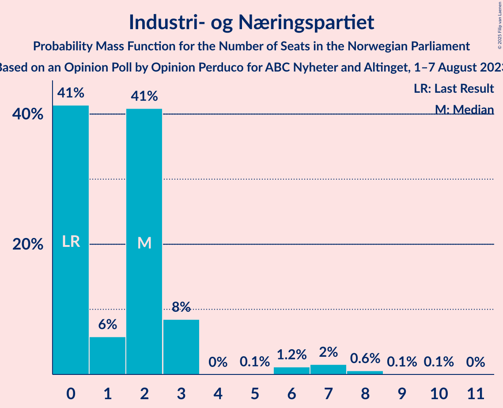

| Number of Seats | Probability | Accumulated | Special Marks |
|:---------------:|:-----------:|:-----------:|:-------------:|
| 0 | 41% | 100% | Last Result |
| 1 | 6% | 59% |  |
| 2 | 41% | 53% | Median |
| 3 | 8% | 12% |  |
| 4 | 0% | 3% |  |
| 5 | 0.1% | 3% |  |
| 6 | 1.2% | 3% |  |
| 7 | 2% | 2% |  |
| 8 | 0.6% | 0.7% |  |
| 9 | 0.1% | 0.1% |  |
| 10 | 0.1% | 0.1% |  |
| 11 | 0% | 0% |  |

## Coalitions

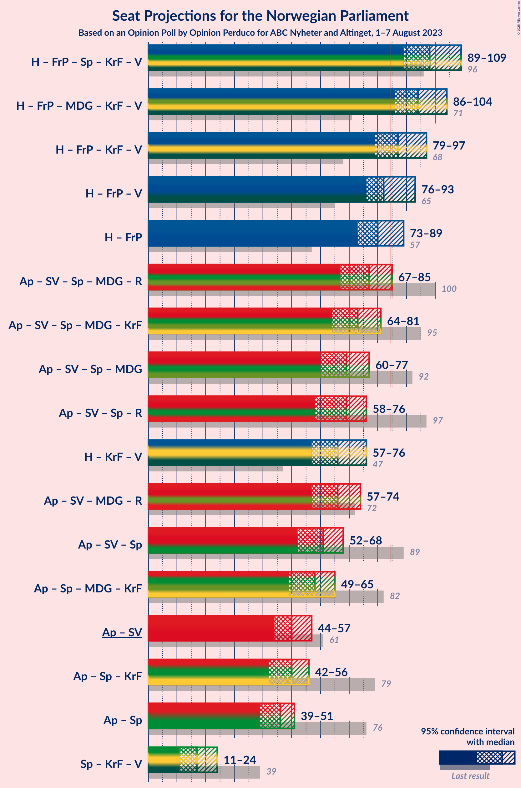

### Confidence Intervals

| Coalition | Last Result | Median | Majority? | 80% Confidence Interval | 90% Confidence Interval | 95% Confidence Interval | 99% Confidence Interval |
|:---------:|:-----------:|:------:|:---------:|:-----------------------:|:-----------------------:|:-----------------------:|:-----------------------:|
| Høyre – Fremskrittspartiet – Senterpartiet – Kristelig Folkeparti – Venstre | 96 | 98 | 99.9% | 92–105 | 91–108 | 89–109 | 86–111 |
| Høyre – Fremskrittspartiet – Miljøpartiet De Grønne – Kristelig Folkeparti – Venstre | 71 | 94 | 98.8% | 89–101 | 88–103 | 86–104 | 84–108 |
| Høyre – Fremskrittspartiet – Kristelig Folkeparti – Venstre | 68 | 87 | 63% | 81–94 | 79–97 | 79–97 | 75–100 |
| Høyre – Fremskrittspartiet – Venstre | 65 | 82 | 36% | 78–90 | 76–91 | 76–93 | 73–95 |
| Høyre – Fremskrittspartiet | 57 | 80 | 22% | 75–87 | 74–88 | 73–89 | 70–93 |
| Arbeiderpartiet – Sosialistisk Venstreparti – Senterpartiet – Miljøpartiet De Grønne – Rødt | 100 | 77 | 6% | 70–82 | 68–85 | 67–85 | 63–88 |
| Arbeiderpartiet – Sosialistisk Venstreparti – Senterpartiet – Miljøpartiet De Grønne – Kristelig Folkeparti | 95 | 73 | 0.4% | 67–79 | 65–80 | 64–81 | 61–84 |
| Arbeiderpartiet – Sosialistisk Venstreparti – Senterpartiet – Miljøpartiet De Grønne | 92 | 69 | 0% | 63–75 | 62–76 | 60–77 | 56–80 |
| Arbeiderpartiet – Sosialistisk Venstreparti – Senterpartiet – Rødt | 97 | 69 | 0% | 62–74 | 60–76 | 58–76 | 56–79 |
| Høyre – Kristelig Folkeparti – Venstre | 47 | 66 | 0% | 60–73 | 59–75 | 57–76 | 55–78 |
| Arbeiderpartiet – Sosialistisk Venstreparti – Miljøpartiet De Grønne – Rødt | 72 | 66 | 0% | 59–71 | 58–73 | 57–74 | 54–78 |
| Arbeiderpartiet – Sosialistisk Venstreparti – Senterpartiet | 89 | 61 | 0% | 56–67 | 54–67 | 52–68 | 49–70 |
| Arbeiderpartiet – Senterpartiet – Miljøpartiet De Grønne – Kristelig Folkeparti | 82 | 58 | 0% | 51–63 | 50–64 | 49–65 | 46–68 |
| Arbeiderpartiet – Sosialistisk Venstreparti | 61 | 50 | 0% | 46–55 | 44–57 | 44–57 | 41–59 |
| Arbeiderpartiet – Senterpartiet – Kristelig Folkeparti | 79 | 50 | 0% | 44–54 | 43–54 | 42–56 | 40–60 |
| Arbeiderpartiet – Senterpartiet | 76 | 46 | 0% | 42–50 | 40–51 | 39–51 | 36–54 |
| Senterpartiet – Kristelig Folkeparti – Venstre | 39 | 17 | 0% | 13–23 | 12–24 | 11–24 | 9–26 |

### Høyre – Fremskrittspartiet – Senterpartiet – Kristelig Folkeparti – Venstre

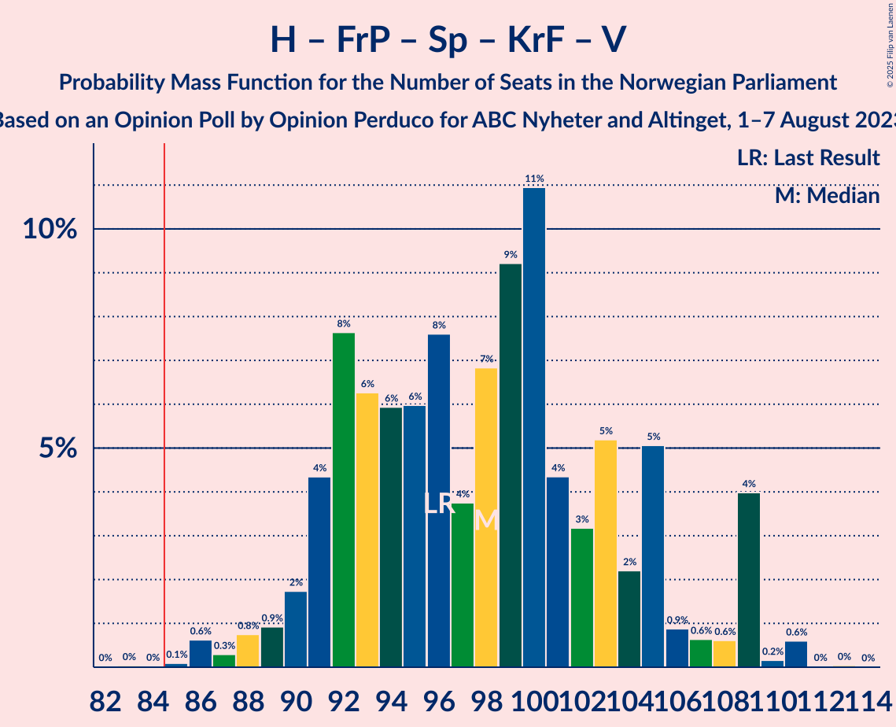

| Number of Seats | Probability | Accumulated | Special Marks |
|:---------------:|:-----------:|:-----------:|:-------------:|
| 83 | 0% | 100% |  |
| 84 | 0% | 99.9% |  |
| 85 | 0.1% | 99.9% | Majority |
| 86 | 0.6% | 99.8% |  |
| 87 | 0.3% | 99.2% |  |
| 88 | 0.8% | 98.9% |  |
| 89 | 0.9% | 98% |  |
| 90 | 2% | 97% |  |
| 91 | 4% | 95% |  |
| 92 | 8% | 91% |  |
| 93 | 6% | 84% |  |
| 94 | 6% | 77% |  |
| 95 | 6% | 71% | Median |
| 96 | 8% | 65% | Last Result |
| 97 | 4% | 58% |  |
| 98 | 7% | 54% |  |
| 99 | 9% | 47% |  |
| 100 | 11% | 38% |  |
| 101 | 4% | 27% |  |
| 102 | 3% | 23% |  |
| 103 | 5% | 19% |  |
| 104 | 2% | 14% |  |
| 105 | 5% | 12% |  |
| 106 | 0.9% | 7% |  |
| 107 | 0.6% | 6% |  |
| 108 | 0.6% | 5% |  |
| 109 | 4% | 5% |  |
| 110 | 0.2% | 0.9% |  |
| 111 | 0.6% | 0.7% |  |
| 112 | 0% | 0.1% |  |
| 113 | 0% | 0.1% |  |
| 114 | 0% | 0% |  |

### Høyre – Fremskrittspartiet – Miljøpartiet De Grønne – Kristelig Folkeparti – Venstre

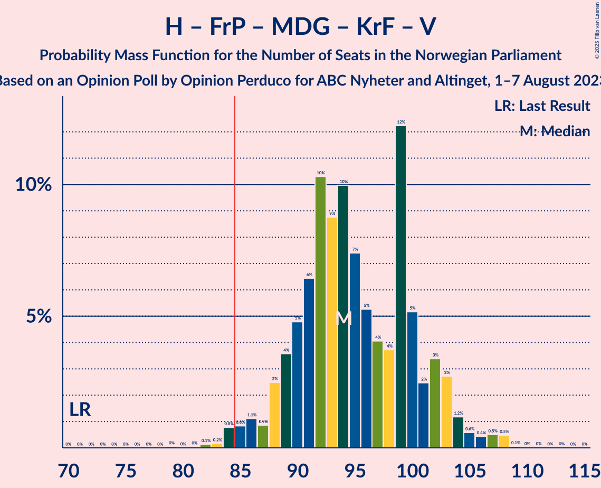

| Number of Seats | Probability | Accumulated | Special Marks |
|:---------------:|:-----------:|:-----------:|:-------------:|
| 71 | 0% | 100% | Last Result |
| 72 | 0% | 100% |  |
| 73 | 0% | 100% |  |
| 74 | 0% | 100% |  |
| 75 | 0% | 100% |  |
| 76 | 0% | 100% |  |
| 77 | 0% | 100% |  |
| 78 | 0% | 100% |  |
| 79 | 0% | 100% |  |
| 80 | 0% | 100% |  |
| 81 | 0% | 99.9% |  |
| 82 | 0.1% | 99.9% |  |
| 83 | 0.2% | 99.8% |  |
| 84 | 0.8% | 99.6% |  |
| 85 | 0.8% | 98.8% | Majority |
| 86 | 1.1% | 98% |  |
| 87 | 0.9% | 97% |  |
| 88 | 2% | 96% |  |
| 89 | 4% | 94% |  |
| 90 | 5% | 90% |  |
| 91 | 6% | 85% |  |
| 92 | 10% | 79% |  |
| 93 | 9% | 68% | Median |
| 94 | 10% | 60% |  |
| 95 | 7% | 50% |  |
| 96 | 5% | 42% |  |
| 97 | 4% | 37% |  |
| 98 | 4% | 33% |  |
| 99 | 12% | 29% |  |
| 100 | 5% | 17% |  |
| 101 | 2% | 12% |  |
| 102 | 3% | 9% |  |
| 103 | 3% | 6% |  |
| 104 | 1.2% | 3% |  |
| 105 | 0.6% | 2% |  |
| 106 | 0.4% | 2% |  |
| 107 | 0.5% | 1.1% |  |
| 108 | 0.5% | 0.6% |  |
| 109 | 0.1% | 0.1% |  |
| 110 | 0% | 0.1% |  |
| 111 | 0% | 0% |  |

### Høyre – Fremskrittspartiet – Kristelig Folkeparti – Venstre

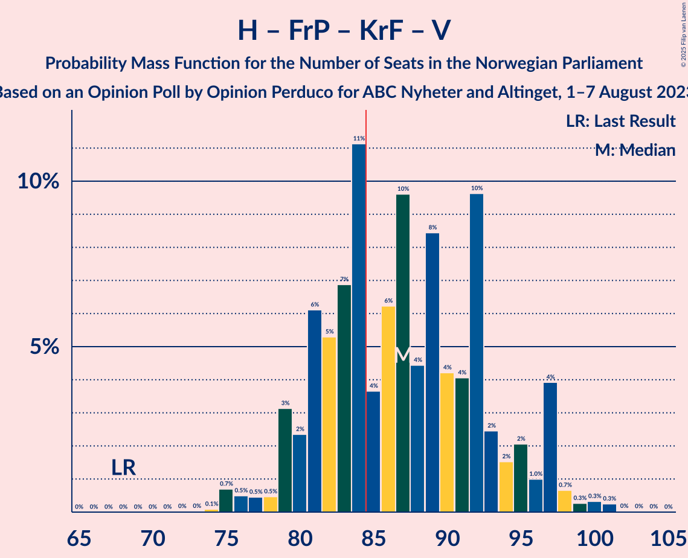

| Number of Seats | Probability | Accumulated | Special Marks |
|:---------------:|:-----------:|:-----------:|:-------------:|
| 68 | 0% | 100% | Last Result |
| 69 | 0% | 100% |  |
| 70 | 0% | 100% |  |
| 71 | 0% | 100% |  |
| 72 | 0% | 100% |  |
| 73 | 0% | 100% |  |
| 74 | 0.1% | 99.9% |  |
| 75 | 0.7% | 99.9% |  |
| 76 | 0.5% | 99.2% |  |
| 77 | 0.5% | 98.7% |  |
| 78 | 0.5% | 98% |  |
| 79 | 3% | 98% |  |
| 80 | 2% | 95% |  |
| 81 | 6% | 92% |  |
| 82 | 5% | 86% |  |
| 83 | 7% | 81% |  |
| 84 | 11% | 74% | Median |
| 85 | 4% | 63% | Majority |
| 86 | 6% | 59% |  |
| 87 | 10% | 53% |  |
| 88 | 4% | 43% |  |
| 89 | 8% | 39% |  |
| 90 | 4% | 30% |  |
| 91 | 4% | 26% |  |
| 92 | 10% | 22% |  |
| 93 | 2% | 13% |  |
| 94 | 2% | 10% |  |
| 95 | 2% | 9% |  |
| 96 | 1.0% | 7% |  |
| 97 | 4% | 6% |  |
| 98 | 0.7% | 2% |  |
| 99 | 0.3% | 0.9% |  |
| 100 | 0.3% | 0.7% |  |
| 101 | 0.3% | 0.3% |  |
| 102 | 0% | 0.1% |  |
| 103 | 0% | 0.1% |  |
| 104 | 0% | 0% |  |

### Høyre – Fremskrittspartiet – Venstre

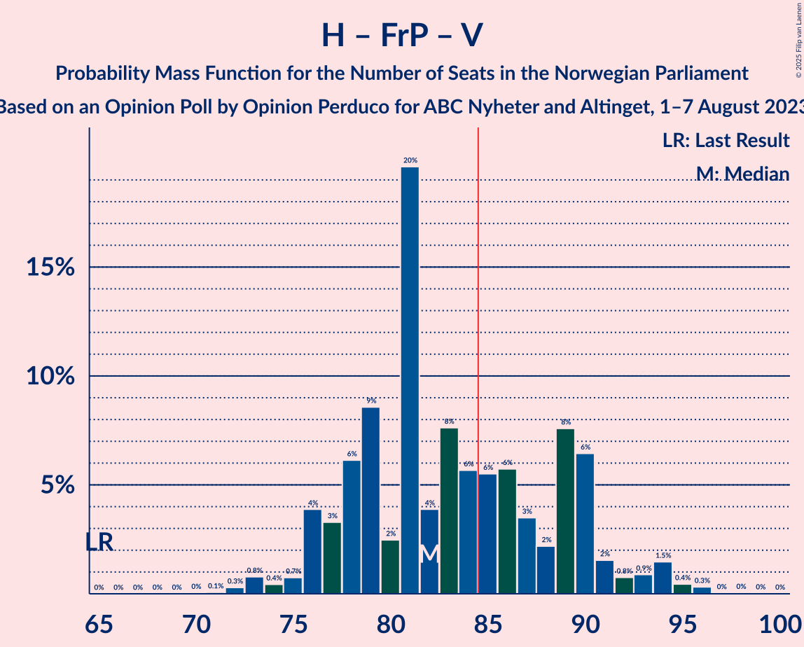

| Number of Seats | Probability | Accumulated | Special Marks |
|:---------------:|:-----------:|:-----------:|:-------------:|
| 65 | 0% | 100% | Last Result |
| 66 | 0% | 100% |  |
| 67 | 0% | 100% |  |
| 68 | 0% | 100% |  |
| 69 | 0% | 100% |  |
| 70 | 0% | 100% |  |
| 71 | 0.1% | 99.9% |  |
| 72 | 0.3% | 99.9% |  |
| 73 | 0.8% | 99.6% |  |
| 74 | 0.4% | 98.8% |  |
| 75 | 0.7% | 98% |  |
| 76 | 4% | 98% |  |
| 77 | 3% | 94% |  |
| 78 | 6% | 90% |  |
| 79 | 9% | 84% |  |
| 80 | 2% | 76% |  |
| 81 | 20% | 73% | Median |
| 82 | 4% | 54% |  |
| 83 | 8% | 50% |  |
| 84 | 6% | 42% |  |
| 85 | 6% | 36% | Majority |
| 86 | 6% | 31% |  |
| 87 | 3% | 25% |  |
| 88 | 2% | 22% |  |
| 89 | 8% | 20% |  |
| 90 | 6% | 12% |  |
| 91 | 2% | 6% |  |
| 92 | 0.8% | 4% |  |
| 93 | 0.9% | 3% |  |
| 94 | 1.5% | 2% |  |
| 95 | 0.4% | 0.9% |  |
| 96 | 0.3% | 0.4% |  |
| 97 | 0% | 0.1% |  |
| 98 | 0% | 0.1% |  |
| 99 | 0% | 0% |  |

### Høyre – Fremskrittspartiet

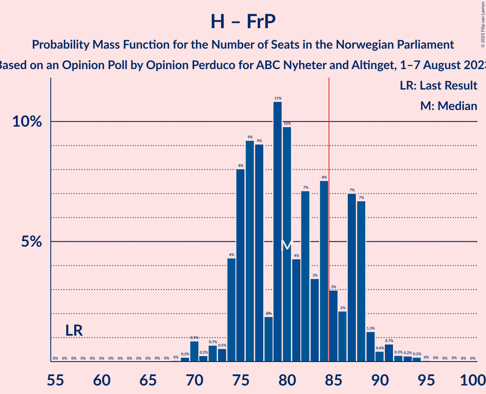

| Number of Seats | Probability | Accumulated | Special Marks |
|:---------------:|:-----------:|:-----------:|:-------------:|
| 57 | 0% | 100% | Last Result |
| 58 | 0% | 100% |  |
| 59 | 0% | 100% |  |
| 60 | 0% | 100% |  |
| 61 | 0% | 100% |  |
| 62 | 0% | 100% |  |
| 63 | 0% | 100% |  |
| 64 | 0% | 100% |  |
| 65 | 0% | 100% |  |
| 66 | 0% | 100% |  |
| 67 | 0% | 100% |  |
| 68 | 0% | 100% |  |
| 69 | 0.2% | 99.9% |  |
| 70 | 0.9% | 99.8% |  |
| 71 | 0.2% | 98.9% |  |
| 72 | 0.7% | 98.7% |  |
| 73 | 0.5% | 98% |  |
| 74 | 4% | 97% |  |
| 75 | 8% | 93% |  |
| 76 | 9% | 85% |  |
| 77 | 9% | 76% |  |
| 78 | 2% | 67% |  |
| 79 | 11% | 65% | Median |
| 80 | 10% | 54% |  |
| 81 | 4% | 44% |  |
| 82 | 7% | 40% |  |
| 83 | 3% | 33% |  |
| 84 | 8% | 29% |  |
| 85 | 3% | 22% | Majority |
| 86 | 2% | 19% |  |
| 87 | 7% | 17% |  |
| 88 | 7% | 10% |  |
| 89 | 1.3% | 3% |  |
| 90 | 0.4% | 2% |  |
| 91 | 0.7% | 1.5% |  |
| 92 | 0.3% | 0.8% |  |
| 93 | 0.2% | 0.5% |  |
| 94 | 0.2% | 0.3% |  |
| 95 | 0% | 0.1% |  |
| 96 | 0% | 0% |  |

### Arbeiderpartiet – Sosialistisk Venstreparti – Senterpartiet – Miljøpartiet De Grønne – Rødt

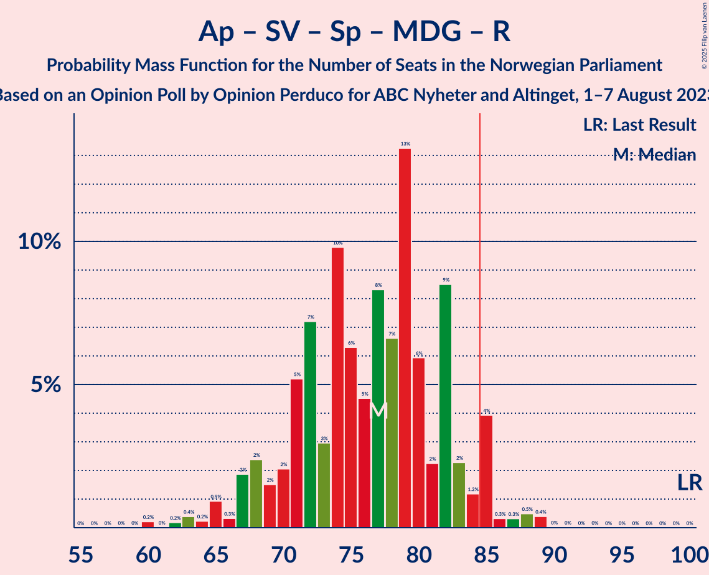

| Number of Seats | Probability | Accumulated | Special Marks |
|:---------------:|:-----------:|:-----------:|:-------------:|
| 60 | 0.2% | 100% |  |
| 61 | 0% | 99.8% |  |
| 62 | 0.2% | 99.8% |  |
| 63 | 0.4% | 99.6% |  |
| 64 | 0.2% | 99.2% |  |
| 65 | 0.9% | 98.9% |  |
| 66 | 0.3% | 98% |  |
| 67 | 2% | 98% |  |
| 68 | 2% | 96% |  |
| 69 | 2% | 93% |  |
| 70 | 2% | 92% |  |
| 71 | 5% | 90% |  |
| 72 | 7% | 85% |  |
| 73 | 3% | 77% |  |
| 74 | 10% | 74% |  |
| 75 | 6% | 65% |  |
| 76 | 5% | 58% |  |
| 77 | 8% | 54% | Median |
| 78 | 7% | 46% |  |
| 79 | 13% | 39% |  |
| 80 | 6% | 26% |  |
| 81 | 2% | 20% |  |
| 82 | 9% | 17% |  |
| 83 | 2% | 9% |  |
| 84 | 1.2% | 7% |  |
| 85 | 4% | 6% | Majority |
| 86 | 0.3% | 2% |  |
| 87 | 0.3% | 1.3% |  |
| 88 | 0.5% | 0.9% |  |
| 89 | 0.4% | 0.4% |  |
| 90 | 0% | 0.1% |  |
| 91 | 0% | 0% |  |
| 92 | 0% | 0% |  |
| 93 | 0% | 0% |  |
| 94 | 0% | 0% |  |
| 95 | 0% | 0% |  |
| 96 | 0% | 0% |  |
| 97 | 0% | 0% |  |
| 98 | 0% | 0% |  |
| 99 | 0% | 0% |  |
| 100 | 0% | 0% | Last Result |

### Arbeiderpartiet – Sosialistisk Venstreparti – Senterpartiet – Miljøpartiet De Grønne – Kristelig Folkeparti

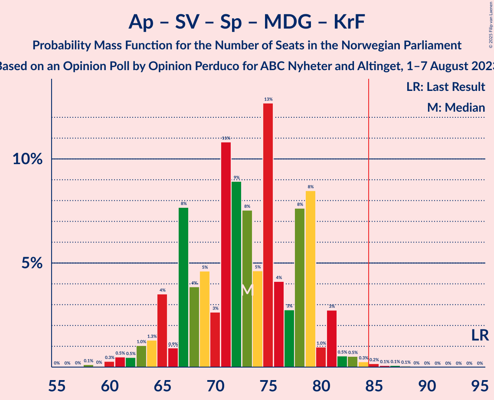

| Number of Seats | Probability | Accumulated | Special Marks |
|:---------------:|:-----------:|:-----------:|:-------------:|
| 58 | 0.1% | 100% |  |
| 59 | 0% | 99.8% |  |
| 60 | 0.3% | 99.8% |  |
| 61 | 0.5% | 99.5% |  |
| 62 | 0.5% | 99.0% |  |
| 63 | 1.0% | 98.6% |  |
| 64 | 1.3% | 98% |  |
| 65 | 4% | 96% |  |
| 66 | 0.9% | 93% |  |
| 67 | 8% | 92% |  |
| 68 | 4% | 84% |  |
| 69 | 5% | 80% |  |
| 70 | 3% | 76% |  |
| 71 | 11% | 73% |  |
| 72 | 9% | 62% | Median |
| 73 | 8% | 53% |  |
| 74 | 5% | 46% |  |
| 75 | 13% | 41% |  |
| 76 | 4% | 28% |  |
| 77 | 3% | 24% |  |
| 78 | 8% | 22% |  |
| 79 | 8% | 14% |  |
| 80 | 1.0% | 5% |  |
| 81 | 3% | 4% |  |
| 82 | 0.5% | 2% |  |
| 83 | 0.5% | 1.2% |  |
| 84 | 0.3% | 0.7% |  |
| 85 | 0.2% | 0.4% | Majority |
| 86 | 0.1% | 0.2% |  |
| 87 | 0.1% | 0.2% |  |
| 88 | 0.1% | 0.1% |  |
| 89 | 0% | 0% |  |
| 90 | 0% | 0% |  |
| 91 | 0% | 0% |  |
| 92 | 0% | 0% |  |
| 93 | 0% | 0% |  |
| 94 | 0% | 0% |  |
| 95 | 0% | 0% | Last Result |

### Arbeiderpartiet – Sosialistisk Venstreparti – Senterpartiet – Miljøpartiet De Grønne

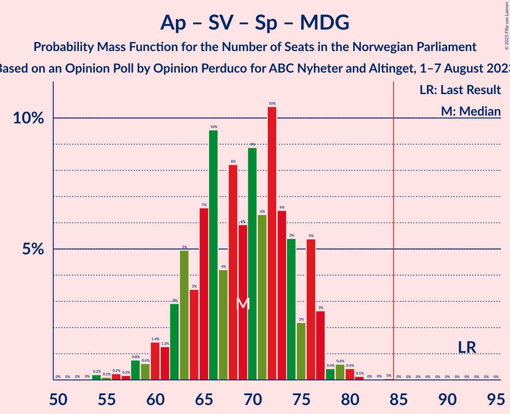

| Number of Seats | Probability | Accumulated | Special Marks |
|:---------------:|:-----------:|:-----------:|:-------------:|
| 54 | 0.2% | 100% |  |
| 55 | 0.1% | 99.8% |  |
| 56 | 0.2% | 99.7% |  |
| 57 | 0.2% | 99.4% |  |
| 58 | 0.8% | 99.3% |  |
| 59 | 0.6% | 98.5% |  |
| 60 | 1.4% | 98% |  |
| 61 | 1.3% | 96% |  |
| 62 | 3% | 95% |  |
| 63 | 5% | 92% |  |
| 64 | 3% | 87% |  |
| 65 | 7% | 84% |  |
| 66 | 10% | 77% |  |
| 67 | 4% | 68% |  |
| 68 | 8% | 64% |  |
| 69 | 6% | 55% | Median |
| 70 | 9% | 49% |  |
| 71 | 6% | 41% |  |
| 72 | 10% | 34% |  |
| 73 | 6% | 24% |  |
| 74 | 5% | 17% |  |
| 75 | 2% | 12% |  |
| 76 | 5% | 10% |  |
| 77 | 3% | 4% |  |
| 78 | 0.4% | 2% |  |
| 79 | 0.6% | 1.2% |  |
| 80 | 0.4% | 0.6% |  |
| 81 | 0.1% | 0.2% |  |
| 82 | 0% | 0.1% |  |
| 83 | 0% | 0.1% |  |
| 84 | 0% | 0.1% |  |
| 85 | 0% | 0% | Majority |
| 86 | 0% | 0% |  |
| 87 | 0% | 0% |  |
| 88 | 0% | 0% |  |
| 89 | 0% | 0% |  |
| 90 | 0% | 0% |  |
| 91 | 0% | 0% |  |
| 92 | 0% | 0% | Last Result |

### Arbeiderpartiet – Sosialistisk Venstreparti – Senterpartiet – Rødt

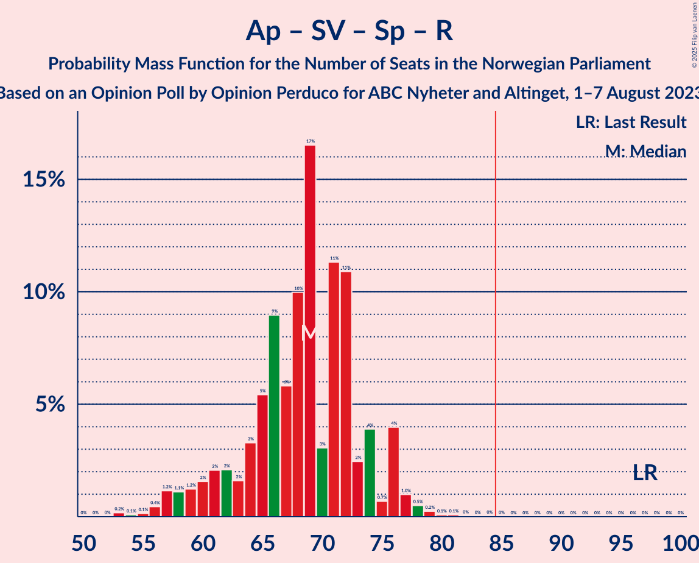

| Number of Seats | Probability | Accumulated | Special Marks |
|:---------------:|:-----------:|:-----------:|:-------------:|
| 53 | 0.2% | 100% |  |
| 54 | 0.1% | 99.8% |  |
| 55 | 0.1% | 99.7% |  |
| 56 | 0.4% | 99.6% |  |
| 57 | 1.2% | 99.1% |  |
| 58 | 1.1% | 98% |  |
| 59 | 1.2% | 97% |  |
| 60 | 2% | 96% |  |
| 61 | 2% | 94% |  |
| 62 | 2% | 92% |  |
| 63 | 2% | 90% |  |
| 64 | 3% | 88% |  |
| 65 | 5% | 85% |  |
| 66 | 9% | 80% |  |
| 67 | 6% | 71% |  |
| 68 | 10% | 65% | Median |
| 69 | 17% | 55% |  |
| 70 | 3% | 38% |  |
| 71 | 11% | 35% |  |
| 72 | 11% | 24% |  |
| 73 | 2% | 13% |  |
| 74 | 4% | 11% |  |
| 75 | 0.7% | 7% |  |
| 76 | 4% | 6% |  |
| 77 | 1.0% | 2% |  |
| 78 | 0.5% | 1.0% |  |
| 79 | 0.2% | 0.5% |  |
| 80 | 0.1% | 0.3% |  |
| 81 | 0.1% | 0.2% |  |
| 82 | 0% | 0.1% |  |
| 83 | 0% | 0.1% |  |
| 84 | 0% | 0% |  |
| 85 | 0% | 0% | Majority |
| 86 | 0% | 0% |  |
| 87 | 0% | 0% |  |
| 88 | 0% | 0% |  |
| 89 | 0% | 0% |  |
| 90 | 0% | 0% |  |
| 91 | 0% | 0% |  |
| 92 | 0% | 0% |  |
| 93 | 0% | 0% |  |
| 94 | 0% | 0% |  |
| 95 | 0% | 0% |  |
| 96 | 0% | 0% |  |
| 97 | 0% | 0% | Last Result |

### Høyre – Kristelig Folkeparti – Venstre

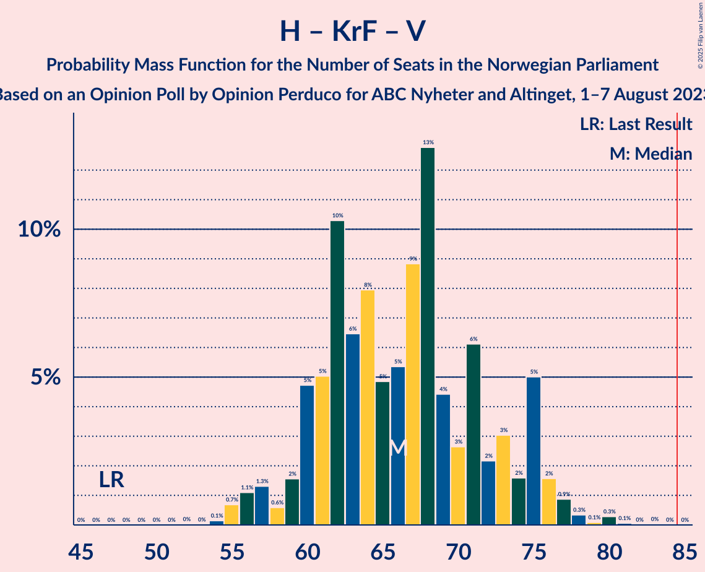

| Number of Seats | Probability | Accumulated | Special Marks |
|:---------------:|:-----------:|:-----------:|:-------------:|
| 47 | 0% | 100% | Last Result |
| 48 | 0% | 100% |  |
| 49 | 0% | 100% |  |
| 50 | 0% | 100% |  |
| 51 | 0% | 100% |  |
| 52 | 0% | 100% |  |
| 53 | 0% | 100% |  |
| 54 | 0.1% | 100% |  |
| 55 | 0.7% | 99.8% |  |
| 56 | 1.1% | 99.1% |  |
| 57 | 1.3% | 98% |  |
| 58 | 0.6% | 97% |  |
| 59 | 2% | 96% |  |
| 60 | 5% | 95% |  |
| 61 | 5% | 90% |  |
| 62 | 10% | 85% |  |
| 63 | 6% | 75% |  |
| 64 | 8% | 68% | Median |
| 65 | 5% | 60% |  |
| 66 | 5% | 55% |  |
| 67 | 9% | 50% |  |
| 68 | 13% | 41% |  |
| 69 | 4% | 28% |  |
| 70 | 3% | 24% |  |
| 71 | 6% | 21% |  |
| 72 | 2% | 15% |  |
| 73 | 3% | 13% |  |
| 74 | 2% | 10% |  |
| 75 | 5% | 8% |  |
| 76 | 2% | 3% |  |
| 77 | 0.9% | 2% |  |
| 78 | 0.3% | 0.8% |  |
| 79 | 0.1% | 0.5% |  |
| 80 | 0.3% | 0.4% |  |
| 81 | 0.1% | 0.1% |  |
| 82 | 0% | 0% |  |

### Arbeiderpartiet – Sosialistisk Venstreparti – Miljøpartiet De Grønne – Rødt

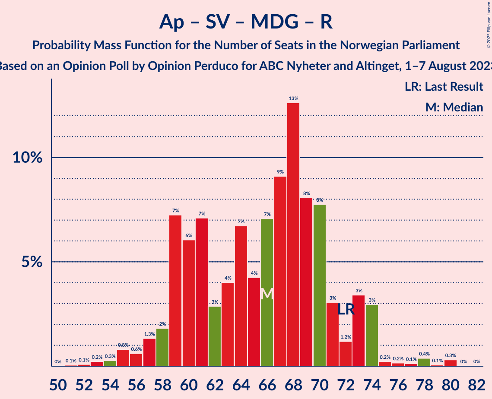

| Number of Seats | Probability | Accumulated | Special Marks |
|:---------------:|:-----------:|:-----------:|:-------------:|
| 50 | 0% | 100% |  |
| 51 | 0.1% | 99.9% |  |
| 52 | 0.1% | 99.9% |  |
| 53 | 0.2% | 99.8% |  |
| 54 | 0.3% | 99.6% |  |
| 55 | 0.8% | 99.3% |  |
| 56 | 0.6% | 98.5% |  |
| 57 | 1.3% | 98% |  |
| 58 | 2% | 97% |  |
| 59 | 7% | 95% |  |
| 60 | 6% | 88% |  |
| 61 | 7% | 81% |  |
| 62 | 3% | 74% |  |
| 63 | 4% | 71% |  |
| 64 | 7% | 67% |  |
| 65 | 4% | 61% |  |
| 66 | 7% | 57% | Median |
| 67 | 9% | 49% |  |
| 68 | 13% | 40% |  |
| 69 | 8% | 28% |  |
| 70 | 8% | 20% |  |
| 71 | 3% | 12% |  |
| 72 | 1.2% | 9% | Last Result |
| 73 | 3% | 8% |  |
| 74 | 3% | 4% |  |
| 75 | 0.2% | 1.3% |  |
| 76 | 0.2% | 1.1% |  |
| 77 | 0.1% | 0.9% |  |
| 78 | 0.4% | 0.8% |  |
| 79 | 0.1% | 0.4% |  |
| 80 | 0.3% | 0.3% |  |
| 81 | 0% | 0% |  |

### Arbeiderpartiet – Sosialistisk Venstreparti – Senterpartiet

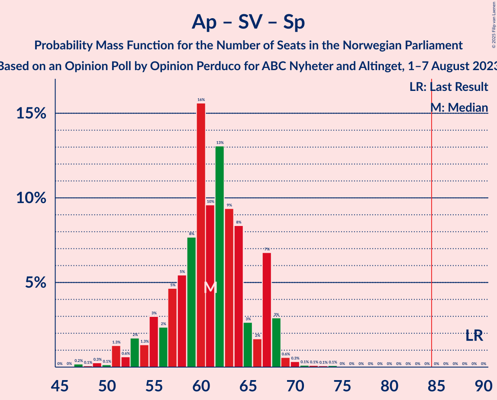

| Number of Seats | Probability | Accumulated | Special Marks |
|:---------------:|:-----------:|:-----------:|:-------------:|
| 47 | 0.2% | 100% |  |
| 48 | 0.1% | 99.8% |  |
| 49 | 0.3% | 99.7% |  |
| 50 | 0.1% | 99.5% |  |
| 51 | 1.3% | 99.3% |  |
| 52 | 0.6% | 98% |  |
| 53 | 2% | 97% |  |
| 54 | 1.3% | 96% |  |
| 55 | 3% | 94% |  |
| 56 | 2% | 91% |  |
| 57 | 5% | 89% |  |
| 58 | 5% | 84% |  |
| 59 | 8% | 79% |  |
| 60 | 16% | 71% | Median |
| 61 | 10% | 56% |  |
| 62 | 13% | 46% |  |
| 63 | 9% | 33% |  |
| 64 | 8% | 24% |  |
| 65 | 3% | 15% |  |
| 66 | 2% | 13% |  |
| 67 | 7% | 11% |  |
| 68 | 3% | 4% |  |
| 69 | 0.6% | 1.3% |  |
| 70 | 0.3% | 0.7% |  |
| 71 | 0.1% | 0.4% |  |
| 72 | 0.1% | 0.3% |  |
| 73 | 0.1% | 0.2% |  |
| 74 | 0.1% | 0.1% |  |
| 75 | 0% | 0% |  |
| 76 | 0% | 0% |  |
| 77 | 0% | 0% |  |
| 78 | 0% | 0% |  |
| 79 | 0% | 0% |  |
| 80 | 0% | 0% |  |
| 81 | 0% | 0% |  |
| 82 | 0% | 0% |  |
| 83 | 0% | 0% |  |
| 84 | 0% | 0% |  |
| 85 | 0% | 0% | Majority |
| 86 | 0% | 0% |  |
| 87 | 0% | 0% |  |
| 88 | 0% | 0% |  |
| 89 | 0% | 0% | Last Result |

### Arbeiderpartiet – Senterpartiet – Miljøpartiet De Grønne – Kristelig Folkeparti

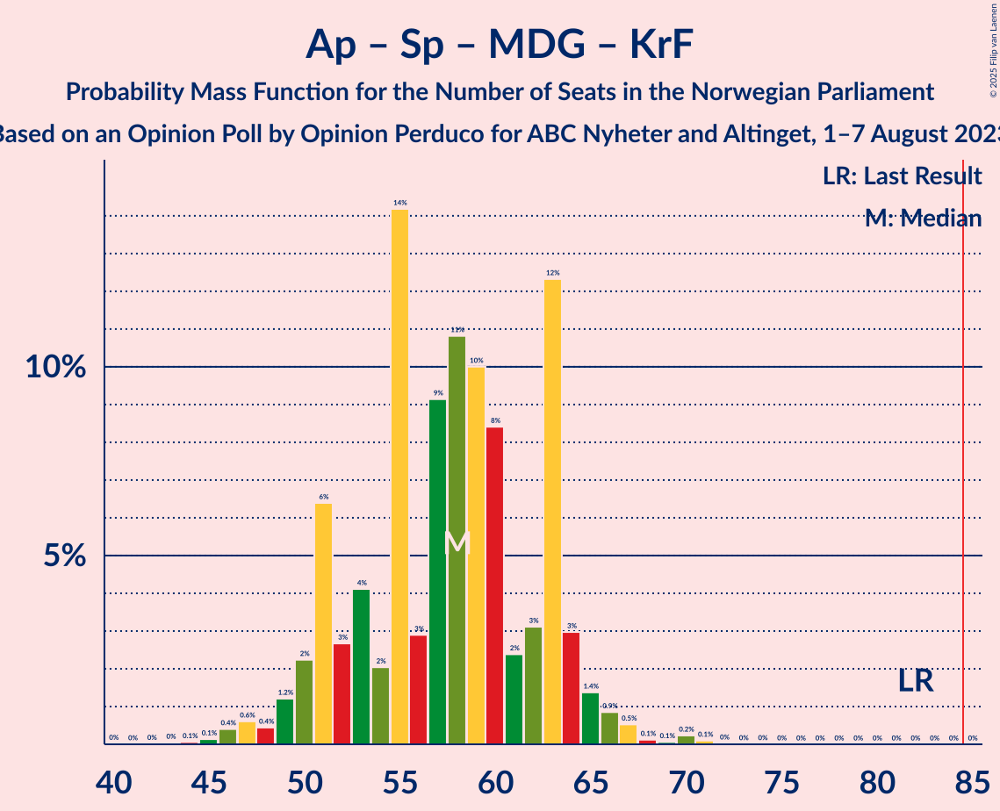

| Number of Seats | Probability | Accumulated | Special Marks |
|:---------------:|:-----------:|:-----------:|:-------------:|
| 43 | 0% | 100% |  |
| 44 | 0.1% | 99.9% |  |
| 45 | 0.1% | 99.8% |  |
| 46 | 0.4% | 99.7% |  |
| 47 | 0.6% | 99.3% |  |
| 48 | 0.4% | 98.7% |  |
| 49 | 1.2% | 98% |  |
| 50 | 2% | 97% |  |
| 51 | 6% | 95% |  |
| 52 | 3% | 88% |  |
| 53 | 4% | 86% |  |
| 54 | 2% | 82% |  |
| 55 | 14% | 80% |  |
| 56 | 3% | 65% |  |
| 57 | 9% | 62% | Median |
| 58 | 11% | 53% |  |
| 59 | 10% | 43% |  |
| 60 | 8% | 33% |  |
| 61 | 2% | 24% |  |
| 62 | 3% | 22% |  |
| 63 | 12% | 19% |  |
| 64 | 3% | 6% |  |
| 65 | 1.4% | 3% |  |
| 66 | 0.9% | 2% |  |
| 67 | 0.5% | 1.1% |  |
| 68 | 0.1% | 0.6% |  |
| 69 | 0.1% | 0.4% |  |
| 70 | 0.2% | 0.4% |  |
| 71 | 0.1% | 0.1% |  |
| 72 | 0% | 0% |  |
| 73 | 0% | 0% |  |
| 74 | 0% | 0% |  |
| 75 | 0% | 0% |  |
| 76 | 0% | 0% |  |
| 77 | 0% | 0% |  |
| 78 | 0% | 0% |  |
| 79 | 0% | 0% |  |
| 80 | 0% | 0% |  |
| 81 | 0% | 0% |  |
| 82 | 0% | 0% | Last Result |

### Arbeiderpartiet – Sosialistisk Venstreparti

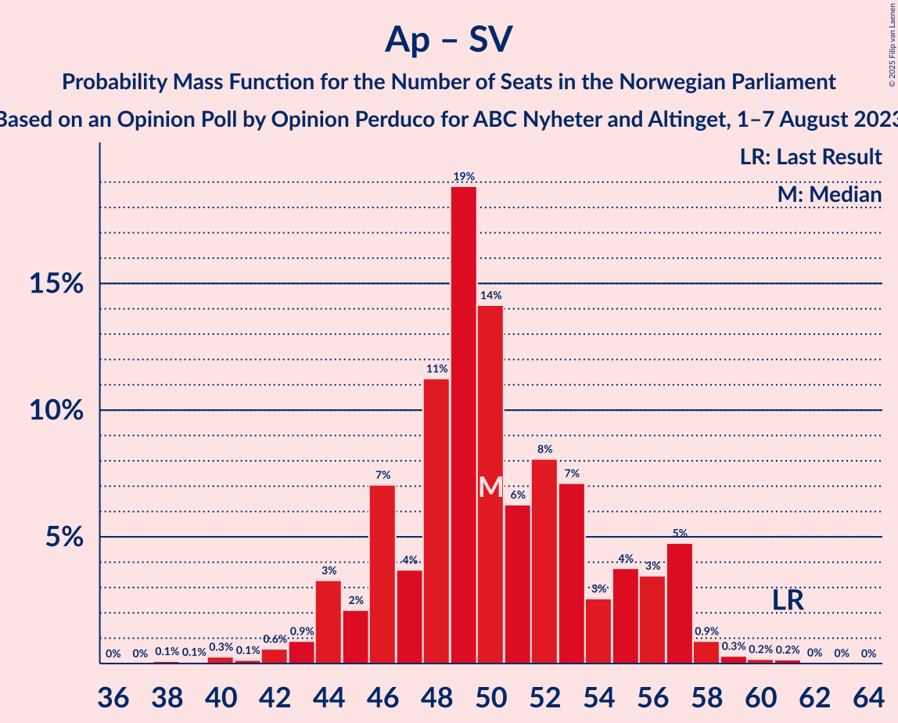

| Number of Seats | Probability | Accumulated | Special Marks |
|:---------------:|:-----------:|:-----------:|:-------------:|
| 38 | 0.1% | 100% |  |
| 39 | 0.1% | 99.9% |  |
| 40 | 0.3% | 99.8% |  |
| 41 | 0.1% | 99.6% |  |
| 42 | 0.6% | 99.4% |  |
| 43 | 0.9% | 98.9% |  |
| 44 | 3% | 98% |  |
| 45 | 2% | 95% |  |
| 46 | 7% | 93% |  |
| 47 | 4% | 86% |  |
| 48 | 11% | 82% |  |
| 49 | 19% | 71% | Median |
| 50 | 14% | 52% |  |
| 51 | 6% | 38% |  |
| 52 | 8% | 31% |  |
| 53 | 7% | 23% |  |
| 54 | 3% | 16% |  |
| 55 | 4% | 14% |  |
| 56 | 3% | 10% |  |
| 57 | 5% | 6% |  |
| 58 | 0.9% | 2% |  |
| 59 | 0.3% | 0.7% |  |
| 60 | 0.2% | 0.4% |  |
| 61 | 0.2% | 0.2% | Last Result |
| 62 | 0% | 0.1% |  |
| 63 | 0% | 0% |  |

### Arbeiderpartiet – Senterpartiet – Kristelig Folkeparti

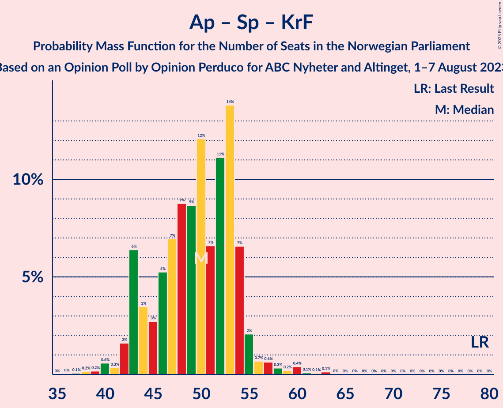

| Number of Seats | Probability | Accumulated | Special Marks |
|:---------------:|:-----------:|:-----------:|:-------------:|
| 36 | 0% | 100% |  |
| 37 | 0.1% | 99.9% |  |
| 38 | 0.2% | 99.9% |  |
| 39 | 0.2% | 99.7% |  |
| 40 | 0.6% | 99.6% |  |
| 41 | 0.3% | 99.0% |  |
| 42 | 2% | 98.6% |  |
| 43 | 6% | 97% |  |
| 44 | 3% | 91% |  |
| 45 | 3% | 87% |  |
| 46 | 5% | 84% |  |
| 47 | 7% | 79% |  |
| 48 | 9% | 72% | Median |
| 49 | 9% | 63% |  |
| 50 | 12% | 55% |  |
| 51 | 7% | 43% |  |
| 52 | 11% | 36% |  |
| 53 | 14% | 25% |  |
| 54 | 7% | 11% |  |
| 55 | 2% | 5% |  |
| 56 | 0.7% | 3% |  |
| 57 | 0.6% | 2% |  |
| 58 | 0.3% | 1.2% |  |
| 59 | 0.2% | 0.9% |  |
| 60 | 0.4% | 0.7% |  |
| 61 | 0.1% | 0.3% |  |
| 62 | 0.1% | 0.2% |  |
| 63 | 0.1% | 0.1% |  |
| 64 | 0% | 0% |  |
| 65 | 0% | 0% |  |
| 66 | 0% | 0% |  |
| 67 | 0% | 0% |  |
| 68 | 0% | 0% |  |
| 69 | 0% | 0% |  |
| 70 | 0% | 0% |  |
| 71 | 0% | 0% |  |
| 72 | 0% | 0% |  |
| 73 | 0% | 0% |  |
| 74 | 0% | 0% |  |
| 75 | 0% | 0% |  |
| 76 | 0% | 0% |  |
| 77 | 0% | 0% |  |
| 78 | 0% | 0% |  |
| 79 | 0% | 0% | Last Result |

### Arbeiderpartiet – Senterpartiet

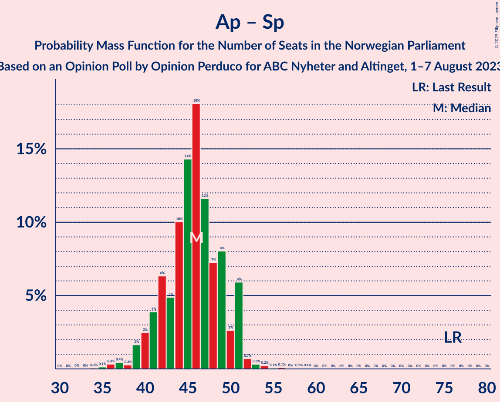

| Number of Seats | Probability | Accumulated | Special Marks |
|:---------------:|:-----------:|:-----------:|:-------------:|
| 33 | 0% | 100% |  |
| 34 | 0.1% | 99.9% |  |
| 35 | 0.1% | 99.9% |  |
| 36 | 0.3% | 99.7% |  |
| 37 | 0.4% | 99.4% |  |
| 38 | 0.3% | 98.9% |  |
| 39 | 2% | 98.7% |  |
| 40 | 2% | 97% |  |
| 41 | 4% | 95% |  |
| 42 | 6% | 91% |  |
| 43 | 5% | 84% |  |
| 44 | 10% | 79% |  |
| 45 | 14% | 69% | Median |
| 46 | 18% | 55% |  |
| 47 | 12% | 37% |  |
| 48 | 7% | 25% |  |
| 49 | 8% | 18% |  |
| 50 | 3% | 10% |  |
| 51 | 6% | 7% |  |
| 52 | 0.7% | 2% |  |
| 53 | 0.3% | 0.9% |  |
| 54 | 0.2% | 0.5% |  |
| 55 | 0.1% | 0.3% |  |
| 56 | 0.1% | 0.3% |  |
| 57 | 0% | 0.2% |  |
| 58 | 0.1% | 0.1% |  |
| 59 | 0.1% | 0.1% |  |
| 60 | 0% | 0% |  |
| 61 | 0% | 0% |  |
| 62 | 0% | 0% |  |
| 63 | 0% | 0% |  |
| 64 | 0% | 0% |  |
| 65 | 0% | 0% |  |
| 66 | 0% | 0% |  |
| 67 | 0% | 0% |  |
| 68 | 0% | 0% |  |
| 69 | 0% | 0% |  |
| 70 | 0% | 0% |  |
| 71 | 0% | 0% |  |
| 72 | 0% | 0% |  |
| 73 | 0% | 0% |  |
| 74 | 0% | 0% |  |
| 75 | 0% | 0% |  |
| 76 | 0% | 0% | Last Result |

### Senterpartiet – Kristelig Folkeparti – Venstre

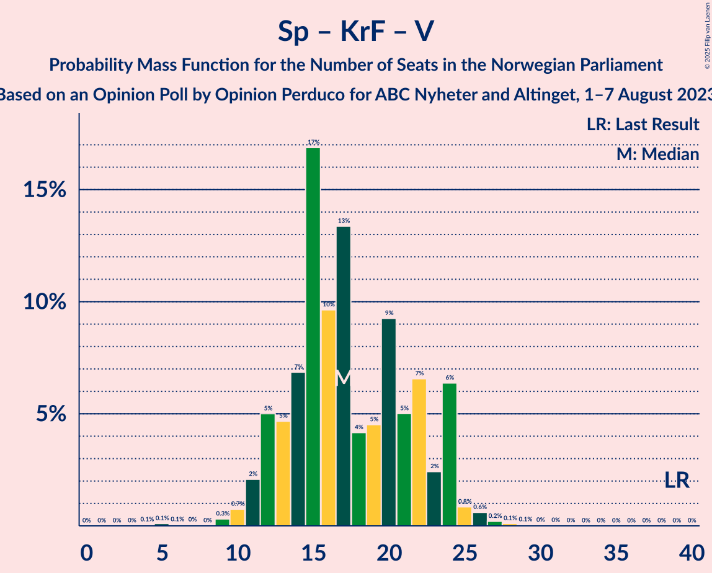

| Number of Seats | Probability | Accumulated | Special Marks |
|:---------------:|:-----------:|:-----------:|:-------------:|
| 4 | 0.1% | 100% |  |
| 5 | 0.1% | 99.9% |  |
| 6 | 0.1% | 99.8% |  |
| 7 | 0% | 99.8% |  |
| 8 | 0% | 99.7% |  |
| 9 | 0.3% | 99.7% |  |
| 10 | 0.7% | 99.4% |  |
| 11 | 2% | 98.7% |  |
| 12 | 5% | 97% |  |
| 13 | 5% | 92% |  |
| 14 | 7% | 87% |  |
| 15 | 17% | 80% |  |
| 16 | 10% | 63% | Median |
| 17 | 13% | 54% |  |
| 18 | 4% | 40% |  |
| 19 | 5% | 36% |  |
| 20 | 9% | 32% |  |
| 21 | 5% | 22% |  |
| 22 | 7% | 17% |  |
| 23 | 2% | 11% |  |
| 24 | 6% | 8% |  |
| 25 | 0.8% | 2% |  |
| 26 | 0.6% | 1.0% |  |
| 27 | 0.2% | 0.4% |  |
| 28 | 0.1% | 0.2% |  |
| 29 | 0.1% | 0.1% |  |
| 30 | 0% | 0.1% |  |
| 31 | 0% | 0% |  |
| 32 | 0% | 0% |  |
| 33 | 0% | 0% |  |
| 34 | 0% | 0% |  |
| 35 | 0% | 0% |  |
| 36 | 0% | 0% |  |
| 37 | 0% | 0% |  |
| 38 | 0% | 0% |  |
| 39 | 0% | 0% | Last Result |

## Technical Information

### Opinion Poll

+ **Polling firm:** Opinion Perduco
+ **Commissioner(s):** ABC Nyheter and Altinget
+ **Fieldwork period:** 1–7 August 2023

### Calculations

+ **Sample size:** 680
+ **Simulations done:** 1,048,576
+ **Error estimate:** 1.72%

