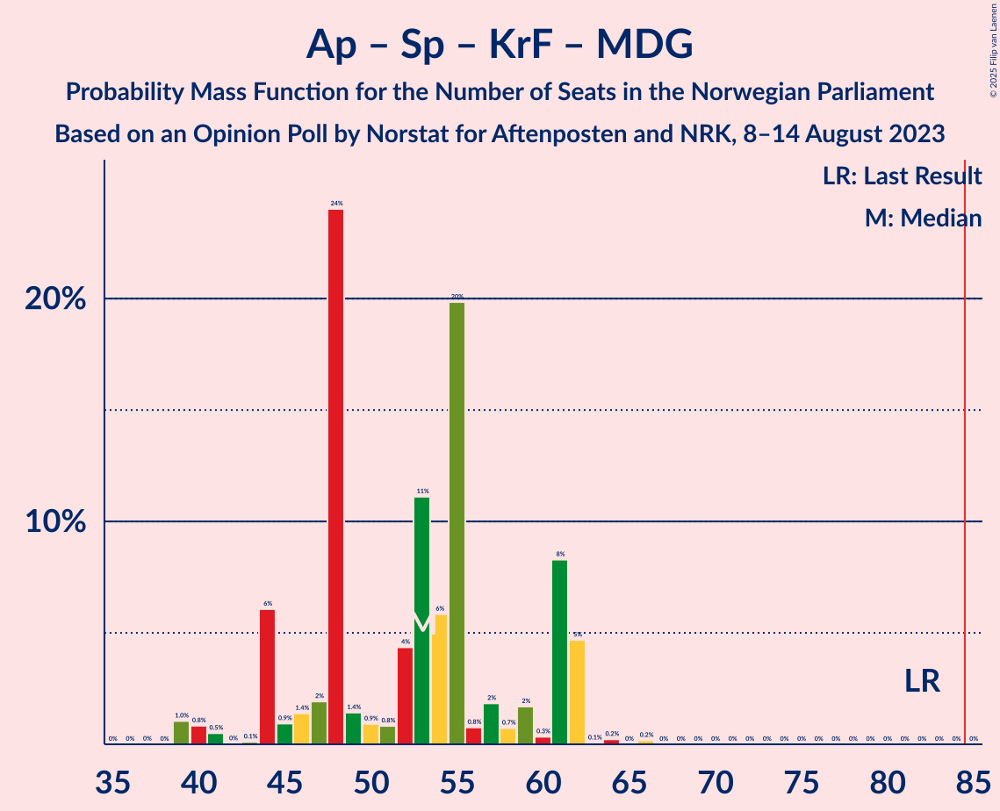

# Opinion Poll by Norstat for Aftenposten and NRK, 8–14 August 2023

<a href="#voting-intentions">Voting Intentions</a> | <a href="#seats">Seats</a> | <a href="#coalitions">Coalitions</a> | <a href="#technical-information">Technical Information</a>

## Voting Intentions

### Confidence Intervals

| Party | Last Result | Poll Result | 80% Confidence Interval | 90% Confidence Interval | 95% Confidence Interval | 99% Confidence Interval |
|:-----:|:-----------:|:-----------:|:-----------------------:|:-----------------------:|:-----------------------:|:-----------------------:|
| Høyre | 20.4% | 31.1% | 28.9–33.4% |28.3–34.1% |27.8–34.6% |26.7–35.8% |
| Arbeiderpartiet | 26.2% | 17.4% | 15.7–19.4% |15.2–19.9% |14.8–20.4% |14.0–21.4% |
| Fremskrittspartiet | 11.6% | 12.7% | 11.2–14.4% |10.8–14.9% |10.4–15.4% |9.8–16.2% |
| Sosialistisk Venstreparti | 7.6% | 9.6% | 8.3–11.1% |7.9–11.6% |7.6–12.0% |7.0–12.8% |
| Senterpartiet | 13.5% | 6.6% | 5.5–7.9% |5.2–8.3% |5.0–8.7% |4.5–9.3% |
| Rødt | 4.7% | 5.3% | 4.3–6.5% |4.1–6.9% |3.9–7.2% |3.4–7.8% |
| Venstre | 4.6% | 4.6% | 3.7–5.7% |3.5–6.1% |3.2–6.4% |2.9–7.0% |
| Miljøpartiet De Grønne | 3.9% | 3.1% | 2.4–4.2% |2.2–4.5% |2.1–4.7% |1.8–5.3% |
| Kristelig Folkeparti | 3.8% | 3.1% | 2.4–4.2% |2.2–4.5% |2.1–4.7% |1.8–5.3% |
| Industri- og Næringspartiet | 0.3% | 2.1% | 1.6–3.0% |1.4–3.3% |1.3–3.5% |1.1–4.0% |
| Pensjonistpartiet | 0.6% | 0.7% | 0.4–1.3% |0.4–1.5% |0.3–1.7% |0.2–2.0% |
| Folkets parti | 0.1% | 0.6% | 0.3–1.1% |0.3–1.3% |0.2–1.5% |0.2–1.8% |
| Konservativt | 0.4% | 0.3% | 0.2–0.8% |0.1–0.9% |0.1–1.0% |0.0–1.3% |
| Liberalistene | 0.2% | 0.1% | 0.1–0.6% |0.0–0.7% |0.0–0.8% |0.0–1.1% |

*Note:* The poll result column reflects the actual value used in the calculations. Published results may vary slightly, and in addition be rounded to fewer digits.

## Seats

### Confidence Intervals

| Party | Last Result | Median | 80% Confidence Interval | 90% Confidence Interval | 95% Confidence Interval | 99% Confidence Interval |
|:-----:|:-----------:|:------:|:-----------------------:|:-----------------------:|:-----------------------:|:-----------------------:|
| <a href="#høyre">Høyre</a> | 36 | 55 | 50–59 |49–62 |49–64 |48–67 |
| <a href="#arbeiderpartiet">Arbeiderpartiet</a> | 48 | 32 | 30–36 |25–39 |25–39 |25–42 |
| <a href="#fremskrittspartiet">Fremskrittspartiet</a> | 21 | 22 | 20–27 |19–27 |18–28 |18–32 |
| <a href="#sosialistisk-venstreparti">Sosialistisk Venstreparti</a> | 13 | 17 | 15–20 |15–20 |14–22 |11–23 |
| <a href="#senterpartiet">Senterpartiet</a> | 28 | 13 | 11–15 |9–16 |9–17 |1–17 |
| <a href="#rødt">Rødt</a> | 8 | 11 | 8–14 |7–14 |7–15 |1–16 |
| <a href="#venstre">Venstre</a> | 8 | 8 | 3–11 |3–12 |2–12 |2–13 |
| <a href="#miljøpartiet-de-grønne">Miljøpartiet De Grønne</a> | 3 | 2 | 1–8 |1–9 |1–9 |0–10 |
| <a href="#kristelig-folkeparti">Kristelig Folkeparti</a> | 3 | 2 | 2–3 |1–8 |0–9 |0–11 |
| <a href="#industri--og-næringspartiet">Industri- og Næringspartiet</a> | 0 | 2 | 0–2 |0–2 |0–3 |0–3 |
| <a href="#pensjonistpartiet">Pensjonistpartiet</a> | 0 | 0 | 0 |0 |0 |0 |
| <a href="#folkets-parti">Folkets parti</a> | 0 | 0 | 0–1 |0–1 |0–1 |0–1 |
| <a href="#konservativt">Konservativt</a> | 0 | 0 | 0 |0 |0 |0 |
| <a href="#liberalistene">Liberalistene</a> | 0 | 0 | 0 |0 |0 |0 |

### Høyre

*For a full overview of the results for this party, see the [Høyre](party-høyre.html) page.*

| Number of Seats | Probability | Accumulated | Special Marks |
|:---------------:|:-----------:|:-----------:|:-------------:|
| 36 | 0% | 100% | Last Result |
| 37 | 0% | 100% |  |
| 38 | 0% | 100% |  |
| 39 | 0% | 100% |  |
| 40 | 0% | 100% |  |
| 41 | 0% | 100% |  |
| 42 | 0% | 100% |  |
| 43 | 0% | 100% |  |
| 44 | 0% | 100% |  |
| 45 | 0% | 100% |  |
| 46 | 0.1% | 100% |  |
| 47 | 0.3% | 99.8% |  |
| 48 | 0.6% | 99.5% |  |
| 49 | 5% | 98.9% |  |
| 50 | 17% | 94% |  |
| 51 | 4% | 76% |  |
| 52 | 11% | 72% |  |
| 53 | 9% | 61% |  |
| 54 | 2% | 52% |  |
| 55 | 3% | 50% | Median |
| 56 | 6% | 47% |  |
| 57 | 7% | 41% |  |
| 58 | 24% | 34% |  |
| 59 | 3% | 11% |  |
| 60 | 1.3% | 8% |  |
| 61 | 0.6% | 6% |  |
| 62 | 1.0% | 6% |  |
| 63 | 2% | 5% |  |
| 64 | 0.9% | 3% |  |
| 65 | 0.2% | 2% |  |
| 66 | 0.5% | 2% |  |
| 67 | 1.4% | 1.5% |  |
| 68 | 0% | 0% |  |

### Arbeiderpartiet

*For a full overview of the results for this party, see the [Arbeiderpartiet](party-arbeiderpartiet.html) page.*

| Number of Seats | Probability | Accumulated | Special Marks |
|:---------------:|:-----------:|:-----------:|:-------------:|
| 24 | 0% | 100% |  |
| 25 | 6% | 99.9% |  |
| 26 | 0% | 94% |  |
| 27 | 0.7% | 94% |  |
| 28 | 0.3% | 94% |  |
| 29 | 2% | 93% |  |
| 30 | 3% | 91% |  |
| 31 | 18% | 88% |  |
| 32 | 27% | 70% | Median |
| 33 | 9% | 43% |  |
| 34 | 4% | 34% |  |
| 35 | 5% | 30% |  |
| 36 | 17% | 25% |  |
| 37 | 1.2% | 9% |  |
| 38 | 0.8% | 7% |  |
| 39 | 5% | 6% |  |
| 40 | 0.1% | 1.1% |  |
| 41 | 0.3% | 1.0% |  |
| 42 | 0.5% | 0.7% |  |
| 43 | 0% | 0.3% |  |
| 44 | 0.2% | 0.2% |  |
| 45 | 0% | 0% |  |
| 46 | 0% | 0% |  |
| 47 | 0% | 0% |  |
| 48 | 0% | 0% | Last Result |

### Fremskrittspartiet

*For a full overview of the results for this party, see the [Fremskrittspartiet](party-fremskrittspartiet.html) page.*

| Number of Seats | Probability | Accumulated | Special Marks |
|:---------------:|:-----------:|:-----------:|:-------------:|
| 17 | 0.2% | 100% |  |
| 18 | 3% | 99.8% |  |
| 19 | 6% | 97% |  |
| 20 | 5% | 91% |  |
| 21 | 6% | 86% | Last Result |
| 22 | 33% | 80% | Median |
| 23 | 8% | 47% |  |
| 24 | 5% | 39% |  |
| 25 | 20% | 34% |  |
| 26 | 3% | 14% |  |
| 27 | 7% | 11% |  |
| 28 | 0.7% | 3% |  |
| 29 | 0.8% | 2% |  |
| 30 | 0.8% | 2% |  |
| 31 | 0.2% | 0.8% |  |
| 32 | 0.6% | 0.7% |  |
| 33 | 0% | 0% |  |

### Sosialistisk Venstreparti

*For a full overview of the results for this party, see the [Sosialistisk Venstreparti](party-sosialistiskvenstreparti.html) page.*

| Number of Seats | Probability | Accumulated | Special Marks |
|:---------------:|:-----------:|:-----------:|:-------------:|
| 10 | 0.1% | 100% |  |
| 11 | 0.5% | 99.9% |  |
| 12 | 0.5% | 99.4% |  |
| 13 | 0.6% | 98.9% | Last Result |
| 14 | 2% | 98% |  |
| 15 | 6% | 96% |  |
| 16 | 25% | 90% |  |
| 17 | 22% | 64% | Median |
| 18 | 10% | 43% |  |
| 19 | 17% | 33% |  |
| 20 | 10% | 15% |  |
| 21 | 2% | 5% |  |
| 22 | 2% | 3% |  |
| 23 | 1.1% | 1.2% |  |
| 24 | 0% | 0.1% |  |
| 25 | 0% | 0.1% |  |
| 26 | 0.1% | 0.1% |  |
| 27 | 0% | 0% |  |

### Senterpartiet

*For a full overview of the results for this party, see the [Senterpartiet](party-senterpartiet.html) page.*

| Number of Seats | Probability | Accumulated | Special Marks |
|:---------------:|:-----------:|:-----------:|:-------------:|
| 1 | 2% | 100% |  |
| 2 | 0% | 98% |  |
| 3 | 0% | 98% |  |
| 4 | 0% | 98% |  |
| 5 | 0% | 98% |  |
| 6 | 0% | 98% |  |
| 7 | 0.1% | 98% |  |
| 8 | 0.5% | 98% |  |
| 9 | 4% | 98% |  |
| 10 | 2% | 94% |  |
| 11 | 5% | 92% |  |
| 12 | 32% | 86% |  |
| 13 | 16% | 55% | Median |
| 14 | 20% | 39% |  |
| 15 | 10% | 19% |  |
| 16 | 6% | 9% |  |
| 17 | 3% | 3% |  |
| 18 | 0.1% | 0.2% |  |
| 19 | 0.1% | 0.1% |  |
| 20 | 0% | 0% |  |
| 21 | 0% | 0% |  |
| 22 | 0% | 0% |  |
| 23 | 0% | 0% |  |
| 24 | 0% | 0% |  |
| 25 | 0% | 0% |  |
| 26 | 0% | 0% |  |
| 27 | 0% | 0% |  |
| 28 | 0% | 0% | Last Result |

### Rødt

*For a full overview of the results for this party, see the [Rødt](party-rødt.html) page.*

| Number of Seats | Probability | Accumulated | Special Marks |
|:---------------:|:-----------:|:-----------:|:-------------:|
| 1 | 2% | 100% |  |
| 2 | 0% | 98% |  |
| 3 | 0% | 98% |  |
| 4 | 0% | 98% |  |
| 5 | 0% | 98% |  |
| 6 | 0% | 98% |  |
| 7 | 6% | 98% |  |
| 8 | 6% | 92% | Last Result |
| 9 | 14% | 86% |  |
| 10 | 8% | 72% |  |
| 11 | 23% | 64% | Median |
| 12 | 11% | 41% |  |
| 13 | 0.6% | 29% |  |
| 14 | 26% | 29% |  |
| 15 | 0.3% | 3% |  |
| 16 | 2% | 2% |  |
| 17 | 0% | 0.1% |  |
| 18 | 0% | 0% |  |

### Venstre

*For a full overview of the results for this party, see the [Venstre](party-venstre.html) page.*

| Number of Seats | Probability | Accumulated | Special Marks |
|:---------------:|:-----------:|:-----------:|:-------------:|
| 1 | 0.1% | 100% |  |
| 2 | 4% | 99.9% |  |
| 3 | 12% | 95% |  |
| 4 | 0% | 83% |  |
| 5 | 0% | 83% |  |
| 6 | 0% | 83% |  |
| 7 | 2% | 83% |  |
| 8 | 48% | 81% | Last Result, Median |
| 9 | 15% | 33% |  |
| 10 | 8% | 18% |  |
| 11 | 1.2% | 11% |  |
| 12 | 8% | 9% |  |
| 13 | 0.8% | 1.1% |  |
| 14 | 0.4% | 0.4% |  |
| 15 | 0% | 0% |  |

### Miljøpartiet De Grønne

*For a full overview of the results for this party, see the [Miljøpartiet De Grønne](party-miljøpartietdegrønne.html) page.*

| Number of Seats | Probability | Accumulated | Special Marks |
|:---------------:|:-----------:|:-----------:|:-------------:|
| 0 | 1.3% | 100% |  |
| 1 | 13% | 98.7% |  |
| 2 | 41% | 86% | Median |
| 3 | 9% | 45% | Last Result |
| 4 | 0% | 36% |  |
| 5 | 0% | 36% |  |
| 6 | 0% | 36% |  |
| 7 | 0.8% | 36% |  |
| 8 | 26% | 35% |  |
| 9 | 8% | 9% |  |
| 10 | 1.4% | 2% |  |
| 11 | 0.1% | 0.1% |  |
| 12 | 0% | 0% |  |

### Kristelig Folkeparti

*For a full overview of the results for this party, see the [Kristelig Folkeparti](party-kristeligfolkeparti.html) page.*

| Number of Seats | Probability | Accumulated | Special Marks |
|:---------------:|:-----------:|:-----------:|:-------------:|
| 0 | 5% | 100% |  |
| 1 | 2% | 95% |  |
| 2 | 76% | 93% | Median |
| 3 | 8% | 17% | Last Result |
| 4 | 0% | 8% |  |
| 5 | 0% | 8% |  |
| 6 | 0% | 8% |  |
| 7 | 1.1% | 8% |  |
| 8 | 4% | 7% |  |
| 9 | 2% | 3% |  |
| 10 | 0.5% | 2% |  |
| 11 | 1.1% | 1.1% |  |
| 12 | 0% | 0% |  |

### Industri- og Næringspartiet

*For a full overview of the results for this party, see the [Industri- og Næringspartiet](party-industri-ognæringspartiet.html) page.*

| Number of Seats | Probability | Accumulated | Special Marks |
|:---------------:|:-----------:|:-----------:|:-------------:|
| 0 | 41% | 100% | Last Result |
| 1 | 7% | 59% |  |
| 2 | 49% | 52% | Median |
| 3 | 2% | 3% |  |
| 4 | 0% | 0.1% |  |
| 5 | 0% | 0.1% |  |
| 6 | 0% | 0.1% |  |
| 7 | 0.1% | 0.1% |  |
| 8 | 0% | 0% |  |

### Pensjonistpartiet

*For a full overview of the results for this party, see the [Pensjonistpartiet](party-pensjonistpartiet.html) page.*

| Number of Seats | Probability | Accumulated | Special Marks |
|:---------------:|:-----------:|:-----------:|:-------------:|
| 0 | 100% | 100% | Last Result, Median |

### Folkets parti

*For a full overview of the results for this party, see the [Folkets parti](party-folketsparti.html) page.*

| Number of Seats | Probability | Accumulated | Special Marks |
|:---------------:|:-----------:|:-----------:|:-------------:|
| 0 | 89% | 100% | Last Result, Median |
| 1 | 11% | 11% |  |
| 2 | 0.1% | 0.1% |  |
| 3 | 0% | 0% |  |

### Konservativt

*For a full overview of the results for this party, see the [Konservativt](party-konservativt.html) page.*

| Number of Seats | Probability | Accumulated | Special Marks |
|:---------------:|:-----------:|:-----------:|:-------------:|
| 0 | 100% | 100% | Last Result, Median |

### Liberalistene

*For a full overview of the results for this party, see the [Liberalistene](party-liberalistene.html) page.*

| Number of Seats | Probability | Accumulated | Special Marks |
|:---------------:|:-----------:|:-----------:|:-------------:|
| 0 | 100% | 100% | Last Result, Median |

## Coalitions

### Confidence Intervals

| Coalition | Last Result | Median | Majority? | 80% Confidence Interval | 90% Confidence Interval | 95% Confidence Interval | 99% Confidence Interval |
|:---------:|:-----------:|:------:|:---------:|:-----------------------:|:-----------------------:|:-----------------------:|:-----------------------:|
| Høyre – Fremskrittspartiet – Senterpartiet – Venstre – Kristelig Folkeparti | 96 | 101 | 100% | 94–108 | 91–114 | 89–114 | 89–114 |
| Høyre – Fremskrittspartiet – Venstre – Kristelig Folkeparti – Miljøpartiet De Grønne | 71 | 92 | 99.6% | 86–99 | 85–100 | 85–102 | 85–106 |
| Høyre – Fremskrittspartiet – Venstre – Kristelig Folkeparti | 68 | 88 | 86% | 79–96 | 77–98 | 77–98 | 77–105 |
| Høyre – Fremskrittspartiet – Venstre | 65 | 84 | 50% | 77–93 | 75–96 | 75–96 | 75–101 |
| Arbeiderpartiet – Sosialistisk Venstreparti – Senterpartiet – Rødt – Miljøpartiet De Grønne | 100 | 78 | 11% | 70–89 | 70–90 | 67–91 | 63–91 |
| Høyre – Fremskrittspartiet | 57 | 77 | 6% | 72–84 | 72–86 | 72–87 | 71–93 |
| Arbeiderpartiet – Sosialistisk Venstreparti – Senterpartiet – Rødt | 97 | 74 | 0% | 69–80 | 66–83 | 65–83 | 62–83 |
| Arbeiderpartiet – Sosialistisk Venstreparti – Senterpartiet – Kristelig Folkeparti – Miljøpartiet De Grønne | 95 | 72 | 0% | 63–79 | 62–80 | 61–82 | 58–82 |
| Arbeiderpartiet – Sosialistisk Venstreparti – Senterpartiet – Miljøpartiet De Grønne | 92 | 67 | 0% | 61–77 | 60–78 | 59–80 | 55–80 |
| Arbeiderpartiet – Sosialistisk Venstreparti – Rødt – Miljøpartiet De Grønne | 72 | 65 | 0% | 58–74 | 54–75 | 54–79 | 54–79 |
| Høyre – Venstre – Kristelig Folkeparti | 47 | 66 | 0% | 58–71 | 55–73 | 54–75 | 54–78 |
| Arbeiderpartiet – Sosialistisk Venstreparti – Senterpartiet | 89 | 62 | 0% | 60–69 | 58–70 | 56–71 | 54–71 |
| Arbeiderpartiet – Senterpartiet – Kristelig Folkeparti – Miljøpartiet De Grønne | 82 | 53 | 0% | 46–61 | 44–62 | 43–62 | 39–62 |
| Arbeiderpartiet – Senterpartiet – Kristelig Folkeparti | 79 | 47 | 0% | 44–53 | 43–54 | 41–58 | 36–58 |
| Arbeiderpartiet – Sosialistisk Venstreparti | 61 | 48 | 0% | 47–56 | 44–57 | 44–57 | 43–59 |
| Arbeiderpartiet – Senterpartiet | 76 | 45 | 0% | 41–51 | 41–51 | 38–51 | 34–54 |
| Senterpartiet – Venstre – Kristelig Folkeparti | 39 | 23 | 0% | 17–30 | 15–30 | 14–32 | 12–35 |

### Høyre – Fremskrittspartiet – Senterpartiet – Venstre – Kristelig Folkeparti

| Number of Seats | Probability | Accumulated | Special Marks |
|:---------------:|:-----------:|:-----------:|:-------------:|
| 89 | 5% | 100% |  |
| 90 | 0.1% | 95% |  |
| 91 | 0.1% | 95% |  |
| 92 | 4% | 95% |  |
| 93 | 0.2% | 91% |  |
| 94 | 2% | 90% |  |
| 95 | 0.5% | 89% |  |
| 96 | 2% | 88% | Last Result |
| 97 | 2% | 86% |  |
| 98 | 12% | 84% |  |
| 99 | 18% | 72% |  |
| 100 | 2% | 54% | Median |
| 101 | 3% | 52% |  |
| 102 | 24% | 48% |  |
| 103 | 5% | 25% |  |
| 104 | 0.7% | 20% |  |
| 105 | 3% | 19% |  |
| 106 | 2% | 16% |  |
| 107 | 2% | 14% |  |
| 108 | 2% | 12% |  |
| 109 | 1.1% | 9% |  |
| 110 | 1.0% | 8% |  |
| 111 | 0.1% | 7% |  |
| 112 | 0.8% | 7% |  |
| 113 | 0.6% | 7% |  |
| 114 | 6% | 6% |  |
| 115 | 0% | 0.2% |  |
| 116 | 0% | 0.2% |  |
| 117 | 0% | 0.2% |  |
| 118 | 0% | 0.1% |  |
| 119 | 0.1% | 0.1% |  |
| 120 | 0% | 0% |  |

### Høyre – Fremskrittspartiet – Venstre – Kristelig Folkeparti – Miljøpartiet De Grønne

| Number of Seats | Probability | Accumulated | Special Marks |
|:---------------:|:-----------:|:-----------:|:-------------:|
| 71 | 0% | 100% | Last Result |
| 72 | 0% | 100% |  |
| 73 | 0% | 100% |  |
| 74 | 0% | 100% |  |
| 75 | 0% | 100% |  |
| 76 | 0% | 100% |  |
| 77 | 0% | 100% |  |
| 78 | 0% | 100% |  |
| 79 | 0% | 100% |  |
| 80 | 0.1% | 100% |  |
| 81 | 0% | 99.9% |  |
| 82 | 0.1% | 99.9% |  |
| 83 | 0.1% | 99.8% |  |
| 84 | 0% | 99.6% |  |
| 85 | 5% | 99.6% | Majority |
| 86 | 5% | 95% |  |
| 87 | 9% | 90% |  |
| 88 | 5% | 80% |  |
| 89 | 2% | 75% | Median |
| 90 | 1.0% | 73% |  |
| 91 | 1.0% | 72% |  |
| 92 | 25% | 71% |  |
| 93 | 22% | 47% |  |
| 94 | 4% | 25% |  |
| 95 | 3% | 21% |  |
| 96 | 1.0% | 18% |  |
| 97 | 2% | 17% |  |
| 98 | 3% | 15% |  |
| 99 | 7% | 12% |  |
| 100 | 1.1% | 5% |  |
| 101 | 0.9% | 4% |  |
| 102 | 2% | 3% |  |
| 103 | 0.1% | 1.2% |  |
| 104 | 0.1% | 1.2% |  |
| 105 | 0.1% | 1.1% |  |
| 106 | 0.7% | 1.0% |  |
| 107 | 0.3% | 0.3% |  |
| 108 | 0% | 0.1% |  |
| 109 | 0% | 0% |  |

### Høyre – Fremskrittspartiet – Venstre – Kristelig Folkeparti

| Number of Seats | Probability | Accumulated | Special Marks |
|:---------------:|:-----------:|:-----------:|:-------------:|
| 68 | 0% | 100% | Last Result |
| 69 | 0% | 100% |  |
| 70 | 0% | 100% |  |
| 71 | 0% | 100% |  |
| 72 | 0% | 100% |  |
| 73 | 0% | 100% |  |
| 74 | 0% | 100% |  |
| 75 | 0% | 100% |  |
| 76 | 0% | 100% |  |
| 77 | 9% | 100% |  |
| 78 | 0.1% | 91% |  |
| 79 | 1.1% | 91% |  |
| 80 | 0.2% | 90% |  |
| 81 | 0.2% | 89% |  |
| 82 | 0.7% | 89% |  |
| 83 | 0.3% | 89% |  |
| 84 | 2% | 88% |  |
| 85 | 28% | 86% | Majority |
| 86 | 6% | 58% |  |
| 87 | 0.9% | 53% | Median |
| 88 | 2% | 52% |  |
| 89 | 0.6% | 50% |  |
| 90 | 24% | 49% |  |
| 91 | 2% | 25% |  |
| 92 | 3% | 23% |  |
| 93 | 5% | 20% |  |
| 94 | 0.3% | 14% |  |
| 95 | 3% | 14% |  |
| 96 | 2% | 11% |  |
| 97 | 0.4% | 10% |  |
| 98 | 7% | 9% |  |
| 99 | 0.8% | 2% |  |
| 100 | 0.9% | 2% |  |
| 101 | 0.1% | 0.8% |  |
| 102 | 0.1% | 0.7% |  |
| 103 | 0% | 0.7% |  |
| 104 | 0% | 0.6% |  |
| 105 | 0.6% | 0.6% |  |
| 106 | 0% | 0% |  |

### Høyre – Fremskrittspartiet – Venstre

| Number of Seats | Probability | Accumulated | Special Marks |
|:---------------:|:-----------:|:-----------:|:-------------:|
| 65 | 0% | 100% | Last Result |
| 66 | 0% | 100% |  |
| 67 | 0% | 100% |  |
| 68 | 0% | 100% |  |
| 69 | 0% | 100% |  |
| 70 | 0% | 100% |  |
| 71 | 0% | 100% |  |
| 72 | 0% | 100% |  |
| 73 | 0% | 100% |  |
| 74 | 0% | 100% |  |
| 75 | 9% | 100% |  |
| 76 | 0.1% | 91% |  |
| 77 | 1.1% | 91% |  |
| 78 | 0.2% | 90% |  |
| 79 | 0.5% | 89% |  |
| 80 | 0.8% | 89% |  |
| 81 | 2% | 88% |  |
| 82 | 3% | 86% |  |
| 83 | 28% | 83% |  |
| 84 | 6% | 55% |  |
| 85 | 3% | 50% | Median, Majority |
| 86 | 3% | 47% |  |
| 87 | 1.1% | 44% |  |
| 88 | 24% | 43% |  |
| 89 | 0.4% | 19% |  |
| 90 | 4% | 19% |  |
| 91 | 0.9% | 14% |  |
| 92 | 1.2% | 13% |  |
| 93 | 2% | 12% |  |
| 94 | 0.3% | 10% |  |
| 95 | 0.7% | 9% |  |
| 96 | 7% | 9% |  |
| 97 | 0.1% | 2% |  |
| 98 | 0.1% | 2% |  |
| 99 | 1.1% | 2% |  |
| 100 | 0% | 0.5% |  |
| 101 | 0% | 0.5% |  |
| 102 | 0.5% | 0.5% |  |
| 103 | 0% | 0% |  |

### Arbeiderpartiet – Sosialistisk Venstreparti – Senterpartiet – Rødt – Miljøpartiet De Grønne

| Number of Seats | Probability | Accumulated | Special Marks |
|:---------------:|:-----------:|:-----------:|:-------------:|
| 62 | 0% | 100% |  |
| 63 | 0.6% | 99.9% |  |
| 64 | 0.1% | 99.3% |  |
| 65 | 1.1% | 99.3% |  |
| 66 | 0% | 98% |  |
| 67 | 0.8% | 98% |  |
| 68 | 1.2% | 97% |  |
| 69 | 0.1% | 96% |  |
| 70 | 8% | 96% |  |
| 71 | 0.6% | 88% |  |
| 72 | 2% | 88% |  |
| 73 | 4% | 85% |  |
| 74 | 3% | 81% |  |
| 75 | 2% | 78% | Median |
| 76 | 24% | 76% |  |
| 77 | 1.4% | 52% |  |
| 78 | 3% | 51% |  |
| 79 | 0.5% | 47% |  |
| 80 | 3% | 47% |  |
| 81 | 18% | 44% |  |
| 82 | 14% | 26% |  |
| 83 | 0.6% | 12% |  |
| 84 | 0.7% | 12% |  |
| 85 | 0.3% | 11% | Majority |
| 86 | 0% | 10% |  |
| 87 | 0% | 10% |  |
| 88 | 0.1% | 10% |  |
| 89 | 1.0% | 10% |  |
| 90 | 4% | 9% |  |
| 91 | 5% | 5% |  |
| 92 | 0% | 0% |  |
| 93 | 0% | 0% |  |
| 94 | 0% | 0% |  |
| 95 | 0% | 0% |  |
| 96 | 0% | 0% |  |
| 97 | 0% | 0% |  |
| 98 | 0% | 0% |  |
| 99 | 0% | 0% |  |
| 100 | 0% | 0% | Last Result |

### Høyre – Fremskrittspartiet

| Number of Seats | Probability | Accumulated | Special Marks |
|:---------------:|:-----------:|:-----------:|:-------------:|
| 57 | 0% | 100% | Last Result |
| 58 | 0% | 100% |  |
| 59 | 0% | 100% |  |
| 60 | 0% | 100% |  |
| 61 | 0% | 100% |  |
| 62 | 0% | 100% |  |
| 63 | 0% | 100% |  |
| 64 | 0% | 100% |  |
| 65 | 0% | 100% |  |
| 66 | 0% | 100% |  |
| 67 | 0% | 100% |  |
| 68 | 0.2% | 100% |  |
| 69 | 0.1% | 99.8% |  |
| 70 | 0.2% | 99.7% |  |
| 71 | 0.3% | 99.6% |  |
| 72 | 11% | 99.3% |  |
| 73 | 2% | 88% |  |
| 74 | 16% | 86% |  |
| 75 | 18% | 70% |  |
| 76 | 0.9% | 51% |  |
| 77 | 3% | 50% | Median |
| 78 | 2% | 47% |  |
| 79 | 0.8% | 45% |  |
| 80 | 24% | 44% |  |
| 81 | 1.3% | 20% |  |
| 82 | 2% | 19% |  |
| 83 | 1.3% | 17% |  |
| 84 | 9% | 16% |  |
| 85 | 1.3% | 6% | Majority |
| 86 | 0.7% | 5% |  |
| 87 | 2% | 4% |  |
| 88 | 0.2% | 2% |  |
| 89 | 0.1% | 2% |  |
| 90 | 0.5% | 2% |  |
| 91 | 0% | 1.0% |  |
| 92 | 0.5% | 1.0% |  |
| 93 | 0% | 0.5% |  |
| 94 | 0.4% | 0.5% |  |
| 95 | 0% | 0.1% |  |
| 96 | 0% | 0% |  |

### Arbeiderpartiet – Sosialistisk Venstreparti – Senterpartiet – Rødt

| Number of Seats | Probability | Accumulated | Special Marks |
|:---------------:|:-----------:|:-----------:|:-------------:|
| 59 | 0% | 100% |  |
| 60 | 0% | 99.9% |  |
| 61 | 0.3% | 99.9% |  |
| 62 | 0.8% | 99.6% |  |
| 63 | 1.1% | 98.9% |  |
| 64 | 0.1% | 98% |  |
| 65 | 2% | 98% |  |
| 66 | 1.3% | 96% |  |
| 67 | 2% | 95% |  |
| 68 | 0.4% | 93% |  |
| 69 | 7% | 92% |  |
| 70 | 3% | 85% |  |
| 71 | 3% | 82% |  |
| 72 | 5% | 79% |  |
| 73 | 19% | 75% | Median |
| 74 | 24% | 55% |  |
| 75 | 4% | 31% |  |
| 76 | 2% | 27% |  |
| 77 | 1.2% | 25% |  |
| 78 | 1.0% | 24% |  |
| 79 | 1.1% | 23% |  |
| 80 | 12% | 22% |  |
| 81 | 4% | 10% |  |
| 82 | 0.2% | 5% |  |
| 83 | 5% | 5% |  |
| 84 | 0% | 0.1% |  |
| 85 | 0% | 0% | Majority |
| 86 | 0% | 0% |  |
| 87 | 0% | 0% |  |
| 88 | 0% | 0% |  |
| 89 | 0% | 0% |  |
| 90 | 0% | 0% |  |
| 91 | 0% | 0% |  |
| 92 | 0% | 0% |  |
| 93 | 0% | 0% |  |
| 94 | 0% | 0% |  |
| 95 | 0% | 0% |  |
| 96 | 0% | 0% |  |
| 97 | 0% | 0% | Last Result |

### Arbeiderpartiet – Sosialistisk Venstreparti – Senterpartiet – Kristelig Folkeparti – Miljøpartiet De Grønne

| Number of Seats | Probability | Accumulated | Special Marks |
|:---------------:|:-----------:|:-----------:|:-------------:|
| 57 | 0% | 100% |  |
| 58 | 0.5% | 99.9% |  |
| 59 | 0.5% | 99.4% |  |
| 60 | 0% | 99.0% |  |
| 61 | 3% | 99.0% |  |
| 62 | 1.0% | 96% |  |
| 63 | 6% | 94% |  |
| 64 | 22% | 88% |  |
| 65 | 1.3% | 66% |  |
| 66 | 2% | 65% | Median |
| 67 | 2% | 64% |  |
| 68 | 3% | 62% |  |
| 69 | 2% | 59% |  |
| 70 | 3% | 56% |  |
| 71 | 1.4% | 54% |  |
| 72 | 32% | 52% |  |
| 73 | 0.9% | 20% |  |
| 74 | 2% | 19% |  |
| 75 | 1.1% | 17% |  |
| 76 | 0.3% | 16% |  |
| 77 | 3% | 16% |  |
| 78 | 0.5% | 12% |  |
| 79 | 5% | 12% |  |
| 80 | 2% | 6% |  |
| 81 | 0% | 4% |  |
| 82 | 4% | 4% |  |
| 83 | 0.1% | 0.1% |  |
| 84 | 0% | 0% |  |
| 85 | 0% | 0% | Majority |
| 86 | 0% | 0% |  |
| 87 | 0% | 0% |  |
| 88 | 0% | 0% |  |
| 89 | 0% | 0% |  |
| 90 | 0% | 0% |  |
| 91 | 0% | 0% |  |
| 92 | 0% | 0% |  |
| 93 | 0% | 0% |  |
| 94 | 0% | 0% |  |
| 95 | 0% | 0% | Last Result |

### Arbeiderpartiet – Sosialistisk Venstreparti – Senterpartiet – Miljøpartiet De Grønne

| Number of Seats | Probability | Accumulated | Special Marks |
|:---------------:|:-----------:|:-----------:|:-------------:|
| 54 | 0% | 100% |  |
| 55 | 0.6% | 99.9% |  |
| 56 | 0% | 99.3% |  |
| 57 | 0.2% | 99.3% |  |
| 58 | 1.1% | 99.1% |  |
| 59 | 2% | 98% |  |
| 60 | 2% | 96% |  |
| 61 | 6% | 94% |  |
| 62 | 22% | 88% |  |
| 63 | 1.2% | 66% |  |
| 64 | 4% | 65% | Median |
| 65 | 2% | 60% |  |
| 66 | 6% | 59% |  |
| 67 | 5% | 53% |  |
| 68 | 1.0% | 48% |  |
| 69 | 0.5% | 47% |  |
| 70 | 27% | 47% |  |
| 71 | 3% | 19% |  |
| 72 | 2% | 16% |  |
| 73 | 1.1% | 14% |  |
| 74 | 0.3% | 13% |  |
| 75 | 2% | 13% |  |
| 76 | 0.3% | 11% |  |
| 77 | 5% | 11% |  |
| 78 | 1.0% | 5% |  |
| 79 | 0% | 4% |  |
| 80 | 4% | 4% |  |
| 81 | 0% | 0% |  |
| 82 | 0% | 0% |  |
| 83 | 0% | 0% |  |
| 84 | 0% | 0% |  |
| 85 | 0% | 0% | Majority |
| 86 | 0% | 0% |  |
| 87 | 0% | 0% |  |
| 88 | 0% | 0% |  |
| 89 | 0% | 0% |  |
| 90 | 0% | 0% |  |
| 91 | 0% | 0% |  |
| 92 | 0% | 0% | Last Result |

### Arbeiderpartiet – Sosialistisk Venstreparti – Rødt – Miljøpartiet De Grønne

| Number of Seats | Probability | Accumulated | Special Marks |
|:---------------:|:-----------:|:-----------:|:-------------:|
| 49 | 0.1% | 100% |  |
| 50 | 0% | 99.9% |  |
| 51 | 0.1% | 99.8% |  |
| 52 | 0.1% | 99.8% |  |
| 53 | 0% | 99.7% |  |
| 54 | 7% | 99.7% |  |
| 55 | 0.6% | 93% |  |
| 56 | 1.2% | 93% |  |
| 57 | 0.4% | 91% |  |
| 58 | 3% | 91% |  |
| 59 | 1.2% | 88% |  |
| 60 | 2% | 87% |  |
| 61 | 3% | 85% |  |
| 62 | 4% | 82% | Median |
| 63 | 3% | 79% |  |
| 64 | 21% | 75% |  |
| 65 | 7% | 54% |  |
| 66 | 0.6% | 47% |  |
| 67 | 18% | 47% |  |
| 68 | 3% | 28% |  |
| 69 | 11% | 25% |  |
| 70 | 0.5% | 14% |  |
| 71 | 2% | 14% |  |
| 72 | 0.2% | 11% | Last Result |
| 73 | 0.6% | 11% |  |
| 74 | 1.3% | 11% |  |
| 75 | 4% | 9% |  |
| 76 | 0.1% | 5% |  |
| 77 | 0% | 5% |  |
| 78 | 0% | 5% |  |
| 79 | 5% | 5% |  |
| 80 | 0% | 0% |  |

### Høyre – Venstre – Kristelig Folkeparti

| Number of Seats | Probability | Accumulated | Special Marks |
|:---------------:|:-----------:|:-----------:|:-------------:|
| 47 | 0% | 100% | Last Result |
| 48 | 0% | 100% |  |
| 49 | 0% | 100% |  |
| 50 | 0% | 100% |  |
| 51 | 0% | 100% |  |
| 52 | 0% | 100% |  |
| 53 | 0% | 100% |  |
| 54 | 5% | 100% |  |
| 55 | 0.3% | 95% |  |
| 56 | 0.1% | 95% |  |
| 57 | 0.1% | 95% |  |
| 58 | 5% | 95% |  |
| 59 | 0.2% | 90% |  |
| 60 | 19% | 90% |  |
| 61 | 2% | 70% |  |
| 62 | 2% | 68% |  |
| 63 | 11% | 66% |  |
| 64 | 0.7% | 55% |  |
| 65 | 4% | 55% | Median |
| 66 | 4% | 51% |  |
| 67 | 1.3% | 47% |  |
| 68 | 22% | 46% |  |
| 69 | 3% | 23% |  |
| 70 | 4% | 20% |  |
| 71 | 7% | 16% |  |
| 72 | 2% | 9% |  |
| 73 | 2% | 7% |  |
| 74 | 2% | 5% |  |
| 75 | 2% | 3% |  |
| 76 | 0.1% | 0.9% |  |
| 77 | 0.1% | 0.8% |  |
| 78 | 0.6% | 0.7% |  |
| 79 | 0% | 0.2% |  |
| 80 | 0.1% | 0.1% |  |
| 81 | 0% | 0% |  |

### Arbeiderpartiet – Sosialistisk Venstreparti – Senterpartiet

| Number of Seats | Probability | Accumulated | Special Marks |
|:---------------:|:-----------:|:-----------:|:-------------:|
| 51 | 0% | 100% |  |
| 52 | 0% | 99.9% |  |
| 53 | 0.1% | 99.9% |  |
| 54 | 0.7% | 99.8% |  |
| 55 | 0% | 99.1% |  |
| 56 | 2% | 99.1% |  |
| 57 | 0.2% | 97% |  |
| 58 | 3% | 97% |  |
| 59 | 2% | 93% |  |
| 60 | 27% | 92% |  |
| 61 | 3% | 64% |  |
| 62 | 20% | 61% | Median |
| 63 | 5% | 42% |  |
| 64 | 7% | 37% |  |
| 65 | 2% | 29% |  |
| 66 | 0.7% | 27% |  |
| 67 | 2% | 26% |  |
| 68 | 11% | 24% |  |
| 69 | 7% | 13% |  |
| 70 | 1.3% | 6% |  |
| 71 | 5% | 5% |  |
| 72 | 0.2% | 0.4% |  |
| 73 | 0.1% | 0.2% |  |
| 74 | 0% | 0.1% |  |
| 75 | 0.1% | 0.1% |  |
| 76 | 0% | 0% |  |
| 77 | 0% | 0% |  |
| 78 | 0% | 0% |  |
| 79 | 0% | 0% |  |
| 80 | 0% | 0% |  |
| 81 | 0% | 0% |  |
| 82 | 0% | 0% |  |
| 83 | 0% | 0% |  |
| 84 | 0% | 0% |  |
| 85 | 0% | 0% | Majority |
| 86 | 0% | 0% |  |
| 87 | 0% | 0% |  |
| 88 | 0% | 0% |  |
| 89 | 0% | 0% | Last Result |

### Arbeiderpartiet – Senterpartiet – Kristelig Folkeparti – Miljøpartiet De Grønne

| Number of Seats | Probability | Accumulated | Special Marks |
|:---------------:|:-----------:|:-----------:|:-------------:|
| 39 | 1.0% | 100% |  |
| 40 | 0.8% | 98.9% |  |
| 41 | 0.5% | 98% |  |
| 42 | 0% | 98% |  |
| 43 | 0.1% | 98% |  |
| 44 | 6% | 97% |  |
| 45 | 0.9% | 91% |  |
| 46 | 1.4% | 90% |  |
| 47 | 2% | 89% |  |
| 48 | 24% | 87% |  |
| 49 | 1.4% | 63% | Median |
| 50 | 0.9% | 62% |  |
| 51 | 0.8% | 61% |  |
| 52 | 4% | 60% |  |
| 53 | 11% | 56% |  |
| 54 | 6% | 44% |  |
| 55 | 20% | 39% |  |
| 56 | 0.8% | 19% |  |
| 57 | 2% | 18% |  |
| 58 | 0.7% | 16% |  |
| 59 | 2% | 15% |  |
| 60 | 0.3% | 14% |  |
| 61 | 8% | 13% |  |
| 62 | 5% | 5% |  |
| 63 | 0.1% | 0.5% |  |
| 64 | 0.2% | 0.4% |  |
| 65 | 0% | 0.2% |  |
| 66 | 0.2% | 0.2% |  |
| 67 | 0% | 0% |  |
| 68 | 0% | 0% |  |
| 69 | 0% | 0% |  |
| 70 | 0% | 0% |  |
| 71 | 0% | 0% |  |
| 72 | 0% | 0% |  |
| 73 | 0% | 0% |  |
| 74 | 0% | 0% |  |
| 75 | 0% | 0% |  |
| 76 | 0% | 0% |  |
| 77 | 0% | 0% |  |
| 78 | 0% | 0% |  |
| 79 | 0% | 0% |  |
| 80 | 0% | 0% |  |
| 81 | 0% | 0% |  |
| 82 | 0% | 0% | Last Result |

### Arbeiderpartiet – Senterpartiet – Kristelig Folkeparti

| Number of Seats | Probability | Accumulated | Special Marks |
|:---------------:|:-----------:|:-----------:|:-------------:|
| 36 | 1.1% | 100% |  |
| 37 | 0% | 98.9% |  |
| 38 | 0% | 98.9% |  |
| 39 | 0.8% | 98.9% |  |
| 40 | 0.5% | 98% |  |
| 41 | 0.1% | 98% |  |
| 42 | 0.2% | 97% |  |
| 43 | 6% | 97% |  |
| 44 | 3% | 91% |  |
| 45 | 4% | 88% |  |
| 46 | 25% | 84% |  |
| 47 | 20% | 60% | Median |
| 48 | 1.3% | 39% |  |
| 49 | 1.3% | 38% |  |
| 50 | 4% | 37% |  |
| 51 | 13% | 33% |  |
| 52 | 3% | 20% |  |
| 53 | 12% | 17% |  |
| 54 | 0.9% | 6% |  |
| 55 | 1.2% | 5% |  |
| 56 | 0.6% | 4% |  |
| 57 | 0.4% | 3% |  |
| 58 | 2% | 3% |  |
| 59 | 0.2% | 0.3% |  |
| 60 | 0% | 0.1% |  |
| 61 | 0% | 0% |  |
| 62 | 0% | 0% |  |
| 63 | 0% | 0% |  |
| 64 | 0% | 0% |  |
| 65 | 0% | 0% |  |
| 66 | 0% | 0% |  |
| 67 | 0% | 0% |  |
| 68 | 0% | 0% |  |
| 69 | 0% | 0% |  |
| 70 | 0% | 0% |  |
| 71 | 0% | 0% |  |
| 72 | 0% | 0% |  |
| 73 | 0% | 0% |  |
| 74 | 0% | 0% |  |
| 75 | 0% | 0% |  |
| 76 | 0% | 0% |  |
| 77 | 0% | 0% |  |
| 78 | 0% | 0% |  |
| 79 | 0% | 0% | Last Result |

### Arbeiderpartiet – Sosialistisk Venstreparti

| Number of Seats | Probability | Accumulated | Special Marks |
|:---------------:|:-----------:|:-----------:|:-------------:|
| 40 | 0.1% | 100% |  |
| 41 | 0% | 99.8% |  |
| 42 | 0.1% | 99.8% |  |
| 43 | 0.6% | 99.7% |  |
| 44 | 6% | 99.1% |  |
| 45 | 0.5% | 93% |  |
| 46 | 0.8% | 93% |  |
| 47 | 2% | 92% |  |
| 48 | 41% | 90% |  |
| 49 | 4% | 49% | Median |
| 50 | 7% | 44% |  |
| 51 | 4% | 38% |  |
| 52 | 4% | 34% |  |
| 53 | 4% | 30% |  |
| 54 | 2% | 26% |  |
| 55 | 12% | 23% |  |
| 56 | 5% | 11% |  |
| 57 | 5% | 6% |  |
| 58 | 0.4% | 1.0% |  |
| 59 | 0.2% | 0.7% |  |
| 60 | 0.2% | 0.5% |  |
| 61 | 0.2% | 0.2% | Last Result |
| 62 | 0% | 0.1% |  |
| 63 | 0% | 0% |  |

### Arbeiderpartiet – Senterpartiet

| Number of Seats | Probability | Accumulated | Special Marks |
|:---------------:|:-----------:|:-----------:|:-------------:|
| 34 | 1.1% | 100% |  |
| 35 | 0.1% | 98.9% |  |
| 36 | 0.1% | 98.8% |  |
| 37 | 0.5% | 98.7% |  |
| 38 | 0.8% | 98% |  |
| 39 | 0.1% | 97% |  |
| 40 | 0.3% | 97% |  |
| 41 | 8% | 97% |  |
| 42 | 2% | 89% |  |
| 43 | 2% | 87% |  |
| 44 | 26% | 85% |  |
| 45 | 22% | 59% | Median |
| 46 | 0.8% | 38% |  |
| 47 | 6% | 37% |  |
| 48 | 4% | 31% |  |
| 49 | 14% | 27% |  |
| 50 | 2% | 13% |  |
| 51 | 10% | 11% |  |
| 52 | 0.6% | 2% |  |
| 53 | 0.4% | 1.0% |  |
| 54 | 0.3% | 0.6% |  |
| 55 | 0.1% | 0.3% |  |
| 56 | 0.1% | 0.3% |  |
| 57 | 0.2% | 0.2% |  |
| 58 | 0% | 0% |  |
| 59 | 0% | 0% |  |
| 60 | 0% | 0% |  |
| 61 | 0% | 0% |  |
| 62 | 0% | 0% |  |
| 63 | 0% | 0% |  |
| 64 | 0% | 0% |  |
| 65 | 0% | 0% |  |
| 66 | 0% | 0% |  |
| 67 | 0% | 0% |  |
| 68 | 0% | 0% |  |
| 69 | 0% | 0% |  |
| 70 | 0% | 0% |  |
| 71 | 0% | 0% |  |
| 72 | 0% | 0% |  |
| 73 | 0% | 0% |  |
| 74 | 0% | 0% |  |
| 75 | 0% | 0% |  |
| 76 | 0% | 0% | Last Result |

### Senterpartiet – Venstre – Kristelig Folkeparti

| Number of Seats | Probability | Accumulated | Special Marks |
|:---------------:|:-----------:|:-----------:|:-------------:|
| 12 | 1.1% | 100% |  |
| 13 | 0.1% | 98.8% |  |
| 14 | 3% | 98.7% |  |
| 15 | 1.4% | 96% |  |
| 16 | 0.4% | 94% |  |
| 17 | 5% | 94% |  |
| 18 | 1.0% | 89% |  |
| 19 | 0.7% | 88% |  |
| 20 | 7% | 87% |  |
| 21 | 1.2% | 80% |  |
| 22 | 24% | 79% |  |
| 23 | 5% | 55% | Median |
| 24 | 28% | 49% |  |
| 25 | 2% | 21% |  |
| 26 | 0.8% | 19% |  |
| 27 | 4% | 18% |  |
| 28 | 2% | 15% |  |
| 29 | 3% | 13% |  |
| 30 | 7% | 10% |  |
| 31 | 0.1% | 3% |  |
| 32 | 2% | 3% |  |
| 33 | 0% | 1.2% |  |
| 34 | 0% | 1.2% |  |
| 35 | 1.1% | 1.1% |  |
| 36 | 0% | 0% |  |
| 37 | 0% | 0% |  |
| 38 | 0% | 0% |  |
| 39 | 0% | 0% | Last Result |

## Technical Information

### Opinion Poll

+ **Polling firm:** Norstat
+ **Commissioner(s):** Aftenposten and NRK
+ **Fieldwork period:** 8–14 August 2023

### Calculations

+ **Sample size:** 701
+ **Simulations done:** 1,048,576
+ **Error estimate:** 2.83%

