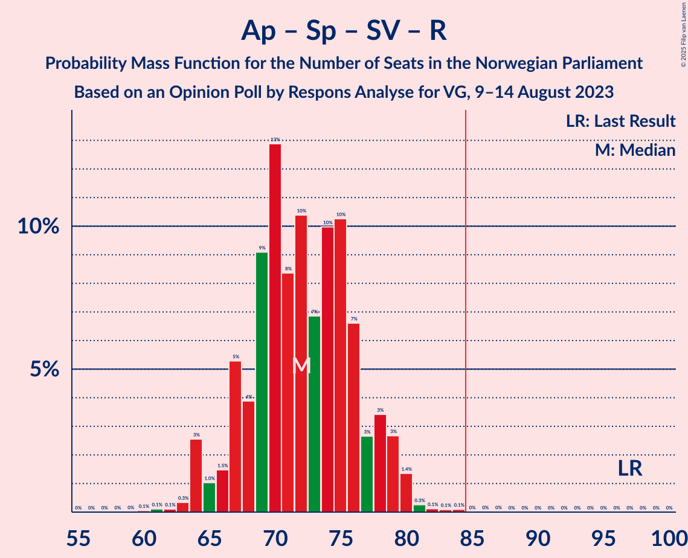

# Opinion Poll by Respons Analyse for VG, 9–14 August 2023

<a href="#voting-intentions">Voting Intentions</a> | <a href="#seats">Seats</a> | <a href="#coalitions">Coalitions</a> | <a href="#technical-information">Technical Information</a>

## Voting Intentions

### Confidence Intervals

| Party | Last Result | Poll Result | 80% Confidence Interval | 90% Confidence Interval | 95% Confidence Interval | 99% Confidence Interval |
|:-----:|:-----------:|:-----------:|:-----------------------:|:-----------------------:|:-----------------------:|:-----------------------:|
| Høyre | 20.4% | 30.6% | 28.8–32.6% |28.3–33.1% |27.9–33.6% |27.0–34.5% |
| Arbeiderpartiet | 26.2% | 19.8% | 18.2–21.4% |17.8–21.9% |17.4–22.3% |16.7–23.2% |
| Fremskrittspartiet | 11.6% | 12.1% | 10.8–13.5% |10.5–13.9% |10.2–14.3% |9.6–15.0% |
| Senterpartiet | 13.5% | 7.8% | 6.8–9.0% |6.5–9.3% |6.3–9.6% |5.8–10.2% |
| Sosialistisk Venstreparti | 7.6% | 7.4% | 6.4–8.6% |6.1–8.9% |5.9–9.2% |5.5–9.8% |
| Rødt | 4.7% | 5.0% | 4.2–6.0% |4.0–6.3% |3.8–6.5% |3.5–7.0% |
| Miljøpartiet De Grønne | 3.9% | 4.7% | 3.9–5.7% |3.7–5.9% |3.5–6.2% |3.2–6.7% |
| Venstre | 4.6% | 4.4% | 3.7–5.3% |3.5–5.6% |3.3–5.9% |3.0–6.3% |
| Kristelig Folkeparti | 3.8% | 4.3% | 3.6–5.2% |3.4–5.5% |3.2–5.7% |2.9–6.2% |
| Industri- og Næringspartiet | 0.3% | 2.5% | 2.0–3.3% |1.8–3.5% |1.7–3.7% |1.5–4.1% |

*Note:* The poll result column reflects the actual value used in the calculations. Published results may vary slightly, and in addition be rounded to fewer digits.

## Seats

### Confidence Intervals

| Party | Last Result | Median | 80% Confidence Interval | 90% Confidence Interval | 95% Confidence Interval | 99% Confidence Interval |
|:-----:|:-----------:|:------:|:-----------------------:|:-----------------------:|:-----------------------:|:-----------------------:|
| <a href="#høyre">Høyre</a> | 36 | 54 | 49–59 |49–60 |48–61 |47–63 |
| <a href="#arbeiderpartiet">Arbeiderpartiet</a> | 48 | 38 | 34–43 |34–44 |33–45 |32–46 |
| <a href="#fremskrittspartiet">Fremskrittspartiet</a> | 21 | 21 | 18–24 |18–25 |17–26 |17–27 |
| <a href="#senterpartiet">Senterpartiet</a> | 28 | 14 | 12–17 |11–17 |10–17 |9–18 |
| <a href="#sosialistisk-venstreparti">Sosialistisk Venstreparti</a> | 13 | 12 | 9–15 |9–15 |9–16 |9–18 |
| <a href="#rødt">Rødt</a> | 8 | 8 | 6–10 |1–11 |1–11 |1–12 |
| <a href="#miljøpartiet-de-grønne">Miljøpartiet De Grønne</a> | 3 | 8 | 3–10 |3–10 |2–10 |2–11 |
| <a href="#venstre">Venstre</a> | 8 | 7 | 2–9 |2–9 |2–10 |2–11 |
| <a href="#kristelig-folkeparti">Kristelig Folkeparti</a> | 3 | 7 | 2–8 |2–9 |2–9 |2–10 |
| <a href="#industri--og-næringspartiet">Industri- og Næringspartiet</a> | 0 | 0 | 0–2 |0–3 |0–3 |0–3 |

### Høyre

*For a full overview of the results for this party, see the [Høyre](party-høyre.html) page.*

| Number of Seats | Probability | Accumulated | Special Marks |
|:---------------:|:-----------:|:-----------:|:-------------:|
| 36 | 0% | 100% | Last Result |
| 37 | 0% | 100% |  |
| 38 | 0% | 100% |  |
| 39 | 0% | 100% |  |
| 40 | 0% | 100% |  |
| 41 | 0% | 100% |  |
| 42 | 0% | 100% |  |
| 43 | 0% | 100% |  |
| 44 | 0% | 100% |  |
| 45 | 0% | 100% |  |
| 46 | 0.3% | 100% |  |
| 47 | 0.7% | 99.7% |  |
| 48 | 2% | 99.0% |  |
| 49 | 9% | 97% |  |
| 50 | 3% | 88% |  |
| 51 | 10% | 85% |  |
| 52 | 12% | 75% |  |
| 53 | 9% | 63% |  |
| 54 | 12% | 54% | Median |
| 55 | 9% | 42% |  |
| 56 | 9% | 33% |  |
| 57 | 6% | 24% |  |
| 58 | 6% | 18% |  |
| 59 | 3% | 12% |  |
| 60 | 4% | 9% |  |
| 61 | 4% | 5% |  |
| 62 | 0.4% | 1.2% |  |
| 63 | 0.6% | 0.7% |  |
| 64 | 0% | 0.2% |  |
| 65 | 0.1% | 0.1% |  |
| 66 | 0.1% | 0.1% |  |
| 67 | 0% | 0% |  |

### Arbeiderpartiet

*For a full overview of the results for this party, see the [Arbeiderpartiet](party-arbeiderpartiet.html) page.*

| Number of Seats | Probability | Accumulated | Special Marks |
|:---------------:|:-----------:|:-----------:|:-------------:|
| 31 | 0.1% | 100% |  |
| 32 | 0.8% | 99.9% |  |
| 33 | 3% | 99.1% |  |
| 34 | 8% | 96% |  |
| 35 | 9% | 88% |  |
| 36 | 17% | 79% |  |
| 37 | 10% | 62% |  |
| 38 | 13% | 52% | Median |
| 39 | 11% | 39% |  |
| 40 | 6% | 27% |  |
| 41 | 5% | 22% |  |
| 42 | 2% | 17% |  |
| 43 | 7% | 15% |  |
| 44 | 5% | 8% |  |
| 45 | 2% | 3% |  |
| 46 | 0.5% | 0.7% |  |
| 47 | 0.2% | 0.2% |  |
| 48 | 0% | 0% | Last Result |

### Fremskrittspartiet

*For a full overview of the results for this party, see the [Fremskrittspartiet](party-fremskrittspartiet.html) page.*

| Number of Seats | Probability | Accumulated | Special Marks |
|:---------------:|:-----------:|:-----------:|:-------------:|
| 16 | 0.4% | 100% |  |
| 17 | 4% | 99.6% |  |
| 18 | 14% | 95% |  |
| 19 | 16% | 81% |  |
| 20 | 10% | 65% |  |
| 21 | 10% | 55% | Last Result, Median |
| 22 | 13% | 45% |  |
| 23 | 14% | 32% |  |
| 24 | 9% | 19% |  |
| 25 | 6% | 9% |  |
| 26 | 3% | 4% |  |
| 27 | 0.6% | 0.8% |  |
| 28 | 0.2% | 0.3% |  |
| 29 | 0% | 0% |  |

### Senterpartiet

*For a full overview of the results for this party, see the [Senterpartiet](party-senterpartiet.html) page.*

| Number of Seats | Probability | Accumulated | Special Marks |
|:---------------:|:-----------:|:-----------:|:-------------:|
| 8 | 0.1% | 100% |  |
| 9 | 0.6% | 99.9% |  |
| 10 | 4% | 99.3% |  |
| 11 | 3% | 95% |  |
| 12 | 12% | 92% |  |
| 13 | 24% | 81% |  |
| 14 | 26% | 57% | Median |
| 15 | 15% | 31% |  |
| 16 | 5% | 16% |  |
| 17 | 9% | 11% |  |
| 18 | 2% | 2% |  |
| 19 | 0.2% | 0.2% |  |
| 20 | 0% | 0% |  |
| 21 | 0% | 0% |  |
| 22 | 0% | 0% |  |
| 23 | 0% | 0% |  |
| 24 | 0% | 0% |  |
| 25 | 0% | 0% |  |
| 26 | 0% | 0% |  |
| 27 | 0% | 0% |  |
| 28 | 0% | 0% | Last Result |

### Sosialistisk Venstreparti

*For a full overview of the results for this party, see the [Sosialistisk Venstreparti](party-sosialistiskvenstreparti.html) page.*

| Number of Seats | Probability | Accumulated | Special Marks |
|:---------------:|:-----------:|:-----------:|:-------------:|
| 8 | 0.3% | 100% |  |
| 9 | 10% | 99.7% |  |
| 10 | 8% | 90% |  |
| 11 | 19% | 81% |  |
| 12 | 25% | 62% | Median |
| 13 | 14% | 37% | Last Result |
| 14 | 9% | 23% |  |
| 15 | 9% | 14% |  |
| 16 | 3% | 4% |  |
| 17 | 0.9% | 1.4% |  |
| 18 | 0.5% | 0.5% |  |
| 19 | 0% | 0% |  |

### Rødt

*For a full overview of the results for this party, see the [Rødt](party-rødt.html) page.*

| Number of Seats | Probability | Accumulated | Special Marks |
|:---------------:|:-----------:|:-----------:|:-------------:|
| 1 | 6% | 100% |  |
| 2 | 0% | 94% |  |
| 3 | 0% | 94% |  |
| 4 | 0% | 94% |  |
| 5 | 0% | 94% |  |
| 6 | 7% | 94% |  |
| 7 | 12% | 87% |  |
| 8 | 28% | 74% | Last Result, Median |
| 9 | 27% | 46% |  |
| 10 | 14% | 19% |  |
| 11 | 4% | 6% |  |
| 12 | 1.3% | 2% |  |
| 13 | 0.2% | 0.2% |  |
| 14 | 0% | 0% |  |

### Miljøpartiet De Grønne

*For a full overview of the results for this party, see the [Miljøpartiet De Grønne](party-miljøpartietdegrønne.html) page.*

| Number of Seats | Probability | Accumulated | Special Marks |
|:---------------:|:-----------:|:-----------:|:-------------:|
| 1 | 0.1% | 100% |  |
| 2 | 4% | 99.9% |  |
| 3 | 8% | 95% | Last Result |
| 4 | 0% | 87% |  |
| 5 | 0% | 87% |  |
| 6 | 2% | 87% |  |
| 7 | 20% | 85% |  |
| 8 | 31% | 66% | Median |
| 9 | 22% | 34% |  |
| 10 | 10% | 12% |  |
| 11 | 1.1% | 1.4% |  |
| 12 | 0.2% | 0.3% |  |
| 13 | 0% | 0% |  |

### Venstre

*For a full overview of the results for this party, see the [Venstre](party-venstre.html) page.*

| Number of Seats | Probability | Accumulated | Special Marks |
|:---------------:|:-----------:|:-----------:|:-------------:|
| 2 | 11% | 100% |  |
| 3 | 15% | 89% |  |
| 4 | 0% | 74% |  |
| 5 | 0% | 74% |  |
| 6 | 6% | 74% |  |
| 7 | 32% | 68% | Median |
| 8 | 21% | 36% | Last Result |
| 9 | 12% | 16% |  |
| 10 | 2% | 3% |  |
| 11 | 0.7% | 0.8% |  |
| 12 | 0.1% | 0.1% |  |
| 13 | 0% | 0% |  |

### Kristelig Folkeparti

*For a full overview of the results for this party, see the [Kristelig Folkeparti](party-kristeligfolkeparti.html) page.*

| Number of Seats | Probability | Accumulated | Special Marks |
|:---------------:|:-----------:|:-----------:|:-------------:|
| 2 | 17% | 100% |  |
| 3 | 14% | 83% | Last Result |
| 4 | 0% | 69% |  |
| 5 | 0% | 69% |  |
| 6 | 9% | 69% |  |
| 7 | 26% | 60% | Median |
| 8 | 25% | 34% |  |
| 9 | 7% | 9% |  |
| 10 | 2% | 2% |  |
| 11 | 0.3% | 0.3% |  |
| 12 | 0% | 0% |  |

### Industri- og Næringspartiet

*For a full overview of the results for this party, see the [Industri- og Næringspartiet](party-industri-ognæringspartiet.html) page.*

| Number of Seats | Probability | Accumulated | Special Marks |
|:---------------:|:-----------:|:-----------:|:-------------:|
| 0 | 53% | 100% | Last Result, Median |
| 1 | 9% | 47% |  |
| 2 | 31% | 39% |  |
| 3 | 7% | 8% |  |
| 4 | 0% | 0.5% |  |
| 5 | 0% | 0.5% |  |
| 6 | 0.2% | 0.5% |  |
| 7 | 0.3% | 0.3% |  |
| 8 | 0% | 0% |  |

## Coalitions

### Confidence Intervals

| Coalition | Last Result | Median | Majority? | 80% Confidence Interval | 90% Confidence Interval | 95% Confidence Interval | 99% Confidence Interval |
|:---------:|:-----------:|:------:|:---------:|:-----------------------:|:-----------------------:|:-----------------------:|:-----------------------:|
| Høyre – Fremskrittspartiet – Senterpartiet – Venstre – Kristelig Folkeparti | 96 | 101 | 100% | 97–106 | 95–107 | 94–108 | 92–111 |
| Høyre – Fremskrittspartiet – Miljøpartiet De Grønne – Venstre – Kristelig Folkeparti | 71 | 96 | 99.8% | 90–99 | 89–101 | 87–102 | 86–104 |
| Høyre – Fremskrittspartiet – Venstre – Kristelig Folkeparti | 68 | 88 | 76% | 82–92 | 81–94 | 79–94 | 78–97 |
| Høyre – Fremskrittspartiet – Venstre | 65 | 81 | 25% | 76–86 | 75–88 | 73–89 | 71–91 |
| Arbeiderpartiet – Senterpartiet – Sosialistisk Venstreparti – Rødt – Miljøpartiet De Grønne | 100 | 80 | 10% | 75–85 | 73–86 | 72–87 | 70–88 |
| Arbeiderpartiet – Senterpartiet – Sosialistisk Venstreparti – Miljøpartiet De Grønne – Kristelig Folkeparti | 95 | 77 | 5% | 72–82 | 71–84 | 70–86 | 67–89 |
| Høyre – Fremskrittspartiet | 57 | 75 | 0.4% | 70–80 | 69–82 | 69–83 | 67–84 |
| Arbeiderpartiet – Senterpartiet – Sosialistisk Venstreparti – Miljøpartiet De Grønne | 92 | 72 | 0% | 67–76 | 65–78 | 64–79 | 63–81 |
| Arbeiderpartiet – Senterpartiet – Sosialistisk Venstreparti – Rødt | 97 | 72 | 0% | 67–77 | 66–78 | 64–79 | 63–81 |
| Arbeiderpartiet – Senterpartiet – Miljøpartiet De Grønne – Kristelig Folkeparti | 82 | 65 | 0% | 59–72 | 58–72 | 57–74 | 55–76 |
| Arbeiderpartiet – Sosialistisk Venstreparti – Rødt – Miljøpartiet De Grønne | 72 | 66 | 0% | 61–70 | 60–72 | 59–73 | 56–75 |
| Høyre – Venstre – Kristelig Folkeparti | 47 | 67 | 0% | 62–71 | 60–72 | 59–73 | 57–77 |
| Arbeiderpartiet – Senterpartiet – Sosialistisk Venstreparti | 89 | 64 | 0% | 60–69 | 59–70 | 57–71 | 56–72 |
| Arbeiderpartiet – Senterpartiet – Kristelig Folkeparti | 79 | 57 | 0% | 53–64 | 51–65 | 50–66 | 49–68 |
| Arbeiderpartiet – Senterpartiet | 76 | 51 | 0% | 48–57 | 47–58 | 46–59 | 45–60 |
| Arbeiderpartiet – Sosialistisk Venstreparti | 61 | 50 | 0% | 46–55 | 45–56 | 45–57 | 43–59 |
| Senterpartiet – Venstre – Kristelig Folkeparti | 39 | 27 | 0% | 21–31 | 19–31 | 18–32 | 17–34 |

### Høyre – Fremskrittspartiet – Senterpartiet – Venstre – Kristelig Folkeparti

| Number of Seats | Probability | Accumulated | Special Marks |
|:---------------:|:-----------:|:-----------:|:-------------:|
| 89 | 0.1% | 100% |  |
| 90 | 0.1% | 99.9% |  |
| 91 | 0.2% | 99.9% |  |
| 92 | 0.7% | 99.7% |  |
| 93 | 1.5% | 99.0% |  |
| 94 | 2% | 98% |  |
| 95 | 1.5% | 96% |  |
| 96 | 3% | 94% | Last Result |
| 97 | 8% | 91% |  |
| 98 | 6% | 83% |  |
| 99 | 6% | 76% |  |
| 100 | 6% | 70% |  |
| 101 | 16% | 64% |  |
| 102 | 14% | 48% |  |
| 103 | 6% | 34% | Median |
| 104 | 10% | 28% |  |
| 105 | 6% | 18% |  |
| 106 | 4% | 12% |  |
| 107 | 4% | 8% |  |
| 108 | 2% | 4% |  |
| 109 | 0.9% | 2% |  |
| 110 | 0.2% | 1.1% |  |
| 111 | 0.6% | 0.9% |  |
| 112 | 0.2% | 0.3% |  |
| 113 | 0% | 0.1% |  |
| 114 | 0% | 0.1% |  |
| 115 | 0% | 0% |  |

### Høyre – Fremskrittspartiet – Miljøpartiet De Grønne – Venstre – Kristelig Folkeparti

| Number of Seats | Probability | Accumulated | Special Marks |
|:---------------:|:-----------:|:-----------:|:-------------:|
| 71 | 0% | 100% | Last Result |
| 72 | 0% | 100% |  |
| 73 | 0% | 100% |  |
| 74 | 0% | 100% |  |
| 75 | 0% | 100% |  |
| 76 | 0% | 100% |  |
| 77 | 0% | 100% |  |
| 78 | 0% | 100% |  |
| 79 | 0% | 100% |  |
| 80 | 0% | 100% |  |
| 81 | 0% | 100% |  |
| 82 | 0% | 100% |  |
| 83 | 0% | 99.9% |  |
| 84 | 0.1% | 99.9% |  |
| 85 | 0.1% | 99.8% | Majority |
| 86 | 1.0% | 99.7% |  |
| 87 | 2% | 98.6% |  |
| 88 | 2% | 97% |  |
| 89 | 3% | 95% |  |
| 90 | 4% | 92% |  |
| 91 | 8% | 88% |  |
| 92 | 11% | 80% |  |
| 93 | 7% | 70% |  |
| 94 | 7% | 63% |  |
| 95 | 5% | 56% |  |
| 96 | 14% | 51% |  |
| 97 | 9% | 37% | Median |
| 98 | 8% | 28% |  |
| 99 | 10% | 19% |  |
| 100 | 3% | 10% |  |
| 101 | 3% | 6% |  |
| 102 | 2% | 4% |  |
| 103 | 0.8% | 2% |  |
| 104 | 0.5% | 0.8% |  |
| 105 | 0.2% | 0.3% |  |
| 106 | 0.1% | 0.1% |  |
| 107 | 0% | 0.1% |  |
| 108 | 0% | 0% |  |

### Høyre – Fremskrittspartiet – Venstre – Kristelig Folkeparti

| Number of Seats | Probability | Accumulated | Special Marks |
|:---------------:|:-----------:|:-----------:|:-------------:|
| 68 | 0% | 100% | Last Result |
| 69 | 0% | 100% |  |
| 70 | 0% | 100% |  |
| 71 | 0% | 100% |  |
| 72 | 0% | 100% |  |
| 73 | 0% | 100% |  |
| 74 | 0% | 100% |  |
| 75 | 0% | 100% |  |
| 76 | 0% | 100% |  |
| 77 | 0.1% | 99.9% |  |
| 78 | 0.9% | 99.9% |  |
| 79 | 2% | 98.9% |  |
| 80 | 2% | 97% |  |
| 81 | 1.1% | 95% |  |
| 82 | 7% | 94% |  |
| 83 | 7% | 87% |  |
| 84 | 4% | 80% |  |
| 85 | 8% | 76% | Majority |
| 86 | 7% | 69% |  |
| 87 | 7% | 62% |  |
| 88 | 14% | 55% |  |
| 89 | 12% | 42% | Median |
| 90 | 4% | 29% |  |
| 91 | 12% | 25% |  |
| 92 | 5% | 13% |  |
| 93 | 3% | 8% |  |
| 94 | 3% | 5% |  |
| 95 | 1.0% | 2% |  |
| 96 | 0.9% | 1.4% |  |
| 97 | 0.3% | 0.5% |  |
| 98 | 0.1% | 0.2% |  |
| 99 | 0.1% | 0.1% |  |
| 100 | 0% | 0.1% |  |
| 101 | 0% | 0% |  |

### Høyre – Fremskrittspartiet – Venstre

| Number of Seats | Probability | Accumulated | Special Marks |
|:---------------:|:-----------:|:-----------:|:-------------:|
| 65 | 0% | 100% | Last Result |
| 66 | 0% | 100% |  |
| 67 | 0% | 100% |  |
| 68 | 0% | 100% |  |
| 69 | 0% | 100% |  |
| 70 | 0.1% | 100% |  |
| 71 | 0.9% | 99.9% |  |
| 72 | 0.9% | 99.0% |  |
| 73 | 1.0% | 98% |  |
| 74 | 1.1% | 97% |  |
| 75 | 4% | 96% |  |
| 76 | 4% | 93% |  |
| 77 | 2% | 88% |  |
| 78 | 7% | 86% |  |
| 79 | 10% | 79% |  |
| 80 | 8% | 69% |  |
| 81 | 13% | 61% |  |
| 82 | 6% | 48% | Median |
| 83 | 13% | 42% |  |
| 84 | 5% | 30% |  |
| 85 | 9% | 25% | Majority |
| 86 | 5% | 15% |  |
| 87 | 3% | 10% |  |
| 88 | 4% | 6% |  |
| 89 | 2% | 3% |  |
| 90 | 0.6% | 1.2% |  |
| 91 | 0.3% | 0.7% |  |
| 92 | 0.2% | 0.4% |  |
| 93 | 0.1% | 0.3% |  |
| 94 | 0.1% | 0.1% |  |
| 95 | 0% | 0.1% |  |
| 96 | 0.1% | 0.1% |  |
| 97 | 0% | 0% |  |

### Arbeiderpartiet – Senterpartiet – Sosialistisk Venstreparti – Rødt – Miljøpartiet De Grønne

| Number of Seats | Probability | Accumulated | Special Marks |
|:---------------:|:-----------:|:-----------:|:-------------:|
| 67 | 0% | 100% |  |
| 68 | 0% | 99.9% |  |
| 69 | 0.2% | 99.9% |  |
| 70 | 0.4% | 99.7% |  |
| 71 | 0.6% | 99.3% |  |
| 72 | 2% | 98.8% |  |
| 73 | 2% | 96% |  |
| 74 | 2% | 95% |  |
| 75 | 5% | 92% |  |
| 76 | 7% | 87% |  |
| 77 | 13% | 80% |  |
| 78 | 6% | 67% |  |
| 79 | 8% | 61% |  |
| 80 | 13% | 53% | Median |
| 81 | 9% | 39% |  |
| 82 | 7% | 30% |  |
| 83 | 6% | 23% |  |
| 84 | 7% | 17% |  |
| 85 | 3% | 10% | Majority |
| 86 | 3% | 7% |  |
| 87 | 2% | 4% |  |
| 88 | 2% | 2% |  |
| 89 | 0.2% | 0.4% |  |
| 90 | 0.1% | 0.2% |  |
| 91 | 0.1% | 0.1% |  |
| 92 | 0% | 0% |  |
| 93 | 0% | 0% |  |
| 94 | 0% | 0% |  |
| 95 | 0% | 0% |  |
| 96 | 0% | 0% |  |
| 97 | 0% | 0% |  |
| 98 | 0% | 0% |  |
| 99 | 0% | 0% |  |
| 100 | 0% | 0% | Last Result |

### Arbeiderpartiet – Senterpartiet – Sosialistisk Venstreparti – Miljøpartiet De Grønne – Kristelig Folkeparti

| Number of Seats | Probability | Accumulated | Special Marks |
|:---------------:|:-----------:|:-----------:|:-------------:|
| 66 | 0.3% | 100% |  |
| 67 | 0.7% | 99.7% |  |
| 68 | 0.2% | 99.0% |  |
| 69 | 0.6% | 98.8% |  |
| 70 | 0.8% | 98% |  |
| 71 | 5% | 97% |  |
| 72 | 5% | 92% |  |
| 73 | 4% | 88% |  |
| 74 | 7% | 83% |  |
| 75 | 10% | 76% |  |
| 76 | 9% | 67% |  |
| 77 | 9% | 58% |  |
| 78 | 5% | 48% |  |
| 79 | 10% | 44% | Median |
| 80 | 6% | 34% |  |
| 81 | 14% | 28% |  |
| 82 | 5% | 15% |  |
| 83 | 3% | 10% |  |
| 84 | 2% | 7% |  |
| 85 | 1.2% | 5% | Majority |
| 86 | 2% | 4% |  |
| 87 | 1.1% | 2% |  |
| 88 | 0.1% | 0.7% |  |
| 89 | 0.3% | 0.6% |  |
| 90 | 0.2% | 0.3% |  |
| 91 | 0% | 0.1% |  |
| 92 | 0% | 0% |  |
| 93 | 0% | 0% |  |
| 94 | 0% | 0% |  |
| 95 | 0% | 0% | Last Result |

### Høyre – Fremskrittspartiet

| Number of Seats | Probability | Accumulated | Special Marks |
|:---------------:|:-----------:|:-----------:|:-------------:|
| 57 | 0% | 100% | Last Result |
| 58 | 0% | 100% |  |
| 59 | 0% | 100% |  |
| 60 | 0% | 100% |  |
| 61 | 0% | 100% |  |
| 62 | 0% | 100% |  |
| 63 | 0% | 100% |  |
| 64 | 0% | 100% |  |
| 65 | 0% | 100% |  |
| 66 | 0.1% | 99.9% |  |
| 67 | 0.5% | 99.8% |  |
| 68 | 2% | 99.3% |  |
| 69 | 3% | 98% |  |
| 70 | 6% | 94% |  |
| 71 | 7% | 89% |  |
| 72 | 9% | 82% |  |
| 73 | 11% | 73% |  |
| 74 | 9% | 62% |  |
| 75 | 6% | 53% | Median |
| 76 | 12% | 47% |  |
| 77 | 5% | 34% |  |
| 78 | 10% | 29% |  |
| 79 | 6% | 19% |  |
| 80 | 5% | 13% |  |
| 81 | 3% | 8% |  |
| 82 | 0.8% | 5% |  |
| 83 | 4% | 5% |  |
| 84 | 0.5% | 0.9% |  |
| 85 | 0.1% | 0.4% | Majority |
| 86 | 0.1% | 0.3% |  |
| 87 | 0% | 0.3% |  |
| 88 | 0.1% | 0.2% |  |
| 89 | 0% | 0.1% |  |
| 90 | 0% | 0.1% |  |
| 91 | 0% | 0.1% |  |
| 92 | 0.1% | 0.1% |  |
| 93 | 0% | 0% |  |

### Arbeiderpartiet – Senterpartiet – Sosialistisk Venstreparti – Miljøpartiet De Grønne

| Number of Seats | Probability | Accumulated | Special Marks |
|:---------------:|:-----------:|:-----------:|:-------------:|
| 60 | 0% | 100% |  |
| 61 | 0.1% | 99.9% |  |
| 62 | 0.1% | 99.8% |  |
| 63 | 0.4% | 99.7% |  |
| 64 | 3% | 99.4% |  |
| 65 | 2% | 96% |  |
| 66 | 2% | 94% |  |
| 67 | 5% | 92% |  |
| 68 | 12% | 87% |  |
| 69 | 6% | 75% |  |
| 70 | 7% | 68% |  |
| 71 | 8% | 62% |  |
| 72 | 9% | 53% | Median |
| 73 | 10% | 44% |  |
| 74 | 12% | 34% |  |
| 75 | 9% | 22% |  |
| 76 | 3% | 12% |  |
| 77 | 3% | 9% |  |
| 78 | 2% | 6% |  |
| 79 | 3% | 4% |  |
| 80 | 0.8% | 1.3% |  |
| 81 | 0.2% | 0.5% |  |
| 82 | 0.2% | 0.3% |  |
| 83 | 0% | 0.1% |  |
| 84 | 0% | 0.1% |  |
| 85 | 0% | 0% | Majority |
| 86 | 0% | 0% |  |
| 87 | 0% | 0% |  |
| 88 | 0% | 0% |  |
| 89 | 0% | 0% |  |
| 90 | 0% | 0% |  |
| 91 | 0% | 0% |  |
| 92 | 0% | 0% | Last Result |

### Arbeiderpartiet – Senterpartiet – Sosialistisk Venstreparti – Rødt

| Number of Seats | Probability | Accumulated | Special Marks |
|:---------------:|:-----------:|:-----------:|:-------------:|
| 60 | 0.1% | 100% |  |
| 61 | 0.1% | 99.9% |  |
| 62 | 0.1% | 99.8% |  |
| 63 | 0.3% | 99.7% |  |
| 64 | 3% | 99.4% |  |
| 65 | 1.0% | 97% |  |
| 66 | 1.5% | 96% |  |
| 67 | 5% | 94% |  |
| 68 | 4% | 89% |  |
| 69 | 9% | 85% |  |
| 70 | 13% | 76% |  |
| 71 | 8% | 63% |  |
| 72 | 10% | 55% | Median |
| 73 | 7% | 44% |  |
| 74 | 10% | 38% |  |
| 75 | 10% | 28% |  |
| 76 | 7% | 17% |  |
| 77 | 3% | 11% |  |
| 78 | 3% | 8% |  |
| 79 | 3% | 5% |  |
| 80 | 1.4% | 2% |  |
| 81 | 0.3% | 0.6% |  |
| 82 | 0.1% | 0.3% |  |
| 83 | 0.1% | 0.2% |  |
| 84 | 0.1% | 0.1% |  |
| 85 | 0% | 0% | Majority |
| 86 | 0% | 0% |  |
| 87 | 0% | 0% |  |
| 88 | 0% | 0% |  |
| 89 | 0% | 0% |  |
| 90 | 0% | 0% |  |
| 91 | 0% | 0% |  |
| 92 | 0% | 0% |  |
| 93 | 0% | 0% |  |
| 94 | 0% | 0% |  |
| 95 | 0% | 0% |  |
| 96 | 0% | 0% |  |
| 97 | 0% | 0% | Last Result |

### Arbeiderpartiet – Senterpartiet – Miljøpartiet De Grønne – Kristelig Folkeparti

| Number of Seats | Probability | Accumulated | Special Marks |
|:---------------:|:-----------:|:-----------:|:-------------:|
| 53 | 0.2% | 100% |  |
| 54 | 0.1% | 99.7% |  |
| 55 | 1.2% | 99.6% |  |
| 56 | 0.5% | 98% |  |
| 57 | 0.7% | 98% |  |
| 58 | 3% | 97% |  |
| 59 | 5% | 95% |  |
| 60 | 3% | 90% |  |
| 61 | 5% | 87% |  |
| 62 | 9% | 81% |  |
| 63 | 8% | 72% |  |
| 64 | 6% | 65% |  |
| 65 | 15% | 59% |  |
| 66 | 6% | 44% |  |
| 67 | 7% | 38% | Median |
| 68 | 6% | 32% |  |
| 69 | 7% | 26% |  |
| 70 | 3% | 19% |  |
| 71 | 1.3% | 16% |  |
| 72 | 11% | 15% |  |
| 73 | 1.0% | 4% |  |
| 74 | 2% | 3% |  |
| 75 | 1.0% | 2% |  |
| 76 | 0.3% | 0.6% |  |
| 77 | 0.2% | 0.3% |  |
| 78 | 0.1% | 0.1% |  |
| 79 | 0% | 0% |  |
| 80 | 0% | 0% |  |
| 81 | 0% | 0% |  |
| 82 | 0% | 0% | Last Result |

### Arbeiderpartiet – Sosialistisk Venstreparti – Rødt – Miljøpartiet De Grønne

| Number of Seats | Probability | Accumulated | Special Marks |
|:---------------:|:-----------:|:-----------:|:-------------:|
| 54 | 0.1% | 100% |  |
| 55 | 0.2% | 99.9% |  |
| 56 | 0.2% | 99.7% |  |
| 57 | 0.7% | 99.5% |  |
| 58 | 1.0% | 98.8% |  |
| 59 | 2% | 98% |  |
| 60 | 2% | 96% |  |
| 61 | 4% | 93% |  |
| 62 | 7% | 89% |  |
| 63 | 7% | 82% |  |
| 64 | 11% | 75% |  |
| 65 | 7% | 64% |  |
| 66 | 13% | 57% | Median |
| 67 | 13% | 43% |  |
| 68 | 8% | 30% |  |
| 69 | 9% | 21% |  |
| 70 | 5% | 12% |  |
| 71 | 2% | 7% |  |
| 72 | 2% | 6% | Last Result |
| 73 | 1.4% | 3% |  |
| 74 | 1.2% | 2% |  |
| 75 | 0.5% | 0.8% |  |
| 76 | 0.1% | 0.3% |  |
| 77 | 0.1% | 0.2% |  |
| 78 | 0.1% | 0.1% |  |
| 79 | 0% | 0% |  |

### Høyre – Venstre – Kristelig Folkeparti

| Number of Seats | Probability | Accumulated | Special Marks |
|:---------------:|:-----------:|:-----------:|:-------------:|
| 47 | 0% | 100% | Last Result |
| 48 | 0% | 100% |  |
| 49 | 0% | 100% |  |
| 50 | 0% | 100% |  |
| 51 | 0% | 100% |  |
| 52 | 0% | 100% |  |
| 53 | 0% | 100% |  |
| 54 | 0% | 100% |  |
| 55 | 0.1% | 100% |  |
| 56 | 0.2% | 99.9% |  |
| 57 | 0.5% | 99.8% |  |
| 58 | 1.2% | 99.3% |  |
| 59 | 3% | 98% |  |
| 60 | 3% | 95% |  |
| 61 | 2% | 92% |  |
| 62 | 6% | 91% |  |
| 63 | 9% | 85% |  |
| 64 | 9% | 76% |  |
| 65 | 7% | 67% |  |
| 66 | 9% | 60% |  |
| 67 | 11% | 51% |  |
| 68 | 12% | 40% | Median |
| 69 | 8% | 28% |  |
| 70 | 6% | 20% |  |
| 71 | 4% | 14% |  |
| 72 | 5% | 10% |  |
| 73 | 3% | 5% |  |
| 74 | 0.8% | 2% |  |
| 75 | 0.3% | 1.1% |  |
| 76 | 0.2% | 0.8% |  |
| 77 | 0.2% | 0.6% |  |
| 78 | 0.3% | 0.4% |  |
| 79 | 0.1% | 0.1% |  |
| 80 | 0% | 0% |  |

### Arbeiderpartiet – Senterpartiet – Sosialistisk Venstreparti

| Number of Seats | Probability | Accumulated | Special Marks |
|:---------------:|:-----------:|:-----------:|:-------------:|
| 55 | 0.3% | 100% |  |
| 56 | 1.5% | 99.7% |  |
| 57 | 0.8% | 98% |  |
| 58 | 2% | 97% |  |
| 59 | 3% | 95% |  |
| 60 | 9% | 93% |  |
| 61 | 10% | 83% |  |
| 62 | 10% | 74% |  |
| 63 | 10% | 64% |  |
| 64 | 7% | 53% | Median |
| 65 | 7% | 47% |  |
| 66 | 19% | 40% |  |
| 67 | 5% | 21% |  |
| 68 | 5% | 15% |  |
| 69 | 5% | 10% |  |
| 70 | 2% | 6% |  |
| 71 | 2% | 4% |  |
| 72 | 2% | 2% |  |
| 73 | 0.1% | 0.3% |  |
| 74 | 0.1% | 0.2% |  |
| 75 | 0.1% | 0.1% |  |
| 76 | 0% | 0.1% |  |
| 77 | 0% | 0% |  |
| 78 | 0% | 0% |  |
| 79 | 0% | 0% |  |
| 80 | 0% | 0% |  |
| 81 | 0% | 0% |  |
| 82 | 0% | 0% |  |
| 83 | 0% | 0% |  |
| 84 | 0% | 0% |  |
| 85 | 0% | 0% | Majority |
| 86 | 0% | 0% |  |
| 87 | 0% | 0% |  |
| 88 | 0% | 0% |  |
| 89 | 0% | 0% | Last Result |

### Arbeiderpartiet – Senterpartiet – Kristelig Folkeparti

| Number of Seats | Probability | Accumulated | Special Marks |
|:---------------:|:-----------:|:-----------:|:-------------:|
| 47 | 0.1% | 100% |  |
| 48 | 0.1% | 99.9% |  |
| 49 | 2% | 99.8% |  |
| 50 | 2% | 98% |  |
| 51 | 3% | 95% |  |
| 52 | 2% | 92% |  |
| 53 | 9% | 90% |  |
| 54 | 7% | 81% |  |
| 55 | 4% | 74% |  |
| 56 | 7% | 70% |  |
| 57 | 13% | 63% |  |
| 58 | 9% | 50% |  |
| 59 | 5% | 41% | Median |
| 60 | 8% | 36% |  |
| 61 | 7% | 28% |  |
| 62 | 3% | 21% |  |
| 63 | 2% | 18% |  |
| 64 | 10% | 16% |  |
| 65 | 2% | 6% |  |
| 66 | 2% | 4% |  |
| 67 | 1.2% | 2% |  |
| 68 | 0.3% | 0.5% |  |
| 69 | 0.2% | 0.3% |  |
| 70 | 0% | 0% |  |
| 71 | 0% | 0% |  |
| 72 | 0% | 0% |  |
| 73 | 0% | 0% |  |
| 74 | 0% | 0% |  |
| 75 | 0% | 0% |  |
| 76 | 0% | 0% |  |
| 77 | 0% | 0% |  |
| 78 | 0% | 0% |  |
| 79 | 0% | 0% | Last Result |

### Arbeiderpartiet – Senterpartiet

| Number of Seats | Probability | Accumulated | Special Marks |
|:---------------:|:-----------:|:-----------:|:-------------:|
| 43 | 0.1% | 100% |  |
| 44 | 0.3% | 99.9% |  |
| 45 | 2% | 99.7% |  |
| 46 | 1.2% | 98% |  |
| 47 | 6% | 97% |  |
| 48 | 6% | 91% |  |
| 49 | 12% | 84% |  |
| 50 | 11% | 73% |  |
| 51 | 15% | 62% |  |
| 52 | 7% | 47% | Median |
| 53 | 7% | 40% |  |
| 54 | 11% | 33% |  |
| 55 | 3% | 22% |  |
| 56 | 3% | 19% |  |
| 57 | 11% | 16% |  |
| 58 | 3% | 5% |  |
| 59 | 2% | 3% |  |
| 60 | 0.9% | 1.2% |  |
| 61 | 0.2% | 0.2% |  |
| 62 | 0% | 0% |  |
| 63 | 0% | 0% |  |
| 64 | 0% | 0% |  |
| 65 | 0% | 0% |  |
| 66 | 0% | 0% |  |
| 67 | 0% | 0% |  |
| 68 | 0% | 0% |  |
| 69 | 0% | 0% |  |
| 70 | 0% | 0% |  |
| 71 | 0% | 0% |  |
| 72 | 0% | 0% |  |
| 73 | 0% | 0% |  |
| 74 | 0% | 0% |  |
| 75 | 0% | 0% |  |
| 76 | 0% | 0% | Last Result |

### Arbeiderpartiet – Sosialistisk Venstreparti

| Number of Seats | Probability | Accumulated | Special Marks |
|:---------------:|:-----------:|:-----------:|:-------------:|
| 42 | 0.5% | 100% |  |
| 43 | 0.5% | 99.5% |  |
| 44 | 1.0% | 99.0% |  |
| 45 | 4% | 98% |  |
| 46 | 6% | 94% |  |
| 47 | 9% | 88% |  |
| 48 | 9% | 79% |  |
| 49 | 13% | 70% |  |
| 50 | 12% | 58% | Median |
| 51 | 15% | 46% |  |
| 52 | 13% | 31% |  |
| 53 | 2% | 18% |  |
| 54 | 4% | 16% |  |
| 55 | 6% | 11% |  |
| 56 | 2% | 5% |  |
| 57 | 1.2% | 3% |  |
| 58 | 0.4% | 2% |  |
| 59 | 1.1% | 1.5% |  |
| 60 | 0.4% | 0.4% |  |
| 61 | 0% | 0% | Last Result |

### Senterpartiet – Venstre – Kristelig Folkeparti

| Number of Seats | Probability | Accumulated | Special Marks |
|:---------------:|:-----------:|:-----------:|:-------------:|
| 16 | 0.1% | 100% |  |
| 17 | 0.5% | 99.9% |  |
| 18 | 4% | 99.4% |  |
| 19 | 0.8% | 95% |  |
| 20 | 4% | 95% |  |
| 21 | 1.3% | 91% |  |
| 22 | 5% | 90% |  |
| 23 | 7% | 85% |  |
| 24 | 11% | 78% |  |
| 25 | 11% | 67% |  |
| 26 | 6% | 56% |  |
| 27 | 8% | 50% |  |
| 28 | 13% | 42% | Median |
| 29 | 12% | 29% |  |
| 30 | 5% | 17% |  |
| 31 | 7% | 12% |  |
| 32 | 2% | 5% |  |
| 33 | 2% | 2% |  |
| 34 | 0.5% | 0.9% |  |
| 35 | 0.3% | 0.4% |  |
| 36 | 0% | 0.1% |  |
| 37 | 0% | 0% |  |
| 38 | 0% | 0% |  |
| 39 | 0% | 0% | Last Result |

## Technical Information

### Opinion Poll

+ **Polling firm:** Respons Analyse
+ **Commissioner(s):** VG
+ **Fieldwork period:** 9–14 August 2023

### Calculations

+ **Sample size:** 1002
+ **Simulations done:** 1,048,576
+ **Error estimate:** 2.00%

