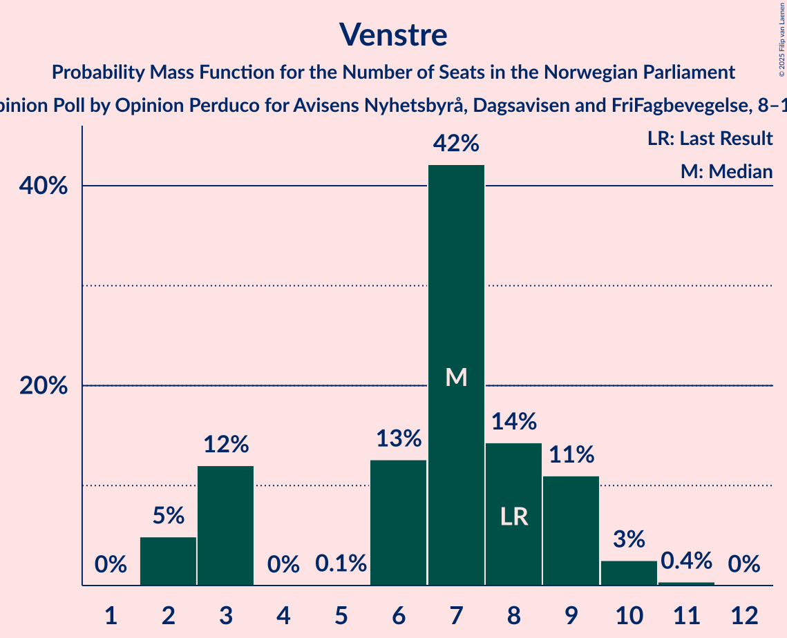
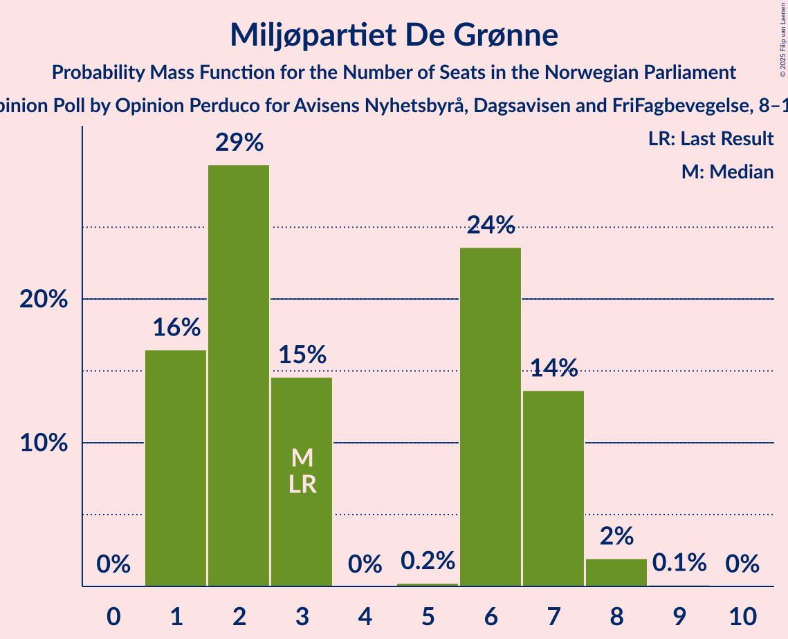
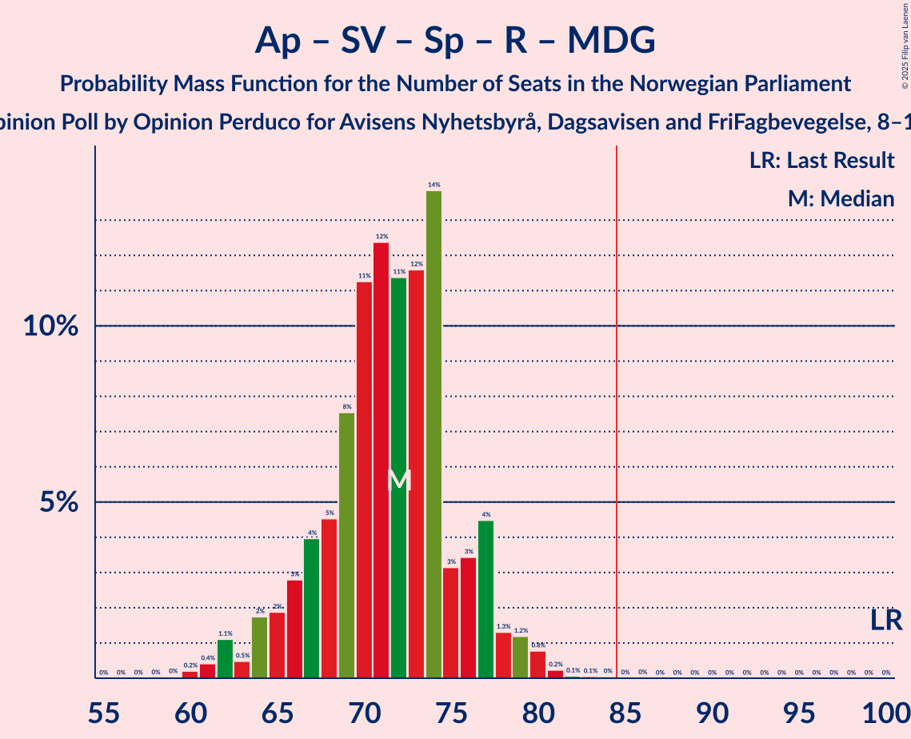
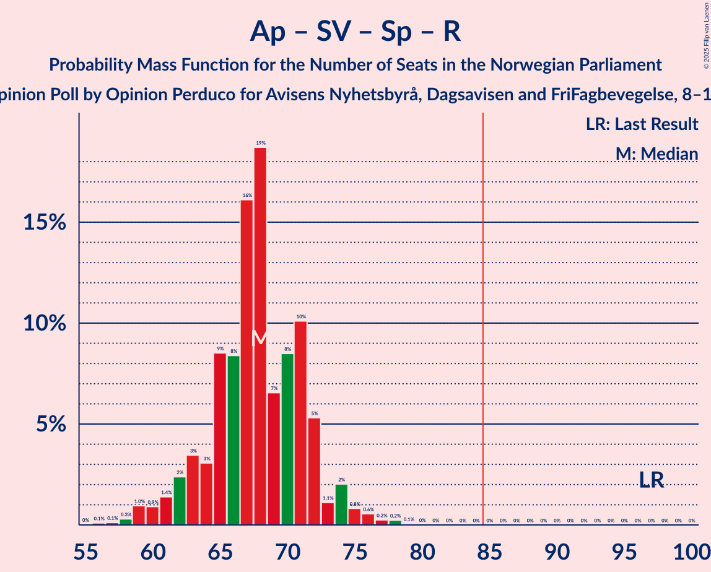

# Opinion Poll by Opinion Perduco for Avisens Nyhetsbyrå, Dagsavisen and FriFagbevegelse, 8–15 August 2023

<a href="#voting-intentions">Voting Intentions</a> | <a href="#seats">Seats</a> | <a href="#coalitions">Coalitions</a> | <a href="#technical-information">Technical Information</a>

## Voting Intentions

### Confidence Intervals

| Party | Last Result | Poll Result | 80% Confidence Interval | 90% Confidence Interval | 95% Confidence Interval | 99% Confidence Interval |
|:-----:|:-----------:|:-----------:|:-----------------------:|:-----------------------:|:-----------------------:|:-----------------------:|
| Høyre | 20.4% | 30.3% | 28.5–32.2% |27.9–32.7% |27.5–33.2% |26.6–34.1% |
| Arbeiderpartiet | 26.2% | 18.0% | 16.5–19.6% |16.1–20.1% |15.7–20.5% |15.0–21.3% |
| Fremskrittspartiet | 11.6% | 14.2% | 12.8–15.7% |12.5–16.1% |12.2–16.5% |11.5–17.2% |
| Sosialistisk Venstreparti | 7.6% | 9.4% | 8.3–10.7% |8.0–11.1% |7.7–11.4% |7.2–12.0% |
| Senterpartiet | 13.5% | 5.7% | 4.8–6.8% |4.6–7.1% |4.4–7.3% |4.0–7.8% |
| Rødt | 4.7% | 5.5% | 4.7–6.5% |4.4–6.8% |4.2–7.1% |3.9–7.6% |
| Venstre | 4.6% | 4.6% | 3.8–5.6% |3.6–5.8% |3.5–6.1% |3.1–6.6% |
| Miljøpartiet De Grønne | 3.9% | 3.6% | 2.9–4.5% |2.8–4.7% |2.6–5.0% |2.3–5.4% |
| Kristelig Folkeparti | 3.8% | 3.4% | 2.8–4.3% |2.6–4.5% |2.4–4.7% |2.2–5.2% |

*Note:* The poll result column reflects the actual value used in the calculations. Published results may vary slightly, and in addition be rounded to fewer digits.

## Seats

### Confidence Intervals

| Party | Last Result | Median | 80% Confidence Interval | 90% Confidence Interval | 95% Confidence Interval | 99% Confidence Interval |
|:-----:|:-----------:|:------:|:-----------------------:|:-----------------------:|:-----------------------:|:-----------------------:|
| <a href="#høyre">Høyre</a> | 36 | 52 | 49–56 |49–58 |49–59 |48–62 |
| <a href="#arbeiderpartiet">Arbeiderpartiet</a> | 48 | 35 | 32–39 |32–39 |31–40 |29–42 |
| <a href="#fremskrittspartiet">Fremskrittspartiet</a> | 21 | 25 | 23–30 |22–31 |21–32 |19–34 |
| <a href="#sosialistisk-venstreparti">Sosialistisk Venstreparti</a> | 13 | 15 | 13–17 |12–18 |11–19 |10–20 |
| <a href="#senterpartiet">Senterpartiet</a> | 28 | 9 | 7–13 |7–13 |6–13 |6–14 |
| <a href="#rødt">Rødt</a> | 8 | 9 | 7–11 |7–11 |6–11 |1–12 |
| <a href="#venstre">Venstre</a> | 8 | 7 | 3–9 |3–9 |2–10 |2–10 |
| <a href="#miljøpartiet-de-grønne">Miljøpartiet De Grønne</a> | 3 | 3 | 1–7 |1–7 |1–7 |1–8 |
| <a href="#kristelig-folkeparti">Kristelig Folkeparti</a> | 3 | 3 | 2–6 |2–7 |1–7 |0–8 |

### Høyre

*For a full overview of the results for this party, see the [Høyre](party-høyre.html) page.*

| Number of Seats | Probability | Accumulated | Special Marks |
|:---------------:|:-----------:|:-----------:|:-------------:|
| 36 | 0% | 100% | Last Result |
| 37 | 0% | 100% |  |
| 38 | 0% | 100% |  |
| 39 | 0% | 100% |  |
| 40 | 0% | 100% |  |
| 41 | 0% | 100% |  |
| 42 | 0% | 100% |  |
| 43 | 0% | 100% |  |
| 44 | 0% | 100% |  |
| 45 | 0% | 100% |  |
| 46 | 0.1% | 99.9% |  |
| 47 | 0.3% | 99.9% |  |
| 48 | 2% | 99.6% |  |
| 49 | 12% | 98% |  |
| 50 | 6% | 86% |  |
| 51 | 9% | 80% |  |
| 52 | 21% | 71% | Median |
| 53 | 21% | 50% |  |
| 54 | 11% | 29% |  |
| 55 | 6% | 18% |  |
| 56 | 2% | 12% |  |
| 57 | 4% | 10% |  |
| 58 | 2% | 5% |  |
| 59 | 1.2% | 3% |  |
| 60 | 0.8% | 2% |  |
| 61 | 0.7% | 1.4% |  |
| 62 | 0.4% | 0.7% |  |
| 63 | 0.1% | 0.4% |  |
| 64 | 0.1% | 0.2% |  |
| 65 | 0% | 0.1% |  |
| 66 | 0% | 0.1% |  |
| 67 | 0% | 0% |  |

### Arbeiderpartiet

*For a full overview of the results for this party, see the [Arbeiderpartiet](party-arbeiderpartiet.html) page.*

| Number of Seats | Probability | Accumulated | Special Marks |
|:---------------:|:-----------:|:-----------:|:-------------:|
| 27 | 0.1% | 100% |  |
| 28 | 0.2% | 99.9% |  |
| 29 | 0.3% | 99.7% |  |
| 30 | 0.5% | 99.5% |  |
| 31 | 4% | 98.9% |  |
| 32 | 9% | 95% |  |
| 33 | 12% | 87% |  |
| 34 | 17% | 74% |  |
| 35 | 25% | 58% | Median |
| 36 | 14% | 33% |  |
| 37 | 6% | 19% |  |
| 38 | 1.4% | 13% |  |
| 39 | 9% | 12% |  |
| 40 | 2% | 3% |  |
| 41 | 0.7% | 1.4% |  |
| 42 | 0.3% | 0.7% |  |
| 43 | 0.2% | 0.3% |  |
| 44 | 0.1% | 0.1% |  |
| 45 | 0% | 0.1% |  |
| 46 | 0% | 0% |  |
| 47 | 0% | 0% |  |
| 48 | 0% | 0% | Last Result |

### Fremskrittspartiet

*For a full overview of the results for this party, see the [Fremskrittspartiet](party-fremskrittspartiet.html) page.*

| Number of Seats | Probability | Accumulated | Special Marks |
|:---------------:|:-----------:|:-----------:|:-------------:|
| 18 | 0.3% | 100% |  |
| 19 | 0.7% | 99.7% |  |
| 20 | 0.5% | 99.1% |  |
| 21 | 3% | 98.6% | Last Result |
| 22 | 5% | 96% |  |
| 23 | 19% | 91% |  |
| 24 | 14% | 72% |  |
| 25 | 10% | 58% | Median |
| 26 | 10% | 48% |  |
| 27 | 6% | 38% |  |
| 28 | 10% | 33% |  |
| 29 | 10% | 23% |  |
| 30 | 7% | 13% |  |
| 31 | 2% | 6% |  |
| 32 | 2% | 4% |  |
| 33 | 1.5% | 2% |  |
| 34 | 0.4% | 0.8% |  |
| 35 | 0.4% | 0.5% |  |
| 36 | 0.1% | 0.1% |  |
| 37 | 0% | 0% |  |

### Sosialistisk Venstreparti

*For a full overview of the results for this party, see the [Sosialistisk Venstreparti](party-sosialistiskvenstreparti.html) page.*

| Number of Seats | Probability | Accumulated | Special Marks |
|:---------------:|:-----------:|:-----------:|:-------------:|
| 9 | 0.1% | 100% |  |
| 10 | 0.9% | 99.9% |  |
| 11 | 3% | 99.0% |  |
| 12 | 6% | 96% |  |
| 13 | 10% | 90% | Last Result |
| 14 | 26% | 81% |  |
| 15 | 26% | 55% | Median |
| 16 | 13% | 28% |  |
| 17 | 9% | 16% |  |
| 18 | 3% | 7% |  |
| 19 | 3% | 4% |  |
| 20 | 0.7% | 0.8% |  |
| 21 | 0.1% | 0.1% |  |
| 22 | 0% | 0% |  |

### Senterpartiet

*For a full overview of the results for this party, see the [Senterpartiet](party-senterpartiet.html) page.*

| Number of Seats | Probability | Accumulated | Special Marks |
|:---------------:|:-----------:|:-----------:|:-------------:|
| 1 | 0.3% | 100% |  |
| 2 | 0% | 99.7% |  |
| 3 | 0% | 99.6% |  |
| 4 | 0% | 99.6% |  |
| 5 | 0.1% | 99.6% |  |
| 6 | 2% | 99.5% |  |
| 7 | 15% | 97% |  |
| 8 | 16% | 82% |  |
| 9 | 25% | 67% | Median |
| 10 | 19% | 42% |  |
| 11 | 5% | 23% |  |
| 12 | 8% | 18% |  |
| 13 | 10% | 10% |  |
| 14 | 0.6% | 0.8% |  |
| 15 | 0.1% | 0.1% |  |
| 16 | 0% | 0% |  |
| 17 | 0% | 0% |  |
| 18 | 0% | 0% |  |
| 19 | 0% | 0% |  |
| 20 | 0% | 0% |  |
| 21 | 0% | 0% |  |
| 22 | 0% | 0% |  |
| 23 | 0% | 0% |  |
| 24 | 0% | 0% |  |
| 25 | 0% | 0% |  |
| 26 | 0% | 0% |  |
| 27 | 0% | 0% |  |
| 28 | 0% | 0% | Last Result |

### Rødt

*For a full overview of the results for this party, see the [Rødt](party-rødt.html) page.*

| Number of Seats | Probability | Accumulated | Special Marks |
|:---------------:|:-----------:|:-----------:|:-------------:|
| 1 | 1.1% | 100% |  |
| 2 | 0% | 98.9% |  |
| 3 | 0% | 98.9% |  |
| 4 | 0% | 98.9% |  |
| 5 | 0.1% | 98.9% |  |
| 6 | 3% | 98.8% |  |
| 7 | 12% | 95% |  |
| 8 | 29% | 84% | Last Result |
| 9 | 31% | 55% | Median |
| 10 | 13% | 24% |  |
| 11 | 10% | 11% |  |
| 12 | 1.3% | 2% |  |
| 13 | 0.2% | 0.3% |  |
| 14 | 0.1% | 0.1% |  |
| 15 | 0% | 0% |  |

### Venstre

*For a full overview of the results for this party, see the [Venstre](party-venstre.html) page.*

| Number of Seats | Probability | Accumulated | Special Marks |
|:---------------:|:-----------:|:-----------:|:-------------:|
| 2 | 5% | 100% |  |
| 3 | 12% | 95% |  |
| 4 | 0% | 83% |  |
| 5 | 0.1% | 83% |  |
| 6 | 13% | 83% |  |
| 7 | 42% | 70% | Median |
| 8 | 14% | 28% | Last Result |
| 9 | 11% | 14% |  |
| 10 | 3% | 3% |  |
| 11 | 0.4% | 0.4% |  |
| 12 | 0% | 0% |  |

### Miljøpartiet De Grønne

*For a full overview of the results for this party, see the [Miljøpartiet De Grønne](party-miljøpartietdegrønne.html) page.*

| Number of Seats | Probability | Accumulated | Special Marks |
|:---------------:|:-----------:|:-----------:|:-------------:|
| 1 | 16% | 100% |  |
| 2 | 29% | 84% |  |
| 3 | 15% | 54% | Last Result, Median |
| 4 | 0% | 40% |  |
| 5 | 0.2% | 40% |  |
| 6 | 24% | 39% |  |
| 7 | 14% | 16% |  |
| 8 | 2% | 2% |  |
| 9 | 0.1% | 0.1% |  |
| 10 | 0% | 0% |  |

### Kristelig Folkeparti

*For a full overview of the results for this party, see the [Kristelig Folkeparti](party-kristeligfolkeparti.html) page.*

| Number of Seats | Probability | Accumulated | Special Marks |
|:---------------:|:-----------:|:-----------:|:-------------:|
| 0 | 0.8% | 100% |  |
| 1 | 2% | 99.2% |  |
| 2 | 41% | 97% |  |
| 3 | 40% | 56% | Last Result, Median |
| 4 | 0% | 16% |  |
| 5 | 0.5% | 16% |  |
| 6 | 9% | 15% |  |
| 7 | 5% | 6% |  |
| 8 | 1.0% | 1.1% |  |
| 9 | 0.1% | 0.1% |  |
| 10 | 0% | 0% |  |

## Coalitions

### Confidence Intervals

| Coalition | Last Result | Median | Majority? | 80% Confidence Interval | 90% Confidence Interval | 95% Confidence Interval | 99% Confidence Interval |
|:---------:|:-----------:|:------:|:---------:|:-----------------------:|:-----------------------:|:-----------------------:|:-----------------------:|
| Høyre – Fremskrittspartiet – Senterpartiet – Venstre – Kristelig Folkeparti | 96 | 97 | 100% | 94–102 | 92–103 | 91–105 | 89–107 |
| Høyre – Fremskrittspartiet – Venstre – Miljøpartiet De Grønne – Kristelig Folkeparti | 71 | 92 | 98% | 87–96 | 86–98 | 85–99 | 82–102 |
| Høyre – Fremskrittspartiet – Venstre – Kristelig Folkeparti | 68 | 88 | 88% | 84–93 | 83–95 | 82–97 | 79–99 |
| Høyre – Fremskrittspartiet – Venstre | 65 | 85 | 54% | 81–90 | 80–91 | 78–93 | 75–96 |
| Høyre – Fremskrittspartiet | 57 | 78 | 6% | 75–83 | 74–85 | 72–86 | 71–89 |
| Arbeiderpartiet – Sosialistisk Venstreparti – Senterpartiet – Rødt – Miljøpartiet De Grønne | 100 | 72 | 0% | 67–76 | 65–77 | 64–78 | 61–80 |
| Arbeiderpartiet – Sosialistisk Venstreparti – Senterpartiet – Rødt | 97 | 68 | 0% | 64–72 | 62–73 | 61–74 | 58–77 |
| Arbeiderpartiet – Sosialistisk Venstreparti – Senterpartiet – Miljøpartiet De Grønne – Kristelig Folkeparti | 95 | 66 | 0% | 62–69 | 60–71 | 58–73 | 55–76 |
| Høyre – Venstre – Kristelig Folkeparti | 47 | 62 | 0% | 59–67 | 58–69 | 57–70 | 55–72 |
| Arbeiderpartiet – Sosialistisk Venstreparti – Senterpartiet – Miljøpartiet De Grønne | 92 | 63 | 0% | 59–66 | 57–68 | 56–70 | 53–72 |
| Arbeiderpartiet – Sosialistisk Venstreparti – Rødt – Miljøpartiet De Grønne | 72 | 62 | 0% | 58–66 | 56–68 | 55–68 | 53–71 |
| Arbeiderpartiet – Sosialistisk Venstreparti – Senterpartiet | 89 | 59 | 0% | 56–62 | 54–63 | 53–66 | 50–67 |
| Arbeiderpartiet – Senterpartiet – Miljøpartiet De Grønne – Kristelig Folkeparti | 82 | 51 | 0% | 46–55 | 45–56 | 44–58 | 42–61 |
| Arbeiderpartiet – Sosialistisk Venstreparti | 61 | 50 | 0% | 46–53 | 46–53 | 44–55 | 43–58 |
| Arbeiderpartiet – Senterpartiet – Kristelig Folkeparti | 79 | 47 | 0% | 43–51 | 43–52 | 42–54 | 40–56 |
| Arbeiderpartiet – Senterpartiet | 76 | 44 | 0% | 41–47 | 40–48 | 39–49 | 37–51 |
| Senterpartiet – Venstre – Kristelig Folkeparti | 39 | 19 | 0% | 15–23 | 15–25 | 13–25 | 12–27 |

### Høyre – Fremskrittspartiet – Senterpartiet – Venstre – Kristelig Folkeparti

| Number of Seats | Probability | Accumulated | Special Marks |
|:---------------:|:-----------:|:-----------:|:-------------:|
| 86 | 0% | 100% |  |
| 87 | 0.1% | 99.9% |  |
| 88 | 0% | 99.8% |  |
| 89 | 0.4% | 99.8% |  |
| 90 | 0.3% | 99.4% |  |
| 91 | 2% | 99.1% |  |
| 92 | 4% | 97% |  |
| 93 | 3% | 93% |  |
| 94 | 11% | 90% |  |
| 95 | 10% | 79% |  |
| 96 | 5% | 69% | Last Result, Median |
| 97 | 16% | 64% |  |
| 98 | 8% | 48% |  |
| 99 | 14% | 40% |  |
| 100 | 7% | 26% |  |
| 101 | 7% | 19% |  |
| 102 | 5% | 12% |  |
| 103 | 3% | 7% |  |
| 104 | 2% | 5% |  |
| 105 | 1.1% | 3% |  |
| 106 | 0.6% | 1.4% |  |
| 107 | 0.5% | 0.8% |  |
| 108 | 0.2% | 0.3% |  |
| 109 | 0.1% | 0.2% |  |
| 110 | 0% | 0% |  |

### Høyre – Fremskrittspartiet – Venstre – Miljøpartiet De Grønne – Kristelig Folkeparti

| Number of Seats | Probability | Accumulated | Special Marks |
|:---------------:|:-----------:|:-----------:|:-------------:|
| 71 | 0% | 100% | Last Result |
| 72 | 0% | 100% |  |
| 73 | 0% | 100% |  |
| 74 | 0% | 100% |  |
| 75 | 0% | 100% |  |
| 76 | 0% | 100% |  |
| 77 | 0% | 100% |  |
| 78 | 0% | 100% |  |
| 79 | 0% | 100% |  |
| 80 | 0.1% | 100% |  |
| 81 | 0.1% | 99.9% |  |
| 82 | 0.3% | 99.7% |  |
| 83 | 0.4% | 99.4% |  |
| 84 | 0.7% | 99.1% |  |
| 85 | 2% | 98% | Majority |
| 86 | 2% | 96% |  |
| 87 | 5% | 95% |  |
| 88 | 7% | 90% |  |
| 89 | 6% | 83% |  |
| 90 | 8% | 77% | Median |
| 91 | 18% | 69% |  |
| 92 | 13% | 51% |  |
| 93 | 7% | 38% |  |
| 94 | 10% | 31% |  |
| 95 | 5% | 21% |  |
| 96 | 6% | 16% |  |
| 97 | 4% | 10% |  |
| 98 | 2% | 6% |  |
| 99 | 2% | 4% |  |
| 100 | 1.1% | 2% |  |
| 101 | 0.4% | 1.2% |  |
| 102 | 0.5% | 0.8% |  |
| 103 | 0.1% | 0.3% |  |
| 104 | 0.1% | 0.2% |  |
| 105 | 0.1% | 0.1% |  |
| 106 | 0% | 0% |  |

### Høyre – Fremskrittspartiet – Venstre – Kristelig Folkeparti

| Number of Seats | Probability | Accumulated | Special Marks |
|:---------------:|:-----------:|:-----------:|:-------------:|
| 68 | 0% | 100% | Last Result |
| 69 | 0% | 100% |  |
| 70 | 0% | 100% |  |
| 71 | 0% | 100% |  |
| 72 | 0% | 100% |  |
| 73 | 0% | 100% |  |
| 74 | 0% | 100% |  |
| 75 | 0% | 100% |  |
| 76 | 0% | 100% |  |
| 77 | 0.1% | 99.9% |  |
| 78 | 0.2% | 99.8% |  |
| 79 | 0.2% | 99.7% |  |
| 80 | 0.9% | 99.4% |  |
| 81 | 0.8% | 98.5% |  |
| 82 | 3% | 98% |  |
| 83 | 5% | 95% |  |
| 84 | 2% | 90% |  |
| 85 | 14% | 88% | Majority |
| 86 | 6% | 74% |  |
| 87 | 13% | 68% | Median |
| 88 | 11% | 54% |  |
| 89 | 11% | 43% |  |
| 90 | 9% | 32% |  |
| 91 | 6% | 23% |  |
| 92 | 6% | 17% |  |
| 93 | 3% | 12% |  |
| 94 | 4% | 9% |  |
| 95 | 2% | 5% |  |
| 96 | 0.9% | 3% |  |
| 97 | 2% | 3% |  |
| 98 | 0.3% | 1.0% |  |
| 99 | 0.3% | 0.8% |  |
| 100 | 0.3% | 0.4% |  |
| 101 | 0.1% | 0.1% |  |
| 102 | 0% | 0% |  |

### Høyre – Fremskrittspartiet – Venstre

| Number of Seats | Probability | Accumulated | Special Marks |
|:---------------:|:-----------:|:-----------:|:-------------:|
| 65 | 0% | 100% | Last Result |
| 66 | 0% | 100% |  |
| 67 | 0% | 100% |  |
| 68 | 0% | 100% |  |
| 69 | 0% | 100% |  |
| 70 | 0% | 100% |  |
| 71 | 0% | 100% |  |
| 72 | 0% | 100% |  |
| 73 | 0% | 100% |  |
| 74 | 0.1% | 99.9% |  |
| 75 | 0.6% | 99.9% |  |
| 76 | 0.2% | 99.3% |  |
| 77 | 0.4% | 99.0% |  |
| 78 | 1.4% | 98.7% |  |
| 79 | 2% | 97% |  |
| 80 | 5% | 96% |  |
| 81 | 4% | 91% |  |
| 82 | 11% | 87% |  |
| 83 | 11% | 76% |  |
| 84 | 10% | 65% | Median |
| 85 | 12% | 54% | Majority |
| 86 | 10% | 43% |  |
| 87 | 8% | 32% |  |
| 88 | 7% | 24% |  |
| 89 | 7% | 17% |  |
| 90 | 2% | 10% |  |
| 91 | 3% | 8% |  |
| 92 | 2% | 5% |  |
| 93 | 0.8% | 3% |  |
| 94 | 0.5% | 2% |  |
| 95 | 0.9% | 2% |  |
| 96 | 0.2% | 0.6% |  |
| 97 | 0.3% | 0.4% |  |
| 98 | 0.1% | 0.1% |  |
| 99 | 0% | 0% |  |

### Høyre – Fremskrittspartiet

| Number of Seats | Probability | Accumulated | Special Marks |
|:---------------:|:-----------:|:-----------:|:-------------:|
| 57 | 0% | 100% | Last Result |
| 58 | 0% | 100% |  |
| 59 | 0% | 100% |  |
| 60 | 0% | 100% |  |
| 61 | 0% | 100% |  |
| 62 | 0% | 100% |  |
| 63 | 0% | 100% |  |
| 64 | 0% | 100% |  |
| 65 | 0% | 100% |  |
| 66 | 0% | 100% |  |
| 67 | 0% | 100% |  |
| 68 | 0% | 100% |  |
| 69 | 0.1% | 100% |  |
| 70 | 0.3% | 99.8% |  |
| 71 | 0.7% | 99.6% |  |
| 72 | 2% | 98.9% |  |
| 73 | 2% | 97% |  |
| 74 | 5% | 95% |  |
| 75 | 11% | 90% |  |
| 76 | 11% | 79% |  |
| 77 | 10% | 68% | Median |
| 78 | 12% | 58% |  |
| 79 | 11% | 46% |  |
| 80 | 7% | 35% |  |
| 81 | 7% | 27% |  |
| 82 | 8% | 21% |  |
| 83 | 5% | 13% |  |
| 84 | 2% | 8% |  |
| 85 | 3% | 6% | Majority |
| 86 | 1.0% | 3% |  |
| 87 | 0.5% | 2% |  |
| 88 | 0.2% | 1.2% |  |
| 89 | 0.6% | 1.0% |  |
| 90 | 0.3% | 0.4% |  |
| 91 | 0.1% | 0.1% |  |
| 92 | 0% | 0% |  |

### Arbeiderpartiet – Sosialistisk Venstreparti – Senterpartiet – Rødt – Miljøpartiet De Grønne

| Number of Seats | Probability | Accumulated | Special Marks |
|:---------------:|:-----------:|:-----------:|:-------------:|
| 59 | 0% | 100% |  |
| 60 | 0.2% | 99.9% |  |
| 61 | 0.4% | 99.7% |  |
| 62 | 1.1% | 99.3% |  |
| 63 | 0.5% | 98% |  |
| 64 | 2% | 98% |  |
| 65 | 2% | 96% |  |
| 66 | 3% | 94% |  |
| 67 | 4% | 91% |  |
| 68 | 5% | 87% |  |
| 69 | 8% | 83% |  |
| 70 | 11% | 75% |  |
| 71 | 12% | 64% | Median |
| 72 | 11% | 52% |  |
| 73 | 12% | 40% |  |
| 74 | 14% | 29% |  |
| 75 | 3% | 15% |  |
| 76 | 3% | 12% |  |
| 77 | 4% | 8% |  |
| 78 | 1.3% | 4% |  |
| 79 | 1.2% | 2% |  |
| 80 | 0.8% | 1.2% |  |
| 81 | 0.2% | 0.4% |  |
| 82 | 0.1% | 0.2% |  |
| 83 | 0.1% | 0.1% |  |
| 84 | 0% | 0.1% |  |
| 85 | 0% | 0% | Majority |
| 86 | 0% | 0% |  |
| 87 | 0% | 0% |  |
| 88 | 0% | 0% |  |
| 89 | 0% | 0% |  |
| 90 | 0% | 0% |  |
| 91 | 0% | 0% |  |
| 92 | 0% | 0% |  |
| 93 | 0% | 0% |  |
| 94 | 0% | 0% |  |
| 95 | 0% | 0% |  |
| 96 | 0% | 0% |  |
| 97 | 0% | 0% |  |
| 98 | 0% | 0% |  |
| 99 | 0% | 0% |  |
| 100 | 0% | 0% | Last Result |

### Arbeiderpartiet – Sosialistisk Venstreparti – Senterpartiet – Rødt

| Number of Seats | Probability | Accumulated | Special Marks |
|:---------------:|:-----------:|:-----------:|:-------------:|
| 56 | 0.1% | 100% |  |
| 57 | 0.1% | 99.9% |  |
| 58 | 0.3% | 99.7% |  |
| 59 | 1.0% | 99.4% |  |
| 60 | 0.9% | 98% |  |
| 61 | 1.4% | 98% |  |
| 62 | 2% | 96% |  |
| 63 | 3% | 94% |  |
| 64 | 3% | 90% |  |
| 65 | 9% | 87% |  |
| 66 | 8% | 79% |  |
| 67 | 16% | 70% |  |
| 68 | 19% | 54% | Median |
| 69 | 7% | 36% |  |
| 70 | 8% | 29% |  |
| 71 | 10% | 20% |  |
| 72 | 5% | 10% |  |
| 73 | 1.1% | 5% |  |
| 74 | 2% | 4% |  |
| 75 | 0.8% | 2% |  |
| 76 | 0.6% | 1.1% |  |
| 77 | 0.2% | 0.6% |  |
| 78 | 0.2% | 0.3% |  |
| 79 | 0.1% | 0.1% |  |
| 80 | 0% | 0% |  |
| 81 | 0% | 0% |  |
| 82 | 0% | 0% |  |
| 83 | 0% | 0% |  |
| 84 | 0% | 0% |  |
| 85 | 0% | 0% | Majority |
| 86 | 0% | 0% |  |
| 87 | 0% | 0% |  |
| 88 | 0% | 0% |  |
| 89 | 0% | 0% |  |
| 90 | 0% | 0% |  |
| 91 | 0% | 0% |  |
| 92 | 0% | 0% |  |
| 93 | 0% | 0% |  |
| 94 | 0% | 0% |  |
| 95 | 0% | 0% |  |
| 96 | 0% | 0% |  |
| 97 | 0% | 0% | Last Result |

### Arbeiderpartiet – Sosialistisk Venstreparti – Senterpartiet – Miljøpartiet De Grønne – Kristelig Folkeparti

| Number of Seats | Probability | Accumulated | Special Marks |
|:---------------:|:-----------:|:-----------:|:-------------:|
| 54 | 0% | 100% |  |
| 55 | 0.7% | 99.9% |  |
| 56 | 0.5% | 99.3% |  |
| 57 | 0.5% | 98.8% |  |
| 58 | 1.2% | 98% |  |
| 59 | 1.5% | 97% |  |
| 60 | 2% | 96% |  |
| 61 | 2% | 93% |  |
| 62 | 2% | 91% |  |
| 63 | 11% | 89% |  |
| 64 | 9% | 78% |  |
| 65 | 12% | 68% | Median |
| 66 | 12% | 56% |  |
| 67 | 8% | 44% |  |
| 68 | 22% | 36% |  |
| 69 | 6% | 15% |  |
| 70 | 3% | 9% |  |
| 71 | 2% | 7% |  |
| 72 | 2% | 5% |  |
| 73 | 1.2% | 3% |  |
| 74 | 0.9% | 2% |  |
| 75 | 0.4% | 1.2% |  |
| 76 | 0.6% | 0.9% |  |
| 77 | 0.2% | 0.3% |  |
| 78 | 0% | 0% |  |
| 79 | 0% | 0% |  |
| 80 | 0% | 0% |  |
| 81 | 0% | 0% |  |
| 82 | 0% | 0% |  |
| 83 | 0% | 0% |  |
| 84 | 0% | 0% |  |
| 85 | 0% | 0% | Majority |
| 86 | 0% | 0% |  |
| 87 | 0% | 0% |  |
| 88 | 0% | 0% |  |
| 89 | 0% | 0% |  |
| 90 | 0% | 0% |  |
| 91 | 0% | 0% |  |
| 92 | 0% | 0% |  |
| 93 | 0% | 0% |  |
| 94 | 0% | 0% |  |
| 95 | 0% | 0% | Last Result |

### Høyre – Venstre – Kristelig Folkeparti

| Number of Seats | Probability | Accumulated | Special Marks |
|:---------------:|:-----------:|:-----------:|:-------------:|
| 47 | 0% | 100% | Last Result |
| 48 | 0% | 100% |  |
| 49 | 0% | 100% |  |
| 50 | 0% | 100% |  |
| 51 | 0% | 100% |  |
| 52 | 0% | 100% |  |
| 53 | 0.1% | 99.9% |  |
| 54 | 0.3% | 99.9% |  |
| 55 | 1.2% | 99.6% |  |
| 56 | 0.6% | 98% |  |
| 57 | 2% | 98% |  |
| 58 | 4% | 96% |  |
| 59 | 11% | 92% |  |
| 60 | 11% | 80% |  |
| 61 | 11% | 69% |  |
| 62 | 16% | 58% | Median |
| 63 | 10% | 42% |  |
| 64 | 10% | 32% |  |
| 65 | 6% | 22% |  |
| 66 | 4% | 16% |  |
| 67 | 5% | 12% |  |
| 68 | 2% | 7% |  |
| 69 | 2% | 5% |  |
| 70 | 0.9% | 3% |  |
| 71 | 0.7% | 2% |  |
| 72 | 0.4% | 0.9% |  |
| 73 | 0.2% | 0.4% |  |
| 74 | 0.1% | 0.2% |  |
| 75 | 0.1% | 0.1% |  |
| 76 | 0% | 0.1% |  |
| 77 | 0% | 0% |  |

### Arbeiderpartiet – Sosialistisk Venstreparti – Senterpartiet – Miljøpartiet De Grønne

| Number of Seats | Probability | Accumulated | Special Marks |
|:---------------:|:-----------:|:-----------:|:-------------:|
| 51 | 0.1% | 100% |  |
| 52 | 0.1% | 99.9% |  |
| 53 | 0.8% | 99.8% |  |
| 54 | 0.7% | 99.0% |  |
| 55 | 0.6% | 98% |  |
| 56 | 2% | 98% |  |
| 57 | 2% | 96% |  |
| 58 | 4% | 94% |  |
| 59 | 4% | 90% |  |
| 60 | 7% | 86% |  |
| 61 | 10% | 79% |  |
| 62 | 13% | 69% | Median |
| 63 | 13% | 56% |  |
| 64 | 10% | 43% |  |
| 65 | 16% | 33% |  |
| 66 | 9% | 18% |  |
| 67 | 2% | 8% |  |
| 68 | 2% | 6% |  |
| 69 | 1.4% | 4% |  |
| 70 | 1.3% | 3% |  |
| 71 | 0.8% | 1.3% |  |
| 72 | 0.2% | 0.5% |  |
| 73 | 0.2% | 0.3% |  |
| 74 | 0.1% | 0.1% |  |
| 75 | 0% | 0% |  |
| 76 | 0% | 0% |  |
| 77 | 0% | 0% |  |
| 78 | 0% | 0% |  |
| 79 | 0% | 0% |  |
| 80 | 0% | 0% |  |
| 81 | 0% | 0% |  |
| 82 | 0% | 0% |  |
| 83 | 0% | 0% |  |
| 84 | 0% | 0% |  |
| 85 | 0% | 0% | Majority |
| 86 | 0% | 0% |  |
| 87 | 0% | 0% |  |
| 88 | 0% | 0% |  |
| 89 | 0% | 0% |  |
| 90 | 0% | 0% |  |
| 91 | 0% | 0% |  |
| 92 | 0% | 0% | Last Result |

### Arbeiderpartiet – Sosialistisk Venstreparti – Rødt – Miljøpartiet De Grønne

| Number of Seats | Probability | Accumulated | Special Marks |
|:---------------:|:-----------:|:-----------:|:-------------:|
| 51 | 0% | 100% |  |
| 52 | 0.2% | 99.9% |  |
| 53 | 0.3% | 99.7% |  |
| 54 | 0.8% | 99.4% |  |
| 55 | 2% | 98.6% |  |
| 56 | 2% | 97% |  |
| 57 | 2% | 95% |  |
| 58 | 5% | 93% |  |
| 59 | 7% | 88% |  |
| 60 | 14% | 81% |  |
| 61 | 11% | 67% |  |
| 62 | 9% | 56% | Median |
| 63 | 15% | 47% |  |
| 64 | 9% | 32% |  |
| 65 | 10% | 23% |  |
| 66 | 3% | 13% |  |
| 67 | 3% | 10% |  |
| 68 | 5% | 7% |  |
| 69 | 0.8% | 2% |  |
| 70 | 0.3% | 0.8% |  |
| 71 | 0.3% | 0.5% |  |
| 72 | 0.2% | 0.3% | Last Result |
| 73 | 0% | 0.1% |  |
| 74 | 0% | 0.1% |  |
| 75 | 0% | 0% |  |

### Arbeiderpartiet – Sosialistisk Venstreparti – Senterpartiet

| Number of Seats | Probability | Accumulated | Special Marks |
|:---------------:|:-----------:|:-----------:|:-------------:|
| 49 | 0.2% | 100% |  |
| 50 | 0.6% | 99.8% |  |
| 51 | 0.4% | 99.2% |  |
| 52 | 1.3% | 98.8% |  |
| 53 | 2% | 98% |  |
| 54 | 1.4% | 96% |  |
| 55 | 2% | 94% |  |
| 56 | 6% | 92% |  |
| 57 | 8% | 86% |  |
| 58 | 11% | 78% |  |
| 59 | 27% | 66% | Median |
| 60 | 18% | 40% |  |
| 61 | 6% | 22% |  |
| 62 | 7% | 17% |  |
| 63 | 5% | 10% |  |
| 64 | 2% | 5% |  |
| 65 | 0.7% | 3% |  |
| 66 | 2% | 3% |  |
| 67 | 0.7% | 1.1% |  |
| 68 | 0.3% | 0.4% |  |
| 69 | 0.1% | 0.1% |  |
| 70 | 0% | 0% |  |
| 71 | 0% | 0% |  |
| 72 | 0% | 0% |  |
| 73 | 0% | 0% |  |
| 74 | 0% | 0% |  |
| 75 | 0% | 0% |  |
| 76 | 0% | 0% |  |
| 77 | 0% | 0% |  |
| 78 | 0% | 0% |  |
| 79 | 0% | 0% |  |
| 80 | 0% | 0% |  |
| 81 | 0% | 0% |  |
| 82 | 0% | 0% |  |
| 83 | 0% | 0% |  |
| 84 | 0% | 0% |  |
| 85 | 0% | 0% | Majority |
| 86 | 0% | 0% |  |
| 87 | 0% | 0% |  |
| 88 | 0% | 0% |  |
| 89 | 0% | 0% | Last Result |

### Arbeiderpartiet – Senterpartiet – Miljøpartiet De Grønne – Kristelig Folkeparti

| Number of Seats | Probability | Accumulated | Special Marks |
|:---------------:|:-----------:|:-----------:|:-------------:|
| 39 | 0% | 100% |  |
| 40 | 0.1% | 99.9% |  |
| 41 | 0.1% | 99.8% |  |
| 42 | 0.5% | 99.8% |  |
| 43 | 0.9% | 99.3% |  |
| 44 | 1.2% | 98% |  |
| 45 | 2% | 97% |  |
| 46 | 6% | 95% |  |
| 47 | 4% | 89% |  |
| 48 | 10% | 85% |  |
| 49 | 9% | 74% |  |
| 50 | 7% | 65% | Median |
| 51 | 8% | 58% |  |
| 52 | 10% | 50% |  |
| 53 | 14% | 39% |  |
| 54 | 11% | 25% |  |
| 55 | 5% | 15% |  |
| 56 | 4% | 9% |  |
| 57 | 2% | 5% |  |
| 58 | 1.1% | 3% |  |
| 59 | 0.8% | 2% |  |
| 60 | 0.5% | 1.3% |  |
| 61 | 0.6% | 0.9% |  |
| 62 | 0.2% | 0.3% |  |
| 63 | 0% | 0.1% |  |
| 64 | 0% | 0% |  |
| 65 | 0% | 0% |  |
| 66 | 0% | 0% |  |
| 67 | 0% | 0% |  |
| 68 | 0% | 0% |  |
| 69 | 0% | 0% |  |
| 70 | 0% | 0% |  |
| 71 | 0% | 0% |  |
| 72 | 0% | 0% |  |
| 73 | 0% | 0% |  |
| 74 | 0% | 0% |  |
| 75 | 0% | 0% |  |
| 76 | 0% | 0% |  |
| 77 | 0% | 0% |  |
| 78 | 0% | 0% |  |
| 79 | 0% | 0% |  |
| 80 | 0% | 0% |  |
| 81 | 0% | 0% |  |
| 82 | 0% | 0% | Last Result |

### Arbeiderpartiet – Sosialistisk Venstreparti

| Number of Seats | Probability | Accumulated | Special Marks |
|:---------------:|:-----------:|:-----------:|:-------------:|
| 41 | 0.2% | 100% |  |
| 42 | 0.3% | 99.8% |  |
| 43 | 1.0% | 99.5% |  |
| 44 | 1.2% | 98.6% |  |
| 45 | 2% | 97% |  |
| 46 | 5% | 95% |  |
| 47 | 6% | 90% |  |
| 48 | 14% | 84% |  |
| 49 | 11% | 70% |  |
| 50 | 27% | 58% | Median |
| 51 | 10% | 32% |  |
| 52 | 8% | 21% |  |
| 53 | 8% | 13% |  |
| 54 | 2% | 5% |  |
| 55 | 1.1% | 3% |  |
| 56 | 0.8% | 2% |  |
| 57 | 0.8% | 1.4% |  |
| 58 | 0.4% | 0.6% |  |
| 59 | 0.1% | 0.2% |  |
| 60 | 0% | 0.1% |  |
| 61 | 0% | 0% | Last Result |

### Arbeiderpartiet – Senterpartiet – Kristelig Folkeparti

| Number of Seats | Probability | Accumulated | Special Marks |
|:---------------:|:-----------:|:-----------:|:-------------:|
| 36 | 0% | 100% |  |
| 37 | 0% | 99.9% |  |
| 38 | 0.1% | 99.9% |  |
| 39 | 0.2% | 99.8% |  |
| 40 | 1.3% | 99.6% |  |
| 41 | 0.7% | 98% |  |
| 42 | 2% | 98% |  |
| 43 | 7% | 96% |  |
| 44 | 5% | 89% |  |
| 45 | 8% | 84% |  |
| 46 | 11% | 77% |  |
| 47 | 23% | 66% | Median |
| 48 | 10% | 43% |  |
| 49 | 10% | 33% |  |
| 50 | 9% | 23% |  |
| 51 | 7% | 14% |  |
| 52 | 3% | 7% |  |
| 53 | 2% | 4% |  |
| 54 | 1.2% | 3% |  |
| 55 | 0.8% | 2% |  |
| 56 | 0.4% | 0.8% |  |
| 57 | 0.2% | 0.4% |  |
| 58 | 0.1% | 0.2% |  |
| 59 | 0% | 0.1% |  |
| 60 | 0% | 0% |  |
| 61 | 0% | 0% |  |
| 62 | 0% | 0% |  |
| 63 | 0% | 0% |  |
| 64 | 0% | 0% |  |
| 65 | 0% | 0% |  |
| 66 | 0% | 0% |  |
| 67 | 0% | 0% |  |
| 68 | 0% | 0% |  |
| 69 | 0% | 0% |  |
| 70 | 0% | 0% |  |
| 71 | 0% | 0% |  |
| 72 | 0% | 0% |  |
| 73 | 0% | 0% |  |
| 74 | 0% | 0% |  |
| 75 | 0% | 0% |  |
| 76 | 0% | 0% |  |
| 77 | 0% | 0% |  |
| 78 | 0% | 0% |  |
| 79 | 0% | 0% | Last Result |

### Arbeiderpartiet – Senterpartiet

| Number of Seats | Probability | Accumulated | Special Marks |
|:---------------:|:-----------:|:-----------:|:-------------:|
| 34 | 0% | 100% |  |
| 35 | 0.1% | 99.9% |  |
| 36 | 0.1% | 99.9% |  |
| 37 | 0.3% | 99.7% |  |
| 38 | 1.5% | 99.4% |  |
| 39 | 2% | 98% |  |
| 40 | 4% | 96% |  |
| 41 | 7% | 93% |  |
| 42 | 6% | 85% |  |
| 43 | 13% | 79% |  |
| 44 | 17% | 66% | Median |
| 45 | 18% | 49% |  |
| 46 | 13% | 31% |  |
| 47 | 10% | 19% |  |
| 48 | 5% | 9% |  |
| 49 | 2% | 4% |  |
| 50 | 1.2% | 2% |  |
| 51 | 0.5% | 0.9% |  |
| 52 | 0.1% | 0.4% |  |
| 53 | 0.2% | 0.2% |  |
| 54 | 0% | 0.1% |  |
| 55 | 0% | 0% |  |
| 56 | 0% | 0% |  |
| 57 | 0% | 0% |  |
| 58 | 0% | 0% |  |
| 59 | 0% | 0% |  |
| 60 | 0% | 0% |  |
| 61 | 0% | 0% |  |
| 62 | 0% | 0% |  |
| 63 | 0% | 0% |  |
| 64 | 0% | 0% |  |
| 65 | 0% | 0% |  |
| 66 | 0% | 0% |  |
| 67 | 0% | 0% |  |
| 68 | 0% | 0% |  |
| 69 | 0% | 0% |  |
| 70 | 0% | 0% |  |
| 71 | 0% | 0% |  |
| 72 | 0% | 0% |  |
| 73 | 0% | 0% |  |
| 74 | 0% | 0% |  |
| 75 | 0% | 0% |  |
| 76 | 0% | 0% | Last Result |

### Senterpartiet – Venstre – Kristelig Folkeparti

| Number of Seats | Probability | Accumulated | Special Marks |
|:---------------:|:-----------:|:-----------:|:-------------:|
| 9 | 0% | 100% |  |
| 10 | 0% | 99.9% |  |
| 11 | 0.3% | 99.9% |  |
| 12 | 0.4% | 99.7% |  |
| 13 | 2% | 99.2% |  |
| 14 | 2% | 97% |  |
| 15 | 8% | 95% |  |
| 16 | 6% | 87% |  |
| 17 | 14% | 81% |  |
| 18 | 9% | 67% |  |
| 19 | 19% | 58% | Median |
| 20 | 11% | 39% |  |
| 21 | 7% | 28% |  |
| 22 | 5% | 21% |  |
| 23 | 8% | 16% |  |
| 24 | 3% | 8% |  |
| 25 | 4% | 5% |  |
| 26 | 0.7% | 1.5% |  |
| 27 | 0.4% | 0.7% |  |
| 28 | 0.3% | 0.3% |  |
| 29 | 0.1% | 0.1% |  |
| 30 | 0% | 0% |  |
| 31 | 0% | 0% |  |
| 32 | 0% | 0% |  |
| 33 | 0% | 0% |  |
| 34 | 0% | 0% |  |
| 35 | 0% | 0% |  |
| 36 | 0% | 0% |  |
| 37 | 0% | 0% |  |
| 38 | 0% | 0% |  |
| 39 | 0% | 0% | Last Result |

## Technical Information

### Opinion Poll

+ **Polling firm:** Opinion Perduco
+ **Commissioner(s):** Avisens Nyhetsbyrå, Dagsavisen and FriFagbevegelse
+ **Fieldwork period:** 8–15 August 2023

### Calculations

+ **Sample size:** 1001
+ **Simulations done:** 1,048,576
+ **Error estimate:** 1.91%

