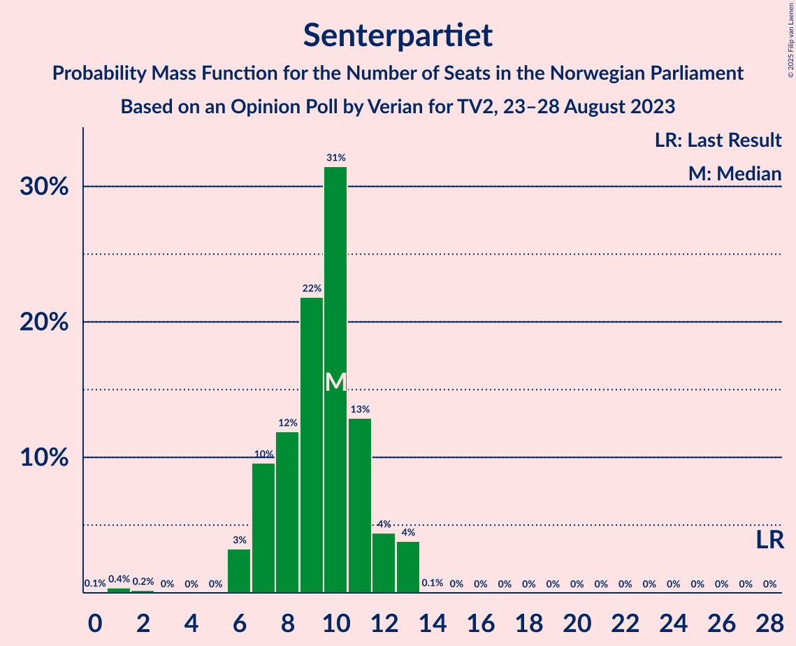
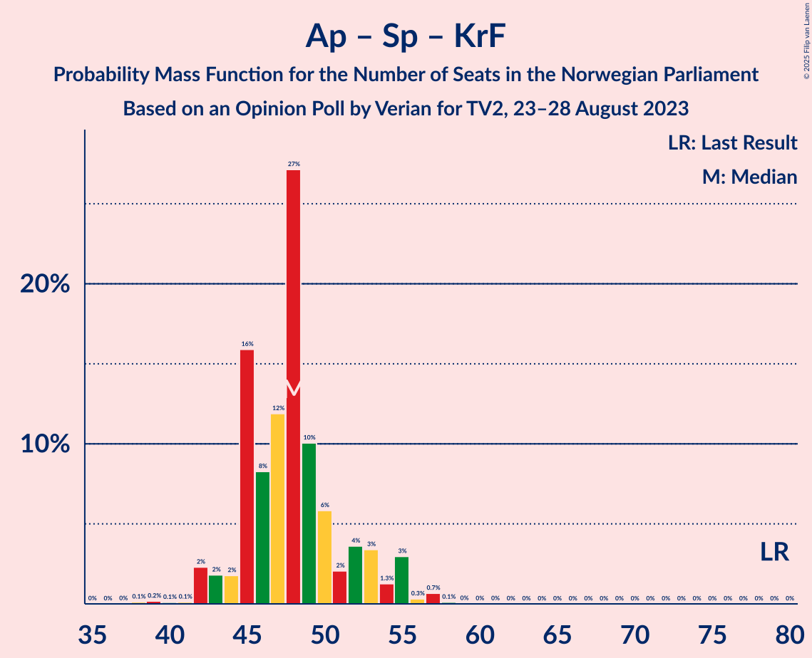

# Opinion Poll by Verian for TV2, 23–28 August 2023

<a href="#voting-intentions">Voting Intentions</a> | <a href="#seats">Seats</a> | <a href="#coalitions">Coalitions</a> | <a href="#technical-information">Technical Information</a>

## Voting Intentions

### Confidence Intervals

| Party | Last Result | Poll Result | 80% Confidence Interval | 90% Confidence Interval | 95% Confidence Interval | 99% Confidence Interval |
|:-----:|:-----------:|:-----------:|:-----------------------:|:-----------------------:|:-----------------------:|:-----------------------:|
| Høyre | 20.4% | 29.9% | 28.3–31.6% |27.9–32.1% |27.5–32.5% |26.7–33.3% |
| Arbeiderpartiet | 26.2% | 18.1% | 16.8–19.5% |16.4–19.9% |16.1–20.3% |15.5–21.0% |
| Fremskrittspartiet | 11.6% | 12.4% | 11.3–13.6% |11.0–14.0% |10.7–14.3% |10.2–14.9% |
| Sosialistisk Venstreparti | 7.6% | 8.4% | 7.5–9.4% |7.2–9.8% |7.0–10.0% |6.6–10.6% |
| Rødt | 4.7% | 5.5% | 4.8–6.4% |4.6–6.7% |4.4–6.9% |4.1–7.4% |
| Senterpartiet | 13.5% | 5.4% | 4.6–6.3% |4.5–6.5% |4.3–6.8% |3.9–7.2% |
| Venstre | 4.6% | 5.1% | 4.4–5.9% |4.2–6.2% |4.0–6.4% |3.7–6.9% |
| Industri- og Næringspartiet | 0.3% | 4.0% | 3.4–4.8% |3.2–5.0% |3.1–5.2% |2.8–5.6% |
| Miljøpartiet De Grønne | 3.9% | 4.0% | 3.4–4.8% |3.2–5.0% |3.1–5.2% |2.8–5.6% |
| Kristelig Folkeparti | 3.8% | 3.6% | 3.0–4.4% |2.9–4.6% |2.7–4.8% |2.5–5.2% |

*Note:* The poll result column reflects the actual value used in the calculations. Published results may vary slightly, and in addition be rounded to fewer digits.

## Seats

### Confidence Intervals

| Party | Last Result | Median | 80% Confidence Interval | 90% Confidence Interval | 95% Confidence Interval | 99% Confidence Interval |
|:-----:|:-----------:|:------:|:-----------------------:|:-----------------------:|:-----------------------:|:-----------------------:|
| <a href="#høyre">Høyre</a> | 36 | 54 | 50–57 |49–58 |48–60 |48–64 |
| <a href="#arbeiderpartiet">Arbeiderpartiet</a> | 48 | 35 | 34–39 |34–41 |33–43 |32–44 |
| <a href="#fremskrittspartiet">Fremskrittspartiet</a> | 21 | 23 | 20–26 |19–26 |18–28 |18–29 |
| <a href="#sosialistisk-venstreparti">Sosialistisk Venstreparti</a> | 13 | 14 | 12–17 |11–17 |11–17 |9–18 |
| <a href="#rødt">Rødt</a> | 8 | 10 | 8–12 |7–13 |7–13 |6–13 |
| <a href="#senterpartiet">Senterpartiet</a> | 28 | 10 | 7–11 |7–12 |6–13 |2–13 |
| <a href="#venstre">Venstre</a> | 8 | 9 | 7–10 |6–11 |6–11 |3–12 |
| <a href="#industri--og-næringspartiet">Industri- og Næringspartiet</a> | 0 | 3 | 3–8 |2–8 |2–9 |2–10 |
| <a href="#miljøpartiet-de-grønne">Miljøpartiet De Grønne</a> | 3 | 3 | 2–8 |2–8 |2–8 |1–9 |
| <a href="#kristelig-folkeparti">Kristelig Folkeparti</a> | 3 | 2 | 2–6 |2–7 |2–7 |2–8 |

### Høyre

*For a full overview of the results for this party, see the [Høyre](party-høyre.html) page.*

| Number of Seats | Probability | Accumulated | Special Marks |
|:---------------:|:-----------:|:-----------:|:-------------:|
| 36 | 0% | 100% | Last Result |
| 37 | 0% | 100% |  |
| 38 | 0% | 100% |  |
| 39 | 0% | 100% |  |
| 40 | 0% | 100% |  |
| 41 | 0% | 100% |  |
| 42 | 0% | 100% |  |
| 43 | 0% | 100% |  |
| 44 | 0% | 100% |  |
| 45 | 0% | 100% |  |
| 46 | 0% | 100% |  |
| 47 | 0.3% | 100% |  |
| 48 | 3% | 99.7% |  |
| 49 | 2% | 97% |  |
| 50 | 7% | 95% |  |
| 51 | 4% | 87% |  |
| 52 | 12% | 84% |  |
| 53 | 16% | 72% |  |
| 54 | 11% | 55% | Median |
| 55 | 8% | 45% |  |
| 56 | 10% | 36% |  |
| 57 | 21% | 26% |  |
| 58 | 2% | 5% |  |
| 59 | 1.3% | 4% |  |
| 60 | 0.6% | 3% |  |
| 61 | 0.7% | 2% |  |
| 62 | 0.4% | 1.2% |  |
| 63 | 0.3% | 0.9% |  |
| 64 | 0.5% | 0.6% |  |
| 65 | 0% | 0.1% |  |
| 66 | 0% | 0.1% |  |
| 67 | 0% | 0% |  |

### Arbeiderpartiet

*For a full overview of the results for this party, see the [Arbeiderpartiet](party-arbeiderpartiet.html) page.*

| Number of Seats | Probability | Accumulated | Special Marks |
|:---------------:|:-----------:|:-----------:|:-------------:|
| 30 | 0.1% | 100% |  |
| 31 | 0.2% | 99.9% |  |
| 32 | 0.6% | 99.7% |  |
| 33 | 4% | 99.1% |  |
| 34 | 42% | 96% |  |
| 35 | 13% | 54% | Median |
| 36 | 22% | 41% |  |
| 37 | 4% | 19% |  |
| 38 | 4% | 15% |  |
| 39 | 3% | 11% |  |
| 40 | 2% | 8% |  |
| 41 | 1.5% | 6% |  |
| 42 | 1.3% | 4% |  |
| 43 | 2% | 3% |  |
| 44 | 0.6% | 0.8% |  |
| 45 | 0.2% | 0.3% |  |
| 46 | 0% | 0% |  |
| 47 | 0% | 0% |  |
| 48 | 0% | 0% | Last Result |

### Fremskrittspartiet

*For a full overview of the results for this party, see the [Fremskrittspartiet](party-fremskrittspartiet.html) page.*

| Number of Seats | Probability | Accumulated | Special Marks |
|:---------------:|:-----------:|:-----------:|:-------------:|
| 17 | 0.2% | 100% |  |
| 18 | 4% | 99.8% |  |
| 19 | 5% | 96% |  |
| 20 | 9% | 91% |  |
| 21 | 10% | 82% | Last Result |
| 22 | 17% | 73% |  |
| 23 | 26% | 55% | Median |
| 24 | 8% | 29% |  |
| 25 | 7% | 21% |  |
| 26 | 9% | 14% |  |
| 27 | 0.9% | 5% |  |
| 28 | 3% | 4% |  |
| 29 | 0.4% | 0.8% |  |
| 30 | 0.2% | 0.4% |  |
| 31 | 0.1% | 0.1% |  |
| 32 | 0% | 0% |  |

### Sosialistisk Venstreparti

*For a full overview of the results for this party, see the [Sosialistisk Venstreparti](party-sosialistiskvenstreparti.html) page.*

| Number of Seats | Probability | Accumulated | Special Marks |
|:---------------:|:-----------:|:-----------:|:-------------:|
| 9 | 0.5% | 100% |  |
| 10 | 2% | 99.4% |  |
| 11 | 4% | 98% |  |
| 12 | 8% | 94% |  |
| 13 | 23% | 86% | Last Result |
| 14 | 16% | 63% | Median |
| 15 | 25% | 47% |  |
| 16 | 9% | 23% |  |
| 17 | 12% | 14% |  |
| 18 | 1.0% | 1.4% |  |
| 19 | 0.3% | 0.4% |  |
| 20 | 0.1% | 0.1% |  |
| 21 | 0% | 0% |  |

### Rødt

*For a full overview of the results for this party, see the [Rødt](party-rødt.html) page.*

| Number of Seats | Probability | Accumulated | Special Marks |
|:---------------:|:-----------:|:-----------:|:-------------:|
| 1 | 0.2% | 100% |  |
| 2 | 0% | 99.8% |  |
| 3 | 0% | 99.8% |  |
| 4 | 0% | 99.8% |  |
| 5 | 0% | 99.8% |  |
| 6 | 1.3% | 99.8% |  |
| 7 | 5% | 98% |  |
| 8 | 15% | 93% | Last Result |
| 9 | 27% | 78% |  |
| 10 | 12% | 51% | Median |
| 11 | 28% | 39% |  |
| 12 | 4% | 10% |  |
| 13 | 6% | 6% |  |
| 14 | 0% | 0% |  |

### Senterpartiet

*For a full overview of the results for this party, see the [Senterpartiet](party-senterpartiet.html) page.*

| Number of Seats | Probability | Accumulated | Special Marks |
|:---------------:|:-----------:|:-----------:|:-------------:|
| 0 | 0.1% | 100% |  |
| 1 | 0.4% | 99.9% |  |
| 2 | 0.2% | 99.6% |  |
| 3 | 0% | 99.4% |  |
| 4 | 0% | 99.3% |  |
| 5 | 0% | 99.3% |  |
| 6 | 3% | 99.3% |  |
| 7 | 10% | 96% |  |
| 8 | 12% | 86% |  |
| 9 | 22% | 75% |  |
| 10 | 31% | 53% | Median |
| 11 | 13% | 21% |  |
| 12 | 4% | 8% |  |
| 13 | 4% | 4% |  |
| 14 | 0.1% | 0.1% |  |
| 15 | 0% | 0% |  |
| 16 | 0% | 0% |  |
| 17 | 0% | 0% |  |
| 18 | 0% | 0% |  |
| 19 | 0% | 0% |  |
| 20 | 0% | 0% |  |
| 21 | 0% | 0% |  |
| 22 | 0% | 0% |  |
| 23 | 0% | 0% |  |
| 24 | 0% | 0% |  |
| 25 | 0% | 0% |  |
| 26 | 0% | 0% |  |
| 27 | 0% | 0% |  |
| 28 | 0% | 0% | Last Result |

### Venstre

*For a full overview of the results for this party, see the [Venstre](party-venstre.html) page.*

| Number of Seats | Probability | Accumulated | Special Marks |
|:---------------:|:-----------:|:-----------:|:-------------:|
| 2 | 0.3% | 100% |  |
| 3 | 2% | 99.7% |  |
| 4 | 0% | 98% |  |
| 5 | 0.2% | 98% |  |
| 6 | 4% | 98% |  |
| 7 | 12% | 94% |  |
| 8 | 24% | 82% | Last Result |
| 9 | 35% | 58% | Median |
| 10 | 17% | 23% |  |
| 11 | 5% | 6% |  |
| 12 | 0.9% | 1.1% |  |
| 13 | 0.2% | 0.2% |  |
| 14 | 0% | 0% |  |

### Industri- og Næringspartiet

*For a full overview of the results for this party, see the [Industri- og Næringspartiet](party-industri-ognæringspartiet.html) page.*

| Number of Seats | Probability | Accumulated | Special Marks |
|:---------------:|:-----------:|:-----------:|:-------------:|
| 0 | 0.1% | 100% | Last Result |
| 1 | 0.3% | 99.9% |  |
| 2 | 6% | 99.6% |  |
| 3 | 49% | 94% | Median |
| 4 | 0% | 45% |  |
| 5 | 0.3% | 45% |  |
| 6 | 7% | 45% |  |
| 7 | 22% | 38% |  |
| 8 | 13% | 15% |  |
| 9 | 2% | 3% |  |
| 10 | 0.5% | 0.6% |  |
| 11 | 0.1% | 0.1% |  |
| 12 | 0% | 0% |  |

### Miljøpartiet De Grønne

*For a full overview of the results for this party, see the [Miljøpartiet De Grønne](party-miljøpartietdegrønne.html) page.*

| Number of Seats | Probability | Accumulated | Special Marks |
|:---------------:|:-----------:|:-----------:|:-------------:|
| 1 | 1.0% | 100% |  |
| 2 | 29% | 99.0% |  |
| 3 | 24% | 70% | Last Result, Median |
| 4 | 0% | 46% |  |
| 5 | 0.1% | 46% |  |
| 6 | 7% | 46% |  |
| 7 | 22% | 38% |  |
| 8 | 14% | 16% |  |
| 9 | 2% | 2% |  |
| 10 | 0.2% | 0.2% |  |
| 11 | 0% | 0% |  |

### Kristelig Folkeparti

*For a full overview of the results for this party, see the [Kristelig Folkeparti](party-kristeligfolkeparti.html) page.*

| Number of Seats | Probability | Accumulated | Special Marks |
|:---------------:|:-----------:|:-----------:|:-------------:|
| 1 | 0.1% | 100% |  |
| 2 | 56% | 99.8% | Median |
| 3 | 32% | 44% | Last Result |
| 4 | 0% | 12% |  |
| 5 | 0% | 12% |  |
| 6 | 3% | 12% |  |
| 7 | 6% | 9% |  |
| 8 | 2% | 2% |  |
| 9 | 0.2% | 0.3% |  |
| 10 | 0% | 0% |  |

## Coalitions

### Confidence Intervals

| Coalition | Last Result | Median | Majority? | 80% Confidence Interval | 90% Confidence Interval | 95% Confidence Interval | 99% Confidence Interval |
|:---------:|:-----------:|:------:|:---------:|:-----------------------:|:-----------------------:|:-----------------------:|:-----------------------:|
| Høyre – Fremskrittspartiet – Senterpartiet – Venstre – Kristelig Folkeparti | 96 | 98 | 100% | 92–103 | 91–103 | 89–104 | 89–106 |
| Høyre – Fremskrittspartiet – Venstre – Miljøpartiet De Grønne – Kristelig Folkeparti | 71 | 93 | 99.2% | 88–97 | 87–99 | 86–101 | 84–103 |
| Høyre – Fremskrittspartiet – Venstre – Kristelig Folkeparti | 68 | 89 | 80% | 83–92 | 82–94 | 80–95 | 80–97 |
| Høyre – Fremskrittspartiet – Venstre | 65 | 85 | 58% | 80–89 | 79–91 | 77–91 | 77–94 |
| Høyre – Fremskrittspartiet | 57 | 77 | 0.5% | 72–81 | 71–82 | 69–82 | 68–85 |
| Arbeiderpartiet – Sosialistisk Venstreparti – Rødt – Senterpartiet – Miljøpartiet De Grønne | 100 | 74 | 0.1% | 69–78 | 67–80 | 66–81 | 64–82 |
| Arbeiderpartiet – Sosialistisk Venstreparti – Senterpartiet – Miljøpartiet De Grønne – Kristelig Folkeparti | 95 | 66 | 0% | 63–72 | 62–73 | 61–75 | 59–76 |
| Arbeiderpartiet – Sosialistisk Venstreparti – Rødt – Senterpartiet | 97 | 70 | 0% | 63–74 | 62–75 | 61–75 | 58–77 |
| Høyre – Venstre – Kristelig Folkeparti | 47 | 66 | 0% | 61–69 | 60–71 | 60–73 | 58–76 |
| Arbeiderpartiet – Sosialistisk Venstreparti – Rødt – Miljøpartiet De Grønne | 72 | 63 | 0% | 61–69 | 59–70 | 57–72 | 55–72 |
| Arbeiderpartiet – Sosialistisk Venstreparti – Senterpartiet – Miljøpartiet De Grønne | 92 | 63 | 0% | 60–69 | 58–70 | 57–72 | 56–72 |
| Arbeiderpartiet – Sosialistisk Venstreparti – Senterpartiet | 89 | 59 | 0% | 55–63 | 54–65 | 53–65 | 51–66 |
| Arbeiderpartiet – Senterpartiet – Miljøpartiet De Grønne – Kristelig Folkeparti | 82 | 52 | 0% | 48–57 | 48–60 | 47–62 | 45–62 |
| Arbeiderpartiet – Sosialistisk Venstreparti | 61 | 49 | 0% | 47–53 | 46–56 | 45–56 | 44–58 |
| Arbeiderpartiet – Senterpartiet – Kristelig Folkeparti | 79 | 48 | 0% | 45–52 | 44–54 | 42–55 | 41–57 |
| Arbeiderpartiet – Senterpartiet | 76 | 45 | 0% | 42–48 | 41–50 | 40–52 | 37–54 |
| Senterpartiet – Venstre – Kristelig Folkeparti | 39 | 21 | 0% | 17–24 | 16–26 | 15–26 | 13–28 |

### Høyre – Fremskrittspartiet – Senterpartiet – Venstre – Kristelig Folkeparti

| Number of Seats | Probability | Accumulated | Special Marks |
|:---------------:|:-----------:|:-----------:|:-------------:|
| 85 | 0% | 100% | Majority |
| 86 | 0% | 99.9% |  |
| 87 | 0.1% | 99.9% |  |
| 88 | 0.3% | 99.9% |  |
| 89 | 3% | 99.6% |  |
| 90 | 0.4% | 97% |  |
| 91 | 4% | 96% |  |
| 92 | 7% | 93% |  |
| 93 | 4% | 86% |  |
| 94 | 7% | 82% |  |
| 95 | 4% | 76% |  |
| 96 | 7% | 72% | Last Result |
| 97 | 12% | 65% |  |
| 98 | 10% | 53% | Median |
| 99 | 6% | 44% |  |
| 100 | 4% | 37% |  |
| 101 | 13% | 34% |  |
| 102 | 8% | 20% |  |
| 103 | 10% | 13% |  |
| 104 | 1.2% | 3% |  |
| 105 | 1.0% | 2% |  |
| 106 | 0.3% | 0.6% |  |
| 107 | 0.2% | 0.3% |  |
| 108 | 0.1% | 0.1% |  |
| 109 | 0% | 0.1% |  |
| 110 | 0% | 0% |  |

### Høyre – Fremskrittspartiet – Venstre – Miljøpartiet De Grønne – Kristelig Folkeparti

| Number of Seats | Probability | Accumulated | Special Marks |
|:---------------:|:-----------:|:-----------:|:-------------:|
| 71 | 0% | 100% | Last Result |
| 72 | 0% | 100% |  |
| 73 | 0% | 100% |  |
| 74 | 0% | 100% |  |
| 75 | 0% | 100% |  |
| 76 | 0% | 100% |  |
| 77 | 0% | 100% |  |
| 78 | 0% | 100% |  |
| 79 | 0% | 100% |  |
| 80 | 0% | 100% |  |
| 81 | 0% | 100% |  |
| 82 | 0.1% | 100% |  |
| 83 | 0.2% | 99.9% |  |
| 84 | 0.5% | 99.7% |  |
| 85 | 2% | 99.2% | Majority |
| 86 | 1.0% | 98% |  |
| 87 | 4% | 97% |  |
| 88 | 4% | 93% |  |
| 89 | 4% | 89% |  |
| 90 | 14% | 85% |  |
| 91 | 4% | 71% | Median |
| 92 | 6% | 66% |  |
| 93 | 20% | 61% |  |
| 94 | 8% | 41% |  |
| 95 | 11% | 33% |  |
| 96 | 8% | 23% |  |
| 97 | 5% | 15% |  |
| 98 | 3% | 10% |  |
| 99 | 2% | 6% |  |
| 100 | 0.9% | 4% |  |
| 101 | 2% | 3% |  |
| 102 | 0.5% | 1.1% |  |
| 103 | 0.4% | 0.7% |  |
| 104 | 0.2% | 0.3% |  |
| 105 | 0% | 0.1% |  |
| 106 | 0% | 0% |  |

### Høyre – Fremskrittspartiet – Venstre – Kristelig Folkeparti

| Number of Seats | Probability | Accumulated | Special Marks |
|:---------------:|:-----------:|:-----------:|:-------------:|
| 68 | 0% | 100% | Last Result |
| 69 | 0% | 100% |  |
| 70 | 0% | 100% |  |
| 71 | 0% | 100% |  |
| 72 | 0% | 100% |  |
| 73 | 0% | 100% |  |
| 74 | 0% | 100% |  |
| 75 | 0% | 100% |  |
| 76 | 0% | 100% |  |
| 77 | 0.1% | 100% |  |
| 78 | 0% | 99.9% |  |
| 79 | 0.3% | 99.9% |  |
| 80 | 3% | 99.6% |  |
| 81 | 1.2% | 97% |  |
| 82 | 4% | 96% |  |
| 83 | 4% | 91% |  |
| 84 | 7% | 87% |  |
| 85 | 5% | 80% | Majority |
| 86 | 5% | 75% |  |
| 87 | 12% | 70% |  |
| 88 | 6% | 58% | Median |
| 89 | 10% | 52% |  |
| 90 | 4% | 42% |  |
| 91 | 17% | 38% |  |
| 92 | 11% | 20% |  |
| 93 | 3% | 10% |  |
| 94 | 4% | 7% |  |
| 95 | 0.5% | 3% |  |
| 96 | 1.3% | 2% |  |
| 97 | 0.5% | 1.0% |  |
| 98 | 0.3% | 0.5% |  |
| 99 | 0.1% | 0.2% |  |
| 100 | 0.1% | 0.1% |  |
| 101 | 0% | 0% |  |

### Høyre – Fremskrittspartiet – Venstre

| Number of Seats | Probability | Accumulated | Special Marks |
|:---------------:|:-----------:|:-----------:|:-------------:|
| 65 | 0% | 100% | Last Result |
| 66 | 0% | 100% |  |
| 67 | 0% | 100% |  |
| 68 | 0% | 100% |  |
| 69 | 0% | 100% |  |
| 70 | 0% | 100% |  |
| 71 | 0% | 100% |  |
| 72 | 0% | 100% |  |
| 73 | 0% | 100% |  |
| 74 | 0.1% | 100% |  |
| 75 | 0.1% | 99.9% |  |
| 76 | 0.2% | 99.9% |  |
| 77 | 3% | 99.6% |  |
| 78 | 1.3% | 97% |  |
| 79 | 1.4% | 96% |  |
| 80 | 6% | 94% |  |
| 81 | 5% | 88% |  |
| 82 | 7% | 83% |  |
| 83 | 8% | 77% |  |
| 84 | 11% | 69% |  |
| 85 | 8% | 58% | Majority |
| 86 | 5% | 50% | Median |
| 87 | 9% | 44% |  |
| 88 | 4% | 36% |  |
| 89 | 23% | 32% |  |
| 90 | 2% | 9% |  |
| 91 | 6% | 7% |  |
| 92 | 0.5% | 1.3% |  |
| 93 | 0.2% | 0.8% |  |
| 94 | 0.5% | 0.6% |  |
| 95 | 0% | 0.1% |  |
| 96 | 0% | 0.1% |  |
| 97 | 0% | 0% |  |

### Høyre – Fremskrittspartiet

| Number of Seats | Probability | Accumulated | Special Marks |
|:---------------:|:-----------:|:-----------:|:-------------:|
| 57 | 0% | 100% | Last Result |
| 58 | 0% | 100% |  |
| 59 | 0% | 100% |  |
| 60 | 0% | 100% |  |
| 61 | 0% | 100% |  |
| 62 | 0% | 100% |  |
| 63 | 0% | 100% |  |
| 64 | 0% | 100% |  |
| 65 | 0% | 100% |  |
| 66 | 0% | 100% |  |
| 67 | 0% | 100% |  |
| 68 | 2% | 100% |  |
| 69 | 0.5% | 98% |  |
| 70 | 1.0% | 97% |  |
| 71 | 5% | 96% |  |
| 72 | 4% | 91% |  |
| 73 | 5% | 87% |  |
| 74 | 3% | 83% |  |
| 75 | 19% | 79% |  |
| 76 | 6% | 60% |  |
| 77 | 6% | 55% | Median |
| 78 | 7% | 49% |  |
| 79 | 16% | 42% |  |
| 80 | 14% | 26% |  |
| 81 | 6% | 12% |  |
| 82 | 4% | 6% |  |
| 83 | 1.2% | 2% |  |
| 84 | 0.3% | 0.8% |  |
| 85 | 0.3% | 0.5% | Majority |
| 86 | 0.1% | 0.2% |  |
| 87 | 0.1% | 0.1% |  |
| 88 | 0% | 0% |  |

### Arbeiderpartiet – Sosialistisk Venstreparti – Rødt – Senterpartiet – Miljøpartiet De Grønne

| Number of Seats | Probability | Accumulated | Special Marks |
|:---------------:|:-----------:|:-----------:|:-------------:|
| 60 | 0% | 100% |  |
| 61 | 0.1% | 99.9% |  |
| 62 | 0.1% | 99.8% |  |
| 63 | 0.1% | 99.7% |  |
| 64 | 1.1% | 99.6% |  |
| 65 | 0.7% | 98% |  |
| 66 | 1.4% | 98% |  |
| 67 | 3% | 96% |  |
| 68 | 3% | 93% |  |
| 69 | 3% | 90% |  |
| 70 | 4% | 87% |  |
| 71 | 7% | 83% |  |
| 72 | 11% | 76% | Median |
| 73 | 14% | 65% |  |
| 74 | 20% | 51% |  |
| 75 | 4% | 31% |  |
| 76 | 2% | 27% |  |
| 77 | 6% | 25% |  |
| 78 | 10% | 19% |  |
| 79 | 1.1% | 9% |  |
| 80 | 5% | 8% |  |
| 81 | 3% | 3% |  |
| 82 | 0.5% | 0.7% |  |
| 83 | 0.1% | 0.3% |  |
| 84 | 0% | 0.1% |  |
| 85 | 0% | 0.1% | Majority |
| 86 | 0% | 0.1% |  |
| 87 | 0% | 0% |  |
| 88 | 0% | 0% |  |
| 89 | 0% | 0% |  |
| 90 | 0% | 0% |  |
| 91 | 0% | 0% |  |
| 92 | 0% | 0% |  |
| 93 | 0% | 0% |  |
| 94 | 0% | 0% |  |
| 95 | 0% | 0% |  |
| 96 | 0% | 0% |  |
| 97 | 0% | 0% |  |
| 98 | 0% | 0% |  |
| 99 | 0% | 0% |  |
| 100 | 0% | 0% | Last Result |

### Arbeiderpartiet – Sosialistisk Venstreparti – Senterpartiet – Miljøpartiet De Grønne – Kristelig Folkeparti

| Number of Seats | Probability | Accumulated | Special Marks |
|:---------------:|:-----------:|:-----------:|:-------------:|
| 55 | 0% | 100% |  |
| 56 | 0% | 99.9% |  |
| 57 | 0.1% | 99.9% |  |
| 58 | 0.2% | 99.9% |  |
| 59 | 0.7% | 99.7% |  |
| 60 | 1.1% | 99.0% |  |
| 61 | 2% | 98% |  |
| 62 | 5% | 96% |  |
| 63 | 9% | 91% |  |
| 64 | 3% | 82% | Median |
| 65 | 28% | 79% |  |
| 66 | 7% | 51% |  |
| 67 | 4% | 44% |  |
| 68 | 13% | 40% |  |
| 69 | 6% | 28% |  |
| 70 | 2% | 21% |  |
| 71 | 7% | 20% |  |
| 72 | 6% | 12% |  |
| 73 | 2% | 6% |  |
| 74 | 1.0% | 4% |  |
| 75 | 3% | 3% |  |
| 76 | 0.3% | 0.6% |  |
| 77 | 0.1% | 0.3% |  |
| 78 | 0.2% | 0.3% |  |
| 79 | 0.1% | 0.1% |  |
| 80 | 0% | 0% |  |
| 81 | 0% | 0% |  |
| 82 | 0% | 0% |  |
| 83 | 0% | 0% |  |
| 84 | 0% | 0% |  |
| 85 | 0% | 0% | Majority |
| 86 | 0% | 0% |  |
| 87 | 0% | 0% |  |
| 88 | 0% | 0% |  |
| 89 | 0% | 0% |  |
| 90 | 0% | 0% |  |
| 91 | 0% | 0% |  |
| 92 | 0% | 0% |  |
| 93 | 0% | 0% |  |
| 94 | 0% | 0% |  |
| 95 | 0% | 0% | Last Result |

### Arbeiderpartiet – Sosialistisk Venstreparti – Rødt – Senterpartiet

| Number of Seats | Probability | Accumulated | Special Marks |
|:---------------:|:-----------:|:-----------:|:-------------:|
| 55 | 0.1% | 100% |  |
| 56 | 0.1% | 99.9% |  |
| 57 | 0.1% | 99.9% |  |
| 58 | 0.3% | 99.8% |  |
| 59 | 0.3% | 99.5% |  |
| 60 | 0.8% | 99.2% |  |
| 61 | 1.4% | 98% |  |
| 62 | 5% | 97% |  |
| 63 | 2% | 92% |  |
| 64 | 4% | 90% |  |
| 65 | 10% | 86% |  |
| 66 | 4% | 76% |  |
| 67 | 5% | 73% |  |
| 68 | 9% | 68% |  |
| 69 | 7% | 59% | Median |
| 70 | 13% | 52% |  |
| 71 | 8% | 39% |  |
| 72 | 16% | 32% |  |
| 73 | 4% | 15% |  |
| 74 | 3% | 12% |  |
| 75 | 8% | 9% |  |
| 76 | 0.2% | 0.8% |  |
| 77 | 0.3% | 0.6% |  |
| 78 | 0.1% | 0.3% |  |
| 79 | 0.1% | 0.1% |  |
| 80 | 0.1% | 0.1% |  |
| 81 | 0% | 0% |  |
| 82 | 0% | 0% |  |
| 83 | 0% | 0% |  |
| 84 | 0% | 0% |  |
| 85 | 0% | 0% | Majority |
| 86 | 0% | 0% |  |
| 87 | 0% | 0% |  |
| 88 | 0% | 0% |  |
| 89 | 0% | 0% |  |
| 90 | 0% | 0% |  |
| 91 | 0% | 0% |  |
| 92 | 0% | 0% |  |
| 93 | 0% | 0% |  |
| 94 | 0% | 0% |  |
| 95 | 0% | 0% |  |
| 96 | 0% | 0% |  |
| 97 | 0% | 0% | Last Result |

### Høyre – Venstre – Kristelig Folkeparti

| Number of Seats | Probability | Accumulated | Special Marks |
|:---------------:|:-----------:|:-----------:|:-------------:|
| 47 | 0% | 100% | Last Result |
| 48 | 0% | 100% |  |
| 49 | 0% | 100% |  |
| 50 | 0% | 100% |  |
| 51 | 0% | 100% |  |
| 52 | 0% | 100% |  |
| 53 | 0% | 100% |  |
| 54 | 0% | 100% |  |
| 55 | 0% | 100% |  |
| 56 | 0.1% | 100% |  |
| 57 | 0.1% | 99.9% |  |
| 58 | 0.6% | 99.8% |  |
| 59 | 0.5% | 99.2% |  |
| 60 | 5% | 98.6% |  |
| 61 | 9% | 94% |  |
| 62 | 4% | 85% |  |
| 63 | 8% | 81% |  |
| 64 | 5% | 73% |  |
| 65 | 15% | 68% | Median |
| 66 | 11% | 53% |  |
| 67 | 15% | 42% |  |
| 68 | 14% | 28% |  |
| 69 | 5% | 14% |  |
| 70 | 3% | 9% |  |
| 71 | 1.5% | 5% |  |
| 72 | 1.0% | 4% |  |
| 73 | 1.4% | 3% |  |
| 74 | 0.3% | 1.4% |  |
| 75 | 0.3% | 1.1% |  |
| 76 | 0.4% | 0.8% |  |
| 77 | 0.1% | 0.4% |  |
| 78 | 0.1% | 0.3% |  |
| 79 | 0.2% | 0.2% |  |
| 80 | 0% | 0% |  |

### Arbeiderpartiet – Sosialistisk Venstreparti – Rødt – Miljøpartiet De Grønne

| Number of Seats | Probability | Accumulated | Special Marks |
|:---------------:|:-----------:|:-----------:|:-------------:|
| 53 | 0.1% | 100% |  |
| 54 | 0.2% | 99.9% |  |
| 55 | 0.4% | 99.7% |  |
| 56 | 2% | 99.3% |  |
| 57 | 0.8% | 98% |  |
| 58 | 1.1% | 97% |  |
| 59 | 2% | 96% |  |
| 60 | 4% | 94% |  |
| 61 | 5% | 90% |  |
| 62 | 16% | 85% | Median |
| 63 | 19% | 69% |  |
| 64 | 13% | 50% |  |
| 65 | 5% | 37% |  |
| 66 | 4% | 32% |  |
| 67 | 7% | 28% |  |
| 68 | 11% | 21% |  |
| 69 | 4% | 10% |  |
| 70 | 2% | 6% |  |
| 71 | 0.5% | 4% |  |
| 72 | 3% | 3% | Last Result |
| 73 | 0.2% | 0.4% |  |
| 74 | 0.1% | 0.2% |  |
| 75 | 0.1% | 0.1% |  |
| 76 | 0% | 0% |  |

### Arbeiderpartiet – Sosialistisk Venstreparti – Senterpartiet – Miljøpartiet De Grønne

| Number of Seats | Probability | Accumulated | Special Marks |
|:---------------:|:-----------:|:-----------:|:-------------:|
| 52 | 0% | 100% |  |
| 53 | 0.2% | 99.9% |  |
| 54 | 0.1% | 99.8% |  |
| 55 | 0.2% | 99.7% |  |
| 56 | 1.1% | 99.5% |  |
| 57 | 1.0% | 98% |  |
| 58 | 2% | 97% |  |
| 59 | 3% | 95% |  |
| 60 | 8% | 92% |  |
| 61 | 6% | 84% |  |
| 62 | 10% | 77% | Median |
| 63 | 21% | 67% |  |
| 64 | 7% | 46% |  |
| 65 | 12% | 39% |  |
| 66 | 6% | 27% |  |
| 67 | 5% | 21% |  |
| 68 | 3% | 16% |  |
| 69 | 7% | 13% |  |
| 70 | 3% | 7% |  |
| 71 | 0.5% | 4% |  |
| 72 | 3% | 3% |  |
| 73 | 0.2% | 0.4% |  |
| 74 | 0.1% | 0.2% |  |
| 75 | 0% | 0.1% |  |
| 76 | 0% | 0.1% |  |
| 77 | 0% | 0% |  |
| 78 | 0% | 0% |  |
| 79 | 0% | 0% |  |
| 80 | 0% | 0% |  |
| 81 | 0% | 0% |  |
| 82 | 0% | 0% |  |
| 83 | 0% | 0% |  |
| 84 | 0% | 0% |  |
| 85 | 0% | 0% | Majority |
| 86 | 0% | 0% |  |
| 87 | 0% | 0% |  |
| 88 | 0% | 0% |  |
| 89 | 0% | 0% |  |
| 90 | 0% | 0% |  |
| 91 | 0% | 0% |  |
| 92 | 0% | 0% | Last Result |

### Arbeiderpartiet – Sosialistisk Venstreparti – Senterpartiet

| Number of Seats | Probability | Accumulated | Special Marks |
|:---------------:|:-----------:|:-----------:|:-------------:|
| 46 | 0.1% | 100% |  |
| 47 | 0% | 99.9% |  |
| 48 | 0.1% | 99.9% |  |
| 49 | 0.1% | 99.8% |  |
| 50 | 0.1% | 99.7% |  |
| 51 | 0.2% | 99.6% |  |
| 52 | 0.9% | 99.4% |  |
| 53 | 1.1% | 98% |  |
| 54 | 6% | 97% |  |
| 55 | 2% | 91% |  |
| 56 | 12% | 89% |  |
| 57 | 6% | 77% |  |
| 58 | 8% | 71% |  |
| 59 | 18% | 63% | Median |
| 60 | 5% | 46% |  |
| 61 | 18% | 41% |  |
| 62 | 13% | 23% |  |
| 63 | 3% | 11% |  |
| 64 | 1.3% | 7% |  |
| 65 | 4% | 6% |  |
| 66 | 2% | 2% |  |
| 67 | 0.1% | 0.4% |  |
| 68 | 0% | 0.3% |  |
| 69 | 0.2% | 0.2% |  |
| 70 | 0.1% | 0.1% |  |
| 71 | 0% | 0% |  |
| 72 | 0% | 0% |  |
| 73 | 0% | 0% |  |
| 74 | 0% | 0% |  |
| 75 | 0% | 0% |  |
| 76 | 0% | 0% |  |
| 77 | 0% | 0% |  |
| 78 | 0% | 0% |  |
| 79 | 0% | 0% |  |
| 80 | 0% | 0% |  |
| 81 | 0% | 0% |  |
| 82 | 0% | 0% |  |
| 83 | 0% | 0% |  |
| 84 | 0% | 0% |  |
| 85 | 0% | 0% | Majority |
| 86 | 0% | 0% |  |
| 87 | 0% | 0% |  |
| 88 | 0% | 0% |  |
| 89 | 0% | 0% | Last Result |

### Arbeiderpartiet – Senterpartiet – Miljøpartiet De Grønne – Kristelig Folkeparti

| Number of Seats | Probability | Accumulated | Special Marks |
|:---------------:|:-----------:|:-----------:|:-------------:|
| 41 | 0.1% | 100% |  |
| 42 | 0% | 99.9% |  |
| 43 | 0% | 99.9% |  |
| 44 | 0.1% | 99.8% |  |
| 45 | 0.2% | 99.7% |  |
| 46 | 1.3% | 99.5% |  |
| 47 | 2% | 98% |  |
| 48 | 7% | 96% |  |
| 49 | 3% | 89% |  |
| 50 | 17% | 86% | Median |
| 51 | 17% | 68% |  |
| 52 | 9% | 51% |  |
| 53 | 8% | 41% |  |
| 54 | 5% | 33% |  |
| 55 | 9% | 28% |  |
| 56 | 7% | 19% |  |
| 57 | 3% | 12% |  |
| 58 | 2% | 10% |  |
| 59 | 2% | 7% |  |
| 60 | 2% | 5% |  |
| 61 | 0.5% | 3% |  |
| 62 | 3% | 3% |  |
| 63 | 0.3% | 0.5% |  |
| 64 | 0% | 0.1% |  |
| 65 | 0% | 0.1% |  |
| 66 | 0.1% | 0.1% |  |
| 67 | 0% | 0% |  |
| 68 | 0% | 0% |  |
| 69 | 0% | 0% |  |
| 70 | 0% | 0% |  |
| 71 | 0% | 0% |  |
| 72 | 0% | 0% |  |
| 73 | 0% | 0% |  |
| 74 | 0% | 0% |  |
| 75 | 0% | 0% |  |
| 76 | 0% | 0% |  |
| 77 | 0% | 0% |  |
| 78 | 0% | 0% |  |
| 79 | 0% | 0% |  |
| 80 | 0% | 0% |  |
| 81 | 0% | 0% |  |
| 82 | 0% | 0% | Last Result |

### Arbeiderpartiet – Sosialistisk Venstreparti

| Number of Seats | Probability | Accumulated | Special Marks |
|:---------------:|:-----------:|:-----------:|:-------------:|
| 42 | 0% | 100% |  |
| 43 | 0.2% | 99.9% |  |
| 44 | 0.9% | 99.7% |  |
| 45 | 2% | 98.8% |  |
| 46 | 3% | 97% |  |
| 47 | 14% | 94% |  |
| 48 | 13% | 79% |  |
| 49 | 17% | 66% | Median |
| 50 | 5% | 49% |  |
| 51 | 23% | 44% |  |
| 52 | 10% | 21% |  |
| 53 | 2% | 11% |  |
| 54 | 2% | 9% |  |
| 55 | 0.9% | 7% |  |
| 56 | 4% | 6% |  |
| 57 | 1.0% | 2% |  |
| 58 | 0.8% | 1.0% |  |
| 59 | 0.1% | 0.2% |  |
| 60 | 0% | 0% |  |
| 61 | 0% | 0% | Last Result |

### Arbeiderpartiet – Senterpartiet – Kristelig Folkeparti

| Number of Seats | Probability | Accumulated | Special Marks |
|:---------------:|:-----------:|:-----------:|:-------------:|
| 38 | 0.1% | 100% |  |
| 39 | 0.2% | 99.8% |  |
| 40 | 0.1% | 99.7% |  |
| 41 | 0.1% | 99.6% |  |
| 42 | 2% | 99.5% |  |
| 43 | 2% | 97% |  |
| 44 | 2% | 95% |  |
| 45 | 16% | 94% |  |
| 46 | 8% | 78% |  |
| 47 | 12% | 69% | Median |
| 48 | 27% | 57% |  |
| 49 | 10% | 30% |  |
| 50 | 6% | 20% |  |
| 51 | 2% | 14% |  |
| 52 | 4% | 12% |  |
| 53 | 3% | 9% |  |
| 54 | 1.3% | 5% |  |
| 55 | 3% | 4% |  |
| 56 | 0.3% | 1.2% |  |
| 57 | 0.7% | 0.8% |  |
| 58 | 0.1% | 0.2% |  |
| 59 | 0% | 0.1% |  |
| 60 | 0% | 0% |  |
| 61 | 0% | 0% |  |
| 62 | 0% | 0% |  |
| 63 | 0% | 0% |  |
| 64 | 0% | 0% |  |
| 65 | 0% | 0% |  |
| 66 | 0% | 0% |  |
| 67 | 0% | 0% |  |
| 68 | 0% | 0% |  |
| 69 | 0% | 0% |  |
| 70 | 0% | 0% |  |
| 71 | 0% | 0% |  |
| 72 | 0% | 0% |  |
| 73 | 0% | 0% |  |
| 74 | 0% | 0% |  |
| 75 | 0% | 0% |  |
| 76 | 0% | 0% |  |
| 77 | 0% | 0% |  |
| 78 | 0% | 0% |  |
| 79 | 0% | 0% | Last Result |

### Arbeiderpartiet – Senterpartiet

| Number of Seats | Probability | Accumulated | Special Marks |
|:---------------:|:-----------:|:-----------:|:-------------:|
| 35 | 0.1% | 100% |  |
| 36 | 0.2% | 99.9% |  |
| 37 | 0.2% | 99.7% |  |
| 38 | 0.1% | 99.5% |  |
| 39 | 0.2% | 99.4% |  |
| 40 | 3% | 99.1% |  |
| 41 | 4% | 97% |  |
| 42 | 3% | 93% |  |
| 43 | 19% | 90% |  |
| 44 | 13% | 71% |  |
| 45 | 21% | 58% | Median |
| 46 | 18% | 37% |  |
| 47 | 7% | 19% |  |
| 48 | 4% | 12% |  |
| 49 | 2% | 8% |  |
| 50 | 1.4% | 6% |  |
| 51 | 1.1% | 5% |  |
| 52 | 3% | 3% |  |
| 53 | 0.1% | 0.6% |  |
| 54 | 0.5% | 0.6% |  |
| 55 | 0.1% | 0.1% |  |
| 56 | 0% | 0% |  |
| 57 | 0% | 0% |  |
| 58 | 0% | 0% |  |
| 59 | 0% | 0% |  |
| 60 | 0% | 0% |  |
| 61 | 0% | 0% |  |
| 62 | 0% | 0% |  |
| 63 | 0% | 0% |  |
| 64 | 0% | 0% |  |
| 65 | 0% | 0% |  |
| 66 | 0% | 0% |  |
| 67 | 0% | 0% |  |
| 68 | 0% | 0% |  |
| 69 | 0% | 0% |  |
| 70 | 0% | 0% |  |
| 71 | 0% | 0% |  |
| 72 | 0% | 0% |  |
| 73 | 0% | 0% |  |
| 74 | 0% | 0% |  |
| 75 | 0% | 0% |  |
| 76 | 0% | 0% | Last Result |

### Senterpartiet – Venstre – Kristelig Folkeparti

| Number of Seats | Probability | Accumulated | Special Marks |
|:---------------:|:-----------:|:-----------:|:-------------:|
| 11 | 0% | 100% |  |
| 12 | 0.3% | 99.9% |  |
| 13 | 0.6% | 99.7% |  |
| 14 | 0.2% | 99.1% |  |
| 15 | 2% | 98.9% |  |
| 16 | 4% | 97% |  |
| 17 | 5% | 93% |  |
| 18 | 3% | 88% |  |
| 19 | 14% | 85% |  |
| 20 | 7% | 71% |  |
| 21 | 26% | 64% | Median |
| 22 | 15% | 38% |  |
| 23 | 6% | 23% |  |
| 24 | 10% | 17% |  |
| 25 | 1.5% | 7% |  |
| 26 | 4% | 5% |  |
| 27 | 1.1% | 2% |  |
| 28 | 0.2% | 0.7% |  |
| 29 | 0.1% | 0.5% |  |
| 30 | 0.2% | 0.4% |  |
| 31 | 0.2% | 0.2% |  |
| 32 | 0% | 0% |  |
| 33 | 0% | 0% |  |
| 34 | 0% | 0% |  |
| 35 | 0% | 0% |  |
| 36 | 0% | 0% |  |
| 37 | 0% | 0% |  |
| 38 | 0% | 0% |  |
| 39 | 0% | 0% | Last Result |

## Technical Information

### Opinion Poll

+ **Polling firm:** Verian
+ **Commissioner(s):** TV2
+ **Fieldwork period:** 23–28 August 2023

### Calculations

+ **Sample size:** 1300
+ **Simulations done:** 1,048,576
+ **Error estimate:** 2.23%

