# Opinion Poll by Opinion Perduco for ABC Nyheter and Altinget, 24–30 August 2023

<a href="#voting-intentions">Voting Intentions</a> | <a href="#seats">Seats</a> | <a href="#coalitions">Coalitions</a> | <a href="#technical-information">Technical Information</a>

## Voting Intentions

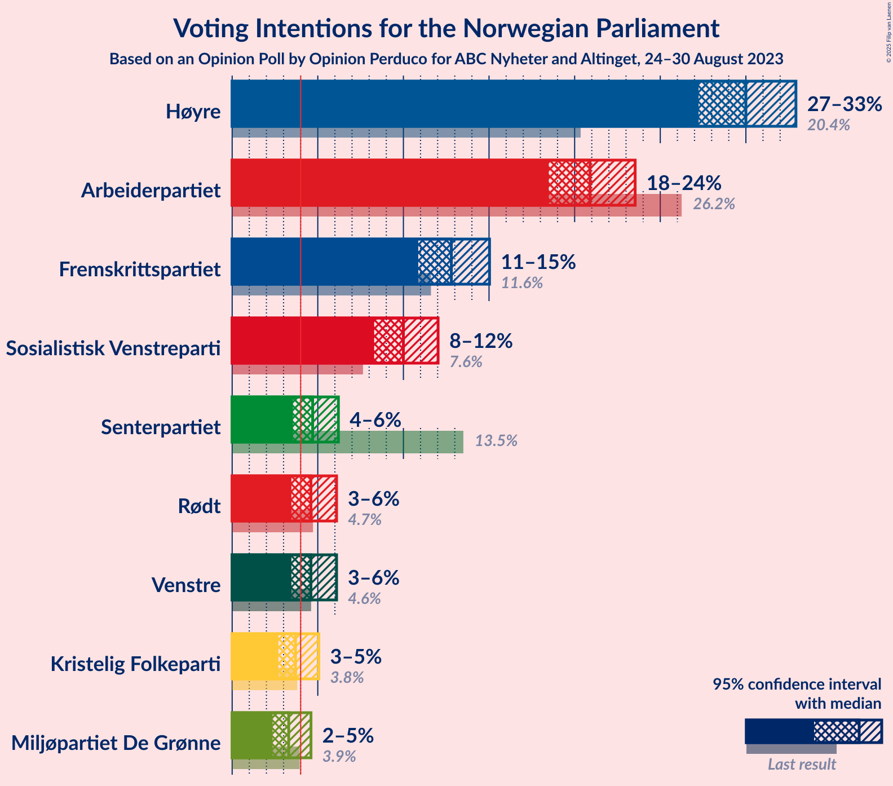

### Confidence Intervals

| Party | Last Result | Poll Result | 80% Confidence Interval | 90% Confidence Interval | 95% Confidence Interval | 99% Confidence Interval |
|:-----:|:-----------:|:-----------:|:-----------------------:|:-----------------------:|:-----------------------:|:-----------------------:|
| Høyre | 20.4% | 30.0% | 28.2–31.9% |27.7–32.4% |27.2–32.9% |26.4–33.9% |
| Arbeiderpartiet | 26.2% | 20.9% | 19.3–22.6% |18.9–23.1% |18.5–23.5% |17.8–24.4% |
| Fremskrittspartiet | 11.6% | 12.8% | 11.5–14.3% |11.2–14.7% |10.9–15.0% |10.3–15.7% |
| Sosialistisk Venstreparti | 7.6% | 10.0% | 8.9–11.3% |8.6–11.7% |8.3–12.0% |7.8–12.7% |
| Senterpartiet | 13.5% | 4.7% | 3.9–5.7% |3.7–6.0% |3.6–6.2% |3.2–6.7% |
| Venstre | 4.6% | 4.6% | 3.9–5.6% |3.6–5.9% |3.5–6.1% |3.1–6.6% |
| Rødt | 4.7% | 4.6% | 3.9–5.6% |3.6–5.9% |3.5–6.1% |3.1–6.6% |
| Kristelig Folkeparti | 3.8% | 3.7% | 3.0–4.6% |2.9–4.8% |2.7–5.1% |2.4–5.5% |
| Miljøpartiet De Grønne | 3.9% | 3.3% | 2.7–4.1% |2.5–4.4% |2.4–4.6% |2.1–5.0% |

*Note:* The poll result column reflects the actual value used in the calculations. Published results may vary slightly, and in addition be rounded to fewer digits.

## Seats

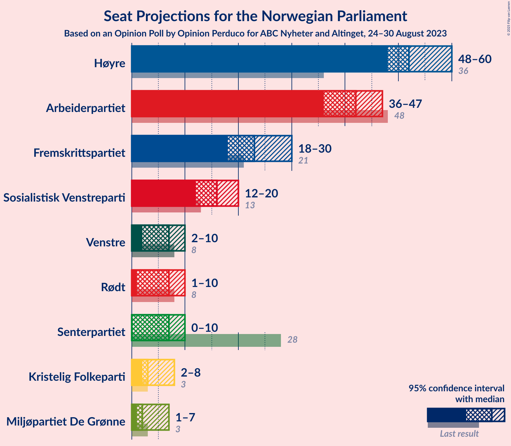

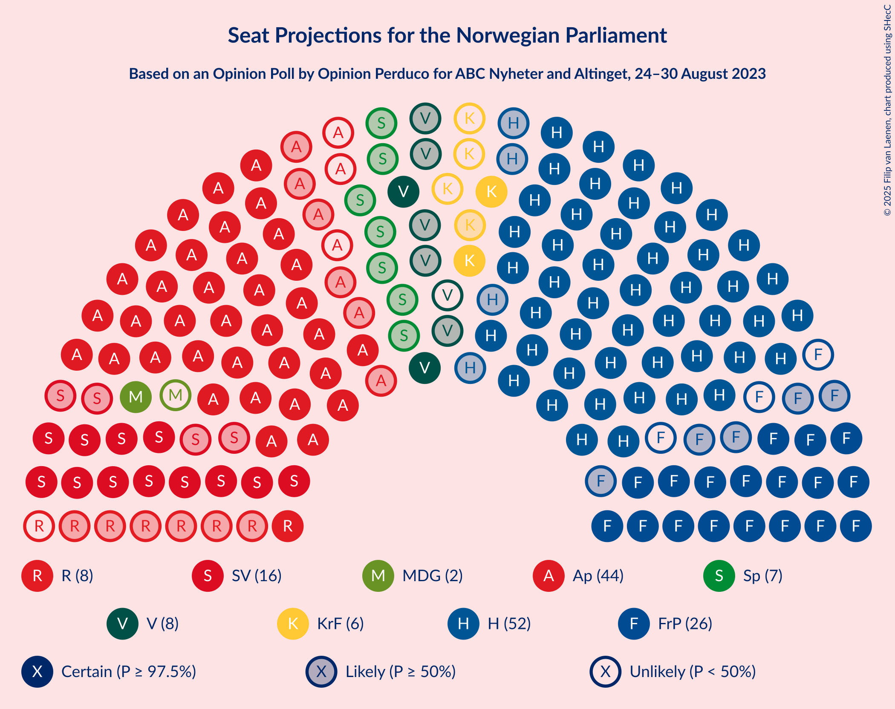

### Confidence Intervals

| Party | Last Result | Median | 80% Confidence Interval | 90% Confidence Interval | 95% Confidence Interval | 99% Confidence Interval |
|:-----:|:-----------:|:------:|:-----------------------:|:-----------------------:|:-----------------------:|:-----------------------:|
| <a href="#høyre">Høyre</a> | 36 | 52 | 49–57 |49–59 |48–60 |47–63 |
| <a href="#arbeiderpartiet">Arbeiderpartiet</a> | 48 | 42 | 38–45 |37–46 |36–47 |34–49 |
| <a href="#fremskrittspartiet">Fremskrittspartiet</a> | 21 | 23 | 19–28 |18–29 |18–30 |17–31 |
| <a href="#sosialistisk-venstreparti">Sosialistisk Venstreparti</a> | 13 | 16 | 14–19 |13–19 |12–20 |11–21 |
| <a href="#senterpartiet">Senterpartiet</a> | 28 | 7 | 1–9 |1–10 |0–10 |0–12 |
| <a href="#venstre">Venstre</a> | 8 | 7 | 3–9 |2–9 |2–10 |2–11 |
| <a href="#rødt">Rødt</a> | 8 | 7 | 1–9 |1–9 |1–10 |1–11 |
| <a href="#kristelig-folkeparti">Kristelig Folkeparti</a> | 3 | 3 | 2–7 |2–7 |2–8 |1–9 |
| <a href="#miljøpartiet-de-grønne">Miljøpartiet De Grønne</a> | 3 | 2 | 1–6 |1–6 |1–7 |1–8 |

### Høyre

*For a full overview of the results for this party, see the [Høyre](party-høyre.html) page.*

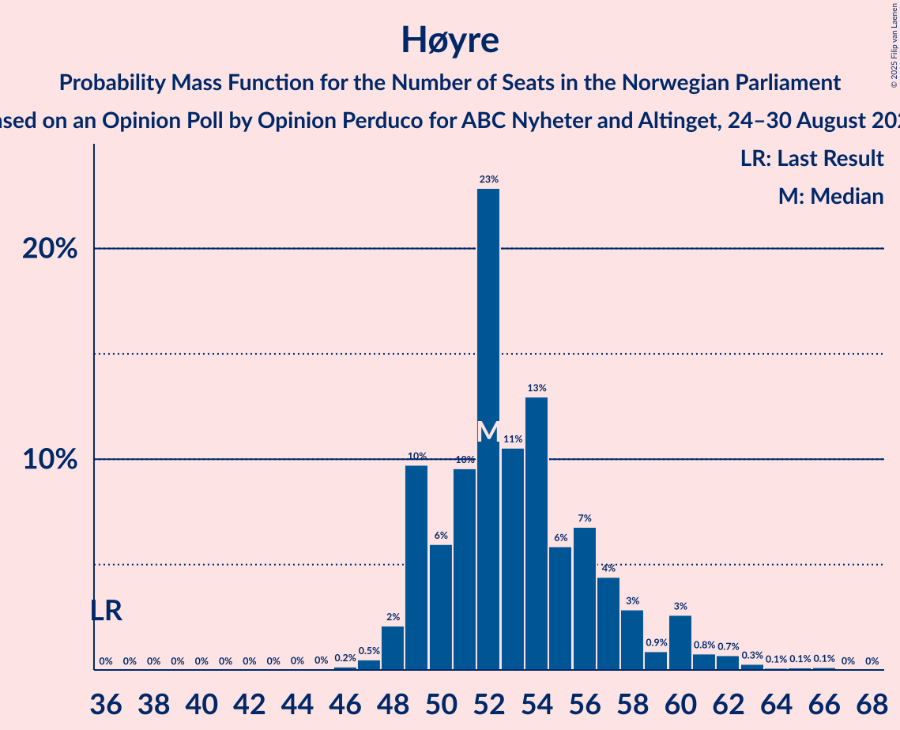

| Number of Seats | Probability | Accumulated | Special Marks |
|:---------------:|:-----------:|:-----------:|:-------------:|
| 36 | 0% | 100% | Last Result |
| 37 | 0% | 100% |  |
| 38 | 0% | 100% |  |
| 39 | 0% | 100% |  |
| 40 | 0% | 100% |  |
| 41 | 0% | 100% |  |
| 42 | 0% | 100% |  |
| 43 | 0% | 100% |  |
| 44 | 0% | 100% |  |
| 45 | 0% | 100% |  |
| 46 | 0.2% | 99.9% |  |
| 47 | 0.5% | 99.8% |  |
| 48 | 2% | 99.3% |  |
| 49 | 10% | 97% |  |
| 50 | 6% | 87% |  |
| 51 | 10% | 81% |  |
| 52 | 23% | 72% | Median |
| 53 | 11% | 49% |  |
| 54 | 13% | 38% |  |
| 55 | 6% | 26% |  |
| 56 | 7% | 20% |  |
| 57 | 4% | 13% |  |
| 58 | 3% | 8% |  |
| 59 | 0.9% | 6% |  |
| 60 | 3% | 5% |  |
| 61 | 0.8% | 2% |  |
| 62 | 0.7% | 1.3% |  |
| 63 | 0.3% | 0.6% |  |
| 64 | 0.1% | 0.4% |  |
| 65 | 0.1% | 0.3% |  |
| 66 | 0.1% | 0.1% |  |
| 67 | 0% | 0% |  |

### Arbeiderpartiet

*For a full overview of the results for this party, see the [Arbeiderpartiet](party-arbeiderpartiet.html) page.*

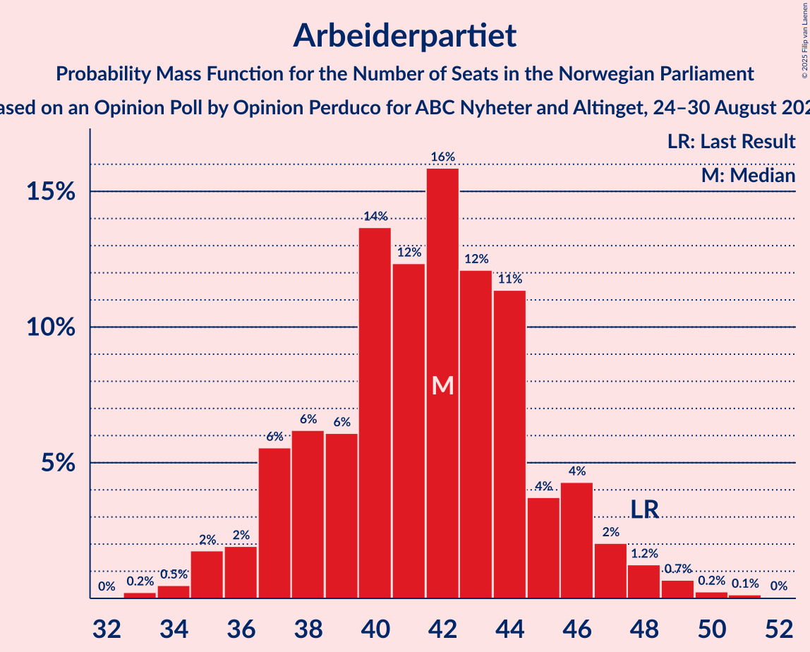

| Number of Seats | Probability | Accumulated | Special Marks |
|:---------------:|:-----------:|:-----------:|:-------------:|
| 33 | 0.2% | 100% |  |
| 34 | 0.5% | 99.7% |  |
| 35 | 2% | 99.3% |  |
| 36 | 2% | 98% |  |
| 37 | 6% | 96% |  |
| 38 | 6% | 90% |  |
| 39 | 6% | 84% |  |
| 40 | 14% | 78% |  |
| 41 | 12% | 64% |  |
| 42 | 16% | 52% | Median |
| 43 | 12% | 36% |  |
| 44 | 11% | 24% |  |
| 45 | 4% | 12% |  |
| 46 | 4% | 9% |  |
| 47 | 2% | 4% |  |
| 48 | 1.2% | 2% | Last Result |
| 49 | 0.7% | 1.1% |  |
| 50 | 0.2% | 0.4% |  |
| 51 | 0.1% | 0.2% |  |
| 52 | 0% | 0% |  |

### Fremskrittspartiet

*For a full overview of the results for this party, see the [Fremskrittspartiet](party-fremskrittspartiet.html) page.*

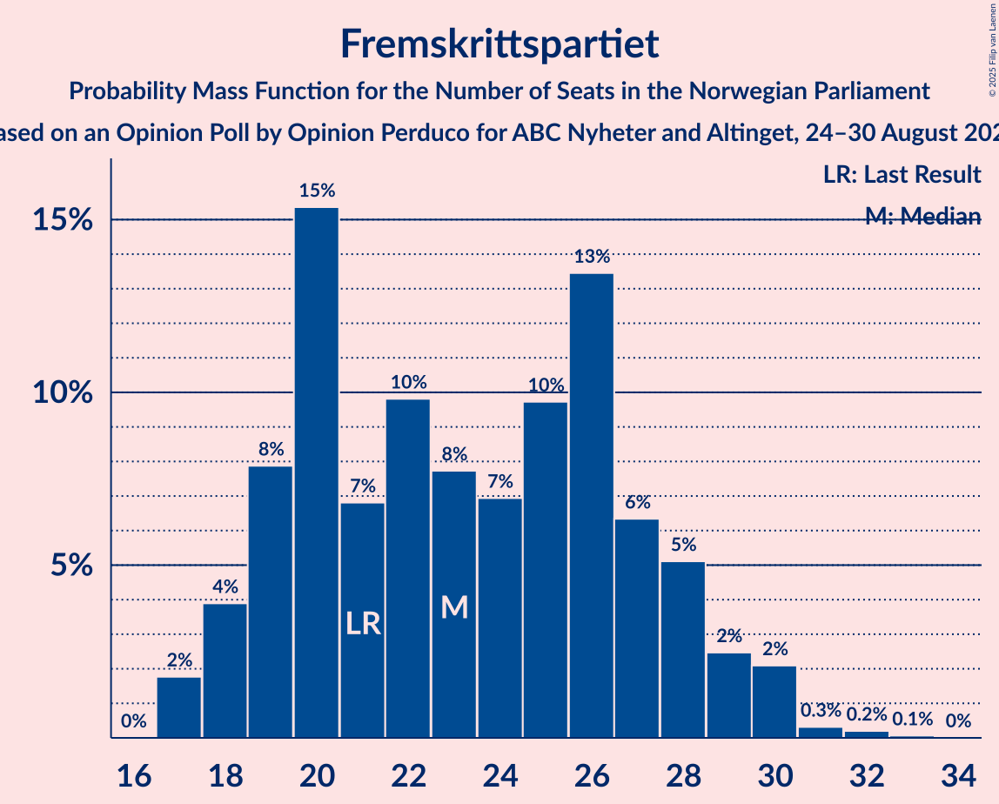

| Number of Seats | Probability | Accumulated | Special Marks |
|:---------------:|:-----------:|:-----------:|:-------------:|
| 17 | 2% | 100% |  |
| 18 | 4% | 98% |  |
| 19 | 8% | 94% |  |
| 20 | 15% | 86% |  |
| 21 | 7% | 71% | Last Result |
| 22 | 10% | 64% |  |
| 23 | 8% | 54% | Median |
| 24 | 7% | 47% |  |
| 25 | 10% | 40% |  |
| 26 | 13% | 30% |  |
| 27 | 6% | 17% |  |
| 28 | 5% | 10% |  |
| 29 | 2% | 5% |  |
| 30 | 2% | 3% |  |
| 31 | 0.3% | 0.6% |  |
| 32 | 0.2% | 0.3% |  |
| 33 | 0.1% | 0.1% |  |
| 34 | 0% | 0% |  |

### Sosialistisk Venstreparti

*For a full overview of the results for this party, see the [Sosialistisk Venstreparti](party-sosialistiskvenstreparti.html) page.*

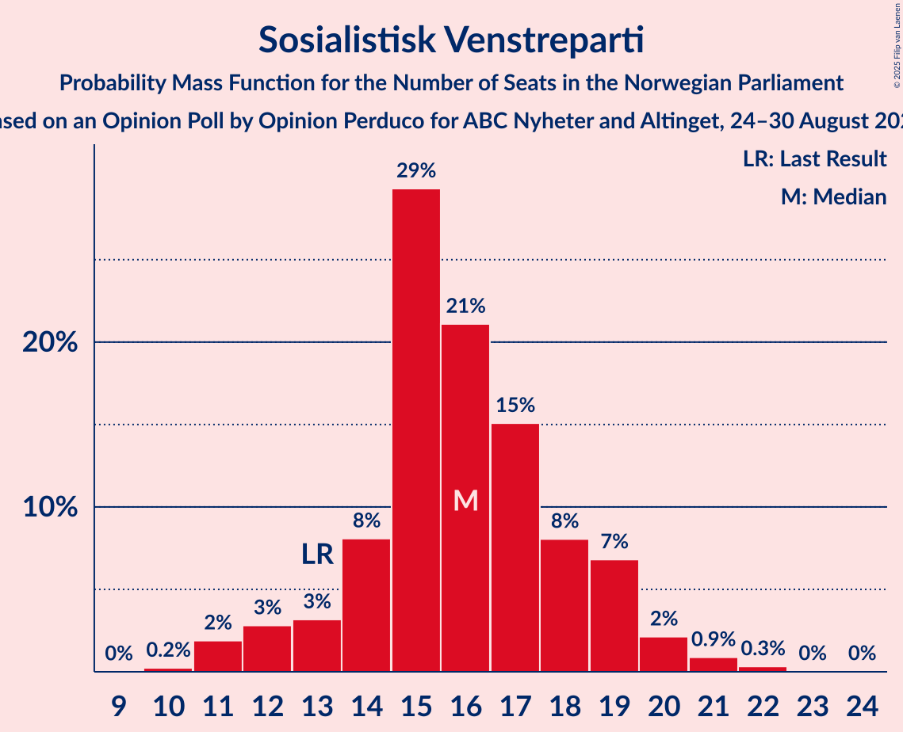

| Number of Seats | Probability | Accumulated | Special Marks |
|:---------------:|:-----------:|:-----------:|:-------------:|
| 10 | 0.2% | 100% |  |
| 11 | 2% | 99.7% |  |
| 12 | 3% | 98% |  |
| 13 | 3% | 95% | Last Result |
| 14 | 8% | 92% |  |
| 15 | 29% | 84% |  |
| 16 | 21% | 54% | Median |
| 17 | 15% | 33% |  |
| 18 | 8% | 18% |  |
| 19 | 7% | 10% |  |
| 20 | 2% | 3% |  |
| 21 | 0.9% | 1.3% |  |
| 22 | 0.3% | 0.4% |  |
| 23 | 0% | 0.1% |  |
| 24 | 0% | 0% |  |

### Senterpartiet

*For a full overview of the results for this party, see the [Senterpartiet](party-senterpartiet.html) page.*

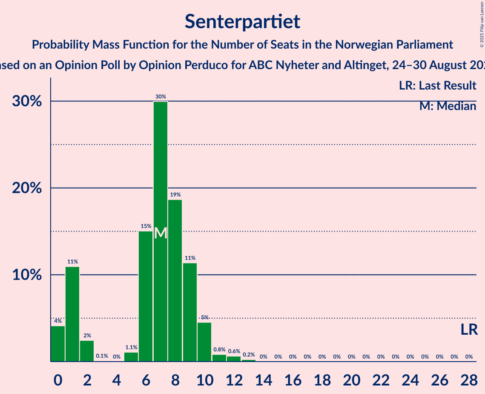

| Number of Seats | Probability | Accumulated | Special Marks |
|:---------------:|:-----------:|:-----------:|:-------------:|
| 0 | 4% | 100% |  |
| 1 | 11% | 96% |  |
| 2 | 2% | 85% |  |
| 3 | 0.1% | 82% |  |
| 4 | 0% | 82% |  |
| 5 | 1.1% | 82% |  |
| 6 | 15% | 81% |  |
| 7 | 30% | 66% | Median |
| 8 | 19% | 36% |  |
| 9 | 11% | 18% |  |
| 10 | 5% | 6% |  |
| 11 | 0.8% | 2% |  |
| 12 | 0.6% | 0.9% |  |
| 13 | 0.2% | 0.2% |  |
| 14 | 0% | 0% |  |
| 15 | 0% | 0% |  |
| 16 | 0% | 0% |  |
| 17 | 0% | 0% |  |
| 18 | 0% | 0% |  |
| 19 | 0% | 0% |  |
| 20 | 0% | 0% |  |
| 21 | 0% | 0% |  |
| 22 | 0% | 0% |  |
| 23 | 0% | 0% |  |
| 24 | 0% | 0% |  |
| 25 | 0% | 0% |  |
| 26 | 0% | 0% |  |
| 27 | 0% | 0% |  |
| 28 | 0% | 0% | Last Result |

### Venstre

*For a full overview of the results for this party, see the [Venstre](party-venstre.html) page.*

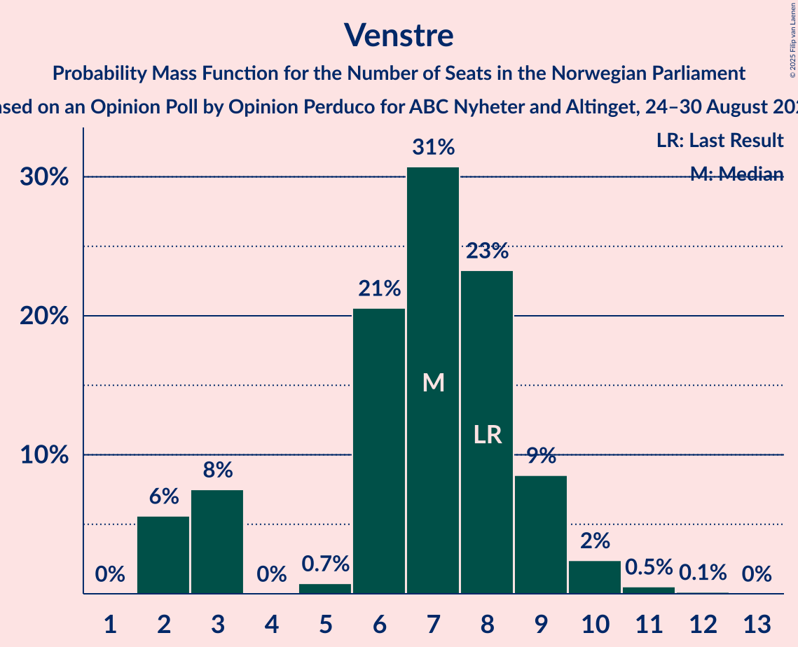

| Number of Seats | Probability | Accumulated | Special Marks |
|:---------------:|:-----------:|:-----------:|:-------------:|
| 2 | 6% | 100% |  |
| 3 | 8% | 94% |  |
| 4 | 0% | 87% |  |
| 5 | 0.7% | 87% |  |
| 6 | 21% | 86% |  |
| 7 | 31% | 66% | Median |
| 8 | 23% | 35% | Last Result |
| 9 | 9% | 12% |  |
| 10 | 2% | 3% |  |
| 11 | 0.5% | 0.6% |  |
| 12 | 0.1% | 0.1% |  |
| 13 | 0% | 0% |  |

### Rødt

*For a full overview of the results for this party, see the [Rødt](party-rødt.html) page.*

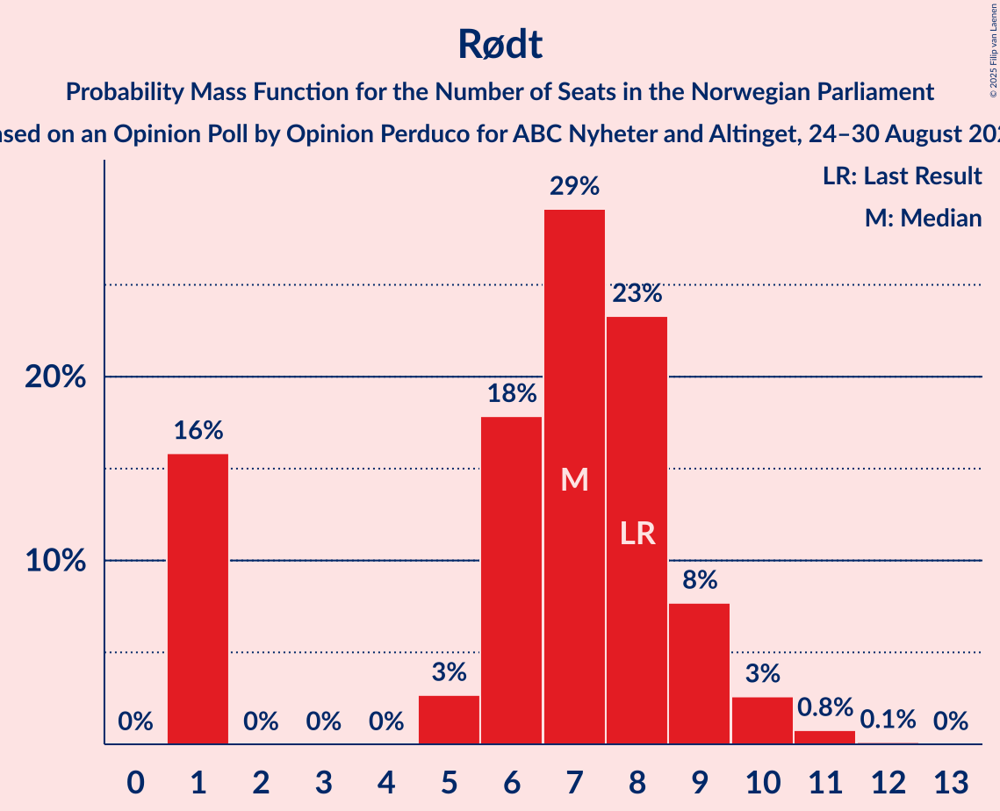

| Number of Seats | Probability | Accumulated | Special Marks |
|:---------------:|:-----------:|:-----------:|:-------------:|
| 1 | 16% | 100% |  |
| 2 | 0% | 84% |  |
| 3 | 0% | 84% |  |
| 4 | 0% | 84% |  |
| 5 | 3% | 84% |  |
| 6 | 18% | 81% |  |
| 7 | 29% | 64% | Median |
| 8 | 23% | 34% | Last Result |
| 9 | 8% | 11% |  |
| 10 | 3% | 3% |  |
| 11 | 0.8% | 0.9% |  |
| 12 | 0.1% | 0.1% |  |
| 13 | 0% | 0% |  |

### Kristelig Folkeparti

*For a full overview of the results for this party, see the [Kristelig Folkeparti](party-kristeligfolkeparti.html) page.*

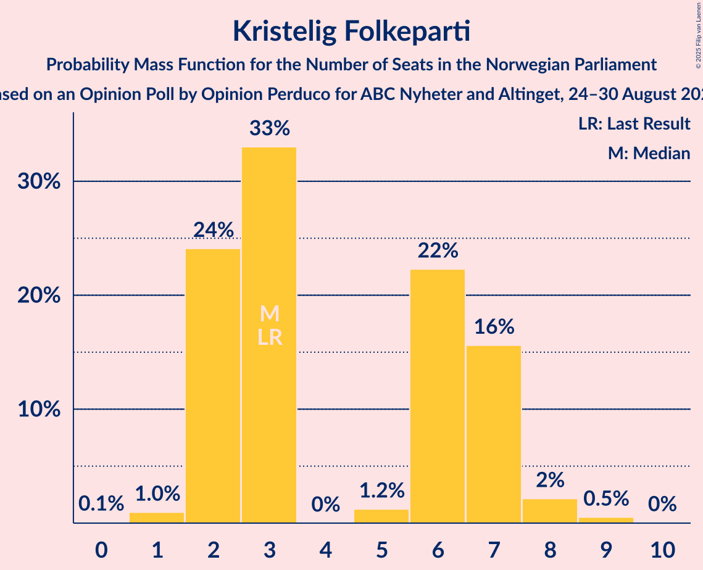

| Number of Seats | Probability | Accumulated | Special Marks |
|:---------------:|:-----------:|:-----------:|:-------------:|
| 0 | 0.1% | 100% |  |
| 1 | 1.0% | 99.9% |  |
| 2 | 24% | 99.0% |  |
| 3 | 33% | 75% | Last Result, Median |
| 4 | 0% | 42% |  |
| 5 | 1.2% | 42% |  |
| 6 | 22% | 41% |  |
| 7 | 16% | 18% |  |
| 8 | 2% | 3% |  |
| 9 | 0.5% | 0.6% |  |
| 10 | 0% | 0% |  |

### Miljøpartiet De Grønne

*For a full overview of the results for this party, see the [Miljøpartiet De Grønne](party-miljøpartietdegrønne.html) page.*

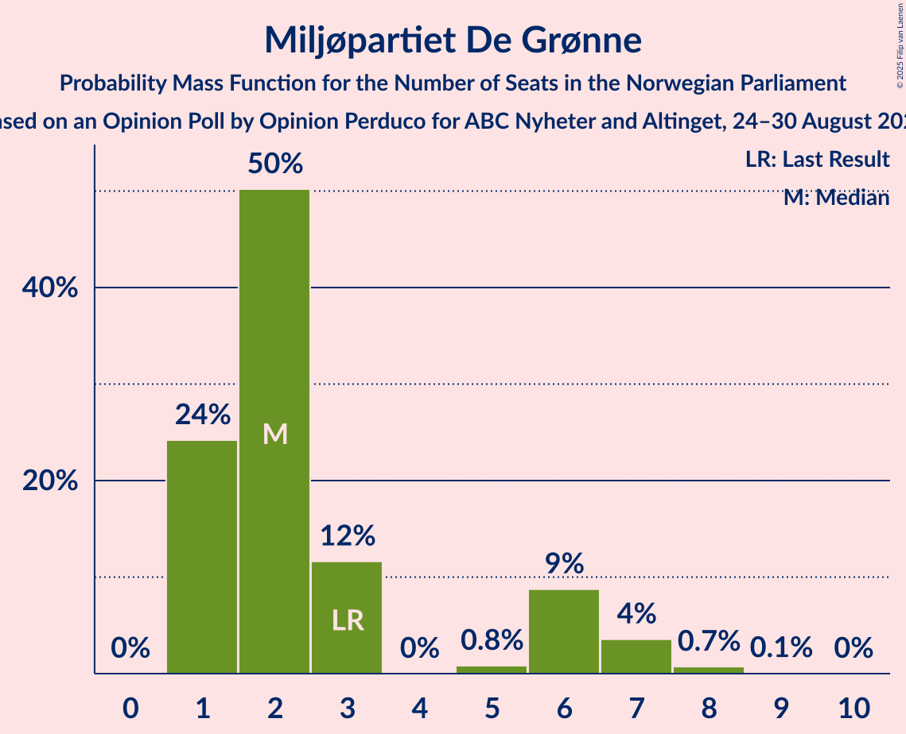

| Number of Seats | Probability | Accumulated | Special Marks |
|:---------------:|:-----------:|:-----------:|:-------------:|
| 1 | 24% | 100% |  |
| 2 | 50% | 76% | Median |
| 3 | 12% | 26% | Last Result |
| 4 | 0% | 14% |  |
| 5 | 0.8% | 14% |  |
| 6 | 9% | 13% |  |
| 7 | 4% | 4% |  |
| 8 | 0.7% | 0.8% |  |
| 9 | 0.1% | 0.1% |  |
| 10 | 0% | 0% |  |

## Coalitions

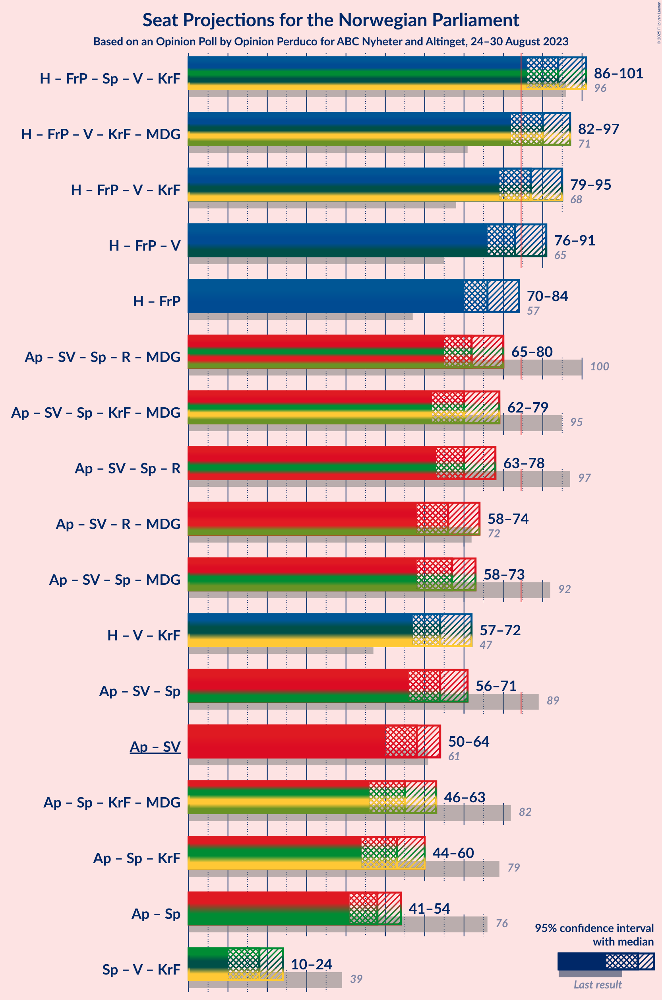

### Confidence Intervals

| Coalition | Last Result | Median | Majority? | 80% Confidence Interval | 90% Confidence Interval | 95% Confidence Interval | 99% Confidence Interval |
|:---------:|:-----------:|:------:|:---------:|:-----------------------:|:-----------------------:|:-----------------------:|:-----------------------:|
| Høyre – Fremskrittspartiet – Senterpartiet – Venstre – Kristelig Folkeparti | 96 | 94 | 98.5% | 88–99 | 87–100 | 86–101 | 82–103 |
| Høyre – Fremskrittspartiet – Venstre – Kristelig Folkeparti – Miljøpartiet De Grønne | 71 | 90 | 85% | 84–95 | 82–97 | 82–97 | 80–101 |
| Høyre – Fremskrittspartiet – Venstre – Kristelig Folkeparti | 68 | 87 | 74% | 82–93 | 81–94 | 79–95 | 77–98 |
| Høyre – Fremskrittspartiet – Venstre | 65 | 83 | 33% | 78–88 | 76–89 | 76–91 | 73–93 |
| Høyre – Fremskrittspartiet | 57 | 76 | 2% | 72–81 | 70–82 | 70–84 | 68–86 |
| Arbeiderpartiet – Sosialistisk Venstreparti – Senterpartiet – Rødt – Miljøpartiet De Grønne | 100 | 72 | 0.2% | 67–78 | 66–79 | 65–80 | 60–83 |
| Arbeiderpartiet – Sosialistisk Venstreparti – Senterpartiet – Kristelig Folkeparti – Miljøpartiet De Grønne | 95 | 70 | 0.1% | 65–76 | 63–77 | 62–79 | 60–81 |
| Arbeiderpartiet – Sosialistisk Venstreparti – Senterpartiet – Rødt | 97 | 70 | 0% | 64–76 | 63–77 | 63–78 | 59–80 |
| Arbeiderpartiet – Sosialistisk Venstreparti – Rødt – Miljøpartiet De Grønne | 72 | 66 | 0% | 61–71 | 60–72 | 58–74 | 57–77 |
| Arbeiderpartiet – Sosialistisk Venstreparti – Senterpartiet – Miljøpartiet De Grønne | 92 | 67 | 0% | 61–71 | 59–72 | 58–73 | 55–77 |
| Høyre – Venstre – Kristelig Folkeparti | 47 | 64 | 0% | 60–69 | 58–70 | 57–72 | 54–74 |
| Arbeiderpartiet – Sosialistisk Venstreparti – Senterpartiet | 89 | 64 | 0% | 58–69 | 57–70 | 56–71 | 53–73 |
| Arbeiderpartiet – Sosialistisk Venstreparti | 61 | 58 | 0% | 53–61 | 52–62 | 50–64 | 49–66 |
| Arbeiderpartiet – Senterpartiet – Kristelig Folkeparti – Miljøpartiet De Grønne | 82 | 55 | 0% | 50–60 | 47–61 | 46–63 | 44–65 |
| Arbeiderpartiet – Senterpartiet – Kristelig Folkeparti | 79 | 53 | 0% | 47–57 | 45–58 | 44–60 | 41–61 |
| Arbeiderpartiet – Senterpartiet | 76 | 48 | 0% | 43–53 | 41–53 | 41–54 | 37–56 |
| Senterpartiet – Venstre – Kristelig Folkeparti | 39 | 18 | 0% | 13–21 | 11–22 | 10–24 | 5–25 |

### Høyre – Fremskrittspartiet – Senterpartiet – Venstre – Kristelig Folkeparti

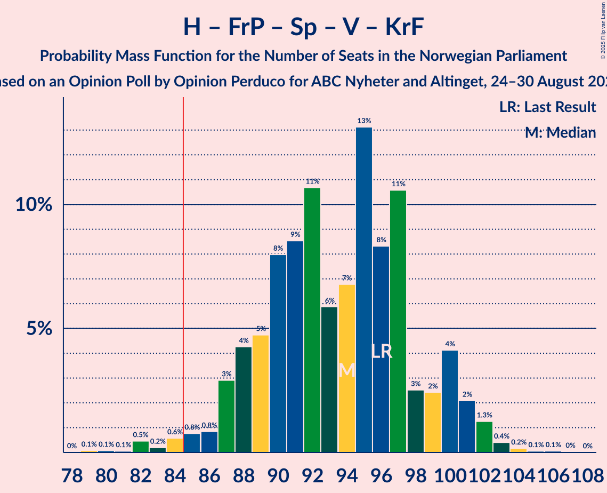

| Number of Seats | Probability | Accumulated | Special Marks |
|:---------------:|:-----------:|:-----------:|:-------------:|
| 79 | 0.1% | 100% |  |
| 80 | 0.1% | 99.9% |  |
| 81 | 0.1% | 99.8% |  |
| 82 | 0.5% | 99.8% |  |
| 83 | 0.2% | 99.3% |  |
| 84 | 0.6% | 99.1% |  |
| 85 | 0.8% | 98.5% | Majority |
| 86 | 0.8% | 98% |  |
| 87 | 3% | 97% |  |
| 88 | 4% | 94% |  |
| 89 | 5% | 90% |  |
| 90 | 8% | 85% |  |
| 91 | 9% | 77% |  |
| 92 | 11% | 69% | Median |
| 93 | 6% | 58% |  |
| 94 | 7% | 52% |  |
| 95 | 13% | 45% |  |
| 96 | 8% | 32% | Last Result |
| 97 | 11% | 24% |  |
| 98 | 3% | 13% |  |
| 99 | 2% | 11% |  |
| 100 | 4% | 8% |  |
| 101 | 2% | 4% |  |
| 102 | 1.3% | 2% |  |
| 103 | 0.4% | 0.7% |  |
| 104 | 0.2% | 0.3% |  |
| 105 | 0.1% | 0.2% |  |
| 106 | 0.1% | 0.1% |  |
| 107 | 0% | 0.1% |  |
| 108 | 0% | 0% |  |

### Høyre – Fremskrittspartiet – Venstre – Kristelig Folkeparti – Miljøpartiet De Grønne

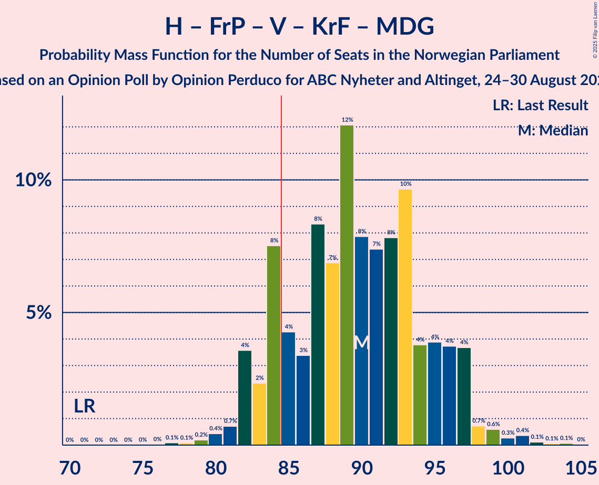

| Number of Seats | Probability | Accumulated | Special Marks |
|:---------------:|:-----------:|:-----------:|:-------------:|
| 71 | 0% | 100% | Last Result |
| 72 | 0% | 100% |  |
| 73 | 0% | 100% |  |
| 74 | 0% | 100% |  |
| 75 | 0% | 100% |  |
| 76 | 0% | 100% |  |
| 77 | 0.1% | 100% |  |
| 78 | 0.1% | 99.9% |  |
| 79 | 0.2% | 99.8% |  |
| 80 | 0.4% | 99.6% |  |
| 81 | 0.7% | 99.2% |  |
| 82 | 4% | 98% |  |
| 83 | 2% | 95% |  |
| 84 | 8% | 93% |  |
| 85 | 4% | 85% | Majority |
| 86 | 3% | 81% |  |
| 87 | 8% | 77% | Median |
| 88 | 7% | 69% |  |
| 89 | 12% | 62% |  |
| 90 | 8% | 50% |  |
| 91 | 7% | 42% |  |
| 92 | 8% | 35% |  |
| 93 | 10% | 27% |  |
| 94 | 4% | 17% |  |
| 95 | 4% | 14% |  |
| 96 | 4% | 10% |  |
| 97 | 4% | 6% |  |
| 98 | 0.7% | 2% |  |
| 99 | 0.6% | 2% |  |
| 100 | 0.3% | 0.9% |  |
| 101 | 0.4% | 0.6% |  |
| 102 | 0.1% | 0.3% |  |
| 103 | 0.1% | 0.2% |  |
| 104 | 0.1% | 0.1% |  |
| 105 | 0% | 0% |  |

### Høyre – Fremskrittspartiet – Venstre – Kristelig Folkeparti

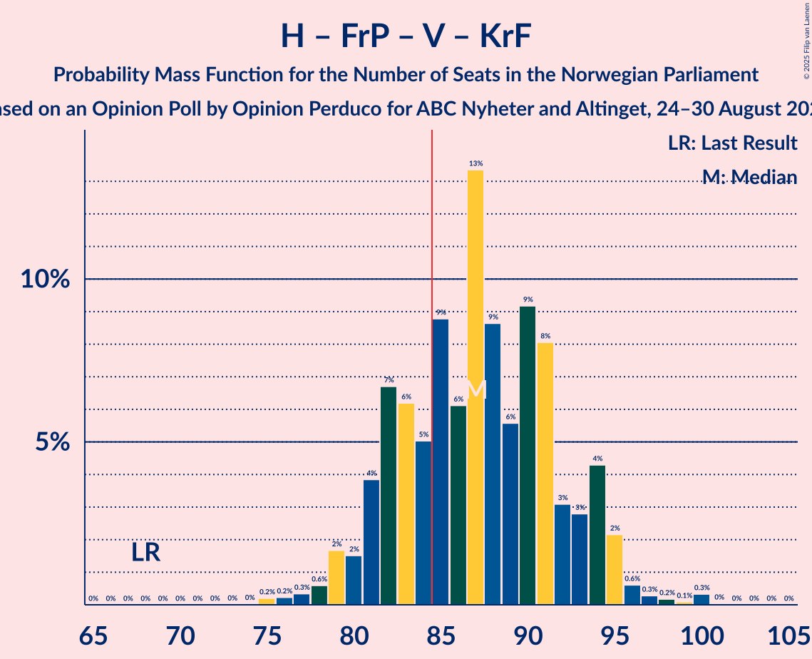

| Number of Seats | Probability | Accumulated | Special Marks |
|:---------------:|:-----------:|:-----------:|:-------------:|
| 68 | 0% | 100% | Last Result |
| 69 | 0% | 100% |  |
| 70 | 0% | 100% |  |
| 71 | 0% | 100% |  |
| 72 | 0% | 100% |  |
| 73 | 0% | 100% |  |
| 74 | 0% | 100% |  |
| 75 | 0.2% | 100% |  |
| 76 | 0.2% | 99.7% |  |
| 77 | 0.3% | 99.5% |  |
| 78 | 0.6% | 99.2% |  |
| 79 | 2% | 98.6% |  |
| 80 | 2% | 97% |  |
| 81 | 4% | 95% |  |
| 82 | 7% | 92% |  |
| 83 | 6% | 85% |  |
| 84 | 5% | 79% |  |
| 85 | 9% | 74% | Median, Majority |
| 86 | 6% | 65% |  |
| 87 | 13% | 59% |  |
| 88 | 9% | 45% |  |
| 89 | 6% | 37% |  |
| 90 | 9% | 31% |  |
| 91 | 8% | 22% |  |
| 92 | 3% | 14% |  |
| 93 | 3% | 11% |  |
| 94 | 4% | 8% |  |
| 95 | 2% | 4% |  |
| 96 | 0.6% | 2% |  |
| 97 | 0.3% | 0.9% |  |
| 98 | 0.2% | 0.7% |  |
| 99 | 0.1% | 0.5% |  |
| 100 | 0.3% | 0.4% |  |
| 101 | 0% | 0.1% |  |
| 102 | 0% | 0% |  |

### Høyre – Fremskrittspartiet – Venstre

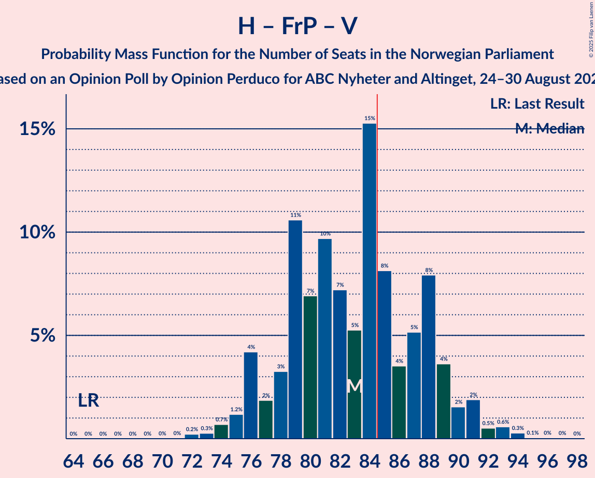

| Number of Seats | Probability | Accumulated | Special Marks |
|:---------------:|:-----------:|:-----------:|:-------------:|
| 65 | 0% | 100% | Last Result |
| 66 | 0% | 100% |  |
| 67 | 0% | 100% |  |
| 68 | 0% | 100% |  |
| 69 | 0% | 100% |  |
| 70 | 0% | 100% |  |
| 71 | 0% | 100% |  |
| 72 | 0.2% | 99.9% |  |
| 73 | 0.3% | 99.7% |  |
| 74 | 0.7% | 99.5% |  |
| 75 | 1.2% | 98.8% |  |
| 76 | 4% | 98% |  |
| 77 | 2% | 93% |  |
| 78 | 3% | 92% |  |
| 79 | 11% | 88% |  |
| 80 | 7% | 78% |  |
| 81 | 10% | 71% |  |
| 82 | 7% | 61% | Median |
| 83 | 5% | 54% |  |
| 84 | 15% | 49% |  |
| 85 | 8% | 33% | Majority |
| 86 | 4% | 25% |  |
| 87 | 5% | 22% |  |
| 88 | 8% | 16% |  |
| 89 | 4% | 9% |  |
| 90 | 2% | 5% |  |
| 91 | 2% | 3% |  |
| 92 | 0.5% | 2% |  |
| 93 | 0.6% | 1.0% |  |
| 94 | 0.3% | 0.4% |  |
| 95 | 0.1% | 0.1% |  |
| 96 | 0% | 0.1% |  |
| 97 | 0% | 0% |  |

### Høyre – Fremskrittspartiet

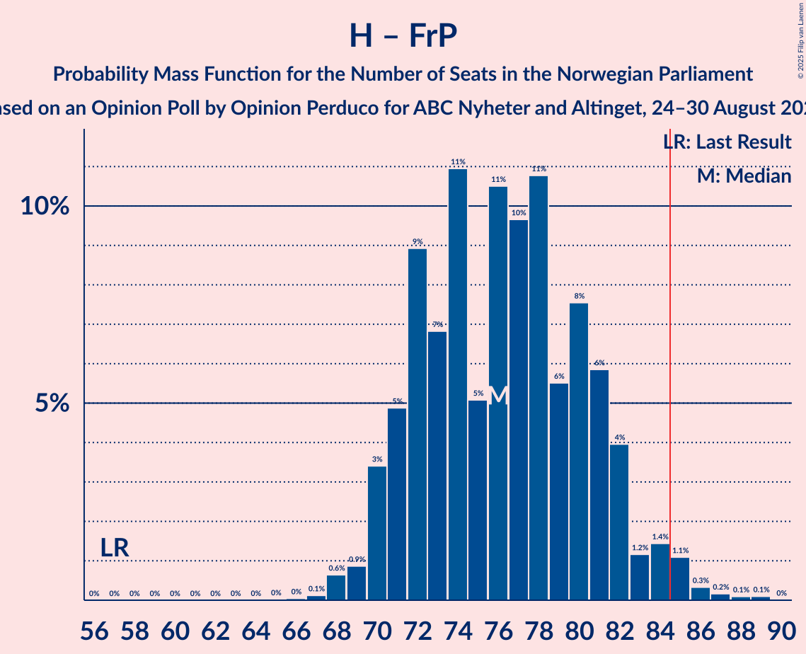

| Number of Seats | Probability | Accumulated | Special Marks |
|:---------------:|:-----------:|:-----------:|:-------------:|
| 57 | 0% | 100% | Last Result |
| 58 | 0% | 100% |  |
| 59 | 0% | 100% |  |
| 60 | 0% | 100% |  |
| 61 | 0% | 100% |  |
| 62 | 0% | 100% |  |
| 63 | 0% | 100% |  |
| 64 | 0% | 100% |  |
| 65 | 0% | 100% |  |
| 66 | 0% | 100% |  |
| 67 | 0.1% | 99.9% |  |
| 68 | 0.6% | 99.8% |  |
| 69 | 0.9% | 99.2% |  |
| 70 | 3% | 98% |  |
| 71 | 5% | 95% |  |
| 72 | 9% | 90% |  |
| 73 | 7% | 81% |  |
| 74 | 11% | 74% |  |
| 75 | 5% | 63% | Median |
| 76 | 11% | 58% |  |
| 77 | 10% | 48% |  |
| 78 | 11% | 38% |  |
| 79 | 6% | 27% |  |
| 80 | 8% | 22% |  |
| 81 | 6% | 14% |  |
| 82 | 4% | 8% |  |
| 83 | 1.2% | 4% |  |
| 84 | 1.4% | 3% |  |
| 85 | 1.1% | 2% | Majority |
| 86 | 0.3% | 0.7% |  |
| 87 | 0.2% | 0.4% |  |
| 88 | 0.1% | 0.2% |  |
| 89 | 0.1% | 0.1% |  |
| 90 | 0% | 0% |  |

### Arbeiderpartiet – Sosialistisk Venstreparti – Senterpartiet – Rødt – Miljøpartiet De Grønne

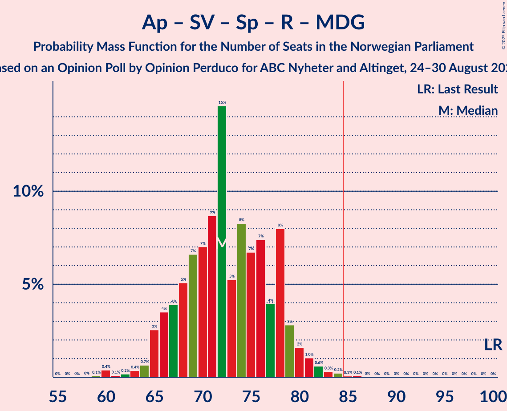

| Number of Seats | Probability | Accumulated | Special Marks |
|:---------------:|:-----------:|:-----------:|:-------------:|
| 59 | 0.1% | 100% |  |
| 60 | 0.4% | 99.9% |  |
| 61 | 0.1% | 99.5% |  |
| 62 | 0.2% | 99.4% |  |
| 63 | 0.4% | 99.2% |  |
| 64 | 0.7% | 98.9% |  |
| 65 | 3% | 98% |  |
| 66 | 4% | 96% |  |
| 67 | 4% | 92% |  |
| 68 | 5% | 88% |  |
| 69 | 7% | 83% |  |
| 70 | 7% | 77% |  |
| 71 | 9% | 70% |  |
| 72 | 15% | 61% |  |
| 73 | 5% | 46% |  |
| 74 | 8% | 41% | Median |
| 75 | 7% | 33% |  |
| 76 | 7% | 26% |  |
| 77 | 4% | 19% |  |
| 78 | 8% | 15% |  |
| 79 | 3% | 7% |  |
| 80 | 2% | 4% |  |
| 81 | 1.0% | 2% |  |
| 82 | 0.6% | 1.3% |  |
| 83 | 0.3% | 0.7% |  |
| 84 | 0.2% | 0.4% |  |
| 85 | 0.1% | 0.2% | Majority |
| 86 | 0.1% | 0.1% |  |
| 87 | 0% | 0% |  |
| 88 | 0% | 0% |  |
| 89 | 0% | 0% |  |
| 90 | 0% | 0% |  |
| 91 | 0% | 0% |  |
| 92 | 0% | 0% |  |
| 93 | 0% | 0% |  |
| 94 | 0% | 0% |  |
| 95 | 0% | 0% |  |
| 96 | 0% | 0% |  |
| 97 | 0% | 0% |  |
| 98 | 0% | 0% |  |
| 99 | 0% | 0% |  |
| 100 | 0% | 0% | Last Result |

### Arbeiderpartiet – Sosialistisk Venstreparti – Senterpartiet – Kristelig Folkeparti – Miljøpartiet De Grønne

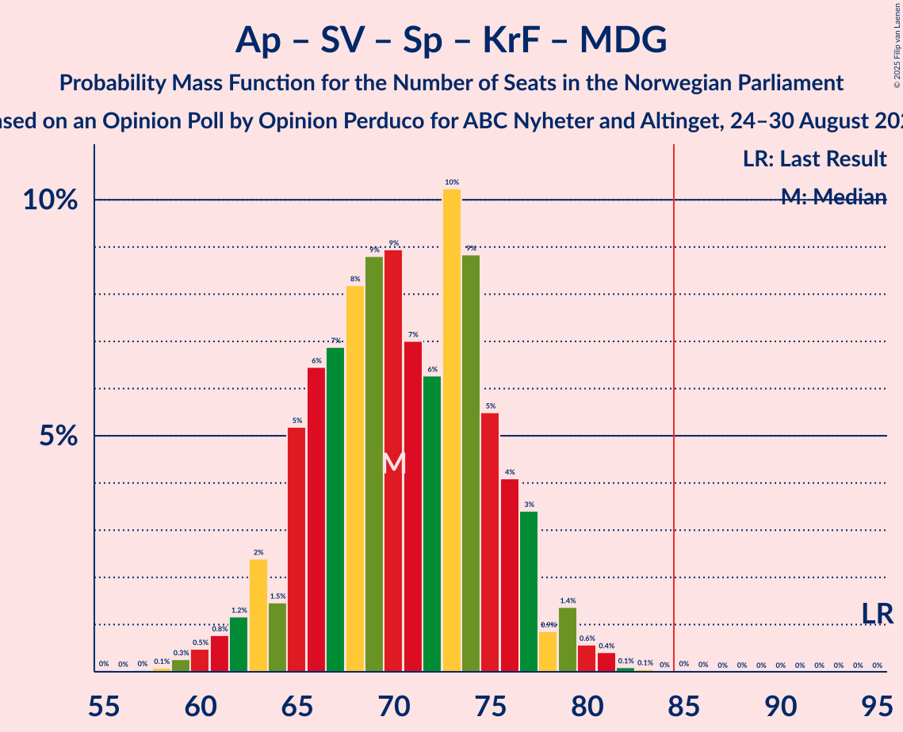

| Number of Seats | Probability | Accumulated | Special Marks |
|:---------------:|:-----------:|:-----------:|:-------------:|
| 56 | 0% | 100% |  |
| 57 | 0% | 99.9% |  |
| 58 | 0.1% | 99.9% |  |
| 59 | 0.3% | 99.8% |  |
| 60 | 0.5% | 99.6% |  |
| 61 | 0.8% | 99.1% |  |
| 62 | 1.2% | 98% |  |
| 63 | 2% | 97% |  |
| 64 | 1.5% | 95% |  |
| 65 | 5% | 93% |  |
| 66 | 6% | 88% |  |
| 67 | 7% | 82% |  |
| 68 | 8% | 75% |  |
| 69 | 9% | 67% |  |
| 70 | 9% | 58% | Median |
| 71 | 7% | 49% |  |
| 72 | 6% | 42% |  |
| 73 | 10% | 36% |  |
| 74 | 9% | 25% |  |
| 75 | 5% | 16% |  |
| 76 | 4% | 11% |  |
| 77 | 3% | 7% |  |
| 78 | 0.9% | 3% |  |
| 79 | 1.4% | 3% |  |
| 80 | 0.6% | 1.2% |  |
| 81 | 0.4% | 0.6% |  |
| 82 | 0.1% | 0.2% |  |
| 83 | 0.1% | 0.1% |  |
| 84 | 0% | 0.1% |  |
| 85 | 0% | 0.1% | Majority |
| 86 | 0% | 0% |  |
| 87 | 0% | 0% |  |
| 88 | 0% | 0% |  |
| 89 | 0% | 0% |  |
| 90 | 0% | 0% |  |
| 91 | 0% | 0% |  |
| 92 | 0% | 0% |  |
| 93 | 0% | 0% |  |
| 94 | 0% | 0% |  |
| 95 | 0% | 0% | Last Result |

### Arbeiderpartiet – Sosialistisk Venstreparti – Senterpartiet – Rødt

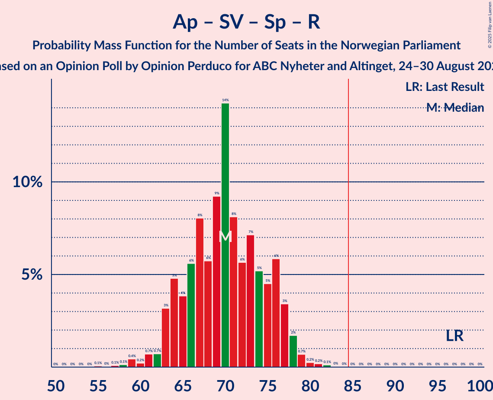

| Number of Seats | Probability | Accumulated | Special Marks |
|:---------------:|:-----------:|:-----------:|:-------------:|
| 55 | 0.1% | 100% |  |
| 56 | 0% | 99.9% |  |
| 57 | 0.1% | 99.9% |  |
| 58 | 0.1% | 99.8% |  |
| 59 | 0.4% | 99.7% |  |
| 60 | 0.2% | 99.2% |  |
| 61 | 0.7% | 99.0% |  |
| 62 | 0.7% | 98% |  |
| 63 | 3% | 98% |  |
| 64 | 5% | 94% |  |
| 65 | 4% | 90% |  |
| 66 | 6% | 86% |  |
| 67 | 8% | 80% |  |
| 68 | 6% | 72% |  |
| 69 | 9% | 66% |  |
| 70 | 14% | 57% |  |
| 71 | 8% | 43% |  |
| 72 | 6% | 35% | Median |
| 73 | 7% | 29% |  |
| 74 | 5% | 22% |  |
| 75 | 5% | 17% |  |
| 76 | 6% | 12% |  |
| 77 | 3% | 6% |  |
| 78 | 2% | 3% |  |
| 79 | 0.7% | 1.3% |  |
| 80 | 0.2% | 0.6% |  |
| 81 | 0.2% | 0.4% |  |
| 82 | 0.1% | 0.2% |  |
| 83 | 0% | 0.1% |  |
| 84 | 0% | 0% |  |
| 85 | 0% | 0% | Majority |
| 86 | 0% | 0% |  |
| 87 | 0% | 0% |  |
| 88 | 0% | 0% |  |
| 89 | 0% | 0% |  |
| 90 | 0% | 0% |  |
| 91 | 0% | 0% |  |
| 92 | 0% | 0% |  |
| 93 | 0% | 0% |  |
| 94 | 0% | 0% |  |
| 95 | 0% | 0% |  |
| 96 | 0% | 0% |  |
| 97 | 0% | 0% | Last Result |

### Arbeiderpartiet – Sosialistisk Venstreparti – Rødt – Miljøpartiet De Grønne

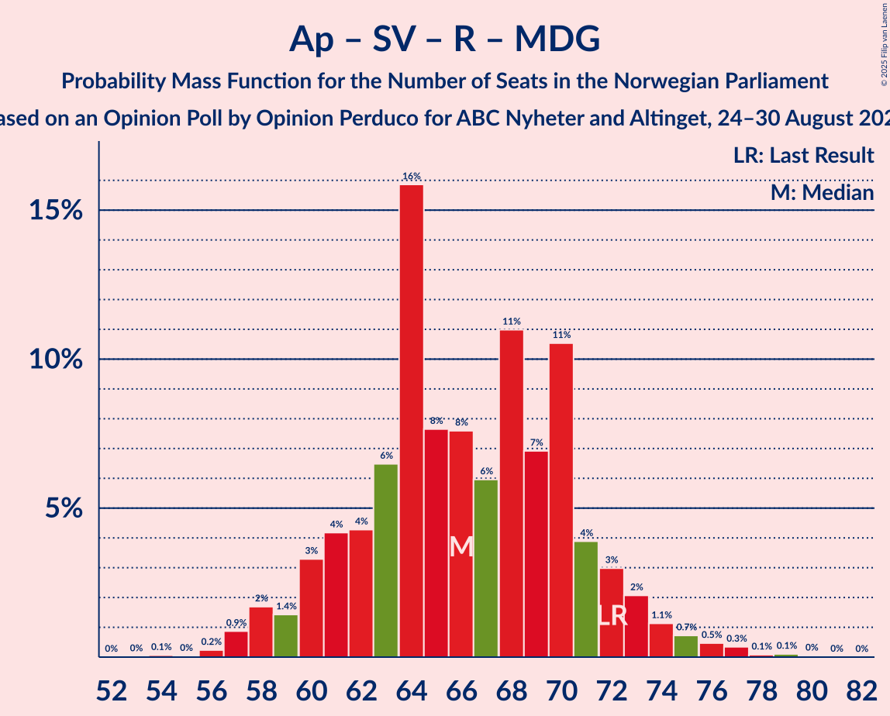

| Number of Seats | Probability | Accumulated | Special Marks |
|:---------------:|:-----------:|:-----------:|:-------------:|
| 54 | 0.1% | 100% |  |
| 55 | 0% | 99.9% |  |
| 56 | 0.2% | 99.9% |  |
| 57 | 0.9% | 99.6% |  |
| 58 | 2% | 98.8% |  |
| 59 | 1.4% | 97% |  |
| 60 | 3% | 96% |  |
| 61 | 4% | 92% |  |
| 62 | 4% | 88% |  |
| 63 | 6% | 84% |  |
| 64 | 16% | 77% |  |
| 65 | 8% | 62% |  |
| 66 | 8% | 54% |  |
| 67 | 6% | 46% | Median |
| 68 | 11% | 40% |  |
| 69 | 7% | 29% |  |
| 70 | 11% | 22% |  |
| 71 | 4% | 12% |  |
| 72 | 3% | 8% | Last Result |
| 73 | 2% | 5% |  |
| 74 | 1.1% | 3% |  |
| 75 | 0.7% | 2% |  |
| 76 | 0.5% | 1.1% |  |
| 77 | 0.3% | 0.6% |  |
| 78 | 0.1% | 0.2% |  |
| 79 | 0.1% | 0.2% |  |
| 80 | 0% | 0.1% |  |
| 81 | 0% | 0% |  |

### Arbeiderpartiet – Sosialistisk Venstreparti – Senterpartiet – Miljøpartiet De Grønne

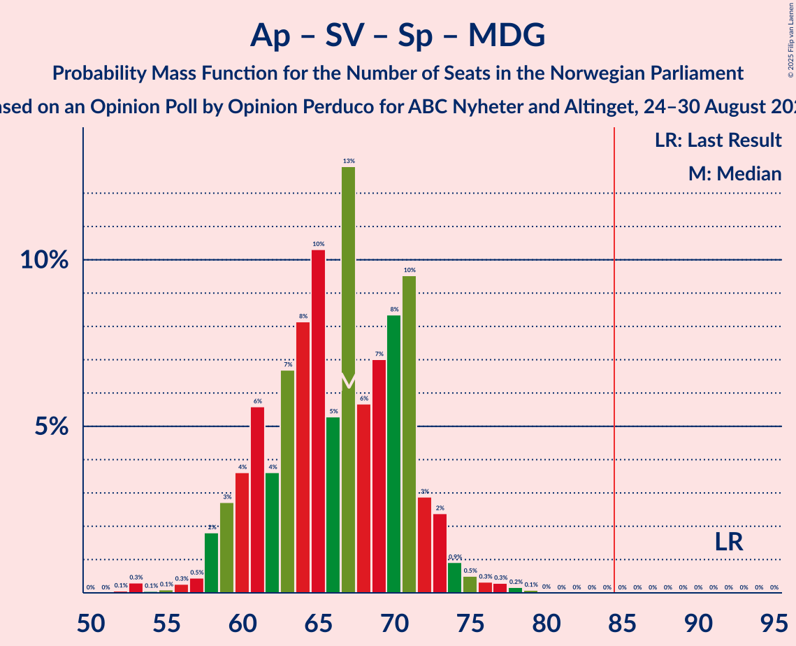

| Number of Seats | Probability | Accumulated | Special Marks |
|:---------------:|:-----------:|:-----------:|:-------------:|
| 52 | 0.1% | 100% |  |
| 53 | 0.3% | 99.9% |  |
| 54 | 0.1% | 99.6% |  |
| 55 | 0.1% | 99.6% |  |
| 56 | 0.3% | 99.5% |  |
| 57 | 0.5% | 99.2% |  |
| 58 | 2% | 98.8% |  |
| 59 | 3% | 97% |  |
| 60 | 4% | 94% |  |
| 61 | 6% | 91% |  |
| 62 | 4% | 85% |  |
| 63 | 7% | 81% |  |
| 64 | 8% | 75% |  |
| 65 | 10% | 67% |  |
| 66 | 5% | 56% |  |
| 67 | 13% | 51% | Median |
| 68 | 6% | 38% |  |
| 69 | 7% | 32% |  |
| 70 | 8% | 25% |  |
| 71 | 10% | 17% |  |
| 72 | 3% | 8% |  |
| 73 | 2% | 5% |  |
| 74 | 0.9% | 2% |  |
| 75 | 0.5% | 1.4% |  |
| 76 | 0.3% | 0.9% |  |
| 77 | 0.3% | 0.6% |  |
| 78 | 0.2% | 0.3% |  |
| 79 | 0.1% | 0.1% |  |
| 80 | 0% | 0% |  |
| 81 | 0% | 0% |  |
| 82 | 0% | 0% |  |
| 83 | 0% | 0% |  |
| 84 | 0% | 0% |  |
| 85 | 0% | 0% | Majority |
| 86 | 0% | 0% |  |
| 87 | 0% | 0% |  |
| 88 | 0% | 0% |  |
| 89 | 0% | 0% |  |
| 90 | 0% | 0% |  |
| 91 | 0% | 0% |  |
| 92 | 0% | 0% | Last Result |

### Høyre – Venstre – Kristelig Folkeparti

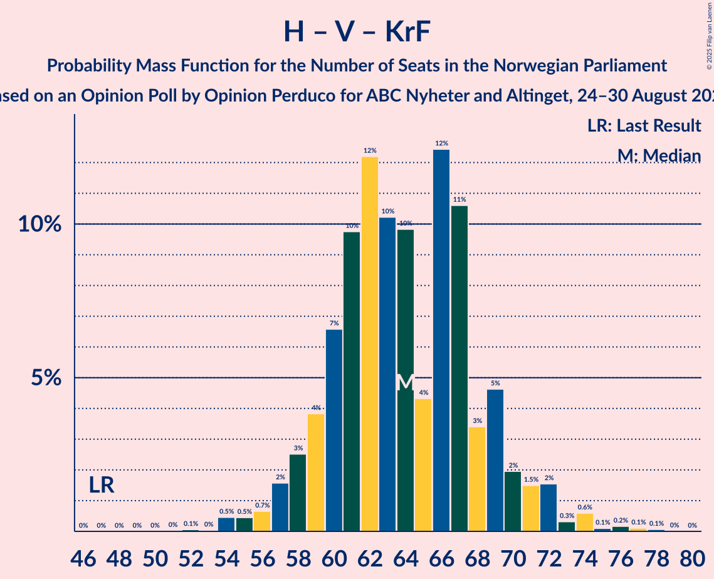

| Number of Seats | Probability | Accumulated | Special Marks |
|:---------------:|:-----------:|:-----------:|:-------------:|
| 47 | 0% | 100% | Last Result |
| 48 | 0% | 100% |  |
| 49 | 0% | 100% |  |
| 50 | 0% | 100% |  |
| 51 | 0% | 100% |  |
| 52 | 0.1% | 100% |  |
| 53 | 0% | 99.9% |  |
| 54 | 0.5% | 99.9% |  |
| 55 | 0.5% | 99.4% |  |
| 56 | 0.7% | 99.0% |  |
| 57 | 2% | 98% |  |
| 58 | 3% | 97% |  |
| 59 | 4% | 94% |  |
| 60 | 7% | 90% |  |
| 61 | 10% | 84% |  |
| 62 | 12% | 74% | Median |
| 63 | 10% | 62% |  |
| 64 | 10% | 52% |  |
| 65 | 4% | 42% |  |
| 66 | 12% | 37% |  |
| 67 | 11% | 25% |  |
| 68 | 3% | 14% |  |
| 69 | 5% | 11% |  |
| 70 | 2% | 6% |  |
| 71 | 1.5% | 4% |  |
| 72 | 2% | 3% |  |
| 73 | 0.3% | 1.4% |  |
| 74 | 0.6% | 1.1% |  |
| 75 | 0.1% | 0.5% |  |
| 76 | 0.2% | 0.4% |  |
| 77 | 0.1% | 0.2% |  |
| 78 | 0.1% | 0.1% |  |
| 79 | 0% | 0% |  |

### Arbeiderpartiet – Sosialistisk Venstreparti – Senterpartiet

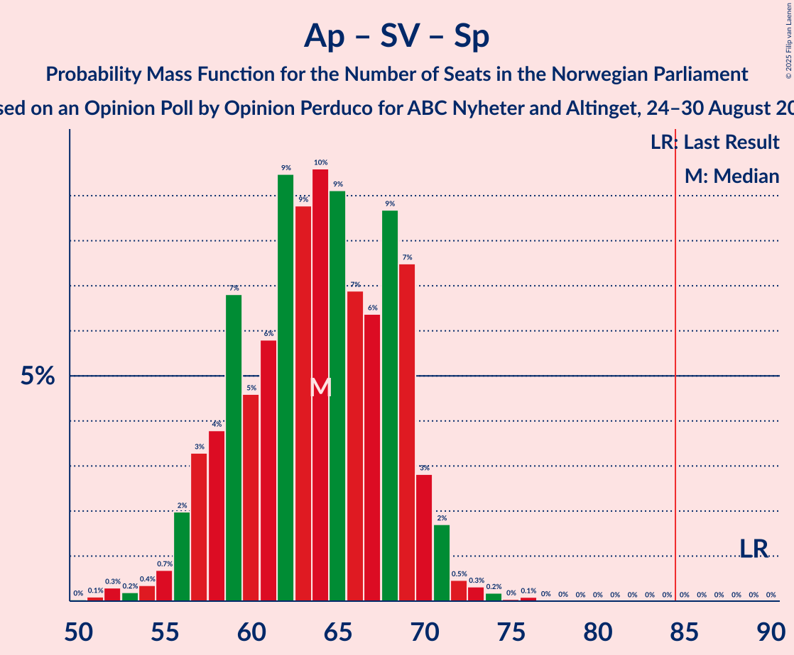

| Number of Seats | Probability | Accumulated | Special Marks |
|:---------------:|:-----------:|:-----------:|:-------------:|
| 51 | 0.1% | 100% |  |
| 52 | 0.3% | 99.9% |  |
| 53 | 0.2% | 99.6% |  |
| 54 | 0.4% | 99.4% |  |
| 55 | 0.7% | 99.0% |  |
| 56 | 2% | 98% |  |
| 57 | 3% | 96% |  |
| 58 | 4% | 93% |  |
| 59 | 7% | 89% |  |
| 60 | 5% | 82% |  |
| 61 | 6% | 78% |  |
| 62 | 9% | 72% |  |
| 63 | 9% | 63% |  |
| 64 | 10% | 54% |  |
| 65 | 9% | 44% | Median |
| 66 | 7% | 35% |  |
| 67 | 6% | 28% |  |
| 68 | 9% | 22% |  |
| 69 | 7% | 13% |  |
| 70 | 3% | 6% |  |
| 71 | 2% | 3% |  |
| 72 | 0.5% | 1.1% |  |
| 73 | 0.3% | 0.7% |  |
| 74 | 0.2% | 0.3% |  |
| 75 | 0% | 0.2% |  |
| 76 | 0.1% | 0.1% |  |
| 77 | 0% | 0% |  |
| 78 | 0% | 0% |  |
| 79 | 0% | 0% |  |
| 80 | 0% | 0% |  |
| 81 | 0% | 0% |  |
| 82 | 0% | 0% |  |
| 83 | 0% | 0% |  |
| 84 | 0% | 0% |  |
| 85 | 0% | 0% | Majority |
| 86 | 0% | 0% |  |
| 87 | 0% | 0% |  |
| 88 | 0% | 0% |  |
| 89 | 0% | 0% | Last Result |

### Arbeiderpartiet – Sosialistisk Venstreparti

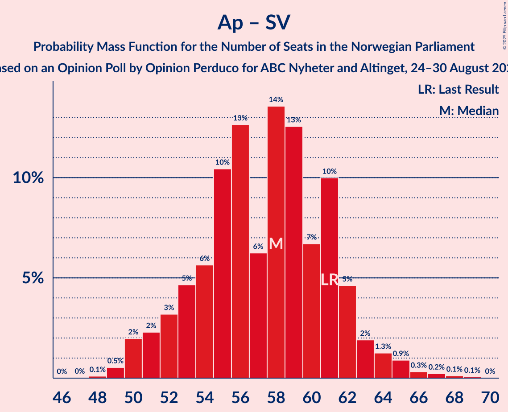

| Number of Seats | Probability | Accumulated | Special Marks |
|:---------------:|:-----------:|:-----------:|:-------------:|
| 48 | 0.1% | 100% |  |
| 49 | 0.5% | 99.9% |  |
| 50 | 2% | 99.3% |  |
| 51 | 2% | 97% |  |
| 52 | 3% | 95% |  |
| 53 | 5% | 92% |  |
| 54 | 6% | 87% |  |
| 55 | 10% | 82% |  |
| 56 | 13% | 71% |  |
| 57 | 6% | 58% |  |
| 58 | 14% | 52% | Median |
| 59 | 13% | 39% |  |
| 60 | 7% | 26% |  |
| 61 | 10% | 19% | Last Result |
| 62 | 5% | 9% |  |
| 63 | 2% | 5% |  |
| 64 | 1.3% | 3% |  |
| 65 | 0.9% | 2% |  |
| 66 | 0.3% | 0.7% |  |
| 67 | 0.2% | 0.4% |  |
| 68 | 0.1% | 0.2% |  |
| 69 | 0.1% | 0.1% |  |
| 70 | 0% | 0% |  |

### Arbeiderpartiet – Senterpartiet – Kristelig Folkeparti – Miljøpartiet De Grønne

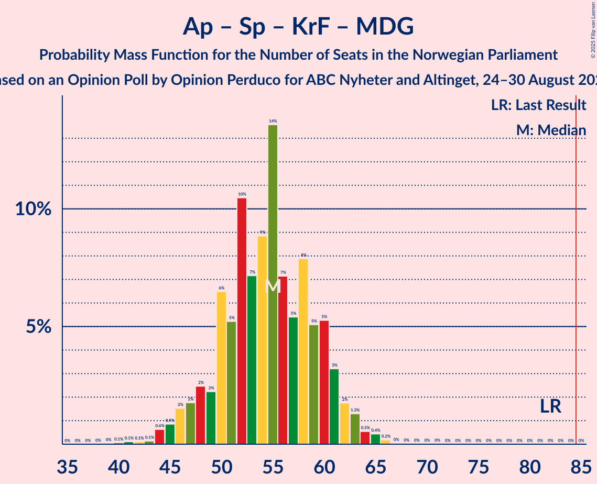

| Number of Seats | Probability | Accumulated | Special Marks |
|:---------------:|:-----------:|:-----------:|:-------------:|
| 40 | 0.1% | 100% |  |
| 41 | 0.1% | 99.9% |  |
| 42 | 0.1% | 99.8% |  |
| 43 | 0.1% | 99.7% |  |
| 44 | 0.6% | 99.5% |  |
| 45 | 0.9% | 98.9% |  |
| 46 | 2% | 98% |  |
| 47 | 2% | 97% |  |
| 48 | 2% | 95% |  |
| 49 | 2% | 92% |  |
| 50 | 6% | 90% |  |
| 51 | 5% | 84% |  |
| 52 | 10% | 78% |  |
| 53 | 7% | 68% |  |
| 54 | 9% | 61% | Median |
| 55 | 14% | 52% |  |
| 56 | 7% | 38% |  |
| 57 | 5% | 31% |  |
| 58 | 8% | 26% |  |
| 59 | 5% | 18% |  |
| 60 | 5% | 13% |  |
| 61 | 3% | 8% |  |
| 62 | 2% | 4% |  |
| 63 | 1.3% | 3% |  |
| 64 | 0.5% | 1.3% |  |
| 65 | 0.4% | 0.7% |  |
| 66 | 0.2% | 0.3% |  |
| 67 | 0% | 0.1% |  |
| 68 | 0% | 0.1% |  |
| 69 | 0% | 0% |  |
| 70 | 0% | 0% |  |
| 71 | 0% | 0% |  |
| 72 | 0% | 0% |  |
| 73 | 0% | 0% |  |
| 74 | 0% | 0% |  |
| 75 | 0% | 0% |  |
| 76 | 0% | 0% |  |
| 77 | 0% | 0% |  |
| 78 | 0% | 0% |  |
| 79 | 0% | 0% |  |
| 80 | 0% | 0% |  |
| 81 | 0% | 0% |  |
| 82 | 0% | 0% | Last Result |

### Arbeiderpartiet – Senterpartiet – Kristelig Folkeparti

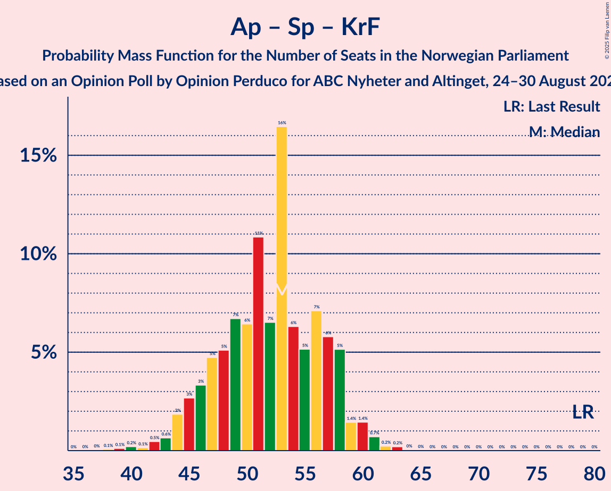

| Number of Seats | Probability | Accumulated | Special Marks |
|:---------------:|:-----------:|:-----------:|:-------------:|
| 37 | 0% | 100% |  |
| 38 | 0.1% | 99.9% |  |
| 39 | 0.1% | 99.9% |  |
| 40 | 0.2% | 99.8% |  |
| 41 | 0.1% | 99.6% |  |
| 42 | 0.5% | 99.4% |  |
| 43 | 0.6% | 98.9% |  |
| 44 | 2% | 98% |  |
| 45 | 3% | 96% |  |
| 46 | 3% | 94% |  |
| 47 | 5% | 90% |  |
| 48 | 5% | 86% |  |
| 49 | 7% | 81% |  |
| 50 | 6% | 74% |  |
| 51 | 11% | 67% |  |
| 52 | 7% | 57% | Median |
| 53 | 16% | 50% |  |
| 54 | 6% | 34% |  |
| 55 | 5% | 27% |  |
| 56 | 7% | 22% |  |
| 57 | 6% | 15% |  |
| 58 | 5% | 9% |  |
| 59 | 1.4% | 4% |  |
| 60 | 1.4% | 3% |  |
| 61 | 0.7% | 1.2% |  |
| 62 | 0.2% | 0.5% |  |
| 63 | 0.2% | 0.3% |  |
| 64 | 0% | 0.1% |  |
| 65 | 0% | 0% |  |
| 66 | 0% | 0% |  |
| 67 | 0% | 0% |  |
| 68 | 0% | 0% |  |
| 69 | 0% | 0% |  |
| 70 | 0% | 0% |  |
| 71 | 0% | 0% |  |
| 72 | 0% | 0% |  |
| 73 | 0% | 0% |  |
| 74 | 0% | 0% |  |
| 75 | 0% | 0% |  |
| 76 | 0% | 0% |  |
| 77 | 0% | 0% |  |
| 78 | 0% | 0% |  |
| 79 | 0% | 0% | Last Result |

### Arbeiderpartiet – Senterpartiet

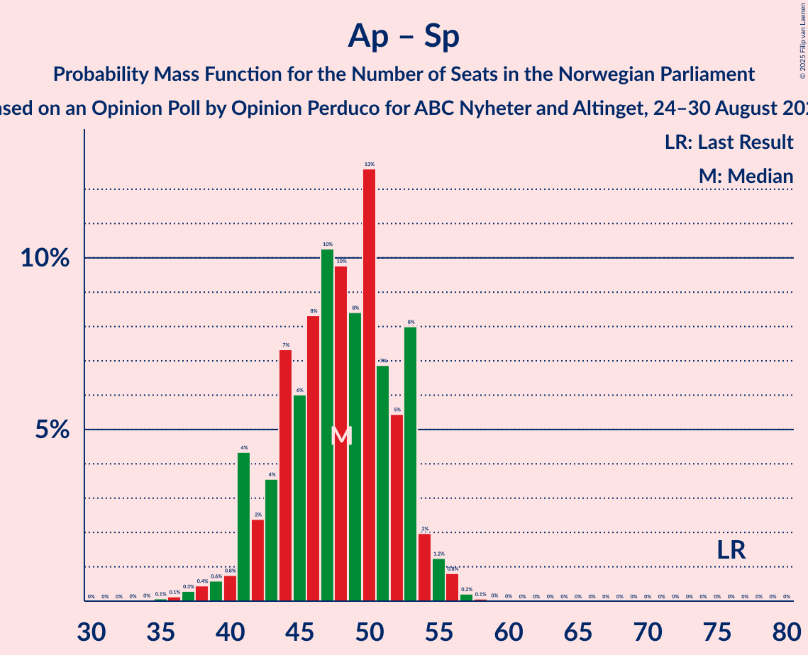

| Number of Seats | Probability | Accumulated | Special Marks |
|:---------------:|:-----------:|:-----------:|:-------------:|
| 35 | 0.1% | 100% |  |
| 36 | 0.1% | 99.9% |  |
| 37 | 0.3% | 99.8% |  |
| 38 | 0.4% | 99.5% |  |
| 39 | 0.6% | 99.0% |  |
| 40 | 0.8% | 98% |  |
| 41 | 4% | 98% |  |
| 42 | 2% | 93% |  |
| 43 | 4% | 91% |  |
| 44 | 7% | 87% |  |
| 45 | 6% | 80% |  |
| 46 | 8% | 74% |  |
| 47 | 10% | 66% |  |
| 48 | 10% | 55% |  |
| 49 | 8% | 46% | Median |
| 50 | 13% | 37% |  |
| 51 | 7% | 25% |  |
| 52 | 5% | 18% |  |
| 53 | 8% | 12% |  |
| 54 | 2% | 4% |  |
| 55 | 1.2% | 2% |  |
| 56 | 0.8% | 1.1% |  |
| 57 | 0.2% | 0.3% |  |
| 58 | 0.1% | 0.1% |  |
| 59 | 0% | 0% |  |
| 60 | 0% | 0% |  |
| 61 | 0% | 0% |  |
| 62 | 0% | 0% |  |
| 63 | 0% | 0% |  |
| 64 | 0% | 0% |  |
| 65 | 0% | 0% |  |
| 66 | 0% | 0% |  |
| 67 | 0% | 0% |  |
| 68 | 0% | 0% |  |
| 69 | 0% | 0% |  |
| 70 | 0% | 0% |  |
| 71 | 0% | 0% |  |
| 72 | 0% | 0% |  |
| 73 | 0% | 0% |  |
| 74 | 0% | 0% |  |
| 75 | 0% | 0% |  |
| 76 | 0% | 0% | Last Result |

### Senterpartiet – Venstre – Kristelig Folkeparti

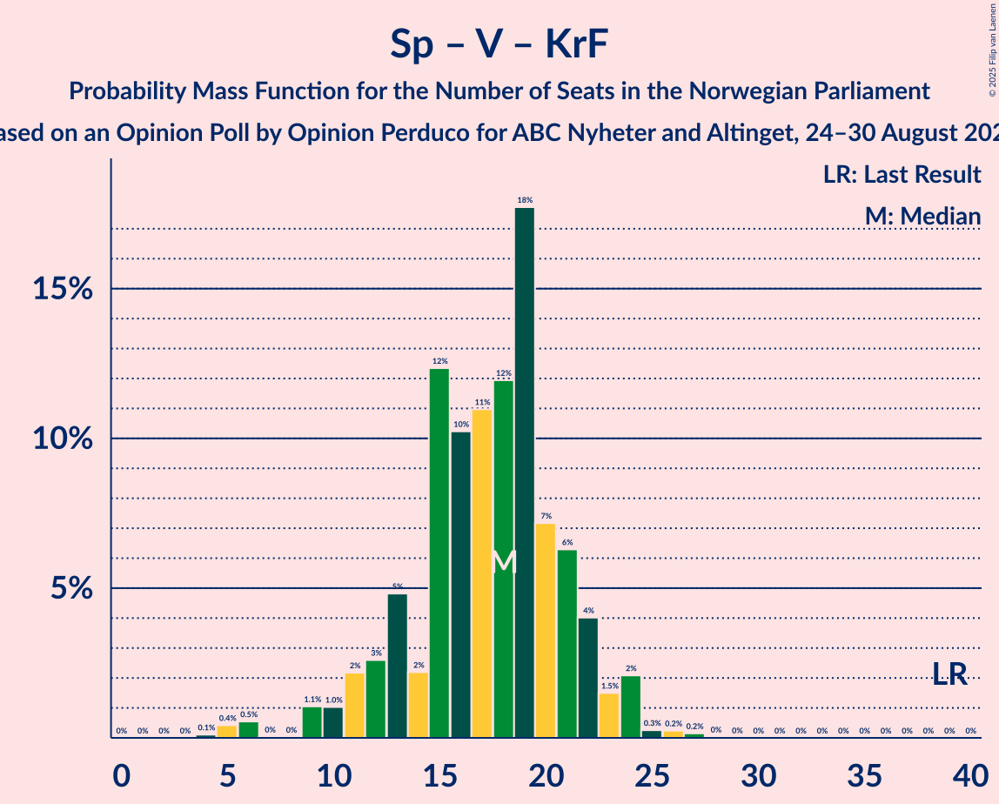

| Number of Seats | Probability | Accumulated | Special Marks |
|:---------------:|:-----------:|:-----------:|:-------------:|
| 4 | 0.1% | 100% |  |
| 5 | 0.4% | 99.9% |  |
| 6 | 0.5% | 99.5% |  |
| 7 | 0% | 98.9% |  |
| 8 | 0% | 98.9% |  |
| 9 | 1.1% | 98.9% |  |
| 10 | 1.0% | 98% |  |
| 11 | 2% | 97% |  |
| 12 | 3% | 95% |  |
| 13 | 5% | 92% |  |
| 14 | 2% | 87% |  |
| 15 | 12% | 85% |  |
| 16 | 10% | 73% |  |
| 17 | 11% | 62% | Median |
| 18 | 12% | 51% |  |
| 19 | 18% | 39% |  |
| 20 | 7% | 22% |  |
| 21 | 6% | 15% |  |
| 22 | 4% | 8% |  |
| 23 | 1.5% | 4% |  |
| 24 | 2% | 3% |  |
| 25 | 0.3% | 0.7% |  |
| 26 | 0.2% | 0.4% |  |
| 27 | 0.2% | 0.2% |  |
| 28 | 0% | 0% |  |
| 29 | 0% | 0% |  |
| 30 | 0% | 0% |  |
| 31 | 0% | 0% |  |
| 32 | 0% | 0% |  |
| 33 | 0% | 0% |  |
| 34 | 0% | 0% |  |
| 35 | 0% | 0% |  |
| 36 | 0% | 0% |  |
| 37 | 0% | 0% |  |
| 38 | 0% | 0% |  |
| 39 | 0% | 0% | Last Result |

## Technical Information

### Opinion Poll

+ **Polling firm:** Opinion Perduco
+ **Commissioner(s):** ABC Nyheter and Altinget
+ **Fieldwork period:** 24–30 August 2023

### Calculations

+ **Sample size:** 1000
+ **Simulations done:** 1,048,576
+ **Error estimate:** 1.75%

