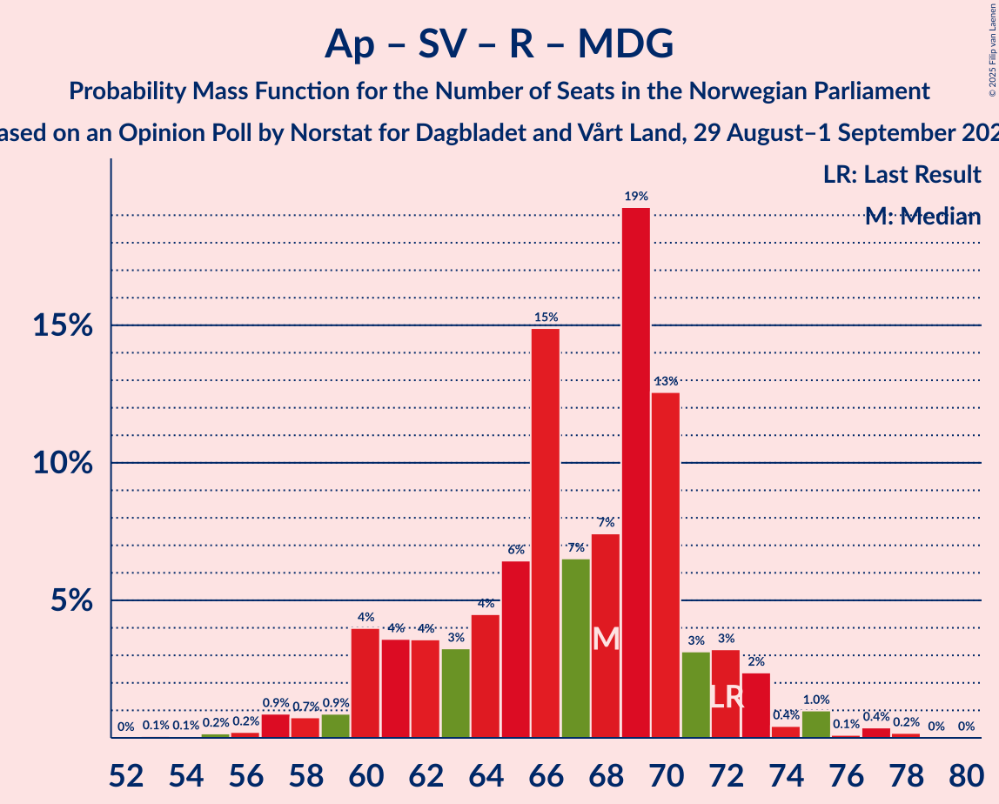

# Opinion Poll by Norstat for Dagbladet and Vårt Land, 29 August–1 September 2023

<a href="#voting-intentions">Voting Intentions</a> | <a href="#seats">Seats</a> | <a href="#coalitions">Coalitions</a> | <a href="#technical-information">Technical Information</a>

## Voting Intentions

### Confidence Intervals

| Party | Last Result | Poll Result | 80% Confidence Interval | 90% Confidence Interval | 95% Confidence Interval | 99% Confidence Interval |
|:-----:|:-----------:|:-----------:|:-----------------------:|:-----------------------:|:-----------------------:|:-----------------------:|
| Høyre | 20.4% | 27.5% | 25.4–29.7% |24.8–30.3% |24.3–30.9% |23.4–31.9% |
| Arbeiderpartiet | 26.2% | 17.4% | 15.7–19.4% |15.2–19.9% |14.8–20.4% |14.0–21.3% |
| Fremskrittspartiet | 11.6% | 13.8% | 12.3–15.6% |11.8–16.1% |11.5–16.5% |10.8–17.4% |
| Sosialistisk Venstreparti | 7.6% | 10.2% | 8.9–11.8% |8.5–12.2% |8.2–12.6% |7.6–13.4% |
| Senterpartiet | 13.5% | 6.8% | 5.8–8.2% |5.5–8.6% |5.2–8.9% |4.7–9.6% |
| Rødt | 4.7% | 6.0% | 5.0–7.3% |4.7–7.7% |4.5–8.0% |4.0–8.7% |
| Venstre | 4.6% | 5.4% | 4.5–6.7% |4.2–7.0% |4.0–7.4% |3.6–8.0% |
| Miljøpartiet De Grønne | 3.9% | 3.8% | 3.0–4.8% |2.8–5.2% |2.6–5.4% |2.3–6.0% |
| Kristelig Folkeparti | 3.8% | 3.5% | 2.7–4.5% |2.5–4.8% |2.4–5.1% |2.1–5.7% |
| Industri- og Næringspartiet | 0.3% | 2.1% | 1.6–3.0% |1.4–3.2% |1.3–3.4% |1.1–3.9% |

*Note:* The poll result column reflects the actual value used in the calculations. Published results may vary slightly, and in addition be rounded to fewer digits.

## Seats

### Confidence Intervals

| Party | Last Result | Median | 80% Confidence Interval | 90% Confidence Interval | 95% Confidence Interval | 99% Confidence Interval |
|:-----:|:-----------:|:------:|:-----------------------:|:-----------------------:|:-----------------------:|:-----------------------:|
| <a href="#høyre">Høyre</a> | 36 | 48 | 45–53 |44–53 |42–54 |41–57 |
| <a href="#arbeiderpartiet">Arbeiderpartiet</a> | 48 | 34 | 31–37 |29–38 |29–39 |28–41 |
| <a href="#fremskrittspartiet">Fremskrittspartiet</a> | 21 | 24 | 22–28 |21–30 |20–31 |18–34 |
| <a href="#sosialistisk-venstreparti">Sosialistisk Venstreparti</a> | 13 | 17 | 15–21 |14–22 |13–24 |12–24 |
| <a href="#senterpartiet">Senterpartiet</a> | 28 | 13 | 9–14 |9–15 |9–16 |8–18 |
| <a href="#rødt">Rødt</a> | 8 | 11 | 8–13 |8–14 |7–14 |6–15 |
| <a href="#venstre">Venstre</a> | 8 | 10 | 8–11 |7–12 |3–13 |2–14 |
| <a href="#miljøpartiet-de-grønne">Miljøpartiet De Grønne</a> | 3 | 3 | 2–9 |1–9 |1–9 |1–10 |
| <a href="#kristelig-folkeparti">Kristelig Folkeparti</a> | 3 | 3 | 2–8 |2–8 |1–9 |0–9 |
| <a href="#industri--og-næringspartiet">Industri- og Næringspartiet</a> | 0 | 0 | 0–2 |0–2 |0–2 |0–3 |

### Høyre

*For a full overview of the results for this party, see the [Høyre](party-høyre.html) page.*

| Number of Seats | Probability | Accumulated | Special Marks |
|:---------------:|:-----------:|:-----------:|:-------------:|
| 36 | 0% | 100% | Last Result |
| 37 | 0% | 100% |  |
| 38 | 0% | 100% |  |
| 39 | 0% | 100% |  |
| 40 | 0.4% | 100% |  |
| 41 | 0.6% | 99.5% |  |
| 42 | 2% | 99.0% |  |
| 43 | 2% | 97% |  |
| 44 | 1.4% | 95% |  |
| 45 | 6% | 94% |  |
| 46 | 12% | 88% |  |
| 47 | 21% | 76% |  |
| 48 | 7% | 56% | Median |
| 49 | 17% | 49% |  |
| 50 | 11% | 32% |  |
| 51 | 5% | 21% |  |
| 52 | 5% | 16% |  |
| 53 | 6% | 10% |  |
| 54 | 2% | 4% |  |
| 55 | 0.6% | 2% |  |
| 56 | 0.3% | 2% |  |
| 57 | 1.1% | 1.5% |  |
| 58 | 0.2% | 0.3% |  |
| 59 | 0% | 0.2% |  |
| 60 | 0.1% | 0.1% |  |
| 61 | 0% | 0% |  |

### Arbeiderpartiet

*For a full overview of the results for this party, see the [Arbeiderpartiet](party-arbeiderpartiet.html) page.*

| Number of Seats | Probability | Accumulated | Special Marks |
|:---------------:|:-----------:|:-----------:|:-------------:|
| 25 | 0% | 100% |  |
| 26 | 0.1% | 99.9% |  |
| 27 | 0.3% | 99.8% |  |
| 28 | 1.0% | 99.5% |  |
| 29 | 5% | 98% |  |
| 30 | 2% | 94% |  |
| 31 | 6% | 92% |  |
| 32 | 15% | 86% |  |
| 33 | 18% | 71% |  |
| 34 | 14% | 53% | Median |
| 35 | 12% | 39% |  |
| 36 | 6% | 27% |  |
| 37 | 13% | 21% |  |
| 38 | 5% | 8% |  |
| 39 | 1.3% | 3% |  |
| 40 | 1.1% | 2% |  |
| 41 | 0.4% | 0.9% |  |
| 42 | 0.3% | 0.5% |  |
| 43 | 0.1% | 0.2% |  |
| 44 | 0% | 0.1% |  |
| 45 | 0% | 0% |  |
| 46 | 0% | 0% |  |
| 47 | 0% | 0% |  |
| 48 | 0% | 0% | Last Result |

### Fremskrittspartiet

*For a full overview of the results for this party, see the [Fremskrittspartiet](party-fremskrittspartiet.html) page.*

| Number of Seats | Probability | Accumulated | Special Marks |
|:---------------:|:-----------:|:-----------:|:-------------:|
| 17 | 0.1% | 100% |  |
| 18 | 0.5% | 99.9% |  |
| 19 | 0.6% | 99.5% |  |
| 20 | 3% | 98.8% |  |
| 21 | 4% | 96% | Last Result |
| 22 | 12% | 91% |  |
| 23 | 11% | 79% |  |
| 24 | 20% | 68% | Median |
| 25 | 14% | 48% |  |
| 26 | 16% | 33% |  |
| 27 | 5% | 17% |  |
| 28 | 5% | 12% |  |
| 29 | 2% | 8% |  |
| 30 | 3% | 6% |  |
| 31 | 1.1% | 3% |  |
| 32 | 1.0% | 2% |  |
| 33 | 0.4% | 1.0% |  |
| 34 | 0.4% | 0.6% |  |
| 35 | 0.1% | 0.2% |  |
| 36 | 0.1% | 0.1% |  |
| 37 | 0% | 0% |  |

### Sosialistisk Venstreparti

*For a full overview of the results for this party, see the [Sosialistisk Venstreparti](party-sosialistiskvenstreparti.html) page.*

| Number of Seats | Probability | Accumulated | Special Marks |
|:---------------:|:-----------:|:-----------:|:-------------:|
| 10 | 0.1% | 100% |  |
| 11 | 0.2% | 99.9% |  |
| 12 | 0.5% | 99.8% |  |
| 13 | 3% | 99.3% | Last Result |
| 14 | 3% | 97% |  |
| 15 | 12% | 94% |  |
| 16 | 14% | 82% |  |
| 17 | 23% | 68% | Median |
| 18 | 11% | 46% |  |
| 19 | 13% | 35% |  |
| 20 | 7% | 22% |  |
| 21 | 8% | 15% |  |
| 22 | 4% | 7% |  |
| 23 | 0.7% | 4% |  |
| 24 | 3% | 3% |  |
| 25 | 0.1% | 0.3% |  |
| 26 | 0.1% | 0.2% |  |
| 27 | 0.2% | 0.2% |  |
| 28 | 0% | 0% |  |

### Senterpartiet

*For a full overview of the results for this party, see the [Senterpartiet](party-senterpartiet.html) page.*

| Number of Seats | Probability | Accumulated | Special Marks |
|:---------------:|:-----------:|:-----------:|:-------------:|
| 6 | 0% | 100% |  |
| 7 | 0.4% | 99.9% |  |
| 8 | 2% | 99.5% |  |
| 9 | 8% | 98% |  |
| 10 | 7% | 90% |  |
| 11 | 16% | 83% |  |
| 12 | 9% | 68% |  |
| 13 | 30% | 58% | Median |
| 14 | 20% | 28% |  |
| 15 | 5% | 9% |  |
| 16 | 2% | 4% |  |
| 17 | 0.7% | 1.3% |  |
| 18 | 0.6% | 0.7% |  |
| 19 | 0% | 0.1% |  |
| 20 | 0% | 0% |  |
| 21 | 0% | 0% |  |
| 22 | 0% | 0% |  |
| 23 | 0% | 0% |  |
| 24 | 0% | 0% |  |
| 25 | 0% | 0% |  |
| 26 | 0% | 0% |  |
| 27 | 0% | 0% |  |
| 28 | 0% | 0% | Last Result |

### Rødt

*For a full overview of the results for this party, see the [Rødt](party-rødt.html) page.*

| Number of Seats | Probability | Accumulated | Special Marks |
|:---------------:|:-----------:|:-----------:|:-------------:|
| 1 | 0.5% | 100% |  |
| 2 | 0% | 99.5% |  |
| 3 | 0% | 99.5% |  |
| 4 | 0% | 99.5% |  |
| 5 | 0% | 99.5% |  |
| 6 | 0.1% | 99.5% |  |
| 7 | 2% | 99.4% |  |
| 8 | 11% | 97% | Last Result |
| 9 | 12% | 86% |  |
| 10 | 20% | 74% |  |
| 11 | 13% | 54% | Median |
| 12 | 17% | 41% |  |
| 13 | 19% | 24% |  |
| 14 | 4% | 5% |  |
| 15 | 0.7% | 0.9% |  |
| 16 | 0.2% | 0.2% |  |
| 17 | 0% | 0.1% |  |
| 18 | 0% | 0% |  |

### Venstre

*For a full overview of the results for this party, see the [Venstre](party-venstre.html) page.*

| Number of Seats | Probability | Accumulated | Special Marks |
|:---------------:|:-----------:|:-----------:|:-------------:|
| 2 | 0.6% | 100% |  |
| 3 | 3% | 99.4% |  |
| 4 | 0% | 96% |  |
| 5 | 0% | 96% |  |
| 6 | 0.8% | 96% |  |
| 7 | 5% | 95% |  |
| 8 | 17% | 91% | Last Result |
| 9 | 22% | 74% |  |
| 10 | 17% | 51% | Median |
| 11 | 24% | 34% |  |
| 12 | 6% | 10% |  |
| 13 | 2% | 4% |  |
| 14 | 1.3% | 2% |  |
| 15 | 0.2% | 0.2% |  |
| 16 | 0.1% | 0.1% |  |
| 17 | 0% | 0% |  |

### Miljøpartiet De Grønne

*For a full overview of the results for this party, see the [Miljøpartiet De Grønne](party-miljøpartietdegrønne.html) page.*

| Number of Seats | Probability | Accumulated | Special Marks |
|:---------------:|:-----------:|:-----------:|:-------------:|
| 1 | 8% | 100% |  |
| 2 | 41% | 92% |  |
| 3 | 8% | 51% | Last Result, Median |
| 4 | 0% | 44% |  |
| 5 | 0% | 44% |  |
| 6 | 4% | 44% |  |
| 7 | 19% | 40% |  |
| 8 | 11% | 22% |  |
| 9 | 9% | 10% |  |
| 10 | 0.6% | 0.8% |  |
| 11 | 0.2% | 0.2% |  |
| 12 | 0% | 0% |  |

### Kristelig Folkeparti

*For a full overview of the results for this party, see the [Kristelig Folkeparti](party-kristeligfolkeparti.html) page.*

| Number of Seats | Probability | Accumulated | Special Marks |
|:---------------:|:-----------:|:-----------:|:-------------:|
| 0 | 1.4% | 100% |  |
| 1 | 1.3% | 98.6% |  |
| 2 | 46% | 97% |  |
| 3 | 21% | 51% | Last Result, Median |
| 4 | 0% | 30% |  |
| 5 | 0% | 30% |  |
| 6 | 1.2% | 30% |  |
| 7 | 14% | 29% |  |
| 8 | 12% | 15% |  |
| 9 | 3% | 3% |  |
| 10 | 0.3% | 0.4% |  |
| 11 | 0.1% | 0.1% |  |
| 12 | 0% | 0% |  |

### Industri- og Næringspartiet

*For a full overview of the results for this party, see the [Industri- og Næringspartiet](party-industri-ognæringspartiet.html) page.*

| Number of Seats | Probability | Accumulated | Special Marks |
|:---------------:|:-----------:|:-----------:|:-------------:|
| 0 | 81% | 100% | Last Result, Median |
| 1 | 4% | 19% |  |
| 2 | 13% | 15% |  |
| 3 | 1.1% | 1.3% |  |
| 4 | 0% | 0.2% |  |
| 5 | 0% | 0.2% |  |
| 6 | 0% | 0.2% |  |
| 7 | 0.1% | 0.2% |  |
| 8 | 0% | 0.1% |  |
| 9 | 0% | 0% |  |

## Coalitions

### Confidence Intervals

| Coalition | Last Result | Median | Majority? | 80% Confidence Interval | 90% Confidence Interval | 95% Confidence Interval | 99% Confidence Interval |
|:---------:|:-----------:|:------:|:---------:|:-----------------------:|:-----------------------:|:-----------------------:|:-----------------------:|
| Høyre – Fremskrittspartiet – Senterpartiet – Venstre – Kristelig Folkeparti | 96 | 99 | 100% | 93–103 | 92–105 | 91–107 | 89–109 |
| Høyre – Fremskrittspartiet – Venstre – Miljøpartiet De Grønne – Kristelig Folkeparti | 71 | 90 | 96% | 86–97 | 85–98 | 84–100 | 81–103 |
| Høyre – Fremskrittspartiet – Venstre – Kristelig Folkeparti | 68 | 86 | 76% | 81–92 | 79–93 | 78–94 | 76–98 |
| Høyre – Fremskrittspartiet – Venstre | 65 | 83 | 23% | 77–88 | 75–90 | 75–90 | 72–93 |
| Arbeiderpartiet – Sosialistisk Venstreparti – Senterpartiet – Rødt – Miljøpartiet De Grønne | 100 | 81 | 5% | 74–83 | 71–85 | 69–86 | 68–89 |
| Arbeiderpartiet – Sosialistisk Venstreparti – Senterpartiet – Rødt | 97 | 75 | 0.3% | 69–80 | 67–80 | 66–82 | 62–84 |
| Høyre – Fremskrittspartiet | 57 | 73 | 0.4% | 69–78 | 67–80 | 66–81 | 64–84 |
| Arbeiderpartiet – Sosialistisk Venstreparti – Senterpartiet – Miljøpartiet De Grønne – Kristelig Folkeparti | 95 | 72 | 0.1% | 67–78 | 65–78 | 64–80 | 61–82 |
| Arbeiderpartiet – Sosialistisk Venstreparti – Senterpartiet – Miljøpartiet De Grønne | 92 | 69 | 0% | 63–73 | 61–74 | 60–76 | 58–79 |
| Arbeiderpartiet – Sosialistisk Venstreparti – Rødt – Miljøpartiet De Grønne | 72 | 68 | 0% | 61–71 | 60–72 | 59–73 | 56–77 |
| Arbeiderpartiet – Sosialistisk Venstreparti – Senterpartiet | 89 | 64 | 0% | 59–68 | 58–69 | 57–71 | 54–74 |
| Høyre – Venstre – Kristelig Folkeparti | 47 | 62 | 0% | 56–67 | 56–68 | 55–69 | 52–71 |
| Arbeiderpartiet – Senterpartiet – Miljøpartiet De Grønne – Kristelig Folkeparti | 82 | 54 | 0% | 48–59 | 48–62 | 47–63 | 44–65 |
| Arbeiderpartiet – Sosialistisk Venstreparti | 61 | 51 | 0% | 48–55 | 47–57 | 46–58 | 44–61 |
| Arbeiderpartiet – Senterpartiet – Kristelig Folkeparti | 79 | 50 | 0% | 45–55 | 43–56 | 43–57 | 41–59 |
| Arbeiderpartiet – Senterpartiet | 76 | 46 | 0% | 42–50 | 41–51 | 40–52 | 39–55 |
| Senterpartiet – Venstre – Kristelig Folkeparti | 39 | 26 | 0% | 21–31 | 20–31 | 19–32 | 17–34 |

### Høyre – Fremskrittspartiet – Senterpartiet – Venstre – Kristelig Folkeparti

| Number of Seats | Probability | Accumulated | Special Marks |
|:---------------:|:-----------:|:-----------:|:-------------:|
| 86 | 0.1% | 100% |  |
| 87 | 0.1% | 99.9% |  |
| 88 | 0.2% | 99.8% |  |
| 89 | 0.1% | 99.5% |  |
| 90 | 1.2% | 99.4% |  |
| 91 | 1.4% | 98% |  |
| 92 | 4% | 97% |  |
| 93 | 5% | 93% |  |
| 94 | 4% | 88% |  |
| 95 | 3% | 85% |  |
| 96 | 5% | 81% | Last Result |
| 97 | 7% | 76% |  |
| 98 | 12% | 69% | Median |
| 99 | 18% | 57% |  |
| 100 | 6% | 39% |  |
| 101 | 6% | 32% |  |
| 102 | 12% | 26% |  |
| 103 | 5% | 14% |  |
| 104 | 2% | 8% |  |
| 105 | 2% | 6% |  |
| 106 | 0.8% | 4% |  |
| 107 | 2% | 3% |  |
| 108 | 0.9% | 2% |  |
| 109 | 0.2% | 0.6% |  |
| 110 | 0.3% | 0.5% |  |
| 111 | 0.1% | 0.2% |  |
| 112 | 0% | 0.1% |  |
| 113 | 0% | 0% |  |

### Høyre – Fremskrittspartiet – Venstre – Miljøpartiet De Grønne – Kristelig Folkeparti

| Number of Seats | Probability | Accumulated | Special Marks |
|:---------------:|:-----------:|:-----------:|:-------------:|
| 71 | 0% | 100% | Last Result |
| 72 | 0% | 100% |  |
| 73 | 0% | 100% |  |
| 74 | 0% | 100% |  |
| 75 | 0% | 100% |  |
| 76 | 0% | 100% |  |
| 77 | 0.1% | 100% |  |
| 78 | 0% | 99.9% |  |
| 79 | 0.1% | 99.9% |  |
| 80 | 0.2% | 99.8% |  |
| 81 | 0.3% | 99.6% |  |
| 82 | 0.8% | 99.3% |  |
| 83 | 0.7% | 98% |  |
| 84 | 2% | 98% |  |
| 85 | 1.2% | 96% | Majority |
| 86 | 7% | 95% |  |
| 87 | 7% | 88% |  |
| 88 | 18% | 80% | Median |
| 89 | 8% | 63% |  |
| 90 | 8% | 54% |  |
| 91 | 6% | 46% |  |
| 92 | 7% | 40% |  |
| 93 | 4% | 34% |  |
| 94 | 9% | 29% |  |
| 95 | 4% | 20% |  |
| 96 | 4% | 16% |  |
| 97 | 3% | 12% |  |
| 98 | 6% | 10% |  |
| 99 | 1.4% | 4% |  |
| 100 | 0.6% | 3% |  |
| 101 | 1.0% | 2% |  |
| 102 | 0.2% | 1.0% |  |
| 103 | 0.5% | 0.8% |  |
| 104 | 0% | 0.3% |  |
| 105 | 0.2% | 0.2% |  |
| 106 | 0.1% | 0.1% |  |
| 107 | 0% | 0% |  |

### Høyre – Fremskrittspartiet – Venstre – Kristelig Folkeparti

| Number of Seats | Probability | Accumulated | Special Marks |
|:---------------:|:-----------:|:-----------:|:-------------:|
| 68 | 0% | 100% | Last Result |
| 69 | 0% | 100% |  |
| 70 | 0% | 100% |  |
| 71 | 0% | 100% |  |
| 72 | 0% | 100% |  |
| 73 | 0% | 100% |  |
| 74 | 0.1% | 100% |  |
| 75 | 0.1% | 99.8% |  |
| 76 | 0.2% | 99.7% |  |
| 77 | 0.4% | 99.4% |  |
| 78 | 4% | 99.1% |  |
| 79 | 0.9% | 95% |  |
| 80 | 3% | 94% |  |
| 81 | 3% | 91% |  |
| 82 | 5% | 87% |  |
| 83 | 2% | 82% |  |
| 84 | 4% | 80% |  |
| 85 | 14% | 76% | Median, Majority |
| 86 | 19% | 63% |  |
| 87 | 10% | 44% |  |
| 88 | 7% | 33% |  |
| 89 | 5% | 27% |  |
| 90 | 5% | 22% |  |
| 91 | 6% | 18% |  |
| 92 | 4% | 11% |  |
| 93 | 3% | 7% |  |
| 94 | 1.4% | 4% |  |
| 95 | 0.5% | 2% |  |
| 96 | 0.7% | 2% |  |
| 97 | 0.3% | 1.1% |  |
| 98 | 0.5% | 0.8% |  |
| 99 | 0.2% | 0.3% |  |
| 100 | 0% | 0.1% |  |
| 101 | 0% | 0.1% |  |
| 102 | 0% | 0% |  |

### Høyre – Fremskrittspartiet – Venstre

| Number of Seats | Probability | Accumulated | Special Marks |
|:---------------:|:-----------:|:-----------:|:-------------:|
| 65 | 0% | 100% | Last Result |
| 66 | 0% | 100% |  |
| 67 | 0% | 100% |  |
| 68 | 0% | 100% |  |
| 69 | 0% | 100% |  |
| 70 | 0% | 99.9% |  |
| 71 | 0.1% | 99.9% |  |
| 72 | 0.3% | 99.8% |  |
| 73 | 1.0% | 99.5% |  |
| 74 | 0.3% | 98% |  |
| 75 | 4% | 98% |  |
| 76 | 2% | 94% |  |
| 77 | 4% | 92% |  |
| 78 | 5% | 88% |  |
| 79 | 3% | 83% |  |
| 80 | 11% | 79% |  |
| 81 | 4% | 69% |  |
| 82 | 4% | 64% | Median |
| 83 | 11% | 60% |  |
| 84 | 26% | 49% |  |
| 85 | 8% | 23% | Majority |
| 86 | 2% | 15% |  |
| 87 | 3% | 13% |  |
| 88 | 3% | 10% |  |
| 89 | 2% | 8% |  |
| 90 | 3% | 6% |  |
| 91 | 1.0% | 2% |  |
| 92 | 0.4% | 1.2% |  |
| 93 | 0.5% | 0.9% |  |
| 94 | 0.1% | 0.4% |  |
| 95 | 0.2% | 0.3% |  |
| 96 | 0% | 0.1% |  |
| 97 | 0% | 0% |  |

### Arbeiderpartiet – Sosialistisk Venstreparti – Senterpartiet – Rødt – Miljøpartiet De Grønne

| Number of Seats | Probability | Accumulated | Special Marks |
|:---------------:|:-----------:|:-----------:|:-------------:|
| 64 | 0% | 100% |  |
| 65 | 0% | 99.9% |  |
| 66 | 0.2% | 99.9% |  |
| 67 | 0.1% | 99.7% |  |
| 68 | 0.4% | 99.6% |  |
| 69 | 3% | 99.2% |  |
| 70 | 1.1% | 96% |  |
| 71 | 1.2% | 95% |  |
| 72 | 2% | 94% |  |
| 73 | 2% | 92% |  |
| 74 | 4% | 90% |  |
| 75 | 6% | 86% |  |
| 76 | 2% | 81% |  |
| 77 | 8% | 79% |  |
| 78 | 6% | 71% | Median |
| 79 | 6% | 65% |  |
| 80 | 8% | 59% |  |
| 81 | 14% | 51% |  |
| 82 | 18% | 37% |  |
| 83 | 11% | 19% |  |
| 84 | 2% | 8% |  |
| 85 | 3% | 5% | Majority |
| 86 | 1.5% | 3% |  |
| 87 | 0.4% | 1.4% |  |
| 88 | 0.5% | 1.0% |  |
| 89 | 0.1% | 0.5% |  |
| 90 | 0.2% | 0.4% |  |
| 91 | 0.2% | 0.2% |  |
| 92 | 0% | 0.1% |  |
| 93 | 0% | 0% |  |
| 94 | 0% | 0% |  |
| 95 | 0% | 0% |  |
| 96 | 0% | 0% |  |
| 97 | 0% | 0% |  |
| 98 | 0% | 0% |  |
| 99 | 0% | 0% |  |
| 100 | 0% | 0% | Last Result |

### Arbeiderpartiet – Sosialistisk Venstreparti – Senterpartiet – Rødt

| Number of Seats | Probability | Accumulated | Special Marks |
|:---------------:|:-----------:|:-----------:|:-------------:|
| 61 | 0.2% | 100% |  |
| 62 | 0.5% | 99.8% |  |
| 63 | 0.2% | 99.3% |  |
| 64 | 0.4% | 99.0% |  |
| 65 | 0.9% | 98.6% |  |
| 66 | 0.6% | 98% |  |
| 67 | 5% | 97% |  |
| 68 | 2% | 92% |  |
| 69 | 2% | 90% |  |
| 70 | 6% | 88% |  |
| 71 | 6% | 82% |  |
| 72 | 7% | 76% |  |
| 73 | 6% | 69% |  |
| 74 | 7% | 63% |  |
| 75 | 10% | 56% | Median |
| 76 | 6% | 46% |  |
| 77 | 5% | 40% |  |
| 78 | 8% | 35% |  |
| 79 | 10% | 27% |  |
| 80 | 13% | 18% |  |
| 81 | 1.3% | 4% |  |
| 82 | 1.2% | 3% |  |
| 83 | 0.3% | 2% |  |
| 84 | 1.0% | 1.4% |  |
| 85 | 0.2% | 0.3% | Majority |
| 86 | 0.1% | 0.1% |  |
| 87 | 0% | 0% |  |
| 88 | 0% | 0% |  |
| 89 | 0% | 0% |  |
| 90 | 0% | 0% |  |
| 91 | 0% | 0% |  |
| 92 | 0% | 0% |  |
| 93 | 0% | 0% |  |
| 94 | 0% | 0% |  |
| 95 | 0% | 0% |  |
| 96 | 0% | 0% |  |
| 97 | 0% | 0% | Last Result |

### Høyre – Fremskrittspartiet

| Number of Seats | Probability | Accumulated | Special Marks |
|:---------------:|:-----------:|:-----------:|:-------------:|
| 57 | 0% | 100% | Last Result |
| 58 | 0% | 100% |  |
| 59 | 0% | 100% |  |
| 60 | 0% | 100% |  |
| 61 | 0% | 100% |  |
| 62 | 0.1% | 100% |  |
| 63 | 0.3% | 99.9% |  |
| 64 | 0.6% | 99.6% |  |
| 65 | 0.4% | 99.1% |  |
| 66 | 2% | 98.6% |  |
| 67 | 4% | 97% |  |
| 68 | 1.4% | 92% |  |
| 69 | 6% | 91% |  |
| 70 | 7% | 85% |  |
| 71 | 11% | 78% |  |
| 72 | 10% | 67% | Median |
| 73 | 20% | 57% |  |
| 74 | 11% | 37% |  |
| 75 | 5% | 27% |  |
| 76 | 6% | 22% |  |
| 77 | 4% | 16% |  |
| 78 | 2% | 12% |  |
| 79 | 1.1% | 10% |  |
| 80 | 4% | 9% |  |
| 81 | 2% | 5% |  |
| 82 | 1.3% | 2% |  |
| 83 | 0.3% | 0.9% |  |
| 84 | 0.2% | 0.6% |  |
| 85 | 0.2% | 0.4% | Majority |
| 86 | 0.2% | 0.2% |  |
| 87 | 0% | 0.1% |  |
| 88 | 0% | 0% |  |

### Arbeiderpartiet – Sosialistisk Venstreparti – Senterpartiet – Miljøpartiet De Grønne – Kristelig Folkeparti

| Number of Seats | Probability | Accumulated | Special Marks |
|:---------------:|:-----------:|:-----------:|:-------------:|
| 58 | 0.1% | 100% |  |
| 59 | 0% | 99.9% |  |
| 60 | 0% | 99.9% |  |
| 61 | 0.4% | 99.8% |  |
| 62 | 0.5% | 99.4% |  |
| 63 | 0.8% | 98.9% |  |
| 64 | 2% | 98% |  |
| 65 | 2% | 96% |  |
| 66 | 1.3% | 94% |  |
| 67 | 6% | 93% |  |
| 68 | 4% | 87% |  |
| 69 | 5% | 83% |  |
| 70 | 7% | 79% | Median |
| 71 | 18% | 71% |  |
| 72 | 9% | 53% |  |
| 73 | 4% | 45% |  |
| 74 | 6% | 41% |  |
| 75 | 8% | 35% |  |
| 76 | 12% | 28% |  |
| 77 | 6% | 16% |  |
| 78 | 6% | 10% |  |
| 79 | 2% | 4% |  |
| 80 | 0.7% | 3% |  |
| 81 | 0.5% | 2% |  |
| 82 | 0.8% | 1.3% |  |
| 83 | 0.3% | 0.5% |  |
| 84 | 0.1% | 0.2% |  |
| 85 | 0.1% | 0.1% | Majority |
| 86 | 0% | 0% |  |
| 87 | 0% | 0% |  |
| 88 | 0% | 0% |  |
| 89 | 0% | 0% |  |
| 90 | 0% | 0% |  |
| 91 | 0% | 0% |  |
| 92 | 0% | 0% |  |
| 93 | 0% | 0% |  |
| 94 | 0% | 0% |  |
| 95 | 0% | 0% | Last Result |

### Arbeiderpartiet – Sosialistisk Venstreparti – Senterpartiet – Miljøpartiet De Grønne

| Number of Seats | Probability | Accumulated | Special Marks |
|:---------------:|:-----------:|:-----------:|:-------------:|
| 55 | 0% | 100% |  |
| 56 | 0.1% | 99.9% |  |
| 57 | 0.2% | 99.9% |  |
| 58 | 0.2% | 99.7% |  |
| 59 | 0.7% | 99.5% |  |
| 60 | 3% | 98.7% |  |
| 61 | 1.2% | 96% |  |
| 62 | 3% | 95% |  |
| 63 | 2% | 92% |  |
| 64 | 4% | 90% |  |
| 65 | 3% | 85% |  |
| 66 | 6% | 82% |  |
| 67 | 7% | 76% | Median |
| 68 | 8% | 69% |  |
| 69 | 27% | 61% |  |
| 70 | 9% | 34% |  |
| 71 | 4% | 24% |  |
| 72 | 5% | 20% |  |
| 73 | 8% | 16% |  |
| 74 | 4% | 7% |  |
| 75 | 0.9% | 4% |  |
| 76 | 2% | 3% |  |
| 77 | 0.3% | 1.1% |  |
| 78 | 0.2% | 0.8% |  |
| 79 | 0.3% | 0.6% |  |
| 80 | 0.2% | 0.3% |  |
| 81 | 0.1% | 0.1% |  |
| 82 | 0% | 0% |  |
| 83 | 0% | 0% |  |
| 84 | 0% | 0% |  |
| 85 | 0% | 0% | Majority |
| 86 | 0% | 0% |  |
| 87 | 0% | 0% |  |
| 88 | 0% | 0% |  |
| 89 | 0% | 0% |  |
| 90 | 0% | 0% |  |
| 91 | 0% | 0% |  |
| 92 | 0% | 0% | Last Result |

### Arbeiderpartiet – Sosialistisk Venstreparti – Rødt – Miljøpartiet De Grønne

| Number of Seats | Probability | Accumulated | Special Marks |
|:---------------:|:-----------:|:-----------:|:-------------:|
| 53 | 0.1% | 100% |  |
| 54 | 0.1% | 99.9% |  |
| 55 | 0.2% | 99.8% |  |
| 56 | 0.2% | 99.7% |  |
| 57 | 0.9% | 99.5% |  |
| 58 | 0.7% | 98.6% |  |
| 59 | 0.9% | 98% |  |
| 60 | 4% | 97% |  |
| 61 | 4% | 93% |  |
| 62 | 4% | 89% |  |
| 63 | 3% | 86% |  |
| 64 | 4% | 83% |  |
| 65 | 6% | 78% | Median |
| 66 | 15% | 72% |  |
| 67 | 7% | 57% |  |
| 68 | 7% | 50% |  |
| 69 | 19% | 43% |  |
| 70 | 13% | 23% |  |
| 71 | 3% | 11% |  |
| 72 | 3% | 8% | Last Result |
| 73 | 2% | 5% |  |
| 74 | 0.4% | 2% |  |
| 75 | 1.0% | 2% |  |
| 76 | 0.1% | 0.7% |  |
| 77 | 0.4% | 0.6% |  |
| 78 | 0.2% | 0.2% |  |
| 79 | 0% | 0.1% |  |
| 80 | 0% | 0% |  |

### Arbeiderpartiet – Sosialistisk Venstreparti – Senterpartiet

| Number of Seats | Probability | Accumulated | Special Marks |
|:---------------:|:-----------:|:-----------:|:-------------:|
| 52 | 0.1% | 100% |  |
| 53 | 0.3% | 99.9% |  |
| 54 | 0.5% | 99.6% |  |
| 55 | 0.4% | 99.2% |  |
| 56 | 1.2% | 98.8% |  |
| 57 | 0.8% | 98% |  |
| 58 | 4% | 97% |  |
| 59 | 3% | 93% |  |
| 60 | 7% | 90% |  |
| 61 | 5% | 82% |  |
| 62 | 12% | 77% |  |
| 63 | 7% | 65% |  |
| 64 | 10% | 58% | Median |
| 65 | 9% | 48% |  |
| 66 | 7% | 39% |  |
| 67 | 22% | 32% |  |
| 68 | 4% | 11% |  |
| 69 | 2% | 6% |  |
| 70 | 1.4% | 5% |  |
| 71 | 0.9% | 3% |  |
| 72 | 1.2% | 2% |  |
| 73 | 0.3% | 1.1% |  |
| 74 | 0.7% | 0.8% |  |
| 75 | 0.1% | 0.1% |  |
| 76 | 0% | 0% |  |
| 77 | 0% | 0% |  |
| 78 | 0% | 0% |  |
| 79 | 0% | 0% |  |
| 80 | 0% | 0% |  |
| 81 | 0% | 0% |  |
| 82 | 0% | 0% |  |
| 83 | 0% | 0% |  |
| 84 | 0% | 0% |  |
| 85 | 0% | 0% | Majority |
| 86 | 0% | 0% |  |
| 87 | 0% | 0% |  |
| 88 | 0% | 0% |  |
| 89 | 0% | 0% | Last Result |

### Høyre – Venstre – Kristelig Folkeparti

| Number of Seats | Probability | Accumulated | Special Marks |
|:---------------:|:-----------:|:-----------:|:-------------:|
| 47 | 0% | 100% | Last Result |
| 48 | 0% | 100% |  |
| 49 | 0% | 100% |  |
| 50 | 0.1% | 100% |  |
| 51 | 0.1% | 99.9% |  |
| 52 | 0.5% | 99.8% |  |
| 53 | 0.6% | 99.4% |  |
| 54 | 1.0% | 98.8% |  |
| 55 | 1.4% | 98% |  |
| 56 | 7% | 96% |  |
| 57 | 4% | 89% |  |
| 58 | 6% | 86% |  |
| 59 | 4% | 80% |  |
| 60 | 18% | 76% |  |
| 61 | 8% | 59% | Median |
| 62 | 4% | 50% |  |
| 63 | 16% | 47% |  |
| 64 | 9% | 31% |  |
| 65 | 4% | 22% |  |
| 66 | 4% | 18% |  |
| 67 | 7% | 14% |  |
| 68 | 4% | 7% |  |
| 69 | 2% | 3% |  |
| 70 | 0.9% | 2% |  |
| 71 | 0.3% | 0.6% |  |
| 72 | 0.1% | 0.3% |  |
| 73 | 0.1% | 0.2% |  |
| 74 | 0% | 0.1% |  |
| 75 | 0% | 0.1% |  |
| 76 | 0% | 0% |  |

### Arbeiderpartiet – Senterpartiet – Miljøpartiet De Grønne – Kristelig Folkeparti

| Number of Seats | Probability | Accumulated | Special Marks |
|:---------------:|:-----------:|:-----------:|:-------------:|
| 42 | 0% | 100% |  |
| 43 | 0.2% | 99.9% |  |
| 44 | 0.8% | 99.7% |  |
| 45 | 0.1% | 99.0% |  |
| 46 | 0.6% | 98.8% |  |
| 47 | 2% | 98% |  |
| 48 | 7% | 96% |  |
| 49 | 2% | 89% |  |
| 50 | 3% | 87% |  |
| 51 | 11% | 84% |  |
| 52 | 4% | 73% |  |
| 53 | 7% | 69% | Median |
| 54 | 14% | 63% |  |
| 55 | 6% | 49% |  |
| 56 | 9% | 43% |  |
| 57 | 4% | 34% |  |
| 58 | 5% | 30% |  |
| 59 | 16% | 24% |  |
| 60 | 2% | 9% |  |
| 61 | 0.8% | 7% |  |
| 62 | 1.2% | 6% |  |
| 63 | 3% | 5% |  |
| 64 | 1.1% | 2% |  |
| 65 | 0.3% | 0.6% |  |
| 66 | 0.2% | 0.3% |  |
| 67 | 0.1% | 0.2% |  |
| 68 | 0.1% | 0.1% |  |
| 69 | 0% | 0% |  |
| 70 | 0% | 0% |  |
| 71 | 0% | 0% |  |
| 72 | 0% | 0% |  |
| 73 | 0% | 0% |  |
| 74 | 0% | 0% |  |
| 75 | 0% | 0% |  |
| 76 | 0% | 0% |  |
| 77 | 0% | 0% |  |
| 78 | 0% | 0% |  |
| 79 | 0% | 0% |  |
| 80 | 0% | 0% |  |
| 81 | 0% | 0% |  |
| 82 | 0% | 0% | Last Result |

### Arbeiderpartiet – Sosialistisk Venstreparti

| Number of Seats | Probability | Accumulated | Special Marks |
|:---------------:|:-----------:|:-----------:|:-------------:|
| 41 | 0% | 100% |  |
| 42 | 0.1% | 99.9% |  |
| 43 | 0.1% | 99.8% |  |
| 44 | 0.3% | 99.6% |  |
| 45 | 1.1% | 99.4% |  |
| 46 | 2% | 98% |  |
| 47 | 3% | 96% |  |
| 48 | 10% | 93% |  |
| 49 | 8% | 83% |  |
| 50 | 10% | 75% |  |
| 51 | 17% | 65% | Median |
| 52 | 6% | 48% |  |
| 53 | 11% | 42% |  |
| 54 | 18% | 31% |  |
| 55 | 4% | 13% |  |
| 56 | 4% | 9% |  |
| 57 | 3% | 5% |  |
| 58 | 0.9% | 3% |  |
| 59 | 0.7% | 2% |  |
| 60 | 0.3% | 1.2% |  |
| 61 | 0.7% | 0.9% | Last Result |
| 62 | 0.1% | 0.2% |  |
| 63 | 0% | 0.1% |  |
| 64 | 0% | 0% |  |

### Arbeiderpartiet – Senterpartiet – Kristelig Folkeparti

| Number of Seats | Probability | Accumulated | Special Marks |
|:---------------:|:-----------:|:-----------:|:-------------:|
| 39 | 0.1% | 100% |  |
| 40 | 0.1% | 99.9% |  |
| 41 | 0.6% | 99.8% |  |
| 42 | 1.1% | 99.2% |  |
| 43 | 3% | 98% |  |
| 44 | 2% | 95% |  |
| 45 | 4% | 93% |  |
| 46 | 8% | 89% |  |
| 47 | 6% | 81% |  |
| 48 | 4% | 75% |  |
| 49 | 10% | 70% |  |
| 50 | 12% | 61% | Median |
| 51 | 6% | 49% |  |
| 52 | 18% | 43% |  |
| 53 | 6% | 24% |  |
| 54 | 7% | 18% |  |
| 55 | 4% | 12% |  |
| 56 | 5% | 8% |  |
| 57 | 2% | 3% |  |
| 58 | 0.4% | 0.9% |  |
| 59 | 0.2% | 0.5% |  |
| 60 | 0.1% | 0.3% |  |
| 61 | 0.1% | 0.2% |  |
| 62 | 0% | 0.1% |  |
| 63 | 0% | 0% |  |
| 64 | 0% | 0% |  |
| 65 | 0% | 0% |  |
| 66 | 0% | 0% |  |
| 67 | 0% | 0% |  |
| 68 | 0% | 0% |  |
| 69 | 0% | 0% |  |
| 70 | 0% | 0% |  |
| 71 | 0% | 0% |  |
| 72 | 0% | 0% |  |
| 73 | 0% | 0% |  |
| 74 | 0% | 0% |  |
| 75 | 0% | 0% |  |
| 76 | 0% | 0% |  |
| 77 | 0% | 0% |  |
| 78 | 0% | 0% |  |
| 79 | 0% | 0% | Last Result |

### Arbeiderpartiet – Senterpartiet

| Number of Seats | Probability | Accumulated | Special Marks |
|:---------------:|:-----------:|:-----------:|:-------------:|
| 36 | 0% | 100% |  |
| 37 | 0.1% | 99.9% |  |
| 38 | 0.3% | 99.9% |  |
| 39 | 0.6% | 99.5% |  |
| 40 | 2% | 98.9% |  |
| 41 | 4% | 97% |  |
| 42 | 4% | 93% |  |
| 43 | 9% | 88% |  |
| 44 | 7% | 80% |  |
| 45 | 12% | 73% |  |
| 46 | 11% | 61% |  |
| 47 | 12% | 49% | Median |
| 48 | 12% | 37% |  |
| 49 | 6% | 25% |  |
| 50 | 13% | 19% |  |
| 51 | 3% | 6% |  |
| 52 | 0.9% | 3% |  |
| 53 | 1.1% | 2% |  |
| 54 | 0.3% | 0.9% |  |
| 55 | 0.5% | 0.6% |  |
| 56 | 0.1% | 0.1% |  |
| 57 | 0% | 0% |  |
| 58 | 0% | 0% |  |
| 59 | 0% | 0% |  |
| 60 | 0% | 0% |  |
| 61 | 0% | 0% |  |
| 62 | 0% | 0% |  |
| 63 | 0% | 0% |  |
| 64 | 0% | 0% |  |
| 65 | 0% | 0% |  |
| 66 | 0% | 0% |  |
| 67 | 0% | 0% |  |
| 68 | 0% | 0% |  |
| 69 | 0% | 0% |  |
| 70 | 0% | 0% |  |
| 71 | 0% | 0% |  |
| 72 | 0% | 0% |  |
| 73 | 0% | 0% |  |
| 74 | 0% | 0% |  |
| 75 | 0% | 0% |  |
| 76 | 0% | 0% | Last Result |

### Senterpartiet – Venstre – Kristelig Folkeparti

| Number of Seats | Probability | Accumulated | Special Marks |
|:---------------:|:-----------:|:-----------:|:-------------:|
| 14 | 0% | 100% |  |
| 15 | 0% | 99.9% |  |
| 16 | 0.2% | 99.9% |  |
| 17 | 0.5% | 99.8% |  |
| 18 | 0.5% | 99.2% |  |
| 19 | 3% | 98.7% |  |
| 20 | 2% | 95% |  |
| 21 | 4% | 93% |  |
| 22 | 4% | 89% |  |
| 23 | 8% | 85% |  |
| 24 | 14% | 77% |  |
| 25 | 11% | 62% |  |
| 26 | 14% | 51% | Median |
| 27 | 7% | 37% |  |
| 28 | 7% | 31% |  |
| 29 | 11% | 24% |  |
| 30 | 2% | 13% |  |
| 31 | 6% | 11% |  |
| 32 | 2% | 4% |  |
| 33 | 0.8% | 2% |  |
| 34 | 0.7% | 1.0% |  |
| 35 | 0.1% | 0.3% |  |
| 36 | 0.1% | 0.1% |  |
| 37 | 0% | 0% |  |
| 38 | 0% | 0% |  |
| 39 | 0% | 0% | Last Result |

## Technical Information

### Opinion Poll

+ **Polling firm:** Norstat
+ **Commissioner(s):** Dagbladet and Vårt Land
+ **Fieldwork period:** 29 August–1 September 2023

### Calculations

+ **Sample size:** 717
+ **Simulations done:** 1,048,576
+ **Error estimate:** 1.83%

