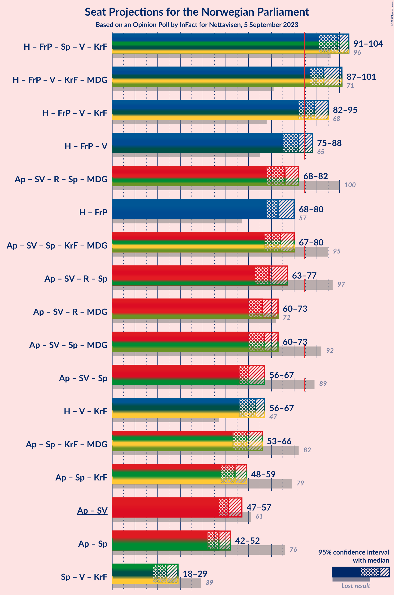

# Opinion Poll by InFact for Nettavisen, 5 September 2023

<a href="#voting-intentions">Voting Intentions</a> | <a href="#seats">Seats</a> | <a href="#coalitions">Coalitions</a> | <a href="#technical-information">Technical Information</a>

## Voting Intentions

### Confidence Intervals

| Party | Last Result | Poll Result | 80% Confidence Interval | 90% Confidence Interval | 95% Confidence Interval | 99% Confidence Interval |
|:-----:|:-----------:|:-----------:|:-----------------------:|:-----------------------:|:-----------------------:|:-----------------------:|
| Høyre | 20.4% | 26.0% | 24.3–27.8% |23.9–28.3% |23.5–28.8% |22.7–29.6% |
| Arbeiderpartiet | 26.2% | 19.3% | 17.8–20.9% |17.4–21.4% |17.0–21.8% |16.3–22.6% |
| Fremskrittspartiet | 11.6% | 14.3% | 13.0–15.8% |12.7–16.2% |12.3–16.6% |11.8–17.3% |
| Sosialistisk Venstreparti | 7.6% | 8.8% | 7.8–10.1% |7.5–10.4% |7.3–10.7% |6.8–11.3% |
| Rødt | 4.7% | 5.5% | 4.7–6.5% |4.5–6.8% |4.3–7.1% |3.9–7.6% |
| Senterpartiet | 13.5% | 5.5% | 4.7–6.5% |4.5–6.8% |4.3–7.1% |3.9–7.6% |
| Venstre | 4.6% | 5.0% | 4.3–6.0% |4.0–6.3% |3.9–6.5% |3.5–7.0% |
| Kristelig Folkeparti | 3.8% | 4.7% | 3.9–5.6% |3.7–5.9% |3.5–6.1% |3.2–6.6% |
| Miljøpartiet De Grønne | 3.9% | 4.3% | 3.6–5.2% |3.4–5.4% |3.2–5.7% |2.9–6.1% |
| Industri- og Næringspartiet | 0.3% | 3.6% | 3.0–4.5% |2.8–4.7% |2.6–4.9% |2.4–5.4% |

*Note:* The poll result column reflects the actual value used in the calculations. Published results may vary slightly, and in addition be rounded to fewer digits.

## Seats

### Confidence Intervals

| Party | Last Result | Median | 80% Confidence Interval | 90% Confidence Interval | 95% Confidence Interval | 99% Confidence Interval |
|:-----:|:-----------:|:------:|:-----------------------:|:-----------------------:|:-----------------------:|:-----------------------:|
| <a href="#høyre">Høyre</a> | 36 | 48 | 44–49 |43–49 |42–50 |41–52 |
| <a href="#arbeiderpartiet">Arbeiderpartiet</a> | 48 | 37 | 35–40 |34–41 |33–43 |32–46 |
| <a href="#fremskrittspartiet">Fremskrittspartiet</a> | 21 | 26 | 24–30 |23–31 |22–32 |20–35 |
| <a href="#sosialistisk-venstreparti">Sosialistisk Venstreparti</a> | 13 | 14 | 12–16 |12–17 |11–18 |10–19 |
| <a href="#rødt">Rødt</a> | 8 | 9 | 8–10 |7–11 |7–11 |1–13 |
| <a href="#senterpartiet">Senterpartiet</a> | 28 | 9 | 7–12 |7–12 |7–13 |2–14 |
| <a href="#venstre">Venstre</a> | 8 | 8 | 7–10 |6–10 |3–10 |2–12 |
| <a href="#kristelig-folkeparti">Kristelig Folkeparti</a> | 3 | 7 | 6–9 |3–9 |2–10 |2–11 |
| <a href="#miljøpartiet-de-grønne">Miljøpartiet De Grønne</a> | 3 | 7 | 3–8 |2–8 |2–9 |1–10 |
| <a href="#industri--og-næringspartiet">Industri- og Næringspartiet</a> | 0 | 3 | 2–7 |2–7 |1–7 |0–8 |

### Høyre

*For a full overview of the results for this party, see the [Høyre](party-høyre.html) page.*

| Number of Seats | Probability | Accumulated | Special Marks |
|:---------------:|:-----------:|:-----------:|:-------------:|
| 36 | 0% | 100% | Last Result |
| 37 | 0% | 100% |  |
| 38 | 0% | 100% |  |
| 39 | 0.1% | 100% |  |
| 40 | 0.3% | 99.9% |  |
| 41 | 2% | 99.6% |  |
| 42 | 2% | 98% |  |
| 43 | 3% | 96% |  |
| 44 | 4% | 93% |  |
| 45 | 6% | 89% |  |
| 46 | 5% | 83% |  |
| 47 | 28% | 78% |  |
| 48 | 11% | 50% | Median |
| 49 | 35% | 40% |  |
| 50 | 3% | 5% |  |
| 51 | 1.0% | 2% |  |
| 52 | 0.7% | 1.1% |  |
| 53 | 0.3% | 0.4% |  |
| 54 | 0.1% | 0.2% |  |
| 55 | 0% | 0.1% |  |
| 56 | 0% | 0% |  |

### Arbeiderpartiet

*For a full overview of the results for this party, see the [Arbeiderpartiet](party-arbeiderpartiet.html) page.*

| Number of Seats | Probability | Accumulated | Special Marks |
|:---------------:|:-----------:|:-----------:|:-------------:|
| 31 | 0.1% | 100% |  |
| 32 | 0.9% | 99.9% |  |
| 33 | 3% | 99.1% |  |
| 34 | 6% | 96% |  |
| 35 | 3% | 91% |  |
| 36 | 35% | 88% |  |
| 37 | 12% | 53% | Median |
| 38 | 9% | 41% |  |
| 39 | 6% | 32% |  |
| 40 | 18% | 26% |  |
| 41 | 4% | 9% |  |
| 42 | 1.0% | 5% |  |
| 43 | 3% | 4% |  |
| 44 | 0.4% | 1.1% |  |
| 45 | 0.2% | 0.8% |  |
| 46 | 0.1% | 0.6% |  |
| 47 | 0.4% | 0.4% |  |
| 48 | 0% | 0.1% | Last Result |
| 49 | 0% | 0% |  |

### Fremskrittspartiet

*For a full overview of the results for this party, see the [Fremskrittspartiet](party-fremskrittspartiet.html) page.*

| Number of Seats | Probability | Accumulated | Special Marks |
|:---------------:|:-----------:|:-----------:|:-------------:|
| 19 | 0.2% | 100% |  |
| 20 | 0.6% | 99.8% |  |
| 21 | 1.1% | 99.2% | Last Result |
| 22 | 2% | 98% |  |
| 23 | 5% | 97% |  |
| 24 | 24% | 92% |  |
| 25 | 12% | 68% |  |
| 26 | 30% | 56% | Median |
| 27 | 6% | 26% |  |
| 28 | 4% | 20% |  |
| 29 | 5% | 16% |  |
| 30 | 4% | 11% |  |
| 31 | 2% | 7% |  |
| 32 | 3% | 4% |  |
| 33 | 0.5% | 1.5% |  |
| 34 | 0.3% | 1.0% |  |
| 35 | 0.5% | 0.6% |  |
| 36 | 0.1% | 0.1% |  |
| 37 | 0% | 0% |  |

### Sosialistisk Venstreparti

*For a full overview of the results for this party, see the [Sosialistisk Venstreparti](party-sosialistiskvenstreparti.html) page.*

| Number of Seats | Probability | Accumulated | Special Marks |
|:---------------:|:-----------:|:-----------:|:-------------:|
| 9 | 0.2% | 100% |  |
| 10 | 0.6% | 99.8% |  |
| 11 | 2% | 99.2% |  |
| 12 | 11% | 97% |  |
| 13 | 10% | 86% | Last Result |
| 14 | 40% | 76% | Median |
| 15 | 23% | 36% |  |
| 16 | 5% | 13% |  |
| 17 | 4% | 8% |  |
| 18 | 2% | 4% |  |
| 19 | 2% | 2% |  |
| 20 | 0.1% | 0.2% |  |
| 21 | 0% | 0.1% |  |
| 22 | 0% | 0% |  |

### Rødt

*For a full overview of the results for this party, see the [Rødt](party-rødt.html) page.*

| Number of Seats | Probability | Accumulated | Special Marks |
|:---------------:|:-----------:|:-----------:|:-------------:|
| 1 | 0.7% | 100% |  |
| 2 | 0% | 99.3% |  |
| 3 | 0% | 99.3% |  |
| 4 | 0% | 99.3% |  |
| 5 | 0.1% | 99.3% |  |
| 6 | 0.8% | 99.2% |  |
| 7 | 6% | 98% |  |
| 8 | 35% | 92% | Last Result |
| 9 | 41% | 57% | Median |
| 10 | 9% | 16% |  |
| 11 | 4% | 7% |  |
| 12 | 2% | 2% |  |
| 13 | 0.4% | 0.6% |  |
| 14 | 0.1% | 0.1% |  |
| 15 | 0% | 0% |  |

### Senterpartiet

*For a full overview of the results for this party, see the [Senterpartiet](party-senterpartiet.html) page.*

| Number of Seats | Probability | Accumulated | Special Marks |
|:---------------:|:-----------:|:-----------:|:-------------:|
| 1 | 0.4% | 100% |  |
| 2 | 0.1% | 99.5% |  |
| 3 | 0% | 99.5% |  |
| 4 | 0% | 99.4% |  |
| 5 | 0.4% | 99.4% |  |
| 6 | 1.3% | 99.0% |  |
| 7 | 8% | 98% |  |
| 8 | 12% | 90% |  |
| 9 | 52% | 78% | Median |
| 10 | 6% | 26% |  |
| 11 | 10% | 21% |  |
| 12 | 7% | 11% |  |
| 13 | 3% | 3% |  |
| 14 | 0.5% | 0.7% |  |
| 15 | 0.2% | 0.2% |  |
| 16 | 0% | 0% |  |
| 17 | 0% | 0% |  |
| 18 | 0% | 0% |  |
| 19 | 0% | 0% |  |
| 20 | 0% | 0% |  |
| 21 | 0% | 0% |  |
| 22 | 0% | 0% |  |
| 23 | 0% | 0% |  |
| 24 | 0% | 0% |  |
| 25 | 0% | 0% |  |
| 26 | 0% | 0% |  |
| 27 | 0% | 0% |  |
| 28 | 0% | 0% | Last Result |

### Venstre

*For a full overview of the results for this party, see the [Venstre](party-venstre.html) page.*

| Number of Seats | Probability | Accumulated | Special Marks |
|:---------------:|:-----------:|:-----------:|:-------------:|
| 2 | 0.6% | 100% |  |
| 3 | 2% | 99.4% |  |
| 4 | 0% | 97% |  |
| 5 | 0% | 97% |  |
| 6 | 2% | 97% |  |
| 7 | 27% | 95% |  |
| 8 | 46% | 68% | Last Result, Median |
| 9 | 12% | 22% |  |
| 10 | 8% | 10% |  |
| 11 | 2% | 2% |  |
| 12 | 0.6% | 0.6% |  |
| 13 | 0% | 0% |  |

### Kristelig Folkeparti

*For a full overview of the results for this party, see the [Kristelig Folkeparti](party-kristeligfolkeparti.html) page.*

| Number of Seats | Probability | Accumulated | Special Marks |
|:---------------:|:-----------:|:-----------:|:-------------:|
| 2 | 3% | 100% |  |
| 3 | 5% | 97% | Last Result |
| 4 | 0% | 92% |  |
| 5 | 0% | 92% |  |
| 6 | 3% | 92% |  |
| 7 | 43% | 89% | Median |
| 8 | 34% | 46% |  |
| 9 | 9% | 12% |  |
| 10 | 2% | 3% |  |
| 11 | 0.4% | 0.5% |  |
| 12 | 0.1% | 0.1% |  |
| 13 | 0% | 0% |  |

### Miljøpartiet De Grønne

*For a full overview of the results for this party, see the [Miljøpartiet De Grønne](party-miljøpartietdegrønne.html) page.*

| Number of Seats | Probability | Accumulated | Special Marks |
|:---------------:|:-----------:|:-----------:|:-------------:|
| 1 | 0.8% | 100% |  |
| 2 | 7% | 99.2% |  |
| 3 | 31% | 92% | Last Result |
| 4 | 0% | 61% |  |
| 5 | 0.2% | 61% |  |
| 6 | 6% | 61% |  |
| 7 | 33% | 54% | Median |
| 8 | 17% | 21% |  |
| 9 | 3% | 4% |  |
| 10 | 0.6% | 0.6% |  |
| 11 | 0% | 0% |  |

### Industri- og Næringspartiet

*For a full overview of the results for this party, see the [Industri- og Næringspartiet](party-industri-ognæringspartiet.html) page.*

| Number of Seats | Probability | Accumulated | Special Marks |
|:---------------:|:-----------:|:-----------:|:-------------:|
| 0 | 2% | 100% | Last Result |
| 1 | 3% | 98% |  |
| 2 | 24% | 95% |  |
| 3 | 32% | 71% | Median |
| 4 | 0% | 40% |  |
| 5 | 0% | 40% |  |
| 6 | 6% | 40% |  |
| 7 | 31% | 33% |  |
| 8 | 2% | 2% |  |
| 9 | 0.2% | 0.3% |  |
| 10 | 0% | 0% |  |

## Coalitions

### Confidence Intervals

| Coalition | Last Result | Median | Majority? | 80% Confidence Interval | 90% Confidence Interval | 95% Confidence Interval | 99% Confidence Interval |
|:---------:|:-----------:|:------:|:---------:|:-----------------------:|:-----------------------:|:-----------------------:|:-----------------------:|
| Høyre – Fremskrittspartiet – Senterpartiet – Venstre – Kristelig Folkeparti | 96 | 99 | 100% | 93–101 | 92–103 | 91–104 | 88–107 |
| Høyre – Fremskrittspartiet – Venstre – Kristelig Folkeparti – Miljøpartiet De Grønne | 71 | 93 | 99.6% | 90–98 | 89–100 | 87–101 | 85–104 |
| Høyre – Fremskrittspartiet – Venstre – Kristelig Folkeparti | 68 | 89 | 90% | 84–92 | 83–94 | 82–95 | 79–99 |
| Høyre – Fremskrittspartiet – Venstre | 65 | 82 | 11% | 77–85 | 76–87 | 75–88 | 73–91 |
| Arbeiderpartiet – Sosialistisk Venstreparti – Rødt – Senterpartiet – Miljøpartiet De Grønne | 100 | 76 | 0.9% | 71–79 | 70–82 | 68–82 | 65–86 |
| Høyre – Fremskrittspartiet | 57 | 73 | 0% | 70–77 | 68–78 | 68–80 | 65–82 |
| Arbeiderpartiet – Sosialistisk Venstreparti – Senterpartiet – Kristelig Folkeparti – Miljøpartiet De Grønne | 95 | 74 | 0.2% | 69–79 | 68–80 | 67–80 | 64–83 |
| Arbeiderpartiet – Sosialistisk Venstreparti – Rødt – Senterpartiet | 97 | 69 | 0% | 66–74 | 65–75 | 63–77 | 60–80 |
| Arbeiderpartiet – Sosialistisk Venstreparti – Rødt – Miljøpartiet De Grønne | 72 | 66 | 0% | 62–70 | 62–73 | 60–73 | 57–76 |
| Arbeiderpartiet – Sosialistisk Venstreparti – Senterpartiet – Miljøpartiet De Grønne | 92 | 67 | 0% | 62–71 | 62–73 | 60–73 | 58–76 |
| Arbeiderpartiet – Sosialistisk Venstreparti – Senterpartiet | 89 | 60 | 0% | 58–64 | 57–66 | 56–67 | 52–70 |
| Høyre – Venstre – Kristelig Folkeparti | 47 | 63 | 0% | 58–65 | 57–67 | 56–67 | 53–69 |
| Arbeiderpartiet – Senterpartiet – Kristelig Folkeparti – Miljøpartiet De Grønne | 82 | 59 | 0% | 55–64 | 54–65 | 53–66 | 50–68 |
| Arbeiderpartiet – Senterpartiet – Kristelig Folkeparti | 79 | 54 | 0% | 51–57 | 49–59 | 48–59 | 45–63 |
| Arbeiderpartiet – Sosialistisk Venstreparti | 61 | 51 | 0% | 48–55 | 48–57 | 47–57 | 45–60 |
| Arbeiderpartiet – Senterpartiet | 76 | 47 | 0% | 44–49 | 43–51 | 42–52 | 40–55 |
| Senterpartiet – Venstre – Kristelig Folkeparti | 39 | 24 | 0% | 21–27 | 20–29 | 18–29 | 16–32 |

### Høyre – Fremskrittspartiet – Senterpartiet – Venstre – Kristelig Folkeparti

| Number of Seats | Probability | Accumulated | Special Marks |
|:---------------:|:-----------:|:-----------:|:-------------:|
| 85 | 0.2% | 100% | Majority |
| 86 | 0% | 99.8% |  |
| 87 | 0.1% | 99.8% |  |
| 88 | 0.2% | 99.7% |  |
| 89 | 0.4% | 99.4% |  |
| 90 | 0.7% | 99.0% |  |
| 91 | 3% | 98% |  |
| 92 | 3% | 95% |  |
| 93 | 3% | 93% |  |
| 94 | 3% | 90% |  |
| 95 | 15% | 87% |  |
| 96 | 4% | 72% | Last Result |
| 97 | 6% | 68% |  |
| 98 | 7% | 61% | Median |
| 99 | 38% | 55% |  |
| 100 | 5% | 17% |  |
| 101 | 5% | 12% |  |
| 102 | 2% | 7% |  |
| 103 | 2% | 5% |  |
| 104 | 1.1% | 3% |  |
| 105 | 0.9% | 2% |  |
| 106 | 0.3% | 1.1% |  |
| 107 | 0.4% | 0.8% |  |
| 108 | 0.4% | 0.4% |  |
| 109 | 0% | 0.1% |  |
| 110 | 0% | 0.1% |  |
| 111 | 0% | 0% |  |

### Høyre – Fremskrittspartiet – Venstre – Kristelig Folkeparti – Miljøpartiet De Grønne

| Number of Seats | Probability | Accumulated | Special Marks |
|:---------------:|:-----------:|:-----------:|:-------------:|
| 71 | 0% | 100% | Last Result |
| 72 | 0% | 100% |  |
| 73 | 0% | 100% |  |
| 74 | 0% | 100% |  |
| 75 | 0% | 100% |  |
| 76 | 0% | 100% |  |
| 77 | 0% | 100% |  |
| 78 | 0% | 100% |  |
| 79 | 0% | 100% |  |
| 80 | 0% | 100% |  |
| 81 | 0% | 100% |  |
| 82 | 0.1% | 100% |  |
| 83 | 0.1% | 99.9% |  |
| 84 | 0.2% | 99.8% |  |
| 85 | 0.7% | 99.6% | Majority |
| 86 | 0.9% | 98.9% |  |
| 87 | 0.7% | 98% |  |
| 88 | 2% | 97% |  |
| 89 | 1.5% | 96% |  |
| 90 | 5% | 94% |  |
| 91 | 4% | 89% |  |
| 92 | 4% | 84% |  |
| 93 | 40% | 81% |  |
| 94 | 6% | 41% |  |
| 95 | 3% | 35% |  |
| 96 | 14% | 31% | Median |
| 97 | 2% | 17% |  |
| 98 | 9% | 16% |  |
| 99 | 2% | 7% |  |
| 100 | 2% | 5% |  |
| 101 | 1.1% | 3% |  |
| 102 | 0.8% | 2% |  |
| 103 | 0.5% | 1.0% |  |
| 104 | 0.1% | 0.5% |  |
| 105 | 0.3% | 0.4% |  |
| 106 | 0% | 0% |  |

### Høyre – Fremskrittspartiet – Venstre – Kristelig Folkeparti

| Number of Seats | Probability | Accumulated | Special Marks |
|:---------------:|:-----------:|:-----------:|:-------------:|
| 68 | 0% | 100% | Last Result |
| 69 | 0% | 100% |  |
| 70 | 0% | 100% |  |
| 71 | 0% | 100% |  |
| 72 | 0% | 100% |  |
| 73 | 0% | 100% |  |
| 74 | 0% | 100% |  |
| 75 | 0% | 100% |  |
| 76 | 0.2% | 100% |  |
| 77 | 0.1% | 99.8% |  |
| 78 | 0.1% | 99.7% |  |
| 79 | 0.4% | 99.6% |  |
| 80 | 0.4% | 99.2% |  |
| 81 | 0.4% | 98.8% |  |
| 82 | 1.0% | 98% |  |
| 83 | 4% | 97% |  |
| 84 | 3% | 93% |  |
| 85 | 3% | 90% | Majority |
| 86 | 17% | 86% |  |
| 87 | 5% | 70% |  |
| 88 | 13% | 64% |  |
| 89 | 5% | 51% | Median |
| 90 | 30% | 47% |  |
| 91 | 6% | 17% |  |
| 92 | 4% | 11% |  |
| 93 | 2% | 7% |  |
| 94 | 2% | 5% |  |
| 95 | 1.2% | 3% |  |
| 96 | 0.7% | 2% |  |
| 97 | 0.6% | 1.5% |  |
| 98 | 0.3% | 0.9% |  |
| 99 | 0.5% | 0.6% |  |
| 100 | 0.1% | 0.1% |  |
| 101 | 0% | 0% |  |

### Høyre – Fremskrittspartiet – Venstre

| Number of Seats | Probability | Accumulated | Special Marks |
|:---------------:|:-----------:|:-----------:|:-------------:|
| 65 | 0% | 100% | Last Result |
| 66 | 0% | 100% |  |
| 67 | 0% | 100% |  |
| 68 | 0% | 100% |  |
| 69 | 0% | 100% |  |
| 70 | 0.1% | 100% |  |
| 71 | 0.1% | 99.9% |  |
| 72 | 0.2% | 99.8% |  |
| 73 | 0.6% | 99.6% |  |
| 74 | 0.5% | 99.0% |  |
| 75 | 1.3% | 98% |  |
| 76 | 4% | 97% |  |
| 77 | 5% | 93% |  |
| 78 | 17% | 89% |  |
| 79 | 2% | 72% |  |
| 80 | 13% | 71% |  |
| 81 | 6% | 58% |  |
| 82 | 6% | 52% | Median |
| 83 | 31% | 46% |  |
| 84 | 3% | 14% |  |
| 85 | 3% | 11% | Majority |
| 86 | 2% | 8% |  |
| 87 | 2% | 6% |  |
| 88 | 1.1% | 3% |  |
| 89 | 0.9% | 2% |  |
| 90 | 0.6% | 1.3% |  |
| 91 | 0.5% | 0.7% |  |
| 92 | 0.1% | 0.2% |  |
| 93 | 0.1% | 0.1% |  |
| 94 | 0% | 0% |  |

### Arbeiderpartiet – Sosialistisk Venstreparti – Rødt – Senterpartiet – Miljøpartiet De Grønne

| Number of Seats | Probability | Accumulated | Special Marks |
|:---------------:|:-----------:|:-----------:|:-------------:|
| 62 | 0.1% | 100% |  |
| 63 | 0% | 99.9% |  |
| 64 | 0.1% | 99.9% |  |
| 65 | 0.3% | 99.8% |  |
| 66 | 0.4% | 99.5% |  |
| 67 | 0.9% | 99.1% |  |
| 68 | 0.6% | 98% |  |
| 69 | 2% | 97% |  |
| 70 | 2% | 96% |  |
| 71 | 25% | 94% |  |
| 72 | 2% | 69% |  |
| 73 | 4% | 66% |  |
| 74 | 6% | 62% |  |
| 75 | 4% | 56% |  |
| 76 | 10% | 52% | Median |
| 77 | 7% | 42% |  |
| 78 | 13% | 35% |  |
| 79 | 13% | 22% |  |
| 80 | 1.3% | 9% |  |
| 81 | 2% | 8% |  |
| 82 | 3% | 6% |  |
| 83 | 1.1% | 2% |  |
| 84 | 0.3% | 1.3% |  |
| 85 | 0.4% | 0.9% | Majority |
| 86 | 0.3% | 0.6% |  |
| 87 | 0.2% | 0.3% |  |
| 88 | 0% | 0.1% |  |
| 89 | 0% | 0% |  |
| 90 | 0% | 0% |  |
| 91 | 0% | 0% |  |
| 92 | 0% | 0% |  |
| 93 | 0% | 0% |  |
| 94 | 0% | 0% |  |
| 95 | 0% | 0% |  |
| 96 | 0% | 0% |  |
| 97 | 0% | 0% |  |
| 98 | 0% | 0% |  |
| 99 | 0% | 0% |  |
| 100 | 0% | 0% | Last Result |

### Høyre – Fremskrittspartiet

| Number of Seats | Probability | Accumulated | Special Marks |
|:---------------:|:-----------:|:-----------:|:-------------:|
| 57 | 0% | 100% | Last Result |
| 58 | 0% | 100% |  |
| 59 | 0% | 100% |  |
| 60 | 0% | 100% |  |
| 61 | 0% | 100% |  |
| 62 | 0% | 100% |  |
| 63 | 0% | 100% |  |
| 64 | 0.2% | 99.9% |  |
| 65 | 0.5% | 99.7% |  |
| 66 | 0.5% | 99.3% |  |
| 67 | 0.7% | 98.7% |  |
| 68 | 6% | 98% |  |
| 69 | 2% | 93% |  |
| 70 | 3% | 90% |  |
| 71 | 18% | 87% |  |
| 72 | 11% | 69% |  |
| 73 | 9% | 58% |  |
| 74 | 7% | 49% | Median |
| 75 | 28% | 42% |  |
| 76 | 3% | 15% |  |
| 77 | 3% | 11% |  |
| 78 | 3% | 8% |  |
| 79 | 2% | 5% |  |
| 80 | 1.3% | 3% |  |
| 81 | 1.0% | 2% |  |
| 82 | 0.7% | 1.2% |  |
| 83 | 0.4% | 0.5% |  |
| 84 | 0% | 0.1% |  |
| 85 | 0% | 0% | Majority |

### Arbeiderpartiet – Sosialistisk Venstreparti – Senterpartiet – Kristelig Folkeparti – Miljøpartiet De Grønne

| Number of Seats | Probability | Accumulated | Special Marks |
|:---------------:|:-----------:|:-----------:|:-------------:|
| 62 | 0.1% | 100% |  |
| 63 | 0.1% | 99.9% |  |
| 64 | 0.5% | 99.8% |  |
| 65 | 0.6% | 99.3% |  |
| 66 | 1.0% | 98.7% |  |
| 67 | 1.0% | 98% |  |
| 68 | 2% | 97% |  |
| 69 | 25% | 95% |  |
| 70 | 4% | 70% |  |
| 71 | 5% | 66% |  |
| 72 | 4% | 61% |  |
| 73 | 3% | 57% |  |
| 74 | 8% | 54% | Median |
| 75 | 8% | 46% |  |
| 76 | 8% | 38% |  |
| 77 | 2% | 30% |  |
| 78 | 10% | 28% |  |
| 79 | 13% | 19% |  |
| 80 | 3% | 5% |  |
| 81 | 1.1% | 2% |  |
| 82 | 0.5% | 1.2% |  |
| 83 | 0.4% | 0.7% |  |
| 84 | 0.1% | 0.2% |  |
| 85 | 0.1% | 0.2% | Majority |
| 86 | 0.1% | 0.1% |  |
| 87 | 0% | 0% |  |
| 88 | 0% | 0% |  |
| 89 | 0% | 0% |  |
| 90 | 0% | 0% |  |
| 91 | 0% | 0% |  |
| 92 | 0% | 0% |  |
| 93 | 0% | 0% |  |
| 94 | 0% | 0% |  |
| 95 | 0% | 0% | Last Result |

### Arbeiderpartiet – Sosialistisk Venstreparti – Rødt – Senterpartiet

| Number of Seats | Probability | Accumulated | Special Marks |
|:---------------:|:-----------:|:-----------:|:-------------:|
| 59 | 0.3% | 100% |  |
| 60 | 0.3% | 99.6% |  |
| 61 | 0.7% | 99.4% |  |
| 62 | 0.4% | 98.6% |  |
| 63 | 0.9% | 98% |  |
| 64 | 2% | 97% |  |
| 65 | 2% | 95% |  |
| 66 | 4% | 94% |  |
| 67 | 5% | 90% |  |
| 68 | 28% | 84% |  |
| 69 | 11% | 56% | Median |
| 70 | 12% | 46% |  |
| 71 | 7% | 33% |  |
| 72 | 13% | 26% |  |
| 73 | 3% | 13% |  |
| 74 | 3% | 10% |  |
| 75 | 3% | 7% |  |
| 76 | 2% | 4% |  |
| 77 | 0.9% | 3% |  |
| 78 | 0.7% | 2% |  |
| 79 | 0.3% | 1.3% |  |
| 80 | 0.8% | 1.0% |  |
| 81 | 0.1% | 0.2% |  |
| 82 | 0% | 0% |  |
| 83 | 0% | 0% |  |
| 84 | 0% | 0% |  |
| 85 | 0% | 0% | Majority |
| 86 | 0% | 0% |  |
| 87 | 0% | 0% |  |
| 88 | 0% | 0% |  |
| 89 | 0% | 0% |  |
| 90 | 0% | 0% |  |
| 91 | 0% | 0% |  |
| 92 | 0% | 0% |  |
| 93 | 0% | 0% |  |
| 94 | 0% | 0% |  |
| 95 | 0% | 0% |  |
| 96 | 0% | 0% |  |
| 97 | 0% | 0% | Last Result |

### Arbeiderpartiet – Sosialistisk Venstreparti – Rødt – Miljøpartiet De Grønne

| Number of Seats | Probability | Accumulated | Special Marks |
|:---------------:|:-----------:|:-----------:|:-------------:|
| 55 | 0.1% | 100% |  |
| 56 | 0.1% | 99.8% |  |
| 57 | 0.3% | 99.7% |  |
| 58 | 0.7% | 99.4% |  |
| 59 | 0.7% | 98.7% |  |
| 60 | 0.8% | 98% |  |
| 61 | 1.4% | 97% |  |
| 62 | 26% | 96% |  |
| 63 | 4% | 70% |  |
| 64 | 7% | 66% |  |
| 65 | 6% | 58% |  |
| 66 | 7% | 52% |  |
| 67 | 11% | 46% | Median |
| 68 | 8% | 35% |  |
| 69 | 4% | 27% |  |
| 70 | 15% | 23% |  |
| 71 | 2% | 8% |  |
| 72 | 1.1% | 6% | Last Result |
| 73 | 3% | 5% |  |
| 74 | 0.4% | 2% |  |
| 75 | 0.6% | 1.4% |  |
| 76 | 0.6% | 0.8% |  |
| 77 | 0.1% | 0.2% |  |
| 78 | 0.1% | 0.2% |  |
| 79 | 0% | 0% |  |

### Arbeiderpartiet – Sosialistisk Venstreparti – Senterpartiet – Miljøpartiet De Grønne

| Number of Seats | Probability | Accumulated | Special Marks |
|:---------------:|:-----------:|:-----------:|:-------------:|
| 55 | 0.1% | 100% |  |
| 56 | 0.1% | 99.9% |  |
| 57 | 0.2% | 99.8% |  |
| 58 | 1.0% | 99.6% |  |
| 59 | 0.5% | 98.6% |  |
| 60 | 0.7% | 98% |  |
| 61 | 2% | 97% |  |
| 62 | 25% | 96% |  |
| 63 | 4% | 71% |  |
| 64 | 3% | 67% |  |
| 65 | 5% | 64% |  |
| 66 | 8% | 59% |  |
| 67 | 9% | 51% | Median |
| 68 | 5% | 42% |  |
| 69 | 7% | 37% |  |
| 70 | 9% | 30% |  |
| 71 | 14% | 21% |  |
| 72 | 2% | 7% |  |
| 73 | 3% | 5% |  |
| 74 | 0.6% | 2% |  |
| 75 | 0.2% | 1.1% |  |
| 76 | 0.6% | 0.9% |  |
| 77 | 0.2% | 0.3% |  |
| 78 | 0% | 0.1% |  |
| 79 | 0% | 0.1% |  |
| 80 | 0% | 0% |  |
| 81 | 0% | 0% |  |
| 82 | 0% | 0% |  |
| 83 | 0% | 0% |  |
| 84 | 0% | 0% |  |
| 85 | 0% | 0% | Majority |
| 86 | 0% | 0% |  |
| 87 | 0% | 0% |  |
| 88 | 0% | 0% |  |
| 89 | 0% | 0% |  |
| 90 | 0% | 0% |  |
| 91 | 0% | 0% |  |
| 92 | 0% | 0% | Last Result |

### Arbeiderpartiet – Sosialistisk Venstreparti – Senterpartiet

| Number of Seats | Probability | Accumulated | Special Marks |
|:---------------:|:-----------:|:-----------:|:-------------:|
| 50 | 0.1% | 100% |  |
| 51 | 0.1% | 99.9% |  |
| 52 | 0.4% | 99.8% |  |
| 53 | 0.2% | 99.4% |  |
| 54 | 0.8% | 99.3% |  |
| 55 | 0.9% | 98% |  |
| 56 | 2% | 98% |  |
| 57 | 3% | 95% |  |
| 58 | 3% | 92% |  |
| 59 | 31% | 89% |  |
| 60 | 10% | 58% | Median |
| 61 | 7% | 48% |  |
| 62 | 12% | 41% |  |
| 63 | 4% | 28% |  |
| 64 | 15% | 24% |  |
| 65 | 3% | 9% |  |
| 66 | 3% | 6% |  |
| 67 | 1.1% | 3% |  |
| 68 | 0.5% | 2% |  |
| 69 | 0.6% | 1.3% |  |
| 70 | 0.6% | 0.7% |  |
| 71 | 0% | 0.1% |  |
| 72 | 0% | 0.1% |  |
| 73 | 0% | 0% |  |
| 74 | 0% | 0% |  |
| 75 | 0% | 0% |  |
| 76 | 0% | 0% |  |
| 77 | 0% | 0% |  |
| 78 | 0% | 0% |  |
| 79 | 0% | 0% |  |
| 80 | 0% | 0% |  |
| 81 | 0% | 0% |  |
| 82 | 0% | 0% |  |
| 83 | 0% | 0% |  |
| 84 | 0% | 0% |  |
| 85 | 0% | 0% | Majority |
| 86 | 0% | 0% |  |
| 87 | 0% | 0% |  |
| 88 | 0% | 0% |  |
| 89 | 0% | 0% | Last Result |

### Høyre – Venstre – Kristelig Folkeparti

| Number of Seats | Probability | Accumulated | Special Marks |
|:---------------:|:-----------:|:-----------:|:-------------:|
| 47 | 0% | 100% | Last Result |
| 48 | 0% | 100% |  |
| 49 | 0% | 100% |  |
| 50 | 0% | 100% |  |
| 51 | 0.1% | 99.9% |  |
| 52 | 0.3% | 99.9% |  |
| 53 | 0.2% | 99.6% |  |
| 54 | 0.5% | 99.4% |  |
| 55 | 0.6% | 98.9% |  |
| 56 | 1.0% | 98% |  |
| 57 | 4% | 97% |  |
| 58 | 3% | 93% |  |
| 59 | 3% | 90% |  |
| 60 | 6% | 87% |  |
| 61 | 6% | 81% |  |
| 62 | 19% | 75% |  |
| 63 | 13% | 55% | Median |
| 64 | 29% | 42% |  |
| 65 | 5% | 13% |  |
| 66 | 3% | 9% |  |
| 67 | 4% | 6% |  |
| 68 | 1.1% | 2% |  |
| 69 | 0.3% | 0.5% |  |
| 70 | 0.1% | 0.3% |  |
| 71 | 0.1% | 0.1% |  |
| 72 | 0% | 0% |  |

### Arbeiderpartiet – Senterpartiet – Kristelig Folkeparti – Miljøpartiet De Grønne

| Number of Seats | Probability | Accumulated | Special Marks |
|:---------------:|:-----------:|:-----------:|:-------------:|
| 46 | 0.1% | 100% |  |
| 47 | 0% | 99.9% |  |
| 48 | 0.1% | 99.8% |  |
| 49 | 0% | 99.7% |  |
| 50 | 0.2% | 99.7% |  |
| 51 | 0.6% | 99.4% |  |
| 52 | 1.1% | 98.8% |  |
| 53 | 0.9% | 98% |  |
| 54 | 2% | 97% |  |
| 55 | 27% | 94% |  |
| 56 | 3% | 67% |  |
| 57 | 3% | 64% |  |
| 58 | 4% | 60% |  |
| 59 | 8% | 57% |  |
| 60 | 3% | 49% | Median |
| 61 | 5% | 45% |  |
| 62 | 4% | 40% |  |
| 63 | 8% | 37% |  |
| 64 | 22% | 28% |  |
| 65 | 3% | 7% |  |
| 66 | 2% | 4% |  |
| 67 | 0.7% | 1.3% |  |
| 68 | 0.3% | 0.6% |  |
| 69 | 0.2% | 0.4% |  |
| 70 | 0.1% | 0.2% |  |
| 71 | 0.1% | 0.1% |  |
| 72 | 0% | 0% |  |
| 73 | 0% | 0% |  |
| 74 | 0% | 0% |  |
| 75 | 0% | 0% |  |
| 76 | 0% | 0% |  |
| 77 | 0% | 0% |  |
| 78 | 0% | 0% |  |
| 79 | 0% | 0% |  |
| 80 | 0% | 0% |  |
| 81 | 0% | 0% |  |
| 82 | 0% | 0% | Last Result |

### Arbeiderpartiet – Senterpartiet – Kristelig Folkeparti

| Number of Seats | Probability | Accumulated | Special Marks |
|:---------------:|:-----------:|:-----------:|:-------------:|
| 43 | 0.1% | 100% |  |
| 44 | 0.2% | 99.8% |  |
| 45 | 0.4% | 99.6% |  |
| 46 | 0.4% | 99.2% |  |
| 47 | 1.0% | 98.8% |  |
| 48 | 2% | 98% |  |
| 49 | 3% | 96% |  |
| 50 | 3% | 93% |  |
| 51 | 6% | 90% |  |
| 52 | 29% | 85% |  |
| 53 | 4% | 56% | Median |
| 54 | 6% | 52% |  |
| 55 | 7% | 46% |  |
| 56 | 16% | 39% |  |
| 57 | 15% | 23% |  |
| 58 | 2% | 8% |  |
| 59 | 3% | 5% |  |
| 60 | 0.9% | 2% |  |
| 61 | 0.6% | 1.5% |  |
| 62 | 0.2% | 0.9% |  |
| 63 | 0.6% | 0.7% |  |
| 64 | 0.1% | 0.1% |  |
| 65 | 0% | 0% |  |
| 66 | 0% | 0% |  |
| 67 | 0% | 0% |  |
| 68 | 0% | 0% |  |
| 69 | 0% | 0% |  |
| 70 | 0% | 0% |  |
| 71 | 0% | 0% |  |
| 72 | 0% | 0% |  |
| 73 | 0% | 0% |  |
| 74 | 0% | 0% |  |
| 75 | 0% | 0% |  |
| 76 | 0% | 0% |  |
| 77 | 0% | 0% |  |
| 78 | 0% | 0% |  |
| 79 | 0% | 0% | Last Result |

### Arbeiderpartiet – Sosialistisk Venstreparti

| Number of Seats | Probability | Accumulated | Special Marks |
|:---------------:|:-----------:|:-----------:|:-------------:|
| 44 | 0.4% | 100% |  |
| 45 | 0.3% | 99.6% |  |
| 46 | 0.5% | 99.3% |  |
| 47 | 4% | 98.8% |  |
| 48 | 7% | 95% |  |
| 49 | 3% | 88% |  |
| 50 | 27% | 86% |  |
| 51 | 17% | 59% | Median |
| 52 | 10% | 42% |  |
| 53 | 7% | 33% |  |
| 54 | 4% | 26% |  |
| 55 | 14% | 22% |  |
| 56 | 3% | 8% |  |
| 57 | 3% | 5% |  |
| 58 | 0.6% | 2% |  |
| 59 | 0.7% | 2% |  |
| 60 | 0.4% | 0.9% |  |
| 61 | 0.4% | 0.5% | Last Result |
| 62 | 0% | 0.1% |  |
| 63 | 0% | 0% |  |

### Arbeiderpartiet – Senterpartiet

| Number of Seats | Probability | Accumulated | Special Marks |
|:---------------:|:-----------:|:-----------:|:-------------:|
| 37 | 0% | 100% |  |
| 38 | 0.2% | 99.9% |  |
| 39 | 0.1% | 99.7% |  |
| 40 | 1.2% | 99.6% |  |
| 41 | 0.9% | 98% |  |
| 42 | 2% | 98% |  |
| 43 | 3% | 96% |  |
| 44 | 7% | 93% |  |
| 45 | 30% | 86% |  |
| 46 | 5% | 56% | Median |
| 47 | 9% | 51% |  |
| 48 | 15% | 42% |  |
| 49 | 18% | 27% |  |
| 50 | 4% | 9% |  |
| 51 | 1.4% | 6% |  |
| 52 | 3% | 4% |  |
| 53 | 0.4% | 1.4% |  |
| 54 | 0.3% | 0.9% |  |
| 55 | 0.2% | 0.6% |  |
| 56 | 0.4% | 0.5% |  |
| 57 | 0% | 0% |  |
| 58 | 0% | 0% |  |
| 59 | 0% | 0% |  |
| 60 | 0% | 0% |  |
| 61 | 0% | 0% |  |
| 62 | 0% | 0% |  |
| 63 | 0% | 0% |  |
| 64 | 0% | 0% |  |
| 65 | 0% | 0% |  |
| 66 | 0% | 0% |  |
| 67 | 0% | 0% |  |
| 68 | 0% | 0% |  |
| 69 | 0% | 0% |  |
| 70 | 0% | 0% |  |
| 71 | 0% | 0% |  |
| 72 | 0% | 0% |  |
| 73 | 0% | 0% |  |
| 74 | 0% | 0% |  |
| 75 | 0% | 0% |  |
| 76 | 0% | 0% | Last Result |

### Senterpartiet – Venstre – Kristelig Folkeparti

| Number of Seats | Probability | Accumulated | Special Marks |
|:---------------:|:-----------:|:-----------:|:-------------:|
| 13 | 0% | 100% |  |
| 14 | 0.1% | 99.9% |  |
| 15 | 0.1% | 99.8% |  |
| 16 | 0.4% | 99.7% |  |
| 17 | 1.3% | 99.4% |  |
| 18 | 0.7% | 98% |  |
| 19 | 1.3% | 97% |  |
| 20 | 4% | 96% |  |
| 21 | 4% | 92% |  |
| 22 | 5% | 88% |  |
| 23 | 7% | 83% |  |
| 24 | 42% | 76% | Median |
| 25 | 5% | 34% |  |
| 26 | 6% | 29% |  |
| 27 | 14% | 23% |  |
| 28 | 2% | 9% |  |
| 29 | 5% | 7% |  |
| 30 | 0.8% | 2% |  |
| 31 | 0.6% | 1.2% |  |
| 32 | 0.4% | 0.6% |  |
| 33 | 0.1% | 0.2% |  |
| 34 | 0.1% | 0.1% |  |
| 35 | 0% | 0% |  |
| 36 | 0% | 0% |  |
| 37 | 0% | 0% |  |
| 38 | 0% | 0% |  |
| 39 | 0% | 0% | Last Result |

## Technical Information

### Opinion Poll

+ **Polling firm:** InFact
+ **Commissioner(s):** Nettavisen
+ **Fieldwork period:** 5 September 2023

### Calculations

+ **Sample size:** 1053
+ **Simulations done:** 1,048,576
+ **Error estimate:** 1.97%

