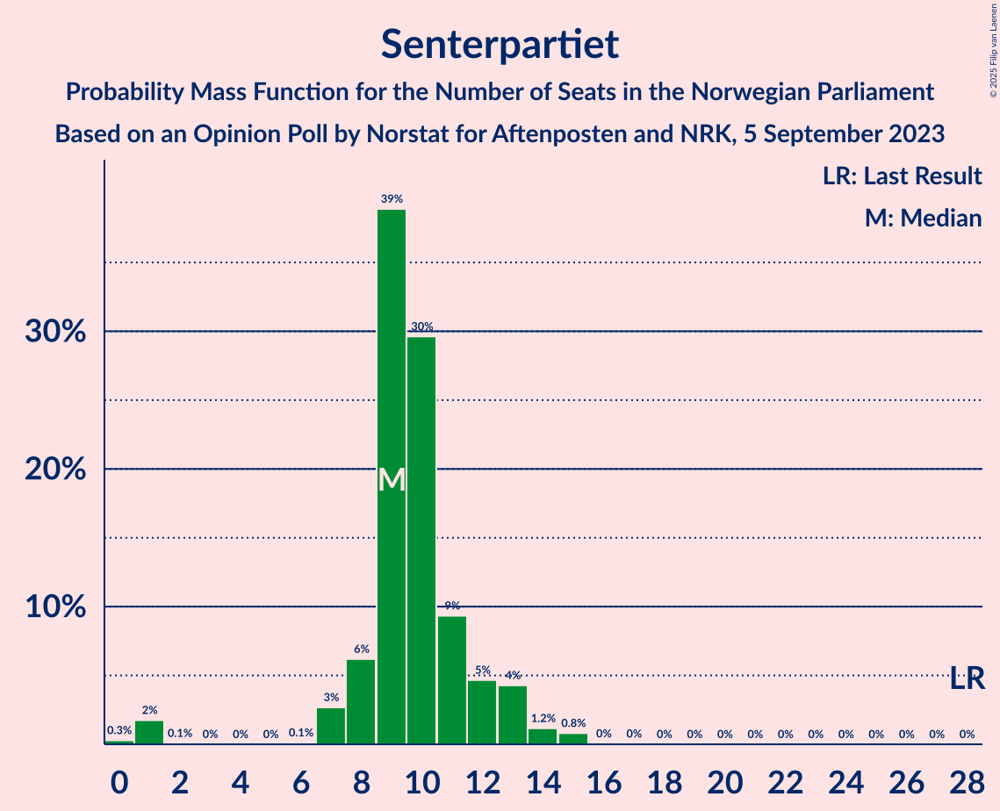
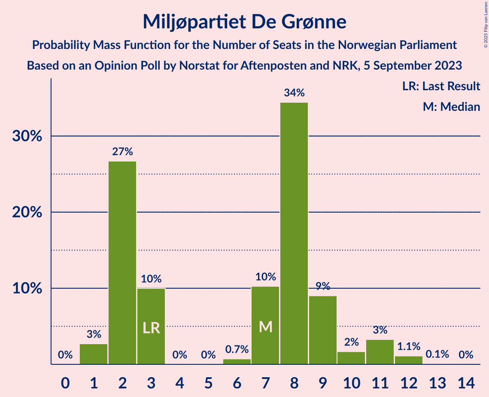
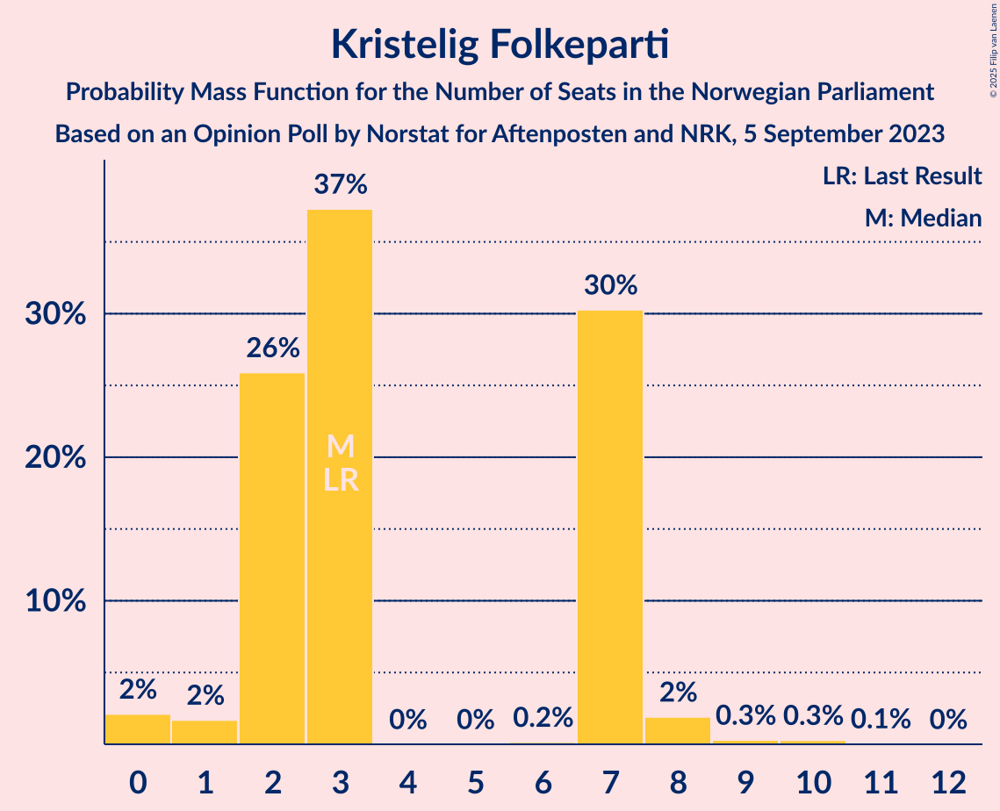
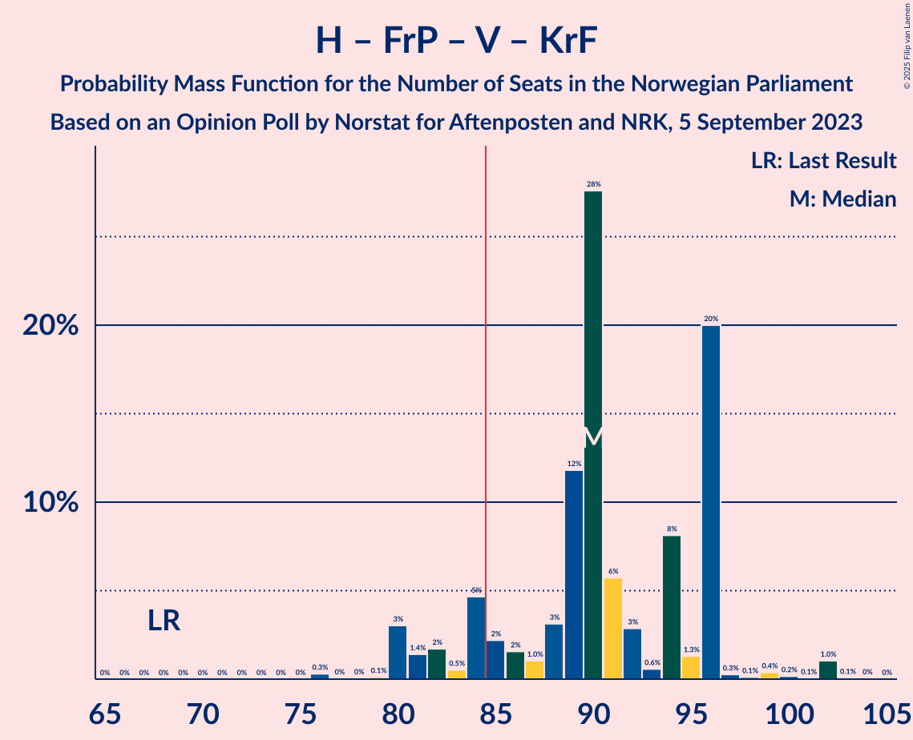

# Opinion Poll by Norstat for Aftenposten and NRK, 5 September 2023

<a href="#voting-intentions">Voting Intentions</a> | <a href="#seats">Seats</a> | <a href="#coalitions">Coalitions</a> | <a href="#technical-information">Technical Information</a>

## Voting Intentions

### Confidence Intervals

| Party | Last Result | Poll Result | 80% Confidence Interval | 90% Confidence Interval | 95% Confidence Interval | 99% Confidence Interval |
|:-----:|:-----------:|:-----------:|:-----------------------:|:-----------------------:|:-----------------------:|:-----------------------:|
| Høyre | 20.4% | 29.2% | 26.9–31.7% |26.2–32.4% |25.7–33.0% |24.6–34.2% |
| Arbeiderpartiet | 26.2% | 18.4% | 16.5–20.6% |15.9–21.2% |15.5–21.7% |14.6–22.8% |
| Fremskrittspartiet | 11.6% | 14.2% | 12.5–16.2% |12.0–16.7% |11.6–17.2% |10.8–18.2% |
| Sosialistisk Venstreparti | 7.6% | 9.3% | 7.9–11.0% |7.5–11.5% |7.2–11.9% |6.6–12.8% |
| Rødt | 4.7% | 5.7% | 4.7–7.1% |4.4–7.6% |4.1–7.9% |3.7–8.6% |
| Senterpartiet | 13.5% | 5.6% | 4.5–7.0% |4.2–7.4% |4.0–7.7% |3.5–8.4% |
| Venstre | 4.6% | 5.1% | 4.1–6.4% |3.8–6.8% |3.6–7.1% |3.1–7.8% |
| Miljøpartiet De Grønne | 3.9% | 4.4% | 3.5–5.7% |3.2–6.0% |3.0–6.4% |2.6–7.0% |
| Kristelig Folkeparti | 3.8% | 3.2% | 2.5–4.3% |2.2–4.7% |2.1–5.0% |1.8–5.6% |
| Industri- og Næringspartiet | 0.3% | 1.9% | 1.3–2.8% |1.2–3.0% |1.0–3.3% |0.8–3.8% |
| Pensjonistpartiet | 0.6% | 1.3% | 0.9–2.2% |0.8–2.4% |0.7–2.6% |0.5–3.1% |
| Konservativt | 0.4% | 0.7% | 0.4–1.3% |0.3–1.5% |0.3–1.7% |0.2–2.1% |

*Note:* The poll result column reflects the actual value used in the calculations. Published results may vary slightly, and in addition be rounded to fewer digits.

## Seats

### Confidence Intervals

| Party | Last Result | Median | 80% Confidence Interval | 90% Confidence Interval | 95% Confidence Interval | 99% Confidence Interval |
|:-----:|:-----------:|:------:|:-----------------------:|:-----------------------:|:-----------------------:|:-----------------------:|
| <a href="#høyre">Høyre</a> | 36 | 51 | 47–55 |47–60 |46–61 |43–61 |
| <a href="#arbeiderpartiet">Arbeiderpartiet</a> | 48 | 36 | 34–38 |32–41 |31–41 |28–44 |
| <a href="#fremskrittspartiet">Fremskrittspartiet</a> | 21 | 24 | 23–34 |22–34 |21–34 |20–34 |
| <a href="#sosialistisk-venstreparti">Sosialistisk Venstreparti</a> | 13 | 16 | 14–18 |14–19 |13–20 |11–22 |
| <a href="#rødt">Rødt</a> | 8 | 10 | 8–11 |8–13 |7–13 |1–14 |
| <a href="#senterpartiet">Senterpartiet</a> | 28 | 9 | 8–12 |8–13 |7–13 |1–15 |
| <a href="#venstre">Venstre</a> | 8 | 8 | 3–12 |3–12 |3–12 |2–13 |
| <a href="#miljøpartiet-de-grønne">Miljøpartiet De Grønne</a> | 3 | 7 | 2–9 |2–10 |1–11 |1–12 |
| <a href="#kristelig-folkeparti">Kristelig Folkeparti</a> | 3 | 3 | 2–7 |2–7 |1–8 |0–9 |
| <a href="#industri--og-næringspartiet">Industri- og Næringspartiet</a> | 0 | 0 | 0–1 |0–2 |0–2 |0–3 |
| <a href="#pensjonistpartiet">Pensjonistpartiet</a> | 0 | 0 | 0 |0 |0–1 |0–1 |
| <a href="#konservativt">Konservativt</a> | 0 | 0 | 0 |0 |0 |0 |

### Høyre

*For a full overview of the results for this party, see the [Høyre](party-høyre.html) page.*

| Number of Seats | Probability | Accumulated | Special Marks |
|:---------------:|:-----------:|:-----------:|:-------------:|
| 36 | 0% | 100% | Last Result |
| 37 | 0% | 100% |  |
| 38 | 0% | 100% |  |
| 39 | 0% | 100% |  |
| 40 | 0% | 100% |  |
| 41 | 0.1% | 100% |  |
| 42 | 0.1% | 99.9% |  |
| 43 | 0.4% | 99.8% |  |
| 44 | 0.2% | 99.5% |  |
| 45 | 1.0% | 99.3% |  |
| 46 | 3% | 98% |  |
| 47 | 5% | 95% |  |
| 48 | 4% | 90% |  |
| 49 | 10% | 86% |  |
| 50 | 2% | 76% |  |
| 51 | 25% | 75% | Median |
| 52 | 30% | 49% |  |
| 53 | 2% | 19% |  |
| 54 | 1.0% | 18% |  |
| 55 | 8% | 17% |  |
| 56 | 0.4% | 9% |  |
| 57 | 1.5% | 8% |  |
| 58 | 0.2% | 7% |  |
| 59 | 0.5% | 6% |  |
| 60 | 1.1% | 6% |  |
| 61 | 4% | 5% |  |
| 62 | 0.1% | 0.4% |  |
| 63 | 0.2% | 0.3% |  |
| 64 | 0% | 0.1% |  |
| 65 | 0.1% | 0.1% |  |
| 66 | 0% | 0% |  |

### Arbeiderpartiet

*For a full overview of the results for this party, see the [Arbeiderpartiet](party-arbeiderpartiet.html) page.*

| Number of Seats | Probability | Accumulated | Special Marks |
|:---------------:|:-----------:|:-----------:|:-------------:|
| 27 | 0.1% | 100% |  |
| 28 | 0.5% | 99.9% |  |
| 29 | 0.2% | 99.4% |  |
| 30 | 1.3% | 99.2% |  |
| 31 | 1.2% | 98% |  |
| 32 | 3% | 97% |  |
| 33 | 2% | 94% |  |
| 34 | 34% | 91% |  |
| 35 | 6% | 57% |  |
| 36 | 3% | 51% | Median |
| 37 | 30% | 48% |  |
| 38 | 9% | 18% |  |
| 39 | 2% | 9% |  |
| 40 | 0.6% | 7% |  |
| 41 | 4% | 7% |  |
| 42 | 1.5% | 2% |  |
| 43 | 0.2% | 0.7% |  |
| 44 | 0.1% | 0.5% |  |
| 45 | 0% | 0.4% |  |
| 46 | 0.3% | 0.4% |  |
| 47 | 0% | 0.1% |  |
| 48 | 0% | 0% | Last Result |

### Fremskrittspartiet

*For a full overview of the results for this party, see the [Fremskrittspartiet](party-fremskrittspartiet.html) page.*

| Number of Seats | Probability | Accumulated | Special Marks |
|:---------------:|:-----------:|:-----------:|:-------------:|
| 17 | 0.1% | 100% |  |
| 18 | 0.2% | 99.9% |  |
| 19 | 0.2% | 99.8% |  |
| 20 | 1.4% | 99.6% |  |
| 21 | 1.1% | 98% | Last Result |
| 22 | 4% | 97% |  |
| 23 | 30% | 93% |  |
| 24 | 16% | 64% | Median |
| 25 | 2% | 48% |  |
| 26 | 7% | 46% |  |
| 27 | 1.1% | 39% |  |
| 28 | 2% | 38% |  |
| 29 | 2% | 36% |  |
| 30 | 11% | 34% |  |
| 31 | 1.0% | 23% |  |
| 32 | 1.4% | 21% |  |
| 33 | 0.2% | 20% |  |
| 34 | 20% | 20% |  |
| 35 | 0.1% | 0.3% |  |
| 36 | 0% | 0.3% |  |
| 37 | 0.1% | 0.2% |  |
| 38 | 0% | 0.1% |  |
| 39 | 0% | 0.1% |  |
| 40 | 0% | 0.1% |  |
| 41 | 0.1% | 0.1% |  |
| 42 | 0% | 0% |  |

### Sosialistisk Venstreparti

*For a full overview of the results for this party, see the [Sosialistisk Venstreparti](party-sosialistiskvenstreparti.html) page.*

| Number of Seats | Probability | Accumulated | Special Marks |
|:---------------:|:-----------:|:-----------:|:-------------:|
| 10 | 0.1% | 100% |  |
| 11 | 0.5% | 99.9% |  |
| 12 | 1.1% | 99.3% |  |
| 13 | 2% | 98% | Last Result |
| 14 | 11% | 96% |  |
| 15 | 12% | 85% |  |
| 16 | 53% | 73% | Median |
| 17 | 2% | 20% |  |
| 18 | 8% | 18% |  |
| 19 | 6% | 9% |  |
| 20 | 1.4% | 4% |  |
| 21 | 2% | 2% |  |
| 22 | 0.3% | 0.6% |  |
| 23 | 0.3% | 0.4% |  |
| 24 | 0.1% | 0.1% |  |
| 25 | 0% | 0% |  |

### Rødt

*For a full overview of the results for this party, see the [Rødt](party-rødt.html) page.*

| Number of Seats | Probability | Accumulated | Special Marks |
|:---------------:|:-----------:|:-----------:|:-------------:|
| 1 | 0.9% | 100% |  |
| 2 | 0% | 99.1% |  |
| 3 | 0% | 99.1% |  |
| 4 | 0% | 99.1% |  |
| 5 | 0% | 99.1% |  |
| 6 | 0.1% | 99.1% |  |
| 7 | 3% | 98.9% |  |
| 8 | 22% | 95% | Last Result |
| 9 | 5% | 74% |  |
| 10 | 41% | 69% | Median |
| 11 | 19% | 28% |  |
| 12 | 4% | 10% |  |
| 13 | 4% | 5% |  |
| 14 | 0.7% | 1.1% |  |
| 15 | 0.3% | 0.5% |  |
| 16 | 0.1% | 0.2% |  |
| 17 | 0.1% | 0.1% |  |
| 18 | 0% | 0% |  |

### Senterpartiet

*For a full overview of the results for this party, see the [Senterpartiet](party-senterpartiet.html) page.*

| Number of Seats | Probability | Accumulated | Special Marks |
|:---------------:|:-----------:|:-----------:|:-------------:|
| 0 | 0.3% | 100% |  |
| 1 | 2% | 99.7% |  |
| 2 | 0.1% | 98% |  |
| 3 | 0% | 98% |  |
| 4 | 0% | 98% |  |
| 5 | 0% | 98% |  |
| 6 | 0.1% | 98% |  |
| 7 | 3% | 98% |  |
| 8 | 6% | 95% |  |
| 9 | 39% | 89% | Median |
| 10 | 30% | 50% |  |
| 11 | 9% | 20% |  |
| 12 | 5% | 11% |  |
| 13 | 4% | 6% |  |
| 14 | 1.2% | 2% |  |
| 15 | 0.8% | 0.9% |  |
| 16 | 0% | 0.1% |  |
| 17 | 0% | 0% |  |
| 18 | 0% | 0% |  |
| 19 | 0% | 0% |  |
| 20 | 0% | 0% |  |
| 21 | 0% | 0% |  |
| 22 | 0% | 0% |  |
| 23 | 0% | 0% |  |
| 24 | 0% | 0% |  |
| 25 | 0% | 0% |  |
| 26 | 0% | 0% |  |
| 27 | 0% | 0% |  |
| 28 | 0% | 0% | Last Result |

### Venstre

*For a full overview of the results for this party, see the [Venstre](party-venstre.html) page.*

| Number of Seats | Probability | Accumulated | Special Marks |
|:---------------:|:-----------:|:-----------:|:-------------:|
| 2 | 2% | 100% |  |
| 3 | 9% | 98% |  |
| 4 | 0% | 89% |  |
| 5 | 0% | 89% |  |
| 6 | 0.1% | 89% |  |
| 7 | 2% | 89% |  |
| 8 | 57% | 87% | Last Result, Median |
| 9 | 8% | 30% |  |
| 10 | 7% | 22% |  |
| 11 | 4% | 15% |  |
| 12 | 10% | 11% |  |
| 13 | 0.8% | 1.0% |  |
| 14 | 0.1% | 0.2% |  |
| 15 | 0.1% | 0.1% |  |
| 16 | 0% | 0% |  |

### Miljøpartiet De Grønne

*For a full overview of the results for this party, see the [Miljøpartiet De Grønne](party-miljøpartietdegrønne.html) page.*

| Number of Seats | Probability | Accumulated | Special Marks |
|:---------------:|:-----------:|:-----------:|:-------------:|
| 1 | 3% | 100% |  |
| 2 | 27% | 97% |  |
| 3 | 10% | 71% | Last Result |
| 4 | 0% | 61% |  |
| 5 | 0% | 61% |  |
| 6 | 0.7% | 61% |  |
| 7 | 10% | 60% | Median |
| 8 | 34% | 50% |  |
| 9 | 9% | 15% |  |
| 10 | 2% | 6% |  |
| 11 | 3% | 4% |  |
| 12 | 1.1% | 1.2% |  |
| 13 | 0.1% | 0.1% |  |
| 14 | 0% | 0% |  |

### Kristelig Folkeparti

*For a full overview of the results for this party, see the [Kristelig Folkeparti](party-kristeligfolkeparti.html) page.*

| Number of Seats | Probability | Accumulated | Special Marks |
|:---------------:|:-----------:|:-----------:|:-------------:|
| 0 | 2% | 100% |  |
| 1 | 2% | 98% |  |
| 2 | 26% | 96% |  |
| 3 | 37% | 70% | Last Result, Median |
| 4 | 0% | 33% |  |
| 5 | 0% | 33% |  |
| 6 | 0.2% | 33% |  |
| 7 | 30% | 33% |  |
| 8 | 2% | 3% |  |
| 9 | 0.3% | 0.6% |  |
| 10 | 0.3% | 0.3% |  |
| 11 | 0.1% | 0.1% |  |
| 12 | 0% | 0% |  |

### Industri- og Næringspartiet

*For a full overview of the results for this party, see the [Industri- og Næringspartiet](party-industri-ognæringspartiet.html) page.*

| Number of Seats | Probability | Accumulated | Special Marks |
|:---------------:|:-----------:|:-----------:|:-------------:|
| 0 | 89% | 100% | Last Result, Median |
| 1 | 0.8% | 11% |  |
| 2 | 8% | 10% |  |
| 3 | 1.5% | 2% |  |
| 4 | 0% | 0.1% |  |
| 5 | 0% | 0.1% |  |
| 6 | 0% | 0.1% |  |
| 7 | 0.1% | 0.1% |  |
| 8 | 0% | 0% |  |

### Pensjonistpartiet

*For a full overview of the results for this party, see the [Pensjonistpartiet](party-pensjonistpartiet.html) page.*

| Number of Seats | Probability | Accumulated | Special Marks |
|:---------------:|:-----------:|:-----------:|:-------------:|
| 0 | 95% | 100% | Last Result, Median |
| 1 | 5% | 5% |  |
| 2 | 0% | 0.1% |  |
| 3 | 0% | 0.1% |  |
| 4 | 0.1% | 0.1% |  |
| 5 | 0% | 0% |  |

### Konservativt

*For a full overview of the results for this party, see the [Konservativt](party-konservativt.html) page.*

| Number of Seats | Probability | Accumulated | Special Marks |
|:---------------:|:-----------:|:-----------:|:-------------:|
| 0 | 100% | 100% | Last Result, Median |

## Coalitions

### Confidence Intervals

| Coalition | Last Result | Median | Majority? | 80% Confidence Interval | 90% Confidence Interval | 95% Confidence Interval | 99% Confidence Interval |
|:---------:|:-----------:|:------:|:---------:|:-----------------------:|:-----------------------:|:-----------------------:|:-----------------------:|
| Høyre – Fremskrittspartiet – Senterpartiet – Venstre – Kristelig Folkeparti | 96 | 100 | 99.6% | 94–105 | 92–105 | 90–106 | 88–111 |
| Høyre – Fremskrittspartiet – Venstre – Miljøpartiet De Grønne – Kristelig Folkeparti | 71 | 98 | 99.9% | 92–98 | 89–101 | 89–103 | 87–107 |
| Høyre – Fremskrittspartiet – Venstre – Kristelig Folkeparti | 68 | 90 | 88% | 84–96 | 82–96 | 80–96 | 79–102 |
| Høyre – Fremskrittspartiet – Venstre | 65 | 87 | 55% | 81–93 | 79–93 | 78–93 | 76–99 |
| Arbeiderpartiet – Sosialistisk Venstreparti – Rødt – Senterpartiet – Miljøpartiet De Grønne | 100 | 78 | 5% | 72–83 | 72–84 | 71–88 | 66–88 |
| Høyre – Fremskrittspartiet | 57 | 77 | 27% | 73–85 | 72–85 | 70–85 | 68–88 |
| Arbeiderpartiet – Sosialistisk Venstreparti – Rødt – Senterpartiet | 97 | 70 | 0% | 70–76 | 67–77 | 65–79 | 61–81 |
| Arbeiderpartiet – Sosialistisk Venstreparti – Senterpartiet – Miljøpartiet De Grønne – Kristelig Folkeparti | 95 | 71 | 0.1% | 67–76 | 66–78 | 64–79 | 60–83 |
| Arbeiderpartiet – Sosialistisk Venstreparti – Senterpartiet – Miljøpartiet De Grønne | 92 | 68 | 0% | 64–72 | 63–74 | 61–77 | 57–78 |
| Arbeiderpartiet – Sosialistisk Venstreparti – Rødt – Miljøpartiet De Grønne | 72 | 68 | 0.4% | 63–73 | 63–76 | 62–76 | 57–80 |
| Høyre – Venstre – Kristelig Folkeparti | 47 | 63 | 0% | 58–69 | 56–70 | 56–70 | 53–76 |
| Arbeiderpartiet – Sosialistisk Venstreparti – Senterpartiet | 89 | 61 | 0% | 60–65 | 56–67 | 56–68 | 52–71 |
| Arbeiderpartiet – Senterpartiet – Miljøpartiet De Grønne – Kristelig Folkeparti | 82 | 55 | 0% | 51–59 | 50–61 | 47–61 | 45–67 |
| Arbeiderpartiet – Sosialistisk Venstreparti | 61 | 52 | 0% | 50–56 | 49–56 | 47–57 | 43–63 |
| Arbeiderpartiet – Senterpartiet – Kristelig Folkeparti | 79 | 50 | 0% | 45–51 | 43–54 | 41–55 | 39–57 |
| Arbeiderpartiet – Senterpartiet | 76 | 46 | 0% | 43–49 | 41–49 | 40–52 | 36–54 |
| Senterpartiet – Venstre – Kristelig Folkeparti | 39 | 22 | 0% | 17–25 | 17–26 | 14–28 | 5–30 |

### Høyre – Fremskrittspartiet – Senterpartiet – Venstre – Kristelig Folkeparti

| Number of Seats | Probability | Accumulated | Special Marks |
|:---------------:|:-----------:|:-----------:|:-------------:|
| 82 | 0.2% | 100% |  |
| 83 | 0.3% | 99.8% |  |
| 84 | 0% | 99.6% |  |
| 85 | 0% | 99.6% | Majority |
| 86 | 0% | 99.5% |  |
| 87 | 0% | 99.5% |  |
| 88 | 0.2% | 99.5% |  |
| 89 | 0.3% | 99.3% |  |
| 90 | 2% | 99.0% |  |
| 91 | 0.1% | 97% |  |
| 92 | 4% | 97% |  |
| 93 | 3% | 93% |  |
| 94 | 2% | 90% |  |
| 95 | 3% | 88% | Median |
| 96 | 1.1% | 86% | Last Result |
| 97 | 4% | 84% |  |
| 98 | 7% | 80% |  |
| 99 | 5% | 73% |  |
| 100 | 28% | 68% |  |
| 101 | 0.7% | 40% |  |
| 102 | 6% | 39% |  |
| 103 | 9% | 33% |  |
| 104 | 1.5% | 24% |  |
| 105 | 20% | 22% |  |
| 106 | 0.8% | 3% |  |
| 107 | 0.3% | 2% |  |
| 108 | 0.2% | 2% |  |
| 109 | 0.2% | 1.5% |  |
| 110 | 0.7% | 1.3% |  |
| 111 | 0.1% | 0.6% |  |
| 112 | 0% | 0.4% |  |
| 113 | 0.3% | 0.4% |  |
| 114 | 0.1% | 0.1% |  |
| 115 | 0% | 0% |  |

### Høyre – Fremskrittspartiet – Venstre – Miljøpartiet De Grønne – Kristelig Folkeparti

| Number of Seats | Probability | Accumulated | Special Marks |
|:---------------:|:-----------:|:-----------:|:-------------:|
| 71 | 0% | 100% | Last Result |
| 72 | 0% | 100% |  |
| 73 | 0% | 100% |  |
| 74 | 0% | 100% |  |
| 75 | 0% | 100% |  |
| 76 | 0% | 100% |  |
| 77 | 0% | 100% |  |
| 78 | 0% | 100% |  |
| 79 | 0% | 100% |  |
| 80 | 0% | 100% |  |
| 81 | 0% | 100% |  |
| 82 | 0.1% | 100% |  |
| 83 | 0% | 99.9% |  |
| 84 | 0% | 99.9% |  |
| 85 | 0% | 99.9% | Majority |
| 86 | 0.1% | 99.8% |  |
| 87 | 0.8% | 99.7% |  |
| 88 | 0.2% | 99.0% |  |
| 89 | 4% | 98.8% |  |
| 90 | 1.4% | 95% |  |
| 91 | 3% | 93% |  |
| 92 | 2% | 90% |  |
| 93 | 9% | 88% | Median |
| 94 | 2% | 79% |  |
| 95 | 3% | 77% |  |
| 96 | 7% | 74% |  |
| 97 | 11% | 67% |  |
| 98 | 47% | 56% |  |
| 99 | 2% | 9% |  |
| 100 | 1.3% | 7% |  |
| 101 | 2% | 5% |  |
| 102 | 0.3% | 3% |  |
| 103 | 1.2% | 3% |  |
| 104 | 0.6% | 2% |  |
| 105 | 0.2% | 1.0% |  |
| 106 | 0.3% | 0.8% |  |
| 107 | 0.2% | 0.5% |  |
| 108 | 0.2% | 0.3% |  |
| 109 | 0% | 0.1% |  |
| 110 | 0% | 0.1% |  |
| 111 | 0% | 0.1% |  |
| 112 | 0% | 0% |  |

### Høyre – Fremskrittspartiet – Venstre – Kristelig Folkeparti

| Number of Seats | Probability | Accumulated | Special Marks |
|:---------------:|:-----------:|:-----------:|:-------------:|
| 68 | 0% | 100% | Last Result |
| 69 | 0% | 100% |  |
| 70 | 0% | 100% |  |
| 71 | 0% | 100% |  |
| 72 | 0% | 100% |  |
| 73 | 0% | 100% |  |
| 74 | 0% | 100% |  |
| 75 | 0% | 100% |  |
| 76 | 0.3% | 100% |  |
| 77 | 0% | 99.7% |  |
| 78 | 0% | 99.6% |  |
| 79 | 0.1% | 99.6% |  |
| 80 | 3% | 99.5% |  |
| 81 | 1.4% | 96% |  |
| 82 | 2% | 95% |  |
| 83 | 0.5% | 93% |  |
| 84 | 5% | 93% |  |
| 85 | 2% | 88% | Majority |
| 86 | 2% | 86% | Median |
| 87 | 1.0% | 84% |  |
| 88 | 3% | 83% |  |
| 89 | 12% | 80% |  |
| 90 | 28% | 68% |  |
| 91 | 6% | 41% |  |
| 92 | 3% | 35% |  |
| 93 | 0.6% | 32% |  |
| 94 | 8% | 32% |  |
| 95 | 1.3% | 23% |  |
| 96 | 20% | 22% |  |
| 97 | 0.3% | 2% |  |
| 98 | 0.1% | 2% |  |
| 99 | 0.4% | 2% |  |
| 100 | 0.2% | 1.4% |  |
| 101 | 0.1% | 1.2% |  |
| 102 | 1.0% | 1.2% |  |
| 103 | 0.1% | 0.1% |  |
| 104 | 0% | 0.1% |  |
| 105 | 0% | 0% |  |

### Høyre – Fremskrittspartiet – Venstre

| Number of Seats | Probability | Accumulated | Special Marks |
|:---------------:|:-----------:|:-----------:|:-------------:|
| 65 | 0% | 100% | Last Result |
| 66 | 0% | 100% |  |
| 67 | 0% | 100% |  |
| 68 | 0% | 100% |  |
| 69 | 0% | 100% |  |
| 70 | 0% | 100% |  |
| 71 | 0% | 100% |  |
| 72 | 0% | 100% |  |
| 73 | 0% | 100% |  |
| 74 | 0.3% | 99.9% |  |
| 75 | 0.1% | 99.6% |  |
| 76 | 0.2% | 99.5% |  |
| 77 | 0.2% | 99.3% |  |
| 78 | 3% | 99.1% |  |
| 79 | 2% | 96% |  |
| 80 | 0.8% | 94% |  |
| 81 | 4% | 93% |  |
| 82 | 4% | 89% |  |
| 83 | 29% | 85% | Median |
| 84 | 0.9% | 56% |  |
| 85 | 2% | 55% | Majority |
| 86 | 3% | 53% |  |
| 87 | 10% | 51% |  |
| 88 | 5% | 40% |  |
| 89 | 2% | 35% |  |
| 90 | 2% | 33% |  |
| 91 | 8% | 31% |  |
| 92 | 0.4% | 23% |  |
| 93 | 20% | 22% |  |
| 94 | 0.2% | 2% |  |
| 95 | 0.9% | 2% |  |
| 96 | 0.1% | 0.9% |  |
| 97 | 0.2% | 0.8% |  |
| 98 | 0% | 0.6% |  |
| 99 | 0.1% | 0.5% |  |
| 100 | 0.3% | 0.5% |  |
| 101 | 0.1% | 0.1% |  |
| 102 | 0% | 0.1% |  |
| 103 | 0% | 0.1% |  |
| 104 | 0% | 0% |  |

### Arbeiderpartiet – Sosialistisk Venstreparti – Rødt – Senterpartiet – Miljøpartiet De Grønne

| Number of Seats | Probability | Accumulated | Special Marks |
|:---------------:|:-----------:|:-----------:|:-------------:|
| 64 | 0% | 100% |  |
| 65 | 0.1% | 99.9% |  |
| 66 | 1.1% | 99.8% |  |
| 67 | 0.1% | 98.8% |  |
| 68 | 0.2% | 98.7% |  |
| 69 | 0.5% | 98.5% |  |
| 70 | 0.2% | 98% |  |
| 71 | 0.4% | 98% |  |
| 72 | 20% | 97% |  |
| 73 | 1.4% | 77% |  |
| 74 | 10% | 76% |  |
| 75 | 0.9% | 66% |  |
| 76 | 0.8% | 65% |  |
| 77 | 6% | 65% |  |
| 78 | 31% | 59% | Median |
| 79 | 10% | 28% |  |
| 80 | 2% | 18% |  |
| 81 | 2% | 16% |  |
| 82 | 3% | 14% |  |
| 83 | 2% | 11% |  |
| 84 | 4% | 9% |  |
| 85 | 0.6% | 5% | Majority |
| 86 | 0.7% | 4% |  |
| 87 | 0.3% | 4% |  |
| 88 | 3% | 3% |  |
| 89 | 0.1% | 0.4% |  |
| 90 | 0% | 0.4% |  |
| 91 | 0.1% | 0.3% |  |
| 92 | 0.3% | 0.3% |  |
| 93 | 0% | 0% |  |
| 94 | 0% | 0% |  |
| 95 | 0% | 0% |  |
| 96 | 0% | 0% |  |
| 97 | 0% | 0% |  |
| 98 | 0% | 0% |  |
| 99 | 0% | 0% |  |
| 100 | 0% | 0% | Last Result |

### Høyre – Fremskrittspartiet

| Number of Seats | Probability | Accumulated | Special Marks |
|:---------------:|:-----------:|:-----------:|:-------------:|
| 57 | 0% | 100% | Last Result |
| 58 | 0% | 100% |  |
| 59 | 0% | 100% |  |
| 60 | 0% | 100% |  |
| 61 | 0% | 100% |  |
| 62 | 0% | 100% |  |
| 63 | 0% | 100% |  |
| 64 | 0% | 100% |  |
| 65 | 0% | 100% |  |
| 66 | 0.1% | 99.9% |  |
| 67 | 0.2% | 99.9% |  |
| 68 | 0.2% | 99.6% |  |
| 69 | 0.3% | 99.4% |  |
| 70 | 2% | 99.1% |  |
| 71 | 2% | 97% |  |
| 72 | 3% | 95% |  |
| 73 | 4% | 92% |  |
| 74 | 0.7% | 88% |  |
| 75 | 31% | 87% | Median |
| 76 | 2% | 57% |  |
| 77 | 6% | 55% |  |
| 78 | 3% | 49% |  |
| 79 | 15% | 46% |  |
| 80 | 2% | 31% |  |
| 81 | 1.5% | 30% |  |
| 82 | 0.8% | 28% |  |
| 83 | 0.4% | 27% |  |
| 84 | 0.4% | 27% |  |
| 85 | 24% | 27% | Majority |
| 86 | 1.1% | 2% |  |
| 87 | 0.3% | 1.1% |  |
| 88 | 0.4% | 0.7% |  |
| 89 | 0.1% | 0.4% |  |
| 90 | 0% | 0.3% |  |
| 91 | 0% | 0.2% |  |
| 92 | 0.1% | 0.2% |  |
| 93 | 0.1% | 0.1% |  |
| 94 | 0% | 0% |  |

### Arbeiderpartiet – Sosialistisk Venstreparti – Rødt – Senterpartiet

| Number of Seats | Probability | Accumulated | Special Marks |
|:---------------:|:-----------:|:-----------:|:-------------:|
| 57 | 0% | 100% |  |
| 58 | 0% | 99.9% |  |
| 59 | 0.1% | 99.9% |  |
| 60 | 0.3% | 99.8% |  |
| 61 | 0.2% | 99.6% |  |
| 62 | 0.3% | 99.4% |  |
| 63 | 0.3% | 99.1% |  |
| 64 | 0.6% | 98.8% |  |
| 65 | 1.2% | 98% |  |
| 66 | 1.2% | 97% |  |
| 67 | 4% | 96% |  |
| 68 | 1.2% | 92% |  |
| 69 | 0.3% | 91% |  |
| 70 | 47% | 91% |  |
| 71 | 13% | 44% | Median |
| 72 | 6% | 31% |  |
| 73 | 6% | 25% |  |
| 74 | 2% | 19% |  |
| 75 | 7% | 17% |  |
| 76 | 3% | 10% |  |
| 77 | 2% | 7% |  |
| 78 | 0.7% | 4% |  |
| 79 | 3% | 4% |  |
| 80 | 0.1% | 0.9% |  |
| 81 | 0.6% | 0.7% |  |
| 82 | 0% | 0.2% |  |
| 83 | 0% | 0.1% |  |
| 84 | 0.1% | 0.1% |  |
| 85 | 0% | 0% | Majority |
| 86 | 0% | 0% |  |
| 87 | 0% | 0% |  |
| 88 | 0% | 0% |  |
| 89 | 0% | 0% |  |
| 90 | 0% | 0% |  |
| 91 | 0% | 0% |  |
| 92 | 0% | 0% |  |
| 93 | 0% | 0% |  |
| 94 | 0% | 0% |  |
| 95 | 0% | 0% |  |
| 96 | 0% | 0% |  |
| 97 | 0% | 0% | Last Result |

### Arbeiderpartiet – Sosialistisk Venstreparti – Senterpartiet – Miljøpartiet De Grønne – Kristelig Folkeparti

| Number of Seats | Probability | Accumulated | Special Marks |
|:---------------:|:-----------:|:-----------:|:-------------:|
| 56 | 0.1% | 100% |  |
| 57 | 0% | 99.9% |  |
| 58 | 0.3% | 99.9% |  |
| 59 | 0% | 99.6% |  |
| 60 | 0.2% | 99.6% |  |
| 61 | 0.1% | 99.3% |  |
| 62 | 0.2% | 99.2% |  |
| 63 | 0.3% | 99.0% |  |
| 64 | 1.3% | 98.7% |  |
| 65 | 2% | 97% |  |
| 66 | 0.9% | 96% |  |
| 67 | 27% | 95% |  |
| 68 | 2% | 67% |  |
| 69 | 5% | 65% |  |
| 70 | 10% | 60% |  |
| 71 | 1.0% | 51% | Median |
| 72 | 4% | 50% |  |
| 73 | 3% | 45% |  |
| 74 | 4% | 43% |  |
| 75 | 28% | 38% |  |
| 76 | 2% | 10% |  |
| 77 | 3% | 8% |  |
| 78 | 0.5% | 5% |  |
| 79 | 3% | 5% |  |
| 80 | 0.4% | 1.2% |  |
| 81 | 0.1% | 0.8% |  |
| 82 | 0.1% | 0.7% |  |
| 83 | 0.2% | 0.6% |  |
| 84 | 0.3% | 0.4% |  |
| 85 | 0.1% | 0.1% | Majority |
| 86 | 0% | 0.1% |  |
| 87 | 0% | 0% |  |
| 88 | 0% | 0% |  |
| 89 | 0% | 0% |  |
| 90 | 0% | 0% |  |
| 91 | 0% | 0% |  |
| 92 | 0% | 0% |  |
| 93 | 0% | 0% |  |
| 94 | 0% | 0% |  |
| 95 | 0% | 0% | Last Result |

### Arbeiderpartiet – Sosialistisk Venstreparti – Senterpartiet – Miljøpartiet De Grønne

| Number of Seats | Probability | Accumulated | Special Marks |
|:---------------:|:-----------:|:-----------:|:-------------:|
| 54 | 0% | 100% |  |
| 55 | 0% | 99.9% |  |
| 56 | 0.3% | 99.9% |  |
| 57 | 0.7% | 99.5% |  |
| 58 | 0% | 98.8% |  |
| 59 | 0.3% | 98.8% |  |
| 60 | 0.6% | 98% |  |
| 61 | 0.7% | 98% |  |
| 62 | 0.5% | 97% |  |
| 63 | 2% | 97% |  |
| 64 | 28% | 95% |  |
| 65 | 0.8% | 67% |  |
| 66 | 7% | 66% |  |
| 67 | 0.8% | 58% |  |
| 68 | 36% | 58% | Median |
| 69 | 0.4% | 22% |  |
| 70 | 7% | 21% |  |
| 71 | 2% | 15% |  |
| 72 | 4% | 13% |  |
| 73 | 1.2% | 9% |  |
| 74 | 3% | 8% |  |
| 75 | 0.3% | 5% |  |
| 76 | 0.4% | 4% |  |
| 77 | 3% | 4% |  |
| 78 | 0.2% | 0.7% |  |
| 79 | 0.1% | 0.5% |  |
| 80 | 0% | 0.4% |  |
| 81 | 0% | 0.4% |  |
| 82 | 0.3% | 0.3% |  |
| 83 | 0% | 0% |  |
| 84 | 0% | 0% |  |
| 85 | 0% | 0% | Majority |
| 86 | 0% | 0% |  |
| 87 | 0% | 0% |  |
| 88 | 0% | 0% |  |
| 89 | 0% | 0% |  |
| 90 | 0% | 0% |  |
| 91 | 0% | 0% |  |
| 92 | 0% | 0% | Last Result |

### Arbeiderpartiet – Sosialistisk Venstreparti – Rødt – Miljøpartiet De Grønne

| Number of Seats | Probability | Accumulated | Special Marks |
|:---------------:|:-----------:|:-----------:|:-------------:|
| 54 | 0.1% | 100% |  |
| 55 | 0.3% | 99.9% |  |
| 56 | 0% | 99.6% |  |
| 57 | 0.1% | 99.6% |  |
| 58 | 0.8% | 99.4% |  |
| 59 | 0.2% | 98.7% |  |
| 60 | 0.2% | 98% |  |
| 61 | 0.3% | 98% |  |
| 62 | 1.2% | 98% |  |
| 63 | 20% | 97% |  |
| 64 | 1.3% | 77% |  |
| 65 | 10% | 76% |  |
| 66 | 5% | 65% |  |
| 67 | 4% | 60% |  |
| 68 | 29% | 57% |  |
| 69 | 2% | 28% | Median |
| 70 | 7% | 26% |  |
| 71 | 5% | 19% |  |
| 72 | 2% | 14% | Last Result |
| 73 | 5% | 12% |  |
| 74 | 0.4% | 7% |  |
| 75 | 2% | 7% |  |
| 76 | 3% | 5% |  |
| 77 | 0.2% | 2% |  |
| 78 | 0.8% | 2% |  |
| 79 | 0.3% | 0.8% |  |
| 80 | 0% | 0.5% |  |
| 81 | 0% | 0.5% |  |
| 82 | 0% | 0.5% |  |
| 83 | 0% | 0.4% |  |
| 84 | 0% | 0.4% |  |
| 85 | 0.3% | 0.4% | Majority |
| 86 | 0.2% | 0.2% |  |
| 87 | 0% | 0% |  |

### Høyre – Venstre – Kristelig Folkeparti

| Number of Seats | Probability | Accumulated | Special Marks |
|:---------------:|:-----------:|:-----------:|:-------------:|
| 47 | 0% | 100% | Last Result |
| 48 | 0% | 100% |  |
| 49 | 0% | 100% |  |
| 50 | 0% | 100% |  |
| 51 | 0% | 100% |  |
| 52 | 0.3% | 100% |  |
| 53 | 0.3% | 99.7% |  |
| 54 | 0.2% | 99.4% |  |
| 55 | 0.6% | 99.2% |  |
| 56 | 5% | 98.6% |  |
| 57 | 1.3% | 94% |  |
| 58 | 3% | 93% |  |
| 59 | 10% | 89% |  |
| 60 | 2% | 79% |  |
| 61 | 2% | 78% |  |
| 62 | 25% | 76% | Median |
| 63 | 3% | 51% |  |
| 64 | 0.9% | 48% |  |
| 65 | 1.3% | 48% |  |
| 66 | 2% | 46% |  |
| 67 | 32% | 44% |  |
| 68 | 0.6% | 12% |  |
| 69 | 1.4% | 11% |  |
| 70 | 8% | 10% |  |
| 71 | 0.6% | 2% |  |
| 72 | 0.2% | 1.5% |  |
| 73 | 0.1% | 1.3% |  |
| 74 | 0.2% | 1.2% |  |
| 75 | 0.2% | 1.0% |  |
| 76 | 0.8% | 0.8% |  |
| 77 | 0% | 0.1% |  |
| 78 | 0.1% | 0.1% |  |
| 79 | 0% | 0% |  |

### Arbeiderpartiet – Sosialistisk Venstreparti – Senterpartiet

| Number of Seats | Probability | Accumulated | Special Marks |
|:---------------:|:-----------:|:-----------:|:-------------:|
| 48 | 0% | 100% |  |
| 49 | 0.1% | 99.9% |  |
| 50 | 0.2% | 99.9% |  |
| 51 | 0.1% | 99.7% |  |
| 52 | 0.4% | 99.6% |  |
| 53 | 0.3% | 99.2% |  |
| 54 | 0.5% | 98.9% |  |
| 55 | 0.4% | 98% |  |
| 56 | 3% | 98% |  |
| 57 | 1.1% | 95% |  |
| 58 | 2% | 94% |  |
| 59 | 1.3% | 92% |  |
| 60 | 29% | 91% |  |
| 61 | 15% | 61% | Median |
| 62 | 21% | 46% |  |
| 63 | 5% | 24% |  |
| 64 | 9% | 19% |  |
| 65 | 2% | 10% |  |
| 66 | 2% | 8% |  |
| 67 | 3% | 7% |  |
| 68 | 3% | 4% |  |
| 69 | 0.2% | 1.0% |  |
| 70 | 0.2% | 0.8% |  |
| 71 | 0.4% | 0.6% |  |
| 72 | 0.1% | 0.2% |  |
| 73 | 0% | 0.1% |  |
| 74 | 0% | 0.1% |  |
| 75 | 0% | 0% |  |
| 76 | 0% | 0% |  |
| 77 | 0% | 0% |  |
| 78 | 0% | 0% |  |
| 79 | 0% | 0% |  |
| 80 | 0% | 0% |  |
| 81 | 0% | 0% |  |
| 82 | 0% | 0% |  |
| 83 | 0% | 0% |  |
| 84 | 0% | 0% |  |
| 85 | 0% | 0% | Majority |
| 86 | 0% | 0% |  |
| 87 | 0% | 0% |  |
| 88 | 0% | 0% |  |
| 89 | 0% | 0% | Last Result |

### Arbeiderpartiet – Senterpartiet – Miljøpartiet De Grønne – Kristelig Folkeparti

| Number of Seats | Probability | Accumulated | Special Marks |
|:---------------:|:-----------:|:-----------:|:-------------:|
| 40 | 0% | 100% |  |
| 41 | 0% | 99.9% |  |
| 42 | 0.1% | 99.9% |  |
| 43 | 0.2% | 99.9% |  |
| 44 | 0.1% | 99.7% |  |
| 45 | 0.5% | 99.6% |  |
| 46 | 0.7% | 99.0% |  |
| 47 | 1.5% | 98% |  |
| 48 | 0.1% | 97% |  |
| 49 | 1.0% | 97% |  |
| 50 | 2% | 96% |  |
| 51 | 26% | 94% |  |
| 52 | 0.9% | 67% |  |
| 53 | 9% | 67% |  |
| 54 | 4% | 58% |  |
| 55 | 7% | 54% | Median |
| 56 | 2% | 47% |  |
| 57 | 0.4% | 45% |  |
| 58 | 2% | 45% |  |
| 59 | 33% | 42% |  |
| 60 | 4% | 10% |  |
| 61 | 3% | 5% |  |
| 62 | 0.7% | 2% |  |
| 63 | 0.3% | 2% |  |
| 64 | 0.2% | 1.2% |  |
| 65 | 0.2% | 1.0% |  |
| 66 | 0.2% | 0.8% |  |
| 67 | 0.4% | 0.6% |  |
| 68 | 0% | 0.1% |  |
| 69 | 0% | 0.1% |  |
| 70 | 0% | 0% |  |
| 71 | 0% | 0% |  |
| 72 | 0% | 0% |  |
| 73 | 0% | 0% |  |
| 74 | 0% | 0% |  |
| 75 | 0% | 0% |  |
| 76 | 0% | 0% |  |
| 77 | 0% | 0% |  |
| 78 | 0% | 0% |  |
| 79 | 0% | 0% |  |
| 80 | 0% | 0% |  |
| 81 | 0% | 0% |  |
| 82 | 0% | 0% | Last Result |

### Arbeiderpartiet – Sosialistisk Venstreparti

| Number of Seats | Probability | Accumulated | Special Marks |
|:---------------:|:-----------:|:-----------:|:-------------:|
| 40 | 0% | 100% |  |
| 41 | 0.1% | 99.9% |  |
| 42 | 0.1% | 99.8% |  |
| 43 | 0.4% | 99.7% |  |
| 44 | 0.2% | 99.3% |  |
| 45 | 0.8% | 99.1% |  |
| 46 | 0.7% | 98% |  |
| 47 | 0.3% | 98% |  |
| 48 | 1.2% | 97% |  |
| 49 | 5% | 96% |  |
| 50 | 31% | 91% |  |
| 51 | 2% | 60% |  |
| 52 | 18% | 58% | Median |
| 53 | 26% | 41% |  |
| 54 | 1.1% | 15% |  |
| 55 | 3% | 14% |  |
| 56 | 7% | 11% |  |
| 57 | 2% | 3% |  |
| 58 | 0.8% | 2% |  |
| 59 | 0.3% | 1.0% |  |
| 60 | 0.1% | 0.7% |  |
| 61 | 0.1% | 0.7% | Last Result |
| 62 | 0.1% | 0.6% |  |
| 63 | 0% | 0.5% |  |
| 64 | 0.5% | 0.5% |  |
| 65 | 0% | 0% |  |

### Arbeiderpartiet – Senterpartiet – Kristelig Folkeparti

| Number of Seats | Probability | Accumulated | Special Marks |
|:---------------:|:-----------:|:-----------:|:-------------:|
| 36 | 0.1% | 100% |  |
| 37 | 0.1% | 99.8% |  |
| 38 | 0.2% | 99.8% |  |
| 39 | 0.3% | 99.6% |  |
| 40 | 1.2% | 99.3% |  |
| 41 | 0.7% | 98% |  |
| 42 | 0.3% | 97% |  |
| 43 | 3% | 97% |  |
| 44 | 0.9% | 94% |  |
| 45 | 4% | 93% |  |
| 46 | 2% | 90% |  |
| 47 | 3% | 88% |  |
| 48 | 7% | 85% | Median |
| 49 | 25% | 78% |  |
| 50 | 12% | 53% |  |
| 51 | 34% | 41% |  |
| 52 | 2% | 8% |  |
| 53 | 0.5% | 6% |  |
| 54 | 2% | 5% |  |
| 55 | 1.1% | 4% |  |
| 56 | 2% | 2% |  |
| 57 | 0.3% | 0.8% |  |
| 58 | 0.2% | 0.5% |  |
| 59 | 0.1% | 0.2% |  |
| 60 | 0% | 0.1% |  |
| 61 | 0% | 0.1% |  |
| 62 | 0% | 0.1% |  |
| 63 | 0% | 0.1% |  |
| 64 | 0% | 0% |  |
| 65 | 0% | 0% |  |
| 66 | 0% | 0% |  |
| 67 | 0% | 0% |  |
| 68 | 0% | 0% |  |
| 69 | 0% | 0% |  |
| 70 | 0% | 0% |  |
| 71 | 0% | 0% |  |
| 72 | 0% | 0% |  |
| 73 | 0% | 0% |  |
| 74 | 0% | 0% |  |
| 75 | 0% | 0% |  |
| 76 | 0% | 0% |  |
| 77 | 0% | 0% |  |
| 78 | 0% | 0% |  |
| 79 | 0% | 0% | Last Result |

### Arbeiderpartiet – Senterpartiet

| Number of Seats | Probability | Accumulated | Special Marks |
|:---------------:|:-----------:|:-----------:|:-------------:|
| 34 | 0.2% | 100% |  |
| 35 | 0.1% | 99.7% |  |
| 36 | 0.2% | 99.6% |  |
| 37 | 0.5% | 99.5% |  |
| 38 | 0.9% | 99.0% |  |
| 39 | 0.5% | 98% |  |
| 40 | 0.5% | 98% |  |
| 41 | 4% | 97% |  |
| 42 | 1.4% | 93% |  |
| 43 | 6% | 92% |  |
| 44 | 28% | 86% |  |
| 45 | 1.2% | 58% | Median |
| 46 | 32% | 57% |  |
| 47 | 12% | 25% |  |
| 48 | 2% | 13% |  |
| 49 | 7% | 11% |  |
| 50 | 1.5% | 5% |  |
| 51 | 0.6% | 3% |  |
| 52 | 0.7% | 3% |  |
| 53 | 1.4% | 2% |  |
| 54 | 0.4% | 0.5% |  |
| 55 | 0.1% | 0.1% |  |
| 56 | 0% | 0.1% |  |
| 57 | 0% | 0% |  |
| 58 | 0% | 0% |  |
| 59 | 0% | 0% |  |
| 60 | 0% | 0% |  |
| 61 | 0% | 0% |  |
| 62 | 0% | 0% |  |
| 63 | 0% | 0% |  |
| 64 | 0% | 0% |  |
| 65 | 0% | 0% |  |
| 66 | 0% | 0% |  |
| 67 | 0% | 0% |  |
| 68 | 0% | 0% |  |
| 69 | 0% | 0% |  |
| 70 | 0% | 0% |  |
| 71 | 0% | 0% |  |
| 72 | 0% | 0% |  |
| 73 | 0% | 0% |  |
| 74 | 0% | 0% |  |
| 75 | 0% | 0% |  |
| 76 | 0% | 0% | Last Result |

### Senterpartiet – Venstre – Kristelig Folkeparti

| Number of Seats | Probability | Accumulated | Special Marks |
|:---------------:|:-----------:|:-----------:|:-------------:|
| 5 | 0.5% | 100% |  |
| 6 | 0.1% | 99.4% |  |
| 7 | 0% | 99.4% |  |
| 8 | 0% | 99.4% |  |
| 9 | 0% | 99.4% |  |
| 10 | 0.1% | 99.4% |  |
| 11 | 0.6% | 99.3% |  |
| 12 | 0.1% | 98.7% |  |
| 13 | 0.4% | 98.6% |  |
| 14 | 0.9% | 98% |  |
| 15 | 0.3% | 97% |  |
| 16 | 0.7% | 97% |  |
| 17 | 8% | 96% |  |
| 18 | 1.4% | 88% |  |
| 19 | 8% | 87% |  |
| 20 | 26% | 79% | Median |
| 21 | 3% | 53% |  |
| 22 | 4% | 51% |  |
| 23 | 3% | 47% |  |
| 24 | 10% | 44% |  |
| 25 | 30% | 35% |  |
| 26 | 2% | 5% |  |
| 27 | 1.1% | 4% |  |
| 28 | 0.6% | 3% |  |
| 29 | 0.5% | 2% |  |
| 30 | 1.3% | 1.4% |  |
| 31 | 0.1% | 0.1% |  |
| 32 | 0% | 0.1% |  |
| 33 | 0% | 0% |  |
| 34 | 0% | 0% |  |
| 35 | 0% | 0% |  |
| 36 | 0% | 0% |  |
| 37 | 0% | 0% |  |
| 38 | 0% | 0% |  |
| 39 | 0% | 0% | Last Result |

## Technical Information

### Opinion Poll

+ **Polling firm:** Norstat
+ **Commissioner(s):** Aftenposten and NRK
+ **Fieldwork period:** 5 September 2023

### Calculations

+ **Sample size:** 593
+ **Simulations done:** 1,048,576
+ **Error estimate:** 2.35%

