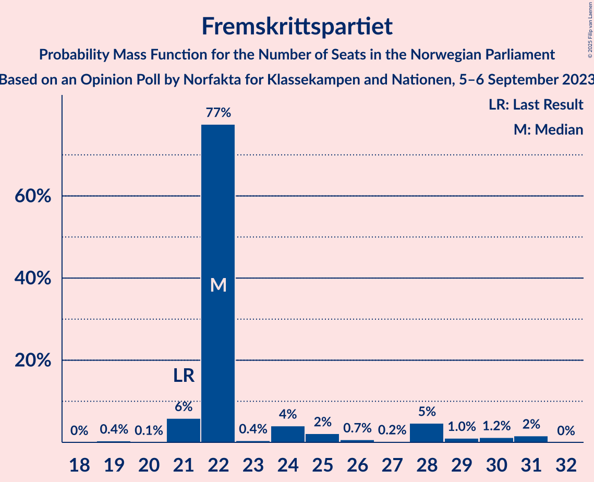
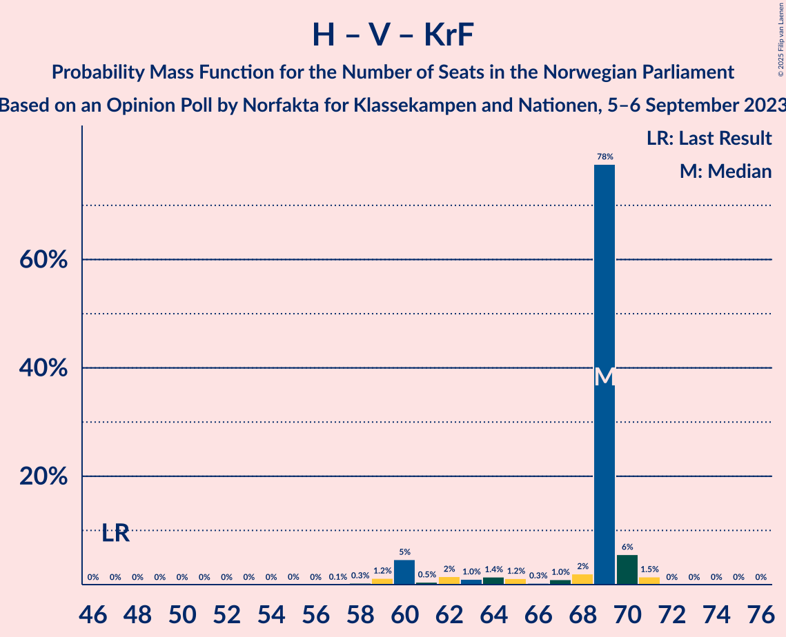

# Opinion Poll by Norfakta for Klassekampen and Nationen, 5–6 September 2023

<a href="#voting-intentions">Voting Intentions</a> | <a href="#seats">Seats</a> | <a href="#coalitions">Coalitions</a> | <a href="#technical-information">Technical Information</a>

## Voting Intentions

### Confidence Intervals

| Party | Last Result | Poll Result | 80% Confidence Interval | 90% Confidence Interval | 95% Confidence Interval | 99% Confidence Interval |
|:-----:|:-----------:|:-----------:|:-----------------------:|:-----------------------:|:-----------------------:|:-----------------------:|
| Høyre | 20.4% | 27.8% | 25.8–29.8% |25.3–30.4% |24.8–31.0% |23.9–32.0% |
| Arbeiderpartiet | 26.2% | 19.8% | 18.1–21.7% |17.6–22.2% |17.2–22.7% |16.4–23.6% |
| Fremskrittspartiet | 11.6% | 13.1% | 11.7–14.8% |11.3–15.2% |11.0–15.7% |10.3–16.5% |
| Sosialistisk Venstreparti | 7.6% | 8.5% | 7.3–9.9% |7.0–10.3% |6.8–10.6% |6.2–11.3% |
| Senterpartiet | 13.5% | 6.9% | 5.9–8.2% |5.6–8.5% |5.3–8.8% |4.9–9.5% |
| Venstre | 4.6% | 6.1% | 5.2–7.4% |4.9–7.7% |4.7–8.0% |4.3–8.6% |
| Miljøpartiet De Grønne | 3.9% | 4.1% | 3.3–5.1% |3.1–5.4% |2.9–5.7% |2.6–6.2% |
| Rødt | 4.7% | 4.1% | 3.3–5.1% |3.1–5.4% |2.9–5.7% |2.6–6.2% |
| Kristelig Folkeparti | 3.8% | 3.4% | 2.7–4.4% |2.5–4.7% |2.4–4.9% |2.1–5.4% |
| Industri- og Næringspartiet | 0.3% | 2.2% | 1.7–3.0% |1.5–3.3% |1.4–3.5% |1.2–3.9% |
| Konservativt | 0.4% | 1.0% | 0.7–1.6% |0.6–1.8% |0.5–1.9% |0.4–2.3% |
| Pensjonistpartiet | 0.6% | 0.9% | 0.6–1.4% |0.5–1.6% |0.4–1.8% |0.3–2.1% |
| Liberalistene | 0.2% | 0.5% | 0.3–1.0% |0.2–1.1% |0.2–1.3% |0.1–1.5% |
| Norgesdemokratene | 1.1% | 0.5% | 0.3–1.0% |0.2–1.1% |0.2–1.3% |0.1–1.5% |
| Folkets parti | 0.1% | 0.1% | 0.1–0.5% |0.0–0.6% |0.0–0.7% |0.0–0.9% |

*Note:* The poll result column reflects the actual value used in the calculations. Published results may vary slightly, and in addition be rounded to fewer digits.

## Seats

### Confidence Intervals

| Party | Last Result | Median | 80% Confidence Interval | 90% Confidence Interval | 95% Confidence Interval | 99% Confidence Interval |
|:-----:|:-----------:|:------:|:-----------------------:|:-----------------------:|:-----------------------:|:-----------------------:|
| <a href="#høyre">Høyre</a> | 36 | 51 | 50–51 |48–53 |47–54 |45–56 |
| <a href="#arbeiderpartiet">Arbeiderpartiet</a> | 48 | 41 | 39–41 |36–41 |34–43 |33–46 |
| <a href="#fremskrittspartiet">Fremskrittspartiet</a> | 21 | 22 | 22–25 |21–28 |21–30 |20–31 |
| <a href="#sosialistisk-venstreparti">Sosialistisk Venstreparti</a> | 13 | 15 | 15–17 |14–19 |12–19 |12–20 |
| <a href="#senterpartiet">Senterpartiet</a> | 28 | 17 | 12–17 |11–17 |10–17 |7–18 |
| <a href="#venstre">Venstre</a> | 8 | 11 | 10–12 |9–12 |8–13 |8–15 |
| <a href="#miljøpartiet-de-grønne">Miljøpartiet De Grønne</a> | 3 | 3 | 3–8 |2–9 |2–11 |1–11 |
| <a href="#rødt">Rødt</a> | 8 | 1 | 1 |1–7 |1–9 |1–9 |
| <a href="#kristelig-folkeparti">Kristelig Folkeparti</a> | 3 | 7 | 2–7 |2–8 |2–8 |1–9 |
| <a href="#industri--og-næringspartiet">Industri- og Næringspartiet</a> | 0 | 0 | 0–2 |0–2 |0–2 |0–3 |
| <a href="#konservativt">Konservativt</a> | 0 | 0 | 0 |0 |0 |0 |
| <a href="#pensjonistpartiet">Pensjonistpartiet</a> | 0 | 0 | 0 |0 |0 |0 |
| <a href="#liberalistene">Liberalistene</a> | 0 | 0 | 0 |0 |0 |0 |
| <a href="#norgesdemokratene">Norgesdemokratene</a> | 0 | 0 | 0 |0 |0 |0 |
| <a href="#folkets-parti">Folkets parti</a> | 0 | 0 | 0 |0 |0 |0 |

### Høyre

*For a full overview of the results for this party, see the [Høyre](party-høyre.html) page.*

| Number of Seats | Probability | Accumulated | Special Marks |
|:---------------:|:-----------:|:-----------:|:-------------:|
| 36 | 0% | 100% | Last Result |
| 37 | 0% | 100% |  |
| 38 | 0% | 100% |  |
| 39 | 0% | 100% |  |
| 40 | 0% | 100% |  |
| 41 | 0.1% | 100% |  |
| 42 | 0% | 99.9% |  |
| 43 | 0% | 99.9% |  |
| 44 | 0.2% | 99.9% |  |
| 45 | 2% | 99.6% |  |
| 46 | 0.2% | 98% |  |
| 47 | 0.8% | 98% |  |
| 48 | 3% | 97% |  |
| 49 | 0.8% | 94% |  |
| 50 | 9% | 93% |  |
| 51 | 77% | 84% | Median |
| 52 | 1.2% | 7% |  |
| 53 | 3% | 6% |  |
| 54 | 1.1% | 3% |  |
| 55 | 0.7% | 2% |  |
| 56 | 1.3% | 1.4% |  |
| 57 | 0% | 0.1% |  |
| 58 | 0.1% | 0.1% |  |
| 59 | 0% | 0.1% |  |
| 60 | 0% | 0% |  |

### Arbeiderpartiet

*For a full overview of the results for this party, see the [Arbeiderpartiet](party-arbeiderpartiet.html) page.*

| Number of Seats | Probability | Accumulated | Special Marks |
|:---------------:|:-----------:|:-----------:|:-------------:|
| 31 | 0% | 100% |  |
| 32 | 0.3% | 99.9% |  |
| 33 | 1.1% | 99.7% |  |
| 34 | 2% | 98.6% |  |
| 35 | 0.2% | 97% |  |
| 36 | 3% | 96% |  |
| 37 | 0.8% | 93% |  |
| 38 | 3% | 93% |  |
| 39 | 2% | 90% |  |
| 40 | 2% | 88% |  |
| 41 | 82% | 86% | Median |
| 42 | 0.6% | 4% |  |
| 43 | 2% | 3% |  |
| 44 | 0.4% | 2% |  |
| 45 | 0.1% | 1.2% |  |
| 46 | 1.0% | 1.1% |  |
| 47 | 0.1% | 0.1% |  |
| 48 | 0% | 0% | Last Result |

### Fremskrittspartiet

*For a full overview of the results for this party, see the [Fremskrittspartiet](party-fremskrittspartiet.html) page.*

| Number of Seats | Probability | Accumulated | Special Marks |
|:---------------:|:-----------:|:-----------:|:-------------:|
| 18 | 0% | 100% |  |
| 19 | 0.4% | 99.9% |  |
| 20 | 0.1% | 99.5% |  |
| 21 | 6% | 99.5% | Last Result |
| 22 | 77% | 94% | Median |
| 23 | 0.4% | 16% |  |
| 24 | 4% | 16% |  |
| 25 | 2% | 12% |  |
| 26 | 0.7% | 9% |  |
| 27 | 0.2% | 9% |  |
| 28 | 5% | 9% |  |
| 29 | 1.0% | 4% |  |
| 30 | 1.2% | 3% |  |
| 31 | 2% | 2% |  |
| 32 | 0% | 0% |  |

### Sosialistisk Venstreparti

*For a full overview of the results for this party, see the [Sosialistisk Venstreparti](party-sosialistiskvenstreparti.html) page.*

| Number of Seats | Probability | Accumulated | Special Marks |
|:---------------:|:-----------:|:-----------:|:-------------:|
| 10 | 0.1% | 100% |  |
| 11 | 0.2% | 99.8% |  |
| 12 | 2% | 99.6% |  |
| 13 | 1.3% | 97% | Last Result |
| 14 | 2% | 96% |  |
| 15 | 77% | 94% | Median |
| 16 | 4% | 16% |  |
| 17 | 5% | 12% |  |
| 18 | 0.4% | 7% |  |
| 19 | 6% | 7% |  |
| 20 | 0.4% | 0.7% |  |
| 21 | 0.2% | 0.3% |  |
| 22 | 0% | 0.1% |  |
| 23 | 0% | 0% |  |

### Senterpartiet

*For a full overview of the results for this party, see the [Senterpartiet](party-senterpartiet.html) page.*

| Number of Seats | Probability | Accumulated | Special Marks |
|:---------------:|:-----------:|:-----------:|:-------------:|
| 7 | 2% | 100% |  |
| 8 | 0.1% | 98% |  |
| 9 | 0.4% | 98% |  |
| 10 | 2% | 98% |  |
| 11 | 2% | 96% |  |
| 12 | 7% | 93% |  |
| 13 | 2% | 86% |  |
| 14 | 2% | 84% |  |
| 15 | 3% | 82% |  |
| 16 | 0.7% | 79% |  |
| 17 | 77% | 78% | Median |
| 18 | 1.1% | 1.2% |  |
| 19 | 0% | 0% |  |
| 20 | 0% | 0% |  |
| 21 | 0% | 0% |  |
| 22 | 0% | 0% |  |
| 23 | 0% | 0% |  |
| 24 | 0% | 0% |  |
| 25 | 0% | 0% |  |
| 26 | 0% | 0% |  |
| 27 | 0% | 0% |  |
| 28 | 0% | 0% | Last Result |

### Venstre

*For a full overview of the results for this party, see the [Venstre](party-venstre.html) page.*

| Number of Seats | Probability | Accumulated | Special Marks |
|:---------------:|:-----------:|:-----------:|:-------------:|
| 3 | 0.1% | 100% |  |
| 4 | 0% | 99.9% |  |
| 5 | 0% | 99.9% |  |
| 6 | 0% | 99.9% |  |
| 7 | 0% | 99.9% |  |
| 8 | 4% | 99.9% | Last Result |
| 9 | 3% | 96% |  |
| 10 | 3% | 93% |  |
| 11 | 77% | 90% | Median |
| 12 | 8% | 12% |  |
| 13 | 2% | 5% |  |
| 14 | 0.5% | 2% |  |
| 15 | 2% | 2% |  |
| 16 | 0.1% | 0.1% |  |
| 17 | 0% | 0% |  |

### Miljøpartiet De Grønne

*For a full overview of the results for this party, see the [Miljøpartiet De Grønne](party-miljøpartietdegrønne.html) page.*

| Number of Seats | Probability | Accumulated | Special Marks |
|:---------------:|:-----------:|:-----------:|:-------------:|
| 1 | 0.7% | 100% |  |
| 2 | 8% | 99.3% |  |
| 3 | 79% | 91% | Last Result, Median |
| 4 | 0% | 12% |  |
| 5 | 0% | 12% |  |
| 6 | 0% | 12% |  |
| 7 | 2% | 12% |  |
| 8 | 2% | 11% |  |
| 9 | 4% | 9% |  |
| 10 | 1.2% | 5% |  |
| 11 | 3% | 3% |  |
| 12 | 0% | 0% |  |

### Rødt

*For a full overview of the results for this party, see the [Rødt](party-rødt.html) page.*

| Number of Seats | Probability | Accumulated | Special Marks |
|:---------------:|:-----------:|:-----------:|:-------------:|
| 1 | 93% | 100% | Median |
| 2 | 0% | 7% |  |
| 3 | 0% | 7% |  |
| 4 | 0% | 7% |  |
| 5 | 0% | 7% |  |
| 6 | 0% | 7% |  |
| 7 | 4% | 7% |  |
| 8 | 1.1% | 4% | Last Result |
| 9 | 2% | 3% |  |
| 10 | 0.4% | 0.4% |  |
| 11 | 0% | 0.1% |  |
| 12 | 0% | 0% |  |

### Kristelig Folkeparti

*For a full overview of the results for this party, see the [Kristelig Folkeparti](party-kristeligfolkeparti.html) page.*

| Number of Seats | Probability | Accumulated | Special Marks |
|:---------------:|:-----------:|:-----------:|:-------------:|
| 0 | 0.4% | 100% |  |
| 1 | 0.1% | 99.6% |  |
| 2 | 10% | 99.5% |  |
| 3 | 6% | 90% | Last Result |
| 4 | 0% | 84% |  |
| 5 | 0% | 84% |  |
| 6 | 0% | 84% |  |
| 7 | 77% | 84% | Median |
| 8 | 5% | 6% |  |
| 9 | 0.8% | 1.1% |  |
| 10 | 0.2% | 0.2% |  |
| 11 | 0% | 0% |  |

### Industri- og Næringspartiet

*For a full overview of the results for this party, see the [Industri- og Næringspartiet](party-industri-ognæringspartiet.html) page.*

| Number of Seats | Probability | Accumulated | Special Marks |
|:---------------:|:-----------:|:-----------:|:-------------:|
| 0 | 89% | 100% | Last Result, Median |
| 1 | 0.7% | 11% |  |
| 2 | 9% | 10% |  |
| 3 | 1.2% | 2% |  |
| 4 | 0% | 0.3% |  |
| 5 | 0% | 0.3% |  |
| 6 | 0% | 0.3% |  |
| 7 | 0.3% | 0.3% |  |
| 8 | 0% | 0% |  |

### Konservativt

*For a full overview of the results for this party, see the [Konservativt](party-konservativt.html) page.*

| Number of Seats | Probability | Accumulated | Special Marks |
|:---------------:|:-----------:|:-----------:|:-------------:|
| 0 | 100% | 100% | Last Result, Median |

### Pensjonistpartiet

*For a full overview of the results for this party, see the [Pensjonistpartiet](party-pensjonistpartiet.html) page.*

| Number of Seats | Probability | Accumulated | Special Marks |
|:---------------:|:-----------:|:-----------:|:-------------:|
| 0 | 100% | 100% | Last Result, Median |

### Liberalistene

*For a full overview of the results for this party, see the [Liberalistene](party-liberalistene.html) page.*

| Number of Seats | Probability | Accumulated | Special Marks |
|:---------------:|:-----------:|:-----------:|:-------------:|
| 0 | 100% | 100% | Last Result, Median |

### Norgesdemokratene

*For a full overview of the results for this party, see the [Norgesdemokratene](party-norgesdemokratene.html) page.*

| Number of Seats | Probability | Accumulated | Special Marks |
|:---------------:|:-----------:|:-----------:|:-------------:|
| 0 | 100% | 100% | Last Result, Median |

### Folkets parti

*For a full overview of the results for this party, see the [Folkets parti](party-folketsparti.html) page.*

| Number of Seats | Probability | Accumulated | Special Marks |
|:---------------:|:-----------:|:-----------:|:-------------:|
| 0 | 100% | 100% | Last Result, Median |

## Coalitions

### Confidence Intervals

| Coalition | Last Result | Median | Majority? | 80% Confidence Interval | 90% Confidence Interval | 95% Confidence Interval | 99% Confidence Interval |
|:---------:|:-----------:|:------:|:---------:|:-----------------------:|:-----------------------:|:-----------------------:|:-----------------------:|
| Høyre – Fremskrittspartiet – Senterpartiet – Venstre – Kristelig Folkeparti | 96 | 108 | 100% | 103–108 | 98–108 | 97–110 | 95–115 |
| Høyre – Fremskrittspartiet – Venstre – Miljøpartiet De Grønne – Kristelig Folkeparti | 71 | 94 | 99.8% | 94–98 | 93–100 | 91–101 | 87–104 |
| Høyre – Fremskrittspartiet – Venstre – Kristelig Folkeparti | 68 | 91 | 96% | 88–91 | 88–93 | 84–98 | 82–102 |
| Høyre – Fremskrittspartiet – Venstre | 65 | 84 | 14% | 84–85 | 83–90 | 82–95 | 75–99 |
| Høyre – Fremskrittspartiet | 57 | 73 | 1.4% | 72–76 | 71–78 | 70–84 | 66–86 |
| Arbeiderpartiet – Sosialistisk Venstreparti – Senterpartiet – Miljøpartiet De Grønne – Rødt | 100 | 77 | 2% | 75–78 | 74–80 | 69–84 | 66–86 |
| Arbeiderpartiet – Sosialistisk Venstreparti – Senterpartiet – Miljøpartiet De Grønne – Kristelig Folkeparti | 95 | 83 | 2% | 77–83 | 72–83 | 70–83 | 68–92 |
| Arbeiderpartiet – Sosialistisk Venstreparti – Senterpartiet – Miljøpartiet De Grønne | 92 | 76 | 0% | 74–76 | 70–78 | 67–79 | 65–83 |
| Arbeiderpartiet – Sosialistisk Venstreparti – Senterpartiet – Rødt | 97 | 74 | 0% | 69–74 | 67–74 | 65–77 | 63–82 |
| Arbeiderpartiet – Sosialistisk Venstreparti – Senterpartiet | 89 | 73 | 0% | 66–73 | 64–73 | 62–73 | 59–75 |
| Høyre – Venstre – Kristelig Folkeparti | 47 | 69 | 0% | 64–69 | 60–70 | 60–70 | 59–71 |
| Arbeiderpartiet – Sosialistisk Venstreparti – Miljøpartiet De Grønne – Rødt | 72 | 60 | 0% | 60–65 | 60–70 | 56–70 | 53–73 |
| Arbeiderpartiet – Senterpartiet – Miljøpartiet De Grønne – Kristelig Folkeparti | 82 | 68 | 0% | 62–68 | 57–68 | 54–68 | 52–73 |
| Arbeiderpartiet – Senterpartiet – Kristelig Folkeparti | 79 | 65 | 0% | 53–65 | 52–65 | 50–65 | 49–65 |
| Arbeiderpartiet – Sosialistisk Venstreparti | 61 | 56 | 0% | 55–56 | 53–60 | 50–60 | 46–61 |
| Arbeiderpartiet – Senterpartiet | 76 | 58 | 0% | 51–58 | 49–58 | 47–58 | 46–60 |
| Senterpartiet – Venstre – Kristelig Folkeparti | 39 | 35 | 0% | 26–35 | 24–35 | 21–35 | 19–35 |

### Høyre – Fremskrittspartiet – Senterpartiet – Venstre – Kristelig Folkeparti

| Number of Seats | Probability | Accumulated | Special Marks |
|:---------------:|:-----------:|:-----------:|:-------------:|
| 88 | 0% | 100% |  |
| 89 | 0% | 99.9% |  |
| 90 | 0% | 99.9% |  |
| 91 | 0% | 99.9% |  |
| 92 | 0% | 99.9% |  |
| 93 | 0% | 99.9% |  |
| 94 | 0.3% | 99.9% |  |
| 95 | 2% | 99.6% |  |
| 96 | 0.3% | 98% | Last Result |
| 97 | 0.4% | 98% |  |
| 98 | 3% | 97% |  |
| 99 | 0.8% | 94% |  |
| 100 | 0.3% | 93% |  |
| 101 | 0.2% | 93% |  |
| 102 | 2% | 93% |  |
| 103 | 9% | 91% |  |
| 104 | 0.2% | 82% |  |
| 105 | 0.3% | 82% |  |
| 106 | 0.6% | 81% |  |
| 107 | 0.2% | 81% |  |
| 108 | 76% | 80% | Median |
| 109 | 1.2% | 4% |  |
| 110 | 1.0% | 3% |  |
| 111 | 0.1% | 2% |  |
| 112 | 0.4% | 2% |  |
| 113 | 0.2% | 1.5% |  |
| 114 | 0% | 1.2% |  |
| 115 | 1.2% | 1.2% |  |
| 116 | 0% | 0% |  |

### Høyre – Fremskrittspartiet – Venstre – Miljøpartiet De Grønne – Kristelig Folkeparti

| Number of Seats | Probability | Accumulated | Special Marks |
|:---------------:|:-----------:|:-----------:|:-------------:|
| 71 | 0% | 100% | Last Result |
| 72 | 0% | 100% |  |
| 73 | 0% | 100% |  |
| 74 | 0% | 100% |  |
| 75 | 0% | 100% |  |
| 76 | 0% | 100% |  |
| 77 | 0% | 100% |  |
| 78 | 0% | 100% |  |
| 79 | 0% | 100% |  |
| 80 | 0% | 100% |  |
| 81 | 0% | 100% |  |
| 82 | 0% | 100% |  |
| 83 | 0% | 100% |  |
| 84 | 0.2% | 100% |  |
| 85 | 0.1% | 99.8% | Majority |
| 86 | 0.1% | 99.7% |  |
| 87 | 1.2% | 99.6% |  |
| 88 | 0.4% | 98% |  |
| 89 | 0.3% | 98% |  |
| 90 | 0.2% | 98% |  |
| 91 | 0.3% | 98% |  |
| 92 | 0.8% | 97% |  |
| 93 | 5% | 96% |  |
| 94 | 77% | 91% | Median |
| 95 | 2% | 14% |  |
| 96 | 0% | 12% |  |
| 97 | 2% | 12% |  |
| 98 | 1.2% | 10% |  |
| 99 | 4% | 9% |  |
| 100 | 0.8% | 5% |  |
| 101 | 2% | 4% |  |
| 102 | 0.5% | 2% |  |
| 103 | 0% | 2% |  |
| 104 | 1.3% | 2% |  |
| 105 | 0.2% | 0.4% |  |
| 106 | 0% | 0.2% |  |
| 107 | 0% | 0.2% |  |
| 108 | 0% | 0.2% |  |
| 109 | 0% | 0.2% |  |
| 110 | 0% | 0.2% |  |
| 111 | 0.2% | 0.2% |  |
| 112 | 0% | 0% |  |

### Høyre – Fremskrittspartiet – Venstre – Kristelig Folkeparti

| Number of Seats | Probability | Accumulated | Special Marks |
|:---------------:|:-----------:|:-----------:|:-------------:|
| 68 | 0% | 100% | Last Result |
| 69 | 0% | 100% |  |
| 70 | 0% | 100% |  |
| 71 | 0% | 100% |  |
| 72 | 0% | 100% |  |
| 73 | 0% | 100% |  |
| 74 | 0% | 100% |  |
| 75 | 0% | 100% |  |
| 76 | 0% | 100% |  |
| 77 | 0% | 99.9% |  |
| 78 | 0% | 99.9% |  |
| 79 | 0% | 99.9% |  |
| 80 | 0% | 99.9% |  |
| 81 | 0% | 99.9% |  |
| 82 | 0.7% | 99.9% |  |
| 83 | 0.2% | 99.2% |  |
| 84 | 3% | 99.0% |  |
| 85 | 0.1% | 96% | Majority |
| 86 | 0.9% | 96% |  |
| 87 | 0.2% | 95% |  |
| 88 | 6% | 95% |  |
| 89 | 0.8% | 89% |  |
| 90 | 0.5% | 88% |  |
| 91 | 81% | 88% | Median |
| 92 | 1.4% | 6% |  |
| 93 | 0.3% | 5% |  |
| 94 | 0.6% | 5% |  |
| 95 | 0.4% | 4% |  |
| 96 | 0% | 4% |  |
| 97 | 1.2% | 4% |  |
| 98 | 0.4% | 3% |  |
| 99 | 0.8% | 2% |  |
| 100 | 0.1% | 1.5% |  |
| 101 | 0% | 1.4% |  |
| 102 | 1.4% | 1.4% |  |
| 103 | 0% | 0% |  |

### Høyre – Fremskrittspartiet – Venstre

| Number of Seats | Probability | Accumulated | Special Marks |
|:---------------:|:-----------:|:-----------:|:-------------:|
| 65 | 0% | 100% | Last Result |
| 66 | 0% | 100% |  |
| 67 | 0% | 100% |  |
| 68 | 0% | 100% |  |
| 69 | 0% | 100% |  |
| 70 | 0% | 100% |  |
| 71 | 0% | 100% |  |
| 72 | 0% | 100% |  |
| 73 | 0% | 100% |  |
| 74 | 0.1% | 100% |  |
| 75 | 0.6% | 99.9% |  |
| 76 | 0% | 99.3% |  |
| 77 | 0.1% | 99.3% |  |
| 78 | 0% | 99.2% |  |
| 79 | 0.2% | 99.2% |  |
| 80 | 0.7% | 99.1% |  |
| 81 | 0.2% | 98% |  |
| 82 | 2% | 98% |  |
| 83 | 5% | 96% |  |
| 84 | 77% | 91% | Median |
| 85 | 4% | 14% | Majority |
| 86 | 3% | 9% |  |
| 87 | 0.4% | 6% |  |
| 88 | 0.3% | 6% |  |
| 89 | 0.3% | 5% |  |
| 90 | 0.2% | 5% |  |
| 91 | 0.4% | 5% |  |
| 92 | 0.6% | 4% |  |
| 93 | 0% | 4% |  |
| 94 | 0% | 4% |  |
| 95 | 1.4% | 4% |  |
| 96 | 1.1% | 2% |  |
| 97 | 0.1% | 1.3% |  |
| 98 | 0% | 1.2% |  |
| 99 | 1.2% | 1.2% |  |
| 100 | 0% | 0% |  |

### Høyre – Fremskrittspartiet

| Number of Seats | Probability | Accumulated | Special Marks |
|:---------------:|:-----------:|:-----------:|:-------------:|
| 57 | 0% | 100% | Last Result |
| 58 | 0% | 100% |  |
| 59 | 0% | 100% |  |
| 60 | 0% | 100% |  |
| 61 | 0% | 100% |  |
| 62 | 0% | 100% |  |
| 63 | 0% | 100% |  |
| 64 | 0% | 99.9% |  |
| 65 | 0.1% | 99.9% |  |
| 66 | 0.6% | 99.9% |  |
| 67 | 0.1% | 99.3% |  |
| 68 | 0.1% | 99.2% |  |
| 69 | 0.7% | 99.1% |  |
| 70 | 1.4% | 98% |  |
| 71 | 6% | 97% |  |
| 72 | 2% | 92% |  |
| 73 | 77% | 89% | Median |
| 74 | 0.3% | 12% |  |
| 75 | 0.6% | 12% |  |
| 76 | 2% | 12% |  |
| 77 | 2% | 9% |  |
| 78 | 3% | 8% |  |
| 79 | 0.2% | 4% |  |
| 80 | 0% | 4% |  |
| 81 | 0.4% | 4% |  |
| 82 | 0.3% | 4% |  |
| 83 | 0.9% | 4% |  |
| 84 | 1.2% | 3% |  |
| 85 | 0.6% | 1.4% | Majority |
| 86 | 0.7% | 0.8% |  |
| 87 | 0.1% | 0.1% |  |
| 88 | 0% | 0% |  |

### Arbeiderpartiet – Sosialistisk Venstreparti – Senterpartiet – Miljøpartiet De Grønne – Rødt

| Number of Seats | Probability | Accumulated | Special Marks |
|:---------------:|:-----------:|:-----------:|:-------------:|
| 66 | 1.4% | 100% |  |
| 67 | 0% | 98.6% |  |
| 68 | 0.8% | 98.6% |  |
| 69 | 1.4% | 98% |  |
| 70 | 0.2% | 96% |  |
| 71 | 0% | 96% |  |
| 72 | 0.3% | 96% |  |
| 73 | 0.7% | 96% |  |
| 74 | 0.4% | 95% |  |
| 75 | 5% | 95% |  |
| 76 | 2% | 89% |  |
| 77 | 77% | 88% | Median |
| 78 | 2% | 11% |  |
| 79 | 0.6% | 9% |  |
| 80 | 4% | 9% |  |
| 81 | 0.2% | 4% |  |
| 82 | 0.3% | 4% |  |
| 83 | 0% | 4% |  |
| 84 | 2% | 4% |  |
| 85 | 1.3% | 2% | Majority |
| 86 | 0.5% | 0.6% |  |
| 87 | 0% | 0.1% |  |
| 88 | 0% | 0.1% |  |
| 89 | 0% | 0.1% |  |
| 90 | 0% | 0.1% |  |
| 91 | 0% | 0.1% |  |
| 92 | 0% | 0.1% |  |
| 93 | 0% | 0% |  |
| 94 | 0% | 0% |  |
| 95 | 0% | 0% |  |
| 96 | 0% | 0% |  |
| 97 | 0% | 0% |  |
| 98 | 0% | 0% |  |
| 99 | 0% | 0% |  |
| 100 | 0% | 0% | Last Result |

### Arbeiderpartiet – Sosialistisk Venstreparti – Senterpartiet – Miljøpartiet De Grønne – Kristelig Folkeparti

| Number of Seats | Probability | Accumulated | Special Marks |
|:---------------:|:-----------:|:-----------:|:-------------:|
| 62 | 0.1% | 100% |  |
| 63 | 0% | 99.9% |  |
| 64 | 0.2% | 99.9% |  |
| 65 | 0% | 99.7% |  |
| 66 | 0% | 99.7% |  |
| 67 | 0% | 99.7% |  |
| 68 | 1.3% | 99.7% |  |
| 69 | 0.9% | 98% |  |
| 70 | 0.9% | 98% |  |
| 71 | 0.9% | 97% |  |
| 72 | 0.7% | 96% |  |
| 73 | 0.1% | 95% |  |
| 74 | 3% | 95% |  |
| 75 | 0.5% | 92% |  |
| 76 | 2% | 92% |  |
| 77 | 0.4% | 90% |  |
| 78 | 2% | 90% |  |
| 79 | 0.1% | 88% |  |
| 80 | 0.2% | 88% |  |
| 81 | 3% | 88% |  |
| 82 | 6% | 84% |  |
| 83 | 76% | 78% | Median |
| 84 | 0% | 2% |  |
| 85 | 1.1% | 2% | Majority |
| 86 | 0.1% | 0.7% |  |
| 87 | 0% | 0.6% |  |
| 88 | 0% | 0.6% |  |
| 89 | 0% | 0.6% |  |
| 90 | 0% | 0.6% |  |
| 91 | 0% | 0.6% |  |
| 92 | 0.6% | 0.6% |  |
| 93 | 0% | 0% |  |
| 94 | 0% | 0% |  |
| 95 | 0% | 0% | Last Result |

### Arbeiderpartiet – Sosialistisk Venstreparti – Senterpartiet – Miljøpartiet De Grønne

| Number of Seats | Probability | Accumulated | Special Marks |
|:---------------:|:-----------:|:-----------:|:-------------:|
| 59 | 0.1% | 100% |  |
| 60 | 0% | 99.9% |  |
| 61 | 0% | 99.9% |  |
| 62 | 0.2% | 99.9% |  |
| 63 | 0% | 99.7% |  |
| 64 | 0.1% | 99.7% |  |
| 65 | 1.4% | 99.6% |  |
| 66 | 0.1% | 98% |  |
| 67 | 1.1% | 98% |  |
| 68 | 1.4% | 97% |  |
| 69 | 0.2% | 96% |  |
| 70 | 0.6% | 95% |  |
| 71 | 2% | 95% |  |
| 72 | 1.1% | 93% |  |
| 73 | 2% | 92% |  |
| 74 | 5% | 90% |  |
| 75 | 2% | 85% |  |
| 76 | 78% | 83% | Median |
| 77 | 0.1% | 5% |  |
| 78 | 0.4% | 5% |  |
| 79 | 3% | 5% |  |
| 80 | 0.1% | 2% |  |
| 81 | 0.1% | 2% |  |
| 82 | 0% | 2% |  |
| 83 | 2% | 2% |  |
| 84 | 0% | 0% |  |
| 85 | 0% | 0% | Majority |
| 86 | 0% | 0% |  |
| 87 | 0% | 0% |  |
| 88 | 0% | 0% |  |
| 89 | 0% | 0% |  |
| 90 | 0% | 0% |  |
| 91 | 0% | 0% |  |
| 92 | 0% | 0% | Last Result |

### Arbeiderpartiet – Sosialistisk Venstreparti – Senterpartiet – Rødt

| Number of Seats | Probability | Accumulated | Special Marks |
|:---------------:|:-----------:|:-----------:|:-------------:|
| 57 | 0.2% | 100% |  |
| 58 | 0% | 99.8% |  |
| 59 | 0% | 99.8% |  |
| 60 | 0% | 99.8% |  |
| 61 | 0% | 99.8% |  |
| 62 | 0% | 99.8% |  |
| 63 | 0.4% | 99.8% |  |
| 64 | 1.3% | 99.3% |  |
| 65 | 1.0% | 98% |  |
| 66 | 0.4% | 97% |  |
| 67 | 3% | 97% |  |
| 68 | 1.1% | 94% |  |
| 69 | 5% | 93% |  |
| 70 | 0.3% | 88% |  |
| 71 | 0.2% | 88% |  |
| 72 | 0.3% | 88% |  |
| 73 | 7% | 87% |  |
| 74 | 77% | 81% | Median |
| 75 | 0% | 4% |  |
| 76 | 0.8% | 4% |  |
| 77 | 0.5% | 3% |  |
| 78 | 0.4% | 2% |  |
| 79 | 0.2% | 2% |  |
| 80 | 0.2% | 2% |  |
| 81 | 0.1% | 2% |  |
| 82 | 1.3% | 2% |  |
| 83 | 0.1% | 0.2% |  |
| 84 | 0.1% | 0.2% |  |
| 85 | 0% | 0% | Majority |
| 86 | 0% | 0% |  |
| 87 | 0% | 0% |  |
| 88 | 0% | 0% |  |
| 89 | 0% | 0% |  |
| 90 | 0% | 0% |  |
| 91 | 0% | 0% |  |
| 92 | 0% | 0% |  |
| 93 | 0% | 0% |  |
| 94 | 0% | 0% |  |
| 95 | 0% | 0% |  |
| 96 | 0% | 0% |  |
| 97 | 0% | 0% | Last Result |

### Arbeiderpartiet – Sosialistisk Venstreparti – Senterpartiet

| Number of Seats | Probability | Accumulated | Special Marks |
|:---------------:|:-----------:|:-----------:|:-------------:|
| 56 | 0.2% | 100% |  |
| 57 | 0% | 99.8% |  |
| 58 | 0.1% | 99.8% |  |
| 59 | 0.5% | 99.7% |  |
| 60 | 0.2% | 99.2% |  |
| 61 | 0.3% | 99.0% |  |
| 62 | 2% | 98.7% |  |
| 63 | 1.4% | 97% |  |
| 64 | 1.1% | 95% |  |
| 65 | 0.6% | 94% |  |
| 66 | 4% | 94% |  |
| 67 | 0.6% | 90% |  |
| 68 | 3% | 89% |  |
| 69 | 0.3% | 86% |  |
| 70 | 0.8% | 86% |  |
| 71 | 0.2% | 85% |  |
| 72 | 5% | 85% |  |
| 73 | 78% | 79% | Median |
| 74 | 0.1% | 0.9% |  |
| 75 | 0.6% | 0.8% |  |
| 76 | 0.1% | 0.2% |  |
| 77 | 0.1% | 0.1% |  |
| 78 | 0% | 0% |  |
| 79 | 0% | 0% |  |
| 80 | 0% | 0% |  |
| 81 | 0% | 0% |  |
| 82 | 0% | 0% |  |
| 83 | 0% | 0% |  |
| 84 | 0% | 0% |  |
| 85 | 0% | 0% | Majority |
| 86 | 0% | 0% |  |
| 87 | 0% | 0% |  |
| 88 | 0% | 0% |  |
| 89 | 0% | 0% | Last Result |

### Høyre – Venstre – Kristelig Folkeparti

| Number of Seats | Probability | Accumulated | Special Marks |
|:---------------:|:-----------:|:-----------:|:-------------:|
| 47 | 0% | 100% | Last Result |
| 48 | 0% | 100% |  |
| 49 | 0% | 100% |  |
| 50 | 0% | 100% |  |
| 51 | 0% | 100% |  |
| 52 | 0% | 100% |  |
| 53 | 0% | 100% |  |
| 54 | 0% | 100% |  |
| 55 | 0% | 100% |  |
| 56 | 0% | 99.9% |  |
| 57 | 0.1% | 99.9% |  |
| 58 | 0.3% | 99.8% |  |
| 59 | 1.2% | 99.5% |  |
| 60 | 5% | 98% |  |
| 61 | 0.5% | 94% |  |
| 62 | 2% | 93% |  |
| 63 | 1.0% | 92% |  |
| 64 | 1.4% | 91% |  |
| 65 | 1.2% | 89% |  |
| 66 | 0.3% | 88% |  |
| 67 | 1.0% | 88% |  |
| 68 | 2% | 87% |  |
| 69 | 78% | 85% | Median |
| 70 | 6% | 7% |  |
| 71 | 1.5% | 2% |  |
| 72 | 0% | 0.1% |  |
| 73 | 0% | 0.1% |  |
| 74 | 0% | 0.1% |  |
| 75 | 0% | 0% |  |

### Arbeiderpartiet – Sosialistisk Venstreparti – Miljøpartiet De Grønne – Rødt

| Number of Seats | Probability | Accumulated | Special Marks |
|:---------------:|:-----------:|:-----------:|:-------------:|
| 53 | 1.2% | 100% |  |
| 54 | 0% | 98.8% |  |
| 55 | 0.4% | 98.7% |  |
| 56 | 0.9% | 98% |  |
| 57 | 0.8% | 97% |  |
| 58 | 0.7% | 97% |  |
| 59 | 0% | 96% |  |
| 60 | 77% | 96% | Median |
| 61 | 0.2% | 19% |  |
| 62 | 0.5% | 19% |  |
| 63 | 5% | 18% |  |
| 64 | 0.3% | 13% |  |
| 65 | 4% | 13% |  |
| 66 | 1.0% | 8% |  |
| 67 | 1.2% | 7% |  |
| 68 | 0.2% | 6% |  |
| 69 | 0.2% | 6% |  |
| 70 | 3% | 5% |  |
| 71 | 2% | 2% |  |
| 72 | 0.1% | 0.6% | Last Result |
| 73 | 0.2% | 0.5% |  |
| 74 | 0.3% | 0.3% |  |
| 75 | 0% | 0.1% |  |
| 76 | 0% | 0.1% |  |
| 77 | 0% | 0.1% |  |
| 78 | 0% | 0.1% |  |
| 79 | 0% | 0.1% |  |
| 80 | 0% | 0.1% |  |
| 81 | 0% | 0% |  |

### Arbeiderpartiet – Senterpartiet – Miljøpartiet De Grønne – Kristelig Folkeparti

| Number of Seats | Probability | Accumulated | Special Marks |
|:---------------:|:-----------:|:-----------:|:-------------:|
| 48 | 0.1% | 100% |  |
| 49 | 0% | 99.9% |  |
| 50 | 0.2% | 99.9% |  |
| 51 | 0% | 99.7% |  |
| 52 | 2% | 99.7% |  |
| 53 | 0.5% | 98% |  |
| 54 | 0.3% | 98% |  |
| 55 | 1.0% | 97% |  |
| 56 | 0.8% | 96% |  |
| 57 | 0.5% | 95% |  |
| 58 | 0.2% | 95% |  |
| 59 | 0.3% | 95% |  |
| 60 | 2% | 94% |  |
| 61 | 0.6% | 92% |  |
| 62 | 3% | 91% |  |
| 63 | 5% | 88% |  |
| 64 | 3% | 83% |  |
| 65 | 1.5% | 80% |  |
| 66 | 0.2% | 79% |  |
| 67 | 0.3% | 78% |  |
| 68 | 76% | 78% | Median |
| 69 | 0.1% | 2% |  |
| 70 | 0% | 2% |  |
| 71 | 0.1% | 2% |  |
| 72 | 1.0% | 2% |  |
| 73 | 0.6% | 0.6% |  |
| 74 | 0% | 0% |  |
| 75 | 0% | 0% |  |
| 76 | 0% | 0% |  |
| 77 | 0% | 0% |  |
| 78 | 0% | 0% |  |
| 79 | 0% | 0% |  |
| 80 | 0% | 0% |  |
| 81 | 0% | 0% |  |
| 82 | 0% | 0% | Last Result |

### Arbeiderpartiet – Senterpartiet – Kristelig Folkeparti

| Number of Seats | Probability | Accumulated | Special Marks |
|:---------------:|:-----------:|:-----------:|:-------------:|
| 46 | 0.1% | 100% |  |
| 47 | 0.1% | 99.8% |  |
| 48 | 0.2% | 99.7% |  |
| 49 | 1.1% | 99.5% |  |
| 50 | 1.3% | 98% |  |
| 51 | 1.2% | 97% |  |
| 52 | 1.2% | 96% |  |
| 53 | 6% | 95% |  |
| 54 | 1.1% | 89% |  |
| 55 | 0.4% | 88% |  |
| 56 | 1.4% | 87% |  |
| 57 | 0.5% | 86% |  |
| 58 | 0.7% | 85% |  |
| 59 | 1.2% | 85% |  |
| 60 | 0.2% | 83% |  |
| 61 | 5% | 83% |  |
| 62 | 1.0% | 78% |  |
| 63 | 0% | 77% |  |
| 64 | 0% | 77% |  |
| 65 | 77% | 77% | Median |
| 66 | 0.1% | 0.1% |  |
| 67 | 0% | 0% |  |
| 68 | 0% | 0% |  |
| 69 | 0% | 0% |  |
| 70 | 0% | 0% |  |
| 71 | 0% | 0% |  |
| 72 | 0% | 0% |  |
| 73 | 0% | 0% |  |
| 74 | 0% | 0% |  |
| 75 | 0% | 0% |  |
| 76 | 0% | 0% |  |
| 77 | 0% | 0% |  |
| 78 | 0% | 0% |  |
| 79 | 0% | 0% | Last Result |

### Arbeiderpartiet – Sosialistisk Venstreparti

| Number of Seats | Probability | Accumulated | Special Marks |
|:---------------:|:-----------:|:-----------:|:-------------:|
| 44 | 0% | 100% |  |
| 45 | 0% | 99.9% |  |
| 46 | 0.9% | 99.9% |  |
| 47 | 0.1% | 99.1% |  |
| 48 | 0.3% | 99.0% |  |
| 49 | 0.2% | 98.6% |  |
| 50 | 2% | 98% |  |
| 51 | 0.4% | 97% |  |
| 52 | 1.3% | 96% |  |
| 53 | 3% | 95% |  |
| 54 | 1.0% | 92% |  |
| 55 | 5% | 91% |  |
| 56 | 78% | 86% | Median |
| 57 | 0.3% | 8% |  |
| 58 | 0.3% | 8% |  |
| 59 | 1.3% | 7% |  |
| 60 | 5% | 6% |  |
| 61 | 0.7% | 0.9% | Last Result |
| 62 | 0.1% | 0.2% |  |
| 63 | 0.1% | 0.1% |  |
| 64 | 0% | 0% |  |

### Arbeiderpartiet – Senterpartiet

| Number of Seats | Probability | Accumulated | Special Marks |
|:---------------:|:-----------:|:-----------:|:-------------:|
| 43 | 0% | 100% |  |
| 44 | 0.3% | 99.9% |  |
| 45 | 0.1% | 99.7% |  |
| 46 | 0.4% | 99.6% |  |
| 47 | 2% | 99.2% |  |
| 48 | 0.5% | 97% |  |
| 49 | 2% | 97% |  |
| 50 | 4% | 94% |  |
| 51 | 4% | 90% |  |
| 52 | 0.2% | 86% |  |
| 53 | 6% | 86% |  |
| 54 | 0.3% | 80% |  |
| 55 | 0.3% | 80% |  |
| 56 | 1.3% | 80% |  |
| 57 | 1.3% | 79% |  |
| 58 | 76% | 77% | Median |
| 59 | 0.1% | 1.1% |  |
| 60 | 1.0% | 1.0% |  |
| 61 | 0% | 0% |  |
| 62 | 0% | 0% |  |
| 63 | 0% | 0% |  |
| 64 | 0% | 0% |  |
| 65 | 0% | 0% |  |
| 66 | 0% | 0% |  |
| 67 | 0% | 0% |  |
| 68 | 0% | 0% |  |
| 69 | 0% | 0% |  |
| 70 | 0% | 0% |  |
| 71 | 0% | 0% |  |
| 72 | 0% | 0% |  |
| 73 | 0% | 0% |  |
| 74 | 0% | 0% |  |
| 75 | 0% | 0% |  |
| 76 | 0% | 0% | Last Result |

### Senterpartiet – Venstre – Kristelig Folkeparti

| Number of Seats | Probability | Accumulated | Special Marks |
|:---------------:|:-----------:|:-----------:|:-------------:|
| 19 | 2% | 100% |  |
| 20 | 0.2% | 98% |  |
| 21 | 1.3% | 98% |  |
| 22 | 0.1% | 97% |  |
| 23 | 0.6% | 97% |  |
| 24 | 2% | 96% |  |
| 25 | 3% | 94% |  |
| 26 | 2% | 91% |  |
| 27 | 0.4% | 89% |  |
| 28 | 0.4% | 88% |  |
| 29 | 0.4% | 88% |  |
| 30 | 0.8% | 88% |  |
| 31 | 3% | 87% |  |
| 32 | 7% | 84% |  |
| 33 | 0.6% | 77% |  |
| 34 | 0.2% | 76% |  |
| 35 | 76% | 76% | Median |
| 36 | 0% | 0.1% |  |
| 37 | 0.1% | 0.1% |  |
| 38 | 0% | 0% |  |
| 39 | 0% | 0% | Last Result |

## Technical Information

### Opinion Poll

+ **Polling firm:** Norfakta
+ **Commissioner(s):** Klassekampen and Nationen
+ **Fieldwork period:** 5–6 September 2023

### Calculations

+ **Sample size:** 814
+ **Simulations done:** 1,048,576
+ **Error estimate:** 2.76%

