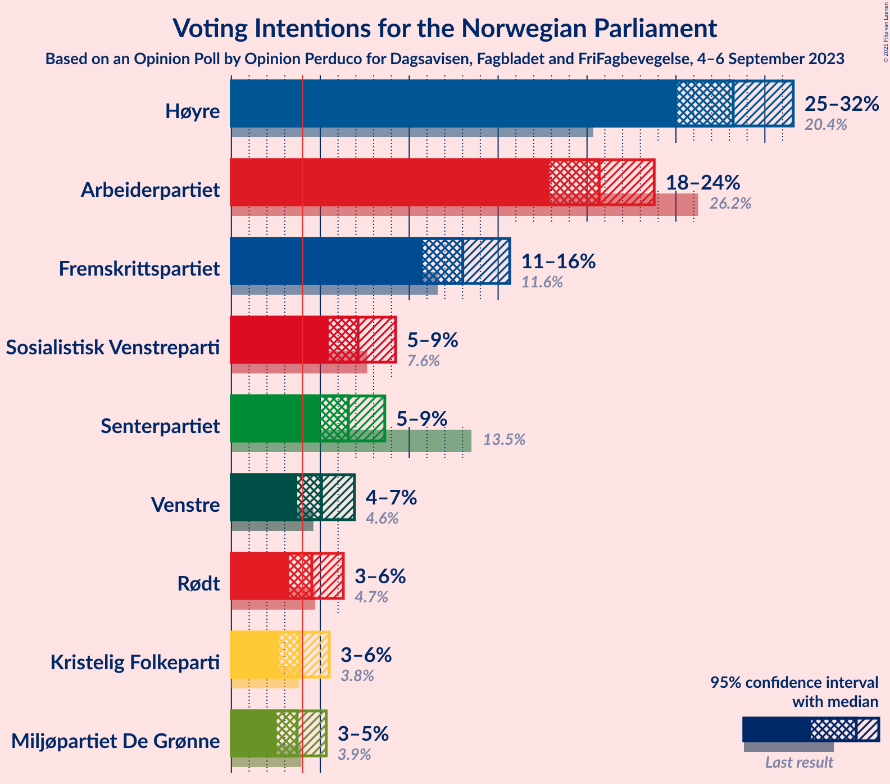
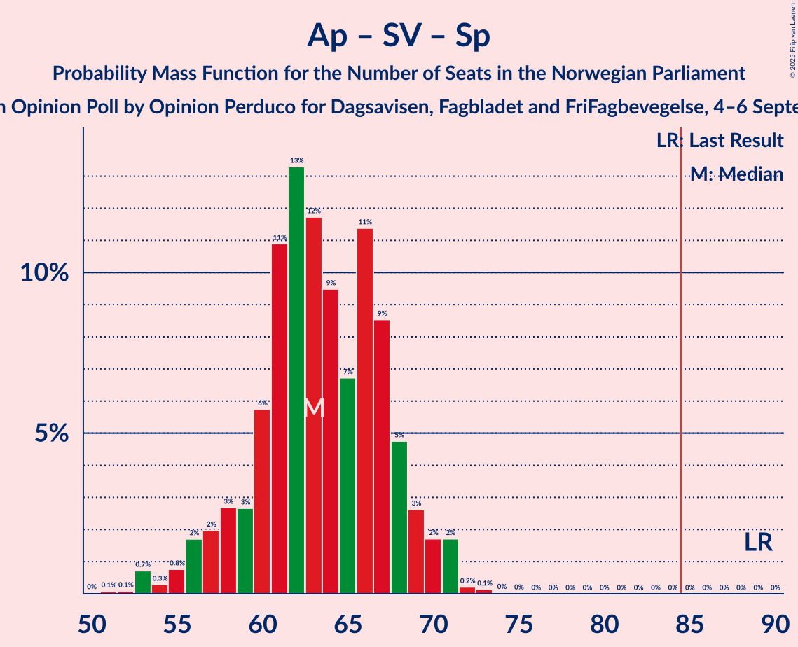

# Opinion Poll by Opinion Perduco for Dagsavisen, Fagbladet and FriFagbevegelse, 4–6 September 2023

<a href="#voting-intentions">Voting Intentions</a> | <a href="#seats">Seats</a> | <a href="#coalitions">Coalitions</a> | <a href="#technical-information">Technical Information</a>

## Voting Intentions

### Confidence Intervals

| Party | Last Result | Poll Result | 80% Confidence Interval | 90% Confidence Interval | 95% Confidence Interval | 99% Confidence Interval |
|:-----:|:-----------:|:-----------:|:-----------------------:|:-----------------------:|:-----------------------:|:-----------------------:|
| Høyre | 20.4% | 28.2% | 26.2–30.4% |25.6–31.1% |25.1–31.6% |24.1–32.7% |
| Arbeiderpartiet | 26.2% | 20.7% | 18.9–22.7% |18.3–23.3% |17.9–23.8% |17.1–24.8% |
| Fremskrittspartiet | 11.6% | 13.0% | 11.5–14.7% |11.1–15.2% |10.8–15.7% |10.1–16.5% |
| Sosialistisk Venstreparti | 7.6% | 7.1% | 6.0–8.5% |5.7–8.9% |5.5–9.2% |5.0–9.9% |
| Senterpartiet | 13.5% | 6.6% | 5.5–7.9% |5.2–8.3% |5.0–8.6% |4.5–9.3% |
| Venstre | 4.6% | 5.1% | 4.2–6.3% |3.9–6.6% |3.7–6.9% |3.3–7.5% |
| Rødt | 4.7% | 4.5% | 3.7–5.7% |3.4–6.0% |3.2–6.3% |2.9–6.9% |
| Kristelig Folkeparti | 3.8% | 3.8% | 3.1–4.9% |2.9–5.2% |2.7–5.5% |2.3–6.1% |
| Miljøpartiet De Grønne | 3.9% | 3.7% | 2.9–4.8% |2.7–5.1% |2.5–5.3% |2.2–5.9% |

*Note:* The poll result column reflects the actual value used in the calculations. Published results may vary slightly, and in addition be rounded to fewer digits.

## Seats

### Confidence Intervals

| Party | Last Result | Median | 80% Confidence Interval | 90% Confidence Interval | 95% Confidence Interval | 99% Confidence Interval |
|:-----:|:-----------:|:------:|:-----------------------:|:-----------------------:|:-----------------------:|:-----------------------:|
| <a href="#høyre">Høyre</a> | 36 | 50 | 47–54 |46–56 |46–57 |44–60 |
| <a href="#arbeiderpartiet">Arbeiderpartiet</a> | 48 | 42 | 37–45 |36–46 |34–47 |34–49 |
| <a href="#fremskrittspartiet">Fremskrittspartiet</a> | 21 | 23 | 20–28 |18–29 |18–30 |17–32 |
| <a href="#sosialistisk-venstreparti">Sosialistisk Venstreparti</a> | 13 | 10 | 8–13 |7–14 |7–14 |7–16 |
| <a href="#senterpartiet">Senterpartiet</a> | 28 | 12 | 8–14 |7–15 |7–16 |6–17 |
| <a href="#venstre">Venstre</a> | 8 | 7 | 6–9 |3–10 |3–10 |2–11 |
| <a href="#rødt">Rødt</a> | 8 | 6 | 1–8 |1–9 |1–9 |1–10 |
| <a href="#kristelig-folkeparti">Kristelig Folkeparti</a> | 3 | 3 | 2–6 |2–7 |2–7 |1–8 |
| <a href="#miljøpartiet-de-grønne">Miljøpartiet De Grønne</a> | 3 | 3 | 2–6 |1–7 |1–7 |1–8 |

### Høyre

*For a full overview of the results for this party, see the [Høyre](party-høyre.html) page.*

| Number of Seats | Probability | Accumulated | Special Marks |
|:---------------:|:-----------:|:-----------:|:-------------:|
| 36 | 0% | 100% | Last Result |
| 37 | 0% | 100% |  |
| 38 | 0% | 100% |  |
| 39 | 0% | 100% |  |
| 40 | 0% | 100% |  |
| 41 | 0.1% | 100% |  |
| 42 | 0.1% | 99.9% |  |
| 43 | 0.2% | 99.8% |  |
| 44 | 0.5% | 99.6% |  |
| 45 | 1.1% | 99.0% |  |
| 46 | 3% | 98% |  |
| 47 | 5% | 95% |  |
| 48 | 10% | 89% |  |
| 49 | 22% | 79% |  |
| 50 | 14% | 57% | Median |
| 51 | 14% | 43% |  |
| 52 | 9% | 30% |  |
| 53 | 7% | 21% |  |
| 54 | 6% | 14% |  |
| 55 | 2% | 8% |  |
| 56 | 3% | 6% |  |
| 57 | 0.9% | 3% |  |
| 58 | 1.1% | 2% |  |
| 59 | 0.6% | 1.3% |  |
| 60 | 0.3% | 0.7% |  |
| 61 | 0.2% | 0.3% |  |
| 62 | 0.1% | 0.2% |  |
| 63 | 0.1% | 0.1% |  |
| 64 | 0% | 0.1% |  |
| 65 | 0% | 0% |  |

### Arbeiderpartiet

*For a full overview of the results for this party, see the [Arbeiderpartiet](party-arbeiderpartiet.html) page.*

| Number of Seats | Probability | Accumulated | Special Marks |
|:---------------:|:-----------:|:-----------:|:-------------:|
| 32 | 0.1% | 100% |  |
| 33 | 0.3% | 99.9% |  |
| 34 | 2% | 99.6% |  |
| 35 | 1.1% | 97% |  |
| 36 | 3% | 96% |  |
| 37 | 8% | 93% |  |
| 38 | 7% | 85% |  |
| 39 | 5% | 78% |  |
| 40 | 5% | 74% |  |
| 41 | 9% | 69% |  |
| 42 | 10% | 59% | Median |
| 43 | 17% | 49% |  |
| 44 | 12% | 32% |  |
| 45 | 13% | 20% |  |
| 46 | 4% | 7% |  |
| 47 | 2% | 4% |  |
| 48 | 0.8% | 1.5% | Last Result |
| 49 | 0.4% | 0.7% |  |
| 50 | 0.1% | 0.3% |  |
| 51 | 0.1% | 0.1% |  |
| 52 | 0% | 0% |  |

### Fremskrittspartiet

*For a full overview of the results for this party, see the [Fremskrittspartiet](party-fremskrittspartiet.html) page.*

| Number of Seats | Probability | Accumulated | Special Marks |
|:---------------:|:-----------:|:-----------:|:-------------:|
| 17 | 0.6% | 100% |  |
| 18 | 6% | 99.3% |  |
| 19 | 3% | 94% |  |
| 20 | 6% | 91% |  |
| 21 | 12% | 85% | Last Result |
| 22 | 17% | 72% |  |
| 23 | 8% | 56% | Median |
| 24 | 6% | 48% |  |
| 25 | 17% | 42% |  |
| 26 | 8% | 25% |  |
| 27 | 5% | 18% |  |
| 28 | 7% | 13% |  |
| 29 | 3% | 6% |  |
| 30 | 2% | 3% |  |
| 31 | 0.4% | 1.2% |  |
| 32 | 0.6% | 0.9% |  |
| 33 | 0.2% | 0.3% |  |
| 34 | 0.1% | 0.1% |  |
| 35 | 0% | 0% |  |

### Sosialistisk Venstreparti

*For a full overview of the results for this party, see the [Sosialistisk Venstreparti](party-sosialistiskvenstreparti.html) page.*

| Number of Seats | Probability | Accumulated | Special Marks |
|:---------------:|:-----------:|:-----------:|:-------------:|
| 6 | 0.5% | 100% |  |
| 7 | 6% | 99.5% |  |
| 8 | 15% | 93% |  |
| 9 | 22% | 78% |  |
| 10 | 21% | 56% | Median |
| 11 | 15% | 35% |  |
| 12 | 6% | 20% |  |
| 13 | 8% | 14% | Last Result |
| 14 | 5% | 7% |  |
| 15 | 1.2% | 2% |  |
| 16 | 0.5% | 0.6% |  |
| 17 | 0.1% | 0.1% |  |
| 18 | 0% | 0% |  |

### Senterpartiet

*For a full overview of the results for this party, see the [Senterpartiet](party-senterpartiet.html) page.*

| Number of Seats | Probability | Accumulated | Special Marks |
|:---------------:|:-----------:|:-----------:|:-------------:|
| 5 | 0.1% | 100% |  |
| 6 | 2% | 99.8% |  |
| 7 | 5% | 98% |  |
| 8 | 3% | 93% |  |
| 9 | 9% | 90% |  |
| 10 | 11% | 81% |  |
| 11 | 8% | 70% |  |
| 12 | 12% | 61% | Median |
| 13 | 31% | 50% |  |
| 14 | 14% | 19% |  |
| 15 | 2% | 5% |  |
| 16 | 1.0% | 3% |  |
| 17 | 2% | 2% |  |
| 18 | 0.1% | 0.1% |  |
| 19 | 0% | 0% |  |
| 20 | 0% | 0% |  |
| 21 | 0% | 0% |  |
| 22 | 0% | 0% |  |
| 23 | 0% | 0% |  |
| 24 | 0% | 0% |  |
| 25 | 0% | 0% |  |
| 26 | 0% | 0% |  |
| 27 | 0% | 0% |  |
| 28 | 0% | 0% | Last Result |

### Venstre

*For a full overview of the results for this party, see the [Venstre](party-venstre.html) page.*

| Number of Seats | Probability | Accumulated | Special Marks |
|:---------------:|:-----------:|:-----------:|:-------------:|
| 2 | 1.0% | 100% |  |
| 3 | 4% | 99.0% |  |
| 4 | 0% | 95% |  |
| 5 | 2% | 95% |  |
| 6 | 24% | 93% |  |
| 7 | 35% | 69% | Median |
| 8 | 21% | 34% | Last Result |
| 9 | 8% | 13% |  |
| 10 | 4% | 6% |  |
| 11 | 1.2% | 1.5% |  |
| 12 | 0.2% | 0.3% |  |
| 13 | 0% | 0% |  |

### Rødt

*For a full overview of the results for this party, see the [Rødt](party-rødt.html) page.*

| Number of Seats | Probability | Accumulated | Special Marks |
|:---------------:|:-----------:|:-----------:|:-------------:|
| 1 | 21% | 100% |  |
| 2 | 0.1% | 79% |  |
| 3 | 0% | 79% |  |
| 4 | 0% | 78% |  |
| 5 | 9% | 78% |  |
| 6 | 26% | 70% | Median |
| 7 | 29% | 44% |  |
| 8 | 11% | 16% | Last Result |
| 9 | 4% | 5% |  |
| 10 | 0.7% | 0.9% |  |
| 11 | 0.2% | 0.2% |  |
| 12 | 0% | 0% |  |

### Kristelig Folkeparti

*For a full overview of the results for this party, see the [Kristelig Folkeparti](party-kristeligfolkeparti.html) page.*

| Number of Seats | Probability | Accumulated | Special Marks |
|:---------------:|:-----------:|:-----------:|:-------------:|
| 0 | 0.2% | 100% |  |
| 1 | 0.4% | 99.8% |  |
| 2 | 23% | 99.3% |  |
| 3 | 31% | 77% | Last Result, Median |
| 4 | 0% | 46% |  |
| 5 | 11% | 46% |  |
| 6 | 25% | 35% |  |
| 7 | 7% | 9% |  |
| 8 | 2% | 2% |  |
| 9 | 0.4% | 0.4% |  |
| 10 | 0% | 0.1% |  |
| 11 | 0% | 0% |  |

### Miljøpartiet De Grønne

*For a full overview of the results for this party, see the [Miljøpartiet De Grønne](party-miljøpartietdegrønne.html) page.*

| Number of Seats | Probability | Accumulated | Special Marks |
|:---------------:|:-----------:|:-----------:|:-------------:|
| 1 | 7% | 100% |  |
| 2 | 29% | 93% |  |
| 3 | 26% | 63% | Last Result, Median |
| 4 | 0% | 37% |  |
| 5 | 10% | 37% |  |
| 6 | 19% | 26% |  |
| 7 | 6% | 8% |  |
| 8 | 1.5% | 2% |  |
| 9 | 0.2% | 0.2% |  |
| 10 | 0% | 0% |  |

## Coalitions

### Confidence Intervals

| Coalition | Last Result | Median | Majority? | 80% Confidence Interval | 90% Confidence Interval | 95% Confidence Interval | 99% Confidence Interval |
|:---------:|:-----------:|:------:|:---------:|:-----------------------:|:-----------------------:|:-----------------------:|:-----------------------:|
| Høyre – Fremskrittspartiet – Senterpartiet – Venstre – Kristelig Folkeparti | 96 | 97 | 99.9% | 92–102 | 91–103 | 90–104 | 87–107 |
| Høyre – Fremskrittspartiet – Venstre – Kristelig Folkeparti – Miljøpartiet De Grønne | 71 | 89 | 83% | 84–94 | 83–96 | 82–98 | 79–100 |
| Høyre – Fremskrittspartiet – Venstre – Kristelig Folkeparti | 68 | 85 | 52% | 81–90 | 79–92 | 78–93 | 76–97 |
| Høyre – Fremskrittspartiet – Venstre | 65 | 81 | 18% | 77–86 | 75–88 | 75–89 | 72–91 |
| Høyre – Fremskrittspartiet | 57 | 74 | 0.4% | 69–79 | 69–81 | 68–81 | 66–84 |
| Arbeiderpartiet – Sosialistisk Venstreparti – Senterpartiet – Rødt – Miljøpartiet De Grønne | 100 | 73 | 0% | 67–77 | 66–79 | 64–80 | 61–82 |
| Arbeiderpartiet – Sosialistisk Venstreparti – Senterpartiet – Kristelig Folkeparti – Miljøpartiet De Grønne | 95 | 72 | 0% | 66–76 | 64–77 | 63–78 | 61–81 |
| Arbeiderpartiet – Sosialistisk Venstreparti – Senterpartiet – Rødt | 97 | 69 | 0% | 63–74 | 62–75 | 60–76 | 58–78 |
| Arbeiderpartiet – Sosialistisk Venstreparti – Senterpartiet – Miljøpartiet De Grønne | 92 | 67 | 0% | 62–72 | 61–73 | 59–74 | 57–76 |
| Arbeiderpartiet – Sosialistisk Venstreparti – Senterpartiet | 89 | 63 | 0% | 59–68 | 57–69 | 56–70 | 53–71 |
| Høyre – Venstre – Kristelig Folkeparti | 47 | 61 | 0% | 58–66 | 56–67 | 55–69 | 53–72 |
| Arbeiderpartiet – Senterpartiet – Kristelig Folkeparti – Miljøpartiet De Grønne | 82 | 62 | 0% | 55–66 | 53–68 | 52–69 | 51–71 |
| Arbeiderpartiet – Sosialistisk Venstreparti – Rødt – Miljøpartiet De Grønne | 72 | 61 | 0% | 56–66 | 55–67 | 53–68 | 50–71 |
| Arbeiderpartiet – Senterpartiet – Kristelig Folkeparti | 79 | 58 | 0% | 52–62 | 51–63 | 50–64 | 46–66 |
| Arbeiderpartiet – Senterpartiet | 76 | 54 | 0% | 49–58 | 47–58 | 46–59 | 44–61 |
| Arbeiderpartiet – Sosialistisk Venstreparti | 61 | 52 | 0% | 47–56 | 46–57 | 45–59 | 43–60 |
| Senterpartiet – Venstre – Kristelig Folkeparti | 39 | 23 | 0% | 19–27 | 17–28 | 16–29 | 14–30 |

### Høyre – Fremskrittspartiet – Senterpartiet – Venstre – Kristelig Folkeparti

| Number of Seats | Probability | Accumulated | Special Marks |
|:---------------:|:-----------:|:-----------:|:-------------:|
| 84 | 0.1% | 100% |  |
| 85 | 0.1% | 99.9% | Majority |
| 86 | 0.3% | 99.8% |  |
| 87 | 0.4% | 99.5% |  |
| 88 | 0.3% | 99.2% |  |
| 89 | 1.0% | 98.9% |  |
| 90 | 2% | 98% |  |
| 91 | 3% | 96% |  |
| 92 | 3% | 93% |  |
| 93 | 6% | 89% |  |
| 94 | 11% | 83% |  |
| 95 | 9% | 72% | Median |
| 96 | 10% | 64% | Last Result |
| 97 | 12% | 54% |  |
| 98 | 11% | 43% |  |
| 99 | 8% | 32% |  |
| 100 | 9% | 24% |  |
| 101 | 5% | 15% |  |
| 102 | 2% | 10% |  |
| 103 | 4% | 8% |  |
| 104 | 2% | 4% |  |
| 105 | 0.9% | 2% |  |
| 106 | 0.6% | 1.5% |  |
| 107 | 0.4% | 0.9% |  |
| 108 | 0.2% | 0.5% |  |
| 109 | 0.2% | 0.3% |  |
| 110 | 0% | 0.1% |  |
| 111 | 0.1% | 0.1% |  |
| 112 | 0% | 0% |  |

### Høyre – Fremskrittspartiet – Venstre – Kristelig Folkeparti – Miljøpartiet De Grønne

| Number of Seats | Probability | Accumulated | Special Marks |
|:---------------:|:-----------:|:-----------:|:-------------:|
| 71 | 0% | 100% | Last Result |
| 72 | 0% | 100% |  |
| 73 | 0% | 100% |  |
| 74 | 0% | 100% |  |
| 75 | 0% | 100% |  |
| 76 | 0% | 100% |  |
| 77 | 0.1% | 99.9% |  |
| 78 | 0.2% | 99.9% |  |
| 79 | 0.2% | 99.7% |  |
| 80 | 0.5% | 99.4% |  |
| 81 | 1.1% | 98.9% |  |
| 82 | 2% | 98% |  |
| 83 | 5% | 96% |  |
| 84 | 7% | 91% |  |
| 85 | 12% | 83% | Majority |
| 86 | 4% | 71% | Median |
| 87 | 8% | 67% |  |
| 88 | 7% | 58% |  |
| 89 | 8% | 51% |  |
| 90 | 9% | 44% |  |
| 91 | 5% | 35% |  |
| 92 | 7% | 29% |  |
| 93 | 9% | 23% |  |
| 94 | 5% | 14% |  |
| 95 | 2% | 9% |  |
| 96 | 3% | 7% |  |
| 97 | 1.3% | 4% |  |
| 98 | 1.2% | 3% |  |
| 99 | 0.6% | 1.4% |  |
| 100 | 0.5% | 0.8% |  |
| 101 | 0.1% | 0.3% |  |
| 102 | 0.1% | 0.2% |  |
| 103 | 0% | 0.1% |  |
| 104 | 0% | 0% |  |

### Høyre – Fremskrittspartiet – Venstre – Kristelig Folkeparti

| Number of Seats | Probability | Accumulated | Special Marks |
|:---------------:|:-----------:|:-----------:|:-------------:|
| 68 | 0% | 100% | Last Result |
| 69 | 0% | 100% |  |
| 70 | 0% | 100% |  |
| 71 | 0% | 100% |  |
| 72 | 0% | 100% |  |
| 73 | 0.1% | 100% |  |
| 74 | 0.1% | 99.9% |  |
| 75 | 0.2% | 99.8% |  |
| 76 | 0.5% | 99.6% |  |
| 77 | 0.5% | 99.1% |  |
| 78 | 1.4% | 98.6% |  |
| 79 | 3% | 97% |  |
| 80 | 4% | 95% |  |
| 81 | 12% | 90% |  |
| 82 | 8% | 79% |  |
| 83 | 12% | 71% | Median |
| 84 | 7% | 59% |  |
| 85 | 5% | 52% | Majority |
| 86 | 6% | 47% |  |
| 87 | 7% | 40% |  |
| 88 | 11% | 33% |  |
| 89 | 6% | 21% |  |
| 90 | 7% | 16% |  |
| 91 | 3% | 8% |  |
| 92 | 2% | 5% |  |
| 93 | 1.2% | 3% |  |
| 94 | 0.9% | 2% |  |
| 95 | 0.5% | 1.3% |  |
| 96 | 0.2% | 0.8% |  |
| 97 | 0.4% | 0.7% |  |
| 98 | 0.1% | 0.2% |  |
| 99 | 0.1% | 0.1% |  |
| 100 | 0% | 0% |  |

### Høyre – Fremskrittspartiet – Venstre

| Number of Seats | Probability | Accumulated | Special Marks |
|:---------------:|:-----------:|:-----------:|:-------------:|
| 65 | 0% | 100% | Last Result |
| 66 | 0% | 100% |  |
| 67 | 0% | 100% |  |
| 68 | 0% | 100% |  |
| 69 | 0% | 100% |  |
| 70 | 0.1% | 100% |  |
| 71 | 0.2% | 99.9% |  |
| 72 | 0.3% | 99.7% |  |
| 73 | 0.7% | 99.5% |  |
| 74 | 1.2% | 98.8% |  |
| 75 | 3% | 98% |  |
| 76 | 4% | 95% |  |
| 77 | 11% | 91% |  |
| 78 | 11% | 80% |  |
| 79 | 8% | 69% |  |
| 80 | 9% | 60% | Median |
| 81 | 9% | 51% |  |
| 82 | 4% | 42% |  |
| 83 | 10% | 39% |  |
| 84 | 10% | 28% |  |
| 85 | 3% | 18% | Majority |
| 86 | 7% | 15% |  |
| 87 | 2% | 8% |  |
| 88 | 3% | 6% |  |
| 89 | 1.1% | 3% |  |
| 90 | 1.3% | 2% |  |
| 91 | 0.4% | 0.9% |  |
| 92 | 0.2% | 0.5% |  |
| 93 | 0.1% | 0.2% |  |
| 94 | 0% | 0.1% |  |
| 95 | 0.1% | 0.1% |  |
| 96 | 0% | 0% |  |

### Høyre – Fremskrittspartiet

| Number of Seats | Probability | Accumulated | Special Marks |
|:---------------:|:-----------:|:-----------:|:-------------:|
| 57 | 0% | 100% | Last Result |
| 58 | 0% | 100% |  |
| 59 | 0% | 100% |  |
| 60 | 0% | 100% |  |
| 61 | 0% | 100% |  |
| 62 | 0% | 100% |  |
| 63 | 0% | 100% |  |
| 64 | 0.1% | 100% |  |
| 65 | 0.1% | 99.9% |  |
| 66 | 0.5% | 99.7% |  |
| 67 | 1.0% | 99.2% |  |
| 68 | 3% | 98% |  |
| 69 | 9% | 95% |  |
| 70 | 5% | 87% |  |
| 71 | 14% | 82% |  |
| 72 | 8% | 68% |  |
| 73 | 6% | 60% | Median |
| 74 | 12% | 54% |  |
| 75 | 7% | 42% |  |
| 76 | 11% | 36% |  |
| 77 | 4% | 25% |  |
| 78 | 6% | 21% |  |
| 79 | 6% | 14% |  |
| 80 | 2% | 8% |  |
| 81 | 3% | 6% |  |
| 82 | 0.7% | 2% |  |
| 83 | 0.7% | 2% |  |
| 84 | 0.5% | 1.0% |  |
| 85 | 0.3% | 0.4% | Majority |
| 86 | 0.1% | 0.2% |  |
| 87 | 0.1% | 0.1% |  |
| 88 | 0% | 0.1% |  |
| 89 | 0% | 0% |  |

### Arbeiderpartiet – Sosialistisk Venstreparti – Senterpartiet – Rødt – Miljøpartiet De Grønne

| Number of Seats | Probability | Accumulated | Special Marks |
|:---------------:|:-----------:|:-----------:|:-------------:|
| 59 | 0% | 100% |  |
| 60 | 0.2% | 99.9% |  |
| 61 | 0.6% | 99.7% |  |
| 62 | 0.4% | 99.1% |  |
| 63 | 0.5% | 98.8% |  |
| 64 | 1.2% | 98% |  |
| 65 | 1.0% | 97% |  |
| 66 | 3% | 96% |  |
| 67 | 3% | 93% |  |
| 68 | 6% | 89% |  |
| 69 | 6% | 84% |  |
| 70 | 7% | 78% |  |
| 71 | 9% | 71% |  |
| 72 | 8% | 61% |  |
| 73 | 10% | 53% | Median |
| 74 | 13% | 43% |  |
| 75 | 4% | 30% |  |
| 76 | 8% | 26% |  |
| 77 | 10% | 18% |  |
| 78 | 3% | 9% |  |
| 79 | 2% | 6% |  |
| 80 | 2% | 4% |  |
| 81 | 0.8% | 1.4% |  |
| 82 | 0.4% | 0.6% |  |
| 83 | 0.1% | 0.2% |  |
| 84 | 0% | 0.1% |  |
| 85 | 0% | 0% | Majority |
| 86 | 0% | 0% |  |
| 87 | 0% | 0% |  |
| 88 | 0% | 0% |  |
| 89 | 0% | 0% |  |
| 90 | 0% | 0% |  |
| 91 | 0% | 0% |  |
| 92 | 0% | 0% |  |
| 93 | 0% | 0% |  |
| 94 | 0% | 0% |  |
| 95 | 0% | 0% |  |
| 96 | 0% | 0% |  |
| 97 | 0% | 0% |  |
| 98 | 0% | 0% |  |
| 99 | 0% | 0% |  |
| 100 | 0% | 0% | Last Result |

### Arbeiderpartiet – Sosialistisk Venstreparti – Senterpartiet – Kristelig Folkeparti – Miljøpartiet De Grønne

| Number of Seats | Probability | Accumulated | Special Marks |
|:---------------:|:-----------:|:-----------:|:-------------:|
| 58 | 0.1% | 100% |  |
| 59 | 0.1% | 99.9% |  |
| 60 | 0.2% | 99.8% |  |
| 61 | 0.9% | 99.6% |  |
| 62 | 0.8% | 98.7% |  |
| 63 | 1.0% | 98% |  |
| 64 | 4% | 97% |  |
| 65 | 1.5% | 93% |  |
| 66 | 4% | 92% |  |
| 67 | 2% | 88% |  |
| 68 | 7% | 85% |  |
| 69 | 12% | 79% |  |
| 70 | 8% | 67% | Median |
| 71 | 7% | 59% |  |
| 72 | 14% | 52% |  |
| 73 | 11% | 38% |  |
| 74 | 11% | 28% |  |
| 75 | 4% | 16% |  |
| 76 | 4% | 12% |  |
| 77 | 3% | 8% |  |
| 78 | 3% | 5% |  |
| 79 | 1.1% | 2% |  |
| 80 | 0.5% | 1.1% |  |
| 81 | 0.2% | 0.6% |  |
| 82 | 0.3% | 0.4% |  |
| 83 | 0% | 0.1% |  |
| 84 | 0% | 0.1% |  |
| 85 | 0% | 0% | Majority |
| 86 | 0% | 0% |  |
| 87 | 0% | 0% |  |
| 88 | 0% | 0% |  |
| 89 | 0% | 0% |  |
| 90 | 0% | 0% |  |
| 91 | 0% | 0% |  |
| 92 | 0% | 0% |  |
| 93 | 0% | 0% |  |
| 94 | 0% | 0% |  |
| 95 | 0% | 0% | Last Result |

### Arbeiderpartiet – Sosialistisk Venstreparti – Senterpartiet – Rødt

| Number of Seats | Probability | Accumulated | Special Marks |
|:---------------:|:-----------:|:-----------:|:-------------:|
| 56 | 0% | 100% |  |
| 57 | 0.3% | 99.9% |  |
| 58 | 0.7% | 99.6% |  |
| 59 | 0.4% | 98.9% |  |
| 60 | 1.0% | 98% |  |
| 61 | 1.5% | 97% |  |
| 62 | 4% | 96% |  |
| 63 | 3% | 92% |  |
| 64 | 4% | 89% |  |
| 65 | 5% | 84% |  |
| 66 | 3% | 80% |  |
| 67 | 12% | 77% |  |
| 68 | 10% | 64% |  |
| 69 | 6% | 54% |  |
| 70 | 8% | 48% | Median |
| 71 | 9% | 40% |  |
| 72 | 11% | 30% |  |
| 73 | 7% | 20% |  |
| 74 | 6% | 12% |  |
| 75 | 2% | 6% |  |
| 76 | 2% | 4% |  |
| 77 | 0.5% | 2% |  |
| 78 | 0.7% | 1.1% |  |
| 79 | 0.3% | 0.4% |  |
| 80 | 0.1% | 0.1% |  |
| 81 | 0% | 0% |  |
| 82 | 0% | 0% |  |
| 83 | 0% | 0% |  |
| 84 | 0% | 0% |  |
| 85 | 0% | 0% | Majority |
| 86 | 0% | 0% |  |
| 87 | 0% | 0% |  |
| 88 | 0% | 0% |  |
| 89 | 0% | 0% |  |
| 90 | 0% | 0% |  |
| 91 | 0% | 0% |  |
| 92 | 0% | 0% |  |
| 93 | 0% | 0% |  |
| 94 | 0% | 0% |  |
| 95 | 0% | 0% |  |
| 96 | 0% | 0% |  |
| 97 | 0% | 0% | Last Result |

### Arbeiderpartiet – Sosialistisk Venstreparti – Senterpartiet – Miljøpartiet De Grønne

| Number of Seats | Probability | Accumulated | Special Marks |
|:---------------:|:-----------:|:-----------:|:-------------:|
| 54 | 0.1% | 100% |  |
| 55 | 0.1% | 99.9% |  |
| 56 | 0.2% | 99.8% |  |
| 57 | 0.3% | 99.6% |  |
| 58 | 0.7% | 99.3% |  |
| 59 | 2% | 98.6% |  |
| 60 | 1.4% | 97% |  |
| 61 | 2% | 95% |  |
| 62 | 5% | 94% |  |
| 63 | 4% | 88% |  |
| 64 | 9% | 84% |  |
| 65 | 7% | 76% |  |
| 66 | 8% | 68% |  |
| 67 | 15% | 61% | Median |
| 68 | 12% | 45% |  |
| 69 | 6% | 33% |  |
| 70 | 13% | 28% |  |
| 71 | 4% | 15% |  |
| 72 | 3% | 11% |  |
| 73 | 4% | 8% |  |
| 74 | 2% | 4% |  |
| 75 | 0.8% | 2% |  |
| 76 | 0.8% | 1.1% |  |
| 77 | 0.2% | 0.3% |  |
| 78 | 0% | 0.1% |  |
| 79 | 0% | 0% |  |
| 80 | 0% | 0% |  |
| 81 | 0% | 0% |  |
| 82 | 0% | 0% |  |
| 83 | 0% | 0% |  |
| 84 | 0% | 0% |  |
| 85 | 0% | 0% | Majority |
| 86 | 0% | 0% |  |
| 87 | 0% | 0% |  |
| 88 | 0% | 0% |  |
| 89 | 0% | 0% |  |
| 90 | 0% | 0% |  |
| 91 | 0% | 0% |  |
| 92 | 0% | 0% | Last Result |

### Arbeiderpartiet – Sosialistisk Venstreparti – Senterpartiet

| Number of Seats | Probability | Accumulated | Special Marks |
|:---------------:|:-----------:|:-----------:|:-------------:|
| 51 | 0.1% | 100% |  |
| 52 | 0.1% | 99.9% |  |
| 53 | 0.7% | 99.8% |  |
| 54 | 0.3% | 99.1% |  |
| 55 | 0.8% | 98.8% |  |
| 56 | 2% | 98% |  |
| 57 | 2% | 96% |  |
| 58 | 3% | 94% |  |
| 59 | 3% | 92% |  |
| 60 | 6% | 89% |  |
| 61 | 11% | 83% |  |
| 62 | 13% | 72% |  |
| 63 | 12% | 59% |  |
| 64 | 9% | 47% | Median |
| 65 | 7% | 38% |  |
| 66 | 11% | 31% |  |
| 67 | 9% | 20% |  |
| 68 | 5% | 11% |  |
| 69 | 3% | 6% |  |
| 70 | 2% | 4% |  |
| 71 | 2% | 2% |  |
| 72 | 0.2% | 0.4% |  |
| 73 | 0.1% | 0.2% |  |
| 74 | 0% | 0.1% |  |
| 75 | 0% | 0% |  |
| 76 | 0% | 0% |  |
| 77 | 0% | 0% |  |
| 78 | 0% | 0% |  |
| 79 | 0% | 0% |  |
| 80 | 0% | 0% |  |
| 81 | 0% | 0% |  |
| 82 | 0% | 0% |  |
| 83 | 0% | 0% |  |
| 84 | 0% | 0% |  |
| 85 | 0% | 0% | Majority |
| 86 | 0% | 0% |  |
| 87 | 0% | 0% |  |
| 88 | 0% | 0% |  |
| 89 | 0% | 0% | Last Result |

### Høyre – Venstre – Kristelig Folkeparti

| Number of Seats | Probability | Accumulated | Special Marks |
|:---------------:|:-----------:|:-----------:|:-------------:|
| 47 | 0% | 100% | Last Result |
| 48 | 0% | 100% |  |
| 49 | 0% | 100% |  |
| 50 | 0% | 100% |  |
| 51 | 0.1% | 100% |  |
| 52 | 0.1% | 99.9% |  |
| 53 | 0.3% | 99.7% |  |
| 54 | 0.5% | 99.5% |  |
| 55 | 2% | 99.0% |  |
| 56 | 2% | 97% |  |
| 57 | 4% | 95% |  |
| 58 | 5% | 91% |  |
| 59 | 9% | 86% |  |
| 60 | 15% | 77% | Median |
| 61 | 16% | 62% |  |
| 62 | 10% | 46% |  |
| 63 | 9% | 36% |  |
| 64 | 11% | 28% |  |
| 65 | 6% | 17% |  |
| 66 | 4% | 11% |  |
| 67 | 2% | 7% |  |
| 68 | 2% | 5% |  |
| 69 | 1.1% | 3% |  |
| 70 | 1.0% | 2% |  |
| 71 | 0.5% | 1.3% |  |
| 72 | 0.4% | 0.9% |  |
| 73 | 0.2% | 0.5% |  |
| 74 | 0.1% | 0.2% |  |
| 75 | 0.1% | 0.1% |  |
| 76 | 0% | 0% |  |

### Arbeiderpartiet – Senterpartiet – Kristelig Folkeparti – Miljøpartiet De Grønne

| Number of Seats | Probability | Accumulated | Special Marks |
|:---------------:|:-----------:|:-----------:|:-------------:|
| 46 | 0.1% | 100% |  |
| 47 | 0% | 99.9% |  |
| 48 | 0.1% | 99.9% |  |
| 49 | 0.1% | 99.9% |  |
| 50 | 0.2% | 99.7% |  |
| 51 | 0.4% | 99.5% |  |
| 52 | 2% | 99.2% |  |
| 53 | 4% | 97% |  |
| 54 | 2% | 94% |  |
| 55 | 3% | 92% |  |
| 56 | 5% | 89% |  |
| 57 | 3% | 84% |  |
| 58 | 4% | 81% |  |
| 59 | 4% | 77% |  |
| 60 | 13% | 73% | Median |
| 61 | 9% | 60% |  |
| 62 | 12% | 50% |  |
| 63 | 5% | 38% |  |
| 64 | 16% | 33% |  |
| 65 | 5% | 17% |  |
| 66 | 4% | 12% |  |
| 67 | 3% | 8% |  |
| 68 | 2% | 5% |  |
| 69 | 2% | 4% |  |
| 70 | 0.7% | 2% |  |
| 71 | 0.7% | 0.8% |  |
| 72 | 0.1% | 0.2% |  |
| 73 | 0% | 0.1% |  |
| 74 | 0% | 0% |  |
| 75 | 0% | 0% |  |
| 76 | 0% | 0% |  |
| 77 | 0% | 0% |  |
| 78 | 0% | 0% |  |
| 79 | 0% | 0% |  |
| 80 | 0% | 0% |  |
| 81 | 0% | 0% |  |
| 82 | 0% | 0% | Last Result |

### Arbeiderpartiet – Sosialistisk Venstreparti – Rødt – Miljøpartiet De Grønne

| Number of Seats | Probability | Accumulated | Special Marks |
|:---------------:|:-----------:|:-----------:|:-------------:|
| 47 | 0.1% | 100% |  |
| 48 | 0.1% | 99.9% |  |
| 49 | 0.1% | 99.9% |  |
| 50 | 0.3% | 99.7% |  |
| 51 | 0.4% | 99.4% |  |
| 52 | 1.2% | 99.0% |  |
| 53 | 1.2% | 98% |  |
| 54 | 2% | 97% |  |
| 55 | 2% | 95% |  |
| 56 | 3% | 93% |  |
| 57 | 9% | 90% |  |
| 58 | 8% | 81% |  |
| 59 | 9% | 73% |  |
| 60 | 9% | 63% |  |
| 61 | 11% | 54% | Median |
| 62 | 8% | 43% |  |
| 63 | 9% | 34% |  |
| 64 | 10% | 26% |  |
| 65 | 4% | 15% |  |
| 66 | 3% | 11% |  |
| 67 | 3% | 8% |  |
| 68 | 3% | 4% |  |
| 69 | 0.5% | 2% |  |
| 70 | 0.8% | 1.3% |  |
| 71 | 0.3% | 0.5% |  |
| 72 | 0.1% | 0.2% | Last Result |
| 73 | 0.1% | 0.1% |  |
| 74 | 0.1% | 0.1% |  |
| 75 | 0% | 0% |  |

### Arbeiderpartiet – Senterpartiet – Kristelig Folkeparti

| Number of Seats | Probability | Accumulated | Special Marks |
|:---------------:|:-----------:|:-----------:|:-------------:|
| 44 | 0% | 100% |  |
| 45 | 0.1% | 99.9% |  |
| 46 | 0.6% | 99.8% |  |
| 47 | 0.1% | 99.3% |  |
| 48 | 0.3% | 99.1% |  |
| 49 | 0.9% | 98.8% |  |
| 50 | 2% | 98% |  |
| 51 | 4% | 96% |  |
| 52 | 3% | 92% |  |
| 53 | 7% | 89% |  |
| 54 | 4% | 82% |  |
| 55 | 7% | 78% |  |
| 56 | 6% | 71% |  |
| 57 | 11% | 65% | Median |
| 58 | 14% | 54% |  |
| 59 | 8% | 40% |  |
| 60 | 8% | 32% |  |
| 61 | 6% | 23% |  |
| 62 | 9% | 17% |  |
| 63 | 5% | 9% |  |
| 64 | 2% | 4% |  |
| 65 | 1.1% | 2% |  |
| 66 | 0.7% | 1.1% |  |
| 67 | 0.2% | 0.4% |  |
| 68 | 0.1% | 0.1% |  |
| 69 | 0.1% | 0.1% |  |
| 70 | 0% | 0% |  |
| 71 | 0% | 0% |  |
| 72 | 0% | 0% |  |
| 73 | 0% | 0% |  |
| 74 | 0% | 0% |  |
| 75 | 0% | 0% |  |
| 76 | 0% | 0% |  |
| 77 | 0% | 0% |  |
| 78 | 0% | 0% |  |
| 79 | 0% | 0% | Last Result |

### Arbeiderpartiet – Senterpartiet

| Number of Seats | Probability | Accumulated | Special Marks |
|:---------------:|:-----------:|:-----------:|:-------------:|
| 41 | 0% | 100% |  |
| 42 | 0.1% | 99.9% |  |
| 43 | 0.2% | 99.8% |  |
| 44 | 0.8% | 99.6% |  |
| 45 | 0.5% | 98.8% |  |
| 46 | 0.8% | 98% |  |
| 47 | 4% | 97% |  |
| 48 | 3% | 94% |  |
| 49 | 5% | 91% |  |
| 50 | 7% | 86% |  |
| 51 | 5% | 78% |  |
| 52 | 12% | 73% |  |
| 53 | 8% | 61% |  |
| 54 | 14% | 53% | Median |
| 55 | 9% | 39% |  |
| 56 | 11% | 30% |  |
| 57 | 7% | 19% |  |
| 58 | 7% | 12% |  |
| 59 | 2% | 5% |  |
| 60 | 2% | 2% |  |
| 61 | 0.5% | 0.7% |  |
| 62 | 0.1% | 0.2% |  |
| 63 | 0.1% | 0.1% |  |
| 64 | 0% | 0% |  |
| 65 | 0% | 0% |  |
| 66 | 0% | 0% |  |
| 67 | 0% | 0% |  |
| 68 | 0% | 0% |  |
| 69 | 0% | 0% |  |
| 70 | 0% | 0% |  |
| 71 | 0% | 0% |  |
| 72 | 0% | 0% |  |
| 73 | 0% | 0% |  |
| 74 | 0% | 0% |  |
| 75 | 0% | 0% |  |
| 76 | 0% | 0% | Last Result |

### Arbeiderpartiet – Sosialistisk Venstreparti

| Number of Seats | Probability | Accumulated | Special Marks |
|:---------------:|:-----------:|:-----------:|:-------------:|
| 41 | 0.1% | 100% |  |
| 42 | 0.4% | 99.9% |  |
| 43 | 0.9% | 99.5% |  |
| 44 | 0.9% | 98.6% |  |
| 45 | 1.0% | 98% |  |
| 46 | 3% | 97% |  |
| 47 | 5% | 94% |  |
| 48 | 6% | 89% |  |
| 49 | 8% | 83% |  |
| 50 | 9% | 75% |  |
| 51 | 12% | 66% |  |
| 52 | 11% | 55% | Median |
| 53 | 14% | 44% |  |
| 54 | 10% | 29% |  |
| 55 | 8% | 19% |  |
| 56 | 4% | 11% |  |
| 57 | 3% | 7% |  |
| 58 | 1.1% | 4% |  |
| 59 | 2% | 3% |  |
| 60 | 0.5% | 0.9% |  |
| 61 | 0.2% | 0.4% | Last Result |
| 62 | 0.1% | 0.1% |  |
| 63 | 0% | 0% |  |

### Senterpartiet – Venstre – Kristelig Folkeparti

| Number of Seats | Probability | Accumulated | Special Marks |
|:---------------:|:-----------:|:-----------:|:-------------:|
| 12 | 0.1% | 100% |  |
| 13 | 0.3% | 99.9% |  |
| 14 | 0.2% | 99.6% |  |
| 15 | 0.8% | 99.4% |  |
| 16 | 2% | 98.6% |  |
| 17 | 2% | 97% |  |
| 18 | 4% | 94% |  |
| 19 | 6% | 90% |  |
| 20 | 6% | 85% |  |
| 21 | 6% | 79% |  |
| 22 | 15% | 73% | Median |
| 23 | 12% | 57% |  |
| 24 | 16% | 46% |  |
| 25 | 13% | 29% |  |
| 26 | 5% | 17% |  |
| 27 | 4% | 12% |  |
| 28 | 4% | 8% |  |
| 29 | 1.4% | 3% |  |
| 30 | 2% | 2% |  |
| 31 | 0.2% | 0.5% |  |
| 32 | 0.2% | 0.2% |  |
| 33 | 0% | 0.1% |  |
| 34 | 0% | 0% |  |
| 35 | 0% | 0% |  |
| 36 | 0% | 0% |  |
| 37 | 0% | 0% |  |
| 38 | 0% | 0% |  |
| 39 | 0% | 0% | Last Result |

## Technical Information

### Opinion Poll

+ **Polling firm:** Opinion Perduco
+ **Commissioner(s):** Dagsavisen, Fagbladet and FriFagbevegelse
+ **Fieldwork period:** 4–6 September 2023

### Calculations

+ **Sample size:** 730
+ **Simulations done:** 1,048,576
+ **Error estimate:** 2.16%

