# Opinion Poll by Respons Analyse for VG, 4–7 September 2023

<a href="#voting-intentions">Voting Intentions</a> | <a href="#seats">Seats</a> | <a href="#coalitions">Coalitions</a> | <a href="#technical-information">Technical Information</a>

## Voting Intentions

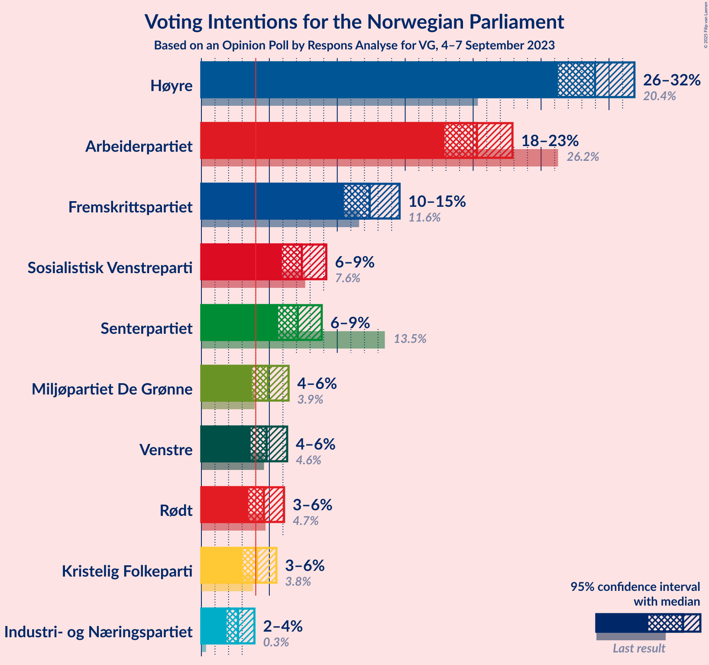

### Confidence Intervals

| Party | Last Result | Poll Result | 80% Confidence Interval | 90% Confidence Interval | 95% Confidence Interval | 99% Confidence Interval |
|:-----:|:-----------:|:-----------:|:-----------------------:|:-----------------------:|:-----------------------:|:-----------------------:|
| Høyre | 20.4% | 29.0% | 27.2–30.9% |26.7–31.4% |26.2–31.9% |25.4–32.8% |
| Arbeiderpartiet | 26.2% | 20.3% | 18.7–22.0% |18.3–22.5% |17.9–22.9% |17.2–23.7% |
| Fremskrittspartiet | 11.6% | 12.4% | 11.1–13.8% |10.8–14.2% |10.5–14.6% |9.9–15.3% |
| Sosialistisk Venstreparti | 7.6% | 7.4% | 6.4–8.6% |6.2–8.9% |5.9–9.2% |5.5–9.8% |
| Senterpartiet | 13.5% | 7.1% | 6.1–8.2% |5.9–8.6% |5.7–8.9% |5.2–9.4% |
| Miljøpartiet De Grønne | 3.9% | 4.9% | 4.1–5.9% |3.9–6.2% |3.7–6.4% |3.4–6.9% |
| Venstre | 4.6% | 4.8% | 4.0–5.8% |3.8–6.1% |3.6–6.3% |3.3–6.8% |
| Rødt | 4.7% | 4.6% | 3.8–5.6% |3.6–5.8% |3.5–6.1% |3.1–6.6% |
| Kristelig Folkeparti | 3.8% | 4.1% | 3.4–5.0% |3.2–5.3% |3.0–5.5% |2.7–6.0% |
| Industri- og Næringspartiet | 0.3% | 2.7% | 2.1–3.5% |2.0–3.7% |1.9–3.9% |1.6–4.3% |

*Note:* The poll result column reflects the actual value used in the calculations. Published results may vary slightly, and in addition be rounded to fewer digits.

## Seats

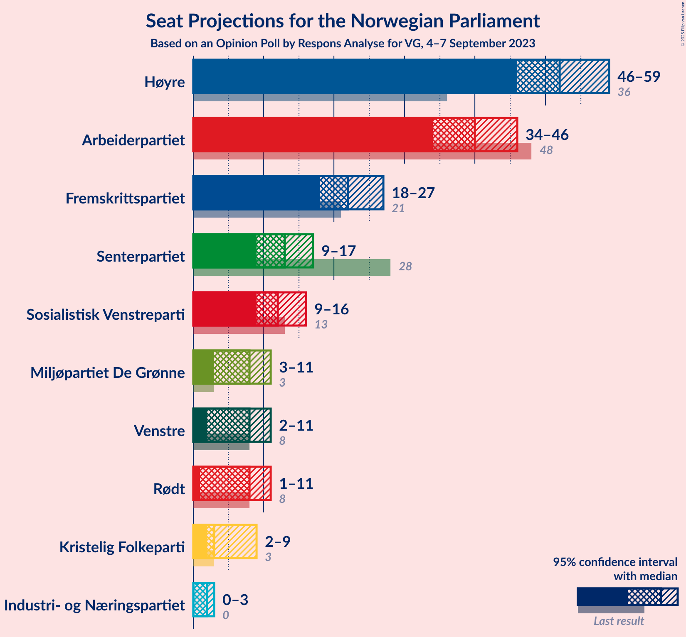

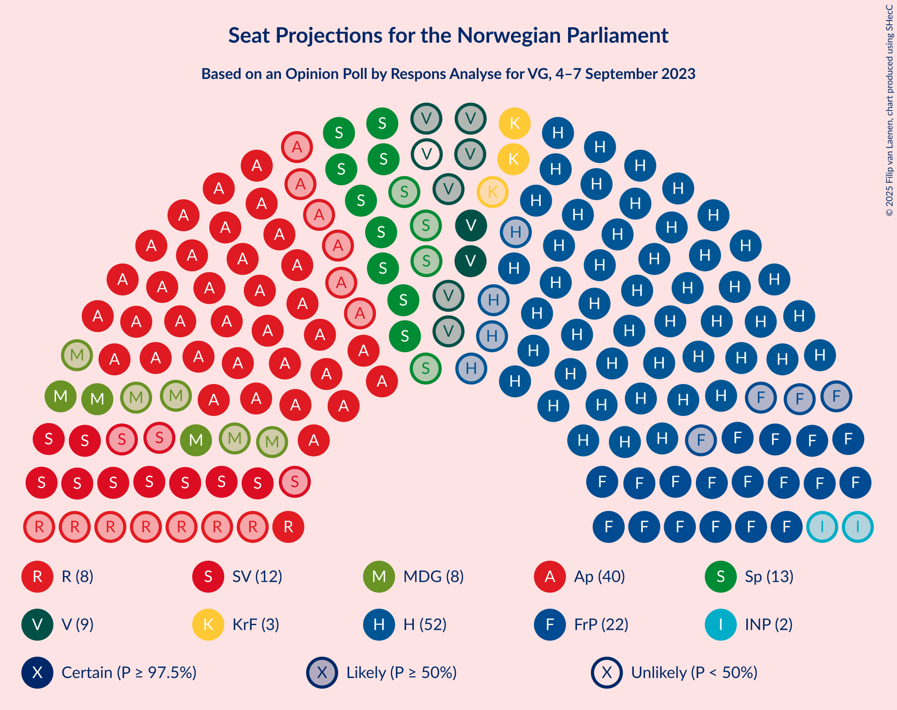

### Confidence Intervals

| Party | Last Result | Median | 80% Confidence Interval | 90% Confidence Interval | 95% Confidence Interval | 99% Confidence Interval |
|:-----:|:-----------:|:------:|:-----------------------:|:-----------------------:|:-----------------------:|:-----------------------:|
| <a href="#høyre">Høyre</a> | 36 | 52 | 48–56 |47–57 |46–59 |44–60 |
| <a href="#arbeiderpartiet">Arbeiderpartiet</a> | 48 | 40 | 35–45 |35–46 |34–46 |33–47 |
| <a href="#fremskrittspartiet">Fremskrittspartiet</a> | 21 | 22 | 18–25 |18–26 |18–27 |17–28 |
| <a href="#sosialistisk-venstreparti">Sosialistisk Venstreparti</a> | 13 | 12 | 10–15 |10–16 |9–16 |9–17 |
| <a href="#senterpartiet">Senterpartiet</a> | 28 | 13 | 10–14 |10–15 |9–17 |8–17 |
| <a href="#miljøpartiet-de-grønne">Miljøpartiet De Grønne</a> | 3 | 8 | 6–10 |3–10 |3–11 |2–12 |
| <a href="#venstre">Venstre</a> | 8 | 8 | 3–10 |3–11 |2–11 |2–12 |
| <a href="#rødt">Rødt</a> | 8 | 8 | 1–9 |1–10 |1–11 |1–12 |
| <a href="#kristelig-folkeparti">Kristelig Folkeparti</a> | 3 | 3 | 2–8 |2–9 |2–9 |2–10 |
| <a href="#industri--og-næringspartiet">Industri- og Næringspartiet</a> | 0 | 2 | 0–3 |0–3 |0–3 |0–7 |

### Høyre

*For a full overview of the results for this party, see the [Høyre](party-høyre.html) page.*

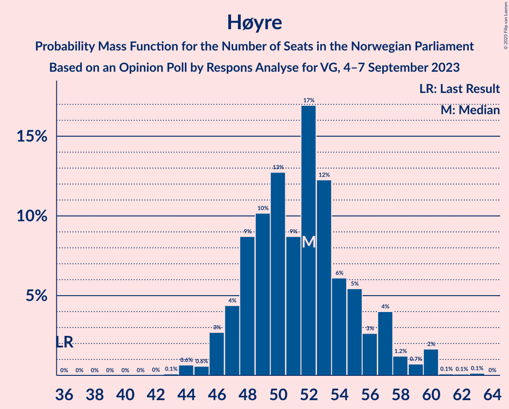

| Number of Seats | Probability | Accumulated | Special Marks |
|:---------------:|:-----------:|:-----------:|:-------------:|
| 36 | 0% | 100% | Last Result |
| 37 | 0% | 100% |  |
| 38 | 0% | 100% |  |
| 39 | 0% | 100% |  |
| 40 | 0% | 100% |  |
| 41 | 0% | 100% |  |
| 42 | 0% | 100% |  |
| 43 | 0.1% | 100% |  |
| 44 | 0.6% | 99.9% |  |
| 45 | 0.6% | 99.2% |  |
| 46 | 3% | 98.7% |  |
| 47 | 4% | 96% |  |
| 48 | 9% | 92% |  |
| 49 | 10% | 83% |  |
| 50 | 13% | 73% |  |
| 51 | 9% | 60% |  |
| 52 | 17% | 51% | Median |
| 53 | 12% | 34% |  |
| 54 | 6% | 22% |  |
| 55 | 5% | 16% |  |
| 56 | 3% | 11% |  |
| 57 | 4% | 8% |  |
| 58 | 1.2% | 4% |  |
| 59 | 0.7% | 3% |  |
| 60 | 2% | 2% |  |
| 61 | 0.1% | 0.3% |  |
| 62 | 0.1% | 0.2% |  |
| 63 | 0.1% | 0.1% |  |
| 64 | 0% | 0% |  |

### Arbeiderpartiet

*For a full overview of the results for this party, see the [Arbeiderpartiet](party-arbeiderpartiet.html) page.*

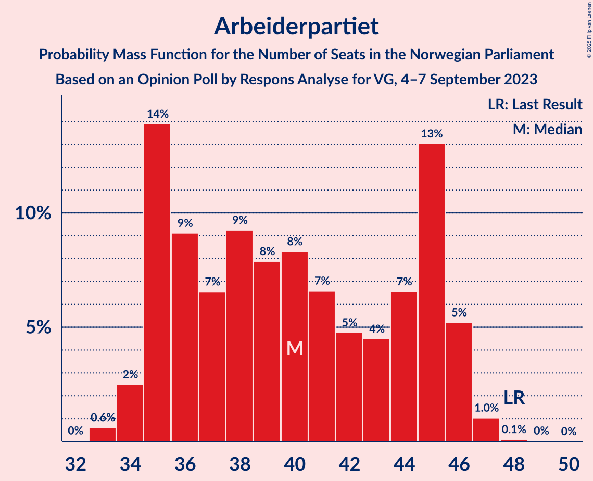

| Number of Seats | Probability | Accumulated | Special Marks |
|:---------------:|:-----------:|:-----------:|:-------------:|
| 33 | 0.6% | 100% |  |
| 34 | 2% | 99.3% |  |
| 35 | 14% | 97% |  |
| 36 | 9% | 83% |  |
| 37 | 7% | 74% |  |
| 38 | 9% | 67% |  |
| 39 | 8% | 58% |  |
| 40 | 8% | 50% | Median |
| 41 | 7% | 42% |  |
| 42 | 5% | 35% |  |
| 43 | 4% | 30% |  |
| 44 | 7% | 26% |  |
| 45 | 13% | 19% |  |
| 46 | 5% | 6% |  |
| 47 | 1.0% | 1.2% |  |
| 48 | 0.1% | 0.1% | Last Result |
| 49 | 0% | 0% |  |

### Fremskrittspartiet

*For a full overview of the results for this party, see the [Fremskrittspartiet](party-fremskrittspartiet.html) page.*

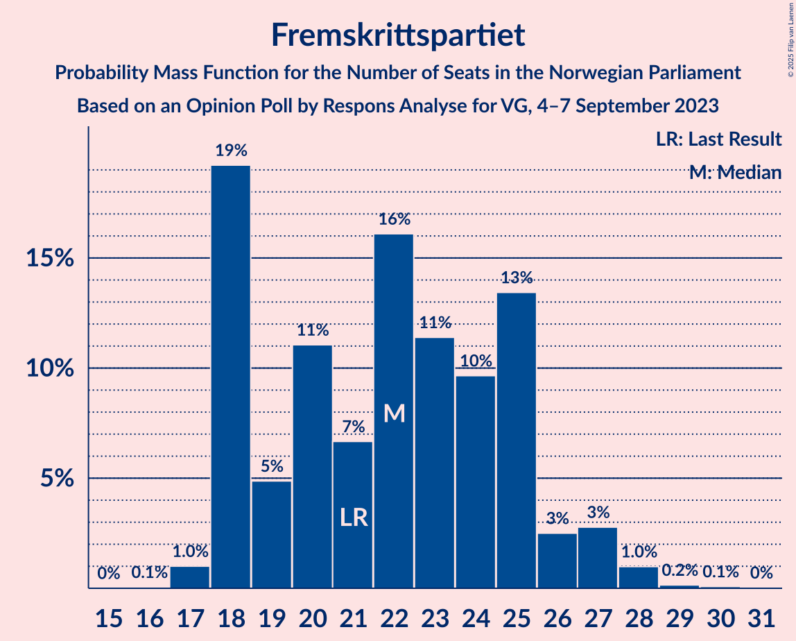

| Number of Seats | Probability | Accumulated | Special Marks |
|:---------------:|:-----------:|:-----------:|:-------------:|
| 16 | 0.1% | 100% |  |
| 17 | 1.0% | 99.9% |  |
| 18 | 19% | 98.9% |  |
| 19 | 5% | 80% |  |
| 20 | 11% | 75% |  |
| 21 | 7% | 64% | Last Result |
| 22 | 16% | 57% | Median |
| 23 | 11% | 41% |  |
| 24 | 10% | 30% |  |
| 25 | 13% | 20% |  |
| 26 | 3% | 7% |  |
| 27 | 3% | 4% |  |
| 28 | 1.0% | 1.2% |  |
| 29 | 0.2% | 0.3% |  |
| 30 | 0.1% | 0.1% |  |
| 31 | 0% | 0% |  |

### Sosialistisk Venstreparti

*For a full overview of the results for this party, see the [Sosialistisk Venstreparti](party-sosialistiskvenstreparti.html) page.*

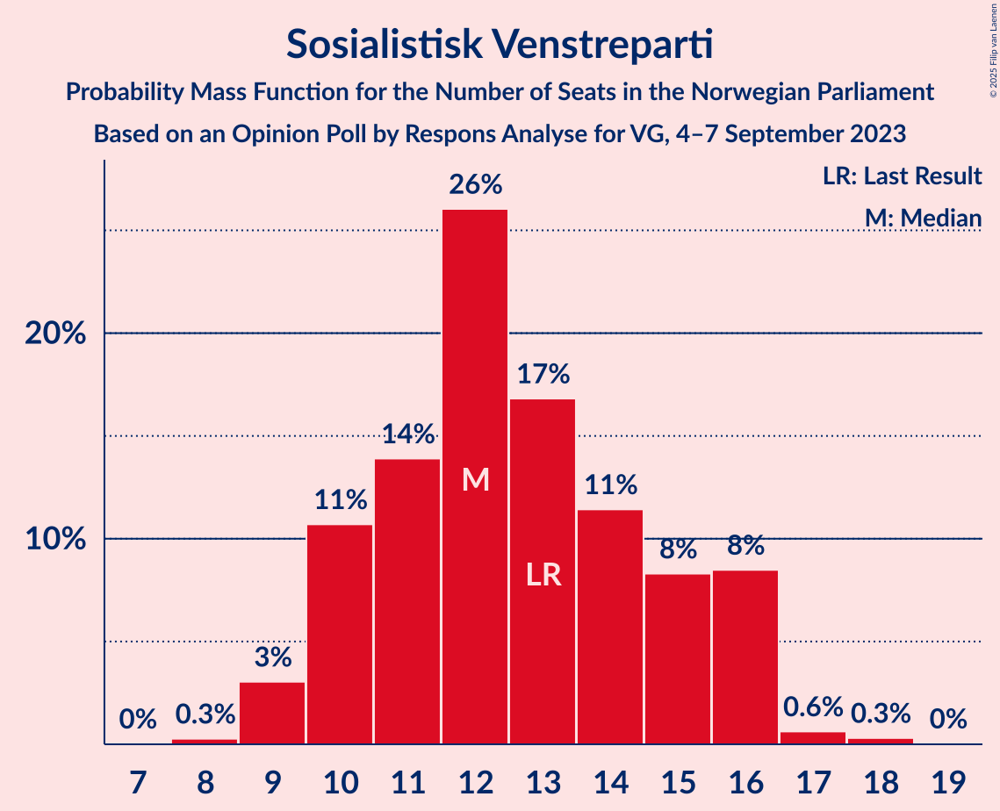

| Number of Seats | Probability | Accumulated | Special Marks |
|:---------------:|:-----------:|:-----------:|:-------------:|
| 8 | 0.3% | 100% |  |
| 9 | 3% | 99.7% |  |
| 10 | 11% | 97% |  |
| 11 | 14% | 86% |  |
| 12 | 26% | 72% | Median |
| 13 | 17% | 46% | Last Result |
| 14 | 11% | 29% |  |
| 15 | 8% | 18% |  |
| 16 | 8% | 9% |  |
| 17 | 0.6% | 1.0% |  |
| 18 | 0.3% | 0.3% |  |
| 19 | 0% | 0% |  |

### Senterpartiet

*For a full overview of the results for this party, see the [Senterpartiet](party-senterpartiet.html) page.*

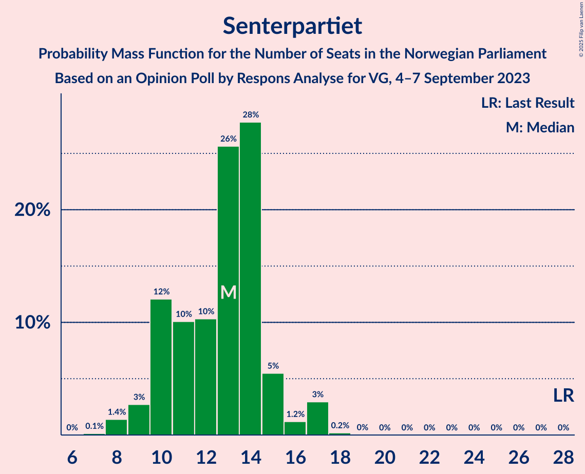

| Number of Seats | Probability | Accumulated | Special Marks |
|:---------------:|:-----------:|:-----------:|:-------------:|
| 7 | 0.1% | 100% |  |
| 8 | 1.4% | 99.9% |  |
| 9 | 3% | 98% |  |
| 10 | 12% | 96% |  |
| 11 | 10% | 84% |  |
| 12 | 10% | 74% |  |
| 13 | 26% | 63% | Median |
| 14 | 28% | 38% |  |
| 15 | 5% | 10% |  |
| 16 | 1.2% | 4% |  |
| 17 | 3% | 3% |  |
| 18 | 0.2% | 0.2% |  |
| 19 | 0% | 0% |  |
| 20 | 0% | 0% |  |
| 21 | 0% | 0% |  |
| 22 | 0% | 0% |  |
| 23 | 0% | 0% |  |
| 24 | 0% | 0% |  |
| 25 | 0% | 0% |  |
| 26 | 0% | 0% |  |
| 27 | 0% | 0% |  |
| 28 | 0% | 0% | Last Result |

### Miljøpartiet De Grønne

*For a full overview of the results for this party, see the [Miljøpartiet De Grønne](party-miljøpartietdegrønne.html) page.*

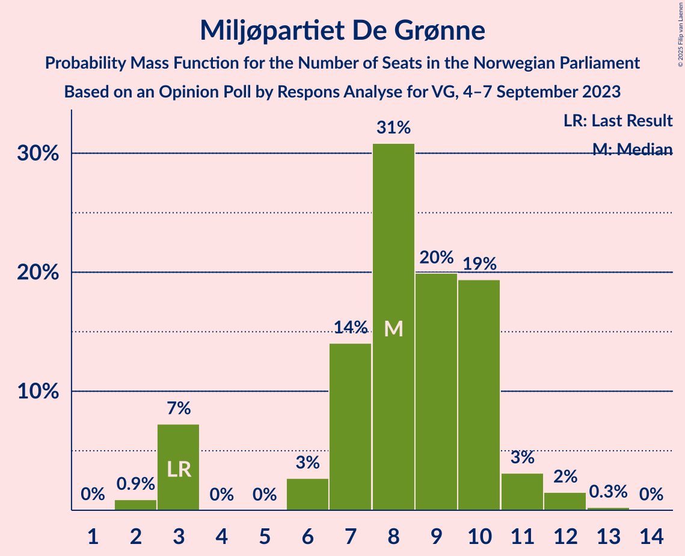

| Number of Seats | Probability | Accumulated | Special Marks |
|:---------------:|:-----------:|:-----------:|:-------------:|
| 2 | 0.9% | 100% |  |
| 3 | 7% | 99.1% | Last Result |
| 4 | 0% | 92% |  |
| 5 | 0% | 92% |  |
| 6 | 3% | 92% |  |
| 7 | 14% | 89% |  |
| 8 | 31% | 75% | Median |
| 9 | 20% | 44% |  |
| 10 | 19% | 24% |  |
| 11 | 3% | 5% |  |
| 12 | 2% | 2% |  |
| 13 | 0.3% | 0.3% |  |
| 14 | 0% | 0% |  |

### Venstre

*For a full overview of the results for this party, see the [Venstre](party-venstre.html) page.*

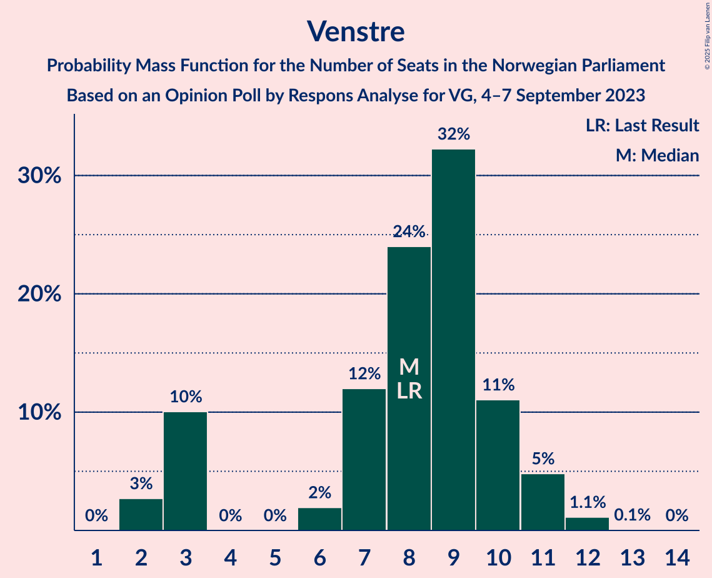

| Number of Seats | Probability | Accumulated | Special Marks |
|:---------------:|:-----------:|:-----------:|:-------------:|
| 2 | 3% | 100% |  |
| 3 | 10% | 97% |  |
| 4 | 0% | 87% |  |
| 5 | 0% | 87% |  |
| 6 | 2% | 87% |  |
| 7 | 12% | 85% |  |
| 8 | 24% | 73% | Last Result, Median |
| 9 | 32% | 49% |  |
| 10 | 11% | 17% |  |
| 11 | 5% | 6% |  |
| 12 | 1.1% | 1.2% |  |
| 13 | 0.1% | 0.1% |  |
| 14 | 0% | 0% |  |

### Rødt

*For a full overview of the results for this party, see the [Rødt](party-rødt.html) page.*

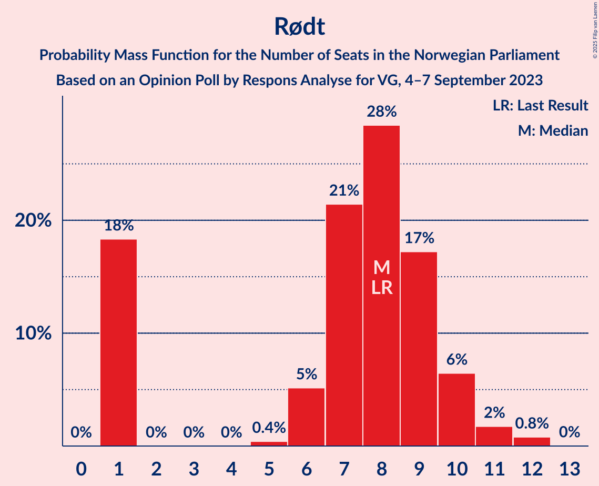

| Number of Seats | Probability | Accumulated | Special Marks |
|:---------------:|:-----------:|:-----------:|:-------------:|
| 1 | 18% | 100% |  |
| 2 | 0% | 82% |  |
| 3 | 0% | 82% |  |
| 4 | 0% | 82% |  |
| 5 | 0.4% | 82% |  |
| 6 | 5% | 81% |  |
| 7 | 21% | 76% |  |
| 8 | 28% | 55% | Last Result, Median |
| 9 | 17% | 26% |  |
| 10 | 6% | 9% |  |
| 11 | 2% | 3% |  |
| 12 | 0.8% | 0.8% |  |
| 13 | 0% | 0% |  |

### Kristelig Folkeparti

*For a full overview of the results for this party, see the [Kristelig Folkeparti](party-kristeligfolkeparti.html) page.*

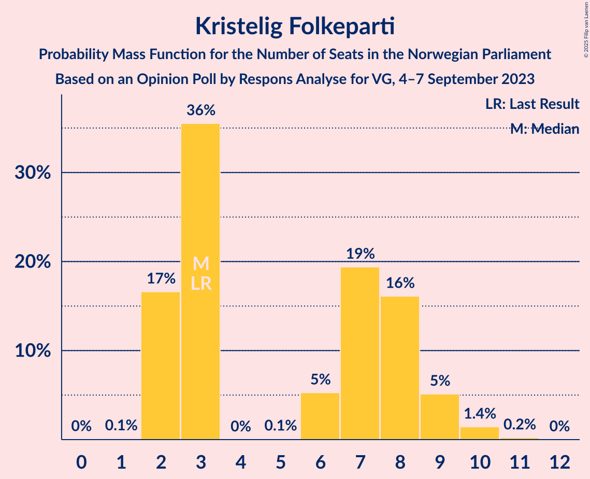

| Number of Seats | Probability | Accumulated | Special Marks |
|:---------------:|:-----------:|:-----------:|:-------------:|
| 1 | 0.1% | 100% |  |
| 2 | 17% | 99.8% |  |
| 3 | 36% | 83% | Last Result, Median |
| 4 | 0% | 48% |  |
| 5 | 0.1% | 48% |  |
| 6 | 5% | 48% |  |
| 7 | 19% | 42% |  |
| 8 | 16% | 23% |  |
| 9 | 5% | 7% |  |
| 10 | 1.4% | 2% |  |
| 11 | 0.2% | 0.2% |  |
| 12 | 0% | 0% |  |

### Industri- og Næringspartiet

*For a full overview of the results for this party, see the [Industri- og Næringspartiet](party-industri-ognæringspartiet.html) page.*

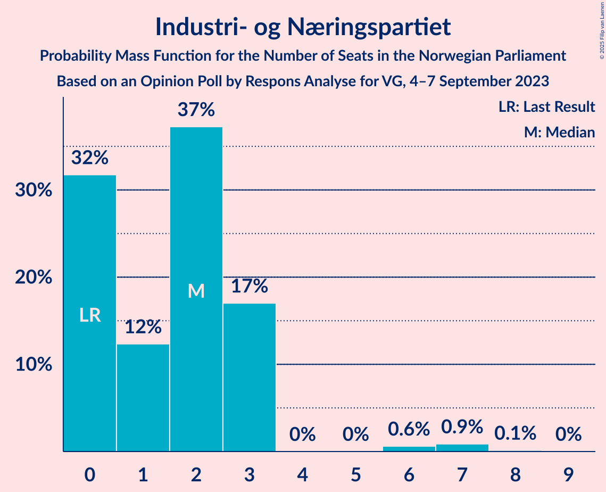

| Number of Seats | Probability | Accumulated | Special Marks |
|:---------------:|:-----------:|:-----------:|:-------------:|
| 0 | 32% | 100% | Last Result |
| 1 | 12% | 68% |  |
| 2 | 37% | 56% | Median |
| 3 | 17% | 19% |  |
| 4 | 0% | 2% |  |
| 5 | 0% | 2% |  |
| 6 | 0.6% | 2% |  |
| 7 | 0.9% | 1.0% |  |
| 8 | 0.1% | 0.2% |  |
| 9 | 0% | 0% |  |

## Coalitions

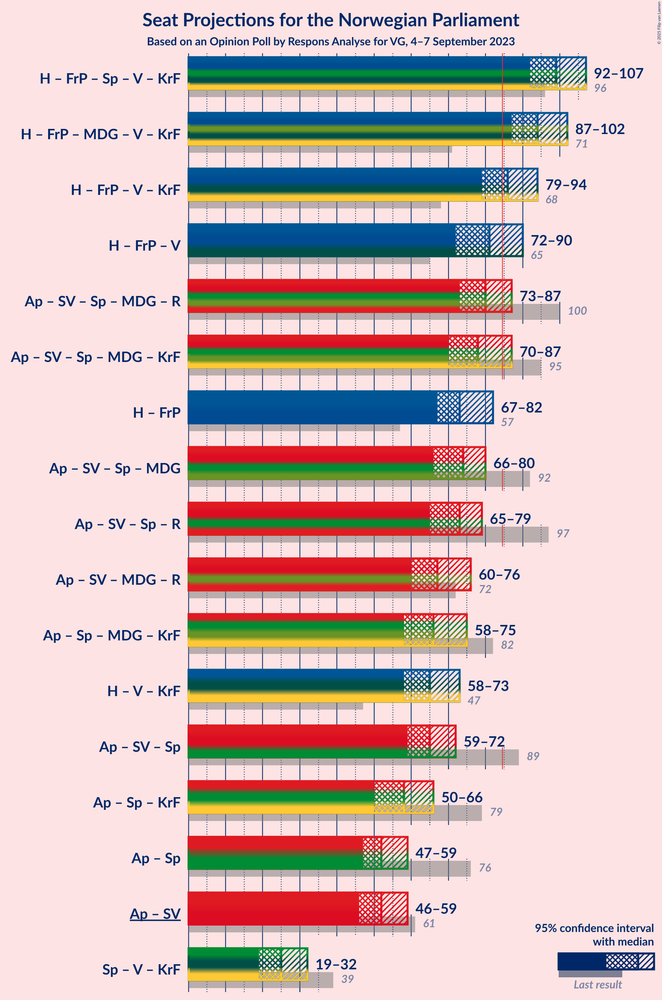

### Confidence Intervals

| Coalition | Last Result | Median | Majority? | 80% Confidence Interval | 90% Confidence Interval | 95% Confidence Interval | 99% Confidence Interval |
|:---------:|:-----------:|:------:|:---------:|:-----------------------:|:-----------------------:|:-----------------------:|:-----------------------:|
| Høyre – Fremskrittspartiet – Senterpartiet – Venstre – Kristelig Folkeparti | 96 | 99 | 100% | 93–105 | 92–106 | 92–107 | 90–109 |
| Høyre – Fremskrittspartiet – Miljøpartiet De Grønne – Venstre – Kristelig Folkeparti | 71 | 94 | 99.8% | 89–100 | 88–101 | 87–102 | 86–104 |
| Høyre – Fremskrittspartiet – Venstre – Kristelig Folkeparti | 68 | 86 | 59% | 81–92 | 80–93 | 79–94 | 78–96 |
| Høyre – Fremskrittspartiet – Venstre | 65 | 81 | 15% | 76–86 | 74–88 | 72–90 | 70–92 |
| Arbeiderpartiet – Sosialistisk Venstreparti – Senterpartiet – Miljøpartiet De Grønne – Rødt | 100 | 80 | 16% | 74–86 | 74–87 | 73–87 | 70–88 |
| Arbeiderpartiet – Sosialistisk Venstreparti – Senterpartiet – Miljøpartiet De Grønne – Kristelig Folkeparti | 95 | 78 | 8% | 74–83 | 72–86 | 70–87 | 68–90 |
| Høyre – Fremskrittspartiet | 57 | 73 | 0.1% | 69–78 | 68–80 | 67–82 | 65–83 |
| Arbeiderpartiet – Sosialistisk Venstreparti – Senterpartiet – Miljøpartiet De Grønne | 92 | 74 | 0.1% | 68–79 | 67–80 | 66–80 | 64–82 |
| Arbeiderpartiet – Sosialistisk Venstreparti – Senterpartiet – Rødt | 97 | 73 | 0% | 66–77 | 66–78 | 65–79 | 62–80 |
| Arbeiderpartiet – Sosialistisk Venstreparti – Miljøpartiet De Grønne – Rødt | 72 | 67 | 0% | 61–73 | 60–74 | 60–76 | 57–76 |
| Arbeiderpartiet – Senterpartiet – Miljøpartiet De Grønne – Kristelig Folkeparti | 82 | 66 | 0% | 60–72 | 59–74 | 58–75 | 55–76 |
| Høyre – Venstre – Kristelig Folkeparti | 47 | 65 | 0% | 59–69 | 59–71 | 58–73 | 56–75 |
| Arbeiderpartiet – Sosialistisk Venstreparti – Senterpartiet | 89 | 65 | 0% | 60–70 | 59–70 | 59–72 | 57–73 |
| Arbeiderpartiet – Senterpartiet – Kristelig Folkeparti | 79 | 58 | 0% | 52–63 | 51–66 | 50–66 | 49–67 |
| Arbeiderpartiet – Senterpartiet | 76 | 52 | 0% | 48–58 | 48–59 | 47–59 | 45–60 |
| Arbeiderpartiet – Sosialistisk Venstreparti | 61 | 52 | 0% | 47–57 | 46–58 | 46–59 | 45–60 |
| Senterpartiet – Venstre – Kristelig Folkeparti | 39 | 25 | 0% | 22–30 | 20–31 | 19–32 | 17–34 |

### Høyre – Fremskrittspartiet – Senterpartiet – Venstre – Kristelig Folkeparti

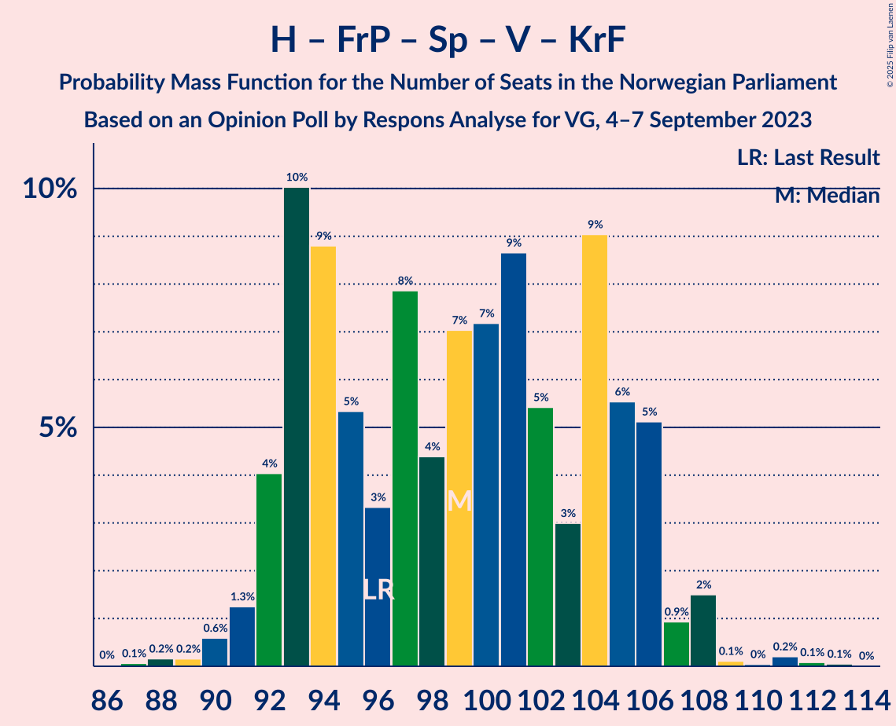

| Number of Seats | Probability | Accumulated | Special Marks |
|:---------------:|:-----------:|:-----------:|:-------------:|
| 87 | 0.1% | 100% |  |
| 88 | 0.2% | 99.9% |  |
| 89 | 0.2% | 99.7% |  |
| 90 | 0.6% | 99.6% |  |
| 91 | 1.3% | 99.0% |  |
| 92 | 4% | 98% |  |
| 93 | 10% | 94% |  |
| 94 | 9% | 84% |  |
| 95 | 5% | 75% |  |
| 96 | 3% | 70% | Last Result |
| 97 | 8% | 66% |  |
| 98 | 4% | 58% | Median |
| 99 | 7% | 54% |  |
| 100 | 7% | 47% |  |
| 101 | 9% | 40% |  |
| 102 | 5% | 31% |  |
| 103 | 3% | 26% |  |
| 104 | 9% | 23% |  |
| 105 | 6% | 14% |  |
| 106 | 5% | 8% |  |
| 107 | 0.9% | 3% |  |
| 108 | 2% | 2% |  |
| 109 | 0.1% | 0.5% |  |
| 110 | 0% | 0.4% |  |
| 111 | 0.2% | 0.4% |  |
| 112 | 0.1% | 0.2% |  |
| 113 | 0.1% | 0.1% |  |
| 114 | 0% | 0% |  |

### Høyre – Fremskrittspartiet – Miljøpartiet De Grønne – Venstre – Kristelig Folkeparti

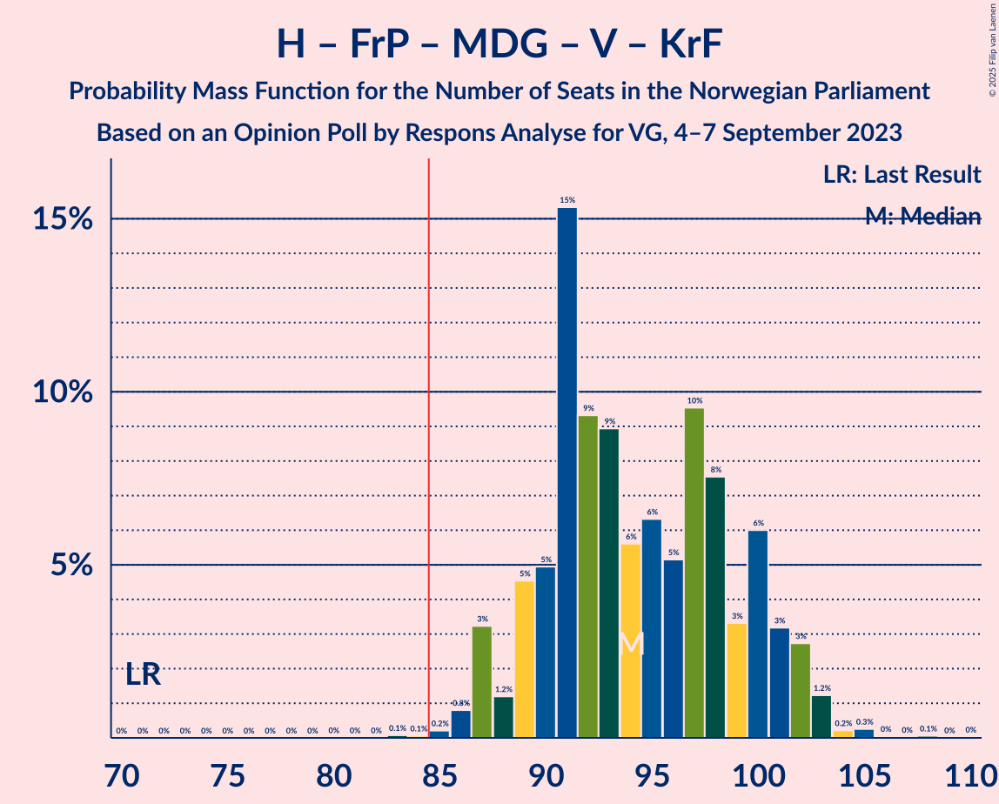

| Number of Seats | Probability | Accumulated | Special Marks |
|:---------------:|:-----------:|:-----------:|:-------------:|
| 71 | 0% | 100% | Last Result |
| 72 | 0% | 100% |  |
| 73 | 0% | 100% |  |
| 74 | 0% | 100% |  |
| 75 | 0% | 100% |  |
| 76 | 0% | 100% |  |
| 77 | 0% | 100% |  |
| 78 | 0% | 100% |  |
| 79 | 0% | 100% |  |
| 80 | 0% | 100% |  |
| 81 | 0% | 100% |  |
| 82 | 0% | 100% |  |
| 83 | 0.1% | 100% |  |
| 84 | 0.1% | 99.9% |  |
| 85 | 0.2% | 99.8% | Majority |
| 86 | 0.8% | 99.6% |  |
| 87 | 3% | 98.8% |  |
| 88 | 1.2% | 96% |  |
| 89 | 5% | 94% |  |
| 90 | 5% | 90% |  |
| 91 | 15% | 85% |  |
| 92 | 9% | 70% |  |
| 93 | 9% | 60% | Median |
| 94 | 6% | 51% |  |
| 95 | 6% | 46% |  |
| 96 | 5% | 39% |  |
| 97 | 10% | 34% |  |
| 98 | 8% | 25% |  |
| 99 | 3% | 17% |  |
| 100 | 6% | 14% |  |
| 101 | 3% | 8% |  |
| 102 | 3% | 5% |  |
| 103 | 1.2% | 2% |  |
| 104 | 0.2% | 0.6% |  |
| 105 | 0.3% | 0.4% |  |
| 106 | 0% | 0.2% |  |
| 107 | 0% | 0.1% |  |
| 108 | 0.1% | 0.1% |  |
| 109 | 0% | 0% |  |

### Høyre – Fremskrittspartiet – Venstre – Kristelig Folkeparti

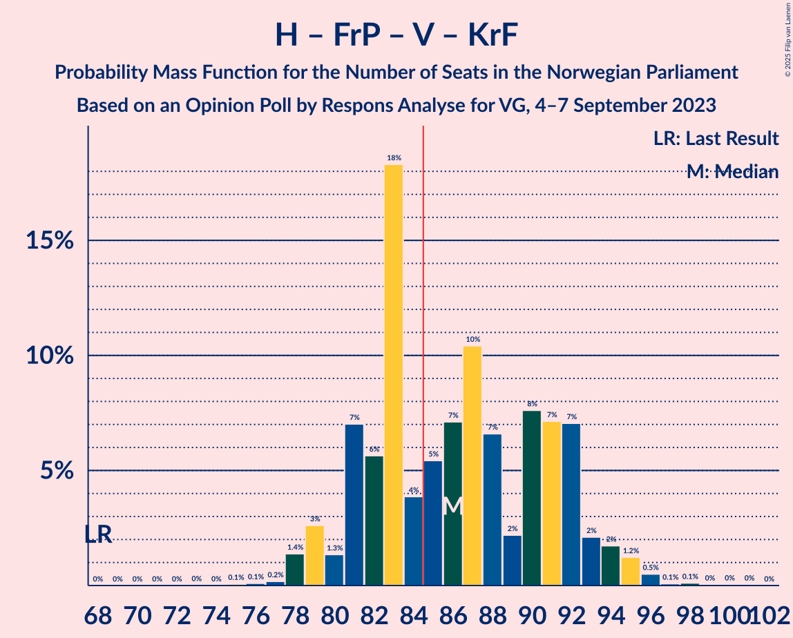

| Number of Seats | Probability | Accumulated | Special Marks |
|:---------------:|:-----------:|:-----------:|:-------------:|
| 68 | 0% | 100% | Last Result |
| 69 | 0% | 100% |  |
| 70 | 0% | 100% |  |
| 71 | 0% | 100% |  |
| 72 | 0% | 100% |  |
| 73 | 0% | 100% |  |
| 74 | 0% | 100% |  |
| 75 | 0.1% | 100% |  |
| 76 | 0.1% | 99.9% |  |
| 77 | 0.2% | 99.8% |  |
| 78 | 1.4% | 99.6% |  |
| 79 | 3% | 98% |  |
| 80 | 1.3% | 96% |  |
| 81 | 7% | 94% |  |
| 82 | 6% | 87% |  |
| 83 | 18% | 82% |  |
| 84 | 4% | 63% |  |
| 85 | 5% | 59% | Median, Majority |
| 86 | 7% | 54% |  |
| 87 | 10% | 47% |  |
| 88 | 7% | 36% |  |
| 89 | 2% | 30% |  |
| 90 | 8% | 28% |  |
| 91 | 7% | 20% |  |
| 92 | 7% | 13% |  |
| 93 | 2% | 6% |  |
| 94 | 2% | 4% |  |
| 95 | 1.2% | 2% |  |
| 96 | 0.5% | 0.8% |  |
| 97 | 0.1% | 0.3% |  |
| 98 | 0.1% | 0.2% |  |
| 99 | 0% | 0.1% |  |
| 100 | 0% | 0.1% |  |
| 101 | 0% | 0% |  |

### Høyre – Fremskrittspartiet – Venstre

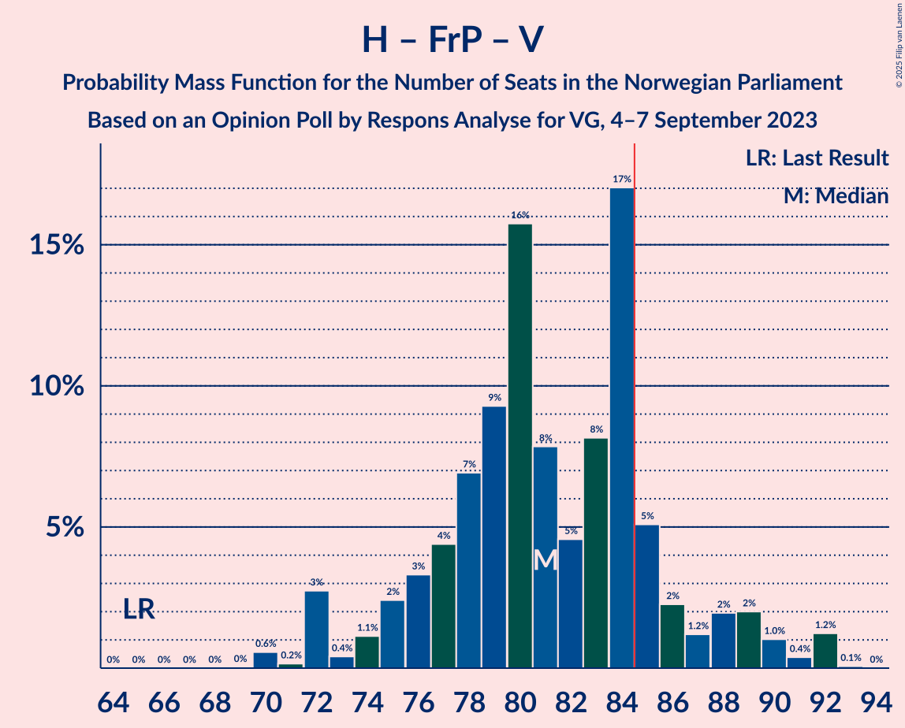

| Number of Seats | Probability | Accumulated | Special Marks |
|:---------------:|:-----------:|:-----------:|:-------------:|
| 65 | 0% | 100% | Last Result |
| 66 | 0% | 100% |  |
| 67 | 0% | 100% |  |
| 68 | 0% | 100% |  |
| 69 | 0% | 100% |  |
| 70 | 0.6% | 100% |  |
| 71 | 0.2% | 99.4% |  |
| 72 | 3% | 99.2% |  |
| 73 | 0.4% | 96% |  |
| 74 | 1.1% | 96% |  |
| 75 | 2% | 95% |  |
| 76 | 3% | 93% |  |
| 77 | 4% | 89% |  |
| 78 | 7% | 85% |  |
| 79 | 9% | 78% |  |
| 80 | 16% | 69% |  |
| 81 | 8% | 53% |  |
| 82 | 5% | 45% | Median |
| 83 | 8% | 40% |  |
| 84 | 17% | 32% |  |
| 85 | 5% | 15% | Majority |
| 86 | 2% | 10% |  |
| 87 | 1.2% | 8% |  |
| 88 | 2% | 7% |  |
| 89 | 2% | 5% |  |
| 90 | 1.0% | 3% |  |
| 91 | 0.4% | 2% |  |
| 92 | 1.2% | 1.3% |  |
| 93 | 0.1% | 0.1% |  |
| 94 | 0% | 0% |  |

### Arbeiderpartiet – Sosialistisk Venstreparti – Senterpartiet – Miljøpartiet De Grønne – Rødt

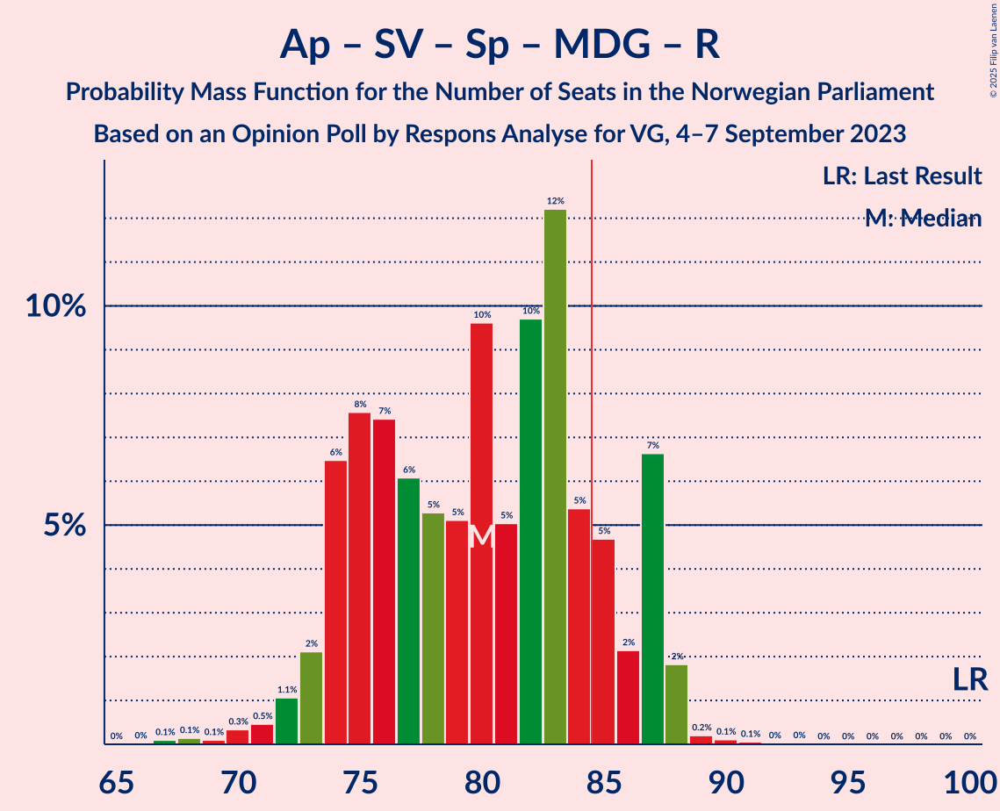

| Number of Seats | Probability | Accumulated | Special Marks |
|:---------------:|:-----------:|:-----------:|:-------------:|
| 67 | 0.1% | 100% |  |
| 68 | 0.1% | 99.9% |  |
| 69 | 0.1% | 99.7% |  |
| 70 | 0.3% | 99.6% |  |
| 71 | 0.5% | 99.3% |  |
| 72 | 1.1% | 98.8% |  |
| 73 | 2% | 98% |  |
| 74 | 6% | 96% |  |
| 75 | 8% | 89% |  |
| 76 | 7% | 82% |  |
| 77 | 6% | 74% |  |
| 78 | 5% | 68% |  |
| 79 | 5% | 63% |  |
| 80 | 10% | 58% |  |
| 81 | 5% | 48% | Median |
| 82 | 10% | 43% |  |
| 83 | 12% | 33% |  |
| 84 | 5% | 21% |  |
| 85 | 5% | 16% | Majority |
| 86 | 2% | 11% |  |
| 87 | 7% | 9% |  |
| 88 | 2% | 2% |  |
| 89 | 0.2% | 0.4% |  |
| 90 | 0.1% | 0.2% |  |
| 91 | 0.1% | 0.1% |  |
| 92 | 0% | 0.1% |  |
| 93 | 0% | 0% |  |
| 94 | 0% | 0% |  |
| 95 | 0% | 0% |  |
| 96 | 0% | 0% |  |
| 97 | 0% | 0% |  |
| 98 | 0% | 0% |  |
| 99 | 0% | 0% |  |
| 100 | 0% | 0% | Last Result |

### Arbeiderpartiet – Sosialistisk Venstreparti – Senterpartiet – Miljøpartiet De Grønne – Kristelig Folkeparti

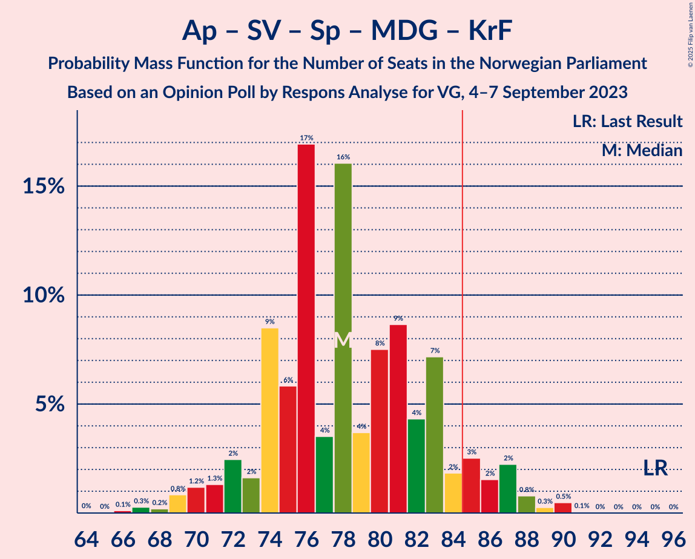

| Number of Seats | Probability | Accumulated | Special Marks |
|:---------------:|:-----------:|:-----------:|:-------------:|
| 64 | 0% | 100% |  |
| 65 | 0% | 99.9% |  |
| 66 | 0.1% | 99.9% |  |
| 67 | 0.3% | 99.8% |  |
| 68 | 0.2% | 99.5% |  |
| 69 | 0.8% | 99.3% |  |
| 70 | 1.2% | 98.5% |  |
| 71 | 1.3% | 97% |  |
| 72 | 2% | 96% |  |
| 73 | 2% | 94% |  |
| 74 | 9% | 92% |  |
| 75 | 6% | 83% |  |
| 76 | 17% | 78% | Median |
| 77 | 4% | 61% |  |
| 78 | 16% | 57% |  |
| 79 | 4% | 41% |  |
| 80 | 8% | 37% |  |
| 81 | 9% | 30% |  |
| 82 | 4% | 21% |  |
| 83 | 7% | 17% |  |
| 84 | 2% | 10% |  |
| 85 | 3% | 8% | Majority |
| 86 | 2% | 5% |  |
| 87 | 2% | 4% |  |
| 88 | 0.8% | 2% |  |
| 89 | 0.3% | 0.8% |  |
| 90 | 0.5% | 0.5% |  |
| 91 | 0.1% | 0.1% |  |
| 92 | 0% | 0% |  |
| 93 | 0% | 0% |  |
| 94 | 0% | 0% |  |
| 95 | 0% | 0% | Last Result |

### Høyre – Fremskrittspartiet

| Number of Seats | Probability | Accumulated | Special Marks |
|:---------------:|:-----------:|:-----------:|:-------------:|
| 57 | 0% | 100% | Last Result |
| 58 | 0% | 100% |  |
| 59 | 0% | 100% |  |
| 60 | 0% | 100% |  |
| 61 | 0% | 100% |  |
| 62 | 0% | 100% |  |
| 63 | 0% | 100% |  |
| 64 | 0.1% | 100% |  |
| 65 | 2% | 99.9% |  |
| 66 | 0.5% | 98% |  |
| 67 | 0.9% | 98% |  |
| 68 | 5% | 97% |  |
| 69 | 8% | 92% |  |
| 70 | 7% | 84% |  |
| 71 | 17% | 77% |  |
| 72 | 5% | 60% |  |
| 73 | 8% | 55% |  |
| 74 | 6% | 47% | Median |
| 75 | 14% | 41% |  |
| 76 | 8% | 26% |  |
| 77 | 5% | 18% |  |
| 78 | 3% | 13% |  |
| 79 | 5% | 10% |  |
| 80 | 1.2% | 5% |  |
| 81 | 0.5% | 4% |  |
| 82 | 2% | 4% |  |
| 83 | 1.3% | 2% |  |
| 84 | 0.2% | 0.3% |  |
| 85 | 0.1% | 0.1% | Majority |
| 86 | 0% | 0% |  |

### Arbeiderpartiet – Sosialistisk Venstreparti – Senterpartiet – Miljøpartiet De Grønne

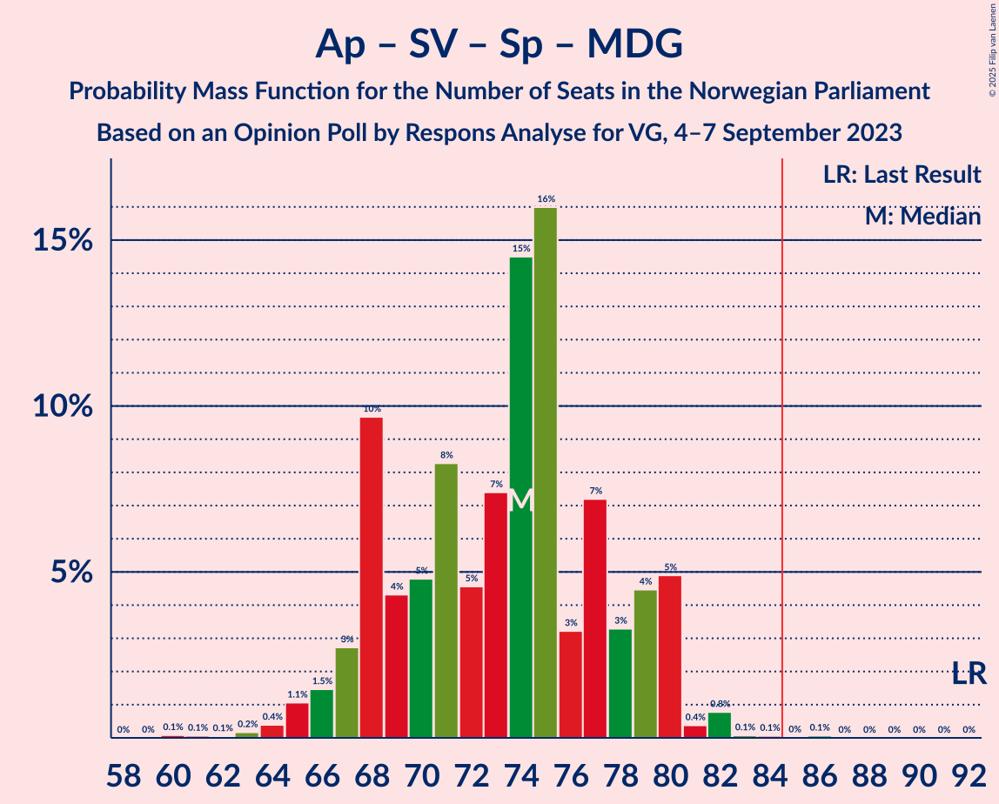

| Number of Seats | Probability | Accumulated | Special Marks |
|:---------------:|:-----------:|:-----------:|:-------------:|
| 60 | 0.1% | 100% |  |
| 61 | 0.1% | 99.9% |  |
| 62 | 0.1% | 99.8% |  |
| 63 | 0.2% | 99.8% |  |
| 64 | 0.4% | 99.6% |  |
| 65 | 1.1% | 99.2% |  |
| 66 | 1.5% | 98% |  |
| 67 | 3% | 97% |  |
| 68 | 10% | 94% |  |
| 69 | 4% | 84% |  |
| 70 | 5% | 80% |  |
| 71 | 8% | 75% |  |
| 72 | 5% | 67% |  |
| 73 | 7% | 62% | Median |
| 74 | 15% | 55% |  |
| 75 | 16% | 40% |  |
| 76 | 3% | 24% |  |
| 77 | 7% | 21% |  |
| 78 | 3% | 14% |  |
| 79 | 4% | 11% |  |
| 80 | 5% | 6% |  |
| 81 | 0.4% | 1.4% |  |
| 82 | 0.8% | 1.0% |  |
| 83 | 0.1% | 0.2% |  |
| 84 | 0.1% | 0.1% |  |
| 85 | 0% | 0.1% | Majority |
| 86 | 0.1% | 0.1% |  |
| 87 | 0% | 0% |  |
| 88 | 0% | 0% |  |
| 89 | 0% | 0% |  |
| 90 | 0% | 0% |  |
| 91 | 0% | 0% |  |
| 92 | 0% | 0% | Last Result |

### Arbeiderpartiet – Sosialistisk Venstreparti – Senterpartiet – Rødt

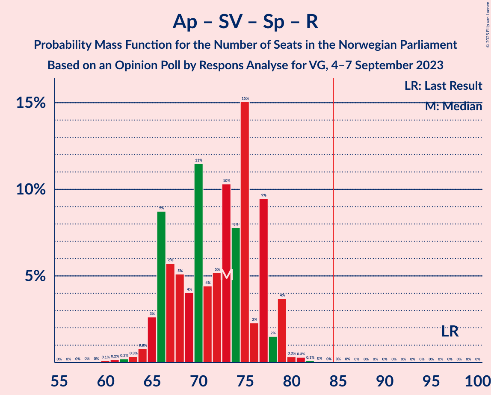

| Number of Seats | Probability | Accumulated | Special Marks |
|:---------------:|:-----------:|:-----------:|:-------------:|
| 58 | 0% | 100% |  |
| 59 | 0% | 99.9% |  |
| 60 | 0.1% | 99.9% |  |
| 61 | 0.2% | 99.8% |  |
| 62 | 0.2% | 99.6% |  |
| 63 | 0.3% | 99.4% |  |
| 64 | 0.8% | 99.1% |  |
| 65 | 3% | 98% |  |
| 66 | 9% | 96% |  |
| 67 | 6% | 87% |  |
| 68 | 5% | 81% |  |
| 69 | 4% | 76% |  |
| 70 | 11% | 72% |  |
| 71 | 4% | 61% |  |
| 72 | 5% | 56% |  |
| 73 | 10% | 51% | Median |
| 74 | 8% | 41% |  |
| 75 | 15% | 33% |  |
| 76 | 2% | 18% |  |
| 77 | 9% | 15% |  |
| 78 | 2% | 6% |  |
| 79 | 4% | 5% |  |
| 80 | 0.3% | 0.8% |  |
| 81 | 0.3% | 0.5% |  |
| 82 | 0.1% | 0.2% |  |
| 83 | 0% | 0.1% |  |
| 84 | 0% | 0% |  |
| 85 | 0% | 0% | Majority |
| 86 | 0% | 0% |  |
| 87 | 0% | 0% |  |
| 88 | 0% | 0% |  |
| 89 | 0% | 0% |  |
| 90 | 0% | 0% |  |
| 91 | 0% | 0% |  |
| 92 | 0% | 0% |  |
| 93 | 0% | 0% |  |
| 94 | 0% | 0% |  |
| 95 | 0% | 0% |  |
| 96 | 0% | 0% |  |
| 97 | 0% | 0% | Last Result |

### Arbeiderpartiet – Sosialistisk Venstreparti – Miljøpartiet De Grønne – Rødt

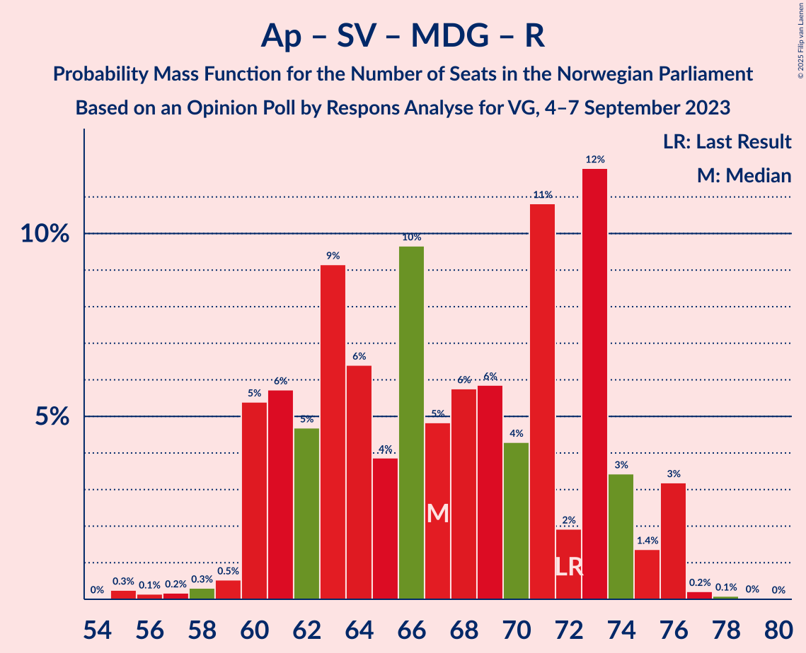

| Number of Seats | Probability | Accumulated | Special Marks |
|:---------------:|:-----------:|:-----------:|:-------------:|
| 54 | 0% | 100% |  |
| 55 | 0.3% | 99.9% |  |
| 56 | 0.1% | 99.7% |  |
| 57 | 0.2% | 99.5% |  |
| 58 | 0.3% | 99.4% |  |
| 59 | 0.5% | 99.1% |  |
| 60 | 5% | 98.5% |  |
| 61 | 6% | 93% |  |
| 62 | 5% | 87% |  |
| 63 | 9% | 83% |  |
| 64 | 6% | 74% |  |
| 65 | 4% | 67% |  |
| 66 | 10% | 63% |  |
| 67 | 5% | 54% |  |
| 68 | 6% | 49% | Median |
| 69 | 6% | 43% |  |
| 70 | 4% | 37% |  |
| 71 | 11% | 33% |  |
| 72 | 2% | 22% | Last Result |
| 73 | 12% | 20% |  |
| 74 | 3% | 8% |  |
| 75 | 1.4% | 5% |  |
| 76 | 3% | 4% |  |
| 77 | 0.2% | 0.4% |  |
| 78 | 0.1% | 0.1% |  |
| 79 | 0% | 0.1% |  |
| 80 | 0% | 0% |  |

### Arbeiderpartiet – Senterpartiet – Miljøpartiet De Grønne – Kristelig Folkeparti

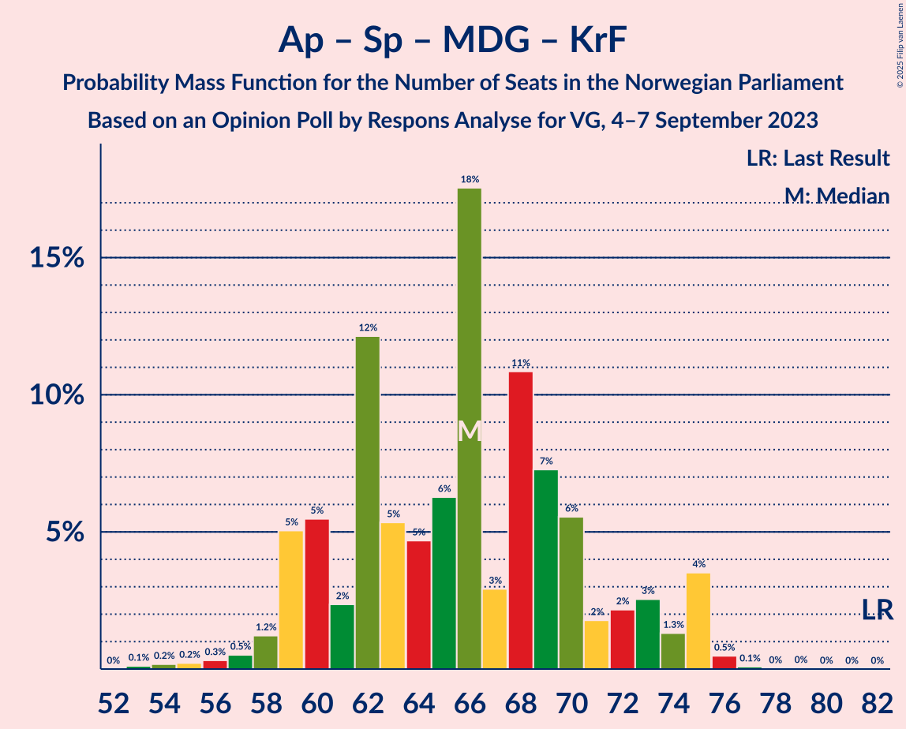

| Number of Seats | Probability | Accumulated | Special Marks |
|:---------------:|:-----------:|:-----------:|:-------------:|
| 53 | 0.1% | 100% |  |
| 54 | 0.2% | 99.9% |  |
| 55 | 0.2% | 99.7% |  |
| 56 | 0.3% | 99.5% |  |
| 57 | 0.5% | 99.1% |  |
| 58 | 1.2% | 98.6% |  |
| 59 | 5% | 97% |  |
| 60 | 5% | 92% |  |
| 61 | 2% | 87% |  |
| 62 | 12% | 85% |  |
| 63 | 5% | 72% |  |
| 64 | 5% | 67% | Median |
| 65 | 6% | 62% |  |
| 66 | 18% | 56% |  |
| 67 | 3% | 39% |  |
| 68 | 11% | 36% |  |
| 69 | 7% | 25% |  |
| 70 | 6% | 17% |  |
| 71 | 2% | 12% |  |
| 72 | 2% | 10% |  |
| 73 | 3% | 8% |  |
| 74 | 1.3% | 5% |  |
| 75 | 4% | 4% |  |
| 76 | 0.5% | 0.6% |  |
| 77 | 0.1% | 0.2% |  |
| 78 | 0% | 0.1% |  |
| 79 | 0% | 0% |  |
| 80 | 0% | 0% |  |
| 81 | 0% | 0% |  |
| 82 | 0% | 0% | Last Result |

### Høyre – Venstre – Kristelig Folkeparti

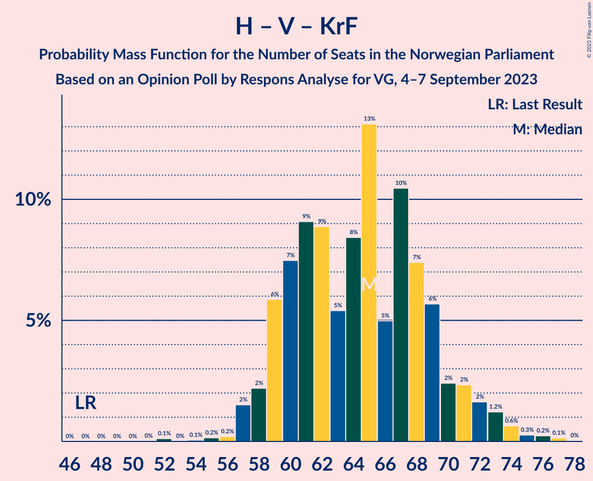

| Number of Seats | Probability | Accumulated | Special Marks |
|:---------------:|:-----------:|:-----------:|:-------------:|
| 47 | 0% | 100% | Last Result |
| 48 | 0% | 100% |  |
| 49 | 0% | 100% |  |
| 50 | 0% | 100% |  |
| 51 | 0% | 100% |  |
| 52 | 0.1% | 100% |  |
| 53 | 0% | 99.9% |  |
| 54 | 0.1% | 99.8% |  |
| 55 | 0.2% | 99.8% |  |
| 56 | 0.2% | 99.6% |  |
| 57 | 2% | 99.4% |  |
| 58 | 2% | 98% |  |
| 59 | 6% | 96% |  |
| 60 | 7% | 90% |  |
| 61 | 9% | 82% |  |
| 62 | 9% | 73% |  |
| 63 | 5% | 64% | Median |
| 64 | 8% | 59% |  |
| 65 | 13% | 51% |  |
| 66 | 5% | 37% |  |
| 67 | 10% | 32% |  |
| 68 | 7% | 22% |  |
| 69 | 6% | 15% |  |
| 70 | 2% | 9% |  |
| 71 | 2% | 7% |  |
| 72 | 2% | 4% |  |
| 73 | 1.2% | 3% |  |
| 74 | 0.6% | 1.3% |  |
| 75 | 0.3% | 0.7% |  |
| 76 | 0.2% | 0.4% |  |
| 77 | 0.1% | 0.2% |  |
| 78 | 0% | 0% |  |

### Arbeiderpartiet – Sosialistisk Venstreparti – Senterpartiet

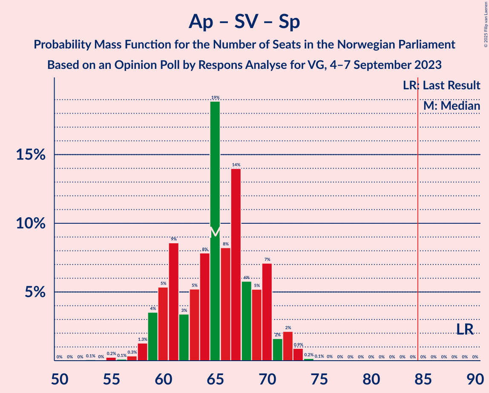

| Number of Seats | Probability | Accumulated | Special Marks |
|:---------------:|:-----------:|:-----------:|:-------------:|
| 53 | 0.1% | 100% |  |
| 54 | 0% | 99.9% |  |
| 55 | 0.2% | 99.9% |  |
| 56 | 0.1% | 99.7% |  |
| 57 | 0.3% | 99.6% |  |
| 58 | 1.3% | 99.2% |  |
| 59 | 4% | 98% |  |
| 60 | 5% | 94% |  |
| 61 | 9% | 89% |  |
| 62 | 3% | 80% |  |
| 63 | 5% | 77% |  |
| 64 | 8% | 72% |  |
| 65 | 19% | 64% | Median |
| 66 | 8% | 45% |  |
| 67 | 14% | 37% |  |
| 68 | 6% | 23% |  |
| 69 | 5% | 17% |  |
| 70 | 7% | 12% |  |
| 71 | 2% | 5% |  |
| 72 | 2% | 3% |  |
| 73 | 0.9% | 1.1% |  |
| 74 | 0.2% | 0.2% |  |
| 75 | 0.1% | 0.1% |  |
| 76 | 0% | 0% |  |
| 77 | 0% | 0% |  |
| 78 | 0% | 0% |  |
| 79 | 0% | 0% |  |
| 80 | 0% | 0% |  |
| 81 | 0% | 0% |  |
| 82 | 0% | 0% |  |
| 83 | 0% | 0% |  |
| 84 | 0% | 0% |  |
| 85 | 0% | 0% | Majority |
| 86 | 0% | 0% |  |
| 87 | 0% | 0% |  |
| 88 | 0% | 0% |  |
| 89 | 0% | 0% | Last Result |

### Arbeiderpartiet – Senterpartiet – Kristelig Folkeparti

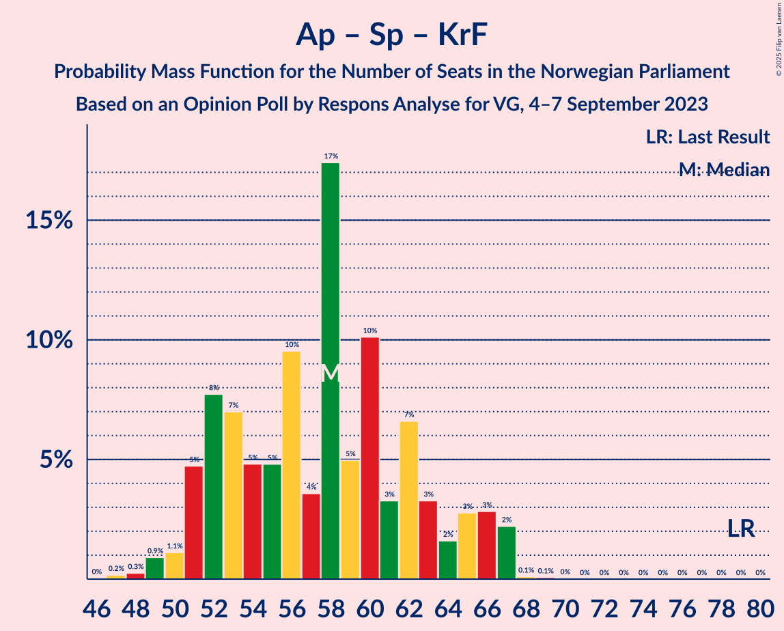

| Number of Seats | Probability | Accumulated | Special Marks |
|:---------------:|:-----------:|:-----------:|:-------------:|
| 46 | 0% | 100% |  |
| 47 | 0.2% | 99.9% |  |
| 48 | 0.3% | 99.8% |  |
| 49 | 0.9% | 99.5% |  |
| 50 | 1.1% | 98.6% |  |
| 51 | 5% | 97% |  |
| 52 | 8% | 93% |  |
| 53 | 7% | 85% |  |
| 54 | 5% | 78% |  |
| 55 | 5% | 73% |  |
| 56 | 10% | 68% | Median |
| 57 | 4% | 59% |  |
| 58 | 17% | 55% |  |
| 59 | 5% | 38% |  |
| 60 | 10% | 33% |  |
| 61 | 3% | 23% |  |
| 62 | 7% | 20% |  |
| 63 | 3% | 13% |  |
| 64 | 2% | 10% |  |
| 65 | 3% | 8% |  |
| 66 | 3% | 5% |  |
| 67 | 2% | 2% |  |
| 68 | 0.1% | 0.2% |  |
| 69 | 0.1% | 0.1% |  |
| 70 | 0% | 0% |  |
| 71 | 0% | 0% |  |
| 72 | 0% | 0% |  |
| 73 | 0% | 0% |  |
| 74 | 0% | 0% |  |
| 75 | 0% | 0% |  |
| 76 | 0% | 0% |  |
| 77 | 0% | 0% |  |
| 78 | 0% | 0% |  |
| 79 | 0% | 0% | Last Result |

### Arbeiderpartiet – Senterpartiet

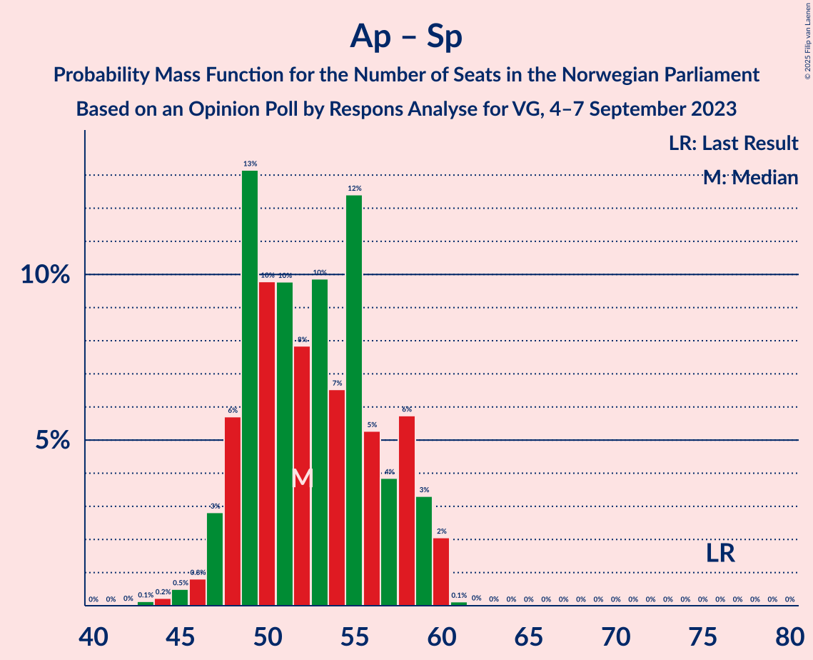

| Number of Seats | Probability | Accumulated | Special Marks |
|:---------------:|:-----------:|:-----------:|:-------------:|
| 43 | 0.1% | 100% |  |
| 44 | 0.2% | 99.8% |  |
| 45 | 0.5% | 99.6% |  |
| 46 | 0.8% | 99.1% |  |
| 47 | 3% | 98% |  |
| 48 | 6% | 95% |  |
| 49 | 13% | 90% |  |
| 50 | 10% | 77% |  |
| 51 | 10% | 67% |  |
| 52 | 8% | 57% |  |
| 53 | 10% | 49% | Median |
| 54 | 7% | 39% |  |
| 55 | 12% | 33% |  |
| 56 | 5% | 20% |  |
| 57 | 4% | 15% |  |
| 58 | 6% | 11% |  |
| 59 | 3% | 6% |  |
| 60 | 2% | 2% |  |
| 61 | 0.1% | 0.2% |  |
| 62 | 0% | 0.1% |  |
| 63 | 0% | 0% |  |
| 64 | 0% | 0% |  |
| 65 | 0% | 0% |  |
| 66 | 0% | 0% |  |
| 67 | 0% | 0% |  |
| 68 | 0% | 0% |  |
| 69 | 0% | 0% |  |
| 70 | 0% | 0% |  |
| 71 | 0% | 0% |  |
| 72 | 0% | 0% |  |
| 73 | 0% | 0% |  |
| 74 | 0% | 0% |  |
| 75 | 0% | 0% |  |
| 76 | 0% | 0% | Last Result |

### Arbeiderpartiet – Sosialistisk Venstreparti

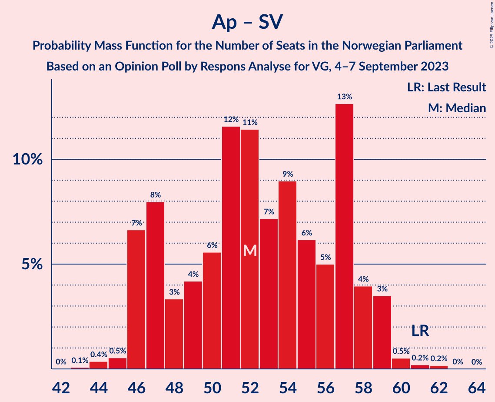

| Number of Seats | Probability | Accumulated | Special Marks |
|:---------------:|:-----------:|:-----------:|:-------------:|
| 43 | 0.1% | 100% |  |
| 44 | 0.4% | 99.9% |  |
| 45 | 0.5% | 99.5% |  |
| 46 | 7% | 99.0% |  |
| 47 | 8% | 92% |  |
| 48 | 3% | 84% |  |
| 49 | 4% | 81% |  |
| 50 | 6% | 77% |  |
| 51 | 12% | 71% |  |
| 52 | 11% | 60% | Median |
| 53 | 7% | 48% |  |
| 54 | 9% | 41% |  |
| 55 | 6% | 32% |  |
| 56 | 5% | 26% |  |
| 57 | 13% | 21% |  |
| 58 | 4% | 8% |  |
| 59 | 3% | 4% |  |
| 60 | 0.5% | 0.9% |  |
| 61 | 0.2% | 0.4% | Last Result |
| 62 | 0.2% | 0.2% |  |
| 63 | 0% | 0% |  |

### Senterpartiet – Venstre – Kristelig Folkeparti

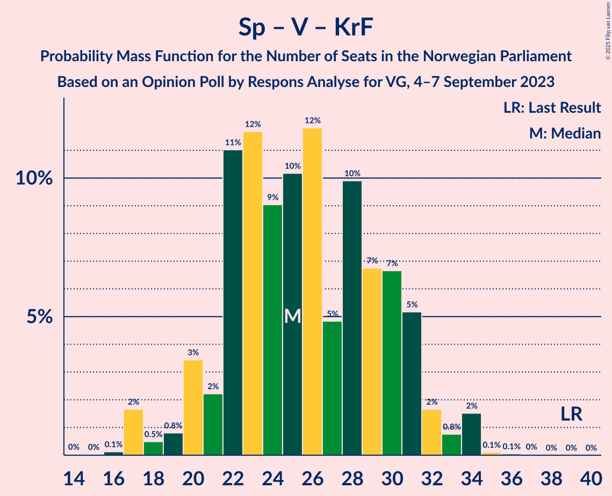

| Number of Seats | Probability | Accumulated | Special Marks |
|:---------------:|:-----------:|:-----------:|:-------------:|
| 15 | 0% | 100% |  |
| 16 | 0.1% | 99.9% |  |
| 17 | 2% | 99.8% |  |
| 18 | 0.5% | 98% |  |
| 19 | 0.8% | 98% |  |
| 20 | 3% | 97% |  |
| 21 | 2% | 93% |  |
| 22 | 11% | 91% |  |
| 23 | 12% | 80% |  |
| 24 | 9% | 68% | Median |
| 25 | 10% | 59% |  |
| 26 | 12% | 49% |  |
| 27 | 5% | 37% |  |
| 28 | 10% | 33% |  |
| 29 | 7% | 23% |  |
| 30 | 7% | 16% |  |
| 31 | 5% | 9% |  |
| 32 | 2% | 4% |  |
| 33 | 0.8% | 2% |  |
| 34 | 2% | 2% |  |
| 35 | 0.1% | 0.2% |  |
| 36 | 0.1% | 0.1% |  |
| 37 | 0% | 0% |  |
| 38 | 0% | 0% |  |
| 39 | 0% | 0% | Last Result |

## Technical Information

### Opinion Poll

+ **Polling firm:** Respons Analyse
+ **Commissioner(s):** VG
+ **Fieldwork period:** 4–7 September 2023

### Calculations

+ **Sample size:** 1001
+ **Simulations done:** 1,048,576
+ **Error estimate:** 3.00%

