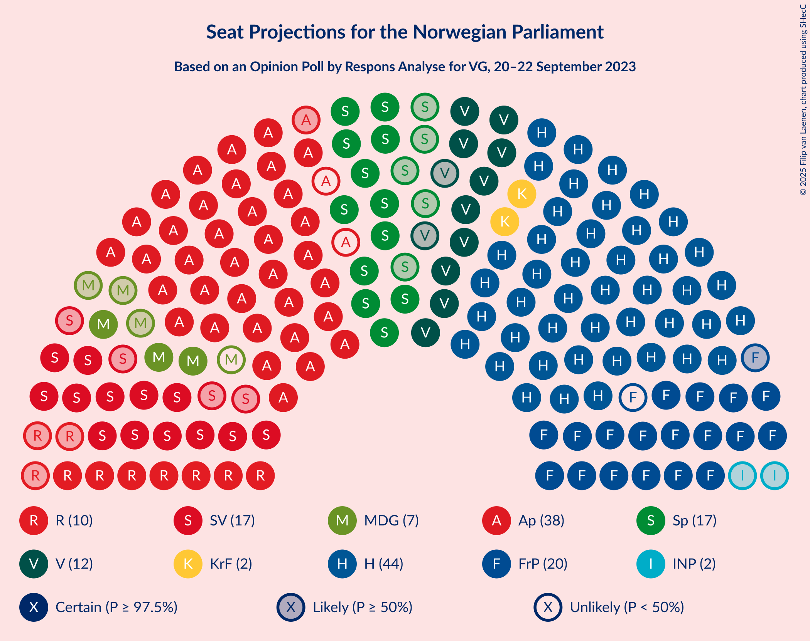
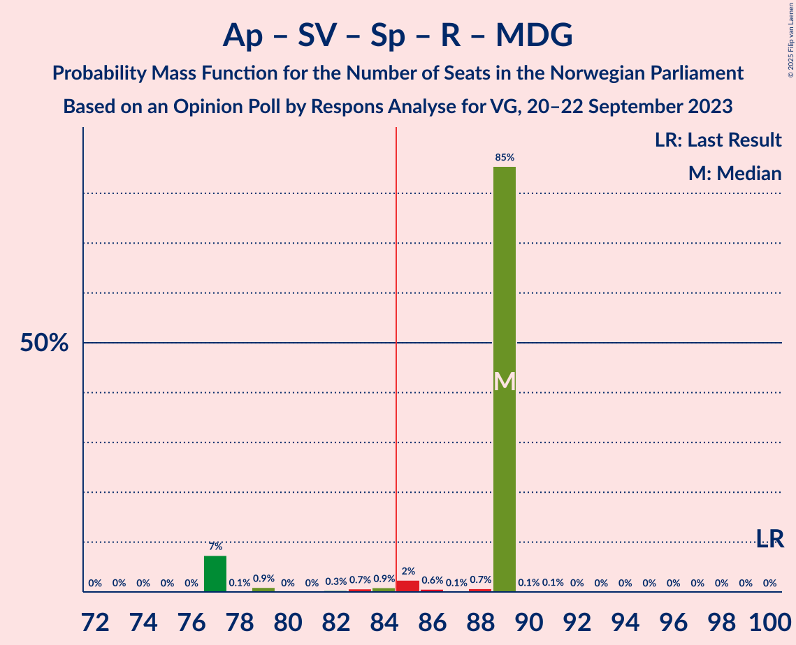

# Opinion Poll by Respons Analyse for VG, 20–22 September 2023

<a href="#voting-intentions">Voting Intentions</a> | <a href="#seats">Seats</a> | <a href="#coalitions">Coalitions</a> | <a href="#technical-information">Technical Information</a>

## Voting Intentions

### Confidence Intervals

| Party | Last Result | Poll Result | 80% Confidence Interval | 90% Confidence Interval | 95% Confidence Interval | 99% Confidence Interval |
|:-----:|:-----------:|:-----------:|:-----------------------:|:-----------------------:|:-----------------------:|:-----------------------:|
| Høyre | 20.4% | 27.2% | 25.5–29.1% |25.0–29.6% |24.5–30.1% |23.7–31.0% |
| Arbeiderpartiet | 26.2% | 20.8% | 19.2–22.5% |18.8–23.0% |18.4–23.4% |17.7–24.3% |
| Fremskrittspartiet | 11.6% | 11.2% | 10.0–12.6% |9.7–13.0% |9.4–13.3% |8.8–14.0% |
| Sosialistisk Venstreparti | 7.6% | 8.7% | 7.7–10.0% |7.3–10.3% |7.1–10.6% |6.6–11.2% |
| Senterpartiet | 13.5% | 7.7% | 6.7–8.9% |6.4–9.2% |6.2–9.5% |5.8–10.1% |
| Venstre | 4.6% | 7.2% | 6.2–8.4% |6.0–8.7% |5.7–9.0% |5.3–9.6% |
| Rødt | 4.7% | 5.6% | 4.8–6.6% |4.5–7.0% |4.3–7.2% |4.0–7.7% |
| Miljøpartiet De Grønne | 3.9% | 4.3% | 3.6–5.2% |3.4–5.5% |3.2–5.7% |2.9–6.2% |
| Kristelig Folkeparti | 3.8% | 2.9% | 2.3–3.7% |2.2–3.9% |2.0–4.1% |1.8–4.6% |
| Industri- og Næringspartiet | 0.3% | 2.6% | 2.1–3.4% |1.9–3.6% |1.8–3.8% |1.6–4.2% |
| Konservativt | 0.4% | 0.5% | 0.3–0.9% |0.3–1.1% |0.2–1.2% |0.2–1.4% |
| Norgesdemokratene | 1.1% | 0.4% | 0.2–0.8% |0.2–0.9% |0.2–1.0% |0.1–1.3% |
| Liberalistene | 0.2% | 0.2% | 0.1–0.5% |0.1–0.6% |0.1–0.7% |0.0–0.9% |
| Pensjonistpartiet | 0.6% | 0.2% | 0.1–0.5% |0.1–0.6% |0.1–0.7% |0.0–0.9% |

*Note:* The poll result column reflects the actual value used in the calculations. Published results may vary slightly, and in addition be rounded to fewer digits.

## Seats

### Confidence Intervals

| Party | Last Result | Median | 80% Confidence Interval | 90% Confidence Interval | 95% Confidence Interval | 99% Confidence Interval |
|:-----:|:-----------:|:------:|:-----------------------:|:-----------------------:|:-----------------------:|:-----------------------:|
| <a href="#høyre">Høyre</a> | 36 | 44 | 44–49 |44–53 |44–53 |44–53 |
| <a href="#arbeiderpartiet">Arbeiderpartiet</a> | 48 | 38 | 38–41 |38–41 |37–44 |35–46 |
| <a href="#fremskrittspartiet">Fremskrittspartiet</a> | 21 | 19 | 19–20 |19–20 |18–22 |17–24 |
| <a href="#sosialistisk-venstreparti">Sosialistisk Venstreparti</a> | 13 | 17 | 13–17 |13–17 |13–17 |12–17 |
| <a href="#senterpartiet">Senterpartiet</a> | 28 | 17 | 13–17 |13–17 |12–17 |10–17 |
| <a href="#venstre">Venstre</a> | 8 | 12 | 12 |11–15 |10–15 |10–15 |
| <a href="#rødt">Rødt</a> | 8 | 10 | 10 |7–10 |7–11 |7–13 |
| <a href="#miljøpartiet-de-grønne">Miljøpartiet De Grønne</a> | 3 | 7 | 3–7 |3–8 |3–9 |2–9 |
| <a href="#kristelig-folkeparti">Kristelig Folkeparti</a> | 3 | 2 | 2 |2–3 |2–3 |0–7 |
| <a href="#industri--og-næringspartiet">Industri- og Næringspartiet</a> | 0 | 2 | 0–2 |0–2 |0–2 |0–3 |
| <a href="#konservativt">Konservativt</a> | 0 | 0 | 0 |0 |0 |0 |
| <a href="#norgesdemokratene">Norgesdemokratene</a> | 0 | 0 | 0 |0 |0 |0 |
| <a href="#liberalistene">Liberalistene</a> | 0 | 0 | 0 |0 |0 |0 |
| <a href="#pensjonistpartiet">Pensjonistpartiet</a> | 0 | 0 | 0 |0 |0 |0 |

### Høyre

*For a full overview of the results for this party, see the [Høyre](party-høyre.html) page.*

| Number of Seats | Probability | Accumulated | Special Marks |
|:---------------:|:-----------:|:-----------:|:-------------:|
| 36 | 0% | 100% | Last Result |
| 37 | 0% | 100% |  |
| 38 | 0% | 100% |  |
| 39 | 0% | 100% |  |
| 40 | 0% | 100% |  |
| 41 | 0% | 100% |  |
| 42 | 0% | 100% |  |
| 43 | 0% | 100% |  |
| 44 | 84% | 99.9% | Median |
| 45 | 0.4% | 16% |  |
| 46 | 2% | 15% |  |
| 47 | 0.1% | 13% |  |
| 48 | 2% | 13% |  |
| 49 | 1.4% | 11% |  |
| 50 | 0.4% | 9% |  |
| 51 | 0.5% | 9% |  |
| 52 | 0.7% | 8% |  |
| 53 | 7% | 8% |  |
| 54 | 0% | 0% |  |

### Arbeiderpartiet

*For a full overview of the results for this party, see the [Arbeiderpartiet](party-arbeiderpartiet.html) page.*

| Number of Seats | Probability | Accumulated | Special Marks |
|:---------------:|:-----------:|:-----------:|:-------------:|
| 33 | 0.1% | 100% |  |
| 34 | 0.4% | 99.9% |  |
| 35 | 1.1% | 99.5% |  |
| 36 | 0.7% | 98% |  |
| 37 | 0.3% | 98% |  |
| 38 | 84% | 97% | Median |
| 39 | 2% | 13% |  |
| 40 | 0.4% | 11% |  |
| 41 | 7% | 10% |  |
| 42 | 0.1% | 3% |  |
| 43 | 0% | 3% |  |
| 44 | 0.4% | 3% |  |
| 45 | 0% | 2% |  |
| 46 | 2% | 2% |  |
| 47 | 0% | 0% |  |
| 48 | 0% | 0% | Last Result |

### Fremskrittspartiet

*For a full overview of the results for this party, see the [Fremskrittspartiet](party-fremskrittspartiet.html) page.*

| Number of Seats | Probability | Accumulated | Special Marks |
|:---------------:|:-----------:|:-----------:|:-------------:|
| 16 | 0% | 100% |  |
| 17 | 2% | 99.9% |  |
| 18 | 1.3% | 98% |  |
| 19 | 85% | 96% | Median |
| 20 | 8% | 12% |  |
| 21 | 1.0% | 4% | Last Result |
| 22 | 1.0% | 3% |  |
| 23 | 0.4% | 2% |  |
| 24 | 2% | 2% |  |
| 25 | 0.1% | 0.1% |  |
| 26 | 0% | 0% |  |

### Sosialistisk Venstreparti

*For a full overview of the results for this party, see the [Sosialistisk Venstreparti](party-sosialistiskvenstreparti.html) page.*

| Number of Seats | Probability | Accumulated | Special Marks |
|:---------------:|:-----------:|:-----------:|:-------------:|
| 12 | 2% | 100% |  |
| 13 | 8% | 98% | Last Result |
| 14 | 2% | 90% |  |
| 15 | 3% | 88% |  |
| 16 | 0.6% | 85% |  |
| 17 | 84% | 84% | Median |
| 18 | 0.2% | 0.4% |  |
| 19 | 0% | 0.2% |  |
| 20 | 0% | 0.2% |  |
| 21 | 0% | 0.1% |  |
| 22 | 0.1% | 0.1% |  |
| 23 | 0% | 0% |  |

### Senterpartiet

*For a full overview of the results for this party, see the [Senterpartiet](party-senterpartiet.html) page.*

| Number of Seats | Probability | Accumulated | Special Marks |
|:---------------:|:-----------:|:-----------:|:-------------:|
| 9 | 0.1% | 100% |  |
| 10 | 0.8% | 99.9% |  |
| 11 | 0.1% | 99.1% |  |
| 12 | 2% | 98.9% |  |
| 13 | 9% | 97% |  |
| 14 | 0.5% | 88% |  |
| 15 | 2% | 87% |  |
| 16 | 0.3% | 85% |  |
| 17 | 84% | 85% | Median |
| 18 | 0.3% | 0.4% |  |
| 19 | 0% | 0% |  |
| 20 | 0% | 0% |  |
| 21 | 0% | 0% |  |
| 22 | 0% | 0% |  |
| 23 | 0% | 0% |  |
| 24 | 0% | 0% |  |
| 25 | 0% | 0% |  |
| 26 | 0% | 0% |  |
| 27 | 0% | 0% |  |
| 28 | 0% | 0% | Last Result |

### Venstre

*For a full overview of the results for this party, see the [Venstre](party-venstre.html) page.*

| Number of Seats | Probability | Accumulated | Special Marks |
|:---------------:|:-----------:|:-----------:|:-------------:|
| 8 | 0% | 100% | Last Result |
| 9 | 0.2% | 100% |  |
| 10 | 4% | 99.8% |  |
| 11 | 3% | 96% |  |
| 12 | 85% | 94% | Median |
| 13 | 0.4% | 9% |  |
| 14 | 0.7% | 8% |  |
| 15 | 7% | 8% |  |
| 16 | 0% | 0.1% |  |
| 17 | 0.1% | 0.1% |  |
| 18 | 0% | 0% |  |

### Rødt

*For a full overview of the results for this party, see the [Rødt](party-rødt.html) page.*

| Number of Seats | Probability | Accumulated | Special Marks |
|:---------------:|:-----------:|:-----------:|:-------------:|
| 1 | 0.1% | 100% |  |
| 2 | 0% | 99.9% |  |
| 3 | 0% | 99.9% |  |
| 4 | 0% | 99.9% |  |
| 5 | 0% | 99.9% |  |
| 6 | 0% | 99.9% |  |
| 7 | 7% | 99.9% |  |
| 8 | 0.3% | 93% | Last Result |
| 9 | 1.3% | 92% |  |
| 10 | 87% | 91% | Median |
| 11 | 2% | 4% |  |
| 12 | 0.3% | 2% |  |
| 13 | 2% | 2% |  |
| 14 | 0% | 0.2% |  |
| 15 | 0.1% | 0.1% |  |
| 16 | 0% | 0% |  |

### Miljøpartiet De Grønne

*For a full overview of the results for this party, see the [Miljøpartiet De Grønne](party-miljøpartietdegrønne.html) page.*

| Number of Seats | Probability | Accumulated | Special Marks |
|:---------------:|:-----------:|:-----------:|:-------------:|
| 1 | 0.2% | 100% |  |
| 2 | 1.0% | 99.8% |  |
| 3 | 9% | 98.8% | Last Result |
| 4 | 0% | 90% |  |
| 5 | 0% | 90% |  |
| 6 | 0.2% | 90% |  |
| 7 | 84% | 90% | Median |
| 8 | 3% | 6% |  |
| 9 | 3% | 3% |  |
| 10 | 0.4% | 0.5% |  |
| 11 | 0.1% | 0.1% |  |
| 12 | 0% | 0% |  |

### Kristelig Folkeparti

*For a full overview of the results for this party, see the [Kristelig Folkeparti](party-kristeligfolkeparti.html) page.*

| Number of Seats | Probability | Accumulated | Special Marks |
|:---------------:|:-----------:|:-----------:|:-------------:|
| 0 | 0.7% | 100% |  |
| 1 | 0.3% | 99.3% |  |
| 2 | 91% | 99.1% | Median |
| 3 | 8% | 9% | Last Result |
| 4 | 0% | 0.9% |  |
| 5 | 0% | 0.9% |  |
| 6 | 0% | 0.9% |  |
| 7 | 0.8% | 0.8% |  |
| 8 | 0% | 0% |  |

### Industri- og Næringspartiet

*For a full overview of the results for this party, see the [Industri- og Næringspartiet](party-industri-ognæringspartiet.html) page.*

| Number of Seats | Probability | Accumulated | Special Marks |
|:---------------:|:-----------:|:-----------:|:-------------:|
| 0 | 11% | 100% | Last Result |
| 1 | 2% | 89% |  |
| 2 | 86% | 88% | Median |
| 3 | 1.1% | 1.4% |  |
| 4 | 0% | 0.2% |  |
| 5 | 0% | 0.2% |  |
| 6 | 0% | 0.2% |  |
| 7 | 0.2% | 0.2% |  |
| 8 | 0% | 0% |  |

### Konservativt

*For a full overview of the results for this party, see the [Konservativt](party-konservativt.html) page.*

| Number of Seats | Probability | Accumulated | Special Marks |
|:---------------:|:-----------:|:-----------:|:-------------:|
| 0 | 100% | 100% | Last Result, Median |

### Norgesdemokratene

*For a full overview of the results for this party, see the [Norgesdemokratene](party-norgesdemokratene.html) page.*

| Number of Seats | Probability | Accumulated | Special Marks |
|:---------------:|:-----------:|:-----------:|:-------------:|
| 0 | 100% | 100% | Last Result, Median |

### Liberalistene

*For a full overview of the results for this party, see the [Liberalistene](party-liberalistene.html) page.*

| Number of Seats | Probability | Accumulated | Special Marks |
|:---------------:|:-----------:|:-----------:|:-------------:|
| 0 | 100% | 100% | Last Result, Median |

### Pensjonistpartiet

*For a full overview of the results for this party, see the [Pensjonistpartiet](party-pensjonistpartiet.html) page.*

| Number of Seats | Probability | Accumulated | Special Marks |
|:---------------:|:-----------:|:-----------:|:-------------:|
| 0 | 100% | 100% | Last Result, Median |

## Coalitions

### Confidence Intervals

| Coalition | Last Result | Median | Majority? | 80% Confidence Interval | 90% Confidence Interval | 95% Confidence Interval | 99% Confidence Interval |
|:---------:|:-----------:|:------:|:---------:|:-----------------------:|:-----------------------:|:-----------------------:|:-----------------------:|
| Høyre – Fremskrittspartiet – Senterpartiet – Venstre – Kristelig Folkeparti | 96 | 94 | 100% | 94–97 | 94–104 | 94–104 | 89–104 |
| Høyre – Fremskrittspartiet – Venstre – Miljøpartiet De Grønne – Kristelig Folkeparti | 71 | 84 | 16% | 84–89 | 84–94 | 84–94 | 83–97 |
| Høyre – Fremskrittspartiet – Venstre – Kristelig Folkeparti | 68 | 77 | 9% | 77–83 | 77–91 | 77–91 | 77–91 |
| Arbeiderpartiet – Sosialistisk Venstreparti – Senterpartiet – Rødt – Miljøpartiet De Grønne | 100 | 89 | 90% | 84–89 | 77–89 | 77–89 | 77–89 |
| Høyre – Fremskrittspartiet – Venstre | 65 | 75 | 8% | 75–81 | 75–88 | 75–88 | 75–88 |
| Arbeiderpartiet – Sosialistisk Venstreparti – Senterpartiet – Rødt | 97 | 82 | 0% | 77–82 | 74–82 | 74–82 | 71–83 |
| Arbeiderpartiet – Sosialistisk Venstreparti – Senterpartiet – Miljøpartiet De Grønne – Kristelig Folkeparti | 95 | 81 | 0% | 75–81 | 73–81 | 73–81 | 73–81 |
| Arbeiderpartiet – Sosialistisk Venstreparti – Senterpartiet – Miljøpartiet De Grønne | 92 | 79 | 0% | 72–79 | 70–79 | 70–79 | 68–79 |
| Arbeiderpartiet – Sosialistisk Venstreparti – Rødt – Miljøpartiet De Grønne | 72 | 72 | 0% | 70–72 | 64–72 | 64–73 | 64–77 |
| Høyre – Fremskrittspartiet | 57 | 63 | 0% | 63–70 | 63–73 | 63–73 | 63–73 |
| Arbeiderpartiet – Sosialistisk Venstreparti – Senterpartiet | 89 | 72 | 0% | 67–72 | 67–72 | 66–72 | 60–73 |
| Høyre – Venstre – Kristelig Folkeparti | 47 | 58 | 0% | 58–63 | 58–71 | 58–71 | 58–71 |
| Arbeiderpartiet – Senterpartiet – Miljøpartiet De Grønne – Kristelig Folkeparti | 82 | 64 | 0% | 60–64 | 60–64 | 59–67 | 58–69 |
| Arbeiderpartiet – Senterpartiet – Kristelig Folkeparti | 79 | 57 | 0% | 57 | 56–57 | 53–60 | 51–61 |
| Arbeiderpartiet – Sosialistisk Venstreparti | 61 | 55 | 0% | 54–55 | 54–55 | 52–58 | 50–60 |
| Arbeiderpartiet – Senterpartiet | 76 | 55 | 0% | 54–55 | 54–55 | 51–57 | 45–59 |
| Senterpartiet – Venstre – Kristelig Folkeparti | 39 | 31 | 0% | 31 | 27–31 | 25–31 | 24–32 |

### Høyre – Fremskrittspartiet – Senterpartiet – Venstre – Kristelig Folkeparti

| Number of Seats | Probability | Accumulated | Special Marks |
|:---------------:|:-----------:|:-----------:|:-------------:|
| 88 | 0.2% | 100% |  |
| 89 | 2% | 99.8% |  |
| 90 | 0% | 98% |  |
| 91 | 0.1% | 98% |  |
| 92 | 0% | 98% |  |
| 93 | 0.1% | 98% |  |
| 94 | 85% | 98% | Median |
| 95 | 0.3% | 13% |  |
| 96 | 0.5% | 13% | Last Result |
| 97 | 3% | 12% |  |
| 98 | 0.7% | 10% |  |
| 99 | 1.1% | 9% |  |
| 100 | 0.1% | 8% |  |
| 101 | 0.1% | 8% |  |
| 102 | 0% | 8% |  |
| 103 | 0.1% | 8% |  |
| 104 | 7% | 8% |  |
| 105 | 0.1% | 0.2% |  |
| 106 | 0.1% | 0.1% |  |
| 107 | 0% | 0% |  |

### Høyre – Fremskrittspartiet – Venstre – Miljøpartiet De Grønne – Kristelig Folkeparti

| Number of Seats | Probability | Accumulated | Special Marks |
|:---------------:|:-----------:|:-----------:|:-------------:|
| 71 | 0% | 100% | Last Result |
| 72 | 0% | 100% |  |
| 73 | 0% | 100% |  |
| 74 | 0% | 100% |  |
| 75 | 0% | 100% |  |
| 76 | 0% | 100% |  |
| 77 | 0% | 100% |  |
| 78 | 0% | 100% |  |
| 79 | 0% | 100% |  |
| 80 | 0% | 100% |  |
| 81 | 0% | 100% |  |
| 82 | 0.4% | 100% |  |
| 83 | 0.2% | 99.5% |  |
| 84 | 84% | 99.4% | Median |
| 85 | 2% | 16% | Majority |
| 86 | 2% | 14% |  |
| 87 | 0% | 12% |  |
| 88 | 0.2% | 12% |  |
| 89 | 2% | 11% |  |
| 90 | 0.4% | 10% |  |
| 91 | 0.6% | 9% |  |
| 92 | 0% | 9% |  |
| 93 | 0.2% | 9% |  |
| 94 | 7% | 9% |  |
| 95 | 0% | 1.1% |  |
| 96 | 0.3% | 1.1% |  |
| 97 | 0.8% | 0.9% |  |
| 98 | 0% | 0.1% |  |
| 99 | 0.1% | 0.1% |  |
| 100 | 0% | 0% |  |

### Høyre – Fremskrittspartiet – Venstre – Kristelig Folkeparti

| Number of Seats | Probability | Accumulated | Special Marks |
|:---------------:|:-----------:|:-----------:|:-------------:|
| 68 | 0% | 100% | Last Result |
| 69 | 0% | 100% |  |
| 70 | 0% | 100% |  |
| 71 | 0% | 100% |  |
| 72 | 0% | 100% |  |
| 73 | 0% | 100% |  |
| 74 | 0% | 100% |  |
| 75 | 0% | 100% |  |
| 76 | 0.2% | 99.9% |  |
| 77 | 86% | 99.7% | Median |
| 78 | 0.1% | 14% |  |
| 79 | 0% | 14% |  |
| 80 | 1.1% | 14% |  |
| 81 | 0.9% | 13% |  |
| 82 | 2% | 12% |  |
| 83 | 0.9% | 10% |  |
| 84 | 0.1% | 9% |  |
| 85 | 0.2% | 9% | Majority |
| 86 | 0.4% | 9% |  |
| 87 | 0% | 8% |  |
| 88 | 0.1% | 8% |  |
| 89 | 0.8% | 8% |  |
| 90 | 0.1% | 7% |  |
| 91 | 7% | 7% |  |
| 92 | 0% | 0.1% |  |
| 93 | 0% | 0.1% |  |
| 94 | 0% | 0.1% |  |
| 95 | 0% | 0% |  |

### Arbeiderpartiet – Sosialistisk Venstreparti – Senterpartiet – Rødt – Miljøpartiet De Grønne

| Number of Seats | Probability | Accumulated | Special Marks |
|:---------------:|:-----------:|:-----------:|:-------------:|
| 73 | 0% | 100% |  |
| 74 | 0% | 99.9% |  |
| 75 | 0% | 99.9% |  |
| 76 | 0% | 99.9% |  |
| 77 | 7% | 99.9% |  |
| 78 | 0.1% | 93% |  |
| 79 | 0.9% | 92% |  |
| 80 | 0% | 92% |  |
| 81 | 0% | 91% |  |
| 82 | 0.3% | 91% |  |
| 83 | 0.7% | 91% |  |
| 84 | 0.9% | 90% |  |
| 85 | 2% | 90% | Majority |
| 86 | 0.6% | 87% |  |
| 87 | 0.1% | 87% |  |
| 88 | 0.7% | 86% |  |
| 89 | 85% | 86% | Median |
| 90 | 0.1% | 0.3% |  |
| 91 | 0.1% | 0.2% |  |
| 92 | 0% | 0.1% |  |
| 93 | 0% | 0% |  |
| 94 | 0% | 0% |  |
| 95 | 0% | 0% |  |
| 96 | 0% | 0% |  |
| 97 | 0% | 0% |  |
| 98 | 0% | 0% |  |
| 99 | 0% | 0% |  |
| 100 | 0% | 0% | Last Result |

### Høyre – Fremskrittspartiet – Venstre

| Number of Seats | Probability | Accumulated | Special Marks |
|:---------------:|:-----------:|:-----------:|:-------------:|
| 65 | 0% | 100% | Last Result |
| 66 | 0% | 100% |  |
| 67 | 0% | 100% |  |
| 68 | 0% | 100% |  |
| 69 | 0% | 100% |  |
| 70 | 0% | 100% |  |
| 71 | 0% | 100% |  |
| 72 | 0% | 100% |  |
| 73 | 0% | 100% |  |
| 74 | 0% | 100% |  |
| 75 | 86% | 99.9% | Median |
| 76 | 0.1% | 14% |  |
| 77 | 0.1% | 14% |  |
| 78 | 1.2% | 14% |  |
| 79 | 0.9% | 13% |  |
| 80 | 2% | 12% |  |
| 81 | 0.4% | 10% |  |
| 82 | 1.0% | 10% |  |
| 83 | 0.7% | 9% |  |
| 84 | 0.4% | 8% |  |
| 85 | 0% | 8% | Majority |
| 86 | 0.1% | 8% |  |
| 87 | 0.1% | 8% |  |
| 88 | 7% | 7% |  |
| 89 | 0% | 0% |  |

### Arbeiderpartiet – Sosialistisk Venstreparti – Senterpartiet – Rødt

| Number of Seats | Probability | Accumulated | Special Marks |
|:---------------:|:-----------:|:-----------:|:-------------:|
| 69 | 0.1% | 100% |  |
| 70 | 0% | 99.9% |  |
| 71 | 0.8% | 99.9% |  |
| 72 | 0.3% | 99.1% |  |
| 73 | 0% | 98.8% |  |
| 74 | 7% | 98.8% |  |
| 75 | 0.4% | 91% |  |
| 76 | 0.9% | 91% |  |
| 77 | 0.8% | 90% |  |
| 78 | 0.1% | 89% |  |
| 79 | 0.9% | 89% |  |
| 80 | 2% | 88% |  |
| 81 | 0.3% | 86% |  |
| 82 | 85% | 86% | Median |
| 83 | 0.6% | 0.9% |  |
| 84 | 0.3% | 0.3% |  |
| 85 | 0% | 0% | Majority |
| 86 | 0% | 0% |  |
| 87 | 0% | 0% |  |
| 88 | 0% | 0% |  |
| 89 | 0% | 0% |  |
| 90 | 0% | 0% |  |
| 91 | 0% | 0% |  |
| 92 | 0% | 0% |  |
| 93 | 0% | 0% |  |
| 94 | 0% | 0% |  |
| 95 | 0% | 0% |  |
| 96 | 0% | 0% |  |
| 97 | 0% | 0% | Last Result |

### Arbeiderpartiet – Sosialistisk Venstreparti – Senterpartiet – Miljøpartiet De Grønne – Kristelig Folkeparti

| Number of Seats | Probability | Accumulated | Special Marks |
|:---------------:|:-----------:|:-----------:|:-------------:|
| 68 | 0.1% | 100% |  |
| 69 | 0% | 99.9% |  |
| 70 | 0% | 99.9% |  |
| 71 | 0.2% | 99.9% |  |
| 72 | 0.1% | 99.7% |  |
| 73 | 7% | 99.6% |  |
| 74 | 2% | 92% |  |
| 75 | 1.4% | 90% |  |
| 76 | 0.9% | 89% |  |
| 77 | 0.6% | 88% |  |
| 78 | 0.6% | 87% |  |
| 79 | 0.1% | 87% |  |
| 80 | 0.7% | 86% |  |
| 81 | 85% | 86% | Median |
| 82 | 0.1% | 0.3% |  |
| 83 | 0.1% | 0.2% |  |
| 84 | 0.1% | 0.2% |  |
| 85 | 0% | 0% | Majority |
| 86 | 0% | 0% |  |
| 87 | 0% | 0% |  |
| 88 | 0% | 0% |  |
| 89 | 0% | 0% |  |
| 90 | 0% | 0% |  |
| 91 | 0% | 0% |  |
| 92 | 0% | 0% |  |
| 93 | 0% | 0% |  |
| 94 | 0% | 0% |  |
| 95 | 0% | 0% | Last Result |

### Arbeiderpartiet – Sosialistisk Venstreparti – Senterpartiet – Miljøpartiet De Grønne

| Number of Seats | Probability | Accumulated | Special Marks |
|:---------------:|:-----------:|:-----------:|:-------------:|
| 66 | 0.1% | 100% |  |
| 67 | 0% | 99.9% |  |
| 68 | 0.8% | 99.9% |  |
| 69 | 0.1% | 99.1% |  |
| 70 | 7% | 98.9% |  |
| 71 | 0.2% | 91% |  |
| 72 | 2% | 91% |  |
| 73 | 0.7% | 90% |  |
| 74 | 1.5% | 89% |  |
| 75 | 0.2% | 88% |  |
| 76 | 0.7% | 87% |  |
| 77 | 0.1% | 87% |  |
| 78 | 0.8% | 86% |  |
| 79 | 85% | 86% | Median |
| 80 | 0% | 0.3% |  |
| 81 | 0% | 0.2% |  |
| 82 | 0.1% | 0.2% |  |
| 83 | 0% | 0% |  |
| 84 | 0% | 0% |  |
| 85 | 0% | 0% | Majority |
| 86 | 0% | 0% |  |
| 87 | 0% | 0% |  |
| 88 | 0% | 0% |  |
| 89 | 0% | 0% |  |
| 90 | 0% | 0% |  |
| 91 | 0% | 0% |  |
| 92 | 0% | 0% | Last Result |

### Arbeiderpartiet – Sosialistisk Venstreparti – Rødt – Miljøpartiet De Grønne

| Number of Seats | Probability | Accumulated | Special Marks |
|:---------------:|:-----------:|:-----------:|:-------------:|
| 61 | 0.1% | 100% |  |
| 62 | 0.1% | 99.9% |  |
| 63 | 0% | 99.8% |  |
| 64 | 7% | 99.8% |  |
| 65 | 0.1% | 92% |  |
| 66 | 0% | 92% |  |
| 67 | 0% | 92% |  |
| 68 | 0.4% | 92% |  |
| 69 | 1.2% | 92% |  |
| 70 | 2% | 91% |  |
| 71 | 1.5% | 88% |  |
| 72 | 84% | 87% | Last Result, Median |
| 73 | 0.4% | 3% |  |
| 74 | 0.2% | 2% |  |
| 75 | 0.2% | 2% |  |
| 76 | 0% | 2% |  |
| 77 | 2% | 2% |  |
| 78 | 0% | 0.1% |  |
| 79 | 0% | 0.1% |  |
| 80 | 0% | 0% |  |

### Høyre – Fremskrittspartiet

| Number of Seats | Probability | Accumulated | Special Marks |
|:---------------:|:-----------:|:-----------:|:-------------:|
| 57 | 0% | 100% | Last Result |
| 58 | 0% | 100% |  |
| 59 | 0% | 100% |  |
| 60 | 0% | 100% |  |
| 61 | 0% | 100% |  |
| 62 | 0.1% | 100% |  |
| 63 | 84% | 99.9% | Median |
| 64 | 0.3% | 16% |  |
| 65 | 2% | 16% |  |
| 66 | 0.5% | 14% |  |
| 67 | 1.1% | 14% |  |
| 68 | 0.9% | 12% |  |
| 69 | 0.7% | 12% |  |
| 70 | 2% | 11% |  |
| 71 | 0.9% | 9% |  |
| 72 | 0% | 8% |  |
| 73 | 7% | 8% |  |
| 74 | 0.3% | 0.4% |  |
| 75 | 0.1% | 0.1% |  |
| 76 | 0% | 0% |  |

### Arbeiderpartiet – Sosialistisk Venstreparti – Senterpartiet

| Number of Seats | Probability | Accumulated | Special Marks |
|:---------------:|:-----------:|:-----------:|:-------------:|
| 60 | 0.8% | 100% |  |
| 61 | 0% | 99.2% |  |
| 62 | 0.1% | 99.2% |  |
| 63 | 0.3% | 99.1% |  |
| 64 | 0.1% | 98.8% |  |
| 65 | 0.3% | 98.7% |  |
| 66 | 1.5% | 98% |  |
| 67 | 8% | 97% |  |
| 68 | 0.4% | 89% |  |
| 69 | 2% | 89% |  |
| 70 | 2% | 87% |  |
| 71 | 0.3% | 84% |  |
| 72 | 84% | 84% | Median |
| 73 | 0.2% | 0.7% |  |
| 74 | 0.4% | 0.5% |  |
| 75 | 0% | 0% |  |
| 76 | 0% | 0% |  |
| 77 | 0% | 0% |  |
| 78 | 0% | 0% |  |
| 79 | 0% | 0% |  |
| 80 | 0% | 0% |  |
| 81 | 0% | 0% |  |
| 82 | 0% | 0% |  |
| 83 | 0% | 0% |  |
| 84 | 0% | 0% |  |
| 85 | 0% | 0% | Majority |
| 86 | 0% | 0% |  |
| 87 | 0% | 0% |  |
| 88 | 0% | 0% |  |
| 89 | 0% | 0% | Last Result |

### Høyre – Venstre – Kristelig Folkeparti

| Number of Seats | Probability | Accumulated | Special Marks |
|:---------------:|:-----------:|:-----------:|:-------------:|
| 47 | 0% | 100% | Last Result |
| 48 | 0% | 100% |  |
| 49 | 0% | 100% |  |
| 50 | 0% | 100% |  |
| 51 | 0% | 100% |  |
| 52 | 0% | 100% |  |
| 53 | 0% | 100% |  |
| 54 | 0% | 100% |  |
| 55 | 0% | 100% |  |
| 56 | 0% | 100% |  |
| 57 | 0.2% | 99.9% |  |
| 58 | 86% | 99.7% | Median |
| 59 | 0.8% | 14% |  |
| 60 | 2% | 13% |  |
| 61 | 0.3% | 11% |  |
| 62 | 0.8% | 11% |  |
| 63 | 0.4% | 10% |  |
| 64 | 0.5% | 10% |  |
| 65 | 0.8% | 9% |  |
| 66 | 0.2% | 9% |  |
| 67 | 0.9% | 8% |  |
| 68 | 0% | 7% |  |
| 69 | 0% | 7% |  |
| 70 | 0.1% | 7% |  |
| 71 | 7% | 7% |  |
| 72 | 0% | 0% |  |

### Arbeiderpartiet – Senterpartiet – Miljøpartiet De Grønne – Kristelig Folkeparti

| Number of Seats | Probability | Accumulated | Special Marks |
|:---------------:|:-----------:|:-----------:|:-------------:|
| 53 | 0.1% | 100% |  |
| 54 | 0.1% | 99.9% |  |
| 55 | 0.1% | 99.8% |  |
| 56 | 0% | 99.7% |  |
| 57 | 0% | 99.7% |  |
| 58 | 0.2% | 99.6% |  |
| 59 | 3% | 99.5% |  |
| 60 | 8% | 97% |  |
| 61 | 1.1% | 89% |  |
| 62 | 0.3% | 88% |  |
| 63 | 0.6% | 87% |  |
| 64 | 84% | 87% | Median |
| 65 | 0% | 3% |  |
| 66 | 0.3% | 3% |  |
| 67 | 0.7% | 3% |  |
| 68 | 0% | 2% |  |
| 69 | 2% | 2% |  |
| 70 | 0% | 0% |  |
| 71 | 0% | 0% |  |
| 72 | 0% | 0% |  |
| 73 | 0% | 0% |  |
| 74 | 0% | 0% |  |
| 75 | 0% | 0% |  |
| 76 | 0% | 0% |  |
| 77 | 0% | 0% |  |
| 78 | 0% | 0% |  |
| 79 | 0% | 0% |  |
| 80 | 0% | 0% |  |
| 81 | 0% | 0% |  |
| 82 | 0% | 0% | Last Result |

### Arbeiderpartiet – Senterpartiet – Kristelig Folkeparti

| Number of Seats | Probability | Accumulated | Special Marks |
|:---------------:|:-----------:|:-----------:|:-------------:|
| 49 | 0.3% | 100% |  |
| 50 | 0.1% | 99.7% |  |
| 51 | 0.7% | 99.6% |  |
| 52 | 0.9% | 98.9% |  |
| 53 | 1.0% | 98% |  |
| 54 | 0.4% | 97% |  |
| 55 | 0.1% | 97% |  |
| 56 | 2% | 96% |  |
| 57 | 91% | 95% | Median |
| 58 | 0.9% | 3% |  |
| 59 | 0% | 3% |  |
| 60 | 2% | 3% |  |
| 61 | 0.2% | 0.5% |  |
| 62 | 0.3% | 0.3% |  |
| 63 | 0% | 0% |  |
| 64 | 0% | 0% |  |
| 65 | 0% | 0% |  |
| 66 | 0% | 0% |  |
| 67 | 0% | 0% |  |
| 68 | 0% | 0% |  |
| 69 | 0% | 0% |  |
| 70 | 0% | 0% |  |
| 71 | 0% | 0% |  |
| 72 | 0% | 0% |  |
| 73 | 0% | 0% |  |
| 74 | 0% | 0% |  |
| 75 | 0% | 0% |  |
| 76 | 0% | 0% |  |
| 77 | 0% | 0% |  |
| 78 | 0% | 0% |  |
| 79 | 0% | 0% | Last Result |

### Arbeiderpartiet – Sosialistisk Venstreparti

| Number of Seats | Probability | Accumulated | Special Marks |
|:---------------:|:-----------:|:-----------:|:-------------:|
| 46 | 0% | 100% |  |
| 47 | 0.1% | 99.9% |  |
| 48 | 0% | 99.9% |  |
| 49 | 0.3% | 99.8% |  |
| 50 | 1.1% | 99.5% |  |
| 51 | 0.7% | 98% |  |
| 52 | 0.8% | 98% |  |
| 53 | 1.0% | 97% |  |
| 54 | 9% | 96% |  |
| 55 | 84% | 87% | Median |
| 56 | 0.3% | 3% |  |
| 57 | 0.2% | 3% |  |
| 58 | 2% | 3% |  |
| 59 | 0.1% | 0.6% |  |
| 60 | 0.5% | 0.5% |  |
| 61 | 0% | 0.1% | Last Result |
| 62 | 0% | 0% |  |

### Arbeiderpartiet – Senterpartiet

| Number of Seats | Probability | Accumulated | Special Marks |
|:---------------:|:-----------:|:-----------:|:-------------:|
| 45 | 0.7% | 100% |  |
| 46 | 0% | 99.3% |  |
| 47 | 0.3% | 99.3% |  |
| 48 | 0% | 98.9% |  |
| 49 | 0.3% | 98.9% |  |
| 50 | 0.2% | 98.6% |  |
| 51 | 1.4% | 98% |  |
| 52 | 0.4% | 97% |  |
| 53 | 0.2% | 97% |  |
| 54 | 9% | 96% |  |
| 55 | 84% | 87% | Median |
| 56 | 1.0% | 4% |  |
| 57 | 0.1% | 3% |  |
| 58 | 2% | 2% |  |
| 59 | 0.2% | 0.5% |  |
| 60 | 0.3% | 0.3% |  |
| 61 | 0% | 0% |  |
| 62 | 0% | 0% |  |
| 63 | 0% | 0% |  |
| 64 | 0% | 0% |  |
| 65 | 0% | 0% |  |
| 66 | 0% | 0% |  |
| 67 | 0% | 0% |  |
| 68 | 0% | 0% |  |
| 69 | 0% | 0% |  |
| 70 | 0% | 0% |  |
| 71 | 0% | 0% |  |
| 72 | 0% | 0% |  |
| 73 | 0% | 0% |  |
| 74 | 0% | 0% |  |
| 75 | 0% | 0% |  |
| 76 | 0% | 0% | Last Result |

### Senterpartiet – Venstre – Kristelig Folkeparti

| Number of Seats | Probability | Accumulated | Special Marks |
|:---------------:|:-----------:|:-----------:|:-------------:|
| 23 | 0.1% | 100% |  |
| 24 | 2% | 99.9% |  |
| 25 | 0.4% | 98% |  |
| 26 | 1.0% | 97% |  |
| 27 | 2% | 96% |  |
| 28 | 1.2% | 94% |  |
| 29 | 0.7% | 93% |  |
| 30 | 1.1% | 93% |  |
| 31 | 91% | 91% | Median |
| 32 | 0.2% | 0.5% |  |
| 33 | 0.1% | 0.3% |  |
| 34 | 0% | 0.2% |  |
| 35 | 0.1% | 0.2% |  |
| 36 | 0.1% | 0.1% |  |
| 37 | 0% | 0% |  |
| 38 | 0% | 0% |  |
| 39 | 0% | 0% | Last Result |

## Technical Information

### Opinion Poll

+ **Polling firm:** Respons Analyse
+ **Commissioner(s):** VG
+ **Fieldwork period:** 20–22 September 2023

### Calculations

+ **Sample size:** 1000
+ **Simulations done:** 1,048,576
+ **Error estimate:** 4.34%

