# Opinion Poll by Norstat for Aftenposten and NRK, 21–27 September 2023

<a href="#voting-intentions">Voting Intentions</a> | <a href="#seats">Seats</a> | <a href="#coalitions">Coalitions</a> | <a href="#technical-information">Technical Information</a>

## Voting Intentions

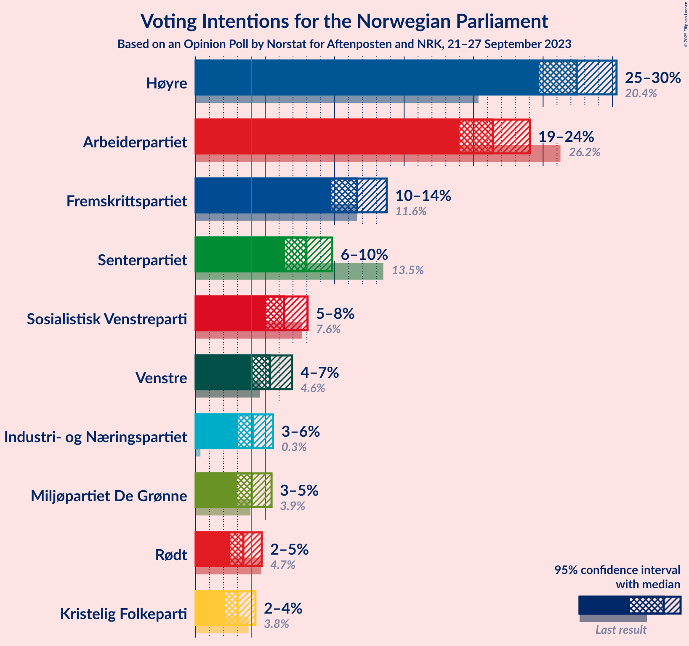

### Confidence Intervals

| Party | Last Result | Poll Result | 80% Confidence Interval | 90% Confidence Interval | 95% Confidence Interval | 99% Confidence Interval |
|:-----:|:-----------:|:-----------:|:-----------------------:|:-----------------------:|:-----------------------:|:-----------------------:|
| Høyre | 20.4% | 27.4% | 25.7–29.3% |25.1–29.8% |24.7–30.3% |23.9–31.2% |
| Arbeiderpartiet | 26.2% | 21.4% | 19.8–23.1% |19.3–23.6% |18.9–24.0% |18.2–24.9% |
| Fremskrittspartiet | 11.6% | 11.6% | 10.4–13.0% |10.0–13.4% |9.7–13.7% |9.2–14.4% |
| Senterpartiet | 13.5% | 8.0% | 7.0–9.2% |6.7–9.5% |6.4–9.8% |6.0–10.4% |
| Sosialistisk Venstreparti | 7.6% | 6.4% | 5.5–7.5% |5.2–7.8% |5.0–8.0% |4.6–8.6% |
| Venstre | 4.6% | 5.3% | 4.5–6.4% |4.3–6.7% |4.1–6.9% |3.7–7.5% |
| Industri- og Næringspartiet | 0.3% | 4.1% | 3.4–5.1% |3.2–5.3% |3.1–5.6% |2.7–6.1% |
| Miljøpartiet De Grønne | 3.9% | 4.0% | 3.3–5.0% |3.1–5.2% |3.0–5.5% |2.7–5.9% |
| Rødt | 4.7% | 3.4% | 2.8–4.3% |2.6–4.5% |2.5–4.8% |2.2–5.2% |
| Kristelig Folkeparti | 3.8% | 3.0% | 2.4–3.9% |2.3–4.1% |2.1–4.3% |1.9–4.7% |

*Note:* The poll result column reflects the actual value used in the calculations. Published results may vary slightly, and in addition be rounded to fewer digits.

## Seats

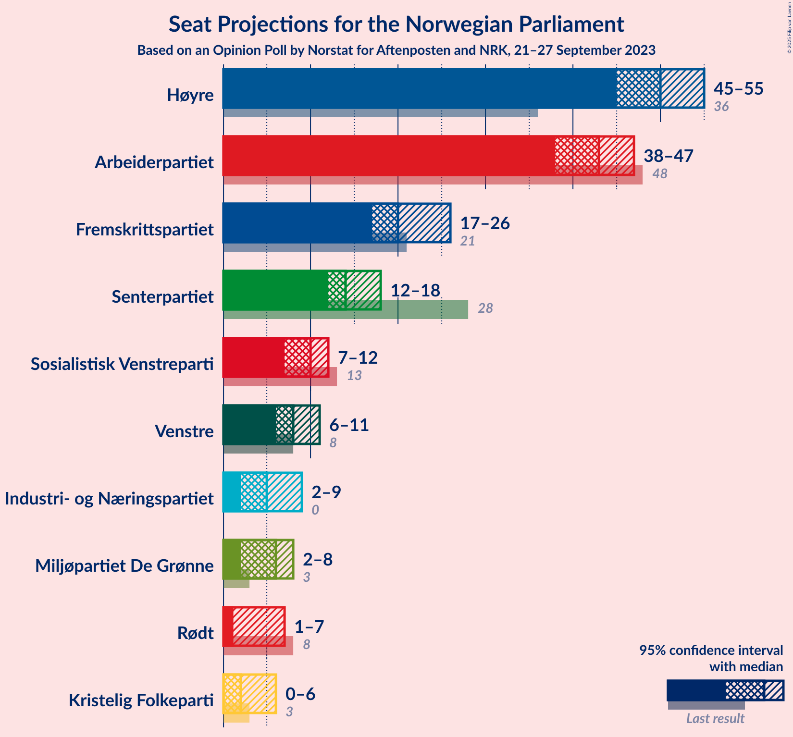

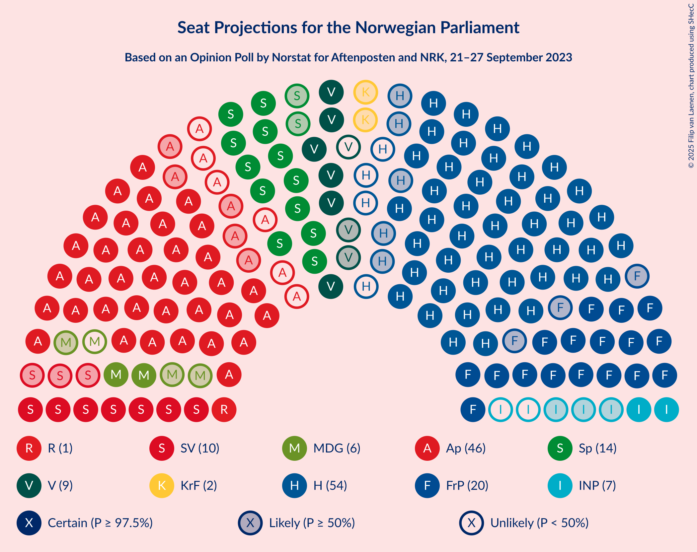

### Confidence Intervals

| Party | Last Result | Median | 80% Confidence Interval | 90% Confidence Interval | 95% Confidence Interval | 99% Confidence Interval |
|:-----:|:-----------:|:------:|:-----------------------:|:-----------------------:|:-----------------------:|:-----------------------:|
| <a href="#høyre">Høyre</a> | 36 | 50 | 47–54 |46–55 |45–55 |45–57 |
| <a href="#arbeiderpartiet">Arbeiderpartiet</a> | 48 | 43 | 40–46 |39–46 |38–47 |36–49 |
| <a href="#fremskrittspartiet">Fremskrittspartiet</a> | 21 | 20 | 18–24 |17–25 |17–26 |16–27 |
| <a href="#senterpartiet">Senterpartiet</a> | 28 | 14 | 13–17 |12–17 |12–18 |10–18 |
| <a href="#sosialistisk-venstreparti">Sosialistisk Venstreparti</a> | 13 | 10 | 8–11 |8–12 |7–12 |7–15 |
| <a href="#venstre">Venstre</a> | 8 | 8 | 6–10 |6–10 |6–11 |3–12 |
| <a href="#industri--og-næringspartiet">Industri- og Næringspartiet</a> | 0 | 5 | 2–7 |2–8 |2–9 |2–9 |
| <a href="#miljøpartiet-de-grønne">Miljøpartiet De Grønne</a> | 3 | 6 | 2–7 |2–8 |2–8 |1–9 |
| <a href="#rødt">Rødt</a> | 8 | 1 | 1–6 |1–6 |1–7 |1–8 |
| <a href="#kristelig-folkeparti">Kristelig Folkeparti</a> | 3 | 2 | 2–3 |2–3 |0–6 |0–7 |

### Høyre

*For a full overview of the results for this party, see the [Høyre](party-høyre.html) page.*

| Number of Seats | Probability | Accumulated | Special Marks |
|:---------------:|:-----------:|:-----------:|:-------------:|
| 36 | 0% | 100% | Last Result |
| 37 | 0% | 100% |  |
| 38 | 0% | 100% |  |
| 39 | 0% | 100% |  |
| 40 | 0% | 100% |  |
| 41 | 0% | 100% |  |
| 42 | 0% | 100% |  |
| 43 | 0.1% | 100% |  |
| 44 | 0.4% | 99.9% |  |
| 45 | 3% | 99.5% |  |
| 46 | 6% | 96% |  |
| 47 | 11% | 90% |  |
| 48 | 11% | 80% |  |
| 49 | 14% | 69% |  |
| 50 | 7% | 55% | Median |
| 51 | 14% | 48% |  |
| 52 | 18% | 34% |  |
| 53 | 3% | 16% |  |
| 54 | 8% | 14% |  |
| 55 | 3% | 5% |  |
| 56 | 1.5% | 2% |  |
| 57 | 0.6% | 0.9% |  |
| 58 | 0.2% | 0.3% |  |
| 59 | 0.1% | 0.1% |  |
| 60 | 0% | 0% |  |

### Arbeiderpartiet

*For a full overview of the results for this party, see the [Arbeiderpartiet](party-arbeiderpartiet.html) page.*

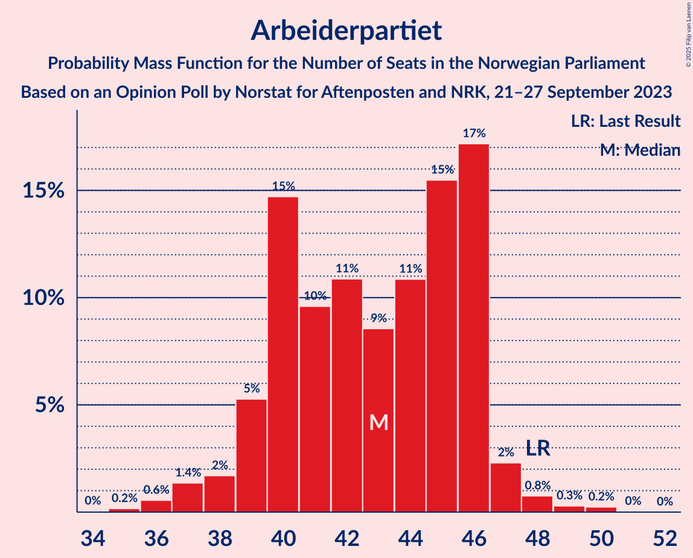

| Number of Seats | Probability | Accumulated | Special Marks |
|:---------------:|:-----------:|:-----------:|:-------------:|
| 34 | 0% | 100% |  |
| 35 | 0.2% | 99.9% |  |
| 36 | 0.6% | 99.8% |  |
| 37 | 1.4% | 99.2% |  |
| 38 | 2% | 98% |  |
| 39 | 5% | 96% |  |
| 40 | 15% | 91% |  |
| 41 | 10% | 76% |  |
| 42 | 11% | 67% |  |
| 43 | 9% | 56% | Median |
| 44 | 11% | 47% |  |
| 45 | 15% | 36% |  |
| 46 | 17% | 21% |  |
| 47 | 2% | 4% |  |
| 48 | 0.8% | 1.3% | Last Result |
| 49 | 0.3% | 0.6% |  |
| 50 | 0.2% | 0.3% |  |
| 51 | 0% | 0% |  |

### Fremskrittspartiet

*For a full overview of the results for this party, see the [Fremskrittspartiet](party-fremskrittspartiet.html) page.*

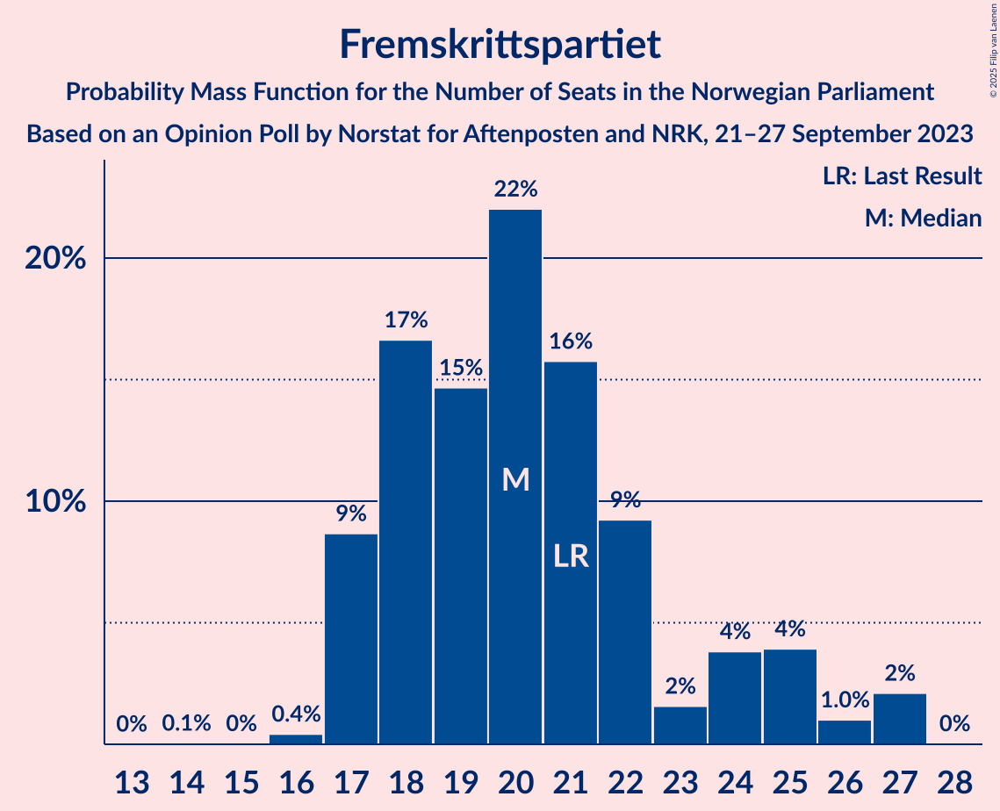

| Number of Seats | Probability | Accumulated | Special Marks |
|:---------------:|:-----------:|:-----------:|:-------------:|
| 14 | 0.1% | 100% |  |
| 15 | 0% | 99.9% |  |
| 16 | 0.4% | 99.9% |  |
| 17 | 9% | 99.5% |  |
| 18 | 17% | 91% |  |
| 19 | 15% | 74% |  |
| 20 | 22% | 59% | Median |
| 21 | 16% | 37% | Last Result |
| 22 | 9% | 22% |  |
| 23 | 2% | 12% |  |
| 24 | 4% | 11% |  |
| 25 | 4% | 7% |  |
| 26 | 1.0% | 3% |  |
| 27 | 2% | 2% |  |
| 28 | 0% | 0% |  |

### Senterpartiet

*For a full overview of the results for this party, see the [Senterpartiet](party-senterpartiet.html) page.*

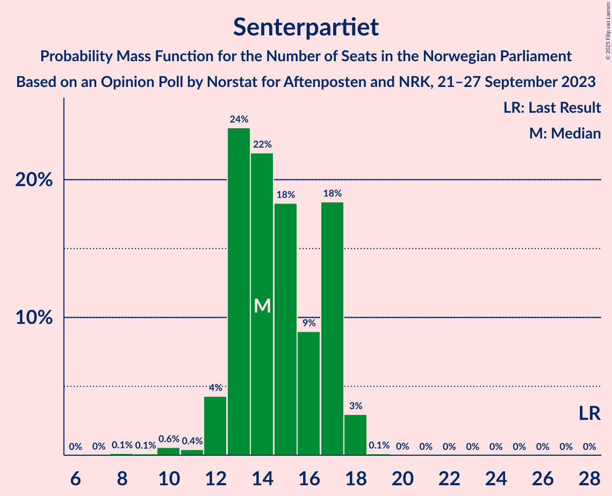

| Number of Seats | Probability | Accumulated | Special Marks |
|:---------------:|:-----------:|:-----------:|:-------------:|
| 8 | 0.1% | 100% |  |
| 9 | 0.1% | 99.8% |  |
| 10 | 0.6% | 99.7% |  |
| 11 | 0.4% | 99.2% |  |
| 12 | 4% | 98.8% |  |
| 13 | 24% | 94% |  |
| 14 | 22% | 71% | Median |
| 15 | 18% | 49% |  |
| 16 | 9% | 30% |  |
| 17 | 18% | 21% |  |
| 18 | 3% | 3% |  |
| 19 | 0.1% | 0.1% |  |
| 20 | 0% | 0% |  |
| 21 | 0% | 0% |  |
| 22 | 0% | 0% |  |
| 23 | 0% | 0% |  |
| 24 | 0% | 0% |  |
| 25 | 0% | 0% |  |
| 26 | 0% | 0% |  |
| 27 | 0% | 0% |  |
| 28 | 0% | 0% | Last Result |

### Sosialistisk Venstreparti

*For a full overview of the results for this party, see the [Sosialistisk Venstreparti](party-sosialistiskvenstreparti.html) page.*

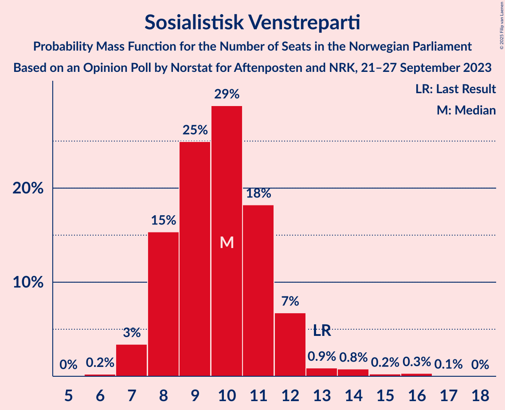

| Number of Seats | Probability | Accumulated | Special Marks |
|:---------------:|:-----------:|:-----------:|:-------------:|
| 6 | 0.2% | 100% |  |
| 7 | 3% | 99.7% |  |
| 8 | 15% | 96% |  |
| 9 | 25% | 81% |  |
| 10 | 29% | 56% | Median |
| 11 | 18% | 27% |  |
| 12 | 7% | 9% |  |
| 13 | 0.9% | 2% | Last Result |
| 14 | 0.8% | 1.4% |  |
| 15 | 0.2% | 0.6% |  |
| 16 | 0.3% | 0.4% |  |
| 17 | 0.1% | 0.1% |  |
| 18 | 0% | 0% |  |

### Venstre

*For a full overview of the results for this party, see the [Venstre](party-venstre.html) page.*

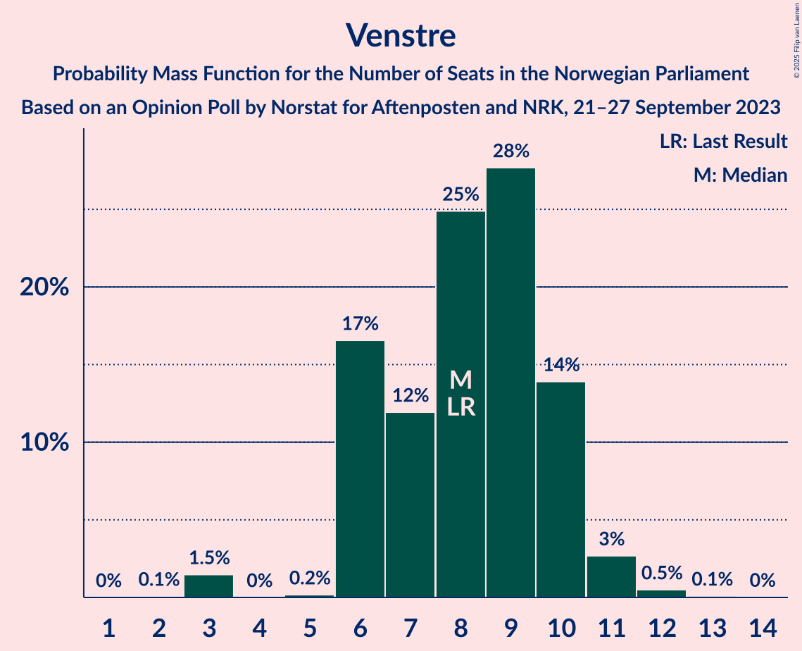

| Number of Seats | Probability | Accumulated | Special Marks |
|:---------------:|:-----------:|:-----------:|:-------------:|
| 2 | 0.1% | 100% |  |
| 3 | 1.5% | 99.9% |  |
| 4 | 0% | 98% |  |
| 5 | 0.2% | 98% |  |
| 6 | 17% | 98% |  |
| 7 | 12% | 82% |  |
| 8 | 25% | 70% | Last Result, Median |
| 9 | 28% | 45% |  |
| 10 | 14% | 17% |  |
| 11 | 3% | 3% |  |
| 12 | 0.5% | 0.6% |  |
| 13 | 0.1% | 0.1% |  |
| 14 | 0% | 0% |  |

### Industri- og Næringspartiet

*For a full overview of the results for this party, see the [Industri- og Næringspartiet](party-industri-ognæringspartiet.html) page.*

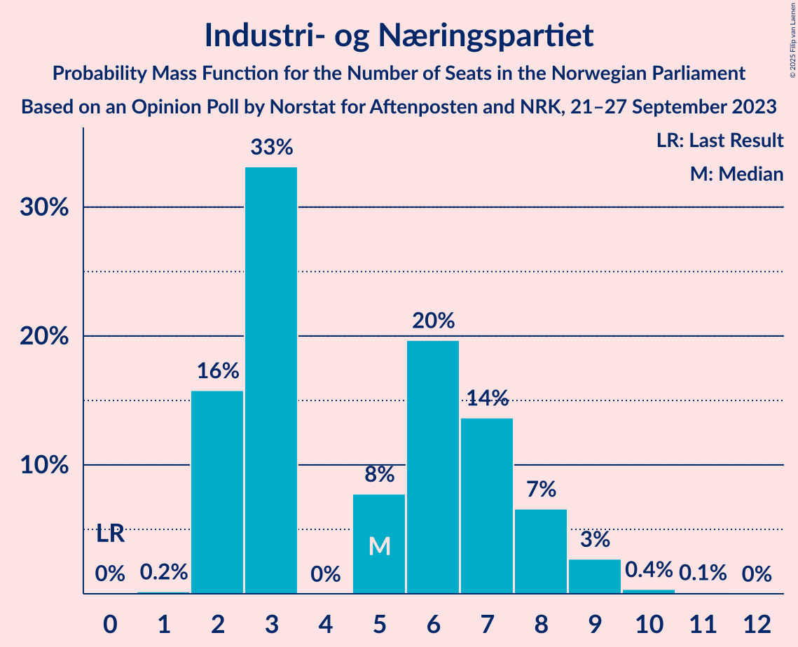

| Number of Seats | Probability | Accumulated | Special Marks |
|:---------------:|:-----------:|:-----------:|:-------------:|
| 0 | 0% | 100% | Last Result |
| 1 | 0.2% | 100% |  |
| 2 | 16% | 99.8% |  |
| 3 | 33% | 84% |  |
| 4 | 0% | 51% |  |
| 5 | 8% | 51% | Median |
| 6 | 20% | 43% |  |
| 7 | 14% | 23% |  |
| 8 | 7% | 10% |  |
| 9 | 3% | 3% |  |
| 10 | 0.4% | 0.5% |  |
| 11 | 0.1% | 0.1% |  |
| 12 | 0% | 0% |  |

### Miljøpartiet De Grønne

*For a full overview of the results for this party, see the [Miljøpartiet De Grønne](party-miljøpartietdegrønne.html) page.*

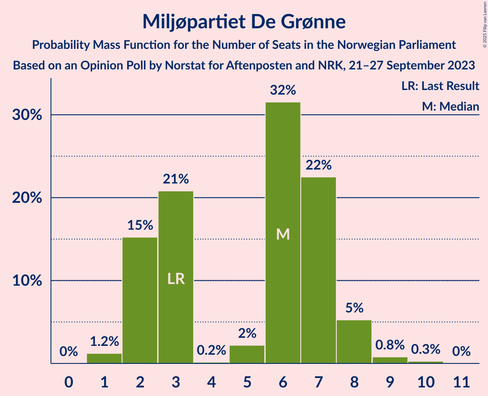

| Number of Seats | Probability | Accumulated | Special Marks |
|:---------------:|:-----------:|:-----------:|:-------------:|
| 1 | 1.2% | 100% |  |
| 2 | 15% | 98.8% |  |
| 3 | 21% | 84% | Last Result |
| 4 | 0.2% | 63% |  |
| 5 | 2% | 63% |  |
| 6 | 32% | 60% | Median |
| 7 | 22% | 29% |  |
| 8 | 5% | 6% |  |
| 9 | 0.8% | 1.1% |  |
| 10 | 0.3% | 0.3% |  |
| 11 | 0% | 0% |  |

### Rødt

*For a full overview of the results for this party, see the [Rødt](party-rødt.html) page.*

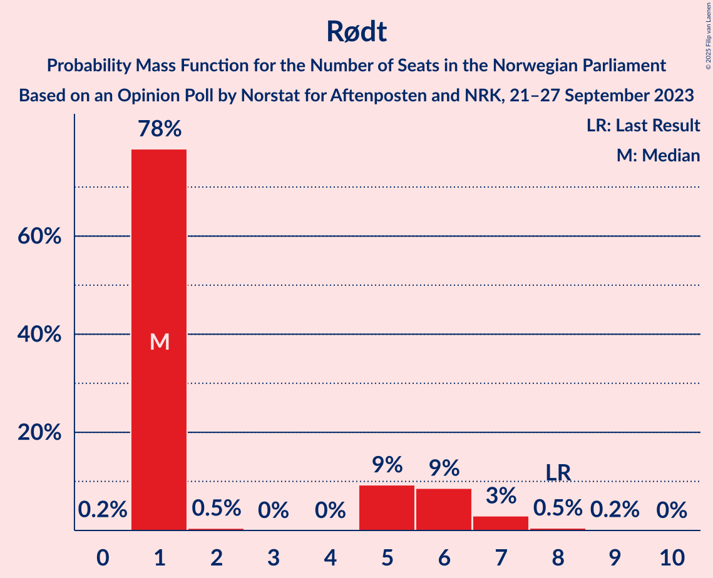

| Number of Seats | Probability | Accumulated | Special Marks |
|:---------------:|:-----------:|:-----------:|:-------------:|
| 0 | 0.2% | 100% |  |
| 1 | 78% | 99.8% | Median |
| 2 | 0.5% | 22% |  |
| 3 | 0% | 22% |  |
| 4 | 0% | 22% |  |
| 5 | 9% | 22% |  |
| 6 | 9% | 12% |  |
| 7 | 3% | 4% |  |
| 8 | 0.5% | 0.7% | Last Result |
| 9 | 0.2% | 0.2% |  |
| 10 | 0% | 0% |  |

### Kristelig Folkeparti

*For a full overview of the results for this party, see the [Kristelig Folkeparti](party-kristeligfolkeparti.html) page.*

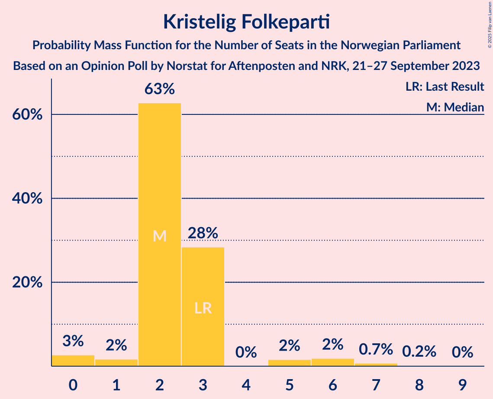

| Number of Seats | Probability | Accumulated | Special Marks |
|:---------------:|:-----------:|:-----------:|:-------------:|
| 0 | 3% | 100% |  |
| 1 | 2% | 97% |  |
| 2 | 63% | 96% | Median |
| 3 | 28% | 33% | Last Result |
| 4 | 0% | 4% |  |
| 5 | 2% | 4% |  |
| 6 | 2% | 3% |  |
| 7 | 0.7% | 0.9% |  |
| 8 | 0.2% | 0.2% |  |
| 9 | 0% | 0% |  |

## Coalitions

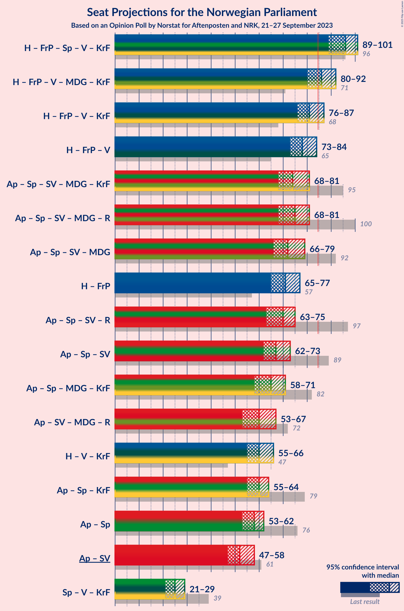

### Confidence Intervals

| Coalition | Last Result | Median | Majority? | 80% Confidence Interval | 90% Confidence Interval | 95% Confidence Interval | 99% Confidence Interval |
|:---------:|:-----------:|:------:|:---------:|:-----------------------:|:-----------------------:|:-----------------------:|:-----------------------:|
| Høyre – Fremskrittspartiet – Senterpartiet – Venstre – Kristelig Folkeparti | 96 | 96 | 100% | 92–99 | 91–100 | 89–101 | 88–104 |
| Høyre – Fremskrittspartiet – Venstre – Miljøpartiet De Grønne – Kristelig Folkeparti | 71 | 86 | 64% | 82–90 | 81–92 | 80–92 | 78–95 |
| Høyre – Fremskrittspartiet – Venstre – Kristelig Folkeparti | 68 | 81 | 10% | 77–85 | 76–86 | 76–87 | 74–89 |
| Høyre – Fremskrittspartiet – Venstre | 65 | 78 | 2% | 75–82 | 74–83 | 73–84 | 72–87 |
| Arbeiderpartiet – Senterpartiet – Sosialistisk Venstreparti – Miljøpartiet De Grønne – Kristelig Folkeparti | 95 | 74 | 0.2% | 71–79 | 70–80 | 68–81 | 65–82 |
| Arbeiderpartiet – Senterpartiet – Sosialistisk Venstreparti – Miljøpartiet De Grønne – Rødt | 100 | 75 | 0.1% | 70–78 | 69–80 | 68–81 | 65–83 |
| Arbeiderpartiet – Senterpartiet – Sosialistisk Venstreparti – Miljøpartiet De Grønne | 92 | 72 | 0% | 69–77 | 67–77 | 66–79 | 63–80 |
| Høyre – Fremskrittspartiet | 57 | 71 | 0% | 67–74 | 66–75 | 65–77 | 64–79 |
| Arbeiderpartiet – Senterpartiet – Sosialistisk Venstreparti – Rødt | 97 | 70 | 0% | 65–73 | 64–74 | 63–75 | 61–78 |
| Arbeiderpartiet – Senterpartiet – Sosialistisk Venstreparti | 89 | 67 | 0% | 64–70 | 62–71 | 62–73 | 60–74 |
| Arbeiderpartiet – Senterpartiet – Miljøpartiet De Grønne – Kristelig Folkeparti | 82 | 65 | 0% | 61–70 | 60–70 | 58–71 | 56–73 |
| Arbeiderpartiet – Sosialistisk Venstreparti – Miljøpartiet De Grønne – Rødt | 72 | 60 | 0% | 56–64 | 54–65 | 53–67 | 51–68 |
| Høyre – Venstre – Kristelig Folkeparti | 47 | 60 | 0% | 57–65 | 56–65 | 55–66 | 54–68 |
| Arbeiderpartiet – Senterpartiet – Kristelig Folkeparti | 79 | 60 | 0% | 56–63 | 55–64 | 55–64 | 52–67 |
| Arbeiderpartiet – Senterpartiet | 76 | 58 | 0% | 54–60 | 53–61 | 53–62 | 50–64 |
| Arbeiderpartiet – Sosialistisk Venstreparti | 61 | 52 | 0% | 49–57 | 48–57 | 47–58 | 45–60 |
| Senterpartiet – Venstre – Kristelig Folkeparti | 39 | 25 | 0% | 22–28 | 22–29 | 21–29 | 17–33 |

### Høyre – Fremskrittspartiet – Senterpartiet – Venstre – Kristelig Folkeparti

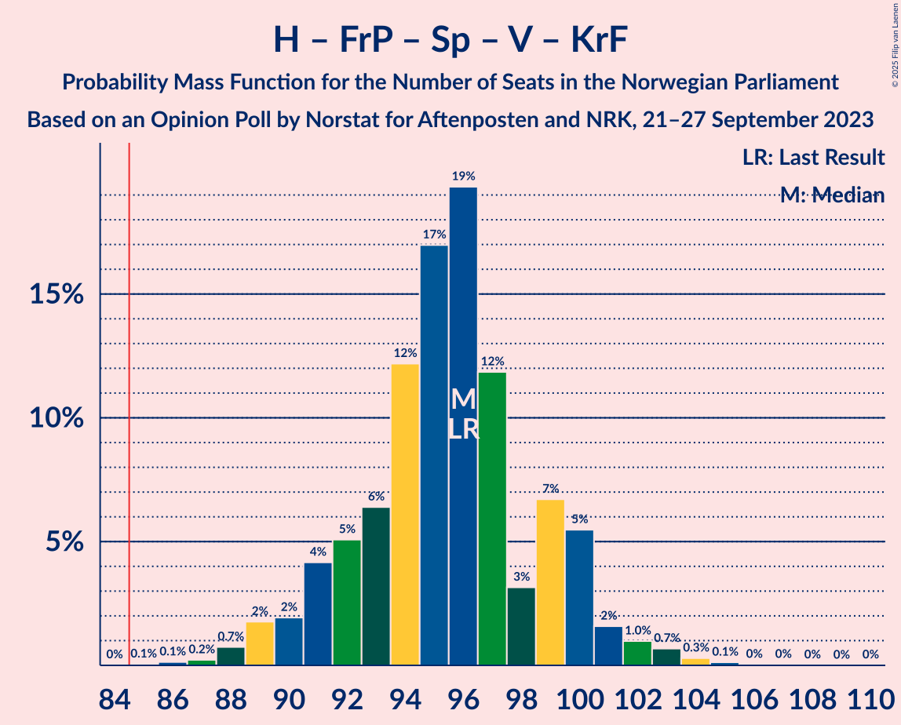

| Number of Seats | Probability | Accumulated | Special Marks |
|:---------------:|:-----------:|:-----------:|:-------------:|
| 85 | 0.1% | 100% | Majority |
| 86 | 0.1% | 99.9% |  |
| 87 | 0.2% | 99.8% |  |
| 88 | 0.7% | 99.6% |  |
| 89 | 2% | 98.8% |  |
| 90 | 2% | 97% |  |
| 91 | 4% | 95% |  |
| 92 | 5% | 91% |  |
| 93 | 6% | 86% |  |
| 94 | 12% | 79% | Median |
| 95 | 17% | 67% |  |
| 96 | 19% | 50% | Last Result |
| 97 | 12% | 31% |  |
| 98 | 3% | 19% |  |
| 99 | 7% | 16% |  |
| 100 | 5% | 9% |  |
| 101 | 2% | 4% |  |
| 102 | 1.0% | 2% |  |
| 103 | 0.7% | 1.2% |  |
| 104 | 0.3% | 0.6% |  |
| 105 | 0.1% | 0.3% |  |
| 106 | 0% | 0.1% |  |
| 107 | 0% | 0.1% |  |
| 108 | 0% | 0.1% |  |
| 109 | 0% | 0% |  |

### Høyre – Fremskrittspartiet – Venstre – Miljøpartiet De Grønne – Kristelig Folkeparti

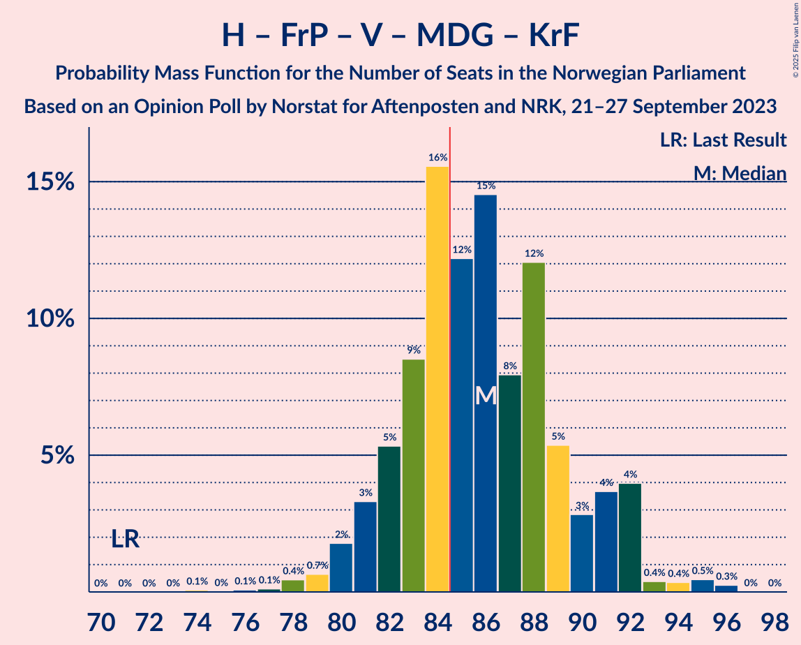

| Number of Seats | Probability | Accumulated | Special Marks |
|:---------------:|:-----------:|:-----------:|:-------------:|
| 71 | 0% | 100% | Last Result |
| 72 | 0% | 100% |  |
| 73 | 0% | 100% |  |
| 74 | 0.1% | 100% |  |
| 75 | 0% | 99.9% |  |
| 76 | 0.1% | 99.9% |  |
| 77 | 0.1% | 99.8% |  |
| 78 | 0.4% | 99.7% |  |
| 79 | 0.7% | 99.3% |  |
| 80 | 2% | 98.6% |  |
| 81 | 3% | 97% |  |
| 82 | 5% | 94% |  |
| 83 | 9% | 88% |  |
| 84 | 16% | 80% |  |
| 85 | 12% | 64% | Majority |
| 86 | 15% | 52% | Median |
| 87 | 8% | 37% |  |
| 88 | 12% | 29% |  |
| 89 | 5% | 17% |  |
| 90 | 3% | 12% |  |
| 91 | 4% | 9% |  |
| 92 | 4% | 5% |  |
| 93 | 0.4% | 1.5% |  |
| 94 | 0.4% | 1.1% |  |
| 95 | 0.5% | 0.7% |  |
| 96 | 0.3% | 0.3% |  |
| 97 | 0% | 0% |  |

### Høyre – Fremskrittspartiet – Venstre – Kristelig Folkeparti

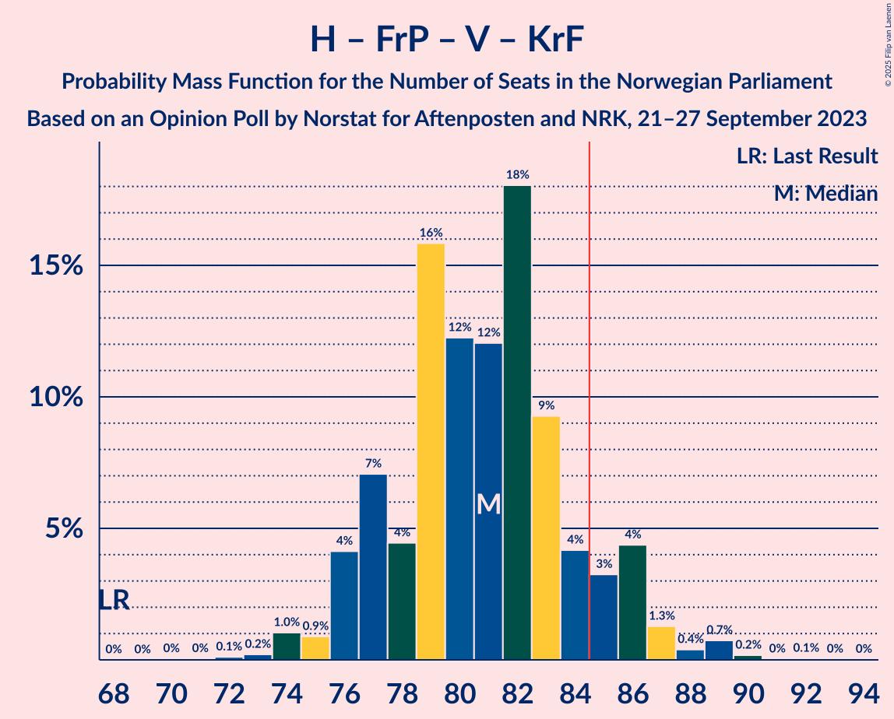

| Number of Seats | Probability | Accumulated | Special Marks |
|:---------------:|:-----------:|:-----------:|:-------------:|
| 68 | 0% | 100% | Last Result |
| 69 | 0% | 100% |  |
| 70 | 0% | 100% |  |
| 71 | 0% | 99.9% |  |
| 72 | 0.1% | 99.9% |  |
| 73 | 0.2% | 99.8% |  |
| 74 | 1.0% | 99.6% |  |
| 75 | 0.9% | 98.5% |  |
| 76 | 4% | 98% |  |
| 77 | 7% | 94% |  |
| 78 | 4% | 86% |  |
| 79 | 16% | 82% |  |
| 80 | 12% | 66% | Median |
| 81 | 12% | 54% |  |
| 82 | 18% | 42% |  |
| 83 | 9% | 24% |  |
| 84 | 4% | 15% |  |
| 85 | 3% | 10% | Majority |
| 86 | 4% | 7% |  |
| 87 | 1.3% | 3% |  |
| 88 | 0.4% | 1.5% |  |
| 89 | 0.7% | 1.1% |  |
| 90 | 0.2% | 0.3% |  |
| 91 | 0% | 0.2% |  |
| 92 | 0.1% | 0.1% |  |
| 93 | 0% | 0.1% |  |
| 94 | 0% | 0% |  |

### Høyre – Fremskrittspartiet – Venstre

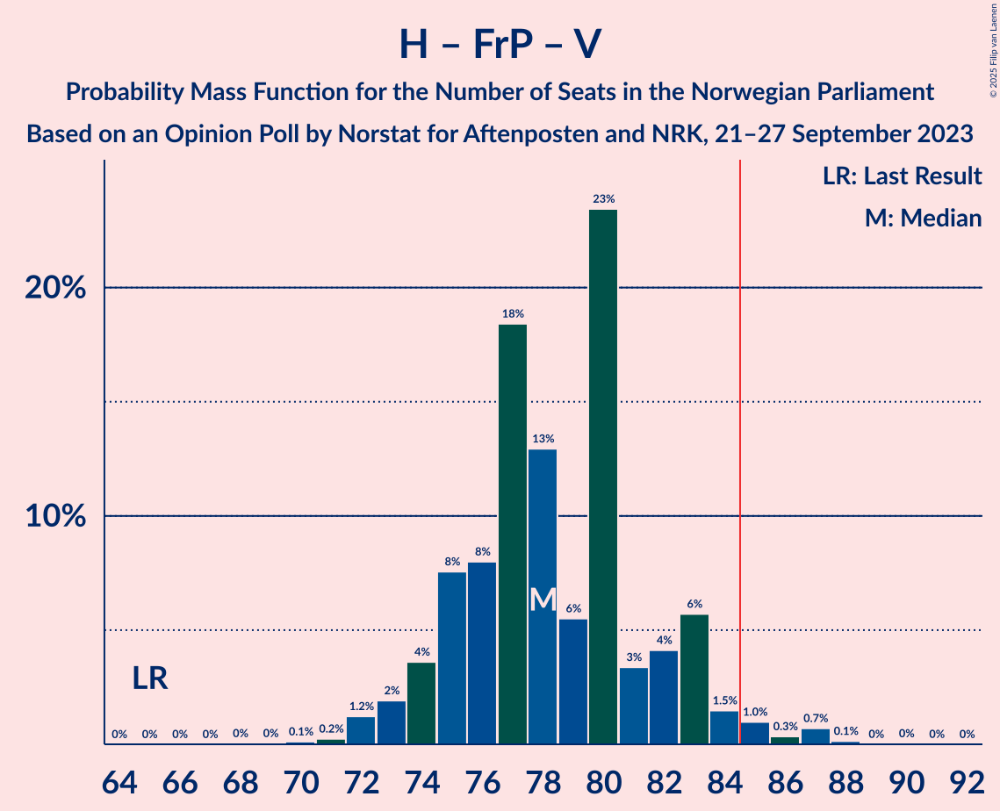

| Number of Seats | Probability | Accumulated | Special Marks |
|:---------------:|:-----------:|:-----------:|:-------------:|
| 65 | 0% | 100% | Last Result |
| 66 | 0% | 100% |  |
| 67 | 0% | 100% |  |
| 68 | 0% | 100% |  |
| 69 | 0% | 100% |  |
| 70 | 0.1% | 99.9% |  |
| 71 | 0.2% | 99.8% |  |
| 72 | 1.2% | 99.5% |  |
| 73 | 2% | 98% |  |
| 74 | 4% | 96% |  |
| 75 | 8% | 93% |  |
| 76 | 8% | 85% |  |
| 77 | 18% | 77% |  |
| 78 | 13% | 59% | Median |
| 79 | 6% | 46% |  |
| 80 | 23% | 40% |  |
| 81 | 3% | 17% |  |
| 82 | 4% | 14% |  |
| 83 | 6% | 9% |  |
| 84 | 1.5% | 4% |  |
| 85 | 1.0% | 2% | Majority |
| 86 | 0.3% | 1.3% |  |
| 87 | 0.7% | 0.9% |  |
| 88 | 0.1% | 0.2% |  |
| 89 | 0% | 0.1% |  |
| 90 | 0% | 0.1% |  |
| 91 | 0% | 0% |  |

### Arbeiderpartiet – Senterpartiet – Sosialistisk Venstreparti – Miljøpartiet De Grønne – Kristelig Folkeparti

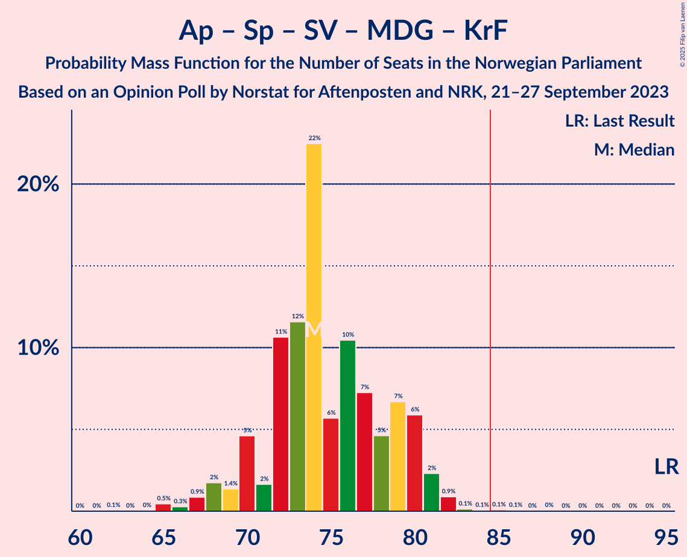

| Number of Seats | Probability | Accumulated | Special Marks |
|:---------------:|:-----------:|:-----------:|:-------------:|
| 62 | 0.1% | 100% |  |
| 63 | 0% | 99.9% |  |
| 64 | 0% | 99.9% |  |
| 65 | 0.5% | 99.9% |  |
| 66 | 0.3% | 99.4% |  |
| 67 | 0.9% | 99.2% |  |
| 68 | 2% | 98% |  |
| 69 | 1.4% | 97% |  |
| 70 | 5% | 95% |  |
| 71 | 2% | 91% |  |
| 72 | 11% | 89% |  |
| 73 | 12% | 78% |  |
| 74 | 22% | 67% |  |
| 75 | 6% | 44% | Median |
| 76 | 10% | 39% |  |
| 77 | 7% | 28% |  |
| 78 | 5% | 21% |  |
| 79 | 7% | 16% |  |
| 80 | 6% | 9% |  |
| 81 | 2% | 4% |  |
| 82 | 0.9% | 1.3% |  |
| 83 | 0.1% | 0.4% |  |
| 84 | 0.1% | 0.3% |  |
| 85 | 0.1% | 0.2% | Majority |
| 86 | 0.1% | 0.1% |  |
| 87 | 0% | 0.1% |  |
| 88 | 0% | 0.1% |  |
| 89 | 0% | 0% |  |
| 90 | 0% | 0% |  |
| 91 | 0% | 0% |  |
| 92 | 0% | 0% |  |
| 93 | 0% | 0% |  |
| 94 | 0% | 0% |  |
| 95 | 0% | 0% | Last Result |

### Arbeiderpartiet – Senterpartiet – Sosialistisk Venstreparti – Miljøpartiet De Grønne – Rødt

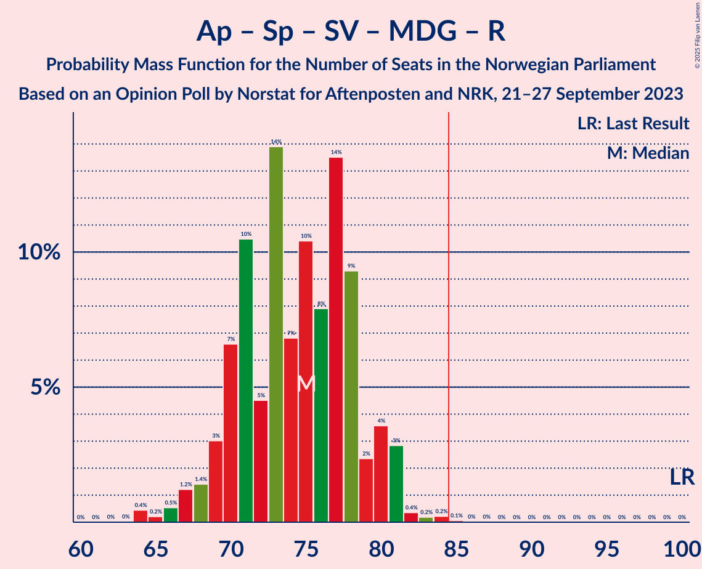

| Number of Seats | Probability | Accumulated | Special Marks |
|:---------------:|:-----------:|:-----------:|:-------------:|
| 64 | 0.4% | 100% |  |
| 65 | 0.2% | 99.5% |  |
| 66 | 0.5% | 99.3% |  |
| 67 | 1.2% | 98.8% |  |
| 68 | 1.4% | 98% |  |
| 69 | 3% | 96% |  |
| 70 | 7% | 93% |  |
| 71 | 10% | 87% |  |
| 72 | 5% | 76% |  |
| 73 | 14% | 72% |  |
| 74 | 7% | 58% | Median |
| 75 | 10% | 51% |  |
| 76 | 8% | 40% |  |
| 77 | 14% | 32% |  |
| 78 | 9% | 19% |  |
| 79 | 2% | 10% |  |
| 80 | 4% | 7% |  |
| 81 | 3% | 4% |  |
| 82 | 0.4% | 0.9% |  |
| 83 | 0.2% | 0.5% |  |
| 84 | 0.2% | 0.3% |  |
| 85 | 0.1% | 0.1% | Majority |
| 86 | 0% | 0% |  |
| 87 | 0% | 0% |  |
| 88 | 0% | 0% |  |
| 89 | 0% | 0% |  |
| 90 | 0% | 0% |  |
| 91 | 0% | 0% |  |
| 92 | 0% | 0% |  |
| 93 | 0% | 0% |  |
| 94 | 0% | 0% |  |
| 95 | 0% | 0% |  |
| 96 | 0% | 0% |  |
| 97 | 0% | 0% |  |
| 98 | 0% | 0% |  |
| 99 | 0% | 0% |  |
| 100 | 0% | 0% | Last Result |

### Arbeiderpartiet – Senterpartiet – Sosialistisk Venstreparti – Miljøpartiet De Grønne

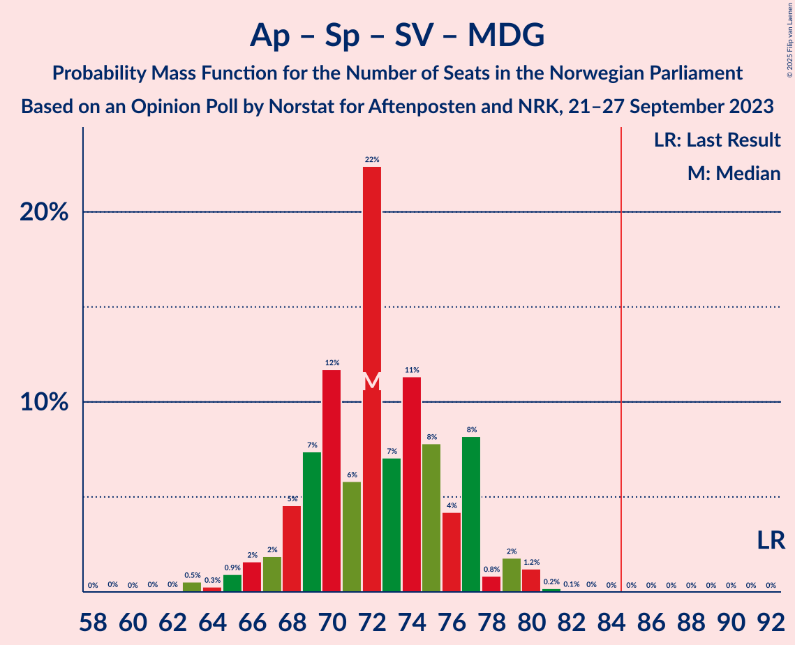

| Number of Seats | Probability | Accumulated | Special Marks |
|:---------------:|:-----------:|:-----------:|:-------------:|
| 59 | 0% | 100% |  |
| 60 | 0% | 99.9% |  |
| 61 | 0% | 99.9% |  |
| 62 | 0% | 99.9% |  |
| 63 | 0.5% | 99.9% |  |
| 64 | 0.3% | 99.3% |  |
| 65 | 0.9% | 99.1% |  |
| 66 | 2% | 98% |  |
| 67 | 2% | 97% |  |
| 68 | 5% | 95% |  |
| 69 | 7% | 90% |  |
| 70 | 12% | 83% |  |
| 71 | 6% | 71% |  |
| 72 | 22% | 65% |  |
| 73 | 7% | 43% | Median |
| 74 | 11% | 36% |  |
| 75 | 8% | 24% |  |
| 76 | 4% | 17% |  |
| 77 | 8% | 12% |  |
| 78 | 0.8% | 4% |  |
| 79 | 2% | 3% |  |
| 80 | 1.2% | 2% |  |
| 81 | 0.2% | 0.3% |  |
| 82 | 0.1% | 0.1% |  |
| 83 | 0% | 0.1% |  |
| 84 | 0% | 0% |  |
| 85 | 0% | 0% | Majority |
| 86 | 0% | 0% |  |
| 87 | 0% | 0% |  |
| 88 | 0% | 0% |  |
| 89 | 0% | 0% |  |
| 90 | 0% | 0% |  |
| 91 | 0% | 0% |  |
| 92 | 0% | 0% | Last Result |

### Høyre – Fremskrittspartiet

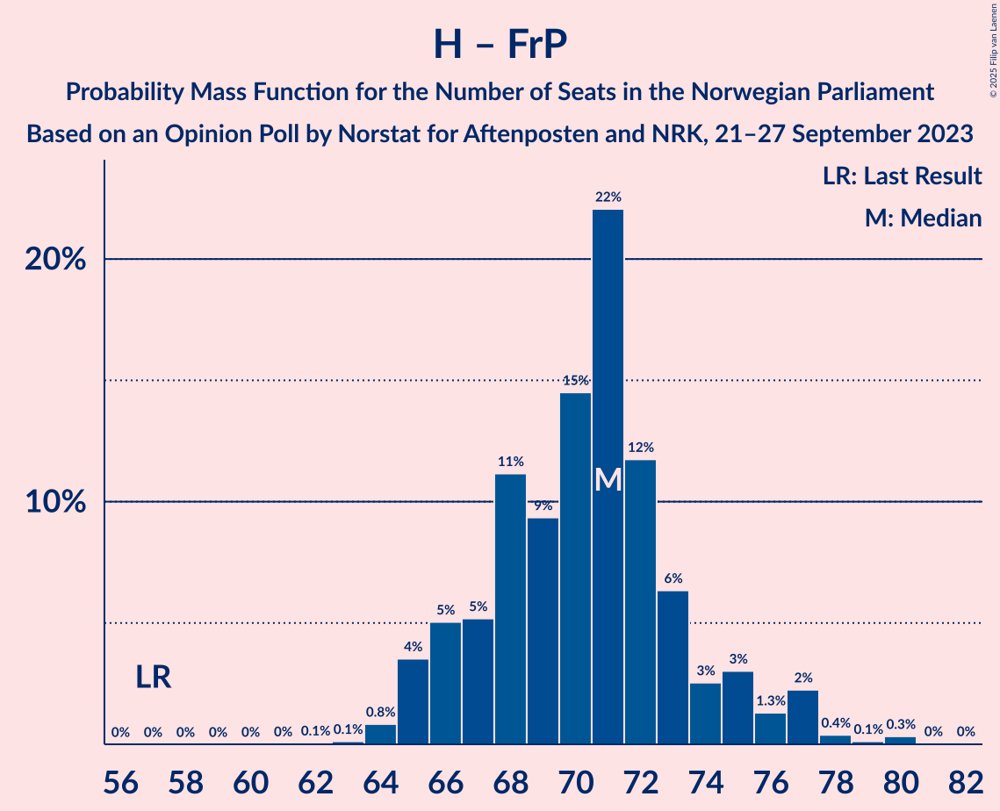

| Number of Seats | Probability | Accumulated | Special Marks |
|:---------------:|:-----------:|:-----------:|:-------------:|
| 57 | 0% | 100% | Last Result |
| 58 | 0% | 100% |  |
| 59 | 0% | 100% |  |
| 60 | 0% | 100% |  |
| 61 | 0% | 100% |  |
| 62 | 0.1% | 100% |  |
| 63 | 0.1% | 99.9% |  |
| 64 | 0.8% | 99.8% |  |
| 65 | 4% | 98.9% |  |
| 66 | 5% | 95% |  |
| 67 | 5% | 90% |  |
| 68 | 11% | 85% |  |
| 69 | 9% | 74% |  |
| 70 | 15% | 65% | Median |
| 71 | 22% | 50% |  |
| 72 | 12% | 28% |  |
| 73 | 6% | 16% |  |
| 74 | 3% | 10% |  |
| 75 | 3% | 7% |  |
| 76 | 1.3% | 4% |  |
| 77 | 2% | 3% |  |
| 78 | 0.4% | 0.9% |  |
| 79 | 0.1% | 0.5% |  |
| 80 | 0.3% | 0.4% |  |
| 81 | 0% | 0.1% |  |
| 82 | 0% | 0% |  |

### Arbeiderpartiet – Senterpartiet – Sosialistisk Venstreparti – Rødt

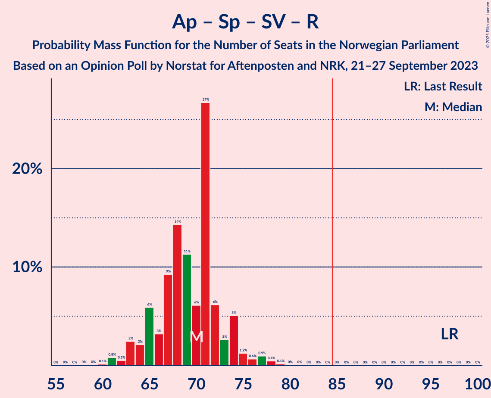

| Number of Seats | Probability | Accumulated | Special Marks |
|:---------------:|:-----------:|:-----------:|:-------------:|
| 59 | 0% | 100% |  |
| 60 | 0.1% | 99.9% |  |
| 61 | 0.8% | 99.8% |  |
| 62 | 0.5% | 99.0% |  |
| 63 | 2% | 98.5% |  |
| 64 | 2% | 96% |  |
| 65 | 6% | 94% |  |
| 66 | 3% | 88% |  |
| 67 | 9% | 85% |  |
| 68 | 14% | 76% | Median |
| 69 | 11% | 61% |  |
| 70 | 6% | 50% |  |
| 71 | 27% | 44% |  |
| 72 | 6% | 17% |  |
| 73 | 3% | 11% |  |
| 74 | 5% | 8% |  |
| 75 | 1.2% | 3% |  |
| 76 | 0.6% | 2% |  |
| 77 | 0.9% | 2% |  |
| 78 | 0.4% | 0.6% |  |
| 79 | 0.1% | 0.2% |  |
| 80 | 0% | 0.1% |  |
| 81 | 0% | 0% |  |
| 82 | 0% | 0% |  |
| 83 | 0% | 0% |  |
| 84 | 0% | 0% |  |
| 85 | 0% | 0% | Majority |
| 86 | 0% | 0% |  |
| 87 | 0% | 0% |  |
| 88 | 0% | 0% |  |
| 89 | 0% | 0% |  |
| 90 | 0% | 0% |  |
| 91 | 0% | 0% |  |
| 92 | 0% | 0% |  |
| 93 | 0% | 0% |  |
| 94 | 0% | 0% |  |
| 95 | 0% | 0% |  |
| 96 | 0% | 0% |  |
| 97 | 0% | 0% | Last Result |

### Arbeiderpartiet – Senterpartiet – Sosialistisk Venstreparti

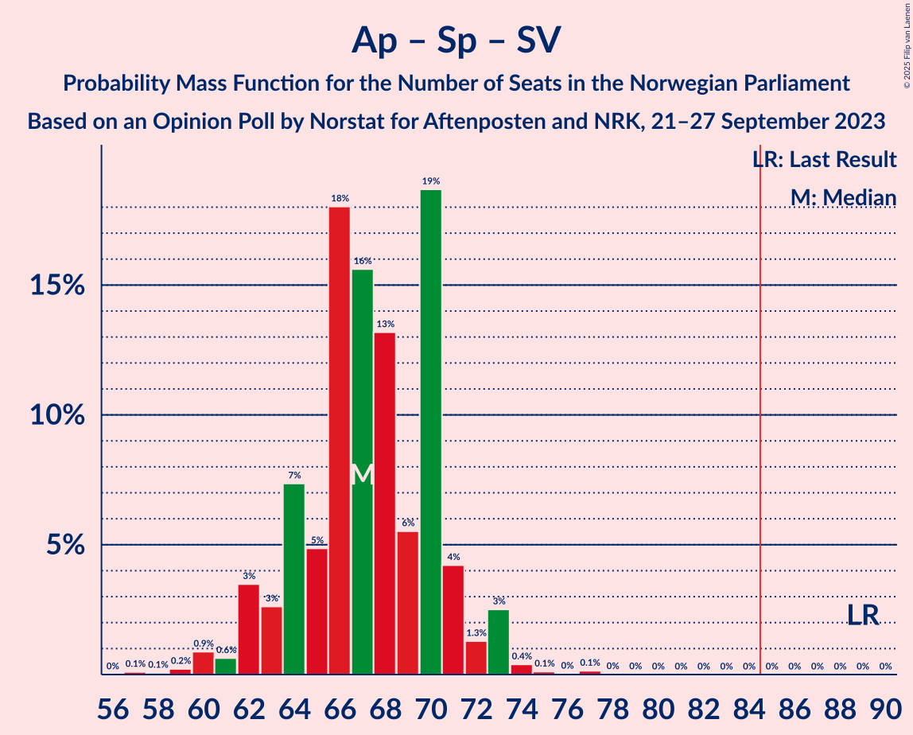

| Number of Seats | Probability | Accumulated | Special Marks |
|:---------------:|:-----------:|:-----------:|:-------------:|
| 57 | 0.1% | 100% |  |
| 58 | 0.1% | 99.9% |  |
| 59 | 0.2% | 99.8% |  |
| 60 | 0.9% | 99.6% |  |
| 61 | 0.6% | 98.7% |  |
| 62 | 3% | 98% |  |
| 63 | 3% | 95% |  |
| 64 | 7% | 92% |  |
| 65 | 5% | 85% |  |
| 66 | 18% | 80% |  |
| 67 | 16% | 62% | Median |
| 68 | 13% | 46% |  |
| 69 | 6% | 33% |  |
| 70 | 19% | 27% |  |
| 71 | 4% | 9% |  |
| 72 | 1.3% | 5% |  |
| 73 | 3% | 3% |  |
| 74 | 0.4% | 0.7% |  |
| 75 | 0.1% | 0.3% |  |
| 76 | 0% | 0.2% |  |
| 77 | 0.1% | 0.2% |  |
| 78 | 0% | 0% |  |
| 79 | 0% | 0% |  |
| 80 | 0% | 0% |  |
| 81 | 0% | 0% |  |
| 82 | 0% | 0% |  |
| 83 | 0% | 0% |  |
| 84 | 0% | 0% |  |
| 85 | 0% | 0% | Majority |
| 86 | 0% | 0% |  |
| 87 | 0% | 0% |  |
| 88 | 0% | 0% |  |
| 89 | 0% | 0% | Last Result |

### Arbeiderpartiet – Senterpartiet – Miljøpartiet De Grønne – Kristelig Folkeparti

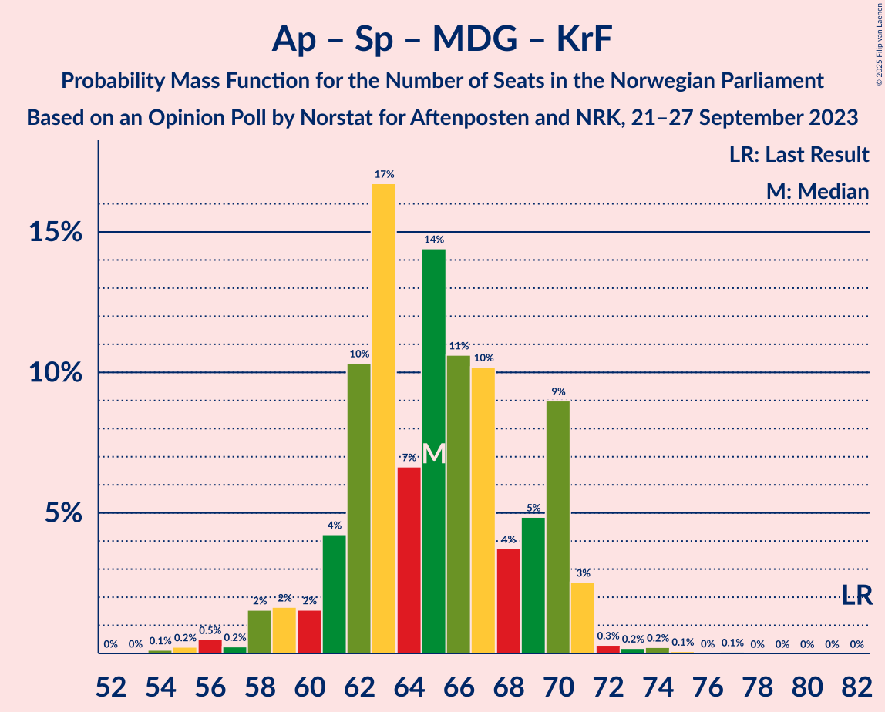

| Number of Seats | Probability | Accumulated | Special Marks |
|:---------------:|:-----------:|:-----------:|:-------------:|
| 54 | 0.1% | 100% |  |
| 55 | 0.2% | 99.9% |  |
| 56 | 0.5% | 99.6% |  |
| 57 | 0.2% | 99.1% |  |
| 58 | 2% | 98.9% |  |
| 59 | 2% | 97% |  |
| 60 | 2% | 96% |  |
| 61 | 4% | 94% |  |
| 62 | 10% | 90% |  |
| 63 | 17% | 80% |  |
| 64 | 7% | 63% |  |
| 65 | 14% | 56% | Median |
| 66 | 11% | 42% |  |
| 67 | 10% | 31% |  |
| 68 | 4% | 21% |  |
| 69 | 5% | 17% |  |
| 70 | 9% | 12% |  |
| 71 | 3% | 3% |  |
| 72 | 0.3% | 0.9% |  |
| 73 | 0.2% | 0.6% |  |
| 74 | 0.2% | 0.4% |  |
| 75 | 0.1% | 0.2% |  |
| 76 | 0% | 0.1% |  |
| 77 | 0.1% | 0.1% |  |
| 78 | 0% | 0% |  |
| 79 | 0% | 0% |  |
| 80 | 0% | 0% |  |
| 81 | 0% | 0% |  |
| 82 | 0% | 0% | Last Result |

### Arbeiderpartiet – Sosialistisk Venstreparti – Miljøpartiet De Grønne – Rødt

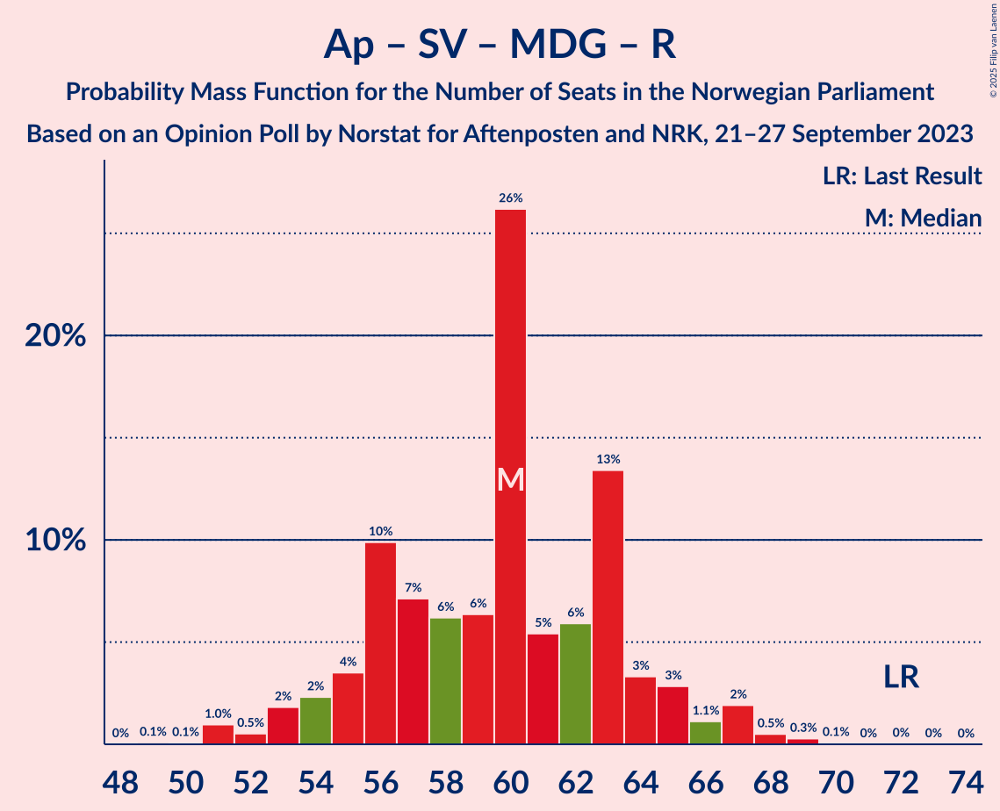

| Number of Seats | Probability | Accumulated | Special Marks |
|:---------------:|:-----------:|:-----------:|:-------------:|
| 49 | 0.1% | 100% |  |
| 50 | 0.1% | 99.9% |  |
| 51 | 1.0% | 99.8% |  |
| 52 | 0.5% | 98.8% |  |
| 53 | 2% | 98% |  |
| 54 | 2% | 96% |  |
| 55 | 4% | 94% |  |
| 56 | 10% | 91% |  |
| 57 | 7% | 81% |  |
| 58 | 6% | 74% |  |
| 59 | 6% | 67% |  |
| 60 | 26% | 61% | Median |
| 61 | 5% | 35% |  |
| 62 | 6% | 29% |  |
| 63 | 13% | 24% |  |
| 64 | 3% | 10% |  |
| 65 | 3% | 7% |  |
| 66 | 1.1% | 4% |  |
| 67 | 2% | 3% |  |
| 68 | 0.5% | 0.9% |  |
| 69 | 0.3% | 0.4% |  |
| 70 | 0.1% | 0.2% |  |
| 71 | 0% | 0.1% |  |
| 72 | 0% | 0.1% | Last Result |
| 73 | 0% | 0% |  |

### Høyre – Venstre – Kristelig Folkeparti

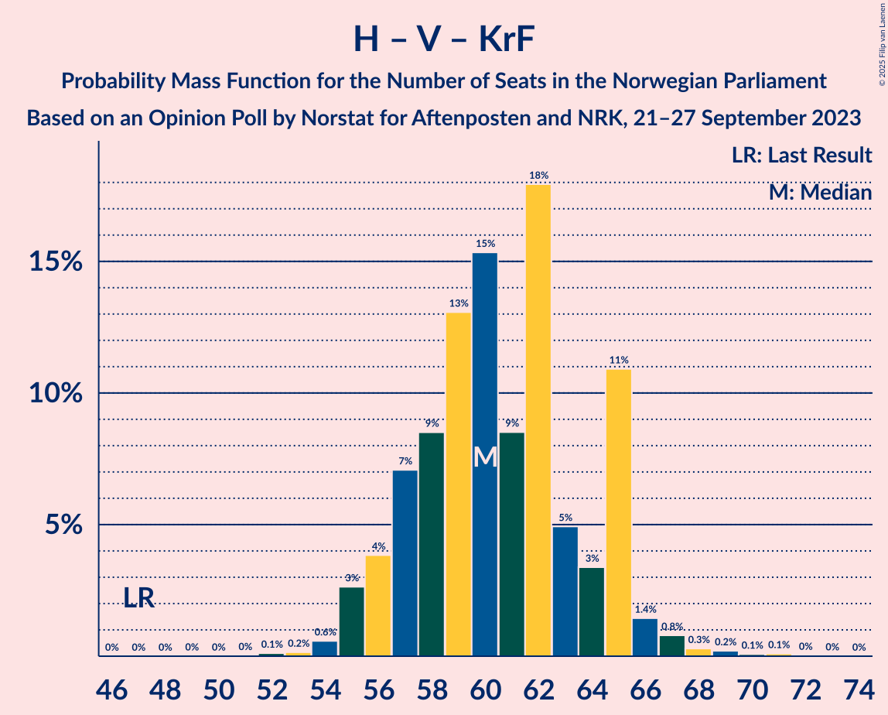

| Number of Seats | Probability | Accumulated | Special Marks |
|:---------------:|:-----------:|:-----------:|:-------------:|
| 47 | 0% | 100% | Last Result |
| 48 | 0% | 100% |  |
| 49 | 0% | 100% |  |
| 50 | 0% | 100% |  |
| 51 | 0% | 100% |  |
| 52 | 0.1% | 100% |  |
| 53 | 0.2% | 99.8% |  |
| 54 | 0.6% | 99.7% |  |
| 55 | 3% | 99.1% |  |
| 56 | 4% | 96% |  |
| 57 | 7% | 93% |  |
| 58 | 9% | 86% |  |
| 59 | 13% | 77% |  |
| 60 | 15% | 64% | Median |
| 61 | 9% | 49% |  |
| 62 | 18% | 40% |  |
| 63 | 5% | 22% |  |
| 64 | 3% | 17% |  |
| 65 | 11% | 14% |  |
| 66 | 1.4% | 3% |  |
| 67 | 0.8% | 2% |  |
| 68 | 0.3% | 0.7% |  |
| 69 | 0.2% | 0.4% |  |
| 70 | 0.1% | 0.2% |  |
| 71 | 0.1% | 0.1% |  |
| 72 | 0% | 0.1% |  |
| 73 | 0% | 0% |  |

### Arbeiderpartiet – Senterpartiet – Kristelig Folkeparti

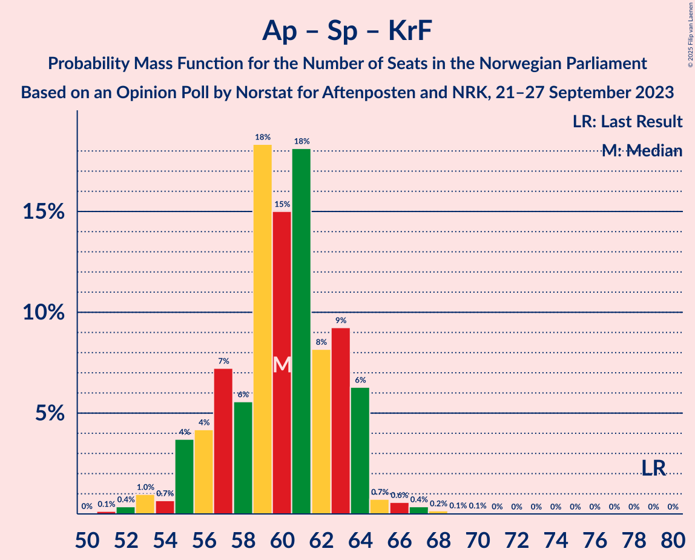

| Number of Seats | Probability | Accumulated | Special Marks |
|:---------------:|:-----------:|:-----------:|:-------------:|
| 50 | 0% | 100% |  |
| 51 | 0.1% | 99.9% |  |
| 52 | 0.4% | 99.8% |  |
| 53 | 1.0% | 99.5% |  |
| 54 | 0.7% | 98% |  |
| 55 | 4% | 98% |  |
| 56 | 4% | 94% |  |
| 57 | 7% | 90% |  |
| 58 | 6% | 83% |  |
| 59 | 18% | 77% | Median |
| 60 | 15% | 59% |  |
| 61 | 18% | 44% |  |
| 62 | 8% | 26% |  |
| 63 | 9% | 17% |  |
| 64 | 6% | 8% |  |
| 65 | 0.7% | 2% |  |
| 66 | 0.6% | 1.2% |  |
| 67 | 0.4% | 0.6% |  |
| 68 | 0.2% | 0.3% |  |
| 69 | 0.1% | 0.1% |  |
| 70 | 0.1% | 0.1% |  |
| 71 | 0% | 0% |  |
| 72 | 0% | 0% |  |
| 73 | 0% | 0% |  |
| 74 | 0% | 0% |  |
| 75 | 0% | 0% |  |
| 76 | 0% | 0% |  |
| 77 | 0% | 0% |  |
| 78 | 0% | 0% |  |
| 79 | 0% | 0% | Last Result |

### Arbeiderpartiet – Senterpartiet

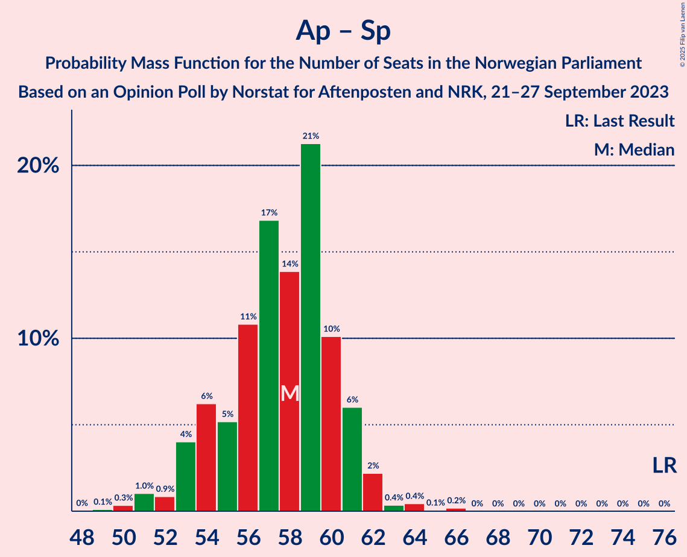

| Number of Seats | Probability | Accumulated | Special Marks |
|:---------------:|:-----------:|:-----------:|:-------------:|
| 48 | 0% | 100% |  |
| 49 | 0.1% | 99.9% |  |
| 50 | 0.3% | 99.8% |  |
| 51 | 1.0% | 99.5% |  |
| 52 | 0.9% | 98% |  |
| 53 | 4% | 98% |  |
| 54 | 6% | 94% |  |
| 55 | 5% | 87% |  |
| 56 | 11% | 82% |  |
| 57 | 17% | 71% | Median |
| 58 | 14% | 55% |  |
| 59 | 21% | 41% |  |
| 60 | 10% | 19% |  |
| 61 | 6% | 9% |  |
| 62 | 2% | 3% |  |
| 63 | 0.4% | 1.1% |  |
| 64 | 0.4% | 0.7% |  |
| 65 | 0.1% | 0.3% |  |
| 66 | 0.2% | 0.2% |  |
| 67 | 0% | 0% |  |
| 68 | 0% | 0% |  |
| 69 | 0% | 0% |  |
| 70 | 0% | 0% |  |
| 71 | 0% | 0% |  |
| 72 | 0% | 0% |  |
| 73 | 0% | 0% |  |
| 74 | 0% | 0% |  |
| 75 | 0% | 0% |  |
| 76 | 0% | 0% | Last Result |

### Arbeiderpartiet – Sosialistisk Venstreparti

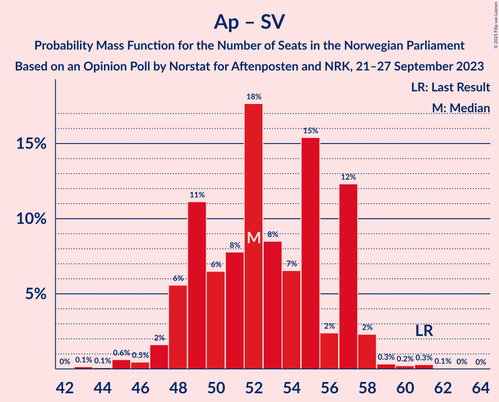

| Number of Seats | Probability | Accumulated | Special Marks |
|:---------------:|:-----------:|:-----------:|:-------------:|
| 43 | 0.1% | 100% |  |
| 44 | 0.1% | 99.8% |  |
| 45 | 0.6% | 99.7% |  |
| 46 | 0.5% | 99.1% |  |
| 47 | 2% | 98.7% |  |
| 48 | 6% | 97% |  |
| 49 | 11% | 91% |  |
| 50 | 6% | 80% |  |
| 51 | 8% | 74% |  |
| 52 | 18% | 66% |  |
| 53 | 8% | 48% | Median |
| 54 | 7% | 40% |  |
| 55 | 15% | 33% |  |
| 56 | 2% | 18% |  |
| 57 | 12% | 16% |  |
| 58 | 2% | 3% |  |
| 59 | 0.3% | 0.9% |  |
| 60 | 0.2% | 0.6% |  |
| 61 | 0.3% | 0.4% | Last Result |
| 62 | 0.1% | 0.1% |  |
| 63 | 0% | 0% |  |

### Senterpartiet – Venstre – Kristelig Folkeparti

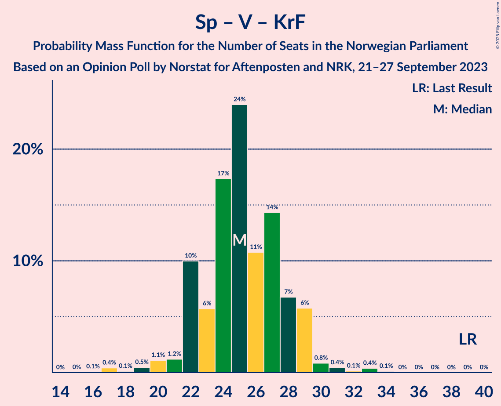

| Number of Seats | Probability | Accumulated | Special Marks |
|:---------------:|:-----------:|:-----------:|:-------------:|
| 16 | 0.1% | 100% |  |
| 17 | 0.4% | 99.9% |  |
| 18 | 0.1% | 99.5% |  |
| 19 | 0.5% | 99.4% |  |
| 20 | 1.1% | 98.9% |  |
| 21 | 1.2% | 98% |  |
| 22 | 10% | 97% |  |
| 23 | 6% | 87% |  |
| 24 | 17% | 81% | Median |
| 25 | 24% | 64% |  |
| 26 | 11% | 40% |  |
| 27 | 14% | 29% |  |
| 28 | 7% | 14% |  |
| 29 | 6% | 8% |  |
| 30 | 0.8% | 2% |  |
| 31 | 0.4% | 1.1% |  |
| 32 | 0.1% | 0.7% |  |
| 33 | 0.4% | 0.5% |  |
| 34 | 0.1% | 0.1% |  |
| 35 | 0% | 0% |  |
| 36 | 0% | 0% |  |
| 37 | 0% | 0% |  |
| 38 | 0% | 0% |  |
| 39 | 0% | 0% | Last Result |

## Technical Information

### Opinion Poll

+ **Polling firm:** Norstat
+ **Commissioner(s):** Aftenposten and NRK
+ **Fieldwork period:** 21–27 September 2023

### Calculations

+ **Sample size:** 992
+ **Simulations done:** 1,048,576
+ **Error estimate:** 1.31%

