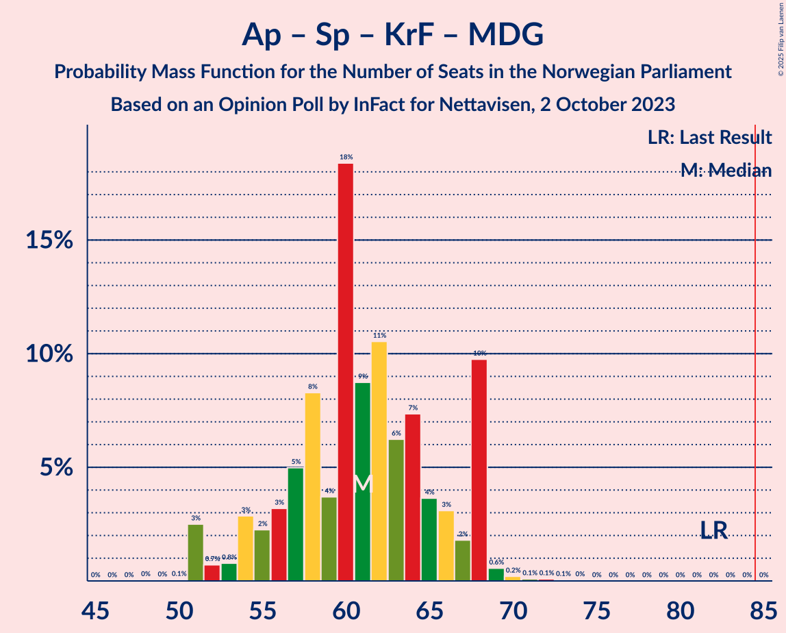

# Opinion Poll by InFact for Nettavisen, 2 October 2023

<a href="#voting-intentions">Voting Intentions</a> | <a href="#seats">Seats</a> | <a href="#coalitions">Coalitions</a> | <a href="#technical-information">Technical Information</a>

## Voting Intentions

### Confidence Intervals

| Party | Last Result | Poll Result | 80% Confidence Interval | 90% Confidence Interval | 95% Confidence Interval | 99% Confidence Interval |
|:-----:|:-----------:|:-----------:|:-----------------------:|:-----------------------:|:-----------------------:|:-----------------------:|
| Høyre | 20.4% | 25.0% | 23.3–26.7% |22.8–27.3% |22.4–27.7% |21.7–28.6% |
| Arbeiderpartiet | 26.2% | 20.7% | 19.1–22.3% |18.7–22.8% |18.3–23.2% |17.6–24.1% |
| Fremskrittspartiet | 11.6% | 14.0% | 12.7–15.4% |12.3–15.9% |12.0–16.2% |11.4–16.9% |
| Sosialistisk Venstreparti | 7.6% | 8.6% | 7.6–9.8% |7.3–10.2% |7.1–10.5% |6.6–11.1% |
| Senterpartiet | 13.5% | 5.8% | 5.0–6.9% |4.8–7.2% |4.6–7.4% |4.2–8.0% |
| Venstre | 4.6% | 5.3% | 4.5–6.3% |4.3–6.5% |4.1–6.8% |3.7–7.3% |
| Rødt | 4.7% | 5.2% | 4.4–6.2% |4.2–6.4% |4.0–6.7% |3.6–7.2% |
| Kristelig Folkeparti | 3.8% | 4.2% | 3.5–5.1% |3.3–5.4% |3.2–5.6% |2.8–6.1% |
| Industri- og Næringspartiet | 0.3% | 4.0% | 3.3–4.9% |3.1–5.2% |3.0–5.4% |2.7–5.9% |
| Miljøpartiet De Grønne | 3.9% | 4.0% | 3.3–4.9% |3.1–5.2% |3.0–5.4% |2.7–5.9% |

*Note:* The poll result column reflects the actual value used in the calculations. Published results may vary slightly, and in addition be rounded to fewer digits.

## Seats

### Confidence Intervals

| Party | Last Result | Median | 80% Confidence Interval | 90% Confidence Interval | 95% Confidence Interval | 99% Confidence Interval |
|:-----:|:-----------:|:------:|:-----------------------:|:-----------------------:|:-----------------------:|:-----------------------:|
| <a href="#høyre">Høyre</a> | 36 | 45 | 42–49 |42–49 |41–50 |40–51 |
| <a href="#arbeiderpartiet">Arbeiderpartiet</a> | 48 | 40 | 37–46 |36–46 |35–46 |34–48 |
| <a href="#fremskrittspartiet">Fremskrittspartiet</a> | 21 | 25 | 22–29 |22–30 |21–31 |20–33 |
| <a href="#sosialistisk-venstreparti">Sosialistisk Venstreparti</a> | 13 | 15 | 11–17 |11–17 |10–18 |9–20 |
| <a href="#senterpartiet">Senterpartiet</a> | 28 | 10 | 8–12 |7–13 |7–13 |6–15 |
| <a href="#venstre">Venstre</a> | 8 | 9 | 7–10 |6–11 |3–11 |3–12 |
| <a href="#rødt">Rødt</a> | 8 | 8 | 7–10 |6–11 |1–11 |1–12 |
| <a href="#kristelig-folkeparti">Kristelig Folkeparti</a> | 3 | 6 | 2–8 |2–9 |2–9 |2–10 |
| <a href="#industri--og-næringspartiet">Industri- og Næringspartiet</a> | 0 | 6 | 2–7 |2–8 |2–9 |1–10 |
| <a href="#miljøpartiet-de-grønne">Miljøpartiet De Grønne</a> | 3 | 7 | 2–8 |1–8 |1–8 |1–9 |

### Høyre

*For a full overview of the results for this party, see the [Høyre](party-høyre.html) page.*

| Number of Seats | Probability | Accumulated | Special Marks |
|:---------------:|:-----------:|:-----------:|:-------------:|
| 36 | 0% | 100% | Last Result |
| 37 | 0% | 100% |  |
| 38 | 0.1% | 100% |  |
| 39 | 0.3% | 99.9% |  |
| 40 | 1.5% | 99.6% |  |
| 41 | 2% | 98% |  |
| 42 | 8% | 96% |  |
| 43 | 16% | 88% |  |
| 44 | 14% | 72% |  |
| 45 | 14% | 58% | Median |
| 46 | 17% | 44% |  |
| 47 | 6% | 27% |  |
| 48 | 10% | 21% |  |
| 49 | 7% | 11% |  |
| 50 | 2% | 3% |  |
| 51 | 0.2% | 0.7% |  |
| 52 | 0.1% | 0.5% |  |
| 53 | 0.3% | 0.4% |  |
| 54 | 0% | 0% |  |

### Arbeiderpartiet

*For a full overview of the results for this party, see the [Arbeiderpartiet](party-arbeiderpartiet.html) page.*

| Number of Seats | Probability | Accumulated | Special Marks |
|:---------------:|:-----------:|:-----------:|:-------------:|
| 33 | 0.3% | 100% |  |
| 34 | 0.6% | 99.7% |  |
| 35 | 2% | 99.1% |  |
| 36 | 4% | 97% |  |
| 37 | 7% | 93% |  |
| 38 | 7% | 87% |  |
| 39 | 15% | 79% |  |
| 40 | 30% | 64% | Median |
| 41 | 5% | 34% |  |
| 42 | 7% | 29% |  |
| 43 | 3% | 22% |  |
| 44 | 2% | 18% |  |
| 45 | 4% | 16% |  |
| 46 | 10% | 12% |  |
| 47 | 1.2% | 2% |  |
| 48 | 0.3% | 0.5% | Last Result |
| 49 | 0.2% | 0.2% |  |
| 50 | 0% | 0% |  |

### Fremskrittspartiet

*For a full overview of the results for this party, see the [Fremskrittspartiet](party-fremskrittspartiet.html) page.*

| Number of Seats | Probability | Accumulated | Special Marks |
|:---------------:|:-----------:|:-----------:|:-------------:|
| 18 | 0% | 100% |  |
| 19 | 0.4% | 99.9% |  |
| 20 | 1.2% | 99.5% |  |
| 21 | 3% | 98% | Last Result |
| 22 | 17% | 96% |  |
| 23 | 8% | 79% |  |
| 24 | 12% | 71% |  |
| 25 | 11% | 59% | Median |
| 26 | 9% | 47% |  |
| 27 | 18% | 38% |  |
| 28 | 8% | 21% |  |
| 29 | 5% | 13% |  |
| 30 | 5% | 8% |  |
| 31 | 1.3% | 3% |  |
| 32 | 0.3% | 1.4% |  |
| 33 | 0.8% | 1.1% |  |
| 34 | 0.1% | 0.2% |  |
| 35 | 0% | 0.1% |  |
| 36 | 0.1% | 0.1% |  |
| 37 | 0% | 0% |  |

### Sosialistisk Venstreparti

*For a full overview of the results for this party, see the [Sosialistisk Venstreparti](party-sosialistiskvenstreparti.html) page.*

| Number of Seats | Probability | Accumulated | Special Marks |
|:---------------:|:-----------:|:-----------:|:-------------:|
| 8 | 0.1% | 100% |  |
| 9 | 0.5% | 99.9% |  |
| 10 | 3% | 99.4% |  |
| 11 | 13% | 97% |  |
| 12 | 6% | 83% |  |
| 13 | 16% | 77% | Last Result |
| 14 | 10% | 61% |  |
| 15 | 31% | 51% | Median |
| 16 | 9% | 20% |  |
| 17 | 8% | 11% |  |
| 18 | 2% | 3% |  |
| 19 | 0.9% | 1.4% |  |
| 20 | 0.4% | 0.5% |  |
| 21 | 0.1% | 0.1% |  |
| 22 | 0% | 0% |  |

### Senterpartiet

*For a full overview of the results for this party, see the [Senterpartiet](party-senterpartiet.html) page.*

| Number of Seats | Probability | Accumulated | Special Marks |
|:---------------:|:-----------:|:-----------:|:-------------:|
| 1 | 0.1% | 100% |  |
| 2 | 0% | 99.9% |  |
| 3 | 0% | 99.9% |  |
| 4 | 0% | 99.9% |  |
| 5 | 0% | 99.9% |  |
| 6 | 2% | 99.9% |  |
| 7 | 5% | 98% |  |
| 8 | 15% | 93% |  |
| 9 | 26% | 78% |  |
| 10 | 26% | 53% | Median |
| 11 | 6% | 27% |  |
| 12 | 12% | 21% |  |
| 13 | 8% | 10% |  |
| 14 | 1.1% | 2% |  |
| 15 | 0.5% | 0.5% |  |
| 16 | 0% | 0.1% |  |
| 17 | 0% | 0% |  |
| 18 | 0% | 0% |  |
| 19 | 0% | 0% |  |
| 20 | 0% | 0% |  |
| 21 | 0% | 0% |  |
| 22 | 0% | 0% |  |
| 23 | 0% | 0% |  |
| 24 | 0% | 0% |  |
| 25 | 0% | 0% |  |
| 26 | 0% | 0% |  |
| 27 | 0% | 0% |  |
| 28 | 0% | 0% | Last Result |

### Venstre

*For a full overview of the results for this party, see the [Venstre](party-venstre.html) page.*

| Number of Seats | Probability | Accumulated | Special Marks |
|:---------------:|:-----------:|:-----------:|:-------------:|
| 2 | 0.2% | 100% |  |
| 3 | 2% | 99.8% |  |
| 4 | 0% | 97% |  |
| 5 | 0% | 97% |  |
| 6 | 3% | 97% |  |
| 7 | 12% | 94% |  |
| 8 | 24% | 83% | Last Result |
| 9 | 21% | 58% | Median |
| 10 | 28% | 37% |  |
| 11 | 7% | 9% |  |
| 12 | 2% | 2% |  |
| 13 | 0.1% | 0.1% |  |
| 14 | 0% | 0% |  |

### Rødt

*For a full overview of the results for this party, see the [Rødt](party-rødt.html) page.*

| Number of Seats | Probability | Accumulated | Special Marks |
|:---------------:|:-----------:|:-----------:|:-------------:|
| 1 | 4% | 100% |  |
| 2 | 0% | 96% |  |
| 3 | 0% | 96% |  |
| 4 | 0% | 96% |  |
| 5 | 0.5% | 96% |  |
| 6 | 1.3% | 96% |  |
| 7 | 29% | 95% |  |
| 8 | 20% | 66% | Last Result, Median |
| 9 | 32% | 46% |  |
| 10 | 8% | 14% |  |
| 11 | 5% | 5% |  |
| 12 | 0.5% | 0.6% |  |
| 13 | 0.1% | 0.1% |  |
| 14 | 0% | 0% |  |

### Kristelig Folkeparti

*For a full overview of the results for this party, see the [Kristelig Folkeparti](party-kristeligfolkeparti.html) page.*

| Number of Seats | Probability | Accumulated | Special Marks |
|:---------------:|:-----------:|:-----------:|:-------------:|
| 2 | 19% | 100% |  |
| 3 | 21% | 81% | Last Result |
| 4 | 0% | 60% |  |
| 5 | 0.1% | 60% |  |
| 6 | 17% | 60% | Median |
| 7 | 17% | 43% |  |
| 8 | 19% | 26% |  |
| 9 | 5% | 8% |  |
| 10 | 2% | 2% |  |
| 11 | 0.2% | 0.2% |  |
| 12 | 0% | 0% |  |

### Industri- og Næringspartiet

*For a full overview of the results for this party, see the [Industri- og Næringspartiet](party-industri-ognæringspartiet.html) page.*

| Number of Seats | Probability | Accumulated | Special Marks |
|:---------------:|:-----------:|:-----------:|:-------------:|
| 0 | 0.2% | 100% | Last Result |
| 1 | 0.6% | 99.8% |  |
| 2 | 13% | 99.2% |  |
| 3 | 34% | 86% |  |
| 4 | 0% | 53% |  |
| 5 | 0.9% | 53% |  |
| 6 | 19% | 52% | Median |
| 7 | 24% | 33% |  |
| 8 | 6% | 9% |  |
| 9 | 1.5% | 3% |  |
| 10 | 1.5% | 2% |  |
| 11 | 0% | 0% |  |

### Miljøpartiet De Grønne

*For a full overview of the results for this party, see the [Miljøpartiet De Grønne](party-miljøpartietdegrønne.html) page.*

| Number of Seats | Probability | Accumulated | Special Marks |
|:---------------:|:-----------:|:-----------:|:-------------:|
| 1 | 6% | 100% |  |
| 2 | 11% | 94% |  |
| 3 | 24% | 84% | Last Result |
| 4 | 0% | 60% |  |
| 5 | 0.6% | 60% |  |
| 6 | 6% | 59% |  |
| 7 | 36% | 53% | Median |
| 8 | 16% | 17% |  |
| 9 | 2% | 2% |  |
| 10 | 0.1% | 0.2% |  |
| 11 | 0% | 0% |  |

## Coalitions

### Confidence Intervals

| Coalition | Last Result | Median | Majority? | 80% Confidence Interval | 90% Confidence Interval | 95% Confidence Interval | 99% Confidence Interval |
|:---------:|:-----------:|:------:|:---------:|:-----------------------:|:-----------------------:|:-----------------------:|:-----------------------:|
| Høyre – Fremskrittspartiet – Senterpartiet – Venstre – Kristelig Folkeparti | 96 | 94 | 99.3% | 90–99 | 89–102 | 87–102 | 84–105 |
| Høyre – Fremskrittspartiet – Venstre – Kristelig Folkeparti – Miljøpartiet De Grønne | 71 | 90 | 93% | 86–95 | 83–97 | 82–98 | 81–100 |
| Høyre – Fremskrittspartiet – Venstre – Kristelig Folkeparti | 68 | 84 | 46% | 80–90 | 79–91 | 78–94 | 74–95 |
| Høyre – Fremskrittspartiet – Venstre | 65 | 79 | 9% | 75–84 | 73–85 | 72–88 | 70–88 |
| Arbeiderpartiet – Sosialistisk Venstreparti – Senterpartiet – Rødt – Miljøpartiet De Grønne | 100 | 78 | 2% | 72–82 | 71–83 | 70–84 | 68–87 |
| Arbeiderpartiet – Sosialistisk Venstreparti – Senterpartiet – Kristelig Folkeparti – Miljøpartiet De Grønne | 95 | 76 | 0.7% | 70–79 | 67–80 | 65–81 | 64–85 |
| Arbeiderpartiet – Sosialistisk Venstreparti – Senterpartiet – Rødt | 97 | 73 | 0.1% | 68–76 | 67–78 | 65–79 | 64–82 |
| Høyre – Fremskrittspartiet | 57 | 71 | 0% | 67–75 | 66–77 | 65–78 | 63–79 |
| Arbeiderpartiet – Sosialistisk Venstreparti – Senterpartiet – Miljøpartiet De Grønne | 92 | 70 | 0% | 64–74 | 63–74 | 61–76 | 60–78 |
| Arbeiderpartiet – Sosialistisk Venstreparti – Rødt – Miljøpartiet De Grønne | 72 | 68 | 0% | 63–72 | 62–74 | 61–75 | 58–77 |
| Arbeiderpartiet – Sosialistisk Venstreparti – Senterpartiet | 89 | 65 | 0% | 60–68 | 58–69 | 58–70 | 56–73 |
| Arbeiderpartiet – Senterpartiet – Kristelig Folkeparti – Miljøpartiet De Grønne | 82 | 61 | 0% | 56–68 | 54–68 | 51–68 | 51–69 |
| Høyre – Venstre – Kristelig Folkeparti | 47 | 60 | 0% | 55–63 | 54–65 | 53–66 | 51–69 |
| Arbeiderpartiet – Senterpartiet – Kristelig Folkeparti | 79 | 55 | 0% | 51–61 | 50–61 | 48–62 | 48–64 |
| Arbeiderpartiet – Sosialistisk Venstreparti | 61 | 55 | 0% | 51–58 | 50–59 | 49–60 | 47–62 |
| Arbeiderpartiet – Senterpartiet | 76 | 50 | 0% | 46–55 | 45–55 | 45–55 | 43–58 |
| Senterpartiet – Venstre – Kristelig Folkeparti | 39 | 23 | 0% | 20–29 | 19–31 | 18–31 | 17–32 |

### Høyre – Fremskrittspartiet – Senterpartiet – Venstre – Kristelig Folkeparti

| Number of Seats | Probability | Accumulated | Special Marks |
|:---------------:|:-----------:|:-----------:|:-------------:|
| 82 | 0.1% | 100% |  |
| 83 | 0.2% | 99.9% |  |
| 84 | 0.4% | 99.7% |  |
| 85 | 0.8% | 99.3% | Majority |
| 86 | 0.5% | 98.5% |  |
| 87 | 0.8% | 98% |  |
| 88 | 0.9% | 97% |  |
| 89 | 5% | 96% |  |
| 90 | 3% | 91% |  |
| 91 | 14% | 88% |  |
| 92 | 5% | 74% |  |
| 93 | 13% | 69% |  |
| 94 | 8% | 56% |  |
| 95 | 5% | 47% | Median |
| 96 | 15% | 42% | Last Result |
| 97 | 4% | 28% |  |
| 98 | 5% | 23% |  |
| 99 | 11% | 18% |  |
| 100 | 1.0% | 8% |  |
| 101 | 0.8% | 7% |  |
| 102 | 4% | 6% |  |
| 103 | 0.4% | 2% |  |
| 104 | 2% | 2% |  |
| 105 | 0.1% | 0.5% |  |
| 106 | 0.1% | 0.4% |  |
| 107 | 0.2% | 0.3% |  |
| 108 | 0% | 0% |  |

### Høyre – Fremskrittspartiet – Venstre – Kristelig Folkeparti – Miljøpartiet De Grønne

| Number of Seats | Probability | Accumulated | Special Marks |
|:---------------:|:-----------:|:-----------:|:-------------:|
| 71 | 0% | 100% | Last Result |
| 72 | 0% | 100% |  |
| 73 | 0% | 100% |  |
| 74 | 0% | 100% |  |
| 75 | 0% | 100% |  |
| 76 | 0% | 100% |  |
| 77 | 0.1% | 100% |  |
| 78 | 0.1% | 99.9% |  |
| 79 | 0.1% | 99.8% |  |
| 80 | 0.1% | 99.8% |  |
| 81 | 0.8% | 99.6% |  |
| 82 | 2% | 98.8% |  |
| 83 | 2% | 97% |  |
| 84 | 2% | 95% |  |
| 85 | 2% | 93% | Majority |
| 86 | 6% | 91% |  |
| 87 | 9% | 85% |  |
| 88 | 4% | 76% |  |
| 89 | 14% | 72% |  |
| 90 | 14% | 58% |  |
| 91 | 18% | 44% |  |
| 92 | 5% | 26% | Median |
| 93 | 6% | 21% |  |
| 94 | 5% | 15% |  |
| 95 | 4% | 10% |  |
| 96 | 1.0% | 7% |  |
| 97 | 2% | 6% |  |
| 98 | 2% | 4% |  |
| 99 | 0.6% | 2% |  |
| 100 | 0.9% | 1.1% |  |
| 101 | 0% | 0.1% |  |
| 102 | 0.1% | 0.1% |  |
| 103 | 0% | 0% |  |

### Høyre – Fremskrittspartiet – Venstre – Kristelig Folkeparti

| Number of Seats | Probability | Accumulated | Special Marks |
|:---------------:|:-----------:|:-----------:|:-------------:|
| 68 | 0% | 100% | Last Result |
| 69 | 0% | 100% |  |
| 70 | 0% | 100% |  |
| 71 | 0% | 100% |  |
| 72 | 0% | 100% |  |
| 73 | 0.1% | 100% |  |
| 74 | 0.4% | 99.9% |  |
| 75 | 0.5% | 99.5% |  |
| 76 | 0.4% | 99.0% |  |
| 77 | 0.3% | 98.6% |  |
| 78 | 1.2% | 98% |  |
| 79 | 2% | 97% |  |
| 80 | 6% | 95% |  |
| 81 | 3% | 89% |  |
| 82 | 14% | 86% |  |
| 83 | 14% | 72% |  |
| 84 | 12% | 58% |  |
| 85 | 5% | 46% | Median, Majority |
| 86 | 12% | 41% |  |
| 87 | 11% | 29% |  |
| 88 | 5% | 18% |  |
| 89 | 3% | 13% |  |
| 90 | 2% | 10% |  |
| 91 | 4% | 8% |  |
| 92 | 0.6% | 5% |  |
| 93 | 1.0% | 4% |  |
| 94 | 2% | 3% |  |
| 95 | 0.3% | 0.6% |  |
| 96 | 0.2% | 0.3% |  |
| 97 | 0% | 0.1% |  |
| 98 | 0% | 0.1% |  |
| 99 | 0% | 0% |  |

### Høyre – Fremskrittspartiet – Venstre

| Number of Seats | Probability | Accumulated | Special Marks |
|:---------------:|:-----------:|:-----------:|:-------------:|
| 65 | 0% | 100% | Last Result |
| 66 | 0% | 100% |  |
| 67 | 0% | 100% |  |
| 68 | 0.1% | 99.9% |  |
| 69 | 0.1% | 99.9% |  |
| 70 | 0.4% | 99.8% |  |
| 71 | 0.2% | 99.4% |  |
| 72 | 2% | 99.2% |  |
| 73 | 2% | 97% |  |
| 74 | 1.3% | 95% |  |
| 75 | 5% | 94% |  |
| 76 | 13% | 89% |  |
| 77 | 8% | 76% |  |
| 78 | 11% | 68% |  |
| 79 | 16% | 57% | Median |
| 80 | 4% | 41% |  |
| 81 | 11% | 37% |  |
| 82 | 9% | 27% |  |
| 83 | 4% | 17% |  |
| 84 | 4% | 14% |  |
| 85 | 5% | 9% | Majority |
| 86 | 0.5% | 4% |  |
| 87 | 0.6% | 4% |  |
| 88 | 3% | 3% |  |
| 89 | 0.2% | 0.4% |  |
| 90 | 0.1% | 0.1% |  |
| 91 | 0% | 0% |  |

### Arbeiderpartiet – Sosialistisk Venstreparti – Senterpartiet – Rødt – Miljøpartiet De Grønne

| Number of Seats | Probability | Accumulated | Special Marks |
|:---------------:|:-----------:|:-----------:|:-------------:|
| 65 | 0% | 100% |  |
| 66 | 0.1% | 99.9% |  |
| 67 | 0.2% | 99.8% |  |
| 68 | 0.3% | 99.6% |  |
| 69 | 0.7% | 99.3% |  |
| 70 | 3% | 98.7% |  |
| 71 | 4% | 95% |  |
| 72 | 3% | 92% |  |
| 73 | 2% | 89% |  |
| 74 | 6% | 86% |  |
| 75 | 10% | 80% |  |
| 76 | 8% | 69% |  |
| 77 | 6% | 61% |  |
| 78 | 8% | 55% |  |
| 79 | 5% | 47% |  |
| 80 | 14% | 42% | Median |
| 81 | 7% | 28% |  |
| 82 | 14% | 21% |  |
| 83 | 4% | 7% |  |
| 84 | 0.6% | 3% |  |
| 85 | 0.5% | 2% | Majority |
| 86 | 1.1% | 2% |  |
| 87 | 0.6% | 0.9% |  |
| 88 | 0.2% | 0.3% |  |
| 89 | 0.1% | 0.2% |  |
| 90 | 0% | 0.1% |  |
| 91 | 0% | 0% |  |
| 92 | 0% | 0% |  |
| 93 | 0% | 0% |  |
| 94 | 0% | 0% |  |
| 95 | 0% | 0% |  |
| 96 | 0% | 0% |  |
| 97 | 0% | 0% |  |
| 98 | 0% | 0% |  |
| 99 | 0% | 0% |  |
| 100 | 0% | 0% | Last Result |

### Arbeiderpartiet – Sosialistisk Venstreparti – Senterpartiet – Kristelig Folkeparti – Miljøpartiet De Grønne

| Number of Seats | Probability | Accumulated | Special Marks |
|:---------------:|:-----------:|:-----------:|:-------------:|
| 63 | 0% | 100% |  |
| 64 | 2% | 99.9% |  |
| 65 | 0.4% | 98% |  |
| 66 | 0.3% | 97% |  |
| 67 | 3% | 97% |  |
| 68 | 1.3% | 94% |  |
| 69 | 1.2% | 92% |  |
| 70 | 5% | 91% |  |
| 71 | 2% | 86% |  |
| 72 | 5% | 84% |  |
| 73 | 10% | 79% |  |
| 74 | 5% | 70% |  |
| 75 | 12% | 65% |  |
| 76 | 12% | 53% |  |
| 77 | 13% | 40% |  |
| 78 | 6% | 28% | Median |
| 79 | 15% | 21% |  |
| 80 | 3% | 6% |  |
| 81 | 1.3% | 3% |  |
| 82 | 1.0% | 2% |  |
| 83 | 0.3% | 1.2% |  |
| 84 | 0.2% | 0.8% |  |
| 85 | 0.5% | 0.7% | Majority |
| 86 | 0.1% | 0.2% |  |
| 87 | 0% | 0.1% |  |
| 88 | 0% | 0.1% |  |
| 89 | 0% | 0% |  |
| 90 | 0% | 0% |  |
| 91 | 0% | 0% |  |
| 92 | 0% | 0% |  |
| 93 | 0% | 0% |  |
| 94 | 0% | 0% |  |
| 95 | 0% | 0% | Last Result |

### Arbeiderpartiet – Sosialistisk Venstreparti – Senterpartiet – Rødt

| Number of Seats | Probability | Accumulated | Special Marks |
|:---------------:|:-----------:|:-----------:|:-------------:|
| 60 | 0.1% | 100% |  |
| 61 | 0% | 99.9% |  |
| 62 | 0.1% | 99.9% |  |
| 63 | 0.2% | 99.7% |  |
| 64 | 1.0% | 99.5% |  |
| 65 | 2% | 98.5% |  |
| 66 | 0.9% | 97% |  |
| 67 | 5% | 96% |  |
| 68 | 5% | 91% |  |
| 69 | 7% | 85% |  |
| 70 | 5% | 79% |  |
| 71 | 9% | 74% |  |
| 72 | 7% | 65% |  |
| 73 | 14% | 58% | Median |
| 74 | 19% | 44% |  |
| 75 | 13% | 25% |  |
| 76 | 3% | 12% |  |
| 77 | 4% | 10% |  |
| 78 | 1.4% | 6% |  |
| 79 | 2% | 5% |  |
| 80 | 1.2% | 2% |  |
| 81 | 0.4% | 1.0% |  |
| 82 | 0.2% | 0.7% |  |
| 83 | 0.1% | 0.4% |  |
| 84 | 0.2% | 0.3% |  |
| 85 | 0.1% | 0.1% | Majority |
| 86 | 0% | 0% |  |
| 87 | 0% | 0% |  |
| 88 | 0% | 0% |  |
| 89 | 0% | 0% |  |
| 90 | 0% | 0% |  |
| 91 | 0% | 0% |  |
| 92 | 0% | 0% |  |
| 93 | 0% | 0% |  |
| 94 | 0% | 0% |  |
| 95 | 0% | 0% |  |
| 96 | 0% | 0% |  |
| 97 | 0% | 0% | Last Result |

### Høyre – Fremskrittspartiet

| Number of Seats | Probability | Accumulated | Special Marks |
|:---------------:|:-----------:|:-----------:|:-------------:|
| 57 | 0% | 100% | Last Result |
| 58 | 0% | 100% |  |
| 59 | 0% | 100% |  |
| 60 | 0% | 99.9% |  |
| 61 | 0.1% | 99.9% |  |
| 62 | 0.2% | 99.9% |  |
| 63 | 0.7% | 99.6% |  |
| 64 | 0.6% | 98.9% |  |
| 65 | 3% | 98% |  |
| 66 | 4% | 95% |  |
| 67 | 7% | 91% |  |
| 68 | 17% | 84% |  |
| 69 | 12% | 68% |  |
| 70 | 5% | 56% | Median |
| 71 | 17% | 51% |  |
| 72 | 8% | 34% |  |
| 73 | 6% | 25% |  |
| 74 | 3% | 19% |  |
| 75 | 7% | 16% |  |
| 76 | 3% | 8% |  |
| 77 | 2% | 5% |  |
| 78 | 2% | 3% |  |
| 79 | 1.4% | 2% |  |
| 80 | 0.1% | 0.3% |  |
| 81 | 0.1% | 0.1% |  |
| 82 | 0% | 0% |  |

### Arbeiderpartiet – Sosialistisk Venstreparti – Senterpartiet – Miljøpartiet De Grønne

| Number of Seats | Probability | Accumulated | Special Marks |
|:---------------:|:-----------:|:-----------:|:-------------:|
| 58 | 0.1% | 100% |  |
| 59 | 0.1% | 99.8% |  |
| 60 | 0.3% | 99.7% |  |
| 61 | 3% | 99.5% |  |
| 62 | 1.1% | 97% |  |
| 63 | 2% | 96% |  |
| 64 | 6% | 94% |  |
| 65 | 3% | 88% |  |
| 66 | 7% | 86% |  |
| 67 | 8% | 79% |  |
| 68 | 6% | 71% |  |
| 69 | 9% | 65% |  |
| 70 | 12% | 56% |  |
| 71 | 7% | 44% |  |
| 72 | 3% | 37% | Median |
| 73 | 19% | 34% |  |
| 74 | 11% | 15% |  |
| 75 | 1.1% | 4% |  |
| 76 | 1.1% | 3% |  |
| 77 | 0.6% | 2% |  |
| 78 | 0.6% | 1.0% |  |
| 79 | 0.2% | 0.4% |  |
| 80 | 0.1% | 0.1% |  |
| 81 | 0% | 0.1% |  |
| 82 | 0% | 0% |  |
| 83 | 0% | 0% |  |
| 84 | 0% | 0% |  |
| 85 | 0% | 0% | Majority |
| 86 | 0% | 0% |  |
| 87 | 0% | 0% |  |
| 88 | 0% | 0% |  |
| 89 | 0% | 0% |  |
| 90 | 0% | 0% |  |
| 91 | 0% | 0% |  |
| 92 | 0% | 0% | Last Result |

### Arbeiderpartiet – Sosialistisk Venstreparti – Rødt – Miljøpartiet De Grønne

| Number of Seats | Probability | Accumulated | Special Marks |
|:---------------:|:-----------:|:-----------:|:-------------:|
| 56 | 0.1% | 100% |  |
| 57 | 0.2% | 99.9% |  |
| 58 | 0.3% | 99.7% |  |
| 59 | 0.7% | 99.4% |  |
| 60 | 0.5% | 98.7% |  |
| 61 | 2% | 98% |  |
| 62 | 3% | 96% |  |
| 63 | 7% | 93% |  |
| 64 | 4% | 86% |  |
| 65 | 10% | 82% |  |
| 66 | 10% | 72% |  |
| 67 | 10% | 62% |  |
| 68 | 6% | 52% |  |
| 69 | 5% | 46% |  |
| 70 | 8% | 41% | Median |
| 71 | 14% | 33% |  |
| 72 | 12% | 19% | Last Result |
| 73 | 2% | 8% |  |
| 74 | 3% | 6% |  |
| 75 | 0.6% | 3% |  |
| 76 | 1.2% | 2% |  |
| 77 | 0.5% | 0.7% |  |
| 78 | 0.1% | 0.3% |  |
| 79 | 0.1% | 0.2% |  |
| 80 | 0.1% | 0.1% |  |
| 81 | 0% | 0% |  |

### Arbeiderpartiet – Sosialistisk Venstreparti – Senterpartiet

| Number of Seats | Probability | Accumulated | Special Marks |
|:---------------:|:-----------:|:-----------:|:-------------:|
| 54 | 0.1% | 100% |  |
| 55 | 0.1% | 99.9% |  |
| 56 | 0.3% | 99.8% |  |
| 57 | 0.4% | 99.5% |  |
| 58 | 4% | 99.1% |  |
| 59 | 1.2% | 95% |  |
| 60 | 8% | 93% |  |
| 61 | 6% | 86% |  |
| 62 | 6% | 79% |  |
| 63 | 8% | 73% |  |
| 64 | 6% | 65% |  |
| 65 | 17% | 59% | Median |
| 66 | 16% | 42% |  |
| 67 | 15% | 26% |  |
| 68 | 5% | 11% |  |
| 69 | 2% | 6% |  |
| 70 | 2% | 4% |  |
| 71 | 0.5% | 1.5% |  |
| 72 | 0.4% | 0.9% |  |
| 73 | 0.2% | 0.5% |  |
| 74 | 0.1% | 0.4% |  |
| 75 | 0.2% | 0.3% |  |
| 76 | 0% | 0% |  |
| 77 | 0% | 0% |  |
| 78 | 0% | 0% |  |
| 79 | 0% | 0% |  |
| 80 | 0% | 0% |  |
| 81 | 0% | 0% |  |
| 82 | 0% | 0% |  |
| 83 | 0% | 0% |  |
| 84 | 0% | 0% |  |
| 85 | 0% | 0% | Majority |
| 86 | 0% | 0% |  |
| 87 | 0% | 0% |  |
| 88 | 0% | 0% |  |
| 89 | 0% | 0% | Last Result |

### Arbeiderpartiet – Senterpartiet – Kristelig Folkeparti – Miljøpartiet De Grønne

| Number of Seats | Probability | Accumulated | Special Marks |
|:---------------:|:-----------:|:-----------:|:-------------:|
| 48 | 0% | 100% |  |
| 49 | 0% | 99.9% |  |
| 50 | 0.1% | 99.9% |  |
| 51 | 3% | 99.9% |  |
| 52 | 0.7% | 97% |  |
| 53 | 0.8% | 97% |  |
| 54 | 3% | 96% |  |
| 55 | 2% | 93% |  |
| 56 | 3% | 91% |  |
| 57 | 5% | 88% |  |
| 58 | 8% | 83% |  |
| 59 | 4% | 74% |  |
| 60 | 18% | 71% |  |
| 61 | 9% | 52% |  |
| 62 | 11% | 43% |  |
| 63 | 6% | 33% | Median |
| 64 | 7% | 27% |  |
| 65 | 4% | 19% |  |
| 66 | 3% | 16% |  |
| 67 | 2% | 13% |  |
| 68 | 10% | 11% |  |
| 69 | 0.6% | 1.0% |  |
| 70 | 0.2% | 0.5% |  |
| 71 | 0.1% | 0.3% |  |
| 72 | 0.1% | 0.2% |  |
| 73 | 0.1% | 0.1% |  |
| 74 | 0% | 0% |  |
| 75 | 0% | 0% |  |
| 76 | 0% | 0% |  |
| 77 | 0% | 0% |  |
| 78 | 0% | 0% |  |
| 79 | 0% | 0% |  |
| 80 | 0% | 0% |  |
| 81 | 0% | 0% |  |
| 82 | 0% | 0% | Last Result |

### Høyre – Venstre – Kristelig Folkeparti

| Number of Seats | Probability | Accumulated | Special Marks |
|:---------------:|:-----------:|:-----------:|:-------------:|
| 47 | 0% | 100% | Last Result |
| 48 | 0% | 100% |  |
| 49 | 0.1% | 100% |  |
| 50 | 0.1% | 99.9% |  |
| 51 | 0.4% | 99.8% |  |
| 52 | 0.9% | 99.4% |  |
| 53 | 2% | 98% |  |
| 54 | 5% | 96% |  |
| 55 | 2% | 91% |  |
| 56 | 11% | 89% |  |
| 57 | 9% | 79% |  |
| 58 | 8% | 70% |  |
| 59 | 11% | 62% |  |
| 60 | 16% | 51% | Median |
| 61 | 8% | 35% |  |
| 62 | 14% | 27% |  |
| 63 | 3% | 13% |  |
| 64 | 4% | 10% |  |
| 65 | 2% | 6% |  |
| 66 | 1.3% | 4% |  |
| 67 | 0.3% | 2% |  |
| 68 | 0.4% | 2% |  |
| 69 | 1.5% | 2% |  |
| 70 | 0% | 0.1% |  |
| 71 | 0% | 0% |  |

### Arbeiderpartiet – Senterpartiet – Kristelig Folkeparti

| Number of Seats | Probability | Accumulated | Special Marks |
|:---------------:|:-----------:|:-----------:|:-------------:|
| 45 | 0.1% | 100% |  |
| 46 | 0.1% | 99.9% |  |
| 47 | 0.2% | 99.8% |  |
| 48 | 3% | 99.6% |  |
| 49 | 0.9% | 96% |  |
| 50 | 2% | 96% |  |
| 51 | 4% | 93% |  |
| 52 | 13% | 89% |  |
| 53 | 9% | 76% |  |
| 54 | 5% | 67% |  |
| 55 | 13% | 62% |  |
| 56 | 4% | 49% | Median |
| 57 | 12% | 45% |  |
| 58 | 6% | 32% |  |
| 59 | 5% | 26% |  |
| 60 | 6% | 22% |  |
| 61 | 12% | 15% |  |
| 62 | 2% | 3% |  |
| 63 | 0.6% | 2% |  |
| 64 | 0.8% | 1.2% |  |
| 65 | 0.2% | 0.3% |  |
| 66 | 0.1% | 0.2% |  |
| 67 | 0% | 0.1% |  |
| 68 | 0% | 0% |  |
| 69 | 0% | 0% |  |
| 70 | 0% | 0% |  |
| 71 | 0% | 0% |  |
| 72 | 0% | 0% |  |
| 73 | 0% | 0% |  |
| 74 | 0% | 0% |  |
| 75 | 0% | 0% |  |
| 76 | 0% | 0% |  |
| 77 | 0% | 0% |  |
| 78 | 0% | 0% |  |
| 79 | 0% | 0% | Last Result |

### Arbeiderpartiet – Sosialistisk Venstreparti

| Number of Seats | Probability | Accumulated | Special Marks |
|:---------------:|:-----------:|:-----------:|:-------------:|
| 44 | 0.1% | 100% |  |
| 45 | 0% | 99.9% |  |
| 46 | 0.1% | 99.9% |  |
| 47 | 0.6% | 99.8% |  |
| 48 | 0.9% | 99.2% |  |
| 49 | 1.1% | 98% |  |
| 50 | 5% | 97% |  |
| 51 | 9% | 92% |  |
| 52 | 8% | 83% |  |
| 53 | 6% | 75% |  |
| 54 | 9% | 69% |  |
| 55 | 27% | 60% | Median |
| 56 | 6% | 33% |  |
| 57 | 15% | 27% |  |
| 58 | 5% | 12% |  |
| 59 | 4% | 7% |  |
| 60 | 0.7% | 3% |  |
| 61 | 0.9% | 2% | Last Result |
| 62 | 0.4% | 0.9% |  |
| 63 | 0.3% | 0.5% |  |
| 64 | 0.1% | 0.2% |  |
| 65 | 0% | 0.1% |  |
| 66 | 0% | 0% |  |

### Arbeiderpartiet – Senterpartiet

| Number of Seats | Probability | Accumulated | Special Marks |
|:---------------:|:-----------:|:-----------:|:-------------:|
| 41 | 0% | 100% |  |
| 42 | 0.2% | 99.9% |  |
| 43 | 0.3% | 99.7% |  |
| 44 | 0.5% | 99.4% |  |
| 45 | 6% | 98.9% |  |
| 46 | 5% | 93% |  |
| 47 | 8% | 89% |  |
| 48 | 8% | 81% |  |
| 49 | 9% | 73% |  |
| 50 | 21% | 64% | Median |
| 51 | 8% | 42% |  |
| 52 | 10% | 34% |  |
| 53 | 6% | 24% |  |
| 54 | 5% | 19% |  |
| 55 | 12% | 14% |  |
| 56 | 1.0% | 2% |  |
| 57 | 0.5% | 1.0% |  |
| 58 | 0.4% | 0.5% |  |
| 59 | 0.1% | 0.1% |  |
| 60 | 0% | 0.1% |  |
| 61 | 0% | 0% |  |
| 62 | 0% | 0% |  |
| 63 | 0% | 0% |  |
| 64 | 0% | 0% |  |
| 65 | 0% | 0% |  |
| 66 | 0% | 0% |  |
| 67 | 0% | 0% |  |
| 68 | 0% | 0% |  |
| 69 | 0% | 0% |  |
| 70 | 0% | 0% |  |
| 71 | 0% | 0% |  |
| 72 | 0% | 0% |  |
| 73 | 0% | 0% |  |
| 74 | 0% | 0% |  |
| 75 | 0% | 0% |  |
| 76 | 0% | 0% | Last Result |

### Senterpartiet – Venstre – Kristelig Folkeparti

| Number of Seats | Probability | Accumulated | Special Marks |
|:---------------:|:-----------:|:-----------:|:-------------:|
| 14 | 0% | 100% |  |
| 15 | 0% | 99.9% |  |
| 16 | 0.2% | 99.9% |  |
| 17 | 2% | 99.7% |  |
| 18 | 2% | 98% |  |
| 19 | 3% | 96% |  |
| 20 | 5% | 93% |  |
| 21 | 8% | 88% |  |
| 22 | 15% | 80% |  |
| 23 | 17% | 66% |  |
| 24 | 10% | 49% |  |
| 25 | 9% | 39% | Median |
| 26 | 6% | 30% |  |
| 27 | 10% | 24% |  |
| 28 | 3% | 14% |  |
| 29 | 4% | 11% |  |
| 30 | 1.4% | 7% |  |
| 31 | 5% | 5% |  |
| 32 | 0.3% | 0.6% |  |
| 33 | 0.2% | 0.3% |  |
| 34 | 0% | 0.1% |  |
| 35 | 0% | 0% |  |
| 36 | 0% | 0% |  |
| 37 | 0% | 0% |  |
| 38 | 0% | 0% |  |
| 39 | 0% | 0% | Last Result |

## Technical Information

### Opinion Poll

+ **Polling firm:** InFact
+ **Commissioner(s):** Nettavisen
+ **Fieldwork period:** 2 October 2023

### Calculations

+ **Sample size:** 1045
+ **Simulations done:** 1,048,576
+ **Error estimate:** 1.86%

