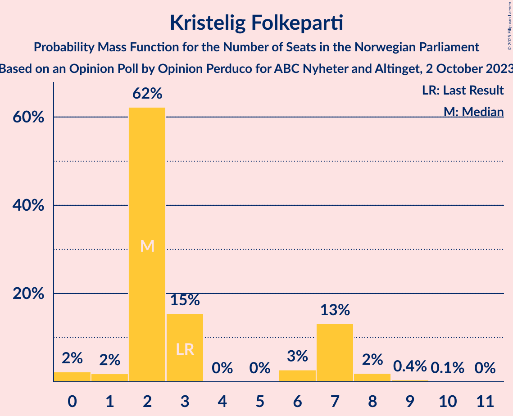
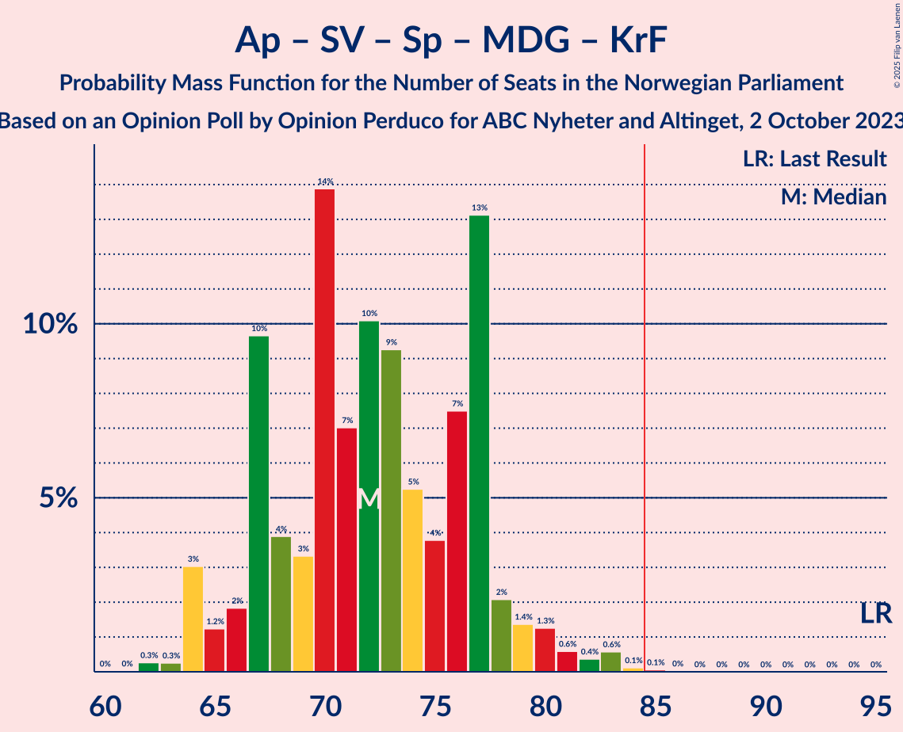
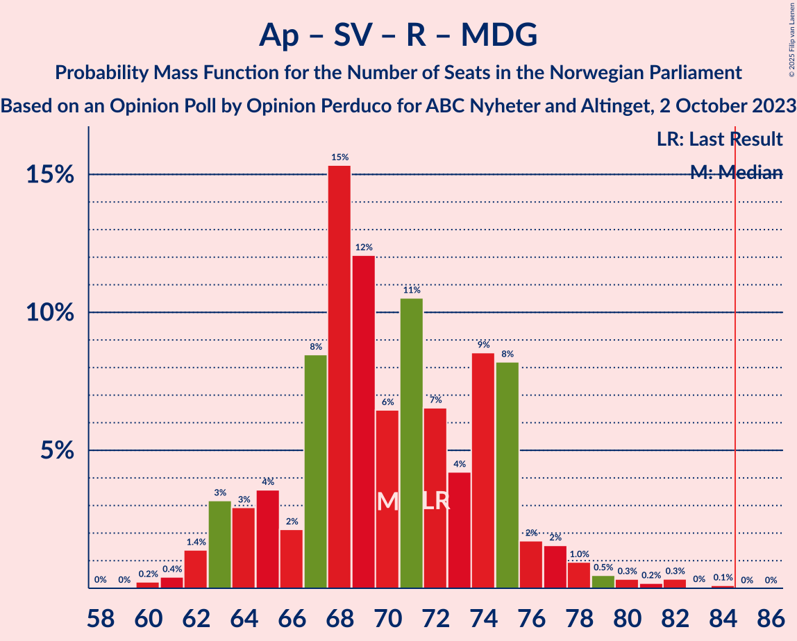

# Opinion Poll by Opinion Perduco for ABC Nyheter and Altinget, 2 October 2023

<a href="#voting-intentions">Voting Intentions</a> | <a href="#seats">Seats</a> | <a href="#coalitions">Coalitions</a> | <a href="#technical-information">Technical Information</a>

## Voting Intentions

### Confidence Intervals

| Party | Last Result | Poll Result | 80% Confidence Interval | 90% Confidence Interval | 95% Confidence Interval | 99% Confidence Interval |
|:-----:|:-----------:|:-----------:|:-----------------------:|:-----------------------:|:-----------------------:|:-----------------------:|
| Høyre | 20.4% | 25.6% | 23.7–27.6% |23.1–28.2% |22.6–28.7% |21.7–29.7% |
| Arbeiderpartiet | 26.2% | 20.1% | 18.4–22.1% |17.9–22.6% |17.5–23.1% |16.7–24.0% |
| Fremskrittspartiet | 11.6% | 12.3% | 10.9–13.9% |10.5–14.4% |10.2–14.8% |9.5–15.6% |
| Sosialistisk Venstreparti | 7.6% | 9.1% | 7.9–10.6% |7.6–11.0% |7.3–11.3% |6.8–12.1% |
| Rødt | 4.7% | 6.6% | 5.6–7.9% |5.3–8.2% |5.0–8.5% |4.6–9.2% |
| Venstre | 4.6% | 5.9% | 5.0–7.2% |4.7–7.5% |4.5–7.8% |4.1–8.5% |
| Senterpartiet | 13.5% | 5.9% | 5.0–7.2% |4.7–7.5% |4.5–7.8% |4.1–8.5% |
| Industri- og Næringspartiet | 0.3% | 4.8% | 4.0–5.9% |3.7–6.3% |3.5–6.5% |3.2–7.1% |
| Miljøpartiet De Grønne | 3.9% | 4.1% | 3.3–5.1% |3.1–5.4% |2.9–5.7% |2.5–6.2% |
| Kristelig Folkeparti | 3.8% | 3.3% | 2.6–4.3% |2.4–4.5% |2.3–4.8% |2.0–5.3% |

*Note:* The poll result column reflects the actual value used in the calculations. Published results may vary slightly, and in addition be rounded to fewer digits.

## Seats

### Confidence Intervals

| Party | Last Result | Median | 80% Confidence Interval | 90% Confidence Interval | 95% Confidence Interval | 99% Confidence Interval |
|:-----:|:-----------:|:------:|:-----------------------:|:-----------------------:|:-----------------------:|:-----------------------:|
| <a href="#høyre">Høyre</a> | 36 | 46 | 42–49 |41–50 |40–51 |38–53 |
| <a href="#arbeiderpartiet">Arbeiderpartiet</a> | 48 | 38 | 35–43 |34–45 |34–46 |32–47 |
| <a href="#fremskrittspartiet">Fremskrittspartiet</a> | 21 | 22 | 19–25 |18–26 |18–27 |16–29 |
| <a href="#sosialistisk-venstreparti">Sosialistisk Venstreparti</a> | 13 | 15 | 13–18 |12–19 |11–19 |10–20 |
| <a href="#rødt">Rødt</a> | 8 | 11 | 9–14 |8–14 |8–14 |7–16 |
| <a href="#venstre">Venstre</a> | 8 | 10 | 8–12 |7–13 |7–13 |7–15 |
| <a href="#senterpartiet">Senterpartiet</a> | 28 | 10 | 8–13 |8–14 |7–14 |3–16 |
| <a href="#industri--og-næringspartiet">Industri- og Næringspartiet</a> | 0 | 8 | 3–10 |3–10 |2–11 |2–12 |
| <a href="#miljøpartiet-de-grønne">Miljøpartiet De Grønne</a> | 3 | 3 | 2–8 |2–9 |1–9 |1–10 |
| <a href="#kristelig-folkeparti">Kristelig Folkeparti</a> | 3 | 2 | 2–7 |2–7 |1–7 |0–8 |

### Høyre

*For a full overview of the results for this party, see the [Høyre](party-høyre.html) page.*

| Number of Seats | Probability | Accumulated | Special Marks |
|:---------------:|:-----------:|:-----------:|:-------------:|
| 36 | 0% | 100% | Last Result |
| 37 | 0.2% | 100% |  |
| 38 | 0.4% | 99.8% |  |
| 39 | 0.7% | 99.4% |  |
| 40 | 2% | 98.7% |  |
| 41 | 6% | 97% |  |
| 42 | 12% | 91% |  |
| 43 | 10% | 79% |  |
| 44 | 9% | 68% |  |
| 45 | 9% | 60% |  |
| 46 | 13% | 51% | Median |
| 47 | 19% | 38% |  |
| 48 | 8% | 19% |  |
| 49 | 3% | 11% |  |
| 50 | 4% | 8% |  |
| 51 | 2% | 3% |  |
| 52 | 0.6% | 2% |  |
| 53 | 0.6% | 1.0% |  |
| 54 | 0.2% | 0.4% |  |
| 55 | 0% | 0.2% |  |
| 56 | 0.1% | 0.2% |  |
| 57 | 0% | 0% |  |

### Arbeiderpartiet

*For a full overview of the results for this party, see the [Arbeiderpartiet](party-arbeiderpartiet.html) page.*

| Number of Seats | Probability | Accumulated | Special Marks |
|:---------------:|:-----------:|:-----------:|:-------------:|
| 31 | 0.1% | 100% |  |
| 32 | 0.6% | 99.9% |  |
| 33 | 2% | 99.3% |  |
| 34 | 4% | 98% |  |
| 35 | 16% | 94% |  |
| 36 | 5% | 78% |  |
| 37 | 14% | 73% |  |
| 38 | 12% | 59% | Median |
| 39 | 5% | 47% |  |
| 40 | 11% | 42% |  |
| 41 | 8% | 31% |  |
| 42 | 8% | 23% |  |
| 43 | 7% | 15% |  |
| 44 | 3% | 9% |  |
| 45 | 3% | 6% |  |
| 46 | 2% | 3% |  |
| 47 | 0.5% | 1.0% |  |
| 48 | 0.3% | 0.4% | Last Result |
| 49 | 0.1% | 0.2% |  |
| 50 | 0% | 0% |  |

### Fremskrittspartiet

*For a full overview of the results for this party, see the [Fremskrittspartiet](party-fremskrittspartiet.html) page.*

| Number of Seats | Probability | Accumulated | Special Marks |
|:---------------:|:-----------:|:-----------:|:-------------:|
| 15 | 0% | 100% |  |
| 16 | 0.6% | 99.9% |  |
| 17 | 2% | 99.3% |  |
| 18 | 4% | 98% |  |
| 19 | 8% | 94% |  |
| 20 | 14% | 86% |  |
| 21 | 16% | 72% | Last Result |
| 22 | 23% | 57% | Median |
| 23 | 11% | 33% |  |
| 24 | 11% | 23% |  |
| 25 | 3% | 11% |  |
| 26 | 5% | 9% |  |
| 27 | 1.3% | 4% |  |
| 28 | 1.3% | 2% |  |
| 29 | 0.6% | 0.9% |  |
| 30 | 0.2% | 0.3% |  |
| 31 | 0.1% | 0.2% |  |
| 32 | 0% | 0.1% |  |
| 33 | 0% | 0% |  |

### Sosialistisk Venstreparti

*For a full overview of the results for this party, see the [Sosialistisk Venstreparti](party-sosialistiskvenstreparti.html) page.*

| Number of Seats | Probability | Accumulated | Special Marks |
|:---------------:|:-----------:|:-----------:|:-------------:|
| 9 | 0% | 100% |  |
| 10 | 0.6% | 99.9% |  |
| 11 | 2% | 99.3% |  |
| 12 | 7% | 97% |  |
| 13 | 12% | 90% | Last Result |
| 14 | 18% | 79% |  |
| 15 | 14% | 61% | Median |
| 16 | 24% | 47% |  |
| 17 | 8% | 23% |  |
| 18 | 9% | 15% |  |
| 19 | 5% | 7% |  |
| 20 | 1.1% | 2% |  |
| 21 | 0.3% | 0.4% |  |
| 22 | 0.1% | 0.1% |  |
| 23 | 0% | 0% |  |

### Rødt

*For a full overview of the results for this party, see the [Rødt](party-rødt.html) page.*

| Number of Seats | Probability | Accumulated | Special Marks |
|:---------------:|:-----------:|:-----------:|:-------------:|
| 6 | 0% | 100% |  |
| 7 | 1.5% | 99.9% |  |
| 8 | 3% | 98% | Last Result |
| 9 | 12% | 95% |  |
| 10 | 26% | 83% |  |
| 11 | 16% | 57% | Median |
| 12 | 18% | 41% |  |
| 13 | 10% | 23% |  |
| 14 | 12% | 13% |  |
| 15 | 0.6% | 1.1% |  |
| 16 | 0.3% | 0.5% |  |
| 17 | 0.2% | 0.2% |  |
| 18 | 0% | 0% |  |

### Venstre

*For a full overview of the results for this party, see the [Venstre](party-venstre.html) page.*

| Number of Seats | Probability | Accumulated | Special Marks |
|:---------------:|:-----------:|:-----------:|:-------------:|
| 2 | 0.1% | 100% |  |
| 3 | 0.2% | 99.9% |  |
| 4 | 0% | 99.7% |  |
| 5 | 0% | 99.7% |  |
| 6 | 0.1% | 99.7% |  |
| 7 | 7% | 99.6% |  |
| 8 | 10% | 92% | Last Result |
| 9 | 18% | 82% |  |
| 10 | 24% | 64% | Median |
| 11 | 29% | 40% |  |
| 12 | 5% | 11% |  |
| 13 | 3% | 5% |  |
| 14 | 1.2% | 2% |  |
| 15 | 0.8% | 0.8% |  |
| 16 | 0% | 0% |  |

### Senterpartiet

*For a full overview of the results for this party, see the [Senterpartiet](party-senterpartiet.html) page.*

| Number of Seats | Probability | Accumulated | Special Marks |
|:---------------:|:-----------:|:-----------:|:-------------:|
| 1 | 0.2% | 100% |  |
| 2 | 0.1% | 99.8% |  |
| 3 | 0.3% | 99.6% |  |
| 4 | 0% | 99.3% |  |
| 5 | 0% | 99.3% |  |
| 6 | 0.6% | 99.3% |  |
| 7 | 3% | 98.8% |  |
| 8 | 19% | 95% |  |
| 9 | 14% | 76% |  |
| 10 | 14% | 62% | Median |
| 11 | 27% | 48% |  |
| 12 | 5% | 22% |  |
| 13 | 10% | 16% |  |
| 14 | 4% | 6% |  |
| 15 | 0.8% | 2% |  |
| 16 | 0.7% | 0.8% |  |
| 17 | 0.1% | 0.1% |  |
| 18 | 0% | 0% |  |
| 19 | 0% | 0% |  |
| 20 | 0% | 0% |  |
| 21 | 0% | 0% |  |
| 22 | 0% | 0% |  |
| 23 | 0% | 0% |  |
| 24 | 0% | 0% |  |
| 25 | 0% | 0% |  |
| 26 | 0% | 0% |  |
| 27 | 0% | 0% |  |
| 28 | 0% | 0% | Last Result |

### Industri- og Næringspartiet

*For a full overview of the results for this party, see the [Industri- og Næringspartiet](party-industri-ognæringspartiet.html) page.*

| Number of Seats | Probability | Accumulated | Special Marks |
|:---------------:|:-----------:|:-----------:|:-------------:|
| 0 | 0% | 100% | Last Result |
| 1 | 0% | 100% |  |
| 2 | 4% | 100% |  |
| 3 | 7% | 96% |  |
| 4 | 0% | 89% |  |
| 5 | 0% | 89% |  |
| 6 | 1.1% | 89% |  |
| 7 | 31% | 88% |  |
| 8 | 27% | 56% | Median |
| 9 | 17% | 29% |  |
| 10 | 9% | 13% |  |
| 11 | 3% | 4% |  |
| 12 | 1.4% | 2% |  |
| 13 | 0.1% | 0.1% |  |
| 14 | 0% | 0% |  |

### Miljøpartiet De Grønne

*For a full overview of the results for this party, see the [Miljøpartiet De Grønne](party-miljøpartietdegrønne.html) page.*

| Number of Seats | Probability | Accumulated | Special Marks |
|:---------------:|:-----------:|:-----------:|:-------------:|
| 1 | 4% | 100% |  |
| 2 | 21% | 96% |  |
| 3 | 25% | 75% | Last Result, Median |
| 4 | 0% | 50% |  |
| 5 | 0% | 50% |  |
| 6 | 3% | 50% |  |
| 7 | 28% | 47% |  |
| 8 | 13% | 19% |  |
| 9 | 5% | 6% |  |
| 10 | 1.1% | 1.2% |  |
| 11 | 0.1% | 0.2% |  |
| 12 | 0% | 0% |  |

### Kristelig Folkeparti

*For a full overview of the results for this party, see the [Kristelig Folkeparti](party-kristeligfolkeparti.html) page.*

| Number of Seats | Probability | Accumulated | Special Marks |
|:---------------:|:-----------:|:-----------:|:-------------:|
| 0 | 2% | 100% |  |
| 1 | 2% | 98% |  |
| 2 | 62% | 96% | Median |
| 3 | 15% | 34% | Last Result |
| 4 | 0% | 18% |  |
| 5 | 0% | 18% |  |
| 6 | 3% | 18% |  |
| 7 | 13% | 16% |  |
| 8 | 2% | 2% |  |
| 9 | 0.4% | 0.5% |  |
| 10 | 0.1% | 0.1% |  |
| 11 | 0% | 0% |  |

## Coalitions

### Confidence Intervals

| Coalition | Last Result | Median | Majority? | 80% Confidence Interval | 90% Confidence Interval | 95% Confidence Interval | 99% Confidence Interval |
|:---------:|:-----------:|:------:|:---------:|:-----------------------:|:-----------------------:|:-----------------------:|:-----------------------:|
| Høyre – Fremskrittspartiet – Senterpartiet – Venstre – Kristelig Folkeparti | 96 | 91 | 91% | 85–95 | 84–96 | 83–98 | 80–100 |
| Høyre – Fremskrittspartiet – Venstre – Miljøpartiet De Grønne – Kristelig Folkeparti | 71 | 85 | 53% | 81–91 | 79–91 | 78–93 | 76–96 |
| Arbeiderpartiet – Sosialistisk Venstreparti – Rødt – Senterpartiet – Miljøpartiet De Grønne | 100 | 80 | 15% | 76–85 | 74–86 | 71–88 | 70–92 |
| Høyre – Fremskrittspartiet – Venstre – Kristelig Folkeparti | 68 | 80 | 10% | 75–85 | 74–87 | 73–87 | 71–91 |
| Høyre – Fremskrittspartiet – Venstre | 65 | 77 | 2% | 73–82 | 71–84 | 71–84 | 68–86 |
| Arbeiderpartiet – Sosialistisk Venstreparti – Rødt – Senterpartiet | 97 | 76 | 0.9% | 70–79 | 69–81 | 68–82 | 65–85 |
| Arbeiderpartiet – Sosialistisk Venstreparti – Senterpartiet – Miljøpartiet De Grønne – Kristelig Folkeparti | 95 | 72 | 0.1% | 67–77 | 66–78 | 64–80 | 63–83 |
| Arbeiderpartiet – Sosialistisk Venstreparti – Rødt – Miljøpartiet De Grønne | 72 | 70 | 0% | 65–75 | 63–76 | 63–77 | 61–82 |
| Arbeiderpartiet – Sosialistisk Venstreparti – Senterpartiet – Miljøpartiet De Grønne | 92 | 69 | 0% | 65–75 | 63–75 | 61–77 | 59–80 |
| Høyre – Fremskrittspartiet | 57 | 67 | 0% | 63–72 | 62–73 | 61–74 | 59–77 |
| Arbeiderpartiet – Sosialistisk Venstreparti – Senterpartiet | 89 | 65 | 0% | 59–68 | 59–70 | 58–72 | 55–73 |
| Høyre – Venstre – Kristelig Folkeparti | 47 | 59 | 0% | 53–62 | 53–63 | 52–65 | 50–68 |
| Arbeiderpartiet – Senterpartiet – Miljøpartiet De Grønne – Kristelig Folkeparti | 82 | 57 | 0% | 51–63 | 50–64 | 50–65 | 47–68 |
| Arbeiderpartiet – Sosialistisk Venstreparti | 61 | 54 | 0% | 50–58 | 49–60 | 48–61 | 46–62 |
| Arbeiderpartiet – Senterpartiet – Kristelig Folkeparti | 79 | 52 | 0% | 48–57 | 47–60 | 46–61 | 44–62 |
| Arbeiderpartiet – Senterpartiet | 76 | 49 | 0% | 45–54 | 44–55 | 43–55 | 42–58 |
| Senterpartiet – Venstre – Kristelig Folkeparti | 39 | 23 | 0% | 20–27 | 18–28 | 17–29 | 16–33 |

### Høyre – Fremskrittspartiet – Senterpartiet – Venstre – Kristelig Folkeparti

| Number of Seats | Probability | Accumulated | Special Marks |
|:---------------:|:-----------:|:-----------:|:-------------:|
| 78 | 0% | 100% |  |
| 79 | 0.1% | 99.9% |  |
| 80 | 0.6% | 99.9% |  |
| 81 | 0.3% | 99.2% |  |
| 82 | 0.6% | 98.9% |  |
| 83 | 1.1% | 98% |  |
| 84 | 6% | 97% |  |
| 85 | 5% | 91% | Majority |
| 86 | 4% | 87% |  |
| 87 | 9% | 83% |  |
| 88 | 5% | 74% |  |
| 89 | 10% | 69% |  |
| 90 | 7% | 59% | Median |
| 91 | 7% | 52% |  |
| 92 | 12% | 45% |  |
| 93 | 15% | 33% |  |
| 94 | 4% | 19% |  |
| 95 | 7% | 15% |  |
| 96 | 4% | 8% | Last Result |
| 97 | 1.3% | 4% |  |
| 98 | 0.9% | 3% |  |
| 99 | 1.0% | 2% |  |
| 100 | 0.5% | 0.7% |  |
| 101 | 0.1% | 0.2% |  |
| 102 | 0% | 0.1% |  |
| 103 | 0.1% | 0.1% |  |
| 104 | 0% | 0% |  |

### Høyre – Fremskrittspartiet – Venstre – Miljøpartiet De Grønne – Kristelig Folkeparti

| Number of Seats | Probability | Accumulated | Special Marks |
|:---------------:|:-----------:|:-----------:|:-------------:|
| 71 | 0% | 100% | Last Result |
| 72 | 0% | 100% |  |
| 73 | 0.1% | 99.9% |  |
| 74 | 0.1% | 99.9% |  |
| 75 | 0.2% | 99.8% |  |
| 76 | 1.3% | 99.6% |  |
| 77 | 0.6% | 98% |  |
| 78 | 1.0% | 98% |  |
| 79 | 4% | 97% |  |
| 80 | 3% | 93% |  |
| 81 | 6% | 91% |  |
| 82 | 6% | 84% |  |
| 83 | 17% | 78% | Median |
| 84 | 8% | 61% |  |
| 85 | 14% | 53% | Majority |
| 86 | 7% | 39% |  |
| 87 | 7% | 32% |  |
| 88 | 4% | 25% |  |
| 89 | 6% | 21% |  |
| 90 | 3% | 14% |  |
| 91 | 8% | 12% |  |
| 92 | 1.4% | 4% |  |
| 93 | 0.5% | 3% |  |
| 94 | 1.3% | 2% |  |
| 95 | 0.3% | 0.9% |  |
| 96 | 0.2% | 0.6% |  |
| 97 | 0.3% | 0.4% |  |
| 98 | 0% | 0.1% |  |
| 99 | 0% | 0.1% |  |
| 100 | 0% | 0% |  |

### Arbeiderpartiet – Sosialistisk Venstreparti – Rødt – Senterpartiet – Miljøpartiet De Grønne

| Number of Seats | Probability | Accumulated | Special Marks |
|:---------------:|:-----------:|:-----------:|:-------------:|
| 68 | 0.1% | 100% |  |
| 69 | 0.2% | 99.9% |  |
| 70 | 0.4% | 99.7% |  |
| 71 | 3% | 99.3% |  |
| 72 | 0.6% | 96% |  |
| 73 | 0.8% | 96% |  |
| 74 | 2% | 95% |  |
| 75 | 2% | 94% |  |
| 76 | 5% | 91% |  |
| 77 | 6% | 86% | Median |
| 78 | 6% | 80% |  |
| 79 | 16% | 74% |  |
| 80 | 15% | 58% |  |
| 81 | 9% | 44% |  |
| 82 | 8% | 35% |  |
| 83 | 8% | 27% |  |
| 84 | 4% | 19% |  |
| 85 | 7% | 15% | Majority |
| 86 | 3% | 7% |  |
| 87 | 2% | 5% |  |
| 88 | 1.4% | 3% |  |
| 89 | 0.4% | 2% |  |
| 90 | 0.4% | 1.3% |  |
| 91 | 0.3% | 0.8% |  |
| 92 | 0.1% | 0.5% |  |
| 93 | 0.3% | 0.4% |  |
| 94 | 0.1% | 0.1% |  |
| 95 | 0% | 0% |  |
| 96 | 0% | 0% |  |
| 97 | 0% | 0% |  |
| 98 | 0% | 0% |  |
| 99 | 0% | 0% |  |
| 100 | 0% | 0% | Last Result |

### Høyre – Fremskrittspartiet – Venstre – Kristelig Folkeparti

| Number of Seats | Probability | Accumulated | Special Marks |
|:---------------:|:-----------:|:-----------:|:-------------:|
| 68 | 0% | 100% | Last Result |
| 69 | 0.1% | 99.9% |  |
| 70 | 0.4% | 99.9% |  |
| 71 | 0.7% | 99.5% |  |
| 72 | 0.5% | 98.8% |  |
| 73 | 2% | 98% |  |
| 74 | 3% | 96% |  |
| 75 | 3% | 93% |  |
| 76 | 10% | 90% |  |
| 77 | 6% | 80% |  |
| 78 | 5% | 74% |  |
| 79 | 11% | 69% |  |
| 80 | 11% | 58% | Median |
| 81 | 11% | 48% |  |
| 82 | 11% | 36% |  |
| 83 | 6% | 26% |  |
| 84 | 9% | 19% |  |
| 85 | 3% | 10% | Majority |
| 86 | 3% | 8% |  |
| 87 | 3% | 5% |  |
| 88 | 0.8% | 2% |  |
| 89 | 0.4% | 1.4% |  |
| 90 | 0.3% | 1.0% |  |
| 91 | 0.5% | 0.7% |  |
| 92 | 0.2% | 0.2% |  |
| 93 | 0% | 0% |  |

### Høyre – Fremskrittspartiet – Venstre

| Number of Seats | Probability | Accumulated | Special Marks |
|:---------------:|:-----------:|:-----------:|:-------------:|
| 65 | 0% | 100% | Last Result |
| 66 | 0.1% | 100% |  |
| 67 | 0.2% | 99.9% |  |
| 68 | 0.4% | 99.7% |  |
| 69 | 0.8% | 99.3% |  |
| 70 | 0.4% | 98% |  |
| 71 | 3% | 98% |  |
| 72 | 4% | 95% |  |
| 73 | 11% | 91% |  |
| 74 | 7% | 80% |  |
| 75 | 8% | 73% |  |
| 76 | 7% | 64% |  |
| 77 | 12% | 58% |  |
| 78 | 7% | 45% | Median |
| 79 | 10% | 38% |  |
| 80 | 11% | 28% |  |
| 81 | 5% | 17% |  |
| 82 | 5% | 12% |  |
| 83 | 2% | 7% |  |
| 84 | 3% | 5% |  |
| 85 | 0.7% | 2% | Majority |
| 86 | 0.5% | 1.0% |  |
| 87 | 0.1% | 0.5% |  |
| 88 | 0.2% | 0.4% |  |
| 89 | 0.1% | 0.1% |  |
| 90 | 0% | 0% |  |

### Arbeiderpartiet – Sosialistisk Venstreparti – Rødt – Senterpartiet

| Number of Seats | Probability | Accumulated | Special Marks |
|:---------------:|:-----------:|:-----------:|:-------------:|
| 63 | 0% | 100% |  |
| 64 | 0.4% | 99.9% |  |
| 65 | 0.2% | 99.5% |  |
| 66 | 1.1% | 99.3% |  |
| 67 | 0.7% | 98% |  |
| 68 | 0.6% | 98% |  |
| 69 | 6% | 97% |  |
| 70 | 3% | 91% |  |
| 71 | 5% | 88% |  |
| 72 | 4% | 83% |  |
| 73 | 6% | 79% |  |
| 74 | 5% | 73% | Median |
| 75 | 10% | 67% |  |
| 76 | 20% | 57% |  |
| 77 | 11% | 38% |  |
| 78 | 11% | 27% |  |
| 79 | 7% | 16% |  |
| 80 | 2% | 9% |  |
| 81 | 3% | 7% |  |
| 82 | 2% | 4% |  |
| 83 | 0.7% | 2% |  |
| 84 | 0.7% | 2% |  |
| 85 | 0.6% | 0.9% | Majority |
| 86 | 0.2% | 0.3% |  |
| 87 | 0.1% | 0.1% |  |
| 88 | 0% | 0.1% |  |
| 89 | 0% | 0% |  |
| 90 | 0% | 0% |  |
| 91 | 0% | 0% |  |
| 92 | 0% | 0% |  |
| 93 | 0% | 0% |  |
| 94 | 0% | 0% |  |
| 95 | 0% | 0% |  |
| 96 | 0% | 0% |  |
| 97 | 0% | 0% | Last Result |

### Arbeiderpartiet – Sosialistisk Venstreparti – Senterpartiet – Miljøpartiet De Grønne – Kristelig Folkeparti

| Number of Seats | Probability | Accumulated | Special Marks |
|:---------------:|:-----------:|:-----------:|:-------------:|
| 60 | 0% | 100% |  |
| 61 | 0% | 99.9% |  |
| 62 | 0.3% | 99.9% |  |
| 63 | 0.3% | 99.7% |  |
| 64 | 3% | 99.4% |  |
| 65 | 1.2% | 96% |  |
| 66 | 2% | 95% |  |
| 67 | 10% | 93% |  |
| 68 | 4% | 84% | Median |
| 69 | 3% | 80% |  |
| 70 | 14% | 76% |  |
| 71 | 7% | 63% |  |
| 72 | 10% | 55% |  |
| 73 | 9% | 45% |  |
| 74 | 5% | 36% |  |
| 75 | 4% | 31% |  |
| 76 | 7% | 27% |  |
| 77 | 13% | 20% |  |
| 78 | 2% | 6% |  |
| 79 | 1.4% | 4% |  |
| 80 | 1.3% | 3% |  |
| 81 | 0.6% | 2% |  |
| 82 | 0.4% | 1.2% |  |
| 83 | 0.6% | 0.8% |  |
| 84 | 0.1% | 0.2% |  |
| 85 | 0.1% | 0.1% | Majority |
| 86 | 0% | 0% |  |
| 87 | 0% | 0% |  |
| 88 | 0% | 0% |  |
| 89 | 0% | 0% |  |
| 90 | 0% | 0% |  |
| 91 | 0% | 0% |  |
| 92 | 0% | 0% |  |
| 93 | 0% | 0% |  |
| 94 | 0% | 0% |  |
| 95 | 0% | 0% | Last Result |

### Arbeiderpartiet – Sosialistisk Venstreparti – Rødt – Miljøpartiet De Grønne

| Number of Seats | Probability | Accumulated | Special Marks |
|:---------------:|:-----------:|:-----------:|:-------------:|
| 58 | 0% | 100% |  |
| 59 | 0% | 99.9% |  |
| 60 | 0.2% | 99.9% |  |
| 61 | 0.4% | 99.7% |  |
| 62 | 1.4% | 99.3% |  |
| 63 | 3% | 98% |  |
| 64 | 3% | 95% |  |
| 65 | 4% | 92% |  |
| 66 | 2% | 88% |  |
| 67 | 8% | 86% | Median |
| 68 | 15% | 78% |  |
| 69 | 12% | 62% |  |
| 70 | 6% | 50% |  |
| 71 | 11% | 44% |  |
| 72 | 7% | 33% | Last Result |
| 73 | 4% | 27% |  |
| 74 | 9% | 22% |  |
| 75 | 8% | 14% |  |
| 76 | 2% | 6% |  |
| 77 | 2% | 4% |  |
| 78 | 1.0% | 2% |  |
| 79 | 0.5% | 1.5% |  |
| 80 | 0.3% | 1.0% |  |
| 81 | 0.2% | 0.7% |  |
| 82 | 0.3% | 0.5% |  |
| 83 | 0% | 0.2% |  |
| 84 | 0.1% | 0.1% |  |
| 85 | 0% | 0% | Majority |

### Arbeiderpartiet – Sosialistisk Venstreparti – Senterpartiet – Miljøpartiet De Grønne

| Number of Seats | Probability | Accumulated | Special Marks |
|:---------------:|:-----------:|:-----------:|:-------------:|
| 57 | 0% | 100% |  |
| 58 | 0.1% | 99.9% |  |
| 59 | 0.4% | 99.9% |  |
| 60 | 0.3% | 99.5% |  |
| 61 | 3% | 99.1% |  |
| 62 | 0.8% | 96% |  |
| 63 | 1.4% | 95% |  |
| 64 | 2% | 94% |  |
| 65 | 10% | 92% |  |
| 66 | 8% | 82% | Median |
| 67 | 7% | 73% |  |
| 68 | 11% | 66% |  |
| 69 | 9% | 55% |  |
| 70 | 15% | 47% |  |
| 71 | 4% | 32% |  |
| 72 | 6% | 28% |  |
| 73 | 7% | 22% |  |
| 74 | 3% | 15% |  |
| 75 | 7% | 12% |  |
| 76 | 2% | 5% |  |
| 77 | 0.9% | 3% |  |
| 78 | 0.6% | 2% |  |
| 79 | 0.3% | 1.1% |  |
| 80 | 0.5% | 0.8% |  |
| 81 | 0.1% | 0.3% |  |
| 82 | 0.1% | 0.1% |  |
| 83 | 0% | 0% |  |
| 84 | 0% | 0% |  |
| 85 | 0% | 0% | Majority |
| 86 | 0% | 0% |  |
| 87 | 0% | 0% |  |
| 88 | 0% | 0% |  |
| 89 | 0% | 0% |  |
| 90 | 0% | 0% |  |
| 91 | 0% | 0% |  |
| 92 | 0% | 0% | Last Result |

### Høyre – Fremskrittspartiet

| Number of Seats | Probability | Accumulated | Special Marks |
|:---------------:|:-----------:|:-----------:|:-------------:|
| 57 | 0.1% | 100% | Last Result |
| 58 | 0.1% | 99.8% |  |
| 59 | 0.6% | 99.7% |  |
| 60 | 0.7% | 99.1% |  |
| 61 | 2% | 98% |  |
| 62 | 4% | 96% |  |
| 63 | 5% | 92% |  |
| 64 | 13% | 88% |  |
| 65 | 10% | 74% |  |
| 66 | 9% | 64% |  |
| 67 | 8% | 55% |  |
| 68 | 8% | 47% | Median |
| 69 | 18% | 39% |  |
| 70 | 7% | 22% |  |
| 71 | 2% | 15% |  |
| 72 | 5% | 12% |  |
| 73 | 4% | 7% |  |
| 74 | 2% | 3% |  |
| 75 | 0.6% | 2% |  |
| 76 | 0.4% | 1.0% |  |
| 77 | 0.4% | 0.6% |  |
| 78 | 0.1% | 0.2% |  |
| 79 | 0.1% | 0.1% |  |
| 80 | 0% | 0% |  |

### Arbeiderpartiet – Sosialistisk Venstreparti – Senterpartiet

| Number of Seats | Probability | Accumulated | Special Marks |
|:---------------:|:-----------:|:-----------:|:-------------:|
| 53 | 0.3% | 100% |  |
| 54 | 0.1% | 99.6% |  |
| 55 | 0.1% | 99.5% |  |
| 56 | 1.3% | 99.4% |  |
| 57 | 0.5% | 98% |  |
| 58 | 1.3% | 98% |  |
| 59 | 7% | 96% |  |
| 60 | 3% | 89% |  |
| 61 | 6% | 86% |  |
| 62 | 14% | 80% |  |
| 63 | 8% | 66% | Median |
| 64 | 7% | 58% |  |
| 65 | 12% | 50% |  |
| 66 | 12% | 38% |  |
| 67 | 10% | 26% |  |
| 68 | 8% | 17% |  |
| 69 | 3% | 9% |  |
| 70 | 3% | 6% |  |
| 71 | 0.8% | 3% |  |
| 72 | 2% | 3% |  |
| 73 | 0.3% | 0.7% |  |
| 74 | 0.2% | 0.4% |  |
| 75 | 0.1% | 0.2% |  |
| 76 | 0% | 0.1% |  |
| 77 | 0% | 0.1% |  |
| 78 | 0% | 0% |  |
| 79 | 0% | 0% |  |
| 80 | 0% | 0% |  |
| 81 | 0% | 0% |  |
| 82 | 0% | 0% |  |
| 83 | 0% | 0% |  |
| 84 | 0% | 0% |  |
| 85 | 0% | 0% | Majority |
| 86 | 0% | 0% |  |
| 87 | 0% | 0% |  |
| 88 | 0% | 0% |  |
| 89 | 0% | 0% | Last Result |

### Høyre – Venstre – Kristelig Folkeparti

| Number of Seats | Probability | Accumulated | Special Marks |
|:---------------:|:-----------:|:-----------:|:-------------:|
| 47 | 0% | 100% | Last Result |
| 48 | 0% | 100% |  |
| 49 | 0.1% | 99.9% |  |
| 50 | 0.5% | 99.8% |  |
| 51 | 2% | 99.3% |  |
| 52 | 1.2% | 98% |  |
| 53 | 7% | 96% |  |
| 54 | 8% | 90% |  |
| 55 | 6% | 81% |  |
| 56 | 7% | 76% |  |
| 57 | 5% | 69% |  |
| 58 | 8% | 64% | Median |
| 59 | 17% | 56% |  |
| 60 | 16% | 39% |  |
| 61 | 9% | 22% |  |
| 62 | 6% | 13% |  |
| 63 | 3% | 8% |  |
| 64 | 2% | 5% |  |
| 65 | 0.8% | 3% |  |
| 66 | 0.4% | 2% |  |
| 67 | 0.4% | 2% |  |
| 68 | 0.7% | 1.1% |  |
| 69 | 0.4% | 0.5% |  |
| 70 | 0.1% | 0.1% |  |
| 71 | 0% | 0% |  |

### Arbeiderpartiet – Senterpartiet – Miljøpartiet De Grønne – Kristelig Folkeparti

| Number of Seats | Probability | Accumulated | Special Marks |
|:---------------:|:-----------:|:-----------:|:-------------:|
| 45 | 0.1% | 100% |  |
| 46 | 0.2% | 99.9% |  |
| 47 | 0.5% | 99.8% |  |
| 48 | 1.0% | 99.3% |  |
| 49 | 0.4% | 98% |  |
| 50 | 3% | 98% |  |
| 51 | 9% | 95% |  |
| 52 | 7% | 86% |  |
| 53 | 2% | 79% | Median |
| 54 | 5% | 77% |  |
| 55 | 7% | 72% |  |
| 56 | 11% | 64% |  |
| 57 | 6% | 53% |  |
| 58 | 10% | 48% |  |
| 59 | 12% | 38% |  |
| 60 | 6% | 26% |  |
| 61 | 6% | 21% |  |
| 62 | 3% | 15% |  |
| 63 | 2% | 11% |  |
| 64 | 6% | 9% |  |
| 65 | 0.5% | 3% |  |
| 66 | 0.6% | 2% |  |
| 67 | 0.4% | 2% |  |
| 68 | 0.9% | 1.3% |  |
| 69 | 0.3% | 0.4% |  |
| 70 | 0.1% | 0.1% |  |
| 71 | 0% | 0% |  |
| 72 | 0% | 0% |  |
| 73 | 0% | 0% |  |
| 74 | 0% | 0% |  |
| 75 | 0% | 0% |  |
| 76 | 0% | 0% |  |
| 77 | 0% | 0% |  |
| 78 | 0% | 0% |  |
| 79 | 0% | 0% |  |
| 80 | 0% | 0% |  |
| 81 | 0% | 0% |  |
| 82 | 0% | 0% | Last Result |

### Arbeiderpartiet – Sosialistisk Venstreparti

| Number of Seats | Probability | Accumulated | Special Marks |
|:---------------:|:-----------:|:-----------:|:-------------:|
| 44 | 0.1% | 100% |  |
| 45 | 0.4% | 99.9% |  |
| 46 | 0.2% | 99.6% |  |
| 47 | 2% | 99.4% |  |
| 48 | 1.4% | 98% |  |
| 49 | 4% | 96% |  |
| 50 | 4% | 92% |  |
| 51 | 18% | 88% |  |
| 52 | 9% | 70% |  |
| 53 | 6% | 61% | Median |
| 54 | 11% | 56% |  |
| 55 | 8% | 44% |  |
| 56 | 13% | 37% |  |
| 57 | 9% | 24% |  |
| 58 | 6% | 15% |  |
| 59 | 4% | 9% |  |
| 60 | 3% | 6% |  |
| 61 | 2% | 3% | Last Result |
| 62 | 0.6% | 1.0% |  |
| 63 | 0.1% | 0.4% |  |
| 64 | 0.1% | 0.3% |  |
| 65 | 0.1% | 0.2% |  |
| 66 | 0% | 0.1% |  |
| 67 | 0% | 0% |  |

### Arbeiderpartiet – Senterpartiet – Kristelig Folkeparti

| Number of Seats | Probability | Accumulated | Special Marks |
|:---------------:|:-----------:|:-----------:|:-------------:|
| 42 | 0.1% | 100% |  |
| 43 | 0.2% | 99.9% |  |
| 44 | 0.4% | 99.7% |  |
| 45 | 1.3% | 99.3% |  |
| 46 | 2% | 98% |  |
| 47 | 3% | 96% |  |
| 48 | 16% | 93% |  |
| 49 | 6% | 78% |  |
| 50 | 9% | 72% | Median |
| 51 | 9% | 63% |  |
| 52 | 11% | 54% |  |
| 53 | 14% | 43% |  |
| 54 | 6% | 28% |  |
| 55 | 5% | 22% |  |
| 56 | 4% | 18% |  |
| 57 | 4% | 13% |  |
| 58 | 1.3% | 9% |  |
| 59 | 3% | 8% |  |
| 60 | 0.8% | 5% |  |
| 61 | 4% | 4% |  |
| 62 | 0.5% | 0.7% |  |
| 63 | 0.1% | 0.1% |  |
| 64 | 0% | 0.1% |  |
| 65 | 0% | 0% |  |
| 66 | 0% | 0% |  |
| 67 | 0% | 0% |  |
| 68 | 0% | 0% |  |
| 69 | 0% | 0% |  |
| 70 | 0% | 0% |  |
| 71 | 0% | 0% |  |
| 72 | 0% | 0% |  |
| 73 | 0% | 0% |  |
| 74 | 0% | 0% |  |
| 75 | 0% | 0% |  |
| 76 | 0% | 0% |  |
| 77 | 0% | 0% |  |
| 78 | 0% | 0% |  |
| 79 | 0% | 0% | Last Result |

### Arbeiderpartiet – Senterpartiet

| Number of Seats | Probability | Accumulated | Special Marks |
|:---------------:|:-----------:|:-----------:|:-------------:|
| 39 | 0% | 100% |  |
| 40 | 0.1% | 99.9% |  |
| 41 | 0.3% | 99.9% |  |
| 42 | 1.3% | 99.5% |  |
| 43 | 2% | 98% |  |
| 44 | 2% | 97% |  |
| 45 | 9% | 94% |  |
| 46 | 14% | 85% |  |
| 47 | 9% | 72% |  |
| 48 | 9% | 63% | Median |
| 49 | 9% | 54% |  |
| 50 | 12% | 45% |  |
| 51 | 11% | 33% |  |
| 52 | 6% | 23% |  |
| 53 | 6% | 17% |  |
| 54 | 6% | 12% |  |
| 55 | 4% | 6% |  |
| 56 | 0.7% | 2% |  |
| 57 | 0.6% | 1.3% |  |
| 58 | 0.3% | 0.7% |  |
| 59 | 0.1% | 0.3% |  |
| 60 | 0.3% | 0.3% |  |
| 61 | 0% | 0% |  |
| 62 | 0% | 0% |  |
| 63 | 0% | 0% |  |
| 64 | 0% | 0% |  |
| 65 | 0% | 0% |  |
| 66 | 0% | 0% |  |
| 67 | 0% | 0% |  |
| 68 | 0% | 0% |  |
| 69 | 0% | 0% |  |
| 70 | 0% | 0% |  |
| 71 | 0% | 0% |  |
| 72 | 0% | 0% |  |
| 73 | 0% | 0% |  |
| 74 | 0% | 0% |  |
| 75 | 0% | 0% |  |
| 76 | 0% | 0% | Last Result |

### Senterpartiet – Venstre – Kristelig Folkeparti

| Number of Seats | Probability | Accumulated | Special Marks |
|:---------------:|:-----------:|:-----------:|:-------------:|
| 13 | 0% | 100% |  |
| 14 | 0.2% | 99.9% |  |
| 15 | 0% | 99.7% |  |
| 16 | 1.0% | 99.7% |  |
| 17 | 2% | 98.7% |  |
| 18 | 2% | 96% |  |
| 19 | 4% | 95% |  |
| 20 | 7% | 90% |  |
| 21 | 12% | 83% |  |
| 22 | 8% | 72% | Median |
| 23 | 18% | 63% |  |
| 24 | 17% | 45% |  |
| 25 | 7% | 28% |  |
| 26 | 6% | 21% |  |
| 27 | 9% | 15% |  |
| 28 | 2% | 7% |  |
| 29 | 3% | 5% |  |
| 30 | 0.5% | 2% |  |
| 31 | 0.4% | 1.3% |  |
| 32 | 0.2% | 0.8% |  |
| 33 | 0.6% | 0.6% |  |
| 34 | 0% | 0% |  |
| 35 | 0% | 0% |  |
| 36 | 0% | 0% |  |
| 37 | 0% | 0% |  |
| 38 | 0% | 0% |  |
| 39 | 0% | 0% | Last Result |

## Technical Information

### Opinion Poll

+ **Polling firm:** Opinion Perduco
+ **Commissioner(s):** ABC Nyheter and Altinget
+ **Fieldwork period:** 2 October 2023

### Calculations

+ **Sample size:** 790
+ **Simulations done:** 1,048,576
+ **Error estimate:** 2.70%

