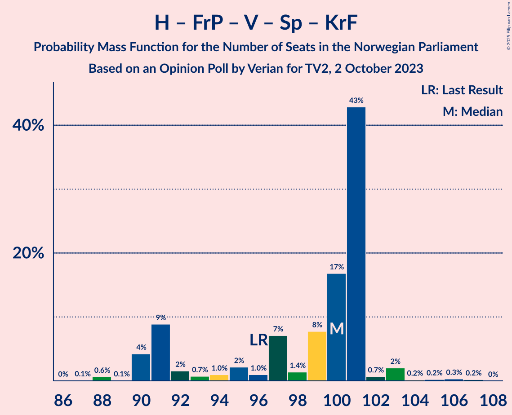
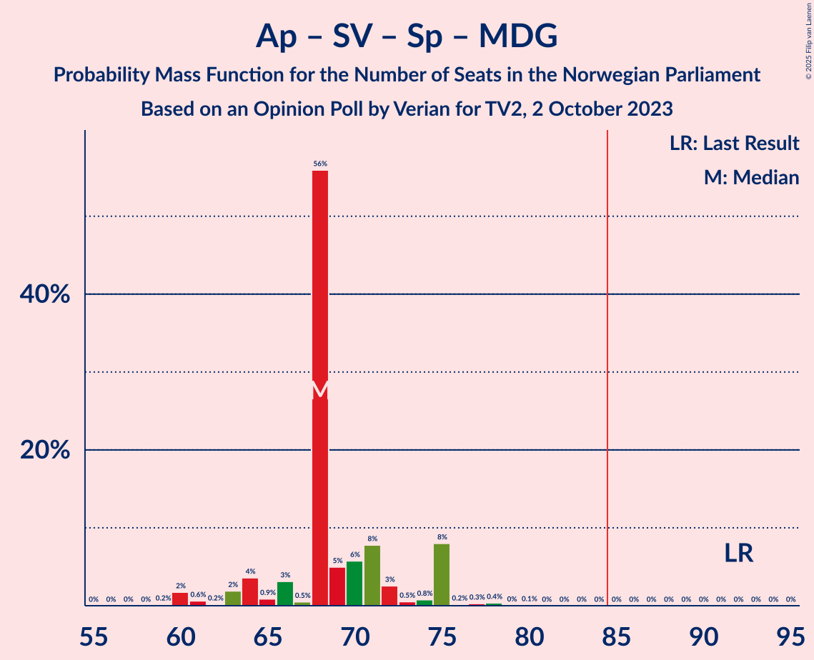
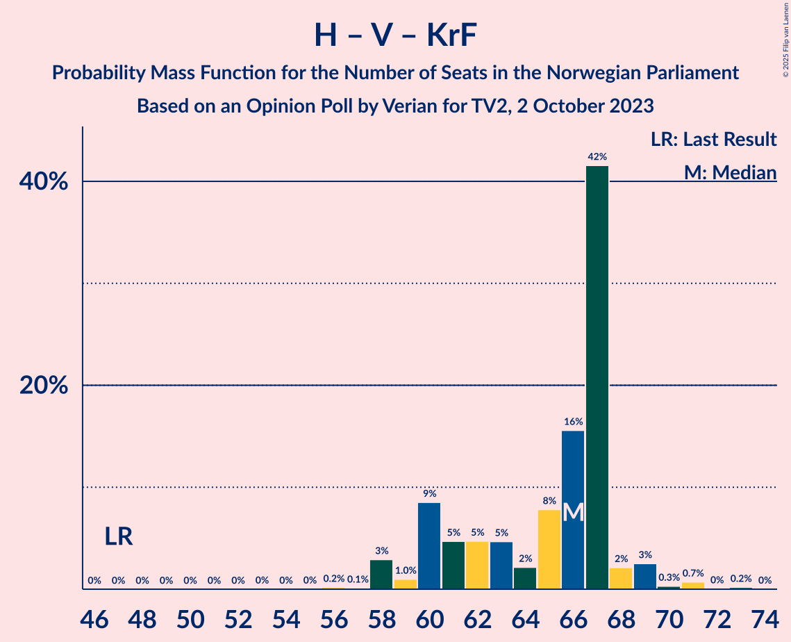

# Opinion Poll by Verian for TV2, 2 October 2023

<a href="#voting-intentions">Voting Intentions</a> | <a href="#seats">Seats</a> | <a href="#coalitions">Coalitions</a> | <a href="#technical-information">Technical Information</a>

## Voting Intentions

### Confidence Intervals

| Party | Last Result | Poll Result | 80% Confidence Interval | 90% Confidence Interval | 95% Confidence Interval | 99% Confidence Interval |
|:-----:|:-----------:|:-----------:|:-----------------------:|:-----------------------:|:-----------------------:|:-----------------------:|
| Høyre | 20.4% | 27.0% | 25.2–28.8% |24.7–29.4% |24.3–29.8% |23.4–30.7% |
| Arbeiderpartiet | 26.2% | 20.6% | 19.0–22.3% |18.5–22.8% |18.2–23.2% |17.4–24.1% |
| Fremskrittspartiet | 11.6% | 12.6% | 11.3–14.0% |10.9–14.4% |10.6–14.8% |10.1–15.5% |
| Sosialistisk Venstreparti | 7.6% | 8.7% | 7.7–10.0% |7.4–10.3% |7.1–10.6% |6.6–11.3% |
| Venstre | 4.6% | 6.5% | 5.6–7.6% |5.3–7.9% |5.1–8.2% |4.7–8.8% |
| Senterpartiet | 13.5% | 6.1% | 5.2–7.2% |5.0–7.5% |4.8–7.8% |4.4–8.3% |
| Rødt | 4.7% | 4.9% | 4.1–5.9% |3.9–6.1% |3.7–6.4% |3.3–6.9% |
| Industri- og Næringspartiet | 0.3% | 4.3% | 3.5–5.2% |3.3–5.5% |3.2–5.7% |2.9–6.2% |
| Kristelig Folkeparti | 3.8% | 4.1% | 3.4–5.0% |3.2–5.2% |3.0–5.5% |2.7–6.0% |
| Miljøpartiet De Grønne | 3.9% | 3.7% | 3.1–4.6% |2.9–4.9% |2.7–5.1% |2.4–5.6% |
| Pensjonistpartiet | 0.6% | 0.9% | 0.6–1.4% |0.5–1.6% |0.5–1.7% |0.4–2.0% |
| Konservativt | 0.4% | 0.3% | 0.2–0.7% |0.1–0.8% |0.1–0.9% |0.1–1.1% |

*Note:* The poll result column reflects the actual value used in the calculations. Published results may vary slightly, and in addition be rounded to fewer digits.

## Seats

### Confidence Intervals

| Party | Last Result | Median | 80% Confidence Interval | 90% Confidence Interval | 95% Confidence Interval | 99% Confidence Interval |
|:-----:|:-----------:|:------:|:-----------------------:|:-----------------------:|:-----------------------:|:-----------------------:|
| <a href="#høyre">Høyre</a> | 36 | 49 | 44–52 |43–52 |43–52 |41–55 |
| <a href="#arbeiderpartiet">Arbeiderpartiet</a> | 48 | 38 | 37–44 |35–45 |34–45 |34–48 |
| <a href="#fremskrittspartiet">Fremskrittspartiet</a> | 21 | 21 | 21–24 |20–27 |19–27 |18–29 |
| <a href="#sosialistisk-venstreparti">Sosialistisk Venstreparti</a> | 13 | 15 | 13–17 |11–17 |11–17 |10–20 |
| <a href="#venstre">Venstre</a> | 8 | 11 | 9–12 |8–12 |8–13 |7–15 |
| <a href="#senterpartiet">Senterpartiet</a> | 28 | 12 | 9–13 |9–14 |8–14 |6–15 |
| <a href="#rødt">Rødt</a> | 8 | 9 | 7–9 |6–9 |1–9 |1–11 |
| <a href="#industri--og-næringspartiet">Industri- og Næringspartiet</a> | 0 | 3 | 2–8 |2–8 |2–9 |0–9 |
| <a href="#kristelig-folkeparti">Kristelig Folkeparti</a> | 3 | 3 | 3–8 |3–8 |2–8 |2–9 |
| <a href="#miljøpartiet-de-grønne">Miljøpartiet De Grønne</a> | 3 | 3 | 2–7 |2–7 |2–7 |1–8 |
| <a href="#pensjonistpartiet">Pensjonistpartiet</a> | 0 | 0 | 0 |0 |0 |0 |
| <a href="#konservativt">Konservativt</a> | 0 | 0 | 0 |0 |0 |0 |

### Høyre

*For a full overview of the results for this party, see the [Høyre](party-høyre.html) page.*

| Number of Seats | Probability | Accumulated | Special Marks |
|:---------------:|:-----------:|:-----------:|:-------------:|
| 36 | 0% | 100% | Last Result |
| 37 | 0% | 100% |  |
| 38 | 0% | 100% |  |
| 39 | 0% | 100% |  |
| 40 | 0.1% | 100% |  |
| 41 | 0.5% | 99.9% |  |
| 42 | 0.2% | 99.4% |  |
| 43 | 4% | 99.1% |  |
| 44 | 7% | 95% |  |
| 45 | 0.7% | 88% |  |
| 46 | 6% | 87% |  |
| 47 | 2% | 82% |  |
| 48 | 13% | 80% |  |
| 49 | 18% | 67% | Median |
| 50 | 3% | 48% |  |
| 51 | 0.6% | 45% |  |
| 52 | 42% | 44% |  |
| 53 | 0.4% | 2% |  |
| 54 | 0.1% | 2% |  |
| 55 | 2% | 2% |  |
| 56 | 0.1% | 0.2% |  |
| 57 | 0% | 0.1% |  |
| 58 | 0% | 0% |  |

### Arbeiderpartiet

*For a full overview of the results for this party, see the [Arbeiderpartiet](party-arbeiderpartiet.html) page.*

| Number of Seats | Probability | Accumulated | Special Marks |
|:---------------:|:-----------:|:-----------:|:-------------:|
| 33 | 0.3% | 100% |  |
| 34 | 4% | 99.7% |  |
| 35 | 2% | 96% |  |
| 36 | 1.3% | 94% |  |
| 37 | 42% | 92% |  |
| 38 | 18% | 51% | Median |
| 39 | 3% | 33% |  |
| 40 | 5% | 30% |  |
| 41 | 5% | 25% |  |
| 42 | 5% | 20% |  |
| 43 | 0.8% | 15% |  |
| 44 | 9% | 14% |  |
| 45 | 4% | 5% |  |
| 46 | 0.2% | 2% |  |
| 47 | 0.2% | 2% |  |
| 48 | 1.2% | 1.3% | Last Result |
| 49 | 0.1% | 0.1% |  |
| 50 | 0% | 0% |  |

### Fremskrittspartiet

*For a full overview of the results for this party, see the [Fremskrittspartiet](party-fremskrittspartiet.html) page.*

| Number of Seats | Probability | Accumulated | Special Marks |
|:---------------:|:-----------:|:-----------:|:-------------:|
| 16 | 0% | 100% |  |
| 17 | 0.2% | 99.9% |  |
| 18 | 2% | 99.8% |  |
| 19 | 2% | 98% |  |
| 20 | 5% | 96% |  |
| 21 | 46% | 91% | Last Result, Median |
| 22 | 11% | 45% |  |
| 23 | 10% | 34% |  |
| 24 | 18% | 25% |  |
| 25 | 0.5% | 7% |  |
| 26 | 1.3% | 6% |  |
| 27 | 4% | 5% |  |
| 28 | 1.0% | 1.5% |  |
| 29 | 0.4% | 0.5% |  |
| 30 | 0.1% | 0.2% |  |
| 31 | 0% | 0.1% |  |
| 32 | 0% | 0% |  |

### Sosialistisk Venstreparti

*For a full overview of the results for this party, see the [Sosialistisk Venstreparti](party-sosialistiskvenstreparti.html) page.*

| Number of Seats | Probability | Accumulated | Special Marks |
|:---------------:|:-----------:|:-----------:|:-------------:|
| 9 | 0.1% | 100% |  |
| 10 | 2% | 99.9% |  |
| 11 | 4% | 98% |  |
| 12 | 2% | 94% |  |
| 13 | 13% | 92% | Last Result |
| 14 | 7% | 79% |  |
| 15 | 51% | 73% | Median |
| 16 | 2% | 21% |  |
| 17 | 16% | 19% |  |
| 18 | 0.5% | 2% |  |
| 19 | 0.2% | 2% |  |
| 20 | 2% | 2% |  |
| 21 | 0% | 0% |  |

### Venstre

*For a full overview of the results for this party, see the [Venstre](party-venstre.html) page.*

| Number of Seats | Probability | Accumulated | Special Marks |
|:---------------:|:-----------:|:-----------:|:-------------:|
| 7 | 0.9% | 100% |  |
| 8 | 5% | 99.1% | Last Result |
| 9 | 27% | 95% |  |
| 10 | 13% | 68% |  |
| 11 | 8% | 54% | Median |
| 12 | 43% | 46% |  |
| 13 | 1.5% | 3% |  |
| 14 | 1.3% | 2% |  |
| 15 | 0.4% | 0.6% |  |
| 16 | 0.2% | 0.2% |  |
| 17 | 0% | 0% |  |

### Senterpartiet

*For a full overview of the results for this party, see the [Senterpartiet](party-senterpartiet.html) page.*

| Number of Seats | Probability | Accumulated | Special Marks |
|:---------------:|:-----------:|:-----------:|:-------------:|
| 3 | 0.2% | 100% |  |
| 4 | 0% | 99.8% |  |
| 5 | 0% | 99.8% |  |
| 6 | 0.5% | 99.8% |  |
| 7 | 0.7% | 99.3% |  |
| 8 | 2% | 98.6% |  |
| 9 | 19% | 96% |  |
| 10 | 18% | 77% |  |
| 11 | 8% | 59% |  |
| 12 | 1.2% | 51% | Median |
| 13 | 44% | 50% |  |
| 14 | 4% | 5% |  |
| 15 | 0.6% | 0.7% |  |
| 16 | 0.1% | 0.1% |  |
| 17 | 0% | 0% |  |
| 18 | 0% | 0% |  |
| 19 | 0% | 0% |  |
| 20 | 0% | 0% |  |
| 21 | 0% | 0% |  |
| 22 | 0% | 0% |  |
| 23 | 0% | 0% |  |
| 24 | 0% | 0% |  |
| 25 | 0% | 0% |  |
| 26 | 0% | 0% |  |
| 27 | 0% | 0% |  |
| 28 | 0% | 0% | Last Result |

### Rødt

*For a full overview of the results for this party, see the [Rødt](party-rødt.html) page.*

| Number of Seats | Probability | Accumulated | Special Marks |
|:---------------:|:-----------:|:-----------:|:-------------:|
| 1 | 3% | 100% |  |
| 2 | 0% | 97% |  |
| 3 | 0% | 97% |  |
| 4 | 0% | 97% |  |
| 5 | 0% | 97% |  |
| 6 | 5% | 97% |  |
| 7 | 8% | 92% |  |
| 8 | 34% | 85% | Last Result |
| 9 | 49% | 51% | Median |
| 10 | 1.1% | 2% |  |
| 11 | 0.7% | 1.1% |  |
| 12 | 0.3% | 0.4% |  |
| 13 | 0% | 0% |  |

### Industri- og Næringspartiet

*For a full overview of the results for this party, see the [Industri- og Næringspartiet](party-industri-ognæringspartiet.html) page.*

| Number of Seats | Probability | Accumulated | Special Marks |
|:---------------:|:-----------:|:-----------:|:-------------:|
| 0 | 1.0% | 100% | Last Result |
| 1 | 0.2% | 99.0% |  |
| 2 | 17% | 98.8% |  |
| 3 | 57% | 82% | Median |
| 4 | 0% | 25% |  |
| 5 | 0% | 25% |  |
| 6 | 2% | 25% |  |
| 7 | 10% | 24% |  |
| 8 | 10% | 14% |  |
| 9 | 3% | 4% |  |
| 10 | 0.2% | 0.3% |  |
| 11 | 0.1% | 0.2% |  |
| 12 | 0.1% | 0.1% |  |
| 13 | 0% | 0% |  |

### Kristelig Folkeparti

*For a full overview of the results for this party, see the [Kristelig Folkeparti](party-kristeligfolkeparti.html) page.*

| Number of Seats | Probability | Accumulated | Special Marks |
|:---------------:|:-----------:|:-----------:|:-------------:|
| 2 | 3% | 100% |  |
| 3 | 53% | 97% | Last Result, Median |
| 4 | 0% | 44% |  |
| 5 | 0% | 44% |  |
| 6 | 2% | 44% |  |
| 7 | 14% | 41% |  |
| 8 | 26% | 27% |  |
| 9 | 1.3% | 2% |  |
| 10 | 0.1% | 0.2% |  |
| 11 | 0.1% | 0.1% |  |
| 12 | 0% | 0% |  |

### Miljøpartiet De Grønne

*For a full overview of the results for this party, see the [Miljøpartiet De Grønne](party-miljøpartietdegrønne.html) page.*

| Number of Seats | Probability | Accumulated | Special Marks |
|:---------------:|:-----------:|:-----------:|:-------------:|
| 1 | 2% | 100% |  |
| 2 | 10% | 98% |  |
| 3 | 67% | 88% | Last Result, Median |
| 4 | 0% | 21% |  |
| 5 | 0% | 21% |  |
| 6 | 2% | 21% |  |
| 7 | 17% | 19% |  |
| 8 | 2% | 2% |  |
| 9 | 0.2% | 0.3% |  |
| 10 | 0% | 0.1% |  |
| 11 | 0% | 0% |  |

### Pensjonistpartiet

*For a full overview of the results for this party, see the [Pensjonistpartiet](party-pensjonistpartiet.html) page.*

| Number of Seats | Probability | Accumulated | Special Marks |
|:---------------:|:-----------:|:-----------:|:-------------:|
| 0 | 100% | 100% | Last Result, Median |

### Konservativt

*For a full overview of the results for this party, see the [Konservativt](party-konservativt.html) page.*

| Number of Seats | Probability | Accumulated | Special Marks |
|:---------------:|:-----------:|:-----------:|:-------------:|
| 0 | 100% | 100% | Last Result, Median |

## Coalitions

### Confidence Intervals

| Coalition | Last Result | Median | Majority? | 80% Confidence Interval | 90% Confidence Interval | 95% Confidence Interval | 99% Confidence Interval |
|:---------:|:-----------:|:------:|:---------:|:-----------------------:|:-----------------------:|:-----------------------:|:-----------------------:|
| Høyre – Fremskrittspartiet – Venstre – Senterpartiet – Kristelig Folkeparti | 96 | 100 | 100% | 91–101 | 90–101 | 90–103 | 88–106 |
| Høyre – Fremskrittspartiet – Venstre – Kristelig Folkeparti – Miljøpartiet De Grønne | 71 | 91 | 97% | 87–93 | 86–95 | 84–97 | 82–99 |
| Høyre – Fremskrittspartiet – Venstre – Kristelig Folkeparti | 68 | 88 | 78% | 82–90 | 81–90 | 80–92 | 79–95 |
| Høyre – Fremskrittspartiet – Venstre | 65 | 83 | 46% | 77–85 | 75–85 | 74–86 | 73–88 |
| Arbeiderpartiet – Sosialistisk Venstreparti – Senterpartiet – Rødt – Miljøpartiet De Grønne | 100 | 77 | 0.2% | 73–81 | 71–83 | 70–83 | 68–83 |
| Arbeiderpartiet – Sosialistisk Venstreparti – Senterpartiet – Kristelig Folkeparti – Miljøpartiet De Grønne | 95 | 71 | 0.6% | 71–78 | 69–79 | 67–79 | 66–85 |
| Arbeiderpartiet – Sosialistisk Venstreparti – Senterpartiet – Rødt | 97 | 74 | 0% | 69–76 | 68–76 | 66–77 | 62–80 |
| Høyre – Fremskrittspartiet | 57 | 73 | 0% | 66–73 | 65–75 | 63–76 | 63–77 |
| Arbeiderpartiet – Sosialistisk Venstreparti – Senterpartiet – Miljøpartiet De Grønne | 92 | 68 | 0% | 66–73 | 64–75 | 61–75 | 60–78 |
| Arbeiderpartiet – Sosialistisk Venstreparti – Rødt – Miljøpartiet De Grønne | 72 | 64 | 0% | 62–71 | 61–74 | 59–74 | 57–74 |
| Arbeiderpartiet – Sosialistisk Venstreparti – Senterpartiet | 89 | 65 | 0% | 61–68 | 60–68 | 58–70 | 57–72 |
| Høyre – Venstre – Kristelig Folkeparti | 47 | 66 | 0% | 60–67 | 60–68 | 58–69 | 58–71 |
| Arbeiderpartiet – Senterpartiet – Kristelig Folkeparti – Miljøpartiet De Grønne | 82 | 58 | 0% | 56–65 | 54–65 | 53–66 | 49–70 |
| Arbeiderpartiet – Senterpartiet – Kristelig Folkeparti | 79 | 54 | 0% | 53–61 | 51–62 | 49–62 | 47–64 |
| Arbeiderpartiet – Sosialistisk Venstreparti | 61 | 52 | 0% | 52–58 | 49–59 | 48–59 | 47–62 |
| Arbeiderpartiet – Senterpartiet | 76 | 50 | 0% | 48–54 | 45–54 | 45–56 | 44–57 |
| Venstre – Senterpartiet – Kristelig Folkeparti | 39 | 28 | 0% | 24–28 | 21–32 | 21–32 | 19–35 |

### Høyre – Fremskrittspartiet – Venstre – Senterpartiet – Kristelig Folkeparti

| Number of Seats | Probability | Accumulated | Special Marks |
|:---------------:|:-----------:|:-----------:|:-------------:|
| 86 | 0% | 100% |  |
| 87 | 0.1% | 99.9% |  |
| 88 | 0.6% | 99.9% |  |
| 89 | 0.1% | 99.2% |  |
| 90 | 4% | 99.2% |  |
| 91 | 9% | 95% |  |
| 92 | 2% | 86% |  |
| 93 | 0.7% | 84% |  |
| 94 | 1.0% | 84% |  |
| 95 | 2% | 83% |  |
| 96 | 1.0% | 81% | Last Result, Median |
| 97 | 7% | 80% |  |
| 98 | 1.4% | 73% |  |
| 99 | 8% | 71% |  |
| 100 | 17% | 63% |  |
| 101 | 43% | 47% |  |
| 102 | 0.7% | 4% |  |
| 103 | 2% | 3% |  |
| 104 | 0.2% | 1.0% |  |
| 105 | 0.2% | 0.8% |  |
| 106 | 0.3% | 0.5% |  |
| 107 | 0.2% | 0.2% |  |
| 108 | 0% | 0% |  |

### Høyre – Fremskrittspartiet – Venstre – Kristelig Folkeparti – Miljøpartiet De Grønne

| Number of Seats | Probability | Accumulated | Special Marks |
|:---------------:|:-----------:|:-----------:|:-------------:|
| 71 | 0% | 100% | Last Result |
| 72 | 0% | 100% |  |
| 73 | 0% | 100% |  |
| 74 | 0% | 100% |  |
| 75 | 0% | 100% |  |
| 76 | 0% | 100% |  |
| 77 | 0% | 100% |  |
| 78 | 0% | 100% |  |
| 79 | 0.1% | 100% |  |
| 80 | 0% | 99.9% |  |
| 81 | 0.1% | 99.9% |  |
| 82 | 0.6% | 99.8% |  |
| 83 | 2% | 99.3% |  |
| 84 | 0.4% | 98% |  |
| 85 | 1.4% | 97% | Majority |
| 86 | 5% | 96% |  |
| 87 | 1.2% | 90% | Median |
| 88 | 4% | 89% |  |
| 89 | 7% | 85% |  |
| 90 | 4% | 77% |  |
| 91 | 43% | 73% |  |
| 92 | 0.7% | 30% |  |
| 93 | 19% | 29% |  |
| 94 | 3% | 10% |  |
| 95 | 3% | 7% |  |
| 96 | 0.6% | 3% |  |
| 97 | 1.5% | 3% |  |
| 98 | 0.9% | 1.4% |  |
| 99 | 0.3% | 0.5% |  |
| 100 | 0.1% | 0.2% |  |
| 101 | 0% | 0.1% |  |
| 102 | 0.1% | 0.1% |  |
| 103 | 0% | 0% |  |

### Høyre – Fremskrittspartiet – Venstre – Kristelig Folkeparti

| Number of Seats | Probability | Accumulated | Special Marks |
|:---------------:|:-----------:|:-----------:|:-------------:|
| 68 | 0% | 100% | Last Result |
| 69 | 0% | 100% |  |
| 70 | 0% | 100% |  |
| 71 | 0% | 100% |  |
| 72 | 0% | 100% |  |
| 73 | 0% | 100% |  |
| 74 | 0% | 100% |  |
| 75 | 0% | 100% |  |
| 76 | 0% | 100% |  |
| 77 | 0.1% | 99.9% |  |
| 78 | 0.1% | 99.9% |  |
| 79 | 2% | 99.7% |  |
| 80 | 1.0% | 98% |  |
| 81 | 5% | 97% |  |
| 82 | 8% | 92% |  |
| 83 | 5% | 84% |  |
| 84 | 1.2% | 79% | Median |
| 85 | 2% | 78% | Majority |
| 86 | 0.7% | 76% |  |
| 87 | 2% | 76% |  |
| 88 | 47% | 74% |  |
| 89 | 1.3% | 27% |  |
| 90 | 21% | 26% |  |
| 91 | 1.3% | 5% |  |
| 92 | 2% | 3% |  |
| 93 | 0.4% | 1.3% |  |
| 94 | 0.3% | 0.9% |  |
| 95 | 0.4% | 0.6% |  |
| 96 | 0.2% | 0.2% |  |
| 97 | 0% | 0% |  |

### Høyre – Fremskrittspartiet – Venstre

| Number of Seats | Probability | Accumulated | Special Marks |
|:---------------:|:-----------:|:-----------:|:-------------:|
| 65 | 0% | 100% | Last Result |
| 66 | 0% | 100% |  |
| 67 | 0% | 100% |  |
| 68 | 0% | 100% |  |
| 69 | 0% | 100% |  |
| 70 | 0% | 100% |  |
| 71 | 0% | 99.9% |  |
| 72 | 0% | 99.9% |  |
| 73 | 0.7% | 99.9% |  |
| 74 | 4% | 99.2% |  |
| 75 | 4% | 95% |  |
| 76 | 1.3% | 91% |  |
| 77 | 0.9% | 90% |  |
| 78 | 4% | 89% |  |
| 79 | 10% | 86% |  |
| 80 | 4% | 76% |  |
| 81 | 4% | 71% | Median |
| 82 | 16% | 68% |  |
| 83 | 5% | 52% |  |
| 84 | 0.6% | 47% |  |
| 85 | 42% | 46% | Majority |
| 86 | 1.4% | 4% |  |
| 87 | 2% | 2% |  |
| 88 | 0.3% | 0.8% |  |
| 89 | 0.3% | 0.4% |  |
| 90 | 0.1% | 0.2% |  |
| 91 | 0% | 0.1% |  |
| 92 | 0% | 0.1% |  |
| 93 | 0% | 0.1% |  |
| 94 | 0% | 0% |  |

### Arbeiderpartiet – Sosialistisk Venstreparti – Senterpartiet – Rødt – Miljøpartiet De Grønne

| Number of Seats | Probability | Accumulated | Special Marks |
|:---------------:|:-----------:|:-----------:|:-------------:|
| 66 | 0% | 100% |  |
| 67 | 0.1% | 99.9% |  |
| 68 | 2% | 99.8% |  |
| 69 | 0.3% | 98% |  |
| 70 | 0.9% | 98% |  |
| 71 | 4% | 97% |  |
| 72 | 2% | 92% |  |
| 73 | 1.3% | 91% |  |
| 74 | 1.0% | 89% |  |
| 75 | 3% | 88% |  |
| 76 | 16% | 86% |  |
| 77 | 51% | 70% | Median |
| 78 | 3% | 19% |  |
| 79 | 1.0% | 16% |  |
| 80 | 5% | 15% |  |
| 81 | 1.1% | 10% |  |
| 82 | 0.7% | 9% |  |
| 83 | 8% | 8% |  |
| 84 | 0.1% | 0.3% |  |
| 85 | 0.1% | 0.2% | Majority |
| 86 | 0% | 0.1% |  |
| 87 | 0% | 0.1% |  |
| 88 | 0% | 0% |  |
| 89 | 0% | 0% |  |
| 90 | 0% | 0% |  |
| 91 | 0% | 0% |  |
| 92 | 0% | 0% |  |
| 93 | 0% | 0% |  |
| 94 | 0% | 0% |  |
| 95 | 0% | 0% |  |
| 96 | 0% | 0% |  |
| 97 | 0% | 0% |  |
| 98 | 0% | 0% |  |
| 99 | 0% | 0% |  |
| 100 | 0% | 0% | Last Result |

### Arbeiderpartiet – Sosialistisk Venstreparti – Senterpartiet – Kristelig Folkeparti – Miljøpartiet De Grønne

| Number of Seats | Probability | Accumulated | Special Marks |
|:---------------:|:-----------:|:-----------:|:-------------:|
| 61 | 0.1% | 100% |  |
| 62 | 0% | 99.9% |  |
| 63 | 0% | 99.9% |  |
| 64 | 0.2% | 99.9% |  |
| 65 | 0.1% | 99.7% |  |
| 66 | 0.7% | 99.6% |  |
| 67 | 2% | 98.9% |  |
| 68 | 0.7% | 97% |  |
| 69 | 2% | 96% |  |
| 70 | 1.4% | 94% |  |
| 71 | 44% | 93% | Median |
| 72 | 1.2% | 49% |  |
| 73 | 3% | 48% |  |
| 74 | 2% | 45% |  |
| 75 | 0.6% | 43% |  |
| 76 | 16% | 43% |  |
| 77 | 7% | 27% |  |
| 78 | 13% | 19% |  |
| 79 | 4% | 6% |  |
| 80 | 0.8% | 2% |  |
| 81 | 0.4% | 1.5% |  |
| 82 | 0.3% | 1.1% |  |
| 83 | 0.1% | 0.8% |  |
| 84 | 0.2% | 0.7% |  |
| 85 | 0.3% | 0.6% | Majority |
| 86 | 0.1% | 0.3% |  |
| 87 | 0.1% | 0.1% |  |
| 88 | 0% | 0% |  |
| 89 | 0% | 0% |  |
| 90 | 0% | 0% |  |
| 91 | 0% | 0% |  |
| 92 | 0% | 0% |  |
| 93 | 0% | 0% |  |
| 94 | 0% | 0% |  |
| 95 | 0% | 0% | Last Result |

### Arbeiderpartiet – Sosialistisk Venstreparti – Senterpartiet – Rødt

| Number of Seats | Probability | Accumulated | Special Marks |
|:---------------:|:-----------:|:-----------:|:-------------:|
| 61 | 0% | 100% |  |
| 62 | 0.5% | 99.9% |  |
| 63 | 0.2% | 99.5% |  |
| 64 | 0.1% | 99.2% |  |
| 65 | 0.3% | 99.1% |  |
| 66 | 2% | 98.8% |  |
| 67 | 0.8% | 96% |  |
| 68 | 5% | 96% |  |
| 69 | 2% | 91% |  |
| 70 | 3% | 89% |  |
| 71 | 2% | 85% |  |
| 72 | 2% | 83% |  |
| 73 | 20% | 81% |  |
| 74 | 46% | 61% | Median |
| 75 | 4% | 16% |  |
| 76 | 9% | 11% |  |
| 77 | 0.7% | 3% |  |
| 78 | 0.2% | 2% |  |
| 79 | 0.2% | 2% |  |
| 80 | 1.4% | 2% |  |
| 81 | 0% | 0.2% |  |
| 82 | 0.1% | 0.2% |  |
| 83 | 0% | 0.1% |  |
| 84 | 0% | 0% |  |
| 85 | 0% | 0% | Majority |
| 86 | 0% | 0% |  |
| 87 | 0% | 0% |  |
| 88 | 0% | 0% |  |
| 89 | 0% | 0% |  |
| 90 | 0% | 0% |  |
| 91 | 0% | 0% |  |
| 92 | 0% | 0% |  |
| 93 | 0% | 0% |  |
| 94 | 0% | 0% |  |
| 95 | 0% | 0% |  |
| 96 | 0% | 0% |  |
| 97 | 0% | 0% | Last Result |

### Høyre – Fremskrittspartiet

| Number of Seats | Probability | Accumulated | Special Marks |
|:---------------:|:-----------:|:-----------:|:-------------:|
| 57 | 0% | 100% | Last Result |
| 58 | 0% | 100% |  |
| 59 | 0% | 100% |  |
| 60 | 0% | 100% |  |
| 61 | 0% | 99.9% |  |
| 62 | 0% | 99.9% |  |
| 63 | 4% | 99.9% |  |
| 64 | 0.9% | 96% |  |
| 65 | 5% | 95% |  |
| 66 | 0.8% | 90% |  |
| 67 | 3% | 89% |  |
| 68 | 1.4% | 86% |  |
| 69 | 2% | 85% |  |
| 70 | 9% | 83% | Median |
| 71 | 4% | 74% |  |
| 72 | 3% | 70% |  |
| 73 | 62% | 67% |  |
| 74 | 0.2% | 5% |  |
| 75 | 2% | 5% |  |
| 76 | 0.6% | 3% |  |
| 77 | 2% | 2% |  |
| 78 | 0.2% | 0.4% |  |
| 79 | 0% | 0.2% |  |
| 80 | 0.2% | 0.2% |  |
| 81 | 0% | 0% |  |

### Arbeiderpartiet – Sosialistisk Venstreparti – Senterpartiet – Miljøpartiet De Grønne

| Number of Seats | Probability | Accumulated | Special Marks |
|:---------------:|:-----------:|:-----------:|:-------------:|
| 59 | 0.2% | 100% |  |
| 60 | 2% | 99.8% |  |
| 61 | 0.6% | 98% |  |
| 62 | 0.2% | 97% |  |
| 63 | 2% | 97% |  |
| 64 | 4% | 95% |  |
| 65 | 0.9% | 92% |  |
| 66 | 3% | 91% |  |
| 67 | 0.5% | 88% |  |
| 68 | 56% | 87% | Median |
| 69 | 5% | 31% |  |
| 70 | 6% | 26% |  |
| 71 | 8% | 21% |  |
| 72 | 3% | 13% |  |
| 73 | 0.5% | 10% |  |
| 74 | 0.8% | 10% |  |
| 75 | 8% | 9% |  |
| 76 | 0.2% | 1.0% |  |
| 77 | 0.3% | 0.8% |  |
| 78 | 0.4% | 0.5% |  |
| 79 | 0% | 0.1% |  |
| 80 | 0.1% | 0.1% |  |
| 81 | 0% | 0% |  |
| 82 | 0% | 0% |  |
| 83 | 0% | 0% |  |
| 84 | 0% | 0% |  |
| 85 | 0% | 0% | Majority |
| 86 | 0% | 0% |  |
| 87 | 0% | 0% |  |
| 88 | 0% | 0% |  |
| 89 | 0% | 0% |  |
| 90 | 0% | 0% |  |
| 91 | 0% | 0% |  |
| 92 | 0% | 0% | Last Result |

### Arbeiderpartiet – Sosialistisk Venstreparti – Rødt – Miljøpartiet De Grønne

| Number of Seats | Probability | Accumulated | Special Marks |
|:---------------:|:-----------:|:-----------:|:-------------:|
| 57 | 2% | 100% |  |
| 58 | 0.4% | 98% |  |
| 59 | 0.5% | 98% |  |
| 60 | 1.3% | 97% |  |
| 61 | 2% | 96% |  |
| 62 | 5% | 94% |  |
| 63 | 4% | 89% |  |
| 64 | 42% | 85% |  |
| 65 | 1.2% | 43% | Median |
| 66 | 19% | 42% |  |
| 67 | 2% | 22% |  |
| 68 | 5% | 20% |  |
| 69 | 0.6% | 16% |  |
| 70 | 3% | 15% |  |
| 71 | 4% | 12% |  |
| 72 | 0.5% | 8% | Last Result |
| 73 | 0.5% | 7% |  |
| 74 | 7% | 7% |  |
| 75 | 0.1% | 0.2% |  |
| 76 | 0% | 0.1% |  |
| 77 | 0% | 0.1% |  |
| 78 | 0% | 0% |  |

### Arbeiderpartiet – Sosialistisk Venstreparti – Senterpartiet

| Number of Seats | Probability | Accumulated | Special Marks |
|:---------------:|:-----------:|:-----------:|:-------------:|
| 55 | 0.1% | 100% |  |
| 56 | 0.1% | 99.9% |  |
| 57 | 0.4% | 99.8% |  |
| 58 | 2% | 99.4% |  |
| 59 | 2% | 97% |  |
| 60 | 2% | 95% |  |
| 61 | 5% | 94% |  |
| 62 | 0.5% | 89% |  |
| 63 | 4% | 89% |  |
| 64 | 6% | 85% |  |
| 65 | 57% | 79% | Median |
| 66 | 2% | 22% |  |
| 67 | 4% | 20% |  |
| 68 | 13% | 16% |  |
| 69 | 0.5% | 3% |  |
| 70 | 0.3% | 3% |  |
| 71 | 0.5% | 2% |  |
| 72 | 1.3% | 2% |  |
| 73 | 0.2% | 0.5% |  |
| 74 | 0.2% | 0.3% |  |
| 75 | 0.1% | 0.1% |  |
| 76 | 0% | 0% |  |
| 77 | 0% | 0% |  |
| 78 | 0% | 0% |  |
| 79 | 0% | 0% |  |
| 80 | 0% | 0% |  |
| 81 | 0% | 0% |  |
| 82 | 0% | 0% |  |
| 83 | 0% | 0% |  |
| 84 | 0% | 0% |  |
| 85 | 0% | 0% | Majority |
| 86 | 0% | 0% |  |
| 87 | 0% | 0% |  |
| 88 | 0% | 0% |  |
| 89 | 0% | 0% | Last Result |

### Høyre – Venstre – Kristelig Folkeparti

| Number of Seats | Probability | Accumulated | Special Marks |
|:---------------:|:-----------:|:-----------:|:-------------:|
| 47 | 0% | 100% | Last Result |
| 48 | 0% | 100% |  |
| 49 | 0% | 100% |  |
| 50 | 0% | 100% |  |
| 51 | 0% | 100% |  |
| 52 | 0% | 100% |  |
| 53 | 0% | 100% |  |
| 54 | 0% | 100% |  |
| 55 | 0% | 100% |  |
| 56 | 0.2% | 99.9% |  |
| 57 | 0.1% | 99.7% |  |
| 58 | 3% | 99.6% |  |
| 59 | 1.0% | 97% |  |
| 60 | 9% | 96% |  |
| 61 | 5% | 87% |  |
| 62 | 5% | 82% |  |
| 63 | 5% | 78% | Median |
| 64 | 2% | 73% |  |
| 65 | 8% | 71% |  |
| 66 | 16% | 63% |  |
| 67 | 42% | 48% |  |
| 68 | 2% | 6% |  |
| 69 | 3% | 4% |  |
| 70 | 0.3% | 1.3% |  |
| 71 | 0.7% | 1.0% |  |
| 72 | 0% | 0.3% |  |
| 73 | 0.2% | 0.2% |  |
| 74 | 0% | 0% |  |

### Arbeiderpartiet – Senterpartiet – Kristelig Folkeparti – Miljøpartiet De Grønne

| Number of Seats | Probability | Accumulated | Special Marks |
|:---------------:|:-----------:|:-----------:|:-------------:|
| 47 | 0% | 100% |  |
| 48 | 0.1% | 99.9% |  |
| 49 | 0.6% | 99.9% |  |
| 50 | 0% | 99.2% |  |
| 51 | 0.4% | 99.2% |  |
| 52 | 0.1% | 98.8% |  |
| 53 | 2% | 98.7% |  |
| 54 | 2% | 97% |  |
| 55 | 2% | 95% |  |
| 56 | 41% | 93% | Median |
| 57 | 2% | 52% |  |
| 58 | 2% | 50% |  |
| 59 | 16% | 48% |  |
| 60 | 4% | 33% |  |
| 61 | 1.3% | 29% |  |
| 62 | 1.1% | 28% |  |
| 63 | 9% | 26% |  |
| 64 | 6% | 17% |  |
| 65 | 8% | 11% |  |
| 66 | 1.2% | 3% |  |
| 67 | 0.4% | 2% |  |
| 68 | 0.9% | 2% |  |
| 69 | 0.1% | 0.9% |  |
| 70 | 0.6% | 0.9% |  |
| 71 | 0.2% | 0.3% |  |
| 72 | 0.1% | 0.1% |  |
| 73 | 0% | 0% |  |
| 74 | 0% | 0% |  |
| 75 | 0% | 0% |  |
| 76 | 0% | 0% |  |
| 77 | 0% | 0% |  |
| 78 | 0% | 0% |  |
| 79 | 0% | 0% |  |
| 80 | 0% | 0% |  |
| 81 | 0% | 0% |  |
| 82 | 0% | 0% | Last Result |

### Arbeiderpartiet – Senterpartiet – Kristelig Folkeparti

| Number of Seats | Probability | Accumulated | Special Marks |
|:---------------:|:-----------:|:-----------:|:-------------:|
| 45 | 0.1% | 100% |  |
| 46 | 0.2% | 99.9% |  |
| 47 | 0.7% | 99.7% |  |
| 48 | 1.4% | 99.0% |  |
| 49 | 0.6% | 98% |  |
| 50 | 0.9% | 97% |  |
| 51 | 2% | 96% |  |
| 52 | 2% | 94% |  |
| 53 | 41% | 91% | Median |
| 54 | 2% | 50% |  |
| 55 | 1.0% | 49% |  |
| 56 | 22% | 48% |  |
| 57 | 7% | 25% |  |
| 58 | 4% | 19% |  |
| 59 | 2% | 14% |  |
| 60 | 2% | 12% |  |
| 61 | 1.0% | 10% |  |
| 62 | 7% | 9% |  |
| 63 | 1.0% | 2% |  |
| 64 | 0.3% | 0.7% |  |
| 65 | 0.2% | 0.4% |  |
| 66 | 0% | 0.2% |  |
| 67 | 0% | 0.1% |  |
| 68 | 0.1% | 0.1% |  |
| 69 | 0% | 0% |  |
| 70 | 0% | 0% |  |
| 71 | 0% | 0% |  |
| 72 | 0% | 0% |  |
| 73 | 0% | 0% |  |
| 74 | 0% | 0% |  |
| 75 | 0% | 0% |  |
| 76 | 0% | 0% |  |
| 77 | 0% | 0% |  |
| 78 | 0% | 0% |  |
| 79 | 0% | 0% | Last Result |

### Arbeiderpartiet – Sosialistisk Venstreparti

| Number of Seats | Probability | Accumulated | Special Marks |
|:---------------:|:-----------:|:-----------:|:-------------:|
| 46 | 0.1% | 100% |  |
| 47 | 2% | 99.9% |  |
| 48 | 2% | 98% |  |
| 49 | 2% | 96% |  |
| 50 | 1.5% | 95% |  |
| 51 | 2% | 93% |  |
| 52 | 47% | 91% |  |
| 53 | 0.9% | 44% | Median |
| 54 | 5% | 43% |  |
| 55 | 20% | 38% |  |
| 56 | 2% | 19% |  |
| 57 | 1.2% | 16% |  |
| 58 | 6% | 15% |  |
| 59 | 8% | 9% |  |
| 60 | 0.2% | 1.1% |  |
| 61 | 0.2% | 0.9% | Last Result |
| 62 | 0.5% | 0.6% |  |
| 63 | 0.1% | 0.2% |  |
| 64 | 0.1% | 0.1% |  |
| 65 | 0% | 0% |  |

### Arbeiderpartiet – Senterpartiet

| Number of Seats | Probability | Accumulated | Special Marks |
|:---------------:|:-----------:|:-----------:|:-------------:|
| 42 | 0.1% | 100% |  |
| 43 | 0.2% | 99.9% |  |
| 44 | 1.0% | 99.7% |  |
| 45 | 4% | 98.7% |  |
| 46 | 0.6% | 95% |  |
| 47 | 2% | 94% |  |
| 48 | 18% | 92% |  |
| 49 | 1.2% | 74% |  |
| 50 | 47% | 73% | Median |
| 51 | 5% | 26% |  |
| 52 | 0.8% | 21% |  |
| 53 | 8% | 20% |  |
| 54 | 8% | 12% |  |
| 55 | 0.5% | 4% |  |
| 56 | 2% | 4% |  |
| 57 | 2% | 2% |  |
| 58 | 0.1% | 0.3% |  |
| 59 | 0.2% | 0.2% |  |
| 60 | 0% | 0% |  |
| 61 | 0% | 0% |  |
| 62 | 0% | 0% |  |
| 63 | 0% | 0% |  |
| 64 | 0% | 0% |  |
| 65 | 0% | 0% |  |
| 66 | 0% | 0% |  |
| 67 | 0% | 0% |  |
| 68 | 0% | 0% |  |
| 69 | 0% | 0% |  |
| 70 | 0% | 0% |  |
| 71 | 0% | 0% |  |
| 72 | 0% | 0% |  |
| 73 | 0% | 0% |  |
| 74 | 0% | 0% |  |
| 75 | 0% | 0% |  |
| 76 | 0% | 0% | Last Result |

### Venstre – Senterpartiet – Kristelig Folkeparti

| Number of Seats | Probability | Accumulated | Special Marks |
|:---------------:|:-----------:|:-----------:|:-------------:|
| 18 | 0.3% | 100% |  |
| 19 | 0.7% | 99.6% |  |
| 20 | 0.2% | 98.9% |  |
| 21 | 7% | 98.7% |  |
| 22 | 0.3% | 92% |  |
| 23 | 0.5% | 91% |  |
| 24 | 3% | 91% |  |
| 25 | 4% | 88% |  |
| 26 | 11% | 84% | Median |
| 27 | 20% | 73% |  |
| 28 | 43% | 52% |  |
| 29 | 2% | 9% |  |
| 30 | 0.8% | 8% |  |
| 31 | 0.9% | 7% |  |
| 32 | 4% | 6% |  |
| 33 | 0.5% | 2% |  |
| 34 | 0.6% | 1.3% |  |
| 35 | 0.7% | 0.7% |  |
| 36 | 0% | 0% |  |
| 37 | 0% | 0% |  |
| 38 | 0% | 0% |  |
| 39 | 0% | 0% | Last Result |

## Technical Information

### Opinion Poll

+ **Polling firm:** Verian
+ **Commissioner(s):** TV2
+ **Fieldwork period:** 2 October 2023

### Calculations

+ **Sample size:** 987
+ **Simulations done:** 1,048,576
+ **Error estimate:** 3.61%

