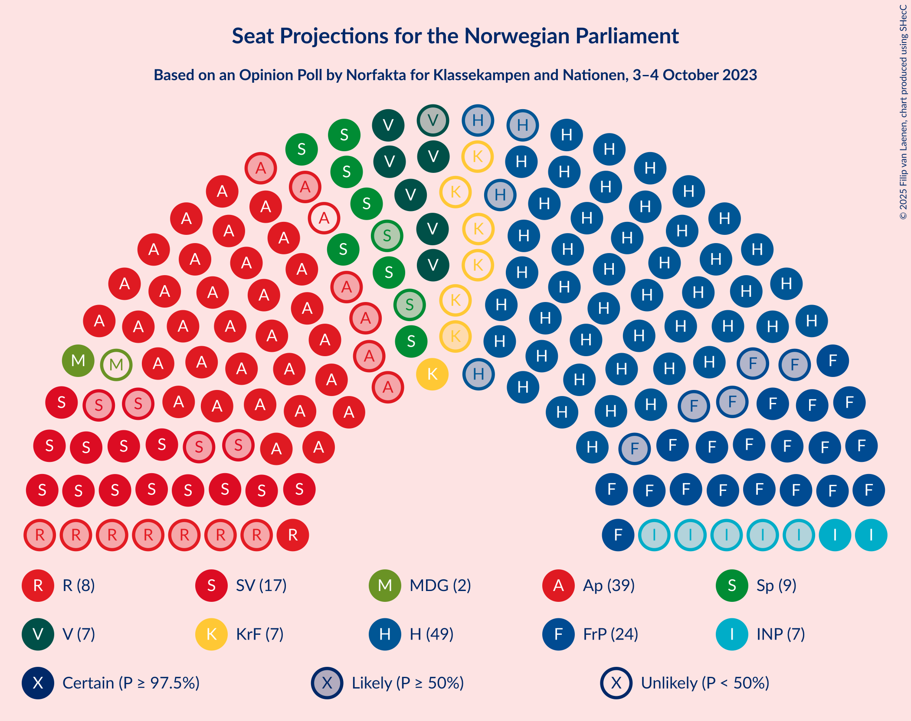
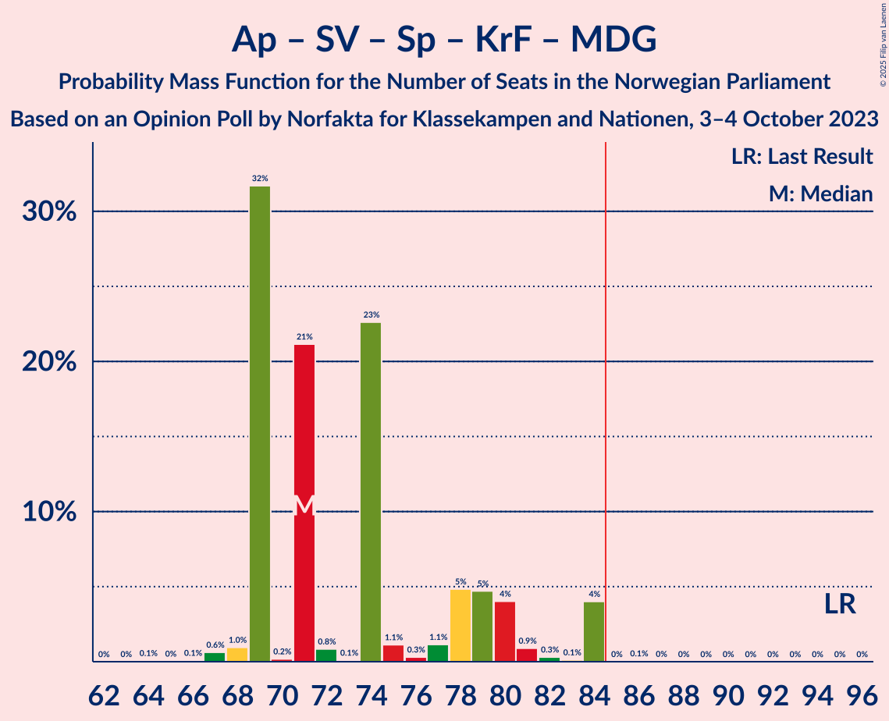
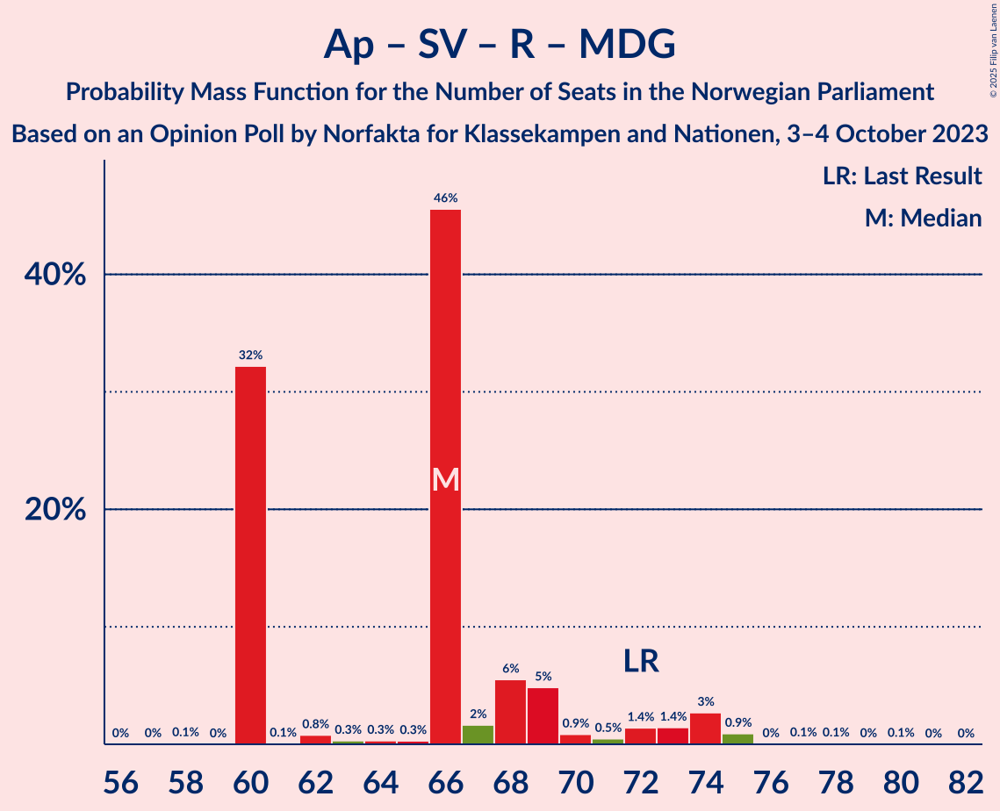

# Opinion Poll by Norfakta for Klassekampen and Nationen, 3–4 October 2023

<a href="#voting-intentions">Voting Intentions</a> | <a href="#seats">Seats</a> | <a href="#coalitions">Coalitions</a> | <a href="#technical-information">Technical Information</a>

## Voting Intentions

### Confidence Intervals

| Party | Last Result | Poll Result | 80% Confidence Interval | 90% Confidence Interval | 95% Confidence Interval | 99% Confidence Interval |
|:-----:|:-----------:|:-----------:|:-----------------------:|:-----------------------:|:-----------------------:|:-----------------------:|
| Høyre | 20.4% | 26.5% | 24.6–28.5% |24.0–29.1% |23.6–29.6% |22.7–30.6% |
| Arbeiderpartiet | 26.2% | 21.0% | 19.3–22.9% |18.8–23.5% |18.4–23.9% |17.6–24.9% |
| Fremskrittspartiet | 11.6% | 12.8% | 11.4–14.4% |11.0–14.8% |10.6–15.2% |10.0–16.0% |
| Sosialistisk Venstreparti | 7.6% | 10.4% | 9.2–11.9% |8.8–12.4% |8.5–12.7% |8.0–13.5% |
| Venstre | 4.6% | 5.6% | 4.7–6.8% |4.4–7.1% |4.2–7.4% |3.8–8.0% |
| Senterpartiet | 13.5% | 5.5% | 4.6–6.6% |4.3–7.0% |4.1–7.2% |3.7–7.8% |
| Rødt | 4.7% | 5.0% | 4.1–6.1% |3.9–6.4% |3.7–6.7% |3.3–7.3% |
| Kristelig Folkeparti | 3.8% | 4.1% | 3.4–5.2% |3.2–5.5% |3.0–5.7% |2.6–6.3% |
| Industri- og Næringspartiet | 0.3% | 4.1% | 3.4–5.2% |3.2–5.5% |3.0–5.7% |2.6–6.3% |
| Miljøpartiet De Grønne | 3.9% | 3.0% | 2.4–4.0% |2.2–4.2% |2.1–4.5% |1.8–4.9% |
| Pensjonistpartiet | 0.6% | 0.9% | 0.6–1.4% |0.5–1.6% |0.4–1.8% |0.3–2.1% |
| Konservativt | 0.4% | 0.7% | 0.5–1.3% |0.4–1.4% |0.3–1.6% |0.2–1.9% |
| Liberalistene | 0.2% | 0.1% | 0.1–0.5% |0.0–0.6% |0.0–0.7% |0.0–0.9% |

*Note:* The poll result column reflects the actual value used in the calculations. Published results may vary slightly, and in addition be rounded to fewer digits.

## Seats

### Confidence Intervals

| Party | Last Result | Median | 80% Confidence Interval | 90% Confidence Interval | 95% Confidence Interval | 99% Confidence Interval |
|:-----:|:-----------:|:------:|:-----------------------:|:-----------------------:|:-----------------------:|:-----------------------:|
| <a href="#høyre">Høyre</a> | 36 | 49 | 46–49 |44–50 |42–52 |42–53 |
| <a href="#arbeiderpartiet">Arbeiderpartiet</a> | 48 | 39 | 33–42 |33–45 |33–45 |33–46 |
| <a href="#fremskrittspartiet">Fremskrittspartiet</a> | 21 | 24 | 20–30 |19–30 |19–30 |18–30 |
| <a href="#sosialistisk-venstreparti">Sosialistisk Venstreparti</a> | 13 | 17 | 13–20 |13–22 |13–24 |13–24 |
| <a href="#venstre">Venstre</a> | 8 | 8 | 7–10 |7–11 |7–12 |7–13 |
| <a href="#senterpartiet">Senterpartiet</a> | 28 | 9 | 8–11 |8–11 |7–11 |1–14 |
| <a href="#rødt">Rødt</a> | 8 | 8 | 6–8 |1–9 |1–10 |1–11 |
| <a href="#kristelig-folkeparti">Kristelig Folkeparti</a> | 3 | 7 | 3–8 |3–8 |2–8 |2–9 |
| <a href="#industri--og-næringspartiet">Industri- og Næringspartiet</a> | 0 | 7 | 3–8 |2–8 |2–8 |2–9 |
| <a href="#miljøpartiet-de-grønne">Miljøpartiet De Grønne</a> | 3 | 2 | 1–7 |1–7 |1–7 |1–8 |
| <a href="#pensjonistpartiet">Pensjonistpartiet</a> | 0 | 0 | 0 |0 |0 |0 |
| <a href="#konservativt">Konservativt</a> | 0 | 0 | 0 |0 |0 |0 |
| <a href="#liberalistene">Liberalistene</a> | 0 | 0 | 0 |0 |0 |0 |

### Høyre

*For a full overview of the results for this party, see the [Høyre](party-høyre.html) page.*

| Number of Seats | Probability | Accumulated | Special Marks |
|:---------------:|:-----------:|:-----------:|:-------------:|
| 36 | 0% | 100% | Last Result |
| 37 | 0% | 100% |  |
| 38 | 0% | 100% |  |
| 39 | 0% | 100% |  |
| 40 | 0.1% | 99.9% |  |
| 41 | 0.1% | 99.8% |  |
| 42 | 4% | 99.7% |  |
| 43 | 0.2% | 96% |  |
| 44 | 5% | 96% |  |
| 45 | 0.8% | 91% |  |
| 46 | 3% | 90% |  |
| 47 | 0.9% | 87% |  |
| 48 | 26% | 86% |  |
| 49 | 53% | 60% | Median |
| 50 | 3% | 7% |  |
| 51 | 1.1% | 4% |  |
| 52 | 3% | 3% |  |
| 53 | 0.4% | 0.6% |  |
| 54 | 0.1% | 0.2% |  |
| 55 | 0.1% | 0.1% |  |
| 56 | 0% | 0% |  |

### Arbeiderpartiet

*For a full overview of the results for this party, see the [Arbeiderpartiet](party-arbeiderpartiet.html) page.*

| Number of Seats | Probability | Accumulated | Special Marks |
|:---------------:|:-----------:|:-----------:|:-------------:|
| 32 | 0% | 100% |  |
| 33 | 20% | 99.9% |  |
| 34 | 0.1% | 79% |  |
| 35 | 0.2% | 79% |  |
| 36 | 0.7% | 79% |  |
| 37 | 1.0% | 78% |  |
| 38 | 5% | 77% |  |
| 39 | 36% | 72% | Median |
| 40 | 24% | 36% |  |
| 41 | 0.4% | 12% |  |
| 42 | 3% | 11% |  |
| 43 | 2% | 9% |  |
| 44 | 1.0% | 7% |  |
| 45 | 4% | 6% |  |
| 46 | 1.4% | 2% |  |
| 47 | 0.3% | 0.4% |  |
| 48 | 0.1% | 0.1% | Last Result |
| 49 | 0.1% | 0.1% |  |
| 50 | 0% | 0% |  |

### Fremskrittspartiet

*For a full overview of the results for this party, see the [Fremskrittspartiet](party-fremskrittspartiet.html) page.*

| Number of Seats | Probability | Accumulated | Special Marks |
|:---------------:|:-----------:|:-----------:|:-------------:|
| 17 | 0.1% | 100% |  |
| 18 | 0.7% | 99.9% |  |
| 19 | 5% | 99.2% |  |
| 20 | 5% | 94% |  |
| 21 | 2% | 89% | Last Result |
| 22 | 22% | 87% |  |
| 23 | 5% | 65% |  |
| 24 | 22% | 61% | Median |
| 25 | 4% | 38% |  |
| 26 | 2% | 34% |  |
| 27 | 1.1% | 33% |  |
| 28 | 0.1% | 32% |  |
| 29 | 0.3% | 31% |  |
| 30 | 31% | 31% |  |
| 31 | 0% | 0.1% |  |
| 32 | 0% | 0% |  |

### Sosialistisk Venstreparti

*For a full overview of the results for this party, see the [Sosialistisk Venstreparti](party-sosialistiskvenstreparti.html) page.*

| Number of Seats | Probability | Accumulated | Special Marks |
|:---------------:|:-----------:|:-----------:|:-------------:|
| 13 | 34% | 100% | Last Result |
| 14 | 0.8% | 66% |  |
| 15 | 3% | 66% |  |
| 16 | 0.8% | 63% |  |
| 17 | 22% | 62% | Median |
| 18 | 29% | 40% |  |
| 19 | 0.5% | 11% |  |
| 20 | 2% | 11% |  |
| 21 | 2% | 8% |  |
| 22 | 4% | 7% |  |
| 23 | 0.1% | 3% |  |
| 24 | 3% | 3% |  |
| 25 | 0% | 0.1% |  |
| 26 | 0.1% | 0.1% |  |
| 27 | 0% | 0% |  |

### Venstre

*For a full overview of the results for this party, see the [Venstre](party-venstre.html) page.*

| Number of Seats | Probability | Accumulated | Special Marks |
|:---------------:|:-----------:|:-----------:|:-------------:|
| 2 | 0.1% | 100% |  |
| 3 | 0.4% | 99.9% |  |
| 4 | 0% | 99.6% |  |
| 5 | 0% | 99.6% |  |
| 6 | 0% | 99.6% |  |
| 7 | 39% | 99.6% |  |
| 8 | 25% | 60% | Last Result, Median |
| 9 | 3% | 35% |  |
| 10 | 23% | 31% |  |
| 11 | 6% | 8% |  |
| 12 | 2% | 3% |  |
| 13 | 0.6% | 0.8% |  |
| 14 | 0.1% | 0.3% |  |
| 15 | 0.1% | 0.2% |  |
| 16 | 0% | 0% |  |

### Senterpartiet

*For a full overview of the results for this party, see the [Senterpartiet](party-senterpartiet.html) page.*

| Number of Seats | Probability | Accumulated | Special Marks |
|:---------------:|:-----------:|:-----------:|:-------------:|
| 0 | 0.1% | 100% |  |
| 1 | 0.8% | 99.9% |  |
| 2 | 0% | 99.1% |  |
| 3 | 0% | 99.1% |  |
| 4 | 0% | 99.1% |  |
| 5 | 0% | 99.1% |  |
| 6 | 0% | 99.1% |  |
| 7 | 2% | 99.1% |  |
| 8 | 35% | 97% |  |
| 9 | 24% | 62% | Median |
| 10 | 27% | 38% |  |
| 11 | 9% | 11% |  |
| 12 | 2% | 2% |  |
| 13 | 0.2% | 0.7% |  |
| 14 | 0.3% | 0.5% |  |
| 15 | 0.2% | 0.2% |  |
| 16 | 0% | 0% |  |
| 17 | 0% | 0% |  |
| 18 | 0% | 0% |  |
| 19 | 0% | 0% |  |
| 20 | 0% | 0% |  |
| 21 | 0% | 0% |  |
| 22 | 0% | 0% |  |
| 23 | 0% | 0% |  |
| 24 | 0% | 0% |  |
| 25 | 0% | 0% |  |
| 26 | 0% | 0% |  |
| 27 | 0% | 0% |  |
| 28 | 0% | 0% | Last Result |

### Rødt

*For a full overview of the results for this party, see the [Rødt](party-rødt.html) page.*

| Number of Seats | Probability | Accumulated | Special Marks |
|:---------------:|:-----------:|:-----------:|:-------------:|
| 1 | 6% | 100% |  |
| 2 | 0% | 94% |  |
| 3 | 0% | 94% |  |
| 4 | 0% | 94% |  |
| 5 | 0% | 94% |  |
| 6 | 32% | 94% |  |
| 7 | 6% | 62% |  |
| 8 | 51% | 56% | Last Result, Median |
| 9 | 0.6% | 5% |  |
| 10 | 3% | 4% |  |
| 11 | 1.1% | 1.4% |  |
| 12 | 0.1% | 0.3% |  |
| 13 | 0.2% | 0.2% |  |
| 14 | 0% | 0% |  |

### Kristelig Folkeparti

*For a full overview of the results for this party, see the [Kristelig Folkeparti](party-kristeligfolkeparti.html) page.*

| Number of Seats | Probability | Accumulated | Special Marks |
|:---------------:|:-----------:|:-----------:|:-------------:|
| 2 | 3% | 100% |  |
| 3 | 25% | 97% | Last Result |
| 4 | 0% | 72% |  |
| 5 | 0% | 72% |  |
| 6 | 2% | 72% |  |
| 7 | 59% | 70% | Median |
| 8 | 11% | 11% |  |
| 9 | 0.4% | 0.8% |  |
| 10 | 0.3% | 0.4% |  |
| 11 | 0.1% | 0.1% |  |
| 12 | 0% | 0% |  |

### Industri- og Næringspartiet

*For a full overview of the results for this party, see the [Industri- og Næringspartiet](party-industri-ognæringspartiet.html) page.*

| Number of Seats | Probability | Accumulated | Special Marks |
|:---------------:|:-----------:|:-----------:|:-------------:|
| 0 | 0% | 100% | Last Result |
| 1 | 0% | 100% |  |
| 2 | 5% | 100% |  |
| 3 | 6% | 95% |  |
| 4 | 0% | 88% |  |
| 5 | 0% | 88% |  |
| 6 | 1.4% | 88% |  |
| 7 | 73% | 87% | Median |
| 8 | 12% | 13% |  |
| 9 | 0.8% | 1.3% |  |
| 10 | 0.4% | 0.5% |  |
| 11 | 0.1% | 0.1% |  |
| 12 | 0% | 0% |  |

### Miljøpartiet De Grønne

*For a full overview of the results for this party, see the [Miljøpartiet De Grønne](party-miljøpartietdegrønne.html) page.*

| Number of Seats | Probability | Accumulated | Special Marks |
|:---------------:|:-----------:|:-----------:|:-------------:|
| 1 | 27% | 100% |  |
| 2 | 45% | 73% | Median |
| 3 | 5% | 28% | Last Result |
| 4 | 0% | 23% |  |
| 5 | 0% | 23% |  |
| 6 | 0% | 23% |  |
| 7 | 22% | 23% |  |
| 8 | 1.0% | 1.0% |  |
| 9 | 0% | 0% |  |

### Pensjonistpartiet

*For a full overview of the results for this party, see the [Pensjonistpartiet](party-pensjonistpartiet.html) page.*

| Number of Seats | Probability | Accumulated | Special Marks |
|:---------------:|:-----------:|:-----------:|:-------------:|
| 0 | 100% | 100% | Last Result, Median |

### Konservativt

*For a full overview of the results for this party, see the [Konservativt](party-konservativt.html) page.*

| Number of Seats | Probability | Accumulated | Special Marks |
|:---------------:|:-----------:|:-----------:|:-------------:|
| 0 | 100% | 100% | Last Result, Median |

### Liberalistene

*For a full overview of the results for this party, see the [Liberalistene](party-liberalistene.html) page.*

| Number of Seats | Probability | Accumulated | Special Marks |
|:---------------:|:-----------:|:-----------:|:-------------:|
| 0 | 100% | 100% | Last Result, Median |

## Coalitions

### Confidence Intervals

| Coalition | Last Result | Median | Majority? | 80% Confidence Interval | 90% Confidence Interval | 95% Confidence Interval | 99% Confidence Interval |
|:---------:|:-----------:|:------:|:---------:|:-----------------------:|:-----------------------:|:-----------------------:|:-----------------------:|
| Høyre – Fremskrittspartiet – Venstre – Senterpartiet – Kristelig Folkeparti | 96 | 95 | 99.4% | 92–101 | 91–101 | 86–101 | 84–105 |
| Høyre – Fremskrittspartiet – Venstre – Kristelig Folkeparti – Miljøpartiet De Grønne | 71 | 92 | 91% | 85–95 | 84–95 | 78–95 | 78–100 |
| Høyre – Fremskrittspartiet – Venstre – Kristelig Folkeparti | 68 | 86 | 84% | 83–93 | 81–93 | 76–93 | 76–98 |
| Høyre – Fremskrittspartiet – Venstre | 65 | 82 | 35% | 75–86 | 74–86 | 73–86 | 73–90 |
| Arbeiderpartiet – Sosialistisk Venstreparti – Senterpartiet – Kristelig Folkeparti – Miljøpartiet De Grønne | 95 | 71 | 0.1% | 69–79 | 69–81 | 69–84 | 67–84 |
| Arbeiderpartiet – Sosialistisk Venstreparti – Senterpartiet – Rødt – Miljøpartiet De Grønne | 100 | 75 | 0.4% | 68–79 | 68–82 | 68–84 | 67–84 |
| Arbeiderpartiet – Sosialistisk Venstreparti – Senterpartiet – Rødt | 97 | 69 | 0.3% | 66–76 | 66–79 | 66–82 | 65–82 |
| Høyre – Fremskrittspartiet | 57 | 72 | 0% | 67–79 | 67–79 | 65–79 | 64–79 |
| Arbeiderpartiet – Sosialistisk Venstreparti – Senterpartiet – Miljøpartiet De Grønne | 92 | 67 | 0% | 62–73 | 62–76 | 62–76 | 60–79 |
| Arbeiderpartiet – Sosialistisk Venstreparti – Rødt – Miljøpartiet De Grønne | 72 | 66 | 0% | 60–69 | 60–73 | 60–74 | 60–75 |
| Arbeiderpartiet – Sosialistisk Venstreparti – Senterpartiet | 89 | 61 | 0% | 60–70 | 60–74 | 60–74 | 58–77 |
| Høyre – Venstre – Kristelig Folkeparti | 47 | 63 | 0% | 61–64 | 58–66 | 57–68 | 57–72 |
| Arbeiderpartiet – Senterpartiet – Kristelig Folkeparti – Miljøpartiet De Grønne | 82 | 56 | 0% | 53–60 | 53–64 | 53–66 | 47–66 |
| Arbeiderpartiet – Sosialistisk Venstreparti | 61 | 52 | 0% | 51–60 | 51–63 | 51–64 | 51–67 |
| Arbeiderpartiet – Senterpartiet – Kristelig Folkeparti | 79 | 54 | 0% | 46–57 | 46–62 | 46–64 | 46–64 |
| Arbeiderpartiet – Senterpartiet | 76 | 47 | 0% | 43–51 | 43–55 | 43–56 | 43–57 |
| Venstre – Senterpartiet – Kristelig Folkeparti | 39 | 23 | 0% | 22–26 | 21–29 | 20–29 | 13–32 |

### Høyre – Fremskrittspartiet – Venstre – Senterpartiet – Kristelig Folkeparti

| Number of Seats | Probability | Accumulated | Special Marks |
|:---------------:|:-----------:|:-----------:|:-------------:|
| 83 | 0% | 100% |  |
| 84 | 0.6% | 99.9% |  |
| 85 | 0.3% | 99.4% | Majority |
| 86 | 3% | 99.1% |  |
| 87 | 0.4% | 96% |  |
| 88 | 0.1% | 96% |  |
| 89 | 0.1% | 96% |  |
| 90 | 0.2% | 96% |  |
| 91 | 0.7% | 96% |  |
| 92 | 5% | 95% |  |
| 93 | 1.2% | 90% |  |
| 94 | 6% | 89% |  |
| 95 | 42% | 83% |  |
| 96 | 4% | 40% | Last Result |
| 97 | 0.9% | 36% | Median |
| 98 | 0.9% | 35% |  |
| 99 | 0.8% | 34% |  |
| 100 | 0.5% | 34% |  |
| 101 | 31% | 33% |  |
| 102 | 0.3% | 2% |  |
| 103 | 0.3% | 2% |  |
| 104 | 0% | 1.3% |  |
| 105 | 0.9% | 1.3% |  |
| 106 | 0.2% | 0.3% |  |
| 107 | 0.1% | 0.1% |  |
| 108 | 0% | 0% |  |

### Høyre – Fremskrittspartiet – Venstre – Kristelig Folkeparti – Miljøpartiet De Grønne

| Number of Seats | Probability | Accumulated | Special Marks |
|:---------------:|:-----------:|:-----------:|:-------------:|
| 71 | 0% | 100% | Last Result |
| 72 | 0% | 100% |  |
| 73 | 0% | 100% |  |
| 74 | 0% | 100% |  |
| 75 | 0% | 100% |  |
| 76 | 0% | 99.9% |  |
| 77 | 0.1% | 99.9% |  |
| 78 | 3% | 99.9% |  |
| 79 | 0.4% | 97% |  |
| 80 | 0.1% | 97% |  |
| 81 | 0.1% | 97% |  |
| 82 | 0.1% | 97% |  |
| 83 | 0.2% | 97% |  |
| 84 | 5% | 96% |  |
| 85 | 6% | 91% | Majority |
| 86 | 0.8% | 86% |  |
| 87 | 21% | 85% |  |
| 88 | 4% | 64% |  |
| 89 | 2% | 60% |  |
| 90 | 0.1% | 58% | Median |
| 91 | 1.5% | 58% |  |
| 92 | 23% | 56% |  |
| 93 | 0.5% | 34% |  |
| 94 | 0.2% | 33% |  |
| 95 | 32% | 33% |  |
| 96 | 0% | 1.2% |  |
| 97 | 0% | 1.1% |  |
| 98 | 0.1% | 1.1% |  |
| 99 | 0% | 1.1% |  |
| 100 | 1.1% | 1.1% |  |
| 101 | 0% | 0% |  |

### Høyre – Fremskrittspartiet – Venstre – Kristelig Folkeparti

| Number of Seats | Probability | Accumulated | Special Marks |
|:---------------:|:-----------:|:-----------:|:-------------:|
| 68 | 0% | 100% | Last Result |
| 69 | 0% | 100% |  |
| 70 | 0% | 100% |  |
| 71 | 0% | 100% |  |
| 72 | 0% | 100% |  |
| 73 | 0% | 100% |  |
| 74 | 0% | 100% |  |
| 75 | 0% | 99.9% |  |
| 76 | 3% | 99.9% |  |
| 77 | 0.1% | 97% |  |
| 78 | 0.5% | 97% |  |
| 79 | 0.1% | 97% |  |
| 80 | 0.1% | 97% |  |
| 81 | 5% | 97% |  |
| 82 | 1.0% | 92% |  |
| 83 | 5% | 91% |  |
| 84 | 3% | 86% |  |
| 85 | 22% | 84% | Majority |
| 86 | 25% | 62% |  |
| 87 | 1.2% | 37% |  |
| 88 | 0.7% | 36% | Median |
| 89 | 0.6% | 35% |  |
| 90 | 0.7% | 35% |  |
| 91 | 0.8% | 34% |  |
| 92 | 0.5% | 33% |  |
| 93 | 31% | 33% |  |
| 94 | 0.4% | 2% |  |
| 95 | 0% | 1.1% |  |
| 96 | 0% | 1.1% |  |
| 97 | 0.1% | 1.1% |  |
| 98 | 0.9% | 1.0% |  |
| 99 | 0% | 0% |  |

### Høyre – Fremskrittspartiet – Venstre

| Number of Seats | Probability | Accumulated | Special Marks |
|:---------------:|:-----------:|:-----------:|:-------------:|
| 65 | 0% | 100% | Last Result |
| 66 | 0% | 100% |  |
| 67 | 0% | 100% |  |
| 68 | 0% | 100% |  |
| 69 | 0% | 100% |  |
| 70 | 0.1% | 100% |  |
| 71 | 0.1% | 99.8% |  |
| 72 | 0.1% | 99.7% |  |
| 73 | 3% | 99.6% |  |
| 74 | 5% | 97% |  |
| 75 | 4% | 92% |  |
| 76 | 0.3% | 88% |  |
| 77 | 1.1% | 88% |  |
| 78 | 4% | 87% |  |
| 79 | 23% | 82% |  |
| 80 | 0.5% | 59% |  |
| 81 | 2% | 58% | Median |
| 82 | 21% | 57% |  |
| 83 | 0.9% | 36% |  |
| 84 | 0.5% | 35% |  |
| 85 | 1.0% | 35% | Majority |
| 86 | 32% | 34% |  |
| 87 | 0.7% | 2% |  |
| 88 | 0% | 1.2% |  |
| 89 | 0.1% | 1.1% |  |
| 90 | 1.0% | 1.1% |  |
| 91 | 0% | 0.1% |  |
| 92 | 0% | 0.1% |  |
| 93 | 0% | 0.1% |  |
| 94 | 0.1% | 0.1% |  |
| 95 | 0% | 0% |  |

### Arbeiderpartiet – Sosialistisk Venstreparti – Senterpartiet – Kristelig Folkeparti – Miljøpartiet De Grønne

| Number of Seats | Probability | Accumulated | Special Marks |
|:---------------:|:-----------:|:-----------:|:-------------:|
| 64 | 0.1% | 100% |  |
| 65 | 0% | 99.9% |  |
| 66 | 0.1% | 99.9% |  |
| 67 | 0.6% | 99.8% |  |
| 68 | 1.0% | 99.2% |  |
| 69 | 32% | 98% |  |
| 70 | 0.2% | 67% |  |
| 71 | 21% | 66% |  |
| 72 | 0.8% | 45% |  |
| 73 | 0.1% | 44% |  |
| 74 | 23% | 44% | Median |
| 75 | 1.1% | 22% |  |
| 76 | 0.3% | 20% |  |
| 77 | 1.1% | 20% |  |
| 78 | 5% | 19% |  |
| 79 | 5% | 14% |  |
| 80 | 4% | 9% |  |
| 81 | 0.9% | 5% |  |
| 82 | 0.3% | 5% |  |
| 83 | 0.1% | 4% |  |
| 84 | 4% | 4% |  |
| 85 | 0% | 0.1% | Majority |
| 86 | 0.1% | 0.1% |  |
| 87 | 0% | 0% |  |
| 88 | 0% | 0% |  |
| 89 | 0% | 0% |  |
| 90 | 0% | 0% |  |
| 91 | 0% | 0% |  |
| 92 | 0% | 0% |  |
| 93 | 0% | 0% |  |
| 94 | 0% | 0% |  |
| 95 | 0% | 0% | Last Result |

### Arbeiderpartiet – Sosialistisk Venstreparti – Senterpartiet – Rødt – Miljøpartiet De Grønne

| Number of Seats | Probability | Accumulated | Special Marks |
|:---------------:|:-----------:|:-----------:|:-------------:|
| 66 | 0.1% | 100% |  |
| 67 | 1.0% | 99.9% |  |
| 68 | 31% | 98.9% |  |
| 69 | 0.1% | 68% |  |
| 70 | 0.4% | 68% |  |
| 71 | 0.2% | 67% |  |
| 72 | 0.8% | 67% |  |
| 73 | 0% | 66% |  |
| 74 | 0.8% | 66% |  |
| 75 | 22% | 65% | Median |
| 76 | 22% | 43% |  |
| 77 | 4% | 21% |  |
| 78 | 0.4% | 16% |  |
| 79 | 8% | 16% |  |
| 80 | 0.2% | 7% |  |
| 81 | 2% | 7% |  |
| 82 | 2% | 6% |  |
| 83 | 0.9% | 4% |  |
| 84 | 3% | 3% |  |
| 85 | 0% | 0.4% | Majority |
| 86 | 0% | 0.4% |  |
| 87 | 0.1% | 0.3% |  |
| 88 | 0.1% | 0.2% |  |
| 89 | 0.1% | 0.1% |  |
| 90 | 0% | 0% |  |
| 91 | 0% | 0% |  |
| 92 | 0% | 0% |  |
| 93 | 0% | 0% |  |
| 94 | 0% | 0% |  |
| 95 | 0% | 0% |  |
| 96 | 0% | 0% |  |
| 97 | 0% | 0% |  |
| 98 | 0% | 0% |  |
| 99 | 0% | 0% |  |
| 100 | 0% | 0% | Last Result |

### Arbeiderpartiet – Sosialistisk Venstreparti – Senterpartiet – Rødt

| Number of Seats | Probability | Accumulated | Special Marks |
|:---------------:|:-----------:|:-----------:|:-------------:|
| 64 | 0.1% | 100% |  |
| 65 | 1.1% | 99.9% |  |
| 66 | 31% | 98.8% |  |
| 67 | 0% | 68% |  |
| 68 | 0.7% | 68% |  |
| 69 | 20% | 67% |  |
| 70 | 0.3% | 47% |  |
| 71 | 0.7% | 46% |  |
| 72 | 0.2% | 46% |  |
| 73 | 2% | 45% | Median |
| 74 | 23% | 44% |  |
| 75 | 5% | 21% |  |
| 76 | 6% | 15% |  |
| 77 | 4% | 9% |  |
| 78 | 0.3% | 5% |  |
| 79 | 0.2% | 5% |  |
| 80 | 0.8% | 5% |  |
| 81 | 1.0% | 4% |  |
| 82 | 3% | 3% |  |
| 83 | 0% | 0.4% |  |
| 84 | 0% | 0.4% |  |
| 85 | 0.1% | 0.3% | Majority |
| 86 | 0% | 0.2% |  |
| 87 | 0.1% | 0.2% |  |
| 88 | 0% | 0.1% |  |
| 89 | 0% | 0% |  |
| 90 | 0% | 0% |  |
| 91 | 0% | 0% |  |
| 92 | 0% | 0% |  |
| 93 | 0% | 0% |  |
| 94 | 0% | 0% |  |
| 95 | 0% | 0% |  |
| 96 | 0% | 0% |  |
| 97 | 0% | 0% | Last Result |

### Høyre – Fremskrittspartiet

| Number of Seats | Probability | Accumulated | Special Marks |
|:---------------:|:-----------:|:-----------:|:-------------:|
| 57 | 0% | 100% | Last Result |
| 58 | 0% | 100% |  |
| 59 | 0% | 100% |  |
| 60 | 0.1% | 100% |  |
| 61 | 0.1% | 99.8% |  |
| 62 | 0% | 99.7% |  |
| 63 | 0.1% | 99.7% |  |
| 64 | 0.2% | 99.6% |  |
| 65 | 3% | 99.4% |  |
| 66 | 1.1% | 97% |  |
| 67 | 8% | 96% |  |
| 68 | 4% | 87% |  |
| 69 | 3% | 83% |  |
| 70 | 0.1% | 80% |  |
| 71 | 24% | 80% |  |
| 72 | 21% | 57% |  |
| 73 | 1.4% | 36% | Median |
| 74 | 0.3% | 34% |  |
| 75 | 0.5% | 34% |  |
| 76 | 0.7% | 34% |  |
| 77 | 0.6% | 33% |  |
| 78 | 0% | 32% |  |
| 79 | 32% | 32% |  |
| 80 | 0% | 0.2% |  |
| 81 | 0% | 0.2% |  |
| 82 | 0% | 0.1% |  |
| 83 | 0% | 0.1% |  |
| 84 | 0.1% | 0.1% |  |
| 85 | 0% | 0% | Majority |

### Arbeiderpartiet – Sosialistisk Venstreparti – Senterpartiet – Miljøpartiet De Grønne

| Number of Seats | Probability | Accumulated | Special Marks |
|:---------------:|:-----------:|:-----------:|:-------------:|
| 57 | 0% | 100% |  |
| 58 | 0% | 99.9% |  |
| 59 | 0% | 99.9% |  |
| 60 | 0.9% | 99.9% |  |
| 61 | 0% | 98.9% |  |
| 62 | 31% | 98.9% |  |
| 63 | 0.1% | 68% |  |
| 64 | 0.8% | 68% |  |
| 65 | 0.6% | 67% |  |
| 66 | 1.1% | 66% |  |
| 67 | 22% | 65% | Median |
| 68 | 21% | 43% |  |
| 69 | 1.4% | 22% |  |
| 70 | 0.4% | 21% |  |
| 71 | 5% | 20% |  |
| 72 | 5% | 16% |  |
| 73 | 2% | 11% |  |
| 74 | 0.6% | 9% |  |
| 75 | 0.4% | 8% |  |
| 76 | 6% | 8% |  |
| 77 | 0.4% | 1.1% |  |
| 78 | 0.1% | 0.7% |  |
| 79 | 0.2% | 0.6% |  |
| 80 | 0.1% | 0.4% |  |
| 81 | 0.4% | 0.4% |  |
| 82 | 0% | 0% |  |
| 83 | 0% | 0% |  |
| 84 | 0% | 0% |  |
| 85 | 0% | 0% | Majority |
| 86 | 0% | 0% |  |
| 87 | 0% | 0% |  |
| 88 | 0% | 0% |  |
| 89 | 0% | 0% |  |
| 90 | 0% | 0% |  |
| 91 | 0% | 0% |  |
| 92 | 0% | 0% | Last Result |

### Arbeiderpartiet – Sosialistisk Venstreparti – Rødt – Miljøpartiet De Grønne

| Number of Seats | Probability | Accumulated | Special Marks |
|:---------------:|:-----------:|:-----------:|:-------------:|
| 56 | 0% | 100% |  |
| 57 | 0% | 99.9% |  |
| 58 | 0.1% | 99.9% |  |
| 59 | 0% | 99.8% |  |
| 60 | 32% | 99.8% |  |
| 61 | 0.1% | 68% |  |
| 62 | 0.8% | 67% |  |
| 63 | 0.3% | 67% |  |
| 64 | 0.3% | 66% |  |
| 65 | 0.3% | 66% |  |
| 66 | 46% | 66% | Median |
| 67 | 2% | 20% |  |
| 68 | 6% | 19% |  |
| 69 | 5% | 13% |  |
| 70 | 0.9% | 8% |  |
| 71 | 0.5% | 7% |  |
| 72 | 1.4% | 7% | Last Result |
| 73 | 1.4% | 5% |  |
| 74 | 3% | 4% |  |
| 75 | 0.9% | 1.3% |  |
| 76 | 0% | 0.3% |  |
| 77 | 0.1% | 0.3% |  |
| 78 | 0.1% | 0.2% |  |
| 79 | 0% | 0.1% |  |
| 80 | 0.1% | 0.1% |  |
| 81 | 0% | 0% |  |

### Arbeiderpartiet – Sosialistisk Venstreparti – Senterpartiet

| Number of Seats | Probability | Accumulated | Special Marks |
|:---------------:|:-----------:|:-----------:|:-------------:|
| 55 | 0.1% | 100% |  |
| 56 | 0% | 99.9% |  |
| 57 | 0% | 99.9% |  |
| 58 | 1.5% | 99.9% |  |
| 59 | 0% | 98% |  |
| 60 | 31% | 98% |  |
| 61 | 20% | 67% |  |
| 62 | 0.1% | 47% |  |
| 63 | 0.9% | 47% |  |
| 64 | 1.1% | 46% |  |
| 65 | 0.6% | 45% | Median |
| 66 | 24% | 44% |  |
| 67 | 1.3% | 20% |  |
| 68 | 5% | 19% |  |
| 69 | 0.7% | 14% |  |
| 70 | 4% | 13% |  |
| 71 | 1.0% | 9% |  |
| 72 | 0.6% | 8% |  |
| 73 | 0.1% | 8% |  |
| 74 | 7% | 8% |  |
| 75 | 0.1% | 1.1% |  |
| 76 | 0.5% | 1.0% |  |
| 77 | 0.1% | 0.6% |  |
| 78 | 0.1% | 0.4% |  |
| 79 | 0.4% | 0.4% |  |
| 80 | 0% | 0% |  |
| 81 | 0% | 0% |  |
| 82 | 0% | 0% |  |
| 83 | 0% | 0% |  |
| 84 | 0% | 0% |  |
| 85 | 0% | 0% | Majority |
| 86 | 0% | 0% |  |
| 87 | 0% | 0% |  |
| 88 | 0% | 0% |  |
| 89 | 0% | 0% | Last Result |

### Høyre – Venstre – Kristelig Folkeparti

| Number of Seats | Probability | Accumulated | Special Marks |
|:---------------:|:-----------:|:-----------:|:-------------:|
| 47 | 0% | 100% | Last Result |
| 48 | 0% | 100% |  |
| 49 | 0% | 100% |  |
| 50 | 0% | 100% |  |
| 51 | 0% | 100% |  |
| 52 | 0% | 100% |  |
| 53 | 0% | 100% |  |
| 54 | 0.1% | 99.9% |  |
| 55 | 0.1% | 99.8% |  |
| 56 | 0.1% | 99.7% |  |
| 57 | 3% | 99.6% |  |
| 58 | 5% | 97% |  |
| 59 | 0.4% | 92% |  |
| 60 | 2% | 92% |  |
| 61 | 24% | 90% |  |
| 62 | 1.0% | 66% |  |
| 63 | 36% | 65% |  |
| 64 | 23% | 29% | Median |
| 65 | 1.2% | 7% |  |
| 66 | 2% | 5% |  |
| 67 | 0.1% | 3% |  |
| 68 | 1.3% | 3% |  |
| 69 | 0% | 2% |  |
| 70 | 0.2% | 2% |  |
| 71 | 1.0% | 2% |  |
| 72 | 0.5% | 0.5% |  |
| 73 | 0% | 0% |  |

### Arbeiderpartiet – Senterpartiet – Kristelig Folkeparti – Miljøpartiet De Grønne

| Number of Seats | Probability | Accumulated | Special Marks |
|:---------------:|:-----------:|:-----------:|:-------------:|
| 43 | 0.1% | 100% |  |
| 44 | 0% | 99.9% |  |
| 45 | 0% | 99.9% |  |
| 46 | 0.1% | 99.9% |  |
| 47 | 0.6% | 99.9% |  |
| 48 | 0% | 99.3% |  |
| 49 | 0% | 99.3% |  |
| 50 | 0.5% | 99.2% |  |
| 51 | 0.2% | 98.7% |  |
| 52 | 0.1% | 98.5% |  |
| 53 | 20% | 98% |  |
| 54 | 1.4% | 78% |  |
| 55 | 5% | 77% |  |
| 56 | 32% | 72% |  |
| 57 | 23% | 40% | Median |
| 58 | 4% | 18% |  |
| 59 | 0.9% | 14% |  |
| 60 | 5% | 13% |  |
| 61 | 0.2% | 8% |  |
| 62 | 0.5% | 8% |  |
| 63 | 0.8% | 8% |  |
| 64 | 2% | 7% |  |
| 65 | 0.6% | 4% |  |
| 66 | 4% | 4% |  |
| 67 | 0% | 0.1% |  |
| 68 | 0% | 0.1% |  |
| 69 | 0% | 0.1% |  |
| 70 | 0.1% | 0.1% |  |
| 71 | 0% | 0% |  |
| 72 | 0% | 0% |  |
| 73 | 0% | 0% |  |
| 74 | 0% | 0% |  |
| 75 | 0% | 0% |  |
| 76 | 0% | 0% |  |
| 77 | 0% | 0% |  |
| 78 | 0% | 0% |  |
| 79 | 0% | 0% |  |
| 80 | 0% | 0% |  |
| 81 | 0% | 0% |  |
| 82 | 0% | 0% | Last Result |

### Arbeiderpartiet – Sosialistisk Venstreparti

| Number of Seats | Probability | Accumulated | Special Marks |
|:---------------:|:-----------:|:-----------:|:-------------:|
| 50 | 0.1% | 100% |  |
| 51 | 22% | 99.9% |  |
| 52 | 31% | 78% |  |
| 53 | 0.4% | 47% |  |
| 54 | 1.3% | 47% |  |
| 55 | 0.5% | 46% |  |
| 56 | 0.2% | 45% | Median |
| 57 | 28% | 45% |  |
| 58 | 2% | 17% |  |
| 59 | 1.1% | 15% |  |
| 60 | 4% | 14% |  |
| 61 | 0.3% | 10% | Last Result |
| 62 | 1.1% | 10% |  |
| 63 | 4% | 9% |  |
| 64 | 3% | 4% |  |
| 65 | 0.5% | 2% |  |
| 66 | 0% | 1.0% |  |
| 67 | 1.0% | 1.0% |  |
| 68 | 0% | 0.1% |  |
| 69 | 0% | 0% |  |

### Arbeiderpartiet – Senterpartiet – Kristelig Folkeparti

| Number of Seats | Probability | Accumulated | Special Marks |
|:---------------:|:-----------:|:-----------:|:-------------:|
| 41 | 0.1% | 100% |  |
| 42 | 0% | 99.9% |  |
| 43 | 0% | 99.9% |  |
| 44 | 0% | 99.9% |  |
| 45 | 0.1% | 99.9% |  |
| 46 | 21% | 99.8% |  |
| 47 | 0.4% | 79% |  |
| 48 | 0.5% | 79% |  |
| 49 | 1.2% | 78% |  |
| 50 | 0.1% | 77% |  |
| 51 | 0.2% | 77% |  |
| 52 | 0.1% | 77% |  |
| 53 | 4% | 77% |  |
| 54 | 32% | 72% |  |
| 55 | 1.0% | 40% | Median |
| 56 | 25% | 39% |  |
| 57 | 6% | 14% |  |
| 58 | 0.9% | 8% |  |
| 59 | 0.4% | 7% |  |
| 60 | 0.4% | 7% |  |
| 61 | 0.7% | 6% |  |
| 62 | 2% | 6% |  |
| 63 | 0.2% | 4% |  |
| 64 | 4% | 4% |  |
| 65 | 0% | 0.1% |  |
| 66 | 0% | 0% |  |
| 67 | 0% | 0% |  |
| 68 | 0% | 0% |  |
| 69 | 0% | 0% |  |
| 70 | 0% | 0% |  |
| 71 | 0% | 0% |  |
| 72 | 0% | 0% |  |
| 73 | 0% | 0% |  |
| 74 | 0% | 0% |  |
| 75 | 0% | 0% |  |
| 76 | 0% | 0% |  |
| 77 | 0% | 0% |  |
| 78 | 0% | 0% |  |
| 79 | 0% | 0% | Last Result |

### Arbeiderpartiet – Senterpartiet

| Number of Seats | Probability | Accumulated | Special Marks |
|:---------------:|:-----------:|:-----------:|:-------------:|
| 38 | 0% | 100% |  |
| 39 | 0% | 99.9% |  |
| 40 | 0% | 99.9% |  |
| 41 | 0.1% | 99.9% |  |
| 42 | 0.1% | 99.8% |  |
| 43 | 21% | 99.7% |  |
| 44 | 0.6% | 79% |  |
| 45 | 2% | 79% |  |
| 46 | 0.7% | 77% |  |
| 47 | 32% | 76% |  |
| 48 | 4% | 44% | Median |
| 49 | 21% | 40% |  |
| 50 | 7% | 19% |  |
| 51 | 3% | 11% |  |
| 52 | 0.9% | 8% |  |
| 53 | 0.7% | 8% |  |
| 54 | 2% | 7% |  |
| 55 | 1.1% | 5% |  |
| 56 | 4% | 4% |  |
| 57 | 0.4% | 0.5% |  |
| 58 | 0% | 0.1% |  |
| 59 | 0% | 0.1% |  |
| 60 | 0.1% | 0.1% |  |
| 61 | 0% | 0% |  |
| 62 | 0% | 0% |  |
| 63 | 0% | 0% |  |
| 64 | 0% | 0% |  |
| 65 | 0% | 0% |  |
| 66 | 0% | 0% |  |
| 67 | 0% | 0% |  |
| 68 | 0% | 0% |  |
| 69 | 0% | 0% |  |
| 70 | 0% | 0% |  |
| 71 | 0% | 0% |  |
| 72 | 0% | 0% |  |
| 73 | 0% | 0% |  |
| 74 | 0% | 0% |  |
| 75 | 0% | 0% |  |
| 76 | 0% | 0% | Last Result |

### Venstre – Senterpartiet – Kristelig Folkeparti

| Number of Seats | Probability | Accumulated | Special Marks |
|:---------------:|:-----------:|:-----------:|:-------------:|
| 13 | 0.5% | 100% |  |
| 14 | 0.1% | 99.5% |  |
| 15 | 0.3% | 99.3% |  |
| 16 | 0% | 99.1% |  |
| 17 | 0.1% | 99.1% |  |
| 18 | 0.3% | 98.9% |  |
| 19 | 0.1% | 98.7% |  |
| 20 | 1.3% | 98.6% |  |
| 21 | 3% | 97% |  |
| 22 | 33% | 94% |  |
| 23 | 21% | 62% |  |
| 24 | 23% | 41% | Median |
| 25 | 6% | 18% |  |
| 26 | 5% | 12% |  |
| 27 | 0.5% | 7% |  |
| 28 | 1.3% | 7% |  |
| 29 | 4% | 5% |  |
| 30 | 0.8% | 1.4% |  |
| 31 | 0.1% | 0.6% |  |
| 32 | 0.1% | 0.5% |  |
| 33 | 0.2% | 0.5% |  |
| 34 | 0.2% | 0.3% |  |
| 35 | 0.1% | 0.1% |  |
| 36 | 0% | 0% |  |
| 37 | 0% | 0% |  |
| 38 | 0% | 0% |  |
| 39 | 0% | 0% | Last Result |

## Technical Information

### Opinion Poll

+ **Polling firm:** Norfakta
+ **Commissioner(s):** Klassekampen and Nationen
+ **Fieldwork period:** 3–4 October 2023

### Calculations

+ **Sample size:** 823
+ **Simulations done:** 1,048,576
+ **Error estimate:** 2.87%

