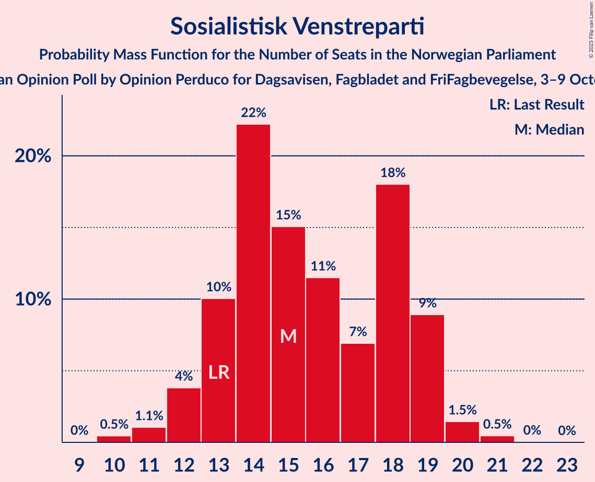

# Opinion Poll by Opinion Perduco for Dagsavisen, Fagbladet and FriFagbevegelse, 3–9 October 2023

<a href="#voting-intentions">Voting Intentions</a> | <a href="#seats">Seats</a> | <a href="#coalitions">Coalitions</a> | <a href="#technical-information">Technical Information</a>

## Voting Intentions

### Confidence Intervals

| Party | Last Result | Poll Result | 80% Confidence Interval | 90% Confidence Interval | 95% Confidence Interval | 99% Confidence Interval |
|:-----:|:-----------:|:-----------:|:-----------------------:|:-----------------------:|:-----------------------:|:-----------------------:|
| Høyre | 20.4% | 25.1% | 23.4–26.9% |22.9–27.4% |22.5–27.9% |21.7–28.8% |
| Arbeiderpartiet | 26.2% | 19.3% | 17.8–21.0% |17.3–21.5% |17.0–21.9% |16.3–22.7% |
| Fremskrittspartiet | 11.6% | 13.3% | 12.0–14.8% |11.6–15.2% |11.3–15.6% |10.7–16.3% |
| Sosialistisk Venstreparti | 7.6% | 9.9% | 8.8–11.2% |8.5–11.6% |8.2–11.9% |7.7–12.6% |
| Senterpartiet | 13.5% | 7.6% | 6.6–8.8% |6.3–9.1% |6.1–9.4% |5.7–10.0% |
| Venstre | 4.6% | 5.2% | 4.4–6.2% |4.2–6.5% |4.0–6.8% |3.6–7.3% |
| Rødt | 4.7% | 4.7% | 3.9–5.7% |3.7–6.0% |3.6–6.2% |3.2–6.7% |
| Miljøpartiet De Grønne | 3.9% | 3.8% | 3.1–4.7% |2.9–5.0% |2.8–5.2% |2.5–5.6% |
| Kristelig Folkeparti | 3.8% | 3.6% | 2.9–4.5% |2.8–4.7% |2.6–5.0% |2.3–5.4% |

*Note:* The poll result column reflects the actual value used in the calculations. Published results may vary slightly, and in addition be rounded to fewer digits.

## Seats

### Confidence Intervals

| Party | Last Result | Median | 80% Confidence Interval | 90% Confidence Interval | 95% Confidence Interval | 99% Confidence Interval |
|:-----:|:-----------:|:------:|:-----------------------:|:-----------------------:|:-----------------------:|:-----------------------:|
| <a href="#høyre">Høyre</a> | 36 | 46 | 41–49 |40–49 |40–50 |40–51 |
| <a href="#arbeiderpartiet">Arbeiderpartiet</a> | 48 | 37 | 34–41 |34–42 |33–42 |32–44 |
| <a href="#fremskrittspartiet">Fremskrittspartiet</a> | 21 | 24 | 21–27 |20–28 |20–29 |18–30 |
| <a href="#sosialistisk-venstreparti">Sosialistisk Venstreparti</a> | 13 | 15 | 13–19 |12–19 |12–19 |11–21 |
| <a href="#senterpartiet">Senterpartiet</a> | 28 | 14 | 12–16 |12–16 |10–17 |8–17 |
| <a href="#venstre">Venstre</a> | 8 | 7 | 6–10 |5–10 |3–11 |3–12 |
| <a href="#rødt">Rødt</a> | 8 | 7 | 1–8 |1–9 |1–9 |1–10 |
| <a href="#miljøpartiet-de-grønne">Miljøpartiet De Grønne</a> | 3 | 3 | 2–7 |2–7 |1–7 |1–8 |
| <a href="#kristelig-folkeparti">Kristelig Folkeparti</a> | 3 | 3 | 2–6 |2–7 |2–7 |2–8 |

### Høyre

*For a full overview of the results for this party, see the [Høyre](party-høyre.html) page.*

| Number of Seats | Probability | Accumulated | Special Marks |
|:---------------:|:-----------:|:-----------:|:-------------:|
| 36 | 0% | 100% | Last Result |
| 37 | 0% | 100% |  |
| 38 | 0% | 100% |  |
| 39 | 0.2% | 99.9% |  |
| 40 | 7% | 99.8% |  |
| 41 | 9% | 92% |  |
| 42 | 5% | 84% |  |
| 43 | 11% | 78% |  |
| 44 | 6% | 68% |  |
| 45 | 11% | 61% |  |
| 46 | 16% | 51% | Median |
| 47 | 16% | 35% |  |
| 48 | 9% | 20% |  |
| 49 | 6% | 10% |  |
| 50 | 2% | 4% |  |
| 51 | 2% | 2% |  |
| 52 | 0.2% | 0.4% |  |
| 53 | 0.2% | 0.2% |  |
| 54 | 0% | 0% |  |

### Arbeiderpartiet

*For a full overview of the results for this party, see the [Arbeiderpartiet](party-arbeiderpartiet.html) page.*

| Number of Seats | Probability | Accumulated | Special Marks |
|:---------------:|:-----------:|:-----------:|:-------------:|
| 31 | 0.3% | 100% |  |
| 32 | 1.3% | 99.6% |  |
| 33 | 3% | 98% |  |
| 34 | 7% | 95% |  |
| 35 | 9% | 89% |  |
| 36 | 10% | 79% |  |
| 37 | 28% | 69% | Median |
| 38 | 16% | 41% |  |
| 39 | 6% | 25% |  |
| 40 | 8% | 19% |  |
| 41 | 4% | 11% |  |
| 42 | 4% | 7% |  |
| 43 | 1.4% | 2% |  |
| 44 | 0.4% | 0.8% |  |
| 45 | 0.2% | 0.4% |  |
| 46 | 0.1% | 0.2% |  |
| 47 | 0.1% | 0.1% |  |
| 48 | 0% | 0% | Last Result |

### Fremskrittspartiet

*For a full overview of the results for this party, see the [Fremskrittspartiet](party-fremskrittspartiet.html) page.*

| Number of Seats | Probability | Accumulated | Special Marks |
|:---------------:|:-----------:|:-----------:|:-------------:|
| 17 | 0.1% | 100% |  |
| 18 | 0.5% | 99.9% |  |
| 19 | 1.5% | 99.4% |  |
| 20 | 8% | 98% |  |
| 21 | 10% | 90% | Last Result |
| 22 | 16% | 80% |  |
| 23 | 10% | 64% |  |
| 24 | 24% | 54% | Median |
| 25 | 8% | 30% |  |
| 26 | 5% | 22% |  |
| 27 | 10% | 16% |  |
| 28 | 3% | 6% |  |
| 29 | 1.1% | 3% |  |
| 30 | 1.1% | 2% |  |
| 31 | 0.2% | 0.4% |  |
| 32 | 0.1% | 0.2% |  |
| 33 | 0% | 0.1% |  |
| 34 | 0% | 0% |  |

### Sosialistisk Venstreparti

*For a full overview of the results for this party, see the [Sosialistisk Venstreparti](party-sosialistiskvenstreparti.html) page.*

| Number of Seats | Probability | Accumulated | Special Marks |
|:---------------:|:-----------:|:-----------:|:-------------:|
| 10 | 0.5% | 100% |  |
| 11 | 1.1% | 99.5% |  |
| 12 | 4% | 98% |  |
| 13 | 10% | 95% | Last Result |
| 14 | 22% | 85% |  |
| 15 | 15% | 62% | Median |
| 16 | 11% | 47% |  |
| 17 | 7% | 36% |  |
| 18 | 18% | 29% |  |
| 19 | 9% | 11% |  |
| 20 | 1.5% | 2% |  |
| 21 | 0.5% | 0.5% |  |
| 22 | 0% | 0.1% |  |
| 23 | 0% | 0% |  |

### Senterpartiet

*For a full overview of the results for this party, see the [Senterpartiet](party-senterpartiet.html) page.*

| Number of Seats | Probability | Accumulated | Special Marks |
|:---------------:|:-----------:|:-----------:|:-------------:|
| 7 | 0.1% | 100% |  |
| 8 | 0.5% | 99.9% |  |
| 9 | 0.8% | 99.4% |  |
| 10 | 1.1% | 98.5% |  |
| 11 | 1.2% | 97% |  |
| 12 | 7% | 96% |  |
| 13 | 23% | 89% |  |
| 14 | 43% | 66% | Median |
| 15 | 12% | 24% |  |
| 16 | 7% | 11% |  |
| 17 | 4% | 5% |  |
| 18 | 0.4% | 0.5% |  |
| 19 | 0% | 0% |  |
| 20 | 0% | 0% |  |
| 21 | 0% | 0% |  |
| 22 | 0% | 0% |  |
| 23 | 0% | 0% |  |
| 24 | 0% | 0% |  |
| 25 | 0% | 0% |  |
| 26 | 0% | 0% |  |
| 27 | 0% | 0% |  |
| 28 | 0% | 0% | Last Result |

### Venstre

*For a full overview of the results for this party, see the [Venstre](party-venstre.html) page.*

| Number of Seats | Probability | Accumulated | Special Marks |
|:---------------:|:-----------:|:-----------:|:-------------:|
| 2 | 0.2% | 100% |  |
| 3 | 2% | 99.8% |  |
| 4 | 0% | 97% |  |
| 5 | 3% | 97% |  |
| 6 | 12% | 95% |  |
| 7 | 32% | 82% | Median |
| 8 | 19% | 50% | Last Result |
| 9 | 18% | 31% |  |
| 10 | 9% | 13% |  |
| 11 | 3% | 4% |  |
| 12 | 0.6% | 0.6% |  |
| 13 | 0% | 0% |  |

### Rødt

*For a full overview of the results for this party, see the [Rødt](party-rødt.html) page.*

| Number of Seats | Probability | Accumulated | Special Marks |
|:---------------:|:-----------:|:-----------:|:-------------:|
| 1 | 15% | 100% |  |
| 2 | 0.2% | 85% |  |
| 3 | 0% | 85% |  |
| 4 | 0% | 85% |  |
| 5 | 7% | 85% |  |
| 6 | 27% | 78% |  |
| 7 | 27% | 51% | Median |
| 8 | 18% | 24% | Last Result |
| 9 | 5% | 7% |  |
| 10 | 1.4% | 2% |  |
| 11 | 0.4% | 0.5% |  |
| 12 | 0.1% | 0.1% |  |
| 13 | 0% | 0% |  |

### Miljøpartiet De Grønne

*For a full overview of the results for this party, see the [Miljøpartiet De Grønne](party-miljøpartietdegrønne.html) page.*

| Number of Seats | Probability | Accumulated | Special Marks |
|:---------------:|:-----------:|:-----------:|:-------------:|
| 1 | 4% | 100% |  |
| 2 | 22% | 96% |  |
| 3 | 30% | 74% | Last Result, Median |
| 4 | 0% | 44% |  |
| 5 | 5% | 44% |  |
| 6 | 24% | 39% |  |
| 7 | 13% | 15% |  |
| 8 | 2% | 2% |  |
| 9 | 0.2% | 0.2% |  |
| 10 | 0% | 0% |  |

### Kristelig Folkeparti

*For a full overview of the results for this party, see the [Kristelig Folkeparti](party-kristeligfolkeparti.html) page.*

| Number of Seats | Probability | Accumulated | Special Marks |
|:---------------:|:-----------:|:-----------:|:-------------:|
| 0 | 0.1% | 100% |  |
| 1 | 0.1% | 99.9% |  |
| 2 | 38% | 99.8% |  |
| 3 | 33% | 62% | Last Result, Median |
| 4 | 0% | 29% |  |
| 5 | 5% | 29% |  |
| 6 | 18% | 24% |  |
| 7 | 5% | 6% |  |
| 8 | 1.2% | 1.2% |  |
| 9 | 0.1% | 0.1% |  |
| 10 | 0% | 0% |  |

## Coalitions

### Confidence Intervals

| Coalition | Last Result | Median | Majority? | 80% Confidence Interval | 90% Confidence Interval | 95% Confidence Interval | 99% Confidence Interval |
|:---------:|:-----------:|:------:|:---------:|:-----------------------:|:-----------------------:|:-----------------------:|:-----------------------:|
| Høyre – Fremskrittspartiet – Senterpartiet – Venstre – Kristelig Folkeparti | 96 | 94 | 99.6% | 89–99 | 87–100 | 87–101 | 85–102 |
| Høyre – Fremskrittspartiet – Venstre – Miljøpartiet De Grønne – Kristelig Folkeparti | 71 | 84 | 43% | 80–88 | 78–90 | 77–91 | 74–94 |
| Høyre – Fremskrittspartiet – Venstre – Kristelig Folkeparti | 68 | 79 | 14% | 75–85 | 74–86 | 73–87 | 71–89 |
| Arbeiderpartiet – Sosialistisk Venstreparti – Senterpartiet – Rødt – Miljøpartiet De Grønne | 100 | 77 | 2% | 71–82 | 70–83 | 69–84 | 68–86 |
| Høyre – Fremskrittspartiet – Venstre | 65 | 76 | 0.4% | 71–81 | 70–82 | 70–83 | 68–84 |
| Arbeiderpartiet – Sosialistisk Venstreparti – Senterpartiet – Miljøpartiet De Grønne – Kristelig Folkeparti | 95 | 75 | 0.3% | 69–79 | 69–80 | 67–82 | 66–84 |
| Arbeiderpartiet – Sosialistisk Venstreparti – Senterpartiet – Rødt | 97 | 74 | 0% | 68–77 | 67–78 | 66–80 | 64–82 |
| Arbeiderpartiet – Sosialistisk Venstreparti – Senterpartiet – Miljøpartiet De Grønne | 92 | 71 | 0% | 66–76 | 65–77 | 64–78 | 63–79 |
| Høyre – Fremskrittspartiet | 57 | 68 | 0% | 64–74 | 63–74 | 62–75 | 61–76 |
| Arbeiderpartiet – Sosialistisk Venstreparti – Senterpartiet | 89 | 67 | 0% | 63–71 | 62–72 | 61–73 | 59–75 |
| Arbeiderpartiet – Sosialistisk Venstreparti – Rødt – Miljøpartiet De Grønne | 72 | 63 | 0% | 57–68 | 57–69 | 56–71 | 55–73 |
| Arbeiderpartiet – Senterpartiet – Miljøpartiet De Grønne – Kristelig Folkeparti | 82 | 59 | 0% | 54–64 | 53–65 | 52–66 | 50–68 |
| Høyre – Venstre – Kristelig Folkeparti | 47 | 57 | 0% | 51–61 | 50–62 | 50–63 | 49–64 |
| Arbeiderpartiet – Senterpartiet – Kristelig Folkeparti | 79 | 55 | 0% | 51–59 | 50–60 | 49–61 | 47–63 |
| Arbeiderpartiet – Sosialistisk Venstreparti | 61 | 53 | 0% | 49–57 | 48–59 | 47–60 | 46–61 |
| Arbeiderpartiet – Senterpartiet | 76 | 51 | 0% | 48–55 | 47–56 | 46–56 | 45–58 |
| Senterpartiet – Venstre – Kristelig Folkeparti | 39 | 25 | 0% | 22–28 | 21–29 | 20–30 | 18–31 |

### Høyre – Fremskrittspartiet – Senterpartiet – Venstre – Kristelig Folkeparti

| Number of Seats | Probability | Accumulated | Special Marks |
|:---------------:|:-----------:|:-----------:|:-------------:|
| 83 | 0.1% | 100% |  |
| 84 | 0.3% | 99.9% |  |
| 85 | 1.1% | 99.6% | Majority |
| 86 | 0.8% | 98% |  |
| 87 | 3% | 98% |  |
| 88 | 3% | 94% |  |
| 89 | 4% | 91% |  |
| 90 | 10% | 87% |  |
| 91 | 9% | 76% |  |
| 92 | 9% | 68% |  |
| 93 | 8% | 59% |  |
| 94 | 8% | 51% | Median |
| 95 | 9% | 43% |  |
| 96 | 6% | 34% | Last Result |
| 97 | 5% | 28% |  |
| 98 | 9% | 23% |  |
| 99 | 7% | 14% |  |
| 100 | 4% | 7% |  |
| 101 | 1.4% | 3% |  |
| 102 | 1.1% | 1.3% |  |
| 103 | 0.1% | 0.3% |  |
| 104 | 0% | 0.1% |  |
| 105 | 0% | 0.1% |  |
| 106 | 0% | 0.1% |  |
| 107 | 0% | 0% |  |

### Høyre – Fremskrittspartiet – Venstre – Miljøpartiet De Grønne – Kristelig Folkeparti

| Number of Seats | Probability | Accumulated | Special Marks |
|:---------------:|:-----------:|:-----------:|:-------------:|
| 71 | 0% | 100% | Last Result |
| 72 | 0% | 100% |  |
| 73 | 0.1% | 100% |  |
| 74 | 0.8% | 99.9% |  |
| 75 | 1.2% | 99.1% |  |
| 76 | 0.3% | 98% |  |
| 77 | 2% | 98% |  |
| 78 | 1.0% | 96% |  |
| 79 | 3% | 95% |  |
| 80 | 5% | 92% |  |
| 81 | 11% | 87% |  |
| 82 | 14% | 76% |  |
| 83 | 9% | 62% | Median |
| 84 | 9% | 53% |  |
| 85 | 8% | 43% | Majority |
| 86 | 6% | 35% |  |
| 87 | 11% | 29% |  |
| 88 | 10% | 18% |  |
| 89 | 3% | 8% |  |
| 90 | 2% | 5% |  |
| 91 | 2% | 3% |  |
| 92 | 0.5% | 1.4% |  |
| 93 | 0.3% | 0.9% |  |
| 94 | 0.1% | 0.5% |  |
| 95 | 0.3% | 0.4% |  |
| 96 | 0.1% | 0.1% |  |
| 97 | 0% | 0.1% |  |
| 98 | 0% | 0% |  |

### Høyre – Fremskrittspartiet – Venstre – Kristelig Folkeparti

| Number of Seats | Probability | Accumulated | Special Marks |
|:---------------:|:-----------:|:-----------:|:-------------:|
| 68 | 0% | 100% | Last Result |
| 69 | 0% | 100% |  |
| 70 | 0.1% | 99.9% |  |
| 71 | 0.5% | 99.9% |  |
| 72 | 1.4% | 99.3% |  |
| 73 | 3% | 98% |  |
| 74 | 3% | 95% |  |
| 75 | 3% | 92% |  |
| 76 | 12% | 89% |  |
| 77 | 10% | 77% |  |
| 78 | 9% | 67% |  |
| 79 | 9% | 58% |  |
| 80 | 5% | 49% | Median |
| 81 | 6% | 43% |  |
| 82 | 7% | 38% |  |
| 83 | 6% | 31% |  |
| 84 | 11% | 24% |  |
| 85 | 6% | 14% | Majority |
| 86 | 3% | 7% |  |
| 87 | 3% | 4% |  |
| 88 | 0.5% | 1.1% |  |
| 89 | 0.4% | 0.6% |  |
| 90 | 0.1% | 0.2% |  |
| 91 | 0.1% | 0.1% |  |
| 92 | 0% | 0.1% |  |
| 93 | 0% | 0% |  |

### Arbeiderpartiet – Sosialistisk Venstreparti – Senterpartiet – Rødt – Miljøpartiet De Grønne

| Number of Seats | Probability | Accumulated | Special Marks |
|:---------------:|:-----------:|:-----------:|:-------------:|
| 64 | 0% | 100% |  |
| 65 | 0.1% | 99.9% |  |
| 66 | 0% | 99.9% |  |
| 67 | 0.1% | 99.8% |  |
| 68 | 0.5% | 99.7% |  |
| 69 | 3% | 99.2% |  |
| 70 | 3% | 96% |  |
| 71 | 5% | 94% |  |
| 72 | 7% | 89% |  |
| 73 | 5% | 82% |  |
| 74 | 12% | 78% |  |
| 75 | 3% | 66% |  |
| 76 | 7% | 63% | Median |
| 77 | 7% | 56% |  |
| 78 | 8% | 49% |  |
| 79 | 6% | 41% |  |
| 80 | 9% | 35% |  |
| 81 | 11% | 26% |  |
| 82 | 5% | 14% |  |
| 83 | 5% | 10% |  |
| 84 | 3% | 5% |  |
| 85 | 1.2% | 2% | Majority |
| 86 | 0.5% | 0.6% |  |
| 87 | 0.1% | 0.1% |  |
| 88 | 0% | 0% |  |
| 89 | 0% | 0% |  |
| 90 | 0% | 0% |  |
| 91 | 0% | 0% |  |
| 92 | 0% | 0% |  |
| 93 | 0% | 0% |  |
| 94 | 0% | 0% |  |
| 95 | 0% | 0% |  |
| 96 | 0% | 0% |  |
| 97 | 0% | 0% |  |
| 98 | 0% | 0% |  |
| 99 | 0% | 0% |  |
| 100 | 0% | 0% | Last Result |

### Høyre – Fremskrittspartiet – Venstre

| Number of Seats | Probability | Accumulated | Special Marks |
|:---------------:|:-----------:|:-----------:|:-------------:|
| 65 | 0% | 100% | Last Result |
| 66 | 0% | 100% |  |
| 67 | 0.2% | 99.9% |  |
| 68 | 0.3% | 99.7% |  |
| 69 | 2% | 99.4% |  |
| 70 | 3% | 98% |  |
| 71 | 6% | 95% |  |
| 72 | 4% | 89% |  |
| 73 | 8% | 86% |  |
| 74 | 11% | 78% |  |
| 75 | 13% | 67% |  |
| 76 | 8% | 54% |  |
| 77 | 6% | 45% | Median |
| 78 | 7% | 39% |  |
| 79 | 8% | 32% |  |
| 80 | 5% | 24% |  |
| 81 | 10% | 19% |  |
| 82 | 5% | 9% |  |
| 83 | 2% | 4% |  |
| 84 | 1.5% | 2% |  |
| 85 | 0.2% | 0.4% | Majority |
| 86 | 0.2% | 0.2% |  |
| 87 | 0% | 0.1% |  |
| 88 | 0% | 0% |  |

### Arbeiderpartiet – Sosialistisk Venstreparti – Senterpartiet – Miljøpartiet De Grønne – Kristelig Folkeparti

| Number of Seats | Probability | Accumulated | Special Marks |
|:---------------:|:-----------:|:-----------:|:-------------:|
| 63 | 0% | 100% |  |
| 64 | 0.2% | 99.9% |  |
| 65 | 0.1% | 99.8% |  |
| 66 | 0.5% | 99.7% |  |
| 67 | 2% | 99.2% |  |
| 68 | 1.3% | 97% |  |
| 69 | 6% | 96% |  |
| 70 | 4% | 90% |  |
| 71 | 13% | 86% |  |
| 72 | 5% | 73% | Median |
| 73 | 7% | 67% |  |
| 74 | 10% | 60% |  |
| 75 | 10% | 50% |  |
| 76 | 7% | 40% |  |
| 77 | 9% | 33% |  |
| 78 | 8% | 24% |  |
| 79 | 7% | 16% |  |
| 80 | 5% | 9% |  |
| 81 | 2% | 4% |  |
| 82 | 1.4% | 3% |  |
| 83 | 0.3% | 1.3% |  |
| 84 | 0.8% | 1.0% |  |
| 85 | 0.2% | 0.3% | Majority |
| 86 | 0% | 0.1% |  |
| 87 | 0% | 0% |  |
| 88 | 0% | 0% |  |
| 89 | 0% | 0% |  |
| 90 | 0% | 0% |  |
| 91 | 0% | 0% |  |
| 92 | 0% | 0% |  |
| 93 | 0% | 0% |  |
| 94 | 0% | 0% |  |
| 95 | 0% | 0% | Last Result |

### Arbeiderpartiet – Sosialistisk Venstreparti – Senterpartiet – Rødt

| Number of Seats | Probability | Accumulated | Special Marks |
|:---------------:|:-----------:|:-----------:|:-------------:|
| 60 | 0% | 100% |  |
| 61 | 0.1% | 99.9% |  |
| 62 | 0.1% | 99.8% |  |
| 63 | 0.1% | 99.7% |  |
| 64 | 0.2% | 99.6% |  |
| 65 | 0.8% | 99.4% |  |
| 66 | 3% | 98.6% |  |
| 67 | 3% | 96% |  |
| 68 | 5% | 93% |  |
| 69 | 6% | 88% |  |
| 70 | 8% | 82% |  |
| 71 | 12% | 74% |  |
| 72 | 5% | 62% |  |
| 73 | 6% | 56% | Median |
| 74 | 13% | 51% |  |
| 75 | 14% | 38% |  |
| 76 | 10% | 24% |  |
| 77 | 7% | 13% |  |
| 78 | 2% | 7% |  |
| 79 | 2% | 5% |  |
| 80 | 1.0% | 3% |  |
| 81 | 1.2% | 2% |  |
| 82 | 0.4% | 0.8% |  |
| 83 | 0.5% | 0.5% |  |
| 84 | 0% | 0% |  |
| 85 | 0% | 0% | Majority |
| 86 | 0% | 0% |  |
| 87 | 0% | 0% |  |
| 88 | 0% | 0% |  |
| 89 | 0% | 0% |  |
| 90 | 0% | 0% |  |
| 91 | 0% | 0% |  |
| 92 | 0% | 0% |  |
| 93 | 0% | 0% |  |
| 94 | 0% | 0% |  |
| 95 | 0% | 0% |  |
| 96 | 0% | 0% |  |
| 97 | 0% | 0% | Last Result |

### Arbeiderpartiet – Sosialistisk Venstreparti – Senterpartiet – Miljøpartiet De Grønne

| Number of Seats | Probability | Accumulated | Special Marks |
|:---------------:|:-----------:|:-----------:|:-------------:|
| 60 | 0% | 100% |  |
| 61 | 0.1% | 99.9% |  |
| 62 | 0.3% | 99.9% |  |
| 63 | 0.6% | 99.6% |  |
| 64 | 3% | 99.0% |  |
| 65 | 3% | 97% |  |
| 66 | 4% | 93% |  |
| 67 | 7% | 89% |  |
| 68 | 14% | 82% |  |
| 69 | 6% | 68% | Median |
| 70 | 7% | 62% |  |
| 71 | 10% | 55% |  |
| 72 | 6% | 45% |  |
| 73 | 10% | 39% |  |
| 74 | 7% | 29% |  |
| 75 | 10% | 22% |  |
| 76 | 6% | 12% |  |
| 77 | 3% | 6% |  |
| 78 | 2% | 3% |  |
| 79 | 0.5% | 0.8% |  |
| 80 | 0.2% | 0.3% |  |
| 81 | 0.1% | 0.2% |  |
| 82 | 0.1% | 0.1% |  |
| 83 | 0% | 0% |  |
| 84 | 0% | 0% |  |
| 85 | 0% | 0% | Majority |
| 86 | 0% | 0% |  |
| 87 | 0% | 0% |  |
| 88 | 0% | 0% |  |
| 89 | 0% | 0% |  |
| 90 | 0% | 0% |  |
| 91 | 0% | 0% |  |
| 92 | 0% | 0% | Last Result |

### Høyre – Fremskrittspartiet

| Number of Seats | Probability | Accumulated | Special Marks |
|:---------------:|:-----------:|:-----------:|:-------------:|
| 57 | 0% | 100% | Last Result |
| 58 | 0% | 100% |  |
| 59 | 0.1% | 100% |  |
| 60 | 0.3% | 99.9% |  |
| 61 | 2% | 99.6% |  |
| 62 | 2% | 98% |  |
| 63 | 1.3% | 95% |  |
| 64 | 6% | 94% |  |
| 65 | 4% | 89% |  |
| 66 | 10% | 85% |  |
| 67 | 11% | 75% |  |
| 68 | 15% | 64% |  |
| 69 | 11% | 48% |  |
| 70 | 9% | 37% | Median |
| 71 | 5% | 28% |  |
| 72 | 7% | 23% |  |
| 73 | 5% | 16% |  |
| 74 | 7% | 11% |  |
| 75 | 3% | 4% |  |
| 76 | 0.6% | 1.1% |  |
| 77 | 0.2% | 0.5% |  |
| 78 | 0.2% | 0.3% |  |
| 79 | 0.1% | 0.1% |  |
| 80 | 0% | 0% |  |

### Arbeiderpartiet – Sosialistisk Venstreparti – Senterpartiet

| Number of Seats | Probability | Accumulated | Special Marks |
|:---------------:|:-----------:|:-----------:|:-------------:|
| 57 | 0% | 100% |  |
| 58 | 0.1% | 99.9% |  |
| 59 | 0.5% | 99.8% |  |
| 60 | 1.0% | 99.4% |  |
| 61 | 1.4% | 98% |  |
| 62 | 4% | 97% |  |
| 63 | 6% | 93% |  |
| 64 | 10% | 88% |  |
| 65 | 13% | 78% |  |
| 66 | 10% | 64% | Median |
| 67 | 11% | 55% |  |
| 68 | 13% | 43% |  |
| 69 | 12% | 31% |  |
| 70 | 8% | 19% |  |
| 71 | 5% | 11% |  |
| 72 | 3% | 6% |  |
| 73 | 2% | 4% |  |
| 74 | 1.1% | 2% |  |
| 75 | 0.7% | 0.8% |  |
| 76 | 0.1% | 0.1% |  |
| 77 | 0% | 0% |  |
| 78 | 0% | 0% |  |
| 79 | 0% | 0% |  |
| 80 | 0% | 0% |  |
| 81 | 0% | 0% |  |
| 82 | 0% | 0% |  |
| 83 | 0% | 0% |  |
| 84 | 0% | 0% |  |
| 85 | 0% | 0% | Majority |
| 86 | 0% | 0% |  |
| 87 | 0% | 0% |  |
| 88 | 0% | 0% |  |
| 89 | 0% | 0% | Last Result |

### Arbeiderpartiet – Sosialistisk Venstreparti – Rødt – Miljøpartiet De Grønne

| Number of Seats | Probability | Accumulated | Special Marks |
|:---------------:|:-----------:|:-----------:|:-------------:|
| 51 | 0% | 100% |  |
| 52 | 0% | 99.9% |  |
| 53 | 0.1% | 99.9% |  |
| 54 | 0.1% | 99.8% |  |
| 55 | 0.8% | 99.7% |  |
| 56 | 4% | 98.9% |  |
| 57 | 5% | 95% |  |
| 58 | 6% | 90% |  |
| 59 | 8% | 84% |  |
| 60 | 7% | 76% |  |
| 61 | 4% | 68% |  |
| 62 | 9% | 64% | Median |
| 63 | 7% | 55% |  |
| 64 | 8% | 48% |  |
| 65 | 5% | 40% |  |
| 66 | 9% | 35% |  |
| 67 | 10% | 26% |  |
| 68 | 6% | 16% |  |
| 69 | 5% | 10% |  |
| 70 | 2% | 5% |  |
| 71 | 1.3% | 3% |  |
| 72 | 0.7% | 2% | Last Result |
| 73 | 0.7% | 0.9% |  |
| 74 | 0.2% | 0.3% |  |
| 75 | 0% | 0% |  |

### Arbeiderpartiet – Senterpartiet – Miljøpartiet De Grønne – Kristelig Folkeparti

| Number of Seats | Probability | Accumulated | Special Marks |
|:---------------:|:-----------:|:-----------:|:-------------:|
| 48 | 0.1% | 100% |  |
| 49 | 0.3% | 99.9% |  |
| 50 | 0.3% | 99.6% |  |
| 51 | 1.3% | 99.3% |  |
| 52 | 2% | 98% |  |
| 53 | 4% | 96% |  |
| 54 | 5% | 92% |  |
| 55 | 7% | 87% |  |
| 56 | 6% | 81% |  |
| 57 | 8% | 75% | Median |
| 58 | 12% | 67% |  |
| 59 | 12% | 55% |  |
| 60 | 10% | 43% |  |
| 61 | 11% | 33% |  |
| 62 | 6% | 22% |  |
| 63 | 5% | 16% |  |
| 64 | 3% | 11% |  |
| 65 | 5% | 8% |  |
| 66 | 1.2% | 3% |  |
| 67 | 1.0% | 2% |  |
| 68 | 0.3% | 0.6% |  |
| 69 | 0.1% | 0.3% |  |
| 70 | 0.1% | 0.1% |  |
| 71 | 0% | 0.1% |  |
| 72 | 0% | 0% |  |
| 73 | 0% | 0% |  |
| 74 | 0% | 0% |  |
| 75 | 0% | 0% |  |
| 76 | 0% | 0% |  |
| 77 | 0% | 0% |  |
| 78 | 0% | 0% |  |
| 79 | 0% | 0% |  |
| 80 | 0% | 0% |  |
| 81 | 0% | 0% |  |
| 82 | 0% | 0% | Last Result |

### Høyre – Venstre – Kristelig Folkeparti

| Number of Seats | Probability | Accumulated | Special Marks |
|:---------------:|:-----------:|:-----------:|:-------------:|
| 47 | 0.1% | 100% | Last Result |
| 48 | 0.2% | 99.8% |  |
| 49 | 2% | 99.6% |  |
| 50 | 5% | 98% |  |
| 51 | 4% | 93% |  |
| 52 | 8% | 90% |  |
| 53 | 5% | 82% |  |
| 54 | 7% | 77% |  |
| 55 | 10% | 70% |  |
| 56 | 10% | 60% | Median |
| 57 | 12% | 50% |  |
| 58 | 14% | 38% |  |
| 59 | 7% | 25% |  |
| 60 | 6% | 18% |  |
| 61 | 4% | 12% |  |
| 62 | 4% | 8% |  |
| 63 | 2% | 3% |  |
| 64 | 1.3% | 2% |  |
| 65 | 0.1% | 0.2% |  |
| 66 | 0.1% | 0.1% |  |
| 67 | 0% | 0% |  |

### Arbeiderpartiet – Senterpartiet – Kristelig Folkeparti

| Number of Seats | Probability | Accumulated | Special Marks |
|:---------------:|:-----------:|:-----------:|:-------------:|
| 45 | 0% | 100% |  |
| 46 | 0.2% | 99.9% |  |
| 47 | 0.3% | 99.7% |  |
| 48 | 0.6% | 99.4% |  |
| 49 | 2% | 98.9% |  |
| 50 | 4% | 97% |  |
| 51 | 8% | 93% |  |
| 52 | 10% | 85% |  |
| 53 | 10% | 75% |  |
| 54 | 14% | 64% | Median |
| 55 | 11% | 50% |  |
| 56 | 10% | 39% |  |
| 57 | 10% | 29% |  |
| 58 | 5% | 19% |  |
| 59 | 8% | 13% |  |
| 60 | 3% | 6% |  |
| 61 | 2% | 3% |  |
| 62 | 0.7% | 1.3% |  |
| 63 | 0.3% | 0.6% |  |
| 64 | 0.2% | 0.2% |  |
| 65 | 0% | 0.1% |  |
| 66 | 0% | 0% |  |
| 67 | 0% | 0% |  |
| 68 | 0% | 0% |  |
| 69 | 0% | 0% |  |
| 70 | 0% | 0% |  |
| 71 | 0% | 0% |  |
| 72 | 0% | 0% |  |
| 73 | 0% | 0% |  |
| 74 | 0% | 0% |  |
| 75 | 0% | 0% |  |
| 76 | 0% | 0% |  |
| 77 | 0% | 0% |  |
| 78 | 0% | 0% |  |
| 79 | 0% | 0% | Last Result |

### Arbeiderpartiet – Sosialistisk Venstreparti

| Number of Seats | Probability | Accumulated | Special Marks |
|:---------------:|:-----------:|:-----------:|:-------------:|
| 44 | 0.1% | 100% |  |
| 45 | 0.1% | 99.9% |  |
| 46 | 0.6% | 99.8% |  |
| 47 | 3% | 99.2% |  |
| 48 | 3% | 96% |  |
| 49 | 5% | 94% |  |
| 50 | 11% | 88% |  |
| 51 | 12% | 78% |  |
| 52 | 12% | 66% | Median |
| 53 | 11% | 54% |  |
| 54 | 10% | 43% |  |
| 55 | 10% | 32% |  |
| 56 | 10% | 22% |  |
| 57 | 4% | 12% |  |
| 58 | 3% | 8% |  |
| 59 | 2% | 5% |  |
| 60 | 2% | 3% |  |
| 61 | 0.4% | 0.9% | Last Result |
| 62 | 0.4% | 0.5% |  |
| 63 | 0.1% | 0.1% |  |
| 64 | 0% | 0% |  |

### Arbeiderpartiet – Senterpartiet

| Number of Seats | Probability | Accumulated | Special Marks |
|:---------------:|:-----------:|:-----------:|:-------------:|
| 42 | 0% | 100% |  |
| 43 | 0.2% | 99.9% |  |
| 44 | 0.3% | 99.8% |  |
| 45 | 0.7% | 99.5% |  |
| 46 | 2% | 98.8% |  |
| 47 | 3% | 96% |  |
| 48 | 7% | 94% |  |
| 49 | 11% | 87% |  |
| 50 | 14% | 76% |  |
| 51 | 15% | 62% | Median |
| 52 | 19% | 47% |  |
| 53 | 10% | 28% |  |
| 54 | 7% | 18% |  |
| 55 | 5% | 10% |  |
| 56 | 3% | 5% |  |
| 57 | 1.1% | 2% |  |
| 58 | 0.6% | 0.9% |  |
| 59 | 0.3% | 0.4% |  |
| 60 | 0.1% | 0.1% |  |
| 61 | 0% | 0% |  |
| 62 | 0% | 0% |  |
| 63 | 0% | 0% |  |
| 64 | 0% | 0% |  |
| 65 | 0% | 0% |  |
| 66 | 0% | 0% |  |
| 67 | 0% | 0% |  |
| 68 | 0% | 0% |  |
| 69 | 0% | 0% |  |
| 70 | 0% | 0% |  |
| 71 | 0% | 0% |  |
| 72 | 0% | 0% |  |
| 73 | 0% | 0% |  |
| 74 | 0% | 0% |  |
| 75 | 0% | 0% |  |
| 76 | 0% | 0% | Last Result |

### Senterpartiet – Venstre – Kristelig Folkeparti

| Number of Seats | Probability | Accumulated | Special Marks |
|:---------------:|:-----------:|:-----------:|:-------------:|
| 15 | 0.1% | 100% |  |
| 16 | 0.1% | 99.9% |  |
| 17 | 0.1% | 99.8% |  |
| 18 | 0.5% | 99.7% |  |
| 19 | 1.0% | 99.2% |  |
| 20 | 1.1% | 98% |  |
| 21 | 4% | 97% |  |
| 22 | 5% | 93% |  |
| 23 | 19% | 88% |  |
| 24 | 14% | 69% | Median |
| 25 | 13% | 55% |  |
| 26 | 13% | 42% |  |
| 27 | 9% | 29% |  |
| 28 | 12% | 20% |  |
| 29 | 4% | 9% |  |
| 30 | 3% | 4% |  |
| 31 | 1.2% | 2% |  |
| 32 | 0.2% | 0.4% |  |
| 33 | 0.2% | 0.2% |  |
| 34 | 0% | 0% |  |
| 35 | 0% | 0% |  |
| 36 | 0% | 0% |  |
| 37 | 0% | 0% |  |
| 38 | 0% | 0% |  |
| 39 | 0% | 0% | Last Result |

## Technical Information

### Opinion Poll

+ **Polling firm:** Opinion Perduco
+ **Commissioner(s):** Dagsavisen, Fagbladet and FriFagbevegelse
+ **Fieldwork period:** 3–9 October 2023

### Calculations

+ **Sample size:** 1000
+ **Simulations done:** 1,048,576
+ **Error estimate:** 1.02%

