# Opinion Poll by Norstat for Aftenposten and NRK, 23–30 October 2023

<a href="#voting-intentions">Voting Intentions</a> | <a href="#seats">Seats</a> | <a href="#coalitions">Coalitions</a> | <a href="#technical-information">Technical Information</a>

## Voting Intentions

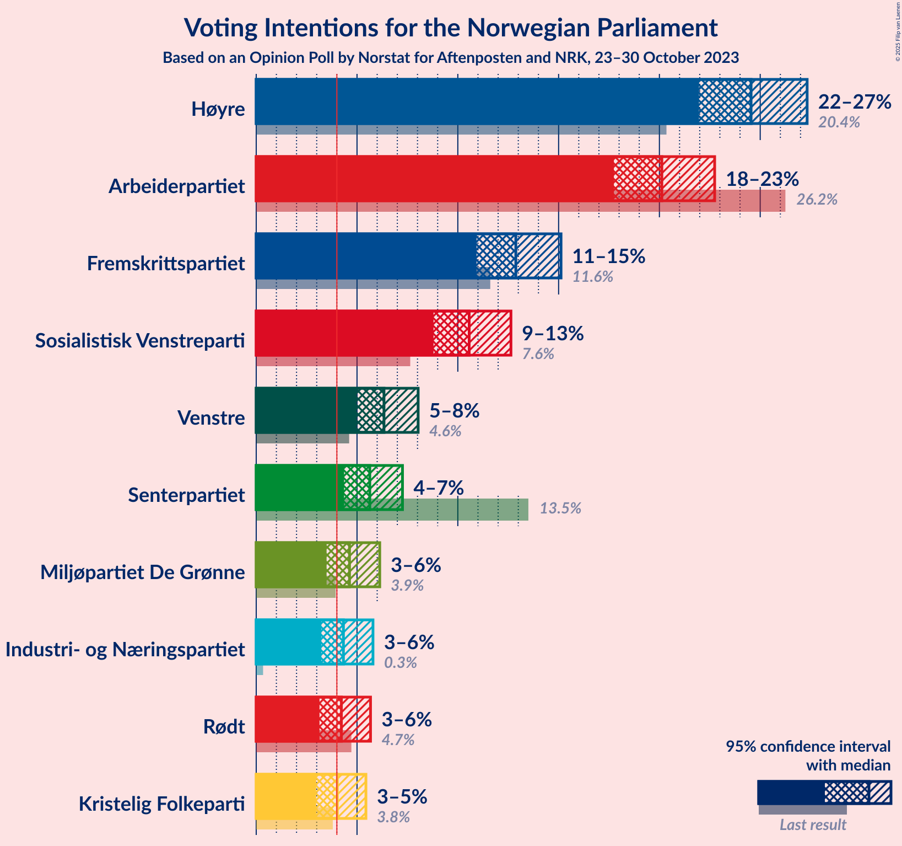

### Confidence Intervals

| Party | Last Result | Poll Result | 80% Confidence Interval | 90% Confidence Interval | 95% Confidence Interval | 99% Confidence Interval |
|:-----:|:-----------:|:-----------:|:-----------------------:|:-----------------------:|:-----------------------:|:-----------------------:|
| Høyre | 20.4% | 24.5% | 22.8–26.4% |22.4–26.9% |22.0–27.3% |21.2–28.2% |
| Arbeiderpartiet | 26.2% | 20.1% | 18.6–21.8% |18.1–22.3% |17.7–22.7% |17.0–23.6% |
| Fremskrittspartiet | 11.6% | 12.9% | 11.6–14.3% |11.2–14.8% |10.9–15.1% |10.3–15.8% |
| Sosialistisk Venstreparti | 7.6% | 10.6% | 9.4–11.9% |9.1–12.3% |8.8–12.6% |8.3–13.3% |
| Venstre | 4.6% | 6.3% | 5.4–7.5% |5.2–7.8% |5.0–8.0% |4.6–8.6% |
| Senterpartiet | 13.5% | 5.6% | 4.8–6.7% |4.6–7.0% |4.4–7.3% |4.0–7.8% |
| Miljøpartiet De Grønne | 3.9% | 4.6% | 3.9–5.6% |3.7–5.9% |3.5–6.1% |3.2–6.6% |
| Industri- og Næringspartiet | 0.3% | 4.3% | 3.6–5.3% |3.4–5.5% |3.2–5.8% |2.9–6.3% |
| Rødt | 4.7% | 4.2% | 3.5–5.2% |3.3–5.4% |3.1–5.7% |2.8–6.2% |
| Kristelig Folkeparti | 3.8% | 4.0% | 3.3–5.0% |3.1–5.2% |3.0–5.4% |2.7–5.9% |

*Note:* The poll result column reflects the actual value used in the calculations. Published results may vary slightly, and in addition be rounded to fewer digits.

## Seats

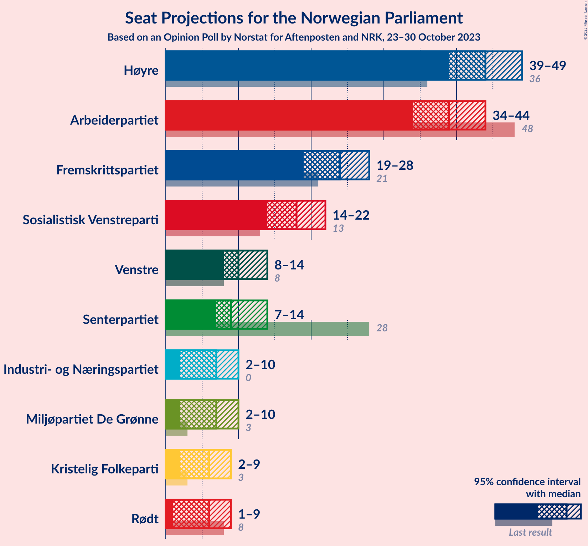

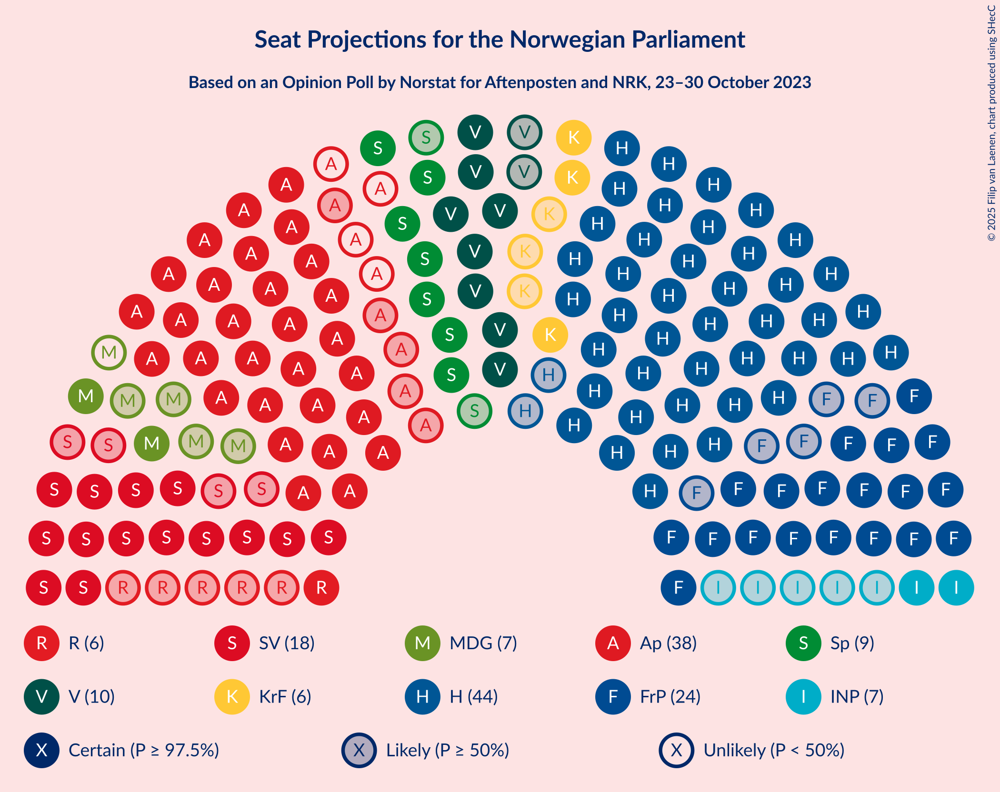

### Confidence Intervals

| Party | Last Result | Median | 80% Confidence Interval | 90% Confidence Interval | 95% Confidence Interval | 99% Confidence Interval |
|:-----:|:-----------:|:------:|:-----------------------:|:-----------------------:|:-----------------------:|:-----------------------:|
| <a href="#høyre">Høyre</a> | 36 | 44 | 40–47 |40–49 |39–49 |38–51 |
| <a href="#arbeiderpartiet">Arbeiderpartiet</a> | 48 | 39 | 36–43 |35–43 |34–44 |33–46 |
| <a href="#fremskrittspartiet">Fremskrittspartiet</a> | 21 | 24 | 20–27 |20–27 |19–28 |18–30 |
| <a href="#sosialistisk-venstreparti">Sosialistisk Venstreparti</a> | 13 | 18 | 15–20 |14–21 |14–22 |13–24 |
| <a href="#venstre">Venstre</a> | 8 | 10 | 8–12 |8–13 |8–14 |7–15 |
| <a href="#senterpartiet">Senterpartiet</a> | 28 | 9 | 7–12 |7–13 |7–14 |1–14 |
| <a href="#miljøpartiet-de-grønne">Miljøpartiet De Grønne</a> | 3 | 7 | 3–9 |3–10 |2–10 |2–11 |
| <a href="#industri--og-næringspartiet">Industri- og Næringspartiet</a> | 0 | 7 | 2–9 |2–9 |2–10 |2–11 |
| <a href="#rødt">Rødt</a> | 8 | 6 | 1–8 |1–9 |1–9 |1–11 |
| <a href="#kristelig-folkeparti">Kristelig Folkeparti</a> | 3 | 6 | 2–8 |2–8 |2–9 |2–10 |

### Høyre

*For a full overview of the results for this party, see the [Høyre](party-høyre.html) page.*

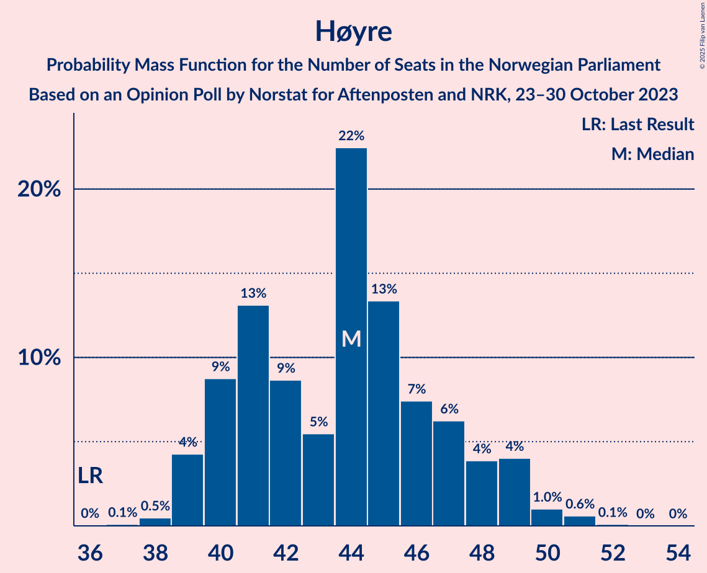

| Number of Seats | Probability | Accumulated | Special Marks |
|:---------------:|:-----------:|:-----------:|:-------------:|
| 36 | 0% | 100% | Last Result |
| 37 | 0.1% | 99.9% |  |
| 38 | 0.5% | 99.8% |  |
| 39 | 4% | 99.4% |  |
| 40 | 9% | 95% |  |
| 41 | 13% | 86% |  |
| 42 | 9% | 73% |  |
| 43 | 5% | 65% |  |
| 44 | 22% | 59% | Median |
| 45 | 13% | 37% |  |
| 46 | 7% | 23% |  |
| 47 | 6% | 16% |  |
| 48 | 4% | 10% |  |
| 49 | 4% | 6% |  |
| 50 | 1.0% | 2% |  |
| 51 | 0.6% | 0.7% |  |
| 52 | 0.1% | 0.1% |  |
| 53 | 0% | 0% |  |

### Arbeiderpartiet

*For a full overview of the results for this party, see the [Arbeiderpartiet](party-arbeiderpartiet.html) page.*

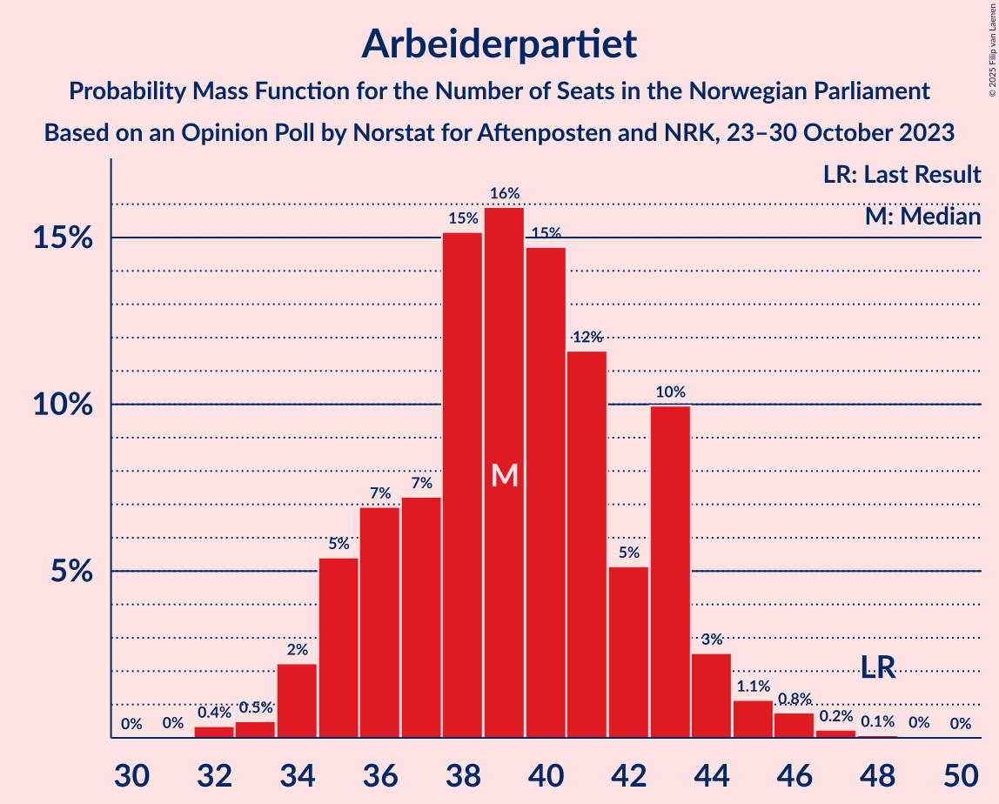

| Number of Seats | Probability | Accumulated | Special Marks |
|:---------------:|:-----------:|:-----------:|:-------------:|
| 32 | 0.4% | 100% |  |
| 33 | 0.5% | 99.6% |  |
| 34 | 2% | 99.1% |  |
| 35 | 5% | 97% |  |
| 36 | 7% | 91% |  |
| 37 | 7% | 85% |  |
| 38 | 15% | 77% |  |
| 39 | 16% | 62% | Median |
| 40 | 15% | 46% |  |
| 41 | 12% | 32% |  |
| 42 | 5% | 20% |  |
| 43 | 10% | 15% |  |
| 44 | 3% | 5% |  |
| 45 | 1.1% | 2% |  |
| 46 | 0.8% | 1.1% |  |
| 47 | 0.2% | 0.4% |  |
| 48 | 0.1% | 0.1% | Last Result |
| 49 | 0% | 0.1% |  |
| 50 | 0% | 0% |  |

### Fremskrittspartiet

*For a full overview of the results for this party, see the [Fremskrittspartiet](party-fremskrittspartiet.html) page.*

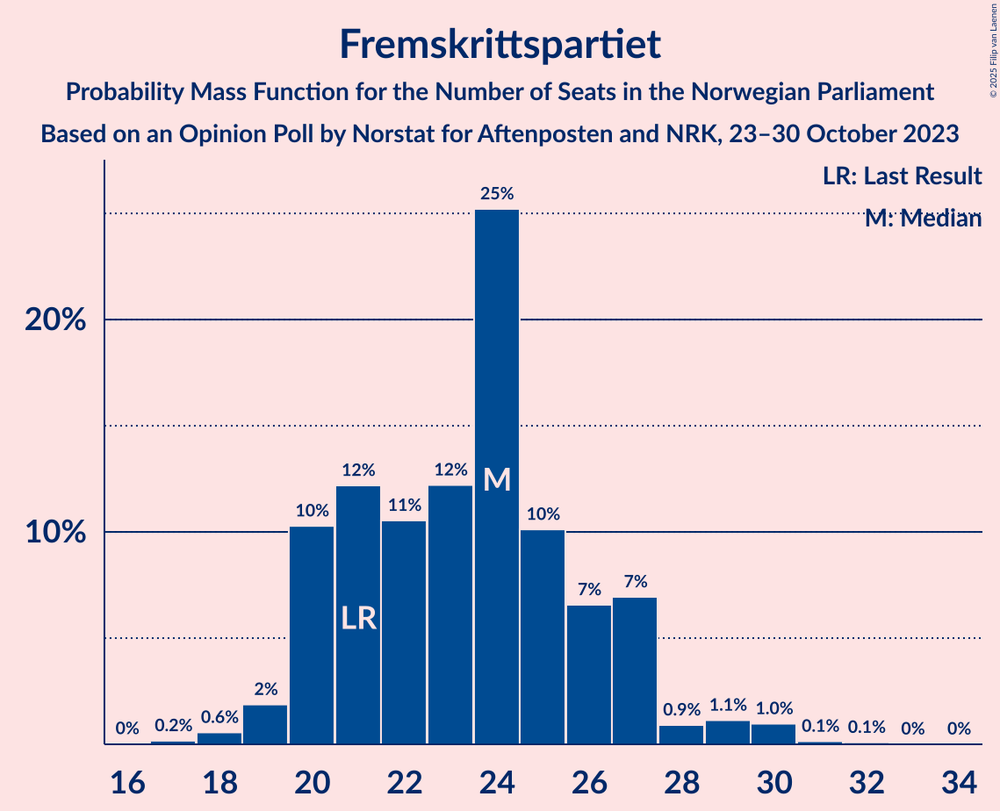

| Number of Seats | Probability | Accumulated | Special Marks |
|:---------------:|:-----------:|:-----------:|:-------------:|
| 17 | 0.2% | 100% |  |
| 18 | 0.6% | 99.8% |  |
| 19 | 2% | 99.2% |  |
| 20 | 10% | 97% |  |
| 21 | 12% | 87% | Last Result |
| 22 | 11% | 75% |  |
| 23 | 12% | 64% |  |
| 24 | 25% | 52% | Median |
| 25 | 10% | 27% |  |
| 26 | 7% | 17% |  |
| 27 | 7% | 10% |  |
| 28 | 0.9% | 3% |  |
| 29 | 1.1% | 2% |  |
| 30 | 1.0% | 1.2% |  |
| 31 | 0.1% | 0.3% |  |
| 32 | 0.1% | 0.1% |  |
| 33 | 0% | 0% |  |

### Sosialistisk Venstreparti

*For a full overview of the results for this party, see the [Sosialistisk Venstreparti](party-sosialistiskvenstreparti.html) page.*

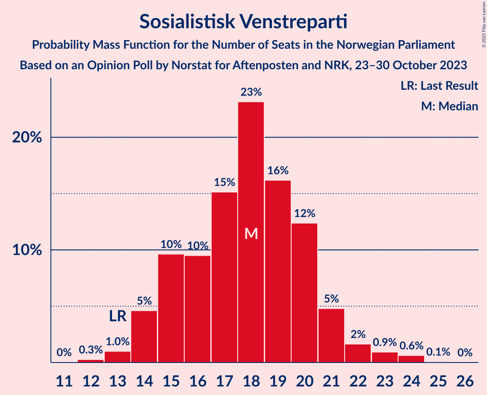

| Number of Seats | Probability | Accumulated | Special Marks |
|:---------------:|:-----------:|:-----------:|:-------------:|
| 12 | 0.3% | 100% |  |
| 13 | 1.0% | 99.7% | Last Result |
| 14 | 5% | 98.7% |  |
| 15 | 10% | 94% |  |
| 16 | 10% | 84% |  |
| 17 | 15% | 75% |  |
| 18 | 23% | 60% | Median |
| 19 | 16% | 37% |  |
| 20 | 12% | 20% |  |
| 21 | 5% | 8% |  |
| 22 | 2% | 3% |  |
| 23 | 0.9% | 2% |  |
| 24 | 0.6% | 0.7% |  |
| 25 | 0.1% | 0.1% |  |
| 26 | 0% | 0% |  |

### Venstre

*For a full overview of the results for this party, see the [Venstre](party-venstre.html) page.*

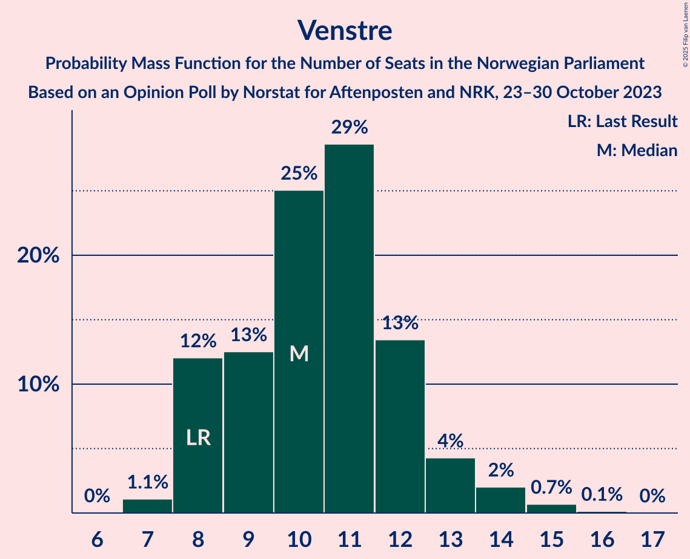

| Number of Seats | Probability | Accumulated | Special Marks |
|:---------------:|:-----------:|:-----------:|:-------------:|
| 7 | 1.1% | 100% |  |
| 8 | 12% | 98.9% | Last Result |
| 9 | 13% | 87% |  |
| 10 | 25% | 74% | Median |
| 11 | 29% | 49% |  |
| 12 | 13% | 21% |  |
| 13 | 4% | 7% |  |
| 14 | 2% | 3% |  |
| 15 | 0.7% | 0.9% |  |
| 16 | 0.1% | 0.2% |  |
| 17 | 0% | 0% |  |

### Senterpartiet

*For a full overview of the results for this party, see the [Senterpartiet](party-senterpartiet.html) page.*

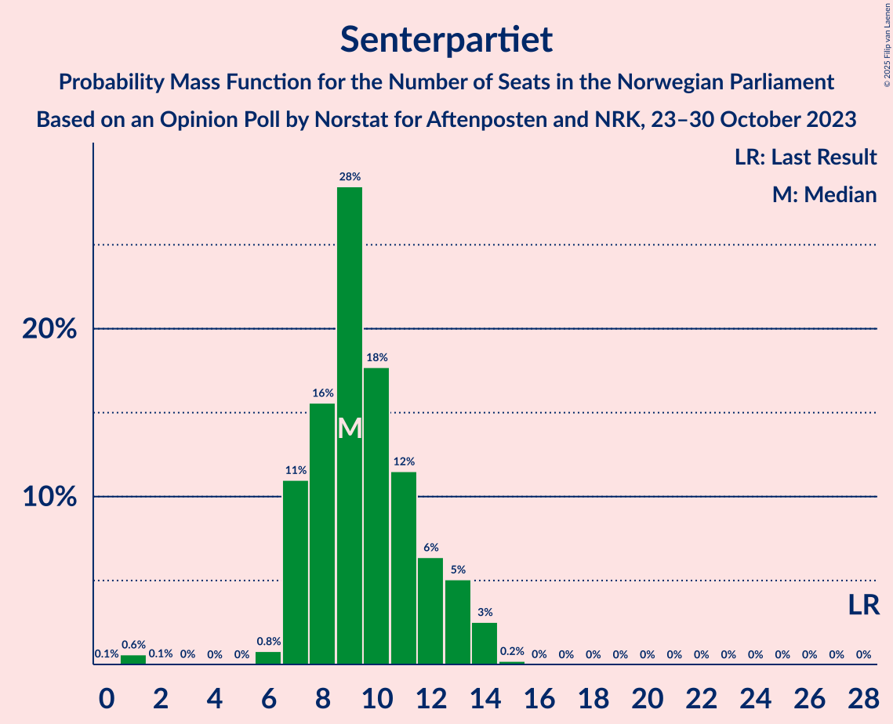

| Number of Seats | Probability | Accumulated | Special Marks |
|:---------------:|:-----------:|:-----------:|:-------------:|
| 0 | 0.1% | 100% |  |
| 1 | 0.6% | 99.9% |  |
| 2 | 0.1% | 99.4% |  |
| 3 | 0% | 99.3% |  |
| 4 | 0% | 99.3% |  |
| 5 | 0% | 99.3% |  |
| 6 | 0.8% | 99.2% |  |
| 7 | 11% | 98% |  |
| 8 | 16% | 87% |  |
| 9 | 28% | 72% | Median |
| 10 | 18% | 43% |  |
| 11 | 12% | 26% |  |
| 12 | 6% | 14% |  |
| 13 | 5% | 8% |  |
| 14 | 3% | 3% |  |
| 15 | 0.2% | 0.2% |  |
| 16 | 0% | 0% |  |
| 17 | 0% | 0% |  |
| 18 | 0% | 0% |  |
| 19 | 0% | 0% |  |
| 20 | 0% | 0% |  |
| 21 | 0% | 0% |  |
| 22 | 0% | 0% |  |
| 23 | 0% | 0% |  |
| 24 | 0% | 0% |  |
| 25 | 0% | 0% |  |
| 26 | 0% | 0% |  |
| 27 | 0% | 0% |  |
| 28 | 0% | 0% | Last Result |

### Miljøpartiet De Grønne

*For a full overview of the results for this party, see the [Miljøpartiet De Grønne](party-miljøpartietdegrønne.html) page.*

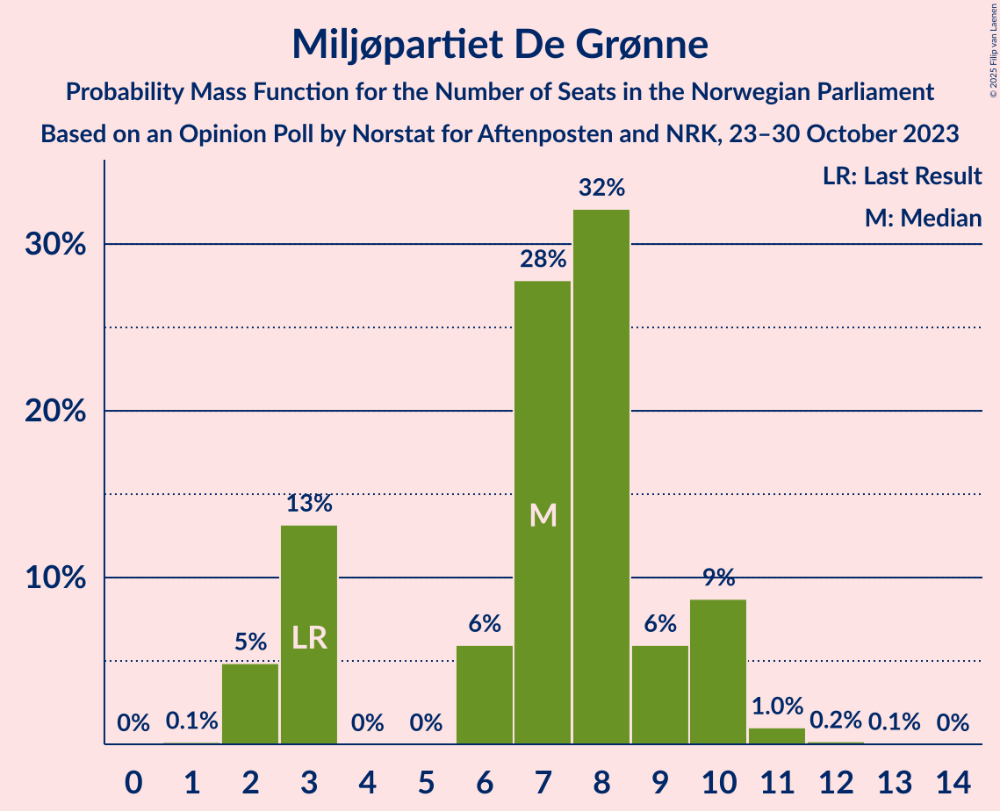

| Number of Seats | Probability | Accumulated | Special Marks |
|:---------------:|:-----------:|:-----------:|:-------------:|
| 1 | 0.1% | 100% |  |
| 2 | 5% | 99.9% |  |
| 3 | 13% | 95% | Last Result |
| 4 | 0% | 82% |  |
| 5 | 0% | 82% |  |
| 6 | 6% | 82% |  |
| 7 | 28% | 76% | Median |
| 8 | 32% | 48% |  |
| 9 | 6% | 16% |  |
| 10 | 9% | 10% |  |
| 11 | 1.0% | 1.3% |  |
| 12 | 0.2% | 0.2% |  |
| 13 | 0.1% | 0.1% |  |
| 14 | 0% | 0% |  |

### Industri- og Næringspartiet

*For a full overview of the results for this party, see the [Industri- og Næringspartiet](party-industri-ognæringspartiet.html) page.*

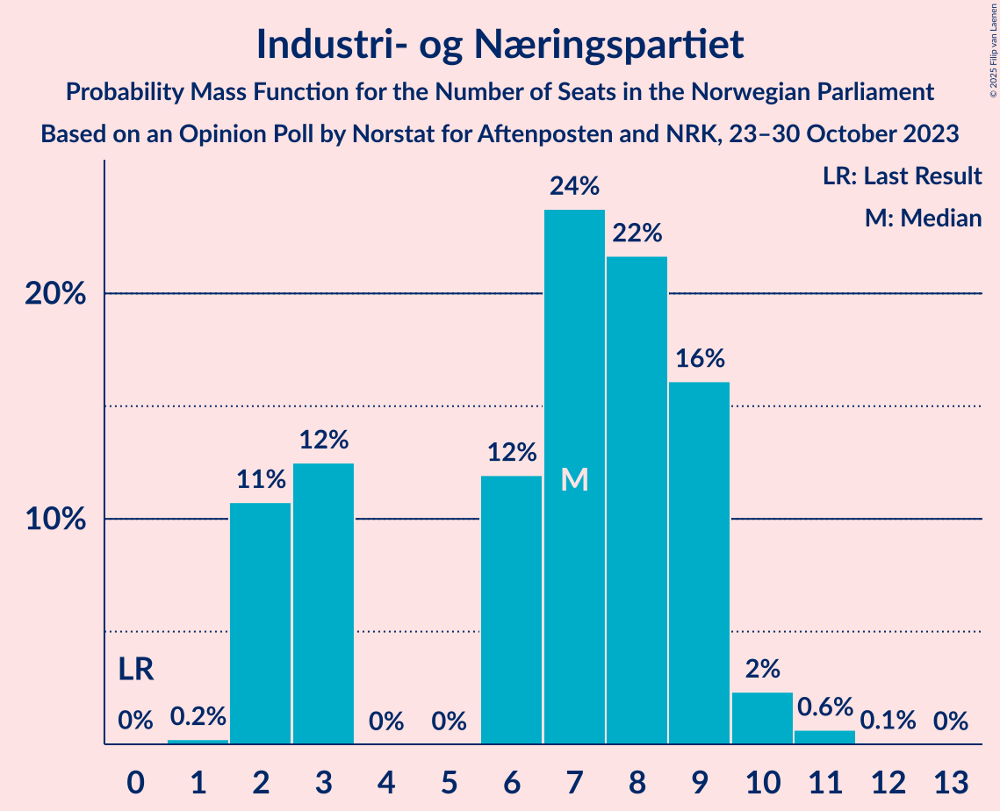

| Number of Seats | Probability | Accumulated | Special Marks |
|:---------------:|:-----------:|:-----------:|:-------------:|
| 0 | 0% | 100% | Last Result |
| 1 | 0.2% | 100% |  |
| 2 | 11% | 99.7% |  |
| 3 | 12% | 89% |  |
| 4 | 0% | 76% |  |
| 5 | 0% | 76% |  |
| 6 | 12% | 76% |  |
| 7 | 24% | 65% | Median |
| 8 | 22% | 41% |  |
| 9 | 16% | 19% |  |
| 10 | 2% | 3% |  |
| 11 | 0.6% | 0.7% |  |
| 12 | 0.1% | 0.1% |  |
| 13 | 0% | 0% |  |

### Rødt

*For a full overview of the results for this party, see the [Rødt](party-rødt.html) page.*

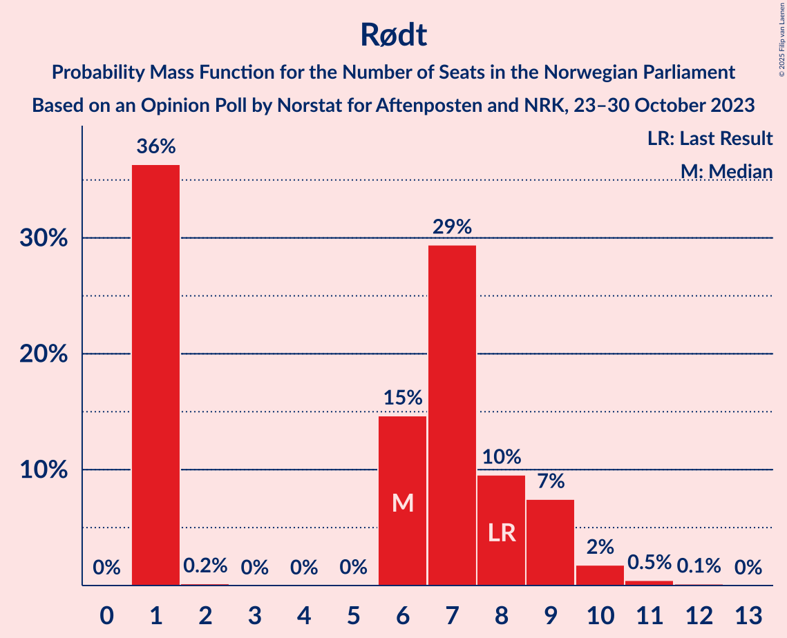

| Number of Seats | Probability | Accumulated | Special Marks |
|:---------------:|:-----------:|:-----------:|:-------------:|
| 1 | 36% | 100% |  |
| 2 | 0.2% | 64% |  |
| 3 | 0% | 63% |  |
| 4 | 0% | 63% |  |
| 5 | 0% | 63% |  |
| 6 | 15% | 63% | Median |
| 7 | 29% | 49% |  |
| 8 | 10% | 19% | Last Result |
| 9 | 7% | 10% |  |
| 10 | 2% | 2% |  |
| 11 | 0.5% | 0.6% |  |
| 12 | 0.1% | 0.1% |  |
| 13 | 0% | 0% |  |

### Kristelig Folkeparti

*For a full overview of the results for this party, see the [Kristelig Folkeparti](party-kristeligfolkeparti.html) page.*

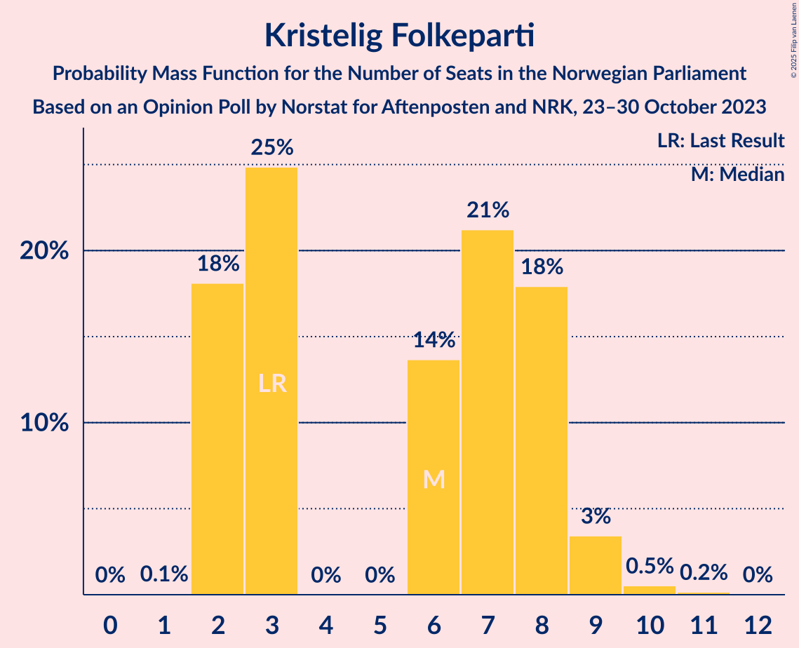

| Number of Seats | Probability | Accumulated | Special Marks |
|:---------------:|:-----------:|:-----------:|:-------------:|
| 1 | 0.1% | 100% |  |
| 2 | 18% | 99.9% |  |
| 3 | 25% | 82% | Last Result |
| 4 | 0% | 57% |  |
| 5 | 0% | 57% |  |
| 6 | 14% | 57% | Median |
| 7 | 21% | 43% |  |
| 8 | 18% | 22% |  |
| 9 | 3% | 4% |  |
| 10 | 0.5% | 0.7% |  |
| 11 | 0.2% | 0.2% |  |
| 12 | 0% | 0% |  |

## Coalitions

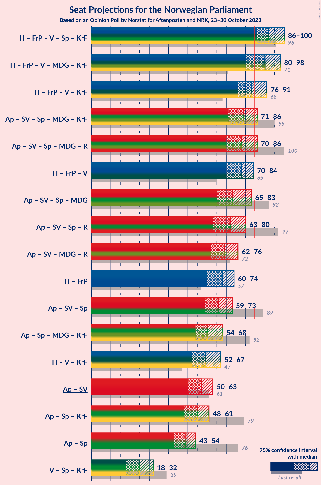

### Confidence Intervals

| Coalition | Last Result | Median | Majority? | 80% Confidence Interval | 90% Confidence Interval | 95% Confidence Interval | 99% Confidence Interval |
|:---------:|:-----------:|:------:|:---------:|:-----------------------:|:-----------------------:|:-----------------------:|:-----------------------:|
| Høyre – Fremskrittspartiet – Venstre – Senterpartiet – Kristelig Folkeparti | 96 | 92 | 98.7% | 87–98 | 86–99 | 86–100 | 82–103 |
| Høyre – Fremskrittspartiet – Venstre – Miljøpartiet De Grønne – Kristelig Folkeparti | 71 | 90 | 86% | 83–95 | 82–97 | 80–98 | 80–101 |
| Høyre – Fremskrittspartiet – Venstre – Kristelig Folkeparti | 68 | 83 | 35% | 77–88 | 76–90 | 76–91 | 73–94 |
| Arbeiderpartiet – Sosialistisk Venstreparti – Senterpartiet – Miljøpartiet De Grønne – Kristelig Folkeparti | 95 | 79 | 10% | 74–84 | 72–86 | 71–86 | 69–89 |
| Arbeiderpartiet – Sosialistisk Venstreparti – Senterpartiet – Miljøpartiet De Grønne – Rødt | 100 | 78 | 8% | 74–84 | 71–86 | 70–86 | 67–90 |
| Høyre – Fremskrittspartiet – Venstre | 65 | 78 | 2% | 72–82 | 71–83 | 70–84 | 69–87 |
| Arbeiderpartiet – Sosialistisk Venstreparti – Senterpartiet – Miljøpartiet De Grønne | 92 | 73 | 0.2% | 69–80 | 67–81 | 65–83 | 64–83 |
| Arbeiderpartiet – Sosialistisk Venstreparti – Senterpartiet – Rødt | 97 | 72 | 0% | 66–77 | 64–79 | 63–80 | 60–82 |
| Arbeiderpartiet – Sosialistisk Venstreparti – Miljøpartiet De Grønne – Rødt | 72 | 69 | 0% | 63–75 | 63–75 | 62–76 | 60–79 |
| Høyre – Fremskrittspartiet | 57 | 68 | 0% | 62–72 | 61–73 | 60–74 | 59–77 |
| Arbeiderpartiet – Sosialistisk Venstreparti – Senterpartiet | 89 | 66 | 0% | 63–73 | 61–73 | 59–73 | 57–75 |
| Arbeiderpartiet – Senterpartiet – Miljøpartiet De Grønne – Kristelig Folkeparti | 82 | 60 | 0% | 57–66 | 55–67 | 54–68 | 51–71 |
| Høyre – Venstre – Kristelig Folkeparti | 47 | 59 | 0% | 54–64 | 54–66 | 52–67 | 52–69 |
| Arbeiderpartiet – Sosialistisk Venstreparti | 61 | 57 | 0% | 53–62 | 52–62 | 50–63 | 49–65 |
| Arbeiderpartiet – Senterpartiet – Kristelig Folkeparti | 79 | 55 | 0% | 50–58 | 49–60 | 48–61 | 45–63 |
| Arbeiderpartiet – Senterpartiet | 76 | 49 | 0% | 45–53 | 44–54 | 43–54 | 40–56 |
| Venstre – Senterpartiet – Kristelig Folkeparti | 39 | 25 | 0% | 21–29 | 19–31 | 18–32 | 18–33 |

### Høyre – Fremskrittspartiet – Venstre – Senterpartiet – Kristelig Folkeparti

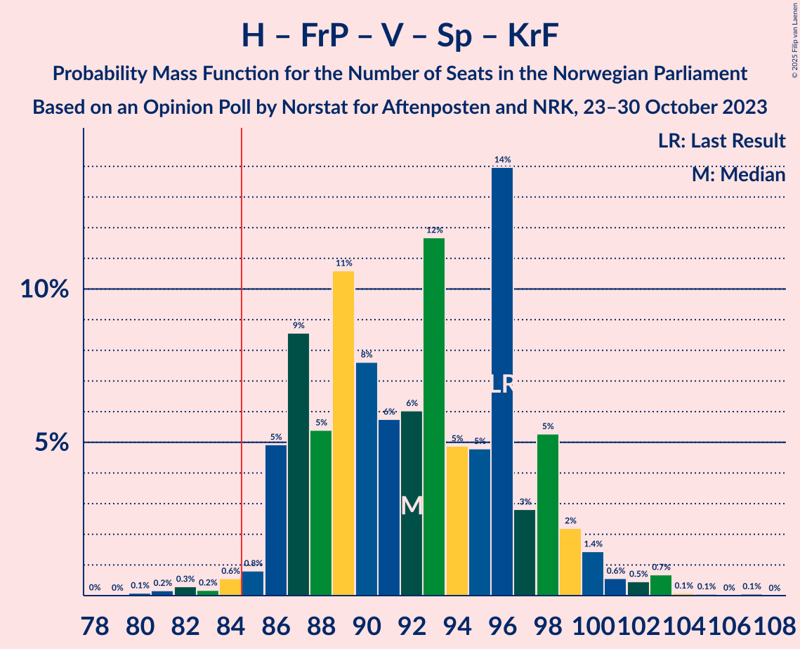

| Number of Seats | Probability | Accumulated | Special Marks |
|:---------------:|:-----------:|:-----------:|:-------------:|
| 80 | 0.1% | 100% |  |
| 81 | 0.2% | 99.9% |  |
| 82 | 0.3% | 99.7% |  |
| 83 | 0.2% | 99.4% |  |
| 84 | 0.6% | 99.2% |  |
| 85 | 0.8% | 98.7% | Majority |
| 86 | 5% | 98% |  |
| 87 | 9% | 93% |  |
| 88 | 5% | 84% |  |
| 89 | 11% | 79% |  |
| 90 | 8% | 68% |  |
| 91 | 6% | 61% |  |
| 92 | 6% | 55% |  |
| 93 | 12% | 49% | Median |
| 94 | 5% | 37% |  |
| 95 | 5% | 32% |  |
| 96 | 14% | 28% | Last Result |
| 97 | 3% | 14% |  |
| 98 | 5% | 11% |  |
| 99 | 2% | 6% |  |
| 100 | 1.4% | 3% |  |
| 101 | 0.6% | 2% |  |
| 102 | 0.5% | 1.4% |  |
| 103 | 0.7% | 0.9% |  |
| 104 | 0.1% | 0.2% |  |
| 105 | 0.1% | 0.1% |  |
| 106 | 0% | 0.1% |  |
| 107 | 0.1% | 0.1% |  |
| 108 | 0% | 0% |  |

### Høyre – Fremskrittspartiet – Venstre – Miljøpartiet De Grønne – Kristelig Folkeparti

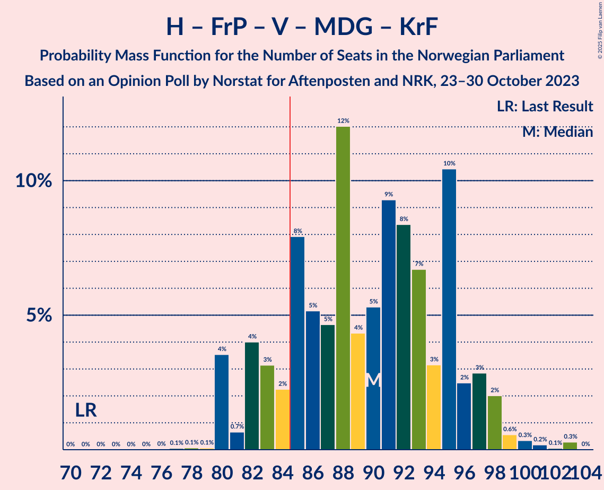

| Number of Seats | Probability | Accumulated | Special Marks |
|:---------------:|:-----------:|:-----------:|:-------------:|
| 71 | 0% | 100% | Last Result |
| 72 | 0% | 100% |  |
| 73 | 0% | 100% |  |
| 74 | 0% | 100% |  |
| 75 | 0% | 100% |  |
| 76 | 0% | 100% |  |
| 77 | 0.1% | 100% |  |
| 78 | 0.1% | 99.9% |  |
| 79 | 0.1% | 99.8% |  |
| 80 | 4% | 99.8% |  |
| 81 | 0.7% | 96% |  |
| 82 | 4% | 96% |  |
| 83 | 3% | 92% |  |
| 84 | 2% | 88% |  |
| 85 | 8% | 86% | Majority |
| 86 | 5% | 78% |  |
| 87 | 5% | 73% |  |
| 88 | 12% | 68% |  |
| 89 | 4% | 56% |  |
| 90 | 5% | 52% |  |
| 91 | 9% | 47% | Median |
| 92 | 8% | 37% |  |
| 93 | 7% | 29% |  |
| 94 | 3% | 22% |  |
| 95 | 10% | 19% |  |
| 96 | 2% | 9% |  |
| 97 | 3% | 6% |  |
| 98 | 2% | 3% |  |
| 99 | 0.6% | 1.5% |  |
| 100 | 0.3% | 0.9% |  |
| 101 | 0.2% | 0.5% |  |
| 102 | 0.1% | 0.4% |  |
| 103 | 0.3% | 0.3% |  |
| 104 | 0% | 0% |  |

### Høyre – Fremskrittspartiet – Venstre – Kristelig Folkeparti

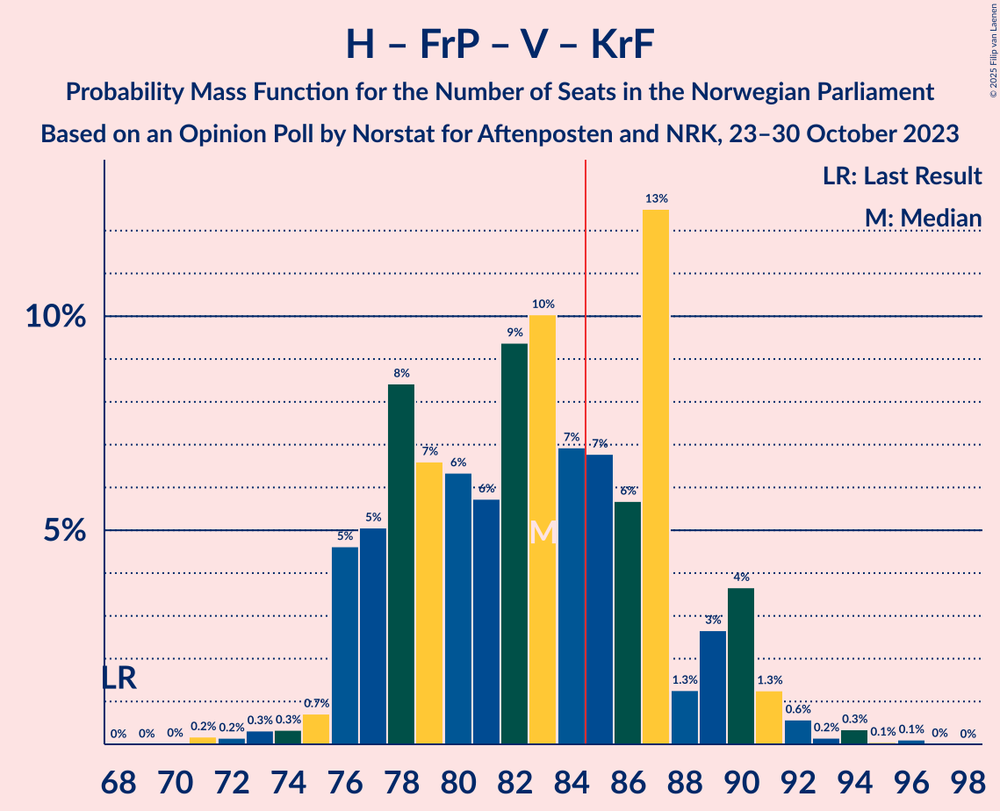

| Number of Seats | Probability | Accumulated | Special Marks |
|:---------------:|:-----------:|:-----------:|:-------------:|
| 68 | 0% | 100% | Last Result |
| 69 | 0% | 100% |  |
| 70 | 0% | 100% |  |
| 71 | 0.2% | 100% |  |
| 72 | 0.2% | 99.8% |  |
| 73 | 0.3% | 99.6% |  |
| 74 | 0.3% | 99.3% |  |
| 75 | 0.7% | 99.0% |  |
| 76 | 5% | 98% |  |
| 77 | 5% | 94% |  |
| 78 | 8% | 89% |  |
| 79 | 7% | 80% |  |
| 80 | 6% | 74% |  |
| 81 | 6% | 67% |  |
| 82 | 9% | 61% |  |
| 83 | 10% | 52% |  |
| 84 | 7% | 42% | Median |
| 85 | 7% | 35% | Majority |
| 86 | 6% | 28% |  |
| 87 | 13% | 23% |  |
| 88 | 1.3% | 10% |  |
| 89 | 3% | 9% |  |
| 90 | 4% | 6% |  |
| 91 | 1.3% | 3% |  |
| 92 | 0.6% | 1.3% |  |
| 93 | 0.2% | 0.7% |  |
| 94 | 0.3% | 0.5% |  |
| 95 | 0.1% | 0.2% |  |
| 96 | 0.1% | 0.1% |  |
| 97 | 0% | 0% |  |

### Arbeiderpartiet – Sosialistisk Venstreparti – Senterpartiet – Miljøpartiet De Grønne – Kristelig Folkeparti

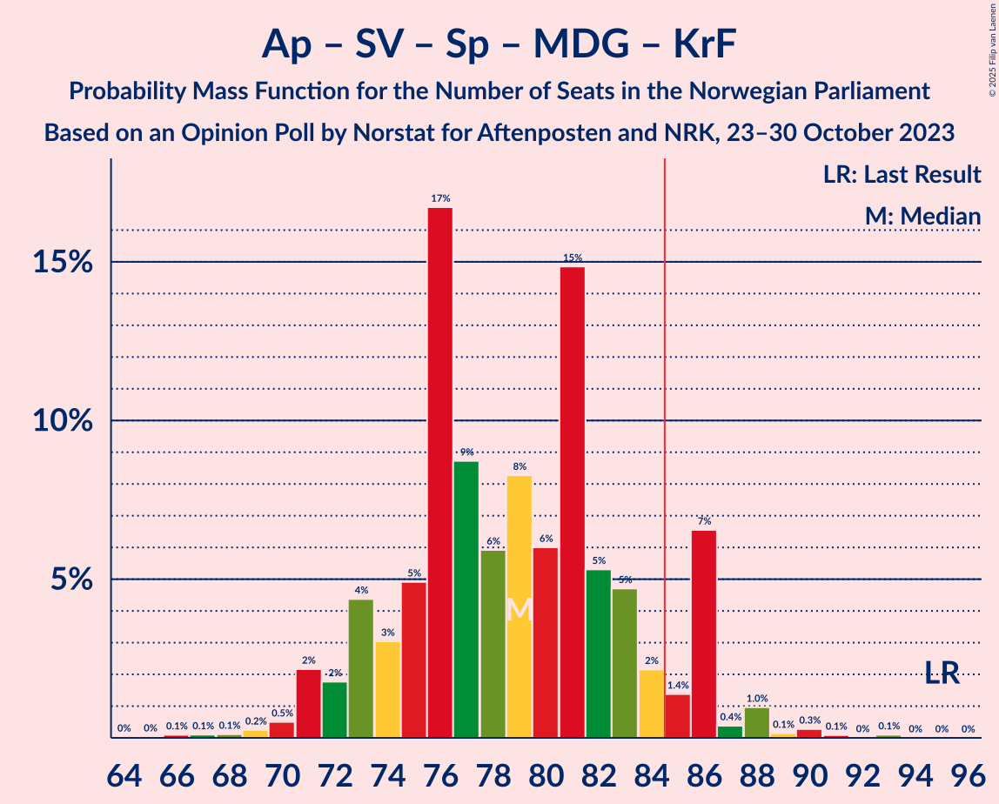

| Number of Seats | Probability | Accumulated | Special Marks |
|:---------------:|:-----------:|:-----------:|:-------------:|
| 65 | 0% | 100% |  |
| 66 | 0.1% | 99.9% |  |
| 67 | 0.1% | 99.8% |  |
| 68 | 0.1% | 99.7% |  |
| 69 | 0.2% | 99.6% |  |
| 70 | 0.5% | 99.4% |  |
| 71 | 2% | 98.9% |  |
| 72 | 2% | 97% |  |
| 73 | 4% | 95% |  |
| 74 | 3% | 91% |  |
| 75 | 5% | 88% |  |
| 76 | 17% | 83% |  |
| 77 | 9% | 66% |  |
| 78 | 6% | 57% |  |
| 79 | 8% | 51% | Median |
| 80 | 6% | 43% |  |
| 81 | 15% | 37% |  |
| 82 | 5% | 22% |  |
| 83 | 5% | 17% |  |
| 84 | 2% | 12% |  |
| 85 | 1.4% | 10% | Majority |
| 86 | 7% | 9% |  |
| 87 | 0.4% | 2% |  |
| 88 | 1.0% | 2% |  |
| 89 | 0.1% | 0.6% |  |
| 90 | 0.3% | 0.5% |  |
| 91 | 0.1% | 0.2% |  |
| 92 | 0% | 0.1% |  |
| 93 | 0.1% | 0.1% |  |
| 94 | 0% | 0% |  |
| 95 | 0% | 0% | Last Result |

### Arbeiderpartiet – Sosialistisk Venstreparti – Senterpartiet – Miljøpartiet De Grønne – Rødt

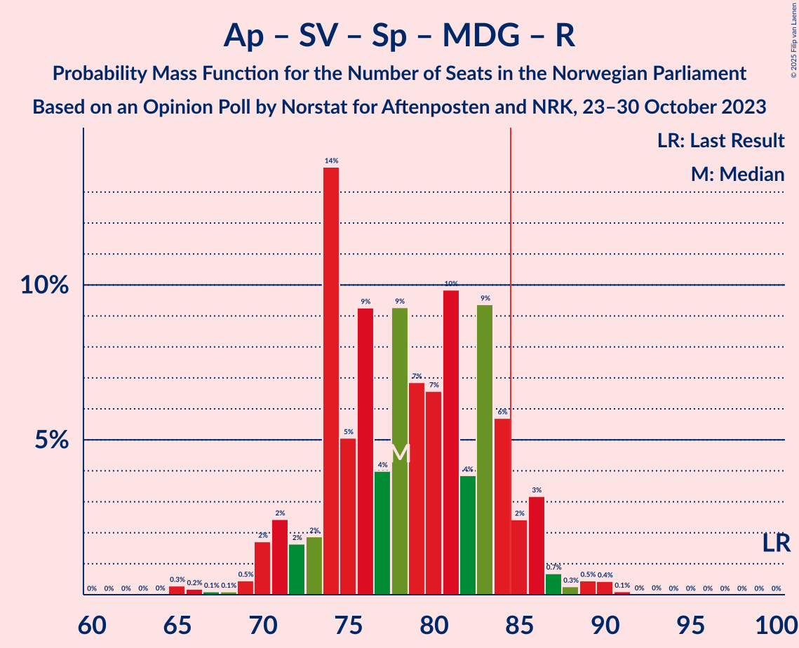

| Number of Seats | Probability | Accumulated | Special Marks |
|:---------------:|:-----------:|:-----------:|:-------------:|
| 65 | 0.3% | 100% |  |
| 66 | 0.2% | 99.7% |  |
| 67 | 0.1% | 99.5% |  |
| 68 | 0.1% | 99.4% |  |
| 69 | 0.5% | 99.3% |  |
| 70 | 2% | 98.9% |  |
| 71 | 2% | 97% |  |
| 72 | 2% | 95% |  |
| 73 | 2% | 93% |  |
| 74 | 14% | 91% |  |
| 75 | 5% | 77% |  |
| 76 | 9% | 72% |  |
| 77 | 4% | 63% |  |
| 78 | 9% | 59% |  |
| 79 | 7% | 50% | Median |
| 80 | 7% | 43% |  |
| 81 | 10% | 36% |  |
| 82 | 4% | 27% |  |
| 83 | 9% | 23% |  |
| 84 | 6% | 13% |  |
| 85 | 2% | 8% | Majority |
| 86 | 3% | 5% |  |
| 87 | 0.7% | 2% |  |
| 88 | 0.3% | 1.3% |  |
| 89 | 0.5% | 1.0% |  |
| 90 | 0.4% | 0.6% |  |
| 91 | 0.1% | 0.1% |  |
| 92 | 0% | 0% |  |
| 93 | 0% | 0% |  |
| 94 | 0% | 0% |  |
| 95 | 0% | 0% |  |
| 96 | 0% | 0% |  |
| 97 | 0% | 0% |  |
| 98 | 0% | 0% |  |
| 99 | 0% | 0% |  |
| 100 | 0% | 0% | Last Result |

### Høyre – Fremskrittspartiet – Venstre

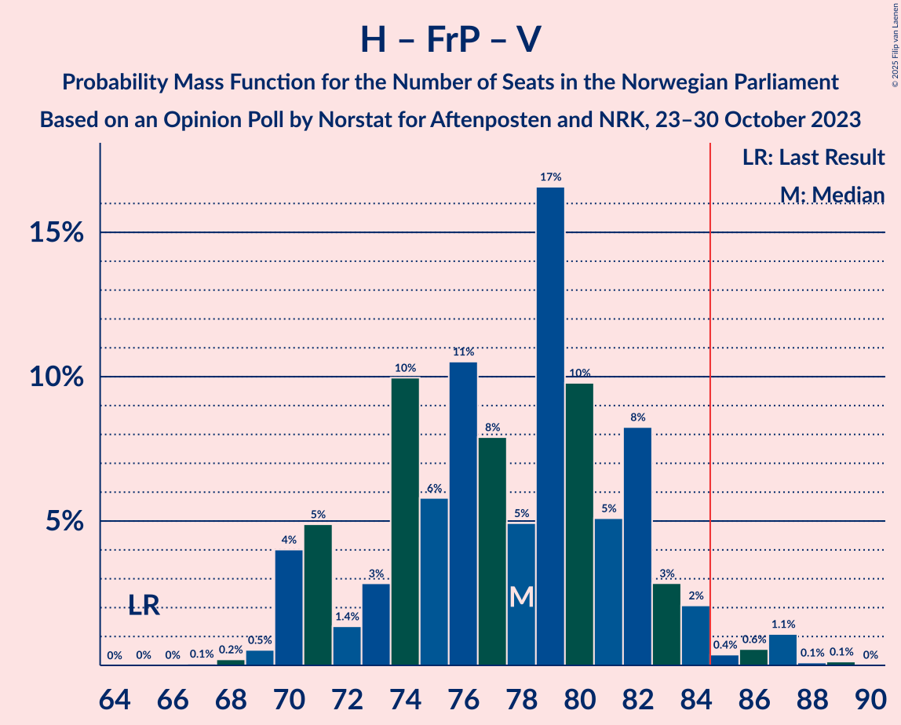

| Number of Seats | Probability | Accumulated | Special Marks |
|:---------------:|:-----------:|:-----------:|:-------------:|
| 65 | 0% | 100% | Last Result |
| 66 | 0% | 100% |  |
| 67 | 0.1% | 100% |  |
| 68 | 0.2% | 99.9% |  |
| 69 | 0.5% | 99.7% |  |
| 70 | 4% | 99.2% |  |
| 71 | 5% | 95% |  |
| 72 | 1.4% | 90% |  |
| 73 | 3% | 89% |  |
| 74 | 10% | 86% |  |
| 75 | 6% | 76% |  |
| 76 | 11% | 70% |  |
| 77 | 8% | 60% |  |
| 78 | 5% | 52% | Median |
| 79 | 17% | 47% |  |
| 80 | 10% | 30% |  |
| 81 | 5% | 21% |  |
| 82 | 8% | 15% |  |
| 83 | 3% | 7% |  |
| 84 | 2% | 4% |  |
| 85 | 0.4% | 2% | Majority |
| 86 | 0.6% | 2% |  |
| 87 | 1.1% | 1.4% |  |
| 88 | 0.1% | 0.3% |  |
| 89 | 0.1% | 0.2% |  |
| 90 | 0% | 0% |  |

### Arbeiderpartiet – Sosialistisk Venstreparti – Senterpartiet – Miljøpartiet De Grønne

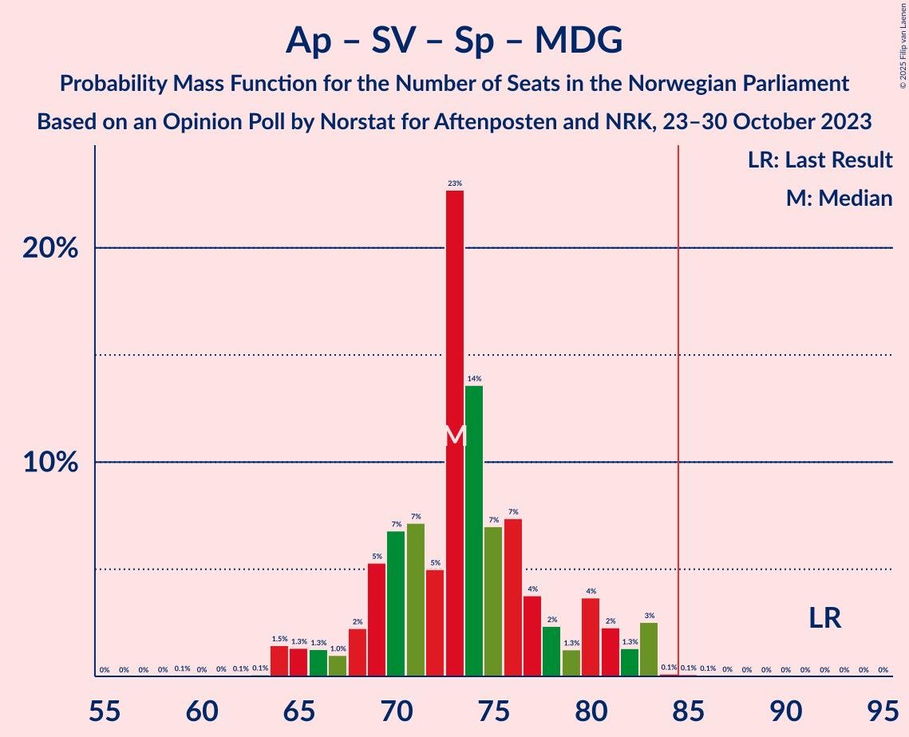

| Number of Seats | Probability | Accumulated | Special Marks |
|:---------------:|:-----------:|:-----------:|:-------------:|
| 59 | 0.1% | 100% |  |
| 60 | 0% | 99.9% |  |
| 61 | 0% | 99.9% |  |
| 62 | 0.1% | 99.9% |  |
| 63 | 0.1% | 99.8% |  |
| 64 | 1.5% | 99.7% |  |
| 65 | 1.3% | 98% |  |
| 66 | 1.3% | 97% |  |
| 67 | 1.0% | 96% |  |
| 68 | 2% | 95% |  |
| 69 | 5% | 92% |  |
| 70 | 7% | 87% |  |
| 71 | 7% | 80% |  |
| 72 | 5% | 73% |  |
| 73 | 23% | 68% | Median |
| 74 | 14% | 45% |  |
| 75 | 7% | 32% |  |
| 76 | 7% | 25% |  |
| 77 | 4% | 18% |  |
| 78 | 2% | 14% |  |
| 79 | 1.3% | 11% |  |
| 80 | 4% | 10% |  |
| 81 | 2% | 6% |  |
| 82 | 1.3% | 4% |  |
| 83 | 3% | 3% |  |
| 84 | 0.1% | 0.3% |  |
| 85 | 0.1% | 0.2% | Majority |
| 86 | 0.1% | 0.1% |  |
| 87 | 0% | 0% |  |
| 88 | 0% | 0% |  |
| 89 | 0% | 0% |  |
| 90 | 0% | 0% |  |
| 91 | 0% | 0% |  |
| 92 | 0% | 0% | Last Result |

### Arbeiderpartiet – Sosialistisk Venstreparti – Senterpartiet – Rødt

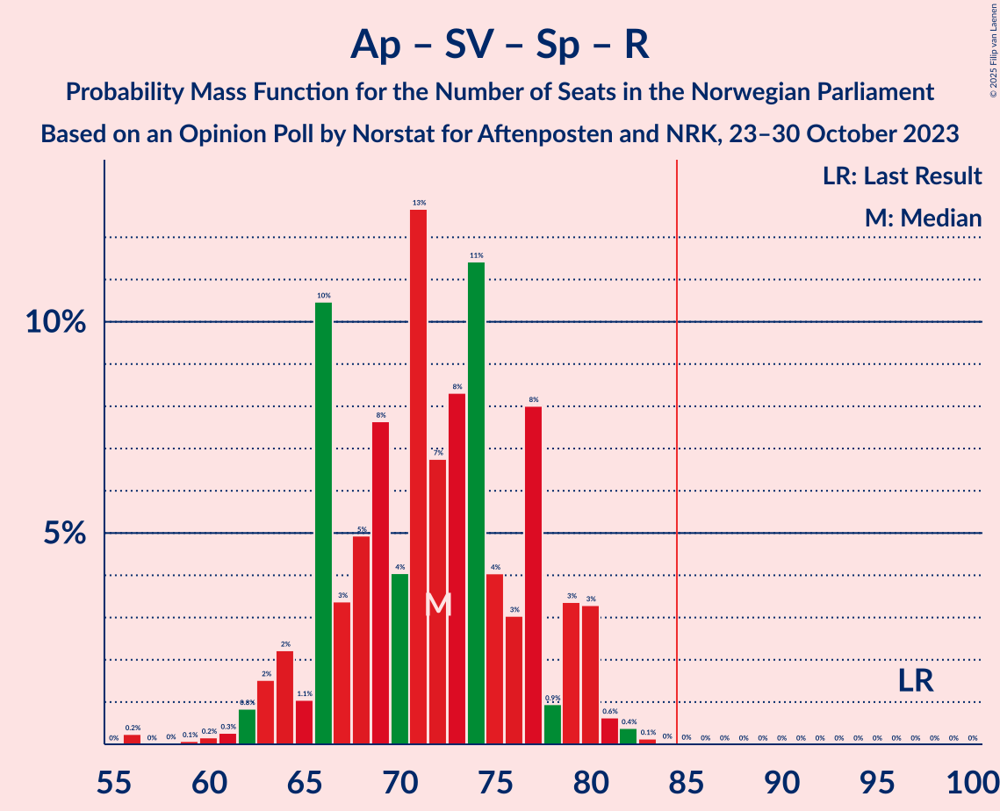

| Number of Seats | Probability | Accumulated | Special Marks |
|:---------------:|:-----------:|:-----------:|:-------------:|
| 56 | 0.2% | 100% |  |
| 57 | 0% | 99.8% |  |
| 58 | 0% | 99.7% |  |
| 59 | 0.1% | 99.7% |  |
| 60 | 0.2% | 99.6% |  |
| 61 | 0.3% | 99.5% |  |
| 62 | 0.8% | 99.2% |  |
| 63 | 2% | 98% |  |
| 64 | 2% | 97% |  |
| 65 | 1.1% | 95% |  |
| 66 | 10% | 94% |  |
| 67 | 3% | 83% |  |
| 68 | 5% | 80% |  |
| 69 | 8% | 75% |  |
| 70 | 4% | 67% |  |
| 71 | 13% | 63% |  |
| 72 | 7% | 50% | Median |
| 73 | 8% | 44% |  |
| 74 | 11% | 35% |  |
| 75 | 4% | 24% |  |
| 76 | 3% | 20% |  |
| 77 | 8% | 17% |  |
| 78 | 0.9% | 9% |  |
| 79 | 3% | 8% |  |
| 80 | 3% | 5% |  |
| 81 | 0.6% | 1.2% |  |
| 82 | 0.4% | 0.6% |  |
| 83 | 0.1% | 0.2% |  |
| 84 | 0% | 0.1% |  |
| 85 | 0% | 0% | Majority |
| 86 | 0% | 0% |  |
| 87 | 0% | 0% |  |
| 88 | 0% | 0% |  |
| 89 | 0% | 0% |  |
| 90 | 0% | 0% |  |
| 91 | 0% | 0% |  |
| 92 | 0% | 0% |  |
| 93 | 0% | 0% |  |
| 94 | 0% | 0% |  |
| 95 | 0% | 0% |  |
| 96 | 0% | 0% |  |
| 97 | 0% | 0% | Last Result |

### Arbeiderpartiet – Sosialistisk Venstreparti – Miljøpartiet De Grønne – Rødt

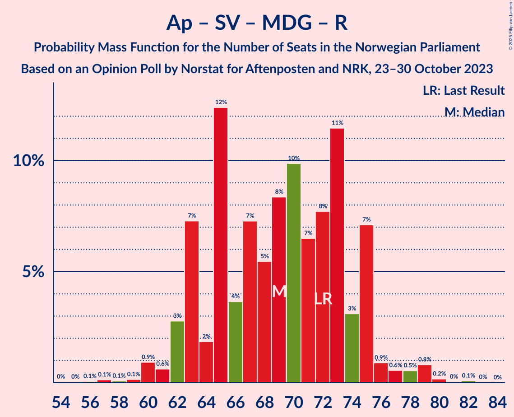

| Number of Seats | Probability | Accumulated | Special Marks |
|:---------------:|:-----------:|:-----------:|:-------------:|
| 55 | 0% | 100% |  |
| 56 | 0.1% | 99.9% |  |
| 57 | 0.1% | 99.9% |  |
| 58 | 0.1% | 99.7% |  |
| 59 | 0.1% | 99.7% |  |
| 60 | 0.9% | 99.5% |  |
| 61 | 0.6% | 98.6% |  |
| 62 | 3% | 98% |  |
| 63 | 7% | 95% |  |
| 64 | 2% | 88% |  |
| 65 | 12% | 86% |  |
| 66 | 4% | 74% |  |
| 67 | 7% | 70% |  |
| 68 | 5% | 63% |  |
| 69 | 8% | 57% |  |
| 70 | 10% | 49% | Median |
| 71 | 7% | 39% |  |
| 72 | 8% | 33% | Last Result |
| 73 | 11% | 25% |  |
| 74 | 3% | 13% |  |
| 75 | 7% | 10% |  |
| 76 | 0.9% | 3% |  |
| 77 | 0.6% | 2% |  |
| 78 | 0.5% | 2% |  |
| 79 | 0.8% | 1.1% |  |
| 80 | 0.2% | 0.3% |  |
| 81 | 0% | 0.2% |  |
| 82 | 0.1% | 0.1% |  |
| 83 | 0% | 0% |  |

### Høyre – Fremskrittspartiet

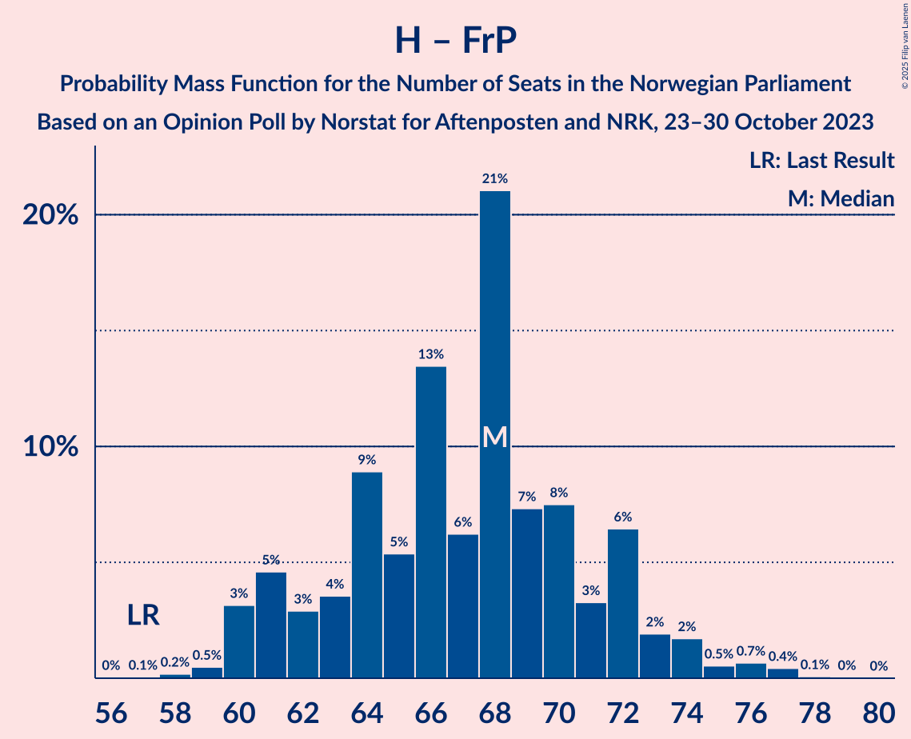

| Number of Seats | Probability | Accumulated | Special Marks |
|:---------------:|:-----------:|:-----------:|:-------------:|
| 57 | 0.1% | 100% | Last Result |
| 58 | 0.2% | 99.9% |  |
| 59 | 0.5% | 99.7% |  |
| 60 | 3% | 99.2% |  |
| 61 | 5% | 96% |  |
| 62 | 3% | 91% |  |
| 63 | 4% | 89% |  |
| 64 | 9% | 85% |  |
| 65 | 5% | 76% |  |
| 66 | 13% | 71% |  |
| 67 | 6% | 57% |  |
| 68 | 21% | 51% | Median |
| 69 | 7% | 30% |  |
| 70 | 8% | 23% |  |
| 71 | 3% | 15% |  |
| 72 | 6% | 12% |  |
| 73 | 2% | 5% |  |
| 74 | 2% | 4% |  |
| 75 | 0.5% | 2% |  |
| 76 | 0.7% | 1.2% |  |
| 77 | 0.4% | 0.6% |  |
| 78 | 0.1% | 0.1% |  |
| 79 | 0% | 0.1% |  |
| 80 | 0% | 0% |  |

### Arbeiderpartiet – Sosialistisk Venstreparti – Senterpartiet

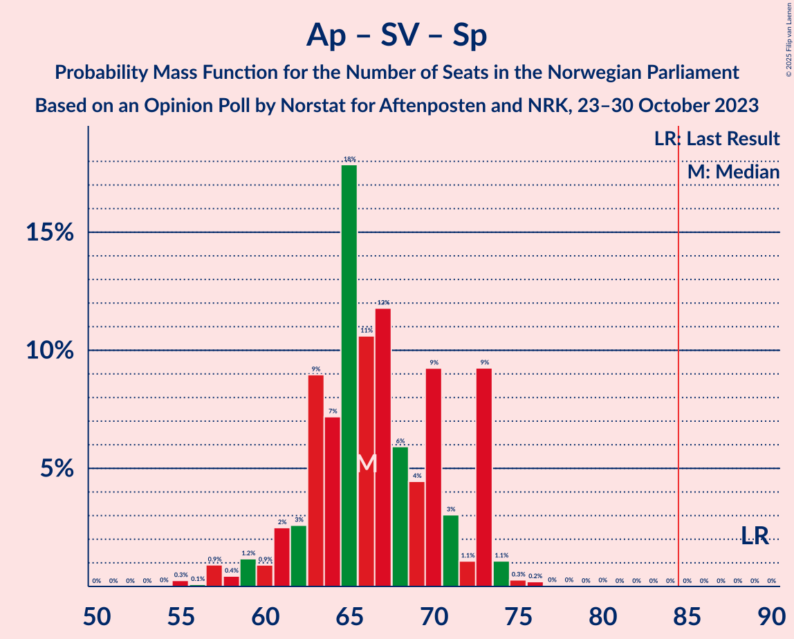

| Number of Seats | Probability | Accumulated | Special Marks |
|:---------------:|:-----------:|:-----------:|:-------------:|
| 55 | 0.3% | 100% |  |
| 56 | 0.1% | 99.7% |  |
| 57 | 0.9% | 99.6% |  |
| 58 | 0.4% | 98.7% |  |
| 59 | 1.2% | 98% |  |
| 60 | 0.9% | 97% |  |
| 61 | 2% | 96% |  |
| 62 | 3% | 94% |  |
| 63 | 9% | 91% |  |
| 64 | 7% | 82% |  |
| 65 | 18% | 75% |  |
| 66 | 11% | 57% | Median |
| 67 | 12% | 46% |  |
| 68 | 6% | 35% |  |
| 69 | 4% | 29% |  |
| 70 | 9% | 24% |  |
| 71 | 3% | 15% |  |
| 72 | 1.1% | 12% |  |
| 73 | 9% | 11% |  |
| 74 | 1.1% | 2% |  |
| 75 | 0.3% | 0.6% |  |
| 76 | 0.2% | 0.3% |  |
| 77 | 0% | 0.1% |  |
| 78 | 0% | 0.1% |  |
| 79 | 0% | 0% |  |
| 80 | 0% | 0% |  |
| 81 | 0% | 0% |  |
| 82 | 0% | 0% |  |
| 83 | 0% | 0% |  |
| 84 | 0% | 0% |  |
| 85 | 0% | 0% | Majority |
| 86 | 0% | 0% |  |
| 87 | 0% | 0% |  |
| 88 | 0% | 0% |  |
| 89 | 0% | 0% | Last Result |

### Arbeiderpartiet – Senterpartiet – Miljøpartiet De Grønne – Kristelig Folkeparti

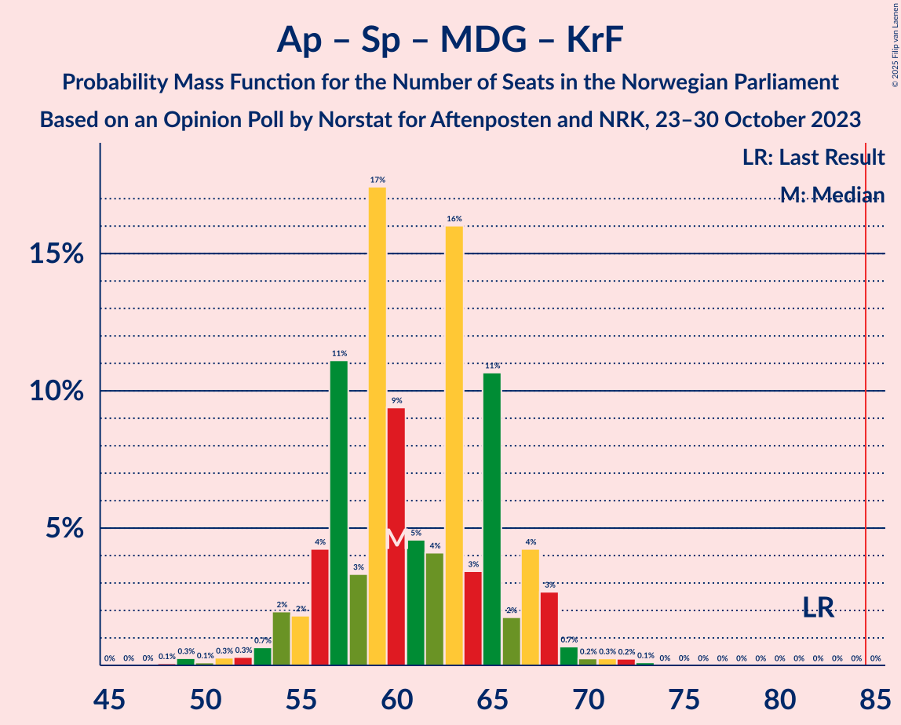

| Number of Seats | Probability | Accumulated | Special Marks |
|:---------------:|:-----------:|:-----------:|:-------------:|
| 48 | 0.1% | 100% |  |
| 49 | 0.3% | 99.9% |  |
| 50 | 0.1% | 99.6% |  |
| 51 | 0.3% | 99.5% |  |
| 52 | 0.3% | 99.2% |  |
| 53 | 0.7% | 98.9% |  |
| 54 | 2% | 98% |  |
| 55 | 2% | 96% |  |
| 56 | 4% | 95% |  |
| 57 | 11% | 90% |  |
| 58 | 3% | 79% |  |
| 59 | 17% | 76% |  |
| 60 | 9% | 58% |  |
| 61 | 5% | 49% | Median |
| 62 | 4% | 44% |  |
| 63 | 16% | 40% |  |
| 64 | 3% | 24% |  |
| 65 | 11% | 21% |  |
| 66 | 2% | 10% |  |
| 67 | 4% | 8% |  |
| 68 | 3% | 4% |  |
| 69 | 0.7% | 2% |  |
| 70 | 0.2% | 0.9% |  |
| 71 | 0.3% | 0.6% |  |
| 72 | 0.2% | 0.4% |  |
| 73 | 0.1% | 0.1% |  |
| 74 | 0% | 0% |  |
| 75 | 0% | 0% |  |
| 76 | 0% | 0% |  |
| 77 | 0% | 0% |  |
| 78 | 0% | 0% |  |
| 79 | 0% | 0% |  |
| 80 | 0% | 0% |  |
| 81 | 0% | 0% |  |
| 82 | 0% | 0% | Last Result |

### Høyre – Venstre – Kristelig Folkeparti

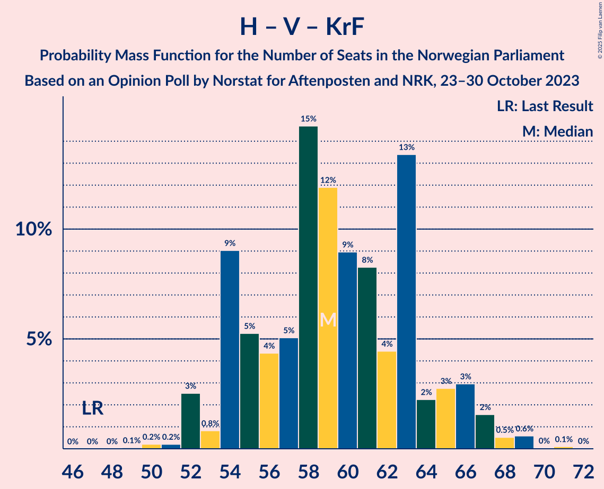

| Number of Seats | Probability | Accumulated | Special Marks |
|:---------------:|:-----------:|:-----------:|:-------------:|
| 47 | 0% | 100% | Last Result |
| 48 | 0% | 100% |  |
| 49 | 0.1% | 100% |  |
| 50 | 0.2% | 99.9% |  |
| 51 | 0.2% | 99.7% |  |
| 52 | 3% | 99.5% |  |
| 53 | 0.8% | 97% |  |
| 54 | 9% | 96% |  |
| 55 | 5% | 87% |  |
| 56 | 4% | 82% |  |
| 57 | 5% | 78% |  |
| 58 | 15% | 72% |  |
| 59 | 12% | 58% |  |
| 60 | 9% | 46% | Median |
| 61 | 8% | 37% |  |
| 62 | 4% | 29% |  |
| 63 | 13% | 24% |  |
| 64 | 2% | 11% |  |
| 65 | 3% | 9% |  |
| 66 | 3% | 6% |  |
| 67 | 2% | 3% |  |
| 68 | 0.5% | 1.3% |  |
| 69 | 0.6% | 0.8% |  |
| 70 | 0% | 0.2% |  |
| 71 | 0.1% | 0.1% |  |
| 72 | 0% | 0% |  |

### Arbeiderpartiet – Sosialistisk Venstreparti

| Number of Seats | Probability | Accumulated | Special Marks |
|:---------------:|:-----------:|:-----------:|:-------------:|
| 48 | 0.2% | 100% |  |
| 49 | 1.4% | 99.8% |  |
| 50 | 1.2% | 98% |  |
| 51 | 1.1% | 97% |  |
| 52 | 2% | 96% |  |
| 53 | 8% | 94% |  |
| 54 | 7% | 86% |  |
| 55 | 5% | 79% |  |
| 56 | 19% | 74% |  |
| 57 | 8% | 55% | Median |
| 58 | 14% | 46% |  |
| 59 | 10% | 33% |  |
| 60 | 7% | 23% |  |
| 61 | 5% | 16% | Last Result |
| 62 | 7% | 11% |  |
| 63 | 1.3% | 4% |  |
| 64 | 1.3% | 2% |  |
| 65 | 0.6% | 0.9% |  |
| 66 | 0.2% | 0.3% |  |
| 67 | 0.1% | 0.2% |  |
| 68 | 0% | 0.1% |  |
| 69 | 0% | 0% |  |

### Arbeiderpartiet – Senterpartiet – Kristelig Folkeparti

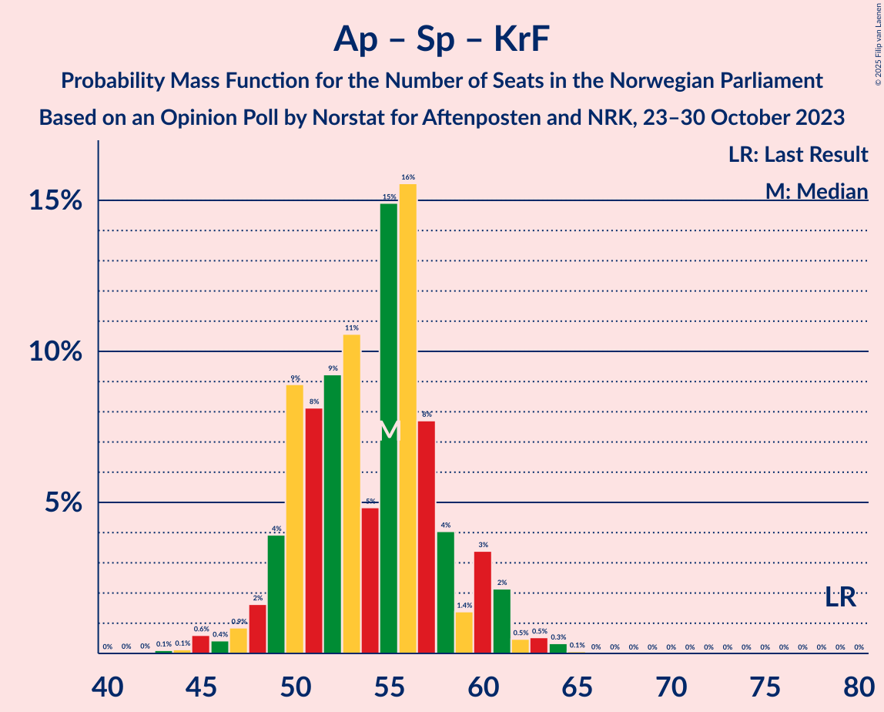

| Number of Seats | Probability | Accumulated | Special Marks |
|:---------------:|:-----------:|:-----------:|:-------------:|
| 42 | 0% | 100% |  |
| 43 | 0.1% | 99.9% |  |
| 44 | 0.1% | 99.8% |  |
| 45 | 0.6% | 99.7% |  |
| 46 | 0.4% | 99.1% |  |
| 47 | 0.9% | 98.7% |  |
| 48 | 2% | 98% |  |
| 49 | 4% | 96% |  |
| 50 | 9% | 92% |  |
| 51 | 8% | 83% |  |
| 52 | 9% | 75% |  |
| 53 | 11% | 66% |  |
| 54 | 5% | 55% | Median |
| 55 | 15% | 51% |  |
| 56 | 16% | 36% |  |
| 57 | 8% | 20% |  |
| 58 | 4% | 12% |  |
| 59 | 1.4% | 8% |  |
| 60 | 3% | 7% |  |
| 61 | 2% | 4% |  |
| 62 | 0.5% | 1.4% |  |
| 63 | 0.5% | 1.0% |  |
| 64 | 0.3% | 0.4% |  |
| 65 | 0.1% | 0.1% |  |
| 66 | 0% | 0% |  |
| 67 | 0% | 0% |  |
| 68 | 0% | 0% |  |
| 69 | 0% | 0% |  |
| 70 | 0% | 0% |  |
| 71 | 0% | 0% |  |
| 72 | 0% | 0% |  |
| 73 | 0% | 0% |  |
| 74 | 0% | 0% |  |
| 75 | 0% | 0% |  |
| 76 | 0% | 0% |  |
| 77 | 0% | 0% |  |
| 78 | 0% | 0% |  |
| 79 | 0% | 0% | Last Result |

### Arbeiderpartiet – Senterpartiet

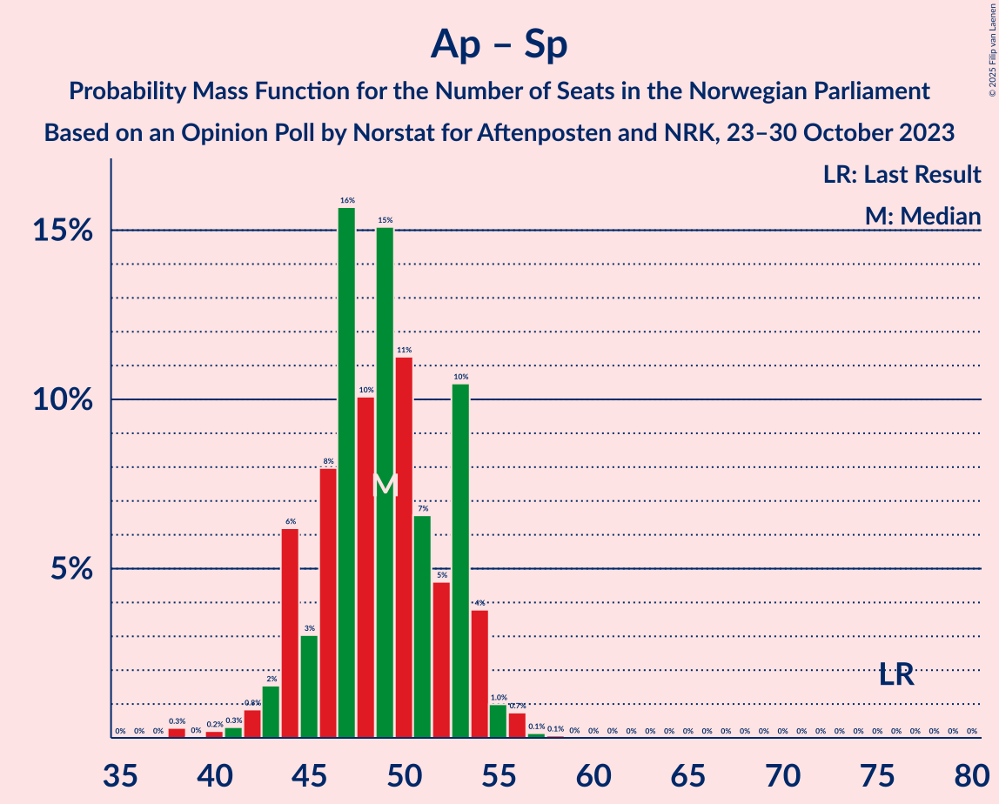

| Number of Seats | Probability | Accumulated | Special Marks |
|:---------------:|:-----------:|:-----------:|:-------------:|
| 38 | 0.3% | 100% |  |
| 39 | 0% | 99.7% |  |
| 40 | 0.2% | 99.7% |  |
| 41 | 0.3% | 99.5% |  |
| 42 | 0.8% | 99.2% |  |
| 43 | 2% | 98% |  |
| 44 | 6% | 97% |  |
| 45 | 3% | 91% |  |
| 46 | 8% | 88% |  |
| 47 | 16% | 80% |  |
| 48 | 10% | 64% | Median |
| 49 | 15% | 54% |  |
| 50 | 11% | 39% |  |
| 51 | 7% | 27% |  |
| 52 | 5% | 21% |  |
| 53 | 10% | 16% |  |
| 54 | 4% | 6% |  |
| 55 | 1.0% | 2% |  |
| 56 | 0.7% | 1.0% |  |
| 57 | 0.1% | 0.2% |  |
| 58 | 0.1% | 0.1% |  |
| 59 | 0% | 0% |  |
| 60 | 0% | 0% |  |
| 61 | 0% | 0% |  |
| 62 | 0% | 0% |  |
| 63 | 0% | 0% |  |
| 64 | 0% | 0% |  |
| 65 | 0% | 0% |  |
| 66 | 0% | 0% |  |
| 67 | 0% | 0% |  |
| 68 | 0% | 0% |  |
| 69 | 0% | 0% |  |
| 70 | 0% | 0% |  |
| 71 | 0% | 0% |  |
| 72 | 0% | 0% |  |
| 73 | 0% | 0% |  |
| 74 | 0% | 0% |  |
| 75 | 0% | 0% |  |
| 76 | 0% | 0% | Last Result |

### Venstre – Senterpartiet – Kristelig Folkeparti

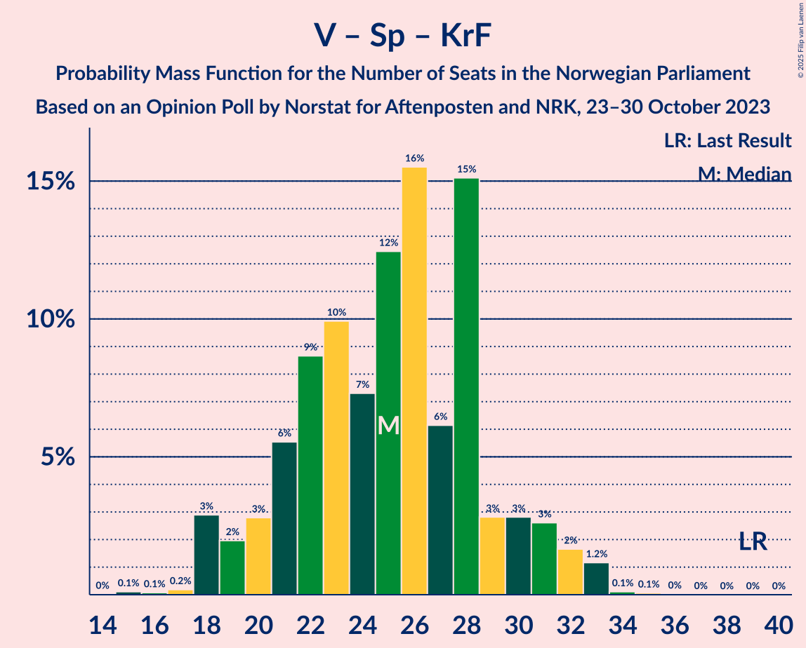

| Number of Seats | Probability | Accumulated | Special Marks |
|:---------------:|:-----------:|:-----------:|:-------------:|
| 15 | 0.1% | 100% |  |
| 16 | 0.1% | 99.9% |  |
| 17 | 0.2% | 99.8% |  |
| 18 | 3% | 99.6% |  |
| 19 | 2% | 97% |  |
| 20 | 3% | 95% |  |
| 21 | 6% | 92% |  |
| 22 | 9% | 86% |  |
| 23 | 10% | 78% |  |
| 24 | 7% | 68% |  |
| 25 | 12% | 61% | Median |
| 26 | 16% | 48% |  |
| 27 | 6% | 33% |  |
| 28 | 15% | 26% |  |
| 29 | 3% | 11% |  |
| 30 | 3% | 8% |  |
| 31 | 3% | 6% |  |
| 32 | 2% | 3% |  |
| 33 | 1.2% | 1.4% |  |
| 34 | 0.1% | 0.2% |  |
| 35 | 0.1% | 0.1% |  |
| 36 | 0% | 0% |  |
| 37 | 0% | 0% |  |
| 38 | 0% | 0% |  |
| 39 | 0% | 0% | Last Result |

## Technical Information

### Opinion Poll

+ **Polling firm:** Norstat
+ **Commissioner(s):** Aftenposten and NRK
+ **Fieldwork period:** 23–30 October 2023

### Calculations

+ **Sample size:** 994
+ **Simulations done:** 1,048,576
+ **Error estimate:** 1.10%

